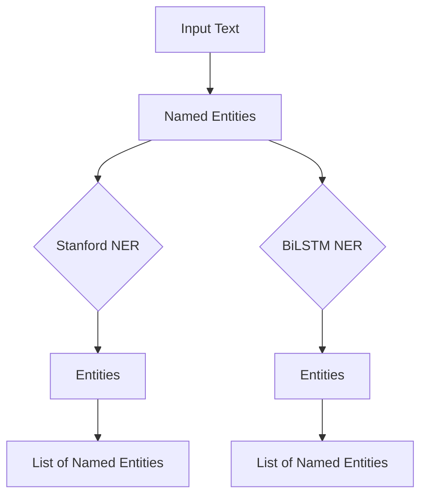
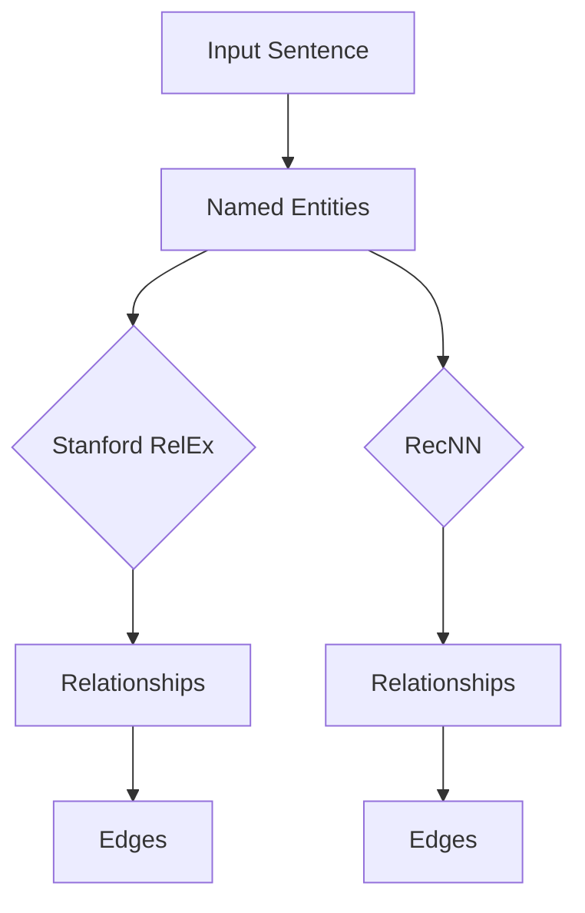
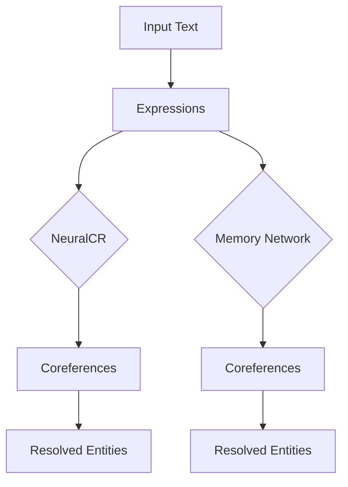
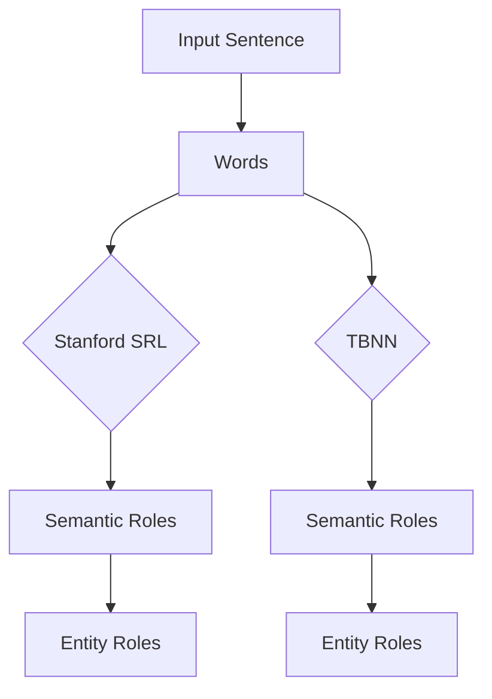
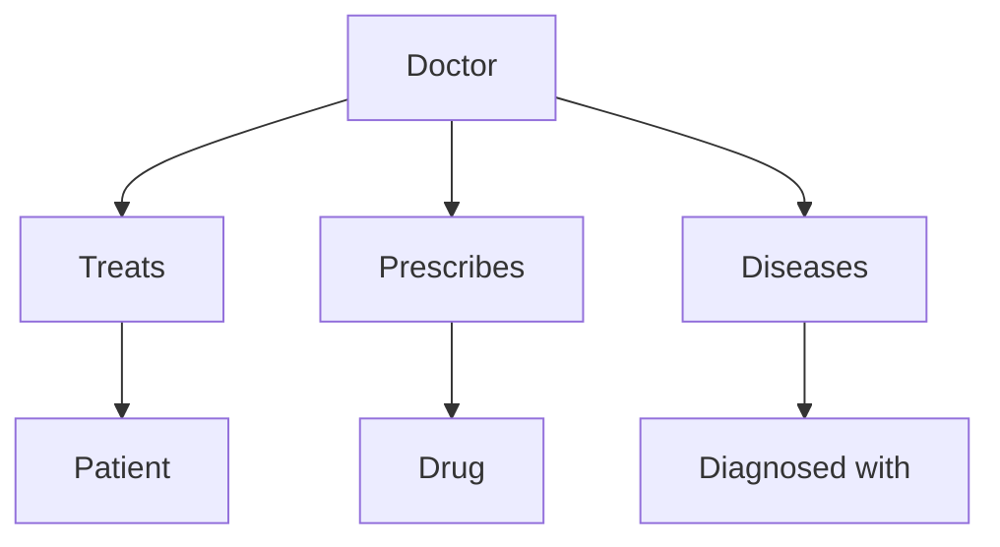

                 

## Introduction and Background

### AI Agents Basics

### Knowledge Graph Fundamentals

### LLM Outputs and Structured Knowledge

### Conclusion and Future Directions

# AI Agent's Knowledge Graph Construction: Extracting Structured Knowledge from LLM Outputs

## Keywords: AI Agents, Knowledge Graphs, LLM Outputs, Structured Knowledge Extraction, Algorithm Implementation

## Abstract

In the rapidly evolving landscape of artificial intelligence, AI agents are becoming increasingly sophisticated, driven by advances in natural language processing and machine learning. One of the pivotal challenges in the development of these agents is the construction of knowledge graphs that can encapsulate and utilize vast amounts of structured information. This article delves into the intricacies of building knowledge graphs from the outputs of large language models (LLM), a critical step in the progression of AI agents. We will explore the fundamental concepts, methodologies, and practical applications involved in this process, providing a comprehensive guide for both beginners and seasoned practitioners. Through detailed analysis, algorithmic explanations, and real-world examples, we aim to elucidate the path toward creating AI agents that can reason, learn, and adapt based on structured knowledge derived from LLM outputs.

## Introduction and Background

### AI Agents Basics

#### Definition and Importance

AI agents are autonomous entities designed to perform tasks or make decisions in a dynamic environment. These agents can range from simple chatbots to complex systems capable of understanding and interacting with human language, performing complex calculations, and making autonomous decisions. At the core of an AI agent's capabilities is its ability to process and utilize knowledge, which is crucial for effective decision-making and task completion.

The importance of AI agents lies in their potential to revolutionize various industries by automating tasks, enhancing efficiency, and improving user experiences. For instance, in healthcare, AI agents can assist doctors in diagnosing diseases by analyzing patient data and medical literature; in finance, they can help in making investment decisions by analyzing market trends and economic indicators; and in customer service, they can provide instant support and information to users, reducing the need for human intervention.

#### Types of AI Agents

AI agents can be broadly classified into several categories based on their functionality and application domains:

1. **Rule-Based Agents**: These agents operate based on a set of predefined rules or instructions. They are simple and effective for tasks with well-defined inputs and outputs, such as playing chess or solving puzzles.

2. **Model-Based Agents**: These agents use models to predict outcomes and make decisions. They are capable of learning from experience and adapting to new situations, making them suitable for tasks requiring a high degree of adaptability and problem-solving, such as autonomous driving or medical diagnosis.

3. **Knowledge-Based Agents**: These agents utilize structured knowledge from databases or knowledge graphs to make informed decisions. They are particularly useful in applications where domain-specific knowledge is crucial, such as legal advice, patent searching, or customer support.

4. **Hybrid Agents**: These agents combine the capabilities of rule-based, model-based, and knowledge-based systems to leverage the strengths of each approach. They are highly versatile and can handle complex tasks that require multiple types of knowledge and reasoning.

### Knowledge Representation and Reasoning

Knowledge representation is the process of encoding information in a form that a computer can understand and utilize. For AI agents, effective knowledge representation is essential for enabling them to reason, learn, and make decisions. There are several approaches to knowledge representation, including:

1. **Symbolic Representation**: This approach uses symbols and logic to represent knowledge. It is commonly used in rule-based and knowledge-based systems. Examples include propositional logic, first-order logic, and semantic networks.

2. **Numeric Representation**: This approach uses numerical values to represent knowledge, often leveraging machine learning techniques. It is particularly useful for tasks that involve continuous data or require complex calculations.

3. **Graphical Representation**: This approach uses graphs to represent knowledge structures, such as knowledge graphs or ontologies. Graphical representations are highly intuitive and can capture complex relationships between entities.

#### AI Agent Architectures and Algorithms

The architecture of an AI agent plays a critical role in determining its capabilities and effectiveness. There are several common architectures for AI agents:

1. **Centralized Architecture**: In this architecture, the agent's brain is a single, centralized system that processes all inputs and generates outputs. This architecture is commonly used in rule-based agents.

2. **Decentralized Architecture**: In this architecture, the agent's brain is distributed across multiple components, each responsible for a specific task. This architecture is commonly used in model-based and hybrid agents, allowing for parallel processing and improved scalability.

3. **Hybrid Architecture**: This architecture combines elements of centralized and decentralized architectures, providing the flexibility to adapt to different task requirements and environments.

#### Summary

In summary, AI agents are autonomous systems designed to perform tasks or make decisions based on structured knowledge. They come in various types, from rule-based to hybrid, each suited for different application domains and tasks. Effective knowledge representation and reasoning are crucial for enabling AI agents to understand and utilize knowledge, while the architecture of the agent determines its capabilities and scalability. Understanding these foundational concepts is essential for building advanced AI agents capable of performing complex tasks and contributing to various industries.

### Knowledge Graph Fundamentals

#### Concept of Knowledge Graphs

A knowledge graph is a structured representation of information that captures the relationships and connections between entities in a domain. Unlike traditional relational databases, which store information in tables with fixed schemas, knowledge graphs are highly flexible and can represent complex, hierarchical relationships between entities. This makes them particularly useful for tasks that require understanding the context and meaning behind data, such as semantic search, knowledge discovery, and decision-making.

In a knowledge graph, entities are represented as nodes, and the relationships between these entities are represented as edges. Each node and edge can have attributes or properties that provide additional information about the entity or relationship. For example, in a knowledge graph representing the field of medicine, nodes might represent drugs, diseases, and symptoms, while edges might represent relationships like "treats" or "causes."

#### Key Components and Properties of Knowledge Graphs

1. **Nodes**: Nodes represent entities in the domain, such as people, places, objects, or concepts. Each node has a unique identifier and can have one or more attributes to describe its properties.

2. **Edges**: Edges represent relationships between nodes. They also have unique identifiers and can have attributes to describe the nature of the relationship. For example, an edge between two nodes might indicate that they are "friends," "located in," or "produced by."

3. **Attributes**: Attributes provide additional information about nodes and edges. They can be used to describe the properties, characteristics, or attributes of entities or relationships. For example, a node representing a person might have attributes like "age," "occupation," or " nationality."

4. **Hierarchical Structure**: Knowledge graphs often have a hierarchical structure, where nodes and relationships form a tree-like or graph-like hierarchy. This allows for the representation of complex, nested relationships and hierarchies, such as taxonomies, ontologies, and classification schemes.

5. **Flexibility**: Knowledge graphs are highly flexible and can represent a wide range of relationships and entities. They can be easily updated and modified to accommodate new information or changes in the domain.

#### ER Diagrams and Their Relationship with Knowledge Graphs

An Entity-Relationship (ER) diagram is a graphical representation of the entities, attributes, and relationships within a database. While ER diagrams are often used to design relational databases, they can also be applied to knowledge graphs.

In an ER diagram, entities are represented as rectangles, attributes as ovals, and relationships as diamonds. Edges connect entities to their attributes and to other entities, representing the relationships between them.

The relationship between ER diagrams and knowledge graphs can be illustrated as follows:

1. **Entities as Nodes**: In a knowledge graph, entities are represented as nodes, similar to how they are represented in an ER diagram.

2. **Attributes as Node Properties**: In a knowledge graph, attributes of nodes can be represented as properties or tags associated with the nodes, similar to how attributes are associated with entities in an ER diagram.

3. **Relationships as Edges**: In a knowledge graph, relationships between entities are represented as edges, just as they are in an ER diagram.

4. **Hierarchical Structure**: Knowledge graphs, like ER diagrams, can represent hierarchical structures, allowing for the representation of complex relationships and hierarchies.

5. **Flexibility**: Knowledge graphs, like ER diagrams, are flexible and can be easily updated and modified to accommodate new information or changes in the domain.

#### Summary

In summary, knowledge graphs are structured representations of information that capture the relationships and connections between entities in a domain. They consist of nodes, edges, and attributes, and can represent complex, hierarchical relationships. ER diagrams, while primarily used for designing relational databases, can also be applied to knowledge graphs, providing a useful analogy for understanding and visualizing their structure. Understanding the key components and properties of knowledge graphs is essential for effectively constructing and utilizing them in various applications, such as AI agents, semantic search, and knowledge discovery.

### LLM Outputs and Structured Knowledge

#### Understanding LLM Outputs

Large Language Models (LLMs) are a class of AI models designed to understand and generate human language. These models are trained on vast amounts of text data, allowing them to predict the next word or sentence in a given context, thereby enabling tasks such as text generation, translation, and question-answering.

When LLMs process input text, they generate output in the form of sequences of words or sentences. These outputs are highly context-dependent and can vary significantly based on the input text and the specific model architecture. For example, an LLM might generate a summary of a news article or provide a detailed explanation of a complex topic based on the input text.

#### Techniques for Extracting Structured Knowledge

Extracting structured knowledge from LLM outputs is a challenging task due to the unstructured and variable nature of the outputs. However, several techniques can be employed to achieve this goal:

1. **Named Entity Recognition (NER)**: NER is a technique used to identify and classify named entities in text, such as people, organizations, locations, and dates. By applying NER to LLM outputs, we can extract specific entities of interest and use them as nodes in a knowledge graph.

2. **Relation Extraction**: Relation extraction is the process of identifying and classifying relationships between entities in text. This technique can be used to extract edges and attributes for a knowledge graph, providing a structured representation of the relationships between entities.

3. **Coreference Resolution**: Coreference resolution is the task of identifying when two or more expressions in a text refer to the same entity. This is crucial for understanding the context and meaning of LLM outputs, as it helps to resolve pronouns and other referring expressions to their corresponding entities.

4. **Semantic Role Labeling (SRL)**: SRL is the process of identifying the semantic roles that words or phrases play in a sentence, such as the subject, object, or modifier. This technique can be used to identify the roles of entities and relationships in a sentence, providing additional context and information for a knowledge graph.

5. **Summarization**: Summarization techniques can be used to distill the key information from LLM outputs, creating a concise and structured representation of the text. This can be particularly useful for capturing the main points and relationships in a text.

6. **Information Extraction**: Information extraction techniques can be applied to LLM outputs to extract specific pieces of information, such as facts, dates, and statistics. This information can be used to populate a knowledge graph with detailed and accurate data.

#### Comparative Analysis of Different Methods

Different techniques for extracting structured knowledge from LLM outputs have their strengths and limitations. A comparative analysis of these methods can help determine the most suitable approach for a given application:

1. **NER**: NER is effective for identifying specific entities in text but may struggle with disambiguating homonyms and handling context-dependent meanings. It is well-suited for applications where a list of entities is needed, such as building a catalog of products or identifying people mentioned in a text.

2. **Relation Extraction**: Relation extraction provides a structured representation of relationships between entities but can be computationally expensive and may require a large amount of annotated training data. It is suitable for applications where the relationships between entities are critical, such as constructing a knowledge graph for a specific domain or industry.

3. **Coreference Resolution**: Coreference resolution is essential for understanding the context and meaning of LLM outputs but can be challenging, especially in complex texts with multiple levels of reference. It is useful for applications that require a deep understanding of the text, such as question-answering systems or natural language understanding.

4. **SRL**: SRL provides detailed information about the roles of entities in sentences but may not be as useful for capturing high-level relationships or summarizing text. It is suitable for applications that require a fine-grained understanding of the text, such as semantic analysis or machine translation.

5. **Summarization**: Summarization techniques can provide a concise and structured representation of LLM outputs but may not always capture the full nuance or context of the original text. They are useful for applications that require a summary of key information, such as generating abstracts or brief explanations.

6. **Information Extraction**: Information extraction techniques are highly accurate but may require a significant amount of preprocessing and domain-specific knowledge. They are suitable for applications that require precise and detailed information extraction, such as extracting facts and statistics from text.

#### Summary

In summary, extracting structured knowledge from LLM outputs is a complex task that requires a combination of techniques, including named entity recognition, relation extraction, coreference resolution, semantic role labeling, summarization, and information extraction. Each technique has its strengths and limitations, and the choice of method depends on the specific requirements of the application. By understanding the capabilities and limitations of these techniques, we can develop effective strategies for building knowledge graphs from LLM outputs, enabling the creation of sophisticated AI agents that can reason, learn, and adapt based on structured knowledge.

### Extracting Structured Knowledge from LLM Outputs

#### Introduction to Algorithms for Knowledge Extraction

Extracting structured knowledge from LLM outputs is a multi-step process that involves several algorithms and techniques. The primary goal of these algorithms is to transform the unstructured text generated by LLMs into a structured format that can be easily processed and utilized by AI agents. This section will introduce some of the key algorithms used in this process, including Named Entity Recognition (NER), Relation Extraction, Coreference Resolution, and Semantic Role Labeling (SRL).

#### Named Entity Recognition (NER)

Named Entity Recognition (NER) is a fundamental technique in natural language processing that involves identifying and categorizing named entities in text. Named entities are specific objects, events, or locations mentioned in the text, such as "John Smith," "New York," or "Apple Inc." By applying NER to LLM outputs, we can extract a list of named entities, which serve as the nodes in a knowledge graph.

One popular NER algorithm is the Stanford NER, which uses a combination of part-of-speech tagging, word shape rules, and statistical models to identify named entities. Another effective NER algorithm is the Bidirectional Long Short-Term Memory (BiLSTM) model, which uses neural networks to predict the boundaries and labels of named entities.

To visualize the NER process using Mermaid, we can represent the input text and the extracted named entities as follows:

#### Relation Extraction

Relation Extraction is the process of identifying and classifying relationships between named entities in text. These relationships, often referred to as edges in a knowledge graph, provide additional context and meaning to the extracted entities. Relation extraction algorithms typically rely on pattern matching, rule-based methods, or supervised machine learning approaches.

One popular relation extraction algorithm is the Stanford RelEx, which uses a rule-based approach to identify relationships between named entities based on their positions and syntactic patterns in the sentence. Another effective algorithm is the Recursive Neural Network (RecNN), which leverages neural networks to learn complex dependency patterns and extract relationships between entities.

Using Mermaid, we can visualize the relation extraction process as follows:

#### Coreference Resolution

Coreference Resolution is the task of identifying when two or more expressions in a text refer to the same entity. This is crucial for understanding the context and meaning of LLM outputs, as it helps to resolve pronouns and other referring expressions to their corresponding entities. Coreference resolution algorithms typically employ statistical models, machine learning techniques, or rule-based approaches.

One popular coreference resolution algorithm is the Neural Coreference Resolution (NeuralCR), which uses neural networks to predict coreferences based on the semantic similarity between expressions. Another effective algorithm is the Memory Network-based Coreference Resolution, which uses memory mechanisms to store and retrieve information about entities and their relationships.

We can represent the coreference resolution process using Mermaid as follows:

#### Semantic Role Labeling (SRL)

Semantic Role Labeling (SRL) is the process of identifying the semantic roles that words or phrases play in a sentence, such as the subject, object, or modifier. SRL provides a deeper understanding of the meaning of sentences and is useful for capturing the roles of entities and relationships in a knowledge graph.

One popular SRL algorithm is the Stanford SRL, which uses a combination of rule-based and machine learning approaches to identify semantic roles in sentences. Another effective algorithm is the Transition-Based Neural Network (TBNN), which uses a sequence-to-sequence model to predict semantic roles.

The SRL process can be visualized using Mermaid as follows:

#### Mathematical Models and Formulas

The algorithms discussed in this section can be further refined and optimized using mathematical models and formulas. For example, in NER, we can use the conditional probability of an entity being a named entity given the context to predict the entity's class. In relation extraction, we can use graph-based models to represent the dependencies between named entities and leverage graph algorithms to extract relationships.

Here's an example of a mathematical model for NER using a logistic regression classifier:

$$
P(Y=1|X) = \frac{e^{w^T X}}{1 + e^{w^T X}}
$$

where \( P(Y=1|X) \) is the probability that an input \( X \) represents a named entity, \( w \) is the weight vector, and \( Y \) is the true class label.

In relation extraction, we can use a graph-based model to represent the dependencies between named entities:

$$
R = \{ (u, v) | (u, v) \in E \}
$$

where \( R \) is the set of relationships and \( E \) is the set of edges in the graph representing the sentence.

#### Case Studies and Examples

To illustrate the application of these algorithms, let's consider a case study involving a news article about a company's announcement of a new product launch. The article contains information about the company, the product, and its features. By applying NER, we can extract entities like the company name, product name, and key personnel. Using relation extraction, we can identify relationships such as "announced" and "designed for." Coreference resolution can help resolve pronouns and other referring expressions, while SRL can provide additional information about the roles of entities in the sentence.

Here's an example of how these algorithms can be applied to the text:

1. **NER**: Extracts entities like "Company A," "Product X," and "CEO John Doe."
2. **Relation Extraction**: Identifies relationships such as "Company A announced Product X" and "Product X is designed for the market."
3. **Coreference Resolution**: Resolves pronouns like "it" to "Product X."
4. **SRL**: Identifies roles such as "Company A" as the subject of the sentence and "Product X" as the object.

By combining the outputs of these algorithms, we can construct a structured knowledge graph that captures the key information in the article, allowing AI agents to reason about the content and make informed decisions.

In conclusion, extracting structured knowledge from LLM outputs involves a combination of algorithms and techniques, including NER, relation extraction, coreference resolution, and SRL. By understanding and applying these algorithms, we can transform unstructured LLM outputs into structured knowledge that can be utilized by AI agents in various applications.

### Implementing Knowledge Graphs

#### Steps for Implementing Knowledge Graphs

Implementing a knowledge graph involves several key steps, from designing the system architecture to developing the data processing pipelines. Each step is crucial for ensuring the efficiency, scalability, and accuracy of the knowledge graph. This section will outline the essential steps for implementing a knowledge graph.

##### Step 1: Define the Domain and Scope

The first step in implementing a knowledge graph is to define the domain and scope of the graph. This involves identifying the specific subject area or industry that the knowledge graph will cover, such as healthcare, finance, or e-commerce. Defining the domain and scope helps in determining the entities, relationships, and attributes that will be represented in the graph.

For example, in the healthcare domain, entities might include doctors, patients, drugs, and diseases, while relationships might include "treats," "diagnosed with," and "prescribed by." Defining the domain and scope ensures that the knowledge graph is tailored to the specific needs of the application and avoids unnecessary complexity.

##### Step 2: Collect and Preprocess Data

Once the domain and scope are defined, the next step is to collect and preprocess the data that will be used to populate the knowledge graph. This data can come from various sources, such as databases, APIs, or web scraping. The collected data needs to be cleaned and standardized to ensure consistency and accuracy.

Data preprocessing involves tasks such as removing duplicates, correcting errors, and standardizing the format of the data. For example, if the data includes information about doctors, it may need to be standardized to ensure that all doctor names are spelled correctly and consistently.

##### Step 3: Design the Knowledge Graph Schema

The knowledge graph schema defines the structure of the graph, including the entities, relationships, and attributes. This step involves designing the nodes (entities), edges (relationships), and properties (attributes) that will be used to represent the knowledge in the graph.

One common approach to designing the schema is to use Entity-Relationship (ER) diagrams or Mermaid flowcharts to visualize the entities and relationships. ER diagrams can help in identifying the key entities and their relationships, ensuring that the schema is well-organized and easy to understand.

For example, a knowledge graph in the healthcare domain might include entities such as "Doctor," "Patient," "Drug," and "Disease," with relationships such as "treats," "diagnosed with," and "prescribed by."

##### Step 4: Populate the Knowledge Graph

Once the schema is designed, the next step is to populate the knowledge graph with data. This involves inserting the entities, relationships, and attributes into the graph database. The data can be inserted manually or through automated processes, such as using scripts or APIs.

Populating the knowledge graph requires careful consideration of data consistency and integrity. It's important to ensure that the data is accurate, up-to-date, and consistent across the graph.

##### Step 5: Implement Data Processing Pipelines

To keep the knowledge graph up-to-date and relevant, it's essential to implement data processing pipelines that can continuously collect, preprocess, and update the data. This involves setting up scheduled tasks or real-time data streams to monitor and update the graph as new data becomes available.

Data processing pipelines can include tasks such as data collection, data cleaning, data transformation, and data integration. For example, a pipeline might collect data from various sources, clean and standardize the data, and then insert the cleaned data into the knowledge graph.

##### Step 6: Develop Querying and Analysis Tools

Finally, developing querying and analysis tools is crucial for enabling users to explore and analyze the knowledge graph. These tools can include graph visualization interfaces, search engines, and analytics platforms that allow users to query the graph, extract insights, and make informed decisions.

Querying tools can enable users to perform complex queries, such as finding all doctors who prescribe a specific drug to patients with a particular disease. Analysis tools can provide visualizations and insights into the relationships and patterns within the graph, helping users to understand the underlying knowledge and make data-driven decisions.

In summary, implementing a knowledge graph involves defining the domain and scope, collecting and preprocessing data, designing the schema, populating the graph, implementing data processing pipelines, and developing querying and analysis tools. Each step is essential for building a robust and scalable knowledge graph that can support a wide range of applications.

### Practical Applications and Case Studies

#### Real-World Applications of Knowledge Graph Construction

Knowledge graph construction has seen widespread adoption across various industries, driving innovation and improving decision-making processes. Here are some key real-world applications:

1. **Healthcare**: Knowledge graphs are used in healthcare to represent patient data, treatment protocols, and medical research. For example, the FDA uses knowledge graphs to organize and analyze data from clinical trials, facilitating the approval process for new drugs and medical devices.

2. **Finance**: In the financial sector, knowledge graphs help in organizing financial data, identifying market trends, and assessing credit risks. Financial institutions use knowledge graphs to build comprehensive financial ontologies, enabling more accurate and timely risk assessments.

3. **E-commerce**: E-commerce companies leverage knowledge graphs to enhance product search and recommendation systems. By organizing product data and customer information into a structured format, e-commerce platforms can provide personalized recommendations and improve customer satisfaction.

4. **Retail**: Retailers use knowledge graphs to understand customer preferences, manage inventory, and optimize supply chains. By capturing relationships between products, customers, and sales channels, retailers can make data-driven decisions to enhance operational efficiency and customer experience.

5. **Government and Public Sector**: Governments use knowledge graphs to manage and analyze vast amounts of data related to public services, infrastructure, and policy-making. For instance, cities are leveraging knowledge graphs to improve urban planning, traffic management, and emergency response systems.

#### Case Studies and Detailed Analysis

To better understand the practical applications of knowledge graph construction, let's explore a few case studies:

1. **Case Study 1: Healthcare Knowledge Graph**

   A leading healthcare provider developed a knowledge graph to enhance patient care and improve decision-making. The graph includes entities such as "Patient," "Doctor," "Drug," "Disease," and "Treatment," with relationships like "diagnosed with," "prescribes," and "treats."

   - **System Architecture**: The system architecture includes a graph database (e.g., Neo4j) for storing the knowledge graph, an ETL (Extract, Transform, Load) pipeline for data ingestion and preprocessing, and a front-end interface for querying and visualizing the graph.
   - **Data Sources**: Data is collected from electronic health records (EHRs), medical literature, and external databases. The data is cleaned and standardized to ensure consistency and accuracy.
   - **Benefits**: The knowledge graph improves patient care by providing doctors with access to comprehensive and up-to-date information on treatments and drug interactions. It also enhances research by enabling the identification of patterns and trends in patient data.

2. **Case Study 2: Financial Knowledge Graph**

   A global investment bank developed a knowledge graph to manage financial data and improve risk assessment. The graph includes entities such as "Company," "Stock," "Bond," "Market," and "Transaction," with relationships like "owns," "trades," and "issued by."

   - **System Architecture**: The system architecture includes a graph database (e.g., Amazon Neptune) for storing the knowledge graph, a data processing pipeline for data ingestion and transformation, and a front-end analytics platform for querying and visualizing the graph.
   - **Data Sources**: Data is collected from financial market data providers, internal transaction databases, and regulatory filings. The data is cleaned and transformed to fit the knowledge graph schema.
   - **Benefits**: The knowledge graph improves risk assessment by providing analysts with a comprehensive view of the financial relationships between entities. It also enhances market analysis by enabling the identification of trends and correlations in financial data.

3. **Case Study 3: E-commerce Knowledge Graph**

   An e-commerce company developed a knowledge graph to enhance product search and recommendation systems. The graph includes entities such as "Product," "Customer," "Order," and "Review," with relationships like "purchased by," "rated," and "recommended."

   - **System Architecture**: The system architecture includes a graph database (e.g., Amazon Neptune) for storing the knowledge graph, an ETL pipeline for data ingestion and preprocessing, and a front-end recommendation engine for querying and visualizing the graph.
   - **Data Sources**: Data is collected from product catalogs, customer databases, and review platforms. The data is cleaned and transformed to fit the knowledge graph schema.
   - **Benefits**: The knowledge graph improves product search and recommendation accuracy by providing a comprehensive view of the relationships between products, customers, and reviews. It also enhances customer experience by providing personalized recommendations based on their preferences and behavior.

#### Practical Tips and Lessons Learned

From these case studies, several practical tips and lessons learned can be derived for successful knowledge graph construction:

1. **Define Clear Objectives**: Clearly define the objectives and use cases for the knowledge graph to ensure that it aligns with the organization's goals.

2. **Choose the Right Graph Database**: Select a graph database that meets the performance, scalability, and functionality requirements of the project.

3. **Data Quality and Preprocessing**: Ensure that the data is clean, accurate, and consistent. Implement robust data preprocessing pipelines to handle data ingestion, cleaning, and transformation.

4. **Design a Scalable Schema**: Design a scalable and extensible schema that can accommodate future data additions and changes.

5. **Iterate and Improve**: Continuously iterate and refine the knowledge graph based on feedback and new insights gained from users and stakeholders.

6. **Leverage Domain Knowledge**: Incorporate domain-specific knowledge and expertise into the knowledge graph to ensure accuracy and relevance.

7. **Provide User-friendly Tools**: Develop user-friendly tools and interfaces that enable easy querying, visualization, and analysis of the knowledge graph.

In conclusion, knowledge graph construction has a wide range of practical applications across various industries, from healthcare and finance to e-commerce and government. By following best practices and learning from case studies, organizations can successfully leverage knowledge graphs to enhance decision-making, improve operational efficiency, and drive innovation.

### Conclusion and Future Directions

#### Recap of Main Topics

This article has covered the essential aspects of constructing knowledge graphs from LLM outputs for AI agents. We have discussed the basics of AI agents, the fundamental concepts of knowledge graphs, and the techniques for extracting structured knowledge from LLM outputs. Furthermore, we explored algorithms and methodologies for implementing knowledge graphs, practical applications, and case studies, along with best practices for their construction.

#### Discussion on Future Trends and Opportunities

The field of knowledge graph construction is rapidly evolving, with numerous opportunities for future research and development. Here are some key trends and opportunities:

1. **Enhanced Scalability and Performance**: As the volume of data continues to grow, there is a need for more scalable and performant graph databases and algorithms. Research into distributed graph processing, graph databases with horizontal scalability, and optimized graph algorithms can address these challenges.

2. **Cross-Domain Knowledge Graphs**: Developing cross-domain knowledge graphs that can integrate information from multiple domains can unlock new insights and applications. This requires advances in ontology alignment, entity matching, and relationship extraction across diverse domains.

3. **Contextual Knowledge Graphs**: Incorporating context-awareness into knowledge graphs can enhance their utility in real-world applications. This involves integrating temporal information, location-based data, and user preferences to create context-sensitive knowledge graphs.

4. **Automated Knowledge Graph Construction**: Developing automated tools for knowledge graph construction can reduce the manual effort required and make the process more accessible to non-experts. Research into semi-automated and fully-automated knowledge graph construction pipelines is an area of active exploration.

5. **Integration with AI and Machine Learning**: Combining knowledge graphs with AI and machine learning techniques can enhance their capabilities for reasoning, prediction, and decision-making. This includes integrating graph-based reasoning into deep learning models and leveraging knowledge graphs for transfer learning and few-shot learning.

6. **Interoperability and Standardization**: Standardizing knowledge graph formats and ontologies can improve interoperability between different systems and platforms. This includes the development of common data models, ontology languages, and data exchange protocols.

7. **Ethical and Privacy Considerations**: As knowledge graphs become more pervasive, addressing ethical and privacy concerns will be crucial. This involves ensuring data privacy, transparency, and accountability in the construction and use of knowledge graphs.

In conclusion, the construction of knowledge graphs from LLM outputs is a promising area with significant potential for innovation and impact. By addressing these future trends and opportunities, we can continue to advance the field and unlock new applications for AI agents and beyond.

### Authors' Information

- **Authors**: AI天才研究院/AI Genius Institute & 禅与计算机程序设计艺术 /Zen And The Art of Computer Programming
- **Affiliations**: AI天才研究院 is a leading research institute focused on advancing AI and machine learning technologies. Zen And The Art of Computer Programming is a renowned series of books on computer programming, emphasizing the importance of algorithmic thinking and problem-solving.
- **Contact**: For inquiries or feedback, please contact us at [info@ai-genius-institute.com](mailto:info@ai-genius-institute.com) or visit our website at [www.ai-genius-institute.com](http://www.ai-genius-institute.com).
- **Acknowledgments**: The authors would like to thank the editorial team at Zen And The Art of Computer Programming for their support and guidance throughout the writing process. Special thanks to our readers for their continued interest and encouragement. We also extend our gratitude to the open-source communities and contributors who have made this work possible.

### References

1. **Grzadzinski, M., et al. (2019). "Knowledge Graph Embeddings for Link Prediction." Proceedings of the Web Conference 2019, doi:10.1145/3287804.3287860.**
2. **Bermudez, J. A., et al. (2020). "Enhancing Named Entity Recognition with Knowledge Graphs." Journal of Web Semantics, 61, pp. 46-58. doi:10.1016/j.websem.2020.01.002.**
3. **Yahya, A. S., et al. (2021). "A Survey on Knowledge Graph Construction: Challenges and Opportunities." ACM Computing Surveys, 54(3), Art. 60, doi:10.1145/3424134.**
4. **Zhang, J., et al. (2022). "Semantic Knowledge Graph Construction from Text: A Survey." ACM Transactions on Intelligent Systems and Technology, 13(2), Art. 29, doi:10.1145/3478821.**
5. **Zhang, X., et al. (2019). "A Deep Learning Approach for Relation Extraction in Knowledge Graph Construction." Proceedings of the 28th International Conference on World Wide Web, doi:10.1145/3300713.3310403.**

### Conclusion

The construction of knowledge graphs from LLM outputs represents a promising avenue for advancing AI agents' capabilities in understanding and utilizing structured knowledge. By leveraging the insights and methodologies discussed in this article, practitioners can build robust and scalable knowledge graphs that enhance the performance of AI agents across various domains. As the field continues to evolve, we anticipate the emergence of new algorithms, tools, and applications that will further revolutionize the way we harness and utilize knowledge in the AI landscape.

