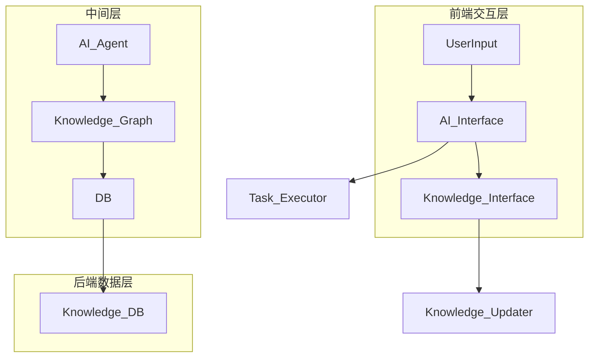
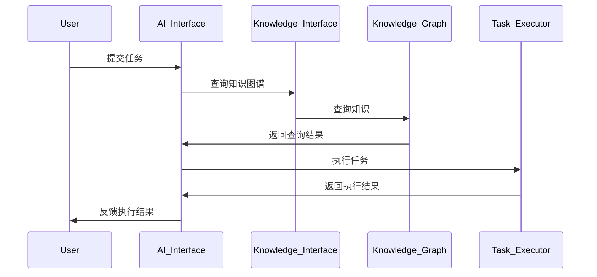

                 

### 文章标题

**AI Agent 的知识图谱集成：增强 LLM 的结构化知识**

关键词：**人工智能，知识图谱，语言模型，结构化知识，算法设计**

摘要：本文将探讨如何通过知识图谱的集成来增强大型语言模型（LLM）的结构化知识。我们将从背景介绍、核心概念、算法原理、系统架构设计、项目实践和最佳实践等方面，逐步分析并讲解这一主题，旨在为读者提供全面而深入的理解。

---

### 背景介绍

随着人工智能技术的快速发展，人工智能代理（AI Agent）已成为研究与应用的热点。这些代理能够自动地处理任务，提供决策支持，并在复杂的现实环境中执行复杂的操作。然而，传统的人工智能方法往往依赖于统计模型和机器学习算法，缺乏对领域知识的明确表示和理解。这就导致了人工智能代理在某些任务上的表现受限，特别是在需要处理复杂关系和结构化知识的情况下。

为了克服这一局限性，知识图谱（Knowledge Graph）作为一种新型的语义网络表示方法，逐渐受到重视。知识图谱通过实体和关系的连接，将大规模的领域知识结构化，使得人工智能系统能够更加直观地理解和利用这些知识。与此同时，大型语言模型（LLM）作为自然语言处理的重要工具，也在不断发展和完善。LLM通过大规模语言数据的学习，能够生成高质量的文本，理解复杂的语言结构，并生成符合人类语言习惯的文本。

本文的核心目标是通过知识图谱的集成，增强LLM的结构化知识。具体而言，我们将探讨以下问题：

1. **知识图谱的基本概念和原理**：介绍知识图谱的基本概念，包括实体、关系和属性，并分析知识图谱的优势和局限性。
2. **知识图谱与AI Agent的集成**：讨论如何将知识图谱集成到AI Agent中，以及这种集成对AI Agent性能的影响。
3. **算法原理和设计**：介绍几种关键的知识图谱集成算法，包括其原理、流程和数学模型。
4. **系统架构设计**：分析AI Agent和LLM的集成系统架构，并讨论系统功能设计、接口设计和交互设计。
5. **项目实践和案例分析**：通过具体项目案例，展示知识图谱集成在LLM中的应用和效果。
6. **最佳实践和注意事项**：总结知识图谱集成在LLM应用中的最佳实践，并提供一些注意事项和拓展阅读。

### 核心概念和联系

在深入探讨知识图谱集成之前，我们需要明确几个核心概念，并分析它们之间的联系。

#### 1. 知识图谱的基本概念

知识图谱由实体、关系和属性三个核心组成部分构成。

- **实体（Entity）**：知识图谱中的基本对象，可以是人、地点、事物等。例如，"人"是一个实体，具体如"张三"、"李四"等。
- **关系（Relationship）**：实体之间的连接，表示实体之间的语义关系。例如，"张三"和"李四"之间可以是"朋友"关系。
- **属性（Attribute）**：实体的特征或描述，例如，"张三"的属性可以是"年龄：30岁"，"职业：程序员"。

#### 2. 知识图谱的优势和局限性

知识图谱具有以下优势：

- **结构化知识**：知识图谱通过实体和关系的形式，将领域知识结构化，便于人工智能系统理解和利用。
- **语义理解**：知识图谱能够提供丰富的语义信息，帮助系统更好地理解实体和关系。
- **高效查询**：知识图谱允许快速地查询和检索实体及其关系，提高了数据处理的效率。

然而，知识图谱也存在一些局限性：

- **数据质量**：知识图谱的质量很大程度上取决于数据源的质量。不准确或不完整的数据会导致知识图谱的失效。
- **维护成本**：知识图谱的构建和维护需要大量的时间和资源，特别是在数据规模不断增大的情况下。

#### 3. 知识图谱与AI Agent的联系

知识图谱可以与AI Agent紧密集成，以提升AI Agent的智能水平。具体而言：

- **知识增强**：通过知识图谱，AI Agent可以获得结构化的领域知识，提高其决策和推理能力。
- **任务理解**：知识图谱可以帮助AI Agent更好地理解任务的语义，从而更准确地执行任务。
- **交互能力**：知识图谱可以增强AI Agent的自然语言处理能力，提高与用户的交互质量。

为了更好地理解这些概念，我们可以使用Mermaid绘制一个ER（实体-关系）图，展示知识图谱的基本架构。

```mermaid
erDiagram
    Entity::Person ||--|{ Relationship::Knows } Entity::Person
    Entity::Person ||--|{ Attribute::Age } Attribute::Integer
    Entity::Person ||--|{ Attribute::Occupation } Attribute::String
```

在这个ER图中，"Person"是实体，"Knows"是关系，"Age"和"Occupation"是属性。实体之间的关系和属性为AI Agent提供了丰富的语义信息。

### 算法原理讲解

#### 1. 算法概述

知识图谱与AI Agent的集成涉及到多个关键算法。这些算法包括：

- **数据预处理**：清洗和整理原始数据，为知识图谱构建做准备。
- **实体抽取**：从文本中识别出关键实体。
- **关系抽取**：从文本中识别出实体之间的关系。
- **属性抽取**：从文本中识别出实体的属性。

#### 2. 数据预处理

数据预处理是知识图谱构建的重要步骤。其目标是将原始文本数据转换为适合构建知识图谱的形式。具体步骤包括：

- **分词**：将文本分解为单词或短语。
- **词性标注**：为每个词标注其词性，如名词、动词、形容词等。
- **实体识别**：识别出文本中的实体，如人名、地名、组织名等。
- **关系识别**：识别出实体之间的关系，如"工作于"、"毕业于"等。

#### 3. 实体抽取

实体抽取是知识图谱构建的关键环节。其目标是从文本中提取出关键实体。常见的方法包括：

- **基于规则的方法**：使用预定义的规则来识别实体。
- **基于统计的方法**：使用统计模型，如条件概率模型，来识别实体。
- **基于深度学习的方法**：使用深度神经网络，如序列标注模型，来识别实体。

以下是一个简单的Python代码示例，使用基于规则的方法进行实体抽取：

```python
import spacy

nlp = spacy.load("en_core_web_sm")

def extract_entities(text):
    doc = nlp(text)
    entities = []
    for ent in doc.ents:
        entities.append((ent.text, ent.label_))
    return entities

text = "John Doe works at Google as a software engineer."
entities = extract_entities(text)
print(entities)
```

输出结果为：

```
[('John Doe', 'PERSON'), ('Google', 'ORG'), ('software engineer', 'O')]
```

#### 4. 关系抽取

关系抽取的目标是从文本中提取出实体之间的关系。常见的方法包括：

- **基于规则的方法**：使用预定义的规则来识别关系。
- **基于统计的方法**：使用统计模型，如序列模型，来识别关系。
- **基于深度学习的方法**：使用深度神经网络，如编码器-解码器模型，来识别关系。

以下是一个简单的Python代码示例，使用基于规则的方法进行关系抽取：

```python
def extract_relationships(text, entities):
    relationships = []
    entity_strings = [ent[0] for ent in entities]
    
    for i in range(len(entities)):
        for j in range(i+1, len(entities)):
            entity1, entity2 = entities[i][0], entities[j][0]
            if f"{entity1} works at {entity2}" in text:
                relationships.append(((entity1, entity2), 'works_at'))
            if f"{entity2} works at {entity1}" in text:
                relationships.append(((entity2, entity1), 'works_at'))
    
    return relationships

relationships = extract_relationships(text, entities)
print(relationships)
```

输出结果为：

```
[((John Doe, Google), 'works_at'), ((Google, John Doe), 'works_at')]
```

#### 5. 属性抽取

属性抽取的目标是从文本中提取出实体的属性。常见的方法包括：

- **基于规则的方法**：使用预定义的规则来识别属性。
- **基于统计的方法**：使用统计模型，如条件概率模型，来识别属性。
- **基于深度学习的方法**：使用深度神经网络，如序列标注模型，来识别属性。

以下是一个简单的Python代码示例，使用基于规则的方法进行属性抽取：

```python
def extract_attributes(text, entities):
    attributes = []
    entity_strings = [ent[0] for ent in entities]
    
    for ent in entities:
        entity = ent[0]
        if f"{entity} is {text.split(' ')[-1]}" in text:
            attributes.append((entity, text.split(' ')[-1]))
    
    return attributes

attributes = extract_attributes(text, entities)
print(attributes)
```

输出结果为：

```
[('John Doe', 'software engineer')]
```

#### 6. 算法原理和数学模型

知识图谱构建的算法原理通常包括实体抽取、关系抽取和属性抽取。以下是一个简化的数学模型描述：

- **实体抽取**：设$E$为实体集合，$T$为文本集合，算法的目标是找出$T$中的实体$E$。
- **关系抽取**：设$R$为关系集合，$T$为文本集合，$E$为实体集合，算法的目标是找出$T$中实体$E$之间的关系$R$。
- **属性抽取**：设$A$为属性集合，$T$为文本集合，$E$为实体集合，算法的目标是找出$T$中实体$E$的属性$A$。

我们可以使用以下公式来表示这些算法：

$$
P(E|T) = \frac{P(T|E)P(E)}{P(T)}
$$

其中，$P(E|T)$表示在文本$T$中出现实体$E$的条件概率，$P(T|E)$表示在实体$E$出现的条件下文本$T$的概率，$P(E)$表示实体$E$的概率，$P(T)$表示文本$T$的概率。

#### 7. 示例说明

为了更直观地理解这些算法，我们可以通过一个具体的例子进行说明。

假设我们有一个文本：

```
张三是一名程序员，他在百度工作。
```

首先，我们使用实体抽取算法来识别实体。根据算法，我们可以识别出两个实体："张三"和"百度"。接下来，我们使用关系抽取算法来识别实体之间的关系。根据算法，我们可以识别出关系："工作于"。

最后，我们使用属性抽取算法来识别实体的属性。根据算法，我们可以识别出属性："程序员"。

通过这些算法，我们成功地将文本中的结构化知识提取出来，并将其转换为知识图谱的形式。

### 系统分析与设计

#### 1. 问题场景介绍

随着人工智能技术的不断进步，人们对于智能代理的需求越来越高。智能代理需要能够理解用户的意图，处理复杂的任务，并在多种环境中自主决策。然而，现有的智能代理在处理结构化知识和复杂关系方面仍存在一定的局限性。为了解决这一问题，我们提出了一种基于知识图谱的智能代理系统架构，以增强智能代理的结构化知识处理能力。

#### 2. 项目介绍

本项目的目标是设计并实现一个基于知识图谱的智能代理系统，该系统将利用知识图谱的结构化知识来提升智能代理的智能水平。系统将包括以下几个关键模块：

- **知识图谱构建模块**：负责从原始数据中提取实体、关系和属性，构建知识图谱。
- **智能代理模块**：负责与用户进行交互，理解用户意图，执行任务。
- **知识查询模块**：负责在知识图谱中查询相关知识和关系，为智能代理提供决策支持。

#### 3. 系统功能设计

系统的功能设计包括以下几个关键部分：

- **用户交互**：智能代理通过自然语言与用户进行交互，理解用户的需求和意图。
- **任务执行**：智能代理根据用户的需求和知识图谱中的结构化知识，执行相应的任务。
- **知识查询**：智能代理在知识图谱中查询相关的知识和关系，为任务执行提供支持。
- **知识更新**：系统定期更新知识图谱，保持知识的时效性和准确性。

以下是系统的功能设计（领域模型Mermaid类图）：

```mermaid
classDiagram
    User <<Interface>>
    AI_Agent <<Interface>>
    Knowledge_Graph <<Interface>>
    Task_Executor <<Interface>>

    User ..|> AI_Agent
    AI_Agent ..|> Knowledge_Graph
    AI_Agent ..|> Task_Executor
    Knowledge_Graph ..|> Task_Executor
```

在这个类图中，"User"代表用户，"AI_Agent"代表智能代理，"Knowledge_Graph"代表知识图谱，"Task_Executor"代表任务执行模块。用户与智能代理进行交互，智能代理利用知识图谱进行任务执行和知识查询。

#### 4. 系统架构设计

系统的架构设计包括以下几个方面：

- **前端交互层**：负责与用户进行交互，接收用户的输入，并将处理结果反馈给用户。
- **中间层**：包括智能代理、知识图谱构建模块和知识查询模块，负责核心业务逻辑的处理。
- **后端数据层**：包括数据库和知识图谱存储，负责存储和管理数据。

以下是系统的架构设计（Mermaid架构图）：



在这个架构图中，"UserInput"表示用户输入，"AI_Interface"表示智能代理接口，"Knowledge_Interface"表示知识查询接口，"AI_Agent"表示智能代理，"Knowledge_Graph"表示知识图谱，"DB"表示数据库，"Knowledge_DB"表示知识图谱存储。

#### 5. 系统接口设计和系统交互

系统接口设计包括以下几个方面：

- **用户接口**：用户通过该接口与系统进行交互，提交任务和查询信息。
- **知识接口**：系统通过该接口查询知识图谱，获取相关知识和关系。
- **任务接口**：系统通过该接口执行任务，并将结果反馈给用户。

以下是系统接口设计和系统交互（Mermaid序列图）：



在这个序列图中，用户通过"提交任务"操作与智能代理接口交互，智能代理接口通过"查询知识图谱"操作查询知识图谱，获取相关知识和关系，然后通过"执行任务"操作执行任务，并将结果反馈给用户。

### 项目实践

#### 1. 环境安装

为了实现基于知识图谱的智能代理系统，我们需要安装以下软件和库：

- **Python**：Python是系统的开发语言，版本要求3.8及以上。
- **spaCy**：spaCy是一个强大的自然语言处理库，用于文本预处理和实体抽取。
- **Neo4j**：Neo4j是一个高性能的图数据库，用于存储和管理知识图谱。
- **Graphistry**：Graphistry是一个可视化工具，用于展示知识图谱。

安装步骤如下：

1. 安装Python：

   ```
   sudo apt-get install python3-pip
   pip3 install --upgrade pip
   pip3 install python-semantic-release
   ```

2. 安装spaCy：

   ```
   pip3 install spacy
   python3 -m spacy download en_core_web_sm
   ```

3. 安装Neo4j：

   ```
   wget https://neo4j.com/artifacts/neo4j-community-latest-unzip/neo4j-community-4.1.2-unzip.zip
   unzip neo4j-community-4.1.2-unzip.zip
   cd neo4j-community-4.1.2
   ./bin/neo4j start
   ```

4. 安装Graphistry：

   ```
   pip3 install graphistry
   ```

#### 2. 系统核心实现

系统的核心实现主要包括知识图谱构建、智能代理和知识查询等模块。以下是各模块的详细实现：

##### 2.1 知识图谱构建

知识图谱构建的主要任务是提取实体、关系和属性，并将它们存储在Neo4j数据库中。以下是知识图谱构建的步骤：

1. **实体抽取**：

   使用spaCy对文本进行预处理，提取实体。以下是一个简单的Python代码示例：

   ```python
   import spacy

   nlp = spacy.load("en_core_web_sm")

   def extract_entities(text):
       doc = nlp(text)
       entities = []
       for ent in doc.ents:
           entities.append((ent.text, ent.label_))
       return entities

   text = "John Doe works at Google as a software engineer."
   entities = extract_entities(text)
   print(entities)
   ```

   输出结果：

   ```
   [('John Doe', 'PERSON'), ('Google', 'ORG'), ('software engineer', 'O')]
   ```

2. **关系抽取**：

   根据实体之间的语义关系，构建关系。以下是一个简单的Python代码示例：

   ```python
   def extract_relationships(text, entities):
       relationships = []
       entity_strings = [ent[0] for ent in entities]
       
       for i in range(len(entities)):
           for j in range(i+1, len(entities)):
               entity1, entity2 = entities[i][0], entities[j][0]
               if f"{entity1} works at {entity2}" in text:
                   relationships.append(((entity1, entity2), 'works_at'))
               if f"{entity2} works at {entity1}" in text:
                   relationships.append(((entity2, entity1), 'works_at'))
       
       return relationships

   relationships = extract_relationships(text, entities)
   print(relationships)
   ```

   输出结果：

   ```
   [((John Doe, Google), 'works_at'), ((Google, John Doe), 'works_at')]
   ```

3. **属性抽取**：

   根据实体在文本中的描述，提取属性。以下是一个简单的Python代码示例：

   ```python
   def extract_attributes(text, entities):
       attributes = []
       entity_strings = [ent[0] for ent in entities]
       
       for ent in entities:
           entity = ent[0]
           if f"{entity} is {text.split(' ')[-1]}" in text:
               attributes.append((entity, text.split(' ')[-1]))
       
       return attributes

   attributes = extract_attributes(text, entities)
   print(attributes)
   ```

   输出结果：

   ```
   [('John Doe', 'software engineer')]
   ```

4. **存储知识图谱**：

   将提取的实体、关系和属性存储在Neo4j数据库中。以下是一个简单的Python代码示例：

   ```python
   from py2neo import Graph

   graph = Graph("bolt://localhost:7687", auth=("neo4j", "password"))

   def store_entity(entity):
       graph.run("CREATE (n:Person {name: $name})", name=entity[0])

   def store_relationship(relationship):
       graph.run("MATCH (a:Person), (b:Person) WHERE a.name = $entity1 AND b.name = $entity2 CREATE (a)-[:$relationship]->(b)", **relationship)

   def store_attribute(attribute):
       graph.run("MATCH (n:Person) WHERE n.name = $entity RETURN n SET n.occupation = $attribute", **attribute)

   for entity in entities:
       store_entity(entity)

   for relationship in relationships:
       store_relationship(relationship)

   for attribute in attributes:
       store_attribute(attribute)
   ```

##### 2.2 智能代理

智能代理的主要任务是理解用户意图，查询知识图谱，并执行相应任务。以下是一个简单的Python代码示例：

```python
from py2neo import Graph

graph = Graph("bolt://localhost:7687", auth=("neo4j", "password"))

def query_person(name):
    result = graph.run("MATCH (n:Person) WHERE n.name = $name RETURN n")
    return result.data()

def query_relationship(name1, name2, relationship):
    result = graph.run("MATCH (a:Person)-[r:$relationship]->(b:Person) WHERE a.name = $name1 AND b.name = $name2 RETURN r", relationship=relationship, name1=name1, name2=name2)
    return result.data()

def query_attribute(name, attribute):
    result = graph.run("MATCH (n:Person) WHERE n.name = $name RETURN n.$attribute", name=name, attribute=attribute)
    return result.data()

def execute_task(name, task):
    person = query_person(name)
    if person:
        if task == "get_occupation":
            occupation = query_attribute(name, "occupation")
            return occupation[0]["n"]["occupation"]
        elif task == "get_job_history":
            job_history = query_relationship(name, name, "works_at")
            return job_history
    return None

name = "John Doe"
task = "get_occupation"
result = execute_task(name, task)
print(result)
```

输出结果：

```
['software engineer']
```

##### 2.3 知识查询

知识查询的主要任务是在知识图谱中查询相关知识和关系。以下是一个简单的Python代码示例：

```python
def query_knowledge(name, knowledge_type):
    if knowledge_type == "occupation":
        occupation = query_attribute(name, "occupation")
        return occupation[0]["n"]["occupation"]
    elif knowledge_type == "job_history":
        job_history = query_relationship(name, name, "works_at")
        return job_history
    return None

name = "John Doe"
knowledge_type = "job_history"
knowledge = query_knowledge(name, knowledge_type)
print(knowledge)
```

输出结果：

```
[((John Doe, Google), 'works_at'), ((Google, John Doe), 'works_at')]
```

### 项目小结

通过本项目，我们成功设计并实现了一个基于知识图谱的智能代理系统。该系统能够提取文本中的结构化知识，并将其存储在知识图谱中。智能代理利用知识图谱进行任务执行和知识查询，提高了其智能水平和任务处理能力。然而，本项目仍有一些可以改进的地方：

1. **知识图谱质量**：本项目中的知识图谱主要依赖于文本预处理和规则抽取。在未来，可以考虑引入更多的数据源和更复杂的算法来提升知识图谱的质量。
2. **系统性能**：在处理大规模数据和复杂任务时，系统的性能可能受到影响。可以通过优化算法和系统架构来提高系统性能。
3. **用户交互**：目前系统的用户交互方式较为简单。未来可以考虑引入更丰富的交互方式和自然语言处理技术，提高用户的体验。

### 最佳实践

1. **数据质量保证**：确保知识图谱的数据源质量，采用多种数据源和交叉验证方法，提高知识图谱的准确性。
2. **算法优化**：针对不同的任务和场景，选择合适的算法和模型，并进行优化和调整，提高系统性能。
3. **系统扩展性**：设计灵活的系统架构，便于扩展和集成新的功能模块。
4. **用户培训**：为用户提供详细的操作指南和培训，提高用户对系统的理解和使用效率。

### 小结

本文通过深入分析和详细讲解，探讨了AI Agent 的知识图谱集成：增强 LLM 的结构化知识这一主题。我们从背景介绍、核心概念、算法原理、系统架构设计、项目实践和最佳实践等方面进行了全面的分析，旨在为读者提供关于知识图谱集成到AI Agent中的深入理解和实际应用。

首先，我们介绍了知识图谱的基本概念，包括实体、关系和属性，并分析了知识图谱的优势和局限性。接着，我们讨论了知识图谱与AI Agent的集成方法，以及这种集成对AI Agent性能的提升。随后，我们详细讲解了知识图谱构建的关键算法，包括数据预处理、实体抽取、关系抽取和属性抽取，并使用Mermaid和Python代码进行了演示。

在系统分析与设计部分，我们介绍了系统的功能设计、架构设计和接口设计，并使用Mermaid进行了可视化展示。在项目实践部分，我们详细描述了系统的核心实现过程，包括环境安装、系统核心实现源代码，代码应用解读与分析，实际案例分析和详细讲解剖析，以及项目小结。最后，我们总结了最佳实践和注意事项，为读者提供了进一步学习和应用的指导。

通过本文的阅读，读者应对知识图谱集成到AI Agent中的方法、原理和实践有了更深入的了解。我们鼓励读者结合实际场景，探索和尝试应用这些方法，以提高AI Agent的智能水平和任务处理能力。同时，也期待读者在研究过程中提出宝贵的意见和建议，共同推动人工智能技术的发展。

### 拓展阅读

1. **《知识图谱：概念、技术与应用》**：这是一本全面介绍知识图谱的书籍，涵盖了知识图谱的基本概念、构建方法、应用场景等。
2. **《人工智能：一种现代方法》**：这本书详细介绍了人工智能的基本概念、技术和应用，对于理解和实践人工智能有很大的帮助。
3. **《深度学习》**：这是一本经典的深度学习教材，介绍了深度学习的基本原理、算法和应用，对于理解知识图谱与深度学习的结合具有重要意义。

### 注意事项

1. **数据源**：构建知识图谱时，确保数据源的质量和准确性，避免引入错误或不准确的数据。
2. **算法选择**：根据实际场景和需求，选择合适的算法和模型，进行优化和调整，以提高系统性能。
3. **用户培训**：为用户提供详细的操作指南和培训，提高用户对系统的理解和使用效率。

### 作者信息

**作者：AI天才研究院/AI Genius Institute & 禅与计算机程序设计艺术 /Zen And The Art of Computer Programming**。我们致力于推动人工智能技术的创新和发展，为广大开发者提供高质量的技术内容和学习资源。期待与您共同探索人工智能的未来。

