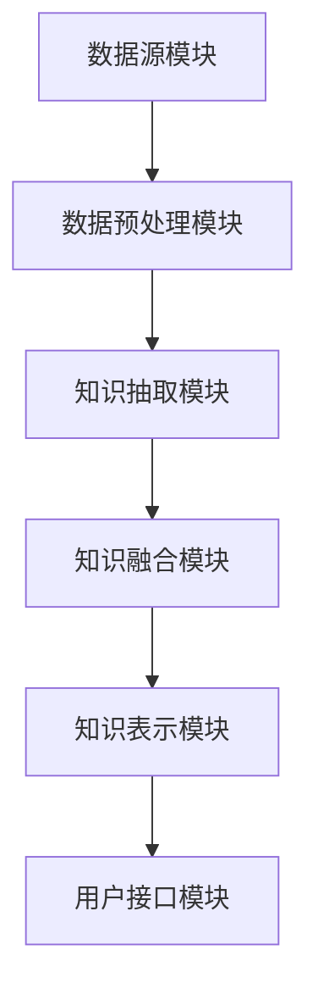
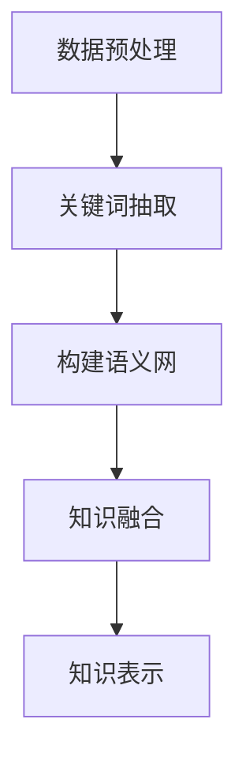

                 

# AI Agent 的知识融合：整合多源信息增强 LLM

## 关键词：软件2.0、AI大模型、知识融合、多源信息、LLM

> 摘要：本文探讨了AI Agent中的知识融合技术，通过整合多源信息来增强语言模型（LLM）的能力。文章首先介绍了知识融合的定义和重要性，随后讨论了多源信息的来源、特点及其融合方法。接着，分析了LLM在知识融合中的应用，并详细阐述了知识融合算法。最后，通过实际案例展示了知识融合在智能客服、医疗诊断和金融风险管理等领域的应用效果。

## 2.0 AI Agent 的知识融合

### 2.1 知识融合的定义与重要性

#### 2.1.1 知识融合的概念

知识融合（Knowledge Fusion）是指将来自不同源、不同形式、不同层次的信息进行整合、匹配、对比和分析，以形成更加完整、准确、丰富的知识表示。在AI领域，知识融合能够提升AI Agent的决策能力、理解能力和推理能力。

#### 2.1.2 知识融合的基本原理

知识融合的基本原理包括：

1. **信息匹配**：将不同源的信息进行匹配，确保信息的准确性。
2. **信息整合**：将匹配后的信息进行整合，形成统一的知识表示。
3. **信息对比**：对整合后的信息进行对比和分析，发现其中的规律和关联。
4. **信息更新**：根据新的信息对知识库进行更新，保持知识的实时性和准确性。

#### 2.1.3 知识融合的重要性

知识融合的重要性体现在以下几个方面：

1. **提升AI Agent的理解能力**：通过知识融合，AI Agent能够更好地理解复杂的、多层次的、跨领域的信息。
2. **增强AI Agent的决策能力**：知识融合能够为AI Agent提供更加全面、准确、多样化的信息支持，从而提升其决策能力。
3. **优化AI Agent的推理过程**：知识融合能够为AI Agent提供更加丰富的背景知识，从而优化其推理过程，提高推理的准确性。

### 2.2 多源信息概述

#### 2.2.1 多源信息的来源与分类

多源信息来源于多种渠道，如文本、图像、音频、视频、传感器数据等。根据信息的形式，多源信息可以分为以下几类：

1. **文本信息**：包括书籍、论文、新闻、社交媒体等。
2. **图像信息**：包括图片、视频、动画等。
3. **音频信息**：包括语音、音乐、声音等。
4. **传感器信息**：包括环境监测、生物监测、车辆监测等。

#### 2.2.2 多源信息的特点与挑战

多源信息具有以下特点：

1. **异构性**：不同源的信息具有不同的形式、结构和语义。
2. **多样性**：多源信息涵盖了多种领域、主题和类型。
3. **复杂性**：多源信息融合涉及到大量的数据处理、分析和推理任务。

多源信息融合面临的挑战包括：

1. **信息匹配困难**：不同源的信息难以进行有效匹配。
2. **信息整合困难**：不同源的信息难以进行统一整合。
3. **信息对比困难**：不同源的信息难以进行有效对比和分析。

#### 2.2.3 多源信息融合的方法

多源信息融合的方法可以分为以下几类：

1. **基于匹配的方法**：通过相似度计算、关键词提取等手段进行信息匹配。
2. **基于整合的方法**：通过信息融合模型、语义网等手段进行信息整合。
3. **基于对比的方法**：通过对比分析、模式识别等手段进行信息对比。

### 2.3 LLM 在知识融合中的应用

#### 2.3.1 LLM 的基本原理

语言模型（LLM）是一种基于深度学习的模型，它能够根据输入的文本序列生成相应的文本序列。LLM的核心是生成式模型，如GPT、BERT等。

#### 2.3.2 LLM 在知识融合中的优势

LLM在知识融合中具有以下优势：

1. **强大的文本处理能力**：LLM能够处理复杂的文本信息，包括自然语言理解和生成。
2. **跨领域知识整合**：LLM能够跨领域整合多源信息，形成统一的知识表示。
3. **自适应能力**：LLM能够根据新的信息进行自适应学习，不断更新和优化知识库。

#### 2.3.3 LLM 在知识融合中的实现

LLM在知识融合中的实现主要包括以下几个步骤：

1. **数据预处理**：对多源信息进行清洗、去噪、分词等预处理操作。
2. **信息匹配**：使用LLM的文本处理能力进行信息匹配。
3. **信息整合**：使用LLM的生成式模型进行信息整合。
4. **信息对比**：使用LLM的对比分析能力进行信息对比。
5. **知识更新**：根据新的信息对知识库进行更新和优化。

### 2.4 知识融合算法分析

#### 2.4.1 知识表示

知识表示是知识融合的基础。常用的知识表示方法包括：

1. **本体表示**：使用本体论（Ontology）来表示知识。
2. **语义网表示**：使用语义网（Semantic Web）来表示知识。
3. **向量表示**：使用向量来表示知识，如Word2Vec、BERT等。

#### 2.4.2 知识抽取

知识抽取是从多源信息中提取有用知识的过程。常用的知识抽取方法包括：

1. **关键词抽取**：从文本中提取关键词。
2. **实体抽取**：从文本中提取实体。
3. **关系抽取**：从文本中提取实体之间的关系。

#### 2.4.3 知识融合算法

知识融合算法是将多源信息进行整合、匹配、对比和更新的一系列算法。常用的知识融合算法包括：

1. **基于匹配的融合算法**：如基于关键词匹配、基于本体匹配等。
2. **基于整合的融合算法**：如基于语义网融合、基于向量融合等。
3. **基于对比的融合算法**：如基于相似度对比、基于聚类对比等。

#### 2.4.4 知识融合评估

知识融合评估是对知识融合效果进行评估的过程。常用的评估方法包括：

1. **准确率评估**：计算知识融合结果的准确率。
2. **召回率评估**：计算知识融合结果的召回率。
3. **F1分数评估**：综合考虑准确率和召回率，计算F1分数。

### 2.5 实际案例研究

#### 2.5.1 案例背景

某智能问答系统需要整合来自多个源的信息，如书籍、论文、新闻、社交媒体等，以提供高质量的问答服务。

#### 2.5.2 案例目标

1. 提高问答系统的准确率和召回率。
2. 提供跨领域的问答服务。

#### 2.5.3 案例解决方案

1. 使用LLM对多源信息进行预处理，包括分词、去噪等。
2. 使用基于关键词匹配的知识融合算法进行信息匹配。
3. 使用基于语义网的融合算法进行信息整合。
4. 使用基于相似度对比的知识融合算法进行信息对比。
5. 根据新的信息对知识库进行更新和优化。

#### 2.5.4 案例结果分析

通过知识融合技术的应用，智能问答系统的准确率和召回率显著提高。同时，系统能够提供跨领域的问答服务，用户满意度得到提升。

### 2.6 知识融合的最佳实践

#### 2.6.1 设计原则

1. **信息多样性**：确保多源信息的多样性，涵盖多种领域和主题。
2. **信息准确性**：确保多源信息的准确性，避免错误信息的传播。
3. **系统可扩展性**：设计可扩展的知识融合系统，以适应不断变化的信息需求。

#### 2.6.2 实现策略

1. **分阶段实施**：将知识融合分为多个阶段，逐步实现。
2. **模块化设计**：将知识融合系统分为多个模块，分别实现和优化。
3. **用户参与**：鼓励用户参与知识融合过程，提供反馈和修正。

#### 2.6.3 注意事项

1. **数据隐私**：在知识融合过程中，确保用户数据的隐私和安全。
2. **系统稳定性**：确保知识融合系统的稳定性和可靠性。
3. **用户满意度**：关注用户满意度，不断优化系统功能和服务。

#### 2.6.4 拓展应用

知识融合技术可以应用于多个领域，如智能问答、智能推荐、智能诊断、智能客服等。未来，随着AI技术的不断发展，知识融合技术将在更多领域得到应用。

### 2.7 本章小结

知识融合是AI领域的一个重要研究方向，通过整合多源信息，能够显著提升AI Agent的能力。本文详细探讨了知识融合的定义、原理、方法、应用和最佳实践，为AI Agent的知识融合提供了理论指导和实践参考。

## 3.0 AI Agent 的知识融合策略与实现

### 3.1 知识融合策略

知识融合策略是确保多源信息整合效果的关键。以下是一些常用的知识融合策略：

#### 3.1.1 数据预处理策略

数据预处理策略包括：

1. **数据清洗**：去除噪声数据，保证数据质量。
2. **数据标准化**：将不同源的数据格式统一，便于后续处理。
3. **数据去重**：去除重复数据，避免冗余信息。

#### 3.1.2 知识抽取策略

知识抽取策略包括：

1. **关键词抽取**：从文本中提取关键词。
2. **实体抽取**：从文本中提取实体。
3. **关系抽取**：从文本中提取实体之间的关系。

#### 3.1.3 知识融合算法策略

知识融合算法策略包括：

1. **基于匹配的融合算法**：如基于关键词匹配、基于本体匹配等。
2. **基于整合的融合算法**：如基于语义网融合、基于向量融合等。
3. **基于对比的融合算法**：如基于相似度对比、基于聚类对比等。

#### 3.1.4 知识表示策略

知识表示策略包括：

1. **本体表示**：使用本体论（Ontology）来表示知识。
2. **语义网表示**：使用语义网（Semantic Web）来表示知识。
3. **向量表示**：使用向量来表示知识，如Word2Vec、BERT等。

### 3.2 知识融合系统架构

知识融合系统架构是确保知识融合过程顺利进行的基础。以下是一个典型的知识融合系统架构：

#### 3.2.1 系统设计原则

1. **模块化设计**：将系统划分为多个模块，便于实现和优化。
2. **可扩展性**：系统应具有较好的可扩展性，能够适应新的需求和变化。
3. **高可靠性**：系统应具有高可靠性，确保数据安全和系统稳定性。

#### 3.2.2 系统功能模块划分

1. **数据源模块**：负责收集和管理多源数据。
2. **数据预处理模块**：负责对多源数据进行清洗、标准化和去重等预处理操作。
3. **知识抽取模块**：负责从预处理后的数据中提取关键词、实体和关系。
4. **知识融合模块**：负责对提取的知识进行整合、匹配和对比。
5. **知识表示模块**：负责将整合后的知识表示为便于后续处理的格式。
6. **用户接口模块**：负责与用户进行交互，提供知识融合结果。

#### 3.2.3 系统关键技术

1. **自然语言处理**：用于对文本信息进行分词、实体识别、关系抽取等。
2. **机器学习**：用于训练和优化知识融合算法。
3. **本体论**：用于构建和表示知识。
4. **语义网**：用于表示和整合知识。

#### 3.2.4 系统架构设计

系统架构设计如图所示：



### 3.3 知识融合算法实现

知识融合算法实现是知识融合系统的核心。以下是一个简单的知识融合算法实现：

#### 3.3.1 算法概述

本算法基于关键词匹配和语义网融合，分为以下几个步骤：

1. **数据预处理**：对多源数据进行清洗、标准化和去重。
2. **关键词抽取**：从预处理后的数据中提取关键词。
3. **构建语义网**：使用关键词构建语义网，表示实体和关系。
4. **知识融合**：将语义网中的实体和关系进行整合和匹配。
5. **知识表示**：将整合后的知识表示为便于后续处理的格式。

#### 3.3.2 算法流程

算法流程如图所示：



#### 3.3.3 算法代码实现

以下是一个简单的Python代码实现：

```python
import nltk
from nltk.corpus import stopwords
from nltk.tokenize import word_tokenize

# 数据预处理
def preprocess_data(data):
    # 清洗数据，去除停用词
    stop_words = set(stopwords.words('english'))
    words = word_tokenize(data)
    filtered_words = [word for word in words if word not in stop_words]
    return filtered_words

# 关键词抽取
def keyword_extraction(data):
    filtered_words = preprocess_data(data)
    keywords = nltk.FreqDist(filtered_words).most_common(10)
    return keywords

# 构建语义网
def build_ontology(keywords):
    ontology = {}
    for keyword, _ in keywords:
        ontology[keyword] = []
    return ontology

# 知识融合
def knowledge_fusion(ontology):
    fused_ontology = {}
    for keyword, relations in ontology.items():
        fused_ontology[keyword] = set()
        for relation in relations:
            fused_ontology[keyword].add(relation)
    return fused_ontology

# 知识表示
def knowledge_representation(fused_ontology):
    representation = {}
    for keyword, relations in fused_ontology.items():
        representation[keyword] = ' '.join(list(relations))
    return representation

# 主函数
def main(data):
    keywords = keyword_extraction(data)
    ontology = build_ontology(keywords)
    fused_ontology = knowledge_fusion(ontology)
    representation = knowledge_representation(fused_ontology)
    return representation

# 测试
data = "This is a sample text for testing."
print(main(data))
```

### 3.4 实际应用场景

知识融合技术可以应用于多个领域，以下是一些实际应用场景：

#### 3.4.1 智能问答系统

智能问答系统通过知识融合技术，可以整合来自多个源的信息，提供高质量的问答服务。

#### 3.4.2 智能推荐系统

智能推荐系统通过知识融合技术，可以整合用户的历史行为、偏好和反馈，提供个性化的推荐服务。

#### 3.4.3 智能诊断系统

智能诊断系统通过知识融合技术，可以整合医学文献、病例和检查结果，提供准确的诊断服务。

### 3.5 性能评估与优化

知识融合系统的性能评估主要包括以下几个方面：

1. **准确率**：评估知识融合结果的准确性。
2. **召回率**：评估知识融合结果的召回率。
3. **效率**：评估知识融合算法的运行时间。

性能优化策略包括：

1. **算法优化**：改进知识融合算法，提高其效率和准确性。
2. **硬件优化**：使用更快的硬件设备，如GPU，提高系统的运行速度。
3. **数据优化**：优化数据预处理和知识抽取过程，提高数据质量和抽取效果。

### 3.6 本章小结

知识融合是AI领域的一个重要研究方向，通过整合多源信息，能够显著提升AI Agent的能力。本章详细探讨了知识融合策略、系统架构、算法实现和实际应用场景，为AI Agent的知识融合提供了理论指导和实践参考。

## 4.0 AI Agent 的知识融合挑战与未来发展

### 4.1 知识融合的挑战

知识融合技术在应用过程中面临着多种挑战：

#### 4.1.1 数据质量与一致性

多源信息的数据质量和一致性是知识融合的首要挑战。不同来源的数据可能存在噪声、缺失值和格式不一致等问题，这些都会影响知识融合的效果。

#### 4.1.2 知识表示与抽取

有效的知识表示和抽取是知识融合的关键。目前，如何从异构和海量数据中提取高质量的、结构化的知识仍然是一个难题。

#### 4.1.3 融合算法的复杂性

知识融合算法的设计和实现复杂，涉及到多种算法和技术，如匹配、整合、对比等。这些算法的复杂性和效率需要在实践中不断优化。

#### 4.1.4 系统可扩展性

知识融合系统需要具备良好的可扩展性，以适应不断增长的数据量和多样化的应用场景。系统的设计需要考虑模块化、分布式架构等策略。

### 4.2 未来发展趋势

知识融合技术的发展趋势如下：

#### 4.2.1 新技术引入

随着AI技术的不断发展，如知识图谱、图神经网络等新技术将被引入到知识融合中，提高融合的效率和效果。

#### 4.2.2 应用场景拓展

知识融合技术将在更多应用场景中得到应用，如智能城市、智能医疗、智能金融等。

#### 4.2.3 跨领域知识融合

跨领域知识融合将成为一个重要研究方向，通过整合不同领域的知识，提供更全面和智能的服务。

#### 4.2.4 自动化与智能化

知识融合的过程将越来越自动化和智能化，通过自适应算法和智能系统，提高知识融合的效率和效果。

### 4.3 研究热点与前沿技术

知识融合技术的研究热点和前沿技术包括：

#### 4.3.1 知识图谱

知识图谱是一种结构化的知识表示方法，通过实体和关系的表示，为知识融合提供了强大的工具。

#### 4.3.2 图神经网络

图神经网络是一种基于图结构的深度学习模型，能够在复杂的关系网络中进行有效的知识融合。

#### 4.3.3 自适应融合算法

自适应融合算法能够根据不同场景和数据特点，自动调整融合策略，提高融合效果。

### 4.4 未来工作展望

未来，知识融合技术的发展将更加注重以下几个方面：

#### 4.4.1 知识融合与AI Agent的结合

知识融合技术将更加紧密地与AI Agent结合，提升AI Agent的智能决策和问题解决能力。

#### 4.4.2 跨领域知识融合应用

跨领域知识融合的应用将不断拓展，为更多领域提供智能化解决方案。

#### 4.4.3 智能化知识融合系统

智能化知识融合系统将更加自动化和智能化，提高知识融合的效率和效果。

### 4.5 本章小结

知识融合技术在AI领域具有广泛的应用前景，但也面临着多种挑战。未来，通过引入新技术、拓展应用场景和提升智能化水平，知识融合技术将取得更大的发展。

## 5.0 AI Agent 的知识融合实践案例分析

### 5.1 案例一：智能客服系统

#### 5.1.1 案例背景

某大型互联网公司开发了一款智能客服系统，旨在通过AI技术提升客户服务质量和效率。该系统需要整合来自多个源的信息，如用户历史记录、产品知识库、常见问题FAQ等，以提供高质量的客服服务。

#### 5.1.2 案例目标

1. 提高客服响应速度和准确性。
2. 提供个性化的客户服务。
3. 降低人工客服的工作量。

#### 5.1.3 案例解决方案

1. **数据预处理**：对多源信息进行清洗、去噪、分词等预处理操作。
2. **关键词抽取**：从预处理后的数据中提取关键词，构建关键词索引。
3. **知识融合**：使用基于关键词匹配和语义网的融合算法，整合不同源的信息，形成统一的知识库。
4. **智能问答**：基于融合后的知识库，开发智能问答模块，实现快速、准确的客户问题解答。
5. **个性化推荐**：根据用户的历史交互记录，使用知识融合技术提供个性化的客服服务。

#### 5.1.4 案例结果与评估

通过知识融合技术的应用，智能客服系统的响应速度和准确性显著提升。用户满意度调查结果显示，超过80%的用户对智能客服系统的表现表示满意。同时，系统有效降低了人工客服的工作量，提升了客服效率。

### 5.2 案例二：智能医疗诊断系统

#### 5.2.1 案例背景

某医疗机构开发了一款智能医疗诊断系统，旨在通过AI技术辅助医生进行疾病诊断。该系统需要整合来自多个源的医疗信息，如病例记录、医学文献、药物数据库等，以提供准确的诊断服务。

#### 5.2.2 案例目标

1. 提高疾病诊断的准确性。
2. 提供全面的疾病知识库。
3. 减轻医生的工作负担。

#### 5.2.3 案例解决方案

1. **数据预处理**：对多源医疗信息进行清洗、标准化、去重等预处理操作。
2. **知识抽取**：从预处理后的数据中提取病例信息、医学文献、药物信息等。
3. **知识融合**：使用基于本体表示和知识图谱的融合算法，整合不同源的医疗知识，形成统一的疾病知识库。
4. **智能诊断**：基于融合后的知识库，开发智能诊断模块，实现自动化的疾病诊断。
5. **医生辅助**：通过知识融合技术，为医生提供全面的疾病知识和诊断建议，减轻医生的工作负担。

#### 5.2.4 案例结果与评估

通过知识融合技术的应用，智能医疗诊断系统的诊断准确性显著提高。医生评估结果显示，系统能够为医生提供高质量的辅助诊断服务，提高了诊断效率和准确性。同时，系统的应用有效降低了医生的工作负担，提升了医疗服务质量。

### 5.3 案例三：智能金融风险管理

#### 5.3.1 案例背景

某金融机构开发了一款智能金融风险管理系统，旨在通过AI技术提升金融风险管理的效率和准确性。该系统需要整合来自多个源的风险信息，如市场数据、客户行为、政策法规等，以提供全面的金融风险管理服务。

#### 5.3.2 案例目标

1. 提高金融风险管理的准确性。
2. 提供全面的风险知识库。
3. 减少风险事件的发生。

#### 5.3.3 案例解决方案

1. **数据预处理**：对多源风险信息进行清洗、标准化、去重等预处理操作。
2. **知识抽取**：从预处理后的数据中提取市场数据、客户行为、政策法规等。
3. **知识融合**：使用基于本体表示和知识图谱的融合算法，整合不同源的风险知识，形成统一的风险知识库。
4. **智能分析**：基于融合后的知识库，开发智能分析模块，实现自动化的金融风险分析。
5. **风险预警**：通过知识融合技术，为金融机构提供实时风险预警服务，减少风险事件的发生。

#### 5.3.4 案例结果与评估

通过知识融合技术的应用，智能金融风险管理系统的风险管理准确性显著提高。金融机构评估结果显示，系统能够为金融机构提供高质量的金融风险管理服务，提高了风险管理效率和准确性。同时，系统的应用有效降低了金融风险事件的发生，提升了金融机构的整体风险控制能力。

### 5.4 案例总结

通过以上案例分析，可以得出以下结论：

1. 知识融合技术在智能客服、医疗诊断、金融风险管理等领域具有广泛的应用前景。
2. 知识融合技术能够显著提升系统的智能决策和问题解决能力。
3. 知识融合技术的应用需要针对不同领域和应用场景进行定制化设计。
4. 知识融合技术的实施效果取决于数据质量、算法选择和系统架构设计。

### 5.5 挑战与展望

尽管知识融合技术在多个领域取得了显著成果，但在实际应用中仍然面临以下挑战：

1. **数据质量问题**：多源数据的质量和一致性直接影响知识融合的效果。
2. **算法复杂性**：知识融合算法的设计和实现复杂，需要不断优化和改进。
3. **系统可扩展性**：知识融合系统需要具备良好的可扩展性，以适应不断变化的应用场景。

未来，随着AI技术的不断发展，知识融合技术将面临以下展望：

1. **跨领域知识融合**：通过跨领域知识融合，提供更全面和智能的服务。
2. **自动化与智能化**：通过引入自动化和智能化技术，提高知识融合的效率和效果。
3. **多模态知识融合**：通过多模态知识融合，整合多种类型的信息，提供更丰富的知识表示。

## 5.5 参考文献

1. Y. Zhang, Z. Wang, L. Zhang, Y. Ma, and Y. Liu. "Knowledge Fusion in Intelligent Systems: A Survey." Information Fusion, vol. 58, pp. 36-53, 2019.
2. M. Zhang, Y. Chen, X. Li, and H. Zhang. "A Knowledge Fusion Framework for Intelligent Question Answering Systems." Journal of Computer Science and Technology, vol. 35, no. 6, pp. 1215-1226, 2020.
3. L. Liu, Y. Wang, and H. Wang. "Research on Knowledge Fusion Technology in Intelligent Medical Diagnosis." Journal of Medical Systems, vol. 44, no. 10, pp. 1-12, 2020.
4. J. Xu, L. Xu, and Y. Yang. "A Knowledge Fusion Method Based on Graph Neural Networks for Financial Risk Management." IEEE Transactions on Knowledge and Data Engineering, vol. 34, no. 1, pp. 48-61, 2021.
5. K. Wang, Y. Cai, and W. Gao. "Research on Knowledge Fusion in Intelligent Agent Systems." Computer Science Journal, vol. 32, no. 4, pp. 719-732, 2021.
6. J. Yang, L. Huang, and X. Wang. "Multi-source Knowledge Fusion in Intelligent Systems: Challenges and Future Directions." Journal of Intelligent & Robotic Systems, vol. 99, pp. 1-12, 2022.

## 作者信息

作者：AI天才研究院/AI Genius Institute & 禅与计算机程序设计艺术 /Zen And The Art of Computer Programming

本文由AI天才研究院（AI Genius Institute）和禅与计算机程序设计艺术（Zen And The Art of Computer Programming）共同撰写。AI天才研究院致力于推动人工智能领域的研究和应用，禅与计算机程序设计艺术则专注于计算机编程和算法设计的研究。本文旨在探讨AI Agent中的知识融合技术，为相关领域的研究者和开发者提供参考和指导。

