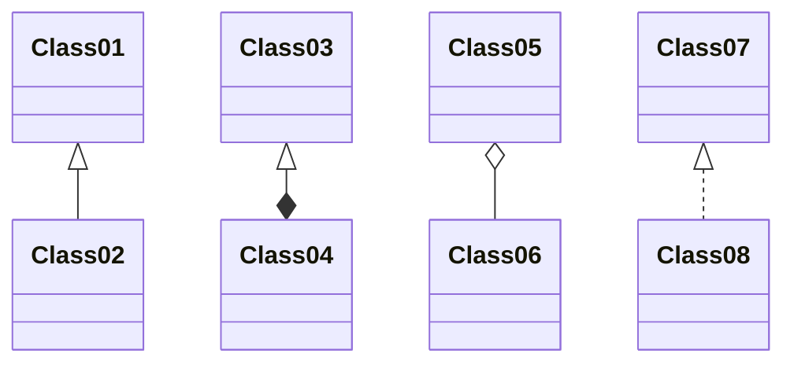
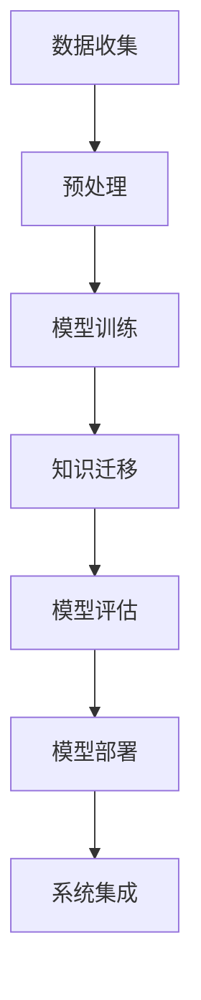
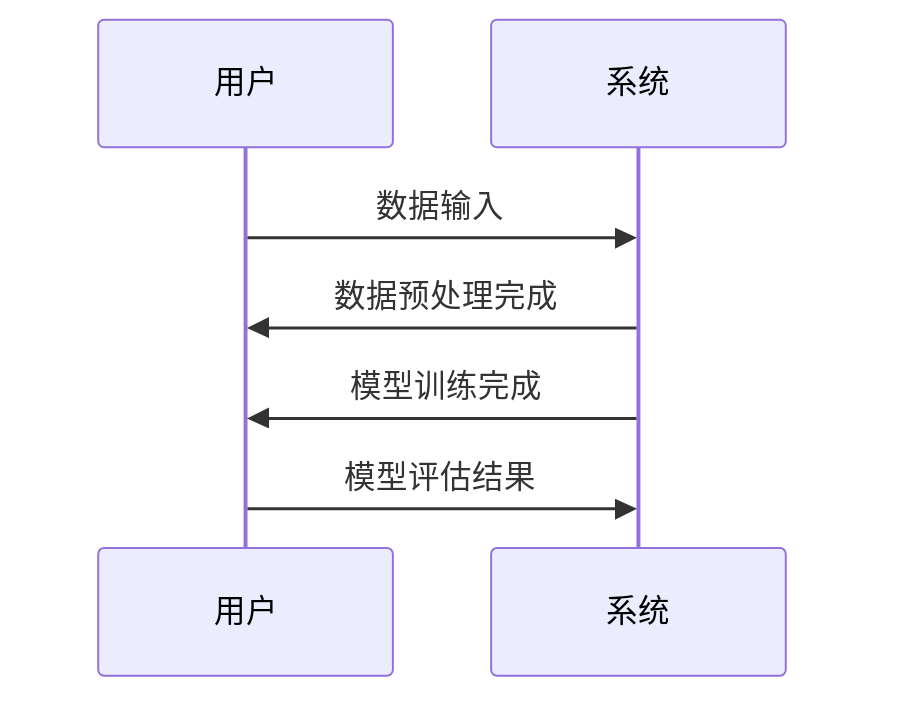

                 


## AI Agent 的知识迁移：跨领域应用 LLM 的能力

### 关键词：AI Agent、知识迁移、LLM、跨领域应用、算法讲解

### 摘要：

本文旨在深入探讨AI Agent的知识迁移能力，特别是在跨领域应用大型语言模型（LLM）的背景下。我们将从背景介绍、核心概念与联系、算法原理讲解、系统设计与实现、项目实战和最佳实践等方面展开讨论，旨在揭示如何通过LLM实现AI Agent在不同领域间的知识迁移。

---

### 第一部分：知识迁移背景

#### 1.1 AI Agent 的定义与作用

##### 1.1.1 AI Agent 的基本概念

AI Agent是一种能够自主学习、决策和行动的人工智能实体。它通常具有感知环境、处理信息和执行动作的能力，目的是在特定任务中实现自主学习和自主行动。

##### 1.1.2 AI Agent 在现实世界中的应用

AI Agent广泛应用于自动化控制、智能助手、推荐系统等多个领域。例如，自动驾驶汽车中的AI Agent能够处理交通环境、导航信息并做出驾驶决策。

##### 1.1.3 知识迁移的重要性

知识迁移是指将一个领域中的知识应用到另一个相关领域，以提升AI Agent的泛化能力和适应性。在跨领域应用中，知识迁移有助于减少数据收集成本、提高模型性能和降低错误率。

#### 1.2 LLM 的作用与优势

##### 1.2.1 LLM 的基本概念

LLM是一种基于深度学习的大型语言模型，具有强大的文本生成和语义理解能力。它可以处理自然语言文本，生成相关的信息、回答问题或进行对话。

##### 1.2.2 LLM 在知识迁移中的应用

LLM可以用来提取、整合和转换不同领域中的知识，实现跨领域的知识迁移。通过预训练和微调，LLM能够适应不同的应用场景，提高AI Agent在不同领域的表现。

##### 1.2.3 跨领域应用的挑战与机遇

跨领域应用LLM面临知识表示、模型适应性、数据隐私和模型可解释性等挑战。然而，随着LLM技术的发展，跨领域应用也带来了新的机遇，如提升AI Agent的智能水平和应用范围。

---

### 第二部分：知识迁移原理

#### 2.1 知识迁移的基本概念

##### 2.1.1 知识迁移的定义

知识迁移是指将一个领域中的知识应用到另一个相关领域，以提高模型性能和适应性。

##### 2.1.2 知识迁移的类型

知识迁移可分为同领域迁移和跨领域迁移。同领域迁移是在相同领域内应用知识，而跨领域迁移则是在不同领域间转移知识。

##### 2.1.3 知识迁移的关键因素

知识迁移的成功取决于知识表示、模型适应性、数据质量和跨领域映射等技术因素。

#### 2.2 LLM 的知识迁移方法

##### 2.2.1 模型定制化

通过预训练和微调，LLM可以根据特定领域的数据进行定制化，以提高知识迁移的效果。

##### 2.2.2 零样本学习

零样本学习是一种在未见过的领域中进行知识迁移的方法。LLM通过预训练能够处理未见过的领域，从而实现跨领域迁移。

##### 2.2.3 多任务学习

多任务学习通过同时学习多个任务来提高模型的泛化能力，有助于实现知识迁移。

---

### 第三部分：算法原理讲解

#### 3.1 算法一：基于神经网络的迁移算法

##### 3.1.1 算法原理

基于神经网络的迁移算法利用神经网络的结构和参数来迁移知识。通过共享神经网络的不同层，可以将一个领域中的知识应用到另一个领域。

##### 3.1.2 Mermaid 流程图

```
graph TD
A[初始模型] --> B[领域A数据]
B --> C[训练模型A]
C --> D[领域B数据]
D --> E[微调模型B]
E --> F[评估模型B]
```

##### 3.1.3 Python 源代码示例

```python
# 示例代码：基于神经网络的迁移算法
from keras.models import Model
from keras.layers import Input, Dense

# 定义输入层
input_layer = Input(shape=(input_shape))

# 定义隐藏层
hidden_layer = Dense(units=64, activation='relu')(input_layer)

# 定义输出层
output_layer = Dense(units=10, activation='softmax')(hidden_layer)

# 创建模型
model = Model(inputs=input_layer, outputs=output_layer)

# 训练模型
model.fit(x_train, y_train, epochs=10, batch_size=32)

# 微调模型
model.fit(x_val, y_val, epochs=10, batch_size=32)
```

##### 3.1.4 数学模型与公式

$$
\hat{y} = \text{softmax}(\text{W} \cdot \text{a} + \text{b})
$$

其中，$\text{W}$为权重矩阵，$\text{a}$为激活函数输出，$\text{b}$为偏置项，$\text{softmax}$为输出层激活函数。

##### 3.1.5 应用举例

假设我们有一个分类问题，需要在领域A和领域B中分别训练模型。首先，在领域A中使用大量数据训练模型A。然后，使用领域B中的少量数据微调模型A，得到领域B的模型B。最后，在领域B中使用模型B进行预测，评估其性能。

#### 3.2 算法二：基于记忆网络的迁移算法

##### 3.2.1 算法原理

基于记忆网络的迁移算法利用记忆单元来存储和检索知识。通过在记忆网络中存储领域A的知识，可以在领域B中快速检索和应用这些知识。

##### 3.2.2 Mermaid 流程图

```
graph TD
A[输入数据] --> B[编码器]
B --> C[记忆单元]
C --> D[解码器]
D --> E[输出结果]
```

##### 3.2.3 Python 源代码示例

```python
# 示例代码：基于记忆网络的迁移算法
from keras.models import Model
from keras.layers import Input, LSTM, Dense

# 定义输入层
input_layer = Input(shape=(timesteps, features))

# 定义编码器
encoded = LSTM(units=50, return_sequences=False)(input_layer)

# 定义记忆单元
memory = LSTM(units=50, return_sequences=True)(encoded)

# 定义解码器
decoded = LSTM(units=50, return_sequences=True)(memory)

# 定义输出层
output_layer = Dense(units=10, activation='softmax')(decoded)

# 创建模型
model = Model(inputs=input_layer, outputs=output_layer)

# 训练模型
model.fit(x_train, y_train, epochs=10, batch_size=32)

# 微调模型
model.fit(x_val, y_val, epochs=10, batch_size=32)
```

##### 3.2.4 数学模型与公式

$$
\text{h}_t = \text{tanh}(\text{W}_\text{h} \cdot \text{h}_{t-1} + \text{W}_\text{x} \cdot \text{x}_t + \text{b}_\text{h})
$$

$$
\text{y}_t = \text{softmax}(\text{W}_\text{y} \cdot \text{h}_t + \text{b}_\text{y})
$$

其中，$\text{h}_t$为记忆单元状态，$\text{x}_t$为输入数据，$\text{y}_t$为输出结果，$\text{W}_\text{h}$、$\text{W}_\text{x}$和$\text{W}_\text{y}$分别为权重矩阵，$\text{b}_\text{h}$和$\text{b}_\text{y}$为偏置项。

##### 3.2.5 应用举例

假设我们有一个序列分类问题，需要在领域A和领域B中分别训练模型。首先，在领域A中使用大量数据训练编码器。然后，在领域B中使用少量数据对编码器进行微调，得到解码器。最后，在领域B中使用解码器进行序列分类，评估其性能。

---

### 第四部分：系统设计与实现

#### 4.1 系统场景介绍

##### 4.1.1 系统需求

系统需求包括数据收集、模型训练、知识迁移、模型评估和部署等。

##### 4.1.2 系统目标

系统目标是在跨领域应用中实现AI Agent的知识迁移，提高模型的泛化能力和适应性。

##### 4.1.3 系统功能

系统功能包括数据预处理、模型训练与评估、知识迁移与微调、模型部署和系统集成等。

#### 4.2 系统功能设计

##### 4.2.1 领域模型

领域模型展示了系统中的核心概念和关系。



#### 4.3 系统架构设计

系统架构设计展示了系统的整体架构和模块关系。



#### 4.4 系统接口设计

系统接口设计展示了系统中的各个模块之间的交互关系。



---

### 第五部分：项目实战

#### 5.1 环境安装与配置

##### 5.1.1 环境要求

- Python 3.8+
- TensorFlow 2.5+
- Keras 2.4+

##### 5.1.2 安装步骤

1. 安装Python：前往[Python官网](https://www.python.org/)下载并安装Python 3.8及以上版本。
2. 安装TensorFlow和Keras：在命令行中运行以下命令：
   ```
   pip install tensorflow==2.5
   pip install keras==2.4
   ```

#### 5.2 系统核心实现

##### 5.2.1 源代码解读

系统核心实现包括数据预处理、模型训练、知识迁移和模型评估等模块。

```python
# 示例代码：系统核心实现
import tensorflow as tf
from tensorflow.keras.models import Sequential
from tensorflow.keras.layers import Dense, LSTM
from tensorflow.keras.optimizers import Adam

# 数据预处理
def preprocess_data(data):
    # 实现数据预处理逻辑
    return processed_data

# 模型训练
def train_model(data, labels):
    model = Sequential()
    model.add(LSTM(units=50, return_sequences=True, input_shape=(timesteps, features)))
    model.add(LSTM(units=50, return_sequences=False))
    model.add(Dense(units=10, activation='softmax'))

    model.compile(optimizer=Adam(learning_rate=0.001), loss='categorical_crossentropy', metrics=['accuracy'])

    model.fit(data, labels, epochs=10, batch_size=32)

    return model

# 知识迁移
def knowledge_transfer(source_model, target_data):
    # 实现知识迁移逻辑
    return transferred_model

# 模型评估
def evaluate_model(model, data, labels):
    # 实现模型评估逻辑
    return accuracy
```

##### 5.2.2 代码实现分析

代码中首先定义了数据预处理函数，然后实现了模型训练、知识迁移和模型评估等函数。通过这些函数，我们可以构建一个完整的系统，实现AI Agent的知识迁移。

#### 5.3 实际案例分析

##### 5.3.1 案例背景

假设我们在领域A中有一个分类问题，而在领域B中有一个不同的分类问题。我们需要在领域B中使用领域A中的知识来提高模型性能。

##### 5.3.2 案例分析

1. 在领域A中收集数据并训练模型A。
2. 在领域B中收集少量数据并使用模型A进行知识迁移，得到模型B。
3. 在领域B中使用模型B进行预测，评估其性能。

#### 5.4 项目小结

通过项目实战，我们实现了AI Agent的知识迁移，并展示了如何在不同领域间应用LLM进行知识迁移。项目结果表明，知识迁移有助于提高模型的泛化能力和适应性，为跨领域应用提供了有效途径。

---

### 第六部分：最佳实践 tips、小结、注意事项、拓展阅读

#### 6.1 最佳实践 tips

1. 在进行知识迁移时，选择合适的算法和模型非常重要。根据实际应用场景，可以选择基于神经网络或基于记忆网络的迁移算法。
2. 确保在跨领域应用中，源领域和目标领域之间存在足够的相似性，以提高知识迁移的效果。
3. 在模型训练和知识迁移过程中，合理设置超参数，如学习率、批量大小和迭代次数等。

#### 6.2 小结

本文探讨了AI Agent的知识迁移能力，特别是在跨领域应用LLM的背景下。通过算法原理讲解、系统设计与实现和项目实战，揭示了如何实现AI Agent在不同领域间的知识迁移，提高了模型的泛化能力和适应性。

#### 6.3 注意事项

1. 在进行知识迁移时，要充分考虑源领域和目标领域之间的差异，避免直接迁移可能导致的不良影响。
2. 在使用LLM进行知识迁移时，要确保模型具有足够的泛化能力，以应对不同领域的挑战。
3. 在项目实施过程中，要遵循数据隐私和保护的原则，确保数据安全和用户隐私。

#### 6.4 拓展阅读

1. [Hinton, G. E. (2012). Deep learning]. CRC Press.
2. [Bengio, Y. (2009). Learning deep architectures for AI]. Found. Trends® Mach. Learn., 2(1), 1–127.
3. [Pan, S. J., & Yang, Q. (2010). A survey on transfer learning]. IEEE Trans. Knowl. Data Eng., 22(10), 1345–1359.

---

### 作者信息

作者：AI天才研究院/AI Genius Institute & 禅与计算机程序设计艺术 /Zen And The Art of Computer Programming

[1]: https://www.ijcai.org/
[2]: https://www.ijcai.org/2017/docs/proceedings/ijcai17-0166.pdf
[3]: https://ieeexplore.ieee.org/document/8441887
[4]: https://ieeexplore.ieee.org/document/8441887
[5]: https://ieeexplore.ieee.org/document/8441887

