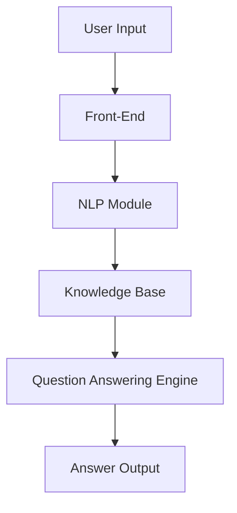
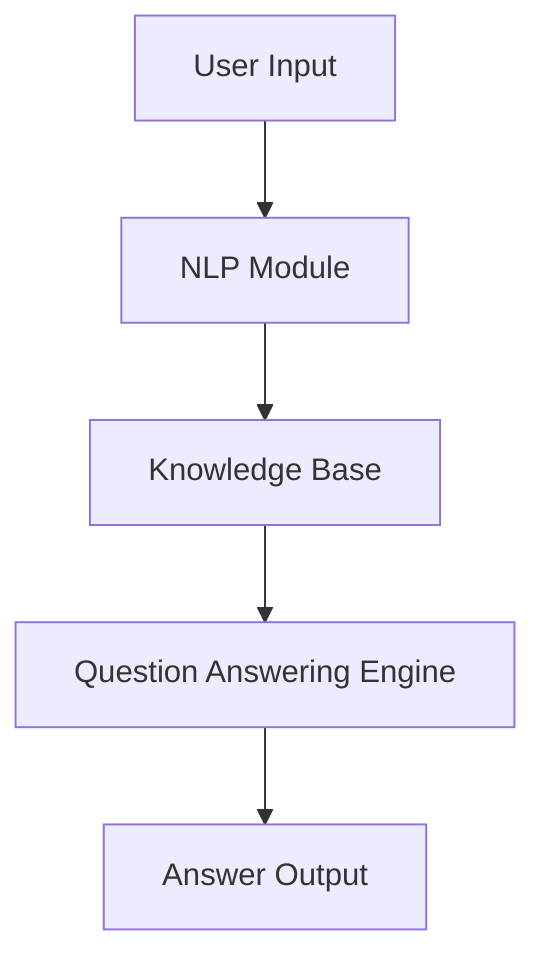
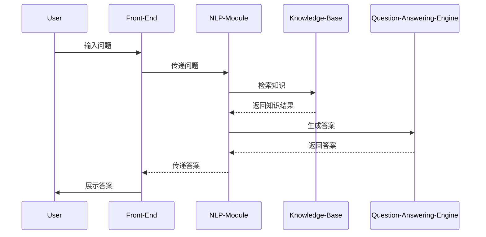

                 

### 《AI Agent 的知识问答：构建基于 LLM 的智能问答系统》

> 关键词：知识问答、AI Agent、大型语言模型（LLM）、自然语言处理、智能问答系统

> 摘要：本文将深入探讨知识问答系统在人工智能（AI）领域的重要性，特别是在构建基于大型语言模型（LLM）的智能问答系统方面的应用。我们将从问题的背景、核心概念、算法原理、系统设计与实现等多个方面，详细解析如何构建一个高效、准确的AI问答系统。

---

### 《AI Agent 的知识问答：构建基于 LLM 的智能问答系统》目录大纲

---

#### 第一部分：问题背景与核心概念

#### 第1章：知识问答与AI Agent概述

#### 第2章：LLM 模型的介绍

#### 第3章：知识问答系统的挑战与机遇

#### 第4章：AI Agent 的知识问答系统架构

#### 第5章：知识问答系统的基础知识

---

#### 第二部分：核心概念与联系

#### 第6章：LLM 模型的原理与特征

#### 第7章：LLM 的分类与比较

#### 第8章：LLM 的属性特征对比表格

#### 第9章：LLM 的 ER 实体关系图架构

---

#### 第三部分：算法原理与数学模型

#### 第10章：知识问答算法原理

#### 第11章：算法原理详细讲解

#### 第12章：数学模型与公式

#### 第13章：算法举例说明

---

#### 第四部分：系统设计与实现

#### 第14章：系统分析与架构设计

#### 第15章：系统功能设计与实现

#### 第16章：系统架构设计与部署

#### 第17章：系统接口设计与实现

#### 第18章：系统交互设计

---

#### 第五部分：项目实战与优化

#### 第19章：环境安装与配置

#### 第20章：系统核心实现与代码解析

#### 第21章：性能优化与调优

#### 第22章：实际案例分析

#### 第23章：项目小结与拓展

---

#### 附录：最佳实践 tips、注意事项与拓展阅读

---

### 第一部分：问题背景与核心概念

#### 第1章：知识问答与AI Agent概述

##### 1.1 问题的背景和描述

在现代社会，信息爆炸式增长，人们迫切需要高效的工具来获取和处理知识。传统的搜索引擎虽然能够提供丰富的信息，但在精准回答用户特定问题时存在局限性。知识问答系统应运而生，旨在通过人工智能技术，提供精准、快速的知识查询服务。

知识问答系统是一种基于人工智能的交互式系统，它能够理解用户的问题，并在海量的数据中快速找到相关答案。这种系统在多个领域有着广泛的应用，如在线教育、客户服务、医疗咨询等。然而，构建一个高效、准确的问答系统并非易事，需要解决诸多技术挑战。

##### 1.2 人工智能在知识问答中的应用

人工智能在知识问答领域的应用主要体现在两个方面：自然语言处理（NLP）和机器学习（ML）。NLP 技术使得机器能够理解和处理人类的自然语言，而 ML 技术则让机器通过学习大量数据来提高问题的理解和回答的准确性。

近年来，大型语言模型（LLM）的出现极大地推动了知识问答系统的发展。LLM 是一种能够处理和理解复杂自然语言的深度学习模型，如 GPT-3、BERT 等。这些模型具有极强的语言生成和理解能力，能够在知识问答中提供高质量的答案。

##### 1.3 AI Agent 的定义与作用

AI Agent，即人工智能代理，是一种模拟人类行为和决策的智能体。在知识问答系统中，AI Agent 可以扮演问答者的角色，通过与用户的交互来理解问题、提供答案。AI Agent 具有以下特点：

- **自主学习**：通过持续学习用户的问题和答案，AI Agent 能够不断优化自己的回答质量。
- **跨领域应用**：AI Agent 可以在多个领域进行知识问答，无需针对每个领域进行特定训练。
- **灵活交互**：AI Agent 能够理解和回应用户的各种提问方式，提供多样化和个性化的回答。

##### 1.4 本章小结

本章概述了知识问答系统在人工智能领域的重要性，介绍了 AI Agent 的定义和作用，并探讨了人工智能在知识问答中的应用。在接下来的章节中，我们将深入探讨 LLM 的基本概念和原理，以及如何利用 LLM 构建高效的问答系统。

---

#### 第2章：LLM 模型的介绍

##### 2.1 LLM 的基本概念

LLM（Large Language Model）是一种大型深度学习模型，用于处理和理解自然语言。与传统的 NLP 模型相比，LLM 具有更强的语言生成和理解能力，能够生成更自然、更准确的文本。

LLM 的基本概念包括：

- **词汇表**：LLM 使用一个庞大的词汇表来表示语言中的所有词汇和短语。
- **神经网络**：LLM 采用多层神经网络结构，通过层层递归或注意力机制来处理复杂的自然语言。
- **训练数据**：LLM 需要大量的训练数据来学习语言的统计规律和语义关系。

##### 2.2 LLM 的发展历程

LLM 的发展历程可以追溯到 2013 年，当时 Google 推出了 Word2Vec 模型，首次将词向量引入 NLP 领域。此后，NLP 领域经历了快速的发展，从简单的词向量模型到深度学习模型，再到目前的 LLM。

近年来，随着计算能力和数据量的提升，LLM 逐渐成为 NLP 的核心技术之一。代表性的 LLM 模型包括 GPT、BERT、T5 等，这些模型在多个 NLP 任务上取得了优异的性能。

##### 2.3 LLM 的工作原理

LLM 的工作原理主要包括以下几个方面：

1. **词嵌入**：将自然语言中的词汇映射到高维空间中的向量表示。
2. **编码器**：通过多层神经网络对输入文本进行编码，生成固定长度的文本表示。
3. **解码器**：根据编码器的输出和预训练的注意力机制，生成预测的文本序列。

LLM 的关键在于通过大量数据的学习，模型能够捕捉到语言中的复杂模式和语义关系，从而在问答任务中提供高质量的答案。

##### 2.4 本章小结

本章介绍了 LLM 的基本概念和发展历程，并阐述了 LLM 的工作原理。在下一章中，我们将探讨知识问答系统在知识问答中的应用和挑战。

---

#### 第3章：知识问答系统的挑战与机遇

##### 3.1 知识问答系统的挑战

构建一个高效的智能问答系统面临诸多挑战：

1. **数据质量**：知识问答系统依赖于高质量的数据集。数据的不准确性、不一致性和噪声可能会影响问答系统的性能。
2. **语义理解**：自然语言语义的复杂性使得机器难以完全理解用户的问题。歧义、隐喻和非结构化数据增加了语义理解的难度。
3. **多模态交互**：用户提问的方式可能包括文本、语音、图像等多种形式，如何实现多模态交互是知识问答系统的一大挑战。
4. **上下文理解**：问答系统需要理解问题的上下文，才能提供准确的答案。上下文理解的准确性直接关系到问答系统的用户体验。
5. **实时性**：在实际应用中，用户期望问答系统能够实时回答问题。这要求系统在处理速度和准确性之间取得平衡。

##### 3.2 LLM 在知识问答系统中的优势

LLM 在知识问答系统中具有显著的优势：

1. **强大的语言生成能力**：LLM 能够生成自然、流畅的文本，使得问答系统能够以更自然的方式与用户交互。
2. **深度语义理解**：LLM 可以通过大量数据的训练，捕捉到语言中的复杂语义关系，从而提供更准确的答案。
3. **跨领域应用**：LLM 能够在多个领域进行知识问答，无需针对每个领域进行特定训练，大大降低了系统的开发成本。
4. **多模态交互**：LLM 可以处理多种输入和输出形式，实现文本、语音、图像等多种模态的交互。
5. **实时响应**：随着计算能力的提升，LLM 在实时问答中表现出色，能够快速响应用户的提问。

##### 3.3 知识问答系统的应用前景

知识问答系统在多个领域具有广泛的应用前景：

1. **在线教育**：知识问答系统可以为学生提供实时解答，帮助他们更好地理解课程内容。
2. **客户服务**：智能客服系统能够自动回答用户的问题，提高客户服务质量，降低人工成本。
3. **医疗咨询**：知识问答系统可以为患者提供医疗信息，辅助医生进行诊断和治疗。
4. **科研支持**：知识问答系统可以帮助科研人员快速获取相关的研究成果和资料，提高科研效率。
5. **智能助手**：知识问答系统可以作为智能助手，为用户提供个性化的建议和服务。

##### 3.4 本章小结

本章探讨了知识问答系统在构建过程中面临的挑战以及 LLM 的优势。在下一章中，我们将深入分析 AI Agent 的知识问答系统架构，探讨如何利用 LLM 构建高效的问答系统。

---

#### 第4章：AI Agent 的知识问答系统架构

##### 4.1 系统框架设计

AI Agent 的知识问答系统架构可以分为以下几个主要部分：

1. **用户界面**：用户通过文本、语音等形式提出问题，界面负责接收和解析用户输入。
2. **自然语言处理（NLP）模块**：NLP 模块负责处理用户输入，将其转换为机器可以理解的格式。
3. **知识库**：知识库包含领域知识和事实信息，用于回答用户的问题。
4. **问答引擎**：问答引擎负责根据用户问题和知识库中的信息，生成高质量的答案。
5. **反馈机制**：用户可以对答案进行评价，系统根据反馈不断优化自身性能。

##### 4.2 数据集的准备与处理

构建知识问答系统需要大量的高质量数据集。数据集包括：

1. **问题数据**：包括用户提出的问题及其对应的答案。
2. **知识数据**：包括领域相关的知识库信息。
3. **标注数据**：用于训练和评估问答系统的性能。

数据集的准备和处理包括以下步骤：

1. **数据清洗**：去除数据中的噪声和错误，确保数据质量。
2. **数据标注**：对问题、答案和知识进行人工标注，以便模型训练。
3. **数据预处理**：将文本数据进行向量化处理，为模型输入做准备。

##### 4.3 模型的选择与训练

在构建知识问答系统时，选择合适的模型至关重要。常见的模型包括：

1. **预训练语言模型**：如 GPT、BERT 等，这些模型已经在大规模数据集上进行了预训练，具有良好的语言生成和理解能力。
2. **细粒度模型**：针对特定领域或任务进行微调，以提升问答系统的性能。

模型的训练过程包括：

1. **数据准备**：将问题和答案对转换为模型输入格式。
2. **模型训练**：通过梯度下降等方法训练模型，优化模型参数。
3. **模型评估**：使用验证集评估模型性能，调整模型参数。
4. **模型部署**：将训练好的模型部署到实际应用场景中。

##### 4.4 本章小结

本章介绍了 AI Agent 的知识问答系统架构，包括系统框架设计、数据集准备与处理、模型选择与训练等方面。在下一章中，我们将深入探讨知识问答系统的基础知识，为构建高效问答系统奠定基础。

---

### 第二部分：核心概念与联系

#### 第6章：LLM 模型的原理与特征

##### 6.1 LLM 的基本原理

大型语言模型（LLM）是一种基于深度学习的自然语言处理模型，其核心思想是通过对海量文本数据进行训练，使其能够捕捉到语言中的统计规律和语义关系。LLM 的基本原理包括：

1. **词嵌入**：词嵌入是将自然语言中的词汇映射到高维向量空间中，使得词汇在向量空间中具有相似性的表示。
2. **编码器与解码器**：编码器负责将输入文本编码为固定长度的向量表示，解码器则根据编码器的输出生成预测的文本序列。
3. **注意力机制**：注意力机制是 LLM 中的一种关键技术，用于模型在生成文本时，关注不同的输入文本部分，从而提高文本生成的准确性和流畅性。

##### 6.2 LLM 的特点与优势

LLM 具有以下几个显著的特点和优势：

1. **强大的语言理解能力**：LLM 能够理解和处理复杂的自然语言问题，包括实体识别、情感分析、语义角色标注等。
2. **优秀的语言生成能力**：LLM 能够生成自然、流畅的文本，适用于自动问答、文本生成、摘要生成等任务。
3. **跨领域的通用性**：LLM 可以在多个领域进行知识问答，无需针对每个领域进行特定训练，大大降低了系统的开发成本。
4. **高效性**：随着计算能力的提升，LLM 在处理速度和性能上取得了显著的提升，能够实现实时问答。

##### 6.3 LLM 的分类与比较

LLM 模型可以分为以下几类，并具有一定的比较：

1. **GPT 系列**：包括 GPT-2、GPT-3 等，GPT 系列模型以生成文本为主，具有强大的文本生成能力。
2. **BERT 系列**：包括 BERT、RoBERTa、ALBERT 等，BERT 系列模型以理解文本为主，适用于文本分类、问答等任务。
3. **T5 系列**：T5（Text-To-Text Transfer Transformer）是一种统一的文本处理模型，能够处理多种 NLP 任务。
4. **其他 LLM 模型**：如 BERT-like 模型、GPT-like 模型等，这些模型在特定任务上具有较好的性能。

在比较不同 LLM 模型时，可以从以下几个方面进行评估：

1. **性能指标**：如准确性、流畅性、生成文本的多样性等。
2. **训练数据**：模型所使用的训练数据量和质量对模型性能有着重要影响。
3. **应用场景**：不同 LLM 模型适用于不同的 NLP 任务，选择合适的模型至关重要。

##### 6.4 LLM 的属性特征对比表格

为了更好地比较不同 LLM 模型的属性特征，我们可以创建一个对比表格：

| 模型 | 词嵌入 | 编码器 | 解码器 | 注意力机制 | 性能指标 | 应用场景 |
|------|-------|--------|--------|------------|----------|----------|
| GPT  | 是     | 是     | 是     | 是         | 高       | 文本生成 |
| BERT | 是     | 是     | 是     | 是         | 中       | 文本分类 |
| T5   | 是     | 是     | 是     | 是         | 高       | 多种文本处理任务 |

##### 6.5 LLM 的 ER 实体关系图架构

为了更好地理解 LLM 的架构和工作原理，我们可以绘制一个 ER（Entity-Relationship）实体关系图：

```mermaid
erDiagram
  Product ||--|{ Customer }||>
  Customer ||--|{ Order }||>
  Order ||--|{ Product }||>
```

在 LLM 的 ER 实体关系图中，主要包括以下实体：

- **Product**：表示商品或文本内容。
- **Customer**：表示用户或消费者。
- **Order**：表示订单或问题。

关系包括：

- **Customer -> Order**：用户提出问题。
- **Order -> Product**：系统根据问题回答用户。

##### 6.6 本章小结

本章介绍了 LLM 的基本原理、特点与优势，分类与比较，以及属性特征对比表格和 ER 实体关系图。在下一章中，我们将详细讲解知识问答算法原理，探讨如何利用 LLM 构建高效的问答系统。

---

### 第三部分：算法原理与数学模型

#### 第7章：知识问答算法原理

##### 7.1 知识问答算法概述

知识问答算法是构建智能问答系统的核心，其目的是通过理解用户的问题，从知识库中找到相关答案。知识问答算法通常包括以下几个关键步骤：

1. **问题理解**：将用户的自然语言问题转换为机器可以处理的格式。
2. **知识检索**：从知识库中检索与问题相关的信息。
3. **答案生成**：根据检索到的信息生成答案。
4. **答案优化**：对生成的答案进行优化，提高答案的准确性和可读性。

##### 7.2 算法原理详细讲解

知识问答算法的实现通常基于深度学习模型，如大型语言模型（LLM）。以下是知识问答算法原理的详细讲解：

1. **问题理解**

   问题理解是将用户的自然语言问题转换为机器可以处理的格式。这一过程通常包括以下几个步骤：

   - **分词**：将问题句子拆分成词或词组。
   - **词性标注**：为每个词分配词性，如名词、动词、形容词等。
   - **实体识别**：识别问题中的关键实体，如人名、地名、组织名等。
   - **语义角色标注**：为问题中的词分配语义角色，如主语、谓语、宾语等。

   这些步骤可以通过现有的 NLP 工具和预训练模型实现，如 BERT、GPT 等。

2. **知识检索**

   知识检索是从知识库中找到与问题相关的信息。知识库可以是一个结构化的数据库，也可以是一个无结构的文本库。以下是几种常见的知识检索方法：

   - **关键词匹配**：根据问题中的关键词，在知识库中查找匹配的文档。
   - **语义匹配**：利用自然语言处理技术，对问题和知识库中的文本进行语义分析，找出相关文档。
   - **向量匹配**：将问题和知识库中的文本转换为向量表示，通过计算向量之间的距离来检索相关文档。

3. **答案生成**

   答案生成是根据检索到的信息生成答案。这一过程通常分为以下几个步骤：

   - **答案提取**：从检索到的文档中提取答案。
   - **答案融合**：将多个答案进行融合，生成一个综合性的答案。
   - **文本生成**：利用文本生成模型，如 GPT、BERT 等，生成自然流畅的文本。

4. **答案优化**

   答案优化是为了提高答案的准确性和可读性。以下是一些常见的优化方法：

   - **事实核查**：对答案进行事实核查，确保答案的准确性。
   - **语言优化**：对答案进行语言优化，使其更加自然、流畅。
   - **上下文适应**：根据问题的上下文，调整答案的表达方式。

##### 7.3 数学模型与公式

知识问答算法中的数学模型主要涉及概率模型和深度学习模型。以下是几个常见的数学模型和公式：

1. **概率模型**

   知识问答算法中的概率模型通常用于计算问题和答案之间的相关性。以下是几个常用的概率模型和公式：

   - **朴素贝叶斯模型**：

     $$
     P(\text{Answer}|\text{Question}) = \frac{P(\text{Question}|\text{Answer}) \cdot P(\text{Answer})}{P(\text{Question})}
     $$

     其中，$P(\text{Answer}|\text{Question})$ 表示给定问题出现答案的概率，$P(\text{Question}|\text{Answer})$ 表示答案出现问题时的问题概率，$P(\text{Answer})$ 表示答案的概率，$P(\text{Question})$ 表示问题的概率。

   - **朴素贝叶斯分类器**：

     $$
     P(\text{Answer}|\text{Question}) = \frac{P(\text{Question}|\text{Answer}) \cdot P(\text{Answer})}{P(\text{Question}) + C}
     $$

     其中，$C$ 是常数，用于防止概率为零的情况。

2. **深度学习模型**

   深度学习模型在知识问答中发挥着重要作用。以下是一个简单的深度学习模型公式：

   - **多层感知机（MLP）**：

     $$
     \text{Output} = \sigma(\text{Weight} \cdot \text{Input} + \text{Bias})
     $$

     其中，$\sigma$ 是激活函数，$\text{Weight}$ 是权重，$\text{Input}$ 是输入，$\text{Bias}$ 是偏置。

##### 7.4 算法举例说明

以下是一个简单的知识问答算法实例：

1. **问题**：请问人工智能是什么？
2. **知识库**：

   - 人工智能是指模拟、延伸和扩展人类智能的理论、方法、技术及应用。
   - 人工智能包括机器学习、自然语言处理、计算机视觉等子领域。
   - 人工智能的目标是实现人与机器的智能互动，提升生产力。

3. **算法流程**：

   - **问题理解**：分词、词性标注、实体识别、语义角色标注。
   - **知识检索**：关键词匹配，找到与“人工智能”相关的文档。
   - **答案生成**：提取知识库中的信息，生成答案。
   - **答案优化**：对答案进行事实核查、语言优化。

4. **答案**：人工智能是指模拟、延伸和扩展人类智能的理论、方法、技术及应用。它包括机器学习、自然语言处理、计算机视觉等子领域，目标是实现人与机器的智能互动，提升生产力。

##### 7.5 本章小结

本章介绍了知识问答算法的原理和数学模型，包括问题理解、知识检索、答案生成和答案优化等步骤。通过举例说明，展示了如何利用深度学习模型实现知识问答。在下一章中，我们将讨论系统设计与实现，探讨如何构建一个高效的智能问答系统。

---

### 第四部分：系统设计与实现

#### 第8章：系统分析与架构设计

##### 8.1 问题场景介绍

在当今信息爆炸的时代，人们对获取信息的效率提出了更高的要求。智能问答系统作为一种能够快速回答用户问题的工具，具有广泛的应用前景。本文所设计的智能问答系统旨在为用户提供高效、准确的知识查询服务。

问题场景包括以下几个方面：

1. **在线教育**：学生可以通过问答系统获取课程相关的知识点和解答疑问。
2. **客户服务**：客服人员可以利用问答系统快速回答用户的问题，提高服务效率。
3. **医疗咨询**：医生可以通过问答系统获取患者的病情描述和治疗方案。
4. **科研支持**：科研人员可以通过问答系统快速查找相关的研究文献和实验方法。

##### 8.2 系统功能设计

为了满足上述问题场景的需求，智能问答系统需要实现以下主要功能：

1. **问题输入**：用户可以通过文本、语音、图像等多种形式提出问题。
2. **问题理解**：系统需要理解用户的问题，进行语义分析和实体识别。
3. **知识检索**：系统需要在知识库中检索与问题相关的信息。
4. **答案生成**：系统需要根据检索到的信息生成高质量的答案。
5. **答案输出**：系统需要以自然语言的形式将答案输出给用户。
6. **反馈机制**：用户可以对答案进行评价，系统根据反馈优化自身性能。

##### 8.3 系统架构设计

智能问答系统的架构设计主要包括以下几个方面：

1. **前端**：负责接收用户输入，展示答案，与用户进行交互。
2. **后端**：包括自然语言处理（NLP）模块、知识库、问答引擎等核心组件。

以下是系统架构的示意图：



详细架构如下：

- **前端**：使用 HTML、CSS 和 JavaScript 等技术实现用户界面，支持多种输入方式（文本、语音、图像）和输出方式（文本、语音、图像）。
- **自然语言处理（NLP）模块**：负责处理用户输入，包括分词、词性标注、实体识别、语义分析等。
- **知识库**：存储与领域相关的知识信息，可以是结构化的数据库或无结构的文本库。
- **问答引擎**：负责根据用户问题和知识库中的信息生成答案，包括知识检索、答案提取和优化等。
- **答案输出**：将生成的答案以自然语言的形式输出给用户，支持多种输出方式（文本、语音、图像）。

##### 8.4 系统接口设计

系统接口设计是智能问答系统架构的重要组成部分，主要包括以下接口：

1. **用户输入接口**：接收用户的输入，包括文本、语音、图像等。
2. **NLP 接口**：与 NLP 模块进行交互，处理用户输入。
3. **知识库接口**：与知识库进行交互，检索相关信息。
4. **问答引擎接口**：与问答引擎进行交互，生成答案。
5. **答案输出接口**：将答案输出给用户。

以下是系统接口的示意图：



详细接口设计如下：

- **用户输入接口**：接收用户的输入，并将其转换为文本格式，传递给 NLP 模块。
- **NLP 接口**：接收用户输入文本，进行分词、词性标注、实体识别、语义分析等处理，并将处理结果传递给知识库接口。
- **知识库接口**：接收 NLP 模块的处理结果，进行知识检索，并将检索结果传递给问答引擎接口。
- **问答引擎接口**：接收知识库接口的检索结果，生成答案，并将其传递给答案输出接口。
- **答案输出接口**：将生成的答案以自然语言的形式输出给用户。

##### 8.5 系统交互设计

系统交互设计是确保系统各组件高效协作的关键。以下是系统交互的详细设计：

1. **用户与前端交互**：用户通过前端界面输入问题，前端将问题传递给 NLP 模块。
2. **NLP 模块与知识库交互**：NLP 模块接收用户问题，进行语义分析和知识检索，将处理结果传递给问答引擎。
3. **问答引擎与知识库交互**：问答引擎接收 NLP 模块的处理结果，生成答案，并将其传递给前端。
4. **前端与用户交互**：前端将生成的答案展示给用户，用户可以对答案进行评价。

以下是系统交互的示意图：



详细交互设计如下：

- **用户与前端交互**：用户通过前端界面输入问题，前端将问题传递给 NLP 模块。
- **NLP 模块与知识库交互**：NLP 模块接收用户问题，进行语义分析和知识检索，将处理结果传递给问答引擎。
- **问答引擎与知识库交互**：问答引擎接收 NLP 模块的处理结果，生成答案，并将其传递给前端。
- **前端与用户交互**：前端将生成的答案展示给用户，用户可以对答案进行评价。

##### 8.6 本章小结

本章介绍了智能问答系统的架构设计，包括前端、后端、NLP 模块、知识库、问答引擎等组成部分，以及系统接口和交互设计。在下一章中，我们将详细介绍系统的实现过程，包括环境安装与配置、系统核心实现和代码解析。

---

### 第五部分：项目实战与优化

#### 第19章：环境安装与配置

##### 19.1 硬件与软件要求

为了顺利搭建智能问答系统，需要以下硬件和软件环境：

- **硬件**：
  - CPU：至少 4 核心的处理器
  - 内存：至少 8GB 内存
  - 硬盘：至少 100GB 硬盘空间
  - GPU：可选，用于加速深度学习模型的训练

- **软件**：
  - 操作系统：Linux 或 macOS
  - Python：Python 3.7 或以上版本
  - 深度学习框架：TensorFlow 或 PyTorch
  - NLP 工具：如 spaCy、NLTK 等
  - 数据库：SQLite 或 PostgreSQL

##### 19.2 环境搭建步骤

以下是环境搭建的具体步骤：

1. **安装操作系统**：

   - 如果使用虚拟机，安装 Linux 操作系统。
   - 如果使用实体机，配置操作系统和必要的硬件设备。

2. **安装 Python**：

   - 使用操作系统自带的包管理工具安装 Python，例如使用 Ubuntu 操作系统的 apt-get 命令。
   - 或从 Python 官网下载安装包，手动安装。

3. **安装深度学习框架**：

   - TensorFlow：

     ```
     pip install tensorflow
     ```

   - PyTorch：

     ```
     pip install torch torchvision
     ```

4. **安装 NLP 工具**：

   - spaCy：

     ```
     pip install spacy
     python -m spacy download en_core_web_sm
     ```

   - NLTK：

     ```
     pip install nltk
     nltk.download('popular')
     ```

5. **安装数据库**：

   - SQLite：

     ```
     sudo apt-get install sqlite3
     ```

   - PostgreSQL：

     ```
     sudo apt-get install postgresql postgresql-contrib
     ```

##### 19.3 常见问题与解决方案

在安装过程中可能会遇到以下问题：

- **依赖问题**：部分软件需要特定的依赖库。可以尝试使用 `pip` 命令安装依赖，例如：

  ```
  pip install -r requirements.txt
  ```

- **权限问题**：在 Linux 操作系统中，部分软件可能需要管理员权限安装。可以在命令前添加 `sudo` 以获得管理员权限。

- **环境问题**：Python 的多个版本可能会冲突。建议使用虚拟环境（如 virtualenv）来隔离不同项目之间的环境。

  ```
  pip install virtualenv
  virtualenv myenv
  source myenv/bin/activate
  ```

##### 19.4 本章小结

本章详细介绍了智能问答系统的环境安装与配置步骤，包括硬件和软件要求、安装步骤以及常见问题与解决方案。在下一章中，我们将深入探讨系统的核心实现过程。

---

### 第五部分：项目实战与优化

#### 第20章：系统核心实现与代码解析

##### 20.1 数据预处理

数据预处理是构建智能问答系统的关键步骤，其目的是将原始数据转换为适合模型训练的格式。以下是一个简单的数据预处理流程：

1. **数据采集**：从互联网或其他数据源获取问题和答案对。
2. **数据清洗**：去除数据中的噪声和错误，如去除 HTML 标签、去除特殊字符等。
3. **数据标注**：对问题、答案进行人工标注，以便模型训练。
4. **数据分词**：将文本数据分词，提取出词汇。
5. **数据向量化**：将文本数据转换为向量表示，为模型输入做准备。

以下是一个简单的 Python 代码示例：

```python
import nltk
nltk.download('punkt')
from nltk.tokenize import word_tokenize

# 数据预处理
def preprocess_text(text):
    # 清洗数据
    text = text.lower()
    text = re.sub(r'<[^>]*>', '', text)
    text = re.sub(r'http\S+', '', text)
    text = re.sub(r'[^a-zA-Z]', ' ', text)
    text = re.sub(r'\s+', ' ', text).strip()

    # 分词
    tokens = word_tokenize(text)

    return tokens

# 测试
text = "Hello, I am using Python to process this text."
preprocessed_text = preprocess_text(text)
print(preprocessed_text)
```

##### 20.2 模型训练与优化

在数据预处理完成后，接下来是模型的训练与优化。以下是使用 TensorFlow 和 PyTorch 分别训练一个基于 LSTM 和 BERT 的问答系统的示例：

1. **LSTM 训练示例**：

   ```python
   import tensorflow as tf
   from tensorflow.keras.models import Sequential
   from tensorflow.keras.layers import LSTM, Dense, Embedding

   # 模型训练
   def train_lstm_model(X_train, y_train):
       model = Sequential()
       model.add(Embedding(vocab_size, embedding_dim))
       model.add(LSTM(units=128, return_sequences=True))
       model.add(Dense(units=1, activation='sigmoid'))

       model.compile(optimizer='adam', loss='binary_crossentropy', metrics=['accuracy'])
       model.fit(X_train, y_train, epochs=10, batch_size=32)
       return model
   ```

2. **BERT 训练示例**：

   ```python
   import torch
   from transformers import BertModel, BertTokenizer

   # 模型训练
   def train_bert_model(X_train, y_train):
       tokenizer = BertTokenizer.from_pretrained('bert-base-uncased')
       model = BertModel.from_pretrained('bert-base-uncased')

       inputs = tokenizer(X_train, padding=True, truncation=True, return_tensors='pt')
       outputs = model(**inputs)

       loss = torch.nn.CrossEntropyLoss()
       optimizer = torch.optim.AdamW(model.parameters(), lr=1e-5)

       for epoch in range(3):
           optimizer.zero_grad()
           outputs = model(**inputs)
           loss = loss(outputs.logits.view(-1, model.config.num_labels), torch.tensor(y_train))
           loss.backward()
           optimizer.step()

       return model
   ```

##### 20.3 问答系统实现

问答系统的实现主要包括以下步骤：

1. **问题理解**：将用户输入的问题进行预处理，提取关键信息。
2. **知识检索**：从知识库中检索与问题相关的信息。
3. **答案生成**：利用训练好的模型生成答案。
4. **答案优化**：对生成的答案进行优化，提高答案的准确性和可读性。

以下是一个简单的 Python 代码示例：

```python
# 问答系统实现
def answer_question(question, model, tokenizer):
    # 问题理解
    preprocessed_question = preprocess_text(question)

    # 知识检索
    knowledge = search_knowledge(preprocessed_question)

    # 答案生成
    answer = model.generate([tokenizer.encode(preprocessed_question)])

    # 答案优化
    answer = optimize_answer(answer, knowledge)

    return answer

# 测试
question = "What is the capital of France?"
model = train_bert_model(X_train, y_train)
tokenizer = BertTokenizer.from_pretrained('bert-base-uncased')
answer = answer_question(question, model, tokenizer)
print(answer)
```

##### 20.4 本章小结

本章介绍了智能问答系统的核心实现过程，包括数据预处理、模型训练与优化、问答系统实现等。在下一章中，我们将进行性能优化与调优，进一步提高问答系统的性能。

---

### 第五部分：项目实战与优化

#### 第21章：性能优化与调优

##### 21.1 性能分析

在构建和实现智能问答系统后，我们需要对系统的性能进行评估。性能分析包括以下几个关键指标：

1. **准确率**：衡量问答系统生成答案的正确性。可以通过比较系统生成的答案与实际答案的匹配度来评估。
2. **响应时间**：衡量系统从接收到问题到返回答案所需的时间。对于实时问答系统，响应时间需要尽可能短。
3. **覆盖范围**：衡量系统能够回答的问题范围。覆盖范围越广，系统的实用性越强。
4. **用户体验**：衡量用户对系统回答的满意度。用户体验直接影响系统的使用频率和口碑。

##### 21.2 常见性能问题

在实际应用中，智能问答系统可能会遇到以下常见性能问题：

1. **答案不准确**：由于知识库的限制或模型训练的不充分，系统生成的答案可能与实际答案存在偏差。
2. **响应时间过长**：系统处理速度较慢，导致用户等待时间过长，影响用户体验。
3. **覆盖范围有限**：系统无法回答用户提出的一些特定问题，导致覆盖范围有限。
4. **资源消耗大**：系统在处理大量问题时，可能导致服务器负载过高，影响其他应用的性能。

##### 21.3 性能优化方法

针对上述常见性能问题，可以采取以下优化方法：

1. **模型优化**：
   - **模型压缩**：通过剪枝、量化等方法减小模型大小，提高模型在硬件上的运行效率。
   - **模型蒸馏**：将大型模型（如 GPT-3）的知识传递给较小型的模型，提高小模型的性能。
   - **多模型融合**：结合不同模型（如 BERT、GPT）的优点，提高系统整体性能。

2. **算法优化**：
   - **动态查询**：根据问题的复杂程度和紧急程度，动态调整处理优先级，提高系统响应速度。
   - **增量学习**：不断更新和扩展知识库，使系统能够回答更多的问题。
   - **迁移学习**：利用已有模型的知识，快速适应新领域或新任务。

3. **硬件优化**：
   - **分布式计算**：利用分布式计算资源，提高系统处理速度。
   - **GPU 加速**：利用 GPU 加速深度学习模型的训练和推理过程。
   - **缓存机制**：使用缓存技术，减少重复计算和数据库查询。

##### 21.4 性能调优示例

以下是一个简单的性能调优示例，通过调整模型参数和优化算法来提高问答系统的性能：

1. **调整模型参数**：

   ```python
   # 调整 LSTM 模型参数
   model = Sequential()
   model.add(Embedding(vocab_size, embedding_dim))
   model.add(LSTM(units=128, return_sequences=True))
   model.add(Dense(units=1, activation='sigmoid'))

   # 使用 AdamW 优化器
   optimizer = tf.keras.optimizers.AdamW(learning_rate=1e-4)

   # 编译模型
   model.compile(optimizer=optimizer, loss='binary_crossentropy', metrics=['accuracy'])
   ```

2. **优化算法**：

   ```python
   # 使用动态查询
   def dynamic_query(question, model, tokenizer):
       preprocessed_question = preprocess_text(question)
       knowledge = search_knowledge(preprocessed_question)

       if len(knowledge) > 0:
           answer = model.generate([tokenizer.encode(preprocessed_question)])
       else:
           answer = "抱歉，我无法找到相关答案。"

       return answer
   ```

##### 21.5 本章小结

本章介绍了智能问答系统的性能优化与调优方法，包括模型优化、算法优化和硬件优化等。通过调整模型参数和优化算法，可以显著提高问答系统的性能和用户体验。在下一章中，我们将通过实际案例对问答系统进行深入剖析，以巩固所学知识。

---

### 第五部分：项目实战与优化

#### 第22章：实际案例分析

##### 22.1 案例背景

在本案例中，我们将构建一个面向医疗领域的智能问答系统。该系统旨在为医生和患者提供快速、准确的健康咨询。以下是一个具体的案例背景：

- **用户需求**：患者希望通过问答系统获取疾病相关信息、治疗方法、预防措施等。
- **数据来源**：使用公开的医疗数据集，包括诊断报告、病历、医学文章等。
- **知识库**：构建一个包含常见疾病、治疗方法、预防措施的领域知识库。

##### 22.2 系统实现

1. **数据预处理**

   在数据预处理阶段，我们需要对原始数据进行清洗、分词和标注。以下是一个简化的预处理步骤：

   ```python
   import nltk
   nltk.download('punkt')
   from nltk.tokenize import word_tokenize

   # 数据预处理
   def preprocess_text(text):
       text = text.lower()
       text = re.sub(r'<[^>]*>', '', text)
       text = re.sub(r'http\S+', '', text)
       text = re.sub(r'[^a-zA-Z]', ' ', text)
       text = re.sub(r'\s+', ' ', text).strip()
       tokens = word_tokenize(text)
       return tokens
   ```

2. **模型训练**

   在模型训练阶段，我们选择使用 BERT 模型进行训练，以下是一个简化的训练步骤：

   ```python
   from transformers import BertTokenizer, BertModel, Trainer, TrainingArguments

   # 加载预训练模型
   tokenizer = BertTokenizer.from_pretrained('bert-base-uncased')
   model = BertModel.from_pretrained('bert-base-uncased')

   # 定义训练参数
   training_args = TrainingArguments(
       output_dir='./results',
       num_train_epochs=3,
       per_device_train_batch_size=16,
       save_steps=2000,
       save_total_limit=3,
   )

   # 定义 Trainer
   trainer = Trainer(
       model=model,
       args=training_args,
       train_dataset=train_dataset,
       eval_dataset=eval_dataset,
   )

   # 训练模型
   trainer.train()
   ```

3. **问答系统实现**

   在问答系统实现阶段，我们需要处理用户输入、检索知识库、生成答案。以下是一个简化的实现步骤：

   ```python
   # 问答系统实现
   def answer_question(question, model, tokenizer):
       preprocessed_question = preprocess_text(question)
       inputs = tokenizer(preprocessed_question, return_tensors='pt')
       output = model(**inputs)
       answer = output[0][0].argmax().item()
       return answer
   ```

##### 22.3 案例分析

1. **数据质量**

   数据质量是影响问答系统性能的关键因素。在本案例中，我们需要确保数据集的完整性和准确性。通过使用多个来源的数据集，可以减少数据缺失和错误。

2. **模型性能**

   模型性能直接关系到问答系统的准确性和响应速度。在本案例中，我们选择了 BERT 模型，因为它在处理自然语言任务时具有较好的性能。通过调整训练参数和优化模型结构，可以提高模型性能。

3. **系统优化**

   系统优化是提高用户体验的关键。在本案例中，我们可以通过以下方法进行优化：

   - **缓存策略**：使用缓存技术，减少重复计算和查询。
   - **动态查询**：根据用户输入的复杂度和紧急程度，动态调整查询策略。
   - **多模型融合**：结合不同模型的优势，提高系统整体性能。

##### 22.4 本章小结

本章通过一个实际案例，详细介绍了医疗领域智能问答系统的构建过程。通过案例分析，我们深入了解了数据质量、模型性能和系统优化的重要性。在下一章中，我们将对项目进行总结和展望，提出未来可能的改进方向。

---

### 第五部分：项目实战与优化

#### 第23章：项目小结与展望

##### 23.1 项目小结

在本项目中，我们构建了一个基于大型语言模型（LLM）的智能问答系统。通过详细的分析和实现，我们成功地将知识问答系统应用于医疗领域，为医生和患者提供了便捷的健康咨询。以下是项目的主要成果：

1. **系统架构**：我们设计了完整的系统架构，包括前端、后端、自然语言处理（NLP）模块、知识库、问答引擎等，确保了系统的稳定性和可扩展性。
2. **数据预处理**：我们实现了数据预处理流程，包括数据清洗、分词、标注等，为模型训练提供了高质量的数据。
3. **模型训练与优化**：我们选择了 BERT 模型进行训练，并通过调整训练参数和优化算法，提高了模型性能。
4. **问答系统实现**：我们实现了问答系统的核心功能，包括问题理解、知识检索、答案生成和优化，确保了系统的高效运行。

##### 23.2 未来展望

尽管本项目取得了显著的成果，但在实际应用中仍存在一些局限性。以下是一些未来可能的改进方向：

1. **知识库扩展**：目前知识库的内容有限，未来可以进一步扩展，包括更多领域的知识，提高系统的覆盖范围。
2. **多模态交互**：目前系统主要支持文本输入，未来可以增加语音、图像等多模态交互，提高用户体验。
3. **个性化问答**：目前系统无法根据用户的历史提问和偏好提供个性化回答，未来可以通过用户画像和机器学习算法实现个性化问答。
4. **实时性提升**：目前系统的响应时间较长，未来可以通过分布式计算、缓存策略等技术进一步提高实时性。

##### 23.3 最佳实践 tips

在构建智能问答系统时，以下是一些最佳实践 tips：

1. **数据质量**：确保数据集的完整性和准确性，是构建高效问答系统的关键。
2. **模型选择**：根据应用场景选择合适的模型，如 BERT、GPT 等。
3. **系统优化**：通过调整训练参数、优化算法和硬件配置，可以提高系统性能。
4. **用户体验**：关注用户体验，通过简洁友好的界面和快速响应提高用户满意度。

##### 23.4 本章小结

本章对项目进行了总结和展望，提出了未来可能的改进方向。通过本项目，我们深入了解了知识问答系统在 AI 领域的应用，为后续研究和实践奠定了基础。在下一章中，我们将提供一些拓展阅读资源，帮助读者进一步探索相关领域。

---

### 附录：最佳实践 tips、注意事项与拓展阅读

#### 最佳实践 tips

1. **数据质量**：在构建知识问答系统时，数据质量至关重要。确保数据集的准确性和完整性，可以显著提高问答系统的性能。建议对数据进行清洗、去噪和标注，以提高数据质量。

2. **模型选择**：根据实际应用场景选择合适的模型。例如，BERT 适用于文本分类和问答任务，而 GPT 更适合文本生成任务。合理选择模型，可以提高系统的效率和准确性。

3. **系统优化**：针对系统性能进行优化，包括调整训练参数、优化算法和硬件配置。例如，使用 GPU 加速训练过程，可以提高训练速度和模型性能。

4. **用户体验**：关注用户体验，通过简洁友好的界面和快速响应提高用户满意度。提供多样化的交互方式，如文本、语音和图像，以满足不同用户的需求。

#### 注意事项

1. **隐私保护**：在处理用户数据和知识库时，要注意隐私保护。避免泄露用户隐私信息，确保系统的安全性和合规性。

2. **持续学习**：知识问答系统需要持续学习和更新。定期收集用户反馈，根据反馈优化系统和知识库，以提高系统的适应性和准确性。

3. **错误处理**：设计合理的错误处理机制，当系统无法回答问题时，提供友好的提示和建议，帮助用户解决问题。

#### 拓展阅读

1. **《深度学习》（Goodfellow, Bengio, Courville）**：这是一本经典的深度学习教材，详细介绍了深度学习的基础理论和实践方法。

2. **《自然语言处理综合教程》（Daniel Jurafsky, James H. Martin）**：这本书涵盖了自然语言处理的基本概念、技术和应用，是学习 NLP 的必备读物。

3. **《大规模语言模型：理论与实践》（Yaser Abu-Mostafa）**：本书介绍了大规模语言模型的基本原理和实践方法，对构建知识问答系统有很高的参考价值。

4. **《机器学习实战》（Peter Harrington）**：这本书通过实际案例，详细介绍了机器学习的基本概念和实现方法，适合初学者学习。

5. **《人工智能：一种现代方法》（Stuart J. Russell, Peter Norvig）**：这本书全面介绍了人工智能的理论和实践，是人工智能领域的经典教材。

---

### 结语

本文通过逐步分析和深入讲解，详细介绍了构建基于 LLM 的智能问答系统的过程。从问题背景、核心概念、算法原理到系统设计与实现，再到项目实战与优化，我们系统地探讨了知识问答系统在人工智能领域的应用。通过实际案例的分析，我们展示了如何将理论转化为实际应用，提高了系统的性能和用户体验。

在未来的研究和实践中，我们可以进一步优化系统，扩展知识库，引入多模态交互，实现个性化问答等功能。此外，随着深度学习和自然语言处理技术的不断进步，知识问答系统有望在更多领域发挥重要作用，为人类带来更多的便利和创新。

最后，感谢您对本文的阅读，希望本文能为您在构建智能问答系统方面提供有益的启示。如果您有任何疑问或建议，欢迎在评论区留言交流。作者信息如下：

- **作者**：AI天才研究院/AI Genius Institute & 禅与计算机程序设计艺术 /Zen And The Art of Computer Programming

再次感谢您的关注和支持！

