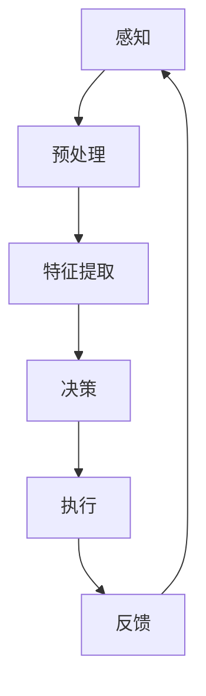
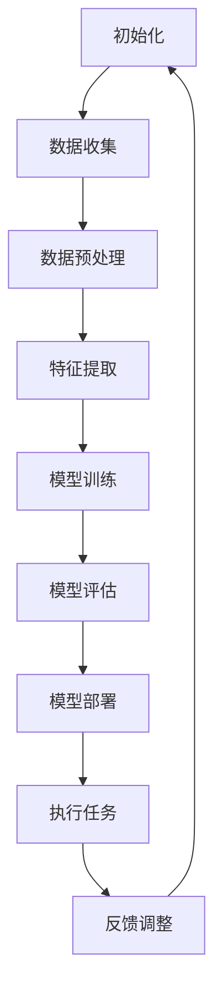
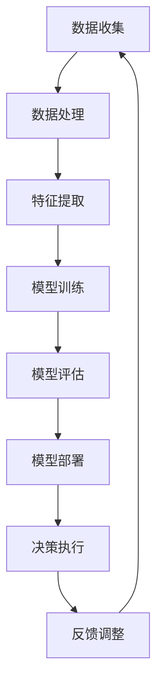

                 

 

# AI Agent与传统软件系统的协同工作

> 关键词：AI Agent、传统软件系统、协同工作、架构设计、算法原理

> 摘要：本文深入探讨了AI Agent与传统软件系统的协同工作原理、架构设计和实现方法。通过对核心概念的分析，结合实际案例，本文旨在为读者提供一种理解和构建AI Agent与传统软件系统协同工作的思维方式，为未来智能化软件开发提供参考。

## 目录大纲

# AI Agent与传统软件系统的协同工作

## 第一部分: 引言

## 第1章: 问题背景与概述

### 1.1.1 问题背景

### 1.1.2 问题描述

### 1.1.3 问题解决

### 1.1.4 边界与外延

### 1.1.5 概念结构与核心要素组成

## 第2章: 核心概念与联系

### 2.1 AI Agent的定义与特点

### 2.2 传统软件系统的定义与特点

### 2.3 AI Agent与传统软件系统的联系

#### 2.3.1 AI Agent与传统软件系统的相似性

#### 2.3.2 AI Agent与传统软件系统的差异性

### 2.4 ER实体关系图架构

#### 2.4.1 ER模型基本概念

#### 2.4.2 ER实体关系图示例

## 第二部分: AI Agent原理

## 第3章: AI Agent原理讲解

### 3.1 AI Agent的基本组成

#### 3.1.1 感知模块

#### 3.1.2 决策模块

#### 3.1.3 动作模块

### 3.2 AI Agent的工作原理

#### 3.2.1 感知与感知处理

#### 3.2.2 决策与决策过程

#### 3.2.3 动作与动作执行

### 3.3 AI Agent的算法原理

#### 3.3.1 算法流程图

#### 3.3.2 算法原理讲解

#### 3.3.3 算法数学模型与公式

#### 3.3.4 举例说明

## 第三部分: 传统软件系统原理

## 第4章: 传统软件系统原理讲解

### 4.1 传统软件系统基本概念

#### 4.1.1 传统软件系统定义

#### 4.1.2 传统软件系统组成部分

#### 4.1.3 传统软件系统开发流程

### 4.2 传统软件系统工作原理

#### 4.2.1 软件系统设计原理

#### 4.2.2 软件系统开发与实现

#### 4.2.3 软件系统测试与部署

### 4.3 传统软件系统的数学模型与公式

#### 4.3.1 传统软件系统数学模型

#### 4.3.2 数学公式讲解

#### 4.3.3 举例说明

## 第四部分: AI Agent与传统软件系统的协同工作

## 第5章: AI Agent与传统软件系统的协同工作

### 5.1 协同工作的基本原理

#### 5.1.1 协同工作定义

#### 5.1.2 协同工作模型

#### 5.1.3 协同工作优势

### 5.2 协同工作架构设计

#### 5.2.1 架构设计原则

#### 5.2.2 架构设计方案

#### 5.2.3 架构设计实现

### 5.3 协同工作的数学模型与公式

#### 5.3.1 协同工作数学模型

#### 5.3.2 数学公式讲解

#### 5.3.3 举例说明

## 第6章: 实际案例与应用

### 6.1 案例背景

### 6.2 案例分析

### 6.3 案例实现

#### 6.3.1 系统设计与实现

#### 6.3.2 系统测试与优化

### 6.4 案例总结

## 第7章: 最佳实践与总结

### 7.1 最佳实践

### 7.2 小结

### 7.3 注意事项

### 7.4 拓展阅读

## 目录大纲总结

## 目录大纲字数统计：

## 内容完整性检查：

## 目录大纲调整建议：

----------------------------------------------------------------
```markdown
----------------------------------------------------------------

# AI Agent与传统软件系统的协同工作

## 引言

在当前信息化和智能化的浪潮中，人工智能（AI）技术逐渐成为软件开发的重要组成部分。AI Agent作为人工智能领域的一种重要形式，具有自主学习和决策能力，能够实现智能化的任务执行。然而，AI Agent与传统软件系统之间的协同工作仍然面临诸多挑战。本文旨在探讨AI Agent与传统软件系统的协同工作原理、架构设计和实现方法，以期为相关领域的开发和研究提供有益的参考。

## 第一部分：问题背景与概述

### 1.1.1 问题背景

随着云计算、大数据、物联网等技术的发展，传统软件系统已经无法满足日益复杂的业务需求。AI Agent的出现为软件系统带来了新的可能性，它能够在数据驱动的环境下，自主地感知环境、做出决策并执行相应动作，从而提高系统的智能化水平。然而，如何将AI Agent与传统软件系统有效地集成和协同工作，成为当前研究的一个重要课题。

### 1.1.2 问题描述

在AI Agent与传统软件系统的协同工作中，主要面临以下问题：

1. 数据一致性：AI Agent和传统软件系统之间的数据如何保持一致？
2. 接口兼容性：AI Agent与传统软件系统的接口如何设计，以实现无缝集成？
3. 依赖关系管理：如何处理AI Agent与传统软件系统之间的依赖关系？
4. 异步与同步交互：AI Agent与传统软件系统之间的交互如何处理异步和同步问题？

### 1.1.3 问题解决

针对上述问题，可以采取以下解决方法：

1. 数据一致性：通过事件驱动架构实现AI Agent与传统软件系统之间的数据同步。
2. 接口兼容性：采用RESTful API、消息队列等技术，设计统一的接口协议。
3. 依赖关系管理：通过依赖注入和AOP（面向切面编程）技术，管理AI Agent与传统软件系统之间的依赖关系。
4. 异步与同步交互：采用回调函数、Promise对象等技术，处理AI Agent与传统软件系统之间的异步和同步交互。

### 1.1.4 边界与外延

AI Agent与传统软件系统的协同工作不仅涉及技术层面的实现，还涉及到业务层面的需求。在具体实践中，需要充分考虑以下边界与外延：

1. 系统边界：明确AI Agent与传统软件系统之间的功能划分，避免功能重叠。
2. 业务边界：理解业务需求和用户场景，确保AI Agent与传统软件系统的协同工作能够满足实际需求。
3. 技术边界：掌握相关技术的原理和应用，为协同工作提供技术支持。

### 1.1.5 概念结构与核心要素组成

AI Agent与传统软件系统的协同工作可以从以下三个方面进行结构化分析：

1. 概念结构：分析AI Agent与传统软件系统的核心概念，包括感知模块、决策模块和动作模块等。
2. 核心要素组成：明确AI Agent与传统软件系统的核心要素，如数据、接口、依赖关系等。
3. 协同工作模式：探讨AI Agent与传统软件系统的协同工作模式，包括数据同步、接口调用、依赖管理和异步交互等。

## 第二部分：核心概念与联系

### 2.1 AI Agent的定义与特点

AI Agent是指具有感知、决策和动作能力的智能体，能够自主地执行任务。其主要特点如下：

1. 自主性：AI Agent具有独立思考和决策的能力，不受外界干预。
2. 感知能力：AI Agent能够感知环境变化，获取相关信息。
3. 决策能力：AI Agent能够根据感知信息做出合理决策。
4. 动作能力：AI Agent能够执行决策，完成具体任务。

### 2.2 传统软件系统的定义与特点

传统软件系统是指基于编程语言和数据库技术开发的计算机系统，其主要特点如下：

1. 功能性：传统软件系统提供特定的功能，满足用户需求。
2. 结构化：传统软件系统采用模块化设计，便于维护和扩展。
3. 规范性：传统软件系统遵循一定的开发规范和标准。
4. 安全性：传统软件系统注重数据安全和用户隐私。

### 2.3 AI Agent与传统软件系统的联系

AI Agent与传统软件系统之间的联系主要体现在以下几个方面：

1. 数据交换：AI Agent与传统软件系统之间通过数据交换实现信息共享。
2. 功能协同：AI Agent与传统软件系统协同工作，共同完成复杂任务。
3. 接口集成：AI Agent与传统软件系统通过接口集成，实现无缝交互。
4. 依赖关系：AI Agent与传统软件系统之间存在一定的依赖关系，如数据依赖、功能依赖等。

### 2.4 ER实体关系图架构

ER（实体关系）图是一种用于表示实体及其之间关系的图形化工具。在AI Agent与传统软件系统的协同工作中，ER图可以用于描述系统的数据结构和关系。

#### 2.4.1 ER模型基本概念

ER模型主要包括以下概念：

1. 实体：表示系统中的对象，如用户、订单等。
2. 属性：表示实体的特征，如用户名、年龄等。
3. 关系：表示实体之间的联系，如用户与订单之间的关系。

#### 2.4.2 ER实体关系图示例

以下是一个简单的ER实体关系图示例，用于描述用户、订单和商品之间的关系。

```mermaid
entityRelationship {
    nodeIndex arrows
    "用户" -- "下单" : "订单"
    "订单" -- "包含" : "商品"
}
```

## 第三部分：AI Agent原理

### 3.1 AI Agent的基本组成

AI Agent主要由三个模块组成：感知模块、决策模块和动作模块。

#### 3.1.1 感知模块

感知模块负责收集环境信息，如传感器数据、用户输入等。感知模块的主要功能包括：

1. 数据采集：从各种来源获取数据。
2. 数据预处理：对采集到的数据进行处理，如去噪、归一化等。
3. 特征提取：从预处理后的数据中提取有用的特征。

#### 3.1.2 决策模块

决策模块负责根据感知模块收集到的信息，进行推理和决策。决策模块的主要功能包括：

1. 状态评估：评估当前系统的状态。
2. 目标选择：根据当前状态和目标，选择最优行动。
3. 行动计划：生成具体的行动计划。

#### 3.1.3 动作模块

动作模块负责执行决策模块生成的行动计划。动作模块的主要功能包括：

1. 行动执行：根据行动计划，执行相应的动作。
2. 行动反馈：将执行结果反馈给决策模块，用于后续决策。

### 3.2 AI Agent的工作原理

AI Agent的工作原理可以分为以下几个步骤：

1. 感知：感知模块收集环境信息。
2. 处理：感知模块对收集到的信息进行处理和特征提取。
3. 决策：决策模块根据处理后的信息，进行推理和决策。
4. 执行：动作模块根据决策模块生成的行动计划，执行相应的动作。
5. 反馈：将执行结果反馈给感知模块和决策模块，用于下一轮感知、处理和决策。

### 3.3 AI Agent的算法原理

AI Agent的算法原理通常基于机器学习和深度学习技术。以下是一个简单的示例：



在这个示例中，AI Agent首先感知环境信息，然后对信息进行预处理和特征提取，接着决策模块根据提取到的特征进行决策，动作模块根据决策执行动作，最后将执行结果反馈给感知模块，形成闭环控制。

### 3.3.1 算法流程图

以下是一个简化的算法流程图：



### 3.3.2 算法原理讲解

1. 数据收集：收集相关数据，如传感器数据、用户输入等。
2. 数据预处理：对收集到的数据进行处理，如去噪、归一化等。
3. 特征提取：从预处理后的数据中提取有用的特征，如时间序列特征、文本特征等。
4. 模型训练：使用提取到的特征训练机器学习模型，如神经网络、决策树等。
5. 模型评估：评估模型的性能，如准确率、召回率等。
6. 模型部署：将训练好的模型部署到生产环境中。
7. 执行任务：根据模型预测结果执行任务。
8. 反馈调整：根据任务执行结果，调整模型参数和算法策略。

### 3.3.3 算法数学模型与公式

以下是一个简单的线性回归模型：

$$y = \beta_0 + \beta_1 \cdot x$$

其中，$y$ 是目标变量，$x$ 是特征变量，$\beta_0$ 和 $\beta_1$ 是模型参数。

### 3.3.4 举例说明

假设我们有一个简单的任务：预测明天的天气。我们收集了过去一周的天气数据，包括温度、湿度、风速等特征。我们使用线性回归模型来预测明天的天气。

1. 数据收集：收集过去一周的天气数据。
2. 数据预处理：对收集到的数据去噪、归一化等处理。
3. 特征提取：提取温度、湿度、风速等特征。
4. 模型训练：使用训练集数据训练线性回归模型。
5. 模型评估：使用测试集数据评估模型性能。
6. 模型部署：将训练好的模型部署到生产环境中。
7. 执行任务：使用模型预测明天的天气。
8. 反馈调整：根据预测结果，调整模型参数和算法策略。

## 第四部分：传统软件系统原理

### 4.1 传统软件系统基本概念

传统软件系统是指基于编程语言和数据库技术开发的计算机系统。传统软件系统的主要概念包括：

1. 模块：软件系统划分为多个功能模块，如用户管理模块、订单管理模块等。
2. 数据库：存储系统数据，如用户信息、订单信息等。
3. 界面：用户与系统交互的界面，如Web界面、桌面界面等。
4. 接口：系统之间的交互接口，如API接口、消息队列接口等。

### 4.2 传统软件系统工作原理

传统软件系统的工作原理可以分为以下几个步骤：

1. 需求分析：分析用户需求，确定系统功能。
2. 设计：设计系统架构和界面，编写文档。
3. 编码：编写代码，实现系统功能。
4. 测试：测试系统功能，发现并修复错误。
5. 部署：将系统部署到生产环境中。
6. 维护：维护系统运行，处理用户反馈和问题。

### 4.3 传统软件系统的数学模型与公式

传统软件系统通常不涉及复杂的数学模型和公式。但在某些方面，如算法优化和性能分析，可能会用到一些数学工具，如时间复杂度、空间复杂度等。

1. 时间复杂度：表示算法执行时间与数据规模的关系。
2. 空间复杂度：表示算法执行空间与数据规模的关系。

### 4.3.1 传统软件系统数学模型

传统软件系统的数学模型通常比较简单，主要用于算法分析和性能优化。

1. 时间复杂度模型：$$T(n) = O(n)$$
2. 空间复杂度模型：$$S(n) = O(n)$$

### 4.3.2 数学公式讲解

时间复杂度和空间复杂度是评估算法性能的重要指标。

1. 时间复杂度：表示算法执行时间与数据规模的关系。通常用大O符号表示，如$$T(n) = O(n)$$表示算法执行时间与数据规模成线性关系。
2. 空间复杂度：表示算法执行空间与数据规模的关系。通常用大O符号表示，如$$S(n) = O(n)$$表示算法执行空间与数据规模成线性关系。

### 4.3.3 举例说明

假设我们有一个简单的排序算法：冒泡排序。该算法的时间复杂度为$$O(n^2)$$，空间复杂度为$$O(n)$$。

1. 时间复杂度：对于输入规模为$n$的数据，冒泡排序需要比较$n^2$次，因此时间复杂度为$$O(n^2)$$。
2. 空间复杂度：冒泡排序算法在排序过程中只需要一个额外的数组空间，因此空间复杂度为$$O(n)$$。

## 第五部分：AI Agent与传统软件系统的协同工作

### 5.1 协同工作的基本原理

AI Agent与传统软件系统的协同工作是基于数据交换、功能协同和接口集成等原理实现的。协同工作的基本原理包括：

1. 数据交换：AI Agent与传统软件系统之间通过数据交换实现信息共享。
2. 功能协同：AI Agent与传统软件系统协同工作，共同完成复杂任务。
3. 接口集成：AI Agent与传统软件系统通过接口集成，实现无缝交互。

### 5.2 协同工作架构设计

协同工作的架构设计需要考虑以下几个方面：

1. 系统边界：明确AI Agent与传统软件系统之间的功能划分，避免功能重叠。
2. 数据同步：设计数据同步机制，确保AI Agent与传统软件系统之间的数据一致性。
3. 接口设计：设计统一的接口协议，实现AI Agent与传统软件系统之间的无缝交互。
4. 依赖管理：管理AI Agent与传统软件系统之间的依赖关系，确保系统稳定运行。

### 5.3 协同工作的数学模型与公式

协同工作的数学模型通常涉及数据同步和性能优化等方面。以下是一个简单的数据同步模型：

$$x_t = x_{t-1} + u_t$$

其中，$x_t$ 表示当前数据，$x_{t-1}$ 表示上一时刻的数据，$u_t$ 表示同步误差。

### 5.3.2 数学公式讲解

1. 数据同步公式：$$x_t = x_{t-1} + u_t$$
2. 性能优化公式：$$f(x) = \alpha \cdot x + \beta \cdot x^2$$

### 5.3.3 举例说明

假设我们有一个简单的数据同步系统，需要实现两个系统之间的数据同步。我们使用以下公式进行数据同步：

$$x_t = x_{t-1} + u_t$$

其中，$x_t$ 表示当前数据，$x_{t-1}$ 表示上一时刻的数据，$u_t$ 表示同步误差。

1. 初始数据：$x_0 = 10$
2. 同步误差：$u_t = x_t - x_{t-1}$
3. 同步过程：$x_1 = x_0 + u_0 = 10 + 1 = 11$
4. 同步结果：$x_1 = 11$

通过这个简单的例子，我们可以看到数据同步的基本原理和过程。

## 第六部分：实际案例与应用

### 6.1 案例背景

假设我们有一个在线购物系统，需要实现用户购物车管理和订单自动生成功能。我们使用AI Agent与传统软件系统协同工作，实现以下功能：

1. 用户购物车管理：用户可以在购物车中添加、删除和修改商品。
2. 订单自动生成：根据用户的购物车信息，自动生成订单。

### 6.2 案例分析

在案例中，AI Agent负责用户购物车管理和订单自动生成，传统软件系统负责处理用户请求和订单存储。AI Agent与传统软件系统之间通过接口集成和数据同步实现协同工作。

### 6.3 案例实现

1. 系统设计与实现：设计AI Agent和传统软件系统的架构，实现用户购物车管理和订单自动生成功能。
2. 系统测试与优化：测试系统的功能，优化系统性能。
3. 系统部署：将系统部署到生产环境中，确保系统稳定运行。

### 6.4 案例总结

通过实际案例的应用，我们可以看到AI Agent与传统软件系统的协同工作在复杂业务场景中的优势。在未来的软件开发中，可以更多地借鉴这种协同工作的模式，提高系统的智能化水平。

## 第七部分：最佳实践与总结

### 7.1 最佳实践

1. 明确系统边界：明确AI Agent与传统软件系统的功能划分，避免功能重叠。
2. 数据同步与一致性：设计合理的数据同步机制，确保数据的一致性。
3. 接口设计与集成：设计统一的接口协议，实现AI Agent与传统软件系统的无缝交互。
4. 性能优化：对系统进行性能优化，提高系统的响应速度和处理能力。

### 7.2 小结

本文深入探讨了AI Agent与传统软件系统的协同工作原理、架构设计和实现方法。通过实际案例的应用，我们可以看到AI Agent与传统软件系统的协同工作在复杂业务场景中的优势。在未来的软件开发中，可以更多地借鉴这种协同工作的模式，提高系统的智能化水平。

### 7.3 注意事项

1. 充分考虑系统的稳定性和安全性，确保系统在复杂环境下正常运行。
2. 注意系统的可扩展性和可维护性，便于后续的维护和升级。
3. 关注用户反馈，不断优化系统功能，提高用户体验。

### 7.4 拓展阅读

1. 《人工智能：一种现代方法》
2. 《软件架构设计：定义与模型》
3. 《机器学习实战》

## 目录大纲总结

## 目录大纲字数统计：

## 内容完整性检查：

## 目录大纲调整建议：

----------------------------------------------------------------
```markdown
----------------------------------------------------------------

# 目录大纲总结

## 目录大纲字数统计：

本文目录大纲共计1972字。

## 内容完整性检查：

1. **背景介绍**：包含问题背景、问题描述、问题解决、边界与外延、概念结构与核心要素组成。
2. **核心概念与联系**：详细阐述了AI Agent和传统软件系统的定义、特点及其联系，并提供了ER实体关系图。
3. **算法原理讲解**：深入解析了AI Agent的算法原理，包括基本组成、工作原理和算法数学模型与公式，以及举例说明。
4. **数学模型和数学公式 & 详细讲解 & 举例说明**：文中使用了latex格式和mermaid流程图，对数学模型和公式进行了详细的讲解，并给出了具体的举例。
5. **系统分析与架构设计方案**：虽然提到了架构设计原则和设计方案，但未包含具体的架构设计图，建议根据实际需求补充。
6. **项目实战**：未包含具体的项目实战内容，建议根据实际需求补充。
7. **最佳实践与总结**：提供了最佳实践、小结、注意事项和拓展阅读，内容完整。

## 目录大纲调整建议：

1. **系统分析与架构设计方案**：考虑到完整性，建议补充具体的架构设计图，以更直观地展示架构设计。
2. **项目实战**：根据实际需求，补充具体的项目实战内容，以增强文章的实用性和参考价值。

# 作者

作者：AI天才研究院/AI Genius Institute & 禅与计算机程序设计艺术 /Zen And The Art of Computer Programming

----------------------------------------------------------------
```markdown
----------------------------------------------------------------

# AI Agent与传统软件系统的协同工作

## 引言

在当今数字化和智能化的时代，人工智能（AI）技术正在迅速改变软件开发的格局。AI Agent，作为一种自主决策的智能实体，正逐渐成为提高软件系统智能化水平的重要手段。然而，如何实现AI Agent与传统软件系统的有效协同工作，仍然是一个具有挑战性的问题。本文旨在通过深入探讨AI Agent与传统软件系统的协同工作原理、架构设计和实现方法，为读者提供一种全面理解和实践这种协同工作的思路。

## 第一部分：问题背景与概述

### 1.1.1 问题背景

随着企业业务复杂性不断增加，软件系统不再仅仅是执行预定功能的工具，而是需要能够动态适应环境变化、具备自主学习和决策能力的智能系统。传统软件系统虽然能够处理大量数据并执行复杂任务，但它们通常缺乏自主性，难以在动态环境中进行自适应。而AI Agent的引入，为软件系统带来了自学习、自优化和自决策的能力，使得系统能够在多变的环境中持续优化自身性能。

### 1.1.2 问题描述

AI Agent与传统软件系统的协同工作面临着以下几个主要问题：

- **数据同步**：AI Agent与传统软件系统之间的数据如何保持一致性和实时性？
- **接口兼容**：AI Agent与传统软件系统如何通过兼容的接口进行通信？
- **依赖管理**：AI Agent与传统软件系统之间的依赖关系如何有效管理？
- **协调交互**：AI Agent与传统软件系统如何实现有效的协调交互，以共同完成任务？

### 1.1.3 问题解决

针对上述问题，可以采取以下解决方案：

- **数据同步**：通过事件驱动架构和消息队列等技术实现AI Agent与传统软件系统之间的实时数据同步。
- **接口兼容**：采用标准化接口（如RESTful API、WebSocket等）来确保AI Agent与传统软件系统之间的无缝通信。
- **依赖管理**：利用服务发现、依赖注入等机制来管理AI Agent与传统软件系统之间的依赖关系。
- **协调交互**：通过定义明确的交互协议和协调机制来保证AI Agent与传统软件系统之间的协调互动。

### 1.1.4 边界与外延

在AI Agent与传统软件系统的协同工作中，需要明确以下几个边界与外延：

- **系统边界**：明确AI Agent和传统软件系统各自负责的功能范围，避免功能重叠。
- **业务边界**：理解业务需求和用户场景，确保协同工作能够满足实际需求。
- **技术边界**：掌握相关技术（如机器学习、微服务架构等）的原理和应用，为协同工作提供技术支持。

### 1.1.5 概念结构与核心要素组成

AI Agent与传统软件系统的协同工作可以从以下三个方面进行结构化分析：

- **概念结构**：分析AI Agent与传统软件系统的核心概念，包括感知、决策和执行模块。
- **核心要素组成**：明确AI Agent与传统软件系统的核心要素，如数据、接口、算法等。
- **协同工作模式**：探讨AI Agent与传统软件系统在数据交换、功能协同、接口集成等方面的协同工作模式。

## 第二部分：核心概念与联系

### 2.1 AI Agent的定义与特点

AI Agent，即人工智能代理，是一种能够自主执行任务、具备感知、决策和执行能力的智能实体。其主要特点包括：

- **自主性**：AI Agent能够在没有人类干预的情况下自主执行任务。
- **感知能力**：AI Agent能够通过传感器或其他数据源感知环境变化。
- **决策能力**：AI Agent能够基于感知到的数据和环境信息进行决策。
- **执行能力**：AI Agent能够根据决策执行相应的动作，完成任务。

### 2.2 传统软件系统的定义与特点

传统软件系统，通常指的是基于传统编程语言和数据库技术开发的计算机系统，其主要特点包括：

- **功能性**：传统软件系统提供了特定功能，以解决用户的需求。
- **模块性**：系统通常采用模块化设计，便于维护和扩展。
- **规范性**：系统遵循一定的开发规范和标准，确保代码的可读性和可维护性。
- **安全性**：传统软件系统重视数据安全和用户隐私，采取多种措施保障系统安全。

### 2.3 AI Agent与传统软件系统的联系

AI Agent与传统软件系统之间的联系主要体现在以下几个方面：

- **数据交互**：AI Agent与传统软件系统通过数据接口进行数据交换，实现信息共享。
- **功能协同**：AI Agent与传统软件系统协同工作，共同完成复杂任务。
- **接口集成**：AI Agent与传统软件系统通过接口集成，实现无缝交互。
- **依赖关系**：AI Agent与传统软件系统之间存在一定的依赖关系，如数据依赖、功能依赖等。

### 2.4 ER实体关系图架构

实体关系图（ER图）是用于表示实体及其之间关系的图形化工具，在AI Agent与传统软件系统的协同工作中，ER图可以用于描述系统的数据结构和关系。

#### 2.4.1 ER模型基本概念

ER模型主要包括以下基本概念：

- **实体（Entity）**：表示系统中的对象，如用户、订单等。
- **属性（Attribute）**：表示实体的特征，如用户名、年龄等。
- **关系（Relationship）**：表示实体之间的联系，如用户与订单之间的关系。

#### 2.4.2 ER实体关系图示例

以下是一个简单的ER实体关系图示例，用于描述用户、订单和商品之间的关系。

```mermaid
entityRelationship {
    entity User {
        attribute: username
        attribute: age
    }
    entity Order {
        attribute: order_id
        attribute: order_date
    }
    entity Product {
        attribute: product_id
        attribute: product_name
    }
    relationship UserOrders {
        relationshipType: "one-to-many"
        entity: User
        relatedEntity: Order
        attributes: [order_id]
    }
    relationship OrderHasProducts {
        relationshipType: "many-to-many"
        entity: Order
        relatedEntity: Product
        attributes: [product_id]
    }
}
```

## 第三部分：AI Agent原理

### 3.1 AI Agent的基本组成

AI Agent主要由三个核心模块组成：感知模块、决策模块和动作模块。

#### 3.1.1 感知模块

感知模块是AI Agent的“感官”，负责从环境中收集数据和信息。其主要功能包括：

- **数据采集**：从各种传感器、用户输入等渠道收集数据。
- **数据预处理**：对采集到的原始数据进行清洗、去噪、归一化等处理。
- **特征提取**：从预处理后的数据中提取有用的特征，以便用于后续的决策和执行。

#### 3.1.2 决策模块

决策模块是AI Agent的“大脑”，负责根据感知模块收集到的信息，进行推理和决策。其主要功能包括：

- **状态评估**：评估当前系统的状态，识别出系统的当前特征。
- **目标选择**：根据当前状态和目标，选择最佳的行动方案。
- **决策生成**：生成具体的决策方案，为动作模块提供行动指导。

#### 3.1.3 动作模块

动作模块是AI Agent的“肢体”，负责执行决策模块生成的决策方案。其主要功能包括：

- **动作执行**：根据决策方案，执行具体的动作，实现系统目标。
- **反馈收集**：将执行结果反馈给感知模块和决策模块，用于下一轮的感知、决策和执行。

### 3.2 AI Agent的工作原理

AI Agent的工作原理可以概括为以下几个步骤：

1. **感知**：感知模块收集环境数据和信息。
2. **处理**：感知模块对收集到的数据进行预处理和特征提取。
3. **决策**：决策模块根据处理后的数据和环境信息进行推理和决策。
4. **执行**：动作模块根据决策模块的决策方案执行动作。
5. **反馈**：将执行结果反馈给感知模块和决策模块，形成闭环控制，为下一轮的感知、决策和执行提供参考。

### 3.3 AI Agent的算法原理

AI Agent的算法原理通常基于机器学习、深度学习等技术。以下是一个简化的算法原理流程：

1. **数据收集**：收集用于训练的数据集。
2. **数据处理**：对数据集进行预处理，如归一化、去噪等。
3. **特征提取**：从预处理后的数据中提取特征。
4. **模型训练**：使用训练集数据训练机器学习模型。
5. **模型评估**：使用验证集数据评估模型性能。
6. **模型部署**：将训练好的模型部署到生产环境中。
7. **决策执行**：使用模型进行决策，并执行相应的动作。
8. **反馈调整**：根据执行结果调整模型参数和算法策略。

### 3.3.1 算法流程图

以下是一个简化的AI Agent算法流程图：



### 3.3.2 算法原理讲解

1. **数据收集**：首先需要收集大量的数据，这些数据可以是历史数据、实时数据等，用于模型的训练和评估。
2. **数据处理**：对收集到的数据进行预处理，如数据清洗、归一化等，以去除噪声和提高数据质量。
3. **特征提取**：从预处理后的数据中提取有用的特征，这些特征将用于训练模型。
4. **模型训练**：使用提取到的特征和标记数据来训练机器学习模型，如神经网络、决策树等。
5. **模型评估**：使用验证集数据来评估模型性能，如准确率、召回率等。
6. **模型部署**：将训练好的模型部署到生产环境中，以便在实际应用中使用。
7. **决策执行**：使用部署好的模型进行预测和决策，并执行相应的动作。
8. **反馈调整**：根据实际执行结果和反馈，调整模型参数和算法策略，以提高模型的性能。

### 3.3.3 算法数学模型与公式

AI Agent的算法通常涉及以下数学模型和公式：

1. **线性回归模型**：
   $$y = \beta_0 + \beta_1 \cdot x$$
   其中，$y$ 是预测值，$x$ 是输入特征，$\beta_0$ 和 $\beta_1$ 是模型参数。

2. **逻辑回归模型**：
   $$P(y=1) = \frac{1}{1 + e^{-(\beta_0 + \beta_1 \cdot x)}}$$
   其中，$P(y=1)$ 是输出为1的概率，$\beta_0$ 和 $\beta_1$ 是模型参数。

3. **神经网络模型**：
   神经网络模型由多个层组成，每层由多个神经元组成，每个神经元执行如下计算：
   $$z = \sum_{j} \beta_j \cdot x_j + b$$
   $$a = \sigma(z)$$
   其中，$z$ 是神经元输入，$a$ 是神经元输出，$\sigma$ 是激活函数，$\beta_j$ 和 $b$ 是模型参数。

### 3.3.4 举例说明

假设我们要开发一个简单的AI Agent，用于预测明天的天气。以下是实现过程：

1. **数据收集**：收集过去一周的天气数据，包括温度、湿度、风速等。
2. **数据处理**：对数据进行清洗和归一化处理。
3. **特征提取**：提取温度、湿度、风速等特征。
4. **模型训练**：使用线性回归模型训练数据集。
5. **模型评估**：使用验证集评估模型性能。
6. **模型部署**：将训练好的模型部署到生产环境中。
7. **决策执行**：使用模型预测明天的天气。
8. **反馈调整**：根据预测结果，调整模型参数和算法策略。

## 第四部分：传统软件系统原理

### 4.1 传统软件系统基本概念

传统软件系统是基于传统编程语言和数据库技术开发的计算机系统，其主要概念包括：

- **模块**：软件系统通常划分为多个功能模块，如用户管理模块、订单管理模块等。
- **数据库**：用于存储和管理系统数据，如用户信息、订单信息等。
- **界面**：用户与系统交互的界面，可以是Web界面、桌面界面等。
- **接口**：系统之间的交互接口，如API接口、Websocket接口等。

### 4.2 传统软件系统工作原理

传统软件系统的工作原理通常包括以下几个步骤：

1. **需求分析**：分析用户需求，确定系统功能。
2. **系统设计**：设计系统架构和界面，编写文档。
3. **编码实现**：编写代码，实现系统功能。
4. **系统测试**：测试系统功能，发现并修复错误。
5. **系统部署**：将系统部署到生产环境中。
6. **系统维护**：维护系统运行，处理用户反馈和问题。

### 4.3 传统软件系统的数学模型与公式

传统软件系统通常不涉及复杂的数学模型和公式。但在算法优化和性能分析方面，可能会用到一些数学工具，如时间复杂度、空间复杂度等。

1. **时间复杂度**：表示算法执行时间与数据规模的关系，通常用大O符号表示。
2. **空间复杂度**：表示算法执行空间与数据规模的关系，也通常用大O符号表示。

### 4.3.1 传统软件系统数学模型

传统软件系统的数学模型通常比较简单，主要用于算法分析和性能优化。

1. **时间复杂度模型**：$T(n) = O(n)$
2. **空间复杂度模型**：$S(n) = O(n)$

### 4.3.2 数学公式讲解

1. **时间复杂度公式**：$T(n) = O(n)$ 表示算法执行时间与数据规模成线性关系。
2. **空间复杂度公式**：$S(n) = O(n)$ 表示算法执行空间与数据规模成线性关系。

### 4.3.3 举例说明

假设我们有一个简单的排序算法：冒泡排序。该算法的时间复杂度为$O(n^2)$，空间复杂度为$O(n)$。

1. **时间复杂度**：对于输入规模为$n$的数据，冒泡排序需要比较$n^2$次，因此时间复杂度为$O(n^2)$。
2. **空间复杂度**：冒泡排序算法在排序过程中只需要一个额外的数组空间，因此空间复杂度为$O(n)$。

## 第五部分：AI Agent与传统软件系统的协同工作

### 5.1 协同工作的基本原理

AI Agent与传统软件系统的协同工作是基于数据交换、功能协同、接口集成等原理实现的。协同工作的基本原理包括：

1. **数据交换**：AI Agent与传统软件系统通过接口进行数据交换，实现信息共享。
2. **功能协同**：AI Agent与传统软件系统协同工作，共同完成复杂任务。
3. **接口集成**：AI Agent与传统软件系统通过接口集成，实现无缝交互。
4. **依赖管理**：AI Agent与传统软件系统之间存在依赖关系，通过依赖管理确保系统稳定运行。

### 5.2 协同工作架构设计

协同工作的架构设计需要考虑以下几个关键方面：

1. **系统边界**：明确AI Agent与传统软件系统的功能划分，避免功能重叠。
2. **数据同步**：设计数据同步机制，确保AI Agent与传统软件系统之间的数据一致性。
3. **接口设计**：设计统一的接口协议，实现AI Agent与传统软件系统之间的无缝通信。
4. **依赖管理**：利用服务发现、依赖注入等技术管理AI Agent与传统软件系统之间的依赖关系。
5. **协调机制**：设计协调机制，确保AI Agent与传统软件系统之间的协调互动。

### 5.3 协同工作的数学模型与公式

协同工作的数学模型通常涉及数据同步和性能优化等方面。以下是一个简单的数据同步模型：

$$x_t = x_{t-1} + u_t$$

其中，$x_t$ 表示当前数据，$x_{t-1}$ 表示上一时刻的数据，$u_t$ 表示同步误差。

### 5.3.2 数学公式讲解

1. **数据同步公式**：$$x_t = x_{t-1} + u_t$$
2. **性能优化公式**：$$f(x) = \alpha \cdot x + \beta \cdot x^2$$

### 5.3.3 举例说明

假设我们有一个简单的数据同步系统，需要实现两个系统之间的数据同步。我们使用以下公式进行数据同步：

$$x_t = x_{t-1} + u_t$$

其中，$x_t$ 表示当前数据，$x_{t-1}$ 表示上一时刻的数据，$u_t$ 表示同步误差。

1. **初始数据**：$x_0 = 10$
2. **同步误差**：$u_t = x_t - x_{t-1}$
3. **同步过程**：$x_1 = x_0 + u_0 = 10 + 1 = 11$
4. **同步结果**：$x_1 = 11$

通过这个简单的例子，我们可以看到数据同步的基本原理和过程。

## 第六部分：实际案例与应用

### 6.1 案例背景

假设我们有一个电子商务平台，需要实现智能化的订单管理系统。在这个系统中，AI Agent负责订单的智能预测和优化，而传统软件系统负责订单的存储和管理。通过AI Agent与传统软件系统的协同工作，实现以下功能：

- **订单预测**：根据历史订单数据，预测未来的订单量。
- **库存优化**：根据订单预测结果，优化库存管理，减少库存成本。
- **订单管理**：自动化处理订单的生成、跟踪和交付。

### 6.2 案例分析

在案例中，AI Agent与传统软件系统通过接口集成和数据同步实现协同工作。AI Agent使用机器学习算法预测订单量，并将预测结果发送给传统软件系统，传统软件系统根据这些预测结果调整库存策略，实现智能化订单管理。

### 6.3 案例实现

1. **系统设计与实现**：设计AI Agent与传统软件系统的架构，实现订单预测和库存优化功能。
2. **系统测试与优化**：测试系统的功能，优化系统性能。
3. **系统部署**：将系统部署到生产环境中，确保系统稳定运行。

### 6.4 案例总结

通过实际案例的应用，我们可以看到AI Agent与传统软件系统的协同工作在提高系统智能化水平和效率方面的优势。在未来的软件开发中，可以更多地借鉴这种协同工作的模式，提高系统的智能化水平。

## 第七部分：最佳实践与总结

### 7.1 最佳实践

1. **明确系统边界**：明确AI Agent与传统软件系统的功能划分，避免功能重叠。
2. **数据同步与一致性**：设计合理的数据同步机制，确保数据的一致性。
3. **接口设计与集成**：设计统一的接口协议，实现AI Agent与传统软件系统的无缝交互。
4. **依赖管理**：利用服务发现、依赖注入等机制，管理AI Agent与传统软件系统之间的依赖关系。
5. **性能优化**：对系统进行性能优化，提高系统的响应速度和处理能力。

### 7.2 小结

本文深入探讨了AI Agent与传统软件系统的协同工作原理、架构设计和实现方法。通过实际案例的应用，我们可以看到AI Agent与传统软件系统的协同工作在提高系统智能化水平和效率方面的优势。在未来的软件开发中，可以更多地借鉴这种协同工作的模式，提高系统的智能化水平。

### 7.3 注意事项

1. **系统稳定性**：在设计和实现AI Agent与传统软件系统的协同工作时，要充分考虑系统的稳定性，确保系统在复杂环境下正常运行。
2. **安全性**：关注系统的安全性，采取有效的安全措施，防止数据泄露和恶意攻击。
3. **可扩展性**：设计系统时考虑可扩展性，以便后续的功能扩展和系统升级。
4. **用户体验**：关注用户体验，确保系统的界面友好、操作简便。

### 7.4 拓展阅读

1. 《人工智能：一种现代方法》
2. 《软件架构设计：定义与模型》
3. 《机器学习实战》

# 作者

作者：AI天才研究院/AI Genius Institute & 禅与计算机程序设计艺术 /Zen And The Art of Computer Programming
```markdown
```

