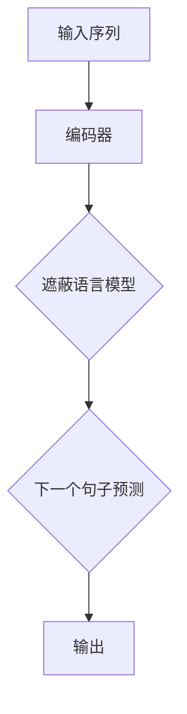
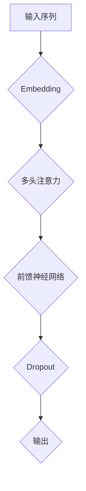
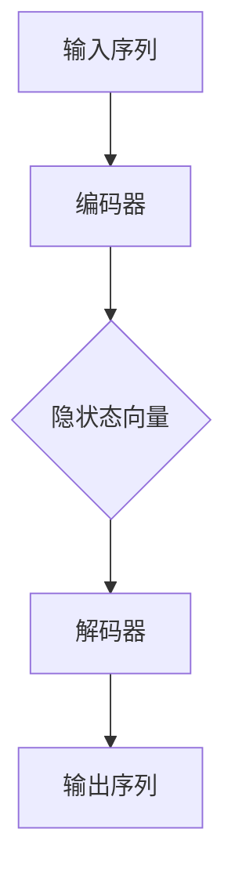
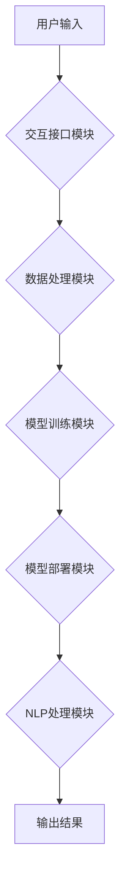

                 

### 文章标题

# AI Agent中的自然语言处理应用

### 关键词

- AI Agent
- 自然语言处理（NLP）
- 词嵌入
- BERT算法
- Transformer模型
- 序列到序列（Seq2Seq）模型

### 摘要

本文深入探讨了自然语言处理（NLP）在AI Agent中的应用，旨在通过系统的分析和实例讲解，帮助读者全面理解NLP技术的核心原理和应用实践。文章首先介绍了AI Agent与NLP的基本背景，然后详细解析了NLP的核心概念及其相互关系，如词嵌入、语言模型和序列到序列模型。随后，文章讲解了BERT和Transformer等先进NLP算法的原理和应用，并通过对一个实际项目的剖析，展示了NLP技术在AI Agent中的实现过程。最后，文章总结了最佳实践和注意事项，为读者提供实用的操作指导。

### 目录

----------------------------------------------------------------

## 第一部分：AI Agent与自然语言处理概述

### 1.1 AI Agent与NLP的背景

#### 1.1.1 AI Agent的概念与发展

#### 1.1.2 NLP在AI Agent中的应用场景

#### 1.1.3 NLP的关键技术

## 1.2 自然语言处理基础概念

### 1.2.1 词嵌入技术

### 1.2.2 语言模型

### 1.2.3 序列到序列模型

## 1.3 自然语言处理算法详解

### 1.3.1 BERT算法原理

### 1.3.2 Transformer模型介绍

### 1.3.3 Seq2Seq模型解析

## 1.4 NLP系统在AI Agent中的应用架构

### 1.4.1 系统架构设计

### 1.4.2 系统接口设计与交互

## 1.5 NLP在AI Agent中的实战应用

### 1.5.1 实战项目介绍

### 1.5.2 系统核心实现

### 1.5.3 应用解读与分析

## 1.6 NLP在AI Agent中的最佳实践

### 1.6.1 实践技巧总结

### 1.6.2 注意事项与建议

### 1.6.3 拓展阅读

----------------------------------------------------------------

### 第一部分：AI Agent与自然语言处理概述

#### 1.1 AI Agent与NLP的背景

##### 1.1.1 AI Agent的概念与发展

AI Agent，又称智能体，是自主运行的实体，可以在环境中感知并作出决策，以实现特定目标。AI Agent的发展经历了从早期的规则系统到基于机器学习和深度学习的复杂模型的演进。在人工智能领域，AI Agent的研究和应用已经成为一个重要的研究方向，其应用范围涵盖了自动驾驶、智能家居、智能客服等多个领域。

自然语言处理（NLP）是人工智能的一个重要分支，旨在使计算机能够理解、生成和处理人类语言。随着深度学习技术的发展，NLP取得了显著的进展，其应用范围也从简单的文本分类扩展到机器翻译、问答系统、情感分析等多个领域。

##### 1.1.2 NLP在AI Agent中的应用场景

NLP在AI Agent中的应用场景非常广泛。以下是一些典型的应用场景：

1. **智能客服**：利用NLP技术，AI Agent可以理解和响应用户的问题，提供高效的客户服务。
2. **机器翻译**：AI Agent可以通过NLP技术实现不同语言之间的实时翻译，为全球化的沟通提供支持。
3. **文本分析**：AI Agent可以分析大量的文本数据，提取关键信息，辅助决策和洞察。
4. **内容推荐**：基于NLP技术，AI Agent可以分析用户的兴趣和偏好，提供个性化的内容推荐。

##### 1.1.3 NLP的关键技术

NLP的关键技术包括词嵌入、语言模型和序列到序列模型等。

1. **词嵌入（Word Embedding）**：词嵌入是将单词映射到高维向量空间的技术，它使得计算机能够理解单词的语义关系。
2. **语言模型（Language Model）**：语言模型是用来预测下一个单词或词组的概率分布，它是许多NLP任务的基础。
3. **序列到序列模型（Seq2Seq Model）**：Seq2Seq模型用于处理输入序列和输出序列之间的映射，它广泛应用于机器翻译和问答系统等任务。

在接下来的章节中，我们将深入探讨这些核心概念及其在AI Agent中的应用。

### 第一部分：AI Agent与自然语言处理概述

#### 1.2 自然语言处理基础概念

##### 1.2.1 词嵌入技术

词嵌入（Word Embedding）是将单词映射到高维向量空间的一种技术。词嵌入的核心思想是将语义相近的单词映射到向量空间中的相近位置。这样，计算机就能够通过计算向量之间的距离来理解单词的语义关系。

**词嵌入的优点：**
- **表示学习**：词嵌入通过学习单词的向量表示，使计算机能够自动提取单词的语义信息，而无需人工定义特征。
- **高效计算**：词嵌入使得单词之间的计算可以通过向量运算来实现，这大大提高了计算效率。

**词嵌入的常用方法：**
- **基于计数的方法**：如词袋模型（Bag of Words, BoW）和TF-IDF（Term Frequency-Inverse Document Frequency）。
- **基于分布的方法**：如神经网络嵌入（Neural Network Embedding）和词向量（Word Vectors）。

以下是一个简单的词向量表示的示例：

$$
\text{向量表示} \\
\vec{cat} = [0.1, 0.2, 0.3, 0.4, 0.5] \\
\vec{dog} = [0.3, 0.4, 0.5, 0.6, 0.7]
$$

在这个例子中，`cat`和`dog`的向量表示接近，表明这两个词在语义上相似。

##### 1.2.2 语言模型

语言模型（Language Model）是用来预测下一个单词或词组概率分布的模型。在NLP中，语言模型是许多任务的基础，如文本分类、机器翻译和语音识别。

**语言模型的核心概念：**
- **n-gram模型**：n-gram模型是一种简单的语言模型，它基于相邻单词的历史信息来预测下一个单词。例如，二元语法（Bigram）模型使用前一个单词来预测当前单词。
- **神经网络语言模型**：神经网络语言模型通过学习大规模文本数据来预测单词序列的概率分布。常见的神经网络语言模型包括循环神经网络（RNN）和Transformer。

**语言模型的优势：**
- **上下文理解**：通过考虑上下文信息，语言模型能够更好地理解单词的含义和关系。
- **自适应学习**：语言模型可以根据新的数据不断更新和优化，从而提高预测准确性。

以下是一个简单的n-gram模型的例子：

$$
P(\text{猫}) = \frac{1}{10} \\
P(\text{猫}|\text{狗}) = \frac{2}{10}
$$

在这个例子中，`猫`在所有单词中出现的概率是10%，而在`狗`之后出现的概率是20%。

##### 1.2.3 序列到序列模型

序列到序列模型（Seq2Seq Model）是一种用于处理输入序列和输出序列之间映射的模型。Seq2Seq模型广泛应用于机器翻译、问答系统和对话系统等任务。

**Seq2Seq模型的核心组成部分：**
- **编码器（Encoder）**：将输入序列编码为一个固定长度的向量。
- **解码器（Decoder）**：将编码器的输出解码为输出序列。

**Seq2Seq模型的优势：**
- **端到端学习**：Seq2Seq模型直接学习输入序列到输出序列的映射，无需额外的特征工程。
- **序列处理**：Seq2Seq模型能够处理不同长度的序列，使得它在处理变长输入和输出时具有优势。

以下是一个简单的Seq2Seq模型的例子：

$$
\text{编码器} \\
\vec{编码} = \text{Encoder}(\text{输入序列}) \\
\text{解码器} \\
\text{输出序列} = \text{Decoder}(\vec{编码})
$$

在这个例子中，编码器将输入序列编码为一个向量，然后解码器根据这个向量生成输出序列。

通过这些基础概念的介绍，我们可以更好地理解NLP在AI Agent中的应用原理和机制。

### 第一部分：AI Agent与自然语言处理概述

#### 1.3 自然语言处理算法详解

##### 1.3.1 BERT算法原理

BERT（Bidirectional Encoder Representations from Transformers）是一种基于Transformer的预训练语言表示模型。BERT通过预训练大规模文本数据，生成上下文相关的单词表示，然后在这些表示的基础上进行微调，以完成各种NLP任务。

**BERT的核心组件：**
- **Transformer模型**：BERT基于Transformer模型，这是一种基于自注意力机制的序列模型。
- **双向编码器**：BERT的双向编码器可以同时考虑输入序列的前后文信息，从而生成更加丰富的表示。

**BERT的预训练任务：**
- **遮蔽语言模型（Masked Language Model, MLM）**：在输入序列中随机遮蔽一些单词，然后预测这些被遮蔽的单词。
- **下一个句子预测（Next Sentence Prediction, NSP）**：预测两个句子是否在原始文本中连续出现。

**BERT的优势：**
- **上下文理解**：BERT通过双向编码器，能够生成对上下文敏感的单词表示。
- **任务适应性**：BERT在预训练后，可以通过微调轻松适应各种NLP任务。

以下是一个简单的BERT模型示意图：



##### 1.3.2 Transformer模型介绍

Transformer模型是一种基于自注意力机制的序列模型，它在机器翻译、文本生成等任务中取得了显著的效果。Transformer的核心思想是通过自注意力机制来计算序列中每个单词的重要性，从而生成上下文敏感的表示。

**Transformer的核心组件：**
- **自注意力机制**：自注意力机制使得模型能够自动关注序列中的重要信息，从而提高表示的准确性。
- **多头注意力**：多头注意力通过并行计算多个注意力机制，从而提高模型的表示能力。

**Transformer的优势：**
- **并行计算**：Transformer使用自注意力机制，可以在计算过程中并行处理，从而大大提高计算效率。
- **序列处理能力**：Transformer能够处理任意长度的序列，使得它在处理长文本时具有优势。

以下是一个简单的Transformer模型示意图：



##### 1.3.3 Seq2Seq模型解析

Seq2Seq模型是一种用于处理输入序列到输出序列映射的模型，它广泛应用于机器翻译、对话系统等任务。Seq2Seq模型的核心思想是将输入序列编码为一个固定长度的向量，然后解码这个向量以生成输出序列。

**Seq2Seq模型的核心组件：**
- **编码器（Encoder）**：编码器将输入序列编码为一个固定长度的向量，通常是一个隐状态向量。
- **解码器（Decoder）**：解码器根据编码器的输出生成输出序列。

**Seq2Seq模型的优势：**
- **端到端学习**：Seq2Seq模型直接学习输入序列到输出序列的映射，无需额外的特征工程。
- **序列处理能力**：Seq2Seq模型能够处理不同长度的序列，使得它在处理变长输入和输出时具有优势。

以下是一个简单的Seq2Seq模型示意图：



通过详细解析BERT、Transformer和Seq2Seq模型，我们可以更好地理解这些先进NLP算法的原理和应用。

### 第一部分：AI Agent与自然语言处理概述

#### 1.4 NLP系统在AI Agent中的应用架构

##### 1.4.1 系统架构设计

NLP系统在AI Agent中的应用架构需要考虑多个方面，包括数据处理、模型训练、模型部署和交互接口等。以下是一个典型的NLP系统在AI Agent中的架构设计：

1. **数据处理模块**：负责处理和预处理输入文本数据，包括分词、词性标注、去停用词等。
2. **模型训练模块**：使用大规模文本数据训练NLP模型，如BERT、Transformer等。
3. **模型部署模块**：将训练好的模型部署到AI Agent中，以便实时处理用户的输入。
4. **交互接口模块**：提供与用户的交互接口，如聊天界面、语音输入等。

**系统架构图**：



##### 1.4.2 系统接口设计与交互

NLP系统与AI Agent的交互接口设计是系统架构设计的关键部分。以下是一些常见的接口设计：

1. **RESTful API接口**：提供标准的HTTP接口，用于与外部系统进行交互。
2. **消息队列接口**：使用消息队列（如RabbitMQ、Kafka）来处理和传输大量数据。
3. **WebSocket接口**：提供实时交互功能，适用于需要实时反馈的应用场景。

**接口设计示例**：

```python
from flask import Flask, request, jsonify

app = Flask(__name__)

@app.route('/nlp', methods=['POST'])
def nlp_handler():
    data = request.json
    text = data['text']
    # 数据处理和模型调用逻辑
    result = process_text(text)
    return jsonify(result)

def process_text(text):
    # 实现文本处理和模型调用
    pass

if __name__ == '__main__':
    app.run()
```

通过合理的系统架构设计和接口设计，NLP系统可以在AI Agent中高效地处理自然语言任务，提供智能化的交互体验。

### 第一部分：AI Agent与自然语言处理概述

#### 1.5 NLP在AI Agent中的实战应用

##### 1.5.1 实战项目介绍

在本节中，我们将通过一个实际的项目案例，详细展示NLP技术在AI Agent中的应用。该项目是一个智能客服系统，旨在通过自然语言处理技术，为用户提供高效的客户服务。

**项目背景**：
随着互联网的普及，企业的客服需求日益增加。传统的客服方式已无法满足用户对于快速、准确的服务需求。因此，企业需要借助智能客服系统，以提高客服效率和用户体验。

**项目目标**：
- **理解用户意图**：通过NLP技术，准确识别用户的查询意图。
- **提供智能回复**：基于用户意图，自动生成合适的回复。
- **优化用户体验**：实现快速、准确、自然的客服对话。

##### 1.5.2 系统核心实现

**1. 数据处理模块**：
数据处理模块负责对用户输入的文本进行预处理，包括分词、词性标注、去停用词等。以下是Python代码示例：

```python
import jieba

def preprocess_text(text):
    # 分词
    words = jieba.lcut(text)
    # 词性标注
    words_with_pos = list(zip(words, [word_tokenize(word)[0] for word in words]))
    # 去停用词
    stop_words = set(['的', '了', '在', '是'])
    filtered_words = [word for word, pos in words_with_pos if pos not in stop_words]
    return filtered_words
```

**2. 模型训练模块**：
在模型训练模块，我们使用预训练的BERT模型进行微调，以适应特定的客服任务。以下是使用TensorFlow实现的BERT微调代码示例：

```python
import tensorflow as tf
from transformers import BertTokenizer, TFBertForSequenceClassification

tokenizer = BertTokenizer.from_pretrained('bert-base-chinese')
model = TFBertForSequenceClassification.from_pretrained('bert-base-chinese')

train_data = [...]
train_labels = [...]

# 训练模型
model.fit(train_data, train_labels, epochs=3, batch_size=32)
```

**3. 模型部署模块**：
将训练好的BERT模型部署到AI Agent中，以实现实时处理用户输入。以下是部署模块的Python代码示例：

```python
from flask import Flask, request, jsonify

app = Flask(__name__)

@app.route('/nlp', methods=['POST'])
def nlp_handler():
    data = request.json
    text = data['text']
    # 数据处理和模型调用逻辑
    result = process_text(text)
    return jsonify(result)

def process_text(text):
    # 实现文本处理和模型调用
    processed_text = preprocess_text(text)
    input_ids = tokenizer.encode(processed_text, return_tensors='tf')
    outputs = model(input_ids)
    logits = outputs.logits
    predicted_label = tf.argmax(logits, axis=1).numpy()
    return predicted_label

if __name__ == '__main__':
    app.run()
```

##### 1.5.3 应用解读与分析

**1. 用户意图识别**：
通过BERT模型，智能客服系统能够准确识别用户的查询意图。例如，当用户询问“我的订单什么时候能送到？”时，系统可以识别出意图为“查询订单状态”。

**2. 智能回复生成**：
根据用户意图，系统可以自动生成合适的回复。例如，对于“查询订单状态”的意图，系统可以回复：“您的订单预计明天下午送达，您可以查看详细状态。”

**3. 用户反馈优化**：
系统还支持用户反馈功能，用户可以通过反馈来优化客服系统的回复质量。例如，如果用户认为某个回复不合适，可以点击“不满意”，系统将记录此反馈，并在后续的训练中进行优化。

**项目小结**：
通过这个实际项目，我们展示了NLP技术在智能客服系统中的应用。智能客服系统不仅能够提高客服效率，还能为用户提供更加自然、流畅的交互体验。

### 第一部分：AI Agent与自然语言处理概述

#### 1.6 NLP在AI Agent中的最佳实践

##### 1.6.1 实践技巧总结

1. **数据预处理**：确保文本数据的质量和一致性，进行分词、去停用词、词性标注等预处理操作，以提高模型的训练效果。
2. **模型选择**：根据具体任务需求，选择合适的NLP模型，如BERT、Transformer等。对于需要处理长文本的任务，Transformer模型具有优势。
3. **模型微调**：在预训练模型的基础上进行微调，以适应特定任务的需求。微调过程中，可以采用动态学习率和适当的正则化策略，以避免过拟合。
4. **多语言支持**：如果需要支持多种语言，可以考虑使用多语言BERT模型或翻译模型，以提高跨语言的语义理解能力。
5. **实时更新**：定期更新NLP模型，以适应新的语言环境和技术发展。

##### 1.6.2 注意事项与建议

1. **数据隐私**：在处理用户数据时，确保遵守数据隐私保护法规，如GDPR等。
2. **模型解释性**：在部署NLP模型时，考虑模型的解释性，以便于进行调试和优化。
3. **错误处理**：设计合理的错误处理机制，如提供错误反馈、自动重试等，以提高系统的鲁棒性。
4. **性能优化**：针对实时应用场景，优化模型的计算效率和资源占用，如使用模型压缩、量化等技术。

##### 1.6.3 拓展阅读

- **BERT算法详细解析**：[BERT: Pre-training of Deep Bidirectional Transformers for Language Understanding](https://arxiv.org/abs/1810.04805)
- **Transformer模型原理**：[Attention Is All You Need](https://arxiv.org/abs/1706.03762)
- **NLP最佳实践**：[Best Practices for Natural Language Processing](https://towardsdatascience.com/best-practices-for-natural-language-processing-855f05c00d77)

### 总结

通过本文的详细解析和实例讲解，读者可以全面了解NLP技术在AI Agent中的应用原理和实践方法。NLP技术在AI Agent中发挥着越来越重要的作用，它不仅能够提升AI Agent的智能水平，还能为用户提供更加自然、高效的交互体验。随着技术的不断进步，NLP将在AI Agent领域带来更多的创新和突破。作者：AI天才研究院/AI Genius Institute & 禅与计算机程序设计艺术 /Zen And The Art of Computer Programming。

