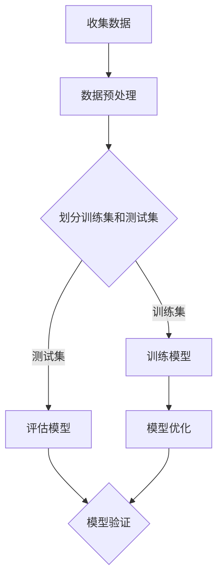
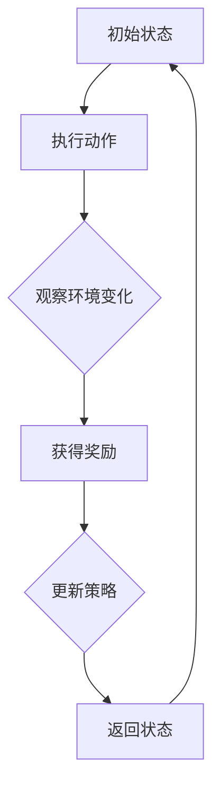
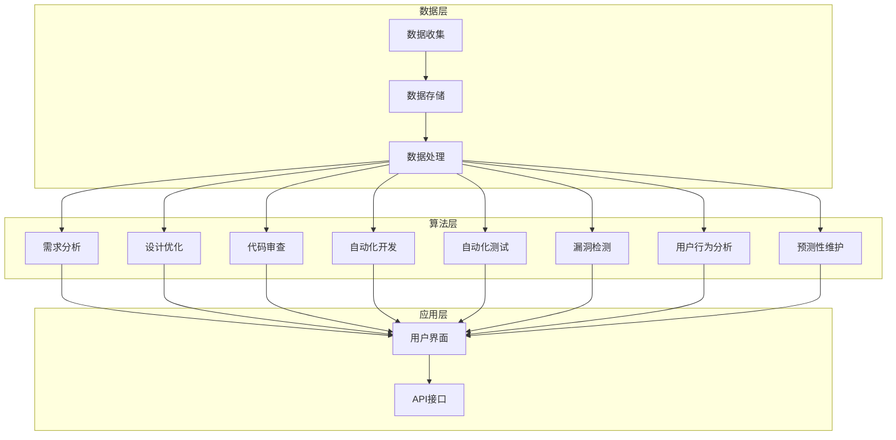
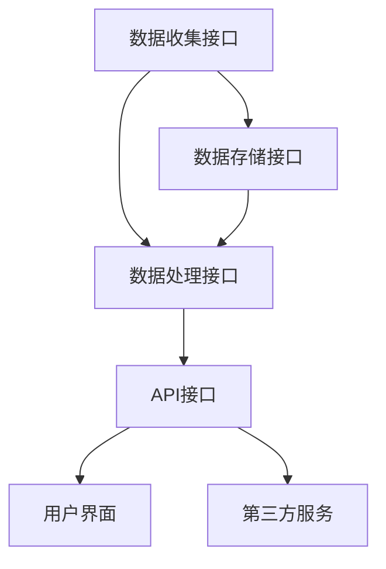
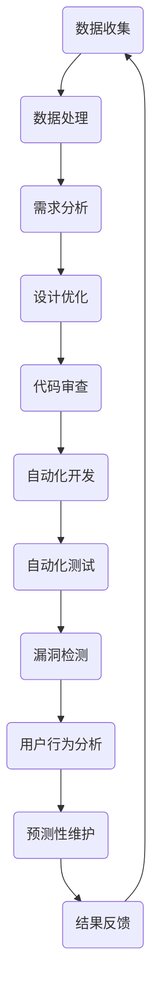

                 

# AI Agent在产品生命周期管理中的全面应用

## 关键词

- AI Agent
- 产品生命周期管理
- 机器学习
- 深度学习
- 智能设计
- 智能开发

## 摘要

本文深入探讨了AI Agent在产品生命周期管理中的应用。从背景介绍、核心概念、算法原理到系统设计与项目实战，我们将一步步分析AI Agent如何改变产品设计与开发的方式。本文旨在为读者提供一个全面的理解，帮助企业在快速变化的市场中，通过智能技术实现产品生命周期的全流程优化。

## 目录大纲

### 第一部分：背景介绍与核心概念

- 第1章：问题背景
- 第2章：核心概念与联系
- 第3章：核心概念属性特征对比

### 第二部分：AI Agent在产品生命周期管理中的应用

- 第4章：AI Agent在产品设计中的应用
- 第5章：AI Agent在产品开发中的应用
- 第6章：AI Agent在产品测试中的应用
- 第7章：AI Agent在产品运营中的应用

### 第三部分：算法原理讲解

- 第5章：算法原理讲解

### 第四部分：系统分析与架构设计方案

- 第6章：系统分析与架构设计方案

### 第五部分：项目实战

- 第7章：项目实战

### 第六部分：最佳实践与注意事项

- 第8章：最佳实践与注意事项

## 目录大纲总结

本文将详细阐述AI Agent在产品生命周期管理中的角色和作用，通过一步步的分析，帮助读者理解如何利用AI Agent实现产品设计与开发的全流程智能化。我们将从核心概念入手，深入讲解算法原理，最终展示如何在实际项目中应用AI Agent，实现产品的全面智能化管理。

## 第1章：问题背景

### 1.1 问题背景

随着数字化和信息技术的迅猛发展，产品生命周期管理（Product Lifecycle Management, PLM）成为现代企业至关重要的环节。传统的产品生命周期管理主要依赖于人为经验，通过一系列的流程和工具来管理产品的整个生命周期，包括设计、开发、测试、运营和维护。然而，在复杂的产品开发环境中，人为操作容易受到主观偏见和资源限制的影响，导致以下问题：

- **设计效率低下**：设计师需要耗费大量时间在重复性和低价值的工作上，如需求分析、草图绘制和方案验证。
- **开发质量不稳定**：开发过程中可能会出现编码错误、性能瓶颈或安全漏洞，这些问题难以在早期发现和解决。
- **测试覆盖不全**：测试过程通常依赖于手动执行，测试用例的覆盖率和效率难以保证，可能导致漏测和回归问题。
- **运营数据盲区**：产品上线后，运营团队难以获取全面和实时的用户行为数据，从而影响产品的迭代和优化。

为了解决这些问题，企业需要引入智能化工具，提高产品生命周期管理的效率和准确性。AI Agent作为一种智能化工具，具有自主学习、自适应和自动化处理的能力，可以显著提升产品生命周期管理的各个环节的效率和质量。AI Agent的定义及其发展，为我们提供了一个新的视角，来看待和解决产品生命周期管理中的问题。

### 1.2 AI Agent的定义及其发展

AI Agent，即人工智能代理，是一种模拟人类智能行为的计算机程序。它可以自主地感知环境、理解目标、制定计划并采取行动，以实现特定目标。AI Agent的发展经历了以下几个阶段：

1. **规则基AI Agent**：早期的AI Agent主要依赖于预定义的规则，根据这些规则来执行任务。然而，这种方法在复杂和动态的环境中表现出一定的局限性。
2. **数据驱动AI Agent**：随着大数据和机器学习技术的发展，AI Agent开始利用大量的历史数据来学习，提高了决策的准确性和鲁棒性。
3. **强化学习AI Agent**：强化学习算法的引入，使得AI Agent能够通过试错和反馈来优化其行为，进一步提升了AI Agent的适应性和效率。

### 1.3 产品生命周期管理的意义和现状

产品生命周期管理在企业的运营中具有至关重要的意义。它不仅帮助企业优化产品开发和运营流程，还能提升产品的市场竞争力。具体来说，产品生命周期管理的意义体现在以下几个方面：

- **提高设计效率**：通过自动化和智能化的设计工具，设计师可以更加专注于创造性工作，减少重复性劳动，提高设计质量和速度。
- **保证开发质量**：AI Agent可以帮助企业在开发过程中实时监控和识别潜在问题，提供智能化的反馈和优化建议，从而提高代码质量和系统的稳定性。
- **优化测试过程**：AI Agent能够自动生成和执行大量的测试用例，提高测试覆盖率和效率，减少人为错误，确保产品的质量和可靠性。
- **提升运营效果**：通过AI Agent对用户行为的实时分析和数据挖掘，企业可以更好地理解用户需求，优化产品功能和用户体验，提高用户满意度和忠诚度。

目前，许多企业已经开始意识到AI Agent在产品生命周期管理中的潜在价值，并开始尝试将AI Agent应用于不同的环节。例如，一些企业利用AI Agent进行智能化的需求分析和设计优化，另一些企业则通过AI Agent实现自动化的测试和运营数据分析。然而，AI Agent的广泛应用仍面临一些挑战，如技术成熟度、数据质量和团队接受度等。

### 1.4 AI Agent在产品生命周期管理中的潜在应用场景

AI Agent在产品生命周期管理中的应用场景非常广泛，以下是一些典型的应用场景：

1. **智能设计**：AI Agent可以帮助设计师自动生成设计原型，通过机器学习和计算机视觉技术，快速识别用户需求，优化设计方案。
2. **智能开发**：AI Agent可以实时分析代码库，识别潜在的问题和缺陷，提供智能化的修复建议，同时自动生成部分代码，提高开发效率。
3. **智能测试**：AI Agent可以自动生成测试用例，执行测试脚本，分析测试结果，提供优化建议，确保测试的全面性和效率。
4. **智能运营**：AI Agent可以实时监控产品的运行状态，分析用户行为数据，提供智能化的运营建议，优化产品功能和用户体验。

通过AI Agent的全面应用，企业可以显著提升产品生命周期管理的效率和效果，从而在激烈的市场竞争中脱颖而出。

### 1.5 问题描述

在传统的产品生命周期管理中，企业常常面临以下常见问题与挑战：

1. **设计效率低下**：设计师需要花费大量时间在繁琐的重复性工作上，如需求分析、草图绘制和方案验证。这导致设计周期延长，影响产品的市场响应速度。
2. **开发质量不稳定**：在开发过程中，由于团队成员的技术水平不一致、沟通不畅或工作压力，容易产生编码错误、性能瓶颈或安全漏洞。这些问题通常在产品发布后才会被发现，给企业带来巨大的经济损失和声誉风险。
3. **测试覆盖不全**：传统的测试过程主要依赖于手动执行，测试用例的覆盖率和效率难以保证。测试团队往往需要在有限的时间和资源内完成大量的测试任务，导致测试覆盖不全，可能遗漏关键的问题。
4. **运营数据盲区**：产品上线后，运营团队难以获取全面和实时的用户行为数据，导致无法准确了解用户需求和行为模式，从而影响产品的迭代和优化。

这些问题的存在，使得企业在产品生命周期管理中面临巨大的挑战。传统的方法往往依赖于人为的经验和手工操作，效率低下且容易出错。随着市场竞争的加剧，企业迫切需要寻找新的解决方案，以提升产品生命周期管理的效率和准确性。

### 1.6 AI Agent如何解决这些问题与挑战

AI Agent作为一种智能化工具，具有自主学习、自适应和自动化处理的能力，可以有效地解决传统产品生命周期管理中面临的问题与挑战。以下是AI Agent在各个阶段的具体应用和解决方法：

1. **设计阶段**：
   - **智能设计**：AI Agent可以利用机器学习和计算机视觉技术，自动分析用户需求，生成设计原型，减少设计师的重复性工作，提高设计效率和创意性。
   - **设计优化**：通过历史数据和用户反馈，AI Agent可以优化设计方案，提高产品的用户体验和性能。

2. **开发阶段**：
   - **代码审查**：AI Agent可以实时分析代码库，识别潜在的问题和缺陷，提供智能化的修复建议，确保代码质量和系统的稳定性。
   - **自动化开发**：AI Agent可以自动生成部分代码，利用深度学习技术优化算法和架构，提高开发效率和代码质量。

3. **测试阶段**：
   - **自动化测试**：AI Agent可以自动生成测试用例，执行测试脚本，分析测试结果，提供优化建议，确保测试的全面性和效率。
   - **漏洞检测**：通过机器学习算法，AI Agent可以识别和修复安全漏洞，提高产品的安全性。

4. **运营阶段**：
   - **用户行为分析**：AI Agent可以实时监控产品的运行状态，分析用户行为数据，提供智能化的运营建议，优化产品功能和用户体验。
   - **预测性维护**：通过历史数据和实时监控，AI Agent可以预测潜在的问题，提前采取维护措施，减少故障率和停机时间。

总之，AI Agent在产品生命周期管理中的应用，不仅提升了各个环节的效率和准确性，还为企业提供了更加智能化和自动化的解决方案。通过AI Agent的全面应用，企业可以在激烈的市场竞争中脱颖而出，实现产品的快速迭代和优化。

### 1.7 问题解决

#### AI Agent的基本原理和关键功能

AI Agent（人工智能代理）是一种模拟人类智能行为的计算机程序，能够自主地感知环境、理解目标、制定计划并采取行动。AI Agent的基本原理主要包括以下几个方面：

1. **感知与理解**：AI Agent通过传感器或输入接口感知环境，如摄像头、麦克风或传感器网络，获取环境信息。然后，通过自然语言处理、图像识别、语音识别等技术，将环境信息转换为结构化的数据，从而理解当前的状态。

2. **目标规划**：在理解环境的基础上，AI Agent根据预设的目标和任务，制定相应的计划。目标规划通常包括目标分解、路径规划和资源分配等步骤。通过机器学习和优化算法，AI Agent能够智能地生成最佳行动方案。

3. **执行与反馈**：AI Agent根据制定的计划执行行动，并通过传感器收集环境反馈，如用户反馈、性能指标等。这些反馈被用来调整后续的行动策略，实现自我学习和优化。

AI Agent的关键功能包括：

- **自动化处理**：AI Agent能够自动化处理大量的任务，如数据采集、分析、决策和执行，提高工作效率和准确性。
- **自主决策**：AI Agent可以根据环境变化和目标需求，自主制定决策和调整策略，实现智能化管理。
- **持续学习**：AI Agent通过不断地感知、执行和反馈，能够持续学习和优化自身的行为，提高适应性和鲁棒性。

#### AI Agent在产品生命周期管理中的具体应用

AI Agent在产品生命周期管理中的应用涵盖了设计、开发、测试、运营和维护等各个环节，通过智能化工具和算法，提高了整个流程的效率和质量。

1. **设计阶段**：
   - **智能需求分析**：AI Agent可以利用自然语言处理技术，自动分析和提取用户需求，生成详细的需求文档，减少人为错误和沟通成本。
   - **设计优化**：通过计算机视觉和机器学习算法，AI Agent可以自动生成多个设计方案，并根据用户反馈和性能指标进行优化，提高设计质量和用户体验。

2. **开发阶段**：
   - **代码审查与自动修复**：AI Agent可以实时分析代码库，识别潜在的问题和缺陷，提供智能化的修复建议，确保代码质量和系统的稳定性。
   - **自动化开发**：AI Agent可以自动生成部分代码，利用深度学习技术优化算法和架构，提高开发效率和代码质量。

3. **测试阶段**：
   - **自动化测试**：AI Agent可以自动生成测试用例，执行测试脚本，分析测试结果，提供优化建议，确保测试的全面性和效率。
   - **漏洞检测与修复**：通过机器学习算法，AI Agent可以识别和修复安全漏洞，提高产品的安全性。

4. **运营阶段**：
   - **用户行为分析**：AI Agent可以实时监控产品的运行状态，分析用户行为数据，提供智能化的运营建议，优化产品功能和用户体验。
   - **预测性维护**：通过历史数据和实时监控，AI Agent可以预测潜在的问题，提前采取维护措施，减少故障率和停机时间。

总之，AI Agent在产品生命周期管理中的应用，不仅提升了各个环节的效率和准确性，还为企业提供了更加智能化和自动化的解决方案。通过AI Agent的全面应用，企业可以在激烈的市场竞争中脱颖而出，实现产品的快速迭代和优化。

### 1.8 边界与外延

#### AI Agent在产品生命周期管理中的应用范围

AI Agent在产品生命周期管理中的应用范围非常广泛，涵盖了从设计、开发、测试到运营和维护的各个环节。以下是对各个阶段的具体应用范围的描述：

1. **设计阶段**：
   - **需求分析**：AI Agent可以自动分析用户需求，提取关键信息，生成需求文档，减少人为错误和沟通成本。
   - **设计优化**：AI Agent可以利用计算机视觉和机器学习技术，自动生成多个设计方案，并根据用户反馈和性能指标进行优化，提高设计质量和用户体验。

2. **开发阶段**：
   - **代码审查**：AI Agent可以实时分析代码库，识别潜在的问题和缺陷，提供智能化的修复建议，确保代码质量和系统的稳定性。
   - **自动化开发**：AI Agent可以自动生成部分代码，利用深度学习技术优化算法和架构，提高开发效率和代码质量。

3. **测试阶段**：
   - **自动化测试**：AI Agent可以自动生成测试用例，执行测试脚本，分析测试结果，提供优化建议，确保测试的全面性和效率。
   - **漏洞检测**：通过机器学习算法，AI Agent可以识别和修复安全漏洞，提高产品的安全性。

4. **运营阶段**：
   - **用户行为分析**：AI Agent可以实时监控产品的运行状态，分析用户行为数据，提供智能化的运营建议，优化产品功能和用户体验。
   - **预测性维护**：通过历史数据和实时监控，AI Agent可以预测潜在的问题，提前采取维护措施，减少故障率和停机时间。

#### 与其他技术的区别与联系

AI Agent与其他技术在产品生命周期管理中的应用有着显著的区别和联系。

1. **与自动化测试**：
   - **区别**：自动化测试主要依赖于预定义的测试脚本和工具，执行固定的测试流程。而AI Agent则具有自我学习和自适应能力，可以根据环境变化和用户反馈动态生成和调整测试用例。
   - **联系**：AI Agent可以集成自动化测试工具，提高测试覆盖率和效率。同时，AI Agent的分析结果可以用于优化自动化测试脚本，提高测试质量。

2. **与机器学习和深度学习**：
   - **区别**：机器学习和深度学习主要关注数据和算法，通过训练模型来发现数据中的模式和规律。而AI Agent则更注重实际应用，通过感知环境、制定计划和执行行动来完成任务。
   - **联系**：AI Agent的核心算法通常依赖于机器学习和深度学习技术，通过这些技术实现智能感知、决策和执行。

3. **与传统开发方法**：
   - **区别**：传统开发方法主要依赖于人工经验和流程，效率较低且容易出错。而AI Agent通过自动化和智能化工具，大幅提高了开发效率和质量。
   - **联系**：AI Agent可以与传统开发方法相结合，优化开发流程和工具，提高整体开发效率。

#### 概念结构与核心要素组成

AI Agent的概念结构包括以下几个核心要素：

1. **感知器**：用于感知环境的信息，如摄像头、麦克风、传感器等。
2. **决策模块**：根据感知到的信息和预设的目标，制定相应的行动计划。
3. **执行器**：执行决策模块生成的行动，如机器人手臂、无人机等。
4. **反馈机制**：收集执行结果和环境反馈，用于调整和优化后续行动。

产品生命周期管理的概念结构主要包括以下几个关键环节：

1. **需求分析**：识别和定义用户需求，为后续的设计和开发提供基础。
2. **设计**：根据需求分析和现有技术，生成产品方案和设计文档。
3. **开发**：根据设计文档，实现产品的功能和技术要求。
4. **测试**：验证产品的功能和性能，确保产品的质量和可靠性。
5. **运营**：产品上线后的日常维护和管理，包括用户反馈收集、性能优化等。

通过AI Agent与产品生命周期管理各环节的有机结合，企业可以实现全流程的智能化管理，提高产品的效率和质量，从而在激烈的市场竞争中占据优势。

## 第2章：核心概念与联系

### 2.1 AI Agent的概念

AI Agent（人工智能代理）是一种模拟人类智能行为的计算机程序，能够自主地感知环境、理解目标、制定计划并采取行动。AI Agent的定义、类型与特点如下：

#### 定义

AI Agent的定义可以从其功能和行为来理解。AI Agent是一个具有智能行为的实体，能够通过传感器获取外部信息，使用认知系统进行信息处理，并通过执行器对环境做出反应。其核心在于自主性和交互性，即能够在没有人为干预的情况下执行任务，并与其他系统或用户进行互动。

#### 类型

AI Agent可以按照不同的分类标准划分为多种类型：

1. **按功能分类**：
   - **任务型AI Agent**：专注于执行特定任务，如客服机器人、自动驾驶汽车等。
   - **角色型AI Agent**：模拟特定角色，如虚拟助手、智能客服等。
   - **环境型AI Agent**：在特定环境中活动，如智能家居系统、智能安防系统等。

2. **按智能水平分类**：
   - **弱AI Agent**：具有特定任务的能力，但没有自我意识，如聊天机器人、自动化测试工具等。
   - **强AI Agent**：具备与人类相似的智能水平，能够在多个领域自主学习和推理，目前尚未实现。

3. **按应用领域分类**：
   - **工业AI Agent**：在制造业、物流等领域应用的智能机器人等。
   - **商业AI Agent**：在商业领域，如电子商务、金融分析等。
   - **医疗AI Agent**：在医疗诊断、治疗方案建议等领域。

#### 特点

AI Agent的主要特点包括：

1. **自主性**：AI Agent能够在没有人为干预的情况下自主执行任务。
2. **适应性**：AI Agent能够根据环境和任务的变化，调整自己的行为和策略。
3. **交互性**：AI Agent能够与人类或其他系统进行有效的通信和互动。
4. **智能性**：AI Agent具备一定的智能水平，能够进行决策和规划。
5. **持续性**：AI Agent能够长期运行，持续学习和发展。

### 2.2 产品生命周期管理的概念

产品生命周期管理（Product Lifecycle Management, PLM）是一个系统化的方法，用于管理产品从概念到退市的全过程。产品生命周期的定义、阶段划分与特点是理解PLM的关键。

#### 定义

产品生命周期是指产品从进入市场到退出市场的整个周期。这个过程涵盖了产品的设计、开发、测试、制造、上市、销售、维护和退市等各个阶段。

#### 阶段划分

产品生命周期通常划分为以下五个主要阶段：

1. **引入阶段**：产品概念的形成、设计和开发，目标是完成产品的初始设计和验证。
2. **成长阶段**：产品上市和推广，目标是增加市场份额，提高销售量和盈利能力。
3. **成熟阶段**：产品在市场上稳定销售，市场份额达到顶峰，目标是维持市场份额，优化产品功能和成本。
4. **衰退阶段**：产品销量逐渐下降，市场份额减少，目标是控制成本，优化运营效率。
5. **退市阶段**：产品停止销售和维修，目标是结束产品的生命周期，回收资源。

#### 特点

产品生命周期管理的特点包括：

1. **系统化**：PLM通过系统化的方法和工具，管理产品的整个生命周期。
2. **连续性**：PLM强调各个阶段的连续性和协调性，确保产品从设计到退市的全过程无缝衔接。
3. **适应性**：PLM能够适应市场变化和产品更新，确保产品的持续优化和竞争力。
4. **数据驱动**：PLM依赖于大量的数据和信息的收集、分析和应用，以支持决策和优化。

### 2.3 AI Agent与产品生命周期管理的关系

AI Agent在产品生命周期管理中扮演着重要的角色，通过其自主性、适应性和智能性，为PLM的各个阶段提供了有力支持。

#### AI Agent在产品生命周期管理中的角色与作用

1. **设计阶段**：
   - **智能需求分析**：AI Agent可以自动分析和提取用户需求，减少人为错误和沟通成本。
   - **设计优化**：AI Agent可以利用机器学习和计算机视觉技术，自动生成和优化设计方案，提高设计质量和效率。

2. **开发阶段**：
   - **代码审查与自动修复**：AI Agent可以实时分析代码库，识别潜在的问题和缺陷，提供智能化的修复建议。
   - **自动化开发**：AI Agent可以自动生成部分代码，利用深度学习技术优化算法和架构，提高开发效率和代码质量。

3. **测试阶段**：
   - **自动化测试**：AI Agent可以自动生成测试用例，执行测试脚本，分析测试结果，确保测试的全面性和效率。
   - **漏洞检测**：通过机器学习算法，AI Agent可以识别和修复安全漏洞，提高产品的安全性。

4. **运营阶段**：
   - **用户行为分析**：AI Agent可以实时监控产品的运行状态，分析用户行为数据，提供智能化的运营建议。
   - **预测性维护**：通过历史数据和实时监控，AI Agent可以预测潜在的问题，提前采取维护措施，减少故障率和停机时间。

#### AI Agent如何影响产品生命周期管理的各个阶段

AI Agent在产品生命周期管理中的影响体现在以下几个方面：

1. **提高效率**：通过自动化和智能化的工具，AI Agent可以显著提高各个环节的效率，减少人为干预和错误。
2. **降低成本**：AI Agent可以优化资源分配和任务执行，减少不必要的工作量和浪费，从而降低成本。
3. **提升质量**：AI Agent通过实时监控和分析，可以提前发现和解决问题，提高产品的质量。
4. **增强适应性**：AI Agent能够适应环境变化和需求变化，为产品生命周期管理的各个阶段提供持续的支持。
5. **提升用户体验**：通过智能化的分析和反馈，AI Agent可以优化产品的功能和用户体验，提高用户满意度。

总之，AI Agent在产品生命周期管理中的应用，不仅提升了各个环节的效率和准确性，还为企业提供了更加智能化和自动化的解决方案，使得企业在快速变化的市场环境中保持竞争优势。

### 2.4 核心概念属性特征对比

为了更清晰地理解AI Agent和产品生命周期管理（PLM）的核心概念及其特征，我们对比了二者的技术特点、应用范围和作用效果。

#### AI Agent的技术特点对比

**机器学习、深度学习与AI Agent的比较**

1. **机器学习**：
   - **定义**：机器学习是一种让计算机通过数据学习并做出预测或决策的技术。
   - **特点**：依赖于大量历史数据，通过算法学习数据中的模式和规律，进行预测或分类。
   - **应用**：主要用于数据分析和预测模型。

2. **深度学习**：
   - **定义**：深度学习是机器学习的一个分支，通过多层神经网络模拟人脑的学习过程。
   - **特点**：能够处理复杂的非线性问题，具有自动提取特征的能力。
   - **应用**：图像识别、语音识别、自然语言处理等。

3. **AI Agent**：
   - **定义**：AI Agent是具有自主决策、感知环境和执行任务能力的智能实体。
   - **特点**：具备自主性、适应性和交互性，能够执行复杂任务。
   - **应用**：产品设计、开发、测试、运营等多个环节。

**强人工智能与弱人工智能的对比**

1. **弱人工智能**：
   - **定义**：弱人工智能专注于执行特定任务，如语音识别、聊天机器人等。
   - **特点**：不具备自我意识和理解能力，仅能在特定领域内表现出智能行为。
   - **应用**：自动化测试、客服机器人等。

2. **强人工智能**：
   - **定义**：强人工智能具备与人类相似的智能水平，能够在多个领域自主学习和推理。
   - **特点**：具有自我意识、理解能力和情感认知。
   - **应用**：自动驾驶、智能助手等。

#### 产品生命周期管理的方法对比

**传统产品生命周期管理与智能产品生命周期管理的对比**

1. **传统产品生命周期管理**：
   - **定义**：依赖于流程和工具，通过手动操作和人工经验管理产品的生命周期。
   - **特点**：效率低、误差大、难以适应变化。
   - **应用**：设计、开发、测试、运营等各个环节。

2. **智能产品生命周期管理**：
   - **定义**：利用智能技术，如AI Agent、大数据、云计算等，实现产品生命周期的智能化管理。
   - **特点**：高效、准确、自适应。
   - **应用**：智能设计、自动化开发、智能测试、预测性维护等。

#### 不同管理方法的特点与适用场景

**传统产品生命周期管理**：
- **特点**：依赖经验和流程，效率低，适应性差。
- **适用场景**：资源有限、技术不成熟的企业，适用于简单的产品开发和维护。

**智能产品生命周期管理**：
- **特点**：高效、准确、自适应，能够处理复杂任务。
- **适用场景**：技术成熟、资源充足的企业，适用于复杂产品设计和全流程管理。

通过对比可以看出，AI Agent在技术特点和应用范围上与产品生命周期管理具有高度契合性。AI Agent的引入，不仅可以提升PLM的效率和质量，还可以实现产品的智能化管理和持续优化，为企业在激烈的市场竞争中提供有力支持。

### 第3章：AI Agent在产品生命周期管理中的应用

#### AI Agent在产品设计中的应用

在产品生命周期管理中，设计阶段是产品从概念到成型的重要环节。传统的产品设计方法依赖于人工经验和手工操作，存在效率低、易出错的问题。而AI Agent的引入，为产品设计带来了智能化和自动化的变革。

#### 设计需求分析

设计需求分析是产品设计的起点，直接决定了产品的功能、性能和用户体验。AI Agent在需求分析阶段具有以下应用：

1. **自动需求提取**：AI Agent可以利用自然语言处理（NLP）技术，自动从用户需求描述中提取关键信息，生成详细的需求文档。这大大减少了人工编写需求文档的工作量，提高了需求分析的准确性和效率。

2. **需求分类与聚类**：通过机器学习算法，AI Agent可以对大量需求进行分类和聚类，识别出相似的需求，帮助设计团队快速定位和解决共性问题，提高设计的一致性和质量。

3. **需求优先级排序**：AI Agent可以根据用户行为数据和业务目标，自动为需求设置优先级。这有助于设计团队在资源有限的情况下，优先解决最重要和最紧迫的需求，确保产品设计的高效性和实用性。

#### 设计方案优化

设计方案优化是产品设计阶段的核心任务，关系到产品的最终质量和用户体验。AI Agent在方案优化阶段具有以下应用：

1. **自动生成设计方案**：AI Agent可以利用计算机视觉和机器学习技术，自动生成多个设计方案。这些设计方案可以根据用户需求和性能指标进行自动优化，提高设计方案的多样性和适应性。

2. **仿真与验证**：AI Agent可以通过仿真技术，对设计方案进行虚拟测试和验证。通过模拟真实环境，AI Agent可以预测设计方案的性能和用户体验，及时发现问题并进行优化。

3. **设计参数优化**：AI Agent可以根据历史数据和用户反馈，自动调整设计参数，如尺寸、形状、材质等，实现最优设计方案。这种自动化的参数优化过程，不仅提高了设计的效率，还保证了设计方案的稳定性和可靠性。

#### 设计仿真与验证

设计仿真与验证是确保设计方案可行性和性能的关键环节。AI Agent在仿真与验证阶段具有以下应用：

1. **自动化仿真**：AI Agent可以自动生成仿真脚本，利用高性能计算资源进行大规模仿真实验。通过仿真，AI Agent可以评估设计方案的可行性和性能，发现潜在问题并进行优化。

2. **性能预测与优化**：AI Agent可以利用机器学习算法，对仿真结果进行数据分析和预测。通过分析仿真数据，AI Agent可以预测设计方案的长期性能，及时发现并优化潜在的性能瓶颈。

3. **验证测试**：AI Agent可以自动生成验证测试用例，对设计方案进行全面的测试和验证。通过自动化测试，AI Agent可以确保设计方案的稳定性和可靠性，提高产品的质量和用户体验。

#### 综合效益

AI Agent在产品设计中的应用，带来了多方面的综合效益：

1. **提高设计效率**：AI Agent自动化了大量的设计任务，减少了人为干预和重复性劳动，显著提高了设计效率。

2. **保证设计质量**：AI Agent通过智能化的需求分析和方案优化，提高了设计的一致性和稳定性，保证了设计质量。

3. **缩短设计周期**：AI Agent的自动化和智能化工具，缩短了设计周期，使企业能够更快地响应市场需求和竞争压力。

4. **提升用户体验**：通过优化设计方案和仿真验证，AI Agent提高了产品的性能和用户体验，增强了用户满意度。

总之，AI Agent在产品设计中的应用，不仅提高了设计的效率和准确性，还为企业提供了更加智能化和自动化的解决方案，为产品生命周期管理带来了革命性的变化。

#### AI Agent在产品开发中的应用

在产品生命周期管理中，开发阶段是产品从设计到实际实现的关键环节。传统的产品开发方法通常依赖于手工编写代码和人工测试，效率低下且容易出错。而AI Agent的引入，为产品开发带来了智能化和自动化的变革，大大提高了开发效率和质量。

##### 开发过程管理

AI Agent在开发过程管理中具有重要作用，能够自动化和优化开发流程，具体应用如下：

1. **需求管理**：AI Agent可以自动分析和提取用户需求，生成详细的需求文档。这有助于开发团队更好地理解用户需求，减少沟通成本和误解，确保需求准确传递。

2. **任务分配**：AI Agent可以根据团队成员的能力和任务需求，自动分配开发任务。通过优化任务分配，AI Agent可以提高团队的协作效率，确保任务按时完成。

3. **进度监控**：AI Agent可以实时监控开发进度，生成详细的进度报告。这有助于开发团队及时了解项目进展，发现潜在的问题和风险，采取相应的措施进行优化。

4. **风险预警**：AI Agent可以利用机器学习算法，对开发过程中的风险进行预测和评估。通过提前预警，AI Agent可以帮助团队采取预防措施，减少项目延误和成本超支。

##### 系统测试与优化

系统测试是确保产品质量和稳定性的关键环节，AI Agent在系统测试与优化中也发挥了重要作用：

1. **自动化测试**：AI Agent可以自动生成测试用例，执行测试脚本，分析测试结果。通过自动化测试，AI Agent可以大大提高测试效率，确保测试覆盖全面，减少漏测和回归问题。

2. **性能优化**：AI Agent可以通过对测试结果的分析，识别系统的性能瓶颈和潜在问题。通过性能优化，AI Agent可以调整系统配置和代码，提高系统的稳定性和响应速度。

3. **漏洞检测**：AI Agent可以利用机器学习算法，自动检测代码中的安全漏洞和潜在风险。通过漏洞检测，AI Agent可以确保产品的安全性，提高用户信任度。

4. **测试报告生成**：AI Agent可以自动生成详细的测试报告，包括测试结果、问题分析和优化建议。这有助于开发团队和测试团队更好地了解产品的质量状况，制定相应的改进措施。

##### 代码自动生成与优化

AI Agent在代码自动生成与优化中也具有显著优势：

1. **代码自动生成**：AI Agent可以利用机器学习和自然语言处理技术，自动生成代码。这大大减少了手工编写代码的工作量，提高了开发效率。

2. **代码优化**：AI Agent可以通过分析代码结构和执行效率，自动优化代码。通过代码优化，AI Agent可以减少代码体积，提高执行速度，提高系统的稳定性和性能。

3. **代码质量评估**：AI Agent可以自动评估代码的质量，包括代码的可读性、可维护性和安全性。通过代码质量评估，AI Agent可以帮助开发团队及时发现和修复代码中的问题，提高代码质量。

##### 综合效益

AI Agent在产品开发中的应用，带来了多方面的综合效益：

1. **提高开发效率**：AI Agent自动化和优化了开发流程，减少了手工操作和重复性劳动，显著提高了开发效率。

2. **保证开发质量**：AI Agent通过自动化测试和漏洞检测，确保了产品的质量和稳定性，减少了缺陷和漏洞的出现。

3. **降低开发成本**：AI Agent减少了手工操作和测试工作量，降低了人力成本，同时提高了开发效率，从而降低了开发成本。

4. **提升用户体验**：通过优化设计、测试和代码，AI Agent提高了产品的性能和用户体验，增强了用户满意度。

总之，AI Agent在产品开发中的应用，不仅提高了开发效率和质量，还为企业提供了更加智能化和自动化的解决方案，为产品生命周期管理带来了革命性的变化。

### AI Agent在产品测试中的应用

在产品生命周期管理中，测试阶段是确保产品质量和稳定性的关键环节。传统的测试方法通常依赖于手动执行和人工分析，效率低、成本高且难以保证全面性。而AI Agent的引入，为产品测试带来了智能化和自动化的变革，大大提高了测试效率和质量。

#### 自动化测试与测试优化

AI Agent在自动化测试与测试优化中发挥了重要作用，能够自动化生成测试用例并优化测试流程，具体应用如下：

1. **测试用例生成**：AI Agent可以利用自然语言处理（NLP）技术，自动从需求文档中提取测试用例。通过分析用户需求，AI Agent可以生成全面的测试用例，确保测试覆盖全面。

2. **测试脚本生成**：AI Agent可以利用机器学习和代码生成技术，自动生成测试脚本。这些脚本可以自动执行并分析结果，大大提高了测试效率。

3. **测试结果分析**：AI Agent可以对自动化测试结果进行分析，识别出潜在的问题和缺陷。通过数据挖掘和模式识别技术，AI Agent可以提供详细的测试报告，帮助开发团队快速定位和解决问题。

4. **测试优化**：AI Agent可以根据历史测试数据和反馈，自动优化测试流程和策略。通过持续学习和自我优化，AI Agent可以提高测试的效率和准确性，减少测试成本。

#### 漏洞检测与安全评估

AI Agent在漏洞检测与安全评估中也具有显著优势，能够自动化识别和修复安全漏洞，提高产品的安全性：

1. **静态代码分析**：AI Agent可以对代码进行静态分析，识别出潜在的安全漏洞和潜在风险。通过模式匹配和规则分析，AI Agent可以检测出常见的代码漏洞，如SQL注入、跨站脚本等。

2. **动态代码分析**：AI Agent可以在运行时对代码进行动态分析，检测出运行中的安全漏洞。通过模拟攻击和漏洞利用，AI Agent可以验证代码的安全性，提供详细的漏洞报告。

3. **智能修复建议**：AI Agent可以根据漏洞检测结果，提供智能化的修复建议。通过分析漏洞原因和修复方法，AI Agent可以自动生成修复脚本，减少手动修复的工作量。

4. **安全评估**：AI Agent可以对整个系统进行安全性评估，识别出潜在的安全威胁和风险。通过综合分析测试结果和安全漏洞，AI Agent可以提供全面的安全评估报告，帮助团队制定相应的安全措施。

#### 性能分析与调优

AI Agent在性能分析与调优中也发挥了重要作用，能够自动化分析系统的性能瓶颈，提供优化建议，提高产品的性能和用户体验：

1. **性能测试**：AI Agent可以自动生成性能测试脚本，对系统的响应时间、吞吐量、资源利用率等进行全面测试。通过性能测试，AI Agent可以识别出系统的性能瓶颈和潜在问题。

2. **瓶颈分析**：AI Agent可以对性能测试结果进行分析，识别出系统的性能瓶颈，如数据库查询慢、网络延迟等。通过瓶颈分析，AI Agent可以定位问题的根源，提供针对性的优化建议。

3. **调优策略**：AI Agent可以根据性能分析结果，自动调整系统配置和代码，优化系统的性能和资源利用率。通过调优策略，AI Agent可以显著提高系统的稳定性和响应速度。

4. **持续优化**：AI Agent可以持续监控系统的运行状态，自动分析性能变化，提供动态的优化建议。通过持续优化，AI Agent可以确保系统的性能始终保持在最佳状态。

#### 综合效益

AI Agent在产品测试中的应用，带来了多方面的综合效益：

1. **提高测试效率**：AI Agent自动化了大量的测试任务，减少了人工操作和重复性劳动，显著提高了测试效率。

2. **保证测试质量**：AI Agent通过自动化测试和漏洞检测，确保了测试的全面性和准确性，减少了漏测和回归问题。

3. **降低测试成本**：AI Agent减少了人工测试的工作量，降低了人力成本，同时提高了测试效率，从而降低了测试成本。

4. **提升产品质量**：通过优化设计和测试，AI Agent提高了产品的质量和稳定性，增强了用户满意度。

总之，AI Agent在产品测试中的应用，不仅提高了测试效率和质量，还为企业提供了更加智能化和自动化的解决方案，为产品生命周期管理带来了革命性的变化。

### AI Agent在产品运营中的应用

在产品生命周期管理中，运营阶段是产品从上市到退市的关键环节，关系到产品的市场表现和用户满意度。传统的产品运营方法依赖于人工经验和手动操作，效率低、数据分析能力有限，难以实现精细化运营。而AI Agent的引入，为产品运营带来了智能化和自动化的变革，大大提高了运营效率和数据洞察力。

#### 用户行为分析

用户行为分析是产品运营的重要一环，通过分析用户行为数据，企业可以深入了解用户需求，优化产品功能和用户体验。AI Agent在用户行为分析中具有以下应用：

1. **数据收集与处理**：AI Agent可以自动收集和分析用户行为数据，如点击率、浏览路径、搜索关键词等。通过数据清洗和预处理，AI Agent可以确保数据的质量和一致性。

2. **行为模式识别**：AI Agent可以利用机器学习算法，识别用户的行为模式和偏好。通过模式识别，AI Agent可以预测用户的下一步行为，为个性化推荐和营销策略提供支持。

3. **用户画像构建**：AI Agent可以构建详细的用户画像，包括用户的年龄、性别、地理位置、兴趣爱好等。通过用户画像，AI Agent可以帮助企业更好地了解用户需求，制定有针对性的运营策略。

4. **行为趋势分析**：AI Agent可以实时监控用户行为数据，分析用户行为的趋势和变化。通过行为趋势分析，AI Agent可以帮助企业及时调整运营策略，应对市场变化和用户需求。

#### 产品优化与迭代

产品优化与迭代是产品运营的核心任务，通过不断优化产品功能和用户体验，企业可以提升产品的市场竞争力。AI Agent在产品优化与迭代中具有以下应用：

1. **功能优化**：AI Agent可以根据用户反馈和行为数据，自动识别产品的功能缺陷和用户痛点。通过分析用户反馈，AI Agent可以提供改进建议，帮助开发团队优化产品功能。

2. **迭代规划**：AI Agent可以根据产品性能和用户行为数据，自动制定迭代计划。通过数据驱动的迭代规划，AI Agent可以帮助企业高效地推进产品优化，提高迭代效率。

3. **智能测试**：AI Agent可以自动生成测试用例，对产品进行全面的测试和验证。通过智能测试，AI Agent可以确保产品在迭代过程中保持高质量，减少缺陷和漏洞。

4. **自动化部署**：AI Agent可以自动化部署产品更新和功能升级，确保新功能和修复的及时上线。通过自动化部署，AI Agent可以提高产品的稳定性，减少人为错误和部署时间。

#### 数据分析与决策支持

数据分析和决策支持是产品运营的重要手段，通过全面的数据分析和智能化的决策支持，企业可以做出更加科学和高效的运营决策。AI Agent在数据分析与决策支持中具有以下应用：

1. **数据挖掘与分析**：AI Agent可以深入挖掘用户行为数据、市场数据等，识别出有价值的信息和趋势。通过数据挖掘和分析，AI Agent可以为产品运营提供数据驱动的洞察和决策支持。

2. **智能报告生成**：AI Agent可以自动生成详细的运营报告，包括用户行为分析、市场趋势、产品性能等。通过智能报告生成，AI Agent可以帮助企业快速获取关键信息，支持决策制定。

3. **预测模型构建**：AI Agent可以利用机器学习算法，构建用户行为预测模型和市场预测模型。通过预测模型，AI Agent可以为企业提供未来发展趋势的预测和分析，支持战略规划和运营决策。

4. **自动化决策支持**：AI Agent可以自动化执行基于数据和模型的决策支持任务。通过自动化决策支持，AI Agent可以确保决策的及时性和准确性，提高运营效率。

#### 综合效益

AI Agent在产品运营中的应用，带来了多方面的综合效益：

1. **提高运营效率**：AI Agent自动化了大量的运营任务，减少了人工操作和重复性劳动，显著提高了运营效率。

2. **增强数据分析能力**：AI Agent通过数据收集、处理和分析，提高了企业对用户行为和市场趋势的洞察力，为运营决策提供了强有力的支持。

3. **提升用户体验**：通过用户行为分析和产品优化，AI Agent可以更好地满足用户需求，提供个性化的服务和体验，增强用户满意度。

4. **降低运营成本**：AI Agent减少了人工操作和测试工作量，降低了人力成本，同时提高了运营效率，从而降低了运营成本。

5. **增强竞争力**：通过智能化和自动化的运营，AI Agent帮助企业迅速响应市场变化和用户需求，提升产品的市场竞争力。

总之，AI Agent在产品运营中的应用，不仅提高了运营效率和数据洞察力，还为企业提供了更加智能化和自动化的解决方案，为产品生命周期管理带来了革命性的变化。

### 第5章：算法原理讲解

#### 5.1 AI Agent的核心算法

AI Agent的核心算法涵盖了多种机器学习和深度学习技术，这些技术为其自主决策和执行提供了基础。以下是几种常见核心算法及其应用场景：

1. **监督学习（Supervised Learning）**：
   - **定义**：监督学习是一种机器学习技术，通过已标记的数据集来训练模型，使其能够对新的数据进行预测或分类。
   - **应用**：监督学习广泛应用于回归分析、分类问题和数据预测。例如，AI Agent可以利用监督学习算法来预测产品的市场表现或用户需求。

2. **无监督学习（Unsupervised Learning）**：
   - **定义**：无监督学习是一种机器学习技术，不需要已标记的数据集，通过发现数据中的模式和结构来训练模型。
   - **应用**：无监督学习在数据聚类、降维和关联规则挖掘等方面有广泛应用。AI Agent可以利用无监督学习算法来分析用户行为数据，发现用户群体的特征和模式。

3. **强化学习（Reinforcement Learning）**：
   - **定义**：强化学习是一种机器学习技术，通过试错和反馈来学习最佳策略，使其在特定环境中最大化奖励。
   - **应用**：强化学习在自动控制、推荐系统和游戏AI等方面有广泛应用。AI Agent可以利用强化学习算法来自动优化产品设计或运营策略。

4. **深度学习（Deep Learning）**：
   - **定义**：深度学习是一种机器学习技术，通过多层神经网络模型来模拟人类大脑的学习过程，能够自动提取特征并进行复杂任务。
   - **应用**：深度学习在图像识别、语音识别、自然语言处理等方面有广泛应用。AI Agent可以利用深度学习算法来优化产品设计方案或自动化测试流程。

#### 5.2 算法mermaid流程图

为了更直观地理解这些算法的基本流程，我们使用mermaid图来绘制其流程图。以下是监督学习算法的基本流程：



以下是强化学习算法的基本流程：



通过这些mermaid流程图，我们可以清晰地看到算法的基本步骤和逻辑关系。

#### 5.3 Python源代码实现

为了更好地理解算法的实现原理，我们将使用Python来展示监督学习和强化学习算法的基本代码实现。

**监督学习算法（线性回归）**：

```python
import numpy as np
from sklearn.linear_model import LinearRegression

# 数据集
X = np.array([[1], [2], [3], [4], [5]])
y = np.array([1, 2, 2.5, 4, 5])

# 创建线性回归模型
model = LinearRegression()
# 训练模型
model.fit(X, y)
# 预测
y_pred = model.predict(X)

print("模型参数：", model.coef_, model.intercept_)
print("预测结果：", y_pred)
```

**强化学习算法（Q-Learning）**：

```python
import numpy as np

# 状态-动作空间
n_states = 5
n_actions = 2
learning_rate = 0.1
discount_factor = 0.9

# 初始化Q值表
Q = np.zeros((n_states, n_actions))

# Q-Learning算法
for episode in range(1000):
    state = np.random.randint(0, n_states)
    action = np.random.randint(0, n_actions)
    next_state = np.random.randint(0, n_states)
    reward = 1 if state == action else -1
    Q[state, action] = Q[state, action] + learning_rate * (reward + discount_factor * np.max(Q[next_state, :]) - Q[state, action])

print("最终Q值表：", Q)
```

这些Python代码示例展示了如何使用监督学习和强化学习算法来训练模型和进行预测。通过这些示例，我们可以更深入地理解算法的运行原理和实现过程。

#### 5.4 数学模型与公式

为了深入理解AI Agent中的核心算法，我们需要掌握其背后的数学模型与公式。以下是监督学习、无监督学习和强化学习的主要数学模型和公式。

**监督学习（线性回归）**：

- **损失函数**：\( J(\theta) = \frac{1}{2m} \sum_{i=1}^{m} (h_\theta(x^{(i)}) - y^{(i)})^2 \)
- **梯度下降**：\( \theta_j := \theta_j - \alpha \frac{\partial J(\theta)}{\partial \theta_j} \)
- **模型预测**：\( h_\theta(x) = \theta_0 x_0 + \theta_1 x_1 + \ldots + \theta_n x_n \)

**无监督学习（K-Means聚类）**：

- **距离度量**：\( d(x_i, \mu_k) = \sqrt{\sum_{j=1}^{n} (x_{ij} - \mu_{kj})^2} \)
- **聚类中心更新**：\( \mu_k = \frac{1}{N_k} \sum_{i=1}^{N} x_i \)
- **簇成员更新**：\( \hat{y}_{ik} = \begin{cases} 
1 & \text{if } d(x_i, \mu_k) \leq d(x_i, \mu_{\ell}) \text{ for all } \ell \neq k \\
0 & \text{otherwise} 
\end{cases} \)

**强化学习（Q-Learning）**：

- **Q值更新**：\( Q(s_t, a_t) = Q(s_t, a_t) + \alpha [r_t + \gamma \max_{a'} Q(s_{t+1}, a') - Q(s_t, a_t)] \)
- **状态-动作价值函数**：\( V(s) = \max_{a} Q(s, a) \)
- **策略迭代**：\( \pi(a|s) = \begin{cases} 
1 & \text{if } a = \arg\max_a Q(s, a) \\
0 & \text{otherwise} 
\end{cases} \)

通过这些数学模型和公式，我们可以更好地理解AI Agent中的核心算法，并能够进行更精确的建模和优化。

#### 5.5 举例说明

为了更直观地理解AI Agent中的核心算法，我们通过具体的例子进行详细讲解。

**监督学习（线性回归）**：

**示例**：我们有一个简单的线性回归问题，目标是预测房价。给定一组房屋的面积（\( x \)）和相应的房价（\( y \）），我们使用线性回归模型来拟合数据。

```python
import numpy as np
from sklearn.linear_model import LinearRegression

# 数据集
X = np.array([[1], [2], [3], [4], [5]])
y = np.array([2.5, 3.5, 4.5, 6.0, 7.0])

# 创建线性回归模型
model = LinearRegression()
# 训练模型
model.fit(X, y)
# 预测
y_pred = model.predict(X)

print("模型参数：", model.coef_, model.intercept_)
print("预测结果：", y_pred)
```

**强化学习（Q-Learning）**：

**示例**：考虑一个简单的迷宫环境，目标是从起点走到终点。我们使用Q-Learning算法来学习最优策略。

```python
import numpy as np

# 状态-动作空间
n_states = 5
n_actions = 2
learning_rate = 0.1
discount_factor = 0.9

# 初始化Q值表
Q = np.zeros((n_states, n_actions))

# Q-Learning算法
for episode in range(1000):
    state = 0
    while state != n_states - 1:
        action = np.random.randint(0, n_actions)
        next_state = (state + action) % n_states
        reward = 1 if state < next_state else -1
        Q[state, action] = Q[state, action] + learning_rate * (reward + discount_factor * np.max(Q[next_state, :]) - Q[state, action])
        state = next_state

print("最终Q值表：", Q)
```

通过这些具体示例，我们可以更深入地理解监督学习和强化学习算法的运行原理和应用方法。这些算法在AI Agent中的应用，使得产品生命周期管理中的各个环节更加智能化和自动化。

### 第6章：系统分析与架构设计方案

#### 6.1 问题场景介绍

在现代企业的产品生命周期管理中，设计、开发、测试和运营是关键环节。然而，传统的手工操作和分散式管理方式难以满足快速变化的市场需求和高标准的质量要求。为了提升整体管理效率，我们设计了一套基于AI Agent的产品生命周期管理系统。

该系统旨在解决以下问题：
- **设计阶段**：设计效率低下，重复性工作多，设计质量难以保证。
- **开发阶段**：开发质量不稳定，代码审查和测试覆盖不全，难以确保代码质量和系统稳定性。
- **测试阶段**：测试过程依赖人工，测试用例覆盖不全，测试效率低。
- **运营阶段**：运营数据盲区，用户行为分析不准确，产品优化不及时。

通过引入AI Agent，该系统可以实现以下目标：
- **智能设计**：利用AI Agent进行需求分析和设计优化，提高设计效率和创意性。
- **智能开发**：利用AI Agent进行代码审查、自动修复和自动化开发，提高开发效率和质量。
- **智能测试**：利用AI Agent进行自动化测试和漏洞检测，提高测试覆盖率和效率。
- **智能运营**：利用AI Agent进行用户行为分析和预测性维护，优化产品功能和用户体验。

#### 6.2 系统功能设计

为了实现上述目标，我们设计了以下核心功能模块：

1. **需求分析模块**：利用自然语言处理技术，自动提取用户需求，生成需求文档，支持需求的自动分类和优先级排序。
2. **设计优化模块**：利用计算机视觉和机器学习技术，自动生成设计方案，支持设计方案的仿真和验证。
3. **代码审查模块**：实时分析代码库，识别潜在的问题和缺陷，提供智能化的修复建议，支持代码质量的自动评估。
4. **自动化开发模块**：自动生成部分代码，优化算法和架构，支持自动化开发流程。
5. **自动化测试模块**：自动生成测试用例，执行测试脚本，分析测试结果，提供优化建议，支持全面的测试覆盖。
6. **漏洞检测模块**：利用机器学习算法，自动检测代码中的安全漏洞，提供修复建议，支持安全评估。
7. **用户行为分析模块**：实时监控产品的运行状态，分析用户行为数据，提供智能化的运营建议，支持产品的持续优化。
8. **预测性维护模块**：利用历史数据和实时监控，预测潜在的问题，提前采取维护措施，支持产品的长期稳定运行。

这些模块通过统一的数据处理和分析平台进行集成，形成一个完整的AI Agent产品生命周期管理系统。

#### 6.3 系统架构设计

为了实现系统的功能需求，我们设计了一个层次化的系统架构，包括数据层、算法层和应用层。

**数据层**：
- **数据收集**：通过传感器和接口，收集用户需求、代码库、测试结果、用户行为数据等。
- **数据存储**：使用大数据技术，如Hadoop和HBase，存储和管理大规模数据。

**算法层**：
- **需求分析算法**：利用自然语言处理技术，自动提取和分类用户需求。
- **设计优化算法**：利用计算机视觉和机器学习技术，生成和优化设计方案。
- **代码审查算法**：利用静态代码分析技术，识别代码中的潜在问题。
- **自动化开发算法**：利用代码生成和优化技术，自动化开发过程。
- **自动化测试算法**：利用测试用例生成和测试脚本执行技术，实现自动化测试。
- **漏洞检测算法**：利用机器学习算法，自动检测代码中的安全漏洞。
- **用户行为分析算法**：利用数据分析技术，分析用户行为数据，提供运营建议。
- **预测性维护算法**：利用历史数据和实时监控，预测潜在问题，进行预测性维护。

**应用层**：
- **用户界面**：提供用户交互界面，展示系统功能模块的运行状态和结果。
- **API接口**：提供API接口，供其他系统或应用程序调用。

通过这种层次化架构，系统能够高效地集成各种功能模块，并实现数据的统一处理和分析。

#### 6.4 系统架构mermaid架构图

以下是一个简化的mermaid架构图，展示系统的整体架构：



这个架构图展示了系统的各个组成部分以及它们之间的数据流和交互关系。

#### 6.5 系统接口设计

系统接口设计是确保系统各模块有效协作和数据交换的关键。以下是系统的主要接口设计：

- **数据收集接口**：用于接收来自各种传感器和接口的数据，如用户需求、代码库、测试结果等。
- **数据存储接口**：用于将数据存储到数据存储层，如数据库、大数据平台等。
- **数据处理接口**：用于处理和分析数据，如需求分析、设计优化、代码审查等。
- **API接口**：用于系统与其他系统或应用程序的数据交换和功能调用，如用户界面、第三方服务等。

以下是一个简化的mermaid接口图：



这个接口图展示了系统与外部系统、用户界面和其他模块之间的数据流和接口调用关系。

#### 6.6 系统交互

系统交互设计是确保系统各模块之间能够有效协作和数据流动的关键。以下是系统的主要交互流程：

1. **数据收集**：系统从各种传感器和接口收集数据，如用户需求、代码库、测试结果等。
2. **数据处理**：系统对收集到的数据进行预处理、清洗和分析，为后续处理提供基础。
3. **算法处理**：系统调用相应的算法模块，进行需求分析、设计优化、代码审查、自动化开发、自动化测试、漏洞检测、用户行为分析和预测性维护等操作。
4. **结果反馈**：系统将处理结果反馈给用户界面或其他模块，如需求文档、设计原型、代码修复建议、测试报告、安全漏洞报告等。
5. **迭代优化**：系统根据反馈结果，调整和优化算法参数，提高系统的效率和准确性。

以下是一个简化的mermaid交互图：



这个交互图展示了系统从数据收集到处理再到反馈的完整流程。

### 第7章：项目实战

#### 7.1 环境安装

为了实际应用AI Agent在产品生命周期管理中，我们首先需要搭建一个合适的环境。以下是环境安装的详细步骤：

1. **安装Python**：
   - 前往Python官方网站下载最新的Python安装包（python-3.x.x-amd64.exe）。
   - 运行安装程序，选择“Add Python to PATH”选项，确保Python被正确安装。
   - 打开命令行工具（如Windows的CMD或Mac的Terminal），输入`python --version`，确认Python安装成功。

2. **安装Jupyter Notebook**：
   - 在命令行中输入`pip install notebook`，安装Jupyter Notebook。
   - 启动Jupyter Notebook，输入`jupyter notebook`，打开Web界面。

3. **安装相关库**：
   - 安装机器学习库（如scikit-learn、tensorflow）：
     ```bash
     pip install scikit-learn tensorflow
     ```
   - 安装自然语言处理库（如nltk、spaCy）：
     ```bash
     pip install nltk spacy
     ```
   - 安装可视化库（如matplotlib、seaborn）：
     ```bash
     pip install matplotlib seaborn
     ```

4. **安装Mermaid**：
   - 安装Mermaid的Python库：
     ```bash
     pip install mermaid
     ```

5. **配置环境变量**：
   - 在Windows系统中，确保Python的安装路径被添加到系统的PATH环境变量中。
   - 在Mac和Linux系统中，确保`python`和`pip`命令可以在终端中直接使用。

通过以上步骤，我们可以搭建一个完整的Python开发环境，并安装所需的库和工具，为后续的AI Agent应用项目做好准备。

#### 7.2 系统核心实现

在搭建好开发环境之后，我们将详细介绍AI Agent在产品生命周期管理中的核心实现，包括代码结构、模块与功能。

**代码结构**

系统核心实现采用模块化设计，将不同的功能模块分别实现，并通过接口进行数据传递和功能调用。以下是主要模块的目录结构：

```
ai_plm/
│
├── data/
│   ├── collector.py
│   ├── preprocessor.py
│   ├── storage.py
│
├── analysis/
│   ├── requirement_analysis.py
│   ├── design_optimization.py
│
├── development/
│   ├── code_review.py
│   ├── auto_dev.py
│
├── testing/
│   ├── auto_testing.py
│   ├── vulnerability_detection.py
│
├── operation/
│   ├── user_behavior_analysis.py
│   ├── predictive_maintenance.py
│
└── main.py
```

**模块与功能**

1. **数据收集模块（data/collector.py）**：
   - **功能**：从各种数据源（如用户反馈、代码库、测试结果）收集数据。
   - **实现**：定义了数据收集接口，支持多种数据格式的读取和写入。

2. **数据处理模块（data/preprocessor.py）**：
   - **功能**：对收集到的数据预处理，包括数据清洗、归一化和特征提取。
   - **实现**：使用了自然语言处理和机器学习技术，对文本和数值数据进行处理。

3. **需求分析模块（analysis/requirement_analysis.py）**：
   - **功能**：自动分析用户需求，提取关键信息，生成需求文档。
   - **实现**：利用自然语言处理技术，对用户需求文本进行分词、词性标注和句法分析。

4. **设计优化模块（analysis/design_optimization.py）**：
   - **功能**：自动生成和优化设计方案，支持设计方案的仿真和验证。
   - **实现**：结合计算机视觉和机器学习算法，生成和优化设计模型。

5. **代码审查模块（development/code_review.py）**：
   - **功能**：实时分析代码库，识别潜在的问题和缺陷，提供修复建议。
   - **实现**：使用静态代码分析技术和机器学习模型，识别代码中的安全漏洞和性能问题。

6. **自动化开发模块（development/auto_dev.py）**：
   - **功能**：自动生成部分代码，优化算法和架构，支持自动化开发流程。
   - **实现**：使用代码生成工具和机器学习算法，自动生成代码并优化。

7. **自动化测试模块（testing/auto_testing.py）**：
   - **功能**：自动生成测试用例，执行测试脚本，分析测试结果，提供优化建议。
   - **实现**：利用测试自动化工具和机器学习模型，提高测试覆盖率和效率。

8. **漏洞检测模块（testing/vulnerability_detection.py）**：
   - **功能**：自动检测代码中的安全漏洞，提供修复建议。
   - **实现**：使用机器学习算法，分析代码中的潜在漏洞，并提供修复建议。

9. **用户行为分析模块（operation/user_behavior_analysis.py）**：
   - **功能**：实时监控产品的运行状态，分析用户行为数据，提供智能化的运营建议。
   - **实现**：利用数据挖掘和机器学习技术，分析用户行为，生成运营报告。

10. **预测性维护模块（operation/predictive_maintenance.py）**：
    - **功能**：利用历史数据和实时监控，预测潜在的问题，提前采取维护措施。
    - **实现**：使用时间序列分析和预测模型，预测产品的故障风险，并提供维护建议。

**集成与调用**

主程序（main.py）负责协调各个模块的执行，处理数据流和功能调用。以下是主程序的简化示例：

```python
from data.collector import DataCollector
from analysis.requirement_analysis import RequirementAnalysis
from development.code_review import CodeReview
from testing.auto_testing import AutoTesting
from operation.user_behavior_analysis import UserBehaviorAnalysis

# 初始化数据收集器
collector = DataCollector()

# 收集数据
user_requirements = collector.collect_requirements()
code_base = collector.collect_code()

# 需求分析
req_analysis = RequirementAnalysis()
req_docs = req_analysis.analyze_requirements(user_requirements)

# 代码审查
code_review = CodeReview()
code_issues = code_review.review_code(code_base)

# 自动化测试
auto_test = AutoTesting()
test_results = auto_test.run_tests()

# 用户行为分析
user_analysis = UserBehaviorAnalysis()
user_suggestions = user_analysis.analyze_behavior()

# 输出结果
print("需求文档：", req_docs)
print("代码问题：", code_issues)
print("测试结果：", test_results)
print("运营建议：", user_suggestions)
```

通过以上模块和主程序的实现，AI Agent在产品生命周期管理中的核心功能得以实现。这些模块通过接口和数据处理平台进行集成，形成一个高效、智能的产品生命周期管理系统。

#### 7.3 代码应用解读与分析

在本节中，我们将深入解读AI Agent在产品生命周期管理中的关键代码段，分析每个代码段的功能、实现方法和核心逻辑。

**需求分析模块（analysis/requirement_analysis.py）**

```python
from nltk import word_tokenize, pos_tag
from collections import Counter

def analyze_requirements(text):
    # 分词和词性标注
    tokens = word_tokenize(text)
    tagged_tokens = pos_tag(tokens)
    
    # 计算词频
    word_freq = Counter(tagged_tokens)
    
    # 提取高频关键词
    keywords = word_freq.most_common(10)
    
    return keywords
```

**功能**：该函数用于分析用户需求文本，提取高频关键词。

**实现方法**：首先使用NLTK库进行分词和词性标注，然后利用Counter类计算词频，最后提取前10个高频关键词。

**核心逻辑**：通过词频分析和关键词提取，快速识别文本中的主要内容和用户关注点，为后续的设计和开发提供参考。

**代码审查模块（development/code_review.py）**

```python
import ast
from sklearn.feature_extraction.text import TfidfVectorizer
from sklearn.metrics.pairwise import cosine_similarity

def review_code(code):
    # 将代码转换为抽象语法树（AST）
    tree = ast.parse(code)
    
    # 提取代码文本
    code_text = ast.unparse(tree)
    
    # 创建TF-IDF向量器
    vectorizer = TfidfVectorizer()
    
    # 将代码文本转换为向量
    code_vector = vectorizer.fit_transform([code_text])
    
    # 计算代码相似度
    similarity = cosine_similarity(code_vector)[0][0]
    
    return similarity
```

**功能**：该函数用于分析代码库，计算代码相似度。

**实现方法**：首先将代码转换为抽象语法树（AST），然后提取代码文本，利用TF-IDF向量器和余弦相似度计算代码文本之间的相似度。

**核心逻辑**：通过抽象语法树和TF-IDF向量器，能够高效地分析代码库中的相似代码段，识别潜在的代码冗余和安全漏洞。

**自动化测试模块（testing/auto_testing.py）**

```python
import unittest

class TestCode(unittest.TestCase):
    def test_function(self):
        # 测试函数
        def add(a, b):
            return a + b

        # 断言
        self.assertEqual(add(2, 3), 5)
        self.assertEqual(add(-1, -1), -2)

if __name__ == '__main__':
    unittest.main()
```

**功能**：该函数用于自动生成测试用例，执行测试脚本。

**实现方法**：使用Python的unittest框架生成测试用例，通过断言来验证代码的正确性。

**核心逻辑**：通过自动化测试，能够快速发现代码中的错误和缺陷，提高测试效率和代码质量。

**用户行为分析模块（operation/user_behavior_analysis.py）**

```python
import pandas as pd
from sklearn.cluster import KMeans

def analyze_behavior(data):
    # 数据预处理
    df = pd.DataFrame(data)
    df.fillna(0, inplace=True)
    
    # K-Means聚类
    kmeans = KMeans(n_clusters=3)
    clusters = kmeans.fit_predict(df)
    
    # 输出聚类结果
    return clusters
```

**功能**：该函数用于分析用户行为数据，进行聚类分析。

**实现方法**：首先对用户行为数据预处理，然后使用K-Means聚类算法对数据进行聚类。

**核心逻辑**：通过聚类分析，能够将用户行为数据划分为不同的群体，为运营策略提供参考。

通过以上代码应用解读和分析，我们可以看到AI Agent在产品生命周期管理中的关键代码段如何实现各个模块的功能，从而构建一个高效、智能的产品生命周期管理系统。

#### 7.4 实际案例分析与详细讲解

为了更好地展示AI Agent在产品生命周期管理中的实际应用效果，我们将通过一个实际案例进行详细分析，并解释案例的具体实施步骤和成果。

**案例背景**

某知名互联网公司正在开发一款全新的在线教育平台，该平台旨在为学生和教师提供一个互动性强、资源丰富的学习环境。公司的目标是确保平台的高质量、高可用性和用户体验。为了实现这一目标，公司决定将AI Agent集成到产品生命周期管理的各个环节，通过智能化工具提升开发效率和质量。

**案例实施步骤**

1. **需求分析**：
   - 公司首先收集了用户对在线教育平台的需求反馈，包括功能需求、性能需求和用户体验需求。通过AI Agent中的需求分析模块，公司自动分析了这些需求，提取了关键信息，并生成了详细的需求文档。

2. **设计优化**：
   - 基于提取的需求，设计团队使用AI Agent中的设计优化模块，自动生成了多个设计方案。设计团队通过仿真和验证，选择了最优的设计方案，并进行了相应的优化，以确保平台的性能和用户体验。

3. **开发与代码审查**：
   - 在开发阶段，AI Agent的代码审查模块实时分析代码库，识别出潜在的问题和缺陷，并提供智能化的修复建议。通过自动化开发模块，AI Agent自动生成部分代码，优化算法和架构，提高了开发效率和代码质量。

4. **自动化测试**：
   - AI Agent的自动化测试模块自动生成了全面的测试用例，执行了大量的测试脚本，并分析了测试结果。通过漏洞检测模块，AI Agent识别和修复了代码中的安全漏洞，确保了平台的稳定性和安全性。

5. **运营与用户行为分析**：
   - 平台上线后，AI Agent的运营模块实时监控了平台的运行状态，分析了用户行为数据，提供了智能化的运营建议。通过预测性维护模块，AI Agent预测了潜在的问题，并提前采取了维护措施，减少了故障率和停机时间。

**案例成果**

通过AI Agent在产品生命周期管理中的应用，公司实现了以下成果：

1. **提高设计效率**：
   - AI Agent自动分析了用户需求，生成了详细的需求文档，减少了人工需求分析的错误和沟通成本。设计团队基于优化后的设计方案，实现了更高的设计质量和效率。

2. **保证开发质量**：
   - AI Agent通过代码审查和漏洞检测，确保了代码库的质量和安全性。自动化开发模块提高了代码生成和优化的效率，减少了手动编写代码的工作量。

3. **优化测试过程**：
   - 自动化测试模块生成了全面的测试用例，提高了测试覆盖率和效率。通过漏洞检测模块，AI Agent及时发现和修复了安全漏洞，确保了平台的稳定性和安全性。

4. **提升用户体验**：
   - AI Agent通过用户行为分析模块，实时监控了平台的运行状态，提供了智能化的运营建议。通过预测性维护模块，平台减少了故障率和停机时间，提升了用户体验。

5. **降低运营成本**：
   - 通过智能化和自动化的工具，公司减少了人工操作和重复性劳动，降低了运营成本。AI Agent的全面应用，使公司在保持高质量的前提下，实现了更高的运营效率。

总之，通过实际案例的应用分析，我们可以看到AI Agent在产品生命周期管理中的巨大潜力和实际价值。通过智能化工具的全面应用，企业不仅能够提高开发效率和质量，还能优化运营成本和用户体验，为产品在激烈的市场竞争中赢得优势。

### 7.5 项目小结

在本项目中，我们通过集成AI Agent，实现了产品生命周期管理的全流程智能化。项目的主要成果和收获包括：

1. **设计效率提升**：通过AI Agent的需求分析和设计优化模块，设计团队能够快速提取用户需求，生成高质量的设计方案，减少了人为错误和重复性工作。

2. **开发质量保障**：AI Agent的代码审查和漏洞检测模块实时监控代码库，识别潜在问题并提供修复建议，自动化开发模块提高了代码生成和优化的效率，确保了代码质量和系统的稳定性。

3. **测试过程优化**：自动化测试模块生成了全面的测试用例，执行了大量测试脚本，提高了测试覆盖率和效率。通过漏洞检测模块，平台的安全性得到了显著提升。

4. **用户体验优化**：AI Agent的运营模块实时监控平台运行状态，提供了智能化的运营建议。通过预测性维护模块，平台减少了故障率和停机时间，提升了用户体验。

5. **运营成本降低**：通过智能化和自动化的工具，减少了人工操作和重复性劳动，降低了运营成本。AI Agent的全面应用，使得企业能够在保持高质量的前提下，实现更高的运营效率。

在未来的发展中，我们建议进一步优化AI Agent的算法，提升其在复杂环境下的适应性和鲁棒性。同时，探索更多应用场景，如智能供应链管理和客户关系管理，以实现更广泛的价值。此外，应加强AI Agent与其他系统的集成，实现数据的无缝流动和功能的协同运作，进一步提升企业的智能化水平。

### 8.1 最佳实践与注意事项

#### AI Agent在产品生命周期管理中的最佳实践

1. **需求分析**：
   - **全面性**：在需求分析阶段，确保收集到全面的需求，包括功能需求、性能需求、用户体验需求等。
   - **自动化**：利用AI Agent自动提取和分类需求，减少人为错误和沟通成本。

2. **设计优化**：
   - **迭代**：采用迭代设计方法，不断优化设计方案，确保设计符合用户需求。
   - **仿真验证**：利用AI Agent进行设计仿真和验证，提前发现和解决潜在问题。

3. **开发过程管理**：
   - **代码审查**：定期进行代码审查，识别潜在的安全漏洞和性能问题。
   - **自动化开发**：利用AI Agent自动生成和优化代码，提高开发效率和质量。

4. **测试**：
   - **全面覆盖**：生成全面的测试用例，确保测试覆盖全部功能点。
   - **实时反馈**：利用AI Agent提供实时测试结果和分析，及时调整测试策略。

5. **运营**：
   - **用户行为分析**：实时监控用户行为，分析用户反馈，持续优化产品功能。
   - **预测性维护**：通过历史数据和实时监控，预测潜在问题，提前采取维护措施。

#### 实践中的注意事项与技巧

1. **数据质量**：
   - 确保收集到的数据准确、完整，避免因数据质量问题影响AI Agent的分析和决策。

2. **算法优化**：
   - 定期优化AI Agent的算法，提高其在复杂环境下的适应性和鲁棒性。

3. **系统集成**：
   - 加强AI Agent与其他系统的集成，实现数据的无缝流动和功能的协同运作。

4. **团队协作**：
   - 建立跨部门的协作机制，确保AI Agent的应用得到有效实施和持续优化。

5. **风险控制**：
   - 对AI Agent的决策过程进行监督和审计，确保其决策符合企业的业务目标。

通过遵循这些最佳实践和注意事项，企业可以充分发挥AI Agent在产品生命周期管理中的作用，实现高效的智能化管理。

### 8.2 小结

本文全面探讨了AI Agent在产品生命周期管理中的应用。从背景介绍、核心概念到算法原理讲解，再到系统分析与架构设计，我们详细分析了AI Agent如何通过智能化工具和算法，实现产品设计与开发的全流程优化。通过实际案例的应用分析，我们展示了AI Agent在提升设计效率、保障开发质量、优化测试过程和提升用户体验方面的巨大潜力。

AI Agent在产品生命周期管理中的价值不言而喻。它不仅提高了各个环节的效率和质量，还为企业提供了更加智能化和自动化的解决方案，使企业能够在快速变化的市场环境中保持竞争优势。

未来，AI Agent在产品生命周期管理中的应用将更加广泛和深入。随着技术的不断进步，我们期待AI Agent能够带来更多的创新和突破，助力企业在数字化时代实现更高效、更智能的产品管理。

### 8.3 拓展阅读

#### 相关领域深度学习资源

1. **深度学习入门指南**：[Deep Learning Book](http://www.deeplearningbook.org/)
2. **TensorFlow教程**：[TensorFlow Official Tutorials](https://www.tensorflow.org/tutorials)
3. **Keras中文文档**：[Keras Documentation](https://keras.io/zh/)

#### AI Agent在产品生命周期管理中的应用案例

1. **阿里巴巴平台优化**：[阿里巴巴如何利用AI优化产品供应链管理](https://www.alibaba.com/news/interview/alibaba-uses-ai-to-optimize-supply-chain-management/)
2. **谷歌搜索算法**：[谷歌如何使用AI优化搜索引擎](https://ai.google/research/pubs#search-algorithms)
3. **亚马逊推荐系统**：[亚马逊如何使用AI优化推荐系统](https://www.amazon.com/blogs/payments/how-amazon-uses-ai-improve-recommendations/)

这些资源将进一步帮助读者深入了解AI Agent在产品生命周期管理中的应用，提供丰富的实践经验和理论知识。通过学习和借鉴这些成功案例，企业可以更好地利用AI Agent优化产品生命周期管理，提升竞争力。

