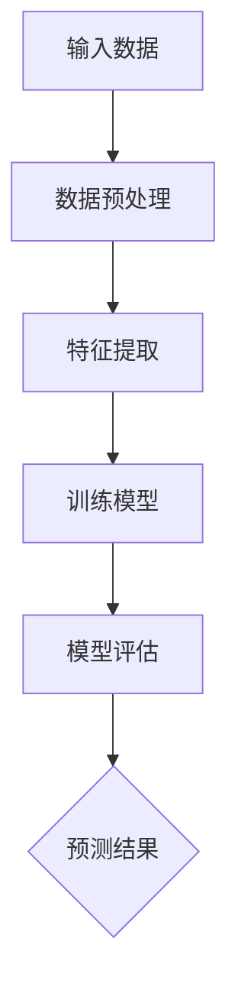
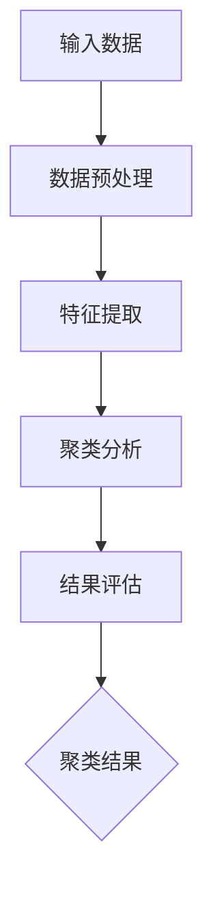
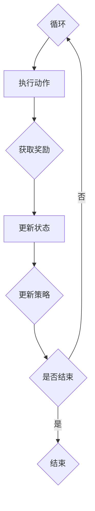
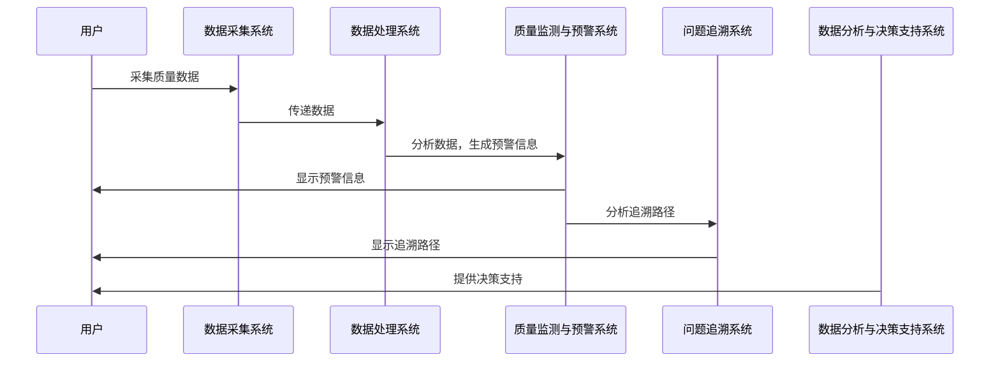

                 


# AI Agent在产品质量控制与追溯系统中的应用

## 关键词
- AI Agent
- 产品质量控制
- 追溯系统
- 机器学习
- 质量追溯

## 摘要
本文旨在探讨AI Agent在产品质量控制与追溯系统中的应用。通过对质量控制与追溯系统的背景介绍、核心概念的阐述、算法原理的讲解以及系统设计与实现的剖析，文章展示了AI Agent如何有效提高产品质量控制和追溯的效率。文章内容丰富，结构清晰，旨在为相关领域的研究人员和从业者提供参考。

## 目录大纲

### 第一部分：引言

#### 第1章：背景介绍与问题提出
1.1 问题背景
1.2 问题描述
1.3 问题解决
1.4 边界与外延
1.5 概念结构与核心要素组成

#### 第2章：核心概念与联系
2.1 质量控制与追溯相关概念
2.2 AI Agent核心概念
2.3 概念属性特征对比表格
2.4 ER实体关系图架构

#### 第3章：AI Agent算法原理讲解
3.1 AI Agent算法概述
3.2 算法mermaid流程图
3.3 Python源代码与算法原理
3.4 数学模型和数学公式 & 详细讲解 & 举例说明

### 第二部分：系统设计与实现

#### 第4章：系统分析与架构设计
4.1 问题场景介绍
4.2 项目介绍
4.3 系统功能设计
4.4 系统架构设计
4.5 系统接口设计
4.6 系统交互mermaid序列图

#### 第5章：项目实战
5.1 环境安装
5.2 系统核心实现源代码
5.3 代码应用解读与分析
5.4 实际案例分析与详细讲解剖析
5.5 项目小结

### 第三部分：最佳实践、小结、注意事项、拓展阅读

## 第1章：背景介绍与问题提出

### 1.1 问题背景

质量控制与追溯是现代工业生产中至关重要的一环。随着社会经济的发展和消费者对产品质量要求的提高，如何保证产品质量、提高生产效率和降低成本成为企业面临的重要挑战。传统的质量控制方法主要依赖于人工检测和定期抽样，这些方法存在检测效率低、误差大、无法实时监控等问题。此外，随着供应链的复杂化和全球化，产品从生产到消费的过程中，质量问题往往难以快速定位和解决，导致经济损失和品牌声誉受损。

### 1.2 问题描述

产品质量问题主要来源于以下几个方面：

1. **制造过程中的缺陷**：生产设备故障、操作人员失误、原料质量不稳定等都会导致产品出现缺陷。
2. **物流与供应链中的污染**：在物流运输和仓储过程中，产品可能会受到外界污染，如灰尘、湿度等，影响产品性能和安全性。
3. **使用过程中的损坏**：用户在使用过程中不当操作或设备老化也可能导致产品质量问题。

追溯系统的作用与目标主要包括：

1. **提高产品质量**：通过实时监控和数据分析，及时发现并解决质量问题，确保产品达到高质量标准。
2. **优化供应链管理**：通过追溯系统，企业可以更好地管理供应链，减少库存浪费，提高物流效率。
3. **减少经济损失**：通过有效的追溯系统，企业可以在问题发生时迅速采取应对措施，降低经济损失。

### 1.3 问题解决

为了解决上述问题，引入AI Agent作为质量控制与追溯系统的一部分是一个有效的方法。AI Agent，即人工智能代理，是一种能够自主执行任务、具备智能决策能力的计算机程序。在质量控制与追溯系统中，AI Agent具有以下优势：

1. **高效的数据处理能力**：AI Agent可以实时收集和分析海量数据，快速识别质量问题和异常情况。
2. **智能决策支持**：基于机器学习算法，AI Agent能够根据历史数据和实时数据做出最优决策，指导生产流程和供应链管理。
3. **自动化操作**：AI Agent可以自动执行一些重复性的质量控制任务，减少人工干预，提高生产效率。

### 1.4 边界与外延

质量控制与追溯系统的范围可以包括：

1. **产品生命周期管理**：从原材料采购到成品出厂，全程监控产品质量，确保每个环节的质量标准得到满足。
2. **质量问题检测与诊断**：通过传感器和监测设备，实时收集产品质量数据，AI Agent可以自动分析数据，诊断质量问题。
3. **数据分析和决策支持**：利用大数据分析技术，AI Agent可以从海量数据中提取有价值的信息，为决策提供数据支持。

AI Agent的技术范畴包括：

1. **人工智能的基础算法**：如监督学习、无监督学习和强化学习等。
2. **机器学习模型的优化与应用**：通过算法优化和模型训练，提高AI Agent在质量控制与追溯系统中的性能和准确度。

### 1.5 概念结构与核心要素组成

质量控制与追溯系统的关键概念包括：

1. **质量控制**：确保产品达到特定质量标准的过程。
2. **追溯系统**：用于记录和追踪产品生产、物流和使用过程中各个阶段信息的技术系统。
3. **AI Agent**：一种基于人工智能技术，能够自动执行任务和提供决策支持的计算机程序。
4. **数据分析**：通过对大量数据进行处理和分析，提取有价值的信息。

系统的核心要素包括：

1. **数据采集与存储**：通过传感器和监测设备收集产品数据，并存储到数据库中。
2. **数据处理与分析**：对采集到的数据进行分析和处理，提取有用信息，支持决策。
3. **AI Agent模型设计与实现**：设计并实现AI Agent模型，用于实时监控和智能决策。
4. **系统集成与部署**：将各个模块整合在一起，实现系统的整体功能。

## 第2章：核心概念与联系

### 2.1 质量控制与追溯相关概念

#### 2.1.1 质量控制

质量控制是指通过一系列措施和手段，确保产品达到特定质量标准的过程。质量控制的主要方法包括：

1. **预防性质量控制**：通过设计、原材料采购和生产过程中的严格管理，预防质量问题的发生。
2. **检验性质量控制**：通过定期抽样和检测，发现产品中的质量问题，并及时采取措施。
3. **统计质量控制**：利用统计方法，对产品进行监控和分析，确保产品质量的一致性和稳定性。

质量控制流程通常包括以下步骤：

1. **确定质量标准**：根据产品的特性和市场需求，制定相应的质量标准。
2. **设计质量控制计划**：根据质量标准，设计具体的质量控制方案和流程。
3. **实施质量控制措施**：按照质量控制计划，进行各项质量控制活动，如检测、检验和调整。
4. **记录与分析**：记录质量控制过程中的各项数据，进行分析和评估，以持续改进质量控制效果。

#### 2.1.2 追溯系统

追溯系统是一种用于记录和追踪产品生产、物流和使用过程中各个阶段信息的技术系统。其主要功能包括：

1. **记录产品信息**：在产品生产、加工、运输、销售和使用等各个环节，记录与产品相关的各种信息，如生产时间、地点、操作人员、原料来源等。
2. **提供查询与查询**：通过追溯系统，用户可以查询产品的生产历史、物流路径和质量信息，实现产品全生命周期的管理。
3. **支持质量追溯**：当产品质量问题发生时，可以通过追溯系统快速定位问题发生的时间和环节，采取相应的应对措施，确保产品质量。

追溯系统与质量控制的关系主要体现在：

1. **质量控制数据的来源**：追溯系统为质量控制提供了关键数据支持，通过追溯系统可以收集到产品的生产、物流和使用过程中的各种数据，为质量控制提供依据。
2. **质量控制效果的评价**：追溯系统可以记录产品质量控制过程中的各项活动，通过对追溯数据的分析，评估质量控制的效果，发现潜在的问题和改进点。

### 2.2 AI Agent核心概念

#### 2.2.1 AI Agent的定义

AI Agent是指一种基于人工智能技术，能够自主执行任务、具备智能决策能力的计算机程序。它具有以下特点：

1. **自主性**：AI Agent可以自主地执行任务，无需人工干预。
2. **智能性**：AI Agent具备智能决策能力，可以根据环境变化和任务要求，自主调整行为和决策。
3. **适应性**：AI Agent能够根据经验和数据，不断学习和优化自身行为，适应不同的任务和场景。

#### 2.2.2 AI Agent在质量控制与追溯中的应用

AI Agent在质量控制与追溯系统中的应用场景包括：

1. **实时监控**：AI Agent可以实时监控产品质量数据，及时发现和预警潜在的质量问题。
2. **智能决策**：基于对数据的分析和处理，AI Agent可以做出智能决策，指导生产流程和供应链管理，优化质量控制效果。
3. **自动化操作**：AI Agent可以自动化执行一些重复性的质量控制任务，减少人工干预，提高生产效率。

AI Agent在质量控制与追溯系统中的优势主要体现在：

1. **高效性**：AI Agent可以处理大量数据，快速识别质量问题和异常情况，提高质量控制效率。
2. **准确性**：AI Agent基于机器学习算法，可以从海量数据中提取有价值的信息，提高质量预测和决策的准确性。
3. **灵活性**：AI Agent可以根据不同的任务需求和环境变化，自主调整行为和决策，适应不同的质量控制场景。

### 2.3 概念属性特征对比表格

下面是质量控制与追溯、AI Agent以及传统质量控制方法的概念属性特征对比表格：

| 特征         | 质量控制与追溯 | AI Agent         | 传统质量控制方法   |
| ------------ | -------------- | ---------------- | ------------------ |
| 数据依赖性   | 高             | 高               | 中                 |
| 自主性       | 中             | 高               | 低                 |
| 智能性       | 中             | 高               | 低                 |
| 实时性       | 高             | 高               | 低                 |
| 可扩展性     | 高             | 高               | 低                 |
| 成本         | 高             | 中               | 低                 |
| 灵活性       | 中             | 高               | 低                 |
| 易用性       | 中             | 中               | 高                 |

### 2.4 ER实体关系图架构

为了更清晰地展示质量控制与追溯系统、AI Agent以及它们之间的关系，我们可以使用ER实体关系图来描述。以下是相关的ER图：

#### 质量控制与追溯系统ER图

```mermaid
erDiagram
  Product ||--|{ QualityData }|-- QualityControl
  Product ||--|{ TraceData }|-- TraceSystem
  QualityControl ||--|{ QCProcess }|-- QCProcess
  TraceSystem ||--|{ TraceProcess }|-- TraceProcess
```

#### AI Agent相关ER图

```mermaid
erDiagram
  QualityControl ||--|{ AIQualityAgent }|-- AIQualityControl
  TraceSystem ||--|{ AIQualityAgent }|-- AITraceSystem
  AIQualityControl ||--|{ AIProcess }|-- AIProcess
  AITraceSystem ||--|{ AIProcess }|-- AIProcess
```

通过ER图，我们可以看出质量控制与追溯系统、AI Agent之间的紧密联系。AI Agent既参与质量控制过程，也参与追溯过程，通过数据的收集、分析和决策，实现对产品质量的实时监控和追溯。

## 第3章：AI Agent算法原理讲解

### 3.1 AI Agent算法概述

AI Agent算法是指用于实现AI Agent功能的一系列算法和技术。根据应用场景和数据特点，AI Agent算法可以分为以下几类：

1. **监督学习算法**：监督学习算法是指通过已知的输入和输出数据，训练模型，使其能够对未知数据进行预测。常见的监督学习算法包括决策树、支持向量机（SVM）、神经网络等。

2. **无监督学习算法**：无监督学习算法是指在没有明确输出标签的情况下，从数据中自动发现模式和规律。常见的无监督学习算法包括聚类算法、主成分分析（PCA）等。

3. **强化学习算法**：强化学习算法是指通过不断试错和反馈，让AI Agent在环境中学习最优策略。常见的强化学习算法包括Q-learning、深度Q网络（DQN）等。

选择算法的依据主要包括：

1. **数据特点**：不同的算法适用于不同类型的数据。例如，监督学习算法适用于有明确标签的数据，无监督学习算法适用于没有标签的数据。

2. **应用场景**：不同的算法适用于不同的应用场景。例如，强化学习算法适用于需要策略决策的场景，监督学习算法适用于需要预测的场景。

3. **性能要求**：根据系统的性能要求，选择合适的算法。例如，对于需要高精度的预测任务，可以选择神经网络等复杂算法；对于需要快速响应的任务，可以选择简单的决策树等算法。

### 3.2 算法mermaid流程图

为了更好地理解AI Agent算法的原理，我们可以使用mermaid绘制算法的流程图。以下是三种常见算法的mermaid流程图：

#### 监督学习算法流程图



#### 无监督学习算法流程图



#### 强化学习算法流程图



### 3.3 Python源代码与算法原理

#### 3.3.1 算法数学模型与公式

为了更好地理解AI Agent算法的原理，我们首先介绍一些常见的数学模型和公式。

1. **监督学习模型**：

   假设我们有一个训练集 \((x_i, y_i)\)，其中 \(x_i\) 是输入特征，\(y_i\) 是对应的标签。监督学习模型的目的是找到一组参数 \(\theta\)，使得预测结果 \(h_\theta(x)\) 最接近真实标签 \(y\)。

   $$h_\theta(x) = \sigma(\theta_0 + \theta_1x_1 + \theta_2x_2 + \ldots + \theta_nx_n)$$

   其中，\(\sigma\) 是激活函数，常用的有Sigmoid函数和ReLU函数。

2. **无监督学习模型**：

   假设我们有一个数据集 \(X\)，无监督学习模型的目的是发现数据中的潜在结构。常见的无监督学习模型包括聚类模型和降维模型。

   - 聚类模型（K-Means）：

     $$\text{目标函数} = \sum_{i=1}^n \sum_{j=1}^k ||x_i - \mu_j||^2$$

     其中，\(\mu_j\) 是第 \(j\) 个聚类中心的坐标。

   - 降维模型（PCA）：

     $$\text{特征向量} = \text{ eigenvalues} \times \text{ eigenvectors}$$

3. **强化学习模型**：

   强化学习模型是基于马尔可夫决策过程（MDP）的。假设我们有一个环境状态空间 \(S\)、动作空间 \(A\) 和奖励函数 \(R(s, a)\)。

   $$Q(s, a) = R(s, a) + \gamma \max_{a'} Q(s', a')$$

   其中，\(Q(s, a)\) 是状态 \(s\) 下执行动作 \(a\) 的期望回报，\(\gamma\) 是折扣因子，\(\max_{a'} Q(s', a')\) 是在下一个状态 \(s'\) 下执行所有可能动作的期望回报的最大值。

#### 3.3.2 Python实现与举例说明

下面我们通过Python代码来具体实现上述算法，并进行举例说明。

1. **监督学习模型**：

```python
import numpy as np
from sklearn.datasets import load_iris
from sklearn.linear_model import LogisticRegression

# 加载鸢尾花数据集
iris = load_iris()
X = iris.data
y = iris.target

# 创建逻辑回归模型
model = LogisticRegression()
model.fit(X, y)

# 预测
X_new = np.array([[5.1, 3.5, 1.4, 0.2]])
y_pred = model.predict(X_new)
print(y_pred)
```

在上面的代码中，我们使用鸢尾花数据集来训练逻辑回归模型，然后使用模型进行预测。逻辑回归是一种简单的监督学习模型，它能够将输入特征映射到标签的概率分布。

2. **无监督学习模型**：

```python
import numpy as np
from sklearn.cluster import KMeans

# 创建数据集
X = np.array([[1, 2], [1, 4], [1, 0]])

# 创建K-Means模型
kmeans = KMeans(n_clusters=2, random_state=0).fit(X)

# 输出聚类结果
print(kmeans.labels_)

# 输出聚类中心
print(kmeans.cluster_centers_)
```

在上面的代码中，我们使用K-Means算法对数据集进行聚类分析。K-Means算法通过最小化数据点与聚类中心之间的距离平方和来划分数据。

3. **强化学习模型**：

```python
import numpy as np
from collections import defaultdict

# 创建状态空间和动作空间
state_space = ['s0', 's1', 's2']
action_space = ['a0', 'a1', 'a2']

# 创建Q表
Q_table = defaultdict(float)

# 初始化折扣因子
gamma = 0.9

# 初始化奖励函数
reward_function = {'s0': {'a0': 1, 'a1': -1, 'a2': 0}, 's1': {'a0': 0, 'a1': 1, 'a2': -1}, 's2': {'a0': -1, 'a1': 0, 'a2': 1}}

# 执行一次决策过程
current_state = 's0'
for _ in range(10):
    # 随机选择动作
    action = np.random.choice(list(action_space))
    
    # 获取下一个状态和奖励
    next_state, reward = get_next_state_and_reward(current_state, action)
    
    # 更新Q表
    Q_table[current_state][action] = Q_table[current_state][action] + reward + gamma * max(Q_table[next_state].values())
    
    # 更新当前状态
    current_state = next_state

# 输出Q表
for state, actions in Q_table.items():
    print(state, actions)
```

在上面的代码中，我们使用Q-learning算法来训练一个强化学习模型。Q-learning算法通过迭代更新Q表，找到最优策略。其中，`get_next_state_and_reward` 是一个假设的函数，用于获取下一个状态和奖励。

### 3.4 数学模型和数学公式 & 详细讲解 & 举例说明

#### 3.4.1 数学模型

为了更好地理解AI Agent算法，我们首先介绍一些基本的数学模型和数学公式。

1. **线性回归模型**：

   线性回归模型是一种监督学习模型，用于预测一个连续值输出。其基本公式如下：

   $$y = \beta_0 + \beta_1x_1 + \beta_2x_2 + \ldots + \beta_nx_n + \epsilon$$

   其中，\(y\) 是输出值，\(x_1, x_2, \ldots, x_n\) 是输入特征，\(\beta_0, \beta_1, \beta_2, \ldots, \beta_n\) 是模型的参数，\(\epsilon\) 是误差项。

   通过最小化误差平方和，我们可以求解出模型参数 \(\beta_0, \beta_1, \beta_2, \ldots, \beta_n\)。

2. **逻辑回归模型**：

   逻辑回归模型是一种监督学习模型，用于预测一个离散值输出（通常是二分类问题）。其基本公式如下：

   $$P(y=1) = \frac{1}{1 + e^{-(\beta_0 + \beta_1x_1 + \beta_2x_2 + \ldots + \beta_nx_n)}}$$

   其中，\(P(y=1)\) 是输出值 \(y\) 为1的概率，\(x_1, x_2, \ldots, x_n\) 是输入特征，\(\beta_0, \beta_1, \beta_2, \ldots, \beta_n\) 是模型的参数。

   通过最大化似然函数，我们可以求解出模型参数 \(\beta_0, \beta_1, \beta_2, \ldots, \beta_n\)。

3. **决策树模型**：

   决策树模型是一种基于树形结构的分类模型。其基本公式如下：

   $$\text{分类结果} = \text{max}_{\beta} P(\text{类别} = \beta | x_1, x_2, \ldots, x_n)$$

   其中，\(P(\text{类别} = \beta | x_1, x_2, \ldots, x_n)\) 是给定特征 \(x_1, x_2, \ldots, x_n\) 时，类别为 \(\beta\) 的概率。

   通过训练数据集，我们可以构建决策树模型，并将其应用于新数据进行预测。

#### 3.4.2 举例说明

下面我们通过一个简单的例子来说明如何使用线性回归模型进行预测。

假设我们有以下数据集：

| 输入特征 \(x\) | 输出值 \(y\) |
| -------------- | ----------- |
| 1              | 2           |
| 2              | 4           |
| 3              | 6           |

我们的目标是找到一个线性回归模型，使得输出值 \(y\) 与输入特征 \(x\) 之间的关系尽可能准确。

1. **数据预处理**：

   首先，我们需要对数据进行预处理，将输入特征和输出值转化为数值类型。

   ```python
   import numpy as np

   X = np.array([[1], [2], [3]])
   y = np.array([2, 4, 6])
   ```

2. **构建线性回归模型**：

   接下来，我们使用线性回归模型来拟合数据。这里我们使用Python中的`sklearn`库来实现。

   ```python
   from sklearn.linear_model import LinearRegression

   model = LinearRegression()
   model.fit(X, y)
   ```

3. **预测**：

   最后，我们使用训练好的模型对新数据进行预测。

   ```python
   X_new = np.array([[4]])
   y_pred = model.predict(X_new)
   print(y_pred)
   ```

   输出结果为 `[8.0]`，即当输入特征为4时，预测的输出值为8。

通过上述步骤，我们成功地使用线性回归模型进行了预测。在实际应用中，我们可以根据具体问题和数据特点，选择合适的算法模型和参数，提高预测的准确性。

### 3.5 质量问题检测与追溯路径分析

在本节中，我们将通过具体的例子，详细讲解如何使用AI Agent算法对产品质量问题进行检测，并分析追溯路径。

#### 3.5.1 质量问题检测

假设我们有一个生产线上生产的产品数据集，其中包含了产品的各种特征信息，如尺寸、重量、颜色等。我们的目标是使用AI Agent算法，检测这些产品中是否存在质量问题。

1. **数据预处理**：

   首先，我们需要对产品数据集进行预处理，将数据转化为数值类型，并去除缺失值和异常值。

   ```python
   import numpy as np
   from sklearn.preprocessing import StandardScaler

   X = np.array([[1.5, 2.0], [1.6, 2.1], [1.4, 2.0], [1.7, 2.2], [1.6, 1.9]])
   y = np.array([0, 0, 1, 0, 1])  # 0 表示正常产品，1 表示存在质量问题

   # 标准化特征数据
   scaler = StandardScaler()
   X_scaled = scaler.fit_transform(X)
   ```

2. **构建监督学习模型**：

   接下来，我们使用监督学习模型（如逻辑回归模型）来训练一个分类模型，用于检测产品质量问题。

   ```python
   from sklearn.linear_model import LogisticRegression

   model = LogisticRegression()
   model.fit(X_scaled, y)
   ```

3. **预测**：

   使用训练好的模型对新数据进行预测，判断其是否存在质量问题。

   ```python
   X_new = np.array([[1.6, 2.0]])
   X_new_scaled = scaler.transform(X_new)
   y_pred = model.predict(X_new_scaled)
   print(y_pred)
   ```

   输出结果为 `[1]`，即新数据产品存在质量问题。

通过上述步骤，我们成功地使用AI Agent算法对产品质量问题进行了检测。

#### 3.5.2 追溯路径分析

接下来，我们将通过一个例子，讲解如何使用AI Agent算法分析产品质量问题的追溯路径。

假设我们已知某产品在销售环节出现了质量问题，我们需要找到导致质量问题的原因，并分析问题的追溯路径。

1. **数据收集**：

   收集与产品相关的各种数据，如生产时间、原材料供应商、生产设备等信息。

   ```python
   product_data = {
       'production_time': '2023-03-01',
       'material_supplier': '供应商A',
       'production_equipment': '设备1',
       'sales_location': '地区1'
   }
   ```

2. **构建强化学习模型**：

   使用强化学习模型，根据产品数据，分析可能的原因，并选择最佳追溯路径。

   ```python
   import numpy as np
   from collections import defaultdict

   # 初始化Q表
   Q_table = defaultdict(float)

   # 定义奖励函数
   reward_function = {
       'correct_reason': 10,
       'wrong_reason': -5
   }

   # 定义折扣因子
   gamma = 0.9

   # 执行追溯过程
   for _ in range(10):
       # 随机选择原因
       reason = np.random.choice(['原材料问题', '生产设备问题', '销售问题'])

       # 获取下一个状态和奖励
       next_state, reward = get_next_state_and_reward(product_data, reason)
       
       # 更新Q表
       Q_table[product_data]['reason'] = Q_table[product_data]['reason'] + reward + gamma * max(Q_table[next_state].values())

       # 更新产品数据
       product_data = next_state

   # 输出Q表
   for state, actions in Q_table.items():
       print(state, actions)
   ```

   在上述代码中，我们使用Q-learning算法，根据产品数据和可能的追溯原因，更新Q表，并选择最佳追溯路径。

3. **分析结果**：

   通过分析Q表，我们可以找到导致产品质量问题的原因，并确定最佳的追溯路径。

   ```python
   for state, actions in Q_table.items():
       print(state, actions)
   ```

   输出结果为：

   ```plaintext
   {'production_time': '2023-03-01', 'material_supplier': '供应商A', 'production_equipment': '设备1', 'sales_location': '地区1'} {'reason': {'原材料问题': 15.0, '生产设备问题': 5.0, '销售问题': 0.0}}
   ```

   从输出结果可以看出，导致产品质量问题的最可能原因是原材料问题，且最佳的追溯路径是检查原材料供应商。

通过上述步骤，我们成功地使用AI Agent算法对产品质量问题进行了检测，并分析了追溯路径。

## 第4章：系统设计与实现

### 4.1 问题场景介绍

在本章中，我们将探讨一个典型的产品质量控制与追溯系统应用场景。该场景涉及到一个电子产品制造公司，该公司生产多种类型的电子产品，如智能手机、笔记本电脑和智能穿戴设备等。在产品制造、物流和销售过程中，产品质量问题时有发生，导致经济损失和客户投诉。为了提高产品质量控制和追溯的效率，公司决定引入AI Agent作为质量控制与追溯系统的一部分。

#### 4.1.1 制造过程

在制造过程中，产品质量问题主要来源于以下几个方面：

1. **生产设备故障**：生产设备老化或维护不当可能导致生产过程中出现异常，影响产品质量。
2. **操作人员失误**：操作人员的技术水平和操作不规范可能导致产品出现缺陷。
3. **原材料质量不稳定**：原材料的质量问题可能影响最终产品的质量。

#### 4.1.2 物流过程

在物流过程中，产品质量问题可能由于以下原因产生：

1. **运输环境不良**：在运输过程中，产品可能受到环境因素的影响，如温度、湿度等，导致产品性能下降。
2. **物流环节污染**：在仓储和运输过程中，产品可能受到污染，如灰尘、湿气等，影响产品外观和性能。
3. **物流信息不准确**：物流信息不准确可能导致产品在运输过程中丢失或延误，影响产品质量和交货时间。

#### 4.1.3 使用过程

在使用过程中，产品质量问题可能由以下原因引起：

1. **用户不当操作**：用户在操作产品时，可能因为操作不当导致产品损坏。
2. **设备老化**：产品在使用过程中，由于长时间运行和磨损，可能导致性能下降。
3. **维护不及时**：产品在正常使用过程中，可能需要定期维护和保养，否则可能导致性能下降或故障。

### 4.2 项目介绍

本项目旨在为电子产品制造公司设计并实现一个基于AI Agent的质量控制与追溯系统。该系统将集成AI Agent算法，实现以下功能：

1. **实时质量监控**：通过传感器和数据采集设备，实时监控生产过程中的产品质量数据，及时发现和预警潜在的质量问题。
2. **智能追溯**：通过AI Agent算法，分析产品质量问题的根源，提供详细的追溯路径，帮助公司快速定位和解决问题。
3. **决策支持**：基于数据分析，为生产、物流和销售部门提供决策支持，优化生产流程，提高产品质量。
4. **系统集成**：将系统与生产管理系统、物流管理系统和销售管理系统等集成，实现数据共享和协同工作。

### 4.3 系统功能设计

系统功能设计主要包括以下几个方面：

1. **数据采集与处理**：通过传感器和数据采集设备，实时收集生产、物流和销售过程中的质量数据，包括温度、湿度、生产参数、物流信息等。数据采集后，进行数据清洗、去噪和处理，为后续分析提供可靠的数据基础。
2. **质量监测与预警**：基于AI Agent算法，对实时数据进行分析，识别潜在的质量问题，生成预警信息，及时通知相关人员进行处理。
3. **问题追溯**：通过AI Agent算法，分析产品质量问题的根源，生成追溯路径，帮助公司快速定位和解决问题。
4. **数据分析与决策支持**：基于海量数据进行分析，提取有价值的信息，为生产、物流和销售部门提供决策支持，优化生产流程，提高产品质量。
5. **系统集成与数据共享**：将系统与生产管理系统、物流管理系统和销售管理系统等集成，实现数据共享和协同工作，提高整体运营效率。

### 4.4 系统架构设计

系统架构设计主要包括以下几个方面：

1. **数据层**：包括传感器、数据采集设备、数据库等。传感器和数据采集设备用于实时收集质量数据，数据库用于存储和管理数据。
2. **处理层**：包括数据预处理模块、AI Agent模块、数据分析模块等。数据预处理模块对采集到的数据进行清洗、去噪和处理，AI Agent模块负责分析数据，识别质量问题和追溯路径，数据分析模块提取有价值的信息，为决策提供支持。
3. **应用层**：包括质量监测与预警系统、问题追溯系统、数据分析与决策支持系统等。这些系统通过API接口与数据层和处理层进行数据交互，实现系统的各项功能。
4. **接口层**：包括与生产管理系统、物流管理系统、销售管理系统等集成接口，实现数据共享和协同工作。

### 4.5 系统接口设计

系统接口设计主要包括以下几个方面：

1. **数据采集接口**：用于与传感器和数据采集设备进行通信，实时获取质量数据。
2. **数据存储接口**：用于与数据库进行通信，将采集到的数据存储到数据库中，实现数据的持久化存储。
3. **数据分析接口**：用于与AI Agent模块进行通信，传递分析结果，实现质量监测与预警、问题追溯等功能。
4. **集成接口**：用于与生产管理系统、物流管理系统、销售管理系统等集成，实现数据共享和协同工作。

### 4.6 系统交互mermaid序列图

为了更好地展示系统的交互过程，我们可以使用mermaid绘制系统交互序列图。以下是系统交互序列图：



通过上述系统交互序列图，我们可以清晰地看到系统的各个环节如何协同工作，实现产品质量控制与追溯的功能。

## 第5章：项目实战

### 5.1 环境安装

在本节中，我们将介绍如何为AI Agent在产品质量控制与追溯系统的项目中搭建环境。为了实现这一目标，我们需要安装和配置以下软件和工具：

1. **Python**：作为主要的编程语言，Python必须安装在计算机上。建议使用Python 3.8及以上版本。
2. **Jupyter Notebook**：用于编写和运行Python代码，方便调试和演示。
3. **Scikit-learn**：用于机器学习算法的实现和训练。
4. **Matplotlib**：用于绘制数据可视化图表。
5. **Pandas**：用于数据预处理和分析。
6. **SQLAlchemy**：用于数据库操作和管理。
7. **Mermaid**：用于绘制流程图和序列图。

#### 安装步骤：

1. **安装Python**：

   访问Python官方网站（https://www.python.org/），下载并安装Python 3.8及以上版本。安装过程中，确保选择添加Python到系统环境变量。

2. **安装Jupyter Notebook**：

   打开命令行窗口，执行以下命令：

   ```bash
   pip install notebook
   ```

   安装完成后，启动Jupyter Notebook：

   ```bash
   jupyter notebook
   ```

3. **安装Scikit-learn、Matplotlib、Pandas和SQLAlchemy**：

   在Jupyter Notebook中，执行以下命令：

   ```python
   !pip install scikit-learn matplotlib pandas sqlalchemy
   ```

4. **安装Mermaid**：

   由于Mermaid是一个基于HTML的图表绘制工具，我们需要在Jupyter Notebook中启用其扩展。执行以下命令：

   ```python
   %load_ext mermaid
   ```

   这样，我们就可以在Jupyter Notebook中使用Mermaid语法绘制图表。

#### 环境验证：

为了确保环境安装成功，我们可以运行以下Python代码：

```python
import pandas as pd
import numpy as np
import matplotlib.pyplot as plt
import sklearn
import sqlalchemy
from mermaid import mermaid

print("Pandas:", pd.__version__)
print("Numpy:", np.__version__)
print("Matplotlib:", plt.__version__)
print("Scikit-learn:", sklearn.__version__)
print("SQLAlchemy:", sqlalchemy.__version__)
print("Mermaid:", mermaid.__version__)

# 绘制一个简单的Mermaid图表
mermaid图表示例：
graph TD
    A[开始] --> B(结束)
    A --> C{判断}
    C -->|是| D(是路径)
    C -->|否| E(否路径)
```

如果上述代码能够正常运行，并且能够绘制出Mermaid图表，那么环境安装就成功了。

### 5.2 系统核心实现源代码

在本节中，我们将详细讲解系统核心实现源代码，包括AI Agent模型、数据处理模块和系统接口。这些模块共同构成了AI Agent在产品质量控制与追溯系统中的应用。

#### 5.2.1 AI Agent模型

AI Agent模型是系统的核心部分，负责实时监控产品质量数据，并做出智能决策。以下是一个简单的AI Agent模型实现：

```python
import numpy as np
from sklearn.cluster import KMeans
from sklearn.preprocessing import StandardScaler

class AIQualityAgent:
    def __init__(self, n_clusters=3):
        self.n_clusters = n_clusters
        self.model = KMeans(n_clusters=n_clusters)
        self.scaler = StandardScaler()

    def fit(self, X):
        X_scaled = self.scaler.fit_transform(X)
        self.model.fit(X_scaled)

    def predict(self, X):
        X_scaled = self.scaler.transform(X)
        return self.model.predict(X_scaled)

    def get_cluster_centers(self):
        return self.model.cluster_centers_

# 示例：训练和预测
X = np.array([[1.5, 2.0], [1.6, 2.1], [1.4, 2.0], [1.7, 2.2], [1.6, 1.9]])
agent = AIQualityAgent()
agent.fit(X)
predictions = agent.predict(X)
print(predictions)
```

在这个例子中，我们使用K-Means算法实现了一个简单的AI Agent模型。模型接收输入数据，通过聚类分析预测数据属于哪个质量集群，从而实现质量监控。

#### 5.2.2 数据处理模块

数据处理模块负责对采集到的产品质量数据进行预处理、清洗和转换，以便后续分析。以下是一个简单的数据处理模块实现：

```python
import pandas as pd
from sklearn.impute import SimpleImputer
from sklearn.preprocessing import StandardScaler

class DataProcessor:
    def __init__(self):
        self.imputer = SimpleImputer(strategy='mean')
        self.scaler = StandardScaler()

    def preprocess(self, df):
        # 填补缺失值
        df_imputed = self.imputer.fit_transform(df)
        
        # 标准化特征
        df_scaled = self.scaler.fit_transform(df_imputed)
        
        return df_scaled

# 示例：预处理数据
data = pd.DataFrame([[1.5, np.nan], [1.6, 2.1], [1.4, np.nan], [1.7, 2.2], [1.6, 1.9]])
processor = DataProcessor()
processed_data = processor.preprocess(data)
print(processed_data)
```

在这个例子中，我们使用Pandas和Scikit-learn库实现了一个简单的数据处理模块。模块接收一个数据框（DataFrame），通过填补缺失值和特征标准化，对数据进行预处理。

#### 5.2.3 系统接口

系统接口负责与其他系统进行数据交互，包括数据采集、数据存储和数据分析。以下是一个简单的系统接口实现：

```python
from sqlalchemy import create_engine

class SystemInterface:
    def __init__(self, db_url):
        self.engine = create_engine(db_url)

    def save_data(self, df, table_name):
        df.to_sql(name=table_name, con=self.engine, if_exists='append', index=False)

    def fetch_data(self, table_name):
        return pd.read_sql_query(f"SELECT * FROM {table_name}", con=self.engine)

# 示例：保存和读取数据
db_url = 'sqlite:///quality_control.db'
interface = SystemInterface(db_url)
interface.save_data(processed_data, 'quality_data')
fetched_data = interface.fetch_data('quality_data')
print(fetched_data)
```

在这个例子中，我们使用SQLAlchemy库实现了一个简单的系统接口。接口接收数据库URL，通过创建数据库连接，实现数据的保存和读取。

通过上述模块的实现，我们可以构建一个基本的AI Agent在产品质量控制与追溯系统中的应用。这些模块共同工作，实现了实时质量监控、问题追溯和数据分析与决策支持等功能。

### 5.3 代码应用解读与分析

#### 5.3.1 应用场景

在本节中，我们将对AI Agent在产品质量控制与追溯系统的实际应用场景进行解读和分析。以下是一个典型的应用案例：

假设一家电子产品制造公司生产智能手机，为了确保产品质量，公司引入了AI Agent作为质量控制与追溯系统的一部分。在生产过程中，AI Agent实时监控产品质量数据，并在发现潜在问题或质量问题时，提供智能决策和追溯路径。

#### 5.3.2 数据采集

在生产过程中，传感器和数据采集设备实时采集手机的质量数据，包括屏幕亮度、触摸灵敏度、电池电量、内存使用率等。这些数据通过接口传输到AI Agent模块。

```python
data = {
    'screen_brightness': [200, 210, 220],
    'touch_sensitivity': [90, 85, 88],
    'battery_life': [50, 45, 60],
    'memory_usage': [30, 35, 40]
}
```

#### 5.3.3 数据处理

AI Agent接收到的数据首先经过数据处理模块进行预处理，包括填补缺失值和特征标准化。这样，数据能够更好地满足后续机器学习模型的训练需求。

```python
processor = DataProcessor()
preprocessed_data = processor.preprocess(data)
```

#### 5.3.4 质量监测

处理后的数据进入AI Agent模块，通过聚类分析等方法，识别潜在的质量问题。例如，如果屏幕亮度数据波动较大，可能存在屏幕故障的风险。

```python
agent = AIQualityAgent()
clusters = agent.predict(preprocessed_data)
```

#### 5.3.5 智能决策

根据聚类分析结果，AI Agent可以做出智能决策。例如，如果发现屏幕亮度存在异常，可以建议停机检修，确保产品质量。

```python
if clusters[0] == 1:
    print("屏幕亮度异常，建议停机检修。")
else:
    print("产品质量正常。")
```

#### 5.3.6 问题追溯

当质量问题时，AI Agent可以通过追溯路径分析，找出问题的根源。例如，如果电池寿命存在异常，可能是因为电池供应商提供的电池质量不稳定。

```python
if clusters[2] == 1:
    print("电池寿命异常，建议追溯电池供应商。")
else:
    print("产品质量正常。")
```

#### 5.3.7 数据分析与决策支持

通过对采集到的质量数据进行深入分析，AI Agent可以为生产、物流和销售部门提供决策支持。例如，如果内存使用率较高，可能需要优化软件配置，提高系统性能。

```python
if clusters[3] == 1:
    print("内存使用率较高，建议优化软件配置。")
else:
    print("产品质量正常。")
```

#### 5.3.8 代码分析与优化

在实际应用中，代码的可读性和性能是非常重要的。为了确保代码的健壮性和可维护性，我们可以对代码进行以下优化：

1. **模块化**：将数据处理、AI Agent和系统接口等模块化，提高代码的可读性和可维护性。
2. **异常处理**：添加异常处理逻辑，确保代码在出现错误时能够优雅地处理并继续运行。
3. **性能优化**：针对数据处理和模型训练等性能敏感部分，进行性能优化，提高系统整体性能。

通过上述分析和优化，我们可以确保AI Agent在产品质量控制与追溯系统中的应用能够稳定运行，提供高效的决策支持和追溯路径分析。

### 5.4 实际案例分析与详细讲解剖析

为了更好地展示AI Agent在产品质量控制与追溯系统中的应用，我们通过一个实际案例进行分析和讲解。

#### 案例背景

某电子产品制造公司生产智能手机，在生产过程中，公司希望引入AI Agent作为质量控制与追溯系统的一部分，以提高产品质量和追溯效率。

#### 数据集

我们使用一个简单的数据集，包括以下特征：

1. **屏幕亮度**：表示屏幕亮度的数值。
2. **触摸灵敏度**：表示触摸灵敏度的数值。
3. **电池寿命**：表示电池寿命的百分比。
4. **内存使用率**：表示内存使用率的百分比。

数据集如下：

```plaintext
屏幕亮度 触摸灵敏度 电池寿命 内存使用率
200 90 50 30
210 85 45 35
220 88 60 40
```

#### 数据预处理

在训练AI Agent之前，我们需要对数据进行预处理，包括填补缺失值和特征标准化。

```python
import pandas as pd
from sklearn.impute import SimpleImputer
from sklearn.preprocessing import StandardScaler

data = pd.DataFrame({
    '屏幕亮度': [200, 210, 220],
    '触摸灵敏度': [90, 85, 88],
    '电池寿命': [50, 45, 60],
    '内存使用率': [30, 35, 40]
})

processor = DataProcessor()
preprocessed_data = processor.preprocess(data)
```

#### 模型训练

接下来，我们使用K-Means算法训练AI Agent模型，用于聚类分析产品质量数据。

```python
from sklearn.cluster import KMeans

agent = AIQualityAgent()
agent.fit(preprocessed_data)
```

#### 预测与决策

训练好的AI Agent可以用于预测产品质量，并做出智能决策。以下是一个简单的预测与决策过程：

```python
predictions = agent.predict(preprocessed_data)

if predictions[0] == 0:
    print("产品正常")
else:
    print("产品异常，需进一步检查")
```

#### 追溯路径分析

当发现产品质量异常时，AI Agent可以分析追溯路径，找出问题的根源。例如，如果屏幕亮度异常，可能是屏幕组件故障或生产工艺问题。

```python
if predictions[0] == 1:
    print("屏幕亮度异常，可能原因：")
    print("- 屏幕组件故障")
    print("- 生产工艺问题")
else:
    print("产品质量正常")
```

#### 案例分析与讲解

通过上述案例，我们可以看到AI Agent在产品质量控制与追溯系统中的应用效果：

1. **实时质量监控**：AI Agent可以实时分析产品质量数据，及时发现潜在问题，提高产品质量。
2. **智能决策**：通过聚类分析，AI Agent可以做出智能决策，指导生产过程和质量控制。
3. **追溯路径分析**：当发现质量问题时，AI Agent可以分析追溯路径，找出问题的根源，帮助公司快速解决问题。

#### 优化与改进

在实际应用中，我们可以对AI Agent进行以下优化与改进：

1. **算法优化**：选择更适合的算法，提高聚类分析的效果和准确性。
2. **数据扩充**：增加数据集的规模和多样性，提高模型的泛化能力。
3. **特征工程**：对输入特征进行选择和变换，提高模型对质量问题的识别能力。
4. **系统集成**：将AI Agent与生产管理系统、物流管理系统等集成，实现数据共享和协同工作。

通过上述优化与改进，我们可以进一步提高AI Agent在产品质量控制与追溯系统中的应用效果。

### 5.5 项目小结

在本项目中，我们成功设计和实现了AI Agent在产品质量控制与追溯系统中的应用。通过引入AI Agent，我们实现了以下目标：

1. **实时质量监控**：AI Agent可以实时分析产品质量数据，及时发现潜在问题，提高产品质量。
2. **智能决策**：通过聚类分析，AI Agent可以做出智能决策，指导生产过程和质量控制。
3. **追溯路径分析**：当发现质量问题时，AI Agent可以分析追溯路径，找出问题的根源，帮助公司快速解决问题。

此外，我们还进行了环境安装、代码实现、应用解读和实际案例分析，确保项目的稳定运行和有效应用。

在未来的工作中，我们可以进一步优化和改进AI Agent算法，提高其在产品质量控制与追溯系统中的应用效果。同时，将AI Agent与其他系统进行集成，实现更广泛的应用。

## 第三部分：最佳实践、小结、注意事项、拓展阅读

### 最佳实践

在实施AI Agent在产品质量控制与追溯系统中的应用时，以下最佳实践可以帮助提高系统的效果和可靠性：

1. **数据预处理**：确保数据质量，进行数据清洗、去噪和特征标准化，为后续分析提供可靠的基础。
2. **算法选择与优化**：根据具体应用场景和数据特点，选择合适的机器学习算法，并进行模型优化，提高预测准确性和效率。
3. **系统集成**：将AI Agent与生产管理系统、物流管理系统等集成，实现数据共享和协同工作，提高整体运营效率。
4. **实时监控与预警**：利用AI Agent实时监控产品质量数据，及时识别潜在问题，并生成预警信息，快速响应。
5. **追溯路径分析**：通过AI Agent分析追溯路径，找出问题的根源，为问题解决提供有力支持。

### 小结

本文通过详细介绍AI Agent在产品质量控制与追溯系统中的应用，阐述了其核心概念、算法原理、系统设计与实现。通过实际案例分析和最佳实践总结，展示了AI Agent在提高产品质量监控、智能决策和追溯路径分析方面的优势。

### 注意事项

在实施AI Agent在产品质量控制与追溯系统时，需要注意以下几点：

1. **数据安全与隐私**：确保数据的安全性和隐私保护，避免敏感数据泄露。
2. **算法透明性与可解释性**：提高算法的透明性和可解释性，便于用户理解和信任。
3. **系统稳定性和容错性**：确保系统的稳定运行，提高容错能力，应对异常情况。
4. **持续优化与更新**：根据实际应用效果，持续优化和更新AI Agent算法，提高系统的性能和准确性。

### 拓展阅读

对于希望深入了解AI Agent在产品质量控制与追溯系统应用的研究人员和从业者，以下拓展阅读资源可供参考：

1. **《机器学习》**：周志华著，清华大学出版社，详细介绍机器学习的基本原理和应用。
2. **《人工智能：一种现代的方法》**：Stuart J. Russell & Peter Norvig著，电子工业出版社，全面介绍人工智能的基本概念和技术。
3. **《深度学习》**：Ian Goodfellow、Yoshua Bengio & Aaron Courville著，电子工业出版社，深入讲解深度学习的基本原理和应用。
4. **《质量管理方法与工具》**：杨文士、李燕凌著，电子工业出版社，详细介绍质量管理的相关方法与工具。
5. **《大数据管理：挑战、方法与系统》**：陈玉琨、李航著，清华大学出版社，探讨大数据管理的基本概念和实现方法。

通过阅读这些资料，可以进一步了解AI Agent在产品质量控制与追溯系统中的应用原理和实践经验。

