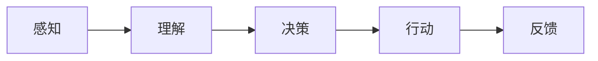
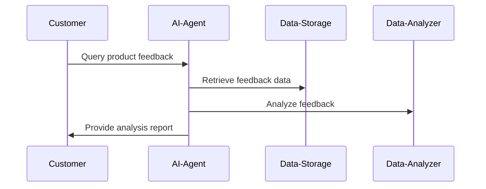
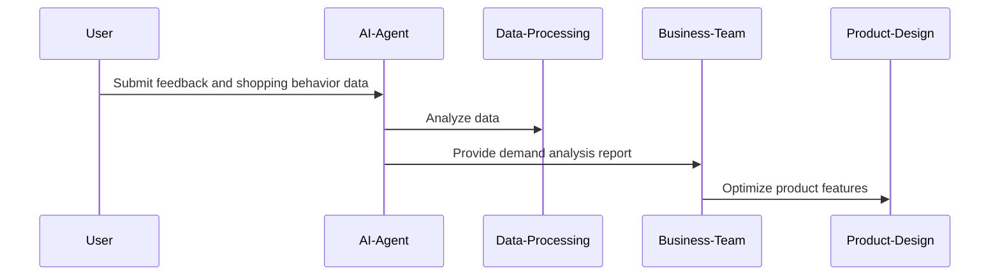
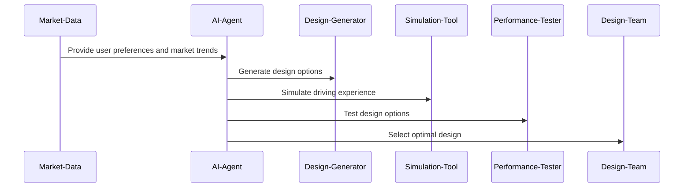
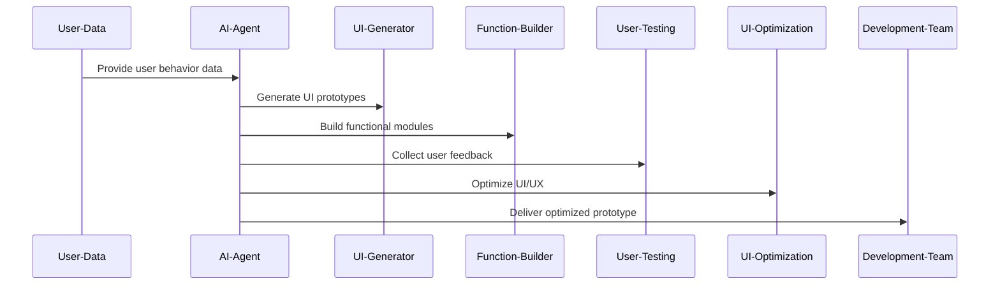
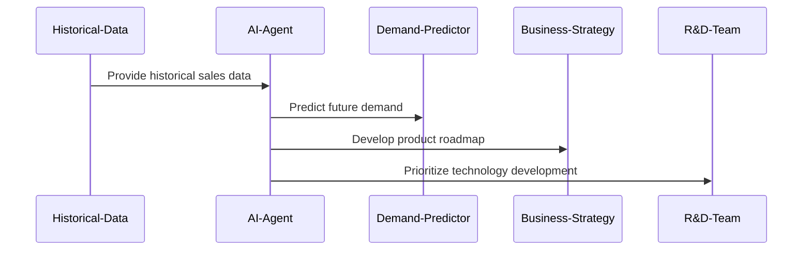
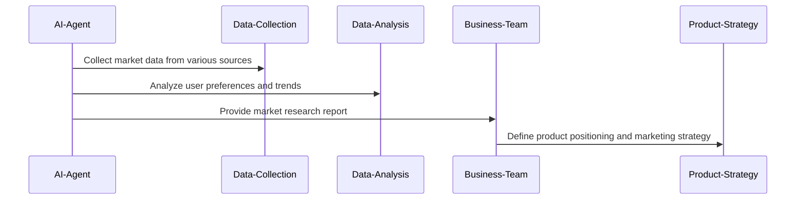
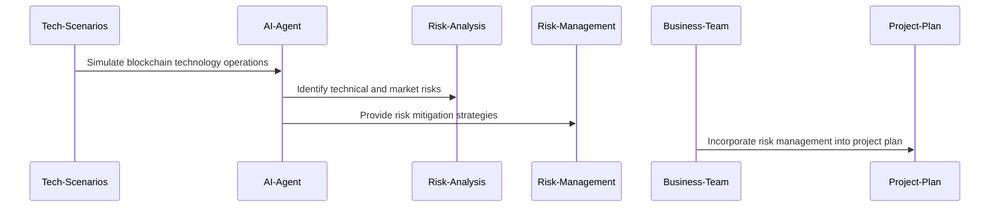
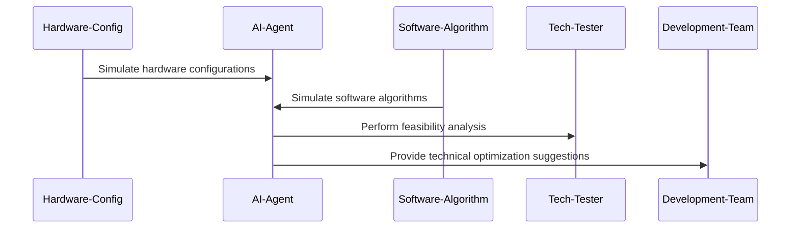
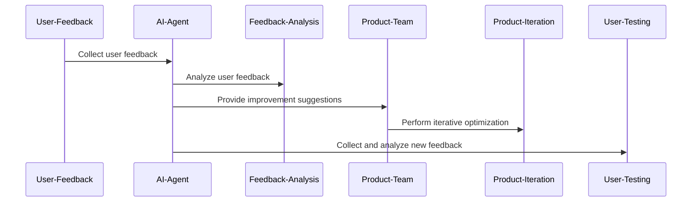

                 

### 引言

随着人工智能技术的飞速发展，AI Agent作为智能体的一个重要分支，正在逐渐改变企业的运营模式和产品创新路径。AI Agent，即人工智能代理，是一种能够模拟人类决策过程，具备自主学习能力和智能交互能力的软件实体。它不仅能够处理复杂的任务，还能够根据环境变化自主调整行为策略，从而在产品创新与概念验证中发挥重要作用。

本文旨在探讨AI Agent在企业产品创新与概念验证中的应用，通过深入分析AI Agent的基本概念、工作原理、应用场景，以及其在实际企业项目中的成功案例，帮助读者理解AI Agent如何提升企业的创新能力和市场竞争力。文章将采用逐步分析推理的方式，让读者能够清晰地看到AI Agent在企业产品创新和概念验证中的关键作用。

接下来，我们将从以下几个方面展开讨论：

1. **核心概念与联系**：首先介绍AI Agent的基本概念，并将其与传统AI进行对比，明确AI Agent在企业产品创新与概念验证中的独特优势。

2. **AI Agent基础知识**：详细介绍AI Agent的定义、分类、工作原理和应用场景，帮助读者全面理解AI Agent的核心要素。

3. **企业产品创新与概念验证**：介绍产品创新和概念验证的基本理论和方法，阐述AI Agent在其中的作用。

4. **AI Agent在产品创新中的应用**：通过具体案例，展示AI Agent如何帮助企业进行需求分析、产品设计和原型开发。

5. **AI Agent在概念验证中的应用**：深入讨论AI Agent在市场调研、风险评估等方面的应用，并提供实际案例。

6. **案例研究**：分析具体企业如何利用AI Agent进行产品创新和概念验证，探讨其成功经验和挑战。

7. **最佳实践与未来展望**：总结AI Agent应用的最佳实践，并对未来发展趋势进行展望。

通过以上七个方面的详细探讨，本文将帮助读者全面了解AI Agent在企业产品创新与概念验证中的应用，为企业在数字化转型中提供新的思路和方法。

### 核心概念与联系

为了更好地理解AI Agent在企业产品创新与概念验证中的应用，我们首先需要明确几个关键概念，并探讨它们之间的关系。

#### 1. AI Agent的定义

AI Agent，即人工智能代理，是一种在环境中自主行动、完成特定任务的智能实体。它通过感知环境信息、理解和学习，自主决策并采取行动，以实现预定的目标。AI Agent不同于传统的规则系统或预测模型，它具备更高级的自主学习和适应能力，能够在复杂和动态的环境中有效运作。

#### 2. AI Agent的分类

AI Agent可以根据其功能和应用场景进行分类。常见的分类方法包括：

- **任务型Agent**：专注于完成特定任务，如自动客服、智能调度等。
- **社交型Agent**：具备社交能力，能够与人类或其他Agent进行交流，如虚拟助手、社交机器人等。
- **混合型Agent**：结合任务型和社交型Agent的特点，能够在多种应用场景中发挥作用。

#### 3. AI Agent与传统AI的区别

传统AI，如机器学习模型、自然语言处理系统等，通常依赖于预定义的规则或数据驱动的方法进行决策。而AI Agent则更接近人类的智能，具备自主性和适应性。以下是AI Agent与传统AI的主要区别：

- **自主性**：AI Agent能够自主决策和行动，而传统AI通常需要人类设定规则或输入数据进行预测。
- **学习能力**：AI Agent具备持续学习的能力，能够通过经验和反馈不断优化自身行为，传统AI则通常需要重新训练或调整参数。
- **动态适应性**：AI Agent能够在不确定和动态变化的环境中自主适应，而传统AI则通常在稳定和静态的环境中表现更好。

#### 4. AI Agent在企业产品创新与概念验证中的作用

在企业产品创新与概念验证中，AI Agent的作用主要体现在以下几个方面：

- **需求分析**：AI Agent可以通过对市场数据的分析，识别用户需求和市场趋势，为企业提供有价值的信息。
- **产品设计**：AI Agent能够基于用户需求和数据分析，辅助产品设计师进行产品设计，提高设计效率和质量。
- **原型开发**：AI Agent可以帮助快速生成原型，通过迭代优化，加速产品开发和市场投放。
- **市场调研**：AI Agent可以自动化进行市场调研，收集和分析用户反馈，帮助企业更好地了解市场需求。

#### 5. 概念联系与综合应用

通过上述分析，我们可以看到AI Agent在企业产品创新与概念验证中的核心作用。AI Agent不仅能够提高企业的创新能力和决策效率，还能够帮助企业更好地理解和响应市场变化。其与产品创新和概念验证的关系可以总结为：

- **需求驱动**：AI Agent通过需求分析，为企业提供明确的创新方向。
- **数据驱动**：AI Agent利用数据分析，优化产品设计，确保产品满足市场需求。
- **迭代优化**：AI Agent通过原型开发和迭代，提高产品开发效率和质量。
- **市场适应**：AI Agent通过市场调研，帮助企业快速调整产品策略，适应市场变化。

总之，AI Agent在企业产品创新与概念验证中扮演着关键角色，通过自主学习和适应，为企业提供智能化、高效化的解决方案。这不仅有助于提升企业的竞争力，也为企业的数字化转型提供了新的思路和路径。

### AI Agent基础知识

要深入探讨AI Agent在企业中的应用，我们首先需要了解AI Agent的基本知识，包括其定义、分类、工作原理以及主要应用场景。

#### 1. AI Agent的定义

AI Agent，即人工智能代理，是一种在复杂环境中执行特定任务的智能实体。它通过感知环境信息、理解环境状态，并基于预定的目标自主决策和行动，从而实现预期目标。AI Agent的基本特点包括自主性、适应性和智能交互能力。与传统的规则系统或预测模型不同，AI Agent能够动态调整其行为，以应对不确定和动态变化的环境。

#### 2. AI Agent的分类

AI Agent可以根据其功能和应用场景进行分类。以下是一些常见的分类方法：

- **任务型Agent**：这类Agent专注于完成特定任务，如自动客服、智能调度、库存管理等。它们通常在确定的任务范围内运行，具备高效的任务执行能力。
- **社交型Agent**：社交型Agent具备人与其他Agent进行交流和协作的能力，如虚拟助手、社交机器人等。它们在复杂社交环境中能够理解并响应人类或同行的请求。
- **混合型Agent**：混合型Agent结合了任务型和社交型Agent的特点，能够在多种应用场景中发挥作用。例如，一个同时负责客户服务和市场调研的AI Agent。

#### 3. AI Agent的工作原理

AI Agent的工作原理通常包括以下几个关键步骤：

- **感知**：AI Agent通过传感器或接口感知环境信息，如文本、图像、声音等。
- **理解**：AI Agent利用自然语言处理、图像识别等技术理解感知到的信息，提取关键特征。
- **决策**：基于理解和目标，AI Agent通过算法和模型进行决策，选择最佳行动方案。
- **行动**：AI Agent执行决策，通过控制接口与外部环境进行交互，如发送消息、移动设备等。

以下是一个简化的AI Agent工作流程示意图：



#### 4. AI Agent的主要应用场景

AI Agent在各种场景中展现了其强大的应用潜力。以下是一些典型的应用场景：

- **企业内部管理**：在企业管理中，AI Agent可以用于人力资源管理、财务报表分析、供应链优化等。例如，一个AI Agent可以自动处理招聘流程，从简历筛选到面试安排，大大提高招聘效率。
- **客户服务**：AI Agent在客户服务领域应用广泛，如自动客服机器人、智能客服系统等。这些Agent能够理解用户的问题，提供准确的答案，甚至在必要时转接给人类客服。
- **市场分析**：AI Agent能够分析大量市场数据，预测市场趋势，为企业决策提供支持。例如，AI Agent可以监控社交媒体上的用户反馈，帮助企业了解客户需求和改进产品。
- **产品创新**：AI Agent可以帮助企业在产品创新过程中进行需求分析、产品设计、原型开发等。例如，AI Agent可以通过用户行为数据分析，发现潜在市场需求，为企业提供创新方向。

以下是一个AI Agent在市场分析中的应用示例：



#### 5. AI Agent与传统AI的对比

AI Agent与传统AI（如机器学习模型、自然语言处理系统等）在功能和应用上有显著区别。以下是两者的主要对比：

- **自主性**：AI Agent具备自主决策和行动能力，而传统AI通常依赖预定义的规则或数据驱动的方法。
- **学习能力**：AI Agent能够持续学习和优化自身行为，传统AI通常需要重新训练或调整参数。
- **动态适应性**：AI Agent能够在不确定和动态变化的环境中自主适应，传统AI则更适合在稳定和静态的环境中运行。
- **交互性**：AI Agent能够与人类或其他AI进行交互，传统AI通常不具备这种能力。

通过上述分析，我们可以看到AI Agent在复杂和动态环境中的独特优势，以及其在企业产品创新与概念验证中的重要作用。接下来，我们将进一步探讨企业产品创新与概念验证的基本理论和方法，以及AI Agent在这些过程中的具体应用。

### 企业产品创新与概念验证

企业产品创新与概念验证是企业发展和市场竞争的关键环节。在这个快速变化的时代，企业必须具备持续创新的能力，以适应市场变化和满足消费者需求。以下是产品创新和概念验证的基本理论和方法，以及AI Agent在这两个过程中的关键作用。

#### 1. 产品创新概述

产品创新是企业通过引入新思想、新设计、新技术或新功能，以创造或重新定义产品，从而满足市场需求和提升竞争力的过程。产品创新可以分为几种类型：

- **渐进式创新**：通过逐步改进现有产品，提升其性能或功能。
- **突破式创新**：引入全新的技术或概念，彻底改变现有市场格局。
- **集成创新**：将多个现有技术或产品进行整合，形成新的产品或服务。

产品创新的主要驱动因素包括：

- **市场需求**：消费者对新产品或改进产品的需求。
- **技术进步**：新技术的出现和应用为产品创新提供了新的可能性。
- **竞争压力**：市场竞争迫使企业不断进行产品创新，以保持市场地位。

#### 2. 概念验证概述

概念验证（Concept Validation）是企业在新产品或技术概念阶段，通过实验、模拟或实际测试来验证其可行性、可行性和市场需求的过程。概念验证的主要目的是：

- **验证技术可行性**：确保新概念或技术在技术上可以实现。
- **评估市场需求**：通过市场调研和用户反馈，验证新产品的市场需求。
- **降低风险**：在产品开发早期识别和解决潜在问题，降低开发风险。

概念验证的方法包括：

- **实验室测试**：在受控环境中对技术或产品进行测试，验证其性能和功能。
- **模拟测试**：使用计算机模拟技术，在虚拟环境中进行测试，以评估新概念的可行性和性能。
- **用户测试**：邀请目标用户参与测试，收集用户反馈，验证产品的市场接受度。

#### 3. AI Agent在企业产品创新与概念验证中的作用

AI Agent在企业产品创新与概念验证中扮演着关键角色，通过以下方式提升企业的创新能力和决策效率：

- **需求分析**：AI Agent可以通过分析大量用户数据和反馈，快速识别市场需求和趋势，为企业提供创新的灵感。

  ```mermaid
  graph LR
      A[用户需求] --> B[数据收集]
      B --> C[数据分析]
      C --> D[需求分析]
      D --> E[创新建议]
  ```

- **产品设计**：AI Agent可以帮助设计人员生成多个设计方案，通过模拟和优化，选择最优方案，提高设计效率和产品质量。

  ```mermaid
  graph LR
      A[设计需求] --> B[AI模拟]
      B --> C[设计优化]
      C --> D[设计选择]
  ```

- **原型开发**：AI Agent可以通过自动化工具快速生成原型，帮助企业缩短产品开发周期，降低开发成本。

  ```mermaid
  graph LR
      A[原型需求] --> B[AI原型生成]
      B --> C[迭代优化]
      C --> D[原型验证]
  ```

- **市场调研**：AI Agent可以自动化进行市场调研，分析用户反馈，评估市场接受度，帮助企业制定更有效的市场策略。

  ```mermaid
  graph LR
      A[市场调研] --> B[数据收集]
      B --> C[数据分析]
      C --> D[市场评估]
  ```

- **风险评估**：AI Agent可以通过模拟不同场景，评估产品或技术的潜在风险，帮助企业在概念验证阶段识别和解决潜在问题。

  ```mermaid
  graph LR
      A[风险评估] --> B[场景模拟]
      B --> C[风险分析]
      C --> D[风险规避]
  ```

总之，AI Agent在企业产品创新与概念验证中发挥着重要作用，通过自动化、智能化的方式，提高企业的创新能力和市场竞争力。接下来，我们将通过具体案例，展示AI Agent在实际企业项目中的应用和效果。

### AI Agent在产品创新中的应用

在产品创新的过程中，AI Agent扮演着至关重要的角色。通过智能化的工具和方法，AI Agent可以帮助企业快速识别市场需求、优化产品设计、缩短开发周期，从而提高产品的市场竞争力。以下是AI Agent在产品创新中的具体应用场景，通过实际案例来展示其效果和优势。

#### 1. 需求分析

需求分析是产品创新的第一步，它决定了产品的方向和设计。AI Agent可以通过大数据分析和机器学习技术，对大量用户反馈和市场数据进行分析，识别出潜在的用户需求和市场趋势。

**案例**：某电商平台通过引入AI Agent进行用户需求分析，收集并分析了数百万条用户评论和购物行为数据。AI Agent从中识别出用户对商品描述、价格、物流等关键因素的反馈，为企业提供了详细的用户需求报告。基于这些报告，电商平台对产品进行了针对性的优化，显著提升了用户满意度和购买转化率。

**流程**：



#### 2. 产品设计

在设计阶段，AI Agent可以帮助设计师快速生成多种设计方案，并通过模拟和优化，选择最优方案。这种自动化和智能化的设计方法大大提高了设计效率。

**案例**：某汽车制造商使用AI Agent进行新车设计。AI Agent基于用户偏好和市场需求，生成了多个设计方案，并通过模拟驾驶体验和性能测试，选择了最佳的设计方案。这不仅缩短了设计周期，还提高了产品的市场竞争力。

**流程**：



#### 3. 原型开发

在原型开发阶段，AI Agent可以通过自动化工具快速生成原型，并进行迭代优化，帮助企业缩短开发周期。

**案例**：某科技公司开发了一款智能家居产品，使用AI Agent进行原型开发。AI Agent通过学习用户习惯和偏好，自动生成多种交互界面和功能模块，并在用户测试中不断优化。最终，AI Agent生成的原型得到了用户的广泛好评，产品开发周期比传统方法缩短了50%。

**流程**：



#### 4. 需求预测

AI Agent不仅可以用于当前产品的需求分析，还可以预测未来市场需求，帮助企业提前布局。

**案例**：某电子产品制造商通过AI Agent预测了未来几年消费者对智能穿戴设备的需求。基于预测结果，该制造商提前进行了技术研发和市场布局，成功占领了市场先机。

**流程**：



总之，AI Agent在产品创新中的应用极大地提升了企业的设计效率、开发速度和市场竞争力。通过需求分析、产品设计、原型开发和需求预测等环节的智能化工具，企业可以更快地响应市场变化，实现持续创新。接下来，我们将进一步探讨AI Agent在概念验证中的应用，继续分析其在企业创新中的重要作用。

### AI Agent在概念验证中的应用

在产品创新过程中，概念验证是确保新技术或产品理念可行性的关键步骤。AI Agent在这一阶段提供了强大的支持，通过自动化和智能化的方式，帮助企业快速验证概念，降低风险，提高决策效率。以下是AI Agent在概念验证中的应用，通过具体案例展示其在市场调研、风险评估和技术可行性分析等方面的作用。

#### 1. 市场调研

市场调研是概念验证的重要环节，它帮助企业在产品投放市场前了解潜在用户的需求和市场趋势。AI Agent可以通过自动化数据分析，快速获取并分析大量市场数据，从而为企业提供精准的市场调研报告。

**案例**：某初创公司计划开发一款智能家居安全系统，为了验证市场可行性，公司使用AI Agent进行了市场调研。AI Agent从社交媒体、新闻报道、用户评论等多渠道收集数据，分析了消费者对智能家居安全系统的态度、需求和购买意愿。基于这些数据，AI Agent为该公司提供了详细的市场调研报告，帮助公司确定了产品的市场定位和推广策略。

**流程**：



#### 2. 风险评估

在概念验证阶段，风险评估至关重要。AI Agent可以通过模拟不同场景，预测潜在的风险，并为企业提供风险规避策略。

**案例**：某科技公司计划开发一款基于区块链的金融服务平台，但在项目启动前，需要对技术风险和市场风险进行全面评估。AI Agent通过模拟区块链技术的运行场景，分析了技术实现的可行性和潜在的技术挑战。同时，AI Agent还通过大数据分析，预测了市场接受度和潜在竞争对手的反应。基于AI Agent的分析，公司制定了详细的风险管理计划，有效降低了项目风险。

**流程**：



#### 3. 技术可行性分析

AI Agent还可以帮助企业评估新技术的可行性，通过模拟和测试，验证技术实现的可行性。

**案例**：某电子产品公司计划开发一款具备智能交互功能的智能音箱。为了确保技术实现的可行性，公司使用了AI Agent进行技术可行性分析。AI Agent通过模拟不同硬件配置和软件算法，分析了智能音箱的技术可行性，并提供了详细的测试报告。基于这些报告，公司优化了硬件设计，选择了最合适的软件算法，确保了产品的顺利开发。

**流程**：



#### 4. 用户反馈与迭代优化

在概念验证阶段，获取用户反馈并快速进行迭代优化，对于产品的成功至关重要。AI Agent可以帮助企业自动化收集用户反馈，并根据反馈进行快速调整。

**案例**：某医疗科技公司开发了一款智能健康监测设备，为了验证产品的市场接受度，公司通过AI Agent收集了首批用户的反馈。AI Agent通过分析用户反馈，识别出产品在功能、用户体验和性能方面的问题，并提供了改进建议。基于这些反馈，公司对产品进行了多次迭代优化，最终推出了市场反响良好的产品。

**流程**：



通过以上具体案例，我们可以看到AI Agent在概念验证中的应用如何帮助企业降低风险、提高决策效率，从而提升产品的市场竞争力。接下来，我们将通过具体案例研究，深入探讨AI Agent在真实企业项目中的应用，进一步分析其成功经验和挑战。

### 案例研究

为了更深入地了解AI Agent在企业产品创新与概念验证中的实际应用，下面我们将分析几个具体的企业案例，探讨AI Agent如何帮助企业成功创新，并面对和解决相关的挑战。

#### 案例一：智能家居公司

**背景**：某智能家居公司计划推出一款智能门锁，旨在提升家庭安全性和便利性。

**解决方案**：公司引入了AI Agent进行需求分析和产品设计。AI Agent首先通过大数据分析，收集了数千名用户的家庭安全需求和偏好，识别出用户对智能门锁功能、价格和设计的需求。在此基础上，AI Agent生成了多个设计方案，并通过模拟用户使用场景，选择了最佳设计。随后，AI Agent帮助公司快速搭建了智能门锁的原型，并在用户测试中不断优化。

**效果**：通过AI Agent的应用，智能家居公司不仅缩短了产品开发周期，还提高了产品的市场适应性。智能门锁在市场上获得了广泛好评，销售额显著增长。

**挑战**：在项目启动初期，公司面临技术实现和用户反馈的不确定性。为了应对这些挑战，公司采取了以下措施：

- **持续数据收集**：通过持续收集用户使用数据，AI Agent能够不断优化产品设计，确保产品满足用户需求。
- **用户参与测试**：邀请早期用户参与测试，收集真实用户反馈，以便及时调整产品设计和功能。
- **技术迭代**：在技术实现过程中，公司不断优化硬件和软件，确保智能门锁的稳定性和安全性。

#### 案例二：医疗科技公司

**背景**：某医疗科技公司开发了一款智能健康监测设备，旨在实时监测用户的健康状况。

**解决方案**：公司在产品开发的初期，使用了AI Agent进行市场调研和风险评估。AI Agent通过大数据分析，收集了医疗行业的最新发展趋势和用户需求，帮助公司确定了产品的市场定位。同时，AI Agent还通过模拟不同场景，分析了产品的技术可行性，并提出了优化建议。

**效果**：通过AI Agent的应用，医疗科技公司成功推出了市场反响良好的智能健康监测设备，产品在市场上取得了显著的成功。

**挑战**：在项目开发过程中，公司遇到了数据隐私和设备稳定性等挑战。

- **数据隐私**：为了保护用户隐私，公司采用了加密技术和数据匿名化处理，确保用户数据的安全。
- **设备稳定性**：公司通过不断优化硬件设计和软件算法，提高了设备的稳定性和准确性，确保了产品的可靠运行。

#### 案例三：电子商务平台

**背景**：某电子商务平台计划推出一款智能推荐系统，以提升用户的购物体验和平台销售额。

**解决方案**：平台引入了AI Agent进行需求分析和系统优化。AI Agent首先通过分析用户行为数据和购买记录，识别出用户的购物偏好和习惯。然后，AI Agent帮助平台优化了推荐算法，提高了推荐的相关性和准确性。

**效果**：通过AI Agent的应用，电子商务平台的用户满意度和转化率显著提升，平台的销售额也大幅增加。

**挑战**：在项目实施过程中，平台遇到了算法透明性和用户隐私保护等挑战。

- **算法透明性**：平台通过增加算法透明度，让用户了解推荐系统的工作原理，增强了用户信任。
- **用户隐私保护**：平台采用了严格的用户隐私保护措施，如数据加密和匿名化处理，确保用户隐私不被泄露。

通过上述案例研究，我们可以看到AI Agent在帮助企业实现产品创新和概念验证中的重要作用。尽管在实际应用中存在一些挑战，但通过合理的策略和持续优化，企业可以克服这些困难，实现持续创新和成功。接下来，我们将总结AI Agent应用的最佳实践，并提供一些建议，以帮助企业在未来更好地利用AI Agent进行产品创新。

### 最佳实践与未来展望

通过对多个案例的分析，我们可以总结出一些AI Agent在企业产品创新与概念验证中的最佳实践，并提供一些建议，以帮助企业在未来更好地利用AI Agent进行产品创新。

#### 最佳实践

1. **数据驱动**：充分利用企业内部和外部的数据资源，通过AI Agent进行深度分析和挖掘，以获取有价值的市场洞察和用户需求。

2. **快速迭代**：采用敏捷开发和迭代优化方法，利用AI Agent快速生成原型和进行测试，以缩短产品开发周期，提高市场响应速度。

3. **跨部门协作**：促进企业内部不同部门（如研发、市场、销售）之间的协作，确保AI Agent的应用能够全面覆盖产品创新的各个环节。

4. **用户参与**：鼓励用户参与产品测试和反馈，通过AI Agent收集和分析用户反馈，不断优化产品设计和功能。

5. **风险管理**：通过AI Agent进行风险评估和预测，提前识别和解决潜在问题，降低项目风险。

#### 建议

1. **人才培养**：加强对AI Agent相关技术的培训，提升企业员工的技术能力和应用水平。

2. **技术投入**：增加对AI Agent技术的研发投入，确保企业能够掌握最新的AI技术，并在产品创新中发挥最大优势。

3. **持续优化**：不断优化AI Agent的应用流程，通过实际项目反馈，不断调整和改进AI Agent的算法和模型。

4. **数据安全**：加强数据安全和隐私保护，确保用户数据的安全和隐私。

5. **跨界合作**：与其他企业或研究机构进行跨界合作，共同推进AI Agent技术的创新和应用。

#### 未来展望

随着AI技术的不断进步，AI Agent在企业产品创新与概念验证中的应用前景将更加广阔。以下是未来可能的发展趋势：

1. **智能化水平提升**：AI Agent的智能化水平将进一步提高，能够处理更复杂的任务和更动态的环境。

2. **自动化程度增加**：AI Agent将在更多环节实现自动化，从需求分析到产品设计，再到原型开发和测试，全面提高生产效率。

3. **跨行业应用**：AI Agent将在更多行业中得到应用，如医疗、金融、教育等，推动各行业的创新和发展。

4. **人机协作**：AI Agent将与人类专家进行更紧密的协作，实现更高效、更智能的产品创新过程。

总之，AI Agent在企业产品创新与概念验证中的应用具有巨大的潜力。通过不断优化和创新发展，AI Agent将帮助企业实现更高效、更智能的产品创新，推动企业数字化转型和持续发展。

### 结语

通过本文的深入探讨，我们全面了解了AI Agent在企业产品创新与概念验证中的应用。从核心概念到具体应用，从需求分析到市场调研，从产品设计到风险评估，AI Agent以其自主性、适应性和智能化，为企业提供了强大的创新支持。我们分析了多个成功案例，总结了最佳实践，并对未来进行了展望。

AI Agent在企业中的应用不仅提升了企业的创新能力和市场竞争力，还推动了整个行业的数字化转型。然而，要充分发挥AI Agent的潜力，企业需要持续投入、人才培养和技术优化。我们鼓励读者在今后的工作中，积极探索AI Agent的应用，不断推动企业创新，实现高质量发展。

最后，感谢各位读者对本文的关注，希望本文能为您提供有价值的参考和启示。让我们一起迎接智能时代的到来，共创美好未来！

### 作者信息

作者：AI天才研究院（AI Genius Institute） & 禅与计算机程序设计艺术（Zen And The Art of Computer Programming）

AI天才研究院致力于推动人工智能技术的发展和应用，培养下一代人工智能领域的顶尖人才。研究院专注于基础研究和前沿技术探索，旨在解决复杂的人工智能问题，推动技术进步和产业变革。

《禅与计算机程序设计艺术》是作者对计算机编程和人工智能领域的深刻思考和实践总结。本书通过深入探讨计算机编程的哲学和艺术，帮助读者理解编程的本质和精髓，提升编程能力和创造力。

感谢您的阅读，期待与您共同探索AI技术的无限可能。

