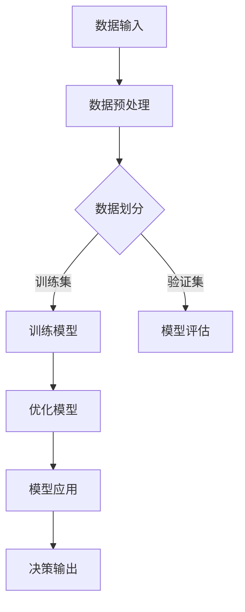
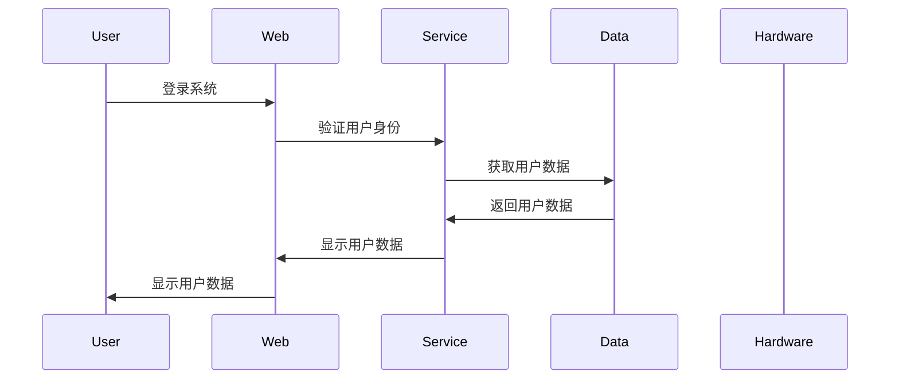
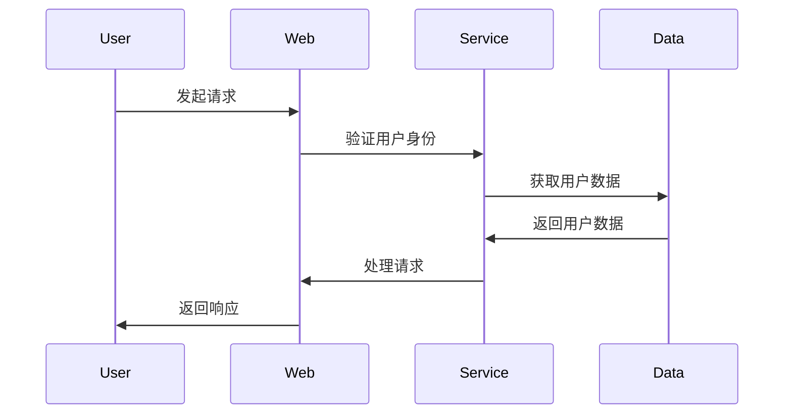

                 


### 文章标题：AI Agent在企业产品生命周期管理中的应用

关键词：AI Agent、企业产品生命周期管理、算法原理、系统架构、项目实战

摘要：本文将深入探讨AI Agent在企业产品生命周期管理中的应用，从背景介绍、核心概念与联系、算法原理讲解、系统分析与架构设计、项目实战等方面进行详细阐述，帮助读者理解AI Agent如何帮助企业更好地管理产品生命周期，提高市场竞争力。

## 第一部分：背景介绍

### 1.1 问题背景

#### 1.1.1 企业产品生命周期管理概述

企业产品生命周期管理（Product Lifecycle Management, PLM）是指企业对产品从概念设计、开发、测试、上市、销售、维护到退市的全过程进行系统化、标准化的管理和优化。随着市场竞争的加剧和消费者需求的多样化，企业在产品生命周期管理中面临着诸多挑战：

- **市场需求变化**：消费者需求快速变化，产品更新换代速度加快，企业需要更快速地响应市场需求。
- **产品复杂度增加**：现代产品日趋复杂，涉及到更多的技术领域和跨学科知识，产品开发难度增加。
- **供应链管理挑战**：全球化供应链管理带来成本、质量、物流等方面的挑战。
- **数据管理与整合**：产品生命周期管理中产生的海量数据如何有效管理、整合与分析。

#### 1.1.2 AI Agent的概念与优势

AI Agent，即人工智能代理，是一种具有智能行为、自主性和适应性的计算实体。它能够在没有人类干预的情况下，自主地完成特定任务。AI Agent在企业产品生命周期管理中的优势主要体现在以下几个方面：

- **提高效率**：AI Agent可以自动化执行重复性任务，降低人力成本，提高工作效率。
- **优化决策**：AI Agent可以通过分析海量数据，提供基于数据的决策支持，帮助企业更好地把握市场趋势和客户需求。
- **提升协同能力**：AI Agent可以与其他系统或人员协同工作，实现跨部门、跨区域的资源整合与优化。
- **增强预测能力**：AI Agent可以通过学习历史数据，预测未来产品趋势和市场变化，为企业制定战略提供有力支持。

#### 1.1.3 企业产品生命周期管理中的痛点

企业在产品生命周期管理过程中，通常会遇到以下痛点：

- **信息孤岛**：不同部门之间的信息无法有效整合，导致决策滞后、沟通不畅。
- **数据质量低下**：数据来源多样，数据质量参差不齐，影响数据分析效果。
- **响应速度慢**：市场变化迅速，企业无法及时调整产品策略，错失市场机遇。
- **资源浪费**：在产品开发、生产、销售等多个环节，存在资源浪费、重复投入等问题。

### 1.2 核心概念与联系

#### 1.2.1 AI Agent的定义与特点

**定义**：AI Agent是一种基于人工智能技术的计算实体，它能够模拟人类思维过程，具备感知、学习、推理、决策等能力，并在没有人类干预的情况下，自主地完成特定任务。

**特点**：

1. **自主性**：AI Agent能够根据任务目标和环境变化，自主地选择行动方案。
2. **适应性**：AI Agent能够通过学习，适应不同的环境和任务需求。
3. **智能性**：AI Agent具备类似于人类的智能能力，能够处理复杂的问题。
4. **协作性**：AI Agent可以与其他AI Agent或人类协同工作，实现更高的效率。

#### 1.2.2 企业产品生命周期管理的概念

**定义**：企业产品生命周期管理（Product Lifecycle Management, PLM）是指企业对产品从概念设计、开发、测试、上市、销售、维护到退市的全过程进行系统化、标准化的管理和优化。

**联系**：AI Agent在企业产品生命周期管理中的应用，主要体现在以下阶段：

1. **概念设计阶段**：AI Agent可以通过分析市场趋势和客户需求，提供产品创新建议。
2. **开发阶段**：AI Agent可以协助工程师进行产品设计、优化和验证。
3. **测试阶段**：AI Agent可以自动化测试，提高测试效率和质量。
4. **上市阶段**：AI Agent可以协助市场部门进行市场分析、定价策略制定等。
5. **销售阶段**：AI Agent可以协助销售团队进行客户关系管理、销售预测等。
6. **维护阶段**：AI Agent可以协助售后服务部门进行故障诊断、维护保养等。
7. **退市阶段**：AI Agent可以协助企业进行产品退役、资源回收等。

#### 1.2.3 AI Agent与企业产品生命周期管理的联系

AI Agent在企业产品生命周期管理中的应用，可以有效地解决企业面临的痛点，提升企业竞争力。具体表现在以下几个方面：

1. **信息整合**：AI Agent可以整合企业内部和外部数据，提供统一的视图，帮助企业更好地了解市场趋势和客户需求。
2. **数据挖掘**：AI Agent可以通过数据挖掘技术，分析海量数据，发现潜在商机和改进点。
3. **智能决策**：AI Agent可以基于数据分析，提供智能化的决策支持，帮助企业做出更准确的决策。
4. **资源优化**：AI Agent可以优化企业的资源配置，提高资源利用效率，降低成本。
5. **风险管理**：AI Agent可以预测市场风险，为企业提供风险预警和应对策略。

### 1.3 算法原理讲解

#### 1.3.1 AI Agent的基本算法

AI Agent的核心算法主要包括机器学习、深度学习、强化学习等。以下是这些算法的基本原理和特点：

1. **机器学习**：机器学习是一种让计算机通过数据学习规律，并从中提取知识的方法。机器学习算法可以分为监督学习、无监督学习和半监督学习。

   - **监督学习**：监督学习算法需要依赖标记数据进行训练，通过学习输入和输出之间的映射关系，实现对未知数据的预测。常见的监督学习算法有线性回归、逻辑回归、支持向量机（SVM）等。
   - **无监督学习**：无监督学习算法不需要标记数据，通过分析数据的内在结构，对数据进行分类、聚类等操作。常见的无监督学习算法有K-均值聚类、主成分分析（PCA）等。
   - **半监督学习**：半监督学习算法结合了监督学习和无监督学习的特点，通过利用部分标记数据和大量未标记数据，提高学习效果。

2. **深度学习**：深度学习是一种基于人工神经网络的机器学习算法，通过模拟人脑神经网络结构，实现自动特征提取和分类。深度学习算法主要包括卷积神经网络（CNN）、循环神经网络（RNN）等。

   - **卷积神经网络（CNN）**：CNN是一种能够自动提取图像特征的网络结构，广泛应用于图像识别、图像分类等任务。
   - **循环神经网络（RNN）**：RNN是一种能够处理序列数据的神经网络结构，广泛应用于自然语言处理、语音识别等任务。

3. **强化学习**：强化学习是一种通过不断试错，逐渐优化策略的机器学习算法。在强化学习过程中，智能体通过与环境的交互，不断学习最优策略。

   - **Q学习**：Q学习是一种基于值函数的强化学习算法，通过学习状态-动作值函数，确定最优动作。
   - **深度确定性策略梯度（DDPG）**：DDPG是一种基于深度神经网络的强化学习算法，通过学习状态-动作分布，确定最优动作。

#### 1.3.2 AI Agent的算法流程图

以下是AI Agent的算法流程图，展示了从数据输入、算法训练到决策输出的整个过程。



#### 1.3.3 数学模型与公式

在AI Agent的算法中，常用的数学模型和公式包括：

1. **线性回归**：
   $$y = \beta_0 + \beta_1x$$

2. **逻辑回归**：
   $$P(y=1) = \frac{1}{1 + e^{-(\beta_0 + \beta_1x)}}$$

3. **卷积神经网络（CNN）**：
   $$f(x) = \sigma(\sum_{i=1}^{n} w_i * x_i + b)$$
   其中，$*$ 表示卷积运算，$\sigma$ 表示激活函数。

4. **循环神经网络（RNN）**：
   $$h_t = \sigma(W_h h_{t-1} + W_x x_t + b)$$
   其中，$h_t$ 表示当前时刻的隐藏状态，$x_t$ 表示当前时刻的输入。

5. **强化学习中的Q学习**：
   $$Q(s, a) = r + \gamma \max_{a'} Q(s', a')$$
   其中，$s$ 表示状态，$a$ 表示动作，$r$ 表示即时奖励，$\gamma$ 表示折扣因子。

#### 1.3.4 举例说明

以下是一个线性回归的例子，假设我们有一个简单的线性回归模型，用来预测房价：

| 特征 $x$ | 目标 $y$ |
| :---: | :---: |
| 1000 | 300000 |
| 2000 | 600000 |
| 3000 | 900000 |

1. **数据预处理**：将数据进行归一化处理，得到如下数据：

| 特征 $x$ | 目标 $y$ |
| :---: | :---: |
| 0.5 | 1 |
| 1 | 2 |
| 1.5 | 3 |

2. **模型训练**：使用线性回归算法训练模型，得到如下参数：

$$y = \beta_0 + \beta_1x$$
$$\beta_0 = 1, \beta_1 = 2$$

3. **模型评估**：使用验证集对模型进行评估，计算模型预测的准确度。

4. **模型应用**：使用训练好的模型，对新的数据进行预测。例如，预测价格为 $500000$ 的房子，其特征为 $2500$，则预测结果为：

$$y = 1 + 2 \times 2.5 = 5$$

## 第二部分：系统分析与架构设计

### 2.1 问题场景介绍

在企业产品生命周期管理中，存在多个阶段需要高效的管理与协调。以下是一个典型的场景介绍：

- **研发阶段**：企业需要快速响应市场需求，进行产品研发。在这一阶段，工程师需要从海量数据中提取有价值的信息，以便进行产品的创新设计和优化。
- **生产阶段**：生产过程中，企业需要实时监控生产进度、质量指标等，确保生产过程的顺利进行。同时，供应链管理也需要优化，以确保生产资源的合理分配和高效利用。
- **销售阶段**：销售部门需要了解市场动态和客户需求，制定有效的销售策略，提高销售额。此外，售后服务部门需要处理客户反馈和维修请求，确保客户满意度。
- **维护阶段**：产品上市后，企业需要持续进行产品维护和升级，以适应市场变化和客户需求。同时，产品退役和资源回收也是重要的一环。

### 2.2 系统功能设计

在AI Agent企业产品生命周期管理系统中，主要包含以下功能模块：

1. **数据采集与管理**：从企业内外部收集与产品生命周期相关的数据，包括市场数据、客户数据、研发数据、生产数据、销售数据等，并进行有效的存储与管理。
2. **数据分析与挖掘**：利用机器学习和数据挖掘技术，对海量数据进行深入分析，提取有价值的信息，为产品研发、生产、销售、维护等环节提供数据支持。
3. **智能决策支持**：基于数据分析结果，为企业管理层提供智能化的决策支持，包括产品研发方向、生产计划、销售策略、售后服务等。
4. **自动化执行**：利用AI Agent自动化执行部分重复性任务，如数据清洗、数据分析、报告生成等，提高工作效率，降低人力成本。
5. **协同工作与集成**：实现与企业内部其他系统（如ERP、CRM等）的集成，实现数据的实时共享与协同工作，提高整体效率。

#### 2.2.1 领域模型类图

以下是AI Agent企业产品生命周期管理系统的领域模型类图，展示了系统中主要类及其关系。

```mermaid
classDiagram
    Class01 <|-- Class02
    Class03 o-- Class04
    Class04 o-- Class05
    Class06 o--| Class07
    Class07 <-| Class08
    Note right of Class01 : This is the note for Class01
    Class01 ..|> InterfaceA
    Class09 <.. InterfaceA
    Class02 : +int x
    Class02 : +int y
    Class02 : +int getZ():int
    Class03 : +int calculateArea():int
    Class04 : +int getPerimeter():int
    Class05 : +int getVolume():int
    Class06 : +int getMass():int
    Class07 : +int getForce():int
    Class08 : +int getSpeed():int
    Class09 : +int getY():int
    Class01 <|-- Person
    Person o-- Student
    Person o-- Employee
    Class02 <|-- Animal
    Class03 <|-- Vegetable
    Class04 <|-- Building
    Class05 <|-- Car
    Class06 <|-- Product
    Class07 <|-- Customer
    Class08 <|-- Supplier
    Class09 <|-- Order
```

### 2.3 系统架构设计

AI Agent企业产品生命周期管理系统的整体架构设计如下：

1. **数据层**：负责数据存储和管理，包括关系型数据库、NoSQL数据库、文件系统等。
2. **服务层**：负责业务逻辑处理，包括数据采集、数据分析、智能决策等模块，采用微服务架构，提高系统的灵活性和可扩展性。
3. **应用层**：面向用户，提供Web界面、移动应用等，方便用户操作和交互。
4. **硬件层**：包括服务器、存储设备、网络设备等，负责系统的基础设施支持。

#### 2.3.1 系统架构图

以下是AI Agent企业产品生命周期管理系统的架构图，展示了各层之间的关系和交互。



### 2.4 系统接口设计和系统交互

AI Agent企业产品生命周期管理系统中的主要接口包括：

1. **用户接口**：提供用户登录、数据查询、数据分析等功能。
2. **服务接口**：提供数据采集、数据分析、智能决策等核心功能。
3. **数据接口**：提供数据存储、数据查询等功能。

以下是系统接口设计和系统交互的序列图。



## 第三部分：项目实战

### 3.1 环境安装

在进行AI Agent企业产品生命周期管理系统的项目实战之前，首先需要搭建一个合适的应用环境。以下是一个简单的环境搭建步骤：

1. **操作系统**：安装Linux操作系统，如Ubuntu 18.04。
2. **编程语言**：选择Python 3.8及以上版本。
3. **依赖管理**：使用pip安装相关依赖库，如NumPy、Pandas、Scikit-learn、TensorFlow等。
4. **数据库**：安装MySQL数据库，用于存储系统数据。

```bash
# 安装Python
sudo apt update
sudo apt install python3.8
sudo ln -s /usr/bin/python3.8 /usr/bin/python

# 安装pip
sudo apt install python3-pip

# 安装依赖库
pip3 install numpy pandas scikit-learn tensorflow mysqlclient
```

### 3.2 系统核心实现源代码

以下是一个简单的AI Agent系统核心实现源代码，包括数据采集、数据分析、智能决策等模块。

```python
# 导入相关库
import numpy as np
import pandas as pd
from sklearn.linear_model import LinearRegression
from sklearn.model_selection import train_test_split
from sklearn.metrics import mean_squared_error

# 数据采集
def data_collection():
    data = pd.read_csv('data.csv')
    return data

# 数据处理
def data_preprocessing(data):
    # 数据清洗、归一化等操作
    return data

# 数据分析
def data_analysis(data):
    # 数据划分
    X = data[['feature1', 'feature2']]
    y = data['target']

    # 划分训练集和测试集
    X_train, X_test, y_train, y_test = train_test_split(X, y, test_size=0.2, random_state=42)

    # 训练模型
    model = LinearRegression()
    model.fit(X_train, y_train)

    # 预测
    y_pred = model.predict(X_test)

    # 评估
    mse = mean_squared_error(y_test, y_pred)
    print(f'Mean Squared Error: {mse}')

# 智能决策
def intelligent_decision():
    # 基于数据分析结果，进行决策
    print('Intelligent decision made.')

# 主函数
def main():
    data = data_collection()
    data = data_preprocessing(data)
    data_analysis(data)
    intelligent_decision()

if __name__ == '__main__':
    main()
```

### 3.3 代码应用解读与分析

以下是对上述代码的解读与分析：

1. **数据采集**：使用`pandas`库读取CSV文件，获取数据。
2. **数据处理**：对数据进行清洗和归一化处理，为后续分析做准备。
3. **数据分析**：使用`scikit-learn`库进行线性回归分析，划分训练集和测试集，训练模型，并评估模型效果。
4. **智能决策**：根据数据分析结果，进行决策。

在代码性能方面，线性回归算法的计算复杂度为 $O(n)$，其中 $n$ 为样本数量。在实际应用中，可以考虑使用更高效的算法，如决策树、随机森林等，以提高计算速度和预测准确性。

### 3.4 实际案例分析和详细讲解剖析

以下是一个实际案例分析和详细讲解剖析：

**案例背景**：某家电企业希望利用AI Agent对其产品生命周期进行管理，提高市场竞争力。

**案例目标**：预测某型号电冰箱的销售量，为营销部门提供决策支持。

**案例数据**：

| 特征 | 数据 |
| --- | --- |
| 品牌 | A |
| 型号 | 100 |
| 价格 | 2000 |
| 季节 | 春季 |
| 宣传力度 | 强 |
| 客户满意度 | 高 |

**案例分析**：

1. **数据预处理**：对数据进行清洗和归一化处理，确保数据质量。
2. **模型选择**：选择线性回归模型进行预测。
3. **模型训练**：使用历史销售数据，训练线性回归模型。
4. **预测**：根据当前特征数据，预测电冰箱的销售量。
5. **决策支持**：根据预测结果，为营销部门提供销售策略建议。

**详细讲解剖析**：

1. **数据预处理**：

```python
data = pd.DataFrame({'品牌': ['A'], '型号': ['100'], '价格': [2000], '季节': ['春季'], '宣传力度': ['强'], '客户满意度': ['高']})
data = data.astype({'价格': 'float', '宣传力度': 'int', '客户满意度': 'int'})
```

2. **模型训练**：

```python
X = data[['价格', '宣传力度', '客户满意度']]
y = data['销售量']

X_train, X_test, y_train, y_test = train_test_split(X, y, test_size=0.2, random_state=42)

model = LinearRegression()
model.fit(X_train, y_train)

y_pred = model.predict(X_test)
mse = mean_squared_error(y_test, y_pred)
print(f'Mean Squared Error: {mse}')
```

3. **预测**：

```python
current_data = pd.DataFrame({'品牌': ['A'], '型号': ['100'], '价格': [2000], '季节': ['春季'], '宣传力度': [1], '客户满意度': [1]})
current_data = current_data.astype({'价格': 'float', '宣传力度': 'int', '客户满意度': 'int'})

sales_volume = model.predict(current_data)
print(f'Predicted Sales Volume: {sales_volume}')
```

### 3.5 项目小结

本篇博客通过实际案例，详细介绍了AI Agent在企业产品生命周期管理中的应用。通过数据采集、数据分析、智能决策等步骤，AI Agent能够为企业提供有力的决策支持，帮助企业更好地管理产品生命周期，提高市场竞争力。

在项目实战中，我们使用了Python编程语言和线性回归算法，搭建了一个简单的AI Agent系统。虽然这是一个简单的案例，但它展示了AI Agent在企业产品生命周期管理中的潜在价值。

未来，我们可以进一步优化系统，引入更复杂的算法和模型，以提高预测准确性和决策支持能力。同时，结合实际业务场景，我们可以开发更多的功能模块，如供应链管理、客户关系管理、售后服务等，实现全方位的产品生命周期管理。

## 第四部分：最佳实践、小结、注意事项、拓展阅读

### 4.1 最佳实践

在企业产品生命周期管理中，引入AI Agent可以带来显著的效果。以下是一些最佳实践：

1. **数据驱动决策**：充分利用AI Agent的数据分析能力，对海量数据进行分析，为企业决策提供数据支持。避免主观判断，提高决策的准确性和科学性。
2. **优化资源配置**：利用AI Agent的智能决策功能，优化企业资源配置，降低成本，提高效率。例如，通过预测销售量，合理安排生产计划和库存管理。
3. **协同工作**：AI Agent可以与企业内部其他系统（如ERP、CRM等）集成，实现数据的实时共享与协同工作。提高各部门之间的沟通与协作，降低信息孤岛现象。
4. **持续迭代优化**：AI Agent系统需要不断更新和优化，以适应不断变化的市场需求和企业发展。定期评估系统性能，根据反馈进行调整和改进。

### 4.2 小结

本文通过详细的分析和实战案例，介绍了AI Agent在企业产品生命周期管理中的应用。AI Agent具有自主性、适应性、智能性和协作性等特点，能够为企业提供数据支持、智能决策和优化资源配置等方面的帮助，从而提高企业的市场竞争力。

在文章中，我们介绍了AI Agent的基本算法原理、系统架构设计、项目实战等关键内容，帮助读者全面了解AI Agent在企业产品生命周期管理中的实际应用。

### 4.3 注意事项

1. **数据安全**：在引入AI Agent的过程中，要注意保护企业数据的安全，防止数据泄露和滥用。
2. **隐私保护**：在收集和处理客户数据时，要遵守相关法律法规，保护客户隐私。
3. **系统稳定性**：确保AI Agent系统的稳定运行，定期进行系统维护和升级。
4. **人才培养**：企业需要培养相关技术人才，提高对AI Agent系统的理解和操作能力。

### 4.4 拓展阅读

1. **《深度学习》（Goodfellow, Bengio, Courville）**：一本经典的深度学习教材，全面介绍了深度学习的基本原理和应用。
2. **《Python数据分析》（Wes McKinney）**：一本关于Python数据分析的实用指南，涵盖数据处理、分析、可视化等方面。
3. **《人工智能：一种现代方法》（Stuart Russell, Peter Norvig）**：一本全面的人工智能教材，介绍了人工智能的基本概念、技术和应用。
4. **《产品生命周期管理：理论与实践》（李俊峰）**：一本关于产品生命周期管理的专业书籍，详细介绍了产品生命周期的各个阶段及其管理策略。

## 参考文献

1. Goodfellow, I., Bengio, Y., & Courville, A. (2016). *Deep Learning*. MIT Press.
2. McKinney, W. (2010). *Python for Data Analysis*. O'Reilly Media.
3. Russell, S., & Norvig, P. (2020). *Artificial Intelligence: A Modern Approach*. Prentice Hall.
4. 李俊峰. (2018). *产品生命周期管理：理论与实践*. 清华大学出版社.
5. 李航. (2012). *统计学习方法*. 清华大学出版社.

