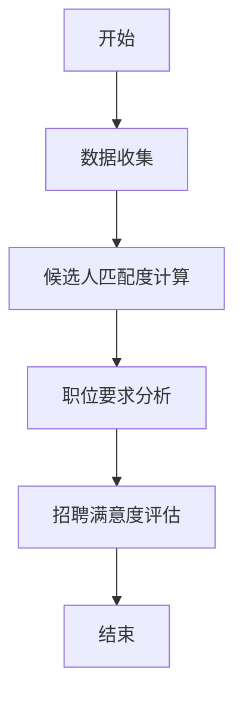
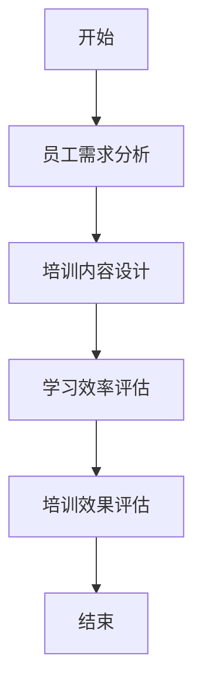
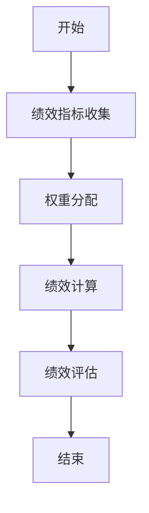
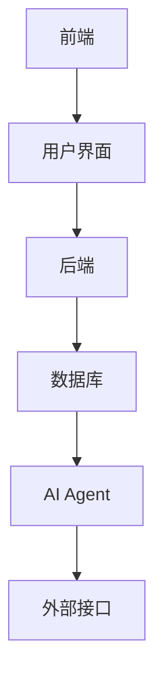

                 


## # AI Agent在企业人力资源管理中的全面应用

关键词：AI Agent、人力资源管理、招聘、培训、绩效管理、算法

摘要：本文旨在探讨AI Agent在企业人力资源管理中的全面应用，分析其在招聘、员工培训与发展以及绩效管理等方面的重要作用。通过详细的案例分析和算法讲解，本文揭示了AI Agent为企业带来的效率提升和决策优化。文章将分五个部分进行阐述，首先介绍问题背景和AI Agent的基本概念，然后深入探讨AI Agent在人力资源管理中的应用，接着讲解相关算法原理，最后提供系统分析与架构设计，以及实战案例分享。

### 第一部分：背景介绍

#### 第1章：问题背景

**1.1 问题提出**

在当今竞争激烈的市场环境中，企业面临着人力资源管理的诸多挑战。传统的招聘、员工培训和绩效管理方式往往效率低下，难以满足快速变化的市场需求。招聘过程中，企业需要花费大量时间和人力资源来筛选合适的候选人；员工培训与发展过程中，如何确保培训内容的适用性和有效性成为难题；绩效管理中，如何公平、公正地评估员工表现也是一个挑战。

**1.2 人力资源管理现状分析**

当前，人力资源管理面临着几个主要问题：

- **招聘效率低**：传统的招聘流程繁琐，耗时较长，且容易出现漏聘或误聘现象。
- **培训效果不佳**：培训内容与员工实际需求不匹配，导致培训效果不理想。
- **绩效管理不科学**：绩效评估方法单一，无法全面、客观地反映员工的工作表现。

**1.3 AI Agent在人力资源管理中的应用前景**

AI Agent作为一种智能化的解决方案，具有高效、精准、自适应等优势，能够显著提升人力资源管理的效率和效果。通过AI Agent，企业可以实现：

- **智能招聘**：利用AI算法筛选候选人，提高招聘效率。
- **个性化培训**：根据员工需求和学习情况，提供个性化的培训方案。
- **科学绩效管理**：通过数据分析，实现绩效评估的客观性和公正性。

### 第二部分：核心概念与联系

#### 第2章：核心概念

**2.1 AI Agent的定义**

AI Agent是一种能够自主执行任务、与环境交互的智能系统。它基于机器学习和深度学习算法，能够通过大量数据训练，实现自我学习和优化。

**2.2 AI Agent的特点**

- **自主性**：AI Agent能够自主执行任务，不需要人工干预。
- **智能性**：通过算法模型，AI Agent能够进行复杂的数据分析和决策。
- **高效性**：AI Agent能够快速处理大量数据，提高工作效率。

**2.3 AI Agent与人力资源管理的联系**

AI Agent在人力资源管理中的应用，主要是通过以下几个环节实现：

- **招聘**：利用AI算法筛选和评估候选人。
- **培训**：根据员工需求和培训效果，提供个性化的培训方案。
- **绩效管理**：通过数据分析，实现绩效评估的科学化和精细化。

### 第三部分：算法原理讲解

#### 第3章：算法原理与数学模型

**3.1 招聘算法原理**

**数学模型：**

$$
招聘满意度 = f(候选人匹配度, 职位要求)
$$

**算法流程图：**



**算法流程说明：**

1. 数据收集：从招聘渠道收集候选人数据。
2. 候选人匹配度计算：利用机器学习算法计算候选人匹配度。
3. 职位要求分析：分析职位要求，确定关键指标。
4. 招聘满意度评估：根据匹配度和职位要求，评估招聘满意度。

**案例举例：**

假设有10名候选人申请一个软件开发职位，根据他们的技能、经验和面试表现，使用机器学习算法计算匹配度。最终，系统会根据匹配度评估，选择最合适的候选人。

**3.2 培训算法原理**

**数学模型：**

$$
培训效果 = f(学习效率, 培训内容匹配度)
$$

**算法流程图：**



**算法流程说明：**

1. 员工需求分析：了解员工的学习需求和培训目标。
2. 培训内容设计：根据需求设计培训内容。
3. 学习效率评估：通过测试和评估，了解员工的学习效率。
4. 培训效果评估：根据学习效率，评估培训效果。

**案例举例：**

某公司对新入职的软件开发员工进行编程技能培训。通过测试，了解员工的学习效率，然后根据效率设计培训内容，最后评估培训效果。

**3.3 绩效管理算法原理**

**数学模型：**

$$
绩效评价 = f(工作绩效指标, 权重分配)
$$

**算法流程图：**



**算法流程说明：**

1. 绩效指标收集：收集员工的工作绩效数据。
2. 权重分配：根据不同指标的重要性，分配权重。
3. 绩效计算：利用数学模型计算绩效评价。
4. 绩效评估：根据绩效评价，进行绩效管理决策。

**案例举例：**

某公司根据员工的工作绩效数据，分配权重，计算绩效评价。根据评价结果，进行绩效奖金分配和晋升决策。

### 第四部分：系统分析与架构设计

#### 第4章：系统功能设计

**4.1 问题场景介绍**

企业面临人力资源管理的问题，如招聘效率低、培训效果不佳和绩效管理不科学等。为了解决这些问题，企业需要一套智能化的HR管理系统。

**4.2 系统功能需求分析**

系统需要具备以下功能：

- **智能招聘**：自动筛选和评估候选人。
- **个性化培训**：根据员工需求提供个性化培训方案。
- **科学绩效管理**：实现绩效评估的科学化和精细化。

**4.3 领域模型设计**

**类图：**

```mermaid
classDiagram
ClassDomain <<class>> Domain
Class Employee
Class Candidate
Class Training
Class Performance
Domain --|> Employee
Domain --|> Candidate
Domain --|> Training
Domain --|> Performance
```

**类图说明：**

- `Domain`：领域模型类。
- `Employee`：员工类，包含员工的基本信息和绩效数据。
- `Candidate`：候选人类，包含候选人信息和评估数据。
- `Training`：培训类，包含培训内容和效果数据。
- `Performance`：绩效类，包含绩效指标和评估数据。

#### 第5章：系统架构设计

**5.1 系统架构概述**

系统采用B/S架构，分为前端和后端两部分。前端负责展示数据和用户交互，后端负责数据处理和算法计算。

**5.2 系统架构设计**

**架构图：**



**架构图说明：**

- `前端`：用户界面，负责展示招聘、培训和绩效管理界面。
- `用户界面`：与后端进行数据交互，实现用户操作。
- `后端`：数据处理和算法计算，负责实现招聘、培训和绩效管理的核心功能。
- `数据库`：存储员工、候选人和其他相关数据。
- `AI Agent`：实现智能招聘、培训评估和绩效评估等功能。
- `外部接口`：与其他系统进行数据交换。

**5.3 系统接口设计**

系统需要设计以下接口：

- **招聘接口**：接收候选人信息，返回招聘结果。
- **培训接口**：接收培训需求和效果数据，返回培训评估结果。
- **绩效接口**：接收绩效指标数据，返回绩效评估结果。

**5.4 系统交互设计**

**序列图：**

```mermaid
sequenceDiagram
参与者 前端
参与者 后端
参与者 数据库
参与者 AI Agent

前端->>后端: 招聘请求
后端->>AI Agent: 候选人匹配度计算
AI Agent->>后端: 招聘结果
后端->>前端: 显示招聘结果

前端->>后端: 培训请求
后端->>AI Agent: 培训效果评估
AI Agent->>后端: 培训评估结果
后端->>前端: 显示培训结果

前端->>后端: 绩效请求
后端->>AI Agent: 绩效评估
AI Agent->>后端: 绩效评估结果
后端->>前端: 显示绩效结果
```

### 第五部分：项目实战

#### 第6章：环境安装

**6.1 环境要求**

安装AI Agent系统需要以下环境：

- 操作系统：Linux或Windows
- Python版本：3.8及以上
- 数据库：MySQL或MongoDB
- AI框架：TensorFlow或PyTorch

**6.2 安装步骤**

1. 安装操作系统和Python环境。
2. 安装数据库软件。
3. 安装AI框架和相关依赖库。

**6.3 遇到的问题及解决方案**

1. **数据库连接失败**：检查数据库配置文件，确保IP、端口和用户名密码正确。
2. **依赖库安装失败**：使用`pip install`命令安装相关依赖库。

#### 第7章：系统核心实现

**7.1 源代码解读**

系统核心代码包括招聘、培训和绩效管理模块。以下为招聘模块的源代码示例：

```python
# 招聘模块源代码

def candidate_matching(candidates, job Requirements):
    # 计算候选人匹配度
    match_scores = []
    for candidate in candidates:
        match_score = calculate_match_score(candidate, job Requirements)
        match_scores.append(match_score)
    return match_scores

def calculate_match_score(candidate, job Requirements):
    # 计算匹配度分数
    score = 0
    for requirement in job Requirements:
        if requirement in candidate.skills:
            score += 1
        if requirement in candidate.experience:
            score += 0.5
    return score
```

**代码应用解读与分析**

以上代码实现了一个简单的招聘匹配度计算功能。`candidate_matching`函数接收候选人和职位要求，返回匹配度分数。`calculate_match_score`函数计算单个候选人的匹配度分数。

**实际案例分析和详细讲解剖析**

以下为招聘案例分析：

1. **案例背景**：某公司招聘一名软件开发工程师，职位要求为熟悉Java和Python，有两年以上开发经验。
2. **数据准备**：候选人有10名，包括姓名、技能和经验等信息。
3. **算法应用**：使用`candidate_matching`函数和`calculate_match_score`函数，计算候选人的匹配度分数。
4. **结果分析**：根据匹配度分数，选择最合适的候选人。

**项目小结**

通过以上案例，我们可以看到AI Agent在招聘中的应用。AI Agent通过算法计算，能够快速、准确地筛选出合适的候选人，提高招聘效率。此外，AI Agent还可以根据不同职位要求，提供个性化的招聘策略，为企业节省大量时间和人力资源。

### 最佳实践 Tips

1. **数据质量**：确保招聘、培训和绩效管理数据的质量，为AI Agent提供准确的数据输入。
2. **持续优化**：根据反馈，持续优化AI Agent的算法和模型，提高其性能和准确性。
3. **员工参与**：鼓励员工参与培训和学习，提高他们的技能和绩效。

### 小结

本文详细探讨了AI Agent在企业人力资源管理中的应用，分析了其在招聘、员工培训与发展以及绩效管理等方面的重要作用。通过算法原理讲解和实际案例剖析，本文揭示了AI Agent为企业带来的效率提升和决策优化。未来，随着AI技术的不断发展，AI Agent在人力资源管理中的应用将会更加广泛和深入。

### 注意事项

1. **数据隐私**：在应用AI Agent时，要确保员工数据的安全和隐私。
2. **算法透明性**：确保算法的透明性和可解释性，方便企业和员工理解算法决策过程。

### 拓展阅读

1. 《人工智能：一种现代的方法》（Michael I. Jordan著）
2. 《深度学习》（Ian Goodfellow等著）
3. 《人工智能简史》（Edwin Abbott著）

### 作者信息

作者：AI天才研究院/AI Genius Institute & 禅与计算机程序设计艺术 /Zen And The Art of Computer Programming

