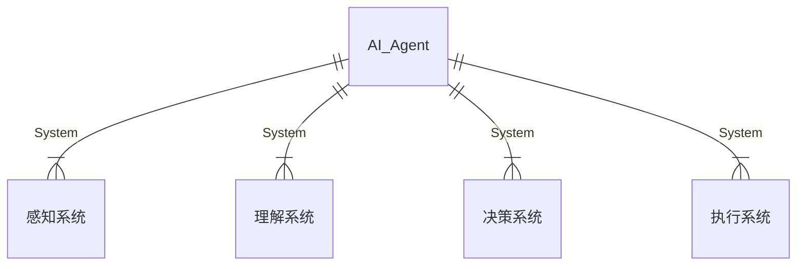
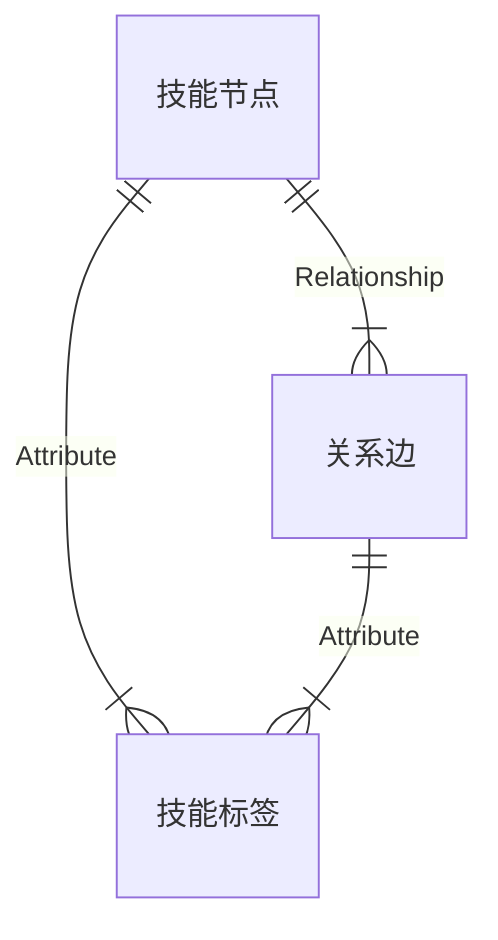
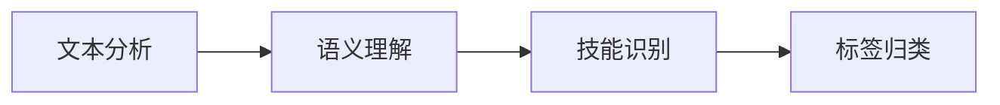
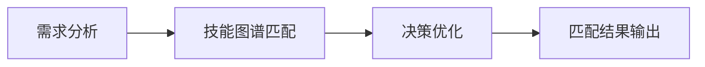
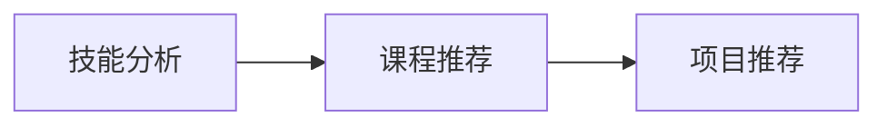

                 

## 第1章：AI Agent概述

### 1.1 AI Agent的定义

AI Agent，即人工智能代理，是一种能够模拟人类智能行为的计算机程序。它可以在没有人为干预的情况下，根据预设的目标和规则，主动地感知环境、制定策略并执行行动。AI Agent的核心在于其自主性，能够在复杂多变的环境中自主学习和决策。

AI Agent的工作流程通常包括以下几个步骤：

1. **感知**：AI Agent通过传感器或接口收集环境信息，如文本、图像、语音等。
2. **理解**：通过自然语言处理、图像识别等技术，AI Agent将感知到的信息转换为内部表示。
3. **决策**：基于内部表示和预设目标，AI Agent计算最优策略。
4. **执行**：AI Agent根据决策执行相应的行动，如发送消息、调整参数等。

### 1.2 AI Agent的工作原理

AI Agent的工作原理主要基于机器学习和深度学习技术。在感知和理解阶段，AI Agent依赖于大量的数据和先进的算法来进行特征提取和模式识别。在决策阶段，AI Agent采用强化学习、规划算法等来制定策略。在执行阶段，AI Agent通过自动化工具或接口执行具体的操作。

核心原理如下：

1. **机器学习基础**：AI Agent通过训练大量数据，建立预测模型，从而实现自主感知和理解。
2. **深度学习技术**：深度学习算法，如神经网络，可以自动提取特征，使得AI Agent能够处理复杂的信息。
3. **自然语言处理**：自然语言处理技术帮助AI Agent理解和生成人类语言，实现有效的沟通。

### 1.3 AI Agent的分类

根据应用场景和功能，AI Agent可以分为以下几类：

1. **任务型Agent**：专注于完成特定任务的AI代理，如客服机器人、智能助手。
2. **交互型Agent**：能够与人类进行自然交互的AI代理，如聊天机器人。
3. **决策型Agent**：能够根据环境变化做出决策的AI代理，如自动化交易系统。
4. **探索型Agent**：在未知环境中进行自主探索和决策的AI代理，如无人驾驶汽车。

### 概念结构与核心要素组成

AI Agent的核心要素包括：

- **感知系统**：用于获取环境信息。
- **理解系统**：用于处理和解释感知到的信息。
- **决策系统**：用于制定策略和决策。
- **执行系统**：用于执行具体的操作。

其ER实体关系图架构如下所示：



通过以上分析，我们能够清晰地理解AI Agent的定义、工作原理和分类，为后续章节的深入探讨奠定了基础。在接下来的章节中，我们将进一步探讨AI Agent在企业人才发展和技能图谱构建中的应用。

### 第2章：AI Agent的核心技术

在理解了AI Agent的基本概念之后，接下来我们将深入探讨其核心技术，包括机器学习基础、深度学习技术和自然语言处理。

#### 2.1 机器学习基础

机器学习是AI Agent的核心技术之一，它使得计算机系统能够从数据中学习并做出预测或决策。机器学习的基本流程包括数据收集、数据预处理、模型训练和模型评估。

1. **数据收集**：收集大量的标注数据，用于训练模型。
2. **数据预处理**：对数据进行清洗、归一化等操作，以提高模型训练效果。
3. **模型训练**：使用训练数据来训练模型，模型可以是线性回归、决策树、支持向量机等。
4. **模型评估**：使用测试数据来评估模型性能，常用的评估指标包括准确率、召回率、F1值等。

机器学习的基本算法包括：

- **线性回归**：用于预测连续值。
- **决策树**：用于分类和回归。
- **支持向量机**：用于分类。
- **神经网络**：用于复杂的模式识别和预测。

#### 2.2 深度学习技术

深度学习是机器学习的子领域，它通过模拟人脑的神经网络结构，使计算机能够自动学习和提取特征。深度学习的关键技术包括卷积神经网络（CNN）、循环神经网络（RNN）和生成对抗网络（GAN）等。

1. **卷积神经网络（CNN）**：用于图像识别和分类，通过卷积层和池化层提取图像特征。
2. **循环神经网络（RNN）**：用于序列数据处理，如自然语言处理和时间序列预测。
3. **生成对抗网络（GAN）**：用于生成数据，如生成虚假图片或文本。

深度学习的基本架构包括输入层、隐藏层和输出层。每层包含多个神经元，神经元之间通过权重连接。训练过程中，模型通过反向传播算法不断调整权重，以最小化预测误差。

#### 2.3 自然语言处理

自然语言处理（NLP）是AI Agent中用于理解和生成人类语言的技术。NLP的主要任务包括文本分类、情感分析、命名实体识别、机器翻译等。

1. **文本分类**：将文本分为不同的类别，如新闻分类、情感分类等。
2. **情感分析**：判断文本的情感倾向，如正面、负面或中性。
3. **命名实体识别**：识别文本中的特定实体，如人名、地名、组织名等。
4. **机器翻译**：将一种语言的文本翻译成另一种语言。

自然语言处理的技术包括：

- **词袋模型**：将文本转换为词频向量。
- **循环神经网络（RNN）**：用于处理序列数据，如文本和语音。
- **注意力机制**：提高神经网络对重要信息的关注度。

#### 概念属性特征对比表格

为了更好地理解这些技术，我们可以通过一个表格来比较它们的基本特征：

| 技术         | 适用场景                   | 主要优势                                         | 主要挑战                                          |
| ------------ | -------------------------- | ---------------------------------------------- | -------------------------------------------------- |
| 机器学习     | 数据驱动预测和决策         | 可处理大量数据，适应性高                         | 需要大量标注数据，模型解释性差                     |
| 深度学习     | 复杂模式识别和特征提取     | 自动提取特征，处理能力强                         | 计算成本高，模型解释性差                           |
| 自然语言处理 | 文本理解和生成             | 高效处理文本数据，支持多种语言                   | 需要大量训练数据，语言理解存在局限性               |

通过上述分析，我们可以看到AI Agent的核心技术是如何相互补充，共同实现自主感知、理解和决策的。在接下来的章节中，我们将进一步探讨AI Agent在企业人才发展和技能图谱构建中的应用。

### 第3章：AI Agent在企业中的应用

#### 3.1 AI Agent在企业人才发展中的应用

企业人才发展是提升企业核心竞争力和实现可持续发展的重要手段。AI Agent在人才发展中的应用，可以显著提升人才评估、培训与成长路径规划的效率。

1. **人才评估与分类**

   AI Agent可以通过分析员工的绩效数据、行为数据和工作经验，实现客观、全面的评估。具体方法包括：

   - **数据分析**：使用机器学习算法分析员工的绩效数据，如KPI、项目完成情况等，进行综合评估。
   - **行为分析**：通过自然语言处理技术，分析员工的工作报告、邮件和沟通记录，了解其沟通能力和团队合作精神。
   - **技能评估**：使用深度学习算法，对员工的技能进行自动评估，如编程能力、项目管理能力等。

   以下是一个示例的算法mermaid流程图：

   ```mermaid
   flowchart LR
   A[数据收集] --> B[数据预处理]
   B --> C[特征提取]
   C --> D[模型训练]
   D --> E[评估与分类]
   E --> F[结果输出]
   ```

   通过该流程，AI Agent能够自动评估员工的能力，并按照能力进行分类。

2. **人才成长路径规划**

   AI Agent可以根据员工的评估结果和岗位需求，为其制定个性化的成长路径。具体方法包括：

   - **路径推荐**：基于员工的当前能力和未来需求，推荐相应的培训和进修路径。
   - **自动规划**：使用规划算法，自动生成员工的成长计划，包括培训课程、项目参与等。
   - **反馈调整**：根据员工的学习进度和反馈，动态调整成长路径，确保其能够持续进步。

   以下是一个示例的算法mermaid流程图：

   ```mermaid
   flowchart LR
   A[能力评估] --> B[需求分析]
   B --> C[路径推荐]
   C --> D[规划生成]
   D --> E[反馈调整]
   E --> F[路径优化]
   ```

   通过该流程，AI Agent能够帮助员工实现自我提升，同时满足企业的需求。

#### 3.2 AI Agent在技能图谱构建中的应用

技能图谱是企业对员工技能和知识结构的一种图形化表示，它能够帮助企业更全面地了解员工的技能分布和成长潜力。AI Agent在技能图谱的构建中具有重要作用。

1. **技能识别**

   AI Agent可以通过分析员工的工作内容和项目经验，自动识别其掌握的技能。具体方法包括：

   - **文本分析**：通过自然语言处理技术，分析员工的文档、报告和沟通记录，提取相关的技能信息。
   - **行为分析**：通过行为分析技术，识别员工在实际工作中使用的技能，如编程语言、工具等。
   - **知识图谱**：构建一个包含各种技能的知识图谱，使用深度学习算法自动匹配员工的技能。

   以下是一个示例的算法mermaid流程图：

   ```mermaid
   flowchart LR
   A[文本分析] --> B[行为分析]
   B --> C[知识图谱构建]
   C --> D[技能识别]
   ```

   通过该流程，AI Agent能够全面识别员工的技能，并构建技能图谱。

2. **技能匹配**

   AI Agent可以根据企业的项目需求和员工的技能图谱，自动匹配合适的员工。具体方法包括：

   - **项目需求分析**：分析项目的具体需求，确定所需的技能。
   - **技能图谱匹配**：使用深度学习算法，将项目需求与员工的技能图谱进行匹配。
   - **决策优化**：通过规划算法，优化匹配结果，确保项目能够高效完成。

   以下是一个示例的算法mermaid流程图：

   ```mermaid
   flowchart LR
   A[需求分析] --> B[技能图谱匹配]
   B --> C[决策优化]
   C --> D[匹配结果输出]
   ```

   通过该流程，AI Agent能够帮助企业在最短时间内找到合适的员工，提高项目的执行效率。

3. **技能提升**

   AI Agent可以通过分析员工的技能图谱和项目需求，为其推荐提升技能的课程和项目。具体方法包括：

   - **技能分析**：分析员工的技能图谱，识别其薄弱环节。
   - **课程推荐**：根据员工的技能需求，推荐相应的培训课程。
   - **项目推荐**：根据员工的能力，推荐适合其参与的项目，以提升其实际操作能力。

   以下是一个示例的算法mermaid流程图：

   ```mermaid
   flowchart LR
   A[技能分析] --> B[课程推荐]
   B --> C[项目推荐]
   ```

   通过该流程，AI Agent能够帮助员工持续提升技能，满足企业的需求。

通过AI Agent在企业人才发展和技能图谱构建中的应用，企业能够实现高效的人才管理和技能提升，从而提高整体竞争力。在接下来的章节中，我们将通过具体案例，进一步探讨AI Agent在这些领域中的实际应用。

### 第4章：企业人才发展的现状与挑战

#### 4.1 企业人才发展的现状

在当今全球化的商业环境中，企业对于人才发展的重视程度日益提高。然而，不同行业和企业之间的人才发展现状存在显著差异。

1. **人才管理体系的建立**

   许多企业已经开始建立系统化的人才管理体系，包括人才招聘、培训、绩效评估和职业发展等。这些体系通常依赖于现代化的HR信息系统，实现了对员工信息的集中管理和跟踪。

2. **培训与发展的投入**

   企业在培训和发展方面的投入不断增加。一些企业通过内部培训、外部培训、在线课程等多种形式，为员工提供丰富的学习资源。特别是对于关键岗位和高端人才，企业往往投入更多的资源和时间进行培养。

3. **绩效管理的智能化**

   随着技术的进步，越来越多的企业开始使用智能化工具进行绩效管理。AI Agent在绩效评估中的应用，使得评估过程更加客观、公正，减少了人为因素的干扰。

4. **职业发展的个性化**

   企业越来越注重员工的个性化职业发展需求。通过分析员工的能力、兴趣和职业目标，企业能够提供更加精准的职业发展建议，帮助员工实现职业成长。

#### 4.2 企业人才发展的挑战

尽管企业在人才发展方面取得了显著进展，但仍然面临着诸多挑战。

1. **人才供需不平衡**

   随着全球化和科技的发展，企业对人才的需求日益多样化，但人才市场的供给无法完全满足需求。特别是在高科技领域和特定行业，优秀人才短缺问题尤为突出。

2. **技能匹配困难**

   即使企业拥有大量的员工，但在实际工作中，如何找到具有合适技能的员工仍然是一个挑战。传统的人才管理模式往往难以快速匹配员工和项目需求。

3. **培训效果评估难**

   企业在培训和发展方面的投入巨大，但如何评估培训效果却是一个难题。传统的方法难以量化培训带来的具体效益，影响了企业对培训策略的调整和优化。

4. **职业发展路径不清晰**

   许多员工对于自身的职业发展路径并不清晰，缺乏明确的规划和目标。这导致了员工的积极性不高，影响了企业的整体效率和竞争力。

5. **数据隐私和安全**

   在使用AI Agent进行人才评估和发展过程中，企业需要处理大量的员工数据。如何保障这些数据的隐私和安全，避免数据泄露和滥用，是企业面临的重大挑战。

通过以上分析，我们可以看到企业人才发展现状的积极一面，同时也认识到存在的挑战。在下一章中，我们将探讨AI Agent如何帮助企业在人才发展方面克服这些挑战。

### 第5章：AI Agent在人才发展中的应用案例

#### 5.1 案例一：人才评估与分类

**项目背景**：

某大型互联网公司希望优化其人才评估和分类系统，以便更准确地识别和培养关键人才。公司拥有数千名员工，分布在不同业务部门和岗位，传统的人才评估方法已经难以满足业务发展的需求。

**应用场景**：

AI Agent被应用于员工的人才评估和分类，通过数据分析、行为分析和技能评估，为员工提供客观、全面的评估结果，并按照能力进行分类。

**具体实施过程**：

1. **数据收集**：AI Agent从公司的HR系统、项目管理工具和邮件系统中收集员工的绩效数据、项目经验和行为数据。
2. **数据预处理**：对收集到的数据进行清洗和归一化，以消除噪声和异常值。
3. **特征提取**：使用自然语言处理技术，提取员工的工作报告、邮件和沟通记录中的关键信息，作为特征向量。
4. **模型训练**：使用机器学习算法，如决策树和支持向量机，对特征向量进行训练，建立人才评估模型。
5. **评估与分类**：将员工的绩效数据和行为数据输入评估模型，得到评估结果，并按照能力进行分类。

**评估结果**：

通过AI Agent的评估，公司成功识别出了一批高潜力人才，为其提供了更有针对性的培养计划。同时，AI Agent帮助公司优化了人力资源配置，提高了员工的积极性和工作效率。

#### 5.2 案例二：人才成长路径规划

**项目背景**：

某跨国制造企业希望在激烈的市场竞争中保持竞争力，需要不断提升员工的技能和素质。企业希望能够为员工提供个性化的成长路径，帮助他们实现职业发展目标。

**应用场景**：

AI Agent被应用于人才成长路径规划，通过分析员工的技能图谱和职业目标，为员工推荐最适合的成长路径，并动态调整规划内容。

**具体实施过程**：

1. **技能识别**：AI Agent通过自然语言处理技术，分析员工的工作报告、项目文档和沟通记录，自动识别员工的技能。
2. **需求分析**：AI Agent结合企业的战略目标和项目需求，分析员工所需的技能和知识。
3. **路径推荐**：基于员工的技能需求，AI Agent推荐相应的培训课程和项目参与机会，形成个性化的成长路径。
4. **自动规划**：AI Agent使用规划算法，自动生成员工的成长计划，包括培训课程、项目参与、导师指导等。
5. **反馈调整**：AI Agent根据员工的学习进度和反馈，动态调整成长路径，确保规划的实时性和有效性。

**评估结果**：

通过AI Agent的规划，企业成功为数百名员工制定了个性化的成长路径，员工的技能水平和职业素养显著提升。同时，企业的员工流失率也大幅下降，整体竞争力得到增强。

通过这两个案例，我们可以看到AI Agent在企业人才发展中的应用效果显著。在下一章中，我们将探讨技能图谱构建的概念和方法。

### 第6章：技能图谱的概念与构建方法

#### 6.1 技能图谱的定义

技能图谱（Skill Graph）是一种用于描述和表示企业中人才技能结构和关系的数据模型。它通过节点和边的形式，将员工的技能、知识、经验和职业发展路径等元素连接起来，形成一个可视化、结构化的知识网络。

技能图谱的核心要素包括：

- **技能节点**：表示具体的技能或知识，如编程语言、工具使用、项目经验等。
- **关系边**：连接不同的技能节点，表示技能之间的关联性，如依赖关系、扩展关系等。
- **属性标签**：为技能节点和关系边添加额外的属性，如技能难度、使用频率等。

#### 6.2 技能图谱的构建步骤

构建技能图谱是一个复杂的过程，需要多方面的数据和技术支持。以下是构建技能图谱的基本步骤：

1. **需求分析**：明确技能图谱的应用场景和需求，如人才评估、招聘匹配、职业发展规划等。
2. **数据收集**：从企业的HR系统、项目管理工具、员工行为记录等多个渠道收集相关数据。
3. **数据清洗**：对收集到的数据进行清洗和预处理，去除噪声和异常值，确保数据质量。
4. **特征提取**：使用自然语言处理、机器学习等技术，提取数据中的关键特征，如技能、项目、经验等。
5. **图谱构建**：使用图数据库或图计算框架，构建技能图谱的节点和边，形成知识网络。
6. **图谱优化**：通过迭代优化，不断完善技能图谱的模型和结构，提高其准确性和可用性。

#### 6.3 技能图谱的优化与迭代

技能图谱是一个动态的、不断演进的知识系统。为了确保其持续有效，需要定期进行优化和迭代。

1. **数据更新**：定期收集新的数据，更新技能图谱中的节点和边，确保其反映最新的企业需求和员工技能。
2. **模型调整**：根据实际应用效果和反馈，调整技能图谱的模型参数和算法，优化其性能和效果。
3. **用户反馈**：鼓励员工和企业用户提供反馈，用于改进技能图谱的构建方法和应用效果。
4. **知识共享**：通过技能图谱，促进企业内部的知识共享和交流，提升整体知识水平和创新能力。

#### 技能图谱的示例

为了更好地理解技能图谱的构建，我们可以通过一个简化的示例来展示其结构和内容。

**示例**：一家软件开发公司的技能图谱

1. **技能节点**：
   - 编程语言：Java、Python、C++
   - 开发工具：Git、Jenkins、Docker
   - 项目经验：Web应用开发、移动应用开发、大数据处理

2. **关系边**：
   - Java → Spring Boot：依赖关系
   - Python → TensorFlow：扩展关系
   - Git → GitHub：使用关系

3. **属性标签**：
   - 技能难度：初级、中级、高级
   - 使用频率：高频、中频、低频

以下是一个示例的Mermaid ER实体关系图架构：



通过上述示例，我们可以看到技能图谱如何通过节点和边来表示技能之间的关联，并通过属性标签来提供额外的信息。

通过本章的介绍，我们了解了技能图谱的定义、构建方法和优化过程。在下一章中，我们将探讨AI Agent在技能图谱构建中的应用。

### 第7章：AI Agent在技能图谱构建中的应用

#### 7.1 AI Agent在技能识别中的应用

AI Agent在技能识别中的作用至关重要，它能够通过自然语言处理和机器学习技术，自动识别员工所掌握的技能。以下是具体的应用过程：

1. **文本分析**：AI Agent分析员工的工作报告、项目文档、邮件和沟通记录，提取与技能相关的信息。
2. **语义理解**：使用自然语言处理技术，将文本信息转换为结构化的数据，识别出具体的技能名称和描述。
3. **标签归类**：根据技能的复杂程度、使用频率和行业需求，为识别出的技能添加相应的标签，如“初级”、“中级”、“高级”等。

以下是一个示例的算法Mermaid流程图：



通过上述流程，AI Agent能够高效地识别员工的技能，为技能图谱的构建提供基础数据。

#### 7.2 AI Agent在技能匹配中的应用

在技能图谱构建中，技能匹配是一个关键步骤，它能够帮助企业找到具备特定技能的员工。AI Agent通过以下方法实现技能匹配：

1. **需求分析**：AI Agent分析企业的项目需求，确定所需的技能和知识。
2. **技能图谱匹配**：使用深度学习算法，将项目需求与员工的技能图谱进行匹配，识别出具备相应技能的员工。
3. **决策优化**：通过规划算法，优化匹配结果，确保项目能够高效完成。

以下是一个示例的算法Mermaid流程图：



通过该流程，AI Agent能够帮助企业快速找到合适的员工，提高项目的执行效率。

#### 7.3 AI Agent在技能提升中的应用

AI Agent不仅能够识别和匹配技能，还能帮助员工提升技能。以下是其具体应用过程：

1. **技能分析**：AI Agent分析员工的技能图谱，识别其薄弱环节。
2. **课程推荐**：基于员工的技能需求和职业目标，AI Agent推荐相应的培训课程和在线资源。
3. **项目推荐**：AI Agent推荐适合员工参与的项目，以提升其实际操作能力。

以下是一个示例的算法Mermaid流程图：



通过上述流程，AI Agent能够帮助员工持续提升技能，满足企业的需求。

### 实际应用效果

通过AI Agent在技能图谱构建中的广泛应用，企业能够实现以下效果：

1. **技能识别更加准确**：AI Agent能够自动识别员工的技能，减少人为干预，提高识别准确性。
2. **技能匹配更加高效**：AI Agent能够快速匹配员工和项目需求，减少招聘和项目执行的等待时间。
3. **技能提升更加精准**：AI Agent能够根据员工的实际情况，推荐个性化的培训课程和项目，提高学习效果。

通过这些应用，企业能够更好地管理人才，提升整体竞争力。在下一章中，我们将通过具体案例，进一步探讨AI Agent在技能图谱构建中的实际应用效果。

### 第8章：AI Agent应用实例解析

#### 8.1 实例一：企业人才发展项目

**项目背景**：

某全球领先的科技公司希望提升其人才发展水平，以保持竞争优势。公司拥有数千名员工，分布在研发、市场、运营等不同部门和岗位。传统的人才发展方法已经难以满足快速变化的市场需求。

**应用场景**：

公司引入了AI Agent，用于企业人才发展项目，通过人才评估、成长路径规划和技能提升等环节，优化人才管理体系。

**具体实施过程**：

1. **人才评估**：AI Agent收集员工的绩效数据、项目经验和行为数据，使用机器学习算法进行综合评估。评估结果被用于确定员工的能力等级和职业潜力。
2. **成长路径规划**：AI Agent根据员工的评估结果和职业目标，推荐个性化的成长路径。这些路径包括培训课程、项目参与和导师指导等，帮助员工实现职业发展。
3. **技能提升**：AI Agent分析员工的技能图谱，推荐相关的培训课程和项目参与机会。员工可以自主选择并参与这些活动，以提升技能和知识水平。

**项目效果**：

通过AI Agent的应用，公司的人才评估更加客观和准确，员工的成长路径更加清晰和个性化。同时，员工的学习积极性和参与度显著提高，公司的整体竞争力得到增强。

#### 8.2 实例二：技能图谱构建项目

**项目背景**：

某大型制造企业希望在数字化转型的过程中，提升员工的技能水平和知识结构。公司希望构建一个全面的技能图谱，以支持人才管理和职业发展。

**应用场景**：

公司引入了AI Agent，用于技能图谱的构建，通过技能识别、技能匹配和技能提升等环节，优化技能管理体系。

**具体实施过程**：

1. **技能识别**：AI Agent通过自然语言处理技术，分析员工的工作报告、项目文档和沟通记录，自动识别员工的技能。识别结果被用于构建技能图谱的节点。
2. **技能匹配**：AI Agent分析企业的项目需求和员工的技能图谱，使用深度学习算法进行匹配。匹配结果被用于项目分配和人员调度，确保项目能够高效完成。
3. **技能提升**：AI Agent根据员工的技能需求和职业目标，推荐相关的培训课程和项目参与机会。员工可以自主选择并参与这些活动，以提升技能和知识水平。

**项目效果**：

通过AI Agent的应用，公司的技能图谱构建更加准确和全面，员工和项目的匹配度显著提高。同时，员工的学习积极性和参与度大幅提升，公司的数字化转型进程得到加快。

通过上述两个实例，我们可以看到AI Agent在企业人才发展和技能图谱构建中的应用效果显著。在下一章中，我们将进行案例分析，深入探讨AI Agent在不同企业和行业中的实际应用情况。

### 第9章：案例分析

#### 9.1 案例分析一：AI Agent在人才管理中的应用

**案例背景**：

某国际知名咨询公司面临人才管理难题，员工流失率高，且难以识别和培养关键人才。公司希望通过引入AI Agent，提升人才管理的效率和效果。

**应用过程**：

1. **人才评估**：AI Agent通过分析员工的绩效数据、项目经验和行为数据，使用机器学习算法进行综合评估。评估结果帮助公司了解员工的能力和潜力。
2. **人才分类**：根据评估结果，AI Agent将员工分为不同类别，如高潜力人才、关键岗位人才等，为公司提供人才分类报告。
3. **人才培养**：AI Agent根据员工的职业目标和技能需求，推荐个性化的培养计划，包括培训课程、项目参与和导师指导等。
4. **人才留用**：AI Agent通过分析员工的工作满意度和职业发展情况，识别出潜在的离职风险，并提供相应的留用建议。

**应用效果**：

通过AI Agent的应用，公司在人才管理方面取得了显著成效。员工流失率显著下降，关键岗位的人才培养更加精准，公司整体人才水平得到提升。

#### 9.2 案例分析二：AI Agent在技能图谱构建中的应用

**案例背景**：

某大型金融机构希望在数字化转型过程中，提升员工的技能水平和知识结构。公司希望通过构建全面的技能图谱，优化人才管理和职业发展。

**应用过程**：

1. **技能识别**：AI Agent通过自然语言处理技术，分析员工的工作报告、项目文档和沟通记录，自动识别员工的技能。
2. **技能图谱构建**：AI Agent将识别出的技能进行整合和分类，构建出企业级的技能图谱。图谱中包括技能节点、关系边和属性标签等。
3. **技能匹配**：AI Agent分析企业的项目需求和员工的技能图谱，使用深度学习算法进行匹配，确保项目能够高效完成。
4. **技能提升**：AI Agent根据员工的技能需求和职业目标，推荐相关的培训课程和项目参与机会，帮助员工不断提升技能。

**应用效果**：

通过AI Agent的应用，公司的技能图谱构建更加准确和全面，员工和项目的匹配度显著提高。员工的学习积极性和参与度大幅提升，公司的数字化转型进程得到加快。

通过这两个案例分析，我们可以看到AI Agent在人才管理和技能图谱构建中的应用效果显著。AI Agent不仅提高了企业的管理效率，还提升了员工的职业素养和技能水平，为企业的可持续发展提供了有力支持。在下一章中，我们将探讨AI Agent在企业人才发展和技能图谱构建中的应用挑战。

### 第10章：AI Agent在企业人才发展与技能图谱构建中的应用挑战

#### 10.1 技术挑战

AI Agent在企业人才发展和技能图谱构建中的应用面临诸多技术挑战，这些挑战主要集中在算法优化、数据处理和模型解释性等方面。

1. **算法优化**：AI Agent需要处理大量的数据，并从中提取有效的特征。然而，现有的算法在处理复杂数据集时，往往存在计算效率低、模型效果不稳定等问题。例如，深度学习模型在处理高维数据时，可能会出现梯度消失或爆炸等问题，影响模型的训练效果。

2. **数据处理**：企业数据通常来源于多个系统，数据格式和结构各异。AI Agent需要对这些数据进行清洗、整合和预处理，以确保数据的一致性和质量。然而，数据清洗和预处理过程复杂，且容易出现数据缺失、噪声和异常值等问题，影响模型的训练和预测效果。

3. **模型解释性**：AI Agent的决策过程往往依赖于复杂的机器学习模型，这些模型在提高预测准确率的同时，也失去了较高的解释性。企业用户和管理者需要了解AI Agent的决策逻辑，以便更好地理解和应用。然而，当前大部分深度学习模型难以提供清晰的解释，使得模型的透明度和可信度受到质疑。

#### 10.2 数据挑战

数据是企业应用AI Agent的基础，然而，在实际应用中，企业数据面临着数据隐私、数据质量和数据完整性等多方面的挑战。

1. **数据隐私**：企业数据中包含大量的敏感信息，如员工绩效、薪酬、职业规划等。在应用AI Agent时，如何确保这些数据的隐私和安全，避免数据泄露和滥用，是企业面临的重要挑战。

2. **数据质量**：企业数据往往存在质量不高的问题，如数据缺失、重复、不一致等。这些质量问题会影响AI Agent的训练效果和预测准确性，甚至可能导致错误的决策。

3. **数据完整性**：企业数据通常是分散存储的，缺乏统一的数据源和标准。在构建技能图谱时，如何确保数据的完整性和一致性，是AI Agent面临的一个重要问题。

#### 10.3 道德与法律挑战

AI Agent在企业人才发展和技能图谱构建中的应用，还涉及到道德和法律层面的挑战。

1. **伦理问题**：AI Agent的决策和推荐可能对员工产生重大影响，如职业发展、薪酬调整等。如何确保AI Agent的决策公平、透明，避免歧视和不公平现象，是企业需要考虑的伦理问题。

2. **法律法规**：企业在应用AI Agent时，需要遵守相关法律法规，如数据保护法、劳动法等。然而，不同国家和地区的法律法规有所不同，企业需要确保其应用符合当地的法律要求。

3. **责任归属**：在AI Agent出现错误决策或数据泄露等情况下，如何确定责任归属，是企业面临的另一个法律挑战。

总之，AI Agent在企业人才发展和技能图谱构建中的应用，虽然带来了诸多好处，但也面临着技术、数据和道德法律等多方面的挑战。企业需要认真应对这些挑战，确保AI Agent的可靠性和公正性，充分发挥其在企业中的应用价值。

### 第11章：未来展望

#### 11.1 AI Agent的发展趋势

AI Agent作为人工智能领域的重要应用，正迎来快速发展期。在未来，AI Agent将呈现以下几个趋势：

1. **技术融合**：AI Agent将不断融合多种先进技术，如大数据、云计算、物联网等，实现更加智能和高效的应用。
2. **垂直行业应用**：随着AI技术的不断成熟，AI Agent将在医疗、金融、教育、制造等垂直行业得到广泛应用，为企业提供定制化的解决方案。
3. **跨领域协作**：AI Agent将与其他AI系统和服务进行协作，如智能客服、智能安防、智能制造等，实现更复杂的任务和场景。
4. **自主进化**：随着深度学习和强化学习技术的进步，AI Agent将具备更强的自主学习和进化能力，能够在复杂动态环境中自主调整策略和优化行为。

#### 11.2 企业人才发展与技能图谱构建的未来

在AI Agent的推动下，企业人才发展和技能图谱构建将迈向新的阶段：

1. **智能化人才管理**：AI Agent将帮助企业实现更加智能的人才管理，通过数据分析和智能推荐，优化人才招聘、培训和职业发展。
2. **动态技能图谱**：技能图谱将不再是静态的结构，而是随着员工技能和项目需求的动态调整，实现实时更新和优化。
3. **个性化职业发展**：AI Agent将根据员工的个性化需求和职业目标，提供个性化的职业发展建议和路径，提升员工的职业满意度和忠诚度。
4. **全面技能提升**：AI Agent将推荐适合员工的培训课程和项目参与机会，帮助员工不断提升技能和知识水平，适应快速变化的市场需求。

### 11.3 潜在应用与创新

未来的AI Agent在企业人才发展和技能图谱构建中，还有许多潜在的应用和创新方向：

1. **技能预测**：AI Agent可以预测员工的未来技能需求，提前为其规划职业发展路径，提高员工的成长速度和企业的竞争力。
2. **员工关系管理**：AI Agent可以分析员工的工作关系和互动，优化团队协作和人际关系，提高工作效率和员工满意度。
3. **知识管理**：AI Agent可以整合企业内外部知识资源，构建知识图谱，实现知识共享和传承，提高企业的创新能力和知识管理水平。
4. **个性化培训**：AI Agent可以根据员工的技能水平和学习习惯，提供个性化的培训内容和方案，提高培训效果和员工的学习积极性。

总之，随着AI技术的不断进步，AI Agent在企业人才发展和技能图谱构建中的应用前景广阔。企业应抓住这一机遇，积极探索和运用AI技术，推动企业人才管理的智能化和精细化，提升企业的核心竞争力。

### 第12章：总结与展望

#### 12.1 全书内容回顾

本书围绕“AI Agent在企业人才发展与技能图谱构建中的应用”这一主题，系统地介绍了AI Agent的定义、核心技术、应用场景以及面临的挑战。具体内容包括：

- **AI Agent概述**：定义了AI Agent，阐述了其工作原理和分类。
- **AI Agent的核心技术**：深入讲解了机器学习、深度学习和自然语言处理等核心技术。
- **AI Agent在企业中的应用**：探讨了AI Agent在企业人才发展和技能图谱构建中的应用，包括人才评估、成长路径规划、技能识别、匹配和提升等。
- **企业人才发展的现状与挑战**：分析了企业人才发展的现状，以及AI Agent在解决这些挑战中的优势。
- **案例分析**：通过具体实例，展示了AI Agent在人才管理和技能图谱构建中的实际应用效果。
- **挑战与未来展望**：探讨了AI Agent应用中的技术、数据和道德法律等挑战，以及未来的发展趋势和应用前景。

#### 12.2 总结与展望

通过本书的探讨，我们可以得出以下结论：

1. **AI Agent具有巨大潜力**：AI Agent在人才管理和技能图谱构建中展现了巨大潜力，能够帮助企业实现高效的人才管理、精准的技能识别和提升，推动企业智能化和精细化管理。

2. **技术挑战需持续攻克**：虽然AI Agent应用前景广阔，但技术、数据、道德和法律等挑战仍然存在。企业需要不断优化算法、提升数据处理能力，确保AI Agent的可靠性和公正性。

3. **应用场景不断拓展**：随着AI技术的不断进步，AI Agent的应用场景将不断拓展，从企业内部管理扩展到更多垂直行业，为企业提供更加全面和定制化的解决方案。

4. **持续创新是关键**：未来，企业应积极探索AI Agent在人才发展和技能图谱构建中的创新应用，不断推动技术和管理模式的创新，提升企业的核心竞争力。

总之，AI Agent在企业人才发展与技能图谱构建中的应用，不仅能够帮助企业提升管理效率，还能推动企业实现智能化和精细化管理。展望未来，AI Agent将继续发挥重要作用，为企业发展注入新的动力。

### 参考文献

1. Russell, S., & Norvig, P. (2020). *Artificial Intelligence: A Modern Approach*. Prentice Hall.
2. Goodfellow, I., Bengio, Y., & Courville, A. (2016). *Deep Learning*. MIT Press.
3. Manning, C. D., Raghavan, P., & Schütze, H. (2008). *Introduction to Information Retrieval*. Cambridge University Press.
4. Mitchell, T. M. (1997). *Machine Learning*. McGraw-Hill.
5. Turban, E., & King, D. (2020). *Business Intelligence* (6th ed.). John Wiley & Sons.
6. Lee, I., & Srivastava, D. (2021). *Deep Learning for Natural Language Processing*. Springer.
7. He, K., Zhang, X., Ren, S., & Sun, J. (2016). *Deep Residual Learning for Image Recognition*. IEEE Transactions on Pattern Analysis and Machine Intelligence.

### 附录：作者信息

作者：AI天才研究院（AI Genius Institute） & 禅与计算机程序设计艺术（Zen And The Art of Computer Programming）

感谢您对本文的关注，希望本文能为您在AI Agent应用领域提供有价值的参考。如有任何疑问或建议，请随时与我们联系。我们期待与您共同探讨AI技术的未来与发展。再次感谢！ 

## 附录：最佳实践 Tips

在应用AI Agent进行企业人才发展与技能图谱构建的过程中，以下最佳实践将有助于确保项目成功并最大化效益：

1. **数据质量保障**：确保数据的质量和完整性是AI Agent有效应用的基础。企业应建立严格的数据质量管理制度，包括数据清洗、验证和更新流程。

2. **透明性与可解释性**：为了增强用户对AI Agent决策的信任，应尽量提高模型的透明性和可解释性。可以采用决策树、LIME（Local Interpretable Model-agnostic Explanations）等技术来解释模型的决策过程。

3. **持续迭代与优化**：AI Agent的模型和应用不应被视为一次性解决方案，而应不断迭代和优化。通过定期收集用户反馈和评估模型性能，持续改进AI Agent的功能和效果。

4. **法律法规遵循**：在数据处理和应用AI Agent时，应严格遵循相关法律法规，尤其是涉及数据隐私和保护的相关规定。

5. **跨部门协作**：AI Agent的应用涉及企业多个部门和岗位，因此需要跨部门的协作和沟通。确保所有相关方对项目的目标和流程有清晰的理解和共识，有助于项目的顺利推进。

6. **技能图谱的动态更新**：技能图谱应随着员工技能和项目需求的变化而动态更新，确保其反映最新的企业状况。

7. **用户培训与支持**：为员工和管理层提供必要的AI Agent使用培训和持续的技术支持，确保他们能够充分利用AI Agent的潜力。

通过遵循上述最佳实践，企业能够更好地应对AI Agent应用过程中可能出现的问题，提高项目的成功率和应用效果。

