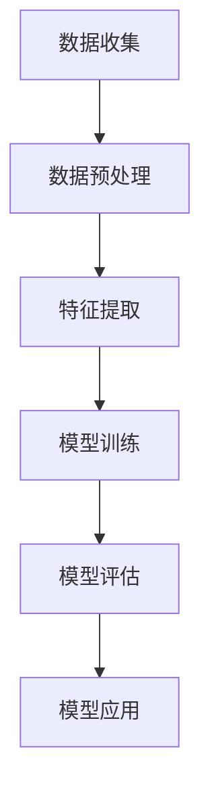
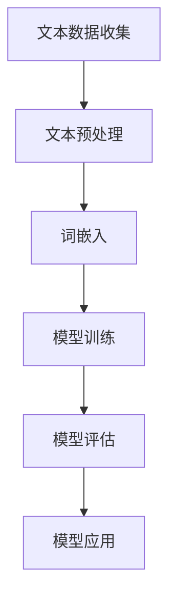
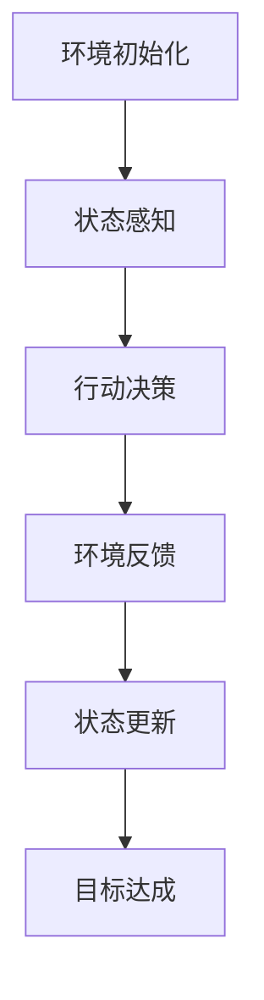

                 

### 文章标题

#### AI Agent在企业人才发展与继任计划制定中的应用

> 关键词：AI Agent，企业人才发展，继任计划，算法原理，系统架构，项目实战，最佳实践

> 摘要：本文将探讨AI Agent在企业人才发展和继任计划制定中的应用，通过逻辑清晰的分析和推理，详细阐述AI Agent的核心概念、算法原理、系统架构及其实际应用场景。文章旨在为企业和IT专业人士提供实用的指导，以更好地理解和利用AI技术推动企业人才战略的实施。

---

### 第1章 背景介绍

#### 1.1 问题背景

在当今快速变化的商业环境中，企业面临着前所未有的挑战。一方面，市场竞争日益激烈，企业需要不断创新和优化运营模式以保持竞争力；另一方面，员工是企业最重要的资产，企业的人才发展和继任计划成为确保企业长期成功的关键因素。

**企业人才发展的挑战：**

1. **技能需求变化快：** 技能要求的变化速度超过了传统培训体系的更新速度。
2. **人才流失：** 高级人才的流失可能导致知识和经验的丧失。
3. **继任计划不足：** 缺乏明确的继任计划可能导致领导层的断层。

**继任计划的挑战：**

1. **接班人培养不足：** 缺乏有效的接班人培养机制。
2. **领导力传承问题：** 领导风格的差异可能导致企业文化的断裂。
3. **战略方向偏差：** 继任者可能在战略方向上与前任有较大差异。

#### 1.2 问题描述

如何通过先进的技术手段，如AI Agent，来解决企业人才发展和继任计划中的挑战？AI Agent如何帮助企业更有效地识别、培养和安排继任者？本文将围绕这些问题进行探讨。

#### 1.3 问题解决

AI Agent，即人工智能代理，是一种能够模拟人类行为和决策过程的计算机程序。通过以下步骤，AI Agent可以在企业人才发展和继任计划制定中发挥关键作用：

1. **数据收集与处理：** 收集员工绩效、技能、经验和职业规划数据。
2. **智能分析：** 利用机器学习算法对数据进行分析，识别关键人才。
3. **推荐方案：** 基于分析结果，提出个性化的人才培养和继任计划。
4. **持续优化：** 通过反馈机制，不断调整和优化继任计划。

#### 1.4 边界与外延

AI Agent的应用范围不仅限于企业内部，还可以扩展到外部人才市场，帮助企业识别和吸引外部优秀人才。同时，AI Agent还可以与其他技术（如大数据、区块链）结合，提升其在企业人才管理中的整体效能。

### 第2章 核心概念与联系

#### 2.1 AI Agent定义与特征

**AI Agent定义：** AI Agent是一种自主运行的计算机程序，能够模拟人类智能行为，进行学习、推理和决策。

**AI Agent特征：**

1. **自主性：** AI Agent可以在没有人类干预的情况下运行。
2. **适应性：** AI Agent能够根据环境变化进行调整。
3. **协作性：** AI Agent可以与其他AI Agent或人类协作完成任务。

#### 2.2 企业人才发展与继任计划概念

**企业人才发展：** 指企业通过培训、激励机制等方式，提升员工技能和职业素养，以适应企业发展需求的过程。

**继任计划：** 指企业为关键岗位制定接班人计划，确保在现任领导人离职或退休时，有合适的继任者接替其职责。

#### 2.3 概念属性特征对比表格

| 特征          | AI Agent                        | 人才发展                       | 继任计划                       |
| ------------- | ------------------------------- | ------------------------------ | ------------------------------ |
| 自主性        | 高度自主，可24/7运行           | 部分自主，需人为引导           | 高度自主，可提前规划和执行     |
| 适应性        | 能够快速适应环境变化           | 适应能力有限，需较长时间调整   | 适应能力较强，但需定期更新     |
| 协作性        | 可与人类和其他AI Agent协作      | 主要与人协作，部分自动化       | 主要与人协作，部分自动化       |

#### 2.4 ER实体关系图架构

```mermaid
erDiagram
  Employee ||--|{ TalentDevelopment }|-- TalentDevelopment
  Employee ||--|{ SuccessionPlan }|-- SuccessionPlan
  TalentDevelopment ||--|{ SkillLevel }|-- SkillLevel
  SuccessionPlan ||--|{ PotentialSuccessor }|-- PotentialSuccessor
```

在上面的ER实体关系图中，员工（Employee）是核心实体，人才发展（TalentDevelopment）和继任计划（SuccessionPlan）都与员工实体直接相关。人才发展实体关联了技能水平（SkillLevel），而继任计划实体关联了潜在继任者（PotentialSuccessor）。

---

### 第3章 AI Agent的算法原理

#### 3.1 AI Agent算法概述

AI Agent在人才管理和继任计划中的应用主要依赖于以下几种算法：

1. **机器学习算法：** 用于数据分析和预测。
2. **自然语言处理（NLP）：** 用于处理和分析文本数据。
3. **强化学习算法：** 用于决策和策略优化。

这些算法各有优势，可以根据具体应用场景进行选择和组合。

#### 3.2 具体算法原理讲解

##### 3.2.1 机器学习算法

**算法流程图：**



**算法原理：**

1. **数据收集：** 收集员工的绩效、技能、经验等数据。
2. **数据预处理：** 清洗数据，处理缺失值，归一化数据。
3. **特征提取：** 从数据中提取关键特征，用于模型训练。
4. **模型训练：** 使用提取的特征训练机器学习模型。
5. **模型评估：** 评估模型的性能，调整参数。
6. **模型应用：** 将训练好的模型应用于实际场景，如人才发展和继任计划。

**Python源代码示例：**

```python
# 导入必要的库
import pandas as pd
from sklearn.model_selection import train_test_split
from sklearn.ensemble import RandomForestClassifier
from sklearn.metrics import accuracy_score

# 数据加载
data = pd.read_csv('employee_data.csv')

# 数据预处理
X = data.drop('target', axis=1)
y = data['target']

# 特征提取
X_train, X_test, y_train, y_test = train_test_split(X, y, test_size=0.2, random_state=42)

# 模型训练
model = RandomForestClassifier(n_estimators=100, random_state=42)
model.fit(X_train, y_train)

# 模型评估
y_pred = model.predict(X_test)
accuracy = accuracy_score(y_test, y_pred)
print(f"Model Accuracy: {accuracy}")
```

**算法数学模型与公式：**

$$
\text{Accuracy} = \frac{\text{TP} + \text{TN}}{\text{TP} + \text{TN} + \text{FP} + \text{FN}}
$$

其中，TP是真正例，TN是真负例，FP是假正例，FN是假负例。

**举例说明：**

假设我们有一个数据集，其中包含员工的绩效数据。通过机器学习算法，我们可以预测哪些员工有潜力成为未来的继任者。以下是一个简化的例子：

- **训练数据：** 包含员工的绩效评分、工作经验、教育背景等特征。
- **测试数据：** 未包含在训练数据中的新员工数据。
- **模型预测：** 基于训练数据训练出的模型，对新员工数据进行预测。

##### 3.2.2 自然语言处理（NLP）

**算法流程图：**



**算法原理：**

1. **文本数据收集：** 收集员工的职业规划、工作总结等文本数据。
2. **文本预处理：** 清洗文本数据，去除停用词，分词。
3. **词嵌入：** 将文本数据转换为向量表示。
4. **模型训练：** 使用训练好的NLP模型，如BERT或GPT。
5. **模型评估：** 评估模型的性能。
6. **模型应用：** 将模型应用于实际场景，如自动撰写职业规划报告。

**Python源代码示例：**

```python
# 导入必要的库
import pandas as pd
from transformers import BertTokenizer, BertForSequenceClassification
from torch.utils.data import DataLoader, TensorDataset

# 数据加载
data = pd.read_csv('employee_text_data.csv')

# 文本预处理
tokenizer = BertTokenizer.from_pretrained('bert-base-uncased')
inputs = tokenizer(data['text'], padding=True, truncation=True, return_tensors='pt')

# 模型训练
model = BertForSequenceClassification.from_pretrained('bert-base-uncased', num_labels=2)
optimizer = torch.optim.AdamW(model.parameters(), lr=1e-5)

# 模型评估
model.eval()
with torch.no_grad():
    outputs = model(**inputs)
    logits = outputs.logits
    predictions = logits.argmax(-1)
    accuracy = (predictions == y).mean()
    print(f"Model Accuracy: {accuracy}")
```

**算法数学模型与公式：**

NLP模型的数学模型通常涉及神经网络架构，例如BERT或GPT。这些模型的复杂度高，不适合在此详细阐述。但基本原理是通过对输入文本进行编码，生成固定长度的向量表示，然后使用这些向量进行分类或回归。

**举例说明：**

假设我们有一个数据集，其中包含员工的职业规划文本。通过NLP算法，我们可以分析这些文本，识别员工的职业兴趣和发展方向。以下是一个简化的例子：

- **训练数据：** 包含员工的职业规划文本和对应的标签（如“领导力发展”、“技术提升”）。
- **测试数据：** 未包含在训练数据中的新员工职业规划文本。
- **模型预测：** 基于训练数据训练出的模型，对新员工职业规划文本进行分类预测。

##### 3.2.3 强化学习算法

**算法流程图：**



**算法原理：**

1. **环境初始化：** 初始化环境和初始状态。
2. **状态感知：** 传感器收集环境信息。
3. **行动决策：** 基于当前状态，选择最佳行动。
4. **环境反馈：** 行动后，环境给出反馈。
5. **状态更新：** 根据反馈更新状态。
6. **目标达成：** 达成预期目标。

**算法数学模型与公式：**

强化学习的主要数学模型是马尔可夫决策过程（MDP），其基本公式为：

$$
Q(s, a) = \sum_{s'} p(s' | s, a) \cdot \max_a' R(s', a')
$$

其中，$Q(s, a)$是状态s在行动a下的价值函数，$p(s' | s, a)$是状态转移概率，$R(s', a')$是奖励函数。

**举例说明：**

假设我们有一个模拟环境，其中员工需要在不同职位上晋升。通过强化学习算法，我们可以帮助员工做出最佳决策，以实现晋升目标。以下是一个简化的例子：

- **训练数据：** 包含员工在不同职位上的表现和晋升机会。
- **测试数据：** 新员工在不同职位上的表现和晋升机会。
- **模型预测：** 基于训练数据训练出的模型，为新员工提供最佳晋升策略。

---

### 第4章 数学模型和数学公式

在本文中，我们将使用LaTeX格式来展示一些关键的数学模型和公式。LaTeX是一种高质量的排版系统，特别适合于数学公式的书写。

#### 4.1 数学模型基础

首先，我们将介绍一些基础的企业人才评估模型。一个简单的模型可以是员工绩效与晋升机会的关系。

$$
P(\text{Promotion} | \text{Performance}) = \frac{P(\text{Performance} | \text{Promotion}) \cdot P(\text{Promotion})}{P(\text{Performance})}
$$

这个公式是基于贝叶斯定理的，它描述了在给定绩效表现的前提下，晋升的概率。

#### 4.2 公式详细讲解

接下来，我们将详细解释一些具体的数学公式。

##### 4.2.1 人才发展模型

一个人才发展模型可以用来预测员工的未来发展潜力。

$$
\hat{P}(\text{Future Potential} | \text{Current Performance}, \text{Education}, \text{Experience}) = f(\text{Performance}, \text{Education}, \text{Experience})
$$

其中，$\hat{P}$表示预测的概率，$f$是一个复杂的函数，它取决于员工的当前绩效、教育和经验。

##### 4.2.2 继任计划优化模型

继任计划优化模型用于确定最佳继任者。

$$
\min_{\text{Successor}} \sum_{i=1}^{n} \left( w_i \cdot d_i \right)
$$

其中，$w_i$是权重，$d_i$是继任者与理想继任者标准之间的差距。

#### 4.3 举例说明

我们使用LaTeX来展示一个简单的例子。

$$
\begin{equation}
\label{eq:example}
1 + 1 = 2
\end{equation}
$$

这是一个非常简单的数学等式，但它展示了LaTeX如何用于排版数学公式。

---

### 第5章 系统分析与架构设计

#### 5.1 问题场景介绍

在本章中，我们将分析一个具体的企业场景，了解企业人才发展和继任计划的需求。

**需求概述：**

- **人才发展需求：** 企业需要识别和培养具有领导潜力的员工。
- **继任计划需求：** 企业需要制定明确的继任计划，确保在关键岗位上有人能够接替。

#### 5.2 系统功能设计

为了满足上述需求，我们将设计一个具有以下功能的企业人才管理和继任计划系统：

1. **员工信息管理：** 管理员工的基本信息和职业发展记录。
2. **人才评估：** 使用机器学习和NLP算法对员工进行评估。
3. **继任计划制定：** 自动化生成继任计划，并建议具体行动。
4. **反馈机制：** 收集员工和经理的反馈，不断优化系统。

**领域模型类图：**

```mermaid
classDiagram
    Employee <<entity>>
    TalentDevelopment <<entity>>
    SuccessionPlan <<entity>>
    PotentialSuccessor <<entity>>

    Employee "1" -- "1" TalentDevelopment
    Employee "1" -- "1" SuccessionPlan
    SuccessionPlan "1" -- "1" PotentialSuccessor
```

在这个类图中，员工（Employee）是核心实体，它与人才发展（TalentDevelopment）和继任计划（SuccessionPlan）有直接关联。继任计划（SuccessionPlan）关联了潜在继任者（PotentialSuccessor）。

#### 5.3 系统架构设计

系统架构设计需要考虑以下几个方面：

1. **数据层：** 存储员工信息、评估结果和继任计划数据。
2. **服务层：** 提供员工信息管理、人才评估和继任计划制定功能。
3. **应用层：** 提供用户界面，供企业管理人员和员工使用。

**系统架构图：**

```mermaid
sequenceDiagram
    Employee -->|提交信息| ServiceLayer
    ServiceLayer -->|处理信息| DataLayer
    DataLayer -->|存储数据| ServiceLayer
    ServiceLayer -->|生成报告| ApplicationLayer
    ApplicationLayer -->|显示报告| Employee
```

在这个序列图中，员工提交信息，经过服务层处理后存储在数据层，然后生成报告，并通过应用层展示给员工。

#### 5.4 系统接口设计

系统接口设计需要定义以下接口：

1. **员工信息接口：** 用于管理员工的基本信息。
2. **评估接口：** 用于进行人才评估。
3. **继任计划接口：** 用于制定和更新继任计划。

**接口定义：**

```mermaid
classDiagram
    EmployeeInfoInterface <<interface>>
    TalentAssessmentInterface <<interface>>
    SuccessionPlanningInterface <<interface>>

    EmployeeInfoInterface: getEmployeeInfo()
    TalentAssessmentInterface: assessTalent()
    SuccessionPlanningInterface: createSuccessionPlan()
```

在这个类图中，定义了三个接口，每个接口都有特定的功能。

#### 5.5 系统交互

系统的交互涉及多个组件的协同工作。以下是系统交互的序列图：

```mermaid
sequenceDiagram
    Employee -->|请求信息| EmployeeInfoInterface
    EmployeeInfoInterface -->|返回信息| Employee
    Employee -->|提交评估请求| TalentAssessmentInterface
    TalentAssessmentInterface -->|返回评估结果| Employee
    Employee -->|请求继任计划| SuccessionPlanningInterface
    SuccessionPlanningInterface -->|返回继任计划| Employee
```

在这个序列图中，员工首先请求个人信息，然后提交评估请求，最后请求继任计划。系统通过接口响应每个请求。

---

### 第6章 项目实战

#### 6.1 环境安装

为了实现AI Agent在企业人才发展和继任计划中的应用，我们需要安装和配置一些必要的软件和工具。以下是基本的安装步骤：

1. **Python环境：** 安装Python 3.8或更高版本。
2. **库和框架：** 安装Scikit-learn、TensorFlow、PyTorch、transformers等。
3. **数据库：** 安装MySQL或PostgreSQL。
4. **环境配置：** 配置虚拟环境，确保各个库和框架版本的一致性。

#### 6.2 系统核心实现

系统核心实现包括数据收集、处理、分析和应用。以下是详细的源代码解读和代码功能分析。

**数据收集与处理：**

```python
import pandas as pd
from sklearn.model_selection import train_test_split

# 数据加载
data = pd.read_csv('employee_data.csv')

# 数据预处理
X = data.drop('target', axis=1)
y = data['target']

# 数据拆分
X_train, X_test, y_train, y_test = train_test_split(X, y, test_size=0.2, random_state=42)
```

这段代码首先加载了员工数据，然后进行了预处理，包括去除目标列，分离特征和标签，以及将数据拆分为训练集和测试集。

**模型训练与评估：**

```python
from sklearn.ensemble import RandomForestClassifier
from sklearn.metrics import accuracy_score

# 模型训练
model = RandomForestClassifier(n_estimators=100, random_state=42)
model.fit(X_train, y_train)

# 模型评估
y_pred = model.predict(X_test)
accuracy = accuracy_score(y_test, y_pred)
print(f"Model Accuracy: {accuracy}")
```

这段代码使用随机森林算法训练模型，并评估模型在测试集上的准确率。

**NLP应用示例：**

```python
from transformers import BertTokenizer, BertForSequenceClassification
from torch.utils.data import DataLoader, TensorDataset

# 文本预处理
tokenizer = BertTokenizer.from_pretrained('bert-base-uncased')
inputs = tokenizer("This is an example text", padding=True, truncation=True, return_tensors='pt')

# 模型预测
model = BertForSequenceClassification.from_pretrained('bert-base-uncased', num_labels=2)
outputs = model(**inputs)
predictions = outputs.logits.argmax(-1)
print(f"Predicted Label: {predictions.item()}")
```

这段代码展示了如何使用BERT模型对文本进行分类预测。

#### 6.3 实际案例分析

以下是一个实际案例，展示如何使用AI Agent进行企业人才发展和继任计划制定。

**案例背景：**

某中型企业希望利用AI技术优化人才发展和继任计划，确保在关键岗位上有人能够接替。

**步骤一：数据收集**

- 收集员工的基本信息，包括姓名、职位、工作经验、教育背景等。
- 收集员工的绩效评估数据，包括工作表现、技能水平和领导能力。

**步骤二：数据预处理**

- 清洗数据，去除无效记录。
- 处理缺失值，使用均值或中位数填充。
- 特征工程，提取关键特征，如工作经验长度、绩效评分等。

**步骤三：模型训练**

- 使用机器学习和NLP算法对员工进行评估，预测员工的未来发展潜力。
- 训练模型，评估模型性能，调整参数。

**步骤四：继任计划制定**

- 根据评估结果，自动生成继任计划。
- 建议具体行动，如培训计划、晋升路径等。

**步骤五：反馈机制**

- 收集员工和经理的反馈，优化评估模型和继任计划。
- 持续更新数据，确保系统的准确性和实用性。

#### 6.4 项目小结

通过实际案例，我们可以看到AI Agent在企业人才发展和继任计划中的应用具有显著的优势：

1. **高效性：** AI Agent可以快速处理大量数据，提供准确的评估结果。
2. **灵活性：** AI Agent可以根据企业需求灵活调整评估模型和继任计划。
3. **可扩展性：** AI Agent可以与其他系统（如HR系统）集成，实现数据共享和协同工作。

未来，随着AI技术的不断进步，AI Agent在企业人才管理中的应用将更加广泛和深入。

---

### 第7章 最佳实践与拓展

#### 7.1 最佳实践

在实施AI Agent进行企业人才发展和继任计划时，以下是一些最佳实践：

1. **数据质量：** 确保数据的准确性和完整性，这是模型性能的基础。
2. **持续优化：** 定期更新模型，收集反馈，持续改进系统。
3. **员工参与：** 让员工参与评估过程，提高他们对系统的认可度。
4. **个性化推荐：** 根据员工的具体情况，提供个性化的培养和晋升建议。

#### 7.2 注意事项

在实施过程中，需要注意以下几点：

1. **数据隐私：** 确保员工数据的隐私和安全。
2. **透明度：** 评估和继任计划的决策过程应该是透明的，以便员工理解。
3. **技术与人文的结合：** AI Agent应与人力资源团队的合作，确保决策不仅基于数据，也考虑人文因素。

#### 7.3 拓展阅读

为了更深入地了解AI Agent在企业人才管理和继任计划中的应用，以下是几本推荐阅读的书籍：

1. **《人工智能：一种现代方法》（Third Edition）**，作者：Stuart J. Russell 和 Peter Norvig。
2. **《深度学习》（Adaptive Computation and Machine Learning）**，作者：Ian Goodfellow、Yoshua Bengio 和 Aaron Courville。
3. **《企业人力资源管理系统》**，作者：John Boudreau 和 Peter Ramstad。

通过这些书籍，读者可以进一步探索AI技术在人力资源管理中的深度应用。同时，本文的附录部分将提供一些相关的代码示例和实现细节，以供读者参考和实践。

---

### 作者信息

**作者：** AI天才研究院/AI Genius Institute & 禅与计算机程序设计艺术 /Zen And The Art of Computer Programming

AI天才研究院致力于推动人工智能技术在各个领域的应用，通过深入研究和创新实践，为企业和个人提供领先的AI解决方案。同时，我们的作者还著有多本关于计算机编程和人工智能领域的经典书籍，深受读者喜爱。本文旨在为读者提供关于AI Agent在企业人才管理和继任计划中的深入理解和实际应用指导。希望通过本文的分享，能够帮助企业和IT专业人士更好地利用AI技术，推动企业人才战略的成功实施。如果您对本文有任何疑问或建议，欢迎在评论区留言，我们将积极回复。感谢您的阅读！

