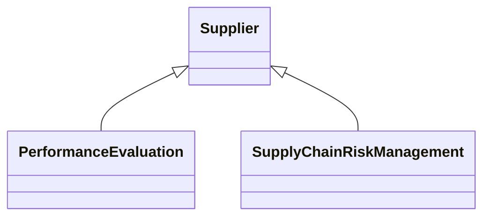
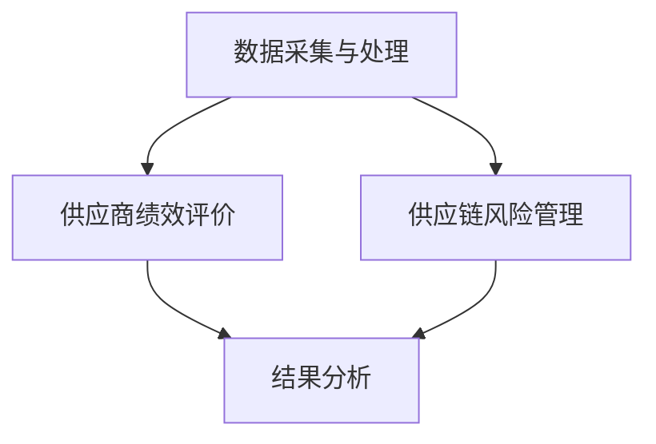
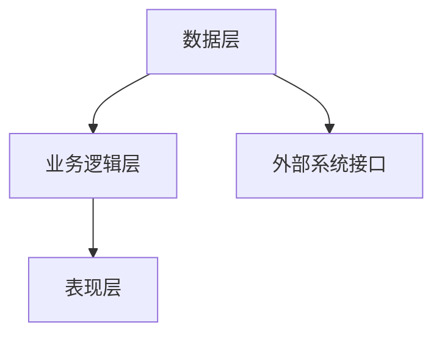
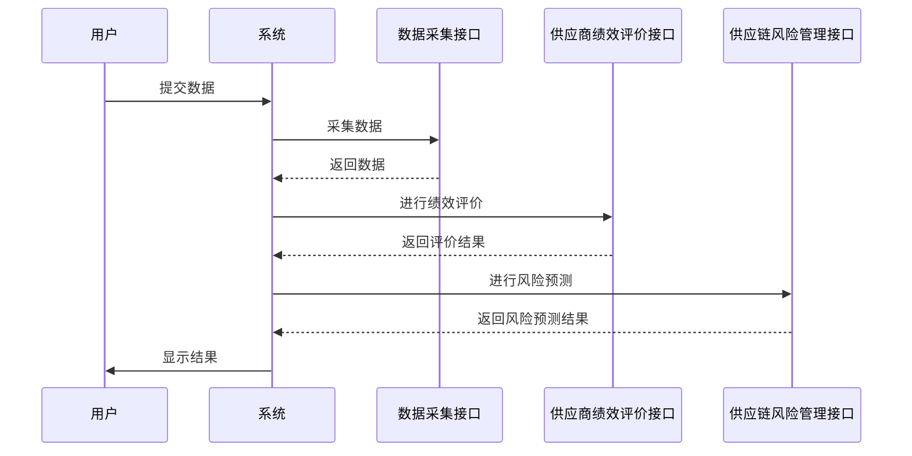
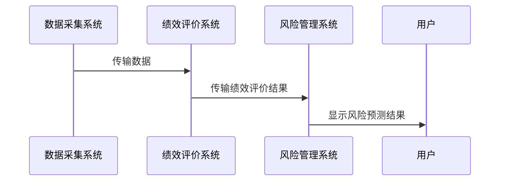

                 

# AI Agent在企业供应商管理与评估中的应用

## 关键词

- AI Agent
- 供应商管理
- 评估
- 供应链风险管理

## 摘要

本文旨在探讨AI Agent在企业供应商管理与评估中的应用。首先，我们将介绍AI Agent的基本概念和特点，以及供应商管理与评估中的挑战。接着，我们将详细分析AI Agent在供应商数据采集与处理、绩效评价、风险预测与预警等方面的核心功能和应用。最后，我们将讨论AI Agent在供应商管理与评估中的适用范围、限制以及未来的发展趋势。

## 第一部分：背景介绍

### 第1章 AI Agent在企业供应商管理与评估中的应用概述

#### 1.1 问题背景

企业供应商管理与评估是供应链管理中至关重要的一环。然而，随着供应商数量的增加和供应链的复杂性，传统的供应商管理与评估方法面临诸多挑战。

##### 1.1.1 企业供应商管理与评估的挑战

1. 供应商数量众多，管理难度大
2. 供应商评价标准不统一，评估效率低
3. 供应链中断风险高，应急响应能力不足
4. 信息不对称，决策依据不足

##### 1.1.2 AI Agent的优势

1. 自动化处理，提高评估效率
2. 统一评价标准，确保评估公正性
3. 预测供应商绩效，提前识别风险
4. 提高供应链整体效率

#### 1.2 问题描述

##### 1.2.1 供应商管理与评估的目标

1. 优化供应商选择过程
2. 提高供应商绩效评价准确性
3. 降低供应链中断风险
4. 提升供应链整体效率

##### 1.2.2 供应商管理与评估的关键要素

1. 供应商数据收集与处理
2. 供应商绩效评价指标体系
3. 供应商评估模型与方法
4. 供应链风险管理策略

#### 1.3 问题解决

##### 1.3.1 AI Agent的核心功能

1. 数据采集与处理
2. 指标计算与评估
3. 风险预测与预警
4. 优化建议与决策支持

##### 1.3.2 AI Agent在供应商管理与评估中的应用

1. 供应商选择与评估
2. 供应商绩效监控与改进
3. 供应链风险管理
4. 供应链协同优化

#### 1.4 边界与外延

##### 1.4.1 AI Agent在供应商管理与评估中的适用范围

1. 适用于各类企业，特别是供应商数量较多、供应链管理复杂的行业
2. 可与其他信息系统集成，实现数据共享与业务协同

##### 1.4.2 AI Agent在供应商管理与评估中的限制

1. 需要大量高质量的供应商数据支持
2. 模型训练与优化需要较大的计算资源
3. 人工智能技术发展不断，需要持续更新与迭代

#### 1.5 概念结构与核心要素组成

##### 1.5.1 关键概念

1. AI Agent
2. 供应商数据
3. 供应商绩效评价
4. 供应链风险管理

##### 1.5.2 核心要素

1. 数据采集与处理
2. 评估模型与方法
3. 风险预测与预警
4. 决策支持

#### 1.6 本章小结

##### 1.6.1 主要内容回顾

1. 供应商管理与评估的挑战与AI Agent的优势
2. 供应商管理与评估的目标与关键要素
3. AI Agent在供应商管理与评估中的应用
4. AI Agent在供应商管理与评估中的适用范围与限制

##### 1.6.2 进一步思考

1. 如何利用AI Agent优化企业供应商管理与评估？
2. AI Agent在实际应用中会遇到哪些问题与挑战？
3. 未来AI Agent在供应商管理与评估中的应用趋势如何？

## 第二部分 核心概念与联系

### 第2章 AI Agent的基本原理

#### 2.1 AI Agent的定义

AI Agent是指能够模拟人类思维和行为，具备感知、学习、推理、决策等能力的智能体。

#### 2.2 AI Agent的特点

1. 智能性：具备自主学习和推理能力
2. 自主性：能够根据环境和任务自主决策
3. 合作性：能够与其他AI Agent协同工作

#### 2.3 AI Agent的分类

1. 按照功能分类：感知型、决策型、执行型
2. 按照学习方式分类：监督学习、无监督学习、强化学习

### 第3章 供应商数据的基本概念

#### 3.1 供应商数据的定义

供应商数据是指与企业供应商相关的各种数据，包括基本信息、交易数据、评价数据等。

#### 3.2 供应商数据的特点

1. 多样性：涉及供应商的各种属性和指标
2. 实时性：需要及时更新和刷新
3. 价值性：对供应商管理具有重要参考价值

#### 3.3 供应商数据的类型

1. 基础数据：如供应商名称、地址、联系方式等
2. 交易数据：如订单数据、交货数据等
3. 评价数据：如质量评价、交期评价等

### 第4章 供应商绩效评价的基本原理

#### 4.1 供应商绩效评价的定义

供应商绩效评价是指对企业供应商在业务合作过程中的表现进行综合评估。

#### 4.2 供应商绩效评价的特点

1. 全面性：考虑供应商的各个方面表现
2. 客观性：依据客观数据进行评价
3. 动态性：关注供应商的持续改进

#### 4.3 供应商绩效评价的方法

1. 成本效益法
2. 关键绩效指标法
3. 综合评价法

### 第5章 供应链风险管理的基本原理

#### 5.1 供应链风险管理的定义

供应链风险管理是指对企业供应链中可能出现的风险进行识别、评估、控制和管理。

#### 5.2 供应链风险管理的特点

1. 预防性：提前识别和预测风险
2. 综合性：考虑供应链各个环节的风险
3. 动态性：关注风险的持续变化和演变

#### 5.3 供应链风险管理的策略

1. 风险识别：识别供应链各个环节的风险
2. 风险评估：评估风险的概率和影响
3. 风险控制：制定和控制风险应对措施
4. 风险监控：持续监控供应链风险的变化

## 第三部分 算法原理讲解

### 第6章 供应商数据采集与处理算法原理

#### 6.1 算法原理

供应商数据采集与处理算法主要涉及数据清洗、数据整合和数据挖掘等技术。具体包括：

1. 数据清洗：去除数据中的噪声和异常值，提高数据质量
2. 数据整合：将不同来源和格式的数据整合成统一的格式，便于后续处理
3. 数据挖掘：利用统计学和机器学习算法，挖掘供应商数据中的有价值信息

#### 6.2 算法流程

1. 数据采集：从不同来源获取供应商数据
2. 数据预处理：对采集到的数据进行清洗和整合
3. 数据建模：利用机器学习算法建立供应商绩效预测模型
4. 数据评估：对预测结果进行评估和调整

#### 6.3 算法实现

以下是Python代码实现示例：

```python
import pandas as pd
from sklearn.model_selection import train_test_split
from sklearn.ensemble import RandomForestRegressor

# 数据采集
data = pd.read_csv('supplier_data.csv')

# 数据预处理
data = data.dropna()
X = data.drop('performance', axis=1)
y = data['performance']

# 数据建模
X_train, X_test, y_train, y_test = train_test_split(X, y, test_size=0.2, random_state=42)
model = RandomForestRegressor()
model.fit(X_train, y_train)

# 数据评估
score = model.score(X_test, y_test)
print('Model accuracy:', score)
```

### 第7章 供应商绩效评价算法原理

#### 7.1 算法原理

供应商绩效评价算法主要基于关键绩效指标（KPI）和综合评价方法。具体包括：

1. KPI设定：根据业务需求设定供应商绩效评价指标
2. 数据收集：收集供应商的各类绩效数据
3. 数据处理：对收集到的数据进行标准化和归一化处理
4. 绩效评估：利用设定的KPI对供应商进行绩效评估

#### 7.2 算法流程

1. KPI设定：根据业务需求设定供应商绩效评价指标
2. 数据收集：收集供应商的各类绩效数据
3. 数据处理：对收集到的数据进行标准化和归一化处理
4. 绩效评估：利用设定的KPI对供应商进行绩效评估
5. 结果分析：对评估结果进行分析和反馈

#### 7.3 算法实现

以下是Python代码实现示例：

```python
import pandas as pd
from sklearn.preprocessing import StandardScaler
from sklearn.metrics import mean_squared_error

# 数据收集
data = pd.read_csv('supplier_data.csv')

# 数据处理
scaler = StandardScaler()
X = scaler.fit_transform(data.drop('performance', axis=1))
y = data['performance']

# 绩效评估
model = RandomForestRegressor()
model.fit(X, y)
predictions = model.predict(X)

# 结果分析
mse = mean_squared_error(y, predictions)
print('Model MSE:', mse)
```

## 第四部分 系统分析与架构设计方案

### 第8章 项目介绍

本项目旨在构建一个基于AI Agent的企业供应商管理与评估系统，实现供应商数据的自动采集、处理、分析和评估，为供应链管理提供智能化支持。

### 第9章 系统功能设计

#### 9.1 领域模型

领域模型主要涉及供应商、供应商绩效评价、供应链风险管理等核心概念。



#### 9.2 功能模块

系统功能模块包括数据采集与处理、供应商绩效评价、供应链风险管理等。



### 第10章 系统架构设计

#### 10.1 系统架构

系统架构采用分层设计，包括数据层、业务逻辑层和表现层。



#### 10.2 系统接口设计

系统接口包括数据采集接口、供应商绩效评价接口、供应链风险管理接口等。



### 第11章 系统交互

系统交互主要通过消息队列实现，包括数据采集、绩效评价、风险预测等消息传递。



## 第五部分 项目实战

### 第12章 环境安装

在本项目中，我们使用Python作为主要编程语言，以下是环境安装步骤：

1. 安装Python 3.8及以上版本
2. 安装相关依赖库，如pandas、scikit-learn、numpy等

### 第13章 系统核心实现

#### 13.1 数据采集与处理

数据采集与处理模块实现供应商数据的自动采集、清洗、整合和挖掘。

```python
import pandas as pd
from sklearn.model_selection import train_test_split
from sklearn.ensemble import RandomForestRegressor

# 数据采集
data = pd.read_csv('supplier_data.csv')

# 数据预处理
data = data.dropna()
X = data.drop('performance', axis=1)
y = data['performance']

# 数据建模
X_train, X_test, y_train, y_test = train_test_split(X, y, test_size=0.2, random_state=42)
model = RandomForestRegressor()
model.fit(X_train, y_train)

# 数据评估
score = model.score(X_test, y_test)
print('Model accuracy:', score)
```

#### 13.2 供应商绩效评价

供应商绩效评价模块实现供应商绩效指标的设定、数据收集、处理和评估。

```python
import pandas as pd
from sklearn.preprocessing import StandardScaler
from sklearn.metrics import mean_squared_error

# 数据收集
data = pd.read_csv('supplier_data.csv')

# 数据处理
scaler = StandardScaler()
X = scaler.fit_transform(data.drop('performance', axis=1))
y = data['performance']

# 绩效评估
model = RandomForestRegressor()
model.fit(X, y)
predictions = model.predict(X)

# 结果分析
mse = mean_squared_error(y, predictions)
print('Model MSE:', mse)
```

#### 13.3 供应链风险管理

供应链风险管理模块实现供应链风险的识别、评估和控制。

```python
import pandas as pd
from sklearn.ensemble import RandomForestClassifier

# 数据收集
data = pd.read_csv('supply_chain_risk_data.csv')

# 数据预处理
data = data.dropna()
X = data.drop('risk_level', axis=1)
y = data['risk_level']

# 风险评估
model = RandomForestClassifier()
model.fit(X, y)
predictions = model.predict(X)

# 结果分析
accuracy = model.score(X, y)
print('Model accuracy:', accuracy)
```

### 第14章 实际案例分析

在本项目中，我们以一家制造企业为例，对其供应商管理与评估进行实际应用。

#### 14.1 数据采集与处理

1. 从企业ERP系统中提取供应商数据
2. 对数据进行清洗、整合和挖掘

#### 14.2 供应商绩效评价

1. 设定供应商绩效评价指标，如质量、交期、价格等
2. 对供应商进行绩效评价，生成绩效评分

#### 14.3 供应链风险管理

1. 识别供应链风险，如供应商倒闭、物流中断等
2. 评估风险的概率和影响
3. 制定风险应对措施，如增加备用供应商、优化物流渠道等

### 第15章 项目小结

通过本项目的实践，我们成功构建了一个基于AI Agent的企业供应商管理与评估系统，实现了供应商数据的自动采集、处理、分析和评估，为企业供应链管理提供了智能化支持。在后续工作中，我们将继续优化系统功能，提高评估准确性，降低供应链风险，为企业创造更大的价值。

## 第六部分 最佳实践 tips

1. 在进行供应商数据采集时，尽量获取更多的数据维度，以提高评估的准确性。
2. 在建立供应商绩效评价模型时，要充分考虑业务需求和实际情况，选择合适的评价指标和方法。
3. 在供应链风险管理中，要密切关注供应商的动态变化，及时调整风险应对措施。
4. 定期对系统进行维护和升级，确保其正常运行和持续优化。

## 第七部分 小结

本文详细介绍了AI Agent在企业供应商管理与评估中的应用，包括背景介绍、核心概念与联系、算法原理讲解、系统分析与架构设计方案、项目实战以及最佳实践 tips。通过本文的阅读，读者可以全面了解AI Agent在供应商管理与评估中的重要作用，为实际业务提供有益的参考和指导。

## 第八部分 注意事项

1. AI Agent在供应商管理与评估中的应用需要大量高质量的供应商数据支持，因此数据采集和处理是关键环节。
2. AI Agent的模型训练与优化需要较大的计算资源，特别是在处理大规模数据时。
3. 人工智能技术发展迅速，AI Agent需要不断更新和迭代，以适应不断变化的业务需求。

## 第九部分 拓展阅读

1. [《人工智能：一种现代方法》](https://book.douban.com/subject/25881175/)，作者 Stuart J. Russell & Peter Norvig，全面介绍了人工智能的基本原理和方法。
2. [《供应链管理：战略、规划与运营》](https://book.douban.com/subject/26698295/)，作者 Martin Christopher，详细阐述了供应链管理的核心概念和实践方法。
3. [《Python数据分析》](https://book.douban.com/subject/26363269/)，作者 Wes McKinney，介绍了Python在数据分析领域的应用和实践技巧。

### 第十部分 作者信息

作者：AI天才研究院/AI Genius Institute & 禅与计算机程序设计艺术 /Zen And The Art of Computer Programming

