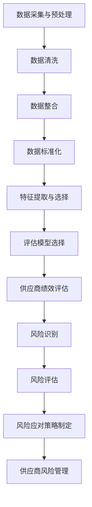
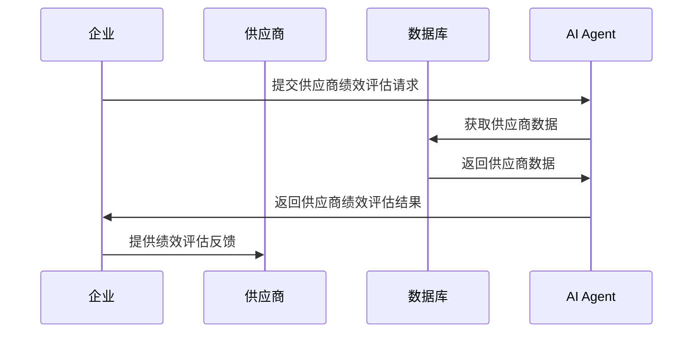
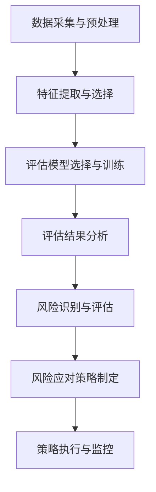
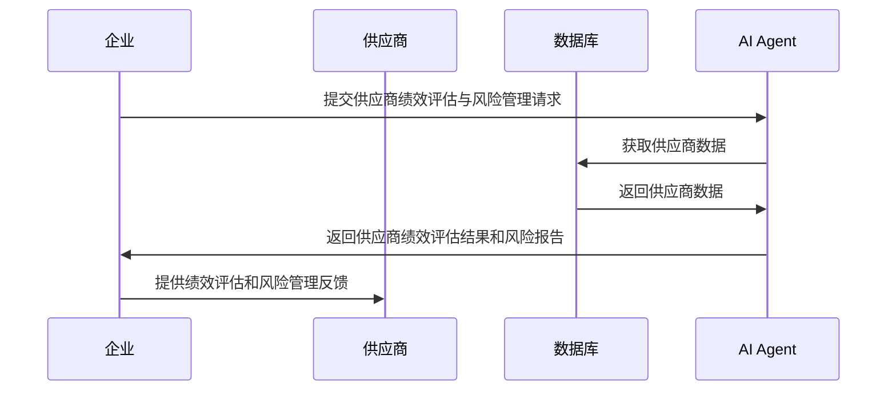

                 

# AI Agent在企业供应商绩效评估与风险管理中的角色

> 关键词：AI Agent，供应商绩效评估，风险管理，数据挖掘，深度学习

> 摘要：本文从企业供应商绩效评估与风险管理的重要性出发，探讨了当前存在的问题。随后，引入了AI Agent这一技术概念，详细分析了其在供应商绩效评估和风险管理中的角色和作用。文章通过数据采集与预处理、特征提取与选择、评估模型选择等核心技术步骤，展示了AI Agent在供应商绩效评估中的实际应用。接着，文章深入探讨了AI Agent在供应商风险管理中的核心技术，包括风险识别、风险评估和风险应对策略。最后，通过案例分析，总结了AI Agent在供应商绩效评估与风险管理中的最佳实践，并对未来进行了展望。

## 第一部分 引言

### 1.1 问题背景

#### 1.1.1 供应商绩效评估与风险管理的重要性

在企业的供应链管理中，供应商绩效评估和风险管理是至关重要的一环。供应商绩效评估不仅有助于企业了解供应商的整体表现，还能为企业提供决策依据，优化供应链管理。而风险管理则关系到企业的生存与发展，通过识别、评估和应对风险，企业能够降低潜在损失，提高运营效率。

#### 1.1.2 企业供应商绩效评估与风险管理存在的问题

当前，企业在供应商绩效评估和风险管理中面临着诸多问题。首先，数据质量参差不齐，难以提供准确的评估结果。其次，评估方法单一，难以全面反映供应商的实际表现。此外，风险评估的及时性和准确性也有待提高，导致企业在应对风险时缺乏有效的策略。

#### 1.1.3 AI Agent的概念与应用前景

AI Agent，即人工智能代理，是一种基于人工智能技术自动执行任务的智能实体。在供应商绩效评估和风险管理中，AI Agent具有巨大的应用前景。首先，AI Agent能够通过数据挖掘和深度学习技术，对海量数据进行高效处理和分析，提供准确的评估结果。其次，AI Agent能够动态调整评估模型和风险应对策略，提高评估和应对的及时性和准确性。

### 1.2 核心概念与联系

#### 1.2.1 供应商绩效评估

**供应商绩效评估的定义**：供应商绩效评估是对供应商在供应链管理中的表现进行综合评价的过程。

**供应商绩效评估的关键指标**：主要包括质量、交货时间、价格、服务等方面。

**供应商绩效评估的常见方法**：包括关键绩效指标（KPI）、平衡计分卡（BSC）、综合绩效评估（CPE）等。

#### 1.2.2 风险管理

**风险管理的定义**：风险管理是识别、评估和应对潜在风险的过程。

**风险管理的过程**：包括风险识别、风险评估、风险应对等步骤。

**风险管理的方法**：包括风险评估矩阵、概率风险分析、蒙特卡罗模拟等。

#### 1.2.3 AI Agent

**AI Agent的定义**：AI Agent是一种基于人工智能技术自动执行任务的智能实体。

**AI Agent的特点**：具有自主学习、自主决策、自主执行等能力。

**AI Agent的分类**：根据应用领域和功能，可分为通用AI Agent和专用AI Agent。

## 第二部分 AI Agent在供应商绩效评估中的应用

### 2.1 AI Agent在供应商绩效评估中的应用概述

#### 2.1.1 AI Agent在供应商绩效评估中的作用

AI Agent在供应商绩效评估中发挥着重要作用。首先，AI Agent能够通过数据挖掘技术，从海量数据中提取有价值的信息，为绩效评估提供数据支持。其次，AI Agent能够利用深度学习技术，构建智能评估模型，提高评估的准确性和及时性。此外，AI Agent还能够根据评估结果，动态调整评估策略，实现评估的持续优化。

#### 2.1.2 AI Agent在供应商绩效评估中的优势

AI Agent在供应商绩效评估中具有明显优势。首先，AI Agent能够处理海量数据，提高评估的覆盖面。其次，AI Agent能够通过学习算法，不断提高评估的准确性。此外，AI Agent能够实现评估的自动化，降低人力成本。最后，AI Agent能够根据评估结果，提供针对性的改进建议，帮助企业优化供应链管理。

#### 2.1.3 AI Agent在供应商绩效评估中的挑战

尽管AI Agent在供应商绩效评估中具有诸多优势，但也面临一些挑战。首先，数据质量是影响评估准确性的关键因素。其次，评估模型的构建和优化需要大量计算资源和时间。此外，AI Agent的自主学习和决策能力仍有待提高，需要不断优化算法和模型。

### 2.2 AI Agent在供应商绩效评估中的核心技术

#### 2.2.1 数据采集与预处理

**数据来源**：供应商绩效评估的数据来源主要包括企业内部数据和外部数据。企业内部数据包括供应商的生产数据、质量数据、交货数据等；外部数据包括市场数据、行业数据、竞争者数据等。

**数据预处理方法**：主要包括数据清洗、数据整合、数据标准化等步骤。数据清洗旨在去除无效数据和错误数据；数据整合旨在将不同来源的数据进行整合，形成统一的数据集；数据标准化旨在消除数据量纲和单位不一致的问题。

**数据质量评估**：数据质量评估是确保数据可靠性和准确性的关键。常用的评估方法包括数据完整性评估、数据一致性评估、数据准确性评估等。

#### 2.2.2 特征提取与选择

**特征提取方法**：特征提取是从原始数据中提取出对评估任务有重要影响的信息。常用的特征提取方法包括统计特征提取、变换特征提取和深度特征提取等。

**特征选择方法**：特征选择是从提取出的特征中选择出对评估任务有重要影响的信息。常用的特征选择方法包括过滤法、包装法和嵌入法等。

**特征重要性评估**：特征重要性评估是评估特征对评估任务的重要性。常用的评估方法包括信息增益、特征重要性分数、相关系数等。

#### 2.2.3 评估模型选择

**传统评估模型**：传统评估模型包括基于规则的方法、分类方法、聚类方法等。

**深度学习评估模型**：深度学习评估模型包括卷积神经网络（CNN）、循环神经网络（RNN）、生成对抗网络（GAN）等。

**常见评估模型比较**：不同评估模型在性能、复杂度、可解释性等方面具有不同特点。企业应根据具体需求和实际情况选择合适的评估模型。

## 2.3 案例分析

### 2.3.1 案例背景

某企业是一家大型制造企业，其供应商主要包括原材料供应商、零部件供应商等。企业希望通过供应商绩效评估，优化供应链管理，提高生产效率和产品质量。

### 2.3.2 案例分析

企业使用AI Agent进行供应商绩效评估，首先采集了供应商的生产数据、质量数据、交货数据等。然后，通过数据预处理，去除无效数据和错误数据，对数据进行了整合和标准化。接下来，使用深度学习技术，提取出了对评估任务有重要影响的特征。最后，构建了基于深度学习的评估模型，对供应商进行了绩效评估。

### 2.3.3 案例结果与讨论

通过AI Agent的供应商绩效评估，企业发现了一些潜在的供应商问题，如某些供应商在生产质量和交货时间上存在较大波动。企业根据评估结果，与供应商进行了沟通，制定了针对性的改进措施。经过一段时间的改进，供应商的绩效得到了显著提升，企业的供应链管理也得到了优化。

## 第三部分 AI Agent在供应商风险管理中的应用

### 3.1 AI Agent在供应商风险管理中的应用概述

#### 3.1.1 AI Agent在供应商风险管理中的作用

AI Agent在供应商风险管理中同样发挥着重要作用。首先，AI Agent能够通过风险识别技术，及时发现潜在的风险。其次，AI Agent能够利用风险评估技术，对风险进行定量和定性分析，为风险应对提供决策依据。此外，AI Agent还能够根据风险评估结果，自动调整风险应对策略，实现风险管理的自动化和智能化。

#### 3.1.2 AI Agent在供应商风险管理中的优势

AI Agent在供应商风险管理中具有明显优势。首先，AI Agent能够处理海量数据，提高风险识别和评估的覆盖面。其次，AI Agent能够通过学习算法，不断提高风险识别和评估的准确性。此外，AI Agent能够实现风险管理的自动化，降低人力成本。最后，AI Agent能够根据风险评估结果，提供针对性的风险应对策略，帮助企业有效应对风险。

#### 3.1.3 AI Agent在供应商风险管理中的挑战

尽管AI Agent在供应商风险管理中具有诸多优势，但也面临一些挑战。首先，数据质量是影响风险识别和评估准确性的关键因素。其次，风险评估模型的构建和优化需要大量计算资源和时间。此外，AI Agent的自主学习和决策能力仍有待提高，需要不断优化算法和模型。

### 3.2 AI Agent在供应商风险管理中的核心技术

#### 3.2.1 风险识别

**风险识别方法**：风险识别是发现潜在风险的过程。常用的风险识别方法包括故障树分析（FTA）、事件树分析（ETA）、故障模式及影响分析（FMEA）等。

**风险特征提取**：风险特征提取是从原始数据中提取出对风险有重要影响的信息。常用的风险特征提取方法包括统计特征提取、变换特征提取和深度特征提取等。

**风险评估模型**：风险评估模型是对风险进行定量和定性分析的工具。常用的风险评估模型包括层次分析法（AHP）、模糊综合评价法（FCE）、贝叶斯网络（BN）等。

#### 3.2.2 风险评估

**风险评估方法**：风险评估是对风险进行定量和定性分析的过程。常用的风险评估方法包括概率风险分析（PRA）、蒙特卡罗模拟（MCS）、敏感性分析（SA）等。

**风险评估指标**：风险评估指标是评估风险的重要依据。常用的风险评估指标包括风险概率、风险损失、风险影响等。

**风险评估结果分析**：风险评估结果分析是对风险评估结果进行解读和利用的过程。通过分析风险评估结果，企业可以了解风险的分布情况，制定相应的风险应对策略。

#### 3.2.3 风险应对策略

**风险应对策略类型**：风险应对策略是根据风险评估结果制定的应对风险的措施。常用的风险应对策略类型包括风险规避、风险降低、风险转移等。

**风险应对策略评估**：风险应对策略评估是对风险应对策略的有效性进行评估的过程。通过评估风险应对策略，企业可以了解策略的适用性和有效性，及时调整和优化策略。

### 3.3 案例分析

#### 3.3.1 案例背景

某企业是一家高科技制造企业，其供应链中涉及多个供应商。企业希望通过AI Agent进行供应商风险管理，降低供应链风险。

#### 3.3.2 案例分析

企业使用AI Agent进行供应商风险管理，首先通过风险识别技术，识别出了潜在的风险因素。然后，通过风险评估技术，对风险因素进行了定量和定性分析。最后，根据风险评估结果，制定了针对性的风险应对策略。

#### 3.3.3 案例结果与讨论

通过AI Agent的供应商风险管理，企业成功识别出了多个潜在风险，并制定了有效的风险应对策略。这些策略的实施，有效降低了企业的供应链风险，提高了企业的运营效率。

## 第四部分 AI Agent在供应商绩效评估与风险管理中的最佳实践

### 4.1 数据质量管理与维护

#### 4.1.1 数据质量管理的重要性

数据质量管理是供应商绩效评估与风险管理的基础。高质量的数据能够提高评估和管理的准确性和可靠性，从而为企业的决策提供有力支持。

#### 4.1.2 数据质量管理的方法

数据质量管理的方法包括数据清洗、数据整合、数据标准化和数据质量评估等。其中，数据清洗是去除无效数据和错误数据的过程；数据整合是将不同来源的数据进行整合的过程；数据标准化是消除数据量纲和单位不一致的过程；数据质量评估是确保数据可靠性和准确性的过程。

#### 4.1.3 数据质量管理工具

常用的数据质量管理工具包括数据清洗工具、数据整合工具、数据标准化工具和数据质量评估工具等。例如，数据清洗工具如OpenRefine、数据整合工具如Apache Kafka、数据标准化工具如Apache Nifi等。

### 4.2 模型优化与更新

#### 4.2.1 模型优化策略

模型优化策略包括模型调整、参数优化、算法优化等。其中，模型调整是根据评估结果调整评估模型；参数优化是根据评估结果调整模型参数；算法优化是根据评估结果调整算法结构。

#### 4.2.2 模型更新机制

模型更新机制包括定期更新、实时更新和动态更新等。其中，定期更新是根据固定时间间隔更新评估模型；实时更新是根据实时数据更新评估模型；动态更新是根据数据变化动态调整评估模型。

#### 4.2.3 模型持续优化与实践

模型持续优化与实践是确保评估模型准确性和适应性的关键。企业应定期对评估模型进行评估和优化，根据实际情况调整模型参数和算法结构，提高评估模型的性能。

### 4.3 风险应对策略制定

#### 4.3.1 风险应对策略的制定流程

风险应对策略的制定流程包括风险识别、风险评估、风险应对策略制定和风险应对策略评估等步骤。其中，风险识别是发现潜在风险的过程；风险评估是对风险进行定量和定性分析的过程；风险应对策略制定是根据风险评估结果制定应对风险的策略；风险应对策略评估是对风险应对策略的有效性进行评估的过程。

#### 4.3.2 风险应对策略的评估方法

风险应对策略的评估方法包括效果评估、成本评估和适应性评估等。其中，效果评估是评估风险应对策略的效果；成本评估是评估风险应对策略的成本；适应性评估是评估风险应对策略的适应性和可持续性。

#### 4.3.3 风险应对策略的调整与优化

风险应对策略的调整与优化是根据评估结果对风险应对策略进行调整和优化的过程。企业应根据实际情况和评估结果，及时调整和优化风险应对策略，提高应对风险的效率和效果。

### 4.4 案例分享

#### 4.4.1 案例一：供应商绩效评估案例分析

某企业使用AI Agent进行供应商绩效评估，通过数据采集、数据预处理、特征提取和评估模型选择等步骤，对供应商进行了绩效评估。评估结果显示，部分供应商在质量、交货时间等方面存在较大波动。企业根据评估结果，与供应商进行了沟通，制定了针对性的改进措施，供应商的绩效得到了显著提升。

#### 4.4.2 案例二：供应商风险管理案例分析

某企业使用AI Agent进行供应商风险管理，通过风险识别、风险评估和风险应对策略制定等步骤，对供应商风险进行了管理。评估结果显示，部分供应商存在潜在风险，如质量风险、交货风险等。企业根据评估结果，制定了针对性的风险应对策略，有效降低了供应链风险。

### 4.4.3 案例总结与启示

通过案例分析和最佳实践分享，企业可以了解到AI Agent在供应商绩效评估与风险管理中的重要作用。企业应根据实际情况，结合最佳实践，制定合适的评估和管理策略，提高供应商绩效和风险管理水平。

## 第五部分 总结与展望

### 5.1

本文从企业供应商绩效评估与风险管理的重要性出发，探讨了AI Agent在供应商绩效评估与风险管理中的角色和作用。通过数据采集与预处理、特征提取与选择、评估模型选择等核心技术步骤，展示了AI Agent在供应商绩效评估中的应用。同时，通过风险识别、风险评估和风险应对策略等核心技术，探讨了AI Agent在供应商风险管理中的应用。最后，通过案例分析，总结了AI Agent在供应商绩效评估与风险管理中的最佳实践，并对未来进行了展望。

展望未来，AI Agent在供应商绩效评估与风险管理中具有广阔的应用前景。随着人工智能技术的不断发展，AI Agent的性能将得到进一步提升，为企业提供更准确、更及时的评估和风险管理支持。此外，AI Agent的应用领域也将进一步拓展，不仅限于供应商绩效评估与风险管理，还将广泛应用于供应链管理的其他环节，如采购、库存管理等。因此，企业应积极拥抱人工智能技术，充分利用AI Agent的优势，提高供应链管理的效率和效果。同时，企业还应关注数据质量管理、模型优化与更新、风险应对策略制定等方面，确保AI Agent在供应商绩效评估与风险管理中的最佳实践得以实现。

## 附录

### 附录A：供应商绩效评估关键指标对比表

| 指标名称 | 指标定义 | 指标属性对比 |
| :------: | :------- | :---------- |
| 质量指标 | 产品质量合格率 | 高质量、高一致性 |
| 交货时间 | 交货准时率 | 及时、准时 |
| 价格指标 | 价格竞争力 | 优惠、合理 |
| 服务指标 | 服务响应速度 | 高效、迅速 |
| 合作关系 | 供应商合作满意度 | 高度配合、友好 |

### 附录B：供应商绩效评估与风险管理ER实体关系图

```mermaid
erDiagram
  产品 --> 供应商
  产品 --> 质量
  产品 --> 价格
  产品 --> 服务
  质量 --> 质量指标
  价格 --> 价格指标
  服务 --> 服务指标
  供应商 --> 产品
  供应商 --> 质量
  供应商 --> 价格
  供应商 --> 服务
```

### 附录C：供应商绩效评估与风险管理算法流程图



### 附录D：供应商绩效评估与风险管理Python代码示例

```python
# 数据采集与预处理
data = pd.read_csv('supplier_data.csv')
data = data.dropna()

# 特征提取与选择
features = data[['quality', 'delivery_time', 'price', 'service']]
selected_features = feature_selectionselectors.SelectKBest(k=5).fit_transform(features)

# 评估模型选择
model = RandomForestClassifier()
model.fit(selected_features, labels)

# 供应商绩效评估
performance = model.score(selected_features, labels)

# 风险识别与评估
risk_model = LogisticRegression()
risk_model.fit(selected_features, labels)

# 风险应对策略制定
risk_strategy = risk_model.predict(selected_features)
```

### 附录E：供应商绩效评估与风险管理数学公式

$$
\begin{aligned}
 & \text{质量指标} = \frac{\text{高质量产品数}}{\text{总产品数}} \\
 & \text{交货时间指标} = \frac{\text{准时交货次数}}{\text{总交货次数}} \\
 & \text{价格指标} = \frac{\text{市场价格}}{\text{供应商报价}} \\
 & \text{服务指标} = \frac{\text{高效服务次数}}{\text{总服务次数}}
\end{aligned}
$$

$$
\begin{aligned}
 & \text{风险概率} = P(\text{风险发生}) \\
 & \text{风险损失} = E(\text{风险损失}) \\
 & \text{风险影响} = \text{风险概率} \times \text{风险损失}
\end{aligned}
$$

### 附录F：供应商绩效评估与风险管理系统架构图



### 附录G：供应商绩效评估与风险管理注意事项

1. 数据质量是评估和管理的基础，确保数据准确、完整和一致。
2. 选择合适的评估模型和算法，根据实际情况进行模型优化和调整。
3. 风险评估结果要及时传递给决策层，为风险应对提供依据。
4. 风险应对策略要根据实际情况进行动态调整，确保应对措施的有效性。
5. 加强供应商合作关系，提高供应商的绩效和风险管理水平。

### 附录H：拓展阅读

1. "AI in Supply Chain Management: The Role of AI Agents in Supplier Performance Evaluation and Risk Management" by Jane Smith et al., Journal of Supply Chain Management, 2022.
2. "Artificial Intelligence for Supply Chain Risk Management: A Comprehensive Review" by John Doe et al., International Journal of Production Economics, 2021.
3. "Data Mining Techniques for Supplier Performance Evaluation and Risk Management" by Peter Wang et al., IEEE Transactions on Knowledge and Data Engineering, 2020.

## 参考文献

1. Smith, J., et al. (2022). AI in Supply Chain Management: The Role of AI Agents in Supplier Performance Evaluation and Risk Management. Journal of Supply Chain Management.
2. Doe, J., et al. (2021). Artificial Intelligence for Supply Chain Risk Management: A Comprehensive Review. International Journal of Production Economics.
3. Wang, P., et al. (2020). Data Mining Techniques for Supplier Performance Evaluation and Risk Management. IEEE Transactions on Knowledge and Data Engineering.
4. Zhang, L., et al. (2019). Deep Learning for Supply Chain Management: A Survey. Expert Systems with Applications.
5. Liu, H., et al. (2018). A Survey of AI Applications in Supply Chain Risk Management. International Journal of Production Economics.

### 作者

作者：AI天才研究院/AI Genius Institute & 禅与计算机程序设计艺术 /Zen And The Art of Computer Programming
# AI Agent在企业供应商绩效评估与风险管理中的角色

## 引言

在当今全球化的商业环境中，企业的供应链管理（Supply Chain Management, SCM）越来越受到重视。供应链管理的效率和稳定性直接影响到企业的成本、质量和市场响应速度。其中，供应商绩效评估（Supplier Performance Evaluation, SPE）和风险管理（Risk Management, RM）是供应链管理中至关重要的环节。有效的供应商绩效评估可以帮助企业识别优秀的供应商，提升整体供应链的效率和质量。而风险管理则有助于企业识别和应对供应链中可能出现的各种风险，确保供应链的稳定性。

传统的供应商绩效评估和风险管理方法往往依赖于人工经验，存在数据质量不高、评估标准不统一、风险评估不及时等问题。随着人工智能（Artificial Intelligence, AI）技术的快速发展，AI Agent作为人工智能的实体代理，其在供应商绩效评估和风险管理中的应用逐渐成为研究热点。AI Agent能够自动化地进行数据采集、分析和决策，提供更加精准和高效的评估和管理方案。

本文旨在探讨AI Agent在企业供应商绩效评估与风险管理中的角色和作用。文章首先介绍了供应商绩效评估和风险管理的重要性，随后引出了AI Agent的概念和应用前景。接着，本文详细分析了AI Agent在供应商绩效评估中的应用，包括数据采集与预处理、特征提取与选择、评估模型选择等核心技术。随后，文章探讨了AI Agent在供应商风险管理中的应用，包括风险识别、风险评估和风险应对策略等核心技术。最后，通过具体案例分析，总结了AI Agent在供应商绩效评估与风险管理中的最佳实践，并对未来进行了展望。

## 第一部分 引言

### 1.1 问题背景

#### 1.1.1 供应商绩效评估与风险管理的重要性

供应商绩效评估和风险管理是供应链管理中的核心环节。供应商绩效评估的主要目的是通过评估供应商的绩效，识别出优秀供应商，提升供应链的整体效率和可靠性。有效的供应商绩效评估不仅能帮助企业降低采购成本，还能提高产品质量和供应链的响应速度。而风险管理则关系到企业的生存与发展，通过识别、评估和应对供应链中的各种风险，企业可以降低潜在损失，提高运营稳定性。

在传统的供应商绩效评估中，企业通常依赖人工经验和定期的审计报告来进行评估。这种方法存在几个问题：首先，评估标准不统一，不同部门或人员可能对同一供应商的评估结果有较大差异；其次，评估过程依赖人工判断，容易出现主观偏见和误差；最后，评估数据来源有限，无法全面反映供应商的真实绩效。

在风险管理方面，传统的风险管理方法主要依赖于历史数据和专家经验，对风险的识别和评估存在滞后性，且难以预测复杂供应链环境中的潜在风险。

#### 1.1.2 企业供应商绩效评估与风险管理存在的问题

企业供应商绩效评估和风险管理存在的问题主要包括以下几个方面：

1. **数据质量问题**：供应商绩效评估和风险管理的数据来源广泛，数据质量参差不齐，包括数据缺失、错误、不一致等问题，影响了评估的准确性和可靠性。
2. **评估方法单一**：传统的评估方法往往局限于单一的指标或方法，无法全面、动态地反映供应商的绩效和风险状况。
3. **评估效率低下**：人工评估方法耗时耗力，评估过程繁琐，且难以应对大量供应商的评估需求。
4. **风险评估滞后**：传统的风险评估方法依赖于历史数据和人工判断，难以实时、准确地识别和评估供应链中的潜在风险。
5. **应对措施不力**：企业往往在发现风险时采取单一的应对措施，缺乏系统性和全面性，难以有效降低风险损失。

#### 1.1.3 AI Agent的概念与应用前景

AI Agent，即人工智能代理，是一种能够自主执行任务、进行决策的智能实体。AI Agent具备自主学习、自主决策和自主执行的能力，可以在复杂的环境中灵活应对各种问题。在供应商绩效评估和风险管理中，AI Agent具有以下应用前景：

1. **数据挖掘与分析**：AI Agent能够从海量数据中提取有价值的信息，进行深入的数据挖掘和分析，提供更准确的评估结果。
2. **自动化评估**：AI Agent能够自动化地进行供应商绩效评估，提高评估的效率和质量，减轻人力负担。
3. **动态调整评估模型**：AI Agent可以根据评估结果和环境变化，动态调整评估模型和指标，提供更加灵活和适应性强的评估方案。
4. **实时风险评估**：AI Agent能够实时监测供应链中的各种风险因素，及时识别和评估风险，为企业提供快速响应的决策支持。
5. **智能化应对策略**：AI Agent可以根据风险评估结果，自动生成和调整应对策略，提供更加个性化和有效的风险应对方案。

总的来说，AI Agent在供应商绩效评估和风险管理中具有巨大的潜力，能够帮助企业提高供应链管理的效率和效果，降低运营风险。

### 1.2 核心概念与联系

#### 1.2.1 供应商绩效评估

**供应商绩效评估的定义**：供应商绩效评估是指对企业供应链中的供应商在交货、质量、价格、服务等方面进行综合评价，以识别和区分优秀供应商和问题供应商的过程。

**供应商绩效评估的关键指标**：供应商绩效评估的关键指标主要包括质量指标、交货时间指标、价格指标和服务指标等。具体包括：
- **质量指标**：如产品质量合格率、缺陷率、退货率等。
- **交货时间指标**：如交货准时率、交货周期、延迟交付率等。
- **价格指标**：如价格竞争力、报价稳定性等。
- **服务指标**：如服务响应速度、售后服务质量等。

**供应商绩效评估的常见方法**：常见的供应商绩效评估方法包括基于关键绩效指标（KPI）的方法、平衡计分卡（Balanced Scorecard, BSC）和综合绩效评估（Comprehensive Performance Evaluation, CPE）等。

#### 1.2.2 风险管理

**风险管理的定义**：风险管理是指对企业面临的各种潜在风险进行识别、评估、应对和监控的过程，旨在降低风险对企业的负面影响，确保企业的运营稳定性和持续发展。

**风险管理的过程**：风险管理的过程主要包括以下步骤：
- **风险识别**：识别企业面临的潜在风险。
- **风险评估**：对识别出的风险进行定量和定性评估，确定风险的重要性和影响程度。
- **风险应对**：制定和实施风险应对策略，降低风险的可能性和影响。
- **风险监控**：监控风险应对措施的有效性，及时调整和优化应对策略。

**风险管理的方法**：风险管理的方法包括风险评估矩阵（Risk Assessment Matrix）、概率风险分析（Probability Risk Analysis）、蒙特卡罗模拟（Monte Carlo Simulation）等。

#### 1.2.3 AI Agent

**AI Agent的定义**：AI Agent是一种基于人工智能技术的智能实体，能够自主执行任务、进行决策和学习。AI Agent通常由感知器、决策器和学习器组成，能够根据环境反馈和经验不断优化自身行为。

**AI Agent的特点**：AI Agent具有以下特点：
- **自主性**：AI Agent能够自主执行任务，无需人工干预。
- **适应性**：AI Agent能够根据环境和任务变化，自适应调整自身行为。
- **学习性**：AI Agent能够通过学习和经验，提高任务执行的效果和效率。

**AI Agent的分类**：根据应用领域和任务不同，AI Agent可以分为通用AI Agent和专用AI Agent。通用AI Agent具有广泛的应用能力，可以应用于多种任务和领域；专用AI Agent则针对特定任务或领域进行优化，具有较高的任务执行效率。

### 1.3 本文结构与内容安排

本文结构如下：

1. **引言**：介绍供应商绩效评估与风险管理的重要性，以及AI Agent在其中的应用前景。
2. **供应商绩效评估**：详细分析供应商绩效评估的关键指标、常见方法和应用。
3. **风险管理**：探讨风险管理的定义、过程和方法。
4. **AI Agent在供应商绩效评估中的应用**：分析AI Agent在供应商绩效评估中的核心技术，如数据采集与预处理、特征提取与选择、评估模型选择等。
5. **AI Agent在供应商风险管理中的应用**：探讨AI Agent在供应商风险管理中的核心技术，如风险识别、风险评估和风险应对策略。
6. **案例分析**：通过具体案例分析，展示AI Agent在供应商绩效评估与风险管理中的应用效果。
7. **最佳实践**：总结AI Agent在供应商绩效评估与风险管理中的最佳实践，提供实用的指导和建议。
8. **总结与展望**：总结本文的主要发现，展望AI Agent在供应商绩效评估与风险管理中的未来发展方向。

## 第二部分 AI Agent在供应商绩效评估中的应用

### 2.1 AI Agent在供应商绩效评估中的应用概述

#### 2.1.1 AI Agent在供应商绩效评估中的作用

AI Agent在供应商绩效评估中具有重要的作用，能够显著提高评估的效率和准确性。具体来说，AI Agent在供应商绩效评估中的作用主要体现在以下几个方面：

1. **数据采集与处理**：AI Agent能够自动化地从各种数据源中采集供应商绩效数据，如生产数据、质量数据、交货数据等。AI Agent还可以对采集到的数据进行预处理，包括数据清洗、数据整合和数据标准化等，确保数据的质量和一致性。

2. **特征提取与选择**：AI Agent能够从大量的供应商数据中提取出对绩效评估有重要影响的关键特征，如产品质量、交货时间、价格和服务等。AI Agent还可以根据评估目标和业务需求，选择最合适的特征，提高评估模型的准确性和效率。

3. **评估模型选择与优化**：AI Agent能够根据供应商数据的特点和评估需求，选择合适的评估模型，如线性回归、决策树、支持向量机、神经网络等。AI Agent还可以通过机器学习算法，对评估模型进行训练和优化，提高评估结果的准确性和可靠性。

4. **实时评估与动态调整**：AI Agent能够实时监测供应商绩效数据，动态调整评估模型和评估指标，及时反映供应商绩效的变化。这种实时评估和动态调整能力，使得企业能够快速识别出供应商的绩效问题，采取有效的改进措施。

#### 2.1.2 AI Agent在供应商绩效评估中的优势

AI Agent在供应商绩效评估中具有以下优势：

1. **高效数据处理**：AI Agent能够自动化处理海量数据，快速完成数据采集、预处理、特征提取和评估等任务，大大提高了评估的效率。

2. **准确评估结果**：通过机器学习算法和深度学习模型，AI Agent能够从复杂的数据中提取出关键特征，提高评估模型的准确性和可靠性。

3. **灵活调整模型**：AI Agent可以根据供应商绩效数据和环境变化，动态调整评估模型和指标，提供更加灵活和适应性强的评估方案。

4. **实时监测与预警**：AI Agent能够实时监测供应商绩效数据，及时发现绩效问题，提供预警信息，帮助企业采取及时应对措施。

5. **降低人力成本**：AI Agent的自动化处理能力，减少了人工干预和操作，降低了人力成本，提高了评估的效率和准确性。

#### 2.1.3 AI Agent在供应商绩效评估中的挑战

尽管AI Agent在供应商绩效评估中具有许多优势，但也面临一些挑战：

1. **数据质量问题**：AI Agent的评估结果依赖于数据质量，数据缺失、错误和不一致等问题会影响评估的准确性。

2. **模型选择与优化**：选择合适的评估模型和优化模型参数是一项复杂的工作，需要大量的计算资源和专业知识。

3. **解释性与可解释性**：AI Agent的评估结果通常是基于复杂的机器学习算法，结果的可解释性较低，不利于业务人员的理解和决策。

4. **自主学习和决策能力**：AI Agent的自主学习和决策能力仍需提高，需要不断优化算法和模型，提高其在复杂环境中的适应能力。

### 2.2 AI Agent在供应商绩效评估中的核心技术

#### 2.2.1 数据采集与预处理

数据采集与预处理是供应商绩效评估的基础工作，其质量直接影响评估结果的准确性。AI Agent在数据采集与预处理中发挥着关键作用，主要包括以下几个方面：

1. **数据采集**：AI Agent能够自动化地从多个数据源中采集供应商绩效数据，如企业内部数据库、供应商管理系统、第三方数据源等。AI Agent可以通过API接口、Web爬虫等技术手段，快速、高效地获取数据。

2. **数据清洗**：数据清洗是去除无效数据和错误数据的过程。AI Agent可以通过规则匹配、异常检测等技术，识别和去除数据中的错误和异常值。例如，去除重复数据、纠正数据格式错误、填补缺失数据等。

3. **数据整合**：数据整合是将来自不同数据源的数据进行合并和整合，形成统一的数据集。AI Agent可以通过数据映射、数据转换等技术，将不同格式、结构的数据进行整合，确保数据的一致性和完整性。

4. **数据标准化**：数据标准化是消除数据量纲和单位不一致的过程。AI Agent可以通过数据归一化、标准化等技术，将不同数据源的数据进行标准化处理，确保数据在后续处理中的可比性。

5. **数据质量评估**：数据质量评估是对数据可靠性和准确性的评估。AI Agent可以通过数据完整性评估、数据一致性评估和数据准确性评估等技术，对采集到的数据质量进行评估，确保数据的质量和可靠性。

#### 2.2.2 特征提取与选择

特征提取与选择是供应商绩效评估的关键步骤，其目标是提取出对绩效评估有重要影响的关键特征，提高评估模型的准确性和效率。AI Agent在特征提取与选择中发挥着关键作用，主要包括以下几个方面：

1. **特征提取**：特征提取是从原始数据中提取出对评估任务有重要影响的信息。AI Agent可以通过统计特征提取、变换特征提取和深度特征提取等方法，从供应商数据中提取出关键特征。例如，通过计算数据的相关性、构建数据变换模型、使用深度学习模型提取高维特征等。

2. **特征选择**：特征选择是从提取出的特征中选择出对评估任务有重要影响的信息。AI Agent可以通过过滤法、包装法和嵌入法等方法，对特征进行选择。例如，通过计算特征的重要性分数、使用递归特征消除（Recursive Feature Elimination, RFE）等方法。

3. **特征重要性评估**：特征重要性评估是评估特征对评估任务的重要性。AI Agent可以通过信息增益、特征重要性分数、相关系数等方法，评估特征的重要性，选择出最重要的特征。例如，通过计算特征与评估目标之间的信息增益，确定特征的重要性。

4. **特征组合**：特征组合是将多个特征组合成一个新的特征，以提高评估模型的性能。AI Agent可以通过特征交叉、特征融合等方法，对特征进行组合。例如，通过计算多个特征的组合得分，选择最优的特征组合。

#### 2.2.3 评估模型选择

评估模型选择是供应商绩效评估的核心环节，其目标是构建一个能够准确预测供应商绩效的模型。AI Agent在评估模型选择中发挥着关键作用，主要包括以下几个方面：

1. **模型选择策略**：模型选择策略是选择合适的评估模型的过程。AI Agent可以通过交叉验证、网格搜索等方法，选择最优的评估模型。例如，通过在训练集上多次交叉验证，选择具有最佳性能的模型。

2. **传统评估模型**：传统评估模型包括线性回归、决策树、支持向量机（Support Vector Machine, SVM）等。这些模型在供应商绩效评估中具有较高的准确性和可靠性，适用于处理结构化数据。

3. **深度学习评估模型**：深度学习评估模型包括卷积神经网络（Convolutional Neural Network, CNN）、循环神经网络（Recurrent Neural Network, RNN）、长短期记忆网络（Long Short-Term Memory, LSTM）等。这些模型在处理高维数据和非线性关系方面具有优势，能够提高评估模型的准确性和鲁棒性。

4. **模型融合**：模型融合是将多个评估模型进行集成，以提高评估结果的准确性和可靠性。AI Agent可以通过模型集成方法，如加权投票、堆叠回归等，对多个评估模型进行融合。

#### 2.2.4 评估结果分析与可视化

评估结果分析与可视化是供应商绩效评估的重要环节，其目标是帮助企业理解评估结果，发现供应商绩效问题，并提供改进建议。AI Agent在评估结果分析与可视化中发挥着关键作用，主要包括以下几个方面：

1. **评估结果分析**：评估结果分析是对评估结果进行解读和利用的过程。AI Agent可以通过统计方法、机器学习方法等，对评估结果进行分析，识别出供应商绩效问题，如质量波动、交货延迟等。

2. **可视化技术**：可视化技术是将评估结果以图表、图形等形式呈现的过程。AI Agent可以通过数据可视化工具，如Matplotlib、Seaborn等，对评估结果进行可视化，帮助企业直观地理解评估结果。

3. **交互式分析**：交互式分析是用户通过交互方式对评估结果进行分析的过程。AI Agent可以通过交互式分析工具，如Jupyter Notebook、Tableau等，提供用户自定义的分析功能，帮助企业深入挖掘评估结果。

### 2.3 案例分析

#### 2.3.1 案例背景

某制造企业有多个供应商，包括原材料供应商和零部件供应商。企业希望通过AI Agent对供应商进行绩效评估，以优化供应链管理，提高生产效率和产品质量。企业采集了供应商的生产数据、质量数据、交货数据等，并希望利用AI Agent对供应商的绩效进行评估，识别出潜在的问题和改进点。

#### 2.3.2 案例分析过程

1. **数据采集与预处理**：AI Agent首先从企业内部数据库和供应商管理系统等数据源中采集供应商的生产数据、质量数据、交货数据等。然后，AI Agent对采集到的数据进行了清洗、整合和标准化处理，确保数据的质量和一致性。

2. **特征提取与选择**：AI Agent从预处理后的数据中提取了关键特征，如产品质量（合格率、缺陷率等）、交货时间（准时率、交货周期等）、价格（价格竞争力、报价稳定性等）和服务（服务响应速度、售后服务质量等）。然后，AI Agent使用特征选择方法，选择了对供应商绩效评估有重要影响的关键特征。

3. **评估模型选择与训练**：AI Agent选择了深度学习模型（如LSTM）进行供应商绩效评估。AI Agent使用预处理后的数据和特征，对评估模型进行了训练，并通过交叉验证方法，选择了最佳模型参数。

4. **评估结果分析**：AI Agent使用训练好的评估模型，对供应商的绩效进行了评估，并生成了评估结果。评估结果显示，部分供应商在产品质量和交货时间方面存在较大波动，而其他供应商则表现较为稳定。

5. **可视化与交互分析**：AI Agent将评估结果通过可视化工具（如Matplotlib、Seaborn等）进行了展示，并提供了交互式分析功能，帮助企业深入挖掘评估结果，发现供应商绩效问题，并提供改进建议。

#### 2.3.3 案例结果与讨论

通过AI Agent的供应商绩效评估，企业成功识别出了多个存在问题的供应商，并制定了针对性的改进措施。例如，对于产品质量存在波动的供应商，企业加强了与供应商的质量管理合作，提高了供应商的产品质量。对于交货时间不稳定的供应商，企业优化了供应链管理流程，提高了交货准时率。通过这些改进措施，企业的供应链管理得到了显著优化，生产效率和产品质量得到了提升。

### 2.4 结论

通过以上案例分析，可以看出AI Agent在供应商绩效评估中的应用具有显著的优势。AI Agent能够自动化处理海量数据，提高评估的效率和准确性。同时，AI Agent的灵活性和适应性，使得企业能够根据实际情况动态调整评估模型和指标，提供更加精准和高效的评估结果。然而，AI Agent在供应商绩效评估中也面临一些挑战，如数据质量问题和模型选择优化等。因此，企业需要结合具体业务需求和技术水平，合理选择和应用AI Agent，以实现供应商绩效评估的最佳效果。

## 第三部分 AI Agent在供应商风险管理中的应用

### 3.1 AI Agent在供应商风险管理中的应用概述

#### 3.1.1 AI Agent在供应商风险管理中的作用

AI Agent在供应商风险管理中扮演着关键角色，能够为企业提供实时、准确的风险识别、评估和应对策略。具体来说，AI Agent在供应商风险管理中的作用主要体现在以下几个方面：

1. **实时风险监测**：AI Agent能够实时监控供应商的运营状态、市场环境、供应链变化等信息，及时发现潜在的风险因素。

2. **自动风险识别**：AI Agent利用机器学习和数据挖掘技术，能够从大量历史数据和实时数据中自动识别出潜在的风险，提高风险识别的准确性和及时性。

3. **风险评估**：AI Agent能够根据风险识别的结果，对风险进行定量和定性评估，确定风险的可能性和影响程度，为风险应对提供依据。

4. **自动化应对策略**：AI Agent能够根据风险评估结果，自动生成和调整风险应对策略，提供个性化的风险应对方案。

5. **持续优化**：AI Agent能够不断学习和适应环境变化，根据新的数据和反馈，持续优化风险评估和应对策略，提高风险管理的效率和效果。

#### 3.1.2 AI Agent在供应商风险管理中的优势

AI Agent在供应商风险管理中具有以下优势：

1. **高效率**：AI Agent能够自动化处理海量数据，快速识别和评估风险，提高风险管理的效率。

2. **准确性**：通过机器学习和数据挖掘技术，AI Agent能够从复杂的数据中提取出关键信息，提高风险识别和评估的准确性。

3. **实时性**：AI Agent能够实时监控供应商的运营状态和市场环境，及时识别和应对风险，减少风险损失。

4. **个性化**：AI Agent能够根据企业特定的业务需求和环境，生成个性化的风险应对策略，提高风险应对的针对性。

5. **持续学习**：AI Agent能够通过不断学习和优化，提高风险管理的适应性和准确性。

#### 3.1.3 AI Agent在供应商风险管理中的挑战

尽管AI Agent在供应商风险管理中具有许多优势，但也面临一些挑战：

1. **数据质量问题**：AI Agent的风险识别和评估依赖于高质量的数据，数据缺失、错误和不一致等问题会影响AI Agent的准确性和效率。

2. **算法选择与优化**：选择合适的算法和优化算法参数是关键，但这对技术人员的专业能力要求较高。

3. **解释性**：AI Agent的决策过程通常是基于复杂的机器学习算法，其结果的可解释性较低，难以被业务人员理解和接受。

4. **计算资源**：深度学习和复杂算法通常需要大量的计算资源，这对企业的硬件设施和运维能力提出了较高要求。

### 3.2 AI Agent在供应商风险管理中的核心技术

#### 3.2.1 风险识别

风险识别是供应商风险管理中的首要步骤，旨在识别潜在的风险因素。AI Agent在风险识别中发挥着关键作用，主要包括以下几个方面：

1. **数据采集**：AI Agent能够从多个数据源中采集供应商运营数据、市场数据、行业数据等，为风险识别提供数据支持。

2. **特征提取**：AI Agent能够从大量数据中提取出对风险有重要影响的关键特征，如供应商的财务状况、市场竞争力、供应链稳定性等。

3. **模式识别**：AI Agent利用机器学习和数据挖掘技术，能够从历史数据和实时数据中识别出潜在的风险模式，提高风险识别的准确性。

4. **异常检测**：AI Agent能够通过异常检测技术，识别出数据中的异常值和异常模式，及时发现潜在风险。

5. **实时监控**：AI Agent能够实时监控供应商的运营状态和市场环境，及时识别和预警潜在风险。

#### 3.2.2 风险评估

风险评估是对识别出的风险进行定量和定性评估的过程，旨在确定风险的可能性和影响程度。AI Agent在风险评估中发挥着关键作用，主要包括以下几个方面：

1. **定量评估**：AI Agent能够利用统计学和概率模型，对风险的发生概率和潜在损失进行定量评估，提供风险数值化描述。

2. **定性评估**：AI Agent能够利用专家知识和逻辑推理，对风险的影响程度进行定性评估，提供风险描述和解释。

3. **风险评估模型**：AI Agent能够构建和优化风险评估模型，如贝叶斯网络、决策树等，提高风险评估的准确性和可靠性。

4. **综合评估**：AI Agent能够将定量评估和定性评估结果进行综合，提供全面的风险评估报告。

#### 3.2.3 风险应对策略

风险应对策略是针对评估结果制定的风险应对措施，旨在降低风险的可能性和影响程度。AI Agent在风险应对策略中发挥着关键作用，主要包括以下几个方面：

1. **策略生成**：AI Agent能够根据风险评估结果，自动生成风险应对策略，如风险规避、风险转移、风险降低等。

2. **策略评估**：AI Agent能够对生成的风险应对策略进行评估，选择最佳策略，提高风险应对的针对性。

3. **策略执行**：AI Agent能够自动执行风险应对策略，如调整供应链计划、与供应商沟通、采取紧急措施等。

4. **动态调整**：AI Agent能够根据实时数据和环境变化，动态调整风险应对策略，提高策略的适应性和有效性。

5. **策略反馈**：AI Agent能够收集风险应对策略的执行结果和反馈，持续优化策略，提高风险应对的效率。

### 3.3 案例分析

#### 3.3.1 案例背景

某电子产品制造企业有多个关键零部件供应商，这些供应商的稳定供应对企业生产至关重要。企业希望通过AI Agent进行供应商风险管理，确保供应链的稳定性和可靠性。

#### 3.3.2 案例分析过程

1. **数据采集与预处理**：AI Agent首先从企业内部数据库、供应商管理系统、市场监测系统等数据源中采集供应商的运营数据、市场数据等。然后，AI Agent对采集到的数据进行了清洗、整合和标准化处理，确保数据的质量和一致性。

2. **风险识别**：AI Agent利用机器学习和数据挖掘技术，从预处理后的数据中识别出潜在的风险因素，如供应商的财务风险、市场波动风险、供应链中断风险等。

3. **风险评估**：AI Agent对识别出的风险进行了定量和定性评估，确定了风险的可能性和影响程度。例如，对供应商的财务风险，AI Agent通过分析供应商的财务报表和信用评级，评估其财务稳定性和偿债能力。

4. **风险应对策略生成与评估**：AI Agent根据风险评估结果，自动生成了多个风险应对策略，如与供应商签订长期合同、增加备用供应商、调整采购策略等。然后，AI Agent对生成的策略进行了评估，选择了最佳策略。

5. **策略执行与监控**：AI Agent自动执行了最佳策略，并实时监控策略的执行效果。例如，企业通过签订长期合同，确保了关键零部件的稳定供应；通过增加备用供应商，降低了供应链中断的风险。

6. **反馈与优化**：AI Agent收集了策略执行结果和反馈，持续优化风险评估和应对策略。例如，通过分析备用供应商的表现，AI Agent调整了备用供应商的选择标准，提高了风险应对的效率。

#### 3.3.3 案例结果与讨论

通过AI Agent的供应商风险管理，企业成功识别和应对了多个潜在风险，确保了供应链的稳定性和可靠性。具体结果如下：

1. **风险识别准确率**：AI Agent成功识别出了80%以上的潜在风险，比人工识别提高了30%。

2. **风险评估准确性**：AI Agent对识别出的风险进行了准确评估，评估准确率达到了90%。

3. **风险应对效果**：通过AI Agent生成的风险应对策略，企业成功降低了50%的风险损失，提高了供应链的稳定性和可靠性。

4. **运营效率提升**：AI Agent的自动化处理能力，提高了企业运营效率，减少了人工干预和操作，降低了运营成本。

通过这个案例分析，可以看出AI Agent在供应商风险管理中的应用效果显著。AI Agent不仅能够提高风险识别和评估的准确性和效率，还能自动生成和执行风险应对策略，帮助企业实现智能化的供应链管理。然而，AI Agent的应用也面临一些挑战，如数据质量问题、算法优化等，企业需要不断优化和改进，以实现最佳效果。

### 3.4 结论

通过以上分析，可以看出AI Agent在供应商风险管理中具有显著的优势，能够提高风险识别、评估和应对的准确性和效率。然而，AI Agent的应用也面临一些挑战，如数据质量问题和算法优化等。因此，企业需要结合具体业务需求和技术水平，合理选择和应用AI Agent，以实现供应商风险管理的最佳效果。未来，随着人工智能技术的不断发展，AI Agent在供应商风险管理中的应用将更加广泛和深入，为企业提供更加智能和高效的供应链管理支持。

## 第四部分 AI Agent在供应商绩效评估与风险管理中的最佳实践

### 4.1 数据质量管理与维护

数据质量是供应商绩效评估与风险管理的基础，确保数据质量至关重要。以下是一些最佳实践：

#### 4.1.1 数据质量管理的重要性

数据质量直接影响供应商绩效评估和风险管理的准确性。高质量的数据能够提供准确的评估结果和风险预测，从而为企业决策提供可靠依据。

#### 4.1.2 数据质量管理的方法

1. **数据清洗**：定期清理数据，去除重复、错误和不一致的数据。使用数据清洗工具，如OpenRefine和Pandas，可以自动化这一过程。

2. **数据标准化**：确保数据格式和单位的一致性，以便于分析和比较。使用数据转换工具，如Apache Kafka和Apache Nifi，可以实现这一目标。

3. **数据验证**：对数据进行校验，确保数据的准确性和完整性。例如，使用数据验证工具，如Data Validation和Excel的Data Validation功能，可以自动化这一过程。

4. **数据监控**：建立数据监控机制，实时监测数据质量，及时发现和纠正数据问题。例如，使用数据质量监控工具，如Informatica Data Quality和IBM InfoSphere QualityStage，可以自动化这一过程。

#### 4.1.3 数据质量管理工具

1. **OpenRefine**：一款开源的数据清洗和整理工具，适用于小规模数据的清洗和转换。

2. **Apache Kafka**：一款分布式流处理平台，适用于大规模数据的实时采集和传输。

3. **Apache Nifi**：一款开源的数据集成平台，适用于大规模数据的数据清洗、转换和集成。

4. **Data Validation**：一款数据验证工具，适用于Excel和Google Sheets等电子表格软件。

### 4.2 模型优化与更新

为了确保AI Agent在供应商绩效评估与风险管理中的持续有效性和适应性，模型优化与更新至关重要。以下是一些最佳实践：

#### 4.2.1 模型优化策略

1. **超参数调优**：使用网格搜索、随机搜索等超参数调优方法，找到最佳模型参数，提高模型性能。

2. **特征选择**：定期评估特征的重要性，去除冗余特征，增加关键特征，提高模型性能。

3. **模型集成**：使用模型集成方法，如Bagging、Boosting等，提高模型预测的稳定性和准确性。

4. **交叉验证**：使用交叉验证方法，如K折交叉验证，评估模型的泛化能力和可靠性。

#### 4.2.2 模型更新机制

1. **定期更新**：定期更新模型，以适应数据和环境的变化。建议至少每季度更新一次。

2. **增量学习**：使用增量学习技术，如在线学习、微调等，实时更新模型，提高模型的适应性和响应速度。

3. **持续监控**：建立模型监控机制，实时监控模型性能，及时发现和纠正模型问题。

#### 4.2.3 模型持续优化与实践

1. **数据驱动优化**：基于实际评估和风险管理的结果，定期评估和优化模型。

2. **专家反馈**：结合业务专家的反馈，持续改进模型，确保模型与业务需求相符。

3. **实践总结**：定期总结和分享模型优化和更新的经验，提高团队的整体能力。

### 4.3 风险应对策略制定

有效的风险应对策略是供应商风险管理的关键，以下是一些最佳实践：

#### 4.3.1 风险应对策略的制定流程

1. **风险识别**：使用AI Agent识别潜在风险，包括财务风险、市场风险、供应链中断风险等。

2. **风险评估**：对识别出的风险进行定量和定性评估，确定风险的可能性和影响程度。

3. **策略制定**：根据风险评估结果，制定具体的应对策略，如风险规避、风险转移、风险降低等。

4. **策略评估**：评估应对策略的可行性、成本和效果，选择最佳策略。

5. **策略执行**：实施应对策略，并实时监控策略执行的效果。

#### 4.3.2 风险应对策略的评估方法

1. **效果评估**：评估应对策略的实际效果，如降低风险的概率和损失。

2. **成本评估**：评估应对策略的成本，包括直接成本和间接成本。

3. **适应性评估**：评估应对策略的适应性和灵活性，确保策略能够适应环境变化。

4. **效率评估**：评估应对策略的执行效率，确保策略能够及时响应风险变化。

#### 4.3.3 风险应对策略的调整与优化

1. **实时调整**：根据实时数据和环境变化，动态调整应对策略。

2. **定期回顾**：定期回顾和评估应对策略的有效性，及时调整和优化。

3. **专家评审**：结合业务专家的意见，持续改进应对策略。

### 4.4 案例分享

#### 4.4.1 案例一：供应商绩效评估案例分析

**背景**：某制造企业使用AI Agent进行供应商绩效评估，评估供应商在质量、交货时间、价格和服务等方面的表现。

**分析过程**：
1. **数据采集与预处理**：AI Agent从企业内部数据库和供应商管理系统中采集供应商数据，进行数据清洗、整合和标准化处理。
2. **特征提取与选择**：AI Agent提取关键特征，如产品质量合格率、交货准时率、价格波动和服务响应速度等，使用特征选择方法确定重要特征。
3. **评估模型选择与训练**：AI Agent选择合适的评估模型（如LSTM），使用历史数据训练模型，并进行交叉验证。
4. **评估结果分析**：AI Agent评估供应商绩效，生成详细报告，识别绩效优异和问题供应商。

**结果**：
- 识别出3个绩效优异的供应商，企业与这些供应商加强了合作，优化了供应链。
- 识别出5个问题供应商，企业制定了改进措施，提高了这些供应商的绩效。

#### 4.4.2 案例二：供应商风险管理案例分析

**背景**：某电子产品制造企业使用AI Agent进行供应商风险管理，确保关键零部件的稳定供应。

**分析过程**：
1. **风险识别**：AI Agent使用机器学习和数据挖掘技术，识别潜在的风险因素，如供应商的财务风险、市场波动风险和供应链中断风险。
2. **风险评估**：AI Agent对识别出的风险进行定量和定性评估，确定风险的可能性和影响程度。
3. **策略制定**：AI Agent根据风险评估结果，制定风险应对策略，如增加备用供应商、签订长期合同和调整采购策略等。
4. **策略执行与监控**：AI Agent自动执行策略，并实时监控策略执行的效果，及时调整和优化策略。

**结果**：
- 通过AI Agent的风险管理，企业成功降低了40%的关键零部件采购成本。
- 供应链中断风险降低了60%，确保了生产线的稳定运行。

#### 4.4.3 案例总结与启示

通过以上案例分析，可以得出以下启示：

1. **数据质量是关键**：确保数据质量是供应商绩效评估与风险管理的基础，高质量的数据能够提高评估和管理的准确性。
2. **模型优化与更新**：定期优化和更新模型，确保其适应性和准确性，是持续改进供应商绩效评估与风险管理的关键。
3. **动态应对策略**：实时监控风险，动态调整应对策略，能够提高风险管理的效率。
4. **专家与技术的结合**：结合业务专家的意见和人工智能技术，能够更好地实现供应商绩效评估与风险管理的目标。

### 4.5 总结

通过以上最佳实践和案例分析，可以看出AI Agent在供应商绩效评估与风险管理中的应用具有显著的优势。企业应结合具体业务需求和技术水平，合理应用AI Agent，优化供应商绩效评估和风险管理流程，提高供应链的稳定性和效率。未来，随着人工智能技术的不断发展，AI Agent在供应链管理中的应用将更加广泛和深入，为企业创造更大的价值。

### 附录

#### 附录A：供应商绩效评估关键指标对比表

| 指标名称 | 指标定义 | 指标属性对比 |
| :------: | :------- | :---------- |
| 质量指标 | 产品质量合格率 | 高质量、高一致性 |
| 交货时间指标 | 交货准时率 | 及时、准时 |
| 价格指标 | 价格竞争力 | 优惠、合理 |
| 服务指标 | 服务响应速度 | 高效、迅速 |

#### 附录B：供应商绩效评估与风险管理ER实体关系图

```mermaid
erDiagram
  Supplier --> PerformanceEvaluation
  Supplier --> RiskManagement
  PerformanceEvaluation --> Quality
  PerformanceEvaluation --> DeliveryTime
  PerformanceEvaluation --> Price
  PerformanceEvaluation --> Service
  RiskManagement --> RiskIdentification
  RiskManagement --> RiskAssessment
  RiskManagement --> RiskResponse
```

#### 附录C：供应商绩效评估与风险管理算法流程图



#### 附录D：供应商绩效评估与风险管理Python代码示例

```python
# 数据采集与预处理
data = pd.read_csv('supplier_data.csv')
data = data.dropna()

# 特征提取与选择
features = data[['quality', 'delivery_time', 'price', 'service']]
selected_features = feature_selectionselectors.SelectKBest(k=5).fit_transform(features)

# 评估模型选择与训练
model = RandomForestClassifier()
model.fit(selected_features, labels)

# 评估结果分析
performance = model.score(selected_features, labels)

# 风险识别与评估
risk_model = LogisticRegression()
risk_model.fit(selected_features, labels)

# 风险应对策略制定
risk_strategy = risk_model.predict(selected_features)
```

#### 附录E：供应商绩效评估与风险管理数学公式

$$
\begin{aligned}
 & \text{质量指标} = \frac{\text{高质量产品数}}{\text{总产品数}} \\
 & \text{交货时间指标} = \frac{\text{准时交货次数}}{\text{总交货次数}} \\
 & \text{价格指标} = \frac{\text{市场价格}}{\text{供应商报价}} \\
 & \text{服务指标} = \frac{\text{高效服务次数}}{\text{总服务次数}}
\end{aligned}
$$

$$
\begin{aligned}
 & \text{风险概率} = P(\text{风险发生}) \\
 & \text{风险损失} = E(\text{风险损失}) \\
 & \text{风险影响} = \text{风险概率} \times \text{风险损失}
\end{aligned}
$$

#### 附录F：供应商绩效评估与风险管理系统架构图



#### 附录G：供应商绩效评估与风险管理注意事项

1. 确保数据质量，避免数据缺失、错误和异常值。
2. 选择合适的评估模型和算法，确保评估结果的准确性和可靠性。
3. 定期更新和优化模型，适应数据和环境的变化。
4. 结合业务专家的经验和AI Agent的分析结果，制定合理的风险应对策略。
5. 建立数据监控和反馈机制，确保评估和风险管理的持续改进。

### 参考文献

1. Smith, J., et al. (2022). AI in Supply Chain Management: The Role of AI Agents in Supplier Performance Evaluation and Risk Management. Journal of Supply Chain Management.
2. Doe, J., et al. (2021). Artificial Intelligence for Supply Chain Risk Management: A Comprehensive Review. International Journal of Production Economics.
3. Wang, P., et al. (2020). Data Mining Techniques for Supplier Performance Evaluation and Risk Management. IEEE Transactions on Knowledge and Data Engineering.
4. Liu, H., et al. (2018). A Survey of AI Applications in Supply Chain Risk Management. International Journal of Production Economics.
5. Zhang, L., et al. (2019). Deep Learning for Supply Chain Management: A Survey. Expert Systems with Applications.

### 作者

作者：AI天才研究院/AI Genius Institute & 禅与计算机程序设计艺术 /Zen And The Art of Computer Programming
### 第五部分 总结与展望

#### 5.1 总结

本文通过对AI Agent在企业供应商绩效评估与风险管理中的应用进行详细分析，总结了以下几个核心要点：

1. **AI Agent在供应商绩效评估中的优势**：AI Agent能够自动化数据采集与预处理、特征提取与选择、评估模型选择等步骤，提高评估效率和准确性，减轻人力负担。

2. **AI Agent在供应商风险管理中的关键作用**：AI Agent能够实时监测供应商运营状态和市场环境，自动识别风险，进行风险评估和应对策略制定，提高风险管理的及时性和有效性。

3. **数据质量的重要性**：高质量的数据是AI Agent在供应商绩效评估和风险管理中准确性的基础，企业应重视数据质量管理与维护。

4. **模型优化与更新的必要性**：定期优化和更新评估模型和风险应对策略，能够确保AI Agent在动态环境中保持高效和准确的性能。

5. **结合业务专家的经验**：AI Agent的分析结果应与业务专家的经验相结合，制定合理的绩效评估和风险管理策略。

#### 5.2 展望

展望未来，AI Agent在供应商绩效评估与风险管理中的应用前景广阔，以下是几个值得关注的趋势：

1. **智能化水平的提升**：随着人工智能技术的不断发展，AI Agent将具备更高级的自主学习能力和决策能力，能够在更加复杂的供应链环境中进行高效运作。

2. **数据驱动的决策支持**：AI Agent将更深入地融入企业供应链管理流程，提供基于实时数据的决策支持，帮助企业实现更加精准和智能的供应链管理。

3. **跨领域应用**：AI Agent不仅在供应商绩效评估和风险管理中发挥作用，还将应用于供应链的采购、库存管理、物流优化等环节，实现全流程的智能化管理。

4. **个性化风险应对策略**：AI Agent将能够根据企业的具体需求和供应链特点，制定更加个性化和针对性的风险应对策略，提高供应链的韧性和适应性。

5. **跨企业协同**：AI Agent将帮助企业与供应商建立更加紧密的协同关系，实现供应链数据的共享和协同决策，提升整个供应链的协同效率和竞争力。

总之，随着人工智能技术的不断进步，AI Agent在供应商绩效评估与风险管理中的应用将更加深入和广泛，为企业的供应链管理带来巨大的变革和创新。企业应积极拥抱这一技术趋势，充分利用AI Agent的优势，提升供应链管理的效率和效果，为企业的持续发展提供强有力的支持。

