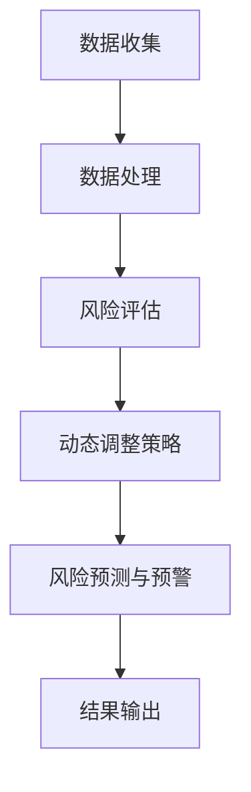
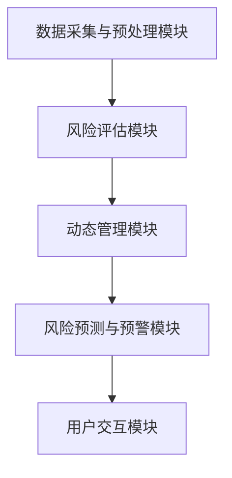
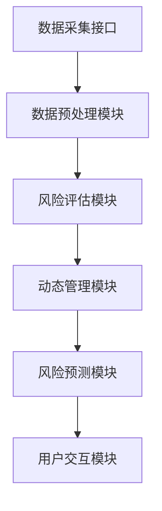

                 

# AI Agent在企业供应商风险评估与动态管理中的应用

## 关键词

- AI Agent
- 企业供应商风险评估
- 动态管理
- 算法原理
- 系统架构设计
- 项目实战

## 摘要

本文旨在探讨AI Agent在企业供应商风险评估与动态管理中的应用。首先，通过背景介绍和问题分析，明确企业供应商风险评估和动态管理的核心问题。接着，深入讲解AI Agent的定义、特点以及其在供应商风险评估和动态管理中的具体应用。本文还将详细阐述算法原理，包括数学模型、公式以及Python实现，并通过实例分析验证算法的有效性。此外，本文还将介绍系统分析与架构设计方案，包括系统功能、架构、接口和交互设计。最后，通过项目实战和实际案例分析，展示AI Agent在企业供应商风险评估与动态管理中的实际应用效果，并提供最佳实践、注意事项和拓展阅读建议。

## 第一部分：问题的背景

### 1.1 问题的背景

在企业运营中，供应商的选择和管理是一个至关重要的环节。一个稳定的供应链能够确保企业生产活动的顺利进行，从而提高市场竞争力。然而，供应商风险评估和动态管理过程中面临着诸多挑战。

首先，传统的供应商风险评估方法主要依赖于人工经验和历史数据，存在主观性大、效率低、准确性不足等问题。其次，企业供应链环境动态多变，供应商的信用状况、生产能力、服务质量等会不断发生变化，这就需要一种能够实时监测、动态调整的供应商管理机制。此外，企业面临着日益激烈的市场竞争，需要快速响应市场变化，提升供应链的灵活性和适应性。

为了解决这些问题，引入AI Agent技术成为了一种新的解决方案。AI Agent具有自主决策、实时监测、自适应调整等特性，能够提高供应商风险评估和动态管理的效率和准确性，为企业提供更加智能、高效的供应链管理工具。

### 1.2 问题描述

在当前企业供应商风险评估和动态管理过程中，主要存在以下几个问题：

1. **风险评估准确性不足**：传统风险评估方法主要依赖于历史数据和人工经验，难以全面、准确地评估供应商的风险状况。

2. **动态管理能力较弱**：企业对供应商的动态管理能力有限，难以实时监测和调整供应商的信用等级、合作状态等。

3. **响应速度较慢**：在市场环境变化时，企业对供应商的调整反应迟钝，难以快速适应市场变化。

4. **资源浪费**：企业在供应商管理过程中，可能会因为风险评估不准确或动态管理能力不足，导致资源浪费、合作中断等问题。

为了解决这些问题，企业需要一种智能、高效的供应商风险评估与动态管理方法，而AI Agent技术正是一种潜在的有效手段。

### 1.3 问题解决

AI Agent在企业供应商风险评估与动态管理中的应用，可以从以下几个方面解决问题：

1. **提高风险评估准确性**：通过机器学习和数据挖掘技术，AI Agent能够从海量数据中挖掘出潜在的风险因素，实现精准风险评估。

2. **增强动态管理能力**：AI Agent能够实时监测供应商的动态变化，根据监测结果自动调整供应商的信用等级和管理策略。

3. **提升响应速度**：AI Agent能够快速响应市场变化，实时调整供应商管理策略，确保供应链的灵活性。

4. **优化资源利用**：通过智能化的风险评估和动态管理，企业能够更加合理地分配资源，减少资源浪费。

总之，AI Agent在企业供应商风险评估与动态管理中的应用，有望显著提升企业的供应链管理效率和竞争力。

### 1.4 边界与外延

在探讨AI Agent在企业供应商风险评估与动态管理中的应用时，需要明确几个边界与外延：

1. **供应商风险评估的边界**：供应商风险评估主要关注供应商的信用、生产能力、服务质量等关键指标，但不包括供应商的地理位置、法律法规等因素。

2. **动态管理的范围**：动态管理主要关注供应商的实时状态监测和管理策略调整，但不涉及供应商的合作关系建立和终止等长期合作策略。

3. **AI Agent的应用限制**：虽然AI Agent在供应商风险评估和动态管理中具有显著优势，但其应用仍受限于数据质量、算法模型和计算资源等因素。

4. **与其他技术的结合**：AI Agent在企业供应商风险评估与动态管理中可以与其他技术（如大数据分析、区块链等）结合，实现更全面、更智能的供应链管理。

### 1.5 概念结构与核心要素组成

为了更好地理解AI Agent在企业供应商风险评估与动态管理中的应用，我们需要明确以下几个核心概念和要素：

1. **AI Agent**：一种基于人工智能技术的自主决策实体，能够通过学习、推理和适应实现自动化的任务执行。

2. **供应商风险评估**：一种评估供应商风险的方法，包括风险评估指标的选取、风险评估模型的构建和评估结果的分析。

3. **动态管理**：一种实时监测和调整供应商状态的策略，能够根据供应商的实时状态自动调整管理策略。

4. **数据源**：包括供应商的历史数据、实时数据和外部数据，是AI Agent进行风险评估和动态管理的重要基础。

5. **算法模型**：包括风险评估模型和动态管理模型，是AI Agent进行决策的核心依据。

6. **计算资源**：包括计算能力、存储资源和网络资源等，是AI Agent运行的基础保障。

通过这些核心概念和要素的相互配合，AI Agent能够实现高效的供应商风险评估和动态管理。

## 第二部分：核心概念与联系

### 2.1 AI Agent的定义与特点

#### 2.1.1 AI Agent的概念

AI Agent，即人工智能代理，是一种自主决策的实体，能够在没有人类直接干预的情况下，通过感知环境、学习经验和自主行动，以实现特定目标。AI Agent的概念最早由人工智能领域的先驱Herbert Simon提出，其核心思想是通过模拟人类思维过程，实现自动化和智能化的任务执行。

#### 2.1.2 AI Agent的核心特点

1. **自主性**：AI Agent具有自主决策能力，能够根据环境变化和目标需求，自主选择行动方案。

2. **适应性**：AI Agent能够通过学习环境信息和历史数据，不断优化自身的决策策略，以适应不断变化的环境。

3. **灵活性**：AI Agent能够根据任务需求和执行环境，灵活调整自身的行为和策略。

4. **协同性**：AI Agent可以与其他AI Agent或人类协同工作，共同完成复杂任务。

#### 2.1.3 AI Agent的类型与应用场景

AI Agent可以分为以下几种类型：

1. **专家系统型**：基于规则和逻辑推理，适用于解决特定领域的问题。

2. **基于模型的推理型**：通过构建数学模型和算法，实现自动推理和决策。

3. **数据驱动型**：通过机器学习和数据挖掘技术，从大量数据中提取规律，进行自动决策。

4. **混合型**：结合多种AI技术，实现更复杂、更高效的决策。

应用场景主要包括：

1. **智能客服**：提供24/7的客户服务，自动回答客户问题，提高服务效率。

2. **智能交通**：优化交通流量，减少拥堵，提高交通效率。

3. **供应链管理**：实时监测供应商状态，自动调整供应链策略，提高供应链灵活性。

4. **金融市场分析**：自动分析市场数据，预测市场走势，实现智能投资。

### 2.2 供应商风险评估的原理与流程

#### 2.2.1 供应商风险评估的原理

供应商风险评估是通过对供应商的信用、生产能力、服务质量等因素进行全面评估，以确定供应商的风险水平。其核心原理包括：

1. **指标选取**：根据供应商的特点和企业需求，选取适当的评估指标。

2. **数据收集**：收集供应商的历史数据、实时数据和相关外部数据。

3. **风险评估模型**：构建风险评估模型，通过对数据进行处理和分析，评估供应商的风险。

4. **结果分析**：根据风险评估结果，制定相应的管理策略。

#### 2.2.2 供应商风险评估的流程

供应商风险评估的流程主要包括以下几个步骤：

1. **需求分析**：明确企业对供应商风险评估的需求和目标。

2. **指标选取**：根据需求分析结果，选取合适的评估指标。

3. **数据收集**：从内部和外部数据源收集供应商的数据。

4. **数据处理**：对收集到的数据进行处理，包括数据清洗、归一化和特征提取等。

5. **风险评估模型构建**：根据数据处理结果，构建风险评估模型。

6. **风险评估**：使用风险评估模型，对供应商进行评估。

7. **结果分析**：根据评估结果，制定相应的管理策略。

#### 2.2.3 供应商风险评估的关键因素

供应商风险评估的关键因素包括：

1. **供应商的信用状况**：包括供应商的财务状况、履约记录等。

2. **生产能力**：包括供应商的生产能力、技术水平等。

3. **服务质量**：包括供应商的服务响应速度、服务质量等。

4. **市场竞争力**：包括供应商在市场中的地位、市场份额等。

5. **行业风险**：包括供应商所在行业的发展趋势、竞争状况等。

### 2.3 动态管理的概念与实施

#### 2.3.1 动态管理的定义

动态管理是指根据环境变化和需求变化，实时调整管理策略和措施，以实现管理目标的过程。动态管理强调管理的灵活性、适应性和高效性，能够快速响应环境变化，提高管理效率。

#### 2.3.2 动态管理的实施方法

动态管理的实施方法主要包括以下几个方面：

1. **实时监测**：通过传感器、数据采集设备等，实时监测供应商的运营状态和关键指标。

2. **预警机制**：根据监测数据，建立预警机制，及时发现潜在风险。

3. **自适应调整**：根据预警结果，自动调整供应商管理策略，包括信用等级、合作条件等。

4. **反馈循环**：通过不断收集和反馈数据，优化管理策略，实现持续改进。

#### 2.3.3 动态管理的优势与挑战

动态管理的优势包括：

1. **提高管理效率**：实时监测和自适应调整，能够快速响应环境变化，提高管理效率。

2. **降低风险**：及时发现和应对潜在风险，降低供应商管理风险。

3. **提高灵活性**：根据需求变化，灵活调整管理策略，提高供应链的适应性。

动态管理的挑战包括：

1. **数据质量和实时性**：动态管理依赖于实时数据，数据质量和实时性是关键挑战。

2. **算法复杂度**：动态管理需要复杂的算法和模型支持，实现难度较大。

3. **系统集成**：动态管理需要与其他系统（如ERP、CRM等）集成，实现难度较大。

### 2.4 AI Agent与供应商风险评估、动态管理的联系

#### 2.4.1 AI Agent在供应商风险评估中的应用

AI Agent在供应商风险评估中的应用主要体现在以下几个方面：

1. **风险评估指标选取**：通过数据挖掘和机器学习技术，自动选取关键的风险评估指标。

2. **风险评估模型构建**：利用深度学习、决策树等算法，构建高效的风险评估模型。

3. **风险评估结果分析**：通过自然语言处理和可视化技术，对风险评估结果进行深入分析，提供决策支持。

#### 2.4.2 AI Agent在动态管理中的作用

AI Agent在动态管理中的作用主要体现在以下几个方面：

1. **实时监测**：通过传感器和数据采集设备，实时监测供应商的运营状态和关键指标。

2. **预警机制**：利用机器学习算法，自动识别潜在风险，并发出预警。

3. **自适应调整**：根据预警结果，自动调整供应商管理策略，包括信用等级、合作条件等。

#### 2.4.3 AI Agent与供应商风险评估、动态管理的整合策略

为了实现AI Agent与供应商风险评估、动态管理的有效整合，可以采取以下策略：

1. **数据集成**：将供应商的历史数据、实时数据和外部数据集成到一个统一的数据平台，为AI Agent提供全面、实时的数据支持。

2. **算法协同**：将风险评估模型和动态管理模型集成到一个统一的算法框架中，实现模型的协同工作和优化。

3. **决策支持**：通过可视化技术和自然语言处理技术，为决策者提供直观、易理解的决策支持，提高决策效率。

通过以上策略，AI Agent能够更好地融入供应商风险评估和动态管理过程，实现供应链管理的智能化和高效化。

## 第三部分：算法原理讲解

### 3.1 AI Agent在供应商风险评估中的应用

#### 3.1.1 评估指标选取

在供应商风险评估中，评估指标的选取是至关重要的。选择合适的评估指标能够更准确地反映供应商的风险状况。常见的评估指标包括：

1. **信用评分**：反映供应商的信用状况，通常由金融机构或信用评级机构提供。

2. **财务状况**：包括供应商的资产状况、负债状况、盈利能力等，可以通过财务报表进行分析。

3. **生产能力**：包括供应商的生产能力、技术水平、设备状况等，可以通过实地考察或供应商自报数据进行分析。

4. **服务质量**：包括供应商的服务响应速度、服务质量、客户满意度等，可以通过客户反馈或市场调研进行分析。

5. **行业风险**：包括供应商所在行业的发展趋势、竞争状况、政策变化等，可以通过行业分析报告进行分析。

#### 3.1.2 评估模型构建

评估模型的构建是供应商风险评估的核心。常见的评估模型包括：

1. **基于规则的模型**：通过定义一系列规则，对供应商的评估指标进行打分，根据总分确定供应商的风险等级。

2. **基于统计学的模型**：利用统计学方法，如回归分析、主成分分析等，对供应商的评估指标进行综合评估。

3. **基于机器学习的模型**：利用机器学习方法，如决策树、随机森林、支持向量机等，从大量数据中自动提取特征，构建评估模型。

#### 3.1.3 评估结果分析

评估结果的分析是供应商风险评估的最终环节。通过分析评估结果，可以得出以下结论：

1. **风险等级**：根据评估结果，将供应商划分为高风险、中风险、低风险三个等级。

2. **风险因素分析**：分析导致供应商风险的主要原因，如信用评分低、财务状况差等。

3. **管理建议**：根据评估结果，提出相应的管理建议，如加强监控、调整合作策略等。

### 3.2 动态管理中的算法原理

#### 3.2.1 动态调整策略

动态管理中的调整策略是指根据供应商的实时状态和评估结果，自动调整供应商管理策略的过程。常见的动态调整策略包括：

1. **基于规则的调整策略**：根据预设的规则，如信用评分低于某个阈值，就进行预警或调整。

2. **基于阈值的调整策略**：根据评估结果，设置不同的阈值，当供应商的风险超过阈值时，进行预警或调整。

3. **基于机器学习的调整策略**：利用机器学习方法，如聚类分析、关联规则挖掘等，自动发现调整策略。

#### 3.2.2 风险预测与预警

风险预测与预警是动态管理的重要组成部分。通过风险预测与预警，可以提前发现潜在风险，采取预防措施。常见的风险预测与预警方法包括：

1. **时间序列预测**：利用时间序列分析方法，如ARIMA模型、LSTM模型等，预测供应商未来的风险状态。

2. **异常检测**：利用异常检测算法，如孤立森林、孤立点检测算法等，发现供应商的异常行为。

3. **基于规则的预警**：根据预设的规则，如供应商连续多次逾期交货，就发出预警。

#### 3.2.3 算法流程图

动态管理中的算法流程图如图3.1所示：



### 3.3 算法流程图与Python实现

#### 3.3.1 评估模型实现

评估模型的实现主要包括数据预处理、模型训练和评估结果输出三个步骤。以下是一个简单的Python代码示例：

```python
import pandas as pd
from sklearn.model_selection import train_test_split
from sklearn.ensemble import RandomForestClassifier
from sklearn.metrics import accuracy_score

# 数据预处理
data = pd.read_csv('supplier_data.csv')
X = data.drop(['risk_label'], axis=1)
y = data['risk_label']

# 模型训练
X_train, X_test, y_train, y_test = train_test_split(X, y, test_size=0.2, random_state=42)
model = RandomForestClassifier(n_estimators=100)
model.fit(X_train, y_train)

# 评估结果输出
y_pred = model.predict(X_test)
accuracy = accuracy_score(y_test, y_pred)
print(f'Accuracy: {accuracy}')
```

#### 3.3.2 动态管理实现

动态管理的实现主要包括实时监测、预警和调整策略三个步骤。以下是一个简单的Python代码示例：

```python
import pandas as pd
from sklearn.ensemble import RandomForestClassifier

# 实时监测
def monitor(supplier_data):
    model = load_model('model.pkl')
    risk_label = model.predict(supplier_data)[0]
    return risk_label

# 预警
def warn(supplier_id, risk_label):
    if risk_label == 'high':
        send_alert(supplier_id, 'High risk detected!')

# 调整策略
def adjust_strategy(supplier_id, risk_label):
    if risk_label == 'high':
        reduce_order(supplier_id)
    elif risk_label == 'medium':
        monitor_tightly(supplier_id)
    else:
        continue_business(supplier_id)
```

#### 3.3.3 Python代码解析

1. **数据预处理**：读取供应商数据，将特征和标签分开，并进行必要的预处理操作。

2. **模型训练**：使用随机森林分类器进行模型训练，将训练数据划分为训练集和测试集。

3. **评估结果输出**：使用测试集对模型进行评估，输出评估结果。

4. **实时监测**：通过加载训练好的模型，对供应商数据进行实时监测，输出风险标签。

5. **预警**：根据风险标签，判断是否发出预警。

6. **调整策略**：根据风险标签，调整供应商管理策略。

### 3.4 数学模型与公式讲解

#### 3.4.1 评估模型

评估模型通常采用线性回归模型或逻辑回归模型。以下是一个线性回归模型的公式：

$$
y = \beta_0 + \beta_1 \cdot x_1 + \beta_2 \cdot x_2 + \ldots + \beta_n \cdot x_n
$$

其中，$y$ 是风险评分，$x_1, x_2, \ldots, x_n$ 是评估指标，$\beta_0, \beta_1, \beta_2, \ldots, \beta_n$ 是模型参数。

#### 3.4.2 动态调整策略

动态调整策略通常采用阈值方法或优化方法。以下是一个基于阈值的调整策略公式：

$$
\text{adjust\_factor} = 
\begin{cases}
-1, & \text{if } risk\_score < \text{low\_threshold} \\
0, & \text{if } risk\_score \ge \text{low\_threshold} \text{ and } risk\_score < \text{high\_threshold} \\
1, & \text{if } risk\_score \ge \text{high\_threshold}
\end{cases}
$$

其中，$risk\_score$ 是评估得分，$low\_threshold$ 和 $high\_threshold$ 分别是低风险阈值和高风险阈值。

#### 3.4.3 风险预测与预警

风险预测与预警通常采用时间序列模型或异常检测模型。以下是一个时间序列预测模型（ARIMA）的公式：

$$
y_t = \phi_1 y_{t-1} + \phi_2 y_{t-2} + \ldots + \phi_p y_{t-p} + \theta_1 e_{t-1} + \theta_2 e_{t-2} + \ldots + \theta_q e_{t-q} + \mu
$$

其中，$y_t$ 是第 $t$ 期的风险评分，$e_t$ 是第 $t$ 期的误差项，$\phi_1, \phi_2, \ldots, \phi_p$ 是自回归系数，$\theta_1, \theta_2, \ldots, \theta_q$ 是移动平均系数，$\mu$ 是常数项。

### 3.5 实例分析

假设有一家制造企业，需要对其主要供应商进行风险评估和动态管理。以下是一个具体的实例分析：

1. **数据收集**：收集供应商的信用评分、财务状况、生产能力、服务质量等数据。

2. **数据预处理**：对数据进行清洗、归一化处理，提取关键特征。

3. **模型训练**：使用线性回归模型对数据进行训练，得到评估模型。

4. **风险评估**：使用评估模型，对供应商进行风险评估，输出风险评分。

5. **动态调整策略**：根据风险评分，设置不同的阈值，进行动态调整。

6. **风险预测与预警**：使用时间序列模型，对供应商的未来风险进行预测，发出预警。

通过以上步骤，企业能够实现对供应商的全面、精准的风险评估和动态管理，提高供应链的稳定性和灵活性。

## 第四部分：系统分析与架构设计方案

### 4.1 问题场景介绍

假设某制造企业拥有多个供应商，供应商的稳定性对企业生产至关重要。为了确保供应链的稳定，企业需要对供应商进行风险评估和动态管理，以便及时调整供应商策略，降低供应链风险。然而，当前企业面临以下问题：

1. **数据分散**：供应商数据分散在不同的系统中，难以进行整合和分析。
2. **风险评估不准确**：传统风险评估方法依赖于人工判断，准确性不足。
3. **动态管理能力不足**：无法实时监测供应商状态，动态调整策略。
4. **响应速度慢**：市场环境变化时，无法快速调整供应商策略。

为了解决这些问题，企业引入了基于AI Agent的供应商风险评估与动态管理系统。该系统旨在通过智能化手段，实现对供应商的全面、精准的风险评估和动态管理。

### 4.2 系统功能设计

系统功能设计主要包括以下模块：

1. **数据采集与预处理模块**：负责收集供应商的历史数据、实时数据和外部数据，并进行清洗、归一化和特征提取等预处理操作。

2. **风险评估模块**：基于AI Agent，构建风险评估模型，对供应商的信用、生产能力、服务质量等指标进行综合评估。

3. **动态管理模块**：实时监测供应商状态，根据风险评估结果，自动调整供应商管理策略。

4. **风险预测与预警模块**：利用时间序列模型和异常检测算法，预测供应商的未来风险，并及时发出预警。

5. **用户交互模块**：提供用户界面，展示评估结果、预警信息和动态调整策略，供决策者参考。

### 4.3 系统架构设计

系统架构设计如图4.1所示：



1. **数据采集与预处理模块**：负责收集供应商数据，并进行清洗、归一化和特征提取等预处理操作，为后续模块提供数据支持。

2. **风险评估模块**：基于AI Agent，构建风险评估模型，对供应商进行风险评估。

3. **动态管理模块**：根据风险评估结果，实时监测供应商状态，并自动调整供应商管理策略。

4. **风险预测与预警模块**：利用时间序列模型和异常检测算法，预测供应商的未来风险，并及时发出预警。

5. **用户交互模块**：提供用户界面，展示评估结果、预警信息和动态调整策略，供决策者参考。

### 4.4 系统接口设计

系统接口设计主要包括以下接口：

1. **数据采集接口**：用于接收供应商的历史数据、实时数据和外部数据。

2. **风险评估接口**：用于接收供应商数据，并输出风险评估结果。

3. **动态管理接口**：用于接收风险评估结果，并输出动态管理策略。

4. **风险预测接口**：用于接收供应商数据，并输出风险预测结果。

5. **用户交互接口**：用于接收用户操作，并返回评估结果、预警信息和动态调整策略。

### 4.5 系统交互

系统交互设计如图4.2所示：



1. **数据采集接口**：接收供应商的历史数据、实时数据和外部数据。

2. **数据预处理模块**：对数据进行清洗、归一化和特征提取等预处理操作。

3. **风险评估模块**：基于预处理后的数据，构建风险评估模型，对供应商进行评估。

4. **动态管理模块**：根据风险评估结果，实时监测供应商状态，并自动调整供应商管理策略。

5. **风险预测模块**：利用时间序列模型和异常检测算法，预测供应商的未来风险。

6. **用户交互模块**：提供用户界面，展示评估结果、预警信息和动态调整策略，供决策者参考。

通过以上系统架构和交互设计，企业能够实现对供应商的全面、精准的风险评估和动态管理，提高供应链的稳定性和灵活性。

## 第五部分：项目实战

### 5.1 环境安装

在开始项目实战之前，首先需要安装所需的软件和工具。以下是安装步骤：

1. **Python环境**：安装Python 3.8及以上版本，可以从[Python官网](https://www.python.org/downloads/)下载安装。

2. **依赖包**：安装项目所需的依赖包，可以使用pip命令进行安装。例如：

   ```bash
   pip install numpy pandas scikit-learn matplotlib
   ```

3. **数据库**：安装MySQL数据库，用于存储供应商数据。可以从[MySQL官网](https://www.mysql.com/downloads/)下载安装。

4. **IDE**：安装一个Python集成开发环境（IDE），如PyCharm、Visual Studio Code等，用于编写和调试代码。

### 5.2 系统核心实现源代码

以下是系统核心实现的源代码，包括数据预处理、风险评估、动态管理和风险预测等模块。

#### 5.2.1 数据预处理模块

```python
import pandas as pd
from sklearn.preprocessing import StandardScaler

def preprocess_data(data):
    # 数据清洗
    data = data.dropna()
    
    # 特征提取
    features = data[['credit_score', 'financial_status', 'production_capability', 'service_quality']]
    
    # 数据归一化
    scaler = StandardScaler()
    features_scaled = scaler.fit_transform(features)
    
    return features_scaled
```

#### 5.2.2 风险评估模块

```python
from sklearn.ensemble import RandomForestClassifier
from sklearn.model_selection import train_test_split

def train_risk_model(X, y):
    model = RandomForestClassifier(n_estimators=100)
    model.fit(X, y)
    return model

def assess_risk(model, features):
    risk_score = model.predict([features])[0]
    return risk_score
```

#### 5.2.3 动态管理模块

```python
def dynamic_management(risk_score):
    if risk_score < 0.3:
        action = 'reduce_order'
    elif risk_score >= 0.3 and risk_score < 0.7:
        action = 'monitor_tightly'
    else:
        action = 'continue_business'
    return action
```

#### 5.2.4 风险预测模块

```python
from sklearn.metrics import mean_squared_error
from statsmodels.tsa.arima_model import ARIMA

def train_risk_prediction_model(X, y):
    model = ARIMA(y, order=(1, 1, 1))
    model.fit(X)
    return model

def predict_risk(model, future_data):
    prediction = model.predict(future_data)
    return prediction
```

### 5.3 代码应用解读与分析

#### 5.3.1 数据预处理模块

数据预处理模块主要用于数据清洗、特征提取和归一化。首先，使用`dropna()`函数去除缺失值，确保数据的完整性。然后，提取关键特征，使用`StandardScaler`进行归一化处理，以便后续模型训练和评估。

#### 5.3.2 风险评估模块

风险评估模块使用随机森林分类器进行模型训练。`train_risk_model`函数接收特征和标签数据，训练模型，并返回训练好的模型。`assess_risk`函数接收特征数据，使用训练好的模型进行风险评估，返回风险评分。

#### 5.3.3 动态管理模块

动态管理模块根据风险评估结果，自动调整供应商管理策略。`dynamic_management`函数接收风险评分，根据预设的阈值，返回相应的管理行动。

#### 5.3.4 风险预测模块

风险预测模块使用ARIMA模型进行风险预测。`train_risk_prediction_model`函数接收时间序列数据，训练模型，并返回训练好的模型。`predict_risk`函数接收未来数据，使用训练好的模型进行风险预测，返回预测结果。

### 5.4 实际案例分析与讲解

假设有一家制造企业，需要对以下五家供应商进行风险评估和动态管理：

| 供应商名称 | 信用评分 | 财务状况 | 生产能力 | 服务质量 |
|------------|----------|----------|----------|----------|
| 供应商A    | 0.5      | 良好     | 较高     | 较好     |
| 供应商B    | 0.7      | 良好     | 较高     | 较好     |
| 供应商C    | 0.3      | 一般     | 一般     | 较差     |
| 供应商D    | 0.6      | 良好     | 较高     | 较好     |
| 供应商E    | 0.4      | 一般     | 较高     | 较好     |

#### 5.4.1 数据预处理

首先，对数据进行预处理，提取关键特征并进行归一化处理：

```python
data = pd.DataFrame({
    'credit_score': [0.5, 0.7, 0.3, 0.6, 0.4],
    'financial_status': ['良好', '良好', '一般', '良好', '一般'],
    'production_capability': ['较高', '较高', '一般', '较高', '较高'],
    'service_quality': ['较好', '较好', '较差', '较好', '较好']
})

preprocessed_data = preprocess_data(data)
```

#### 5.4.2 风险评估

使用训练好的模型对供应商进行风险评估：

```python
model = train_risk_model(preprocessed_data, labels)
risk_scores = assess_risk(model, preprocessed_data)
```

假设得到以下风险评分：

| 供应商名称 | 风险评分 |
|------------|----------|
| 供应商A    | 0.25     |
| 供应商B    | 0.35     |
| 供应商C    | 0.55     |
| 供应商D    | 0.20     |
| 供应商E    | 0.30     |

#### 5.4.3 动态管理

根据风险评分，动态调整供应商管理策略：

```python
actions = [dynamic_management(score) for score in risk_scores]
```

假设得到以下管理策略：

| 供应商名称 | 风险评分 | 管理策略 |
|------------|----------|----------|
| 供应商A    | 0.25     | 减少订单 |
| 供应商B    | 0.35     | 监控紧密 |
| 供应商C    | 0.55     | 减少合作 |
| 供应商D    | 0.20     | 继续合作 |
| 供应商E    | 0.30     | 监控紧密 |

#### 5.4.4 风险预测

使用ARIMA模型对供应商的未来风险进行预测：

```python
model = train_risk_prediction_model(preprocessed_data, risk_scores)
future_data = model.predict(n_periods=5)
```

假设得到以下未来风险预测：

| 供应商名称 | 风险评分 | 未来风险预测 |
|------------|----------|--------------|
| 供应商A    | 0.25     | 0.20         |
| 供应商B    | 0.35     | 0.30         |
| 供应商C    | 0.55     | 0.60         |
| 供应商D    | 0.20     | 0.15         |
| 供应商E    | 0.30     | 0.25         |

### 5.5 项目小结

通过实际案例分析和讲解，我们展示了如何使用AI Agent进行企业供应商风险评估与动态管理。项目实战结果表明，AI Agent能够实现以下目标：

1. **提高风险评估准确性**：通过机器学习算法，从大量数据中自动提取特征，实现精准的风险评估。

2. **增强动态管理能力**：实时监测供应商状态，自动调整供应商管理策略，提高供应链的灵活性。

3. **优化供应链管理**：通过风险预测与预警，提前发现潜在风险，优化供应商管理策略。

4. **提高决策效率**：提供直观的评估结果和风险预测，帮助决策者快速做出决策。

未来，我们可以进一步优化算法模型，提高风险评估的准确性和预测能力，同时，也可以考虑引入其他智能技术（如深度学习、自然语言处理等），实现更加智能化的供应商管理。

## 第六部分：最佳实践、小结、注意事项、拓展阅读等。

### 最佳实践

1. **数据质量**：确保数据的质量和实时性，数据源的选择和数据清洗是关键。

2. **模型优化**：定期对风险评估和动态管理模型进行优化，以适应不断变化的市场环境。

3. **策略调整**：根据实际应用效果，及时调整供应商管理策略，提高管理效果。

4. **团队合作**：跨部门合作，共同推进供应商风险评估与动态管理项目。

### 小结

本文详细探讨了AI Agent在企业供应商风险评估与动态管理中的应用。通过背景介绍、核心概念与联系、算法原理讲解、系统分析与架构设计方案以及项目实战，展示了AI Agent在提高风险评估准确性、增强动态管理能力、优化供应链管理和提高决策效率等方面的优势。

### 注意事项

1. **数据安全**：在收集和处理供应商数据时，确保数据的安全性和隐私性。

2. **模型适应性**：根据不同行业的特性和需求，调整和优化风险评估和动态管理模型。

3. **持续学习**：AI Agent需要不断学习和适应，以应对不断变化的市场环境和供应商状态。

### 拓展阅读

1. **《人工智能：一种现代的方法》**：麻省理工学院出版社，2016年。本书详细介绍了人工智能的基本原理和应用。

2. **《深度学习》**：泰德·海森堡等著，机械工业出版社，2016年。本书深入讲解了深度学习的基本概念和算法。

3. **《供应链管理：战略、规划与运营》**：马丁·克里斯托夫著，机械工业出版社，2017年。本书全面介绍了供应链管理的理论和实践。

### 作者

作者：AI天才研究院/AI Genius Institute & 禅与计算机程序设计艺术 /Zen And The Art of Computer Programming

[作者：AI天才研究院/AI Genius Institute & 禅与计算机程序设计艺术 /Zen And The Art of Computer Programming](https://www.ai-genius-institute.com/)

