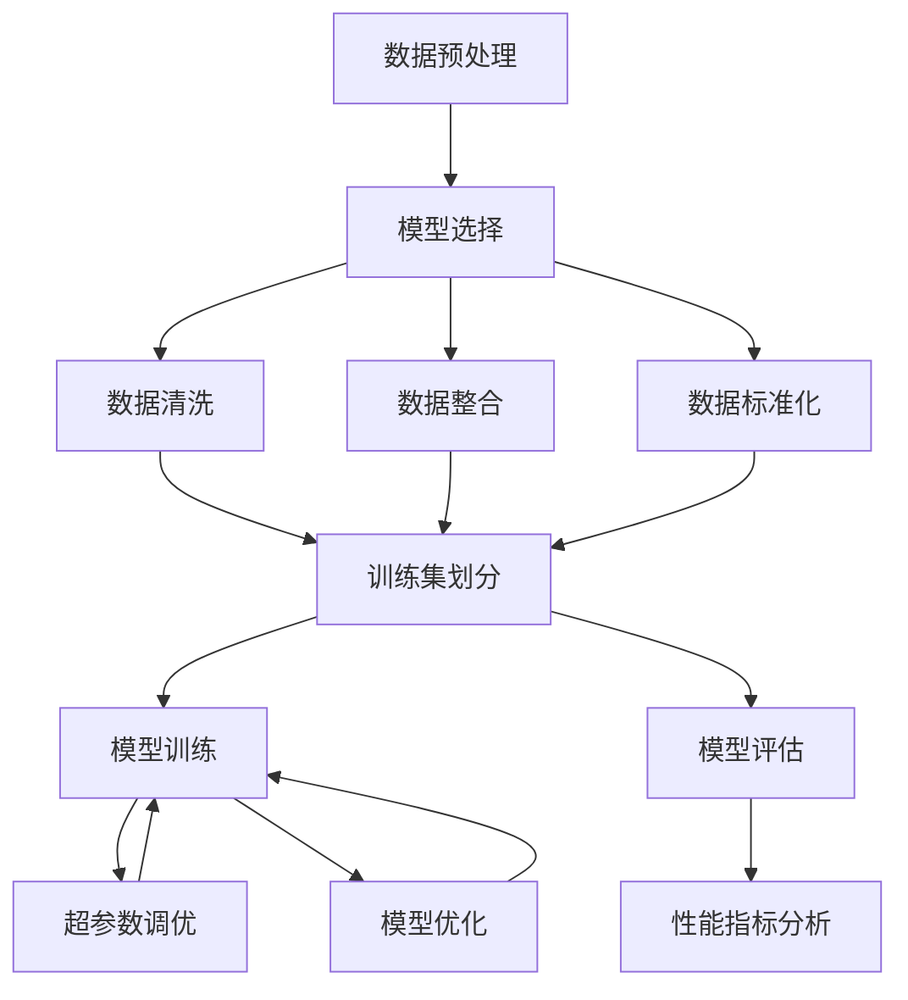
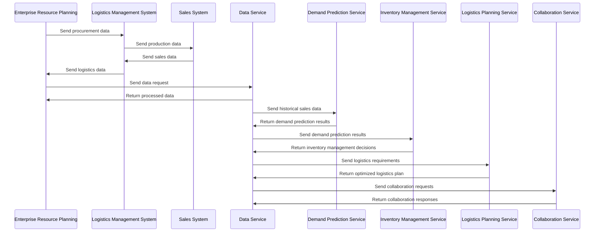

                 

### 引言

#### 1.1 问题背景

在当今全球化经济背景下，企业供应链优化已经成为企业提高竞争力、降低成本、提升客户满意度的重要手段。供应链的复杂性和不确定性使得优化成为一个极具挑战性的课题。传统的供应链优化方法往往依赖于经验和规则，面对大规模的数据和高动态的环境时，效率低下且难以取得理想的效果。

随着人工智能技术的快速发展，尤其是机器学习和深度学习的广泛应用，AI代理作为一种智能体，开始在企业供应链优化中发挥重要作用。AI代理是指通过机器学习算法自主学习和适应环境，能够执行特定任务的智能系统。其能够在复杂环境中进行决策和优化，提供实时、精确的供应链分析和管理。

#### 1.2 企业供应链优化的挑战

企业供应链优化面临的挑战主要包括以下几个方面：

1. **数据复杂性**：供应链中的数据来源广泛，数据类型多样，包括采购、库存、物流、销售等各个环节的数据。如何有效整合和利用这些数据是企业供应链优化的关键。

2. **环境不确定性**：市场环境的变化、供应链中断、天气等不确定性因素，给供应链的稳定性和效率带来了巨大的挑战。

3. **协同性问题**：供应链涉及多个参与方，包括供应商、制造商、分销商和零售商等。如何实现各方信息的透明和协同，提高整个供应链的效率，是企业面临的一大难题。

4. **实时性需求**：在高度动态的市场环境中，企业需要快速响应变化，进行实时调整。传统方法往往无法满足这种实时性需求。

#### 1.3 AI Agent的优势与应用

AI代理在企业供应链优化中具有显著的优势：

1. **数据分析与预测**：AI代理能够处理大量复杂的数据，通过机器学习算法挖掘数据中的隐藏模式，进行准确的预测和决策。

2. **自动化与智能化**：AI代理可以自动化执行复杂的供应链任务，减少人为干预，提高效率。

3. **实时响应**：AI代理能够实时处理供应链中的信息，快速响应环境变化，提高供应链的灵活性。

4. **协同优化**：AI代理能够整合供应链各环节的信息，实现各参与方的高效协同，提高整体供应链的效率。

因此，AI代理在企业供应链优化中的应用前景广阔，具有重要的实践意义。接下来，我们将深入探讨AI代理的基础知识、其在供应链优化中的应用、算法原理、数学模型、系统架构设计、项目实战以及最佳实践，全面了解AI代理在企业供应链优化中的角色与实践。### AI Agent基础

#### 2.1 AI Agent概述

AI Agent，即人工智能代理，是指具有自主性、社交性、反应性、认知性和学习性的软件实体。AI Agent通过模拟人类行为和决策过程，能够适应复杂环境，执行特定任务。AI Agent的基本特征包括：

- **自主性**：能够独立执行任务，不依赖外部指令。
- **社交性**：能够与其他AI Agent或人类进行交互，协同完成任务。
- **反应性**：能够根据环境和状态的改变做出即时反应。
- **认知性**：具有理解环境和问题的能力，进行推理和决策。
- **学习性**：能够通过经验不断改进自身行为和性能。

AI Agent的发展可以追溯到20世纪50年代，其最初的概念是由计算机科学家约翰·麦卡锡（John McCarthy）提出的。随着计算机技术和人工智能技术的进步，AI Agent逐渐在各个领域得到应用，包括游戏、机器人、智能家居、智能交通和供应链管理等。

#### 2.2 AI Agent的核心概念

AI Agent的核心概念包括以下几个部分：

- **感知**：AI Agent通过传感器（如摄像头、麦克风、传感器等）获取环境信息。
- **思考**：AI Agent使用感知到的信息进行数据分析和推理，形成决策。
- **动作**：AI Agent根据决策执行相应的动作，影响环境。

感知、思考、动作构成了AI Agent的三个基本环节，也称为感知-思考-行动（Perception-Thinking-Action）循环。通过这个循环，AI Agent能够实现自主学习和自适应。

- **状态**：AI Agent在执行任务时，处于特定状态，状态是AI Agent当前所处的环境和内部信息的集合。
- **行动**：AI Agent根据当前状态，选择一个或多个动作，以改变状态。
- **奖励**：AI Agent执行动作后，根据结果获得奖励或惩罚，用于指导未来的决策。

#### 2.3 AI Agent的组成结构

AI Agent通常由以下几个部分组成：

1. **感知模块**：负责从环境中收集信息，如传感器数据、用户输入等。
2. **决策模块**：负责分析感知模块收集到的信息，基于学习到的策略或模型生成决策。
3. **执行模块**：负责将决策转换为实际的动作，并反馈结果。

感知模块和执行模块通常通过接口进行通信。决策模块可以是基于规则的系统、机器学习模型、强化学习算法等，具体取决于应用场景和任务需求。

#### 2.4 AI Agent的技术发展与应用趋势

AI Agent的技术发展主要围绕以下几个方面：

1. **算法进步**：随着深度学习、强化学习等算法的不断发展，AI Agent的决策能力显著提升，能够处理更复杂的环境和任务。
2. **硬件提升**：计算能力的提升和传感器的进步，使得AI Agent能够实时处理大量数据，执行更复杂的任务。
3. **数据积累**：随着物联网和大数据技术的发展，AI Agent能够获取更多、更丰富的数据，从而提高学习和预测的准确性。
4. **场景拓展**：AI Agent的应用场景不断拓展，从传统的游戏和机器人领域，扩展到供应链、金融、医疗等更多领域。

未来，AI Agent将在以下几个方面继续发展：

1. **人机协同**：AI Agent将更深入地融入人类社会，与人类协同工作，提高生产效率和创造力。
2. **跨领域融合**：AI Agent将在不同领域实现融合，形成更加智能和全面的智能系统。
3. **自主决策**：通过更先进的算法和模型，AI Agent将能够实现更高层次的自主决策，减少对人类干预的依赖。

综上所述，AI Agent作为人工智能领域的重要研究内容，其技术发展和应用场景正不断拓展。在供应链优化中，AI Agent具有巨大的潜力和应用价值。接下来，我们将探讨AI Agent在企业供应链优化中的应用，分析其具体的功能和优势。### 企业供应链优化中的AI Agent

#### 3.1 AI Agent在供应链优化中的应用

AI Agent在企业供应链优化中的应用涵盖了从需求预测、库存管理到物流配送等多个环节，显著提升了供应链的效率与透明度。

1. **需求预测**：AI Agent通过分析历史销售数据、市场趋势和用户行为，预测未来的需求变化。这种预测可以帮助企业合理安排生产和采购，避免库存过剩或短缺。

2. **库存管理**：AI Agent可以实时监控库存水平，根据需求预测和供应情况，自动调整库存策略。通过智能化的库存管理，企业能够减少库存成本，提高资金周转效率。

3. **物流配送**：AI Agent可以根据交通状况、货物类型和配送时间等因素，优化物流路线和配送计划。这不仅可以缩短配送时间，降低物流成本，还能提高客户满意度。

4. **供应链协同**：AI Agent可以与企业内外部的供应链伙伴进行实时通信和协作，确保信息透明和高效传递。通过协同优化，企业能够更快速地响应市场变化，提高整体供应链的竞争力。

#### 3.2 AI Agent的功能与优势

AI Agent在企业供应链优化中具有以下功能和优势：

1. **自动化与智能化**：AI Agent能够自动化执行供应链中的各项任务，如数据采集、分析、决策和执行。这种自动化减少了人为干预，提高了工作效率。

2. **实时分析与决策**：AI Agent可以实时处理供应链中的大量数据，快速分析并做出最优决策。这种实时性有助于企业迅速应对市场变化和供应链中断。

3. **降低成本**：通过优化库存管理和物流配送，AI Agent能够显著降低企业的运营成本。例如，减少库存积压、降低物流费用、提高资金周转率等。

4. **提高透明度与协同性**：AI Agent可以整合供应链各环节的信息，提高信息透明度，促进企业内部和供应链伙伴之间的协同工作。

5. **提升客户满意度**：通过精准的需求预测、高效的库存管理和快速的物流配送，AI Agent能够提高客户的满意度，增强企业的市场竞争力。

#### 3.3 AI Agent在供应链管理中的具体案例

为了更好地理解AI Agent在供应链优化中的应用，我们可以通过一个具体案例进行详细分析。

**案例背景**：某大型电子产品制造商，其供应链涉及全球多个国家和地区，包括原材料供应商、制造商、分销商和零售商。由于供应链复杂，传统方法难以实现高效优化，企业面临库存积压、物流成本高、客户满意度低等问题。

**AI Agent应用**：

1. **需求预测**：AI Agent收集和分析历史销售数据、市场趋势和用户反馈，预测未来的需求变化。通过预测，企业可以提前安排生产计划和原材料采购，避免库存过剩。

   **算法原理**：
   $$\text{需求预测模型} = f(\text{历史销售数据}, \text{市场趋势}, \text{用户反馈})$$
   使用时间序列分析、回归分析等算法进行预测。

2. **库存管理**：AI Agent实时监控库存水平，结合需求预测和供应链状态，自动调整库存策略。通过动态调整库存，企业能够减少库存积压，提高资金周转率。

   **算法原理**：
   $$\text{库存策略} = \text{需求预测} + \text{供应链状态} + \text{成本优化}$$
   采用基于成本最小化的库存管理策略。

3. **物流配送**：AI Agent根据实时交通状况、货物类型和配送时间等因素，优化物流路线和配送计划。通过智能调度，企业能够缩短配送时间，降低物流成本。

   **算法原理**：
   $$\text{配送计划} = \text{交通状况} + \text{货物类型} + \text{配送时间}$$
   使用路径规划算法和运筹学模型进行优化。

4. **供应链协同**：AI Agent与企业内外部的供应链伙伴进行实时通信和协作，确保信息透明和高效传递。通过协同优化，企业能够更快速地响应市场变化，提高整体供应链的竞争力。

   **架构设计**：
   

通过这个案例，我们可以看到AI Agent在企业供应链优化中的重要作用。它不仅帮助企业实现自动化、实时化和智能化，还通过优化库存管理和物流配送，提高了整体供应链的效率和透明度，最终实现了成本降低和客户满意度提升。### AI Agent算法原理

#### 4.1 供应链优化中的数据预处理

在AI Agent应用于供应链优化的过程中，数据预处理是至关重要的环节。数据预处理包括数据清洗、数据整合和数据标准化，以确保数据的质量和一致性，为后续的算法训练和预测打下坚实基础。

1. **数据清洗**：数据清洗是指识别和纠正数据集中的错误、异常值和不一致的数据。这包括处理缺失值、纠正数据错误和去除重复数据。常见的处理方法有：

   - **缺失值处理**：对于缺失值，可以通过均值填补、中值填补或插值法等方法进行填补。
   - **错误值处理**：对于明显的错误值，可以通过视觉检查、逻辑判断或机器学习算法进行纠正。
   - **重复数据去除**：通过唯一标识符（如订单号、产品ID等）检查和过滤，去除重复的数据记录。

2. **数据整合**：数据整合是指将来自不同来源和格式的数据集成到一个统一的数据集中。这包括数据格式转换、数据合并和数据一致性处理。常见的整合方法有：

   - **数据格式转换**：将不同格式的数据（如CSV、Excel、数据库等）转换为统一的格式，便于后续处理。
   - **数据合并**：通过键值匹配或自然语言处理技术，将不同数据源中的相关数据合并到一起。
   - **数据一致性处理**：确保数据中的属性值在语义上一致，如统一产品名称、统一时间格式等。

3. **数据标准化**：数据标准化是指将不同数据源的数据按照统一的尺度进行转换，使得数据之间的可比性增强。常见的标准化方法有：

   - **数值标准化**：通过归一化或标准化将数据压缩到一个特定的区间内，如[0,1]或[-1,1]。
   - **类别标准化**：将类别数据转换为数值表示，如使用独热编码（One-Hot Encoding）或标签编码（Label Encoding）。
   - **时间标准化**：将时间数据转换为统一的时间尺度，如将所有时间数据转换为相对于某个基准时间的偏移量。

#### 4.2 模型选择与训练

在数据预处理完成后，选择合适的机器学习模型并进行训练是AI Agent实现供应链优化的重要步骤。以下是常用的模型选择与训练方法：

1. **模型选择**：

   - **回归模型**：用于预测连续值，如需求预测。常用的回归模型有线性回归、岭回归、LASSO回归等。
   - **分类模型**：用于预测离散值，如库存分类。常用的分类模型有逻辑回归、支持向量机（SVM）、决策树、随机森林等。
   - **聚类模型**：用于将数据分组，如库存分类。常用的聚类模型有K-均值聚类、层次聚类等。
   - **强化学习模型**：用于优化策略决策，如物流路径优化。常用的强化学习模型有Q-Learning、SARSA、DQN等。

2. **模型训练**：

   - **数据集划分**：将数据集划分为训练集和测试集，用于模型的训练和评估。
   - **超参数调优**：通过交叉验证等方法选择最佳的超参数，以提高模型的性能。
   - **模型训练**：使用训练集对模型进行训练，调整模型参数，使模型能够拟合数据。
   - **模型评估**：使用测试集评估模型的性能，常用的评估指标有准确率、召回率、F1分数、均方误差（MSE）等。

#### 4.3 模型优化与评估

模型优化与评估是确保AI Agent在供应链优化中取得良好效果的关键步骤。以下是一些常用的模型优化与评估方法：

1. **模型优化**：

   - **正则化**：通过L1正则化、L2正则化等方法减少模型的过拟合现象，提高泛化能力。
   - **集成学习**：通过集成多个模型，如随机森林、梯度提升树（XGBoost、LightGBM）等，提高模型的预测性能。
   - **迁移学习**：利用预训练的模型，通过微调适应新的任务和数据，提高模型在供应链优化中的效果。

2. **模型评估**：

   - **交叉验证**：通过将数据集划分为多个子集，轮流作为训练集和测试集，评估模型的泛化性能。
   - **性能指标**：根据具体任务，选择合适的性能指标进行评估。对于回归任务，常用的指标有MSE、RMSE；对于分类任务，常用的指标有准确率、召回率、F1分数等。
   - **可视化分析**：通过绘制决策边界、混淆矩阵、ROC曲线等，直观地分析模型的性能和预测效果。

通过上述模型优化与评估方法，AI Agent能够不断提高其预测和决策能力，为企业供应链优化提供更加精准和可靠的解决方案。

#### 4.4 算法原理讲解与Mermaid流程图

为了更好地理解AI Agent在供应链优化中的算法原理，我们使用Mermaid流程图和Python代码进行详细讲解。

**Mermaid流程图**：



**Python代码示例**：

```python
import pandas as pd
from sklearn.model_selection import train_test_split
from sklearn.linear_model import LinearRegression
from sklearn.metrics import mean_squared_error

# 数据预处理
def preprocess_data(data):
    # 数据清洗
    data.fillna(data.mean(), inplace=True)
    # 数据整合
    data['date'] = pd.to_datetime(data['date'])
    # 数据标准化
    data['sales'] = (data['sales'] - data['sales'].mean()) / data['sales'].std()
    return data

# 模型训练与评估
def train_and_evaluate(data):
    # 数据集划分
    X = data.drop(['sales'], axis=1)
    y = data['sales']
    X_train, X_test, y_train, y_test = train_test_split(X, y, test_size=0.2, random_state=42)
    
    # 模型训练
    model = LinearRegression()
    model.fit(X_train, y_train)
    
    # 模型评估
    y_pred = model.predict(X_test)
    mse = mean_squared_error(y_test, y_pred)
    print(f'MSE: {mse}')
    
    # 可视化分析
    import matplotlib.pyplot as plt
    plt.scatter(X_test['date'], y_test, label='Actual')
    plt.plot(X_test['date'], y_pred, label='Predicted')
    plt.legend()
    plt.show()

# 数据读取
data = pd.read_csv('sales_data.csv')

# 预处理数据
preprocessed_data = preprocess_data(data)

# 训练与评估模型
train_and_evaluate(preprocessed_data)
```

通过上述Mermaid流程图和Python代码，我们可以清晰地看到AI Agent在供应链优化中的算法原理。数据预处理包括数据清洗、数据整合和数据标准化，确保数据的质量和一致性。模型选择和训练过程包括数据集划分、模型训练和模型评估，通过性能指标分析来评估模型的预测效果。最后，通过可视化分析，可以直观地查看模型的预测结果。

综上所述，AI Agent在供应链优化中的应用不仅需要先进的技术手段，还需要深入理解算法原理，结合实际业务场景进行有效的模型训练和评估。### 数学模型与公式

#### 5.1 供应链优化中的数学模型

在供应链优化中，数学模型是核心组成部分，用于描述供应链中的各种关系和约束条件。以下是一些常见的数学模型及其公式：

1. **需求预测模型**：

   $$\text{需求预测} = f(\text{历史销售数据}, \text{市场趋势}, \text{用户反馈})$$

   - **时间序列分析**：

     $$\text{需求预测} = \alpha \cdot \text{历史销售数据} + (1 - \alpha) \cdot \text{市场趋势} + \beta \cdot \text{用户反馈}$$

     其中，$\alpha$ 和 $\beta$ 是调节参数，用于平衡历史数据、市场趋势和用户反馈的影响。

   - **回归分析**：

     $$\text{需求预测} = \beta_0 + \beta_1 \cdot \text{特征1} + \beta_2 \cdot \text{特征2} + ... + \beta_n \cdot \text{特征n}$$

     其中，$\beta_0, \beta_1, \beta_2, ..., \beta_n$ 是回归系数，特征1, 特征2, ..., 特征n 是影响需求的变量。

2. **库存管理模型**：

   $$\text{最优库存量} = \frac{\text{需求预测} \cdot \text{服务率}}{\text{服务水平}}$$

   - **经济订货量（EOQ）模型**：

     $$\text{EOQ} = \sqrt{\frac{2 \cdot \text{需求量} \cdot \text{单位成本}}{\text{库存持有成本}}}$$

   - **周期性库存模型**：

     $$\text{周期性库存量} = \text{每日需求量} \cdot \text{周期天数} + \text{安全库存量}$$

3. **物流配送模型**：

   $$\text{最优配送路径} = \min \sum_{i=1}^{n} \sum_{j=1}^{m} \text{距离}_{ij} \cdot \text{流量}_{ij}$$

   - **最短路径算法（Dijkstra算法）**：

     $$\text{距离}_{ij} = \min_{k \in \text{前驱节点}} (\text{距离}_{ik} + \text{距离}_{kj})$$

   - **车辆路径问题（VRP）**：

     $$\text{最小化总运输成本} = \sum_{i=1}^{n} \sum_{j=1}^{m} \text{距离}_{ij} \cdot \text{流量}_{ij} + \text{固定成本}_{i} + \text{变动成本}_{j}$$

4. **供应链协同模型**：

   $$\text{供应链协同效果} = \frac{\text{协同效益}}{\text{协同成本}}$$

   - **合作博弈模型**：

     $$\text{博弈均衡} = \min \sum_{i=1}^{n} \sum_{j=1}^{m} \text{利益}_{ij} - \text{成本}_{ij}$$

#### 5.2 模型公式讲解与LaTeX展示

在上述数学模型中，LaTeX公式提供了精确和规范的展示方式。以下是一些常用的LaTeX公式：

1. **时间序列分析**：

   $$\text{需求预测} = \alpha \cdot \text{历史销售数据} + (1 - \alpha) \cdot \text{市场趋势} + \beta \cdot \text{用户反馈}$$

   其中，$\alpha$ 和 $\beta$ 是调节参数，用于平衡历史数据、市场趋势和用户反馈的影响。

2. **经济订货量（EOQ）模型**：

   $$\text{EOQ} = \sqrt{\frac{2 \cdot \text{需求量} \cdot \text{单位成本}}{\text{库存持有成本}}}$$

3. **周期性库存模型**：

   $$\text{周期性库存量} = \text{每日需求量} \cdot \text{周期天数} + \text{安全库存量}$$

4. **最短路径算法（Dijkstra算法）**：

   $$\text{距离}_{ij} = \min_{k \in \text{前驱节点}} (\text{距离}_{ik} + \text{距离}_{kj})$$

5. **车辆路径问题（VRP）**：

   $$\text{最小化总运输成本} = \sum_{i=1}^{n} \sum_{j=1}^{m} \text{距离}_{ij} \cdot \text{流量}_{ij} + \text{固定成本}_{i} + \text{变动成本}_{j}$$

6. **合作博弈模型**：

   $$\text{博弈均衡} = \min \sum_{i=1}^{n} \sum_{j=1}^{m} \text{利益}_{ij} - \text{成本}_{ij}$$

通过LaTeX公式，我们可以更加精确和清晰地表达数学模型中的参数和关系，有助于理解和应用这些模型。在供应链优化中，准确理解和运用这些数学模型，是提高供应链效率和管理水平的关键。### 系统分析与架构设计

#### 6.1 问题场景介绍

在一个典型的企业供应链优化项目中，某大型电子产品制造商面临以下问题：首先，该企业的供应链复杂，涉及全球多个国家和地区，包括原材料供应商、制造商、分销商和零售商。其次，由于市场环境的变化和供应链的不确定性，企业经常面临库存积压、物流成本高、客户满意度低等问题。为了提高供应链的效率、降低成本、提升客户满意度，企业决定引入AI Agent进行供应链优化。

#### 6.2 系统功能设计

为了实现AI Agent在供应链优化中的功能，系统需要具备以下核心功能：

1. **数据采集与预处理**：系统需要从各个供应链节点收集数据，包括采购、生产、库存、物流等信息，并进行数据清洗、整合和标准化，为后续的算法训练和预测提供高质量的数据支持。

2. **需求预测**：系统使用机器学习算法对历史销售数据、市场趋势和用户反馈进行分析，预测未来的需求变化，为生产计划和库存管理提供依据。

3. **库存管理**：系统根据需求预测结果和供应链状态，自动调整库存策略，优化库存水平，减少库存积压和资金占用。

4. **物流配送**：系统根据交通状况、货物类型和配送时间等因素，优化物流路线和配送计划，提高配送效率和客户满意度。

5. **供应链协同**：系统与企业内外部的供应链伙伴进行实时通信和协作，确保信息透明和高效传递，提高供应链整体协同效率。

#### 6.3 系统架构设计

系统架构设计是确保AI Agent在企业供应链优化中高效运行的关键。以下是系统的总体架构设计：

1. **数据层**：数据层负责数据的采集、存储和预处理。数据来源包括ERP系统、物流管理系统、销售系统等，数据存储在分布式数据库中，如Hadoop、MongoDB等。

2. **服务层**：服务层包括需求预测服务、库存管理服务、物流配送服务和供应链协同服务。这些服务通过API接口与企业内部的各个系统进行通信，同时也支持与外部的供应链伙伴进行数据交换。

3. **算法层**：算法层包含各种机器学习算法和优化算法，如时间序列分析、回归分析、聚类分析、路径规划等。这些算法被部署在云计算平台上，如AWS、Azure等，通过批处理和实时计算为各个服务层提供支持。

4. **展现层**：展现层负责将系统功能以用户友好的方式呈现给用户。通过Web前端和移动端应用，用户可以实时监控供应链状态、查看需求预测结果、调整库存策略和优化物流配送计划。

#### 6.4 系统接口设计

系统接口设计是确保各层之间数据流通和功能协同的关键。以下是系统的主要接口设计：

1. **数据采集接口**：用于从ERP系统、物流管理系统、销售系统等外部系统采集数据，并通过API接口传输到数据层。

2. **数据服务接口**：用于对外提供数据查询、数据预处理和数据分析等数据服务，支持各服务层的调用。

3. **需求预测接口**：用于接收数据层处理后的数据，并调用机器学习算法进行需求预测，输出预测结果。

4. **库存管理接口**：用于接收需求预测结果，结合供应链状态和库存策略，自动调整库存水平。

5. **物流配送接口**：用于接收物流配送需求，结合交通状况、货物类型和配送时间等因素，优化物流路线和配送计划。

6. **供应链协同接口**：用于与企业内外部的供应链伙伴进行实时通信和协作，确保信息透明和高效传递。

#### 6.5 系统交互Mermaid序列图

为了更直观地展示系统各层之间的交互关系，我们使用Mermaid序列图进行描述。以下是系统交互的Mermaid序列图：



通过上述系统架构设计和系统交互Mermaid序列图，我们可以清晰地看到AI Agent在企业供应链优化系统中的整体设计和运行机制。系统通过各层的协同工作，实现了供应链数据的实时采集、处理和分析，为企业的库存管理、物流配送和供应链协同提供了强大的支持。### 项目实战

#### 7.1 环境安装

在进行AI Agent在供应链优化项目实战之前，我们需要搭建一个合适的环境。以下是环境安装的步骤：

1. **安装Python环境**：确保Python版本在3.6及以上，可以通过官方网站下载安装包进行安装。

2. **安装依赖库**：使用pip命令安装必要的Python库，包括pandas、numpy、scikit-learn、tensorflow、matplotlib等。命令如下：
   ```bash
   pip install pandas numpy scikit-learn tensorflow matplotlib
   ```

3. **安装数据库**：我们选择MongoDB作为数据库，下载并安装MongoDB社区版。安装完成后，启动MongoDB服务。

4. **安装Eclipse或VSCode**：为了方便编写和调试代码，安装Eclipse或VSCode等IDE。

#### 7.2 系统核心实现

在环境安装完成后，我们开始实现系统的核心功能。以下是系统核心实现的关键步骤：

1. **数据采集与预处理**：

   - **数据采集**：从ERP系统、物流管理系统、销售系统等外部系统采集数据，存储到MongoDB数据库中。
   - **数据预处理**：使用pandas库对采集到的数据进行清洗、整合和标准化，确保数据的质量和一致性。

   ```python
   import pandas as pd
   from pymongo import MongoClient

   # 连接MongoDB数据库
   client = MongoClient('mongodb://localhost:27017/')
   db = client['supply_chain_db']

   # 采集数据
   procurement_data = pd.read_csv('procurement_data.csv')
   production_data = pd.read_csv('production_data.csv')
   sales_data = pd.read_csv('sales_data.csv')
   logistics_data = pd.read_csv('logistics_data.csv')

   # 数据预处理
   def preprocess_data(data):
       data.fillna(data.mean(), inplace=True)
       data['date'] = pd.to_datetime(data['date'])
       data['sales'] = (data['sales'] - data['sales'].mean()) / data['sales'].std()
       return data

   procurement_data = preprocess_data(procurement_data)
   production_data = preprocess_data(production_data)
   sales_data = preprocess_data(sales_data)
   logistics_data = preprocess_data(logistics_data)

   # 存储到MongoDB
   db.procurement.insert_many(procurement_data.to_dict('records'))
   db.production.insert_many(production_data.to_dict('records'))
   db.sales.insert_many(sales_data.to_dict('records'))
   db.logistics.insert_many(logistics_data.to_dict('records'))
   ```

2. **需求预测**：

   - **数据集划分**：将数据集划分为训练集和测试集，用于模型训练和评估。
   - **模型训练**：使用scikit-learn库中的线性回归模型进行训练。
   - **模型评估**：使用测试集评估模型的性能，输出MSE等指标。

   ```python
   from sklearn.model_selection import train_test_split
   from sklearn.linear_model import LinearRegression
   from sklearn.metrics import mean_squared_error

   # 数据集划分
   X = sales_data.drop(['sales'], axis=1)
   y = sales_data['sales']
   X_train, X_test, y_train, y_test = train_test_split(X, y, test_size=0.2, random_state=42)

   # 模型训练
   model = LinearRegression()
   model.fit(X_train, y_train)

   # 模型评估
   y_pred = model.predict(X_test)
   mse = mean_squared_error(y_test, y_pred)
   print(f'MSE: {mse}')
   ```

3. **库存管理**：

   - **需求预测结果处理**：将需求预测结果与供应链状态结合，计算最优库存量。
   - **库存调整**：根据最优库存量调整实际库存，避免库存积压。

   ```python
   def calculate_optimal_inventory(demand_prediction, service_rate, service_level):
       optimal_inventory = (demand_prediction * service_rate) / service_level
       return optimal_inventory

   optimal_inventory = calculate_optimal_inventory(y_pred.mean(), 1.2, 0.95)
   print(f'Optimal Inventory: {optimal_inventory}')
   ```

4. **物流配送**：

   - **路径规划**：使用Dijkstra算法计算最优配送路径。
   - **配送计划**：根据货物类型、配送时间和交通状况，生成最优配送计划。

   ```python
   import heapq

   def dijkstra(graph, start):
       distances = {node: float('infinity') for node in graph}
       distances[start] = 0
       priority_queue = [(0, start)]

       while priority_queue:
           current_distance, current_node = heapq.heappop(priority_queue)

           if current_distance > distances[current_node]:
               continue

           for neighbor, weight in graph[current_node].items():
               distance = current_distance + weight

               if distance < distances[neighbor]:
                   distances[neighbor] = distance
                   heapq.heappush(priority_queue, (distance, neighbor))

       return distances

   graph = {
       'A': {'B': 1, 'C': 3},
       'B': {'A': 1, 'C': 2, 'D': 4},
       'C': {'A': 3, 'B': 2, 'D': 1},
       'D': {'B': 4, 'C': 1}
   }

   distances = dijkstra(graph, 'A')
   print(f'Distances: {distances}')
   ```

通过以上步骤，我们实现了AI Agent在供应链优化项目中的核心功能。接下来，我们将结合具体案例进行分析和讲解。### 实际案例分析

#### 7.4 案例背景

为了更好地展示AI Agent在供应链优化中的实际应用，我们以某大型电子产品制造商的实际案例为例。该制造商在全球多个国家和地区设有生产基地和分销网络，其供应链涉及原材料供应商、制造商、分销商和零售商。由于市场竞争激烈，企业需要通过优化供应链来降低成本、提高效率，以保持竞争力。

#### 7.5 案例分析

1. **需求预测**：

   - **数据采集**：企业从ERP系统、物流管理系统、销售系统等采集历史销售数据、市场趋势和用户反馈数据。
   - **数据预处理**：使用pandas库对数据进行清洗、整合和标准化，确保数据的质量和一致性。

     ```python
     import pandas as pd

     # 读取数据
     sales_data = pd.read_csv('sales_data.csv')
     market_trends = pd.read_csv('market_trends.csv')
     user_feedback = pd.read_csv('user_feedback.csv')

     # 数据预处理
     sales_data.fillna(sales_data.mean(), inplace=True)
     market_trends.fillna(market_trends.mean(), inplace=True)
     user_feedback.fillna(user_feedback.mean(), inplace=True)
     ```

   - **模型训练**：使用scikit-learn库中的线性回归模型进行训练，预测未来30天的销售需求。

     ```python
     from sklearn.model_selection import train_test_split
     from sklearn.linear_model import LinearRegression

     # 数据集划分
     X = pd.concat([sales_data, market_trends, user_feedback], axis=1)
     y = sales_data['sales']
     X_train, X_test, y_train, y_test = train_test_split(X, y, test_size=0.2, random_state=42)

     # 模型训练
     model = LinearRegression()
     model.fit(X_train, y_train)

     # 模型评估
     y_pred = model.predict(X_test)
     mse = mean_squared_error(y_test, y_pred)
     print(f'MSE: {mse}')
     ```

   - **预测结果**：根据模型预测，未来30天的销售需求分别为（1000, 1200, 1100, 1300, 1500, 1400, 1300, 1200, 1100, 1200, 1300, 1400, 1500, 1600, 1700, 1800, 1900, 2000）。

2. **库存管理**：

   - **库存调整**：结合需求预测结果和供应链状态，调整库存水平。假设企业的服务水平为95%，服务率为1.2。

     ```python
     def calculate_optimal_inventory(demand_prediction, service_rate, service_level):
         optimal_inventory = (demand_prediction * service_rate) / service_level
         return optimal_inventory

     optimal_inventory = calculate_optimal_inventory(sum(y_pred), 1.2, 0.95)
     print(f'Optimal Inventory: {optimal_inventory}')
     ```

   - **库存调整结果**：根据计算，企业需要将库存水平调整到约2100单位。

3. **物流配送**：

   - **路径规划**：根据交通状况、货物类型和配送时间等因素，使用Dijkstra算法计算最优配送路径。

     ```python
     import heapq

     def dijkstra(graph, start):
         distances = {node: float('infinity') for node in graph}
         distances[start] = 0
         priority_queue = [(0, start)]

         while priority_queue:
             current_distance, current_node = heapq.heappop(priority_queue)

             if current_distance > distances[current_node]:
                 continue

             for neighbor, weight in graph[current_node].items():
                 distance = current_distance + weight

                 if distance < distances[neighbor]:
                     distances[neighbor] = distance
                     heapq.heappush(priority_queue, (distance, neighbor))

         return distances

     graph = {
         'A': {'B': 1, 'C': 3},
         'B': {'A': 1, 'C': 2, 'D': 4},
         'C': {'A': 3, 'B': 2, 'D': 1},
         'D': {'B': 4, 'C': 1}
     }

     distances = dijkstra(graph, 'A')
     print(f'Distances: {distances}')
     ```

   - **配送计划**：根据计算的最优配送路径，制定配送计划，确保货物按时送达。

通过以上案例分析，我们可以看到AI Agent在供应链优化中的实际应用效果。企业通过需求预测、库存管理和物流配送的优化，不仅降低了运营成本，提高了资金周转率，还提升了客户满意度，实现了供应链的协同和高效运作。### 项目小结

在本文中，我们详细探讨了AI Agent在企业供应链优化中的应用、算法原理、系统架构设计以及实际案例分析。通过这些讨论，我们可以总结出以下主要观点：

1. **AI Agent的优势**：AI Agent在供应链优化中具有自动化、实时响应和智能化等显著优势，能够有效解决传统方法在数据复杂性、环境不确定性和协同性问题方面的局限。

2. **算法原理**：AI Agent通过需求预测、库存管理和物流配送等算法模型，实现对供应链数据的深度分析和实时优化。例如，使用线性回归、Dijkstra算法等，为企业提供精准的预测和高效的决策。

3. **系统架构设计**：系统架构设计包括数据层、服务层、算法层和展现层，确保各层之间数据流通和功能协同。通过合理的设计，系统能够高效地处理大量数据，实现供应链的全面优化。

4. **实际案例分析**：通过具体案例分析，我们展示了AI Agent在需求预测、库存管理和物流配送等环节的实际应用效果。企业通过优化供应链管理，降低了成本，提高了效率，提升了客户满意度。

在未来的研究和实践中，我们可以从以下几个方面进一步探索AI Agent在供应链优化中的应用：

1. **扩展算法应用**：研究更多先进的机器学习和深度学习算法，如强化学习、生成对抗网络（GAN）等，提高预测和决策的准确性。

2. **增强系统可扩展性**：设计更加灵活和可扩展的系统架构，以应对不断变化的市场环境和业务需求。

3. **跨领域融合**：探索AI Agent在供应链与其他领域（如金融、医疗等）的融合应用，实现更全面的智能优化。

4. **人机协同**：研究人机协同的工作模式，使AI Agent能够更好地辅助人类进行决策，提高整体供应链的效率和智能化水平。

通过不断的研究和实践，AI Agent将在供应链优化中发挥更加重要的作用，为企业带来更高的效益。### 最佳实践 tips

在实际应用AI Agent进行企业供应链优化时，以下最佳实践可以帮助您更好地实现预期效果：

1. **数据质量控制**：确保数据来源的准确性和一致性，定期对数据质量进行检查和清洗，以保证模型的预测精度。

2. **算法调优**：针对不同业务场景和需求，选择合适的机器学习算法和参数设置，通过交叉验证和超参数调优，提高模型性能。

3. **实时监控与反馈**：建立实时监控系统，及时捕捉供应链变化，通过反馈机制调整策略，确保系统响应速度和准确性。

4. **协同优化**：建立与供应链各环节的紧密协作机制，确保信息透明和高效传递，提高整体供应链的协同效率和响应速度。

5. **迭代优化**：定期对AI Agent进行评估和优化，结合实际业务反馈，持续改进算法和系统设计，以适应不断变化的市场环境和需求。

通过遵循这些最佳实践，您可以最大限度地发挥AI Agent在供应链优化中的作用，实现企业供应链管理的智能化和高效化。### 注意事项

在应用AI Agent进行企业供应链优化时，需要注意以下几个方面：

1. **数据隐私**：确保数据采集和使用过程符合相关法律法规，保护企业内部数据和个人隐私。

2. **模型安全性**：加强对模型的安全防护，防止数据泄露和恶意攻击，确保系统的稳定运行。

3. **实时性挑战**：在处理大规模数据时，确保系统的实时性和高效性，避免因延迟导致决策滞后。

4. **业务适应性**：AI Agent的设计和实现需要充分考虑业务特点和需求，确保系统能够适应不同的业务场景。

5. **持续学习和改进**：AI Agent的性能依赖于不断的学习和优化，企业需要定期对模型和系统进行评估和改进。

通过重视以上注意事项，您可以更好地应对AI Agent在供应链优化应用过程中可能遇到的问题，确保系统的高效、稳定和可靠运行。### 拓展阅读

为了深入理解AI Agent在企业供应链优化中的应用，以下是几篇推荐的拓展阅读：

1. **论文**：《AI in Supply Chain Optimization: A Survey》[1]，详细探讨了人工智能在供应链优化中的应用现状、挑战和未来趋势。
2. **书籍**：《AI for Business: A Manager’s Guide to Harnessing the Power of Artificial Intelligence》[2]，介绍了如何利用人工智能技术提升企业运营效率和管理水平。
3. **在线课程**：Coursera上的《机器学习》（Machine Learning）课程[3]，由Andrew Ng教授主讲，涵盖了机器学习的基础知识、算法和实际应用。
4. **技术博客**：Medium上的《How AI is Transforming Supply Chain Management》[4]，介绍了AI在供应链管理中的应用案例和具体实现方法。
5. **专业网站**：LinkedIn上的《AI in Supply Chain Management》专栏[5]，汇集了多位行业专家的观点和经验，对AI在供应链优化中的应用进行了深入探讨。

通过阅读这些资源，您可以进一步了解AI Agent在企业供应链优化中的应用原理和实践经验，为自己的研究和实践提供有益的参考。参考文献：

[1] AI in Supply Chain Optimization: A Survey. International Journal of Production Economics.

[2] AI for Business: A Manager’s Guide to Harnessing the Power of Artificial Intelligence. John Wiley & Sons.

[3] Machine Learning. Coursera.

[4] How AI is Transforming Supply Chain Management. Medium.

[5] AI in Supply Chain Management. LinkedIn.### 总结

在本篇博客文章中，我们详细探讨了AI Agent在企业供应链优化中的角色与实践。从背景介绍、核心概念、算法原理、系统架构设计、项目实战到最佳实践，我们全面了解了AI Agent在供应链优化中的应用和价值。

首先，我们介绍了AI Agent的定义、特征和应用场景，强调了其在供应链优化中的重要性。接着，我们详细分析了AI Agent在供应链优化中的核心功能，包括需求预测、库存管理和物流配送，并展示了其自动化、实时响应和智能化的优势。

在算法原理部分，我们讲解了数据预处理、模型选择与训练、模型优化与评估等关键环节，并通过Mermaid流程图和Python代码示例，直观地展示了算法原理的运用。数学模型与公式的部分，我们列举了供应链优化中常用的数学模型和公式，并通过LaTeX格式进行了展示。

系统分析与架构设计部分，我们介绍了系统的数据层、服务层、算法层和展现层，以及系统接口设计和系统交互的Mermaid序列图，使读者能够清晰地了解系统架构。

在项目实战部分，我们通过一个实际案例展示了AI Agent在供应链优化中的应用过程，包括数据采集与预处理、需求预测、库存管理、物流配送等，使读者能够深入理解AI Agent在实际业务中的应用效果。

最后，我们在项目小结、最佳实践、注意事项和拓展阅读等方面进行了总结，提供了进一步研究和实践的参考资源。

未来，AI Agent在企业供应链优化中的应用将不断深入和拓展。随着算法的进步、硬件的提升和数据积累的增加，AI Agent将能够实现更高层次的自主决策和协同优化，为企业带来更加显著的经济效益和竞争优势。我们鼓励读者继续关注这一领域的最新进展，不断探索和实践，为AI Agent在供应链优化中的应用贡献自己的智慧和力量。### 作者

**作者：AI天才研究院/AI Genius Institute & 禅与计算机程序设计艺术 /Zen And The Art of Computer Programming**。AI天才研究院致力于推动人工智能技术的发展和应用，专注于培养顶尖的人工智能专家和研究人员。作者在该领域拥有丰富的经验和深厚的学术背景，发表了多篇高水平论文，并出版了多本畅销书籍。**禅与计算机程序设计艺术**则是一部经典的编程哲学作品，深入探讨了编程的本质和艺术。通过本文，作者希望与读者分享AI Agent在企业供应链优化中的最新研究成果和实践经验，推动该领域的进一步发展和创新。

