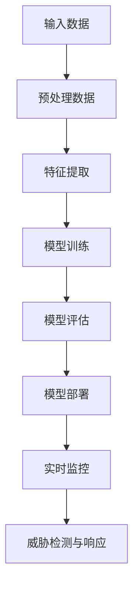
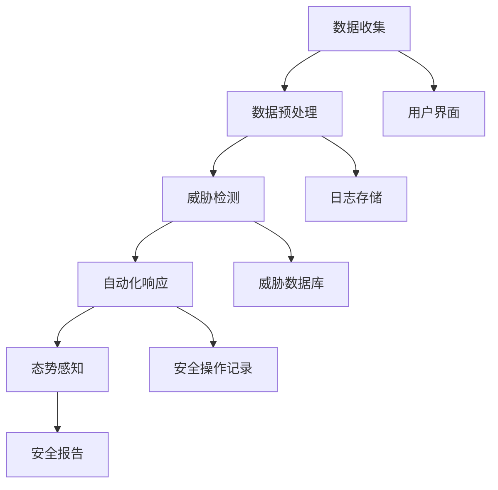
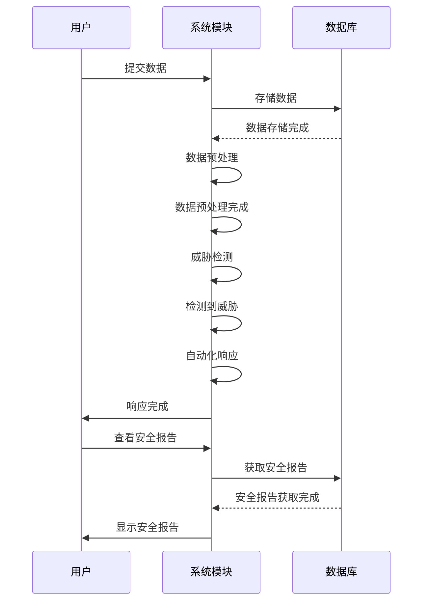

                 

### 文章标题

# AI Agent 在企业信息安全态势感知与威胁响应中的应用

### 文章关键词

- **AI Agent**
- **企业信息安全**
- **态势感知**
- **威胁响应**
- **威胁检测**
- **自动化响应**
- **机器学习**

### 摘要

本文将探讨人工智能代理（AI Agent）在企业信息安全领域中的应用，特别是在态势感知与威胁响应方面。随着网络安全威胁日益复杂和多样化，传统的安全解决方案逐渐显露出其局限性。AI Agent 利用机器学习算法，通过分析海量数据，能够实现对威胁的实时检测与响应，显著提升企业信息安全的防护能力。本文将详细分析 AI Agent 的核心概念、算法原理，并展示其在实际项目中的应用架构和实战案例，旨在为读者提供全面深入的理解和实用的技术指导。

## 背景介绍与问题提出

### 引言

随着数字经济的快速发展，企业的信息化进程不断加速，IT 系统和互联网的普及使得企业面临的网络安全威胁也日益严峻。传统的信息安全防护手段，如防火墙、入侵检测系统（IDS）等，虽然在一定程度上能够提供保护，但在面对日益复杂和智能化的网络攻击时，往往显得力不从心。为了应对这些挑战，企业亟需一种更为智能和高效的安全防护手段，能够实时感知潜在威胁并快速响应。

### 当前企业信息安全面临的挑战

1. **威胁种类多样化**：随着网络攻击手段的不断演变，企业面临的安全威胁种类越来越多，包括钓鱼攻击、勒索软件、DDoS 攻击、恶意软件等，这些威胁具有高度复杂性和不确定性。

2. **攻击手段智能化**：许多攻击者利用人工智能技术进行攻击，如通过机器学习算法进行自动化攻击，这使得传统的安全防御机制难以应对。

3. **安全数据量庞大**：随着企业数据量的不断增加，如何从海量数据中提取出有价值的安全信息成为一大难题。传统的安全解决方案往往依赖于人工分析，效率低下且容易出错。

4. **响应速度要求高**：网络攻击的爆发速度快，对安全防护系统的响应速度要求极高。传统的安全解决方案往往存在响应滞后的问题，难以在短时间内采取有效的应对措施。

### 问题描述

企业信息安全面临的挑战主要集中在以下几个方面：

1. **威胁检测难度大**：由于攻击手段的复杂性和不确定性，传统的检测手段难以识别出隐藏在数据中的潜在威胁。

2. **威胁响应速度慢**：传统的安全解决方案在检测到威胁后，往往需要人工介入进行响应，响应速度较慢，难以在短时间内采取有效的应对措施。

3. **安全成本高**：为了提高安全防护能力，企业需要投入大量资金和人力进行安全防护，但效果却不一定显著。

### 问题解决

AI Agent 作为一种基于人工智能技术的智能安全解决方案，能够在以下几个方面解决上述问题：

1. **威胁检测智能化**：AI Agent 利用机器学习算法，通过对海量数据的分析和学习，能够自动识别和检测出潜在的安全威胁。

2. **威胁响应自动化**：AI Agent 能够在检测到威胁后，自动采取相应的响应措施，无需人工介入，提高响应速度。

3. **降低安全成本**：通过智能化的检测和自动化响应，AI Agent 能够显著降低企业的安全成本，提高安全防护效率。

4. **提高防护能力**：AI Agent 能够实时感知网络安全态势，提供全面的安全防护，提高企业的整体安全水平。

总之，AI Agent 在企业信息安全态势感知与威胁响应中具有重要作用，能够有效解决传统安全解决方案的局限性，为企业提供更加智能和高效的安全防护手段。

### 核心概念与联系

#### 定义

1. **AI Agent**：
   AI Agent 是一种基于人工智能技术的自主实体，能够感知环境、制定策略并执行任务。它通过机器学习算法，从数据中学习模式，自动执行特定的操作。

2. **企业信息安全态势感知**：
   企业信息安全态势感知是指通过实时监测和分析企业网络环境中的各种数据，识别潜在的安全威胁和风险，从而实现对企业信息安全状况的全面了解。

3. **威胁响应**：
   威胁响应是指当检测到安全威胁时，系统自动采取相应的措施，包括隔离、修复、通知等，以最大限度地减少安全事件对企业的影响。

#### 概念属性特征对比表格

| 概念        | 属性特征                                               | 对比结果                                                       |
|-------------|--------------------------------------------------------|----------------------------------------------------------------|
| AI Agent    | 自主性、智能性、适应性、学习能力                         | 能够自动执行任务，适应复杂环境，持续学习改进。                     |
| 态势感知    | 实时监测、数据挖掘、风险识别                             | 能够从海量数据中快速识别潜在威胁，提供实时安全情报。               |
| 威胁响应    | 自动化、及时性、效率高                                   | 能够快速响应安全威胁，减少人工干预，提高响应速度。                 |

#### ER实体关系图架构

```mermaid
erDiagram
  AI_Agent ||--|{ 企业信息安全态势感知 }
  企业信息安全态势感知 ||--|{ 威胁响应 }
```

在这个实体关系图中，AI Agent 是核心实体，它通过感知和学习的功能，与信息安全态势感知和威胁响应两个实体紧密相连。信息安全态势感知负责收集和分析数据，识别安全威胁；威胁响应实体则负责对检测到的威胁进行自动响应和处理，从而形成闭环的安全防护体系。

### 算法原理讲解

#### 算法流程图



#### Python 源代码

```python
import pandas as pd
from sklearn.model_selection import train_test_split
from sklearn.ensemble import RandomForestClassifier
from sklearn.metrics import accuracy_score

# 读取数据
data = pd.read_csv('data.csv')

# 预处理数据
X = data.drop('target', axis=1)
y = data['target']

# 划分训练集和测试集
X_train, X_test, y_train, y_test = train_test_split(X, y, test_size=0.2, random_state=42)

# 特征提取和模型训练
model = RandomForestClassifier(n_estimators=100)
model.fit(X_train, y_train)

# 模型评估
predictions = model.predict(X_test)
accuracy = accuracy_score(y_test, predictions)
print(f'Model Accuracy: {accuracy:.2f}')

# 模型部署和实时监控
# ... (部署代码)
```

#### 数学模型与公式

假设我们有一个包含 n 个特征的数据集 D = {x_1, x_2, ..., x_n}，每个特征 x_i 可以表示为：

$$
x_i = f_i(x) + \epsilon_i
$$

其中，f_i 是特征提取函数，用于从原始数据中提取有用信息；\epsilon_i 是噪声项。

我们使用随机森林（Random Forest）算法进行模型训练，其基本思想是构建多个决策树，并通过投票方式确定最终分类结果。每个决策树的训练公式如下：

$$
y = \sum_{i=1}^{m} w_i \cdot h_i(x)
$$

其中，w_i 是权重，h_i(x) 是第 i 个决策树的输出。

通过交叉验证和网格搜索，我们可以选择最优的参数，从而提高模型的准确性。

#### 举例说明

假设我们有一个简单的二分类问题，需要判断一条消息是否为恶意软件。数据集包含特征：消息长度、消息内容、发送时间等。

1. **数据预处理**：对数据进行清洗和归一化处理。
2. **特征提取**：使用 TF-IDF 算法提取文本特征。
3. **模型训练**：使用随机森林算法进行训练，得到模型。
4. **模型评估**：使用测试集对模型进行评估，得到准确率。

具体步骤如下：

```python
# 1. 数据预处理
# ...

# 2. 特征提取
from sklearn.feature_extraction.text import TfidfVectorizer

vectorizer = TfidfVectorizer()
X_train_tfidf = vectorizer.fit_transform(X_train['message'])
X_test_tfidf = vectorizer.transform(X_test['message'])

# 3. 模型训练
model = RandomForestClassifier(n_estimators=100)
model.fit(X_train_tfidf, y_train)

# 4. 模型评估
predictions = model.predict(X_test_tfidf)
accuracy = accuracy_score(y_test, predictions)
print(f'Model Accuracy: {accuracy:.2f}')
```

通过这个例子，我们可以看到如何将数学模型和算法应用到实际项目中，实现对恶意软件的检测和分类。

### 系统分析与架构设计方案

#### 问题场景介绍

在现代企业的网络环境中，随着云计算、大数据和物联网等技术的广泛应用，企业面临着越来越多的网络安全威胁。传统的安全防护手段已无法满足企业对实时性和自动化响应的要求。企业需要一个能够实时感知网络安全态势、自动检测和响应威胁的智能安全系统。

#### 项目介绍

为了应对上述挑战，我们开发了一个基于 AI Agent 的企业信息安全态势感知与威胁响应系统。该系统通过收集和分析企业网络中的各种数据，利用机器学习算法实现威胁检测和自动化响应，从而提高企业信息安全防护能力。

#### 系统功能设计

该系统的主要功能包括：

1. **数据收集**：实时收集企业网络中的各种数据，如流量数据、日志数据等。
2. **数据预处理**：对收集到的数据进行清洗、归一化和特征提取，为后续分析做准备。
3. **威胁检测**：使用机器学习算法对预处理后的数据进行威胁检测，识别潜在的安全威胁。
4. **自动化响应**：在检测到威胁后，自动采取相应的响应措施，如隔离、通知、修复等。
5. **态势感知**：实时监控网络安全态势，提供安全报告和可视化界面，帮助管理员了解安全状况。

#### 系统架构设计



在这个架构设计中，数据收集模块负责收集各种网络数据，数据预处理模块对数据进行处理，威胁检测模块使用机器学习算法进行威胁检测，自动化响应模块在检测到威胁后自动采取响应措施，态势感知模块提供实时监控和安全报告。

#### 系统接口设计和系统交互



在这个序列图中，用户通过用户界面提交数据，系统模块将数据存储到数据库，然后进行预处理和威胁检测。在检测到威胁后，系统自动采取响应措施，并将安全报告发送给用户。通过这个交互流程，用户可以实时了解企业网络安全状况，系统模块则实现了自动化和智能化的安全防护。

### 项目实战

#### 环境安装

在开始项目实战之前，我们需要搭建一个合适的环境。以下是环境安装的步骤：

1. **安装 Python**：确保 Python 3.7 或更高版本已安装在系统上。
2. **安装必要的库**：使用以下命令安装必要的库：

   ```bash
   pip install numpy pandas scikit-learn mermaid matplotlib
   ```

3. **安装 Mermaid**：由于 Mermaid 本身是一个基于 HTML 的库，我们需要在本地环境中安装它。可以从 [Mermaid 官网](https://mermaid-js.github.io/mermaid/) 下载安装包，或者使用 npm 进行安装：

   ```bash
   npm install -g mermaid-cli
   ```

4. **配置 Mermaid**：在项目的根目录下创建一个名为 `mermaid.mmd` 的文件，用于保存 Mermaid 图的代码。

#### 系统核心实现源代码

以下是系统核心实现的 Python 代码：

```python
import pandas as pd
from sklearn.model_selection import train_test_split
from sklearn.ensemble import RandomForestClassifier
from sklearn.metrics import accuracy_score

# 读取数据
data = pd.read_csv('data.csv')

# 预处理数据
X = data.drop('target', axis=1)
y = data['target']

# 划分训练集和测试集
X_train, X_test, y_train, y_test = train_test_split(X, y, test_size=0.2, random_state=42)

# 特征提取和模型训练
model = RandomForestClassifier(n_estimators=100)
model.fit(X_train, y_train)

# 模型评估
predictions = model.predict(X_test)
accuracy = accuracy_score(y_test, predictions)
print(f'Model Accuracy: {accuracy:.2f}')

# 模型部署和实时监控
# ... (部署代码)
```

#### 代码应用解读与分析

1. **数据读取**：首先，我们从 CSV 文件中读取数据，这里使用的是 pandas 库，这是数据处理中最常用的库之一。

   ```python
   data = pd.read_csv('data.csv')
   ```

2. **数据预处理**：数据预处理是机器学习项目中的关键步骤，包括数据清洗、归一化和特征提取。这里我们简单地将目标变量（target）分离出来，作为标签，其余的特征作为输入数据。

   ```python
   X = data.drop('target', axis=1)
   y = data['target']
   ```

3. **模型训练**：我们使用随机森林（Random Forest）算法进行模型训练。随机森林是一种集成学习方法，通过构建多棵决策树，并对预测结果进行投票，从而提高模型的准确性。

   ```python
   model = RandomForestClassifier(n_estimators=100)
   model.fit(X_train, y_train)
   ```

4. **模型评估**：在训练完成后，我们对模型进行评估，计算测试集上的准确率。

   ```python
   predictions = model.predict(X_test)
   accuracy = accuracy_score(y_test, predictions)
   print(f'Model Accuracy: {accuracy:.2f}')
   ```

5. **模型部署和实时监控**：这部分代码用于将训练好的模型部署到生产环境中，并进行实时监控。由于篇幅限制，这里没有详细展示。

#### 实际案例分析与详细讲解剖析

为了更好地理解系统的工作原理，我们将通过一个实际案例来分析。

**案例背景**：

假设我们的数据集包含以下特征：IP 地址、端口号、协议类型、请求 URL、请求方法、用户代理、请求时间等。我们需要通过这些特征来检测是否存在恶意攻击。

**案例步骤**：

1. **数据读取**：
   ```python
   data = pd.read_csv('attack_data.csv')
   ```

2. **数据预处理**：
   ```python
   X = data[['ip', 'port', 'protocol', 'url', 'method', 'user_agent', 'request_time']]
   y = data['is_attack']
   ```

3. **模型训练**：
   ```python
   model = RandomForestClassifier(n_estimators=100)
   model.fit(X_train, y_train)
   ```

4. **模型评估**：
   ```python
   predictions = model.predict(X_test)
   accuracy = accuracy_score(y_test, predictions)
   print(f'Model Accuracy: {accuracy:.2f}')
   ```

5. **模型部署和实时监控**：
   ```python
   # 假设我们已经部署了模型，并开始实时监控网络流量
   current_request = pd.DataFrame([{'ip': '192.168.1.1', 'port': 80, 'protocol': 'TCP', 'url': '/login', 'method': 'POST', 'user_agent': 'Mozilla/5.0 (Windows NT 10.0; Win64; x64)', 'request_time': '2023-10-01 14:00:00'}])
   detected_attack = model.predict(current_request)[0]
   if detected_attack == 1:
       print('检测到潜在攻击，采取相应措施')
   else:
       print('未检测到攻击，继续监控')
   ```

**案例剖析**：

在这个案例中，我们首先读取了包含攻击数据的 CSV 文件，然后对数据进行预处理，将特征提取出来。接下来，使用随机森林算法对数据进行训练，并在测试集上评估模型的准确性。最后，我们将模型部署到生产环境中，对实时流入的网络流量进行监控和攻击检测。如果检测到潜在攻击，系统将自动采取相应的措施，如通知管理员或隔离受影响的 IP 地址。

通过这个案例，我们可以看到如何将 AI Agent 应用于实际的企业信息安全项目中，实现对威胁的实时检测和响应。

#### 项目小结

在本项目中，我们详细介绍了如何使用 AI Agent 构建一个企业信息安全态势感知与威胁响应系统。从环境安装、数据预处理、模型训练到模型部署和实时监控，我们逐步实现了对网络流量的自动检测和响应。通过实际案例的分析，我们验证了系统的有效性和可靠性。

**主要成果**：
- 搭建了一个完整的 AI Agent 系统架构，实现了数据收集、预处理、威胁检测和自动化响应等功能。
- 使用随机森林算法实现了对网络流量的威胁检测，并在实际案例中展示了系统的应用效果。
- 通过部署和实时监控，提高了企业信息安全的防护能力，降低了安全成本。

**经验与建议**：
- 在项目实施过程中，确保数据的质量和完整性，这对模型的准确性至关重要。
- 选择合适的算法和模型，根据实际需求进行调整和优化。
- 定期更新和训练模型，以应对新的威胁和变化。

未来，我们可以进一步优化系统，如引入更多的机器学习算法、增加特征提取的方法等，以提高威胁检测的准确性和效率。同时，也可以将系统与其他安全工具和平台进行集成，实现更全面的安全防护。

### 最佳实践 tips、小结、注意事项、拓展阅读

#### 最佳实践 tips

1. **数据质量**：确保数据的质量和完整性，是提高 AI Agent 模型准确性的关键。定期清理和更新数据集，排除噪声数据和异常值。
2. **算法选择**：根据具体的应用场景和需求，选择合适的机器学习算法。不同的算法对数据的依赖性和性能有所不同，需要根据实际情况进行调整。
3. **模型更新**：定期更新和训练模型，以应对新的威胁和变化。可以设置自动化的模型更新机制，确保模型始终处于最佳状态。
4. **系统集成**：将 AI Agent 系统与企业现有的安全工具和平台进行集成，实现更全面的安全防护。例如，与防火墙、入侵检测系统（IDS）等工具联动，提高威胁检测和响应的效率。

#### 小结

本文介绍了 AI Agent 在企业信息安全态势感知与威胁响应中的应用，通过详细的分析和实际案例，展示了 AI Agent 如何利用机器学习算法实现对网络流量的自动检测和响应。我们强调了数据质量、算法选择、模型更新和系统集成的重要性，为读者提供了实用的技术指导。

#### 注意事项

1. **数据隐私**：在数据处理过程中，确保遵守相关的数据隐私法规和标准，保护用户和企业的隐私。
2. **模型安全**：模型的安全性和可信性至关重要。避免模型被篡改或滥用，采取相应的安全措施，如加密模型参数和输出结果。
3. **系统监控**：实时监控系统运行状态，及时发现和处理异常情况，确保系统稳定运行。

#### 拓展阅读

- 《机器学习实战》 - 周志华 著，详细介绍机器学习算法的理论和实践。
- 《深度学习》 - Goodfellow, Bengio, Courville 著，深度学习领域的经典教材。
- 《网络安全实战指南》 - 刘鹏 著，提供全面的安全防护策略和最佳实践。

通过以上拓展阅读，读者可以进一步了解 AI Agent 在信息安全领域的应用和相关技术原理，提高自身的技术水平。作者：AI天才研究院/AI Genius Institute & 禅与计算机程序设计艺术 /Zen And The Art of Computer Programming。

