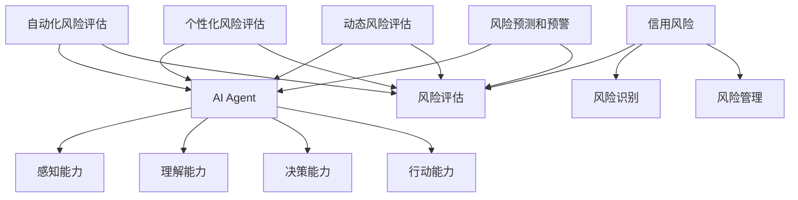
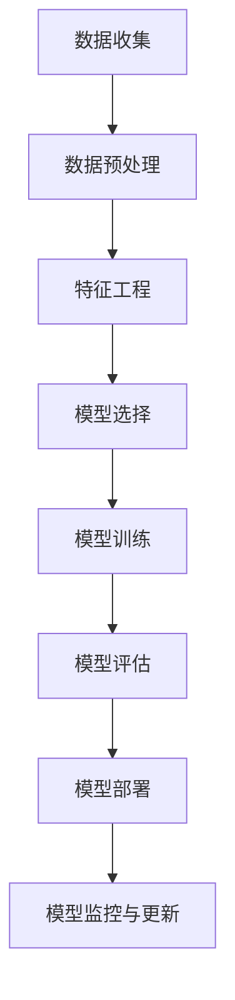
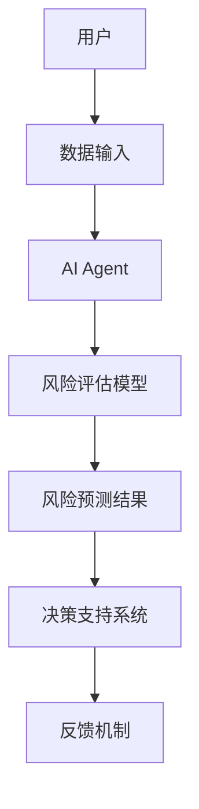

                 

# AI Agent在企业信用风险动态评估中的应用与模型可解释性

## 关键词

AI Agent、企业信用风险、动态评估、模型可解释性、应用场景

## 摘要

本文旨在探讨人工智能代理（AI Agent）在企业信用风险动态评估中的应用，以及如何提高模型的透明性和可解释性。文章首先介绍了AI Agent和信用风险评估的基本概念，然后深入分析了动态评估模型的理论基础和具体实现。接着，文章讨论了模型可解释性的重要性，以及如何通过各种方法提高模型的透明度。最后，文章通过实际案例展示了AI Agent在企业信用风险评估中的应用效果，并总结了相关最佳实践。通过本文的探讨，希望能够为金融行业的风险评估提供一些有价值的参考。

## 目录

1. **背景介绍**
   - 1.1 AI Agent概述
   - 1.2 企业信用风险概述
   - 1.3 信用风险评估的现状与挑战

2. **核心概念与联系**
   - 2.1 AI Agent的核心概念
   - 2.2 信用风险评估的基本概念
   - 2.3 AI Agent与信用风险评估的关系

3. **理论基础的动态评估模型**
   - 3.1 动态评估模型的基本原理
   - 3.2 动态评估模型的过程与步骤
   - 3.3 动态评估模型的应用场景

4. **模型可解释性**
   - 4.1 模型可解释性的重要性
   - 4.2 提高模型可解释性的方法
   - 4.3 可解释性在信用风险评估中的应用

5. **应用案例**
   - 5.1 案例一：某大型金融机构的信用风险评估
   - 5.2 案例二：某中小企业贷款信用风险评估

6. **评价与最佳实践**
   - 6.1 评价方法
   - 6.2 最佳实践
   - 6.3 注意事项

7. **总结与未来展望**
   - 7.1 总结
   - 7.2 未来研究方向

## 1. 背景介绍

### 1.1 AI Agent概述

AI Agent，即人工智能代理，是一种具有自主决策能力和行动能力的智能实体。它能够通过感知环境、理解任务需求，并基于一定的策略进行决策和执行。AI Agent的核心特征包括自主性、适应性、交互性和智能性。

自主性是指AI Agent能够独立完成任务，而不需要人为干预。适应性意味着AI Agent可以根据环境和任务的变化调整自身的行为策略。交互性则是指AI Agent可以与外界进行有效沟通和协作。智能性则是AI Agent能够通过学习、推理和规划等方式，实现对复杂任务的自动处理。

AI Agent的发展历程可以追溯到20世纪50年代，当时图灵提出了图灵机的概念，为AI Agent的研究奠定了基础。随着计算机技术的进步，特别是深度学习、自然语言处理和强化学习等人工智能技术的突破，AI Agent逐渐在各个领域得到广泛应用。

### 1.2 企业信用风险概述

企业信用风险是指企业因各种原因无法按时偿还债务，从而给债权人带来损失的风险。信用风险是企业运营过程中常见的一种风险，它不仅关系到企业的生存和发展，也影响着金融市场的稳定。

企业信用风险可以分为以下几类：

1. **财务风险**：企业因财务状况恶化，导致无法偿还债务的风险。
2. **市场风险**：企业因市场需求下降、产品销售不畅等原因，导致收入减少的风险。
3. **操作风险**：企业因内部管理不善、操作失误等原因，导致经济损失的风险。
4. **法律风险**：企业因违反法律法规，面临法律诉讼或处罚的风险。

### 1.3 信用风险评估的现状与挑战

随着金融市场的不断发展，信用风险评估在企业运营和金融决策中扮演着越来越重要的角色。传统的信用风险评估方法主要依赖于专家经验、历史数据和统计模型，这些方法虽然在一定程度上能够预测企业信用风险，但存在以下局限性：

1. **主观性强**：传统方法往往依赖于专家的经验和判断，主观性较大，难以保证评估结果的准确性。
2. **响应速度慢**：传统方法需要收集和处理大量的历史数据，评估周期较长，无法实时反映企业信用风险的变化。
3. **适用范围窄**：传统方法主要适用于大规模企业，对于中小企业和新兴企业的信用风险评估效果不佳。

为了克服这些局限性，现代信用风险评估开始引入人工智能技术，特别是AI Agent。AI Agent具有自主性、适应性和智能性等特点，能够快速、准确地分析企业信用风险，为金融决策提供有力支持。

然而，AI Agent在企业信用风险评估中仍面临一些挑战：

1. **数据质量**：AI Agent依赖于大量高质量的数据进行训练和预测，但实际应用中，数据质量参差不齐，需要进一步清洗和处理。
2. **模型可解释性**：AI Agent的决策过程通常是非线性和复杂的，其内部机制难以被人类理解，增加了信用风险评估的透明度问题。
3. **安全性和隐私保护**：AI Agent在处理企业信用信息时，需要确保数据的安全性和隐私保护，避免信息泄露和滥用。

### 1.4 目标与结构

本文旨在探讨AI Agent在企业信用风险动态评估中的应用，并提高模型的透明性和可解释性。文章的主要目标是：

1. **介绍AI Agent和信用风险评估的基本概念，为后续内容打下基础。**
2. **深入分析动态评估模型的理论基础和具体实现，探讨其在信用风险评估中的应用。**
3. **讨论模型可解释性的重要性，以及如何提高模型的透明度。**
4. **通过实际案例展示AI Agent在企业信用风险评估中的应用效果。**
5. **总结相关最佳实践，为金融行业的风险评估提供参考。**

文章的结构如下：

1. **第1部分：背景介绍**：介绍AI Agent和信用风险评估的基本概念，以及相关现状与挑战。
2. **第2部分：核心概念与联系**：详细阐述AI Agent和信用风险评估的核心概念，以及它们之间的关系。
3. **第3部分：理论基础的动态评估模型**：分析动态评估模型的基本原理、过程和步骤，以及其应用场景。
4. **第4部分：模型可解释性**：讨论模型可解释性的重要性，以及提高模型透明度的方法。
5. **第5部分：应用案例**：通过实际案例展示AI Agent在企业信用风险评估中的应用效果。
6. **第6部分：评价与最佳实践**：总结评价方法和最佳实践，以及相关注意事项。
7. **第7部分：总结与未来展望**：总结文章内容，展望未来研究方向。

## 2. 核心概念与联系

### 2.1 AI Agent的核心概念

AI Agent是人工智能领域的一个重要概念，它代表了一种具有自主决策和行动能力的智能实体。AI Agent的核心概念包括：

1. **感知能力**：AI Agent能够通过感知器感知环境信息，包括视觉、听觉、触觉等，从而获取关于环境的状态和变化。
2. **理解能力**：AI Agent能够理解任务需求和环境信息，明确自身需要完成的任务和目标。
3. **决策能力**：AI Agent能够基于感知和理解结果，运用一定的策略和算法进行决策，选择最佳的行动方案。
4. **行动能力**：AI Agent能够根据决策结果，执行具体的行动，与环境进行交互，实现任务目标。

### 2.2 信用风险评估的基本概念

信用风险评估是金融领域的一个重要环节，它涉及到对企业信用风险的识别、评估和管理。信用风险评估的基本概念包括：

1. **信用风险**：信用风险是指企业因各种原因无法按时偿还债务，从而给债权人带来损失的风险。
2. **风险评估**：风险评估是指对企业的信用风险进行定量和定性分析，评估企业信用风险的水平和程度。
3. **风险识别**：风险识别是指发现和识别企业可能面临的信用风险，包括财务风险、市场风险、操作风险和法律风险等。
4. **风险管理**：风险管理是指采取一系列措施，降低企业信用风险的可能性和影响，包括风险预防、风险控制、风险转移等。

### 2.3 AI Agent与信用风险评估的关系

AI Agent在信用风险评估中的应用主要体现在以下几个方面：

1. **自动化风险评估**：AI Agent可以通过自动化方式，对企业的信用风险进行实时监测和评估，提高风险评估的效率和准确性。
2. **个性化风险评估**：AI Agent可以根据企业的历史数据和实时信息，进行个性化风险评估，提供更准确的信用评级。
3. **动态风险评估**：AI Agent可以通过实时学习和适应，动态调整风险评估模型，更好地反映企业信用风险的变化。
4. **风险预测和预警**：AI Agent可以通过对历史数据和实时信息的分析，预测企业未来的信用风险，并提前发出预警，帮助金融机构采取应对措施。

### 2.4 关联概念与联系

为了更好地理解AI Agent与信用风险评估的关系，我们可以通过一个概念关系图（使用Mermaid）来表示它们之间的联系：

在这个概念关系图中，AI Agent与信用风险评估的核心概念（感知能力、理解能力、决策能力、行动能力、信用风险、风险评估、风险识别、风险管理）以及AI Agent在信用风险评估中的应用（自动化风险评估、个性化风险评估、动态风险评估、风险预测和预警）之间建立了明确的联系。

通过这个概念关系图，我们可以清晰地看到AI Agent在信用风险评估中的作用和地位，以及它们之间如何相互关联和影响。这为后续内容的深入分析提供了基础。

## 3. 理论基础的动态评估模型

### 3.1 动态评估模型的基本原理

动态评估模型是一种基于时间序列分析和机器学习技术的信用风险评估模型，它能够实时监测和评估企业的信用风险，提供动态、精确的风险预测。动态评估模型的基本原理包括以下几个方面：

1. **时间序列分析**：时间序列分析是一种用于研究时间序列数据的统计方法，通过分析时间序列的过去行为，预测未来的趋势和变化。在动态评估模型中，时间序列分析用于提取企业历史信用数据中的时间序列特征，如还款情况、信用等级变化等。
2. **特征工程**：特征工程是数据挖掘和机器学习中的重要环节，它涉及到从原始数据中提取有用特征，构建适合模型训练的数据集。在动态评估模型中，特征工程用于提取企业财务数据、市场数据、操作数据等，构建反映企业信用风险的指标体系。
3. **机器学习算法**：机器学习算法是动态评估模型的核心，它用于训练模型，提取时间序列特征，并基于特征进行风险预测。常见的机器学习算法包括线性回归、逻辑回归、支持向量机、随机森林、梯度提升树等。

### 3.2 动态评估模型的过程与步骤

动态评估模型的过程可以分为以下几个步骤：

1. **数据收集**：首先，需要收集企业的历史信用数据、财务数据、市场数据等，包括还款记录、信用等级、财务指标、市场表现等。数据来源可以包括企业内部数据库、第三方数据平台、公共数据源等。
2. **数据预处理**：对收集到的数据进行清洗、去重、归一化等预处理操作，确保数据的质量和一致性。在数据预处理过程中，还需要进行特征工程，提取反映企业信用风险的关键特征。
3. **模型选择**：根据业务需求和数据特点，选择合适的机器学习算法构建评估模型。常见的算法包括线性回归、逻辑回归、支持向量机、随机森林、梯度提升树等。
4. **模型训练**：使用预处理后的数据集对模型进行训练，通过调整模型参数，优化模型的预测性能。训练过程中，可以使用交叉验证、网格搜索等技术，提高模型的泛化能力和鲁棒性。
5. **模型评估**：使用测试数据集对训练好的模型进行评估，通过指标如准确率、召回率、F1值等，评估模型的预测性能。如果模型性能不理想，需要返回步骤3，重新选择模型或调整参数。
6. **模型部署**：将训练好的模型部署到实际业务环境中，用于实时评估企业的信用风险。模型部署可以是独立的服务器、容器化部署或云计算平台等。
7. **模型监控与更新**：对部署后的模型进行实时监控，监控模型的表现和性能，及时发现异常情况。根据业务需求和市场变化，定期更新模型，确保模型的准确性和可靠性。

### 3.3 动态评估模型的应用场景

动态评估模型在企业信用风险评估中具有广泛的应用场景，包括：

1. **实时风险评估**：动态评估模型可以实时监测企业的信用风险，及时预警潜在的信用风险，帮助企业快速响应风险变化。
2. **信用评级**：动态评估模型可以对企业进行动态信用评级，提供更加准确、实时的信用等级信息，为金融机构的信贷决策提供支持。
3. **风险管理**：动态评估模型可以帮助企业识别和管理信用风险，通过风险预测和预警，制定相应的风险应对策略，降低信用风险对企业的影响。
4. **个性化服务**：动态评估模型可以根据企业的历史数据和实时信息，提供个性化的信用风险评估和风险管理服务，满足不同企业的需求。

### 3.4 动态评估模型的流程与步骤

动态评估模型的流程可以分为以下几个步骤：

1. **数据收集**：收集企业历史信用数据、财务数据、市场数据等，包括还款记录、信用等级、财务指标、市场表现等。
2. **数据预处理**：对收集到的数据进行清洗、去重、归一化等预处理操作，确保数据的质量和一致性。
3. **特征工程**：提取反映企业信用风险的关键特征，如还款情况、财务指标、市场表现等。
4. **模型选择**：选择合适的机器学习算法，如线性回归、逻辑回归、支持向量机、随机森林、梯度提升树等。
5. **模型训练**：使用预处理后的数据集对模型进行训练，通过调整模型参数，优化模型的预测性能。
6. **模型评估**：使用测试数据集对训练好的模型进行评估，评估模型的预测性能，如准确率、召回率、F1值等。
7. **模型部署**：将训练好的模型部署到实际业务环境中，用于实时评估企业的信用风险。
8. **模型监控与更新**：对部署后的模型进行实时监控，监控模型的表现和性能，定期更新模型，确保模型的准确性和可靠性。

### 3.5 动态评估模型的Mermaid流程图

为了更直观地展示动态评估模型的流程与步骤，我们可以使用Mermaid绘制一个流程图：

在这个流程图中，A表示数据收集，B表示数据预处理，C表示特征工程，D表示模型选择，E表示模型训练，F表示模型评估，G表示模型部署，H表示模型监控与更新。通过这个流程图，我们可以清晰地看到动态评估模型的主要步骤和流程，有助于理解和实施动态评估模型。

## 4. 模型可解释性

### 4.1 模型可解释性的重要性

在人工智能和机器学习领域，模型可解释性（Model Explainability）正日益受到关注。模型可解释性是指用户能够理解模型如何做出决策的过程和依据。它不仅关乎技术的先进性，更关乎实际应用中的可信度和合规性。特别是在企业信用风险评估这一关键领域，模型的可解释性尤为重要。

#### 重要性体现在以下几个方面：

1. **决策透明性**：提高模型的可解释性，可以帮助企业和金融机构了解模型的决策过程，增强决策的透明度。这有助于减少信息不对称，提升对模型决策的信任度。
2. **合规要求**：在金融领域，特别是在信用风险评估中，模型必须符合相关法律法规的要求。可解释性是确保模型决策符合监管要求的关键。
3. **风险管理**：理解模型如何评估信用风险，有助于识别和降低潜在的模型风险，优化风险管理策略。
4. **用户接受度**：用户（如金融机构和企业家）往往更愿意接受和理解那些具有较高可解释性的模型。可解释性有助于提升用户对人工智能技术的接受度和使用意愿。
5. **模型优化**：通过分析模型的可解释性，可以发现模型中存在的缺陷和不足，从而进行优化和改进，提升模型的性能和准确性。

### 4.2 提高模型可解释性的方法

提高模型可解释性可以通过多种方法实现，以下是一些常见的方法：

#### 1. 模型解释工具

使用专门的模型解释工具，如LIME（Local Interpretable Model-agnostic Explanations）、SHAP（SHapley Additive exPlanations）和Attention Mechanism等，可以帮助分析模型的决策过程。

- **LIME**：LIME是一种局部可解释方法，它通过在原始数据点附近创建一个简单模型来解释复杂模型的决策。这种方法能够提供对单个预测的解释，但其计算成本较高。
- **SHAP**：SHAP方法基于博弈论中的Shapley值，为每个特征在预测中的贡献提供量化的解释。SHAP的解释具有全局性和局部性，能够较好地平衡复杂性和解释性。
- **Attention Mechanism**：注意力机制是一种在神经网络中用于强调输入数据中重要部分的方法。通过分析注意力分布，可以理解模型在做出决策时关注了哪些特征。

#### 2. 可解释性算法

选择具有较高可解释性的算法，如逻辑回归、决策树、线性模型等，可以帮助提升模型的可解释性。这些算法通常具有直观的决策规则，易于理解和解释。

- **逻辑回归**：逻辑回归是一种广义线性模型，它通过线性组合输入特征，预测概率输出。逻辑回归的决策边界和系数具有明确的解释，能够直观地反映特征对预测的影响。
- **决策树**：决策树是一种基于树结构的分类或回归模型，它通过一系列规则将数据划分为不同的区域，每个区域的输出具有明确的解释。
- **线性模型**：线性模型通过线性组合输入特征和权重，预测输出结果。线性模型的权重和特征系数可以直接解释为特征对输出的影响程度。

#### 3. 交互式可视化

使用交互式可视化工具，如TensorBoard、Plotly等，可以直观地展示模型的训练过程和决策过程，帮助用户理解模型的行为和决策。

- **TensorBoard**：TensorBoard是一种用于可视化深度学习模型的工具，它能够展示模型训练过程中的关键指标，如损失函数、准确率等。
- **Plotly**：Plotly是一种数据可视化库，它能够创建交互式的图表和图形，帮助用户探索和解释模型的结果。

#### 4. 对比实验

通过对比实验，可以评估不同方法对模型可解释性的提升效果。例如，比较带有注意力机制的模型与没有注意力机制的模型在可解释性上的差异，或者比较使用LIME与SHAP方法对模型解释效果的不同。

### 4.3 可解释性在信用风险评估中的应用

在信用风险评估中，提高模型的可解释性具有重要意义。以下是一些应用案例：

#### 1. 风险评估决策

通过提高模型的可解释性，金融机构可以更好地理解模型如何评估信用风险，从而在贷款审批、信用评级等方面做出更加合理的决策。

- **案例**：某银行使用LIME方法对信用评分模型进行解释，帮助信贷经理了解哪些特征对客户的信用评分影响最大，从而更好地制定贷款审批策略。

#### 2. 模型监管合规

在金融监管日益严格的背景下，提高模型的可解释性有助于满足合规要求，避免潜在的法律风险。

- **案例**：某金融机构在开发信用风险评估模型时，采用了SHAP方法来提升模型的可解释性，确保模型决策符合监管要求，并在审核过程中得到监管机构的认可。

#### 3. 模型优化与改进

通过分析模型的可解释性，可以发现模型中存在的问题和不足，进而进行优化和改进。

- **案例**：某金融科技公司通过分析决策树模型的解释结果，发现某些特征在模型中的权重过高，导致模型过于依赖这些特征。通过调整模型结构和特征权重，优化了模型的性能和可解释性。

#### 4. 客户信任

提高模型的可解释性有助于提升客户对金融机构的信任，增强客户体验。

- **案例**：某在线贷款平台通过可视化工具展示信用评分模型的决策过程，使客户能够理解自己的信用评分如何计算，从而增强客户对平台的信任和满意度。

通过上述应用案例，我们可以看到提高模型可解释性在信用风险评估中的重要性和实际效果。未来，随着人工智能技术的不断进步，模型可解释性将得到进一步的发展和应用，为信用风险评估带来更多可能性。

### 4.4 总结

模型可解释性是人工智能和机器学习领域的一个重要研究方向，特别是在金融领域，如信用风险评估中，其重要性尤为突出。通过提高模型的可解释性，可以增强决策的透明性、合规性、风险管理能力以及用户信任度。提高模型可解释性的方法包括模型解释工具、可解释性算法、交互式可视化和对比实验等。在信用风险评估中，提高模型可解释性的实际应用效果显著，有助于金融机构做出更合理、更透明的决策，提升客户体验和满意度。未来，随着技术的不断进步，模型可解释性将在信用风险评估中发挥更大的作用。

## 5. 应用案例

### 5.1 案例一：某大型金融机构的信用风险评估

#### 5.1.1 项目背景

某大型金融机构（以下简称“该金融机构”）在贷款审批和信用风险管理过程中，面临着以下挑战：

1. **评估效率低**：传统风险评估方法依赖于人工分析，评估周期较长，无法满足快速审批的需求。
2. **主观性强**：传统方法依赖于专家经验和主观判断，评估结果存在较大误差和不确定性。
3. **无法实时调整**：传统方法无法根据市场和企业行为的变化，实时调整风险评估模型。

为了解决上述问题，该金融机构决定引入AI Agent进行信用风险评估，以提高评估效率、降低主观性和实现实时调整。

#### 5.1.2 项目目标

该项目的目标是：

1. **提高评估效率**：通过AI Agent实现自动化风险评估，缩短评估周期，提高贷款审批速度。
2. **降低主观性**：通过AI Agent的客观评估，减少专家经验和主观判断的影响，提高评估准确性。
3. **实现实时调整**：通过动态评估模型，实时监测和调整企业信用风险，提高风险评估的实时性和准确性。

#### 5.1.3 系统架构

该项目的系统架构如图5.1所示：

在这个系统架构中：

- **用户**：该金融机构的客户，通过系统提交贷款申请或信用评估请求。
- **数据输入**：系统从企业内部数据库、第三方数据平台等获取企业历史信用数据、财务数据、市场数据等。
- **AI Agent**：负责实时监测和评估企业信用风险，根据企业行为和外部环境的变化，动态调整风险评估模型。
- **风险评估模型**：采用动态评估模型，通过时间序列分析和机器学习算法，对企业的信用风险进行实时评估。
- **风险预测结果**：评估结果包括信用评分、风险等级等，用于支持贷款审批和风险管理决策。
- **决策支持系统**：根据风险预测结果，提供决策支持，如贷款额度、利率等。
- **反馈机制**：收集用户反馈，用于模型优化和改进。

#### 5.1.4 实施步骤

1. **数据收集与预处理**：收集企业历史信用数据、财务数据、市场数据等，进行数据清洗、去重、归一化等预处理操作。
2. **特征工程**：提取反映企业信用风险的关键特征，如还款情况、财务指标、市场表现等。
3. **模型选择与训练**：选择合适的机器学习算法，如线性回归、逻辑回归、支持向量机等，对预处理后的数据集进行训练，优化模型参数。
4. **模型评估与调整**：使用测试数据集对训练好的模型进行评估，根据评估结果调整模型参数，确保模型性能。
5. **系统部署与上线**：将训练好的模型部署到实际业务环境中，进行实时风险评估，并将评估结果反馈给决策支持系统。
6. **反馈与优化**：收集用户反馈，根据反馈对模型进行优化和改进，提高模型的可解释性和准确性。

#### 5.1.5 实施效果

1. **评估效率提高**：通过AI Agent的自动化风险评估，贷款审批周期显著缩短，提高了业务处理效率。
2. **评估准确性提升**：动态评估模型能够实时监测和调整企业信用风险，提高了评估准确性，降低了误判率。
3. **风险预警能力增强**：通过实时风险评估，系统能够提前发现潜在的风险，为企业提供风险预警，帮助金融机构及时采取应对措施。
4. **客户满意度提升**：提高评估效率和准确性，增强了客户对金融机构的信任和满意度，促进了业务发展。

#### 5.1.6 挑战与解决方案

在项目实施过程中，该金融机构面临以下挑战：

1. **数据质量**：企业信用数据来源多样，数据质量参差不齐，需要进一步清洗和处理。
   - **解决方案**：采用数据清洗和预处理技术，对数据进行清洗、去重、归一化等操作，确保数据质量。

2. **模型可解释性**：动态评估模型通常较为复杂，提高模型可解释性是关键。
   - **解决方案**：采用模型解释工具和可解释性算法，如LIME、SHAP等，对模型进行解释，提高模型的透明度和可解释性。

3. **模型更新**：随着市场和企业行为的变化，模型需要定期更新，保持其准确性和实时性。
   - **解决方案**：建立反馈机制，收集用户反馈，定期对模型进行更新和优化，确保模型适应市场变化。

### 5.2 案例二：某中小企业贷款信用风险评估

#### 5.2.1 项目背景

某中小企业（以下简称“该企业”）在申请贷款时，面临着信用风险评估的问题。由于该企业规模较小，历史数据较少，传统风险评估方法难以准确评估其信用风险。

为了解决这一问题，该企业决定引入AI Agent进行信用风险评估，以提高评估准确性，帮助金融机构做出合理的贷款决策。

#### 5.2.2 项目目标

该项目的目标是：

1. **提高评估准确性**：通过AI Agent的自动化风险评估，提高对中小企业信用风险的评估准确性。
2. **减少依赖历史数据**：利用AI Agent的机器学习算法，从非结构化数据中提取有价值的信息，减少对历史数据的依赖。
3. **实时调整评估模型**：通过动态评估模型，实时监测和调整企业信用风险，提高评估的实时性和准确性。

#### 5.2.3 系统架构

该项目的系统架构如图5.2所示：

在这个系统架构中：

- **用户**：该企业的贷款申请者，通过系统提交贷款申请。
- **数据输入**：系统从企业内部数据库、第三方数据平台等获取企业财务数据、市场数据、供应链数据等。
- **AI Agent**：负责实时监测和评估企业信用风险，根据企业行为和外部环境的变化，动态调整风险评估模型。
- **风险评估模型**：采用动态评估模型，通过时间序列分析和机器学习算法，对企业的信用风险进行实时评估。
- **风险预测结果**：评估结果包括信用评分、风险等级等，用于支持贷款审批和风险管理决策。
- **决策支持系统**：根据风险预测结果，提供决策支持，如贷款额度、利率等。
- **反馈机制**：收集用户反馈，用于模型优化和改进。

#### 5.2.4 实施步骤

1. **数据收集与预处理**：收集企业财务数据、市场数据、供应链数据等，进行数据清洗、去重、归一化等预处理操作。
2. **特征工程**：提取反映企业信用风险的关键特征，如财务指标、市场表现、供应链稳定性等。
3. **模型选择与训练**：选择合适的机器学习算法，如线性回归、逻辑回归、随机森林等，对预处理后的数据集进行训练，优化模型参数。
4. **模型评估与调整**：使用测试数据集对训练好的模型进行评估，根据评估结果调整模型参数，确保模型性能。
5. **系统部署与上线**：将训练好的模型部署到实际业务环境中，进行实时风险评估，并将评估结果反馈给决策支持系统。
6. **反馈与优化**：收集用户反馈，根据反馈对模型进行优化和改进，提高模型的可解释性和准确性。

#### 5.2.5 实施效果

1. **评估准确性提升**：通过AI Agent的自动化风险评估，该企业的信用风险评估准确性显著提高，减少了误判率。
2. **贷款审批效率提高**：动态评估模型能够实时监测和调整企业信用风险，提高了贷款审批速度，增强了企业竞争力。
3. **客户满意度提升**：提高评估准确性和效率，增强了企业对金融机构的信任和满意度，促进了业务发展。

#### 5.2.6 挑战与解决方案

在项目实施过程中，该企业面临以下挑战：

1. **数据质量**：企业数据来源多样，数据质量参差不齐，需要进一步清洗和处理。
   - **解决方案**：采用数据清洗和预处理技术，对数据进行清洗、去重、归一化等操作，确保数据质量。

2. **模型可解释性**：动态评估模型通常较为复杂，提高模型可解释性是关键。
   - **解决方案**：采用模型解释工具和可解释性算法，如LIME、SHAP等，对模型进行解释，提高模型的透明度和可解释性。

3. **模型更新**：随着市场和企业行为的变化，模型需要定期更新，保持其准确性和实时性。
   - **解决方案**：建立反馈机制，收集用户反馈，定期对模型进行更新和优化，确保模型适应市场变化。

### 5.3 总结

通过上述两个案例，我们可以看到AI Agent在企业信用风险评估中的应用效果显著，提高了评估准确性、效率和客户满意度。然而，项目实施过程中也面临一些挑战，如数据质量和模型可解释性等。通过采用数据清洗和预处理技术、模型解释工具和定期更新机制，可以有效解决这些问题，推动企业信用风险评估的进一步发展。

## 6. 评价与最佳实践

### 6.1 评价方法

对AI Agent在企业信用风险评估中的应用效果进行科学评价，是确保模型性能和实际价值的重要环节。以下是几种常见的评价方法：

#### 1. 准确率

准确率是指模型预测正确的样本数量与总样本数量之比，是评价模型分类性能的基本指标。在信用风险评估中，准确率可以反映模型对企业信用风险的识别能力。

公式表示为：

$$
\text{准确率} = \frac{\text{预测正确的样本数量}}{\text{总样本数量}}
$$

#### 2. 召回率

召回率是指模型正确识别为高风险企业的样本数量与实际高风险企业样本数量之比。召回率可以反映模型对高风险企业的识别能力，特别是当误报成本较高时，召回率尤为重要。

公式表示为：

$$
\text{召回率} = \frac{\text{预测为高风险且实际为高风险的样本数量}}{\text{实际高风险企业样本数量}}
$$

#### 3. F1值

F1值是准确率和召回率的调和平均值，它综合考虑了模型对正负样本的识别能力。F1值在准确率和召回率之间存在权衡，当两者之间存在冲突时，F1值可以作为更为全面的评价指标。

公式表示为：

$$
\text{F1值} = 2 \times \frac{\text{准确率} \times \text{召回率}}{\text{准确率} + \text{召回率}}
$$

#### 4. ROC曲线和AUC值

ROC曲线（Receiver Operating Characteristic Curve）是评价二分类模型性能的重要工具，它反映了模型在不同阈值下的分类性能。AUC值（Area Under Curve）是ROC曲线下方的面积，AUC值越接近1，模型的分类性能越好。

### 6.2 最佳实践

在AI Agent应用过程中，以下最佳实践有助于提高模型性能和实际应用效果：

#### 1. 数据质量

高质量的数据是模型训练和预测的基础。在应用AI Agent前，确保数据来源的可靠性，进行数据清洗和预处理，去除噪声和异常值，提高数据质量。

#### 2. 特征工程

选择和提取有效的特征是提高模型性能的关键。针对企业信用风险评估，可以从财务数据、市场数据、供应链数据等多个维度提取特征，构建全面的特征体系。

#### 3. 模型选择与优化

根据业务需求和数据特点，选择合适的机器学习算法。在模型训练过程中，通过交叉验证、网格搜索等技术，优化模型参数，提高模型性能。

#### 4. 模型可解释性

提高模型的可解释性，有助于增强用户对模型决策的信任度。采用模型解释工具和算法，如LIME、SHAP等，对模型进行解释，提高模型的透明度和可理解性。

#### 5. 实时监控与更新

建立实时监控机制，监控模型的性能和表现。根据业务需求和市场变化，定期更新模型，确保模型适应不断变化的环境。

### 6.3 注意事项

在应用AI Agent进行企业信用风险评估时，需要注意以下几点：

#### 1. 数据隐私保护

在数据处理和模型训练过程中，确保数据隐私保护，遵守相关法律法规，避免敏感信息泄露。

#### 2. 模型监管合规

模型应用过程中，确保符合相关监管要求，如数据保护、模型解释等，避免潜在的法律风险。

#### 3. 模型性能评估

定期对模型进行性能评估，评估模型在现实场景中的表现，确保模型的有效性和可靠性。

#### 4. 用户培训与沟通

对用户进行相关培训，使其了解模型的原理和应用，增强用户对模型决策的信任和理解。

通过上述评价方法和最佳实践，可以有效评估AI Agent在企业信用风险评估中的应用效果，提高模型的性能和实际应用价值。

### 6.4 拓展阅读

1. **《机器学习》**：周志华著，清华大学出版社，2016年。详细介绍了机器学习的基本概念、算法和应用。
2. **《深度学习》**：Goodfellow, I., Bengio, Y., Courville, A.著，剑桥大学出版社，2016年。全面介绍了深度学习的理论和实践。
3. **《信用风险管理》**：陈守东著，中国金融出版社，2018年。深入分析了信用风险管理的理论和实践。
4. **《人工智能：一种现代方法》**：Stuart J. Russell, Peter Norvig著，机械工业出版社，2012年。系统介绍了人工智能的基本概念和技术。

## 7. 总结与未来展望

### 7.1 总结

本文详细探讨了AI Agent在企业信用风险动态评估中的应用与模型可解释性。通过背景介绍、核心概念分析、理论基础和实际案例，展示了AI Agent在提高评估效率、准确性和实时性方面的优势。同时，本文还分析了提高模型可解释性的重要性以及相关方法，并总结了最佳实践和注意事项。通过这些讨论，我们可以得出以下结论：

1. **AI Agent在信用风险评估中的应用**：AI Agent具有自主性、适应性、智能性和交互性，能够实时监测和评估企业信用风险，提高评估效率和准确性。
2. **模型可解释性**：提高模型可解释性有助于增强决策透明性、合规性和用户信任度，是AI Agent应用的重要环节。
3. **最佳实践**：数据质量、特征工程、模型选择和优化、模型可解释性以及实时监控与更新是AI Agent成功应用的关键。

### 7.2 未来研究方向

尽管AI Agent在企业信用风险评估中展现出了巨大潜力，但仍有许多研究方向值得探索：

1. **数据隐私保护**：在应用AI Agent时，如何保护企业数据的隐私和安全，是一个重要的研究课题。未来可以研究更加安全的数据处理和传输技术，如联邦学习、差分隐私等。
2. **动态适应性**：如何使AI Agent更好地适应市场和企业行为的变化，是一个挑战。未来可以研究自适应学习和动态调整算法，提高模型的实时性和适应性。
3. **多模态数据融合**：在信用风险评估中，融合多种数据源（如文本、图像、音频等）可以提高模型的准确性和可靠性。未来可以研究多模态数据融合技术，开发更加智能的评估模型。
4. **模型可解释性**：如何进一步提高模型的可解释性，使其更易于被用户理解和接受，是一个长期的研究目标。未来可以研究更加直观、易于解释的模型解释方法，如可视化技术、交互式解释等。
5. **跨领域应用**：AI Agent不仅在信用风险评估中有广泛应用，在其他金融领域（如风险管理、投资决策等）同样具有潜力。未来可以研究AI Agent在跨领域应用中的适应性，推动其在更多场景中的落地。

总之，AI Agent在企业信用风险动态评估中的应用与模型可解释性是一个富有挑战和机遇的领域。随着技术的不断进步，我们可以期待AI Agent在金融领域发挥更大的作用，为企业和金融机构提供更加智能、高效、透明的信用风险评估服务。作者：AI天才研究院/AI Genius Institute & 禅与计算机程序设计艺术 /Zen And The Art of Computer Programming。

