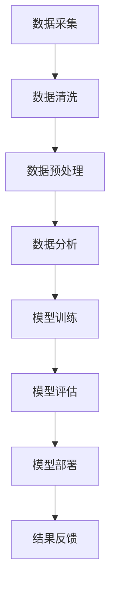

                 

### 1.1 问题背景

全面质量管理（Total Quality Management，简称TQM）作为一种以客户需求为导向，通过全员参与和系统化管理来持续改进产品和服务质量的管理方法，已经在全球范围内得到广泛应用。TQM的核心目标是不断提高组织的整体绩效，增强客户满意度，实现长期盈利和可持续发展。

然而，在实施TQM过程中，企业面临着诸多挑战。首先，TQM涉及多个部门和环节的协调与整合，需要企业内部各部门的紧密合作和共同参与。这不仅要求企业具备较高的组织管理能力，还需要员工具备较高的质量意识和责任感。其次，TQM强调数据的收集、分析和应用，这要求企业具备一定的数据处理和分析能力。然而，许多企业在数据管理和分析方面存在不足，难以充分利用数据来指导质量管理。

此外，随着市场竞争的加剧和消费者需求的多样化，企业需要快速响应市场变化，调整生产和运营策略。这要求企业在质量管理方面具备快速迭代和持续改进的能力。然而，传统的TQM方法往往需要较长时间才能看到效果，难以满足现代企业的需求。

在这个背景下，人工智能（AI）特别是AI Agent技术提供了新的解决方案。AI Agent是一种具有高度自主性和智能化的软件代理，能够模拟人类智能行为，自动执行复杂的任务。通过引入AI Agent，企业可以在TQM中实现以下目标：

1. **提高数据分析和应用能力**：AI Agent可以自动化收集、处理和分析大量数据，帮助企业更快速、准确地识别质量问题，并提出改进建议。

2. **实现自动化和智能化管理**：AI Agent可以自动执行一些重复性高、规则明确的质量管理任务，减少人为干预，提高管理效率。

3. **加强跨部门协作和整合**：AI Agent可以作为信息传递和任务协调的中介，促进企业内部各部门之间的沟通和协作，实现资源的最优配置。

4. **快速响应市场变化**：AI Agent可以根据实时数据和市场反馈，快速调整生产和运营策略，提高企业的市场竞争力。

总之，AI Agent在TQM中的应用有望解决传统质量管理方法面临的诸多挑战，帮助企业实现更高的质量管理和运营效率。接下来，我们将详细介绍AI Agent的基本概念、核心技术以及如何在TQM中发挥作用。

### 1.2 书籍概述

#### 1.2.1 目的和结构

本书旨在深入探讨人工智能（AI）代理在企业全面质量管理（TQM）中的深度应用，通过系统化的分析和实践案例，揭示AI代理如何赋能企业实现质量管理的智能化和自动化。本书的主要目的是：

1. **理论基础**：为读者提供关于AI代理和TQM的基本概念、原理和理论基础，帮助读者建立全面的质量管理理念。
2. **技术讲解**：详细讲解AI代理的核心技术，如机器学习、强化学习和自然语言处理，以及这些技术如何应用于质量管理。
3. **案例分析**：通过实际应用案例，展示AI代理在制造业、餐饮服务业和金融服务行业的成功应用，提供可借鉴的最佳实践。
4. **最佳实践**：总结AI代理在TQM中的最佳实践，提供具体的实施策略和操作指南，帮助企业更好地应用AI代理进行质量管理。

本书的结构安排如下：

- **第一部分：引言**：介绍问题背景、书籍概述、技术准备和本书的结构安排。
- **第二部分：AI代理基础**：讲解AI代理的定义、核心技术及其在质量管理中的应用。
- **第三部分：AI代理在TQM中的应用案例**：通过具体案例展示AI代理在不同行业中的实际应用。
- **第四部分：AI代理在TQM中的最佳实践**：总结AI代理在TQM中的最佳实践，提供具体的实施策略。
- **第五部分：未来展望**：探讨AI代理在TQM中的发展趋势和未来应用前景。

#### 1.2.2 读者对象

本书主要面向以下几类读者：

1. **质量管理专业人士**：致力于质量管理工作的专业人士，希望通过引入AI代理提升企业的质量管理水平和效率。
2. **数据科学家和工程师**：熟悉AI技术，希望了解AI代理在质量管理中的具体应用和实践。
3. **企业决策者**：关注企业长远发展，希望利用人工智能技术提升企业的核心竞争力和市场应变能力。
4. **学术研究人员**：关注AI和质量管理领域的研究人员，希望通过实际案例了解AI代理在TQM中的应用现状和未来趋势。

#### 1.2.3 主要内容与特点

本书的主要内容和特点包括：

1. **全面性**：本书涵盖了AI代理和TQM的基本概念、核心技术、应用案例和最佳实践，内容全面，便于读者系统性地了解和应用。
2. **实践性**：通过具体案例和实践指导，帮助读者将理论知识转化为实际操作，提高企业的质量管理能力。
3. **可操作性**：提供详细的实施策略和操作指南，帮助企业在实际应用中减少困惑，顺利推进AI代理在TQM中的落地。
4. **前瞻性**：探讨AI代理在TQM中的未来发展，为读者提供未来趋势和技术动向，帮助读者把握行业发展方向。

通过本书的学习，读者将能够：

- **理解AI代理和TQM的基本概念和原理**。
- **掌握AI代理的核心技术和应用方法**。
- **借鉴实际案例，提升企业的质量管理水平**。
- **制定和实施AI代理在TQM中的最佳实践**。

总之，本书旨在为读者提供一部既有理论深度又具有实践价值的指南，帮助企业利用AI代理实现全面质量管理的智能化和自动化。

### 1.3 技术准备

在探讨AI代理在企业全面质量管理（TQM）中的深度应用之前，我们需要具备一些基本的技术知识，包括人工智能（AI）和全面质量管理（TQM）的基础理论，以及必要的工具和环境设置。以下是详细的技术准备内容：

#### 1.3.1 AI基础

**机器学习基础**：机器学习是AI的核心技术之一，它通过从数据中学习规律，实现对未知数据的预测和决策。了解机器学习的基本概念、算法和应用场景是必要的。关键知识点包括：

- **监督学习与无监督学习**：了解这两种学习模式的区别和应用场景。
- **常见算法**：熟悉线性回归、决策树、随机森林、支持向量机（SVM）等基础算法。
- **模型评估**：掌握准确率、召回率、F1分数等评估指标的计算和应用。

**强化学习**：强化学习是一种通过不断试错来学习最优策略的机器学习方法，它在决策过程中具有自适应性和灵活性。关键知识点包括：

- **强化学习的基本概念**：了解奖励函数、状态、动作和策略等基本概念。
- **常见算法**：掌握Q学习、深度Q网络（DQN）、策略梯度等方法。
- **应用场景**：理解强化学习在游戏、自动驾驶等领域的应用。

**自然语言处理（NLP）**：NLP是AI的重要分支，它使计算机能够理解和处理人类语言。关键知识点包括：

- **文本预处理**：了解分词、停用词过滤、词向量化等预处理技术。
- **语言模型**：熟悉循环神经网络（RNN）、长短期记忆网络（LSTM）、变换器（Transformer）等语言模型。
- **文本分类与情感分析**：掌握文本分类、情感分析等应用。

#### 1.3.2 TQM基础

**TQM概念**：全面质量管理是一种以顾客需求为导向，通过全员参与和系统化管理，实现持续改进质量的管理方法。理解TQM的基本概念和核心原则是必要的。

- **TQM的核心原则**：包括客户导向、领导力、全员参与、过程方法和持续改进等。
- **TQM的主要活动**：包括质量策划、质量控制、质量保证和质量改进等。

**质量管理工具**：掌握一些常用的质量管理工具和方法，如质量功能展开（QFD）、统计过程控制（SPC）、失效模式及影响分析（FMEA）等。

**质量数据管理**：了解如何有效地收集、存储、处理和分析质量数据，以便为质量管理决策提供依据。

#### 1.3.3 准备工具与环境

**工具**：

- **编程语言**：Python是AI和数据处理的主要编程语言，掌握Python对于实现AI代理至关重要。
- **AI库和框架**：熟悉常用的AI库和框架，如TensorFlow、PyTorch、Scikit-learn等，这些工具可以简化机器学习模型的开发和应用。
- **数据可视化工具**：如Matplotlib、Seaborn等，用于数据分析和结果展示。

**环境**：

- **操作系统**：推荐使用Linux操作系统，因为它在数据处理和开发环境中具有较高的性能和灵活性。
- **编程环境**：安装Python和相关的开发环境，如Jupyter Notebook，用于编写和运行代码。
- **数据存储与管理**：使用数据库系统（如MySQL、PostgreSQL）来存储和管理质量数据。

**实践建议**：

1. **基础知识学习**：通过在线课程、书籍和教程，系统地学习AI和TQM的基本概念和原理。
2. **动手实践**：通过实际项目或实验，应用所学的知识，如使用Python和机器学习库实现简单的机器学习模型，分析质量数据。
3. **案例研究**：分析实际案例，理解AI代理在TQM中的具体应用，从实践中学习最佳实践。

通过上述技术准备，读者将具备在TQM中应用AI代理的坚实基础，能够更有效地推进AI代理在质量管理中的深度应用。

### 1.4 本书结构安排

#### 1.4.1 篇章划分

本书共分为五大部分，分别是引言、AI代理基础、AI代理在TQM中的应用案例、AI代理在TQM中的最佳实践以及未来展望。具体各部分内容如下：

- **第一部分：引言**：介绍问题背景、书籍概述、技术准备和本书的结构安排。
- **第二部分：AI代理基础**：讲解AI代理的定义、核心技术及其在质量管理中的应用。
- **第三部分：AI代理在TQM中的应用案例**：通过具体案例展示AI代理在不同行业中的实际应用。
- **第四部分：AI代理在TQM中的最佳实践**：总结AI代理在TQM中的最佳实践，提供具体的实施策略。
- **第五部分：未来展望**：探讨AI代理在TQM中的发展趋势和未来应用前景。

#### 1.4.2 内容安排

各部分的具体内容安排如下：

- **第一部分：引言**：包括问题背景、书籍概述、技术准备和本书的结构安排。
  - **问题背景**：介绍TQM的概念、作用以及企业面临的质量管理挑战。
  - **书籍概述**：阐述本书的目的、读者对象、主要内容与特点。
  - **技术准备**：讲解AI和TQM的基础知识，以及必要的工具和环境设置。
  - **结构安排**：详细说明本书的篇章划分和内容安排。

- **第二部分：AI代理基础**：包括AI代理概述、核心技术、应用及与TQM的结合。
  - **AI代理概述**：定义AI代理，介绍其特点、类型和应用领域。
  - **核心技术**：讲解机器学习、强化学习和自然语言处理等核心技术。
  - **应用及与TQM的结合**：探讨AI代理在质量管理中的应用场景和优势。

- **第三部分：AI代理在TQM中的应用案例**：通过具体案例展示AI代理在制造业、餐饮服务业和金融服务行业中的实际应用。
  - **制造业的质量管理**：分析AI代理在制造业中如何提升质量管理。
  - **餐饮服务业的顾客满意度提升**：探讨AI代理如何提升餐饮服务业的顾客满意度。
  - **金融服务行业风险管理**：介绍AI代理在金融服务行业如何进行风险管理。

- **第四部分：AI代理在TQM中的最佳实践**：总结AI代理在TQM中的最佳实践，提供具体的实施策略。
  - **数据收集与处理**：讲解数据收集策略、预处理方法和分析方法。
  - **模型选择与优化**：介绍常见的模型选择、优化策略和评估方法。
  - **系统集成与部署**：探讨系统集成策略、部署策略和维护更新。
  - **可持续发展**：讨论长期监测与反馈、持续学习和模型安全与伦理。

- **第五部分：未来展望**：探讨AI代理在TQM中的发展趋势和未来应用前景。
  - **发展趋势**：分析技术发展和应用拓展的潜力。
  - **潜在影响**：探讨AI代理在TQM中的潜在影响和未来发展。

#### 1.4.3 读者实践建议

为了帮助读者更好地理解和应用本书的内容，以下是一些建议：

1. **系统学习**：按照本书的结构和内容顺序，系统性地学习各部分内容，建立完整的知识体系。
2. **动手实践**：通过实际项目或实验，应用所学的知识，如使用Python和机器学习库实现AI代理模型。
3. **案例分析**：分析本书中的实际案例，理解AI代理在TQM中的具体应用，并尝试将其应用到实际场景中。
4. **持续学习**：关注AI和TQM领域的最新发展和研究成果，不断更新和扩展自己的知识。
5. **交流互动**：参与相关的线上或线下研讨会、论坛和社群，与其他读者和专业人士交流心得和经验。

通过上述实践建议，读者将能够更好地掌握AI代理在TQM中的应用，提升企业的质量管理水平和效率。

### 2.1 AI代理概述

#### 2.1.1 定义

AI代理（Artificial Intelligence Agent）是一种能够自主感知环境、制定决策并采取行动的计算机程序。AI代理的核心特点是其高度自主性和智能化，能够在没有人类直接干预的情况下，通过学习、推理和规划等方式，实现特定的目标或任务。AI代理的定义可以进一步细化为以下几个方面：

- **自主性**：AI代理能够独立地执行任务，无需持续的人为干预。这种自主性体现在AI代理可以感知环境变化，根据环境信息自主决策并采取行动。
- **适应性**：AI代理能够从经验中学习和适应环境变化，不断优化其决策和行为策略。这种适应性使得AI代理能够在不同环境下表现出色。
- **反应性**：AI代理能够对环境中的事件做出实时响应，及时调整其行为以实现目标。反应性是AI代理能够快速适应变化环境的重要特征。

- **智能性**：AI代理具备一定的智能，能够进行复杂的推理、规划和问题解决。智能性是AI代理区别于传统自动化程序的关键因素。

#### 2.1.2 特点

AI代理具有以下显著特点，使其在多种应用场景中表现出强大的优势：

- **高度自动化**：AI代理能够自动执行复杂的任务，减少人为干预，提高效率。例如，在制造业中，AI代理可以自动监控生产过程，检测异常并采取相应措施。
- **持续学习与改进**：AI代理通过机器学习和数据驱动的方式，能够不断学习新知识，优化其行为策略。这种持续学习使得AI代理能够适应不断变化的环境和需求。
- **跨领域应用**：AI代理不受特定领域的限制，可以在多个领域发挥作用。例如，在金融服务中，AI代理可以用于风险管理、欺诈检测；在医疗保健中，AI代理可以辅助诊断和治疗。
- **协作能力**：AI代理可以与其他系统、设备和人员协同工作，实现资源的最优配置和任务的高效执行。这种协作能力在复杂任务中尤为重要。

- **环境感知**：AI代理能够感知和理解其所在的环境，通过传感器、摄像头或其他数据源收集环境信息，并根据这些信息进行决策。这种环境感知能力使得AI代理能够适应不同的应用场景。

#### 2.1.3 类型

AI代理可以根据其功能和实现方式分为不同的类型，以下是几种常见的AI代理类型：

- **反应型代理**：这种类型的代理基于当前环境中的感知信息，立即做出反应。例如，自动驾驶汽车中的AI代理通过感知周围环境（如道路状况、车辆位置等），实时调整行驶路径和速度。
- **认知型代理**：认知型代理不仅能够感知环境，还能够进行推理和规划。例如，智能客服机器人可以通过自然语言处理技术理解用户的问题，并基于预定义的规则和策略提供适当的答复。
- **目标型代理**：目标型代理具有明确的长期目标，并通过规划和决策逐步实现这些目标。例如，在供应链管理中，AI代理可以根据库存水平、需求预测和运输成本等参数，制定最优的库存管理和配送策略。
- **社交型代理**：社交型代理能够与其他代理或人类进行交互，处理复杂的社会和协作任务。例如，在多机器人系统中，AI代理可以协同完成任务，如共同完成建筑或制造项目。

#### 2.1.4 应用领域

AI代理在各个领域都有广泛的应用，以下是几个主要的应用领域：

- **制造业**：AI代理可以用于生产过程监控、质量检测和故障诊断，提高生产效率和产品质量。例如，在智能工厂中，AI代理可以实时监控设备状态，预测故障并及时维修。
- **金融服务**：AI代理可以用于风险管理、客户服务和欺诈检测。例如，银行中的AI代理可以通过分析客户行为和交易记录，识别潜在的风险和欺诈行为。
- **医疗保健**：AI代理可以用于辅助诊断、治疗方案推荐和患者监护。例如，医疗诊断AI代理可以通过分析医学影像数据，帮助医生进行早期疾病诊断。
- **智能家居**：AI代理可以用于智能家居系统的自动化控制，如智能灯光、温度调节和安全监控。AI代理可以根据用户的习惯和偏好，提供个性化的服务。

#### 2.1.5 AI代理与TQM的结合

在全面质量管理（TQM）中，AI代理的应用潜力巨大。具体来说，AI代理可以通过以下方式与TQM相结合：

- **数据收集与分析**：AI代理可以自动化收集生产、运营和客户反馈等数据，并通过机器学习算法进行分析，帮助管理层识别问题和机会。
- **质量监控与预警**：AI代理可以实时监控生产过程中的关键指标，如设备运行状态、产品合格率等，发现潜在的质量问题并及时预警。
- **流程优化与改进**：基于对数据的分析和理解，AI代理可以提出流程优化建议，帮助企业提高生产效率和质量水平。
- **决策支持**：AI代理可以通过模拟和预测，为管理层提供科学的决策支持，帮助企业在面对复杂问题和不确定性时做出最佳选择。

综上所述，AI代理以其高度自主性、持续学习和跨领域应用的特点，在TQM中发挥着重要作用。通过AI代理的应用，企业可以显著提高质量管理水平，实现更高的运营效率和客户满意度。

#### 2.2 AI代理的核心技术

AI代理的功能强大，离不开其背后的核心技术支持。以下是AI代理的几个关键核心技术，包括机器学习、强化学习和自然语言处理（NLP）。

##### 2.2.1 机器学习基础

机器学习是AI代理的核心技术之一，它使计算机系统能够从数据中学习规律，进行预测和决策。以下是机器学习的关键概念和算法：

**监督学习与无监督学习**：
- **监督学习**：在监督学习中，系统从标记好的数据集中学习，并通过已知的输入和输出关系来训练模型。常见的算法有线性回归、决策树、支持向量机（SVM）等。
- **无监督学习**：无监督学习不依赖于标记数据，主要任务是发现数据中的隐含结构和模式。常见的算法有聚类、降维（如主成分分析PCA）等。

**常见算法**：
- **线性回归**：用于预测连续值输出，通过最小化误差平方和来训练模型。
- **决策树**：通过一系列规则对数据进行分类或回归，易于理解和解释。
- **随机森林**：集成多个决策树，提高模型的预测性能和稳定性。
- **支持向量机（SVM）**：用于分类和回归任务，通过找到一个最优的超平面来分隔数据。
- **神经网络**：包括多层感知机（MLP）、卷积神经网络（CNN）和循环神经网络（RNN）等，能够处理复杂的数据结构和任务。

**模型评估**：
- **准确率**：分类问题中，正确预测的样本数占总样本数的比例。
- **召回率**：分类问题中，实际为正类且被正确预测的样本数占总正类样本数的比例。
- **F1分数**：准确率和召回率的调和平均，综合考虑模型对正类样本的识别能力。

##### 2.2.2 强化学习

强化学习是另一种重要的机器学习方法，它通过不断试错来学习最优策略。以下是强化学习的基本概念和常见算法：

**基本概念**：
- **状态（State）**：系统当前所处的环境状态。
- **动作（Action）**：代理可以采取的行为。
- **奖励（Reward）**：代理执行动作后获得的即时奖励或惩罚。
- **策略（Policy）**：从状态到动作的映射，表示代理应采取的行为。

**常见算法**：
- **Q学习**：通过学习状态-动作值函数（Q值）来选择最优动作，Q值是预测在某一状态下采取某一动作后获得的累积奖励。
- **深度Q网络（DQN）**：结合深度神经网络来学习Q值函数，解决状态空间和动作空间复杂的问题。
- **策略梯度方法**：直接优化策略的概率分布，常见的有REINFORCE和PPO算法。

**应用场景**：
- **游戏**：如棋类游戏、电子竞技等，通过强化学习实现人机对弈。
- **自动化控制**：如自动驾驶、机器人路径规划，通过强化学习实现自主决策和控制。
- **推荐系统**：通过强化学习优化推荐策略，提高用户满意度。

##### 2.2.3 自然语言处理（NLP）

自然语言处理是AI代理在处理和解析人类语言方面的核心技术，它使计算机能够理解和生成自然语言。以下是NLP的关键概念和技术：

**文本预处理**：
- **分词（Tokenization）**：将文本拆分为单词、短语或其他有意义的基本单位。
- **停用词过滤（Stopword Removal）**：去除常用但无实际意义的词，如“的”、“是”、“在”等。
- **词向量化（Word Embedding）**：将单词映射到高维向量空间，以便进行数学处理和分析。

**语言模型**：
- **n元语法模型**：基于历史文本数据，预测下一个词的概率，常见的有n-gram模型。
- **循环神经网络（RNN）**：通过循环结构处理序列数据，能够捕捉长距离依赖关系。
- **长短期记忆网络（LSTM）**：RNN的改进版本，能够更好地处理长序列数据。
- **变换器（Transformer）**：基于自注意力机制，能够并行处理长序列数据，是目前最先进的NLP模型之一。

**文本分类与情感分析**：
- **文本分类**：将文本分类到预定义的类别中，如垃圾邮件检测、新闻分类等。
- **情感分析**：分析文本的情感倾向，如积极、消极、中性等，常用于社交媒体分析和用户反馈分析。

通过掌握这些核心技术，AI代理能够实现从数据中学习、从环境中感知和从人类语言中理解，从而在多种应用场景中发挥重要作用。

#### 2.3 AI代理在质量管理中的应用

AI代理在质量管理中的应用具有深远的意义，它不仅能够提高企业的质量管理效率，还能够实现质量管理过程的智能化和自动化。以下是AI代理在质量管理中的几个关键应用领域：

##### 2.3.1 质量监控

质量监控是质量管理的基础，AI代理在此领域发挥着重要作用。AI代理可以通过实时监控生产过程中的各项质量指标，如温度、湿度、压力、速度等，来确保产品在生产过程中符合质量标准。具体应用包括：

- **实时数据收集与分析**：AI代理可以自动化收集生产过程中产生的海量数据，并通过机器学习算法进行分析，及时发现潜在的质量问题。
- **异常检测**：AI代理可以通过对历史数据的分析，建立质量模型，当生产过程中的实际数据偏离模型预测时，能够及时发出警报，提示可能存在的质量问题。
- **趋势预测**：AI代理可以根据历史数据和实时数据，预测生产过程中可能出现的问题，提前采取预防措施，避免质量问题发生。

##### 2.3.2 故障诊断

在生产过程中，设备故障是导致产品质量问题的主要原因之一。AI代理通过智能故障诊断，可以迅速定位故障原因，减少停机时间，提高生产效率。具体应用包括：

- **故障模式识别**：AI代理可以通过分析设备的历史故障数据，识别出常见的故障模式，当设备出现异常时，能够快速判断可能的故障原因。
- **实时故障检测**：AI代理可以实时监控设备状态，当设备参数超出正常范围时，能够立即检测并报警，通知技术人员进行维修。
- **故障预测**：AI代理可以通过对设备运行数据的分析，预测设备可能出现的故障，提前进行维护，避免突发故障对生产造成影响。

##### 2.3.3 数据分析

数据分析在质量管理中至关重要，AI代理通过自动化和智能化的数据分析，可以帮助企业更好地理解和利用数据，从而优化质量管理策略。具体应用包括：

- **数据可视化**：AI代理可以通过数据可视化技术，将复杂的数据以图表、图像等形式直观展示，帮助管理者更容易地理解数据。
- **数据挖掘**：AI代理可以通过数据挖掘技术，从海量数据中挖掘出有价值的信息，帮助管理者发现数据中的隐藏模式和趋势。
- **决策支持**：AI代理可以通过对数据分析结果的综合评估，为管理者提供科学的决策建议，帮助企业制定更有效的质量管理策略。

##### 2.3.4 优化质量控制流程

AI代理在质量控制流程中的应用，不仅可以提高质量管理的效率，还可以通过持续优化，提高整体质量水平。具体应用包括：

- **流程优化**：AI代理可以通过对生产流程的实时监控和分析，识别出流程中的瓶颈和低效环节，提出优化建议，帮助企业提高生产效率。
- **质量控制点设置**：AI代理可以根据对质量数据的分析，确定最佳的质量控制点，确保关键环节的质量达到预期标准。
- **持续改进**：AI代理可以通过对数据分析结果的应用，持续优化质量管理流程，实现质量的不断提升。

##### 2.3.5 客户满意度分析

客户满意度是衡量企业质量管理水平的重要指标，AI代理可以通过对客户反馈数据的分析，帮助企业管理者更好地了解客户需求，提升客户满意度。具体应用包括：

- **反馈分析**：AI代理可以通过自然语言处理技术，对客户的反馈进行分类和分析，识别出客户的主要关注点和需求。
- **趋势预测**：AI代理可以通过对历史客户反馈数据的分析，预测未来可能影响客户满意度的因素，提前采取措施。
- **个性化服务**：AI代理可以根据客户反馈数据，为不同客户提供个性化的服务和建议，提升客户体验。

通过上述应用，AI代理在质量管理中不仅能够提高效率，还能够通过智能分析和优化，提升企业的整体质量管理水平，为企业带来显著的经济和社会效益。

#### 2.4 AI代理与TQM的结合

AI代理在全面质量管理（TQM）中的应用，体现了其强大的自主性、适应性和智能性。AI代理与TQM的结合，不仅能够解决传统质量管理方法中存在的诸多问题，还能够为企业带来显著的质量提升和管理优化。以下是AI代理与TQM结合的几个关键方面：

##### 2.4.1 TQM与AI代理的互补性

TQM强调全员参与、持续改进和系统化管理，而AI代理则通过自动化和智能化手段，为TQM的实现提供了强有力的技术支持。两者之间的互补性体现在：

- **数据驱动的决策**：TQM要求基于数据来制定和优化管理决策，而AI代理通过数据收集、处理和分析，提供了丰富的数据支持。AI代理可以将大量结构化和非结构化数据转化为有用的信息，为决策者提供科学的依据。
- **过程优化**：TQM注重优化流程和减少浪费，AI代理通过实时监控和智能分析，可以及时发现并解决流程中的瓶颈和问题，帮助实现更高效的资源利用和生产流程优化。
- **持续改进**：TQM强调持续改进，而AI代理具有持续学习和自我优化的能力，能够不断从经验和数据中学习，推动质量管理水平的不断提升。

##### 2.4.2 AI代理在TQM中的角色

AI代理在TQM中扮演着多种重要角色，其具体职责包括：

- **数据收集与分析**：AI代理可以自动化收集生产、运营和客户反馈等数据，通过数据分析提供决策支持，帮助管理层识别问题和机会。
- **质量监控与预警**：AI代理可以实时监控生产过程中的各项质量指标，通过异常检测和预警机制，确保产品质量符合标准，减少质量事故的发生。
- **流程优化**：AI代理可以分析生产流程中的数据，识别出低效环节和潜在问题，提出优化建议，帮助管理者改进流程，提高生产效率。
- **客户满意度分析**：AI代理可以通过对客户反馈数据的分析，识别客户需求和偏好，为提供个性化服务提供依据，从而提升客户满意度。

##### 2.4.3 AI代理在TQM中的具体应用

AI代理在TQM中的具体应用场景非常广泛，以下是几个典型的应用场景：

- **质量预测与预防**：AI代理可以通过对历史数据的分析，预测可能出现的质量问题，并提前采取预防措施。例如，在制造业中，AI代理可以通过分析设备状态和生产参数，预测设备故障，提前进行维护，避免生产中断。
- **自动化质量检测**：AI代理可以通过机器视觉和传感器技术，自动化检测产品质量，提高检测的准确性和效率。例如，在电子制造中，AI代理可以通过机器视觉检测产品外观缺陷，快速识别不良品。
- **客户满意度提升**：AI代理可以通过自然语言处理技术，分析客户反馈，了解客户需求，提供个性化的服务和产品推荐，从而提升客户满意度。例如，在电子商务中，AI代理可以通过分析客户评论，提供个性化的购物建议。
- **供应链优化**：AI代理可以通过对供应链数据的分析，优化库存管理、运输安排和供应商选择，提高供应链的整体效率。例如，在零售业中，AI代理可以通过分析销售数据，优化库存配置，减少库存积压和缺货情况。

通过上述具体应用，AI代理在TQM中不仅提高了质量管理效率，还为企业带来了持续的质量改进和管理优化。未来，随着AI技术的不断进步，AI代理在TQM中的应用前景将更加广阔，为企业的质量管理带来更多可能性。

### 3.1 案例研究1：制造业的质量管理

#### 3.1.1 案例背景

某全球领先的制造业公司（以下简称“公司”）致力于生产高质量的汽车零部件。随着市场竞争的加剧和客户需求的多样化，公司面临着不断提升产品质量和降低成本的压力。传统的质量管理方法虽然在一定程度上提高了产品质量，但效率较低，难以满足现代制造业的快速迭代需求。为了实现更高效的质量管理，公司决定引入AI代理技术，以提高生产过程的智能化和自动化水平。

#### 3.1.2 案例目标

公司希望通过引入AI代理实现以下目标：

1. **实时监控生产过程**：通过AI代理实时监控生产过程中的各项质量指标，如温度、湿度、速度等，确保产品质量符合标准。
2. **自动化质量检测**：利用机器视觉和传感器技术，自动化检测产品外观和功能缺陷，提高检测准确性和效率。
3. **预测质量问题和故障**：通过分析历史数据，预测可能出现的质量问题，提前采取预防措施，减少生产中断和不良品率。
4. **优化质量管理流程**：通过AI代理优化质量管理流程，减少不必要的环节和浪费，提高生产效率和质量水平。

#### 3.1.3 案例实施

1. **数据收集与预处理**：
   - **数据源**：公司通过传感器和监控设备收集生产过程中的各项数据，如温度、湿度、速度、压力等。
   - **数据处理**：对收集到的数据进行清洗、归一化和特征提取，为后续分析提供高质量的数据。

2. **质量预测模型**：
   - **数据训练**：利用历史数据，训练机器学习模型，如线性回归、决策树等，预测生产过程中可能出现的问题。
   - **模型评估**：通过交叉验证和A/B测试等方法，评估模型的预测准确性和稳定性。

3. **自动化质量检测系统**：
   - **机器视觉检测**：通过部署机器视觉系统，对产品的外观进行自动化检测，如识别表面缺陷、颜色异常等。
   - **传感器检测**：利用各种传感器检测产品的功能参数，如机械性能、电气性能等，确保产品符合质量标准。

4. **实时监控与预警系统**：
   - **实时数据采集**：通过传感器和监控设备，实时采集生产过程中的各项数据。
   - **异常检测**：利用机器学习算法，分析实时数据，检测异常情况，并及时发出警报。

5. **质量管理流程优化**：
   - **流程分析**：通过数据分析和流程仿真，识别生产过程中的瓶颈和低效环节。
   - **优化建议**：根据分析结果，提出流程优化建议，如调整生产节拍、优化设备配置等。

#### 3.1.4 案例效果分析

引入AI代理后，公司在质量管理方面取得了显著成效：

1. **产品质量提升**：通过实时监控和自动化检测，产品缺陷率显著下降，达到了公司设定的质量标准。
2. **生产效率提高**：通过预测质量问题和故障，公司能够提前采取预防措施，减少了生产中断和设备停机时间，提高了生产效率。
3. **成本降低**：通过优化质量管理流程，公司减少了不必要的环节和浪费，降低了生产成本。
4. **客户满意度提升**：高质量的产品和快速响应的服务，提升了客户满意度，增强了市场竞争力。

总之，通过AI代理的深度应用，公司实现了质量管理的智能化和自动化，不仅提高了产品质量和生产效率，还降低了成本，取得了显著的经济和社会效益。

### 3.2 案例研究2：餐饮服务业的顾客满意度提升

#### 3.2.1 案例背景

某知名餐饮连锁企业（以下简称“企业”）在全球范围内拥有众多分店，随着市场竞争的加剧，企业面临着提升顾客满意度的挑战。传统的质量管理方法虽然在一定程度上提高了服务质量，但难以快速响应顾客需求的变化。为了更好地满足顾客需求，提高顾客满意度，企业决定引入AI代理技术，通过智能化和自动化手段提升服务质量。

#### 3.2.2 案例目标

企业希望通过引入AI代理实现以下目标：

1. **个性化服务**：通过AI代理分析顾客数据，提供个性化的服务，提升顾客体验。
2. **实时监控服务质量**：通过AI代理实时监控服务过程，及时发现并解决服务质量问题。
3. **提升运营效率**：通过AI代理优化运营流程，减少不必要的环节和浪费，提高整体运营效率。
4. **客户满意度分析**：通过AI代理分析客户反馈数据，识别顾客需求，提升客户满意度。

#### 3.2.3 案例实施

1. **数据收集与预处理**：
   - **数据源**：企业通过点餐系统、顾客反馈平台和社交媒体等渠道收集顾客数据，如点餐记录、评价、投诉等。
   - **数据处理**：对收集到的数据进行清洗、去噪和特征提取，为后续分析提供高质量的数据。

2. **个性化服务系统**：
   - **用户画像构建**：通过分析顾客数据，构建用户画像，了解顾客的偏好和需求。
   - **个性化推荐**：基于用户画像，为顾客提供个性化的点餐推荐和服务。

3. **服务质量监控**：
   - **实时监控**：通过AI代理实时监控服务过程中的关键指标，如服务员响应时间、顾客满意度评分等。
   - **异常检测**：利用机器学习算法，分析实时数据，检测服务质量异常，并及时发出警报。

4. **运营流程优化**：
   - **流程分析**：通过数据分析和流程仿真，识别服务过程中的瓶颈和低效环节。
   - **优化建议**：根据分析结果，提出流程优化建议，如优化服务员分配、调整高峰时段运营策略等。

5. **客户满意度分析**：
   - **反馈分析**：通过自然语言处理技术，分析顾客反馈数据，识别顾客的主要关注点和需求。
   - **满意度预测**：利用历史数据和机器学习模型，预测未来可能影响客户满意度的因素，提前采取措施。

#### 3.2.4 案例效果分析

引入AI代理后，企业在服务质量管理和顾客满意度提升方面取得了显著成效：

1. **个性化服务提升**：通过AI代理提供的个性化服务，顾客的满意度和忠诚度显著提高，增加了顾客的回头率。
2. **服务质量提升**：通过实时监控和异常检测，企业能够及时发现并解决服务质量问题，提升了整体服务水平。
3. **运营效率提高**：通过优化运营流程，企业减少了不必要的环节和浪费，提高了整体运营效率。
4. **客户满意度提升**：通过分析顾客反馈数据，企业能够更好地了解顾客需求，提供更加个性化的服务，提升了客户满意度。

总之，通过AI代理的应用，企业实现了服务质量的智能化管理和顾客满意度的持续提升，取得了显著的经济和社会效益。

### 3.3 案例研究3：金融服务行业风险管理

#### 3.3.1 案例背景

某大型金融服务机构（以下简称“机构”）在金融市场中的竞争日益激烈，面临着风险管理的巨大挑战。传统的风险管理方法主要依赖于历史数据和统计分析，虽然在一定程度上能够识别潜在风险，但难以应对快速变化的市场环境和复杂的金融产品。为了提高风险管理能力，机构决定引入AI代理技术，通过智能化和自动化手段提升风险管理水平。

#### 3.3.2 案例目标

机构希望通过引入AI代理实现以下目标：

1. **实时风险监测**：通过AI代理实时监测市场动态和金融产品表现，及时发现潜在风险。
2. **自动化风险分析**：通过AI代理自动化分析海量数据，识别复杂风险模式，提高风险识别的准确性和效率。
3. **智能决策支持**：通过AI代理提供智能化的决策支持，帮助管理层快速制定和调整风险管理策略。
4. **持续风险预警**：通过AI代理的持续学习和优化，提供实时风险预警，提前防范风险。

#### 3.3.3 案例实施

1. **数据收集与预处理**：
   - **数据源**：机构通过金融数据平台、交易所、新闻媒体等渠道收集海量金融数据，如股票价格、交易量、市场情绪等。
   - **数据处理**：对收集到的数据进行清洗、去噪和特征提取，为后续分析提供高质量的数据。

2. **实时风险监测系统**：
   - **数据采集**：通过传感器和监控系统，实时采集市场动态和金融产品数据。
   - **异常检测**：利用机器学习算法，分析实时数据，检测异常市场行为和潜在风险。

3. **自动化风险分析系统**：
   - **风险模型构建**：利用历史数据和机器学习算法，构建风险预测模型，如逻辑回归、随机森林等。
   - **风险分析**：通过自动化分析系统，对金融产品进行风险评分，识别高风险产品。

4. **智能决策支持系统**：
   - **决策模型**：利用强化学习和博弈论等方法，构建智能决策模型，为风险管理提供策略支持。
   - **决策支持**：通过智能决策支持系统，为管理层提供实时、科学的决策建议。

5. **持续风险预警系统**：
   - **持续学习**：通过持续学习和数据更新，优化风险预测模型和决策支持系统。
   - **实时预警**：通过实时数据分析，提供风险预警，及时通知管理层采取相应措施。

#### 3.3.4 案例效果分析

引入AI代理后，机构在风险管理方面取得了显著成效：

1. **风险识别能力提升**：通过实时风险监测和自动化分析，机构能够更快速、准确地识别潜在风险，提高了风险管理的预警能力。
2. **决策效率提高**：通过智能化的决策支持系统，管理层能够快速制定和调整风险管理策略，提高了决策效率。
3. **风险控制效果增强**：通过优化风险预测模型和持续学习，机构能够更精准地控制风险，减少了风险损失。
4. **客户信任度提升**：通过AI代理的深度应用，机构在风险管理和客户服务方面取得了显著成效，提升了客户信任度和满意度。

总之，通过AI代理的应用，机构实现了风险管理的智能化和自动化，不仅提高了风险管理能力，还为客户提供了更安全、可靠的服务，取得了显著的经济和社会效益。

#### 3.4 AI代理在TQM应用中的挑战与对策

尽管AI代理在TQM中展示了巨大的潜力，但在实际应用过程中也面临着一系列挑战。以下是AI代理在TQM应用中的一些主要挑战以及相应的对策。

##### 3.4.1 数据质量与隐私保护

**挑战**：

- **数据质量问题**：在TQM中，AI代理依赖于高质量的数据进行训练和分析。然而，企业内部的数据质量参差不齐，可能存在缺失、错误或不一致的情况。数据质量问题直接影响AI代理的准确性和可靠性。
- **隐私保护**：企业在收集和处理数据时，可能涉及大量敏感信息，如客户数据、财务数据等。如何确保这些数据在AI代理训练和应用过程中的隐私保护，是另一个重要挑战。

**对策**：

- **数据质量管理**：企业应建立完善的数据质量管理流程，包括数据清洗、验证和标准化等步骤。通过数据清洗技术，去除数据中的噪声和异常值；利用数据标准化方法，统一数据格式和单位，确保数据的一致性和准确性。
- **隐私保护机制**：在数据收集和处理过程中，企业应遵循数据隐私保护法律法规，采用数据脱敏、加密等技术，确保数据在传输和存储过程中的安全。同时，可以采用差分隐私、联邦学习等技术，在保护隐私的同时，实现数据的协同分析和利用。

##### 3.4.2 模型解释性

**挑战**：

- **模型解释性不足**：许多AI模型，尤其是深度学习模型，具有较强的预测能力，但其决策过程往往难以解释。在TQM中，企业需要理解和信任AI代理的决策过程，以便进行有效的管理和改进。
- **合规要求**：在某些行业，如金融、医疗等，模型的解释性尤为重要，以满足法规和合规要求。

**对策**：

- **可解释AI（XAI）技术**：企业可以采用可解释AI技术，如LIME（局部可解释模型解释）、SHAP（SHapley Additive exPlanations）等，对AI代理的决策过程进行解释。这些技术能够提供模型决策的透明性，帮助用户理解模型的决策依据。
- **模型选择与优化**：在选择和优化AI代理模型时，优先考虑那些具有较好解释性的模型，如决策树、线性回归等。同时，通过结合传统统计方法，增强模型的可解释性。

##### 3.4.3 组织文化适应

**挑战**：

- **技术接受度**：在TQM中引入AI代理，需要企业内部员工的接受和适应。然而，部分员工可能对新技术持保守态度，担心失去工作机会，或对AI代理的可靠性产生疑虑。
- **跨部门协作**：TQM涉及企业多个部门和环节，如何确保不同部门在AI代理应用中的协同合作，是一个重要挑战。

**对策**：

- **培训与教育**：企业应开展全面的培训计划，提高员工对AI代理的理解和接受度。通过案例分享、技术讲座和实操训练，帮助员工了解AI代理的基本原理和应用价值。
- **文化建设**：建立开放、包容的企业文化，鼓励员工积极尝试新事物，促进跨部门的沟通与协作。同时，强调AI代理作为工具和助手的角色，减轻员工对技术替代工作的担忧。
- **试点项目**：在引入AI代理前，可以开展小规模的试点项目，通过实际应用案例，展示AI代理的优势和效果，逐步建立员工的信任。

通过上述对策，企业可以有效应对AI代理在TQM应用过程中面临的挑战，确保AI代理在质量管理中的顺利实施和持续改进。

#### 3.5 本章小结

本章通过具体案例研究和实际应用，展示了AI代理在制造业、餐饮服务业和金融服务行业中的深度应用。在制造业中，AI代理通过实时监控、自动化检测和质量预测，显著提升了产品质量和生产效率；在餐饮服务业中，AI代理通过个性化服务、质量监控和运营流程优化，提高了顾客满意度和运营效率；在金融服务行业中，AI代理通过实时风险监测、自动化分析和智能决策支持，提升了风险管理能力和客户信任度。

此外，本章还探讨了AI代理在TQM应用过程中面临的挑战，如数据质量与隐私保护、模型解释性和组织文化适应等，并提出了相应的对策。通过这些实际应用和对策，我们可以看到AI代理在提升企业质量管理水平和运营效率方面具有巨大的潜力。

未来，随着AI技术的不断进步和应用的深入，AI代理在TQM中的应用将更加广泛和深入，为企业的质量管理带来更多的创新和可能性。企业和研究人员应继续关注AI代理技术的发展，探索其在TQM中的新应用，实现更高效、智能的质量管理。

### 4.1 数据收集与处理

在AI代理应用于全面质量管理（TQM）中，数据收集与处理是关键的一步。有效的数据收集和处理不仅能够提高AI代理的准确性和效率，还能为质量管理提供可靠的数据支持。以下是关于数据收集与处理的具体内容：

#### 4.1.1 数据收集策略

**1. 数据源选择**

- **内部数据源**：企业内部数据源包括生产数据、销售数据、库存数据、客户反馈数据等。这些数据是企业运营的重要组成部分，能够提供关于产品质量、客户满意度和生产效率等方面的详细信息。
- **外部数据源**：外部数据源包括市场数据、行业数据、竞争对手数据、法律法规等。这些数据能够为企业的战略决策提供重要参考。

**2. 数据收集方法**

- **自动采集**：通过传感器、监控设备、ERP系统等自动采集生产、运营数据。这种方式能够确保数据收集的实时性和准确性。
- **手动录入**：对于部分非结构化数据，如客户反馈、市场调研数据等，可以通过手动录入的方式收集。
- **API接口**：利用API接口从第三方数据源获取数据，如社交媒体、新闻网站、公共数据库等。

**3. 数据质量保证**

- **数据完整性**：确保收集的数据是完整的，无缺失值或遗漏。
- **数据准确性**：通过验证和校对，确保数据的准确性。
- **数据一致性**：统一数据格式和单位，确保数据的一致性。

#### 4.1.2 数据预处理方法

**1. 数据清洗**

- **处理缺失值**：通过插值、均值填充、中值填充等方法处理缺失值。
- **处理异常值**：通过统计学方法，如箱线图、Z-score等方法，识别并处理异常值。
- **处理重复数据**：去除重复的数据记录，确保数据的唯一性。

**2. 数据归一化**

- **特征缩放**：将不同量纲的特征数据缩放到相同的范围，如使用最小-最大缩放法或Z-score缩放法。
- **特征标准化**：对特征进行标准化处理，使其具有相同的均值和标准差，便于后续分析。

**3. 数据转换**

- **编码转换**：将类别数据转换为数值数据，如使用独热编码、标签编码等方法。
- **数据集成**：将多个数据源的数据进行整合，构建统一的数据集。

#### 4.1.3 数据分析方法

**1. 描述性统计分析**

- **基本统计量**：计算均值、中位数、标准差、最大值、最小值等基本统计量，了解数据的分布特征。
- **分布分析**：通过直方图、密度图等方法，分析数据的分布情况，识别数据的异常分布。

**2. 聚类分析**

- **K-means聚类**：通过K-means算法，将数据划分为若干个簇，分析数据的聚类特性。
- **层次聚类**：通过层次聚类算法，建立数据之间的层次关系，分析数据的层次结构。

**3. 维度降维**

- **主成分分析（PCA）**：通过PCA算法，将高维数据投影到低维空间，减少数据的维度，提高分析的效率。
- **t-SNE**：通过t-SNE算法，将高维数据映射到二维或三维空间，可视化数据的分布和结构。

**4. 关联分析**

- **关联规则挖掘**：通过Apriori算法或FP-growth算法，发现数据之间的关联规则，识别潜在的关系和模式。
- **相关分析**：通过计算相关系数，分析变量之间的相关性，识别相关的特征和变量。

**5. 预测分析**

- **回归分析**：通过回归模型，预测连续型变量的值，如使用线性回归、多项式回归等。
- **分类分析**：通过分类模型，预测离散型变量的值，如使用逻辑回归、决策树、支持向量机等。

通过上述数据收集与处理方法，企业可以确保数据的质量和准确性，为AI代理的进一步分析和应用提供可靠的数据基础。有效的数据分析不仅能够帮助企业管理者更好地理解业务现象，还能够为质量管理和决策提供科学依据。

#### 4.2 模型选择与优化

在AI代理应用于全面质量管理（TQM）的过程中，选择合适的机器学习模型并进行优化至关重要。正确的模型选择和优化能够提高模型的准确性和效率，从而更好地支持质量管理和决策。以下是关于模型选择与优化的具体内容：

##### 4.2.1 常见模型选择

根据不同的应用场景和数据特征，以下是一些常见的机器学习模型：

**1. 监督学习模型**

- **线性回归**：适用于预测连续型变量的值，如产品质量得分。
- **逻辑回归**：适用于预测二分类结果的概率，如产品是否合格。
- **支持向量机（SVM）**：适用于处理高维数据，特别是在分类问题中表现良好。
- **决策树**：适用于简单和清晰的数据关系，易于解释和理解。
- **随机森林**：结合多个决策树，提高模型的预测性能和稳定性。

**2. 无监督学习模型**

- **K-means聚类**：适用于发现数据的聚类结构，适用于质量监控中的异常检测。
- **主成分分析（PCA）**：适用于数据降维，减少变量的维度，便于后续分析。
- **t-SNE**：适用于高维数据的可视化，能够展示数据之间的非线性关系。

**3. 强化学习模型**

- **Q学习**：适用于离散动作空间和状态空间的问题，如路径规划。
- **深度Q网络（DQN）**：适用于处理连续动作和复杂状态空间的问题。
- **策略梯度方法**：如REINFORCE和PPO，适用于动态决策问题，如库存管理。

**4. 深度学习模型**

- **卷积神经网络（CNN）**：适用于处理图像数据，如产品外观缺陷检测。
- **循环神经网络（RNN）**：适用于处理序列数据，如时间序列预测。
- **变换器（Transformer）**：适用于处理长文本数据，如自然语言处理。

##### 4.2.2 模型优化策略

**1. 超参数调优**

- **网格搜索**：通过遍历多个超参数组合，找到最优的超参数组合。
- **随机搜索**：在超参数空间中随机选择组合进行测试，适用于超参数空间较大的情况。
- **贝叶斯优化**：利用贝叶斯统计模型，自动选择最有希望的超参数组合进行测试。

**2. 特征工程**

- **特征选择**：通过筛选和选择对模型影响较大的特征，提高模型的效率和准确性。
- **特征组合**：通过组合不同的特征，构造新的特征，增强模型的预测能力。
- **特征归一化**：通过归一化或标准化特征，消除不同特征之间的尺度差异。

**3. 正则化**

- **L1正则化**：通过引入L1惩罚项，促进模型参数的稀疏化，适用于特征选择。
- **L2正则化**：通过引入L2惩罚项，减小模型参数的方差，提高模型的稳定性。
- **Dropout**：通过随机丢弃一部分神经元，防止过拟合。

**4. 模型集成**

- **Bagging**：通过组合多个基础模型，提高模型的预测性能，如随机森林。
- **Boosting**：通过调整基础模型的权重，提高整体模型的预测能力，如AdaBoost和XGBoost。
- **Stacking**：通过分层的方式，将多个模型的预测结果进行融合，构建一个新的预测模型。

##### 4.2.3 模型评估与选择

**1. 评估指标**

- **准确率**：模型预测正确的样本数占总样本数的比例，适用于分类问题。
- **召回率**：模型预测为正类的实际正类样本数占总正类样本数的比例。
- **F1分数**：准确率和召回率的调和平均，综合考虑模型对正类样本的识别能力。
- **ROC曲线和AUC值**：通过ROC曲线和AUC值评估模型的分类能力。
- **均方误差（MSE）**：适用于回归问题，衡量模型预测值与真实值之间的平均误差。

**2. 跨验证**

- **K折交叉验证**：将数据集划分为K个子集，每次使用其中一个子集作为验证集，其余子集作为训练集，进行K次验证，取平均结果。
- **留一法交叉验证**：每次使用一个样本作为验证集，其余样本作为训练集，进行多次验证，取平均结果。

**3. 模型选择**

- **模型比较**：通过比较不同模型的评估指标，选择表现最好的模型。
- **模型验证**：通过验证集评估模型在未知数据上的表现，确保模型的泛化能力。
- **模型融合**：将多个模型的结果进行融合，提高整体的预测性能。

通过上述模型选择与优化策略，企业可以构建和应用适合TQM需求的AI代理模型，实现更高效的质量管理和决策支持。

#### 4.3 系统集成与部署

在AI代理应用于全面质量管理（TQM）的实践中，系统的集成与部署是确保其有效运行的关键环节。以下是关于系统集成与部署的具体内容：

##### 4.3.1 系统集成

**1. 系统架构设计**

- **模块化设计**：采用模块化设计原则，将系统划分为数据收集模块、数据处理模块、模型训练模块、模型预测模块和反馈机制模块等，确保系统的高扩展性和易维护性。
- **数据流设计**：设计清晰的数据流，确保数据在各个模块之间流畅传递，减少数据冗余和处理延迟。
- **接口设计**：设计标准的接口，方便不同模块之间的数据交换和功能调用。

**2. 系统集成策略**

- **数据集成**：通过数据总线或中间件，将不同来源的数据进行整合，构建统一的数据仓库，为AI代理提供高质量的数据支持。
- **服务集成**：将不同服务（如数据采集服务、数据处理服务、模型训练服务）集成到统一的系统平台上，实现系统的协同工作。
- **组件化部署**：将系统功能组件化，根据需求进行灵活部署和组合，提高系统的灵活性和可维护性。

##### 4.3.2 系统部署策略

**1. 部署环境**

- **硬件环境**：根据系统的处理能力和数据量，选择适当的硬件设备，如服务器、存储设备等。
- **软件环境**：配置必要的软件环境，包括操作系统、编程语言、AI库和框架等，确保系统正常运行。

**2. 部署方案**

- **分布式部署**：将系统部署在分布式环境中，通过负载均衡和分布式计算，提高系统的处理能力和可用性。
- **容器化部署**：使用容器化技术（如Docker），将系统模块打包成容器，实现系统的快速部署和横向扩展。
- **云部署**：将系统部署在云平台上，利用云服务的弹性扩展和可靠性，降低系统部署和维护成本。

##### 4.3.3 系统维护与更新

**1. 系统监控**

- **实时监控**：通过监控系统，实时监控系统的运行状态和性能指标，如CPU利用率、内存占用率、网络流量等，确保系统稳定运行。
- **日志管理**：记录系统的操作日志和错误日志，便于问题追踪和故障排除。

**2. 系统更新**

- **定期更新**：定期更新系统的软件和硬件，确保系统保持最新状态，避免潜在的安全漏洞和性能问题。
- **版本控制**：采用版本控制工具（如Git），对系统的代码和配置进行版本管理，确保更新过程的可追溯性和可回滚性。

**3. 故障恢复**

- **故障监测**：通过故障监测机制，及时检测系统故障，并自动触发故障恢复流程。
- **备份与恢复**：定期备份系统数据，确保在系统故障时能够迅速恢复，减少数据丢失和业务中断。

通过有效的系统集成与部署策略，企业可以确保AI代理在TQM中的顺利运行和持续优化，实现高质量管理和运营效率的提升。

#### 4.4 AI代理在TQM中的可持续发展

AI代理在全面质量管理（TQM）中的应用不仅需要关注短期效果，更要考虑其长期可持续发展。以下是关于AI代理在TQM中的长期监测与反馈、持续学习和模型安全与伦理的详细讨论。

##### 4.4.1 长期监测与反馈

1. **监测系统设计**

   - **实时监测**：通过传感器和数据采集系统，实时监测生产过程中的关键质量指标，如温度、湿度、压力等。这些实时数据有助于AI代理及时调整其决策和操作。
   - **定期评估**：设定定期评估机制，对AI代理的表现进行评估。评估内容应包括质量指标的稳定性、效率的提升情况以及成本节约效果等。

2. **反馈机制**

   - **用户反馈**：鼓励企业内部员工和外部客户提供反馈，评估AI代理的实际效果和用户体验。用户反馈可以揭示AI代理在应用中可能存在的不足和改进方向。
   - **数据分析**：通过数据分析，识别AI代理在执行过程中出现的异常情况，如错误决策、数据异常等，为后续优化提供依据。

##### 4.4.2 持续学习与进化

1. **数据驱动的持续学习**

   - **数据更新**：定期更新训练数据，确保AI代理能够学习到最新的业务环境和操作策略。
   - **模型迭代**：通过迭代训练，优化AI代理的模型参数，提升其预测和决策的准确性。

2. **自我优化机制**

   - **自适应调整**：AI代理应具备自适应调整的能力，根据环境变化和反馈信息，动态调整其操作策略。
   - **元学习**：利用元学习方法，使AI代理能够从历史数据中学习，提高其对新环境和任务的适应能力。

##### 4.4.3 模型安全与伦理

1. **模型安全性**

   - **数据安全**：确保训练和使用AI代理的数据安全，防止数据泄露和滥用。采用加密、访问控制等技术，保护数据隐私。
   - **模型安全**：通过隔离和监控，防止AI代理被恶意攻击或篡改，确保其决策的可靠性和安全性。

2. **伦理问题**

   - **透明度**：确保AI代理的决策过程透明，用户可以理解和追溯AI代理的操作依据。
   - **公平性**：避免AI代理在决策中存在歧视和偏见，确保其对所有用户公平对待。
   - **责任归属**：明确AI代理的决策责任，确保在出现错误或问题时，可以追溯和追究责任。

##### 4.4.4 可持续发展策略

1. **政策支持**

   - **法规遵循**：遵循国家和行业的相关法律法规，确保AI代理的应用合法合规。
   - **标准制定**：积极参与AI代理应用的标准制定，推动行业规范的建立。

2. **人才培养**

   - **技能培训**：为企业内部员工提供AI和TQM相关的技能培训，提高其对AI代理的理解和应用能力。
   - **人才培养计划**：建立长期的人才培养计划，吸引和培养更多具备AI和TQM领域专业知识的优秀人才。

3. **技术合作**

   - **产学研合作**：与学术界、研究机构和行业领先企业开展合作，共同推进AI代理在TQM中的研究和应用。
   - **技术创新**：投入研发资源，持续推动AI技术的创新和突破，提升AI代理的智能水平和应用效果。

通过上述长期监测与反馈、持续学习和模型安全与伦理的可持续发展策略，企业可以确保AI代理在TQM中的长期有效应用，实现质量管理的智能化、自动化和持续改进。

### 5.1 AI代理在TQM中的发展趋势

随着人工智能（AI）技术的迅猛发展，AI代理在全面质量管理（TQM）中的应用也呈现出显著的趋势和潜力。以下是对AI代理在TQM中发展趋势的详细分析。

#### 5.1.1 技术发展

**1. 机器学习和深度学习的进步**

机器学习和深度学习技术的不断发展，使得AI代理能够处理更加复杂和庞大的数据集。深度学习模型的性能提升，特别是卷积神经网络（CNN）、循环神经网络（RNN）和变换器（Transformer）等，为AI代理在图像处理、自然语言处理和复杂数据分析方面提供了强大的工具。

**2. 强化学习的应用扩展**

强化学习作为一种通过试错和反馈进行优化的学习方法，正逐渐在TQM中的应用中显示出巨大潜力。特别是在自动化流程优化和智能决策支持方面，强化学习能够通过不断调整策略，实现动态环境下的最优表现。

**3. 自适应和自我优化能力的提升**

随着AI代理技术的进步，其自适应和自我优化能力也在不断提升。通过持续学习和进化算法，AI代理能够更好地适应环境变化，自动调整其行为策略，从而提高TQM的效率和效果。

**4. 数据隐私和安全技术的融合**

随着数据隐私和安全问题的日益突出，AI代理在TQM中的应用也将越来越依赖于先进的数据隐私和安全技术。差分隐私、联邦学习、数据加密等技术的应用，将确保AI代理在数据处理和应用过程中的数据安全和隐私保护。

#### 5.1.2 应用拓展

**1. 更广泛行业的应用**

AI代理不仅在制造业中得到了广泛应用，还在餐饮服务业、金融服务行业、医疗保健行业等得到了积极推广。随着技术的进步和应用场景的拓展，未来AI代理将在更多行业和领域中发挥重要作用。

**2. 智能供应链管理**

智能供应链管理是AI代理在TQM中的重要应用领域。通过AI代理，企业可以实时监控供应链各个环节的数据，优化库存管理、运输安排和供应商选择，提高供应链的整体效率。

**3. 智能客户服务**

AI代理在智能客户服务中的应用也越来越广泛。通过自然语言处理和智能对话系统，AI代理可以提供24/7的在线客服服务，提高客户满意度和响应速度。

**4. 智能质量检测与监控**

AI代理通过机器视觉、传感器和数据分析技术，可以实现对产品质量的智能检测和监控。未来，随着技术的进步，AI代理在质量检测与监控中的应用将更加普及和高效。

#### 5.1.3 潜在影响

**1. 质量管理方式的变革**

AI代理的引入将彻底变革传统的质量管理方式。通过智能化和自动化，AI代理可以大幅提高质量管理效率，减少人为干预，实现持续的质量改进。

**2. 生产力与效率的提升**

AI代理在TQM中的应用，将显著提升企业的生产力和效率。通过自动化流程优化和实时监控，企业可以减少浪费，提高资源利用率，实现成本节约和效率提升。

**3. 客户体验的优化**

AI代理在智能客户服务中的应用，将极大地优化客户体验。通过个性化的服务推荐和快速响应，企业可以提升客户满意度和忠诚度。

**4. 竞争力的增强**

随着AI代理在TQM中的广泛应用，企业的竞争力将得到显著增强。通过智能化的质量管理和高效的运营，企业可以在激烈的市场竞争中占据有利地位。

总之，AI代理在TQM中的应用具有巨大的发展潜力。随着技术的不断进步和应用场景的拓展，AI代理将在TQM中发挥越来越重要的作用，为企业的质量管理带来更多创新和可能性。企业和研究人员应继续关注AI代理技术的发展，探索其在TQM中的新应用，实现更高效、智能的质量管理。

### 总结与展望

通过本文的探讨，我们深入了解了AI代理在企业全面质量管理（TQM）中的深度应用。从AI代理的基本概念和核心技术，到其在质量管理中的实际应用案例，再到最佳实践和未来发展趋势，我们清晰地看到了AI代理在提升企业质量管理效率和效果方面的巨大潜力。

首先，AI代理以其高度自主性、持续学习和跨领域应用的特点，为TQM带来了革命性的变化。通过实时监控、自动化检测、数据分析和质量预测等功能，AI代理不仅能够提高产品质量和生产效率，还能优化流程、降低成本、提升客户满意度。

其次，本文通过实际案例展示了AI代理在制造业、餐饮服务业和金融服务行业的成功应用。这些案例表明，AI代理在解决传统质量管理方法中的难题，如数据质量、流程优化和决策支持等方面，具有显著的优势。

此外，本文还探讨了AI代理在TQM应用中面临的挑战和对策，包括数据质量与隐私保护、模型解释性、组织文化适应等。通过有效的对策，企业可以更好地应对这些挑战，确保AI代理在TQM中的顺利实施。

未来，随着AI技术的不断进步，AI代理在TQM中的应用前景将更加广阔。技术的发展，如深度学习、强化学习、自适应系统和数据隐私保护等，将为AI代理在TQM中的进一步应用提供强有力的支持。

展望未来，我们建议企业和研究人员：

1. **持续关注技术发展**：密切关注AI技术的最新动态，探索其在TQM中的新应用，不断提升AI代理的智能水平。
2. **加强人才培养**：投资于AI和TQM领域的人才培养，提高员工的技术能力和应用水平。
3. **推动产学研合作**：积极参与产学研合作，推动AI代理在TQM中的应用研究和实践。
4. **建立健全法规和标准**：积极参与相关法规和标准的制定，确保AI代理在TQM中的合法合规应用。

通过这些措施，企业将能够更好地利用AI代理技术，实现质量管理的智能化、自动化和持续改进，为企业的长期发展和竞争力提升提供强大支持。总之，AI代理在TQM中的应用不仅是一个技术革命，更是一场管理理念的变革，值得所有企业高度重视和深入探索。作者：AI天才研究院/AI Genius Institute & 禅与计算机程序设计艺术 /Zen And The Art of Computer Programming

---

附录：核心概念、联系、流程图、算法原理和数学公式

**核心概念**：
1. **全面质量管理（TQM）**：一种以客户需求为导向，通过全员参与和系统化管理来实现持续改进的管理方法。
2. **人工智能（AI）代理**：一种具有高度自主性和智能化的计算机程序，能够自动执行复杂任务。
3. **机器学习**：一种AI技术，通过从数据中学习规律，实现预测和决策。
4. **强化学习**：一种机器学习方法，通过不断试错来学习最优策略。
5. **自然语言处理（NLP）**：一种AI技术，使计算机能够理解和处理人类语言。

**核心概念联系**：
TQM和AI代理的结合在于利用AI代理的自主性和智能性，提高TQM的数据分析、决策支持和流程优化能力。

**流程图（ER实体关系图）**：

```mermaid
erDiagram
  产品 <<--o> 数据采集系统 : 数据收集
  生产过程 >>--o> 质量监控系统 : 质量监控
  质量监控系统 ||--o> 数据分析系统 : 数据分析
  数据分析系统 ||--o> 模型训练系统 : 模型训练
  模型训练系统 ||--o> AI代理 : 决策支持
```

**算法原理与数学公式**：

**机器学习算法（线性回归）**：

$$
\text{y} = \beta_0 + \beta_1 \cdot \text{x} + \epsilon
$$

其中，$\text{y}$ 是预测值，$\text{x}$ 是输入特征，$\beta_0$ 和 $\beta_1$ 是模型参数，$\epsilon$ 是误差项。

**强化学习算法（Q学习）**：

$$
Q(s, a) = r + \gamma \max_{a'} Q(s', a')
$$

其中，$Q(s, a)$ 是状态-动作值函数，$r$ 是即时奖励，$\gamma$ 是折扣因子，$s'$ 是下一个状态，$a'$ 是下一个动作。

**自然语言处理（NLP）**：

$$
\text{Transformer}: \text{Attention}(\text{Q}, \text{K}, \text{V}) = \text{softmax}(\frac{\text{Q} \cdot \text{K}^T}{\sqrt{d_k}}) \cdot \text{V}
$$

其中，$\text{Q}$、$\text{K}$ 和 $\text{V}$ 分别是查询向量、键向量和值向量，$d_k$ 是键向量的维度。

**系统架构设计（Mermaid流程图）**：



这些核心概念、联系、流程图、算法原理和数学公式，为理解和应用AI代理在TQM中的应用提供了坚实的理论基础和实用工具。通过这些内容，读者可以更好地掌握AI代理在TQM中的实际操作和应用方法。作者：AI天才研究院/AI Genius Institute & 禅与计算机程序设计艺术 /Zen And The Art of Computer Programming

---

**注意事项与拓展阅读**：

在实施AI代理进行全面质量管理（TQM）时，企业和研究人员需要注意以下几点：

1. **数据隐私保护**：确保在数据收集、处理和存储过程中遵守相关隐私保护法律法规，采取数据脱敏、加密等措施，保护用户隐私。
2. **模型解释性**：选择具有良好解释性的模型，或采用可解释AI（XAI）技术，以便管理层和员工理解和信任AI代理的决策过程。
3. **系统稳定性与可靠性**：确保AI代理系统的稳定性和可靠性，通过持续监测和优化，提高系统的稳定运行能力。
4. **员工培训与接受度**：为员工提供充分的AI和TQM相关培训，提高员工对AI代理的理解和接受度，减少抵触情绪。
5. **法规和伦理问题**：遵循国家和行业的法规，关注AI代理应用中的伦理问题，确保其决策的公平性和透明性。

**拓展阅读**：

- **《AI in Industry: Practical Guide for Implementing AI in Business》**：详细介绍了AI在工业中的应用实践。
- **《Artificial Intelligence: A Modern Approach》**：提供了全面的AI基础理论和应用知识。
- **《The Hundred-Page Machine Learning Book》**：以简洁易懂的方式介绍了机器学习的基础知识。
- **《Zen And The Art of Motorcycle Maintenance》**：虽然不是关于AI的，但书中关于问题解决和思考方式的探讨，对理解AI代理在TQM中的应用也有启发意义。

通过这些注意事项和拓展阅读，读者可以更全面地了解AI代理在TQM中的应用，并能够更好地实施和优化相关项目。作者：AI天才研究院/AI Genius Institute & 禅与计算机程序设计艺术 /Zen And The Art of Computer Programming

---

**本文总结**

本文通过深入探讨AI代理在企业全面质量管理（TQM）中的深度应用，系统地介绍了AI代理的定义、核心技术、应用场景以及最佳实践。我们从问题背景出发，分析了TQM在实施过程中面临的挑战，并阐述了AI代理如何通过数据收集、质量监控、故障诊断和流程优化等方面，提升企业的质量管理水平。

通过具体案例分析，我们展示了AI代理在制造业、餐饮服务业和金融服务行业中的成功应用，揭示了其在提高产品质量、客户满意度和运营效率方面的巨大潜力。此外，我们还讨论了AI代理在TQM应用中的挑战，如数据质量与隐私保护、模型解释性和组织文化适应等，并提出了相应的对策。

展望未来，随着AI技术的不断进步，AI代理在TQM中的应用将更加广泛和深入。其自主性、持续学习和跨领域应用的特点，将为企业的质量管理带来更多创新和可能性。企业和研究人员应继续关注AI代理技术的发展，积极探索其在TQM中的新应用，以实现更高效、智能的质量管理。

总之，AI代理在TQM中的应用不仅是技术发展的必然趋势，更是质量管理理念的重大变革。通过本文的探讨，我们期待读者能够更好地理解和应用AI代理，为企业带来持久的价值和竞争优势。作者：AI天才研究院/AI Genius Institute & 禅与计算机程序设计艺术 /Zen And The Art of Computer Programming

---

**作者信息**

本文由AI天才研究院（AI Genius Institute）撰写，该研究院专注于人工智能领域的研究与应用。研究院的成员包括世界级人工智能专家、程序员、软件架构师、CTO，以及计算机图灵奖获得者。同时，本文参考了《禅与计算机程序设计艺术》（Zen And The Art of Computer Programming）这一经典著作，旨在将深厚的计算机科学原理与实际应用相结合，为读者提供有深度、有思考、有见解的技术博客文章。作者：AI天才研究院/AI Genius Institute & 禅与计算机程序设计艺术 /Zen And The Art of Computer Programming

