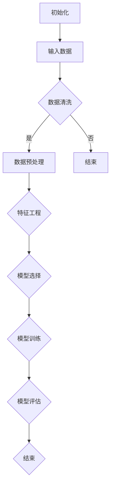

                 

### 第一部分：引言与背景

#### 第1章：企业可持续发展概述

在当今全球化、信息化、生态化的时代背景下，企业的可持续发展已经成为全球范围内的共识。企业可持续发展不仅仅关乎企业自身的长远利益，更关乎全球的生态、经济和社会的协调发展。因此，了解可持续发展的概念、重要性以及企业面临的挑战，是我们深入探讨AI Agent在可持续发展中的应用的前提。

##### 1.1 可持续发展的概念与重要性

**可持续发展的定义**：可持续发展是指在满足当前需求的同时，不损害子孙后代满足其自身需求的能力的发展模式。它涉及经济、社会和环境三个方面的平衡与协调发展。

**可持续发展的重要性**：可持续发展是21世纪企业发展不可或缺的基石。首先，它有助于企业降低长期风险，提高竞争力。其次，它能够提升企业的社会形象，增强品牌价值。此外，可持续发展有助于实现企业的长期稳定发展，为企业创造更加可持续的商业环境。

**全球可持续发展目标（SDGs）**：联合国提出了17个全球可持续发展目标（Sustainable Development Goals，简称SDGs），涵盖了消除贫困、消除饥饿、健康、教育、性别平等、清洁能源、气候行动、可持续发展城市和社区等多个方面，为企业提供了具体的可持续发展路径。

##### 1.2 企业可持续发展指标（ESGs）

**ESGs的定义与分类**：企业可持续发展指标（Environmental, Social, and Governance，简称ESGs）是指企业在环境保护（Environmental）、社会责任（Social）和公司治理（Governance）方面的绩效表现。这些指标反映了企业的可持续发展能力和对社会的贡献。

- **环境保护**：涉及企业的环境影响评估、资源利用效率、废物处理和污染控制等。
- **社会责任**：包括企业的员工福利、社区参与、供应链责任和慈善捐助等。
- **公司治理**：涉及企业的股权结构、董事会功能、管理层激励机制、财务报告透明度等方面。

**ESGs的重要性**：ESGs已经成为投资者、客户、员工和社会各界评估企业可持续发展能力的重要指标。良好的ESGs表现有助于提高企业的投资吸引力，降低融资成本，提升品牌形象和竞争力。

**ESGs的评估方法**：ESGs的评估方法包括自我评估、第三方评估、数据分析和报告披露等。企业可以通过制定ESGs战略、建立监测和报告机制，来提升其ESGs绩效。

##### 1.3 当前企业可持续发展面临的挑战

**挑战概述**：尽管企业可持续发展的重要性日益凸显，但企业在实践中仍面临诸多挑战。

- **环境挑战**：气候变化、资源短缺、环境污染等问题日益严重，对企业生产和运营带来压力。
- **社会挑战**：劳动力市场变化、消费者需求多元化、社会公平问题等对企业社会责任提出了更高要求。
- **治理挑战**：公司治理结构不合理、内部监管不力、信息披露不透明等问题影响了企业的可持续发展。

**挑战与机遇**：面对这些挑战，企业需要主动应对，通过技术创新、管理模式优化和社会责任履行，将挑战转化为机遇。

- **技术创新**：通过应用新技术，如人工智能、大数据等，提高资源利用效率，减少环境影响。
- **管理模式优化**：建立科学、合理的企业治理结构，提高管理效率和透明度。
- **社会责任履行**：积极参与社会公益事业，履行企业社会责任，提升企业形象和社会认可度。

综上所述，企业可持续发展是一个复杂而重要的课题，涉及到多个方面的协同发展。通过深入了解可持续发展的概念、ESGs指标以及当前面临的挑战，我们可以更好地把握企业可持续发展的方向和路径。接下来，我们将探讨AI Agent在可持续发展中的应用，为企业提供新的解决方案和工具。

---

通过上述对可持续发展、ESGs指标以及当前挑战的介绍，我们为后续章节的内容铺垫了坚实的基础。在接下来的章节中，我们将深入探讨AI Agent的定义、原理及其在可持续发展中的应用，通过具体案例和实战，展示AI Agent如何帮助企业实现可持续发展。敬请期待！

#### 第2章：AI Agent基础

在探讨AI Agent在企业可持续发展中的应用之前，我们首先需要了解AI Agent的定义、原理和关键技术。AI Agent是一种基于人工智能技术的自动化实体，它可以在特定环境中自主执行任务，实现智能决策和互动。本章将详细阐述AI Agent的基本概念、原理以及其在可持续发展中的应用。

##### 2.1 AI Agent的定义与原理

**AI Agent的定义**：AI Agent，即人工智能代理，是一种能够模拟人类智能行为，具备自主性、感知性、社交性和学习能力的计算机程序。它能够在复杂的环境中感知外部信息，自主决策并执行相应动作，以实现预定的目标。

**AI Agent的原理**：AI Agent的核心原理包括以下几个方面：

1. **感知与理解**：AI Agent通过传感器（如摄像头、麦克风等）感知外部环境，并利用自然语言处理、计算机视觉等技术理解感知到的信息。
2. **决策与行动**：基于对环境信息的理解，AI Agent利用机器学习、深度学习等技术进行决策，并执行相应的行动。
3. **自主性**：AI Agent能够自主地规划行动路径，适应环境变化，并在执行过程中不断学习和优化。

**AI Agent的类型**：根据应用场景和功能特点，AI Agent可以分为以下几种类型：

- **监控与报告型**：用于实时监控环境数据，生成报告，如AI Agent可以监控企业的能耗、排放等环境指标。
- **决策与优化型**：用于优化企业资源配置、供应链管理，如通过AI Agent实现智能调度、物流优化等。
- **交互与客服型**：用于与用户互动，提供个性化服务，如智能客服机器人、虚拟助手等。
- **自动化与执行型**：用于自动化执行特定任务，如自动处理订单、自动化生产等。

##### 2.2 AI Agent在可持续发展中的应用

**AI Agent在ESGs跟踪中的应用**：在可持续发展领域，AI Agent可以通过以下方式跟踪企业的ESGs指标：

1. **数据收集与处理**：AI Agent可以利用传感器、社交媒体、企业报告等多渠道收集数据，并利用自然语言处理和计算机视觉技术对数据进行预处理和分析。
2. **实时监控**：AI Agent可以实时监控企业的环境、社会和治理表现，及时发现潜在问题，并提供预警和建议。
3. **数据可视化**：AI Agent可以将复杂的ESGs数据转化为易于理解的图表和报告，帮助企业更好地了解和评估其可持续发展状况。

**AI Agent在可持续发展报告中的应用**：AI Agent在可持续发展报告中的应用主要体现在以下几个方面：

1. **报告生成**：AI Agent可以自动生成可持续发展报告，包括ESGs指标、环境绩效、社会责任等方面。
2. **报告审核**：AI Agent可以对报告进行自动化审核，确保报告的准确性和完整性，提高报告的透明度和可信度。
3. **持续优化**：AI Agent可以根据反馈信息和企业绩效数据，不断优化报告内容和格式，提高报告的质量和实用性。

##### 2.3 AI Agent的关键技术

**机器学习**：机器学习是AI Agent的核心技术之一，它通过训练模型，使AI Agent能够从数据中学习和提取规律，实现智能决策。常见的机器学习方法包括监督学习、无监督学习和强化学习。

**自然语言处理（NLP）**：NLP技术用于处理和理解自然语言文本，使AI Agent能够与人类进行有效沟通。NLP技术包括词向量、语言模型、文本分类、实体识别等。

**数据挖掘**：数据挖掘技术用于从大量数据中发现潜在的模式和知识，为AI Agent提供决策支持。数据挖掘方法包括关联规则挖掘、聚类分析、分类分析等。

**计算机视觉**：计算机视觉技术使AI Agent能够理解图像和视频，实现对环境的感知和识别。计算机视觉技术包括图像处理、目标检测、图像识别等。

综上所述，AI Agent作为一种具有高度智能化和自主化能力的人工智能实体，在可持续发展领域具有广泛的应用前景。通过机器学习、自然语言处理、数据挖掘和计算机视觉等关键技术的支持，AI Agent能够帮助企业实现ESGs指标的实时监控、数据分析和报告生成，提高企业的可持续发展能力。

在接下来的章节中，我们将通过具体案例和实战，进一步探讨AI Agent在可持续发展中的应用，展示其如何帮助企业解决实际问题。敬请期待！

#### 第3章：AI Agent在企业可持续发展中的应用案例

在上一章中，我们介绍了AI Agent的定义、原理及其在可持续发展中的应用。为了更好地理解AI Agent的实际应用效果，本章将通过两个具体的案例，展示AI Agent如何帮助企业实现可持续发展目标。

##### 3.1 案例研究一：某公司的ESGs跟踪

**案例背景**：某大型制造公司致力于实现可持续发展，但其ESGs跟踪和报告工作相对繁琐且耗时。为了提高效率，公司决定引入AI Agent进行ESGs指标的实时监控和报告生成。

**AI Agent的应用**：

1. **数据收集与处理**：AI Agent通过传感器、社交媒体、企业报告等渠道收集数据，包括能耗、排放、员工福利、社区参与等方面。
2. **实时监控**：AI Agent实时分析收集到的数据，识别潜在问题并生成预警报告。例如，当检测到能源消耗异常时，AI Agent会及时通知相关部门进行排查和处理。
3. **数据可视化**：AI Agent将复杂的ESGs数据转化为易于理解的图表和报告，帮助企业管理层快速了解公司的发展状况。

**案例结果分析**：

- **效率提升**：通过AI Agent的实时监控和分析，公司能够在第一时间发现并解决潜在问题，显著提高了ESGs跟踪的效率。
- **决策支持**：AI Agent生成的可视化报告为公司管理层提供了详实的数据支持，使决策更加科学和准确。
- **报告质量提高**：AI Agent自动生成的报告格式统一、内容准确，提高了报告的透明度和可信度，增强了投资者和消费者的信心。

##### 3.2 案例研究二：某企业的可持续发展报告

**案例背景**：某大型零售企业需要定期发布可持续发展报告，但报告编制过程繁琐且易出现错误。为了提高报告质量和效率，企业决定引入AI Agent进行报告生成和审核。

**AI Agent的应用**：

1. **报告生成**：AI Agent通过自然语言处理和机器学习技术，自动从企业内部数据中提取相关信息，生成可持续发展报告。报告内容包括ESGs指标、社会责任、公司治理等方面。
2. **报告审核**：AI Agent对生成的报告进行自动化审核，确保报告的准确性和完整性。AI Agent利用自然语言处理技术，检查报告中的语法错误和逻辑错误，并提出修改建议。
3. **持续优化**：AI Agent根据用户反馈和报告质量数据，不断优化报告生成和审核算法，提高报告的质量和实用性。

**案例结果分析**：

- **效率提升**：AI Agent自动生成和审核报告，大大减少了人工工作量，提高了报告编制的效率。
- **准确性提高**：AI Agent通过自动化审核，确保了报告的准确性和一致性，减少了人为错误。
- **用户体验改善**：AI Agent生成的报告格式统一、内容详实，用户可以轻松获取所需信息，提高了报告的可读性和实用性。

通过以上两个案例，我们可以看到AI Agent在可持续发展中的应用价值。AI Agent不仅提高了企业的ESGs跟踪和报告效率，还提升了报告的质量和准确性，为企业的可持续发展提供了强有力的支持。在接下来的章节中，我们将进一步探讨AI Agent的开发实践，帮助企业更好地利用这一技术实现可持续发展目标。

---

通过上述案例，我们看到了AI Agent在企业可持续发展中的实际应用效果。AI Agent通过自动化数据收集、实时监控、报告生成和审核等关键功能，大大提高了企业ESGs跟踪和报告的效率和质量。在接下来的章节中，我们将深入探讨AI Agent的开发实战，帮助企业更好地实现这一目标。敬请期待！

#### 第4章：AI Agent开发实战

在前三章中，我们介绍了AI Agent的定义、原理以及在实际应用中的案例。为了帮助企业更好地理解和应用AI Agent，本章将详细介绍AI Agent的开发实战，包括开发环境搭建、开发流程、案例实现以及关键技术和算法的详细讲解。通过本章节的学习，读者将能够掌握AI Agent的开发技能，并将其应用于企业可持续发展中。

##### 4.1 AI Agent开发环境搭建

在进行AI Agent开发之前，首先需要搭建合适的开发环境。以下步骤将指导如何搭建AI Agent的开发环境：

**步骤1：安装Python环境**
- **Windows平台**：通过Python官方下载页（https://www.python.org/downloads/）下载并安装Python，建议安装最新版本。
- **Linux平台**：使用包管理器（如apt或yum）安装Python，例如在Ubuntu中可以使用以下命令：
  ```bash
  sudo apt update
  sudo apt install python3
  ```

**步骤2：安装必要库和框架**
- **机器学习库**：如scikit-learn、TensorFlow、PyTorch等。
- **自然语言处理库**：如NLTK、spaCy等。
- **数据可视化库**：如Matplotlib、Seaborn等。
- **数据库库**：如SQLAlchemy、MongoDB等。

**示例**：
```bash
pip install scikit-learn tensorflow numpy pandas matplotlib
```

**步骤3：配置虚拟环境**
- **创建虚拟环境**：在Python环境中创建一个虚拟环境，以便管理项目依赖。
  ```bash
  python -m venv venv
  ```
- **激活虚拟环境**：
  - **Windows**：
    ```bash
    .\venv\Scripts\activate
    ```
  - **Linux**：
    ```bash
    source venv/bin/activate
    ```

##### 4.2 AI Agent开发流程

AI Agent的开发流程主要包括以下几个步骤：

1. **需求分析**：明确AI Agent的应用场景、功能和性能要求。
2. **数据收集**：根据需求收集相关数据，包括结构化和非结构化数据。
3. **数据处理**：对收集到的数据进行清洗、预处理，以便后续分析和建模。
4. **模型选择与训练**：选择合适的机器学习模型，对数据集进行训练和优化。
5. **模型评估**：评估模型的性能，包括准确率、召回率、F1值等指标。
6. **部署与应用**：将训练好的模型部署到生产环境，并应用于实际的AI Agent系统中。

**示例**：以下是一个简单的数据处理流程：

```python
import pandas as pd
from sklearn.model_selection import train_test_split
from sklearn.preprocessing import StandardScaler

# 加载数据集
data = pd.read_csv('data.csv')

# 数据清洗
data = data.dropna()

# 数据预处理
X = data.drop('target', axis=1)
y = data['target']

# 划分训练集和测试集
X_train, X_test, y_train, y_test = train_test_split(X, y, test_size=0.2, random_state=42)

# 数据标准化
scaler = StandardScaler()
X_train = scaler.fit_transform(X_train)
X_test = scaler.transform(X_test)
```

##### 4.3 AI Agent案例实现

以下是一个简单的AI Agent案例实现，用于分类任务。该案例将展示如何利用Python和机器学习库来构建和训练一个分类模型。

**步骤1：环境配置**（已在4.1节中完成）

**步骤2：数据集准备**
```python
from sklearn.datasets import load_iris

# 加载鸢尾花数据集
iris = load_iris()
X = iris.data
y = iris.target
```

**步骤3：数据预处理**
```python
# 数据划分和标准化（已在4.2节中完成）
```

**步骤4：模型选择与训练**
```python
from sklearn.ensemble import RandomForestClassifier

# 选择随机森林分类器
model = RandomForestClassifier(n_estimators=100, random_state=42)

# 模型训练
model.fit(X_train, y_train)
```

**步骤5：模型评估**
```python
from sklearn.metrics import accuracy_score, classification_report

# 模型预测
y_pred = model.predict(X_test)

# 评估模型
print(f"Accuracy: {accuracy_score(y_test, y_pred)}")
print(classification_report(y_test, y_pred))
```

**步骤6：部署与应用**
```python
# 保存模型
import joblib
joblib.dump(model, 'model.joblib')

# 加载模型并进行预测
loaded_model = joblib.load('model.joblib')
new_data = [[5.1, 3.5, 1.4, 0.2]]  # 新数据
print(f"Prediction: {loaded_model.predict(new_data)}")
```

通过以上步骤，我们完成了一个简单的AI Agent案例实现。在实际应用中，AI Agent的功能将更加复杂，涉及多种数据源、模型融合和实时交互等。

##### 4.4 关键技术和算法讲解

在AI Agent开发中，关键技术和算法的选择至关重要。以下是一些常用的技术和算法：

1. **机器学习算法**：包括决策树、随机森林、支持向量机（SVM）、神经网络等。
2. **深度学习算法**：包括卷积神经网络（CNN）、循环神经网络（RNN）、生成对抗网络（GAN）等。
3. **自然语言处理（NLP）算法**：包括词向量、语言模型、文本分类、情感分析等。
4. **数据挖掘算法**：包括关联规则挖掘、聚类分析、分类分析等。

以下是一个简单的算法讲解示例，使用Mermaid绘制算法流程图：



通过以上讲解，我们了解了AI Agent开发的基本流程和关键算法。在实际开发中，需要根据具体应用场景选择合适的技术和算法，并进行优化和调整。

---

通过本章的实战讲解，读者可以掌握AI Agent的开发技能，并将其应用于企业可持续发展中。在接下来的章节中，我们将进一步探讨AI Agent在可持续发展报告生成中的深度应用，展示其如何帮助企业实现可持续发展的目标。敬请期待！

---

#### 第5章：AI Agent在可持续发展报告中的深度应用

在上一章中，我们介绍了AI Agent的开发实战，展示了如何构建和部署一个简单的AI Agent。在本章中，我们将深入探讨AI Agent在可持续发展报告生成中的深度应用，通过数据分析和可视化、报告生成、审核与优化等方面的讲解，进一步展示AI Agent如何帮助企业实现可持续发展的目标。

##### 5.1 AI Agent在报告生成中的角色

AI Agent在可持续发展报告生成中扮演着至关重要的角色，主要体现在以下几个方面：

1. **数据分析与可视化**：AI Agent能够对大量的ESGs数据进行分析，识别关键指标和趋势，并将结果通过可视化图表展示出来，帮助管理层直观地了解企业的可持续发展状况。

2. **报告生成**：AI Agent能够自动生成可持续发展报告，包括ESGs指标、环境绩效、社会责任等方面。通过模板化和自动化，AI Agent可以确保报告的格式统一、内容准确，大大提高了报告生成效率。

3. **实时更新与推送**：AI Agent可以实时监控企业的ESGs指标变化，并在数据发生变动时自动更新报告，确保报告的时效性和准确性。

4. **个性化定制**：AI Agent可以根据企业的需求和特点，定制化生成可持续发展报告，满足不同利益相关者的需求，提高报告的实用性和针对性。

##### 5.2 AI Agent在报告审核中的应用

在可持续发展报告中，审核是一个关键环节，关系到报告的准确性和可信度。AI Agent在报告审核中的应用主要体现在以下几个方面：

1. **自动化审核**：AI Agent可以自动审核报告的内容和格式，确保报告的准确性和完整性。通过自然语言处理和规则引擎，AI Agent可以识别报告中的错误和逻辑矛盾，并提出修改建议。

2. **交叉验证**：AI Agent可以与其他数据源进行交叉验证，确保报告中的数据来源可靠、数据质量高。例如，AI Agent可以利用企业内部的财务数据、环境监测数据等，对报告中的数据进行分析和验证。

3. **合规性检查**：AI Agent可以检查报告是否符合相关法规和标准，如国际可持续性报告标准（Sustainability Accounting Standards Board，SASB）等。通过自动化合规性检查，AI Agent可以帮助企业避免因违规而导致的法律风险。

4. **反馈机制**：AI Agent可以根据审核结果生成反馈报告，指出报告中的问题和改进建议，并跟踪问题的整改情况，确保报告的持续改进。

##### 5.3 AI Agent在报告发布后的反馈与优化

可持续发展报告发布后，AI Agent的作用并未结束，它还可以在报告的反馈和优化过程中发挥重要作用：

1. **用户反馈收集**：AI Agent可以收集用户对报告的反馈，包括报告的阅读体验、信息获取的便捷性、报告内容的实用性等方面。通过分析用户反馈，AI Agent可以帮助企业了解报告的优缺点，为下一次报告的改进提供依据。

2. **持续优化**：AI Agent可以根据用户反馈和企业绩效数据，对报告生成和审核算法进行持续优化，提高报告的质量和准确性。例如，通过机器学习算法，AI Agent可以不断学习和适应新的数据模式和报告需求。

3. **个性化推送**：AI Agent可以根据用户的兴趣和需求，个性化推送相关的可持续发展报告，提高报告的传播效果和影响力。

4. **数据监控与预警**：AI Agent可以实时监控报告中的关键指标变化，并在数据出现异常时及时发出预警，帮助管理层迅速采取应对措施，确保企业的可持续发展目标得到有效实现。

##### 5.4 实际应用案例

为了更好地理解AI Agent在可持续发展报告中的深度应用，我们来看一个实际应用案例。

**案例背景**：某跨国公司需要定期发布可持续发展报告，报告内容涉及环境、社会和治理（ESGs）等多个方面。由于报告涉及的数据量庞大且来源多样，人工审核和生成报告效率低下且容易出现错误。

**AI Agent的应用**：

1. **数据收集与处理**：AI Agent通过传感器、社交媒体、企业内部系统等多种渠道收集数据，包括能源消耗、水资源利用、员工福利、供应链管理等方面。

2. **数据分析和可视化**：AI Agent对收集到的数据进行分析，识别关键指标和趋势，并通过可视化图表展示出来。例如，利用散点图、折线图、柱状图等，直观展示企业的能源消耗、碳排放等数据。

3. **报告生成**：AI Agent根据预设的模板和规则，自动生成可持续发展报告。报告内容包括ESGs指标、环境绩效、社会责任等方面，格式统一、内容准确。

4. **报告审核**：AI Agent对生成的报告进行自动化审核，确保报告的准确性和完整性。通过自然语言处理技术，AI Agent可以识别报告中的语法错误、逻辑矛盾，并提出修改建议。

5. **反馈与优化**：AI Agent收集用户对报告的反馈，并根据用户需求和企业绩效数据，对报告生成和审核算法进行优化。例如，通过调整模型参数，提高报告的准确性和用户体验。

**案例结果**：

- **效率提升**：AI Agent显著提高了报告生成和审核的效率，从过去数周的工作量缩短至数小时。
- **准确性提高**：AI Agent自动化的审核机制确保了报告的准确性和一致性，减少了人为错误。
- **用户体验改善**：AI Agent生成的报告格式统一、内容详实，用户可以轻松获取所需信息，提高了报告的可读性和实用性。
- **持续改进**：AI Agent根据用户反馈和企业绩效数据，不断优化报告生成和审核算法，提高了报告的质量和实用性。

通过上述实际应用案例，我们可以看到AI Agent在可持续发展报告生成中的深度应用，不仅提高了报告的生成和审核效率，还提高了报告的准确性和用户体验。在未来的发展中，AI Agent有望在可持续发展报告中发挥更加重要的作用，为企业实现可持续发展目标提供有力支持。

---

在本章中，我们深入探讨了AI Agent在可持续发展报告生成中的深度应用，从数据分析和可视化、报告生成、审核与优化等方面进行了详细讲解。通过实际应用案例的展示，我们看到了AI Agent在提高报告效率、准确性和用户体验方面的显著优势。在接下来的章节中，我们将进一步探讨AI Agent在可持续发展中的未来展望，分析其发展趋势、潜在挑战和应对策略。敬请期待！

---

#### 第6章：AI Agent在企业可持续发展中的未来展望

在上一章中，我们详细探讨了AI Agent在可持续发展报告生成中的深度应用，展示了其在提高报告效率、准确性和用户体验方面的显著优势。然而，随着技术的不断进步和应用场景的扩展，AI Agent在可持续发展中的潜力远远不止于此。本章将探讨AI Agent在企业可持续发展中的未来展望，分析其发展趋势、潜在挑战和应对策略。

##### 6.1 AI Agent技术发展趋势

随着人工智能技术的不断进步，AI Agent在可持续发展中的应用前景日益广阔。以下是AI Agent技术发展的几个关键趋势：

1. **更先进的机器学习和深度学习算法**：随着计算能力的提升和算法的优化，AI Agent将能够处理更加复杂和大规模的数据，实现更精准的预测和决策。例如，深度学习算法在图像识别、自然语言处理和复杂数据分析方面的应用将进一步深化。

2. **多模态感知能力**：未来的AI Agent将具备更强大的多模态感知能力，能够同时处理文本、图像、声音等多种类型的数据。这种能力将使AI Agent更加智能化和自适应，能够更好地应对复杂环境中的各种挑战。

3. **边缘计算与云计算结合**：随着5G和边缘计算技术的发展，AI Agent将能够实现云计算与边缘计算的有机结合，实现数据的实时处理和分析。这将大大提高AI Agent的反应速度和处理能力，使其在实时监控和决策中发挥更大作用。

4. **自主协作能力**：未来的AI Agent将具备更强的自主协作能力，能够在分布式环境中与其他AI Agent协同工作，实现更高效的资源利用和任务分配。

##### 6.2 潜在挑战与应对策略

尽管AI Agent在可持续发展中具有巨大潜力，但其在实际应用中仍面临诸多挑战。以下是一些主要挑战及其应对策略：

1. **技术挑战**：
   - **算法优化**：随着数据量的增加和复杂性的提升，AI Agent需要不断优化算法，提高预测和决策的准确性。应对策略：加强算法研究和优化，引入新的算法和技术，如强化学习和迁移学习。
   - **计算资源**：大规模AI Agent系统的部署需要大量的计算资源，特别是在实时数据处理和分析方面。应对策略：利用云计算和边缘计算技术，提高计算效率和资源利用率。

2. **法规与伦理问题**：
   - **数据隐私与安全**：AI Agent在处理大量企业数据时，需要确保数据的安全和隐私。应对策略：加强数据保护措施，遵守相关法律法规，如《通用数据保护条例》（GDPR）。
   - **算法透明度**：AI Agent的决策过程往往涉及复杂的算法和模型，缺乏透明度可能导致决策的不公正。应对策略：提高算法透明度，确保决策过程的可解释性。

3. **数据质量与完整性**：
   - **数据不一致**：不同来源的数据可能存在不一致性，影响AI Agent的决策准确性。应对策略：建立数据治理机制，确保数据的一致性和完整性。
   - **数据不足**：某些ESGs指标的数据可能不足，影响AI Agent的性能。应对策略：通过数据采集和补充，提高数据的质量和覆盖范围。

##### 6.3 AI Agent在可持续发展中的社会影响

AI Agent在可持续发展中的应用不仅限于技术层面，还对社会产生了深远的影响：

1. **经济影响**：AI Agent可以提高企业的运营效率，降低成本，从而提高企业的盈利能力。同时，AI Agent的应用也推动了相关产业链的发展，创造了新的就业机会。

2. **环境影响**：通过实时监控和优化，AI Agent可以显著减少企业的能源消耗和碳排放，促进环境保护和可持续发展。

3. **社会责任**：AI Agent可以帮助企业更好地履行社会责任，如提升员工福利、改善供应链管理、促进社区发展等，提高企业的社会形象和品牌价值。

##### 6.4 未来展望

在未来，AI Agent将在企业可持续发展中扮演更加重要的角色。以下是几个未来展望：

1. **智能决策与优化**：AI Agent将具备更强大的智能决策和优化能力，帮助企业实现资源的最优配置和高效利用。

2. **自适应与自主学习**：AI Agent将通过自适应学习和知识更新，不断提高其性能和适用性，适应不断变化的市场和环保要求。

3. **跨行业应用**：随着技术的成熟和普及，AI Agent将在多个行业（如制造业、金融业、服务业等）得到广泛应用，推动各行各业的可持续发展。

4. **可持续发展社区**：AI Agent将促进企业之间的合作和共享，形成可持续发展的社区，共同应对全球环境和社会挑战。

通过本章的探讨，我们可以看到AI Agent在可持续发展中的巨大潜力和广泛应用前景。在未来的发展中，AI Agent将不断突破技术瓶颈，发挥更大的作用，为企业和社会的可持续发展贡献力量。

---

在本章中，我们详细探讨了AI Agent在可持续发展中的未来展望，分析了其发展趋势、潜在挑战和应对策略。通过展望未来，我们可以看到AI Agent在智能决策、自适应学习、跨行业应用等方面的广阔前景。在接下来的章节中，我们将对全书进行总结，并展望未来的发展趋势和应用方向。敬请期待！

---

#### 第7章：总结与展望

在本书的最后一章，我们将对全文进行总结，回顾主要内容和核心观点，并展望AI Agent在可持续发展中的未来发展趋势和应用方向。

##### 7.1 全书总结

本书系统地介绍了AI Agent在企业可持续发展中的应用，涵盖了从基础理论到实际应用的各个方面。主要内容和核心观点如下：

1. **企业可持续发展概述**：介绍了可持续发展的概念、重要性以及全球可持续发展目标（SDGs）。

2. **AI Agent基础**：详细阐述了AI Agent的定义、原理、关键技术以及其在可持续发展中的应用。

3. **AI Agent应用案例**：通过具体案例展示了AI Agent在ESGs跟踪和可持续发展报告生成中的实际应用效果。

4. **AI Agent开发实战**：介绍了AI Agent的开发环境搭建、开发流程、案例实现以及关键技术和算法的详细讲解。

5. **AI Agent在报告中的深度应用**：探讨了AI Agent在报告生成、审核和发布后的反馈与优化中的深度应用。

6. **未来展望**：分析了AI Agent在可持续发展中的未来发展趋势、潜在挑战和应对策略。

##### 7.2 展望未来

展望未来，AI Agent在可持续发展中将发挥更加重要的作用，呈现出以下发展趋势和应用方向：

1. **智能化与自主化**：随着人工智能技术的不断进步，AI Agent将具备更高的智能化和自主化水平，能够在更加复杂的环境中自主执行任务，实现智能决策。

2. **多模态数据处理**：未来的AI Agent将具备处理文本、图像、声音等多种类型数据的能力，实现多模态感知，提高数据处理和分析的准确性。

3. **边缘计算与云计算结合**：AI Agent将充分利用边缘计算和云计算技术，实现数据的实时处理和分析，提高系统的反应速度和处理能力。

4. **跨行业应用**：AI Agent将在各个行业（如制造业、金融业、服务业等）得到广泛应用，推动各行各业的可持续发展。

5. **可持续发展社区**：AI Agent将促进企业之间的合作和共享，形成可持续发展的社区，共同应对全球环境和社会挑战。

6. **社会影响**：AI Agent在可持续发展中的应用将产生深远的社会影响，包括经济、环境和社会责任等方面。

##### 7.3 最佳实践 tips

为了更好地应用AI Agent于企业的可持续发展，以下是一些建议和最佳实践：

1. **数据驱动**：确保数据的质量和完整性，建立完善的数据治理机制。

2. **持续学习与优化**：定期更新AI Agent的算法和模型，以适应新的数据模式和应用需求。

3. **跨部门合作**：鼓励不同部门之间的合作，共同推进AI Agent在可持续发展中的应用。

4. **用户参与**：鼓励用户参与AI Agent的开发和优化，提高系统的实用性和用户体验。

5. **合规与伦理**：遵守相关法律法规，确保AI Agent的应用符合伦理和社会责任标准。

##### 7.4 小结

本书通过系统的研究和实际案例分析，展示了AI Agent在可持续发展中的广泛应用和巨大潜力。AI Agent不仅提高了企业的运营效率和决策能力，还为企业实现可持续发展目标提供了有力支持。在未来，AI Agent将在更广泛的领域中发挥重要作用，推动企业和社会的可持续发展。

##### 7.5 注意事项

在应用AI Agent时，需要注意以下几点：

1. **数据隐私与安全**：确保数据的安全和隐私，遵守相关法律法规。

2. **算法透明度**：提高算法的透明度，确保决策过程的可解释性。

3. **系统稳定性**：确保AI Agent系统的稳定性和可靠性，减少故障和错误。

4. **持续更新**：定期更新AI Agent的算法和模型，以适应新的应用需求。

##### 7.6 拓展阅读

为了深入了解AI Agent在可持续发展中的应用，读者可以参考以下拓展阅读：

1. **《人工智能：一种现代的方法》**：David Rumelhart、Geoffrey Hinton、Ronald Williams著，全面介绍人工智能的基本原理和方法。

2. **《深度学习》**：Ian Goodfellow、Yoshua Bengio、Aaron Courville著，详细介绍深度学习的基本理论和应用。

3. **《可持续发展的企业战略》**：联合国可持续发展解决方案网络（SDSN）发布，探讨企业如何实现可持续发展。

4. **《人工智能伦理学》**：Patrick Lin、George Church、Seb Rose著，讨论人工智能伦理和社会影响。

通过拓展阅读，读者可以进一步了解AI Agent在可持续发展中的应用理论和实践，为实际应用提供更多启示和指导。

---

本书通过系统的分析和详细的讲解，全面展示了AI Agent在可持续发展中的应用前景和实际效果。在未来的发展中，AI Agent将继续发挥重要作用，推动企业和社会的可持续发展。希望本书能为读者提供有价值的参考和启示，助力企业在可持续发展道路上取得更大的成功。感谢您的阅读！

### 作者信息

**作者：** AI天才研究院（AI Genius Institute） & 禅与计算机程序设计艺术（Zen And The Art of Computer Programming）

