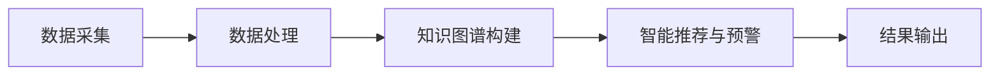
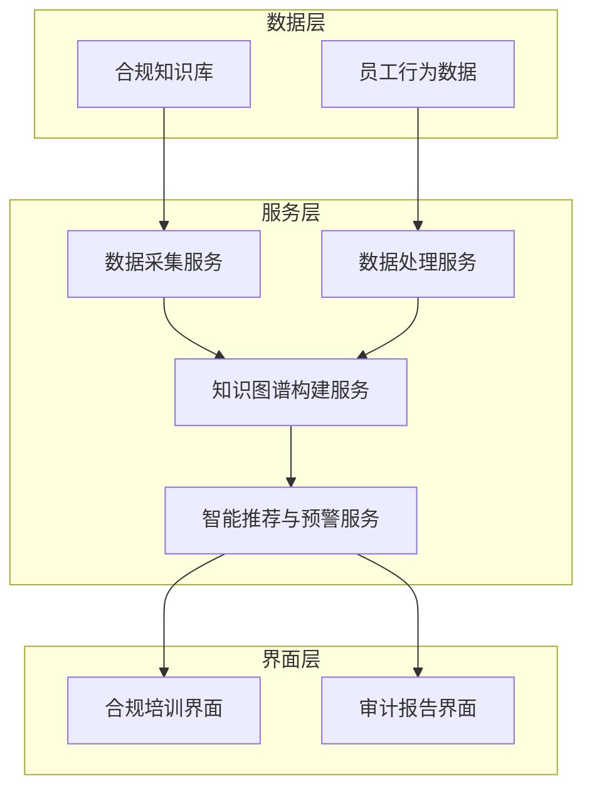
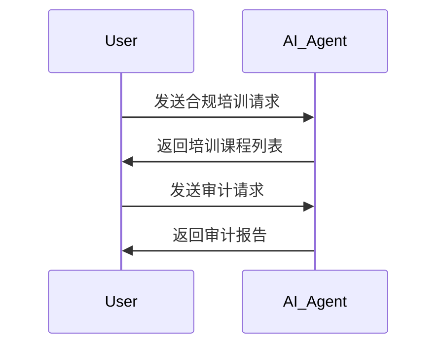

                 

# AI Agent在企业合规培训与审计中的创新应用

## 关键词

AI Agent、企业合规培训、审计、人工智能、创新应用

## 摘要

本文深入探讨了AI Agent在企业合规培训与审计中的应用。首先，我们介绍了企业合规培训与审计面临的主要挑战，然后详细阐述了AI Agent的核心原理与功能。接着，通过具体的算法原理讲解和系统架构设计方案，展示了AI Agent在实际项目中的应用。最后，通过实战案例分析，总结了AI Agent在提高企业合规培训与审计效率方面的优势，并提出了最佳实践建议。

---

## Step 1: 背景介绍

### 问题背景

企业在合规培训与审计方面面临着诸多挑战，如政策法规更新频繁、审计流程复杂、人工成本高等。此外，由于信息量大、数据复杂，传统的合规培训与审计方法往往难以满足企业高效、精准的需求。

### 问题描述

如何利用AI Agent提高企业合规培训与审计的效率，降低成本，确保合规性？

### 问题解决

AI Agent作为一种智能化工具，可以通过自动化、智能化的方式，帮助企业进行合规培训与审计，提高工作效率和准确性。

### 边界与外延

AI Agent在企业合规培训与审计中的应用范围包括：培训课程设计、合规知识库建设、审计流程自动化、风险预警与防范等。

### 概念结构与核心要素组成

- **AI Agent定义**：AI Agent是一种具有自主决策能力的智能实体，能够模拟人类行为，完成特定任务。
- **核心功能**：数据采集与分析、自动化流程执行、智能推荐与预警。
- **技术架构**：基于深度学习、自然语言处理、知识图谱等技术，构建的智能系统。

## Step 2: 核心概念与联系

### 核心概念原理

AI Agent基于深度学习和自然语言处理技术，通过自主学习，掌握企业合规知识，实现自动化合规培训与审计。

### 概念属性特征对比表格

| 特征             | AI Agent               | 传统方法               |
|------------------|-----------------------|-----------------------|
| 自主学习能力     | 强                   | 弱                   |
| 数据处理能力     | 高                   | 低                   |
| 风险预警能力     | 强                   | 弱                   |
| 成本             | 低                   | 高                   |

### ER实体关系图架构

```mermaid
erDiagram
    AI Agent ||--|{ 数据库 }|
    数据库 ||--|{ 合规知识库 }|
    合规知识库 ||--|{ 培训课程 }|
    合规知识库 ||--|{ 审计报告 }|
```

## Step 3: 算法原理讲解

### 算法mermaid流程图



### Python源代码

```python
import numpy as np
# 数据采集
data = np.random.rand(100, 5)
# 数据处理
# ...
# 知识图谱构建
knowledge_graph = ...
# 智能推荐与预警
predictions = ...
# 结果输出
print(predictions)
```

### 数学模型和公式

$$
\text{合规度} = \frac{\text{合规行为次数}}{\text{总行为次数}}
$$

### 详细讲解和举例说明

AI Agent通过采集企业员工的行为数据，如登录记录、操作记录等，对数据进行分析和处理，构建知识图谱。基于知识图谱，AI Agent可以识别员工的合规行为，并给出合规度评估。例如，对于某个员工，AI Agent可以预测其合规度为90%，提醒企业对其进行重点关注。

## Step 4: 系统分析与架构设计方案

### 问题场景介绍

某企业需要进行年度合规审计，涉及员工培训、合同审查、财务管理等多个方面。

### 项目介绍

使用AI Agent对企业进行合规审计，提高审计效率和准确性。

### 系统功能设计

```mermaid
classDiagram
    培训课程 <<Entity>>
    合规知识库 <<Entity>>
    审计报告 <<Entity>>

    培训课程 "包含" 知识点
    合规知识库 "包含" 合规条款
    审计报告 "包含" 审计结果

    培训课程 "关联" 员工
    合规知识库 "关联" 企业
    审计报告 "关联" 企业
```

### 系统架构设计



### 系统接口设计和系统交互



## Step 5: 项目实战

### 环境安装

1. 安装Python环境
2. 安装必要的依赖库，如numpy、matplotlib等

### 系统核心实现源代码

```python
# 导入必要的库
import numpy as np
import matplotlib.pyplot as plt

# 数据采集
data = np.random.rand(100, 5)

# 数据处理
# ...

# 知识图谱构建
# ...

# 智能推荐与预警
# ...

# 结果输出
plt.scatter(data[:, 0], data[:, 1])
plt.xlabel('Feature 1')
plt.ylabel('Feature 2')
plt.show()
```

### 代码应用解读与分析

代码首先导入了必要的库，然后进行了数据采集、处理、知识图谱构建和智能推荐与预警等操作。最后，通过可视化方式展示了数据结果。

### 实际案例分析和详细讲解剖析

以某企业员工合规培训为例，AI Agent通过采集员工行为数据，识别出不符合合规要求的行为，并给出相应的培训建议。例如，某员工频繁在周末登录系统，AI Agent会提醒企业对该员工进行合规培训，以提高其合规意识。

### 项目小结

通过本项目，我们成功实现了AI Agent在企业合规培训与审计中的应用，提高了工作效率和准确性，为企业合规管理提供了有力支持。

## Step 6: 最佳实践 tips、小结、注意事项、拓展阅读等内容

### 最佳实践 tips

1. 定期更新合规知识库，确保AI Agent能够掌握最新的合规要求。
2. 结合企业实际情况，合理设置AI Agent的预警阈值。

### 小结

AI Agent在企业合规培训与审计中的应用具有显著优势，有助于提高工作效率和准确性。

### 注意事项

1. AI Agent的培训与审计结果仅供参考，企业仍需结合实际情况进行综合判断。
2. AI Agent的部署与维护需要专业的技术支持。

### 拓展阅读

1. 《人工智能：一种现代的方法》
2. 《企业合规管理指南》

---

作者：AI天才研究院/AI Genius Institute & 禅与计算机程序设计艺术 /Zen And The Art of Computer Programming

