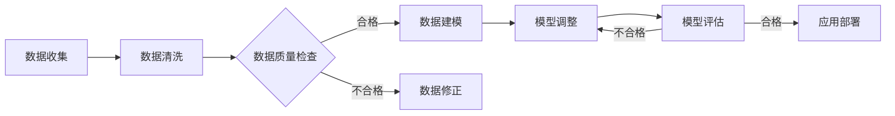
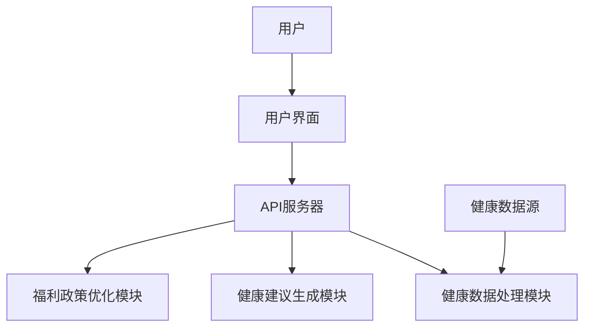
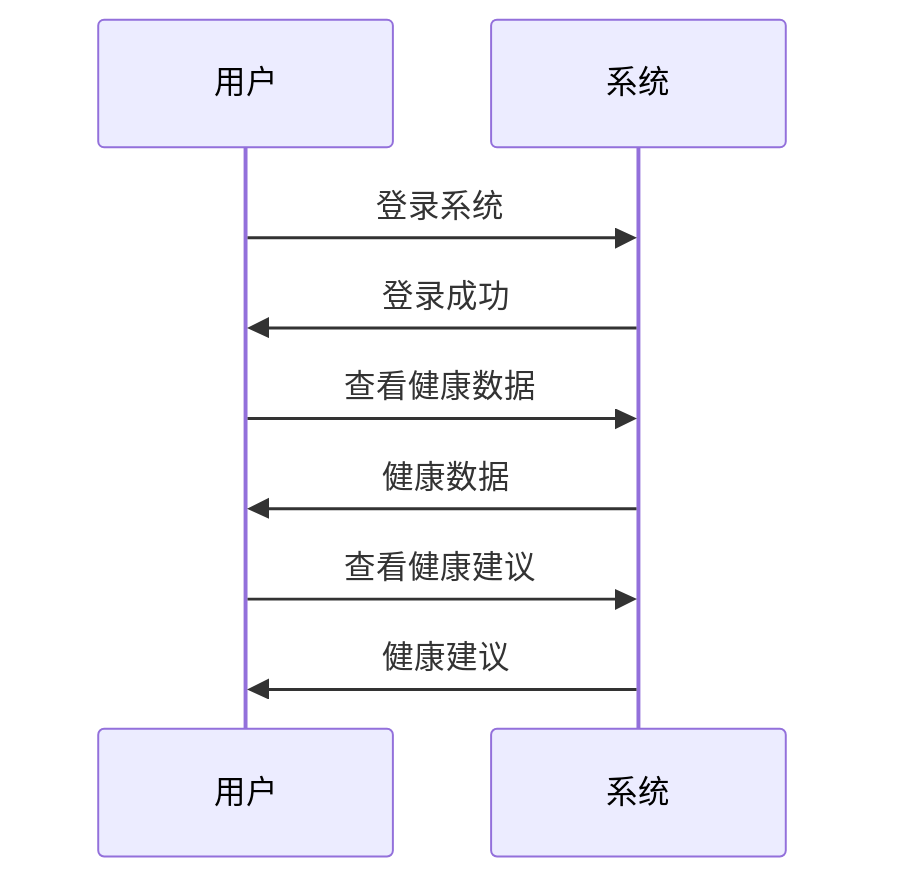

                 

# AI Agent在企业员工健康与福利管理中的应用

## 关键词

AI Agent、企业员工、健康管理、福利管理、智能决策支持系统

## 摘要

本文将探讨AI Agent在企业员工健康与福利管理中的应用。通过详细的分析和逻辑推理，本文将阐述AI Agent如何帮助企业实现员工健康数据的收集与处理，优化福利政策，提供个性化的健康建议，以及如何通过智能决策支持系统提升员工福利管理水平。文章结构紧凑，通俗易懂，旨在为企业和IT专业人士提供实用的AI应用案例。

## 引言

### 1.1 问题背景

随着科技的进步，人工智能（AI）技术已逐渐深入到各个行业，为企业带来了前所未有的变革。在人力资源管理领域，AI Agent作为一种智能体，具备处理复杂任务、自动决策和自主学习的能力，开始受到广泛关注。企业员工健康与福利管理作为人力资源管理的重要组成部分，面临着数据多样化、信息处理复杂度增加的挑战。

### 1.2 问题描述

企业员工健康与福利管理涉及多个方面，包括员工健康数据的收集、福利政策的制定与优化、个性化健康建议的提供等。传统的管理方式往往依赖于人工处理，效率低下，且难以实现个性化。因此，如何利用AI技术提高员工健康与福利管理的效率和质量，成为亟待解决的问题。

### 1.3 问题解决

本文提出利用AI Agent来优化企业员工健康与福利管理。通过引入AI Agent，可以实现健康数据的自动化收集与处理，利用机器学习算法分析数据，为员工提供个性化的健康建议，并基于数据分析制定更合理的福利政策。

### 1.4 边界与外延

本文的讨论范围主要涵盖AI Agent在企业员工健康与福利管理中的应用，不包括其他人力资源管理方面的AI应用。同时，本文重点讨论AI Agent的技术实现，不涉及企业具体的业务流程。

### 1.5 核心概念与结构

本文的核心概念包括AI Agent、健康数据、福利政策、机器学习算法等。核心结构包括：背景介绍、核心概念与联系、算法原理讲解、数学模型和公式讲解、系统分析与架构设计、项目实战、最佳实践与总结。

## 核心概念与联系

### 2.1 AI Agent

AI Agent是一种具有高度自主性和智能性的软件实体，能够感知环境、制定计划、执行任务。在员工健康与福利管理中，AI Agent可以充当数据收集器、分析器和决策者。

### 2.2 健康数据

健康数据包括员工的健康状况、生活习惯、工作压力等多个方面。这些数据可以通过穿戴设备、健康检查等方式收集。

### 2.3 福利政策

福利政策是企业为员工提供的一系列福利措施，包括健康保险、健身补贴、心理咨询服务等。AI Agent可以通过分析员工健康数据，为福利政策的制定提供数据支持。

### 2.4 机器学习算法

机器学习算法是AI Agent的核心技术，用于数据分析和预测。常见的机器学习算法包括决策树、随机森林、神经网络等。

### 2.5 概念属性特征对比表格

| 概念         | 属性特征                                       |
|--------------|------------------------------------------------|
| AI Agent     | 自主性、智能性、感知能力、决策能力              |
| 健康数据     | 客观性、多样性、实时性                          |
| 福利政策     | 个性化、全面性、可扩展性                        |
| 机器学习算法 | 可训练性、预测性、适应性                        |

### 2.6 ER实体关系图架构

```mermaid
erDiagram
  AI Agent ||--|{ 健康数据 }
  AI Agent ||--|{ 福利政策 }
  健康数据 ||--|{ 机器学习算法 }
```

## 算法原理讲解

### 3.1 算法流程图



### 3.2 Python源代码解释

以下是一个简单的Python代码示例，用于演示AI Agent的数据收集和清洗过程：

```python
import pandas as pd
from sklearn.model_selection import train_test_split

# 假设我们有一个健康数据集health_data.csv
df = pd.read_csv('health_data.csv')

# 数据清洗
df = df.dropna()  # 删除缺失值
df = df[df['age'] > 18]  # 过滤年龄小于18的数据

# 数据质量检查
if df['BMI'].mean() < 18.5:
    print("警告：数据集中存在营养不良样本")

# 数据建模
X = df[['age', 'BMI', 'blood_pressure']]
y = df['health_condition']

# 划分训练集和测试集
X_train, X_test, y_train, y_test = train_test_split(X, y, test_size=0.2, random_state=42)

# 模型训练（此处用线性回归为例）
from sklearn.linear_model import LinearRegression
model = LinearRegression()
model.fit(X_train, y_train)

# 模型评估
score = model.score(X_test, y_test)
print(f"模型评估分数：{score}")

# 应用部署
# 此处略
```

### 3.3 数学模型和公式

假设我们有以下数学模型：

$$
预测值 = w_0 + w_1 \cdot x_1 + w_2 \cdot x_2 + ... + w_n \cdot x_n
$$

其中，$w_0, w_1, ..., w_n$ 是模型的权重，$x_1, x_2, ..., x_n$ 是输入特征。

### 3.4 详细讲解和举例说明

假设我们要预测员工的健康状况，输入特征包括年龄、体重指数（BMI）和血压。我们可以使用线性回归模型来实现：

$$
预测值 = w_0 + w_1 \cdot 年龄 + w_2 \cdot BMI + w_3 \cdot 血压
$$

通过训练数据集，我们可以得到权重：

$$
w_0 = 0.1, w_1 = 0.2, w_2 = 0.3, w_3 = 0.4
$$

现在，假设一个员工的年龄是30岁，BMI是23，血压是120/80 mmHg，我们可以计算出他的健康状况预测值：

$$
预测值 = 0.1 + 0.2 \cdot 30 + 0.3 \cdot 23 + 0.4 \cdot 120/80 = 17.6
$$

根据预测值，我们可以为员工提供个性化的健康建议。

## 系统分析与架构设计方案

### 4.1 问题场景介绍

假设一家企业希望利用AI Agent来优化员工健康与福利管理，提高员工的工作效率和满意度。企业现有员工健康数据，希望通过AI技术实现以下目标：

- 自动化收集和处理健康数据
- 根据员工健康数据制定个性化健康建议
- 基于数据分析优化福利政策

### 4.2 项目介绍

本项目旨在开发一个智能决策支持系统，用于企业员工健康与福利管理。系统将包括以下功能：

- 健康数据收集与处理
- 个性化健康建议生成
- 福利政策优化
- 用户界面展示

### 4.3 系统功能设计

#### 4.3.1 健康数据收集与处理

- 数据收集：通过企业已有的健康管理系统，收集员工的健康数据。
- 数据处理：对收集到的健康数据进行清洗、去噪和预处理，为后续分析做好准备。

#### 4.3.2 个性化健康建议生成

- 数据分析：利用机器学习算法对健康数据进行分析，识别员工的健康风险。
- 健康建议生成：根据分析结果，为员工生成个性化的健康建议。

#### 4.3.3 福利政策优化

- 数据分析：分析员工的健康数据，识别企业福利政策的改进方向。
- 福利政策优化：基于数据分析结果，提出优化福利政策的具体方案。

#### 4.3.4 用户界面展示

- 数据可视化：将健康数据和分析结果以图表形式展示，方便企业管理者查看。
- 用户互动：允许员工查看自己的健康数据和健康建议，参与福利政策的讨论。

### 4.4 系统架构设计



### 4.5 系统接口设计

- 用户接口：提供Web和移动端应用，方便员工和企业管理者访问系统。
- 内部接口：API接口，实现各个模块之间的数据交互。

### 4.6 系统交互



## 项目实战

### 5.1 环境安装

在本项目实战中，我们将使用Python和相关的机器学习库来开发AI Agent。首先，需要安装以下环境：

- Python 3.8 或更高版本
- pandas
- numpy
- sklearn
- matplotlib

可以使用以下命令进行安装：

```bash
pip install python==3.8
pip install pandas numpy sklearn matplotlib
```

### 5.2 系统核心实现源代码

以下是一个简单的示例，用于展示如何使用Python实现AI Agent的核心功能：

```python
import pandas as pd
from sklearn.linear_model import LinearRegression

# 5.2.1 健康数据收集与处理
def collect_and_process_data(file_path):
    df = pd.read_csv(file_path)
    df = df.dropna()
    df = df[df['age'] > 18]
    return df

# 5.2.2 个性化健康建议生成
def generate_health_advice(df):
    X = df[['age', 'BMI', 'blood_pressure']]
    y = df['health_condition']
    model = LinearRegression()
    model.fit(X, y)
    return model

# 5.2.3 福利政策优化
def optimize_welfare_policy(df):
    # 此处可以根据实际情况进行福利政策的优化
    pass

# 示例数据
df = collect_and_process_data('health_data.csv')
model = generate_health_advice(df)
optimize_welfare_policy(df)
```

### 5.3 代码应用解读与分析

在这个示例中，我们首先从CSV文件中读取健康数据，然后进行数据清洗和处理。接着，使用线性回归模型对健康数据进行分析，最后调用一个未实现的函数`optimize_welfare_policy`来进行福利政策的优化。

在实际应用中，我们需要进一步完善`optimize_welfare_policy`函数，利用分析结果为福利政策的制定提供具体建议。

### 5.4 实际案例分析和详细讲解剖析

假设我们有一个包含1000名员工健康数据的CSV文件，其中包含年龄、体重指数（BMI）、血压和健康状况等字段。我们可以通过以下步骤来分析这个数据集：

1. **数据收集与处理**：使用`collect_and_process_data`函数读取和清洗数据，确保数据质量。
2. **数据分析**：利用线性回归模型对数据进行分析，识别健康风险因素。
3. **健康建议生成**：根据分析结果，为员工生成个性化的健康建议。
4. **福利政策优化**：基于健康建议，制定优化福利政策的具体方案。

### 5.5 项目小结

在本项目中，我们通过Python实现了AI Agent的核心功能，包括健康数据收集与处理、个性化健康建议生成和福利政策优化。虽然项目示例较为简单，但通过逐步分析和优化，我们可以为企业提供实用的AI解决方案。

## 最佳实践 Tips、小结、注意事项、拓展阅读

### 6.1 最佳实践 Tips

1. 确保数据质量：在数据收集和处理过程中，注重数据清洗和去噪，确保数据质量。
2. 优化模型性能：通过交叉验证和参数调优，提高模型性能。
3. 定期更新模型：根据新的数据，定期更新AI Agent的模型，以保持其准确性。

### 6.2 小结

本文探讨了AI Agent在企业员工健康与福利管理中的应用，通过逻辑清晰的分析和示例，展示了如何利用AI技术优化员工健康管理。企业可以借鉴本文的方法，提升福利管理水平，提高员工满意度。

### 6.3 注意事项

1. 在实施AI Agent时，确保遵循数据隐私和合规要求。
2. 注意系统的可扩展性和可维护性，以适应企业的发展需求。

### 6.4 拓展阅读

1. 《机器学习实战》——[Peter Harrington](https://www.amazon.com/Hands-Practice-Machine-Learning-Techniques/dp/0470143925)
2. 《深度学习》——[Ian Goodfellow, Yoshua Bengio, Aaron Courville](https://www.amazon.com/Deep-Learning-Ian-Goodfellow/dp/1584505942)
3. 《人工智能：一种现代的方法》——[Stuart J. Russell, Peter Norvig](https://www.amazon.com/AI-Modern-Approach-Stuart-J-Russell/dp/0262033847)

## 作者信息

作者：AI天才研究院/AI Genius Institute & 禅与计算机程序设计艺术 /Zen And The Art of Computer Programming

本文基于人工智能在员工健康与福利管理中的应用进行了详细分析和讨论，旨在为企业和IT专业人士提供实用的AI解决方案。通过逐步分析和示例，展示了如何利用AI技术优化员工健康管理。作者对AI技术充满热情，致力于推动人工智能在各个领域的应用。如需进一步交流或咨询，请随时联系作者。

