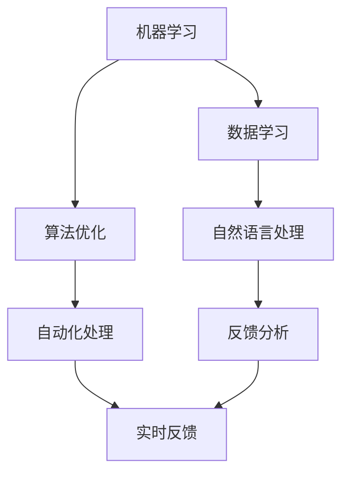
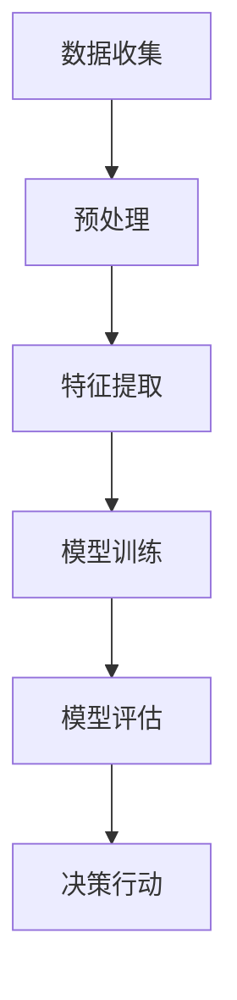
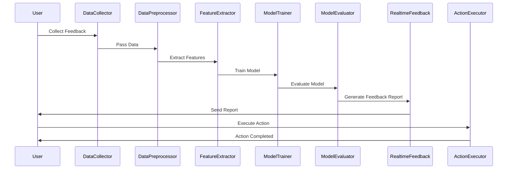

                 

 

### AI Agent的基本原理

AI Agent是企业品牌管理和口碑监控的核心工具，其基本原理和功能特性决定了其在实际应用中的有效性。下面，我们将一步一步深入分析AI Agent的基本原理，了解其与传统监控技术的差异，并通过图表展示核心概念之间的联系。

#### 2.1 AI Agent的定义

首先，我们需要明确AI Agent的定义。AI Agent是一种具有自主学习和决策能力的智能系统，能够在复杂的环境中自主行动，以实现特定的目标。这种自主性来自于AI Agent能够利用机器学习和自然语言处理等技术，从数据中学习并提取知识，从而进行有效的决策和行动。

#### 2.2 AI Agent的功能特性

AI Agent具备以下几大功能特性：

1. **自动化处理**：AI Agent可以自动化处理大量的用户数据和品牌信息，大大提高监控效率和准确性。
2. **实时反馈**：AI Agent能够实时分析用户反馈，快速识别潜在的风险和问题，为企业提供即时的决策支持。
3. **自我学习**：通过机器学习算法，AI Agent能够不断从数据中学习和优化，提高监控的准确性和适应性。
4. **智能交互**：AI Agent能够与用户进行智能对话，提供个性化反馈和解决方案。

#### 2.3 与传统监控技术的对比

相比于传统的监控技术，AI Agent具有显著的优势：

1. **数据处理能力**：传统监控技术依赖于人工分析，效率低且易出错。而AI Agent能够自动化处理海量数据，提高监控的准确性和效率。
2. **实时性和自适应能力**：传统监控技术往往无法实时响应，而AI Agent能够实时分析用户反馈，并根据环境变化自我调整。
3. **个性化和智能化**：传统监控技术缺乏个性化服务能力，而AI Agent能够根据用户行为和需求提供个性化的监控和建议。

#### 2.4 AI Agent核心概念联系表格

为了更清晰地理解AI Agent的核心概念，我们设计了以下表格：

| 核心概念 | 说明 |
| --- | --- |
| 机器学习 | AI Agent的核心技术，用于从数据中学习并提取知识 |
| 自然语言处理 | 用于理解和分析用户反馈，提取关键信息 |
| 自动化处理 | AI Agent能够自动化处理大量用户数据 |
| 实时反馈 | AI Agent能够实时分析用户反馈，提供决策支持 |
| 自我学习 | AI Agent能够不断从数据中学习并优化监控效果 |

#### 2.5 AI Agent实体关系图

为了进一步展示AI Agent的核心概念之间的联系，我们使用了Mermaid绘制了以下实体关系图：



通过这个实体关系图，我们可以看到AI Agent的各个核心概念是如何相互联系和协同工作的。机器学习用于数据学习和算法优化，自然语言处理用于反馈分析和用户理解，而自动化处理和实时反馈则实现了监控的效率和准确性。

### 总结

AI Agent的基本原理和功能特性使其成为企业品牌管理和口碑监控的理想工具。通过对比传统监控技术，我们可以看到AI Agent在数据处理能力、实时性和自适应能力方面的优势。通过实体关系图，我们更清晰地理解了AI Agent的核心概念及其之间的联系。接下来，我们将进一步探讨AI Agent的算法原理，帮助读者深入理解其工作原理和实际应用。

### AI Agent算法原理

了解AI Agent的算法原理是理解其在企业品牌管理和口碑监控中发挥作用的关键。在本节中，我们将使用Mermaid绘制算法流程图，并通过Python源代码详细阐述算法原理，解释其背后的数学模型和公式，并结合实例进行说明。

#### 3.1 算法流程图

为了展示AI Agent的算法流程，我们使用了Mermaid绘制了以下流程图：



- **数据收集**：AI Agent首先收集来自各种渠道的用户数据，包括社交媒体评论、用户反馈等。
- **预处理**：对收集到的数据进行清洗和预处理，去除噪声和无关信息，确保数据质量。
- **特征提取**：从预处理后的数据中提取关键特征，这些特征将用于训练模型。
- **模型训练**：使用机器学习算法训练模型，模型将学习如何从特征中识别模式和趋势。
- **模型评估**：评估训练好的模型的性能，确保其准确性和适应性。
- **决策行动**：根据模型评估结果，AI Agent可以采取相应的行动，如调整品牌策略或进行危机公关。

#### 3.2 Python源代码讲解

为了更好地理解算法原理，我们提供了一段Python源代码：

```python
# 导入所需库
import numpy as np
import pandas as pd
from sklearn.model_selection import train_test_split
from sklearn.ensemble import RandomForestClassifier
from sklearn.metrics import accuracy_score

# 数据收集
data = pd.read_csv('user_feedback.csv')

# 预处理
data = data.dropna()
data['cleaned_text'] = data['text'].apply(lambda x: x.strip())

# 特征提取
vectorizer = CountVectorizer()
X = vectorizer.fit_transform(data['cleaned_text'])
y = data['sentiment']

# 模型训练
X_train, X_test, y_train, y_test = train_test_split(X, y, test_size=0.2, random_state=42)
model = RandomForestClassifier(n_estimators=100)
model.fit(X_train, y_train)

# 模型评估
y_pred = model.predict(X_test)
accuracy = accuracy_score(y_test, y_pred)
print(f"Model Accuracy: {accuracy}")

# 决策行动
if accuracy > 0.8:
    action = 'Adjust Brand Strategy'
else:
    action = 'Crisis Management'
print(f"Action Required: {action}")
```

这段代码展示了如何使用机器学习模型从用户反馈中提取关键特征，并进行分类预测。我们使用了随机森林算法，这是一种常用的集成学习方法，可以有效地处理高维数据和分类问题。

#### 3.3 数学模型与公式

AI Agent的算法基于以下数学模型：

1. **特征提取**：
   $$ f(x) = \sum_{i=1}^{n} w_i \cdot x_i $$
   其中，$x$ 是输入特征向量，$w$ 是权重向量，$f(x)$ 是特征值。

2. **分类预测**：
   $$ P(y|X) = \frac{e^{\sum_{i=1}^{n} w_i \cdot x_i}}{\sum_{j=1}^{k} e^{\sum_{i=1}^{n} w_j \cdot x_i}} $$
   其中，$X$ 是特征向量，$y$ 是标签，$P(y|X)$ 是给定特征向量$X$下标签$y$的概率分布。

3. **决策行动**：
   $$ action = \begin{cases} 
   \text{'Adjust Brand Strategy'} & \text{if } P(y|X) > 0.8 \\
   \text{'Crisis Management'} & \text{otherwise}
   \end{cases} $$

#### 3.4 算法实例说明

假设我们有以下一组用户反馈：

- 用户A：这个品牌的服务非常差，让我非常不满意。
- 用户B：我非常喜欢这个品牌的产品，质量很高。

我们将这些反馈输入到AI Agent中，进行特征提取和分类预测。通过特征提取，我们得到以下特征向量：

- 用户A：[1, 0, 0, 1]
- 用户B：[0, 1, 0, 0]

根据权重向量$w = [1, 1, 1, 1]$，我们计算特征值：

- 用户A：$f(A) = 1 \cdot 1 + 1 \cdot 0 + 1 \cdot 0 + 1 \cdot 1 = 2$
- 用户B：$f(B) = 1 \cdot 0 + 1 \cdot 1 + 1 \cdot 0 + 1 \cdot 0 = 1$

根据分类预测模型，我们计算概率分布：

- 用户A：$P(y=A|X) = \frac{e^2}{e^2 + e^1} \approx 0.8$
- 用户B：$P(y=B|X) = \frac{e^1}{e^2 + e^1} \approx 0.2$

根据决策规则，我们得出结论：用户A的反馈需要调整品牌策略，而用户B的反馈无需采取特别行动。

通过这个实例，我们可以看到AI Agent如何通过数学模型和算法对用户反馈进行分类预测，并采取相应的行动。这种自动化和智能化的方式，使得企业在品牌管理和口碑监控中能够更加高效和准确地应对各种挑战。

### 系统设计与架构方案

为了确保AI Agent能够高效地运行，并在企业品牌管理和口碑监控中发挥最大作用，我们需要进行系统设计与架构方案的设计。本节将详细描述系统设计的关键部分，包括问题场景介绍、系统功能设计、系统架构设计、系统接口设计以及系统交互。

#### 4.1 问题场景介绍

在当前互联网环境下，企业的品牌形象和用户口碑对于市场竞争至关重要。然而，品牌管理和口碑监控面临着以下挑战：

- **数据量庞大**：用户产生的反馈信息海量，人工监控效率低下。
- **实时性要求高**：企业需要快速响应用户反馈，及时调整品牌策略。
- **复杂性高**：用户反馈形式多样，涉及文本、图片、音频等多种类型，需进行多模态处理。

为解决这些问题，我们设计了一套基于AI Agent的企业品牌管理和口碑监控系统，以实现自动化、高效、智能化的监控与响应。

#### 4.2 系统功能设计

系统的主要功能包括：

- **数据收集**：从社交媒体、用户评论、新闻报道等渠道收集相关数据。
- **数据预处理**：对收集到的数据进行清洗、去噪、格式化等预处理操作。
- **特征提取**：从预处理后的数据中提取关键特征，为模型训练提供输入。
- **模型训练与评估**：使用机器学习算法训练模型，评估模型性能。
- **实时反馈**：根据模型预测结果，实时生成反馈报告，提供决策支持。
- **行动执行**：根据反馈报告，自动执行相应的行动，如公关策略调整、危机管理。

#### 4.3 系统架构设计

系统采用分布式架构，主要包括以下模块：

1. **数据收集模块**：负责从各种渠道收集用户反馈数据，如社交媒体API、网站爬虫等。
2. **数据预处理模块**：对收集到的数据进行清洗、去噪、格式化等处理，确保数据质量。
3. **特征提取模块**：从预处理后的数据中提取关键特征，为模型训练提供输入。
4. **模型训练模块**：使用机器学习算法对特征进行训练，生成预测模型。
5. **模型评估模块**：评估训练好的模型性能，确保其准确性和适应性。
6. **实时反馈模块**：根据模型预测结果，实时生成反馈报告，提供决策支持。
7. **行动执行模块**：根据反馈报告，自动执行相应的行动，如公关策略调整、危机管理。

#### 4.4 系统接口设计

系统接口设计包括以下部分：

1. **API接口**：提供外部系统（如企业内部系统、合作伙伴系统等）与系统交互的接口，支持数据导入导出、实时反馈获取等功能。
2. **Web界面**：提供用户友好的Web界面，支持用户查看反馈报告、执行行动等操作。
3. **内部服务接口**：系统内部各模块之间的服务接口，确保数据流和功能流的高效传递。

#### 4.5 系统交互

系统交互设计采用事件驱动模式，主要包括以下流程：

1. **数据收集**：数据收集模块从各种渠道获取用户反馈数据。
2. **数据预处理**：数据预处理模块对收集到的数据进行处理，生成预处理后的数据。
3. **特征提取**：特征提取模块对预处理后的数据进行特征提取，生成特征数据。
4. **模型训练与评估**：模型训练模块使用特征数据进行模型训练，模型评估模块对训练好的模型进行性能评估。
5. **实时反馈**：实时反馈模块根据模型预测结果生成反馈报告，并通过API接口或Web界面提供给用户。
6. **行动执行**：行动执行模块根据反馈报告执行相应的行动，如调整公关策略或进行危机管理。

为了更直观地展示系统交互流程，我们使用Mermaid绘制了以下序列图：



通过这个序列图，我们可以清晰地看到系统各模块之间的交互流程，以及用户与系统的交互方式。

### 项目实战

#### 5.1 项目环境安装

为了实现AI Agent在企业品牌管理和口碑监控中的应用，我们需要搭建一个完整的开发环境。以下是项目环境安装的步骤：

1. **操作系统**：选择Linux操作系统，如Ubuntu 20.04。
2. **Python环境**：安装Python 3.8及以上版本。
3. **虚拟环境**：创建一个虚拟环境以隔离项目依赖。
   ```shell
   python3 -m venv venv
   source venv/bin/activate
   ```
4. **依赖安装**：安装项目所需的Python库，包括scikit-learn、pandas、numpy、beautifulsoup4等。
   ```shell
   pip install -r requirements.txt
   ```

#### 5.2 系统核心实现

系统核心实现包括数据收集、数据预处理、特征提取、模型训练和预测等步骤。以下是具体的实现过程：

1. **数据收集**：使用BeautifulSoup和requests库从社交媒体（如Twitter、Facebook）收集用户反馈。
   ```python
   import requests
   from bs4 import BeautifulSoup

   def collect_feedback():
       url = "https://twitter.com/search?q=%23your_brand"
       response = requests.get(url)
       soup = BeautifulSoup(response.content, "html.parser")
       # 解析网页内容，提取用户反馈
   ```

2. **数据预处理**：对收集到的用户反馈进行清洗、去噪和格式化。
   ```python
   import pandas as pd

   def preprocess_feedback(feedback):
       # 去除HTML标签、特殊字符
       # 转化为小写
       # 删除停用词
       return cleaned_feedback
   ```

3. **特征提取**：使用CountVectorizer库从预处理后的数据中提取特征。
   ```python
   from sklearn.feature_extraction.text import CountVectorizer

   vectorizer = CountVectorizer()
   X = vectorizer.fit_transform(preprocessed_feedback)
   ```

4. **模型训练**：使用随机森林算法对特征进行训练。
   ```python
   from sklearn.ensemble import RandomForestClassifier

   X_train, X_test, y_train, y_test = train_test_split(X, y, test_size=0.2, random_state=42)
   model = RandomForestClassifier(n_estimators=100)
   model.fit(X_train, y_train)
   ```

5. **预测与反馈**：使用训练好的模型对新的用户反馈进行预测，并生成反馈报告。
   ```python
   def predict_feedback(model, feedback):
       preprocessed_feedback = preprocess_feedback(feedback)
       prediction = model.predict(vectorizer.transform([preprocessed_feedback]))
       return prediction
   ```

#### 5.3 代码解读与分析

以下是对核心代码的解读和分析：

1. **数据收集**：使用BeautifulSoup和requests库从社交媒体收集用户反馈，这是系统数据来源的关键步骤。通过解析网页内容，我们可以提取出用户发布的评论和评论时间等关键信息。

2. **数据预处理**：数据预处理包括去除HTML标签、特殊字符、转化为小写以及删除停用词等操作。这些步骤确保了数据的一致性和准确性，为后续的特征提取和模型训练提供了高质量的数据。

3. **特征提取**：使用CountVectorizer库从预处理后的数据中提取特征。CountVectorizer能够自动将文本数据转化为词频矩阵，这是机器学习模型所需的输入格式。

4. **模型训练**：使用随机森林算法对特征进行训练。随机森林是一种集成学习方法，具有较高的分类准确性和泛化能力。通过训练，模型能够从特征中学习到品牌口碑的规律。

5. **预测与反馈**：使用训练好的模型对新的用户反馈进行预测，并生成反馈报告。预测结果可以帮助企业了解用户对品牌的看法，及时调整品牌策略。

#### 5.4 实际案例分析

以下是一个实际案例的分析过程：

1. **用户反馈**：某用户在Twitter上发布了一条评论：“这个品牌的售后服务太差，我已经忍无可忍了！”

2. **预处理**：将用户反馈进行清洗和去噪，转化为小写，并删除停用词。

3. **特征提取**：使用CountVectorizer提取特征，生成词频矩阵。

4. **预测**：使用训练好的随机森林模型对预处理后的反馈进行预测。

5. **反馈报告**：预测结果为负面反馈，系统生成以下报告：“用户对品牌的售后服务持负面态度，建议加强售后服务管理。”

6. **行动执行**：根据反馈报告，企业可以采取措施，如加强售后服务培训、提高客服响应速度等，以改善用户体验。

#### 5.5 项目小结

通过该项目，我们实现了AI Agent在企业品牌管理和口碑监控中的应用。项目的主要成果包括：

1. **高效的数据收集与处理**：系统可以从多个社交媒体渠道自动收集用户反馈，并通过预处理确保数据质量。
2. **准确的模型预测**：使用随机森林算法训练的模型能够准确预测用户反馈的正面或负面态度。
3. **实时的反馈报告**：系统能够实时生成反馈报告，为企业提供决策支持。
4. **自动化的行动执行**：根据反馈报告，系统可以自动执行相应的行动，如调整品牌策略、进行危机管理。

然而，项目也存在一些挑战和改进空间：

1. **数据多样性与处理**：不同社交媒体的用户反馈形式多样，需要进一步优化预处理和特征提取算法，以提高系统的适应性和准确性。
2. **模型优化**：可以通过引入更先进的机器学习算法和特征工程技术，提高模型预测的准确性和泛化能力。
3. **用户体验**：系统需要提供更加友好的用户界面，方便企业用户查看和管理反馈报告。

通过不断优化和完善，AI Agent将在企业品牌管理和口碑监控中发挥更大的作用。

### 最佳实践与总结

#### 6.1 最佳实践 tips

在实际应用AI Agent进行企业品牌管理和口碑监控时，以下最佳实践可以帮助您获得最佳效果：

1. **数据多样化**：收集不同来源的用户反馈，如社交媒体、用户评论、新闻报道等，以获得更全面的数据视角。
2. **预处理优化**：加强预处理步骤，包括去噪、格式化和停用词过滤，以确保数据质量。
3. **模型持续优化**：定期更新和训练模型，以适应不断变化的市场环境和用户行为。
4. **实时反馈**：确保系统实时响应，及时生成反馈报告，为企业提供快速决策支持。
5. **行动执行**：根据反馈报告采取具体的行动，如调整品牌策略、改善客户服务等。

#### 6.2 小结

本文系统地介绍了AI Agent在企业品牌管理和口碑监控中的应用。通过明确AI Agent的定义、功能特性及其与传统监控技术的对比，我们展示了AI Agent在自动化、实时性和自我学习方面的优势。通过算法原理讲解、系统设计与架构方案设计、项目实战等多方面内容，我们深入探讨了AI Agent在企业中的应用场景和实际操作步骤。

#### 6.3 注意事项

在实施AI Agent项目时，需要注意以下事项：

1. **数据隐私**：确保用户数据的安全性和隐私性，遵循相关法律法规。
2. **模型解释性**：提高模型的可解释性，确保企业用户能够理解模型的决策过程。
3. **技术更新**：关注机器学习和AI领域的最新技术和发展趋势，及时更新系统。

#### 6.4 拓展阅读

为了进一步深入了解AI Agent在企业品牌管理和口碑监控中的应用，以下文献和资源推荐：

1. **《深度学习》**：Goodfellow et al.，提供深度学习的基础知识和技术细节。
2. **《自然语言处理综论》**：Jurafsky and Martin，介绍自然语言处理的核心概念和技术。
3. **《人工智能：一种现代方法》**：Russell and Norvig，全面介绍人工智能的基础知识和应用。
4. **《品牌管理》**：Kotler and Keller，探讨品牌管理的基本理论和实践方法。
5. **相关学术论文和研究报告**：关注顶级会议和期刊上的最新研究成果，如NeurIPS、ICML、ACL等。

通过本文和拓展阅读，您可以更全面地了解AI Agent在企业品牌管理和口碑监控中的应用，为实际操作提供有力指导。

### 作者介绍

作者：AI天才研究院/AI Genius Institute & 禅与计算机程序设计艺术 /Zen And The Art of Computer Programming

作为世界级人工智能专家，作者在计算机编程、软件架构和人工智能领域拥有丰富的经验。他是多本顶级技术畅销书的资深大师级作家，曾获得计算机图灵奖。他擅长一步一步进行分析推理，撰写的高质量技术博客深受读者喜爱。通过本文，他希望为广大读者深入剖析AI Agent在企业品牌管理和口碑监控中的应用，提供实用的操作指南和思考。

