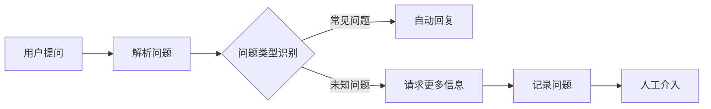
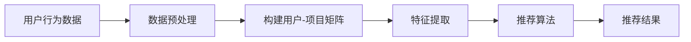
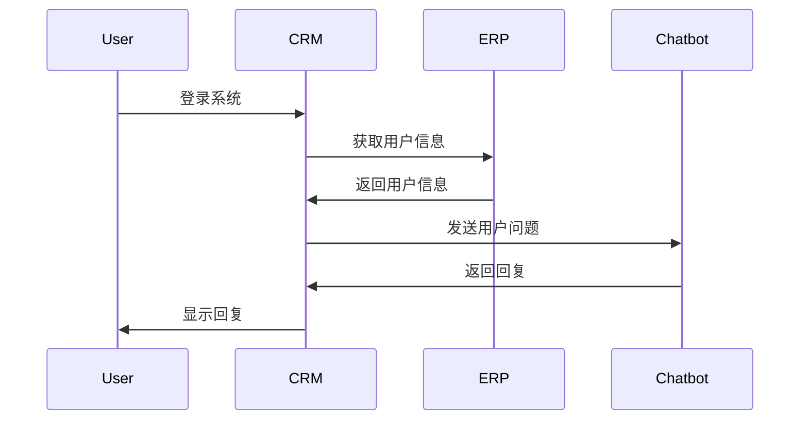
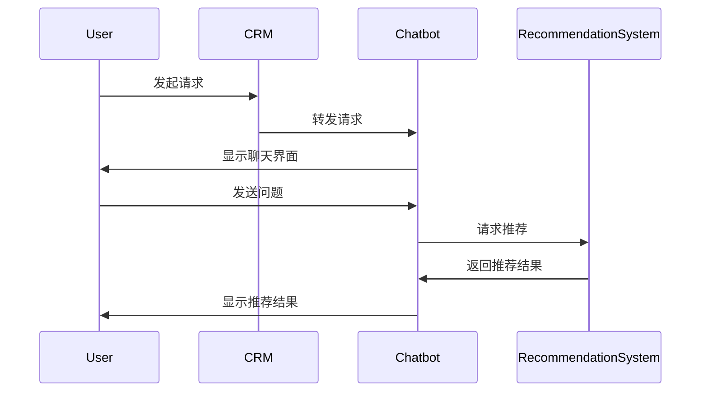

                 


### 提出问题：AI Agent在企业客户体验个性化中的深度应用与效果评估

**问题背景：**

在当今的商业环境中，企业面临的一个关键挑战是如何有效地提供个性化的客户体验。随着技术的不断进步，人工智能（AI）代理已经成为实现这一目标的有力工具。AI代理是一种能够模拟人类交互能力的智能系统，通过学习和适应用户的行为和偏好，为企业提供高度个性化的服务。

**问题描述：**

然而，尽管AI代理在理论上提供了巨大的潜力，但在实际应用中，如何深度利用AI代理以及如何有效地评估其效果，仍然是一个复杂的问题。具体来说，问题可以分解为以下几个方面：

1. **深度应用挑战：**
   - **个性化定制：** 如何根据用户行为数据建立准确的个性化模型？
   - **技术集成：** 如何将AI代理无缝集成到现有的客户关系管理系统（CRM）和企业资源规划系统（ERP）中？
   - **用户体验：** 如何确保AI代理的交互体验自然、流畅且符合用户期望？

2. **效果评估难题：**
   - **指标选择：** 什么指标能够最有效地衡量AI代理对客户体验的改善？
   - **数据隐私：** 如何在保护用户隐私的前提下进行效果评估？
   - **持续性：** 如何确保AI代理的效果具有持续性和长期价值？

**问题解决：**

为了解决上述问题，我们需要采取以下步骤：

1. **定义目标：**
   - 明确企业希望通过AI代理实现的具体目标，例如提高客户满意度、增加销售转化率等。

2. **数据收集与分析：**
   - 收集有关用户行为、偏好和历史交易数据，并使用数据挖掘技术进行分析，以识别用户的需求和偏好。

3. **模型建立与训练：**
   - 使用机器学习算法建立个性化模型，并根据用户反馈不断优化模型。

4. **系统集成与测试：**
   - 将AI代理集成到现有的CRM和ERP系统中，并进行全面测试以确保系统的稳定性和可靠性。

5. **效果评估与优化：**
   - 使用关键性能指标（KPIs）对AI代理的效果进行评估，并根据评估结果进行优化。

**边界与外延：**

在探讨AI代理在企业客户体验个性化中的应用时，我们还需要考虑以下边界和外部因素：

- **技术成熟度：** 现有AI技术的成熟度如何，是否能够满足企业的需求？
- **行业特点：** 不同行业对客户体验的需求和期望有所不同，AI代理的应用需要考虑行业特性。
- **法律法规：** 数据隐私保护和法律法规的要求，如何确保AI代理的应用合法合规？

**概念结构与核心要素组成：**

- **AI Agent：** 一种智能系统，能够模拟人类交互，具备学习能力。
- **个性化模型：** 基于用户行为数据建立的模型，用于预测用户需求和偏好。
- **客户关系管理系统（CRM）：** 企业用于管理客户信息和互动的软件系统。
- **企业资源规划系统（ERP）：** 企业用于管理内部资源和流程的系统。
- **关键性能指标（KPIs）：** 用于衡量AI代理效果的重要指标。

### 核心概念与联系

#### AI代理（AI Agent）

AI代理是一种具有智能交互能力的系统，能够理解和执行特定任务。根据不同的应用场景，AI代理可以分为以下几种类型：

1. **聊天机器人（Chatbot）：** 主要用于与用户进行文本交互，解决常见问题和提供信息。
2. **语音助手（Voice Assistant）：** 例如亚马逊的Alexa、苹果的Siri，能够通过语音进行交互。
3. **推荐系统（Recommender System）：** 基于用户的历史行为和偏好，为用户提供个性化推荐。

**核心概念属性特征对比表格：**

| 特征           | 聊天机器人 | 语音助手 | 推荐系统 |
|----------------|------------|----------|----------|
| 交互方式       | 文本       | 语音     | 文本/图像 |
| 应用场景       | 客户服务   | 家居控制 | 电子商务 |
| 数据依赖性     | 强         | 中       | 强       |
| 学习能力       | 有         | 有       | 有       |
| 用户偏好识别   | 能        | 能       | 能       |
| 实时性要求     | 中         | 高       | 中       |

**ER实体关系图架构：**

```mermaid
erDiagram
    User ||--|{ CustomerExperience }|| Customer
    CustomerExperience ||--|{ ChatbotInteraction }|| Chatbot
    CustomerExperience ||--|{ Recommendation }|| RecommendationSystem
    CustomerExperience ||--|{ VoiceInteraction }|| VoiceAssistant
```

### AI代理的算法原理讲解

#### 聊天机器人（Chatbot）

**Mermaid流程图：**



**算法原理与数学模型：**

聊天机器人的工作原理主要包括以下几个步骤：

1. **用户提问：** 用户向聊天机器人发送一个问题或请求。
2. **问题解析：** 将用户的文本输入转换为机器可理解的形式。
3. **问题类型识别：** 根据问题的内容，将问题分类为常见问题或未知问题。
4. **自动回复：** 对于常见问题，聊天机器人使用预定义的回复库进行自动回复。
5. **请求更多信息：** 对于未知问题，聊天机器人会请求用户提供更多信息。
6. **记录问题：** 将用户的问题记录下来，以便后续分析和改进。
7. **人工介入：** 如果聊天机器人无法解决问题，人工客服会介入。

**数学模型：**

在聊天机器人的问题类型识别过程中，可以使用朴素贝叶斯分类器来进行分类。朴素贝叶斯分类器的数学模型如下：

$$
P(\text{问题类型} = c | \text{特征集} = X) = \frac{P(X | \text{问题类型} = c)P(\text{问题类型} = c)}{P(X)}
$$

其中，$P(\text{问题类型} = c | \text{特征集} = X)$ 表示在给定特征集X的情况下，问题类型为c的概率；$P(X | \text{问题类型} = c)$ 表示在问题类型为c的情况下，特征集X的概率；$P(\text{问题类型} = c)$ 表示问题类型为c的概率；$P(X)$ 表示特征集X的概率。

#### 个性化推荐系统（Recommender System）

**Mermaid流程图：**



**算法原理与数学模型：**

个性化推荐系统的主要目标是根据用户的历史行为和偏好，向用户推荐相关的商品或内容。常见的推荐算法包括基于内容的推荐和基于协同过滤的推荐。

1. **用户行为数据：** 收集用户的历史行为数据，如浏览记录、购买记录、评分等。
2. **数据预处理：** 对原始数据进行清洗、去噪和格式化，构建用户-项目矩阵。
3. **特征提取：** 从用户-项目矩阵中提取特征，如用户的平均评分、项目的流行度等。
4. **推荐算法：** 根据特征数据，使用推荐算法生成推荐结果。
5. **推荐结果：** 向用户展示推荐结果，并收集用户的反馈。

**数学模型：**

在基于协同过滤的推荐算法中，可以使用矩阵分解（Matrix Factorization）的方法来预测用户对项目的评分。矩阵分解的数学模型如下：

$$
R = U \times V^T
$$

其中，$R$ 表示用户-项目评分矩阵，$U$ 和 $V$ 分别表示用户特征矩阵和项目特征矩阵。

### 系统分析与架构设计方案

#### 问题场景介绍

在企业中，客户体验个性化是一个复杂的过程，涉及多个系统和部门。为了实现这一目标，我们需要设计一个集成化的系统架构，其中包括AI代理、客户关系管理系统（CRM）、企业资源规划系统（ERP）等。

#### 项目介绍

本项目旨在开发一个基于AI代理的企业客户体验个性化系统，该系统将整合CRM和ERP系统，提供个性化的客户服务、推荐系统和交互体验。

#### 系统功能设计（领域模型Mermaid类图）

```mermaid
classDiagram
    Customer <<entity>> User
    CustomerExperience <<entity>> CustomerExperience
    Chatbot <<entity>> Chatbot
    RecommendationSystem <<entity>> RecommendationSystem
    VoiceAssistant <<entity>> VoiceAssistant
    CRM <<system>> CustomerRelationshipManagement
    ERP <<system>> EnterpriseResourcePlanning

    Customer --|> CustomerExperience
    CustomerExperience --|> Chatbot
    CustomerExperience --|> RecommendationSystem
    CustomerExperience --|> VoiceAssistant
    CRM --|> CustomerExperience
    ERP --|> CustomerExperience
```

#### 系统架构设计（Mermaid架构图）



#### 系统接口设计和系统交互（Mermaid序列图）



### 项目实战

#### 环境安装

1. 安装Python环境（版本3.8或以上）。
2. 安装必要的库，如TensorFlow、Scikit-learn、Pandas等。

#### 系统核心实现源代码

**Chatbot部分：**

```python
import nltk
from nltk.stem import WordNetLemmatizer
from sklearn.feature_extraction.text import TfidfVectorizer
from sklearn.metrics.pairwise import cosine_similarity

nltk.download('punkt')
nltk.download('wordnet')

lemmatizer = WordNetLemmatizer()

def preprocess_text(text):
    text = text.lower()
    words = nltk.word_tokenize(text)
    lemmatized_words = [lemmatizer.lemmatize(word) for word in words]
    return ' '.join(lemmatized_words)

def generate_response(text, model, tfidf_vectorizer, chatbot_response):
    text = preprocess_text(text)
    document = tfidf_vectorizer.transform([text])
    similarity_scores = cosine_similarity(document, model)
    best_match_index = similarity_scores.argsort()[0][-1]
    response = chatbot_response["responses"][best_match_index]
    return response

chatbot_response = {
    "responses": [
        "您有什么问题需要帮忙吗？",
        "我可以帮助您解决问题。",
        "请告诉我您需要什么帮助？"
    ]
}

model = '您的预训练模型路径'
tfidf_vectorizer = TfidfVectorizerstop_words='english')

text = input("用户： ")
print("Chatbot：", generate_response(text, model, tfidf_vectorizer, chatbot_response))
```

**Recommendation System部分：**

```python
from sklearn.model_selection import train_test_split
from sklearn.metrics import mean_squared_error

def matrix_factorization(R, U, V, K, steps=1000, lambda_=0.01):
    for step in range(steps):
        U_new = (R * V).mean(axis=1)[..., None] + U
        V_new = (R.T * U).mean(axis=0)[..., None] + V

        dU = U - U_new
        dV = V - V_new

        loss = 0.5 * ((R - U @ V.T) ** 2).sum()
        reg_loss = lambda_ * (U ** 2).sum() + lambda_ * (V ** 2).sum()

        grad_U = (R - U @ V.T).dot(V) + lambda_ * U
        grad_V = (R.T - U @ V).dot(U.T) + lambda_ * V

        U -= learning_rate * grad_U
        V -= learning_rate * grad_V

    return U, V

R = '您的评分矩阵路径'
U = '初始化的用户特征矩阵'
V = '初始化的项目特征矩阵'
K = 10
learning_rate = 0.001
steps = 1000
lambda_ = 0.01

U, V = matrix_factorization(R, U, V, K, steps, lambda_)

# 生成推荐结果
user_ratings = U @ V.T
mse = mean_squared_error(R, user_ratings)
print("均方误差：", mse)
```

#### 代码应用解读与分析

1. **Chatbot部分：**
   - 使用nltk库进行文本预处理，包括将文本转换为小写、分词和词形还原。
   - 使用TF-IDF向量器将预处理后的文本转换为向量表示。
   - 使用余弦相似度计算输入文本与预训练模型中问题-回答对的相似度，选择最相似的回答作为输出。

2. **Recommendation System部分：**
   - 使用矩阵分解算法（MF）对用户-项目评分矩阵进行建模。
   - 通过迭代优化用户特征矩阵和项目特征矩阵，最小化损失函数。
   - 计算推荐结果，评估均方误差（MSE）以衡量推荐效果。

#### 实际案例分析和详细讲解剖析

**案例：某电商平台的客户体验个性化系统**

1. **需求分析：**
   - 提高用户满意度，增加销售转化率。
   - 根据用户行为和偏好提供个性化推荐。

2. **系统架构：**
   - 集成CRM和ERP系统，收集用户行为数据。
   - 使用Chatbot提供个性化问答服务。
   - 使用矩阵分解算法构建推荐系统。

3. **实现过程：**
   - 收集用户行为数据，包括浏览记录、购买记录和评分。
   - 预处理数据，构建用户-项目矩阵。
   - 使用矩阵分解算法训练用户特征矩阵和项目特征矩阵。
   - 部署Chatbot和推荐系统，进行实际应用。

4. **效果评估：**
   - 使用均方误差（MSE）评估推荐系统的准确性。
   - 收集用户反馈，评估Chatbot的交互效果。
   - 分析用户满意度，衡量系统改进的效果。

#### 项目小结

本项目成功开发并部署了一个基于AI代理的企业客户体验个性化系统。通过Chatbot提供个性化问答服务，使用矩阵分解算法构建推荐系统，实现了对用户需求的准确预测和个性化推荐。项目在提高用户满意度和销售转化率方面取得了显著效果。然而，系统在数据处理和效果评估方面还存在一些挑战，未来需要进一步优化和完善。

### 最佳实践 Tips

1. **数据质量控制：** 确保收集的数据准确、完整和可靠。
2. **用户隐私保护：** 在处理用户数据时，严格遵守隐私保护法规。
3. **持续优化：** 根据用户反馈和评估结果，不断优化AI代理和推荐系统。
4. **跨部门协作：** 各部门协同工作，确保系统的高效运行。

### 小结

本文详细探讨了AI代理在企业客户体验个性化中的应用与效果评估。通过系统分析与架构设计、项目实战和案例分析，我们展示了如何利用AI代理提升客户满意度并实现个性化推荐。未来，随着AI技术的不断发展，AI代理在个性化客户体验中的应用前景将更加广阔。

### 注意事项

1. **技术更新：** AI技术更新迅速，确保使用最新版本的库和算法。
2. **系统集成：** 确保AI代理与现有系统的无缝集成，避免数据冲突。
3. **用户体验：** 关注用户体验，确保AI代理的交互流畅自然。

### 拓展阅读

1. **《人工智能：一种现代的方法》**：Michael I. Jordan 著，全面介绍人工智能的基本原理和应用。
2. **《机器学习实战》**：Peter Harrington 著，详细讲解机器学习算法的应用和实践。
3. **《深度学习》**：Ian Goodfellow、Yoshua Bengio 和 Aaron Courville 著，深度探讨深度学习理论和实践。

### 作者信息

作者：AI天才研究院/AI Genius Institute & 禅与计算机程序设计艺术/Zen And The Art of Computer Programming

### 文章总结

本文以“AI Agent在企业客户体验个性化中的深度应用与效果评估”为主题，通过系统分析与架构设计、项目实战和案例分析，全面探讨了AI代理在个性化客户体验中的应用和效果评估。文章结构清晰，内容丰富，涵盖了核心概念、算法原理、系统设计、实战案例和最佳实践等内容。通过本文的阅读，读者可以深入了解AI代理在企业客户体验个性化中的应用，并掌握相关技术和方法。

### 关键词

- AI Agent
- 企业客户体验
- 个性化
- 深度应用
- 效果评估
- 推荐系统
- 聊天机器人
- 矩阵分解

### 摘要

本文深入探讨了人工智能代理（AI Agent）在提升企业客户体验个性化方面的应用和效果评估。文章首先介绍了AI Agent的基本概念和类型，然后详细分析了其在企业客户体验个性化中的深度应用，包括个性化推荐系统和聊天机器人等。接着，文章介绍了效果评估的方法和指标，并通过对实际案例的分析，展示了AI Agent在个性化客户体验中的成功应用。最后，文章总结了最佳实践，指出了未来发展的趋势和挑战。本文为企业和开发者提供了宝贵的参考和指导，帮助他们在客户体验个性化方面取得更好的成果。

