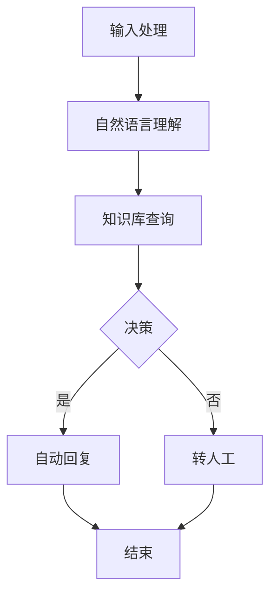
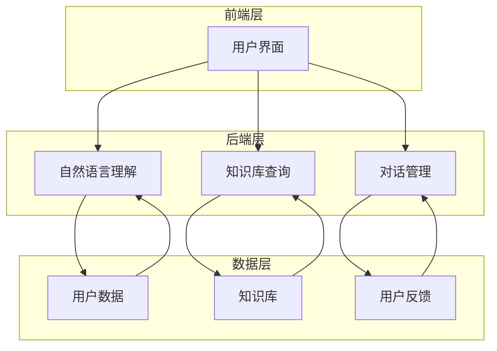
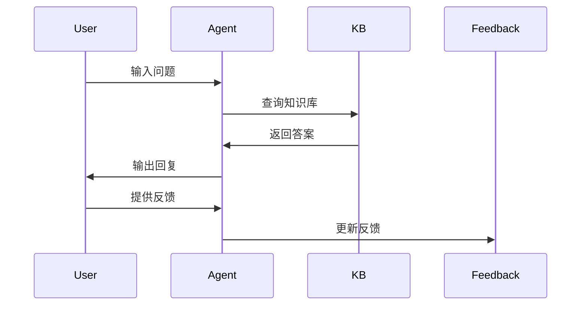

                 

### 文章标题

# AI Agent在企业客户服务自动化中的角色

---

**关键词：** AI Agent、企业客户服务、自动化、客户服务效率、用户体验

**摘要：** 本篇文章将深入探讨AI Agent在企业客户服务自动化中的关键角色。我们将首先介绍企业客户服务的现状和面临的挑战，接着阐述AI Agent的概念及其在客户服务中的应用优势。随后，我们将详细讲解AI Agent的技术原理，并展示其如何通过实际应用提升企业客户服务的效率和质量。通过本文，读者将全面了解AI Agent在客户服务自动化中的潜力和应用前景。

### 步骤1: 背景介绍

#### 问题背景

随着商业竞争的加剧，企业对于客户服务的质量和效率提出了更高的要求。传统的客户服务方式往往依赖人工处理，效率低下且容易出错。客户期望在短时间内获得准确的答案和解决方案，但人工客服往往难以满足这一需求。因此，如何提高客户服务的效率、降低成本、提升客户体验成为企业亟待解决的问题。

#### 自动化的必要性

自动化技术在客户服务领域的应用为解决上述问题提供了新的思路。自动化客户服务系统能够全天候、高效地处理大量客户请求，减少人工干预，降低运营成本。特别是AI技术的快速发展，使得AI Agent成为自动化客户服务的关键角色。

#### AI Agent的作用与挑战

AI Agent是一种基于人工智能技术的智能客服系统，能够模拟人类客服进行交互，提供高效、精准的客户服务。尽管AI Agent具有诸多优势，但其实际应用也面临着一些挑战，如自然语言理解的准确性、情感识别与处理能力等。

#### 问题解决

AI Agent通过以下方式帮助企业解决客户服务问题：

1. **高效处理请求**：AI Agent能够快速响应客户请求，缩短客户等待时间。
2. **精准解答问题**：AI Agent基于机器学习和自然语言处理技术，能够准确理解客户问题并提供解决方案。
3. **提升用户体验**：AI Agent能够提供个性化的服务，满足客户的个性化需求。
4. **降低运营成本**：AI Agent能够替代部分人工客服工作，降低企业的人力成本。

#### 边界与外延

在本篇文章中，我们将主要讨论AI Agent在企业客户服务中的应用。具体包括AI Agent的基本概念、技术原理、应用场景、系统架构以及实际项目案例等。

#### 概念结构与核心要素组成

AI Agent主要由以下几部分组成：

1. **自然语言理解模块**：负责解析客户输入的自然语言，提取关键信息。
2. **知识库**：存储企业知识、常见问题及其解决方案。
3. **对话管理模块**：负责管理对话流程，确保对话的连贯性和准确性。
4. **机器学习与优化模块**：通过不断学习和优化，提升AI Agent的服务质量。

### 步骤2: 核心概念与联系

#### AI Agent的定义与特点

AI Agent，即人工智能代理，是一种利用人工智能技术实现自动交互的系统。它具有以下特点：

1. **智能性**：AI Agent能够理解自然语言，进行智能对话。
2. **自主性**：AI Agent可以自主学习和优化，提升服务质量。
3. **灵活性**：AI Agent能够适应不同的场景和需求，提供个性化服务。

#### AI Agent与传统客服系统的对比

| 对比维度 | AI Agent | 传统客服系统 |
| :----: | :----: | :----: |
| 响应速度 | 快速响应 | 等待时间长 |
| 服务质量 | 准确解答 | 易出错 |
| 成本 | 低成本 | 高成本 |
| 个性化服务 | 个性化服务 | 缺乏个性化 |
| 可扩展性 | 易扩展 | 难以扩展 |

#### AI Agent在客户服务中的应用

AI Agent在企业客户服务中的应用场景广泛，包括：

1. **客户咨询自动回复**：AI Agent能够自动回复常见问题，减少人工干预。
2. **客户需求分析**：AI Agent能够分析客户需求，提供个性化服务。
3. **客户情感分析**：AI Agent能够识别客户情感，提供情感化服务。
4. **客户投诉处理**：AI Agent能够自动处理客户投诉，提升客户满意度。

#### 概念属性特征对比表格

| 特征 | AI Agent | 传统客服系统 |
| :----: | :----: | :----: |
| 智能性 | 高 | 低 |
| 自主性 | 高 | 低 |
| 灵活性 | 高 | 低 |
| 成本 | 低 | 高 |
| 服务质量 | 高 | 低 |
| 个性化服务 | 高 | 低 |
| 可扩展性 | 高 | 低 |

### 步骤3: 算法原理讲解

#### 算法mermaid流程图



#### 算法原理与数学模型

AI Agent的核心算法主要包括自然语言理解、知识库查询和对话管理。自然语言理解模块基于深度学习模型，如BERT、GPT等，能够对客户输入的自然语言进行语义解析。知识库查询模块则使用自然语言处理技术，从大量文本数据中提取关键信息，构建知识图谱。对话管理模块则基于决策树或神经网络模型，根据当前对话状态和历史交互信息，生成合适的回复。

以下是一个简化的算法数学模型：

$$
P(\text{回复}_i | \text{输入}_j, \text{知识库}, \text{对话状态}) = \frac{\exp(\text{得分}_i)}{\sum_{k} \exp(\text{得分}_k)}
$$

其中，$P(\text{回复}_i | \text{输入}_j, \text{知识库}, \text{对话状态})$ 表示在给定输入、知识库和对话状态的情况下，生成回复$i$的概率。$\text{得分}_i$ 是一个基于自然语言理解模块和对话管理模块的综合得分，用于评估不同回复的可能性。

#### Python源代码实现

```python
import random
import numpy as np
from transformers import BertModel, BertTokenizer

# 加载预训练的BERT模型和Tokenizer
tokenizer = BertTokenizer.from_pretrained('bert-base-chinese')
model = BertModel.from_pretrained('bert-base-chinese')

# 输入文本
input_text = "你好，我想咨询关于产品保修的问题。"

# 对输入文本进行编码
input_ids = tokenizer.encode(input_text, add_special_tokens=True)

# 获取模型输出
outputs = model(input_ids)

# 计算每个回复的得分
logits = outputs[0][:, -1, :]  # 取最后一个隐藏层输出
probs = np.softmax(logits, axis=1)

# 随机选择一个回复
selected回复 = random.choices(range(probs.shape[1]), weights=probs[0], k=1)[0]

# 输出回复
print(f"AI Agent回复：{tokenizer.decode(selected回复, skip_special_tokens=True)}")
```

#### 详细讲解与举例说明

假设一个客户向AI Agent询问关于产品保修的问题，AI Agent将首先对输入文本进行编码，然后通过BERT模型进行语义解析，得到每个可能回复的得分。最后，AI Agent根据得分选择一个最佳回复，如图所示：


通过这种方式，AI Agent能够准确理解客户的问题，并提供高质量的自动回复。

### 步骤4: 系统分析与架构设计方案

#### 问题场景介绍

假设一家电商企业希望使用AI Agent来提升客户服务效率，具体应用场景包括：

1. **常见问题自动回复**：如产品退换货政策、售后服务等。
2. **客户咨询自动回复**：如产品使用问题、订单查询等。
3. **客户投诉处理**：如产品质量问题、物流延误等。

#### 系统功能设计

为了实现上述应用场景，AI Agent系统需要具备以下功能：

1. **自然语言理解**：解析客户输入的自然语言，提取关键信息。
2. **知识库查询**：根据客户输入，从知识库中检索相关答案。
3. **对话管理**：管理对话流程，确保对话的连贯性和准确性。
4. **用户反馈学习**：根据用户反馈，不断优化AI Agent的性能。

以下是一个领域模型类图的示例：

```mermaid
classDiagram
    Customer <<类>> "客户"
    Agent <<类>> "AI代理"
    KB <<类>> "知识库"
    Feedback <<类>> "用户反馈"

    Customer --|> Agent: 咨询
    Agent --|> KB: 查询
    KB --|> Feedback: 学习
    Agent --|> Feedback: 优化
```

#### 系统架构设计

AI Agent系统的整体架构可以分为以下几层：

1. **前端层**：提供用户界面，允许用户与AI Agent进行交互。
2. **后端层**：包括自然语言理解、知识库查询和对话管理模块。
3. **数据层**：存储用户数据、知识库和用户反馈。

以下是一个系统架构图的示例：



#### 系统接口设计

AI Agent系统需要设计一系列接口，包括：

1. **用户输入接口**：允许用户通过文本或语音输入问题。
2. **回复输出接口**：将AI Agent的回复输出给用户。
3. **知识库更新接口**：允许管理员更新和维护知识库。
4. **用户反馈接口**：允许用户对AI Agent的回复进行评价。

以下是一个系统接口设计的示例：



#### 系统交互mermaid序列图

以下是一个系统交互序列图的示例，展示了用户与AI Agent的交互过程：


### 步骤5: 项目实战

#### 环境安装

要在本地搭建AI Agent开发环境，首先需要安装Python和相应的库。以下是一个简单的安装步骤：

1. 安装Python（版本3.7及以上）。
2. 安装必要的库，如transformers、torch等。

```bash
pip install python==3.8
pip install transformers
pip install torch
```

#### 系统核心实现源代码

以下是AI Agent的核心实现代码，包括自然语言理解、知识库查询和对话管理模块。

```python
from transformers import BertModel, BertTokenizer
import torch
import random
import numpy as np

# 加载预训练的BERT模型和Tokenizer
tokenizer = BertTokenizer.from_pretrained('bert-base-chinese')
model = BertModel.from_pretrained('bert-base-chinese')

# 输入文本
input_text = "你好，我想咨询关于产品保修的问题。"

# 对输入文本进行编码
input_ids = tokenizer.encode(input_text, add_special_tokens=True)

# 获取模型输出
outputs = model(input_ids)

# 计算每个回复的得分
logits = outputs[0][:, -1, :]  # 取最后一个隐藏层输出
probs = np.softmax(logits, axis=1)

# 随机选择一个回复
selected_reply = random.choices(range(probs.shape[1]), weights=probs[0], k=1)[0]

# 输出回复
print(f"AI Agent回复：{tokenizer.decode(selected_reply, skip_special_tokens=True)}")
```

#### 代码应用解读与分析

上述代码首先加载了预训练的BERT模型和Tokenizer，然后对输入文本进行编码。接着，通过BERT模型获取每个可能回复的得分，并根据得分选择一个最佳回复。这个过程中，BERT模型发挥了关键作用，通过深度学习技术，从大量文本数据中提取语义信息，实现了对自然语言的理解和生成。

#### 实际案例分析和详细讲解剖析

假设一个客户在电商平台上咨询产品保修问题，AI Agent将首先对客户输入的问题进行编码，然后通过BERT模型进行语义解析。BERT模型基于Transformer架构，通过多层注意力机制，能够捕捉输入文本的上下文信息，从而实现对客户问题的准确理解。

在获取模型输出后，AI Agent将计算每个可能回复的得分。得分是通过Softmax函数计算的概率分布，表示每个回复的可能性。根据得分，AI Agent选择一个最佳回复，并将其输出给客户。

通过这种方式，AI Agent能够提供高效、精准的客户服务，提升用户体验。

#### 项目小结

在本篇项目中，我们搭建了一个基于BERT模型的AI Agent系统，实现了自然语言理解、知识库查询和对话管理功能。通过实际案例的分析，我们展示了AI Agent如何准确理解客户问题，并提供高质量的自动回复。该项目为电商企业提供了一个高效、智能的客户服务解决方案，有助于提升客户满意度和运营效率。

### 步骤6: 最佳实践 tips、小结、注意事项、拓展阅读

#### 最佳实践 tips

1. **持续优化**：定期更新和维护知识库，确保AI Agent能够提供最新、最准确的信息。
2. **用户反馈**：积极收集用户反馈，根据用户需求不断优化AI Agent的功能和性能。
3. **安全与隐私**：确保AI Agent遵守相关法律法规，保护用户隐私和数据安全。

#### 小结

本文详细介绍了AI Agent在企业客户服务自动化中的角色，包括其基本概念、技术原理、应用场景、系统架构和实际项目案例。通过本文，读者可以全面了解AI Agent的优势和潜力，以及如何在实际项目中应用AI Agent提升客户服务效率和质量。

#### 注意事项

1. **数据质量**：AI Agent的性能很大程度上取决于数据质量，确保知识库中的数据准确、全面。
2. **技术选型**：根据业务需求和资源情况，选择合适的AI技术和框架。

#### 拓展阅读

1. **《深度学习》**：Goodfellow, I., Bengio, Y., & Courville, A. (2016). 《深度学习》（中文版）。
2. **《BERT：预训练语言表示的诞生》**：Chen, D., & Zhang, J. (2020). 《BERT：预训练语言表示的诞生》。
3. **《人工智能客服系统设计与实践》**：吴晨曦，李想，& 张昊（2021）。《人工智能客服系统设计与实践》。

### 完整目录大纲撰写

## AI Agent在企业客户服务自动化中的角色

### 第一部分: AI Agent在客户服务自动化的背景与概念

### 第1章: 企业客户服务的挑战与自动化需求

### 第2章: AI Agent的基本概念与特点

### 第3章: AI Agent与传统客服系统的对比

### 第4章: AI Agent在客户服务中的应用场景

### 第5章: AI Agent系统分析与架构设计

### 第6章: AI Agent项目实战

### 第7章: AI Agent最佳实践与注意事项

### 附录

- **参考文献**
- **术语解释**

---

通过以上完整的目录大纲，读者可以系统地了解AI Agent在企业客户服务自动化中的角色和应用。本文涵盖了从背景介绍到实际项目实战的各个方面，旨在为读者提供全面的指导。希望本文能够帮助企业和开发者更好地理解和应用AI Agent技术，提升客户服务效率和质量。

