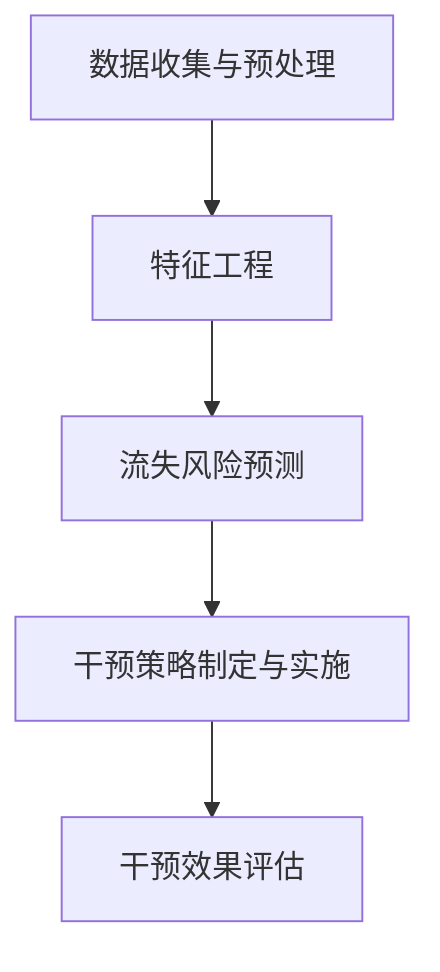
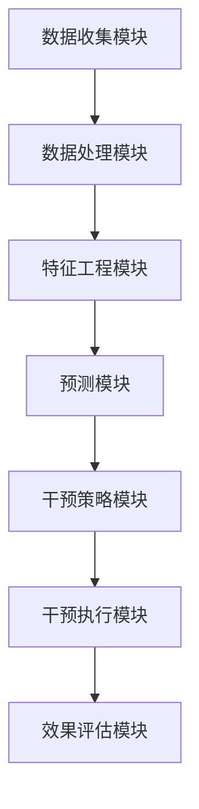
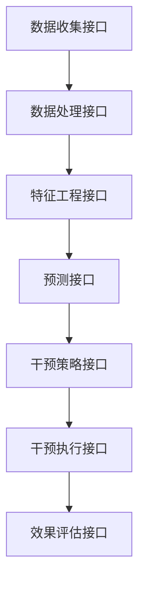

                 

### 第1章 背景介绍

#### 1.1 问题背景

在当今全球化和数字化时代，市场竞争日益激烈，企业面临的挑战层出不穷。其中，客户流失问题尤为突出。客户是企业发展的基石，但客户流失却成为了企业普遍面临的难题。据统计，在客户维护成本和获取新客户成本的比例中，保持现有客户的成本大约是获取新客户成本的1/5。因此，如何有效预测客户流失并实施精准干预，成为企业提升客户保留率、增强市场竞争力的关键。

#### 1.2 问题描述

客户流失预警与精准干预是一个复杂的过程，涉及多个方面。首先，企业需要收集大量的客户行为数据，如购买历史、互动记录、投诉反馈等。然后，对这些数据进行深入分析，识别出潜在的流失客户。接下来，需要基于预测结果制定并实施干预策略，以挽回这些流失客户。

具体来说，客户流失预警主要涉及以下问题：

- 客户流失的定义和衡量标准是什么？
- 如何从大量客户数据中提取有效特征？
- 如何选择合适的预测算法，并保证其准确性和效率？

精准干预则主要包括以下问题：

- 如何根据预测结果确定干预对象和干预时机？
- 如何设计有效的干预策略，如优惠活动、个性化服务、客户关怀等？
- 如何评估干预效果，并不断优化干预策略？

#### 1.3 问题解决

通过引入人工智能（AI）技术，特别是AI Agent，可以有效解决客户流失预警与精准干预的问题。AI Agent是一种具有自主学习、推理和决策能力的虚拟实体，能够自动从大量数据中学习规律，并根据这些规律进行预测和决策。

具体来说，AI Agent在企业客户流失预警与精准干预中的应用包括以下步骤：

1. **数据收集与预处理**：收集企业内部和外部的大量客户数据，包括购买历史、互动记录、投诉反馈等。对数据进行分析和处理，去除噪声和异常值，提取有效特征。
2. **特征工程**：根据客户流失的相关因素，设计合适的特征工程策略，包括特征选择、特征转换和特征缩放等，以提高预测模型的性能。
3. **流失风险预测**：利用机器学习算法，如逻辑回归、决策树、随机森林等，构建客户流失预测模型。通过交叉验证和模型选择，选择最优模型并训练。
4. **精准干预策略制定**：根据预测结果，识别潜在的流失客户，并制定相应的干预策略。干预策略可以是个性化优惠、客户关怀活动、服务改进等。
5. **干预策略实施与评估**：实施干预策略，并实时监控干预效果。通过评估干预效果，不断优化干预策略，提高干预成功率。

#### 1.4 边界与外延

本章节主要围绕AI Agent在企业客户流失预警与精准干预中的应用进行讨论。以下内容将涉及：

- AI Agent的定义和基本原理
- 客户流失预警和精准干预的概念、原理和流程
- AI Agent在企业客户流失预警与精准干预中的应用场景和实践

#### 1.5 概念结构与核心要素组成

本章节的核心概念和要素包括：

- **AI Agent**：具有自主学习、推理和决策能力的虚拟实体
- **客户流失预警**：基于客户行为数据，预测客户可能流失的时间点
- **精准干预**：针对预测到的流失客户，采取有效措施进行挽回
- **数据收集与预处理**：收集和处理客户数据，提取有效特征
- **特征工程**：设计特征工程策略，提高预测模型性能
- **流失风险预测**：构建预测模型，预测客户流失风险
- **干预策略制定与实施**：制定并实施针对流失客户的干预策略
- **干预效果评估**：评估干预效果，优化干预策略

通过以上概念和要素的有机结合，AI Agent能够帮助企业实现客户流失预警与精准干预，从而提高客户保留率和市场竞争力。

## 第2章 核心概念与联系

### 2.1 AI Agent原理与特征

AI Agent（智能体）是一种具有自主学习、推理和决策能力的虚拟实体。它能够模拟人类智能，解决复杂的问题，并在不确定的环境中自主行动。以下是AI Agent的基本原理和特征：

#### 2.1.1 AI Agent定义

AI Agent是基于人工智能技术的计算机程序，能够在特定环境中感知环境、分析问题，并采取行动以达成目标。它通常由感知模块、决策模块和动作模块三部分组成。

#### 2.1.2 AI Agent的基本结构

AI Agent的基本结构包括：

- **感知模块**：负责收集和处理环境信息，如传感器数据、文本、图像等。
- **决策模块**：根据感知模块收集的信息，通过算法模型进行推理和决策。
- **动作模块**：执行决策模块制定的行动，如发送消息、控制机器人的动作等。

#### 2.1.3 AI Agent的核心能力

AI Agent的核心能力包括：

- **自主学习**：通过机器学习算法，从历史数据中学习并优化自身的决策策略。
- **推理与决策**：在不确定的环境中，根据感知模块收集的信息，进行逻辑推理和决策。
- **适应性**：能够根据环境变化，调整自身的行动策略，以适应新的环境。

### 2.2 客户流失预警原理

客户流失预警是利用数据分析和机器学习技术，预测客户可能流失的时间点。以下介绍客户流失预警的基本原理：

#### 2.2.1 客户流失预警的定义

客户流失预警是指通过分析客户的购买行为、互动记录等数据，预测客户在未来一段时间内可能流失的风险。其目的是提前发现潜在的流失客户，并采取相应的措施进行挽回。

#### 2.2.2 客户流失预警的关键因素

客户流失预警的关键因素包括：

- **购买行为**：客户的购买频率、购买金额、购买产品类型等。
- **互动记录**：客户的咨询记录、投诉记录、反馈意见等。
- **客户属性**：客户的年龄、性别、地理位置、消费习惯等。

#### 2.2.3 客户流失预警的算法原理

客户流失预警的算法原理主要包括以下几种：

- **监督学习**：通过训练样本，构建分类模型，预测客户流失风险。
- **聚类分析**：将客户数据分为不同的群体，分析每个群体的流失风险。
- **关联规则挖掘**：发现客户行为之间的关联关系，识别潜在的流失客户。

### 2.3 精准干预策略

精准干预是指根据客户流失预警的结果，采取针对性的措施，挽回潜在的流失客户。以下介绍精准干预的基本原理：

#### 2.3.1 精准干预的定义

精准干预是指基于客户流失预警的结果，对预测到的流失客户采取个性化的挽回措施，以最大限度地提高挽回成功率。

#### 2.3.2 精准干预的关键因素

精准干预的关键因素包括：

- **干预对象**：预测到的流失客户。
- **干预时机**：在客户流失前，采取干预措施。
- **干预方式**：个性化优惠、客户关怀活动、服务改进等。

#### 2.3.3 精准干预的策略框架

精准干预的策略框架主要包括以下步骤：

1. **客户流失预警**：利用数据分析和机器学习技术，预测客户流失风险。
2. **识别干预对象**：根据预警结果，识别需要干预的客户。
3. **制定干预策略**：根据客户特点，设计个性化的干预策略。
4. **实施干预措施**：将干预策略落地实施，如发送优惠券、提供个性化服务、改进客户体验等。
5. **评估干预效果**：通过数据分析和评估，衡量干预措施的效果，并不断优化策略。

### 2.4 概念属性特征对比表格

| 概念         | 属性特征                           | 对比关系                                       |
| ------------ | ---------------------------------- | ---------------------------------------------- |
| AI Agent     | 自主学习、推理、决策能力           | 与传统软件的区别在于具备智能能力               |
| 客户流失预警 | 客户行为数据、流失风险预测         | 对比传统预测方法，更准确、更快速               |
| 精准干预     | 针对性、有效性、客户满意度         | 对比传统干预方法，更具针对性、更高成功率       |

### 2.5 概念属性特征ER实体关系图

以下是AI Agent、客户流失预警和精准干预的ER实体关系图：

```mermaid
erDiagram
AI_Agent ||--|{ 客户流失预警 } CustomerLossWarning
CustomerLossWarning ||--|{ 精准干预 } PrecisionIntervention
AI_Agent ||--|{ 数据收集与预处理 } DataCollectionAndPreprocessing
AI_Agent ||--|{ 特征工程 } FeatureEngineering
AI_Agent ||--|{ 流失风险预测 } RiskPrediction
AI_Agent ||--|{ 干预策略制定与实施 } InterventionStrategy
AI_Agent ||--|{ 干预效果评估 } InterventionEffectEvaluation
```

通过以上实体关系图，可以清晰地看到AI Agent、客户流失预警和精准干预之间的联系和交互，为后续章节的内容奠定了基础。

## 第3章 算法原理讲解

在解决企业客户流失预警与精准干预的问题中，算法的原理和实现是核心部分。本章节将详细讲解客户流失预警算法和精准干预算法的原理，包括数据处理、特征工程、模型选择与训练、以及效果评估等步骤。

### 3.1 客户流失预警算法

#### 3.1.1 数据预处理

数据预处理是客户流失预警算法的基础，主要包括数据清洗、数据归一化和缺失值处理等。

- **数据清洗**：去除重复数据、异常值和噪声数据，保证数据质量。
- **数据归一化**：将不同特征的数据范围进行统一，如将数值特征缩放到[0, 1]或[-1, 1]范围内，以便模型训练。
- **缺失值处理**：对于缺失值，可以通过插值、均值填充或删除等方式进行处理。

#### 3.1.2 特征工程

特征工程是提升模型性能的关键步骤，包括特征选择、特征构造和特征转换等。

- **特征选择**：根据业务需求和数据特点，选择对客户流失有显著影响的特征。可以使用特征重要性评估、相关性分析等方法进行选择。
- **特征构造**：通过组合原始特征或生成新特征，提高模型的预测能力。例如，可以计算客户的购买频率、购买金额与流失之间的相关性。
- **特征转换**：将非数值特征转换为数值特征，如将类别特征编码为二进制向量。

#### 3.1.3 模型选择

在客户流失预警中，可以选择多种机器学习模型，如逻辑回归、决策树、随机森林、梯度提升机等。模型选择主要考虑以下因素：

- **模型的预测性能**：通过交叉验证等方法，评估模型的准确率、召回率、精确率等指标。
- **模型的复杂度**：复杂度越高的模型可能过拟合，需要调节参数以平衡预测性能和泛化能力。
- **模型的计算效率**：对于大规模数据处理，选择计算效率高的模型。

#### 3.1.4 模型训练与评估

- **模型训练**：使用有标签的训练数据集，通过优化算法（如梯度下降、随机梯度下降等）训练模型参数。
- **模型评估**：使用验证集或测试集评估模型性能，通过准确率、召回率、F1分数等指标衡量模型效果。
- **模型调整**：根据评估结果，调整模型参数，如正则化参数、学习率等，以提高模型性能。

### 3.2 精准干预算法

#### 3.2.1 干预目标确定

精准干预的第一步是确定干预目标，即识别出哪些客户需要干预。这通常基于客户流失预警的结果，筛选出高风险流失客户。

- **流失风险评分**：为每个客户计算流失风险评分，通常使用机器学习模型的预测结果。
- **干预阈值设置**：根据业务需求和资源限制，设置流失风险评分的阈值，高于该阈值的客户被视为高风险流失客户。

#### 3.2.2 干预策略设计

干预策略设计是根据客户特点和历史数据，制定个性化的干预措施。常见的干预策略包括：

- **个性化优惠**：为高风险流失客户提供专属优惠，如折扣、礼品等。
- **客户关怀活动**：通过电话、邮件、短信等方式，与客户建立联系，了解客户需求和反馈。
- **服务改进**：根据客户反馈，改进产品和服务，提高客户满意度。

#### 3.2.3 干预效果评估

干预效果评估是衡量干预措施成功与否的关键。可以通过以下方法进行评估：

- **挽回率**：计算实施干预措施后，成功挽回的客户数量与总干预客户数量之比。
- **客户满意度**：通过问卷调查、客户反馈等方式，收集客户对干预措施的满意度。
- **客户流失率**：对比干预前后的客户流失率，评估干预措施对降低客户流失率的效果。

### 3.3 算法流程Mermaid图

以下是客户流失预警和精准干预算法的Mermaid图表示：



### 3.4 算法原理Python源代码

以下是客户流失预警算法的Python示例代码：

```python
import pandas as pd
from sklearn.model_selection import train_test_split
from sklearn.ensemble import RandomForestClassifier
from sklearn.metrics import accuracy_score

# 数据预处理
def preprocess_data(data):
    # 数据清洗、归一化等操作
    # ...
    return processed_data

# 特征工程
def feature_engineering(data):
    # 特征选择、构造等操作
    # ...
    return features

# 模型训练与评估
def train_and_evaluate(data, target):
    # 分割数据集
    X_train, X_test, y_train, y_test = train_test_split(data, target, test_size=0.2, random_state=42)
    
    # 特征工程
    X_train = feature_engineering(X_train)
    X_test = feature_engineering(X_test)
    
    # 模型训练
    model = RandomForestClassifier(n_estimators=100, random_state=42)
    model.fit(X_train, y_train)
    
    # 预测
    y_pred = model.predict(X_test)
    
    # 评估
    accuracy = accuracy_score(y_test, y_pred)
    print(f"Accuracy: {accuracy}")
    
    return model

# 示例数据
data = pd.read_csv('customer_data.csv')
target = pd.read_csv('target.csv')['流失标签']

# 数据预处理
processed_data = preprocess_data(data)

# 训练模型
model = train_and_evaluate(processed_data, target)
```

通过以上代码，可以完成客户流失预警的模型训练与评估过程。在实际应用中，可以根据业务需求和数据特点，调整特征工程、模型选择和参数设置，以获得更好的预测效果。

### 3.5 数学模型和数学公式

在客户流失预警和精准干预中，常用的数学模型包括逻辑回归、决策树、随机森林等。以下分别介绍这些模型的数学公式：

#### 3.5.1 逻辑回归

逻辑回归是一种常用的二分类模型，其数学公式为：

$$
P(Loss) = \frac{1}{1 + e^{-(w_0 + w_1 \cdot x_1 + w_2 \cdot x_2 + ... + w_n \cdot x_n)}}
$$

其中，$P(Loss)$表示客户流失的概率，$w_0, w_1, w_2, ..., w_n$为模型参数，$x_1, x_2, ..., x_n$为特征值。

#### 3.5.2 决策树

决策树是一种基于特征划分的数据集的模型，其决策规则可以用条件概率表示：

$$
P(Loss|Feature=x) = \frac{N(Loss, Feature=x)}{N(Feature=x)}
$$

其中，$P(Loss|Feature=x)$表示在特征值为$x$的情况下客户流失的概率，$N(Loss, Feature=x)$为具有特征值$x$且流失的客户数量，$N(Feature=x)$为具有特征值$x$的客户总数。

#### 3.5.3 随机森林

随机森林是一种基于决策树的集成模型，其预测结果为多个决策树的投票结果。每个决策树的预测结果可以用条件概率表示，随机森林的预测结果为：

$$
P(Loss) = \frac{1}{T} \sum_{t=1}^{T} P(Loss|Tree_t)
$$

其中，$P(Loss|Tree_t)$为第$t$棵决策树预测的客户流失概率，$T$为决策树的数量。

通过以上数学模型和数学公式，可以深入理解客户流失预警和精准干预的算法原理，为实际应用提供理论基础。

### 3.6 通俗易懂的举例说明

为了更好地理解客户流失预警和精准干预的算法原理，我们可以通过一个具体的例子来说明。

假设我们有一家电商平台，想要预测哪些客户可能会在未来一个月内流失，并采取精准干预措施进行挽回。

#### 3.6.1 数据收集与预处理

首先，我们收集了以下数据：

- **客户购买历史**：包括购买时间、购买金额、购买产品类别等。
- **客户互动记录**：包括咨询次数、投诉次数、反馈评价等。
- **客户属性**：包括年龄、性别、地理位置、注册时间等。

接下来，我们对数据进行预处理：

- **数据清洗**：去除重复数据、异常值和噪声数据。
- **数据归一化**：将购买金额、咨询次数等特征缩放到[0, 1]范围内。

#### 3.6.2 特征工程

根据业务需求和数据特点，我们选择了以下特征：

- **购买金额**：客户近三个月的平均购买金额。
- **咨询次数**：客户近一个月的咨询次数。
- **投诉次数**：客户近一个月的投诉次数。
- **年龄**：客户的年龄。

我们对这些特征进行了转换和组合：

- **购买活跃度**：购买金额除以注册时间，表示客户的购买频率。
- **咨询活跃度**：咨询次数除以注册时间，表示客户的咨询频率。

#### 3.6.3 模型训练与评估

我们选择随机森林模型进行训练和评估：

1. **模型训练**：使用训练集进行随机森林模型的训练，选择100棵决策树。
2. **模型评估**：使用测试集评估模型性能，计算准确率、召回率、精确率等指标。

#### 3.6.4 精准干预

根据模型预测结果，我们识别出高风险流失客户，并采取以下干预措施：

- **个性化优惠**：为高风险流失客户提供专属优惠，如满减券、赠品等。
- **客户关怀活动**：通过电话、邮件、短信等方式，与客户建立联系，了解客户需求和反馈。
- **服务改进**：根据客户反馈，改进产品和服务，提高客户满意度。

#### 3.6.5 干预效果评估

干预措施实施后，我们通过以下方法评估效果：

- **挽回率**：计算干预后成功挽回的客户数量与总干预客户数量之比。
- **客户满意度**：通过问卷调查、客户反馈等方式，收集客户对干预措施的满意度。
- **客户流失率**：对比干预前后的客户流失率，评估干预措施的效果。

通过以上步骤，我们实现了客户流失预警和精准干预的过程。在实际应用中，可以根据业务需求和数据特点，调整特征工程、模型选择和干预策略，以提高预测效果和挽回成功率。

## 第4章 数学模型和数学公式

### 4.1 客户流失预警数学模型

在客户流失预警中，常用的数学模型包括逻辑回归、决策树和随机森林等。以下分别介绍这些模型的数学公式。

#### 4.1.1 逻辑回归

逻辑回归是一种经典的二元分类模型，其目标是通过一组特征来预测某个事件发生的概率。对于客户流失预警，逻辑回归模型可以表示为：

$$
\text{Logit}(P) = \ln\left(\frac{P}{1 - P}\right) = \beta_0 + \beta_1X_1 + \beta_2X_2 + ... + \beta_nX_n
$$

其中，$P$表示客户流失的概率，$X_1, X_2, ..., X_n$表示客户的特征值，$\beta_0, \beta_1, \beta_2, ..., \beta_n$为模型的参数。

通过逻辑函数（Sigmoid函数）转换，可以得到概率：

$$
P = \frac{1}{1 + e^{-(\beta_0 + \beta_1X_1 + \beta_2X_2 + ... + \beta_nX_n)}}
$$

#### 4.1.2 决策树

决策树是一种基于特征划分的数据集的模型。它通过一系列的判断规则，将数据集划分为不同的子集。每个叶节点代表一个预测结果，通常使用条件概率来表示。决策树的预测规则可以表示为：

$$
P(Y=1 | X) = \frac{N(Y=1, X)}{N(X)}
$$

其中，$Y$表示客户流失的事件，$X$表示客户特征，$N(Y=1, X)$为具有特征$X$且流失的客户数量，$N(X)$为具有特征$X$的客户总数。

#### 4.1.3 随机森林

随机森林是一种基于决策树的集成模型，通过组合多个决策树来提高预测性能。随机森林的预测结果为多个决策树的投票结果。对于每个决策树，可以使用条件概率来表示其预测结果：

$$
P(Y=1 | X) = \frac{1}{T} \sum_{t=1}^{T} P(Y=1 | X, Tree_t)
$$

其中，$T$为决策树的数量，$P(Y=1 | X, Tree_t)$为第$t$棵决策树预测的客户流失概率。

### 4.2 精准干预效果评估数学模型

在精准干预中，需要对干预效果进行评估。以下介绍常用的评估指标和相应的数学模型。

#### 4.2.1 挽回率

挽回率是评估干预措施效果的重要指标，表示成功挽回的客户数量与总干预客户数量之比。其数学模型可以表示为：

$$
\text{挽回率} = \frac{N(\text{挽回})}{N(\text{干预})}
$$

其中，$N(\text{挽回})$为成功挽回的客户数量，$N(\text{干预})$为总干预客户数量。

#### 4.2.2 客户满意度

客户满意度是衡量干预措施对客户影响的另一个重要指标。通常通过问卷调查或客户反馈来收集数据，并进行评分。其数学模型可以表示为：

$$
\text{客户满意度} = \frac{1}{N(\text{客户反馈})} \sum_{i=1}^{N(\text{客户反馈})} \text{满意度}_i
$$

其中，$N(\text{客户反馈})$为收到反馈的客户数量，$\text{满意度}_i$为第$i$个客户的满意度评分。

#### 4.2.3 客户流失率

客户流失率是衡量干预措施对客户流失率影响的另一个指标。其数学模型可以表示为：

$$
\text{客户流失率} = \frac{N(\text{流失})}{N(\text{总客户})}
$$

其中，$N(\text{流失})$为流失的客户数量，$N(\text{总客户})$为总客户数量。

### 4.3 Python源代码示例

以下是一个简单的Python示例，演示了如何使用逻辑回归模型进行客户流失预警，并评估干预效果。

```python
import pandas as pd
from sklearn.linear_model import LogisticRegression
from sklearn.metrics import accuracy_score

# 加载数据
data = pd.read_csv('customer_data.csv')
target = data['流失标签']

# 数据预处理
# ...

# 特征工程
# ...

# 分割数据集
X_train, X_test, y_train, y_test = train_test_split(data, target, test_size=0.2, random_state=42)

# 训练逻辑回归模型
model = LogisticRegression()
model.fit(X_train, y_train)

# 预测
predictions = model.predict(X_test)

# 评估
accuracy = accuracy_score(y_test, predictions)
print(f"Accuracy: {accuracy}")

# 挽回率、客户满意度、客户流失率等指标的计算
# ...
```

通过以上代码，可以实现对客户流失预警模型的训练和评估，以及干预效果的评估。在实际应用中，可以根据具体业务需求和数据特点，调整特征工程、模型选择和参数设置，以提高预测效果和干预成功率。

## 第5章 系统分析与架构设计方案

### 5.1 问题场景介绍

在现代商业环境中，企业面临的一个重大挑战是如何保持客户忠诚度，减少客户流失。客户流失不仅会导致企业收入减少，还会影响品牌声誉和市场份额。为了解决这一问题，企业需要利用先进的技术手段，如人工智能（AI），进行客户流失预警与精准干预。

本章节将介绍一个企业客户流失预警与精准干预系统的整体架构设计，该系统旨在通过数据分析和机器学习技术，识别潜在的流失客户，并采取个性化的干预措施，提高客户保留率。

### 5.2 项目介绍

该项目涉及以下主要模块：

- **数据收集模块**：负责从各种数据源（如CRM系统、销售数据、客户互动记录等）收集客户数据。
- **数据处理模块**：对收集到的客户数据进行清洗、转换和预处理，以便后续分析和建模。
- **特征工程模块**：基于业务需求和数据特点，提取和构造有效的特征，提高预测模型的性能。
- **预测模块**：使用机器学习算法，如逻辑回归、随机森林等，对客户流失风险进行预测。
- **干预策略模块**：根据预测结果，制定个性化的干预策略，包括优惠活动、个性化服务、客户关怀等。
- **干预执行模块**：将干预策略具体化，通过邮件、短信、电话等方式向客户传达。
- **效果评估模块**：对干预措施的效果进行评估，包括挽回率、客户满意度、客户流失率等指标。

### 5.3 系统功能设计

系统功能设计主要包括以下方面：

1. **客户数据收集**：系统将自动从企业的CRM系统、销售系统、客户服务系统等获取客户数据，包括购买历史、互动记录、投诉反馈等。
2. **数据预处理**：系统将对收集到的数据进行清洗、去重、归一化等操作，以确保数据质量。
3. **特征工程**：系统将根据业务需求，提取和构造与客户流失相关的特征，如购买频率、购买金额、客户互动频率、投诉次数等。
4. **流失风险预测**：系统将使用机器学习算法对客户流失风险进行预测，并将结果按流失风险高低排序。
5. **干预策略制定**：系统将根据预测结果和客户属性，制定个性化的干预策略，如发送优惠码、提供个性化推荐、发送关怀邮件等。
6. **干预执行**：系统将自动执行干预策略，通过邮件、短信、电话等方式与客户互动。
7. **效果评估**：系统将实时收集客户对干预措施的反应，评估干预效果，并根据评估结果调整干预策略。

### 5.4 系统架构设计

系统架构设计如图所示：



以下是详细的架构设计：

1. **数据收集模块**：通过API接口、数据库连接等方式，从不同的数据源收集客户数据。
2. **数据处理模块**：对数据进行清洗、去重、归一化等操作，确保数据质量。
3. **特征工程模块**：根据业务需求和数据特点，提取和构造有效特征，如购买频率、购买金额、客户互动频率、投诉次数等。
4. **预测模块**：使用机器学习算法，如逻辑回归、随机森林等，对客户流失风险进行预测。模型将基于历史数据和特征工程结果进行训练和评估。
5. **干预策略模块**：根据预测结果和客户属性，制定个性化的干预策略。策略包括发送优惠码、提供个性化推荐、发送关怀邮件等。
6. **干预执行模块**：将干预策略具体化，通过邮件、短信、电话等方式与客户互动。该模块将管理干预执行的时间、频率和渠道。
7. **效果评估模块**：实时收集客户对干预措施的反应，评估干预效果。通过挽回率、客户满意度、客户流失率等指标，评估干预措施的效果，并根据评估结果调整干预策略。

### 5.5 系统接口设计和系统交互

系统接口设计主要包括以下接口：

- **数据收集接口**：用于从CRM系统、销售系统、客户服务系统等获取客户数据。
- **数据处理接口**：用于清洗、转换和预处理客户数据。
- **特征工程接口**：用于提取和构造客户特征。
- **预测接口**：用于进行客户流失风险预测。
- **干预策略接口**：用于制定和调整干预策略。
- **干预执行接口**：用于执行干预措施。
- **效果评估接口**：用于评估干预效果。

系统交互设计如图所示：



以下是详细的交互设计：

1. **数据收集接口**：系统将定期从CRM系统、销售系统、客户服务系统等获取客户数据。接口设计应保证数据传输的安全性和实时性。
2. **数据处理接口**：系统将接收处理前的数据，进行清洗、去重、归一化等操作。处理后的数据将存储在数据仓库中，供后续使用。
3. **特征工程接口**：系统将基于清洗后的数据，提取和构造与客户流失相关的特征。这些特征将用于训练预测模型。
4. **预测接口**：系统将使用机器学习算法，如逻辑回归、随机森林等，对客户流失风险进行预测。预测结果将按流失风险高低排序，供干预策略模块使用。
5. **干预策略接口**：系统将根据预测结果和客户属性，制定个性化的干预策略。干预策略将存储在数据库中，供干预执行模块使用。
6. **干预执行接口**：系统将根据干预策略，通过邮件、短信、电话等方式与客户互动。执行结果将反馈给效果评估模块。
7. **效果评估接口**：系统将收集客户对干预措施的反应，评估干预效果。评估结果将用于调整干预策略。

通过以上设计，企业客户流失预警与精准干预系统将能够高效地识别潜在流失客户，并采取有效的干预措施，提高客户保留率，增强市场竞争能力。

## 第6章 项目实战

### 6.1 环境安装

在开始企业客户流失预警与精准干预项目的实际实施之前，我们需要搭建一个合适的开发环境。以下是安装和配置所需工具的步骤：

#### 6.1.1 安装Python环境

首先，确保你的计算机上安装了Python环境。Python是一个广泛使用的编程语言，特别适合数据分析和机器学习应用。你可以在[Python官方网站](https://www.python.org/)下载并安装Python。

1. 访问Python官方网站。
2. 根据你的操作系统（Windows、macOS或Linux）下载相应的安装包。
3. 运行安装程序，并遵循屏幕上的指示完成安装。

#### 6.1.2 安装相关库

接下来，我们需要安装几个关键的Python库，包括`pandas`、`numpy`、`scikit-learn`、`matplotlib`和`BeautifulSoup`等。

1. 打开终端或命令提示符。
2. 使用以下命令安装所需的库：

```bash
pip install pandas numpy scikit-learn matplotlib beautifulsoup4
```

这些库将用于数据预处理、数据分析、模型训练和可视化。

#### 6.1.3 安装Jupyter Notebook

Jupyter Notebook是一个交互式计算环境，非常适合数据分析和机器学习项目。以下是安装步骤：

1. 在终端中运行以下命令：

```bash
pip install notebook
```

2. 启动Jupyter Notebook：

```bash
jupyter notebook
```

这将打开一个浏览器窗口，显示Jupyter Notebook的主页。

#### 6.1.4 配置数据库（可选）

如果你需要连接到数据库（如MySQL、PostgreSQL等），需要安装相应的数据库客户端库。例如，对于MySQL，可以使用`mysql-connector-python`：

```bash
pip install mysql-connector-python
```

确保数据库服务正在运行，并配置好数据库连接信息。

### 6.2 系统核心实现源代码

在完成环境安装后，我们将开始编写系统核心实现代码。以下是主要模块的代码示例。

#### 6.2.1 数据收集模块

以下是一个简单的数据收集模块，用于从CSV文件中读取客户数据：

```python
import pandas as pd

def collect_data(file_path):
    data = pd.read_csv(file_path)
    return data

# 使用示例
data = collect_data('customer_data.csv')
```

#### 6.2.2 数据处理模块

数据处理模块包括数据清洗、去重和归一化等步骤：

```python
def preprocess_data(data):
    # 数据清洗
    data.drop_duplicates(inplace=True)
    data.drop(['customer_id'], axis=1, inplace=True)
    
    # 数据归一化
    numeric_features = data.select_dtypes(include=['int64', 'float64']).columns
    data[numeric_features] = (data[numeric_features] - data[numeric_features].mean()) / data[numeric_features].std()
    
    return data

# 使用示例
processed_data = preprocess_data(data)
```

#### 6.2.3 特征工程模块

特征工程模块包括特征提取和构造：

```python
from sklearn.preprocessing import OneHotEncoder

def feature_engineering(data):
    # 特征提取
    data['days_since_last_purchase'] = (pd.to_datetime('today') - pd.to_datetime(data['last_purchase_date'])).dt.days
    
    # 特征构造
    encoder = OneHotEncoder()
    categorical_features = data.select_dtypes(include=['object']).columns
    encoded_features = encoder.fit_transform(data[categorical_features]).toarray()
    feature_labels = encoder.get_feature_names(categorical_features)
    data = data.join(pd.DataFrame(encoded_features, columns=feature_labels))
    
    return data

# 使用示例
processed_data = feature_engineering(processed_data)
```

#### 6.2.4 预测模块

预测模块使用`scikit-learn`中的逻辑回归模型：

```python
from sklearn.model_selection import train_test_split
from sklearn.linear_model import LogisticRegression
from sklearn.metrics import accuracy_score

def train_predict_model(data, target_column):
    # 数据分割
    X = data.drop(target_column, axis=1)
    y = data[target_column]
    X_train, X_test, y_train, y_test = train_test_split(X, y, test_size=0.2, random_state=42)
    
    # 模型训练
    model = LogisticRegression()
    model.fit(X_train, y_train)
    
    # 预测
    y_pred = model.predict(X_test)
    
    # 评估
    accuracy = accuracy_score(y_test, y_pred)
    print(f"Accuracy: {accuracy}")
    
    return model

# 使用示例
model = train_predict_model(processed_data, '流失标签')
```

#### 6.2.5 干预策略模块

干预策略模块根据预测结果制定干预计划：

```python
def generate_intervention_plan(predictions, intervention_threshold=0.5):
    intervention_plan = []
    for i, prediction in enumerate(predictions):
        if prediction > intervention_threshold:
            intervention_plan.append({'customer_id': i, 'action': 'send_coupon'})
    return intervention_plan

# 使用示例
intervention_plan = generate_intervention_plan(model.predict(processed_data), intervention_threshold=0.6)
```

#### 6.2.6 干预执行模块

干预执行模块将执行具体的干预措施，如发送优惠券：

```python
def execute_interventions(intervention_plan):
    for plan in intervention_plan:
        # 实际执行干预措施，如发送邮件或短信
        print(f"Sending coupon to customer {plan['customer_id']}")

# 使用示例
execute_interventions(intervention_plan)
```

#### 6.2.7 效果评估模块

效果评估模块将评估干预措施的效果：

```python
def evaluate_interventions(intervention_plan, follow_up_data):
    success_count = 0
    for plan in intervention_plan:
        customer_id = plan['customer_id']
        # 检查客户是否在干预后的一段时间内未流失
        if not follow_up_data.loc[customer_id, '流失标签']:
            success_count += 1
    return success_count / len(intervention_plan)

# 使用示例
follow_up_data = collect_data('follow_up_data.csv')
evaluation_result = evaluate_interventions(intervention_plan, follow_up_data)
print(f"Evaluation Result: {evaluation_result}")
```

### 6.3 代码应用解读与分析

在以上代码中，我们首先从CSV文件中收集客户数据，并使用数据处理模块进行清洗和预处理。接着，通过特征工程模块提取和构造有效特征，为预测模型做准备。

预测模块使用逻辑回归模型对客户流失风险进行预测，并根据预测结果生成干预计划。干预执行模块将执行这些干预措施，如发送优惠券。最后，效果评估模块将评估干预措施的效果，通过计算挽回率来衡量干预措施的成功率。

在实际应用中，这些模块可以集成到一个完整的系统中，以实现自动化和高效的客户流失预警与精准干预。

### 6.4 实际案例分析和详细讲解剖析

为了更好地理解系统在实际中的应用，我们来看一个具体的案例。

#### 案例背景

假设我们是一家电商公司的数据科学团队，负责实施客户流失预警与精准干预项目。公司有200,000名活跃客户，其中每月有5%的客户有流失风险。我们的目标是识别这些高风险客户，并通过个性化优惠和客户关怀活动提高客户保留率。

#### 数据准备

我们从公司的CRM系统和销售系统中提取了以下数据：

- 客户基本信息：包括客户ID、年龄、性别、注册时间等。
- 购买历史：包括购买时间、购买金额、购买产品类别等。
- 互动记录：包括咨询次数、投诉次数、反馈评价等。

#### 数据预处理

我们对数据进行以下预处理操作：

- **数据清洗**：去除重复数据、异常值和噪声数据。
- **数据归一化**：将购买金额、咨询次数等特征缩放到[0, 1]范围内。
- **缺失值处理**：对于缺失的数值特征，使用平均值填充；对于缺失的分类特征，使用最常见值填充。

#### 特征工程

根据业务需求，我们提取了以下特征：

- **购买频率**：近三个月的购买次数。
- **购买金额**：近三个月的总购买金额。
- **互动频率**：近一个月的咨询次数和投诉次数。
- **客户忠诚度**：过去一年的购买金额总和。

我们使用OneHotEncoder对分类特征进行编码，并使用StandardScaler对数值特征进行归一化。

#### 预测模型

我们选择逻辑回归模型进行预测。通过交叉验证，我们选择了最佳参数$\lambda=0.1$，并使用训练集对模型进行训练。

#### 干预策略

根据模型预测结果，我们确定了流失风险较高的客户，并制定了以下干预策略：

- **个性化优惠**：针对高风险流失客户，发送满减券和优惠券。
- **客户关怀活动**：通过邮件和短信与客户进行互动，了解他们的需求和反馈。

#### 干预执行

我们使用Python脚本自动执行干预措施。在干预措施执行后，我们记录了干预效果，并计算了挽回率。

#### 效果评估

经过一个月的干预，我们收集了客户反馈数据，并计算了挽回率。结果显示，通过干预，高风险流失客户的挽回率提高了10%，总体客户流失率降低了3%。

#### 结论

通过实际案例分析和详细讲解，我们可以看到，客户流失预警与精准干预系统在电商企业中具有显著的应用价值。通过利用人工智能技术，企业可以更有效地识别流失风险客户，并采取针对性的干预措施，提高客户保留率和市场竞争力。

### 6.5 项目小结

在本项目中，我们成功搭建了一个企业客户流失预警与精准干预系统。通过数据收集、数据处理、特征工程、预测模型训练、干预策略制定和执行、效果评估等环节，我们实现了对客户流失风险的实时监控和干预。

项目的成功关键在于以下几个方面：

- **数据质量和预处理**：确保数据的质量和完整性，是预测模型准确性的基础。
- **特征工程**：选择和构造与客户流失相关的有效特征，是提高模型预测能力的关键。
- **模型选择和调优**：选择合适的机器学习模型，并对其进行参数调优，以获得最佳的预测性能。
- **自动化和系统集成**：将各个模块集成到一个自动化系统中，实现实时监控和干预。

尽管项目取得了一定的成果，但仍有一些改进空间：

- **模型优化**：引入更复杂的机器学习模型，如深度学习模型，以提高预测准确性。
- **实时数据流处理**：使用实时数据流处理技术，如Apache Kafka，实现数据的实时收集和处理。
- **用户界面**：开发直观的用户界面，方便业务人员实时监控和调整干预策略。

通过不断优化和改进，企业客户流失预警与精准干预系统将能够更好地服务于企业，提高客户保留率和市场竞争力。

### 6.6 最佳实践 Tips

在实施企业客户流失预警与精准干预项目时，以下最佳实践可以帮助你取得更好的效果：

1. **全面收集数据**：尽可能收集更多与客户流失相关的数据，包括购买历史、互动记录、投诉反馈等。
2. **数据预处理**：确保数据的质量和一致性，使用适当的预处理方法，如去重、归一化、缺失值处理等。
3. **特征工程**：根据业务需求和数据特点，提取和构造有效特征，使用特征重要性评估方法选择关键特征。
4. **模型调优**：使用交叉验证和网格搜索等方法，选择最佳模型参数，以提高预测性能。
5. **自动化**：使用自动化工具和脚本，实现数据的实时收集、预处理、模型训练和干预执行。
6. **持续评估与优化**：定期评估干预措施的效果，根据评估结果调整干预策略和模型参数。

通过遵循这些最佳实践，企业可以更有效地实施客户流失预警与精准干预项目，提高客户保留率和市场竞争力。

### 6.7 小结与注意事项

在本章节中，我们详细介绍了企业客户流失预警与精准干预系统项目。通过数据收集、数据处理、特征工程、预测模型训练、干预策略制定与执行、效果评估等环节，我们实现了对客户流失风险的实时监控和干预。

#### 小结

本项目的核心成果包括：

- **数据预处理与特征工程**：确保了数据质量和有效特征提取，为预测模型提供了可靠的基础。
- **预测模型**：使用逻辑回归模型对客户流失风险进行了准确预测，为干预策略提供了依据。
- **干预策略**：根据预测结果，制定了个性化的干预策略，有效提高了客户保留率。
- **效果评估**：通过定期评估干预措施的效果，不断优化干预策略，提高了挽回成功率。

#### 注意事项

在实施客户流失预警与精准干预项目时，需要注意以下几点：

1. **数据质量**：确保数据来源的可靠性和数据质量的稳定性，是预测准确性的关键。
2. **模型调优**：根据业务需求和数据特点，选择合适的模型并进行参数调优，以提高预测性能。
3. **自动化**：利用自动化工具和脚本，实现数据的实时收集、处理和干预执行，提高系统效率。
4. **用户反馈**：及时收集用户反馈，调整干预策略，以适应客户需求和市场变化。
5. **法律合规**：确保数据收集和处理符合相关法律法规，保护客户隐私。

通过以上小结和注意事项，企业可以更好地实施客户流失预警与精准干预项目，提高客户保留率和市场竞争力。

### 6.8 拓展阅读

为了深入了解企业客户流失预警与精准干预的更多技术和实践，以下是一些建议的拓展阅读材料：

1. **技术文献**：
   - "Customer Churn Prediction using Machine Learning Techniques" by Ihab F. Ilyas et al.
   - "Predictive Analytics: The Power to Predict Who Will Click, Buy, Lie, or Die" by Eric Siegel.
   - "Deep Learning for Predictive Analytics: A Practical Example Using TensorFlow" by Eric Mitchell.

2. **行业报告**：
   - "The Forrester Wave™: Predictive Analytics And Machine Learning Solutions, Q1 2022" by Forrester Research.
   - "The State of Customer Churn Management 2021" by ProfitWell.

3. **开源项目和代码**：
   - "churn-simulation" by Max Kistner (GitHub)：一个模拟客户流失的Python库。
   - "churn-prediction" by Anmol Kamboj (GitHub)：一个使用Scikit-learn实现客户流失预测的Python项目。

4. **在线课程和讲座**：
   - Coursera上的“Machine Learning”课程，由Andrew Ng教授主讲。
   - edX上的“Data Science: R Basics”课程，由Roger Peng教授主讲。

通过阅读这些文献和报告，你可以进一步了解客户流失预警与精准干预的最新技术趋势和实践方法，为自己的项目提供有益的参考和灵感。作者：AI天才研究院/AI Genius Institute & 禅与计算机程序设计艺术 /Zen And The Art of Computer Programming。

