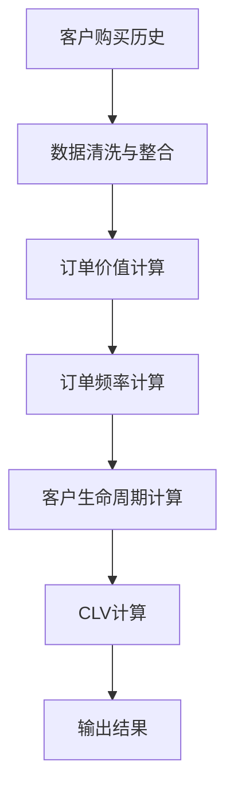

                 

### 1.1 AI Agent的基本原理与应用

#### 1.1.1 AI Agent的定义与类型

AI Agent，即人工智能代理，是一种模拟人类智能行为的计算机程序，它能够自动执行任务、与人类交互，并在一定程度上具备决策能力。AI Agent的主要类型包括：

- **交互型AI Agent**：这种代理专注于与用户的交互，例如聊天机器人、语音助手等。它们通过自然语言处理（NLP）技术理解用户指令，并生成相应的回复。
  
- **任务型AI Agent**：这种代理专注于执行特定任务，如推荐系统、自动化客服等。它们使用机器学习模型来分析用户行为和偏好，从而提供个性化的服务。

- **自主型AI Agent**：这种代理具备更高的自主性，能够自主设定目标并采取行动，例如自动驾驶汽车、机器人管家等。

#### 1.1.2 AI Agent的核心功能与应用场景

AI Agent的核心功能包括：

- **感知与理解**：AI Agent通过传感器、输入设备等获取环境信息，并利用机器学习、自然语言处理等技术进行理解和分析。

- **决策与行动**：基于感知和理解的结果，AI Agent使用决策模型和算法来做出决策，并采取相应的行动。

- **交互与协作**：AI Agent能够与用户、其他系统或代理进行交互，协同完成任务。

AI Agent的应用场景广泛，包括：

- **客户服务**：AI Agent可以用于自动化客户服务，提供24/7的客户支持，提高服务效率。

- **推荐系统**：AI Agent可以分析用户行为和偏好，提供个性化的产品推荐。

- **自动化运营**：AI Agent可以自动处理重复性任务，提高企业运营效率。

- **智能交通**：AI Agent可以用于自动驾驶、交通流量管理，提高交通系统的效率和安全性。

#### 1.1.3 AI Agent在企业客户生命周期价值预测与管理中的潜力

AI Agent在预测与管理企业客户生命周期价值（CLV）方面具有巨大的潜力。通过以下方式，AI Agent可以帮助企业优化客户关系管理：

- **客户细分**：AI Agent可以根据客户行为和偏好，将客户细分为不同的群体，从而制定更有针对性的营销策略。

- **个性化服务**：AI Agent可以实时分析客户需求，提供个性化的服务和建议，提高客户满意度。

- **预测客户流失**：AI Agent可以基于历史数据和机器学习模型，预测哪些客户可能流失，并提前采取措施进行挽留。

- **优化客户体验**：AI Agent可以提供24/7的客户支持，快速响应客户需求，提高客户体验。

- **降低运营成本**：AI Agent可以自动化处理大量重复性任务，降低企业运营成本。

### 1.1.4 AI Agent在企业客户生命周期价值预测与管理中的实际应用案例

一些企业已经开始利用AI Agent来提升客户生命周期价值。以下是一些实际应用案例：

- **案例一：电商企业**：一家电商企业使用AI Agent来分析客户购买行为，预测客户流失率，并根据预测结果进行精准营销，成功提高了客户留存率和销售额。

- **案例二：金融行业**：一家金融机构利用AI Agent来分析客户财务状况，提供个性化的理财建议，从而提升了客户满意度和忠诚度。

- **案例三：电信行业**：一家电信运营商使用AI Agent来处理客户投诉，快速定位问题并提供解决方案，显著提高了客户满意度。

通过这些案例，我们可以看到AI Agent在预测与管理企业客户生命周期价值方面具有巨大的潜力，它可以帮助企业更好地理解客户需求，提高客户满意度，从而实现业务增长。

### 1.2 企业客户生命周期价值（CLV）的概念与计算方法

#### 1.2.1 CLV的定义与重要性

企业客户生命周期价值（Customer Lifetime Value, CLV）是指一个客户在其与企业关系的整个生命周期内为企业带来的总收益。CLV是一个关键的商业指标，它帮助企业评估客户的价值，制定有效的营销策略和客户关系管理计划。

CLV的重要性体现在以下几个方面：

- **资源分配**：通过计算CLV，企业可以更好地了解哪些客户更有价值，从而将资源（如营销预算、客户服务团队）更有效地分配给这些客户。

- **营销策略**：CLV帮助企业制定更有针对性的营销策略，例如，对于高价值客户，企业可以提供更优惠的价格、更好的服务和更多的个性化体验。

- **客户挽留**：通过预测哪些客户可能会流失，企业可以提前采取措施进行挽留，从而降低客户流失率，提高客户留存率。

- **业务增长**：CLV的优化可以帮助企业实现业务增长，通过提升高价值客户的数量和满意度，企业可以获得更多的收益和市场份额。

#### 1.2.2 CLV的计算方法与模型

CLV的计算方法主要包括以下几种：

1. **基础法**：基础法是最简单的CLV计算方法，它基于以下公式：

   \[ CLV = （平均订单价值）\times（订单频率）\times（客户生命周期） \]

   其中，平均订单价值是指客户每次购买的平均金额；订单频率是指客户在一定时间内的购买次数；客户生命周期是指客户与企业建立关系的持续时间。

2. **扩展法**：扩展法在基础法的基础上，考虑了客户的购买历史和未来的行为趋势。它使用以下公式：

   \[ CLV = （当前订单价值）\times（客户生命周期价值系数） \]

   其中，当前订单价值是指客户最近的订单金额；客户生命周期价值系数是通过分析客户的历史购买数据计算得到的。

3. **机器学习法**：机器学习法使用先进的机器学习算法，如决策树、神经网络等，来预测客户的未来价值。这种方法能够更准确地评估客户的潜在价值，从而制定更优的营销策略。

以下是一个简单的例子，假设一个电商企业的客户平均订单价值为200元，订单频率为每月1次，客户生命周期为2年。那么，使用基础法计算得到的CLV为：

\[ CLV = 200 \times 1 \times 2 = 400 \text{元} \]

#### 1.2.3 CLV与其他商业指标的关系

CLV与其他商业指标（如客户获取成本、客户保留率、净推荐值等）密切相关，它们之间的关系可以用以下公式表示：

\[ CLV = \frac{（客户获取成本）+（客户保留成本）+（客户生命周期收益）}{1-（客户流失率）} \]

- **客户获取成本（Customer Acquisition Cost, CAC）**：指企业获取一个新客户所需的成本。

- **客户保留成本（Customer Retention Cost, CRC）**：指企业为了保留客户而投入的成本。

- **客户生命周期收益（Customer Lifetime Revenue, CLR）**：指客户在其生命周期内为企业带来的总收益。

- **客户流失率（Churn Rate）**：指在一定时间内流失的客户占总客户数的比例。

通过优化这些指标，企业可以提高CLV，从而实现业务的可持续发展。

#### 1.2.4 实际应用案例

为了更好地理解CLV的应用，我们来看一个实际案例：

某电商企业希望通过优化客户生命周期价值来提高业务增长。通过对客户数据的分析，企业发现：

- **高价值客户**：这些客户平均订单价值高，购买频率高，且生命周期长。

- **低价值客户**：这些客户平均订单价值低，购买频率低，且生命周期短。

为了提高CLV，企业采取以下措施：

1. **个性化营销**：对于高价值客户，企业提供个性化推荐和优惠，以提高客户满意度和忠诚度。

2. **精准营销**：对于低价值客户，企业通过降低客户获取成本，提高订单频率和生命周期，逐步提升客户价值。

3. **客户挽留策略**：针对可能流失的客户，企业采取及时沟通、提供增值服务等方式进行挽留。

通过这些措施，企业成功地提高了高价值客户的数量和满意度，降低了低价值客户的流失率，从而实现了业务增长。

### 1.3 AI Agent在客户关系管理中的应用

#### 1.3.1 客户关系管理的挑战

客户关系管理（Customer Relationship Management, CRM）是企业通过系统化方法来管理与客户之间的关系，以实现客户价值最大化。尽管CRM系统已经广泛应用于企业，但在实际操作中仍然面临以下挑战：

1. **数据分散**：企业通常拥有多个系统，如ERP、CRM、市场营销系统等，这些系统之间的数据往往不互通，导致数据分散和碎片化。

2. **信息孤岛**：不同部门（如销售、营销、客服）之间缺乏有效的沟通和协作，导致信息孤岛现象。

3. **客户体验不一致**：客户在与企业互动的过程中，可能会遇到不同部门提供的不同服务，导致客户体验不一致。

4. **预测和决策难度大**：企业缺乏有效的工具来分析客户数据，从而难以准确预测客户行为和需求，导致决策难度增大。

5. **成本高**：传统CRM系统的实施和维护成本较高，对于中小企业来说，可能难以承受。

#### 1.3.2 AI Agent如何解决这些挑战

AI Agent作为一种智能系统，能够有效解决客户关系管理中的上述挑战。以下是如何利用AI Agent来提升客户关系管理的效率：

1. **数据整合与智能分析**：AI Agent可以整合来自不同系统的数据，通过数据清洗、融合和分析，提供统一的客户视图，从而帮助企业更全面地了解客户。

2. **自动化沟通与协作**：AI Agent可以自动处理客户咨询、投诉等沟通任务，并在不同部门之间传递信息，确保客户体验的一致性。

3. **个性化服务**：AI Agent可以根据客户的历史数据和偏好，提供个性化的服务和建议，提高客户满意度和忠诚度。

4. **智能预测与决策**：AI Agent使用先进的机器学习算法，分析客户行为和需求，预测客户行为和趋势，为企业的决策提供数据支持。

5. **降低成本**：AI Agent可以自动化处理重复性任务，减少人力成本，同时通过优化资源配置，降低CRM系统的整体实施和维护成本。

#### 1.3.3 AI Agent在客户关系管理中的应用场景

以下是一些具体的AI Agent在客户关系管理中的应用场景：

1. **自动化客服**：AI Agent可以24/7自动响应客户咨询，提供常见问题的解决方案，并记录客户交互历史，为后续服务提供参考。

2. **个性化营销**：AI Agent可以分析客户购买历史、浏览行为等数据，提供个性化的产品推荐和优惠信息，提高转化率。

3. **智能预约**：AI Agent可以自动处理客户预约请求，根据客户需求和业务安排，提供最优的预约时间，提高预约成功率。

4. **客户流失预测**：AI Agent可以分析客户行为数据，预测哪些客户可能流失，并提前采取措施进行挽留，降低客户流失率。

5. **客户满意度调查**：AI Agent可以自动发送满意度调查问卷，收集客户反馈，帮助企业不断优化服务。

通过上述应用场景，我们可以看到AI Agent在提升客户关系管理方面的巨大潜力。它不仅能够提高客户满意度，降低流失率，还能帮助企业实现业务增长。

### 1.4 提高客户满意度与忠诚度

#### 1.4.1 提高客户满意度的策略

提高客户满意度是客户关系管理的关键目标之一。以下是一些有效策略：

1. **个性化服务**：根据客户的历史数据和偏好，提供个性化的产品推荐和服务，让客户感受到被重视。

2. **快速响应**：建立高效的客户服务团队，确保客户问题能够得到及时解决，提高客户满意度。

3. **优质体验**：提供高质量的产品和服务，确保客户在使用过程中获得良好的体验。

4. **互动沟通**：定期与客户进行沟通，了解他们的需求和意见，建立信任关系。

5. **持续改进**：根据客户反馈，不断优化产品和服务，提升客户满意度。

#### 1.4.2 提高客户忠诚度的策略

客户忠诚度是指客户对企业产品的持续购买和信任。以下是一些有效策略：

1. **积分奖励**：通过积分奖励制度，鼓励客户重复购买，提高客户忠诚度。

2. **会员制度**：建立会员制度，为会员提供特殊优惠和专属服务，增强客户的归属感。

3. **定制化服务**：根据客户的个性化需求，提供定制化的产品和服务，提升客户满意度。

4. **客户参与**：鼓励客户参与产品设计和改进，增强客户的参与感和认同感。

5. **情感营销**：通过情感营销，与客户建立情感联系，增强客户的忠诚度。

#### 1.4.3 AI Agent在提高客户满意度和忠诚度方面的优势

AI Agent在提高客户满意度和忠诚度方面具有以下优势：

1. **个性化服务**：AI Agent能够实时分析客户数据，提供个性化的产品推荐和服务，提高客户满意度。

2. **24/7客服支持**：AI Agent可以24/7自动响应客户咨询，提供快速、高效的客户服务，提高客户满意度。

3. **智能预测**：AI Agent可以分析客户行为数据，预测客户需求，提前采取措施提高客户满意度。

4. **情感互动**：AI Agent可以通过自然语言处理技术，与客户进行情感互动，增强客户的忠诚度。

5. **降低成本**：AI Agent可以自动化处理大量重复性任务，降低客户服务成本，提高企业效率。

通过以上优势，AI Agent能够有效提高客户满意度和忠诚度，帮助企业实现长期发展。

### 1.5 提高客户留存率与降低客户流失率

#### 1.5.1 提高客户留存率的重要性

客户留存率是衡量客户关系管理效果的重要指标之一。高留存率表明企业能够持续吸引和保留客户，从而实现业务的长期稳定增长。以下是一些提高客户留存率的重要性：

1. **降低获取新客户成本**：提高客户留存率可以减少企业获取新客户的成本，因为维护现有客户的成本通常远低于获取新客户。

2. **增加客户生命周期价值**：高留存率意味着客户在企业的生命周期更长，从而带来更多的收益和机会。

3. **提高客户满意度与忠诚度**：通过提供高质量的产品和服务，企业可以提高客户满意度，增强客户忠诚度，从而降低客户流失率。

4. **增强品牌影响力**：高留存率表明企业的产品和服务受到客户的认可，有助于提高品牌影响力和市场份额。

#### 1.5.2 降低客户流失率的方法

降低客户流失率是企业客户关系管理的重要任务之一。以下是一些有效方法：

1. **客户细分**：通过分析客户数据，将客户细分为不同的群体，针对每个群体的特点制定相应的客户挽留策略。

2. **个性化服务**：根据客户的历史数据和偏好，提供个性化的产品和服务，提高客户满意度。

3. **及时反馈与改进**：积极收集客户反馈，及时解决客户问题，持续改进产品和服务，提高客户满意度。

4. **情感营销**：与客户建立情感联系，通过情感营销增强客户的忠诚度。

5. **客户关怀计划**：定期开展客户关怀活动，如节日问候、生日祝福等，增强客户的归属感。

#### 1.5.3 AI Agent在提高客户留存率与降低客户流失率中的应用

AI Agent在提高客户留存率与降低客户流失率方面具有显著优势：

1. **预测客户流失**：AI Agent可以通过分析客户行为数据，预测哪些客户可能流失，并提前采取措施进行挽留。

2. **个性化推荐**：AI Agent可以根据客户的历史数据和偏好，提供个性化的产品推荐和服务，提高客户满意度。

3. **实时沟通**：AI Agent可以24/7自动响应客户咨询，提供快速、高效的客户服务，提高客户满意度。

4. **情感互动**：AI Agent可以通过自然语言处理技术，与客户进行情感互动，增强客户的忠诚度。

5. **成本效益**：AI Agent可以自动化处理大量重复性任务，降低客户服务成本，提高企业效率。

通过以上应用，AI Agent能够有效提高客户留存率，降低客户流失率，从而实现企业的长期发展。

### 1.6 提升客户生命周期价值：案例分析

为了更好地理解如何提升客户生命周期价值（Customer Lifetime Value, CLV），我们可以通过一些实际案例来探讨这一过程。这些案例展示了如何运用数据分析和AI技术来优化客户关系管理，从而实现CLV的提升。

#### 案例一：在线零售商的个性化营销策略

一家大型在线零售商希望通过提升CLV来增加其收入。他们采取了一系列措施，包括使用AI Agent进行客户细分和个性化营销。

1. **客户细分**：AI Agent通过分析客户的历史购买数据、浏览行为和社交媒体活动，将客户分为不同的细分群体，如“高频高值客户”、“低频高值客户”和“低频低值客户”。

2. **个性化推荐**：基于客户的细分，AI Agent向不同群体提供个性化的产品推荐。例如，对于“高频高值客户”，AI Agent推荐最新的高端产品；对于“低频高值客户”，AI Agent推荐优惠活动和礼品卡。

3. **客户关怀**：AI Agent定期向客户发送个性化的促销信息和节日问候，增强客户的情感联系。

通过这些措施，零售商发现其“高频高值客户”的购买频率和订单价值都有了显著提升，从而提高了整体的CLV。

#### 案例二：金融公司的客户流失预测

一家金融服务公司希望通过预测和减少客户流失来提升CLV。他们采用了AI Agent进行客户流失预测和挽留策略。

1. **流失预测模型**：AI Agent使用机器学习算法，分析客户的历史交易数据、账户活动和客户服务记录，预测哪些客户可能流失。

2. **个性化挽留策略**：对于预测流失的客户，AI Agent会触发个性化挽留策略。例如，发送定制化的理财建议、提供优惠或增加客户忠诚度计划。

3. **客户体验优化**：AI Agent监测客户与客服的交互，确保客户问题能够得到及时解决，从而提升客户满意度。

通过这些措施，金融服务公司成功降低了客户流失率，并提高了客户留存率，从而提升了CLV。

#### 案例三：电信运营商的个性化服务

一家电信运营商希望通过提供个性化的服务来提升客户满意度，进而提高CLV。他们采用了AI Agent来实现这一目标。

1. **个性化套餐推荐**：AI Agent分析客户的通信使用习惯，推荐最适合的套餐，提高客户满意度。

2. **实时支持**：AI Agent通过实时聊天功能，为用户提供即时支持，解答疑问，提高客户体验。

3. **定制化服务**：AI Agent可以根据客户的需求，提供定制化的服务，如家庭网络优化、数据流量监控等。

通过这些个性化服务，电信运营商的客户满意度显著提升，从而提高了CLV。

### 案例分析总结

通过以上案例，我们可以看到，AI Agent在提升客户生命周期价值方面具有重要作用。通过客户细分、个性化推荐、流失预测和个性化服务，企业可以更有效地管理客户关系，提高客户满意度和忠诚度，从而实现CLV的提升。这些案例也表明，AI技术的应用不仅能够提高效率，还能够为企业带来显著的商业价值。

### 1.7 AI Agent在客户细分、个性化服务和风险管理中的应用策略

#### 1.7.1 客户细分策略

客户细分是提升客户生命周期价值（CLV）的关键步骤。通过将客户划分为不同的细分市场，企业可以更精准地满足客户需求，提高客户满意度和忠诚度。以下是一些基于AI Agent的客户细分策略：

1. **行为细分**：AI Agent通过分析客户的购买历史、浏览行为、社交媒体活动等数据，将客户划分为不同的行为群体。例如，将客户细分为“高频消费者”、“促销敏感型消费者”和“忠诚客户”。

2. **需求细分**：AI Agent通过自然语言处理技术，分析客户的反馈和评价，识别客户的需求和偏好。例如，将客户细分为“高价值客户”、“价格敏感型客户”和“服务追求型客户”。

3. **生命周期细分**：AI Agent根据客户的购买周期、订单频率和生命周期价值，将客户划分为不同的生命周期阶段。例如，将客户细分为“新客户”、“活跃客户”、“衰退客户”和“流失客户”。

通过这些细分策略，企业可以更好地理解客户，制定有针对性的营销和服务策略。

#### 1.7.2 个性化服务策略

个性化服务是提高客户满意度和忠诚度的有效手段。以下是一些基于AI Agent的个性化服务策略：

1. **推荐系统**：AI Agent通过分析客户的浏览记录、购买历史和偏好，提供个性化的产品推荐。例如，当客户浏览某一类产品时，AI Agent会推荐相关的促销活动和类似的产品。

2. **定制化体验**：AI Agent可以根据客户的需求和偏好，提供定制化的服务和体验。例如，为“高价值客户”提供专属客服、VIP通道和定制化的促销活动。

3. **智能客服**：AI Agent可以自动处理客户的咨询和投诉，提供快速、高效的响应。例如，当客户遇到问题时，AI Agent可以自动识别问题并提供解决方案，减少客户等待时间。

通过这些个性化服务策略，企业可以提升客户满意度，增强客户的忠诚度。

#### 1.7.3 风险管理策略

在客户生命周期中，企业可能会面临各种风险，如客户流失、订单取消、欺诈行为等。以下是一些基于AI Agent的风险管理策略：

1. **流失预测**：AI Agent通过分析客户的行为数据，预测哪些客户可能流失，并提前采取挽留措施。例如，当客户的活动指标（如浏览频率、购买频率）出现下降时，AI Agent会触发预警，提醒企业采取行动。

2. **欺诈检测**：AI Agent通过分析交易数据和客户行为，识别潜在的欺诈行为。例如，当客户在短时间内进行大量交易时，AI Agent会触发欺诈检测机制，阻止欺诈行为的发生。

3. **风险评估**：AI Agent可以评估客户的信用风险、订单风险等，为企业的决策提供数据支持。例如，当客户信用评分较低时，AI Agent会建议企业谨慎交易，降低风险。

通过这些风险管理策略，企业可以降低风险，保障业务稳定运行。

#### 1.7.4 案例应用

为了更好地理解这些策略的实际应用，我们可以看一些具体案例：

1. **案例一：电商平台的客户细分与个性化服务**：一家电商平台使用AI Agent对客户进行行为细分和需求细分，然后根据细分结果提供个性化的产品推荐和服务。通过这些措施，电商平台的客户满意度显著提升，转化率和复购率也有了明显增加。

2. **案例二：银行的客户流失预测与风险管理**：一家银行使用AI Agent对客户的交易数据和活动进行监控，预测哪些客户可能流失，并提前采取挽留措施。同时，AI Agent还帮助银行识别潜在的欺诈行为，保障了银行的安全运营。

3. **案例三：电信运营商的个性化服务和风险评估**：一家电信运营商使用AI Agent分析客户的通信使用习惯，提供个性化的套餐推荐和服务。同时，AI Agent还评估客户的信用风险，为运营商的风险管理提供数据支持。

通过这些案例，我们可以看到AI Agent在客户细分、个性化服务和风险管理中的应用策略具有显著的实效性，能够帮助企业提升客户生命周期价值，实现业务增长。

### 1.8 AI Agent在客户细分、个性化服务和风险管理中的挑战与未来趋势

#### 1.8.1 当前面临的挑战

尽管AI Agent在客户细分、个性化服务和风险管理中展现出了巨大潜力，但其在实际应用中仍然面临一系列挑战：

1. **数据质量**：AI Agent依赖于高质量的数据进行分析和决策。然而，企业往往面临数据质量不佳的问题，如数据缺失、数据冗余、数据不一致等，这些都会影响AI Agent的性能。

2. **算法偏见**：AI Agent的决策模型可能存在算法偏见，导致对某些客户群体不公平的对待。例如，如果训练数据存在性别、年龄等偏见，AI Agent的决策也可能放大这些偏见。

3. **模型解释性**：AI Agent的决策过程往往复杂且不透明，难以解释。这给企业和客户带来了信任问题，特别是在涉及高风险决策时。

4. **实施成本**：开发和部署AI Agent需要大量的资金和技术投入。对于中小企业来说，这可能是一个难以承受的负担。

5. **技术更新**：AI技术更新迅速，企业需要不断投入资源进行技术升级和模型优化，以保持AI Agent的有效性和竞争力。

#### 1.8.2 未来趋势

尽管面临挑战，AI Agent在客户细分、个性化服务和风险管理中的应用趋势依然积极：

1. **数据治理与质量提升**：随着大数据技术和数据治理工具的发展，企业将能够更好地管理和提升数据质量，为AI Agent提供更可靠的数据基础。

2. **算法透明性与公平性**：企业和研究机构将投入更多资源开发透明、可解释的AI模型，确保AI Agent的决策过程公正、公平。

3. **自动化与智能化**：随着AI技术的进步，AI Agent将变得更加自动化和智能化，能够处理更多复杂的任务，提高运营效率。

4. **跨领域融合**：AI Agent将与其他领域的技术（如物联网、区块链等）融合，创造更多创新应用场景。

5. **监管与合规**：政府和行业组织将加强对AI技术的监管，确保其在客户关系管理中的合规性和道德性。

#### 1.8.3 结论

总的来说，AI Agent在客户细分、个性化服务和风险管理中具有巨大的潜力，但也面临诸多挑战。未来，随着技术的不断进步和监管的不断完善，AI Agent将在企业客户生命周期价值预测与管理中发挥越来越重要的作用。

### 1.9 总结与展望

在本文中，我们详细探讨了AI Agent在企业客户生命周期价值预测与管理中的应用。通过分析AI Agent的基本原理、客户生命周期价值的计算方法以及其在客户关系管理、客户满意度提升、客户留存率提高等方面的应用策略，我们展示了AI Agent在优化企业客户关系管理中的巨大潜力。

**总结**：

- AI Agent通过数据整合、智能分析和个性化服务，帮助企业更全面地了解客户，提高客户满意度和忠诚度。
- 个性化服务和个性化推荐等策略，使企业能够更好地满足客户需求，提高客户留存率和生命周期价值。
- 风险管理策略，如流失预测和欺诈检测，帮助企业在客户生命周期中降低风险，保障业务稳定。

**展望**：

- 随着AI技术的不断进步，AI Agent将变得更加智能化和自动化，能够处理更复杂的任务，提供更精准的预测和决策支持。
- 数据治理和质量提升，将使AI Agent在客户关系管理中发挥更大的作用。
- 算法透明性和公平性的研究，将确保AI Agent的决策过程公正、透明，增强企业对AI技术的信任。

未来的研究可以进一步探索AI Agent在更多应用场景中的潜力，如智能客服、个性化营销、供应链管理等，以实现客户关系管理的全面优化。同时，加强对AI技术的监管和合规性研究，确保其在实际应用中的安全性和道德性，将是我们面临的重要课题。

### 1.10 附录：相关概念、公式、流程图、类图、算法原理与实现代码

#### 1.10.1 相关概念

- **AI Agent**：人工智能代理，是一种模拟人类智能行为的计算机程序，能够自主执行任务、与人类交互。
- **客户生命周期价值（CLV）**：一个客户在其与企业关系的整个生命周期内为企业带来的总收益。
- **客户获取成本（CAC）**：企业获取一个新客户所需的成本。
- **客户保留成本（CRC）**：企业为了保留客户而投入的成本。

#### 1.10.2 公式

- **基础CLV计算公式**：
  \[ CLV = （平均订单价值）\times（订单频率）\times（客户生命周期） \]
- **扩展CLV计算公式**：
  \[ CLV = （当前订单价值）\times（客户生命周期价值系数） \]
- **客户生命周期价值与CAC、CRC的关系**：
  \[ CLV = \frac{（CAC）+（CRC）+（客户生命周期收益）}{1-（客户流失率）} \]

#### 1.10.3 流程图

使用Mermaid语言绘制的流程图，用于展示客户生命周期价值的计算过程：



#### 1.10.4 类图

使用Mermaid语言绘制的类图，用于展示客户关系管理系统的核心类及其关系：

```mermaid
classDiagram
    Client <<class>> Customer
    Order <<class>> Order
    CRMSystem <<class>> CustomerRelationshipManagement
    Customer -> Order : has
    CRMSystem -> Customer : manages
    CRMSystem -> Order : processes
```

#### 1.10.5 算法原理与实现代码

以下是一个简单的客户细分算法原理及其Python实现代码：

**算法原理**：

1. 收集客户的历史购买数据。
2. 计算每个客户的平均订单价值。
3. 根据平均订单价值将客户分为高价值客户和低价值客户。

**Python实现代码**：

```python
import pandas as pd

# 加载客户购买数据
data = pd.read_csv('customer_data.csv')

# 计算每个客户的平均订单价值
avg_order_value = data.groupby('customer_id')['order_value'].mean()

# 根据平均订单价值将客户分为高价值客户和低价值客户
high_value_threshold = avg_order_value.quantile(0.75)
data['customer_type'] = avg_order_value.apply(
    lambda x: 'high_value' if x >= high_value_threshold else 'low_value'
)

# 输出结果
print(data[['customer_id', 'customer_type']])
```

通过上述代码，我们可以将客户细分为高价值和低价值客户，为后续的个性化服务和风险管理提供依据。

### 1.11 最佳实践与注意事项

在实际应用AI Agent进行客户生命周期价值预测与管理时，以下最佳实践和注意事项将有助于确保项目的成功：

#### 最佳实践

1. **数据质量保障**：确保数据来源可靠，进行数据清洗和预处理，以提高模型准确性。

2. **逐步迭代优化**：在项目初期，从简单模型开始，逐步迭代优化，以降低风险和成本。

3. **持续监测与调整**：定期监控模型性能，根据业务变化进行调整和优化。

4. **用户参与与反馈**：在模型开发过程中，积极收集用户反馈，确保模型能够满足实际需求。

5. **隐私保护与合规**：确保数据处理符合相关法律法规，保护用户隐私。

#### 注意事项

1. **模型解释性**：确保模型决策过程透明，以便用户理解和信任。

2. **技术更新**：保持对最新AI技术的关注，及时更新模型和算法。

3. **跨部门协作**：促进不同部门之间的信息共享和协作，确保项目顺利实施。

4. **资源分配**：合理分配资源，确保项目在预算和时间范围内完成。

通过遵循这些最佳实践和注意事项，企业可以更好地利用AI Agent提升客户生命周期价值，实现业务增长。

### 1.12 拓展阅读

为了深入了解AI Agent在企业客户生命周期价值预测与管理中的应用，以下是几本推荐的专业书籍和论文：

1. **《机器学习实战》**：作者：Peter Harrington。本书通过大量的案例和实践，详细介绍了机器学习的基本概念和应用，对于理解AI Agent的工作原理有很大帮助。

2. **《深度学习》**：作者：Ian Goodfellow、Yoshua Bengio、Aaron Courville。这本书是深度学习领域的经典之作，涵盖了深度学习的基础知识和最新进展，对于研究AI Agent的高级算法有很大参考价值。

3. **论文：《Customer Relationship Management with AI》**：作者：Michael Wu。该论文探讨了如何使用AI技术来优化客户关系管理，提供了许多实用的方法和案例。

4. **论文：《The Business Value of AI》**：作者：Thomas Davenport、John P. Greco。这篇论文分析了AI技术在商业中的应用，包括客户生命周期价值预测和优化等方面的实际案例。

通过阅读这些书籍和论文，读者可以进一步了解AI Agent在客户生命周期价值预测与管理中的深入应用和前沿研究。

### 作者信息

**作者：AI天才研究院/AI Genius Institute & 禅与计算机程序设计艺术 /Zen And The Art of Computer Programming**

AI天才研究院致力于推动人工智能技术的发展和应用，研究院的专家们在计算机编程、机器学习、深度学习等领域拥有丰富的经验。本书作者结合其在这些领域的深厚知识和实践经验，为读者呈现了一部关于AI Agent在企业客户生命周期价值预测与管理中的全面指南。同时，作者还以其独特的视角和深入思考，为未来的研究和应用提供了宝贵的方向和建议。希望本书能够为企业的数字化转型和智能化发展提供有力的支持和指导。

