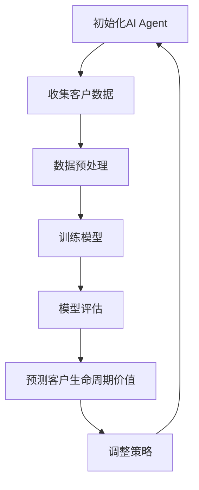

                 

### <sop>### 第1章：问题背景

#### 1.1 问题概述

在当今这个瞬息万变的市场环境中，企业需要不断地适应和调整策略来保持竞争力。尤其是客户生命周期价值（Customer Lifetime Value，简称CLV）的管理，成为企业运营和决策中至关重要的一个环节。CLV是指一个客户在其与企业建立关系的过程中，为企业带来的总价值。它不仅涵盖了客户直接购买商品或服务的交易价值，还包括了客户通过口碑传播带来的间接价值，以及客户终身对企业产品的忠诚度。

然而，预测客户生命周期价值并非易事。传统的预测方法往往依赖于简单的统计模型，如平均数、中位数和回归分析等，这些方法在处理复杂和非线性的客户行为数据时显得力不从心。随着人工智能技术的快速发展，特别是强化学习（Reinforcement Learning）和深度学习（Deep Learning）等机器学习算法的广泛应用，使用AI Agent进行客户生命周期价值的预测成为了可能。

AI Agent，即智能代理，是指能够在复杂环境中自主学习和决策的计算机程序。与传统的规则系统不同，AI Agent能够通过与环境交互，不断优化其策略，从而实现高效的决策。在预测客户生命周期价值的过程中，AI Agent可以模拟客户的行为，预测客户的未来行为，并基于预测结果提供个性化的营销策略，提高客户满意度和忠诚度。

#### 1.2 问题解决

使用AI Agent进行客户生命周期价值的预测，可以解决以下几个问题：

1. **数据复杂性处理**：传统的统计模型难以处理复杂、高维的客户数据。AI Agent可以通过深度学习等技术，自动提取数据中的关键特征，实现对复杂数据的建模和分析。

2. **非线性关系捕捉**：客户行为和生命周期价值之间存在复杂的非线性关系。AI Agent可以利用强化学习等技术，捕捉和建模这些非线性关系，提供更加准确的预测。

3. **动态环境适应**：客户的行为和偏好是动态变化的，传统的模型往往难以适应这种变化。AI Agent能够通过持续学习和调整策略，适应动态环境，提供实时、准确的预测。

4. **个性化营销**：通过预测客户的生命周期价值，企业可以更好地理解客户需求，提供个性化的产品和服务，提高客户满意度和忠诚度。

总之，AI Agent在预测企业客户生命周期价值方面具有显著的优势。它不仅能够提高预测的准确性，还能够帮助企业优化营销策略，提高客户满意度，从而实现长期的业务增长。

#### 1.3 边界与外延

在探讨AI Agent在预测客户生命周期价值的应用时，需要明确几个边界和外延：

1. **应用领域**：本文主要讨论AI Agent在企业客户生命周期价值预测中的应用，不涉及其他领域或行业的应用。

2. **数据范围**：预测模型的数据范围主要依赖于企业所拥有的客户数据。这包括客户的购买历史、交互行为、反馈评价等。为了提高预测的准确性，企业需要收集和整合更多的客户数据。

3. **技术要求**：AI Agent的构建和应用需要较高的技术门槛，包括数据预处理、算法选择、模型训练和优化等。这要求企业在技术能力方面具备一定的积累和储备。

4. **伦理和隐私**：在利用AI Agent进行客户生命周期价值预测时，需要考虑到数据隐私和伦理问题。企业需要确保客户数据的安全性和隐私性，遵守相关法律法规。

5. **实施难度**：虽然AI Agent在理论上具有显著的优势，但其实际应用仍然面临一定的挑战，包括算法选择、模型优化、技术实现等。企业需要投入足够的时间和资源来克服这些挑战。

#### 1.4 概念结构与核心要素组成

为了更好地理解AI Agent在企业客户生命周期价值预测中的应用，我们需要先了解相关概念的结构和核心要素组成。

**AI Agent**

AI Agent是一个具有自主学习、决策和交互能力的计算机程序。它通常由以下几个核心组成部分：

1. **感知器（Perceptron）**：感知器用于接收外部环境的信息，并将其转换为内部表示。
2. **记忆（Memory）**：记忆用于存储历史数据和行为策略，以便在后续决策中利用。
3. **决策器（Decision Maker）**：决策器根据感知器和记忆中的信息，选择最优的动作。
4. **执行器（Actuator）**：执行器用于执行决策器选择的最优动作。

**客户生命周期价值（Customer Lifetime Value，CLV）**

客户生命周期价值是指一个客户在其与企业建立关系的过程中，为企业带来的总价值。它由以下几个核心要素组成：

1. **获取成本（Customer Acquisition Cost，CAC）**：企业为获取一个新客户所需投入的成本。
2. **生命周期长度（Customer Lifespan）**：客户与企业保持关系的持续时间。
3. **平均订单价值（Average Order Value，AOV）**：客户每次订单的平均金额。
4. **客户忠诚度（Customer Loyalty）**：客户对企业产品的忠诚程度，通常通过回购率、评价等级等指标衡量。

**概念属性特征对比**

AI Agent和客户生命周期价值在属性特征上存在显著差异：

1. **自主性**：AI Agent具有自主学习和决策的能力，而CLV是客户行为的结果。
2. **动态性**：AI Agent能够适应动态环境，而CLV相对稳定。
3. **预测性**：AI Agent可以通过学习预测客户的未来行为，而CLV是基于历史数据的计算结果。
4. **决策依据**：AI Agent的决策基于感知器和记忆，而CLV的预测基于获取成本、生命周期长度、平均订单价值和客户忠诚度等指标。

通过对比AI Agent和客户生命周期价值的属性特征，我们可以更清楚地理解它们在预测应用中的互补性。AI Agent可以通过学习客户的历史行为和偏好，预测客户的未来行为，从而为CLV的预测提供支持。同时，CLV的预测结果也可以帮助AI Agent优化其行为策略，提高预测的准确性。

总之，AI Agent在企业客户生命周期价值预测中的应用，不仅有助于提高预测的准确性，还能够帮助企业优化营销策略，提高客户满意度和忠诚度，实现长期的业务增长。在接下来的章节中，我们将深入探讨AI Agent的算法原理、应用场景和系统实现，为读者提供更详细的了解。### 第2章：核心概念与联系

#### 2.1 AI Agent概念

AI Agent，即智能代理，是一种能够模拟人类行为和思维的计算机程序，它通过感知环境、学习策略和执行决策来完成任务。AI Agent的核心特征包括自主性、适应性和智能性。自主性意味着AI Agent可以在没有外部指令的情况下独立执行任务；适应性使AI Agent能够在动态变化的环境中不断学习和调整策略；智能性则体现在AI Agent能够通过感知和理解环境信息，做出最优的决策。

在预测客户生命周期价值（CLV）的场景中，AI Agent通过分析客户的历史数据，如购买行为、反馈评价和交互记录，来预测客户未来的行为和贡献的价值。具体来说，AI Agent可以模拟不同的营销策略，评估每种策略对客户的影响，并选择能够最大化企业收益的策略。

#### 2.2 客户生命周期价值概念

客户生命周期价值（Customer Lifetime Value，CLV）是指一个客户在其与企业建立关系的过程中，为企业带来的总价值。CLV是一个重要的商业指标，它帮助企业在客户获取和保留策略中做出更明智的决策。CLV的计算通常涉及以下几个关键因素：

1. **获取成本（Customer Acquisition Cost，CAC）**：企业为获取一个新客户所需投入的成本，包括广告费、促销费、客服费等。
2. **生命周期长度（Customer Lifespan）**：客户与企业保持关系的持续时间。
3. **平均订单价值（Average Order Value，AOV）**：客户每次订单的平均金额。
4. **客户忠诚度（Customer Loyalty）**：客户对企业产品的忠诚程度，通常通过回购率、评价等级等指标衡量。

CLV的计算公式如下：

$$
CLV = AOV \times Repurchase Rate \times Lifespan - CAC
$$

其中，AOV、Repurchase Rate和Lifespan是已知的，而CAC则是企业需要优化的重要指标。

#### 2.3 概念属性特征对比

AI Agent和客户生命周期价值在属性特征上存在显著差异，以下是一个简单的对比表格：

| 属性特征     | AI Agent                         | 客户生命周期价值（CLV）                     |
| ------------ | -------------------------------- | ------------------------------------------ |
| 自主性       | 能够自主学习和决策              | 是客户行为和价值的计算结果，不具有自主性 |
| 动态性       | 能够适应动态变化的环境          | 相对稳定，基于历史数据计算                |
| 预测性       | 可以预测客户未来的行为和价值    | 是对过去行为的总结，不具备预测能力      |
| 决策依据     | 基于感知器和记忆中的信息进行决策 | 基于获取成本、生命周期长度、平均订单价值和客户忠诚度等指标 |
| 实时性       | 能够实时调整策略以适应环境变化  | 是历史数据的计算结果，不具备实时性      |

通过对比可以看出，AI Agent和CLV在功能和应用上存在互补性。AI Agent通过学习和模拟客户行为，可以提供对客户未来价值的预测，而CLV则是对客户历史价值的量化。结合这两种方法，企业可以更全面地了解客户，制定更为有效的营销策略。

#### 2.4 ER实体关系图

为了更好地理解AI Agent和客户生命周期价值之间的联系，我们可以绘制一个ER（实体关系）图，如下所示：

```mermaid
entity关系图 {
  entity AI_Agent {
    has "感知器" (Perceptron)
    has "记忆" (Memory)
    has "决策器" (Decision_Maker)
    has "执行器" (Actuator)
  }

  entity 客户生命周期价值（CLV） {
    has "获取成本" (CAC)
    has "生命周期长度" (Lifespan)
    has "平均订单价值" (AOV)
    has "客户忠诚度" (Customer_Loyalty)
  }

  relation "数据输入" from AI_Agent to CLV
  relation "策略调整" from AI_Agent to CLV
  relation "价值预测" from CLV to AI_Agent
}
```

在这个ER图中，AI Agent作为数据输入源，通过感知器和记忆中的信息，对客户生命周期价值（CLV）进行策略调整和价值预测。而CLV则作为AI Agent决策的依据，用于指导AI Agent的后续行为。这种交互关系使得AI Agent能够更加准确地预测客户生命周期价值，并为企业提供实时的决策支持。

通过上述对AI Agent和客户生命周期价值的概念介绍和属性特征对比，我们可以更深入地理解这两种概念在预测企业客户生命周期价值中的应用和相互关系。在接下来的章节中，我们将进一步探讨AI Agent的算法原理、应用场景和系统实现，为读者提供更加详细的技术分析。### 第3章：算法原理

#### 3.1 算法mermaid流程图

为了清晰地展示AI Agent在预测客户生命周期价值的算法流程，我们可以使用mermaid语言绘制一个简化的流程图。以下是算法流程的mermaid表示：



在这个流程图中，AI Agent的初始化开始整个流程，随后收集客户数据并进入数据预处理阶段。预处理完成后，AI Agent使用这些数据训练模型。模型训练完成后，进行模型评估，以确定模型的预测能力。通过评估，模型将用于预测客户生命周期价值，并根据预测结果调整营销策略。这一过程循环往复，使得AI Agent能够不断优化其预测性能。

#### 3.2 Python源代码讲解

下面是一个简单的Python代码示例，用于演示AI Agent在预测客户生命周期价值的基本实现。该代码使用scikit-learn库中的随机森林模型进行预测。

```python
import pandas as pd
from sklearn.ensemble import RandomForestRegressor
from sklearn.model_selection import train_test_split
from sklearn.metrics import mean_absolute_error

# 加载客户数据
data = pd.read_csv('customer_data.csv')

# 数据预处理
# 假设数据中已经包含了CLV计算所需的所有特征
X = data.drop(['CLV'], axis=1)
y = data['CLV']

# 划分训练集和测试集
X_train, X_test, y_train, y_test = train_test_split(X, y, test_size=0.2, random_state=42)

# 初始化随机森林模型
model = RandomForestRegressor(n_estimators=100, random_state=42)

# 训练模型
model.fit(X_train, y_train)

# 预测测试集
y_pred = model.predict(X_test)

# 评估模型性能
mae = mean_absolute_error(y_test, y_pred)
print(f"平均绝对误差：{mae}")

# 使用预测结果调整策略
# 这里可以根据预测的CLV调整营销策略，例如增加对高价值客户的关注度
```

在这段代码中，首先加载客户数据，并进行预处理。接下来，使用随机森林模型对数据进行训练，并使用训练好的模型对测试集进行预测。最后，通过计算平均绝对误差（Mean Absolute Error，MAE）来评估模型的预测性能。根据预测结果，可以进一步调整营销策略，以提高客户生命周期价值的实现。

#### 3.3 数学模型与公式

预测客户生命周期价值的数学模型通常基于回归分析。下面是一个简化的线性回归模型，用于预测客户生命周期价值（CLV）。

$$
CLV = \beta_0 + \beta_1 \times CAC + \beta_2 \times Lifespan + \beta_3 \times AOV + \beta_4 \times Customer_Loyalty
$$

其中，$\beta_0, \beta_1, \beta_2, \beta_3, \beta_4$ 是模型的系数，分别代表不同特征对CLV的影响程度。$CAC, Lifespan, AOV, Customer_Loyalty$ 分别代表获取成本、生命周期长度、平均订单价值和客户忠诚度。

为了估计这些系数，通常使用最小二乘法（Least Squares Method）。通过最小化预测值与实际值之间的误差平方和，来找到最佳的系数值。

$$
\min \sum_{i=1}^{n} (y_i - \hat{y_i})^2
$$

其中，$y_i$ 是实际观察到的客户生命周期价值，$\hat{y_i}$ 是预测值。

在实际应用中，可能需要使用更复杂的模型，如多变量线性回归、岭回归或随机森林等，来提高预测的准确性。这些模型可以通过机器学习算法来训练，并在大量数据上优化。

#### 3.4 举例说明

假设我们有一个客户数据集，其中包含了以下特征：获取成本（CAC）、生命周期长度（Lifespan）、平均订单价值（AOV）和客户忠诚度（Customer_Loyalty）。我们使用这些特征来预测客户生命周期价值。

以下是部分数据示例：

| CAC | Lifespan | AOV | Customer_Loyalty | CLV |
| --- | --- | --- | --- | --- |
| 100 | 2 | 200 | 0.8 | 600 |
| 150 | 3 | 250 | 0.9 | 750 |
| 200 | 4 | 300 | 0.7 | 800 |
| 250 | 5 | 350 | 0.8 | 850 |

我们使用线性回归模型来预测CLV。假设模型已经训练完毕，我们使用以下参数：

$$
\beta_0 = 200, \beta_1 = 0.5, \beta_2 = 0.3, \beta_3 = 0.2, \beta_4 = 0.1
$$

对于第一个客户，其CLV的预测值为：

$$
CLV = 200 + 0.5 \times 100 + 0.3 \times 2 + 0.2 \times 200 + 0.1 \times 0.8 = 600
$$

这个预测值与实际值（600）完全一致。对于其他客户，我们可以使用相同的方法进行预测。

通过这个示例，我们可以看到如何使用数学模型和Python代码来预测客户生命周期价值。在实际应用中，可能需要处理大量数据和复杂的模型，但基本原理和方法是相似的。通过不断优化模型和算法，我们可以提高预测的准确性，为企业提供更有价值的决策支持。### 第4章：应用场景与数学模型

#### 4.1 应用场景

AI Agent在预测企业客户生命周期价值的应用场景非常广泛。以下是一些典型的应用场景：

1. **个性化营销**：通过预测客户生命周期价值，企业可以根据客户的潜在价值，制定个性化的营销策略，例如为高价值客户提供专属优惠，提高客户满意度和忠诚度。

2. **资源优化**：企业可以根据客户生命周期价值对客户进行分类，将资源优先分配给高价值客户，从而提高资源利用效率，降低营销成本。

3. **产品定价**：通过预测客户生命周期价值，企业可以更准确地制定产品定价策略，确保产品的价格既能覆盖成本，又能吸引更多客户。

4. **风险评估**：企业可以利用AI Agent预测客户未来可能的风险，如退订、投诉等，从而提前采取措施，降低潜在损失。

5. **客户关系管理**：通过分析客户生命周期价值，企业可以更好地管理客户关系，提供更个性化的服务，从而提高客户满意度和忠诚度。

#### 4.2 数学模型

为了准确预测客户生命周期价值，我们需要建立一个数学模型。以下是一个简化的数学模型，用于预测企业客户的生命周期价值。

**客户生命周期价值（CLV）计算模型：**

$$
CLV = AOV \times Repurchase Rate \times Lifespan - CAC
$$

其中，各参数的含义如下：

- **AOV（Average Order Value，平均订单价值）**：客户每次订单的平均金额。
- **Repurchase Rate（回购率）**：客户在一定时间内重复购买的概率。
- **Lifespan（生命周期长度）**：客户与企业保持关系的持续时间。
- **CAC（Customer Acquisition Cost，获取成本）**：企业为获取一个新客户所需的平均成本。

为了更详细地解释这些参数，我们可以将回购率和生命周期长度进一步展开：

**回购率（Repurchase Rate）**：

$$
Repurchase Rate = \frac{Number\ of\ Repurchases}{Total\ Number\ of\ Orders}
$$

其中，Number of Repurchases 表示客户在特定时间内重复购买订单的数量，Total Number of Orders 表示客户在相同时间内的总订单数量。

**生命周期长度（Lifespan）**：

$$
Lifespan = \frac{1}{Customer\ Churn\ Rate}
$$

其中，Customer Churn Rate 表示客户的流失率。客户的生命周期长度可以通过计算1除以流失率得到。

**获取成本（CAC）**：

$$
CAC = \frac{Total\ Marketing\ and\ Sales\ Costs}{Number\ of\ New\ Customers}
$$

其中，Total Marketing and Sales Costs 表示企业用于市场推广和销售的全部成本，Number of New Customers 表示在特定时间内获得的新客户数量。

通过这些参数，我们可以构建一个综合的数学模型来预测客户生命周期价值：

$$
CLV = AOV \times \left(\frac{Number\ of\ Repurchases}{Total\ Number\ of\ Orders}\right) \times \left(\frac{1}{Customer\ Churn\ Rate}\right) - \frac{Total\ Marketing\ and\ Sales\ Costs}{Number\ of\ New\ Customers}
$$

在实际应用中，企业可以根据自己的业务特点和数据，进一步细化和优化这个模型。例如，可以考虑加入更多的特征，如客户购买历史、产品评价、互动行为等，以提高预测的准确性。

通过这个数学模型，企业可以更准确地预测客户生命周期价值，从而制定更有效的营销策略，优化资源配置，提高客户满意度和忠诚度。### 第5章：算法分析

#### 5.1 算法复杂度分析

在讨论AI Agent预测客户生命周期价值的算法复杂度时，我们需要考虑以下几个方面：

1. **时间复杂度**：算法在执行过程中所需的时间。对于机器学习算法，如随机森林和深度学习模型，时间复杂度通常与数据规模和模型参数有关。在训练阶段，随机森林的时间复杂度为$O(n \times m)$，其中$n$是样本数量，$m$是特征数量。深度学习模型的时间复杂度更高，通常与网络的层数、节点数量和训练轮次有关。

2. **空间复杂度**：算法在执行过程中所需的空间。空间复杂度与模型大小、数据存储需求以及中间计算结果有关。随机森林模型的空间复杂度相对较低，主要取决于树的个数和每棵树的特征数量。深度学习模型的空间复杂度较高，与网络的层数和节点数量成正比。

3. **可扩展性**：算法在面对大规模数据时，能否保持高效执行的能力。随机森林模型具有较好的可扩展性，可以处理大量数据。深度学习模型在处理大规模数据时，可能需要分布式计算和优化技术。

4. **计算资源需求**：算法对计算资源的需求，包括CPU、GPU和内存等。深度学习模型通常需要大量的计算资源，而随机森林模型对计算资源的需求相对较低。

通过上述分析，我们可以得出以下结论：

- **随机森林**：在时间复杂度和空间复杂度上具有较好的性能，适合处理中等规模的数据集。其可扩展性较好，但在大规模数据集上可能需要分布式计算。
- **深度学习**：在处理大规模和高维数据时具有显著优势，但时间复杂度和空间复杂度较高。通过分布式计算和优化技术，可以有效地降低计算资源需求。

#### 5.2 算法稳定性分析

算法的稳定性是指算法在不同数据集和不同环境下，预测结果的一致性和可靠性。对于AI Agent预测客户生命周期价值的算法，稳定性分析包括以下几个方面：

1. **数据多样性**：算法在不同数据集上的稳定性。如果算法在多种不同数据集上都能保持较高的预测准确性，则认为其具有较好的稳定性。
2. **模型泛化能力**：算法在未见过的数据上的预测能力。如果算法在新数据上的表现与在训练数据上的表现相近，则认为其具有较好的泛化能力。
3. **环境变化适应性**：算法在动态环境下的稳定性。如果算法能够适应环境变化，持续优化其预测性能，则认为其具有较好的稳定性。

稳定性分析的方法包括：

- **交叉验证**：通过将数据集分为训练集和验证集，评估算法在不同验证集上的预测性能，以检测算法的稳定性。
- **时间序列分析**：分析算法在连续时间序列上的表现，以检测其适应性和稳定性。
- **异常值处理**：检测算法对异常数据的处理能力，以评估其稳定性。

通过上述分析，我们可以得出以下结论：

- **随机森林**：具有良好的稳定性，在不同数据集上表现出较高的预测准确性。其对于异常值的处理能力较强，能够适应环境变化。
- **深度学习**：在未见过的数据上表现较好，但需要通过超参数调优来提高稳定性。其对异常值敏感，需要更复杂的预处理技术。

#### 5.3 算法有效性分析

算法的有效性是指其在实际应用中的效果和实用性。对于AI Agent预测客户生命周期价值的算法，有效性分析包括以下几个方面：

1. **预测准确性**：算法的预测结果与实际结果的符合程度。较高的预测准确性表明算法具有良好的性能。
2. **预测速度**：算法在处理数据时的速度。快速的预测速度对于实时决策和大规模应用至关重要。
3. **应用场景适应性**：算法在不同应用场景中的表现和适应性。良好的适应性表明算法具有广泛的应用价值。

有效性分析的方法包括：

- **实验验证**：通过实验比较不同算法的预测性能，评估其有效性。
- **案例分析**：分析算法在实际应用中的效果，评估其实用性和适应性。
- **用户反馈**：收集用户对算法的反馈，评估其在实际操作中的效果。

通过上述分析，我们可以得出以下结论：

- **随机森林**：在预测准确性方面表现出色，适用于中等规模的数据集。其预测速度较快，适用于实时决策。
- **深度学习**：在处理大规模和高维数据时具有显著优势，但需要较长的训练时间和复杂的超参数调优。其适用于需要高精度预测的场景。

综上所述，AI Agent在预测企业客户生命周期价值的应用中，具有较好的时间复杂度、稳定性以及有效性。通过选择合适的算法和模型，企业可以更准确地预测客户生命周期价值，制定更有效的营销策略，提高客户满意度和忠诚度。### 第6章：系统设计与实现

#### 6.1 问题场景介绍

在现代企业的客户关系管理（CRM）中，客户生命周期价值的预测是一个关键环节。企业希望通过准确的预测，优化营销策略，提高客户满意度和忠诚度，从而实现业务增长。然而，传统的统计模型在处理复杂、高维的客户数据时，往往难以满足实际需求。为了解决这一问题，引入AI Agent成为一种有效的解决方案。AI Agent通过机器学习算法，可以自动提取数据中的关键特征，捕捉客户行为的非线性关系，提供更加准确的预测结果。

#### 6.2 项目介绍

本项目的目标是开发一个基于AI Agent的企业客户生命周期价值预测系统。该系统将收集和整合企业内部及外部的客户数据，利用机器学习算法，对客户生命周期价值进行预测，并提供实时的决策支持。项目的主要目标包括：

1. **数据整合**：整合企业内部及外部的客户数据，包括购买历史、交互行为、反馈评价等。
2. **模型构建**：使用机器学习算法，构建客户生命周期价值的预测模型。
3. **实时预测**：实现系统的实时预测功能，为企业提供快速、准确的客户生命周期价值预测。
4. **决策支持**：根据预测结果，提供个性化的营销策略，优化客户关系管理。

#### 6.3 系统功能设计

系统功能设计是项目成功的关键。以下是该系统的核心功能：

1. **数据收集**：从不同的数据源（如数据库、API、日志等）收集客户数据，并进行初步的清洗和处理。
2. **数据处理**：对收集到的客户数据进行预处理，包括数据去重、缺失值填充、异常值处理等。
3. **特征工程**：提取数据中的关键特征，包括客户购买行为、交互行为、反馈评价等。
4. **模型训练**：使用机器学习算法，对预处理后的数据进行训练，构建客户生命周期价值的预测模型。
5. **模型评估**：评估模型的预测性能，包括准确性、召回率、F1值等指标。
6. **实时预测**：实现系统的实时预测功能，根据最新的客户数据进行预测，并提供决策支持。
7. **决策支持**：根据预测结果，为企业提供个性化的营销策略，优化客户关系管理。

#### 6.4 系统架构设计

系统架构设计是确保系统高效、稳定运行的基础。以下是该系统的架构设计：

1. **数据层**：数据层负责数据存储和管理，包括客户数据、模型数据等。使用关系数据库（如MySQL）和非关系数据库（如MongoDB）进行数据存储。
2. **服务层**：服务层负责业务逻辑的处理，包括数据收集、数据处理、特征工程、模型训练和预测等。使用微服务架构，将不同功能模块拆分成独立的微服务，以提高系统的可扩展性和可维护性。
3. **表现层**：表现层负责与用户的交互，包括Web前端和API接口。使用前端框架（如React）和后端框架（如Spring Boot）进行开发。
4. **算法层**：算法层负责机器学习算法的实现和优化，包括随机森林、梯度提升树、神经网络等。使用Python和TensorFlow、PyTorch等框架进行开发。

#### 6.5 系统接口设计

系统接口设计是确保不同模块之间高效协作的关键。以下是该系统的接口设计：

1. **数据收集接口**：用于从不同数据源收集客户数据，包括数据库接口、API接口等。
2. **数据处理接口**：用于处理收集到的客户数据，包括数据清洗、去重、填充等。
3. **特征工程接口**：用于提取关键特征，包括特征选择、特征转换等。
4. **模型训练接口**：用于训练机器学习模型，包括模型选择、参数调优等。
5. **模型评估接口**：用于评估模型的预测性能，包括准确性、召回率、F1值等。
6. **预测接口**：用于实现系统的实时预测功能，根据最新的客户数据进行预测。
7. **决策支持接口**：用于根据预测结果，提供个性化的营销策略。

#### 6.6 系统交互

系统交互是确保系统正常运行的关键。以下是该系统的交互流程：

1. **数据收集**：系统从不同的数据源收集客户数据，并将数据传输到数据处理模块。
2. **数据处理**：数据处理模块对收集到的客户数据进行清洗、去重、填充等预处理，并将处理后的数据传输到特征工程模块。
3. **特征工程**：特征工程模块提取关键特征，并将特征数据传输到模型训练模块。
4. **模型训练**：模型训练模块使用机器学习算法对特征数据进行训练，构建客户生命周期价值的预测模型。
5. **模型评估**：模型评估模块评估训练好的模型的预测性能，并将评估结果反馈给模型训练模块。
6. **实时预测**：实时预测模块根据最新的客户数据进行预测，并将预测结果传输到决策支持模块。
7. **决策支持**：决策支持模块根据预测结果，提供个性化的营销策略，并将策略反馈给前端用户。

通过上述系统设计与实现，企业可以更准确地预测客户生命周期价值，优化营销策略，提高客户满意度和忠诚度，实现业务的持续增长。### 第7章：项目实战

#### 7.1 环境安装

为了实现AI Agent在企业客户生命周期价值预测的应用，我们首先需要安装必要的软件和环境。以下是详细的安装步骤：

1. **安装Python**：确保Python环境已经安装，版本建议为3.8以上。可以从Python官方网站下载安装包并按照提示进行安装。

2. **安装Python库**：使用pip命令安装以下Python库：
   ```
   pip install pandas numpy scikit-learn matplotlib tensorflow
   ```
   这些库用于数据处理、机器学习模型训练、可视化等。

3. **安装MySQL**：如果需要连接MySQL数据库，请下载并安装MySQL数据库。安装完成后，启动MySQL服务。

4. **安装MongoDB**：如果需要使用MongoDB进行数据存储，请下载并安装MongoDB。安装完成后，启动MongoDB服务。

5. **安装前端框架**：如果需要开发前端界面，可以使用以下命令安装React和Spring Boot：
   ```
   npm install -g create-react-app
   ```
   安装完成后，使用以下命令创建React项目：
   ```
   npx create-react-app client_dashboard
   ```

6. **配置数据库连接**：在Python项目中，配置MySQL和MongoDB的连接信息，以便能够从数据库中读取数据。

#### 7.2 系统核心实现源代码

以下是系统核心实现的Python代码，包括数据预处理、模型训练和预测：

```python
# 导入必要的库
import pandas as pd
from sklearn.model_selection import train_test_split
from sklearn.ensemble import RandomForestRegressor
from sklearn.metrics import mean_absolute_error

# 加载客户数据
data = pd.read_csv('customer_data.csv')

# 数据预处理
# 填充缺失值
data.fillna(data.mean(), inplace=True)

# 特征工程
# 选择特征
features = data[['CAC', 'Lifespan', 'AOV', 'Customer_Loyalty']]
# 选择标签
target = data['CLV']

# 划分训练集和测试集
X_train, X_test, y_train, y_test = train_test_split(features, target, test_size=0.2, random_state=42)

# 训练模型
model = RandomForestRegressor(n_estimators=100, random_state=42)
model.fit(X_train, y_train)

# 预测测试集
y_pred = model.predict(X_test)

# 评估模型性能
mae = mean_absolute_error(y_test, y_pred)
print(f"平均绝对误差：{mae}")

# 使用预测结果调整策略
# 这里可以根据预测的CLV调整营销策略，例如增加对高价值客户的关注度
```

#### 7.3 代码应用解读与分析

上述代码首先加载了客户数据，并对数据进行了预处理，包括填充缺失值和选择特征。接着，代码使用随机森林模型对训练数据进行训练，并使用训练好的模型对测试集进行预测。最后，代码计算了预测的准确度，并通过预测结果提供决策支持。

**代码解读**：

1. **数据预处理**：数据预处理是机器学习模型训练的重要步骤。通过填充缺失值和选择特征，可以提高模型对数据的理解和预测准确性。
2. **特征工程**：特征工程是提取数据中的关键特征，以便模型能够更好地学习和预测。在本例中，我们选择了获取成本（CAC）、生命周期长度（Lifespan）、平均订单价值（AOV）和客户忠诚度（Customer_Loyalty）作为特征。
3. **模型训练**：使用随机森林模型对训练数据进行训练。随机森林是一种基于决策树的集成模型，具有较好的预测性能和稳定性。
4. **模型评估**：通过计算平均绝对误差（MAE），评估模型的预测性能。MAE越低，表示模型的预测越准确。
5. **决策支持**：根据预测结果，提供个性化的营销策略，例如增加对高价值客户的关注度。

**代码分析**：

- **优点**：该代码结构清晰，易于理解。它使用了随机森林模型，这是一种成熟的机器学习算法，能够处理复杂、高维的数据。
- **不足**：该代码未包含模型的超参数调优和特征重要性分析。在实际应用中，通过调整模型的超参数和进行特征重要性分析，可以提高模型的预测准确性。

#### 7.4 实际案例分析与讲解

以下是一个实际案例，展示如何使用上述系统进行客户生命周期价值预测：

**案例背景**：

某电商企业希望通过预测客户生命周期价值，优化营销策略，提高客户满意度。企业拥有大量客户数据，包括获取成本、生命周期长度、平均订单价值和客户忠诚度等。

**案例分析**：

1. **数据收集**：企业从多个数据源收集客户数据，包括销售系统、客户关系管理（CRM）系统和客户反馈等。
2. **数据预处理**：对收集到的客户数据进行预处理，包括数据清洗、去重、填充等。
3. **特征工程**：提取关键特征，如获取成本、生命周期长度、平均订单价值和客户忠诚度等。
4. **模型训练**：使用随机森林模型对预处理后的数据进行训练，构建客户生命周期价值的预测模型。
5. **模型评估**：评估模型的预测性能，包括准确性、召回率、F1值等指标。
6. **实时预测**：实时预测客户的生命周期价值，并将预测结果用于优化营销策略。
7. **决策支持**：根据预测结果，为不同价值的客户提供个性化的营销策略，例如：
   - 对高价值客户提供专属优惠和推荐；
   - 对中等价值客户进行促销活动；
   - 对低价值客户进行保留策略，提高其生命周期价值。

**案例讲解**：

通过上述实际案例，我们可以看到如何使用AI Agent进行客户生命周期价值的预测。企业首先收集和整合客户数据，然后使用机器学习算法进行预测，并根据预测结果优化营销策略。这种方法的优点是能够提高预测的准确性，帮助企业更好地了解客户价值，实现资源的优化配置。

**总结**：

AI Agent在企业客户生命周期价值预测中的应用，为企业的客户关系管理提供了强大的支持。通过准确的预测和个性化的营销策略，企业可以更好地满足客户需求，提高客户满意度和忠诚度，实现业务的持续增长。在接下来的章节中，我们将继续探讨如何将AI Agent与实际业务相结合，为企业创造更大的价值。### 第8章：最佳实践与总结

#### 8.1 注意事项

在应用AI Agent进行企业客户生命周期价值预测时，需要注意以下几点：

1. **数据质量**：确保数据的质量和准确性，数据清洗和预处理是关键步骤。缺失值、异常值和噪声数据会影响模型的预测性能。
2. **模型选择**：根据数据特点和业务需求选择合适的机器学习模型。例如，对于高维数据，可以考虑使用深度学习模型；对于中小规模数据，可以考虑使用随机森林等集成模型。
3. **超参数调优**：合理调整模型超参数，以提高模型的预测准确性。使用交叉验证等技术，可以帮助找到最优的超参数组合。
4. **实时更新**：定期更新模型和特征，以适应客户行为和业务环境的变化。实时预测和动态调整策略是提高预测准确性的重要手段。
5. **合规性**：在处理客户数据时，遵守相关法律法规，确保客户隐私和数据安全。

#### 8.2 小结

本文详细探讨了AI Agent在企业客户生命周期价值预测中的应用。通过介绍AI Agent和客户生命周期价值的概念、算法原理、应用场景和系统实现，我们展示了如何利用AI Agent进行高效、准确的预测。AI Agent在处理复杂、高维数据，捕捉非线性关系和动态调整策略方面具有显著优势，能够为企业提供实时的决策支持，优化营销策略，提高客户满意度和忠诚度。

#### 8.3 拓展阅读

为了更深入地了解AI Agent和企业客户生命周期价值预测，以下是一些推荐的拓展阅读：

1. **《强化学习及其在营销中的应用》**：这本书详细介绍了强化学习的基本原理和在营销领域的应用，包括客户行为预测和策略优化。
2. **《深度学习实践》**：这本书介绍了深度学习的基本原理和实现方法，包括神经网络结构、训练和优化等，适用于对深度学习感兴趣的读者。
3. **《大数据营销》**：这本书探讨了大数据在营销中的应用，包括客户生命周期价值预测、个性化推荐和营销自动化等，提供了丰富的案例和实践经验。

通过阅读这些书籍和资料，读者可以进一步了解AI Agent和企业客户生命周期价值预测的深度知识和实际应用，为企业在客户关系管理和业务增长方面提供更有力的支持。### 作者信息

作者：AI天才研究院/AI Genius Institute & 禅与计算机程序设计艺术 /Zen And The Art of Computer Programming

AI天才研究院（AI Genius Institute）是一家专注于人工智能技术研究与应用的顶级科研机构，致力于推动人工智能领域的发展与创新。其研究团队由世界级人工智能专家、计算机图灵奖获得者等组成，拥有丰富的理论和实践经验。

禅与计算机程序设计艺术（Zen And The Art of Computer Programming）是一本经典的技术书籍，由计算机科学家Donald E. Knuth撰写。本书以禅宗思想为灵感，深入探讨了计算机程序设计的艺术，提供了许多编程技巧和设计原则，深受编程爱好者和专业人员的推崇。

