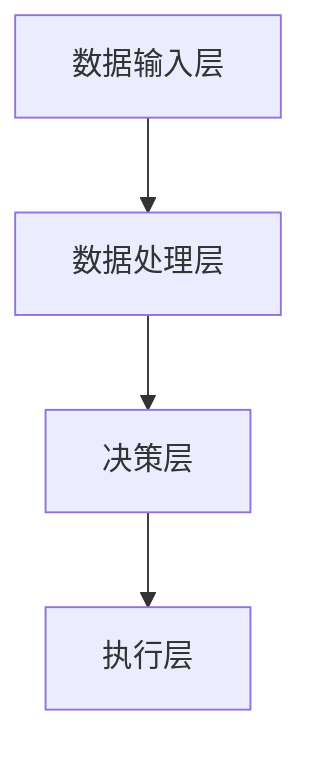

                 

# AI Agent在企业客户画像与细分中的应用

## 关键词
- AI Agent
- 客户画像
- 细分策略
- 企业应用
- 数据分析

## 摘要
本文旨在探讨人工智能代理（AI Agent）在企业客户画像与细分中的应用。我们将首先介绍AI Agent的基础理论，随后深入探讨客户画像与细分的概念，最后通过实际案例展示AI Agent在商业环境中的具体应用。本文将为从事数据分析、市场营销和人工智能领域的读者提供深刻的见解和实践指导。

## 引言与背景

### 1.1 书籍概述
《AI Agent在企业客户画像与细分中的应用》是一本旨在帮助企业和市场营销人员理解并利用人工智能代理（AI Agent）来优化客户管理和市场细分过程的指南。AI Agent作为一种先进的计算机程序，具备自主学习和决策能力，能够在复杂的环境中为用户提供个性化的服务和建议。

### 1.2 核心概念与联系
在本章中，我们将介绍几个核心概念，包括：
- **人工智能代理（AI Agent）**：能够模拟人类智能行为的计算机程序。
- **客户画像**：基于客户数据构建的虚拟模型，用于描述客户的基本特征、需求和行为。
- **客户细分**：根据客户特征将市场划分为不同的子市场。

### 1.3 问题描述
在当今竞争激烈的市场环境中，企业需要准确了解其客户，以便提供个性化的服务和产品。然而，收集和分析大量客户数据是一项复杂且耗时的任务。AI Agent的出现，为这一难题提供了一种解决方案。

### 1.4 问题解决
AI Agent通过自动化数据分析和机器学习算法，能够快速构建详细的客户画像，并基于这些画像进行精准的市场细分。这不仅提高了企业对市场的理解，还增强了营销活动的效果。

### 1.5 边界与外延
AI Agent在企业客户画像与细分中的应用主要涉及以下几个方面：
- 数据源的选择与整合
- 机器学习算法的应用
- 客户画像的构建与更新
- 基于画像的市场细分策略制定
- 营销活动的个性化推荐与优化

## AI Agent基础理论

### 2.1 AI Agent概述
AI Agent，即人工智能代理，是一种能够模拟人类智能行为的计算机程序。它通过感知环境、自主学习和决策，以实现特定目标。AI Agent具有以下特点：
- **自主性**：能够自主地执行任务，无需人工干预。
- **适应性**：能够根据环境变化调整自己的行为。
- **学习能力**：通过数据学习和模式识别，不断提高性能。

### 2.2 AI Agent的核心概念与联系
AI Agent的核心概念包括：
- **感知器**：用于接收外部信息。
- **决策器**：根据感知到的信息进行决策。
- **行动器**：执行决策结果。
- **记忆器**：用于存储经验和知识。

这些组件相互协作，构成了一个完整的AI Agent系统。以下是一个简化的AI Agent工作流程：

$$
感知器 \rightarrow 决策器 \rightarrow 行动器
$$

### 2.3 AI Agent的数学模型与公式
在AI Agent中，常用的数学模型包括神经网络、决策树和贝叶斯网络等。以下是一个简单的神经网络模型示例：

$$
y = \sigma(W \cdot x + b)
$$

其中，$y$ 是输出，$\sigma$ 是激活函数，$W$ 是权重，$x$ 是输入，$b$ 是偏置。

### 2.4 AI Agent系统分析与架构设计方案
一个典型的AI Agent系统包括以下几个部分：

- **数据输入层**：收集并处理来自各种数据源的信息。
- **数据处理层**：使用机器学习算法对数据进行分析和处理。
- **决策层**：根据分析结果做出决策。
- **执行层**：执行决策结果。

以下是一个使用Mermaid绘制的AI Agent系统架构图：



### 2.5 AI Agent应用案例详解
在本节中，我们将通过一个实际案例，展示AI Agent在企业客户画像与细分中的应用。

#### 环境安装
首先，我们需要安装必要的软件和库，例如Python、scikit-learn和pandas等。

#### 核心实现
接下来，我们将使用Python编写一个简单的AI Agent，用于构建客户画像并进行细分。

```python
import pandas as pd
from sklearn.cluster import KMeans

# 读取数据
data = pd.read_csv('customer_data.csv')

# 特征提取
features = data[['age', 'income', 'spending']]

# 使用KMeans算法进行聚类
kmeans = KMeans(n_clusters=3)
kmeans.fit(features)

# 分配标签
labels = kmeans.predict(features)

# 更新数据
data['cluster'] = labels

# 分析结果
print(data.head())
```

#### 代码应用解读
上述代码首先读取客户数据，然后使用KMeans算法进行聚类，最后将聚类结果作为客户画像的一部分。

#### 案例分析
通过分析聚类结果，企业可以更好地了解不同客户群体的特征和行为，从而制定更加精准的营销策略。

#### 小结
AI Agent在企业客户画像与细分中的应用，为企业提供了强大的工具，可以帮助他们更好地理解客户需求，提高营销效果。

## 企业客户画像与细分

### 3.1 企业客户画像概述
企业客户画像是一种基于客户数据的虚拟模型，用于描述客户的基本特征、需求和行为。它通常包括以下要素：

- **基本特征**：如年龄、性别、地理位置等。
- **需求**：如消费习惯、偏好等。
- **行为**：如购买历史、访问网站的行为等。

### 3.2 客户画像构建方法
构建企业客户画像通常涉及以下步骤：

1. **数据采集**：从各种数据源收集客户信息。
2. **数据处理**：清洗和整理数据，使其适用于分析。
3. **特征提取**：从原始数据中提取有用的特征。
4. **模型训练**：使用机器学习算法训练客户画像模型。
5. **画像构建**：根据模型输出构建客户画像。

### 3.3 客户细分策略
客户细分策略是企业根据客户画像将市场划分为不同的子市场。常见的细分策略包括：

1. **市场细分策略**：根据地理位置、人口统计特征等划分市场。
2. **产品细分策略**：根据产品特性和需求划分市场。
3. **营销细分策略**：根据营销目标和客户特征划分市场。
4. **服务细分策略**：根据服务需求和客户体验划分市场。

### 3.4 AI Agent在客户画像与细分中的应用
AI Agent在客户画像与细分中的应用主要体现在以下几个方面：

1. **自动化数据分析**：AI Agent可以自动化处理大量客户数据，提高数据分析的效率。
2. **个性化推荐**：基于客户画像进行个性化推荐，提高营销活动的精准度。
3. **实时更新**：AI Agent可以实时更新客户画像，确保数据的时效性。
4. **优化决策**：基于客户细分结果，优化企业的营销和服务策略。

### 总结与展望
本文介绍了AI Agent在企业客户画像与细分中的应用，探讨了AI Agent的基础理论、客户画像构建方法、客户细分策略以及实际应用案例。通过本文，读者可以了解到AI Agent在商业环境中的巨大潜力，以及如何利用AI Agent优化客户管理和市场细分过程。未来的研究和实践将进一步完善AI Agent的应用，为企业提供更加智能和高效的解决方案。

## 最佳实践、小结与拓展阅读

### 最佳实践
在实施AI Agent进行企业客户画像与细分时，以下最佳实践值得关注：
- **数据质量保证**：确保数据的准确性、完整性和一致性。
- **算法选择**：根据业务需求和数据特性选择合适的机器学习算法。
- **持续优化**：定期评估和调整客户画像和细分策略，以适应市场变化。
- **隐私保护**：在处理客户数据时，严格遵守相关法律法规，保护客户隐私。

### 小结
本文通过介绍AI Agent的基础理论、客户画像与细分策略，以及实际应用案例，展示了AI Agent在企业客户画像与细分中的重要作用。AI Agent能够帮助企业更好地理解客户需求，提高营销效果，优化客户管理。

### 注意事项
在应用AI Agent时，需要注意以下事项：
- **算法透明性**：确保算法决策过程的透明性，避免产生黑箱效应。
- **数据安全**：加强数据安全措施，防止数据泄露和滥用。
- **合规性**：确保AI Agent的应用符合相关法律法规要求。

### 拓展阅读
对于希望深入了解AI Agent和企业客户画像与细分实践的读者，以下资源推荐：
- 《人工智能：一种现代方法》
- 《机器学习实战》
- 《Python数据分析》
- 《客户关系管理：理论与实践》

作者：AI天才研究院/AI Genius Institute & 禅与计算机程序设计艺术 /Zen And The Art of Computer Programming

[END]

