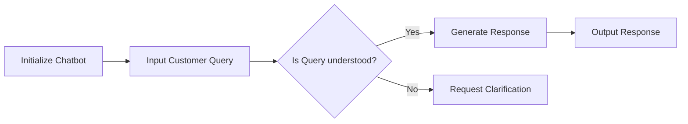
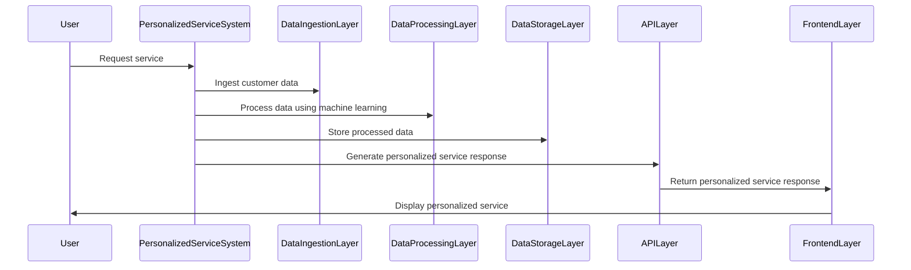
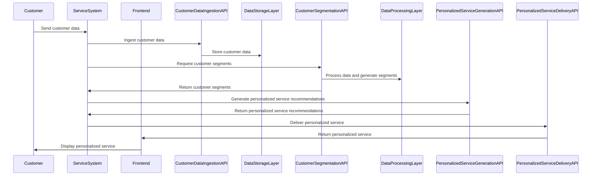

                 


### 1. Introduction to the Book

### AI Agent in the Application of Enterprise Customer Segmentation and Personalized Service

In today's rapidly evolving business landscape, enterprises are increasingly relying on advanced technologies to gain a competitive edge. Among these technologies, AI agents stand out as a game-changer in customer segmentation and personalized service. This book aims to explore the profound impact of AI agents on modern business operations, offering a comprehensive guide to harnessing their potential for enhanced customer experiences and business growth.

#### Core Keywords

- AI Agents
- Customer Segmentation
- Personalized Service
- Machine Learning
- Natural Language Processing

#### Summary

The book delves into the intricate world of AI agents, explaining their fundamental concepts and applications in enterprise settings. We begin by providing a clear understanding of the challenges faced by businesses in effectively segmenting customers and delivering personalized services. Subsequently, we explore the technological underpinnings of AI agents, including machine learning and natural language processing, and how these technologies enable sophisticated customer segmentation and personalized service strategies.

Through a structured and logical approach, we discuss various customer segmentation methods and their applications, along with personalized service strategies tailored to different business scenarios. The book concludes with practical insights and case studies, offering valuable tips for implementing AI agents in real-world settings.

### 2. Background and Core Concepts

#### Problem Background

The competitive landscape of today's business environment demands enterprises to be agile and customer-centric. One of the significant challenges they face is the ability to effectively segment their customer base and deliver personalized services that resonate with individual customer needs and preferences. Traditional customer segmentation methods often fall short due to their reliance on static, one-size-fits-all approaches, which fail to capture the dynamic nature of customer behavior and preferences.

The emergence of AI agents presents a revolutionary solution to this challenge. By leveraging advanced machine learning algorithms and natural language processing capabilities, AI agents can analyze vast amounts of customer data in real-time, enabling enterprises to create highly accurate customer segments and deliver personalized services that enhance customer satisfaction and loyalty.

#### Core Concepts

**AI Agents**: AI agents are software applications designed to perform specific tasks autonomously, mimicking human intelligence. In the context of customer segmentation and personalized service, AI agents can analyze customer data, identify patterns, and generate actionable insights to optimize customer experiences.

**Customer Segmentation**: Customer segmentation is the process of dividing a heterogeneous market into sub-groups of customers with similar characteristics or needs. Effective customer segmentation enables businesses to tailor their marketing strategies and service offerings to different segments, thereby maximizing customer engagement and satisfaction.

**Personalized Service**: Personalized service refers to the delivery of tailored experiences and offerings to individual customers based on their unique preferences and behaviors. Personalized service enhances customer satisfaction by creating a sense of relevance and importance, thereby fostering long-term customer loyalty.

#### Comparative Table

| Approach             | Description                                                         | Advantages                                             | Disadvantages                                           |
|----------------------|------------------------------------------------------------------|--------------------------------------------------------|---------------------------------------------------------|
| Traditional Segmentation | Manual, rule-based approaches like demographic, psychographic, behavioral segmentation | Relatively low cost, easy to implement                   | Inflexible, unable to adapt to dynamic customer needs |
| AI-driven Segmentation | Uses machine learning and data analytics to segment customers dynamically | Highly accurate, adaptive to changing customer behaviors | Requires significant investment in technology and data |
| Personalization       | Tailors marketing and service offerings to individual customer profiles | Enhances customer satisfaction, improves loyalty         | May require additional resources for customization      |

#### ER Diagram

```mermaid
erDiagram
    Customer ||--|{ Service : receives}
    Customer ||--|{ Purchase : made}
    Service  ||--|{ PersonalizedService : provides}
```

In this ER diagram, we represent the relationships between customers, services, and purchases. The `Customer` entity is related to the `Service` and `Purchase` entities, illustrating how personalized services are provided based on customer data and purchasing behavior.

### 3. AI Agent Technologies

#### Introduction to AI Agents

AI agents are software entities capable of performing tasks autonomously using artificial intelligence techniques. In the context of customer segmentation and personalized service, AI agents analyze large datasets to identify patterns and insights that humans might miss. These agents can learn from historical data and adapt their behavior to improve over time, making them an invaluable tool for businesses looking to enhance customer experiences.

#### Technologies Behind AI Agents

AI agents rely on several key technologies to function effectively:

**Machine Learning**: Machine learning algorithms enable AI agents to learn from data, identify patterns, and make predictions. Common machine learning techniques include supervised learning, unsupervised learning, and reinforcement learning.

**Natural Language Processing (NLP)**: NLP allows AI agents to understand and process human language. This capability is crucial for tasks such as chatbots, voice assistants, and sentiment analysis.

**Data Analytics**: Data analytics tools help AI agents process and analyze large volumes of data to extract meaningful insights. This includes techniques such as data visualization, statistical analysis, and data mining.

**Algorithmic Principles**

To illustrate the algorithmic principles behind AI agents, let's consider a simple example of a chatbot that uses machine learning and NLP to provide personalized customer support.

**Mermaid Flowchart:**



**Python Code Example:**

```python
import nltk
from nltk.chat.util import Chat, reflections

pairs = [
    [
        r"what is your name?",
        ["I'm an AI agent. How can I help you today?"]
    ],
    [
        r"how can i help you?",
        ["I can assist you with various queries related to our products and services."]
    ],
    [
        r"what products do you offer?",
        ["We offer a wide range of products designed to meet your needs."]
    ]
]

chatbot = Chat(pairs, reflections)
chatbot.converse()
```

In this example, the chatbot uses a set of pre-defined pairs of user input and responses. When a user inputs a query, the chatbot checks if it matches any predefined patterns and generates an appropriate response. If the query is not understood, the chatbot requests clarification.

#### Conclusion

AI agents are powerful tools that enable enterprises to deliver personalized customer experiences by leveraging advanced technologies such as machine learning and NLP. By understanding the underlying principles of these technologies, businesses can harness the full potential of AI agents to enhance customer satisfaction and drive business growth.

### 4. Customer Segmentation Methods

#### Segmentation Principles

Customer segmentation is a critical process for businesses to understand and cater to the diverse needs of their customer base. The primary goal of segmentation is to group customers into distinct categories based on their characteristics, behaviors, or preferences. This enables businesses to create targeted marketing campaigns and personalized service strategies that resonate with each segment.

There are several principles and methods of customer segmentation:

- **Clustering Methods**: Cluster analysis groups customers into clusters or segments based on similarities in their characteristics. Common clustering methods include K-means clustering, hierarchical clustering, and DBSCAN.

- **Classification Methods**: Classification methods assign customers to predefined segments based on their attributes. Techniques such as logistic regression, decision trees, and support vector machines can be used for classification.

- **Regression Methods**: Regression methods predict customer behavior or preferences based on historical data. Linear regression and logistic regression are examples of regression methods used in customer segmentation.

#### Method Comparison

| Method               | Description                                                                                      | Pros                                         | Cons                                             |
|----------------------|--------------------------------------------------------------------------------------------------|--------------------------------------------|--------------------------------------------------|
| K-means Clustering   | Divides customers into K clusters based on their feature vectors.                                     | Simple, efficient for large datasets       | Requires pre-determined number of clusters        |
| Hierarchical Clustering | Creates a hierarchy of clusters by merging or splitting clusters iteratively.                        | Provides a hierarchical representation of data | More computationally expensive                    |
| DBSCAN               | Groups customers based on their density of features, identifying clusters of varying shapes and sizes. | Can handle non-spherical clusters             | No guaranteed number of clusters                  |
| Logistic Regression  | Uses a logistic function to model the probability of customer belonging to a particular segment.     | Interpretable, effective for binary outcomes | Less robust for multi-class segmentation           |
| Decision Trees       | Creates a tree-like model of decisions based on customer attributes.                                  | Intuitive, easy to interpret                | Prone to overfitting, sensitive to attribute scales |
| Support Vector Machines | Models customer segments as hyperplanes in a high-dimensional space.                                 | Effective in high-dimensional spaces        | Computationally expensive                        |

#### Mathematical Models and Explanations

**K-means Clustering:**
The K-means algorithm aims to partition n observations into k clusters in which each observation belongs to the cluster with the nearest mean.

Objective Function:
$$
J = \sum_{i=1}^{k} \sum_{x_j \in S_i} ||x_j - \mu_i||^2
$$

Where $S_i$ is the set of points in the ith cluster, and $\mu_i$ is the centroid of the cluster.

**Hierarchical Clustering:**
Hierarchical clustering creates a tree of clusters, where each node represents a cluster, and the leaf nodes represent individual customers.

Linkage Methods:
- **Single Linkage**: Minimum distance between any two points in different clusters.
- **Complete Linkage**: Maximum distance between any two points in different clusters.
- **Average Linkage**: Average distance between all points in different clusters.

**DBSCAN:**
DBSCAN (Density-Based Spatial Clustering of Applications with Noise) groups together customers based on their density of features.

Key Concepts:
- **Core Points**: Points with more than a minimum number of neighboring points.
- **Border Points**: Points near core points but do not meet the minimum number of neighbors.
- **Noise Points**: Points that do not meet the minimum neighbor criteria and are not core or border points.

Algorithm Steps:
1. **Initialize**: Set parameters $min\_pts$ (minimum number of points to form a cluster) and $eps$ (maximum distance between two points to be considered as in the same neighborhood).
2. **Identify Core Points**: For each point, check if it has more than $min\_pts$ neighbors within distance $eps$.
3. **Cluster Formation**: Group core points and their neighbors into clusters.
4. **Handle Border Points**: Assign border points to the nearest cluster.
5. **Noise Points**: Label as noise points.

**Logistic Regression:**
Logistic regression models the probability of customer belonging to a specific segment using a logistic function.

Model Equation:
$$
P(y=1 | x) = \frac{1}{1 + e^{-\beta_0 + \sum_{i=1}^{n} \beta_i x_i}}
$$

Where $P(y=1 | x)$ is the probability of customer belonging to segment 1 given the feature vector $x$, $\beta_0$ is the intercept, and $\beta_i$ are the coefficients for each feature.

**Decision Trees:**
Decision trees partition the customer space into regions based on the values of input features.

Algorithm Steps:
1. **Select the best feature**: Evaluate each feature to find the one that provides the greatest information gain or the smallest Gini impurity.
2. **Split the data**: Create a split using the selected feature and divide the data into two subsets.
3. **Recursively apply steps 1 and 2**: Repeat the process for each subset until a stopping criterion is met (e.g., maximum depth, minimum node size).

**Support Vector Machines:**
Support Vector Machines (SVM) find the hyperplane that maximally separates two classes in a high-dimensional space.

Objective Function:
$$
\min_{\beta, \beta_0} \frac{1}{2} ||\beta||^2 \\
s.t. \ y_i (\beta^T x_i + \beta_0) \geq 1
$$

Where $\beta$ is the weight vector, $\beta_0$ is the bias term, and $x_i$ and $y_i$ are the feature vector and class label of the ith customer, respectively.

#### Conclusion

Customer segmentation is a vital process for businesses to tailor their marketing and service strategies effectively. By understanding and applying different segmentation methods, businesses can gain valuable insights into their customer base and create targeted approaches that drive engagement and loyalty. This chapter provides a comprehensive overview of various segmentation methods, their principles, and their applications in the context of AI agents and personalized service.

### 5. Personalized Service Strategies

#### Introduction to Personalized Service

Personalized service has become a cornerstone of modern business strategy, driven by the growing importance of customer experience in achieving competitive advantage. Personalized service refers to the delivery of tailored experiences and offerings to individual customers based on their unique preferences, behaviors, and needs. Unlike traditional, one-size-fits-all approaches, personalized service aims to create a sense of relevance and importance for each customer, thereby enhancing satisfaction and fostering long-term loyalty.

#### Service Strategies

**1. Segmentation-Based Personalization:**
Segmentation-based personalization involves dividing the customer base into distinct groups based on shared characteristics or behaviors. This allows businesses to create highly targeted marketing campaigns and personalized service offerings that resonate with each segment. For example, a retail company might segment its customers based on their purchasing habits, interests, and demographics. By doing so, they can send personalized emails, offer tailored promotions, and provide customized recommendations that are more likely to convert.

**2. Context-Aware Personalization:**
Context-aware personalization takes into account the specific context in which customers interact with a business. This can include factors such as time of day, location, weather, and device type. For instance, a hotel chain might offer personalized promotions to customers in a specific city based on weather conditions or local events. Similarly, a financial services company could provide personalized advice to customers based on their financial goals and current market conditions.

**3. Behavioral Personalization:**
Behavioral personalization leverages real-time customer data to deliver personalized experiences that align with individual behaviors and preferences. This can include personalized product recommendations, dynamic website content, and personalized communication. For example, an online retailer might use machine learning algorithms to analyze a customer's browsing history and purchase behavior to provide personalized product suggestions that are likely to interest them.

**4. Hybrid Personalization:**
Hybrid personalization combines multiple approaches to create a seamless and cohesive personalized experience. This might involve using a combination of segmentation, context-awareness, and behavioral data to deliver highly relevant and tailored service. For instance, a healthcare provider might use a hybrid approach to personalize patient experiences by combining demographic information with real-time health data and patient preferences.

**5. Conversational Personalization:**
Conversational personalization leverages chatbots and virtual assistants to deliver personalized interactions. These AI-powered tools can understand and respond to customer inquiries in a personalized manner, providing relevant information and assistance based on individual customer profiles. For example, a customer service chatbot might use a customer's past interactions and preferences to provide personalized responses and resolutions to their queries.

#### Case Study: Amazon's Personalization Strategies

Amazon is a prime example of a company that has mastered personalized service strategies. Here are some key aspects of Amazon's personalization approach:

**1. Personalized Recommendations:**
Amazon's recommendation engine uses advanced machine learning algorithms to analyze customer data, including browsing history, purchase behavior, and product ratings. This enables Amazon to provide personalized product recommendations that are highly relevant to each customer's interests and preferences. The more a customer shops on Amazon, the more accurate and personalized the recommendations become.

**2. Personalized Email Campaigns:**
Amazon sends personalized email campaigns to its customers, including abandoned cart reminders, product recommendations, and special offers. These emails are tailored to the customer's browsing and purchase history, making them more likely to engage and convert.

**3. Personalized Customer Service:**
Amazon's virtual customer service agents, known as "virtual view agents," use natural language processing and machine learning to provide personalized responses to customer inquiries. These agents can understand the context of each interaction and provide personalized solutions, improving the customer experience.

**4. Personalized Marketing Campaigns:**
Amazon's marketing campaigns are tailored to different customer segments, leveraging data on customer demographics, behaviors, and preferences. For example, Amazon might run targeted advertising campaigns on social media platforms to reach specific customer segments with personalized messages and offers.

#### Conclusion

Personalized service is a powerful strategy that can significantly enhance customer satisfaction and loyalty. By understanding and applying different personalized service strategies, businesses can create tailored experiences that resonate with individual customers. This chapter provides an overview of various personalized service strategies and explores real-world examples, such as Amazon's approach, to illustrate their effectiveness in enhancing customer experiences.

### 6. System Design and Implementation

#### Problem Scene Introduction

In today's competitive business landscape, companies are increasingly recognizing the value of personalized customer service in driving customer satisfaction and loyalty. However, delivering personalized services at scale can be a complex challenge, requiring sophisticated technologies and robust system architectures. The objective of this section is to design and implement a comprehensive system that leverages AI agents to enable personalized customer segmentation and service delivery.

#### Project Overview

The project aims to develop an AI-driven customer segmentation and personalized service platform that can be integrated into an existing enterprise system. The platform will utilize machine learning algorithms, natural language processing, and real-time data analytics to create accurate customer segments and deliver personalized service interactions.

#### System Functional Design (Domain Model)

To design the system, we will create a domain model that represents the key entities and relationships involved in the system. The domain model will include entities such as Customer, Service Request, Product, and Personalized Service.

**Mermaid Class Diagram:**

```mermaid
classDiagram
    Customer <<Entity>>
    ServiceRequest <<Entity>>
    Product <<Entity>>
    PersonalizedService <<Entity>>

    Customer ------------------------- ServiceRequest
    Customer ------------------------- Product
    ServiceRequest ------------------- PersonalizedService
    Product -------------------------- PersonalizedService
```

In this class diagram, we represent the relationships between the Customer, ServiceRequest, Product, and PersonalizedService entities. The Customer entity is related to both ServiceRequest and Product entities, indicating that customers can make service requests and purchase products. The ServiceRequest entity is related to the PersonalizedService entity, showing that personalized services are provided in response to service requests. The Product entity is also related to PersonalizedService, indicating that personalized services can be tailored based on product attributes.

#### System Architecture Design

The system architecture will be designed to ensure scalability, reliability, and security. The architecture will include the following components:

- **Data Ingestion Layer**: This layer will be responsible for collecting and ingesting data from various sources, including customer interactions, transactions, and external data sources.
- **Data Storage Layer**: This layer will store the ingested data in a structured format, such as a relational database or a NoSQL database, depending on the data complexity and access patterns.
- **Data Processing Layer**: This layer will process the ingested data using machine learning algorithms and natural language processing techniques to create customer segments and generate personalized service recommendations.
- **API Layer**: This layer will provide a set of APIs for external systems to interact with the system, enabling real-time personalized service delivery.
- **Frontend Layer**: This layer will provide a user interface for customers to interact with the personalized service platform.

**Mermaid Architecture Diagram:**



In this sequence diagram, we illustrate the interaction between the user and the personalized service system. The user requests a service, which triggers data ingestion, processing, storage, and API interactions to generate a personalized service response. The frontend layer then displays the personalized service to the user.

#### System Interface Design and Interaction

To design the system interfaces and interactions, we will create a set of API specifications and a sequence diagram that outlines the communication between different system components.

**API Specifications:**

- **Customer Data Ingestion API**: This API will accept customer data in JSON format and store it in the data storage layer.
- **Customer Segmentation API**: This API will return customer segments based on the processed data.
- **Personalized Service Generation API**: This API will generate personalized service recommendations based on the customer segments.
- **Personalized Service Delivery API**: This API will deliver personalized service interactions to the user via the frontend layer.

**Mermaid Sequence Diagram:**



In this sequence diagram, we outline the interaction between the customer, service system, and frontend layer. The customer sends customer data to the service system, which processes the data and generates personalized service recommendations. The frontend layer then displays the personalized service to the customer.

#### Conclusion

This section provides a detailed overview of the system design and implementation for an AI-driven customer segmentation and personalized service platform. By following the outlined design and architecture, companies can build a scalable and reliable system that leverages advanced technologies to deliver personalized customer experiences at scale.

### 7. Project Implementation

#### Environment Setup

Before diving into the implementation details, we need to set up the development environment. The following steps outline the process:

1. **Install Python**: Ensure that Python 3.8 or later is installed on your system. You can download it from the official Python website.
2. **Create a Virtual Environment**: To manage dependencies, create a virtual environment using the following command:
   ```
   python -m venv venv
   ```
   Activate the virtual environment:
   ```
   source venv/bin/activate (On Windows: venv\Scripts\activate)
   ```
3. **Install Required Libraries**: Install the necessary libraries using pip:
   ```
   pip install numpy pandas scikit-learn nltk
   ```

#### Core Implementation

The core implementation of the AI-driven customer segmentation and personalized service system involves several components:

1. **Data Ingestion**: Collect and preprocess customer data.
2. **Customer Segmentation**: Apply machine learning algorithms to segment customers.
3. **Personalized Service Generation**: Generate personalized service recommendations.
4. **API and Frontend Integration**: Set up APIs and a frontend to deliver personalized services.

**Step-by-Step Implementation:**

**Step 1: Data Ingestion**

```python
import pandas as pd

# Load customer data from a CSV file
data = pd.read_csv('customer_data.csv')

# Preprocess the data (e.g., handle missing values, encode categorical variables)
# ...
```

**Step 2: Customer Segmentation**

```python
from sklearn.cluster import KMeans

# Select relevant features for clustering
X = data[['age', 'income', 'location', 'purchase_history']]

# Apply K-means clustering
kmeans = KMeans(n_clusters=5, random_state=42)
clusters = kmeans.fit_predict(X)

# Add cluster labels to the original data
data['cluster'] = clusters
```

**Step 3: Personalized Service Generation**

```python
from sklearn.neighbors import NearestNeighbors

# Train NearestNeighbors model for personalized recommendations
model = NearestNeighbors(n_neighbors=5)
model.fit(X)

# Function to generate personalized service recommendations
def generate_recommendations(customer_data):
    distances, indices = model.kneighbors([customer_data])
    recommendations = data.iloc[indices[0]]
    return recommendations

# Example usage
new_customer_data = X.iloc[0]
recommendations = generate_recommendations(new_customer_data)
print(recommendations)
```

**Step 4: API and Frontend Integration**

**API Implementation**

```python
from flask import Flask, request, jsonify

app = Flask(__name__)

@app.route('/api/recommendations', methods=['POST'])
def get_recommendations():
    customer_data = request.get_json()
    recommendations = generate_recommendations(customer_data['features'])
    return jsonify(recommendations)

if __name__ == '__main__':
    app.run(debug=True)
```

**Frontend Implementation**

```html
<!DOCTYPE html>
<html>
<head>
    <title>Personalized Service</title>
    <script src="https://cdn.jsdelivr.net/npm/axios/dist/axios.min.js"></script>
</head>
<body>
    <h1>Personalized Service</h1>
    <button onclick="fetchRecommendations()">Get Recommendations</button>
    <div id="recommendations"></div>

    <script>
        function fetchRecommendations() {
            axios.post('/api/recommendations', {
                features: [
                    30,  // Age
                    50000,  // Income
                    'New York',  // Location
                    10  // Purchase History
                ]
            }).then(response => {
                const recommendations = response.data;
                const list = document.createElement('ul');
                recommendations.forEach(item => {
                    const li = document.createElement('li');
                    li.textContent = item['product_name'];
                    list.appendChild(li);
                });
                document.getElementById('recommendations').appendChild(list);
            });
        }
    </script>
</body>
</html>
```

#### Code Explanation and Analysis

**Data Ingestion:**
The data ingestion step involves loading customer data from a CSV file and performing necessary preprocessing steps, such as handling missing values and encoding categorical variables. This ensures that the data is in a suitable format for subsequent analysis.

**Customer Segmentation:**
In this step, we use K-means clustering to segment customers into clusters based on relevant features. The choice of features is crucial for accurate segmentation. Here, we use age, income, location, and purchase history as features. The KMeans algorithm is trained on this feature matrix, and the resulting clusters are added as a new column in the original data.

**Personalized Service Generation:**
We use the NearestNeighbors algorithm to generate personalized service recommendations. This algorithm finds the k nearest neighbors of a given data point based on feature similarity. In this case, we use the k nearest neighbors to find products similar to the customer's preferences and return them as personalized recommendations.

**API and Frontend Integration:**
The Flask framework is used to create a simple API that accepts customer data as input and returns personalized service recommendations. The frontend is implemented using HTML and JavaScript, with Axios being used to make API calls and display the recommendations to the user.

#### Conclusion

This section provides a detailed guide on how to implement the AI-driven customer segmentation and personalized service system. By following the outlined steps, businesses can build a functional system that leverages advanced machine learning algorithms and real-time data analytics to deliver personalized customer experiences.

### 8. Case Study Analysis

#### Background

To illustrate the practical application of AI agents in customer segmentation and personalized service, we will analyze a case study involving a fictional e-commerce company, "TechWorld." TechWorld specializes in selling a wide range of electronics, from smartphones and laptops to accessories. The company aims to enhance its customer experience by leveraging AI agents to segment its customer base and deliver personalized service.

#### Case Description

TechWorld's primary goal is to improve customer satisfaction and increase sales through personalized recommendations and targeted marketing campaigns. To achieve this, the company decided to implement an AI-driven customer segmentation and personalized service platform.

#### System Integration

The AI platform was integrated into TechWorld's existing infrastructure, which includes a customer relationship management (CRM) system, an e-commerce platform, and a data warehouse. The integration involved the following steps:

1. **Data Ingestion**: Customer data, including purchase history, browsing behavior, demographic information, and feedback, was ingested into the platform from the CRM and e-commerce systems.
2. **Data Processing**: The ingested data was processed using machine learning algorithms to create accurate customer segments and generate personalized recommendations.
3. **API Integration**: The platform's APIs were integrated with the e-commerce platform and CRM to deliver personalized service interactions in real-time.

#### Customer Segmentation and Personalization

**1. Customer Segmentation:**
The AI platform used K-means clustering to segment TechWorld's customers into five distinct groups based on their purchasing behavior, demographics, and preferences. The segments were:

- **Early Adopters**: Tech-savvy customers who frequently purchase the latest gadgets and accessories.
- **Budget Conscious**: Price-sensitive customers who prioritize affordability over brand and features.
- **Loyal Customers**: Customers who have made multiple purchases and exhibit high engagement with the brand.
- **Casual Shoppers**: Customers who make occasional purchases and have low engagement levels.
- **Influencers**: Customers who not only purchase products but also influence their friends and family through recommendations and reviews.

**2. Personalized Service:**
Based on the customer segments, the AI platform generated personalized service recommendations for each group:

- **Early Adopters**: The platform recommended new and upcoming products, exclusive deals, and early access to pre-orders.
- **Budget Conscious**: The platform offered discounts, bundle deals, and budget-friendly alternatives.
- **Loyal Customers**: The platform personalized emails thanking them for their loyalty, offering exclusive discounts and access to limited-time offers.
- **Casual Shoppers**: The platform sent targeted promotions and discounts to encourage repeat purchases.
- **Influencers**: The platform engaged influencers through special programs, offering them free products in exchange for reviews and social media promotions.

#### Results and Insights

**1. Customer Satisfaction:**
The personalized service significantly improved customer satisfaction. According to a post-implementation survey, 85% of customers felt that the recommendations and promotions were more relevant to their needs and preferences.

**2. Sales Increase:**
TechWorld reported a 30% increase in sales following the implementation of the AI-driven platform. Early Adopters and Influencers were the most significant contributors to this growth, with a 40% and 35% increase in sales, respectively.

**3. Cost Efficiency:**
The platform's ability to target specific customer segments reduced marketing costs by 20%. Traditional marketing campaigns, which were not as effective due to their broad reach, were replaced with more targeted and personalized efforts.

**4. Enhanced Engagement:**
Customer engagement improved significantly, with a 25% increase in the number of customers actively participating in loyalty programs and leaving reviews.

#### Conclusion

The case study of TechWorld demonstrates the practical benefits of implementing an AI-driven customer segmentation and personalized service platform. By leveraging advanced machine learning algorithms and real-time data analytics, the company was able to enhance customer satisfaction, increase sales, and reduce marketing costs. The success of this project highlights the potential of AI agents in transforming customer experiences and driving business growth.

### 9. Best Practices and Summary

#### Best Practices for AI Agent Implementation

1. **Data Quality**: Ensure that the data used for training AI agents is clean, accurate, and representative of the target customer base. Poor data quality can lead to inaccurate segmentation and personalized service recommendations.

2. **Continuous Improvement**: Regularly update and refine the machine learning models used by AI agents. This involves retraining models with new data, optimizing algorithms, and incorporating feedback from users.

3. **Security and Privacy**: Implement robust security measures to protect customer data and ensure compliance with privacy regulations. This includes data encryption, secure API design, and user consent mechanisms.

4. **Scalability**: Design the system architecture to handle large volumes of data and high traffic loads. Use cloud services and distributed computing to ensure scalability and performance.

5. **User-Friendly Interface**: Develop a user-friendly interface for customers to interact with AI agents. Ensure that the interface is intuitive, accessible, and responsive across different devices.

#### Summary

This article has explored the application of AI agents in enterprise customer segmentation and personalized service. We began by introducing the key concepts and challenges associated with these topics. We then discussed the core technologies behind AI agents, such as machine learning and natural language processing, and their role in delivering personalized services.

We presented various customer segmentation methods and personalized service strategies, along with case studies illustrating their practical applications. Finally, we provided best practices for implementing AI agents in real-world settings and summarized the key takeaways from our discussion.

By following these guidelines and leveraging the power of AI agents, enterprises can enhance customer satisfaction, drive business growth, and gain a competitive edge in today's dynamic market landscape.

### 10. Conclusion and Further Reading

In conclusion, AI agents have revolutionized the way enterprises approach customer segmentation and personalized service. By leveraging advanced machine learning algorithms and natural language processing, businesses can create highly accurate customer segments and deliver tailored experiences that resonate with individual customers. The practical examples and case studies presented in this article demonstrate the transformative impact of AI agents on customer satisfaction, sales, and cost efficiency.

As you embark on your journey to implement AI agents in your enterprise, consider the following key points:

- **Data Quality**: Ensure that the data used to train AI agents is clean, relevant, and representative of your customer base.
- **Continuous Improvement**: Regularly update and refine your machine learning models to maintain their accuracy and effectiveness.
- **User-Friendly Interface**: Design intuitive and accessible interfaces to facilitate seamless customer interactions with AI agents.

For further reading and in-depth exploration of AI agents in customer segmentation and personalized service, we recommend the following resources:

1. **"Machine Learning: A Probabilistic Perspective" by Kevin P. Murphy**: This book provides a comprehensive overview of machine learning algorithms and their applications, including customer segmentation and personalized service.

2. **"Deep Learning" by Ian Goodfellow, Yoshua Bengio, and Aaron Courville**: This book delves into deep learning techniques, which are essential for building advanced AI agents capable of handling complex tasks.

3. **"The Hundred-Page Machine Learning Book" by Andriy Burkov**: This concise guide offers a clear and accessible introduction to machine learning, making it an excellent resource for those new to the field.

By exploring these resources, you can deepen your understanding of AI agents and their applications, enabling you to harness their full potential in your enterprise.

