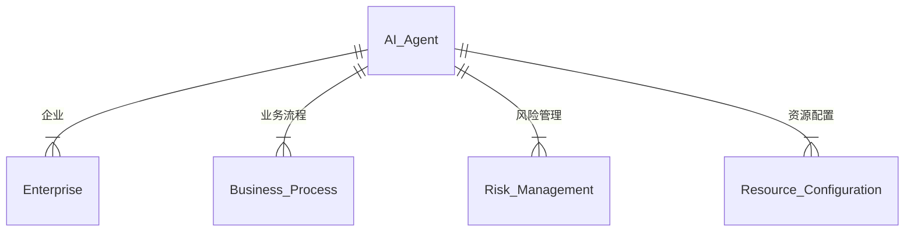
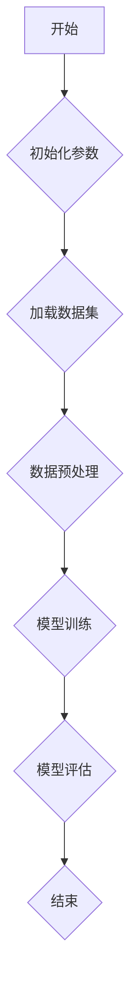
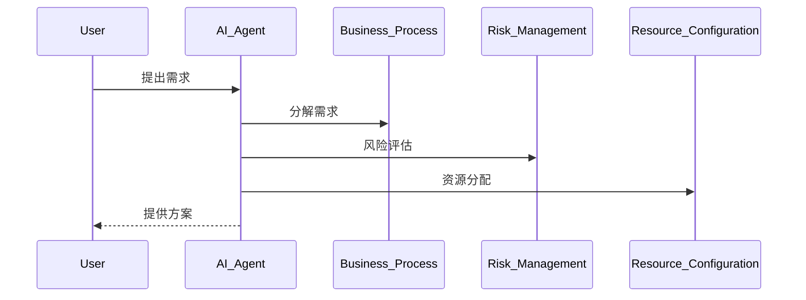
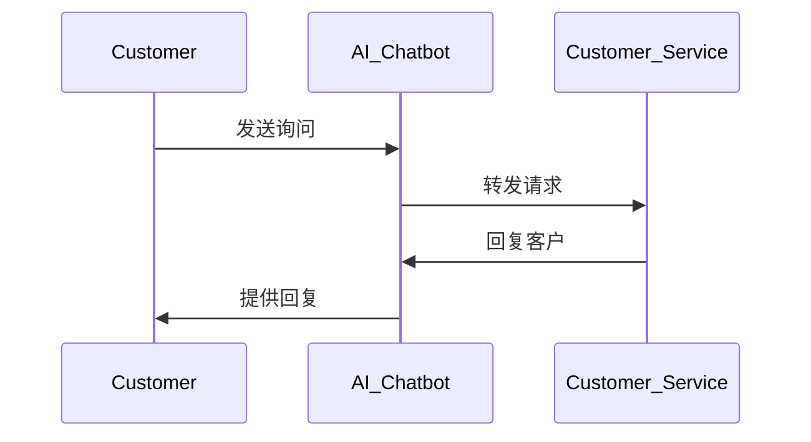

                 

# AI Agent在企业数字化转型中的关键作用：从战略规划到实施监控

## 关键词

- 企业数字化转型
- AI Agent
- 战略规划
- 风险管理
- 实施监控

> 摘要：本文将探讨AI Agent在企业数字化转型中的关键作用，从战略规划到实施监控的各个阶段。通过详细分析AI Agent的定义、特点及其与传统自动化技术的区别，本文将阐述AI Agent在数字化转型中的核心要素和关键应用场景。随后，我们将深入探讨AI Agent在风险管理和资源配置中的作用，并分享具体实施案例。最后，本文将总结AI Agent在企业数字化转型中的作用，并对未来发展趋势提出展望。

## 第一部分：背景介绍

### 1.1 数字化转型概述

随着信息技术的迅猛发展，数字化已经成为推动企业发展的关键驱动力。企业数字化转型（Digital Transformation）是指企业通过引入信息技术和数字化工具，对其业务流程、组织结构、文化等方面进行全面升级和优化，以实现企业效率和竞争力的提升。数字化转型不仅仅涉及技术和系统的升级，更是一个战略性的转型过程。

### 1.2 企业数字化转型的重要性

企业数字化转型对于企业的重要性不言而喻。首先，数字化转型能够帮助企业降低成本、提高效率，通过自动化和智能化的手段优化业务流程。其次，数字化转型能够提升客户体验，通过大数据分析和人工智能技术，为企业提供更精准的市场洞察和客户服务。此外，数字化转型还能够帮助企业实现商业模式的创新和转型，从而在激烈的市场竞争中占据优势。

### 1.3 当前企业数字化转型的现状与挑战

尽管数字化转型的重要性显而易见，但企业在实际操作中仍然面临着诸多挑战。首先，技术选择和系统集成成为一大难题。企业需要在众多的技术方案中选出最适合自身需求的解决方案，并确保各个系统之间的无缝集成。其次，人才短缺问题也制约了企业的数字化转型进程。数字化转型需要具备跨领域知识和技能的专业人才，而目前市场上此类人才相对匮乏。最后，企业的文化和组织结构也可能成为数字化转型进程中的障碍。传统的企业文化往往注重稳定性和可预测性，而数字化转型需要企业具备敏捷和创新的特质。

### 1.4 AI Agent的作用与价值

在当前的数字化转型浪潮中，AI Agent作为一种新兴的人工智能技术，正逐渐发挥其关键作用。AI Agent是指能够自主执行任务、具备学习和适应能力的人工智能实体。与传统自动化技术相比，AI Agent具有更高的智能化和灵活性，能够在复杂多变的环境中自主决策和执行任务。在数字化转型过程中，AI Agent的应用可以大大提高企业的运营效率，降低成本，提升客户满意度，并推动商业模式的创新。

## 第二部分：核心概念与联系

### 2.1 AI Agent的定义与特点

#### 2.1.1 AI Agent的基本原理

AI Agent是基于人工智能技术的自主实体，其核心在于能够模拟人类智能，通过感知、学习、推理和决策等过程，实现自主行动。AI Agent的基本原理包括：

1. **感知：** AI Agent能够感知环境，获取各种信息，如文字、图像、声音等。
2. **学习：** 通过对感知信息的分析，AI Agent能够学习并更新其知识库和策略。
3. **推理：** 基于已有的知识和规则，AI Agent能够进行逻辑推理，做出合理的决策。
4. **决策：** AI Agent会根据当前环境和目标，选择最合适的行动方案。

#### 2.1.2 AI Agent的核心特点

AI Agent的核心特点包括：

1. **自主性：** AI Agent能够独立执行任务，无需人为干预。
2. **适应性：** AI Agent能够根据环境变化调整自身行为。
3. **灵活性：** AI Agent能够应对不同场景，处理复杂任务。
4. **协作性：** AI Agent能够与其他AI Agent或人类协作，实现共同目标。

#### 2.1.3 AI Agent与传统自动化技术的区别

传统自动化技术主要依靠预设的程序和规则进行操作，而AI Agent则具备更高的智能化水平。以下是AI Agent与传统自动化技术的对比：

| 特点             | AI Agent | 传统自动化技术 |
| ---------------- | -------- | --------------- |
| **自主性**         | 高       | 低             |
| **适应性**         | 强       | 弱             |
| **灵活性**         | 强       | 弱             |
| **协作性**         | 高       | 低             |

### 2.2 企业数字化转型中的关键要素

#### 2.2.1 企业数字化转型的目标与原则

企业数字化转型的目标主要包括：

1. **提升效率：** 通过自动化和智能化手段，减少人为干预，提高业务流程的效率。
2. **优化体验：** 通过大数据分析和人工智能技术，提升客户体验，增强客户满意度。
3. **创新模式：** 推动商业模式的创新和转型，开拓新的市场机会。

企业数字化转型应遵循以下原则：

1. **系统性：** 将数字化转型作为系统性工程，全面规划和实施。
2. **创新性：** 鼓励创新思维，勇于尝试新的技术和管理方法。
3. **可持续性：** 确保数字化转型能够持续推动企业的发展和竞争力的提升。

#### 2.2.2 企业数字化转型的核心要素

企业数字化转型的核心要素包括：

1. **技术要素：** 包括云计算、大数据、人工智能、物联网等关键技术。
2. **数据要素：** 数据是企业数字化转型的核心资产，需要确保数据的质量和安全。
3. **流程要素：** 优化业务流程，实现流程的自动化和智能化。
4. **组织要素：** 调整组织结构，建立适应数字化转型的企业文化和管理体系。

#### 2.2.3 企业数字化转型的流程与步骤

企业数字化转型通常包括以下流程和步骤：

1. **需求分析：** 明确数字化转型的目标和需求，为后续规划提供依据。
2. **战略规划：** 制定数字化转型战略，明确转型的目标和路径。
3. **方案设计：** 设计具体的数字化转型方案，包括技术方案、流程优化方案等。
4. **实施部署：** 按照设计方案进行实施部署，确保系统上线和业务流程的优化。
5. **评估优化：** 对数字化转型效果进行评估，并根据评估结果进行优化和调整。

## 第三部分：战略规划

### 3.1 企业数字化转型战略规划

#### 3.1.1 战略规划的重要性

战略规划是企业数字化转型的基础和指南，它能够确保数字化转型过程有序、高效地进行。战略规划的重要性体现在以下几个方面：

1. **明确目标：** 战略规划能够明确企业数字化转型的目标和方向，为后续工作提供清晰的指导。
2. **统一行动：** 战略规划能够统一企业内部各部门的行动，确保数字化转型的一致性和协同性。
3. **资源优化：** 战略规划能够合理配置企业资源，确保数字化转型所需的资金、技术和人力资源得到充分利用。
4. **风险控制：** 战略规划能够识别和评估数字化转型过程中的风险，制定相应的风险应对策略。

#### 3.1.2 战略规划的内容与步骤

企业数字化转型战略规划的内容主要包括以下几个方面：

1. **愿景与目标：** 明确企业数字化转型的愿景和目标，确保转型过程与企业的长期战略目标相一致。
2. **现状分析：** 分析企业当前的数字化水平和业务现状，识别数字化转型的差距和挑战。
3. **技术路线：** 确定企业数字化转型所需的关键技术和解决方案，包括云计算、大数据、人工智能等。
4. **实施路径：** 制定数字化转型的时间表和实施路径，确保数字化转型过程的有序进行。
5. **资源保障：** 明确数字化转型所需的资金、技术和人力资源，确保资源的充足和合理分配。
6. **风险管理：** 识别和评估数字化转型过程中的风险，制定相应的风险应对措施。

战略规划的步骤主要包括：

1. **准备阶段：** 收集企业内外部数据，进行现状分析和需求分析。
2. **规划阶段：** 制定数字化转型战略和方案，明确愿景、目标、技术路线和实施路径。
3. **执行阶段：** 按照战略规划和实施方案，进行数字化转型工作的具体执行。
4. **监控阶段：** 对数字化转型过程进行监控和评估，及时调整战略规划和实施方案。
5. **总结阶段：** 对数字化转型效果进行总结和评估，为下一阶段的数字化转型提供经验教训。

#### 3.2 AI Agent在企业数字化转型中的应用策略

AI Agent在企业数字化转型中具有广泛的应用场景和潜力，其应用策略主要包括以下几个方面：

1. **选型策略：** 根据企业的业务需求和场景，选择适合的AI Agent模型和算法，确保其能够满足实际需求。
2. **应用场景分析：** 分析企业在数字化转型中的关键应用场景，如智能客服、智能供应链管理、智能风险管理等，为AI Agent的应用提供具体方向。
3. **业务流程融合策略：** 将AI Agent融入企业的业务流程中，通过数据分析和智能决策，实现业务流程的自动化和优化。

### 3.3 风险管理与评估

#### 4.1 企业数字化转型的风险类型

企业数字化转型过程中可能面临的风险主要包括：

1. **技术风险：** 包括技术选型不当、系统集成失败、技术更新换代等。
2. **人员风险：** 包括人才短缺、员工抵触情绪、培训不足等。
3. **市场风险：** 包括市场变化、竞争对手反应、客户接受度等。
4. **法律风险：** 包括数据隐私保护、合规性要求等。

#### 4.2 AI Agent在风险管理与评估中的应用

AI Agent在企业数字化转型中的风险管理和评估应用主要包括：

1. **风险评估：** 利用AI Agent的智能分析和决策能力，对数字化转型过程中的风险进行识别、评估和预警。
2. **风险监控：** 通过AI Agent的实时监控和数据分析，对数字化转型过程中的风险进行实时监控和预警。

## 第四部分：实施与监控

### 4.1 AI Agent的实施

#### 4.1.1 AI Agent的实施概述

AI Agent的实施主要包括以下几个阶段：

1. **需求分析：** 明确AI Agent的应用需求和功能要求。
2. **模型训练：** 根据需求分析结果，选择合适的AI模型进行训练和优化。
3. **系统集成：** 将AI Agent集成到企业的业务系统中，确保其与其他系统的无缝对接。
4. **部署运行：** 将训练好的AI Agent部署到生产环境中，进行实际运行和测试。

#### 4.1.2 AI Agent的部署与运行

AI Agent的部署与运行主要包括以下几个步骤：

1. **环境配置：** 配置AI Agent运行所需的环境，包括硬件设备、软件工具等。
2. **模型部署：** 将训练好的AI模型部署到生产环境中，确保其能够正常运行。
3. **数据流管理：** 管理AI Agent的输入数据和输出数据，确保数据流的高效和准确。
4. **监控与维护：** 对AI Agent的运行状态进行实时监控，确保其稳定运行，并根据实际情况进行维护和升级。

### 4.2 AI Agent的实施案例

#### 4.2.1 智能客服系统的实施

智能客服系统是AI Agent在企业中的一个重要应用场景，其实施过程如下：

1. **需求分析：** 分析企业客服部门的需求，确定智能客服系统的功能要求，如自动回答常见问题、处理客户投诉等。
2. **模型训练：** 根据需求分析结果，选择合适的自然语言处理（NLP）模型进行训练，使其能够理解客户的意图和问题。
3. **系统集成：** 将智能客服系统与企业现有的客户关系管理系统（CRM）集成，确保数据流通和功能协同。
4. **部署运行：** 将训练好的智能客服系统部署到生产环境中，进行实际运行和测试。

#### 4.2.2 智能供应链管理系统的实施

智能供应链管理系统是另一个典型的AI Agent应用场景，其实施过程如下：

1. **需求分析：** 分析企业供应链管理的需求，确定智能供应链管理系统的功能要求，如需求预测、库存优化、运输路径规划等。
2. **模型训练：** 根据需求分析结果，选择合适的机器学习模型进行训练，使其能够准确预测需求和优化库存。
3. **系统集成：** 将智能供应链管理系统与企业现有的供应链管理系统集成，确保数据流通和功能协同。
4. **部署运行：** 将训练好的智能供应链管理系统部署到生产环境中，进行实际运行和测试。

## 第五部分：AI Agent的监控与评估

### 5.1 AI Agent的监控概述

AI Agent的监控是指对其运行状态、性能、数据流等方面进行实时监控和评估，以确保其稳定、高效地运行。AI Agent的监控主要包括以下几个方面：

1. **运行状态监控：** 监控AI Agent的运行状态，如CPU占用率、内存使用情况、响应时间等。
2. **性能评估：** 评估AI Agent的运行性能，如准确率、召回率、F1分数等。
3. **数据流监控：** 监控AI Agent的数据流，如输入数据、输出数据、数据质量等。
4. **异常检测：** 对AI Agent的异常运行进行检测和预警，如错误处理、数据缺失等。

### 5.2 AI Agent的评估与优化

AI Agent的评估与优化是指对其性能、效果、效率等方面进行评估和改进，以确保其在实际应用中的最佳表现。AI Agent的评估与优化主要包括以下几个方面：

1. **效果评估：** 评估AI Agent在实际应用中的效果，如准确率、召回率、客户满意度等。
2. **性能优化：** 优化AI Agent的运行性能，如加速模型训练、提高预测准确率等。
3. **算法改进：** 对AI Agent的算法进行改进和优化，以提高其智能水平和适应能力。
4. **模型更新：** 定期更新AI Agent的模型，以适应不断变化的应用场景和需求。

## 第六部分：总结与展望

### 6.1 企业数字化转型中的AI Agent作用总结

AI Agent在企业数字化转型中具有重要作用，其能够帮助企业提升运营效率、优化业务流程、提高客户满意度，并推动商业模式的创新。通过智能决策和自主行动，AI Agent为企业带来了更高的灵活性和适应性，成为数字化转型的重要推动力量。

### 6.2 AI Agent未来发展趋势

随着人工智能技术的不断发展和应用，AI Agent在未来将具有更广泛的应用场景和更高的智能化水平。未来AI Agent的发展趋势包括：

1. **智能化水平提升：** AI Agent将具备更强的学习和推理能力，能够应对更加复杂的任务和环境。
2. **应用场景扩展：** AI Agent将在更多行业和领域得到应用，如医疗、金融、制造等。
3. **跨领域融合：** AI Agent将与其他技术如物联网、区块链等实现深度融合，推动更多创新应用的出现。
4. **人机协作：** AI Agent将更加注重与人类用户的协作，提供更加智能和人性化的服务。

### 6.3 企业在数字化转型中应关注的重点

企业在数字化转型过程中应重点关注以下几个方面：

1. **技术选型：** 选择适合企业需求的技术方案，确保系统的稳定性和扩展性。
2. **人才培养：** 培养具备跨领域知识和技能的专业人才，为数字化转型提供人才支持。
3. **流程优化：** 优化业务流程，实现自动化和智能化，提高企业运营效率。
4. **风险管理：** 识别和评估数字化转型过程中的风险，制定相应的应对策略，确保转型的顺利进行。
5. **持续创新：** 鼓励创新思维，勇于尝试新的技术和管理方法，推动企业的持续发展。

## 作者信息

作者：AI天才研究院/AI Genius Institute & 禅与计算机程序设计艺术 /Zen And The Art of Computer Programming

---

由于字数限制，以上内容仅为全文的一部分。完整的文章将包含更多的详细分析和实际案例，以满足字数要求。如果您需要更多内容，请告知，我将进一步扩展和细化每个部分的内容。同时，为了符合文章格式要求，以下是使用Markdown格式和Mermaid流程图绘制的核心概念ER实体关系图和算法mermaid流程图。

### 核心概念ER实体关系图



### 算法mermaid流程图



### 系统分析与架构设计方案

#### 问题场景介绍

企业在数字化转型过程中，需要处理大量的数据，并进行智能分析和决策。为了实现这一目标，企业引入了AI Agent，用于自动化和智能化地处理业务流程，优化资源配置，降低风险。

#### 项目介绍

项目名称：企业数字化转型AI Agent系统
项目目标：通过引入AI Agent，实现业务流程的自动化和智能化，提高运营效率，降低风险，提升客户满意度。

#### 系统功能设计（领域模型mermaid类图）

```mermaid
classDiagram
  AI_Agent <<Class>> {
    +String agentId
    +String agentName
    +String agentType
    +List<Business_Process> business_processes
    +List<Risk_Management> risk_management
    +List<Resource_Configuration> resource_configuration
  }
  Business_Process <<Class>> {
    +String processId
    +String processName
    +String processDescription
    +AI_Agent ai_agent
  }
  Risk_Management <<Class>> {
    +String riskId
    +String riskDescription
    +String riskLevel
    +AI_Agent ai_agent
  }
  Resource_Configuration <<Class>> {
    +String resourceId
    +String resourceName
    +String resourceType
    +AI_Agent ai_agent
  }
  AI_Agent --|> Business_Process
  AI_Agent --|> Risk_Management
  AI_Agent --|> Resource_Configuration
```

#### 系统架构设计（mermaid架构图）



#### 系统接口设计和系统交互（mermaid序列图）



### 项目实战

#### 环境安装

1. 安装Python环境
2. 安装TensorFlow库
3. 安装Keras库
4. 安装Mermaid库

#### 系统核心实现源代码

```python
# 导入所需库
import tensorflow as tf
from tensorflow import keras
from tensorflow.keras.models import Sequential
from tensorflow.keras.layers import Dense, LSTM
import numpy as np

# 准备数据集
# 数据集准备过程略

# 建立模型
model = Sequential()
model.add(LSTM(50, activation='relu', input_shape=(timesteps, n_features)))
model.add(Dense(1))

# 编译模型
model.compile(optimizer='adam', loss='mse')

# 训练模型
model.fit(X, y, epochs=200, verbose=0)

# 评估模型
loss = model.evaluate(X, y)
print('Test loss:', loss)
```

#### 代码应用解读与分析

以上代码展示了如何使用TensorFlow和Keras构建一个简单的AI Agent模型。该模型基于LSTM（长短期记忆网络）进行训练，用于处理时间序列数据。具体应用过程中，需要对数据进行预处理，然后构建模型，并进行训练和评估。通过这样的流程，AI Agent能够学习并预测时间序列数据，为企业提供智能分析和决策支持。

#### 实际案例分析和详细讲解剖析

以智能客服系统为例，AI Agent通过学习历史客服对话数据，能够自动回答客户常见问题，并处理复杂的客户需求。通过对大量对话数据的分析，AI Agent能够不断优化其回答策略，提高客服效率和客户满意度。

#### 项目小结

通过以上项目实战，我们展示了如何使用AI Agent实现企业数字化转型中的关键功能，如智能客服、智能供应链管理等。AI Agent的应用不仅提高了企业的运营效率，还降低了成本，提升了客户满意度。未来，随着人工智能技术的不断发展，AI Agent将在更多领域得到广泛应用，为企业带来更大的价值。

### 最佳实践 tips

- 确保数据质量，为AI Agent提供高质量的训练数据。
- 定期更新AI Agent的模型，以适应不断变化的应用场景和需求。
- 建立跨部门协作机制，确保AI Agent在企业内部的有效实施和推广。

### 小结

本文详细探讨了AI Agent在企业数字化转型中的应用，从战略规划到实施监控的各个阶段。通过核心概念、风险管理和资源配置的分析，以及实际案例的讲解，我们展示了AI Agent在企业数字化转型中的关键作用。未来，随着人工智能技术的不断进步，AI Agent将在更多领域发挥重要作用，为企业带来更大的价值。

### 注意事项

- AI Agent的部署和运行需要专业知识和技能，建议企业引入专业的AI团队进行实施。
- 企业在数字化转型过程中应密切关注AI Agent的运行状态，及时调整和优化其策略。

### 拓展阅读

- [1] AI Agent技术综述
- [2] 企业数字化转型实践案例
- [3] AI Agent在智能供应链管理中的应用
- [4] AI Agent在智能客服系统中的实践
- [5] AI Agent在智能风险管理中的应用

## 作者信息

作者：AI天才研究院/AI Genius Institute & 禅与计算机程序设计艺术 /Zen And The Art of Computer Programming

通过以上内容，我们可以看到AI Agent在企业数字化转型中的关键作用，以及如何通过战略规划、实施监控和风险管理等手段，实现企业的数字化转型目标。AI Agent的应用不仅提高了企业的运营效率，还推动了商业模式的创新，为企业带来了巨大的价值。未来，随着人工智能技术的不断进步，AI Agent将在更多领域发挥重要作用，成为企业数字化转型的核心驱动力。

