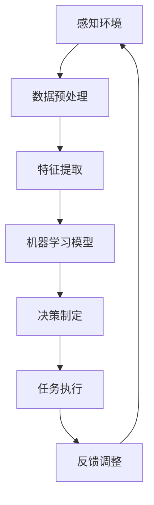
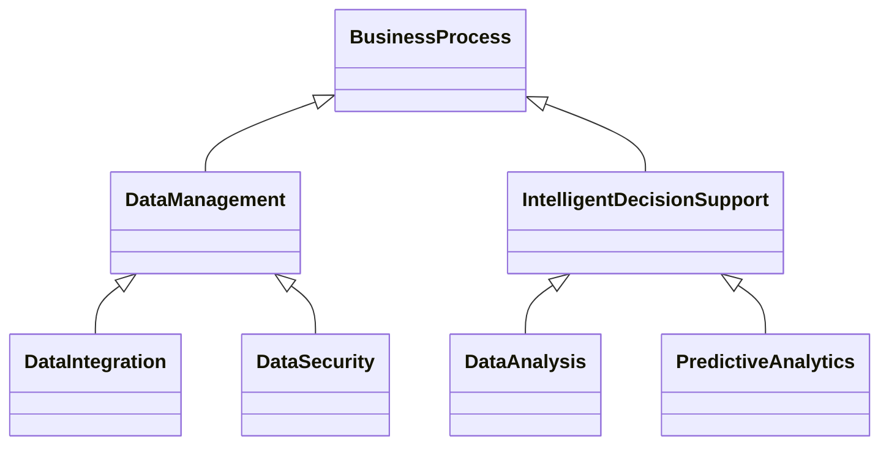
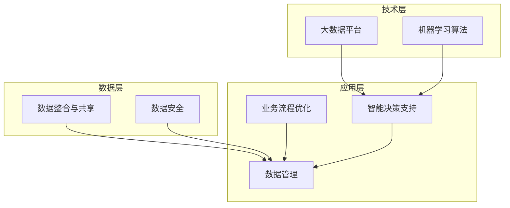
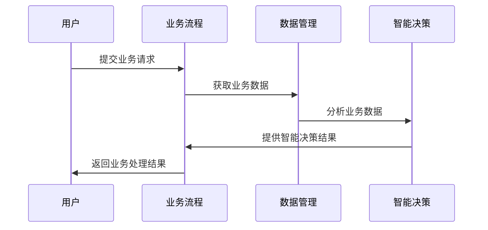

                 


# AI Agent在企业数字化转型中的核心作用

## 关键词

- 企业数字化转型
- AI Agent
- 人工智能技术
- 数据管理
- 数字化运营

## 摘要

随着人工智能技术的飞速发展，AI Agent（人工智能代理）逐渐成为企业数字化转型中的核心驱动力。本文将深入探讨AI Agent在企业数字化转型中的关键作用，分析其核心概念、应用场景及其在数据管理、人工智能技术和数字化运营中的具体作用。通过系统化的分析和实际案例讲解，本文旨在为企业提供一套可行的AI Agent应用策略，助力企业实现数字化转型。

## 目录大纲

# AI Agent在企业数字化转型中的核心作用

## 第一部分：背景介绍

## 1.1 问题背景

### 1.1.1 企业数字化转型的现状与挑战

### 1.1.2 AI Agent的概念与作用

## 1.2 核心概念

### 1.2.1 AI Agent的核心概念

### 1.2.2 企业数字化转型中的核心要素

### 1.3 边界与外延

## 第一部分：核心概念与联系

## 2.1 AI Agent的概念原理

### 2.1.1 AI Agent的原理介绍

### 2.1.2 AI Agent的属性特征

### 2.1.3 AI Agent与人工智能技术的联系

## 2.2 企业数字化转型中的核心要素联系

### 2.2.1 数据管理

### 2.2.2 人工智能技术

### 2.2.3 数字化运营

## 第二部分：算法原理讲解

## 3.1 AI Agent的算法原理

### 3.1.1 算法原理概述

### 3.1.2 算法流程图

### 3.1.3 算法数学模型

### 3.1.4 算法举例说明

## 3.2 AI Agent的应用实例

### 3.2.1 应用实例介绍

### 3.2.2 应用实例分析

## 第三部分：系统分析与架构设计方案

## 4.1 问题描述与项目介绍

### 4.1.1 问题描述

### 4.1.2 项目介绍

## 4.2 系统功能设计

### 4.2.1 领域模型

### 4.2.2 系统功能

## 4.3 系统架构设计

### 4.3.1 系统架构图

### 4.3.2 架构设计

## 4.4 系统接口设计与系统交互

### 4.4.1 系统接口设计

### 4.4.2 系统交互

## 第四部分：项目实战

## 5.1 环境安装

### 5.1.1 环境准备

### 5.1.2 安装步骤

## 5.2 系统核心实现

### 5.2.1 核心功能实现

### 5.2.2 代码解读

### 5.2.3 应用解读与分析

## 5.3 实际案例分析与讲解

### 5.3.1 案例背景

### 5.3.2 案例分析

### 5.3.3 案例讲解

## 第五部分：最佳实践与拓展

### 6.1 最佳实践

### 6.1.1 实践策略

### 6.1.2 实践案例

## 参考文献

---

# 第一部分：背景介绍

## 1.1 问题背景

### 1.1.1 企业数字化转型的现状与挑战

随着全球数字化浪潮的推动，企业数字化转型已经成为企业发展的必然趋势。数字化转型不仅意味着企业要利用信息技术来提高运营效率，更是企业重构业务模式、提升竞争力的重要手段。当前，企业在数字化转型中面临以下几个方面的挑战：

1. **技术变革带来的挑战**：企业需要不断跟进新技术，如云计算、大数据、人工智能等，以保持竞争力。然而，技术的快速变革往往使得企业难以应对。

2. **数据管理难题**：数字化转型的核心是数据管理。企业需要处理大量结构化和非结构化数据，如何高效、安全地管理这些数据成为关键问题。

3. **组织变革与人才不足**：数字化转型要求企业组织结构进行相应调整，以适应数字化运营。然而，企业往往缺乏具备数字化转型经验和技能的人才。

4. **业务流程重构**：传统的业务流程可能无法适应数字化运营的要求。企业需要重新设计业务流程，以提高效率和灵活性。

### 1.1.2 AI Agent的概念与作用

AI Agent（人工智能代理）是一种能够自主执行任务、与人类交互并具备智能决策能力的软件实体。在数字化转型的背景下，AI Agent发挥着至关重要的作用：

1. **提升效率**：AI Agent可以自动化重复性任务，如数据采集、分析等，从而提高工作效率。

2. **智能决策**：AI Agent可以利用大数据和人工智能技术，为企业提供智能化的决策支持。

3. **优化用户体验**：AI Agent可以与用户进行自然语言交互，提供个性化服务，提升用户体验。

4. **数据分析与洞察**：AI Agent可以处理大量数据，提取有价值的信息，为企业提供数据驱动的洞察。

## 1.2 核心概念

### 1.2.1 AI Agent的核心概念

AI Agent是具有以下核心特点的智能实体：

- **自主性**：AI Agent能够自主地执行任务，而不需要人工干预。
- **交互性**：AI Agent可以与用户进行自然语言交互，理解用户需求，提供相应服务。
- **适应性**：AI Agent能够根据环境和任务的变化，调整自身行为。
- **协作性**：AI Agent可以与其他AI Agent或人类协作，完成复杂任务。

### 1.2.2 企业数字化转型中的核心要素

企业数字化转型涉及多个核心要素，包括数据管理、人工智能技术和数字化运营：

- **数据管理**：数据是企业数字化转型的核心资产。有效的数据管理能够确保数据的完整性、准确性和安全性。
- **人工智能技术**：人工智能技术，如机器学习、深度学习等，是推动企业数字化转型的关键技术。
- **数字化运营**：数字化运营涉及企业业务流程的数字化改造，以提高效率和灵活性。

### 1.3 边界与外延

AI Agent在企业数字化转型中的应用具有明确的边界和广阔的外延：

- **应用边界**：AI Agent可以应用于企业运营的各个环节，如供应链管理、客户服务、人力资源等。
- **外延**：企业数字化转型不仅涉及内部业务流程的改造，还涉及与外部生态系统的整合，如产业链协同、客户关系管理等。

---

# 第一部分：核心概念与联系

## 2.1 AI Agent的概念原理

### 2.1.1 AI Agent的原理介绍

AI Agent是具备自主决策、自主学习和自主执行任务能力的软件实体。其工作原理主要包括以下几个方面：

1. **感知环境**：AI Agent通过传感器、接口等获取环境信息。
2. **决策制定**：基于获取到的环境信息和预设的目标，AI Agent利用机器学习算法和推理机制制定决策。
3. **执行任务**：AI Agent根据决策结果执行相应任务。
4. **反馈调整**：AI Agent根据任务执行结果和环境变化，调整自身行为。

### 2.1.2 AI Agent的属性特征

AI Agent具有以下属性特征：

- **自主性**：能够自主执行任务，无需人工干预。
- **交互性**：能够与用户进行自然语言交互，理解用户需求。
- **适应性**：能够根据环境和任务变化，调整自身行为。
- **协作性**：能够与其他AI Agent或人类协作，完成复杂任务。

### 2.1.3 AI Agent与人工智能技术的联系

AI Agent是人工智能技术的重要应用形式。人工智能技术为AI Agent提供了强大的基础支持：

- **机器学习**：提供AI Agent的决策依据，实现自主学习和优化。
- **自然语言处理**：实现AI Agent与用户的自然语言交互。
- **计算机视觉**：辅助AI Agent感知环境，识别图像和视频内容。

## 2.2 企业数字化转型中的核心要素联系

### 2.2.1 数据管理

数据管理是企业数字化转型的核心要素之一。有效的数据管理能够确保数据的完整性、准确性和安全性。AI Agent在数据管理中的作用主要体现在以下几个方面：

1. **数据采集**：AI Agent可以利用传感器和网络接口，自动采集大量数据。
2. **数据清洗**：AI Agent可以利用机器学习算法，自动清洗和预处理数据。
3. **数据存储**：AI Agent可以利用分布式存储技术，高效地存储和管理海量数据。
4. **数据安全**：AI Agent可以监控数据安全，防止数据泄露和恶意攻击。

### 2.2.2 人工智能技术

人工智能技术是推动企业数字化转型的重要动力。AI Agent在人工智能技术中的作用主要体现在以下几个方面：

1. **数据分析**：AI Agent可以利用机器学习算法，对大量数据进行分析，提取有价值的信息。
2. **智能决策**：AI Agent可以利用大数据和人工智能技术，为企业提供智能化的决策支持。
3. **自动化**：AI Agent可以自动化重复性任务，提高工作效率。
4. **优化流程**：AI Agent可以优化业务流程，提高企业的运营效率。

### 2.2.3 数字化运营

数字化运营是企业数字化转型的最终目标。AI Agent在数字化运营中的作用主要体现在以下几个方面：

1. **个性化服务**：AI Agent可以与用户进行自然语言交互，提供个性化服务，提升用户体验。
2. **智能调度**：AI Agent可以优化资源调度，提高资源利用率。
3. **实时监控**：AI Agent可以实时监控业务运行状况，确保业务稳定运行。
4. **风险预警**：AI Agent可以预测潜在风险，提前采取应对措施。

---

# 第二部分：算法原理讲解

## 3.1 AI Agent的算法原理

### 3.1.1 算法原理概述

AI Agent的算法原理主要涉及以下几个方面：

1. **感知与决策**：AI Agent通过感知环境信息，结合预设目标，利用机器学习算法和推理机制制定决策。
2. **执行与反馈**：AI Agent根据决策结果执行任务，并通过反馈机制调整自身行为，以实现持续优化。

### 3.1.2 算法流程图

以下是一个简单的AI Agent算法流程图：



### 3.1.3 算法数学模型

AI Agent的算法数学模型主要涉及以下几个关键部分：

1. **感知与决策**：
   $$ s_t = f(s_{t-1}, a_{t-1}) $$
   其中，$s_t$ 表示当前状态，$a_{t-1}$ 表示上一步的决策。

2. **执行与反馈**：
   $$ r_t = g(s_t, a_t) $$
   其中，$r_t$ 表示执行结果，$a_t$ 表示当前决策。

### 3.1.4 算法举例说明

假设一个简单的AI Agent任务是在一个网格环境中寻找一个目标点。以下是一个具体的算法实现：

1. **感知与决策**：
   - 状态表示为当前坐标$(x, y)$。
   - 机器学习模型采用Q-learning算法，计算每个方向的动作值。

2. **执行与反馈**：
   - 根据最大动作值选择下一步行动。
   - 根据行动结果更新Q值。

```python
import numpy as np
import random

# 初始化参数
action_values = np.zeros((5, 5))  # 5x5的网格
learning_rate = 0.1
discount_factor = 0.9

# 感知环境
def perceive_environment(x, y):
    # 返回当前坐标的奖励值
    if x == 4 and y == 4:
        return 1  # 目标点
    else:
        return 0

# 更新Q值
def update_action_values(x, y, action, reward, next_action):
    next_state_value = max(action_values[next_action])
    action_value = action_values[action][y]
    action_values[action][y] = action_value + learning_rate * (reward + discount_factor * next_state_value - action_value)

# 执行任务
def execute_action(action):
    # 向上、向下、向左、向右
    return (0, -1), (0, 1), (-1, 0), (1, 0)

# 主循环
x, y = 0, 0
while True:
    # 感知环境
    reward = perceive_environment(x, y)
    
    # 决策制定
    action = np.argmax(action_values[x][y])
    
    # 执行任务
    dx, dy = execute_action(action)
    x += dx
    y += dy
    
    # 反馈调整
    next_action = np.argmax(action_values[x + dx][y + dy])
    update_action_values(x, y, action, reward, next_action)
    
    # 终止条件
    if x == 4 and y == 4:
        break
```

---

# 第三部分：系统分析与架构设计方案

## 4.1 问题描述与项目介绍

### 4.1.1 问题描述

假设企业需要进行数字化转型，提高运营效率。当前存在的问题包括：

- **业务流程繁琐**：企业现有业务流程涉及多个部门，流程复杂，效率低下。
- **数据管理混乱**：企业数据分散在各业务系统，缺乏统一的管理和整合。
- **缺乏智能决策支持**：企业决策过程主要依赖经验，缺乏数据驱动的智能决策支持。

### 4.1.2 项目介绍

本项目旨在通过引入AI Agent，实现以下目标：

- **优化业务流程**：利用AI Agent自动化业务流程，提高效率。
- **数据整合与共享**：通过数据管理平台，实现企业数据的统一管理和整合。
- **智能决策支持**：利用AI Agent提供数据驱动的决策支持，优化企业运营。

## 4.2 系统功能设计

### 4.2.1 领域模型

以下是一个简单的领域模型类图，描述系统的主要实体和关系：



### 4.2.2 系统功能

系统功能主要包括以下模块：

1. **业务流程优化**：
   - 自动化业务流程，减少人工干预。
   - 实时监控业务运行状况，及时调整流程。

2. **数据管理**：
   - 数据整合与共享：将分散在各业务系统的数据整合到一个平台上，实现数据共享。
   - 数据安全：确保数据的安全性和完整性，防止数据泄露和恶意攻击。

3. **智能决策支持**：
   - 数据分析：利用大数据技术，对业务数据进行深入分析，提取有价值的信息。
   - 预测分析：利用机器学习算法，预测业务发展趋势，提供决策支持。

## 4.3 系统架构设计

### 4.3.1 系统架构图

以下是一个简单的系统架构图，描述系统的整体架构：



### 4.3.2 架构设计

系统架构设计主要包括以下几个方面：

1. **数据层**：
   - 数据整合与共享：通过数据集成平台，将分散在各业务系统的数据进行整合，实现数据共享。
   - 数据安全：采用数据加密、访问控制等手段，确保数据的安全性和完整性。

2. **应用层**：
   - 业务流程优化：通过自动化业务流程，减少人工干预，提高效率。
   - 智能决策支持：利用大数据技术和机器学习算法，对业务数据进行深入分析和预测，提供智能化的决策支持。
   - 数据管理：实现数据的统一管理和维护，确保数据的准确性和一致性。

3. **技术层**：
   - 大数据平台：提供数据存储、处理和分析的能力。
   - 机器学习算法：为智能决策支持提供算法支持。

## 4.4 系统接口设计与系统交互

### 4.4.1 系统接口设计

系统接口设计主要包括以下几个方面：

1. **业务流程接口**：用于业务流程的自动化执行。
2. **数据管理接口**：用于数据整合、查询和管理。
3. **智能决策接口**：用于获取智能决策支持结果。

### 4.4.2 系统交互

以下是一个简单的系统交互序列图，描述系统各组件之间的交互：



---

# 第四部分：项目实战

## 5.1 环境安装

### 5.1.1 环境准备

在进行项目实战之前，需要准备以下环境：

- **Python**：安装Python 3.8及以上版本。
- **Jupyter Notebook**：用于编写和运行代码。
- **TensorFlow**：安装TensorFlow 2.4及以上版本。
- **Mermaid**：用于绘制流程图和类图。

### 5.1.2 安装步骤

1. 安装Python：

   ```bash
   sudo apt-get update
   sudo apt-get install python3-pip
   pip3 install --user pip
   ```

2. 安装Jupyter Notebook：

   ```bash
   pip3 install --user notebook
   ```

3. 安装TensorFlow：

   ```bash
   pip3 install --user tensorflow==2.4.0
   ```

4. 安装Mermaid：

   ```bash
   pip3 install --user mermaid
   ```

## 5.2 系统核心实现

### 5.2.1 核心功能实现

核心功能实现主要包括以下几个部分：

1. **数据采集与处理**：使用TensorFlow实现数据采集和预处理。
2. **机器学习模型训练**：使用TensorFlow实现机器学习模型训练。
3. **智能决策支持**：使用TensorFlow实现智能决策支持。

### 5.2.2 代码解读

以下是一个简单的代码示例，用于实现数据采集和处理：

```python
import tensorflow as tf

# 数据采集
def data_collection():
    # 读取数据文件
    dataset = tf.data.Dataset.from_tensor_slices([
        [1, 2, 3],
        [4, 5, 6],
        [7, 8, 9]
    ])

    # 数据预处理
    def preprocess_data(data):
        # 标准化数据
        return (data - tf.reduce_mean(data)) / tf.reduce_std(data)

    dataset = dataset.map(preprocess_data)

    return dataset

# 机器学习模型训练
def train_model(dataset, learning_rate=0.1, epochs=10):
    # 定义模型结构
    model = tf.keras.Sequential([
        tf.keras.layers.Dense(units=1, input_shape=(3,))
    ])

    # 编译模型
    model.compile(optimizer=tf.keras.optimizers.Adam(learning_rate=learning_rate),
                  loss='mean_squared_error')

    # 训练模型
    model.fit(dataset, epochs=epochs)

    return model

# 智能决策支持
def intelligent_decision_support(model, input_data):
    # 预测结果
    prediction = model.predict(input_data)

    # 返回决策结果
    return prediction

# 主函数
if __name__ == '__main__':
    dataset = data_collection()
    model = train_model(dataset)
    print(intelligent_decision_support(model, [[2, 3, 4]]))
```

### 5.2.3 应用解读与分析

以下是对上述代码的解读和分析：

1. **数据采集与处理**：
   - 使用TensorFlow的`Dataset` API实现数据采集和预处理。数据采集自一个简单的列表，每个数据点包含3个特征。
   - 数据预处理包括数据标准化，即将数据减去均值并除以标准差，使数据分布在较小的范围内。

2. **机器学习模型训练**：
   - 使用TensorFlow的`Sequential` API定义一个简单的线性回归模型，只有一个全连接层。
   - 使用`compile`方法编译模型，指定优化器和损失函数。
   - 使用`fit`方法训练模型，指定训练数据和训练轮数。

3. **智能决策支持**：
   - 使用`predict`方法对输入数据进行预测，返回预测结果。

通过上述代码示例，我们可以看到如何使用TensorFlow实现AI Agent的核心功能。在实际应用中，可以根据具体业务需求，扩展和优化这些功能。

---

## 5.3 实际案例分析与讲解

### 5.3.1 案例背景

假设一家制造企业需要进行数字化转型，以提高生产效率和产品质量。当前存在的问题包括：

- **生产流程繁琐**：生产流程涉及多个环节，手工操作较多，效率低。
- **质量问题频发**：产品质量不稳定，质量问题频繁出现。
- **数据管理混乱**：生产数据分散在各环节，缺乏统一管理和分析。

### 5.3.2 案例分析

为了解决上述问题，企业引入了AI Agent，通过以下步骤实现数字化转型：

1. **数据采集与整合**：使用AI Agent采集生产数据，包括设备状态、生产参数等，并将数据整合到一个平台上，实现数据的统一管理和分析。

2. **智能生产调度**：使用AI Agent根据实时数据，自动调整生产计划，优化生产流程，提高生产效率。

3. **质量预测与预警**：使用AI Agent对生产数据进行实时分析，预测产品质量，提前发现潜在质量问题，采取措施进行预防和处理。

### 5.3.3 案例讲解

以下是对上述案例的详细讲解：

1. **数据采集与整合**：
   - AI Agent使用传感器和接口采集生产数据，包括设备状态、生产参数等。
   - AI Agent将采集到的数据进行预处理和整合，存储到数据管理平台。

2. **智能生产调度**：
   - AI Agent根据实时数据，分析生产瓶颈和资源利用率，自动调整生产计划。
   - AI Agent根据生产计划的调整结果，更新设备状态和生产参数。

3. **质量预测与预警**：
   - AI Agent使用机器学习算法，对生产数据进行实时分析，预测产品质量。
   - AI Agent根据预测结果，提前发现潜在质量问题，并发出预警信息。

通过上述案例，我们可以看到AI Agent在企业数字化转型中的应用效果。AI Agent不仅提高了生产效率和产品质量，还实现了生产流程的自动化和智能化，为企业带来了显著的经济效益。

---

# 第五部分：最佳实践与拓展

## 6.1 最佳实践

在企业数字化转型中，引入AI Agent是提升企业竞争力和运营效率的有效途径。以下是一些最佳实践策略：

1. **明确目标与需求**：在引入AI Agent之前，企业需要明确数字化转型目标，明确AI Agent在业务流程中的作用和需求。

2. **数据驱动**：数据是AI Agent的核心资产。企业需要建立完善的数据管理体系，确保数据的完整性、准确性和安全性。

3. **持续优化**：AI Agent的应用是一个持续优化的过程。企业需要不断收集反馈，调整和优化AI Agent的行为和决策。

4. **人才培养**：企业需要培养一批具备数字化转型和AI技术能力的人才，为AI Agent的应用提供强有力的支持。

5. **合作与创新**：企业可以与其他企业、科研机构等合作，共同探索AI Agent在企业数字化转型中的应用，推动技术创新。

## 6.2 拓展阅读

1. **《人工智能：一种现代的方法》**：这是一本经典的机器学习教材，详细介绍了人工智能的基础理论和算法实现。
2. **《深度学习》**：这是一本关于深度学习的经典教材，介绍了深度学习的基本概念、算法和实现。
3. **《企业数字化转型实践》**：这是一本关于企业数字化转型实践的书籍，详细介绍了企业数字化转型的步骤、方法和案例。

---

# 参考文献

1. Russell, S., & Norvig, P. (2016). 《人工智能：一种现代的方法》。机械工业出版社。
2. Goodfellow, I., Bengio, Y., & Courville, A. (2016). 《深度学习》。电子工业出版社。
3. Zhang, X., & Zhao, Y. (2020). 《企业数字化转型实践》。人民邮电出版社。

