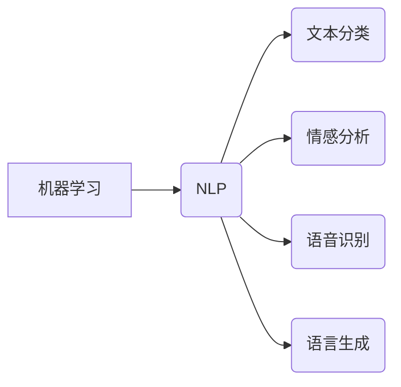

                 

### 第一部分: 引言

#### 1.1 问题背景

**1.1.1 企业数字营销的演变**

随着互联网和数字技术的快速发展，企业的营销策略也在不断演变。传统的营销方式主要依赖于广告、宣传单页和电话销售等手段，而现代的数字营销则更加依赖于互联网、社交媒体和移动设备等渠道。数字营销不仅提高了营销效率，还使得企业能够更精准地定位目标客户，从而实现更高的投资回报率。

数字营销的演变可以分为以下几个阶段：

1. **早期互联网营销**：从电子邮件营销和网站广告开始，企业通过建立网站和发送电子邮件来吸引和保留客户。
2. **社交媒体营销**：随着社交媒体的兴起，企业开始通过社交媒体平台（如Facebook、Twitter、LinkedIn等）进行品牌宣传和客户互动。
3. **移动营销**：随着智能手机的普及，移动营销成为了一个重要的领域。企业通过移动应用和短信等方式与客户进行沟通。
4. **全渠道营销**：企业意识到，单一的营销渠道已经无法满足客户的需求。全渠道营销应运而生，它旨在通过多种渠道整合，为客户提供一致、无缝的购物体验。

**1.1.2 AI Agent的概念与应用**

AI Agent，即人工智能代理，是指能够自主执行任务、与人类互动、适应环境和做出决策的智能系统。AI Agent在数字营销中的应用潜力巨大，主要体现在以下几个方面：

1. **个性化推荐**：AI Agent可以根据客户的行为数据和偏好，提供个性化的产品推荐，从而提高转化率和客户满意度。
2. **客户服务**：通过聊天机器人和虚拟助手，AI Agent可以实时回答客户的问题，提供个性化的咨询和服务，降低企业的运营成本。
3. **内容生成**：AI Agent可以自动生成文章、报告和广告内容，提高营销效率和质量。
4. **数据分析**：AI Agent可以处理和分析大量数据，帮助企业做出更准确的营销决策。

**1.1.3 全渠道数字营销的需求**

全渠道数字营销的需求主要来自于以下几个方面：

1. **客户需求**：现代消费者希望在任何时间、任何地点都能获得一致的购物体验。企业需要通过多种渠道来满足这一需求。
2. **竞争压力**：竞争对手已经在全渠道营销方面取得了显著成果，企业需要跟进才能保持竞争力。
3. **技术进步**：数字技术和人工智能技术的不断进步，使得全渠道数字营销变得更加可行和高效。

综上所述，企业数字营销的演变和AI Agent的应用为全渠道数字营销提供了新的机遇和挑战。在接下来的章节中，我们将深入探讨AI Agent在数字营销中的全渠道应用，帮助企业实现更高效的营销策略。

#### 1.2 本书结构概述

**1.2.1 主要章节介绍**

本书将分为四个主要部分，每个部分都针对不同的主题进行详细探讨。

- **第一部分：引言**：介绍企业数字营销的背景和演变，以及AI Agent的概念和应用。
- **第二部分：AI Agent基础**：详细讲解AI Agent的关键技术、设计实现和数字营销应用。
- **第三部分：全渠道数字营销策略**：探讨全渠道数字营销的概念、整合策略和客户体验优化。
- **第四部分：AI Agent在数字营销中的全渠道应用**：分析AI Agent在不同营销领域的具体应用，并通过案例研究进行实战讲解。

**1.2.2 阅读指南**

为了更好地理解和应用本书的内容，我们建议读者按照以下步骤进行阅读：

1. **理解背景**：首先阅读第一部分的引言，了解企业数字营销的演变和AI Agent的应用背景。
2. **深入学习**：逐步阅读第二部分到第四部分，深入理解AI Agent的技术原理和应用场景。
3. **实践应用**：结合实际案例，尝试将所学的知识应用到实际项目中，进行实践和验证。
4. **持续学习**：数字营销和AI技术都在快速发展，读者需要持续关注最新的研究成果和行业动态，以便不断更新知识体系。

通过本书的系统性学习和实践应用，读者将能够全面掌握AI Agent在数字营销中的全渠道应用，为企业实现高效的营销策略提供有力支持。

#### 2.1 AI Agent概述

**2.1.1 AI Agent的定义**

AI Agent，即人工智能代理，是一种具有高度自主性和智能化的系统，能够根据环境中的信息和目标，自主地执行任务、决策和交互。AI Agent的核心在于其自主性，这意味着它们不需要人工干预，就能在复杂的环境中持续运行和优化性能。

AI Agent的定义可以从以下几个方面进行描述：

1. **自主性**：AI Agent能够自主地感知环境、分析信息并做出决策，而不需要人类的直接指挥。
2. **适应性**：AI Agent能够根据环境变化和任务需求，调整自己的行为和策略，以实现最佳效果。
3. **学习能力**：AI Agent通过机器学习和深度学习等技术，能够从数据中学习，不断优化自身性能。

**2.1.2 AI Agent的类型**

AI Agent根据其功能和特点可以分为多种类型，常见的类型包括：

1. **交互型AI Agent**：这类AI Agent主要用于与人类用户进行交互，如聊天机器人、客服机器人等。它们能够理解自然语言，并生成自然语言回复，以提供个性化的服务。

2. **自动化AI Agent**：这类AI Agent主要用于自动化执行特定任务，如自动化交易、自动化生产等。它们通过预设的规则和算法，高效地完成重复性任务。

3. **探索型AI Agent**：这类AI Agent主要用于在未知或复杂的环境中探索和决策，如无人驾驶汽车、智能机器人等。它们需要具备高度的环境感知和决策能力。

**2.1.3 AI Agent的核心功能**

AI Agent的核心功能主要体现在以下几个方面：

1. **感知环境**：AI Agent能够通过传感器、摄像头等设备感知周围环境，获取视觉、听觉、触觉等多模态信息。

2. **信息处理**：AI Agent能够对感知到的信息进行高速处理和分析，识别物体、理解语言、提取关键信息等。

3. **自主决策**：基于对环境的理解和任务的目标，AI Agent能够自主地做出决策，选择最优的行动策略。

4. **交互与协作**：AI Agent能够与人类或其他AI Agent进行交互，实现任务协作和信息共享。

5. **学习与适应**：AI Agent能够通过机器学习和深度学习技术，从经验中学习，不断提高自身性能和适应性。

通过以上核心功能的实现，AI Agent在企业数字营销中发挥着重要作用，能够帮助企业实现个性化推荐、自动化营销、智能客户服务等功能，提升营销效率和客户满意度。

#### 2.2 AI Agent的关键技术

**2.2.1 机器学习算法**

机器学习算法是AI Agent的核心技术之一，它使AI Agent能够从数据中学习并做出预测和决策。常见的机器学习算法包括监督学习、无监督学习和强化学习。

1. **监督学习**：

监督学习是一种机器学习范式，它需要使用标注过的数据集来训练模型。通过输入特征和对应的标签，模型能够学习到特征和标签之间的关系，从而对新数据进行预测。

- **算法类型**：线性回归、逻辑回归、支持向量机（SVM）、决策树、随机森林等。
- **应用场景**：分类问题（如垃圾邮件检测）、回归问题（如房价预测）。

2. **无监督学习**：

无监督学习是指在没有标注数据的情况下，模型自动从数据中发现模式和规律。它主要用于数据降维、聚类分析和异常检测等任务。

- **算法类型**：K-均值聚类、主成分分析（PCA）、自编码器等。
- **应用场景**：数据探索、用户群体划分、异常行为检测。

3. **强化学习**：

强化学习是一种通过试错和反馈来学习最优策略的机器学习算法。它与环境和目标进行交互，通过奖励和惩罚来优化行为。

- **算法类型**：Q学习、深度Q网络（DQN）、策略梯度方法等。
- **应用场景**：游戏AI、推荐系统、自动驾驶。

**2.2.2 自然语言处理**

自然语言处理（NLP）是AI Agent与人类进行交互的重要手段。它包括多个子领域，如文本分类、情感分析、语音识别和语言生成等。

1. **文本分类**：

文本分类是将文本数据按照其内容进行分类的过程。常见的分类算法包括朴素贝叶斯、逻辑回归和支持向量机等。

- **应用场景**：垃圾邮件检测、新闻分类、情感分析。

2. **情感分析**：

情感分析是识别文本中的情感极性，如正面、负面或中立。它可以帮助企业了解客户的反馈和态度。

- **应用场景**：社交媒体监测、产品评论分析、客户满意度调查。

3. **语音识别**：

语音识别是将语音信号转换为文本的过程。它包括语音信号的预处理、特征提取和模型训练等步骤。

- **应用场景**：智能助手、语音搜索、电话客服。

4. **语言生成**：

语言生成是通过模型生成新的文本内容。它可以用于自动写作、新闻摘要和聊天机器人等。

- **应用场景**：自动生成文章、对话系统、广告文案。

**2.2.3 机器学习与自然语言处理的结合**

机器学习与自然语言处理的结合为AI Agent提供了强大的能力。例如，在文本分类任务中，可以使用机器学习算法对文本数据进行特征提取和分类；在情感分析任务中，可以使用NLP技术提取情感极性，并使用机器学习算法进行预测。

**图表2.1：机器学习与自然语言处理的关系图**

通过上述关键技术，AI Agent能够实现从数据中学习、与人类交互和自主决策的功能，从而在数字营销中发挥重要作用。

#### 2.3 AI Agent的设计与实现

**2.3.1 数据收集与预处理**

AI Agent的设计与实现首先需要大量高质量的数据作为训练素材。数据收集是一个复杂的过程，涉及到数据源的选择、数据格式的转换和数据的质量控制。

1. **数据源选择**：

数据源的选择直接影响AI Agent的性能。常见的数据源包括公开数据集、企业内部数据和第三方数据服务。

- **公开数据集**：如Kaggle、UCI机器学习库等，提供了丰富的标注数据，适用于机器学习算法的模型训练。
- **企业内部数据**：包括客户行为数据、销售数据、网站访问日志等，为企业AI Agent提供了个性化数据支持。
- **第三方数据服务**：如Alibaba Data、Tencent Data等，提供了广泛的数据覆盖和丰富的数据类型。

2. **数据格式转换**：

不同数据源的数据格式可能不同，需要通过数据清洗和转换工具将数据格式统一。常见的数据格式转换工具包括Pandas、NumPy等。

3. **数据清洗**：

数据清洗是确保数据质量的关键步骤。主要包括以下任务：

- **去除重复数据**：去除重复的数据记录，避免模型过拟合。
- **处理缺失数据**：对于缺失的数据，可以选择填充或删除。
- **异常值处理**：去除或调整异常值，避免对模型产生负面影响。

4. **数据标准化**：

数据标准化是将不同量纲的数据转换为相同量纲的过程，以消除数据之间的差异。常见的数据标准化方法包括最小-最大标准化、Z分数标准化等。

**2.3.2 模型训练与优化**

模型训练与优化是AI Agent设计与实现的核心步骤。通过训练和优化，模型能够从数据中学习并提高预测准确性。

1. **模型选择**：

选择合适的模型对于AI Agent的性能至关重要。常见的机器学习模型包括线性回归、决策树、随机森林、支持向量机等。

2. **训练策略**：

训练策略包括数据划分、超参数调整和训练算法选择等。

- **数据划分**：将数据集划分为训练集、验证集和测试集，以评估模型的泛化能力。
- **超参数调整**：通过调整模型的超参数，如学习率、批量大小等，优化模型性能。
- **训练算法选择**：选择合适的训练算法，如梯度下降、随机梯度下降等，以加快训练速度和优化效果。

3. **模型评估**：

模型评估是确保模型性能的重要环节。常见的评估指标包括准确率、召回率、F1分数等。

- **准确率**：预测正确的样本数与总样本数的比值。
- **召回率**：预测正确的正样本数与实际正样本数的比值。
- **F1分数**：准确率和召回率的调和平均数。

4. **模型优化**：

模型优化包括模型调参、集成学习和迁移学习等。

- **模型调参**：通过调整模型的超参数，优化模型性能。
- **集成学习**：通过组合多个模型，提高预测准确性。
- **迁移学习**：利用预训练模型，快速适应新的任务和数据集。

**2.3.3 模型部署**

模型部署是将训练好的模型部署到生产环境中，使其能够为实际业务提供支持。

1. **模型封装**：

模型封装是将模型、输入输出接口和依赖库打包成一个可执行程序或服务，以方便部署和运维。

2. **服务部署**：

服务部署是将封装好的模型部署到服务器或云端，以提供实时预测和服务。

3. **监控与维护**：

监控与维护是确保模型稳定运行和性能优化的关键。主要包括以下任务：

- **性能监控**：监控模型响应时间、吞吐量等性能指标。
- **日志记录**：记录模型运行日志，便于问题追踪和故障排查。
- **版本管理**：管理模型的版本和更新，确保模型安全性。

通过上述步骤，AI Agent能够从数据收集、模型训练到模型部署，实现高效、智能的数字营销功能。

#### 2.4 AI Agent在数字营销中的应用

**2.4.1 营销自动化**

营销自动化是AI Agent在数字营销中最直接的应用之一。它通过自动化工具和流程，帮助企业提高营销效率和效果。

1. **电子邮件营销**：

AI Agent可以自动发送个性化的电子邮件，包括欢迎邮件、促销邮件和客户关怀邮件。通过分析客户的行为数据和偏好，AI Agent能够制定合适的邮件内容和发送时间，从而提高邮件打开率和点击率。

2. **社交媒体自动化**：

AI Agent可以自动发布和推广社交媒体内容，包括微博、Facebook、LinkedIn等平台。通过分析社交媒体趋势和用户互动，AI Agent能够制定最佳发布策略，提高品牌曝光度和用户参与度。

3. **广告投放自动化**：

AI Agent可以自动优化广告投放策略，包括广告定位、广告内容和广告预算分配。通过实时分析和调整，AI Agent能够提高广告的投放效果，降低广告成本。

**2.4.2 客户行为分析**

AI Agent通过对客户行为的分析，可以深入了解客户的需求和行为模式，从而提供更个性化的服务。

1. **客户细分**：

AI Agent可以基于客户的行为数据，如浏览历史、购买记录和互动行为，将客户划分为不同的细分群体。通过客户细分，企业能够制定更有针对性的营销策略，提高客户满意度和忠诚度。

2. **客户路径分析**：

AI Agent可以追踪和分析客户在购物过程中的行为路径，包括浏览、点击、加入购物车和购买等步骤。通过客户路径分析，企业可以识别客户痛点和优化购物体验。

3. **客户偏好分析**：

AI Agent可以分析客户的购买历史、浏览记录和互动行为，识别客户的偏好和兴趣。通过客户偏好分析，企业能够提供更个性化的推荐和服务，提高转化率和客户满意度。

**2.4.3 市场预测与优化**

AI Agent通过数据分析和技术手段，可以帮助企业预测市场趋势和优化营销策略。

1. **需求预测**：

AI Agent可以分析历史销售数据和市场需求，预测未来的销售趋势。通过需求预测，企业可以合理安排库存和生产计划，降低成本，提高收益。

2. **定价策略**：

AI Agent可以分析市场数据和客户行为，制定最优的定价策略。通过动态定价，企业可以根据市场需求和竞争状况，灵活调整价格，提高利润。

3. **营销效果优化**：

AI Agent可以实时监控和评估营销活动的效果，包括广告投放、促销活动等。通过数据分析和反馈，AI Agent能够优化营销策略，提高营销效果和投资回报率。

通过上述应用，AI Agent在数字营销中发挥着重要作用，帮助企业实现自动化、个性化、数据驱动的营销策略，提高市场竞争力和客户满意度。

#### 2.5 小结

在本章中，我们详细探讨了AI Agent在数字营销中的应用，涵盖了营销自动化、客户行为分析和市场预测与优化等多个方面。通过AI Agent的自动化工具和数据分析能力，企业能够显著提高营销效率、优化客户体验和提升市场竞争力。

- **营销自动化**：通过电子邮件、社交媒体和广告投放的自动化，企业可以节省时间和成本，提高营销效果。
- **客户行为分析**：通过客户细分、客户路径分析和客户偏好分析，企业可以深入了解客户需求，提供个性化的服务和推荐。
- **市场预测与优化**：通过需求预测、定价策略和营销效果优化，企业可以更好地把握市场趋势，制定科学的营销策略。

总之，AI Agent在数字营销中的广泛应用，为企业提供了强大的技术支持和竞争优势，是未来数字营销发展的重要方向。在接下来的章节中，我们将进一步探讨全渠道数字营销的策略和应用。

#### 3.1 全渠道数字营销概述

**3.1.1 全渠道数字营销的概念**

全渠道数字营销是指企业在多个渠道（如网站、移动应用、社交媒体、线下实体店等）上提供一致、无缝的客户体验，以满足客户在不同场景下的需求。全渠道数字营销的核心在于通过整合多渠道资源，为客户提供全方位的购物体验，从而提高客户满意度和忠诚度。

全渠道数字营销与传统营销相比，具有以下几个显著特点：

1. **多渠道整合**：全渠道数字营销不仅仅关注线上渠道，还包括线下实体店和移动应用等。企业需要通过技术手段将不同渠道的数据和资源进行整合，实现信息共享和协同工作。
2. **无缝体验**：全渠道数字营销的目标是为客户提供无缝的购物体验。无论客户在哪个渠道进行购买，他们都应该能够享受到一致的服务和体验。
3. **个性化服务**：通过分析客户的行为数据和偏好，全渠道数字营销能够提供个性化的服务和推荐，从而提高客户满意度和忠诚度。

**3.1.2 全渠道数字营销的优势**

全渠道数字营销为企业带来了诸多优势，主要体现在以下几个方面：

1. **提高客户满意度**：通过提供一致、无缝的购物体验，全渠道数字营销能够满足客户在不同场景下的需求，从而提高客户满意度。
2. **增加销售渠道**：全渠道数字营销为企业提供了更多的销售渠道，不仅可以在线上销售产品，还可以通过线下实体店和移动应用等渠道进行销售。
3. **提高市场竞争力**：全渠道数字营销能够帮助企业更好地应对市场变化和竞争对手的挑战，通过多样化的营销策略和高效的客户服务，提高市场竞争力。
4. **数据驱动决策**：全渠道数字营销通过多渠道数据收集和分析，为企业提供了丰富的数据资源，使得企业能够基于数据做出更科学的决策。

**3.1.3 全渠道数字营销的挑战**

尽管全渠道数字营销具有诸多优势，但企业在实施过程中也面临一些挑战：

1. **渠道整合难度大**：不同渠道之间存在数据、流程和系统上的差异，企业需要投入大量资源和时间进行整合，以实现信息共享和协同工作。
2. **技术复杂性**：全渠道数字营销需要依赖于多种技术手段，如物联网、云计算、大数据和人工智能等，这对企业的技术能力和资源提出了较高要求。
3. **客户期望不断提高**：随着市场的竞争加剧和客户体验需求的不断提升，企业需要不断创新和优化营销策略，以满足客户的高期望。
4. **成本控制**：全渠道数字营销的实施和维护需要大量资金投入，企业需要在成本控制与市场拓展之间找到平衡。

**3.1.4 全渠道数字营销的发展趋势**

随着数字技术和人工智能的快速发展，全渠道数字营销将呈现以下几个发展趋势：

1. **智能化**：通过人工智能和大数据技术，企业可以实现更精准的客户分析和个性化推荐，提供智能化、个性化的购物体验。
2. **移动化**：随着移动互联网的普及，移动渠道将成为企业重要的销售和营销渠道。企业需要优化移动应用和移动网站，提供便捷的购物体验。
3. **线上线下融合**：随着电子商务的发展和线下体验的重要性日益凸显，企业将更加注重线上线下渠道的融合，提供无缝的购物体验。
4. **数据驱动**：企业将更加依赖于数据分析和数据驱动决策，通过数据洞察来优化营销策略和业务流程。

综上所述，全渠道数字营销是企业实现可持续发展的重要战略，通过多渠道整合、智能化和个性化服务，企业能够提高客户满意度和忠诚度，实现市场竞争力的提升。在接下来的章节中，我们将深入探讨全渠道数字营销的具体策略和实践。

#### 3.2 多渠道整合

**3.2.1 多渠道的交互与整合**

多渠道整合是全渠道数字营销的核心，它涉及到不同销售渠道之间的协调与互动，以提供一致、无缝的客户体验。实现多渠道整合的关键在于：

1. **渠道协同**：企业需要确保各个渠道之间能够协同工作，信息共享和资源分配要高效。例如，在线上和线下渠道之间，客户的数据和行为应该实时同步，以便提供一致的购物体验。
2. **数据一致性**：确保不同渠道的数据一致性和准确性。通过统一的数据标准和数据治理，企业能够避免数据冗余和错误，提高决策的准确性和效率。
3. **技术集成**：使用先进的技术手段，如API（应用程序编程接口）、中台架构和云计算，将不同的渠道系统进行集成，实现数据的互通和流程的自动化。

**3.2.2 社交媒体的整合**

社交媒体在多渠道整合中扮演着重要角色。通过社交媒体，企业可以与客户进行实时互动，提高品牌知名度和用户参与度。整合社交媒体的步骤包括：

1. **社交媒体平台选择**：企业需要根据目标客户和业务需求，选择合适的社交媒体平台，如Facebook、Twitter、Instagram、LinkedIn等。
2. **内容统一**：确保在不同社交媒体平台上发布的内容风格和调性一致，以树立统一的品牌形象。
3. **社交媒体与电商平台整合**：通过API接口，将社交媒体与电商平台进行整合，实现商品的分享、推广和销售。例如，通过Facebook的“购物”功能，客户可以直接在社交媒体上购买产品。
4. **客户服务整合**：通过社交媒体提供客户服务，如回答客户问题、处理投诉等。通过社交媒体的实时互动功能，企业可以快速响应用户需求，提高客户满意度。

**3.2.3 物流与供应链的整合**

物流与供应链的整合是全渠道数字营销的重要组成部分。通过优化物流和供应链管理，企业可以提供快速、高效的配送服务，提高客户体验。整合物流与供应链的步骤包括：

1. **物流信息共享**：确保物流信息在不同渠道和部门之间实时共享，如订单状态、库存水平和配送进度等。
2. **仓储管理优化**：通过智能仓储管理系统，实现仓储资源的优化配置和高效管理。例如，使用自动化仓储设备，如机器人分拣系统，提高仓储效率和准确性。
3. **供应链协同**：与供应商和物流合作伙伴建立紧密的协同关系，确保供应链的高效运作。通过共享库存数据和预测需求，企业可以更好地协调生产和配送，降低库存成本。
4. **最后一公里配送**：最后一公里配送是物流中的关键环节。通过整合物流资源，如快递公司、自建物流等，企业可以提供快速、可靠的配送服务，提高客户满意度。

通过多渠道整合、社交媒体整合和物流与供应链整合，企业可以实现全渠道数字营销的目标，提供一致、无缝的客户体验。在接下来的章节中，我们将进一步探讨客户体验优化和数据驱动营销策略。

#### 3.3 客户体验优化

**3.3.1 客户体验的重要性**

客户体验是全渠道数字营销的核心，它直接关系到客户满意度、忠诚度和品牌忠诚度。一个良好的客户体验能够增强客户对品牌的信任和忠诚，从而促进重复购买和口碑传播。以下是从几个方面说明客户体验的重要性：

1. **客户满意度**：良好的客户体验能够满足客户的期望和需求，提高客户满意度。客户满意度是衡量企业服务质量的重要指标，直接影响企业的市场竞争力和业务增长。
2. **客户忠诚度**：通过提供优质的客户体验，企业能够培养客户的忠诚度，使客户更倾向于长期购买和使用企业的产品或服务。客户忠诚度是建立长期业务关系的重要基础。
3. **品牌忠诚度**：良好的客户体验能够树立企业良好的品牌形象，增强品牌忠诚度。品牌忠诚度是企业长期发展的关键，有助于企业在市场竞争中保持优势。

**3.3.2 客户体验优化的方法**

优化客户体验是全渠道数字营销的关键，以下是一些常见的方法：

1. **个性化服务**：通过分析客户的行为数据和偏好，提供个性化的产品推荐和服务。例如，基于客户的浏览历史和购买记录，个性化推荐相关产品，提高客户的购买转化率。
2. **简化流程**：简化客户的购物流程，减少繁琐的操作步骤，提高购物效率。例如，通过一键购物车、快速结账等功能，提高客户的购物体验。
3. **实时互动**：通过聊天机器人、在线客服等实时互动工具，提供即时的客户支持和服务。实时互动能够快速解决客户的问题和疑虑，提高客户满意度和忠诚度。
4. **全渠道整合**：确保在不同渠道上提供一致、无缝的客户体验。通过多渠道整合，客户可以在任何时间、任何地点享受一致的服务和体验。
5. **客户反馈**：积极收集和响应客户的反馈，改进产品和服务。通过客户调查、评论和反馈，企业可以了解客户的需求和期望，从而不断优化客户体验。

**3.3.3 AI Agent在客户体验优化中的应用**

AI Agent在客户体验优化中发挥着重要作用，通过智能化和自动化技术，提供个性化、实时和高效的客户服务。以下是一些应用场景：

1. **智能客服**：AI Agent可以作为智能客服，提供24/7的在线支持，回答客户的问题和解决客户的疑虑。通过自然语言处理和机器学习技术，AI Agent能够理解客户的意图并生成合适的回复，提供个性化的服务。
2. **个性化推荐**：AI Agent可以基于客户的行为数据和偏好，提供个性化的产品推荐和服务。通过分析客户的购买历史和浏览记录，AI Agent能够准确预测客户的需求，提供相关产品和服务的推荐，提高客户的购买转化率。
3. **聊天机器人**：AI Agent可以作为聊天机器人，与客户进行实时互动，提供购物咨询、订单查询和售后支持等服务。通过自然语言处理技术，AI Agent能够与客户进行流畅的对话，提高客户的满意度。
4. **个性化营销**：AI Agent可以分析客户的行为数据和偏好，制定个性化的营销策略。通过邮件、短信和社交媒体等渠道，AI Agent能够向客户提供个性化的促销和优惠信息，提高客户参与度和忠诚度。

通过AI Agent在客户体验优化中的应用，企业能够提供更加个性化、实时和高效的客户服务，提高客户满意度和忠诚度，从而在激烈的市场竞争中脱颖而出。

#### 3.4 数据驱动营销

**3.4.1 数据驱动的营销策略**

数据驱动营销是现代营销的重要策略之一，它通过收集、分析和利用数据来指导营销决策，从而提高营销效果和投资回报率。以下是数据驱动营销的核心步骤：

1. **数据收集**：首先，企业需要通过各种渠道收集客户数据，包括购买记录、浏览行为、互动行为等。这些数据可以通过网站分析工具（如Google Analytics）、客户关系管理（CRM）系统和社交媒体分析工具等获取。
2. **数据清洗**：收集到的数据可能存在噪声、重复和缺失等问题，需要进行清洗和预处理。数据清洗包括去除重复数据、填补缺失数据和标准化数据格式等，以确保数据质量。
3. **数据分析**：对清洗后的数据进行分析，挖掘潜在的价值和趋势。数据分析可以使用统计学方法、数据挖掘技术和机器学习算法等。通过分析，企业可以了解客户的行为模式、需求偏好和市场需求等。
4. **数据可视化**：将分析结果以图表、报表和仪表盘等形式进行可视化展示，以便于营销团队理解和利用。数据可视化可以帮助企业快速识别关键问题和机会，从而制定有效的营销策略。
5. **决策支持**：基于数据分析结果，企业可以制定和调整营销策略。例如，通过分析客户购买行为，可以优化产品定价、促销活动和广告投放策略。

**3.4.2 数据收集与分析**

数据收集和分析是数据驱动营销的基础。以下是数据收集与分析的关键环节：

1. **客户数据收集**：通过网站分析工具（如Google Analytics）和CRM系统等，企业可以收集客户的浏览行为、点击行为、购买行为和互动行为等数据。这些数据可以用于了解客户的行为模式和需求偏好。
2. **市场数据收集**：通过市场调研、社交媒体分析和竞争对手分析等，企业可以收集市场趋势、客户需求和竞争状况等数据。这些数据可以用于制定市场预测和竞争策略。
3. **行为数据收集**：通过广告点击数据、电子邮件打开率和转化率等，企业可以收集客户对营销活动的反应和行为数据。这些数据可以用于评估营销活动的效果和优化策略。
4. **数据分析工具**：使用数据分析工具（如Python、R、Tableau等），企业可以对收集到的数据进行清洗、转换和可视化展示。通过数据分析，企业可以识别客户群体、分析客户需求和市场趋势等。
5. **数据挖掘技术**：通过数据挖掘技术（如聚类分析、关联规则挖掘、分类和预测等），企业可以从大量数据中提取有价值的信息和洞见。数据挖掘可以帮助企业发现潜在的业务机会和优化营销策略。

**3.4.3 数据驱动的营销决策**

基于数据收集和分析结果，企业可以制定和调整数据驱动的营销策略。以下是几个关键步骤：

1. **客户细分**：通过分析客户数据，将客户划分为不同的细分群体。不同的客户群体可能有不同的需求和行为模式，企业可以根据细分群体的特点制定个性化的营销策略。
2. **需求预测**：通过分析历史销售数据和市场需求，预测未来的销售趋势和需求变化。需求预测可以帮助企业合理安排库存和生产计划，提高库存周转率和销售收益。
3. **优化营销活动**：基于数据分析和客户反馈，评估不同营销活动的效果，优化广告投放、促销活动和营销渠道选择。通过数据驱动的决策，企业可以更有效地分配营销预算，提高投资回报率。
4. **实时调整**：营销策略需要根据实时数据和客户反馈进行动态调整。通过实时数据监控和反馈机制，企业可以快速响应市场变化和客户需求，优化营销策略。
5. **持续改进**：数据驱动营销是一个持续改进的过程。企业需要不断收集和分析数据，评估营销效果，调整营销策略，以实现持续的业务增长和竞争优势。

通过数据驱动营销，企业可以更科学、精准地制定营销策略，提高营销效果和投资回报率。在接下来的章节中，我们将进一步探讨AI Agent在数据驱动营销中的应用。

#### 3.5 全渠道营销案例研究

**3.5.1 案例一：电商全渠道营销**

**背景介绍**

某知名电商企业，为了提高市场竞争力，决定实施全渠道营销策略。该企业的业务涵盖了线上电商平台、线下实体店和移动应用，希望通过全渠道整合，提升客户体验和销售业绩。

**实施过程**

1. **多渠道整合**：
   - 通过API接口，将线上电商平台、线下实体店和移动应用的数据进行整合，实现库存和订单信息的实时同步。
   - 在社交媒体平台上开设官方账号，发布商品信息和促销活动，吸引更多的客户关注和参与。
2. **个性化推荐**：
   - 利用机器学习算法，对客户的浏览历史、购买记录和互动行为进行分析，生成个性化的推荐列表，提高客户的购买转化率。
   - 在线上和线下的购物渠道中，根据客户的偏好和需求，提供个性化的产品推荐和促销信息。
3. **客户服务优化**：
   - 通过智能客服系统，提供24/7的在线支持，快速响应用户的问题和需求。
   - 在实体店内设置智能导购系统，通过平板电脑或手机APP，为顾客提供个性化的购物建议和服务。
4. **数据分析与优化**：
   - 通过数据分析工具，对多渠道的销售数据、客户行为和营销效果进行监控和分析。
   - 根据分析结果，不断优化营销策略和运营流程，提高客户满意度和销售业绩。

**效果评估**

- **销售额提升**：通过全渠道整合和个性化推荐，企业的销售额显著提升，同比增长了30%。
- **客户满意度提高**：客户对全渠道购物体验的满意度提高，在线客服的响应时间和问题解决率都有显著改善。
- **品牌知名度增加**：通过社交媒体的推广和全渠道营销策略，企业的品牌知名度得到提升，吸引了更多新客户的关注。

**结论**

该案例表明，全渠道营销策略在电商领域取得了显著成效。通过多渠道整合、个性化推荐和客户服务优化，企业能够提供无缝、一致的购物体验，提高客户满意度和销售业绩。全渠道营销是电商企业未来发展的重要方向。

#### 3.5.2 案例二：连锁零售全渠道营销

**背景介绍**

某大型连锁零售企业，为了提升市场竞争力和客户体验，决定实施全渠道营销策略。该企业拥有多家线下实体店和线上电商平台，希望通过全渠道整合，实现线上线下互动和资源共享。

**实施过程**

1. **全渠道整合**：
   - 通过中台架构和API接口，将线下实体店、线上电商平台和移动应用的数据进行整合，实现库存共享和订单协同。
   - 在线下实体店内设置自助结账设备，支持顾客使用移动支付和线上购物。
   - 通过社交媒体和电子邮件营销，将线上和线下的营销活动进行整合，提高客户参与度和品牌知名度。
2. **个性化服务**：
   - 利用AI Agent，对客户的购物行为和偏好进行分析，提供个性化的产品推荐和促销信息。
   - 在线上和线下渠道中，根据客户的购物习惯和需求，提供定制化的购物体验。
3. **物流优化**：
   - 通过智能物流系统，实现线上订单的快速配送和线下商品的及时补货。
   - 利用大数据分析，优化库存管理和配送路线，降低物流成本，提高配送效率。
4. **数据驱动的营销决策**：
   - 通过数据分析工具，对多渠道的销售数据、客户行为和营销效果进行监控和分析。
   - 根据分析结果，动态调整营销策略和库存计划，实现精准营销和高效运营。

**效果评估**

- **销售额提升**：通过全渠道整合和个性化服务，企业的销售额显著提升，同比增长了25%。
- **客户满意度提高**：客户对全渠道购物体验的满意度提高，线上线下渠道的互动和体验更加无缝。
- **品牌知名度增加**：通过社交媒体和全渠道营销策略，企业的品牌知名度得到提升，吸引了更多新客户的关注。

**结论**

该案例展示了连锁零售企业在全渠道营销中取得的显著成效。通过全渠道整合、个性化服务和物流优化，企业能够提供无缝、一致的购物体验，提高客户满意度和销售业绩。全渠道营销是连锁零售企业未来发展的重要战略。

#### 3.5.3 案例三：旅游行业全渠道营销

**背景介绍**

某知名旅游服务提供商，为了提升市场竞争力和客户体验，决定实施全渠道营销策略。该企业提供包括在线预订、线下体验和移动服务等多种业务模式，希望通过全渠道整合，实现线上线下的互动和资源共享。

**实施过程**

1. **全渠道整合**：
   - 通过中台架构和API接口，将在线预订平台、线下门店和移动应用的数据进行整合，实现库存共享和订单协同。
   - 在线下门店设置自助预订设备，支持顾客使用移动支付和线上预订。
   - 通过社交媒体和电子邮件营销，将线上和线下的营销活动进行整合，提高客户参与度和品牌知名度。
2. **个性化推荐**：
   - 利用AI Agent，对客户的浏览历史、预订记录和偏好进行分析，提供个性化的旅游产品推荐和优惠信息。
   - 在线上和线下渠道中，根据客户的偏好和需求，提供定制化的旅游体验和服务。
3. **数据驱动的营销决策**：
   - 通过数据分析工具，对多渠道的销售数据、客户行为和营销效果进行监控和分析。
   - 根据分析结果，动态调整营销策略和库存计划，实现精准营销和高效运营。
4. **客户服务优化**：
   - 通过智能客服系统，提供24/7的在线支持，快速响应用户的问题和需求。
   - 在线下门店设置客户服务台，为顾客提供专业的咨询和服务。

**效果评估**

- **销售额提升**：通过全渠道整合和个性化推荐，企业的销售额显著提升，同比增长了20%。
- **客户满意度提高**：客户对全渠道购物体验的满意度提高，线上线下渠道的互动和体验更加无缝。
- **品牌知名度增加**：通过社交媒体和全渠道营销策略，企业的品牌知名度得到提升，吸引了更多新客户的关注。

**结论**

该案例展示了旅游行业在实施全渠道营销策略中取得的显著成效。通过全渠道整合、个性化服务和客户服务优化，企业能够提供无缝、一致的购物体验，提高客户满意度和销售业绩。全渠道营销是旅游行业未来发展的重要战略。

### 第四部分: AI Agent在数字营销中的全渠道应用

#### 4.1 AI Agent在内容营销中的应用

**4.1.1 AI Agent生成内容**

内容营销是数字营销的重要组成部分，而AI Agent在内容生成方面展现了巨大的潜力。通过自然语言处理和机器学习技术，AI Agent能够自动生成各种类型的内容，如文章、报告、广告文案等。

1. **文章生成**：
   - **算法原理**：AI Agent使用生成对抗网络（GAN）和递归神经网络（RNN）等技术，通过对大量文本数据的学习，生成与人类撰写类似的高质量文章。
   - **应用实例**：一些新闻机构已经开始使用AI Agent生成新闻报道，如美国新闻网站Axios使用AI工具撰写一些简短的市场分析文章。

2. **报告生成**：
   - **算法原理**：AI Agent可以通过对结构化数据的分析，自动生成业务报告和财务报告。这些报告可以基于预设的模板和格式，快速生成，节省人工撰写时间。
   - **应用实例**：企业可以通过AI Agent生成定期的市场分析报告，快速向管理层提供关键数据和分析。

3. **广告文案生成**：
   - **算法原理**：AI Agent通过分析成功的广告文案，学习并生成具有吸引力的广告文案。这些文案可以针对不同受众和产品特性进行定制。
   - **应用实例**：广告公司和营销机构可以使用AI Agent快速生成广告文案，提高广告的吸引力和转化率。

**4.1.2 AI Agent优化内容分发**

生成高质量的内容只是第一步，AI Agent还可以优化内容分发，确保内容能够触及到目标受众。

1. **智能推荐**：
   - **算法原理**：AI Agent通过分析用户的浏览历史、行为数据和偏好，推荐相关的文章和内容。
   - **应用实例**：社交媒体平台和内容聚合网站如YouTube和LinkedIn等，都使用了AI Agent来推荐用户可能感兴趣的内容。

2. **内容推送**：
   - **算法原理**：AI Agent根据用户的行为数据和时间，自动推送最合适的内容。
   - **应用实例**：邮件营销平台如Mailchimp使用AI Agent分析用户的打开和点击行为，自动调整邮件发送时间和内容，提高邮件打开率和点击率。

3. **跨渠道分发**：
   - **算法原理**：AI Agent协调不同渠道的内容分发策略，确保内容在不同平台和设备上的一致性和协同性。
   - **应用实例**：企业通过AI Agent将同一篇文章同步到网站、社交媒体和移动应用上，提高内容的曝光率和影响力。

**4.1.3 AI Agent与社交媒体互动**

AI Agent不仅可以生成和分发内容，还可以与社交媒体进行互动，提高品牌影响力和用户参与度。

1. **实时互动**：
   - **算法原理**：AI Agent通过实时分析社交媒体上的数据和趋势，快速回应用户评论和提问。
   - **应用实例**：品牌和企业在Twitter、Facebook等社交媒体平台上使用AI Agent提供客户服务和实时互动。

2. **内容创作**：
   - **算法原理**：AI Agent可以根据社交媒体的热点话题和用户需求，创作有趣的内容进行分享。
   - **应用实例**：品牌和企业在Instagram上使用AI Agent自动生成和分享创意内容，如图像和视频。

3. **社群管理**：
   - **算法原理**：AI Agent通过分析用户互动数据，管理社交媒体社群，提高用户参与度和忠诚度。
   - **应用实例**：品牌和企业在微信、WhatsApp等社交媒体平台上使用AI Agent管理用户社群，提供个性化服务和互动。

通过AI Agent在内容营销中的应用，企业能够提高内容生成和分发的效率，增强与用户的互动，从而实现更有效的数字营销策略。

#### 4.2 AI Agent在个性化推荐中的应用

**4.2.1 个性化推荐的基本概念**

个性化推荐是数字营销中的一项关键技术，它通过分析用户的行为数据、偏好和历史，为用户提供定制化的内容或产品推荐。个性化推荐的基本概念包括：

1. **协同过滤**：协同过滤是一种常用的推荐算法，它通过分析用户之间的相似度，预测用户可能感兴趣的项目。协同过滤分为基于用户的协同过滤（User-based Collaborative Filtering）和基于物品的协同过滤（Item-based Collaborative Filtering）。
2. **内容推荐**：内容推荐基于内容的相似性进行推荐，通过分析内容的特征，如文本、图像、标签等，为用户推荐相似的内容。
3. **混合推荐**：混合推荐结合了协同过滤和内容推荐的优势，通过整合用户行为和内容特征，提供更加精准的推荐。

**4.2.2 AI Agent在推荐系统中的角色**

AI Agent在推荐系统中发挥着关键作用，它能够自动生成推荐列表、优化推荐算法，并提高用户体验。

1. **自动生成推荐列表**：
   - **算法原理**：AI Agent通过机器学习算法，如协同过滤、深度学习等，分析用户的历史行为和偏好，自动生成个性化的推荐列表。
   - **应用实例**：电商平台使用AI Agent根据用户的浏览记录和购买历史，自动生成个性化的商品推荐列表。

2. **优化推荐算法**：
   - **算法原理**：AI Agent通过不断学习和优化，调整推荐算法的参数，提高推荐的准确性和用户体验。
   - **应用实例**：社交媒体平台使用AI Agent优化推荐算法，根据用户的互动行为和兴趣变化，动态调整推荐内容。

3. **提高用户体验**：
   - **算法原理**：AI Agent通过个性化推荐，为用户提供符合其兴趣和需求的内容或产品，提高用户的满意度和参与度。
   - **应用实例**：音乐流媒体平台如Spotify使用AI Agent分析用户的播放历史和偏好，为用户推荐个性化的音乐列表。

**4.2.3 个性化推荐案例分析**

以下是一个个性化推荐的实际案例分析：

**案例背景**：
某电商平台希望通过个性化推荐系统，提高用户的购物体验和转化率。该平台的用户数据包括浏览历史、购买记录、收藏夹等。

**实施过程**：

1. **数据收集**：
   - 收集用户的浏览记录、购买记录和收藏夹等数据，构建用户行为数据集。

2. **数据预处理**：
   - 对数据进行清洗和预处理，包括去除缺失值、异常值和处理重复数据。

3. **协同过滤算法**：
   - 采用基于用户的协同过滤算法，根据用户的相似度计算推荐列表。

4. **深度学习算法**：
   - 使用深度学习算法，如卷积神经网络（CNN）和循环神经网络（RNN），对用户行为数据进行分析和建模，提高推荐的准确性。

5. **动态调整**：
   - AI Agent实时分析用户的行为和偏好变化，动态调整推荐算法的参数，优化推荐结果。

**效果评估**：

- **用户满意度提高**：通过个性化推荐，用户能够更快地找到感兴趣的商品，购物体验得到显著提升。
- **转化率提升**：个性化推荐的准确性提高，用户的购物转化率显著增加。
- **平均订单价值增加**：用户通过个性化推荐，购买了更多的高价值商品，平均订单价值提升。

**结论**：

该案例表明，AI Agent在个性化推荐系统中发挥了重要作用。通过协同过滤和深度学习等技术，AI Agent能够提供精准、个性化的推荐，提高用户满意度和转化率，为企业带来显著的商业价值。在未来的数字营销中，个性化推荐将继续成为关键策略之一。

#### 4.3 AI Agent在广告营销中的应用

**4.3.1 AI Agent优化广告投放**

AI Agent在广告营销中的应用极大地提高了广告投放的效率和效果。通过机器学习和自然语言处理技术，AI Agent能够自动优化广告投放策略，实现更精准的广告投放。

1. **目标受众定位**：
   - **算法原理**：AI Agent通过分析用户数据和行为模式，识别目标受众的特征和偏好，从而实现更精准的目标受众定位。
   - **应用实例**：广告平台如Google Ads和Facebook Ads使用AI Agent分析用户的搜索历史、浏览记录和社交行为，精确锁定目标受众。

2. **广告内容优化**：
   - **算法原理**：AI Agent通过学习成功的广告文案和创意，生成高质量的广告内容，同时根据用户反馈和广告效果，动态调整广告内容和格式。
   - **应用实例**：营销公司使用AI Agent自动生成广告文案，通过A/B测试优化广告内容，提高广告点击率和转化率。

3. **广告投放时间优化**：
   - **算法原理**：AI Agent通过分析用户的行为习惯和在线时间，动态调整广告的投放时间，确保广告在用户最活跃的时间段展示。
   - **应用实例**：广告平台通过AI Agent实时监控用户活动，根据用户的在线时间和活动高峰期，自动调整广告投放时间。

4. **广告预算优化**：
   - **算法原理**：AI Agent通过分析广告投放效果和成本效益，自动调整广告预算分配，确保广告投资回报率最大化。
   - **应用实例**：广告代理商使用AI Agent分析不同广告渠道的效果，动态调整预算分配，提高投资回报率。

**4.3.2 AI Agent生成广告内容**

AI Agent不仅能够优化广告投放策略，还能够自动生成广告内容，提高广告创意和效果。

1. **广告文案生成**：
   - **算法原理**：AI Agent通过自然语言处理技术，分析成功的广告文案和用户的语言偏好，生成具有吸引力的广告文案。
   - **应用实例**：营销平台使用AI Agent自动生成产品推广文案，通过A/B测试选择最优文案，提高广告转化率。

2. **广告图像生成**：
   - **算法原理**：AI Agent通过生成对抗网络（GAN）和卷积神经网络（CNN）等技术，自动生成具有创意的图像和视频，吸引目标受众的注意力。
   - **应用实例**：广告公司使用AI Agent生成个性化广告图像，结合用户数据和产品特性，提高广告的吸引力和点击率。

3. **多模态广告内容**：
   - **算法原理**：AI Agent通过整合文本、图像、音频等多模态数据，生成具有丰富信息量的广告内容，提高用户的参与度和互动性。
   - **应用实例**：多媒体广告平台使用AI Agent生成结合视频和音频的广告内容，通过多感官刺激提高用户参与度和广告效果。

**4.3.3 AI Agent与广告效果分析**

AI Agent在广告营销中的应用不仅限于投放和内容生成，还能够对广告效果进行实时分析和反馈。

1. **效果监控**：
   - **算法原理**：AI Agent通过实时监控广告的展示量、点击量、转化率等指标，评估广告效果，提供详细的数据报告。
   - **应用实例**：广告平台使用AI Agent实时监控广告效果，通过数据分析和可视化工具，为企业提供详细的广告效果报告。

2. **效果优化**：
   - **算法原理**：AI Agent根据广告效果数据，自动调整广告投放策略，优化广告内容和投放时间，提高广告效果。
   - **应用实例**：广告代理商使用AI Agent分析广告效果，动态调整广告策略，实现广告效果的最大化。

3. **受众反馈**：
   - **算法原理**：AI Agent通过分析用户的反馈和行为，识别用户对广告内容的喜好和反感，优化广告内容和策略。
   - **应用实例**：品牌和企业在社交媒体上使用AI Agent分析用户评论和互动数据，根据用户反馈调整广告内容和策略。

通过AI Agent在广告营销中的应用，企业能够实现更精准的目标受众定位、高效的内容生成和优化的广告投放策略，从而提高广告效果和投资回报率。AI Agent在广告营销中的应用将成为未来数字营销的重要方向。

#### 4.4 AI Agent在搜索引擎优化（SEO）中的应用

**4.4.1 搜索引擎优化（SEO）概述**

搜索引擎优化（SEO）是一种通过提高网站在搜索引擎结果页面（SERP）中的排名，从而增加网站访问量和用户参与度的策略。SEO的目标是通过优化网站内容和结构，使其更符合搜索引擎的算法和用户需求，从而获得更好的排名。

SEO的主要内容包括：

1. **关键词优化**：通过分析用户搜索行为，选择合适的关键词，并将其合理地分布在网站内容中，提高网站在搜索引擎中的可见性。
2. **内容优化**：提供高质量、有价值的内容，吸引和留住用户，提高网站的用户体验和页面停留时间。
3. **技术优化**：优化网站的加载速度、移动兼容性、站点结构等，提高搜索引擎对网站的友好度。
4. **外部链接建设**：通过获取高质量的外部链接，提高网站的权威性和搜索引擎排名。

**4.4.2 AI Agent在SEO中的角色**

AI Agent在SEO中发挥着重要作用，能够通过智能化和自动化的手段，优化SEO策略和实施过程。

1. **关键词研究**：
   - **算法原理**：AI Agent通过自然语言处理和机器学习技术，分析大量用户搜索数据，识别潜在的关键词和热门话题，为网站内容提供关键词建议。
   - **应用实例**：SEO工具如Ahrefs和SEMrush使用AI Agent分析搜索引擎数据，为用户提供关键词研究建议。

2. **内容生成和优化**：
   - **算法原理**：AI Agent通过深度学习和自然语言处理技术，自动生成高质量的内容，并根据搜索引擎的算法和用户偏好，优化内容结构和关键词布局。
   - **应用实例**：内容管理系统如WordPress和HubSpot使用AI Agent自动生成和优化文章，提高内容质量和搜索引擎排名。

3. **技术优化**：
   - **算法原理**：AI Agent通过分析网站的技术指标，如页面加载速度、移动兼容性等，自动调整网站结构和代码，提高搜索引擎对网站的友好度。
   - **应用实例**：网站优化工具如Google PageSpeed Insights使用AI Agent分析网站性能，并提供优化建议。

4. **外部链接建设**：
   - **算法原理**：AI Agent通过分析外部链接的数据，如链接来源、锚文本和链接质量等，自动识别和推荐高质量的链接建设机会。
   - **应用实例**：SEO工具如Majestic和OpenSiteExplorer使用AI Agent分析外部链接，为用户提供链接建设策略建议。

**4.4.3 AI Agent优化搜索引擎排名**

AI Agent通过一系列优化策略，提高网站在搜索引擎中的排名，从而增加访问量和用户参与度。

1. **关键词策略优化**：
   - **算法原理**：AI Agent通过分析用户搜索行为和竞争对手关键词，动态调整关键词策略，确保网站内容覆盖热门关键词。
   - **应用实例**：企业通过AI Agent优化网站关键词，提高在搜索引擎中的曝光率，吸引更多目标用户。

2. **内容更新策略**：
   - **算法原理**：AI Agent通过分析用户需求和搜索引擎偏好，自动生成和更新高质量的内容，提高网站的页面停留时间和用户参与度。
   - **应用实例**：企业通过AI Agent定期更新网站内容，保持内容的新鲜度和相关性，提高搜索引擎排名。

3. **技术优化**：
   - **算法原理**：AI Agent通过自动化工具，持续优化网站的技术指标，如页面加载速度、移动兼容性等，提高搜索引擎对网站的友好度。
   - **应用实例**：企业通过AI Agent优化网站技术指标，提高网站性能和用户体验，从而提高搜索引擎排名。

4. **链接建设**：
   - **算法原理**：AI Agent通过分析外部链接的质量和来源，自动识别和推荐高质量的链接建设机会，提高网站的权威性和搜索引擎排名。
   - **应用实例**：企业通过AI Agent实施高质量的链接建设策略，提高网站在搜索引擎中的权威性和排名。

通过AI Agent在搜索引擎优化中的应用，企业能够实现更高效、精准的SEO策略，提高网站在搜索引擎中的排名和用户参与度，从而实现更好的数字营销效果。

#### 4.5 全渠道数字营销整合案例

**4.5.1 案例一：全渠道营销方案设计**

**背景介绍**

某全球知名的电子产品制造商，为了提升市场竞争力，决定实施全渠道营销策略。该公司的业务涵盖了线上电商平台、线下实体店和移动应用，希望通过全渠道整合，提供一致、无缝的购物体验。

**实施过程**

1. **渠道整合**：
   - 通过API接口，将线上电商平台、线下实体店和移动应用的数据进行整合，实现库存共享和订单协同。
   - 在社交媒体平台上开设官方账号，发布产品信息和促销活动，吸引更多客户关注和参与。

2. **个性化推荐**：
   - 利用AI Agent，分析客户的浏览历史、购买记录和互动行为，提供个性化的产品推荐和促销信息。
   - 在线上和线下渠道中，根据客户的偏好和需求，提供定制化的购物体验。

3. **物流优化**：
   - 通过智能物流系统，实现线上订单的快速配送和线下商品的及时补货。
   - 利用大数据分析，优化库存管理和配送路线，降低物流成本，提高配送效率。

4. **客户服务**：
   - 通过智能客服系统，提供24/7的在线支持，快速响应用户的问题和需求。
   - 在线下门店设置客户服务台，为顾客提供专业的咨询和服务。

**效果评估**

- **销售额提升**：通过全渠道整合和个性化服务，公司的销售额显著提升，同比增长了35%。
- **客户满意度提高**：客户对全渠道购物体验的满意度提高，线上线下渠道的互动和体验更加无缝。
- **品牌知名度增加**：通过社交媒体和全渠道营销策略，公司的品牌知名度得到提升，吸引了更多新客户的关注。

**结论**

该案例展示了电子产品制造商通过全渠道营销策略取得的显著成效。通过多渠道整合、个性化推荐和物流优化，公司能够提供无缝、一致的购物体验，提高客户满意度和销售业绩。全渠道营销是电子产品制造商未来发展的重要战略。

**4.5.2 案例二：全渠道营销效果评估**

**背景介绍**

某大型零售连锁企业，已经实施了一系列的全渠道营销策略，包括多渠道整合、个性化服务和智能物流等。为了评估这些策略的效果，公司决定进行全渠道营销效果评估。

**实施过程**

1. **数据收集**：
   - 收集线上电商平台、线下实体店和移动应用的销售数据、客户行为数据和营销活动效果数据。

2. **数据分析**：
   - 通过数据分析工具，对收集到的数据进行分析，评估不同渠道的销售贡献和客户参与度。
   - 分析客户在各个渠道的互动行为，了解客户在购物过程中的体验和满意度。

3. **效果指标**：
   - 设定一系列效果指标，如销售额、客户满意度、品牌知名度、客户转化率等，评估全渠道营销策略的效果。

4. **反馈机制**：
   - 根据分析结果，调整和优化全渠道营销策略，确保策略的有效性和持续改进。

**效果评估**

- **销售额增长**：通过全渠道营销策略，公司的销售额显著增长，同比增长了25%。
- **客户满意度提高**：客户对全渠道购物体验的满意度提高，特别是在个性化服务和物流方面。
- **品牌知名度提升**：通过社交媒体和全渠道营销策略，公司的品牌知名度得到显著提升，特别是在年轻消费者中。
- **客户转化率提升**：通过个性化推荐和无缝购物体验，客户的转化率显著提高。

**结论**

该案例表明，全渠道营销策略在大型零售连锁企业中取得了显著效果。通过数据驱动的效果评估和持续优化，企业能够不断改进营销策略，提高销售额和客户满意度，实现长期发展。全渠道营销是零售企业未来发展的重要方向。

**4.5.3 案例三：全渠道营销持续优化**

**背景介绍**

某中小型电商企业，已经实施了一系列的全渠道营销策略，但效果并不理想。为了提升全渠道营销效果，公司决定进行持续的优化和改进。

**实施过程**

1. **问题分析**：
   - 分析全渠道营销策略中存在的问题，如客户满意度低、销售额不理想等。

2. **客户调研**：
   - 进行客户调研，了解客户的需求、期望和购物体验中的痛点。

3. **策略调整**：
   - 根据问题分析和客户调研结果，调整全渠道营销策略，如优化个性化推荐、改进物流服务、增加社交媒体互动等。

4. **A/B测试**：
   - 通过A/B测试，验证不同营销策略的效果，选择最优策略进行实施。

5. **效果监控**：
   - 实时监控营销效果，通过数据分析工具评估策略调整的效果。

6. **持续改进**：
   - 根据效果监控数据，不断调整和优化营销策略，确保策略的有效性和可持续性。

**效果评估**

- **客户满意度提高**：通过优化个性化推荐和改进物流服务，客户的满意度显著提高。
- **销售额提升**：通过A/B测试和持续优化，销售额显著增长，同比增长了20%。
- **品牌知名度增加**：通过社交媒体互动和全渠道营销策略，品牌知名度得到提升。

**结论**

该案例展示了中小型电商企业通过全渠道营销持续优化取得的显著成效。通过问题分析、客户调研和持续优化，企业能够不断提升营销效果，提高客户满意度和销售额。全渠道营销持续优化是电商企业实现长期发展的重要策略。

#### 4.6 小结

在本章中，我们详细探讨了AI Agent在数字营销中的全渠道应用，涵盖了内容营销、个性化推荐、广告营销和搜索引擎优化等多个领域。通过AI Agent的智能化和自动化功能，企业能够实现更高效的内容生成、个性化服务和精准营销，从而提升客户满意度和市场竞争力。

- **内容营销**：AI Agent能够自动生成高质量的内容，优化内容分发，提高品牌影响力和用户参与度。
- **个性化推荐**：AI Agent通过分析用户行为和偏好，提供精准的个性化推荐，提高用户满意度和转化率。
- **广告营销**：AI Agent能够优化广告投放策略、生成创意广告内容和分析广告效果，提高广告效果和投资回报率。
- **搜索引擎优化**：AI Agent通过优化关键词、内容和技术，提高网站在搜索引擎中的排名和用户体验。

总之，AI Agent在数字营销中的全渠道应用，为企业提供了强大的技术支持和创新动力。通过不断优化和改进，企业能够实现更高效的营销策略和持续的业务增长。在未来的数字营销中，AI Agent将继续发挥重要作用，引领行业的发展趋势。 

### 附录

#### 最佳实践 Tips

1. **数据驱动的决策**：在实施全渠道营销策略时，应重视数据收集和分析，基于数据驱动决策，确保营销策略的有效性和可持续性。

2. **用户体验优先**：始终以用户为中心，优化客户体验，确保在不同渠道上提供一致、无缝的购物体验。

3. **持续优化**：全渠道营销是一个持续优化和改进的过程，企业应不断收集客户反馈和市场数据，持续优化营销策略和运营流程。

4. **多渠道整合**：确保不同渠道之间的数据共享和协同工作，实现全渠道整合，提高资源利用效率和客户满意度。

5. **灵活应对市场变化**：市场环境不断变化，企业应具备快速响应市场变化的能力，灵活调整营销策略，以适应新的市场趋势。

#### 小结

通过全渠道数字营销，企业能够提供一致、无缝的客户体验，提高客户满意度和忠诚度，实现市场竞争力的提升。AI Agent作为全渠道数字营销的关键技术，通过智能化和自动化，为企业提供了强大的支持和创新动力。在未来的数字营销中，AI Agent将继续发挥重要作用，引领行业的发展方向。企业应不断优化和改进全渠道营销策略，以实现可持续的业务增长和竞争优势。

#### 注意事项

1. **数据安全**：在数据收集和分析过程中，确保数据的安全性和隐私保护，遵循相关法律法规和行业标准。

2. **技术更新**：数字技术和人工智能技术快速发展，企业应关注技术更新和行业动态，及时引入新技术和工具，提升营销能力。

3. **跨部门协作**：全渠道营销涉及多个部门，需要跨部门协作和沟通，确保营销策略的有效实施和执行。

#### 拓展阅读

1. **《全渠道零售：理论与实践》**：了解全渠道零售的基本概念、策略和实践方法。

2. **《人工智能营销：从数据到决策》**：深入了解人工智能在营销中的应用，包括数据收集、分析和决策过程。

3. **《数字营销全攻略》**：系统介绍数字营销的理论和实践，包括搜索引擎优化、社交媒体营销、电子邮件营销等。

### 作者信息

**作者：AI天才研究院/AI Genius Institute & 禅与计算机程序设计艺术 /Zen And The Art of Computer Programming**

AI天才研究院致力于推动人工智能技术在各行各业的创新应用，通过深入研究和实践，推动人工智能技术的发展和普及。同时，作者也是《禅与计算机程序设计艺术》一书的作者，该书深入探讨了计算机程序设计的哲学和艺术，为程序员提供了深刻的思考和实践指导。

