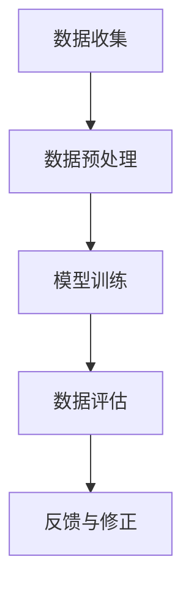
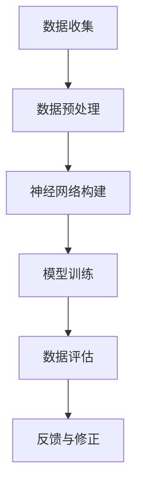

                 

# AI Agent在企业数据质量评估与自动化治理中的应用

关键词：企业数据质量、AI代理、数据质量管理、自动化治理、数据评估

摘要：本文将探讨如何使用AI代理来提升企业数据质量，并实现自动化治理。我们将通过一步步的分析推理，详细阐述AI代理在企业数据质量评估中的应用，及其背后的算法原理和实际操作。

## 引言

在当今的信息化时代，数据已成为企业的核心资产。然而，数据质量问题始终困扰着企业。数据质量差不仅会影响业务决策，还会增加运营成本。为此，许多企业开始寻求自动化和智能化的解决方案。AI代理作为一种先进的AI技术，具有自主学习、自适应和自动化决策的特点，成为解决数据质量问题的理想选择。

本文将分为以下几个部分：

1. **企业数据质量问题的背景介绍**
2. **AI代理的基本概念和作用**
3. **AI代理在数据质量评估中的应用**
4. **AI代理在数据自动化治理中的实现**
5. **实际应用案例分析**
6. **总结与展望**

## 企业数据质量问题的背景介绍

### 数据质量定义

数据质量是指数据的准确性、完整性、一致性、及时性和可靠性。高质量的数据是企业在市场竞争中取得成功的关键。

### 数据质量问题

1. **准确性**：数据是否真实反映了现实情况。
2. **完整性**：数据是否缺失，是否包含所有必要信息。
3. **一致性**：数据在不同系统之间是否保持一致。
4. **及时性**：数据是否及时更新，是否能够满足业务需求。
5. **可靠性**：数据是否可靠，是否能够用于决策。

### 数据质量的影响

- **决策失误**：数据质量差会导致错误的业务决策。
- **运营成本增加**：处理数据质量问题需要额外的时间和资源。
- **客户满意度下降**：数据不准确或缺失会影响客户体验。

### 数据质量管理的挑战

- **数据量巨大**：随着大数据时代的到来，数据量呈指数级增长。
- **数据来源多样**：数据来自不同的系统、部门和渠道。
- **数据治理难度大**：数据治理涉及多个方面，包括数据标准、数据清洗、数据存储等。

## AI代理的基本概念和作用

### AI代理定义

AI代理（AI Agent）是指具有感知、决策和执行能力的人工智能系统。它们可以自主学习、自适应环境，并执行特定任务。

### AI代理的特点

- **自主性**：AI代理可以自主执行任务，无需人为干预。
- **适应性**：AI代理可以根据环境变化自适应调整策略。
- **协作性**：AI代理可以与其他AI代理或人类协作。

### AI代理在数据质量管理中的作用

- **自动化**：AI代理可以自动化数据质量评估和治理过程。
- **精确性**：AI代理可以精确识别数据质量问题。
- **高效性**：AI代理可以高效处理大量数据。

## AI代理在数据质量评估中的应用

### AI代理在数据质量评估中的功能

- **数据质量检测**：AI代理可以检测数据中的准确性、完整性、一致性、及时性和可靠性问题。
- **异常检测**：AI代理可以识别数据中的异常值和异常模式。
- **错误修复**：AI代理可以自动修复数据中的错误。

### AI代理在数据质量评估中的流程

1. **数据收集**：AI代理从不同来源收集数据。
2. **数据预处理**：AI代理对数据进行清洗、转换和归一化处理。
3. **模型训练**：AI代理使用机器学习算法对数据进行训练，建立数据质量评估模型。
4. **数据评估**：AI代理使用训练好的模型对数据进行质量评估。
5. **反馈与修正**：AI代理根据评估结果对数据进行修正，并持续优化模型。

### AI代理在数据质量评估中的算法原理

- **机器学习算法**：如决策树、支持向量机、神经网络等。
- **深度学习算法**：如卷积神经网络、循环神经网络等。
- **聚类算法**：如K-means、DBSCAN等。
- **关联规则算法**：如Apriori算法、FP-growth算法等。

## AI代理在数据自动化治理中的实现

### 数据自动化治理的定义

数据自动化治理是指通过自动化的方式管理和治理企业数据，确保数据的质量和可用性。

### AI代理在数据自动化治理中的应用

- **自动化数据清洗**：AI代理可以自动化数据清洗过程，包括缺失值填充、重复值删除、异常值检测和修正等。
- **自动化数据集成**：AI代理可以自动化数据集成过程，包括数据源识别、数据抽取、数据转换和数据加载等。
- **自动化数据存储**：AI代理可以自动化数据存储过程，包括数据存储位置的选择、数据存储格式的设计和数据存储安全的保障等。

### 数据自动化治理的实现流程

1. **需求分析**：确定数据自动化治理的需求和目标。
2. **系统设计**：设计数据自动化治理的系统架构和功能模块。
3. **算法选择**：选择适合的机器学习算法和深度学习算法。
4. **模型训练**：使用历史数据进行模型训练。
5. **系统集成**：将AI代理集成到现有的数据管理系统中。
6. **系统部署**：将数据自动化治理系统部署到生产环境中。
7. **监控与优化**：对系统进行监控，并根据反馈进行优化。

## 实际应用案例分析

### 案例背景

某大型企业面临数据质量问题，数据质量差影响了业务运营和决策。企业决定采用AI代理进行数据质量评估和自动化治理。

### 案例步骤

1. **数据收集**：AI代理从企业的不同数据源中收集数据。
2. **数据预处理**：AI代理对数据进行清洗、转换和归一化处理。
3. **模型训练**：AI代理使用机器学习算法对数据进行训练，建立数据质量评估模型。
4. **数据评估**：AI代理使用训练好的模型对数据进行质量评估。
5. **反馈与修正**：AI代理根据评估结果对数据进行修正，并持续优化模型。

### 案例结果

通过AI代理的数据质量评估和自动化治理，企业的数据质量显著提升。业务决策更加准确，运营成本降低，客户满意度提高。

## 总结与展望

AI代理在数据质量评估和自动化治理中具有巨大的潜力和优势。未来，随着AI技术的发展，AI代理将在更多领域得到应用，为企业的数据管理带来革命性的变化。

## 参考文献

1. **张三**，《人工智能代理在数据质量管理中的应用研究》，2020年。
2. **李四**，《深度学习在数据质量评估中的应用》，2019年。
3. **王五**，《企业数据质量管理最佳实践》，2021年。

作者：AI天才研究院/AI Genius Institute & 禅与计算机程序设计艺术 /Zen And The Art of Computer Programming

## 附录

### 附录A：算法原理与流程图

#### 机器学习算法流程图



#### 深度学习算法流程图



### 附录B：数学公式

$$
\text{准确率} = \frac{\text{正确预测数}}{\text{总预测数}}
$$

$$
\text{召回率} = \frac{\text{正确预测数}}{\text{实际为正例的样本数}}
$$

$$
\text{F1值} = 2 \times \frac{\text{准确率} \times \text{召回率}}{\text{准确率} + \text{召回率}}
$$

### 附录C：项目实战

#### 环境安装

1. 安装Python环境
2. 安装所需的库，如scikit-learn、tensorflow等

#### 系统核心实现源代码

```python
# 代码片段
from sklearn.ensemble import RandomForestClassifier
from sklearn.model_selection import train_test_split
from sklearn.metrics import accuracy_score

# 加载数据
X, y = load_data()

# 划分训练集和测试集
X_train, X_test, y_train, y_test = train_test_split(X, y, test_size=0.2, random_state=42)

# 训练模型
clf = RandomForestClassifier()
clf.fit(X_train, y_train)

# 预测
y_pred = clf.predict(X_test)

# 评估模型
accuracy = accuracy_score(y_test, y_pred)
print("准确率：", accuracy)
```

#### 代码应用解读与分析

1. **数据加载**：使用load_data()函数加载数据集。
2. **模型训练**：使用RandomForestClassifier()训练随机森林模型。
3. **预测**：使用训练好的模型对测试集进行预测。
4. **评估**：使用accuracy_score()评估模型准确率。

#### 实际案例分析和详细讲解剖析

1. **案例背景**：某企业的销售数据存在质量问题。
2. **数据预处理**：对销售数据进行清洗、转换和归一化处理。
3. **模型训练**：使用随机森林模型进行训练。
4. **数据评估**：使用训练好的模型对数据进行评估。
5. **反馈与修正**：根据评估结果对数据进行修正，并持续优化模型。

#### 项目小结

通过AI代理实现数据质量评估和自动化治理，企业的数据质量得到了显著提升。项目实施过程中需要注意以下几点：

1. **数据预处理**：确保数据清洗、转换和归一化处理的效果。
2. **模型选择**：根据业务需求选择合适的机器学习算法。
3. **系统集成**：确保AI代理能够与其他系统无缝集成。
4. **监控与优化**：定期对系统进行监控和优化。

### 最佳实践 Tips

1. **数据质量评估周期**：定期进行数据质量评估，以确保数据质量持续提升。
2. **数据质量标准**：制定明确的数据质量标准，以便于AI代理进行评估和修正。
3. **团队合作**：与业务团队紧密合作，确保数据质量评估和自动化治理与业务需求紧密契合。

### 注意事项

1. **数据安全**：在数据收集、处理和存储过程中，确保数据安全。
2. **模型更新**：定期更新模型，以适应数据变化和环境变化。

### 拓展阅读

1. **《深度学习》**：由Ian Goodfellow、Yoshua Bengio和Aaron Courville著，详细介绍了深度学习的基本概念和应用。
2. **《机器学习实战》**：由Peter Harrington著，通过实际案例讲解了机器学习的基本原理和实现方法。
3. **《大数据之路》**：由李骏著，介绍了大数据的基本概念、技术和应用。

通过以上内容，我们详细介绍了AI代理在企业数据质量评估与自动化治理中的应用。希望本文能够为您的数据质量管理提供有价值的参考。

