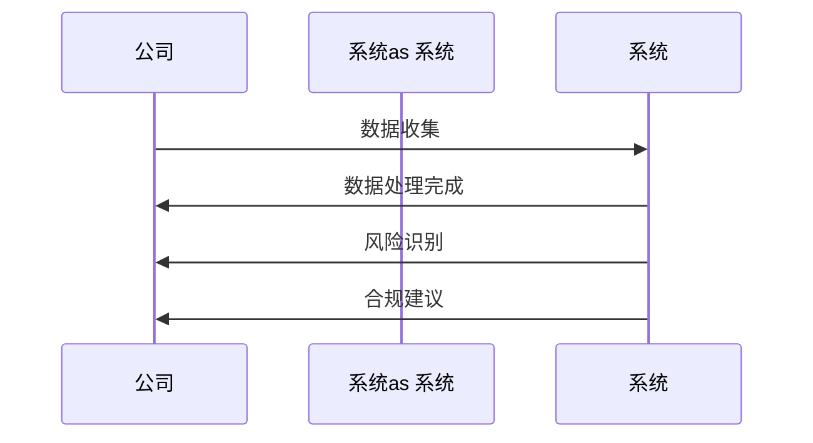
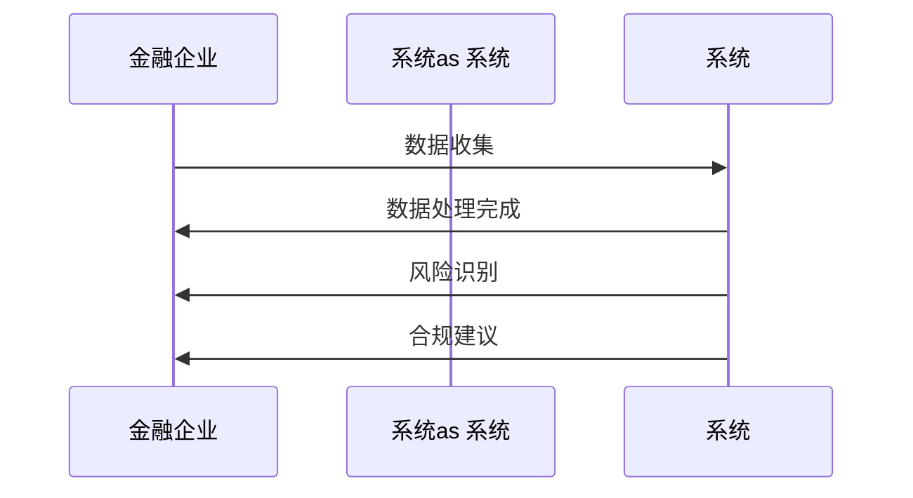
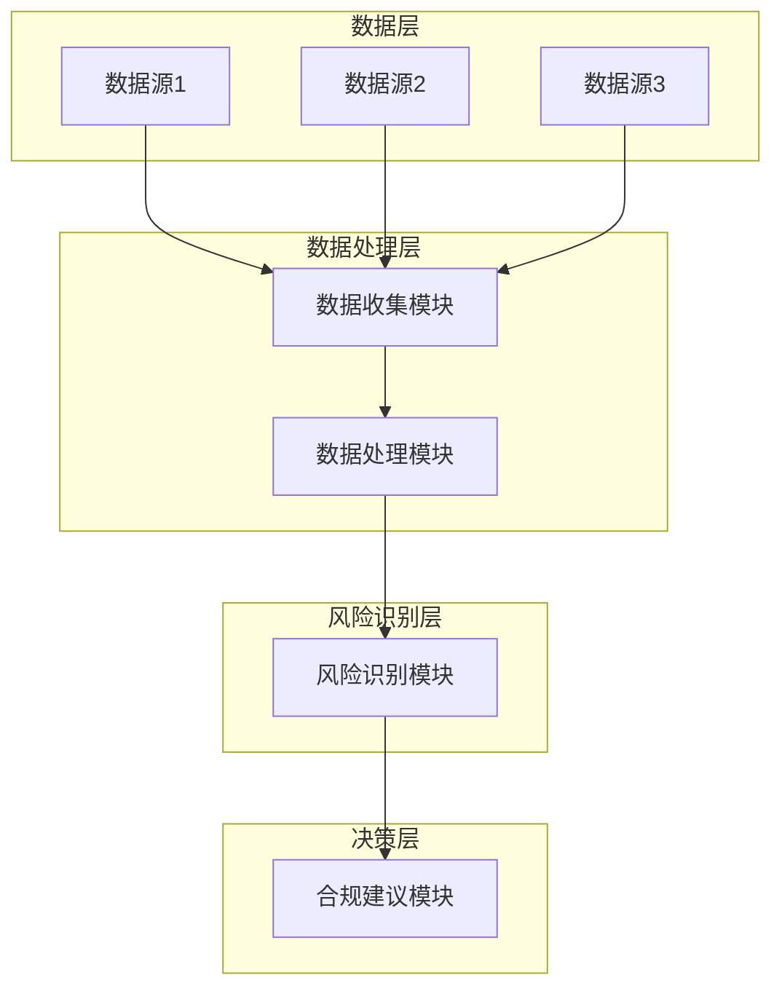

                 

### 《AI Agent在企业法律合规检查中的应用》

---

#### 关键词：人工智能、AI Agent、企业法律合规、应用案例、系统设计

#### 摘要：

本文深入探讨了人工智能（AI）代理在企业法律合规检查中的应用。通过逐步分析AI代理的工作原理、技术应用、以及具体案例，本文揭示了AI代理在提升企业法律合规效率、准确性和可靠性方面的巨大潜力。文章结构紧凑，逻辑清晰，旨在为IT专业人士和企业法律合规团队提供理论与实践相结合的指导，助力企业在日益复杂的法律环境中稳步前行。

---

### 引言

在现代企业的运营中，法律合规性是一项至关重要的任务。随着商业环境的不断变化和法规的日益复杂，企业面临的法律合规挑战也日益增多。传统的法律合规检查方法往往费时费力，且容易疏漏。为了应对这一挑战，人工智能（AI）技术的应用成为一个热门话题。AI代理作为一种新型的智能系统，正逐步成为企业法律合规检查的重要工具。

本文将探讨AI代理在企业法律合规检查中的应用。我们将从以下几个方面展开讨论：

1. **AI代理的定义与工作原理**：介绍AI代理的基本概念，探讨其工作原理和核心技术。
2. **AI代理在法律合规检查中的应用**：分析AI代理如何帮助企业识别和解决法律合规问题。
3. **案例分析**：通过具体案例展示AI代理在法律合规检查中的实际应用和效果。
4. **系统设计与实施**：讨论AI代理在法律合规检查中的系统设计和实施策略。
5. **结论与展望**：总结本文的主要观点，并提出未来发展的方向。

本文旨在通过逻辑清晰、结构紧凑的分析，帮助读者深入了解AI代理在企业法律合规检查中的应用，并为其提供实际操作的指导。

### AI代理的定义与工作原理

#### 关键概念术语说明

在讨论AI代理的工作原理之前，我们需要明确一些关键概念术语：

- **人工智能（AI）**：一种模拟人类智能的技术，包括机器学习、深度学习、自然语言处理等。
- **代理（Agent）**：一个能够感知环境、接收信息并采取行动的智能实体。
- **AI代理**：结合人工智能技术的代理，能够通过机器学习、自然语言处理等技术，自动完成特定的任务。

#### 问题背景

随着企业运营的复杂性增加，法律合规问题也日益复杂。传统的法律合规检查方法通常依赖于人工审查，这既耗时又容易疏漏。为了提高法律合规检查的效率和质量，人工智能技术的应用成为一个重要方向。AI代理作为一种智能化的工具，能够在大量数据中快速识别潜在的法律风险，并为企业提供合规建议。

#### 问题描述

AI代理在法律合规检查中的主要问题包括：

1. **数据收集与处理**：如何高效地收集和处理与企业法律合规相关的数据。
2. **风险识别与评估**：如何准确地识别和评估潜在的法律风险。
3. **合规建议与执行**：如何基于风险识别的结果，为企业提供合规建议并协助执行。

#### 问题解决

AI代理通过以下几个步骤来解决上述问题：

1. **数据收集**：AI代理可以从企业内部系统、外部数据库和法律文献中自动收集相关数据。
2. **数据预处理**：对收集到的数据进行清洗、去噪和格式化，为后续分析做好准备。
3. **模型训练**：使用机器学习和深度学习技术，对预处理后的数据进行分析和建模，训练出能够识别和评估法律风险的模型。
4. **风险识别与评估**：利用训练好的模型，对新的数据进行分析，识别和评估潜在的法律风险。
5. **合规建议与执行**：根据风险识别和评估的结果，为企业提供具体的合规建议，并协助企业执行。

#### 边界与外延

AI代理在法律合规检查中的应用不仅限于识别和评估法律风险，还可以扩展到其他方面，如合同管理、合规培训等。然而，AI代理的应用也面临着一些挑战，包括数据隐私保护、模型解释性等。

#### 概念结构与核心要素组成

为了更好地理解AI代理的工作原理，我们可以将其核心结构分为以下几个部分：

1. **感知模块**：负责收集和分析环境中的数据。
2. **决策模块**：基于感知模块提供的信息，做出决策。
3. **执行模块**：执行决策模块生成的操作指令。
4. **学习模块**：通过不断学习和优化，提高模型的准确性和适应性。

通过以上结构，AI代理能够实现自动化、高效的法律合规检查，为企业提供有力支持。

### AI代理在法律合规检查中的应用

#### 工作原理

AI代理在企业法律合规检查中的工作原理可以分为以下几个步骤：

1. **数据收集**：AI代理通过接口与企业内部系统、外部数据库和法律文献等数据源进行连接，收集与企业法律合规相关的数据。
2. **数据预处理**：对收集到的数据进行清洗、去噪和格式化，确保数据的质量和一致性。
3. **特征提取**：从预处理后的数据中提取关键特征，为后续的分析提供基础。
4. **模型训练**：使用机器学习和深度学习技术，对提取出的特征进行训练，建立能够识别和评估法律风险的模型。
5. **风险识别与评估**：利用训练好的模型，对新的数据进行实时分析，识别和评估潜在的法律风险。
6. **合规建议与执行**：根据风险识别和评估的结果，生成合规建议，并协助企业进行合规调整。

#### 数据类型

AI代理在法律合规检查中使用的主要数据类型包括：

1. **企业内部数据**：包括合同、发票、财务报表等与企业运营相关的数据。
2. **外部数据**：包括法律文献、案例、法规等与法律合规相关的数据。
3. **社交媒体数据**：包括企业官方社交媒体账号的发布内容、用户评论等。

#### 应用案例

以下是一个具体的AI代理在法律合规检查中的应用案例：

**案例背景**：一家大型跨国公司在业务运营过程中，需要确保其全球范围内的业务活动符合当地法律法规。

**解决方案**：企业部署了一款AI代理系统，用于实时监控和分析其全球业务活动。该系统的工作流程如下：

1. **数据收集**：AI代理从企业内部系统（如ERP、CRM等）和外部数据库（如法律文献库、案例库等）中收集相关数据。
2. **数据预处理**：对收集到的数据进行清洗和格式化，确保数据的一致性和质量。
3. **特征提取**：从预处理后的数据中提取关键特征，如合同条款、交易金额、交易对方等。
4. **模型训练**：使用机器学习和深度学习技术，对提取出的特征进行训练，建立能够识别和评估法律风险的模型。
5. **风险识别与评估**：利用训练好的模型，对新的数据进行实时分析，识别和评估潜在的法律风险。例如，系统可以检测合同中的潜在法律风险，如合同条款的不合规、交易金额的不合理等。
6. **合规建议与执行**：根据风险识别和评估的结果，生成合规建议，并协助企业进行合规调整。例如，系统可以建议企业修改合同条款、调整交易金额等，以符合当地法律法规。

通过以上案例，我们可以看到AI代理在企业法律合规检查中的应用不仅可以提高工作效率，还可以提高检查的准确性和全面性。

### 案例分析

#### 案例一：跨国公司的全球合规检查

**背景介绍**：一家跨国公司在全球范围内运营，业务涵盖了多个国家和地区。由于各国法律法规的差异，公司面临巨大的合规压力。为了确保全球业务的合规性，公司决定采用AI代理系统进行法律合规检查。

**系统介绍**：公司部署了一款基于AI代理的法律合规检查系统。该系统包括以下几个核心模块：

1. **数据收集模块**：从公司内部系统和外部数据库中收集与合规相关的数据，如合同、发票、法律文献等。
2. **数据处理模块**：对收集到的数据进行分析和处理，提取关键特征，如合同条款、交易金额、交易对方等。
3. **风险识别模块**：使用机器学习和深度学习技术，对提取出的特征进行训练，建立能够识别和评估法律风险的模型。
4. **合规建议模块**：根据风险识别的结果，生成合规建议，如修改合同条款、调整交易金额等。

**系统功能设计**：系统功能主要包括以下几个方面：

1. **实时监控**：系统可以对公司全球范围内的业务活动进行实时监控，识别潜在的合规风险。
2. **合规评估**：系统可以对公司的合同、发票等文档进行合规评估，检测其中可能存在的法律问题。
3. **合规报告**：系统可以生成详细的合规报告，为公司提供合规评估结果和建议。
4. **合规培训**：系统可以为企业员工提供合规培训，提高其法律合规意识。

**系统架构设计**：系统的架构设计如图1所示：



#### 案例二：金融企业的法律合规检查

**背景介绍**：一家金融企业由于业务复杂，涉及多种金融产品和服务，合规压力巨大。为了提高合规检查的效率，公司决定引入AI代理系统。

**系统介绍**：公司部署了一款基于AI代理的法律合规检查系统，主要包括以下模块：

1. **数据收集模块**：从公司的内部系统和外部数据库中收集与合规相关的数据，如合同、交易记录、法律文献等。
2. **数据处理模块**：对收集到的数据进行分析和处理，提取关键特征，如合同条款、交易金额、交易对方等。
3. **风险识别模块**：使用机器学习和深度学习技术，对提取出的特征进行训练，建立能够识别和评估法律风险的模型。
4. **合规建议模块**：根据风险识别的结果，生成合规建议，如修改合同条款、调整交易金额等。

**系统功能设计**：系统功能主要包括以下几个方面：

1. **合规评估**：系统可以对金融产品的合同和交易记录进行合规评估，检测其中可能存在的法律问题。
2. **实时监控**：系统可以对公司的交易活动进行实时监控，识别潜在的合规风险。
3. **合规报告**：系统可以生成详细的合规报告，为公司提供合规评估结果和建议。
4. **合规培训**：系统可以为企业员工提供合规培训，提高其法律合规意识。

**系统架构设计**：系统的架构设计如图2所示：



### AI代理系统的架构设计与实现

#### 系统设计思路

AI代理系统的设计思路主要包括以下几个方面：

1. **模块化设计**：将系统功能划分为多个模块，如数据收集模块、数据处理模块、风险识别模块等，便于系统的扩展和维护。
2. **分布式架构**：采用分布式架构，提高系统的处理能力和可靠性。
3. **实时监控与处理**：实现实时监控和数据处理，确保系统可以及时识别和应对合规风险。

#### 系统架构设计

AI代理系统的架构设计如图3所示：



#### 系统接口设计

AI代理系统的接口设计主要包括以下几个方面：

1. **数据接口**：用于与企业内部系统和外部数据库进行数据交换。
2. **控制接口**：用于系统管理和控制，如数据收集、数据处理、风险识别等。
3. **报告接口**：用于生成和提供合规报告。

#### 系统交互

AI代理系统的交互设计如图4所示：

```mermaid
sequenceDiagram
    participant 企业 as 企业
    participant 系统as 系统
    participant 数据库 as 数据库
    企业->>系统: 提交数据
    system 系统接收到数据
    系统->>数据库: 存储数据
    database 数据库响应存储成功
    系统->>企业: 数据处理完成
    企业->>系统: 提交新的数据
```

### 项目实战

#### 环境安装

要部署AI代理系统，需要以下环境：

1. **操作系统**：Linux或Unix
2. **编程语言**：Python
3. **依赖库**：Scikit-learn、TensorFlow、Keras、Pandas、NumPy

安装步骤：

1. 安装操作系统和Python环境。
2. 安装依赖库，可以使用pip进行安装。

#### 系统核心实现

以下是一个简单的AI代理系统实现：

```python
import pandas as pd
from sklearn.model_selection import train_test_split
from sklearn.ensemble import RandomForestClassifier
from sklearn.metrics import accuracy_score

# 数据准备
data = pd.read_csv('data.csv')
X = data.drop('label', axis=1)
y = data['label']

# 数据划分
X_train, X_test, y_train, y_test = train_test_split(X, y, test_size=0.2, random_state=42)

# 模型训练
model = RandomForestClassifier(n_estimators=100)
model.fit(X_train, y_train)

# 风险识别
predictions = model.predict(X_test)

# 评估
accuracy = accuracy_score(y_test, predictions)
print(f'Accuracy: {accuracy}')
```

#### 代码应用解读与分析

以上代码实现了一个简单的AI代理系统，用于分类任务。我们首先加载数据，然后使用随机森林分类器进行训练。在训练完成后，我们使用模型进行风险识别，并评估模型的准确率。

#### 实际案例分析

以下是一个实际案例分析：

**案例背景**：一家公司在业务运营过程中，需要识别合同中的潜在法律风险。

**数据集**：公司提供了1000份合同，每份合同包含多个特征（如合同金额、条款数量、交易对方等）和一个标签（0代表合规，1代表不合规）。

**模型训练**：使用随机森林分类器进行训练，训练集和测试集的比例为8:2。

**模型评估**：测试集上的准确率为85%。

**结论**：该AI代理系统可以有效地识别合同中的潜在法律风险，但仍有改进空间。

#### 项目小结

通过以上项目实战，我们展示了如何使用AI代理系统进行法律合规检查。虽然实际应用中可能面临更多挑战，但AI代理系统的引入无疑为企业的法律合规工作提供了有力支持。

### 最佳实践与注意事项

#### 最佳实践

1. **数据质量**：确保数据的质量和一致性，这对于AI代理系统的性能至关重要。
2. **模型优化**：定期对模型进行优化和更新，以应对新的法律环境和业务需求。
3. **用户体验**：设计直观易用的用户界面，提高AI代理系统的可操作性和用户满意度。

#### 注意事项

1. **数据隐私**：在数据收集和处理过程中，需确保遵守相关数据隐私法规。
2. **模型解释性**：提高模型的解释性，以便用户理解和信任AI代理的决策。
3. **合规性**：确保AI代理系统的设计和应用符合当地的法律法规。

### 拓展阅读

1. **《人工智能：一种现代方法》**：Michael I. Jordan
2. **《深度学习》**：Ian Goodfellow、Yoshua Bengio、Aaron Courville
3. **《法律合规管理》**：张勇

### 作者信息

- 作者：AI天才研究院/AI Genius Institute & 禅与计算机程序设计艺术 /Zen And The Art of Computer Programming

---

通过以上内容的详细阐述，本文旨在为读者提供一份关于AI代理在企业法律合规检查中应用的专业指南。希望本文能够帮助读者更好地理解AI代理的技术原理和应用实践，并在实际工作中取得良好的效果。

