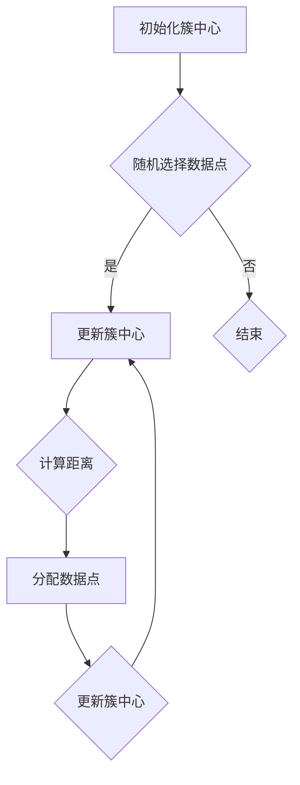
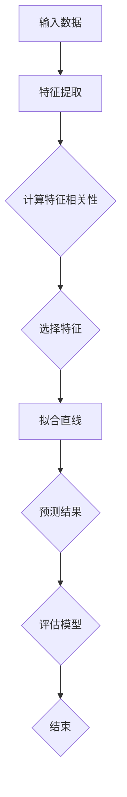
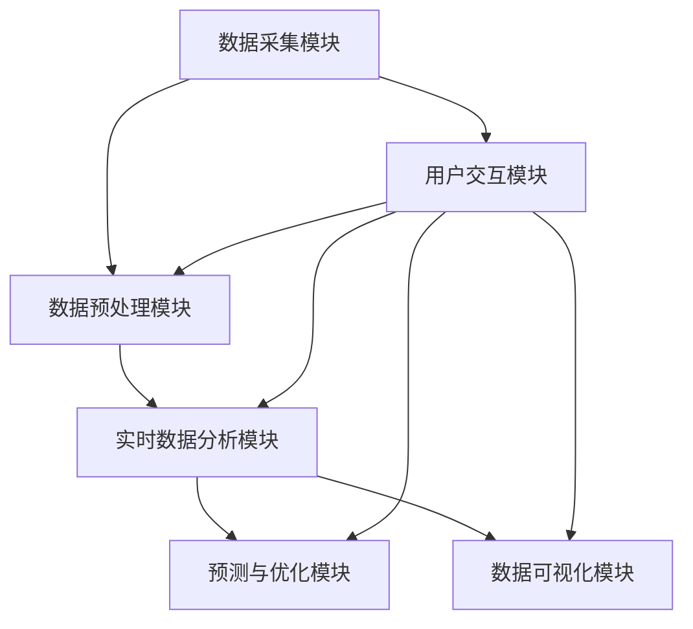
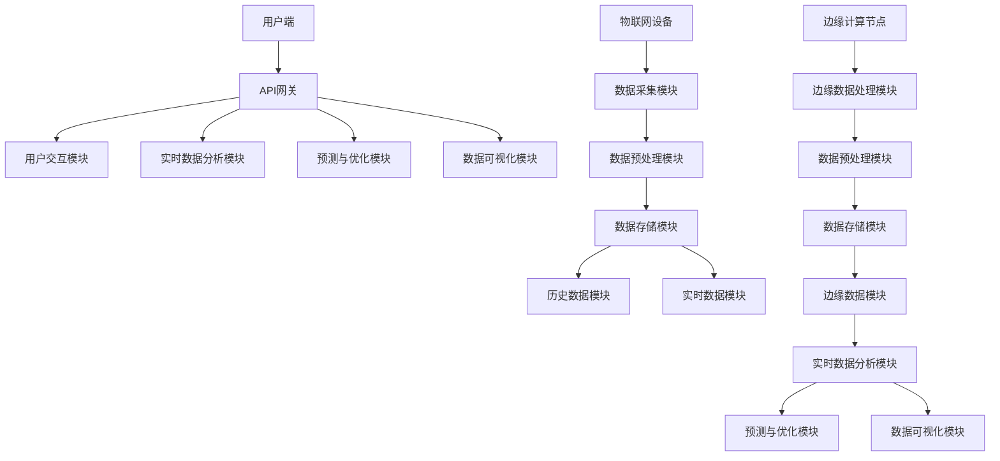

                 

## 第一部分：背景介绍

### 第1章：问题背景

#### 1.1 问题背景

随着全球数字化转型的加速，企业对于数据的依赖程度日益加深。物联网（Internet of Things, IoT）作为一种能够将物理世界中的各种设备、传感器、系统通过网络进行连接的技术，已经逐渐成为企业数字化转型的重要支撑。然而，随着物联网设备数量的急剧增加，企业面临的数据量也在迅速膨胀。如何有效地收集、存储、处理和分析这些数据，以从中提取有价值的信息，成为当前企业面临的一个重大挑战。

在这个背景下，AI Agent作为一种具备自我学习能力、可以自动执行任务的智能体，为企业物联网数据分析提供了新的可能性。AI Agent能够在海量数据中自动发现模式、预测趋势，并提供决策支持，从而帮助企业实现更加智能化的运营和管理。

#### 1.2 问题描述

企业物联网数据分析中主要面临以下问题：

1. **数据量大**：物联网设备产生的大量数据需要进行有效的存储和处理，这对传统的数据处理技术提出了挑战。
2. **数据多样性**：不同类型的物联网设备产生的数据格式和内容各不相同，如何进行统一的处理和分析是一个难题。
3. **实时性要求高**：物联网设备产生的数据往往是实时的，企业需要快速地对这些数据进行处理和分析，以便及时做出决策。
4. **数据隐私和安全**：物联网设备的大量数据涉及企业的核心商业机密，如何保护数据的安全和隐私是一个重要的考量。

#### 1.3 问题解决

AI Agent在企业物联网数据分析中的应用，可以解决上述问题：

1. **数据量处理**：AI Agent可以通过分布式计算和并行处理技术，对海量数据进行快速处理和分析。
2. **数据统一处理**：AI Agent具备自学习能力，可以适应不同数据格式，实现数据格式的统一处理。
3. **实时数据处理**：AI Agent可以实时地处理物联网设备产生的数据，提供实时分析和预测。
4. **数据隐私保护**：AI Agent可以通过加密、匿名化等技术手段，保障数据的隐私和安全。

#### 1.4 边界与外延

虽然AI Agent在物联网数据分析中具有巨大的潜力，但它的应用也受到一定的限制：

1. **技术挑战**：AI Agent的开发和部署需要较高的技术水平，中小企业可能难以承担。
2. **数据质量**：AI Agent的效果依赖于数据的质量，如果数据存在误差或不完整，可能会影响分析结果。
3. **法律法规**：随着物联网和AI技术的快速发展，相关的法律法规也在逐步完善，企业需要遵循这些法律法规，以避免法律风险。

#### 1.5 核心概念结构与要素组成

在探讨AI Agent在企业物联网数据分析中的应用时，以下几个核心概念和要素是至关重要的：

1. **AI Agent**：一种能够自主决策和执行任务的智能体，具备自学习能力。
2. **物联网**：通过传感器和设备将物理世界连接到互联网，实现设备之间的通信和数据交换。
3. **数据分析**：对物联网设备产生的数据进行收集、存储、处理和分析，以提取有价值的信息。
4. **数据隐私和安全**：保护物联网设备产生的数据的安全和隐私，防止数据泄露和滥用。
5. **分布式计算**：通过分布式系统架构，实现海量数据的快速处理和分析。

### 结论

通过以上分析，我们可以看出，AI Agent在企业物联网数据分析中具有广泛的应用前景。它不仅能够帮助企业解决数据量处理、实时数据分析和数据隐私保护等问题，还能够提升企业的运营效率和管理水平。然而，AI Agent的应用也面临一些技术、数据和法律等方面的挑战，需要企业在实际应用中进行充分考虑和解决。接下来，我们将进一步探讨AI Agent与物联网、企业物联网数据分析的核心概念及其应用。

## 第二部分：核心概念与联系

### 第2章：AI Agent与物联网

#### 2.1 AI Agent的概念

AI Agent，即人工智能代理，是一种能够自主感知环境、执行任务并适应环境的智能体。AI Agent的核心特点是具备自主决策和行动的能力，能够在没有人类干预的情况下完成复杂的任务。AI Agent通过感知环境中的信息，利用机器学习算法进行分析和推理，然后采取相应的行动，以实现预定的目标。

AI Agent的基本组成包括感知模块、决策模块和行动模块。感知模块负责收集环境中的信息，决策模块基于感知信息进行推理和判断，行动模块则执行决策结果。这种结构使得AI Agent能够在复杂的环境中自主运作，提高了效率和灵活性。

#### 2.2 物联网的定义与特点

物联网（Internet of Things，IoT）是指通过互联网将各种设备、传感器、系统连接起来，实现设备之间的通信和数据交换。物联网的核心理念是“万物互联”，即通过传感器和通信技术，将物理世界中的物体转化为数字化信息，从而实现智能管理和控制。

物联网的特点包括：

1. **广泛连接**：物联网通过互联网将大量的设备、传感器和系统连接在一起，形成一个庞大的网络。
2. **数据密集**：物联网设备可以实时采集和传输大量的数据，这些数据为分析和决策提供了丰富的信息来源。
3. **实时性**：物联网设备通常需要实时监测和响应环境变化，因此数据处理和分析要求高效和实时。
4. **多样性**：物联网设备种类繁多，包括智能家居、工业自动化、交通管理、健康监测等多个领域。
5. **智能化**：物联网设备可以通过AI Agent等智能技术实现自动化和智能化，提高设备的运行效率和用户体验。

#### 2.3 AI Agent在物联网中的应用

AI Agent在物联网中有着广泛的应用场景，以下是一些典型的应用实例：

1. **智能家居**：AI Agent可以控制家庭中的各种智能设备，如照明、空调、安防系统等，实现自动化和智能化的家庭环境。
2. **智能工厂**：AI Agent可以实时监控工厂设备状态，预测故障，优化生产流程，提高生产效率。
3. **智能交通**：AI Agent可以分析交通数据，优化交通信号，预测交通流量，减少交通拥堵。
4. **健康监测**：AI Agent可以监测病人的健康数据，分析病情，提供个性化的健康建议。
5. **环境监测**：AI Agent可以监测环境中的污染物、气象等信息，为环境保护和治理提供数据支持。

#### 2.4 AI Agent与物联网的关系

AI Agent与物联网之间存在着紧密的联系和相互促进的关系：

1. **AI Agent驱动物联网**：AI Agent通过感知和决策能力，驱动物联网设备实现智能化和自动化。AI Agent可以帮助物联网设备更好地理解环境和用户需求，从而提高设备的性能和用户体验。
2. **物联网支撑AI Agent**：物联网提供了海量的数据来源，为AI Agent的学习和推理提供了丰富的信息支持。物联网设备可以实时采集环境数据，为AI Agent提供实时、准确的输入。
3. **协同发展**：AI Agent和物联网的协同发展，使得智能系统更加完善和高效。AI Agent可以通过物联网设备收集的数据，进行实时分析和决策，从而优化物联网系统的运行和管理。

### 结论

通过以上分析，我们可以看到，AI Agent与物联网之间存在着紧密的联系和相互促进的关系。AI Agent为物联网设备提供了智能化和自动化的能力，而物联网则为AI Agent提供了丰富的数据支持。随着AI技术和物联网技术的不断发展，AI Agent在物联网中的应用前景将更加广阔。接下来，我们将进一步探讨企业物联网数据分析的核心概念，以更深入地理解AI Agent在这一领域的应用。

### 第3章：企业物联网数据分析的核心概念

#### 3.1 数据分析的基本概念

数据分析（Data Analysis）是指通过特定的方法、技术和工具，对大量数据进行分析和处理，从中提取有价值的信息和知识。数据分析的目的是帮助企业和组织从数据中获取洞察力，支持决策制定、业务优化和战略规划。

数据分析的基本过程通常包括以下步骤：

1. **数据收集**：从各种来源收集数据，包括内部数据（如企业内部系统、数据库）和外部数据（如公共数据、社交媒体等）。
2. **数据清洗**：对收集到的数据进行清洗，处理数据中的错误、缺失值和重复数据，确保数据的准确性和完整性。
3. **数据探索**：对清洗后的数据进行分析，发现数据中的模式和趋势，生成初步的分析结果。
4. **数据建模**：使用统计模型、机器学习算法等，对数据进行分析和预测，构建模型以支持决策。
5. **数据可视化**：通过图表、报表等形式，将数据分析结果以直观的方式展示出来，帮助决策者理解和利用分析结果。

#### 3.2 企业物联网数据分析的特点

企业物联网数据分析具有以下特点：

1. **数据量大**：物联网设备产生的数据量通常非常大，需要采用高效的数据处理和分析方法来处理这些数据。
2. **数据多样性**：物联网设备产生的数据类型多种多样，包括结构化数据、半结构化数据和非结构化数据，如何对这些数据进行有效的整合和分析是一个挑战。
3. **实时性要求高**：物联网设备产生的数据往往是实时的，企业需要快速地对这些数据进行处理和分析，以支持实时决策。
4. **数据处理复杂性**：物联网数据分析涉及到多个设备和系统的交互，数据处理过程复杂，需要考虑数据的实时性、可靠性和一致性。
5. **数据隐私和安全**：物联网设备产生的数据可能涉及企业的核心商业机密，数据隐私和安全是物联网数据分析过程中必须重视的问题。

#### 3.3 企业物联网数据分析的关键技术

企业物联网数据分析的关键技术包括：

1. **数据采集与预处理**：采用传感器技术、边缘计算等技术，实现物联网设备数据的实时采集和预处理，为后续的数据分析提供高质量的数据输入。
2. **数据存储与管理**：采用分布式存储系统和大数据技术，存储和管理海量的物联网数据，确保数据的可靠性和可扩展性。
3. **数据清洗与融合**：采用数据清洗和融合技术，处理数据中的错误、缺失值和重复数据，实现不同来源、不同格式的数据整合。
4. **数据分析与挖掘**：采用统计模型、机器学习算法等，对物联网数据进行深入分析，提取有价值的信息和知识。
5. **数据可视化与展示**：采用数据可视化技术，将分析结果以图表、报表等形式直观展示，帮助决策者理解和利用分析结果。

#### 3.4 数据分析在企业物联网中的价值

数据分析在企业物联网中的应用具有以下价值：

1. **优化运营效率**：通过对物联网设备产生的数据进行实时分析，企业可以优化生产流程、设备管理和运营策略，提高整体运营效率。
2. **提高决策质量**：数据分析可以帮助企业从海量数据中提取有价值的信息，支持决策制定，提高决策质量和准确性。
3. **提升用户体验**：通过对用户行为数据的分析，企业可以提供个性化的产品和服务，提升用户体验和满意度。
4. **降低运营成本**：通过对物联网设备进行实时监控和分析，企业可以预测设备故障和资源需求，提前进行维护和调整，降低运营成本。
5. **增强竞争优势**：数据分析可以帮助企业发现市场机会、识别竞争对手，从而制定更加有效的竞争策略，增强企业的竞争优势。

### 结论

通过以上分析，我们可以看到，企业物联网数据分析具有数据量大、多样性、实时性要求高、数据处理复杂性高和数据隐私安全重要的特点。关键技术在数据采集与预处理、数据存储与管理、数据清洗与融合、数据分析与挖掘以及数据可视化与展示等方面发挥着重要作用。数据分析在企业物联网中的应用不仅能够优化运营效率、提高决策质量，还能够提升用户体验、降低运营成本和增强竞争优势。接下来，我们将深入探讨常见的算法原理和系统架构设计，进一步理解AI Agent在企业物联网数据分析中的应用。

### 第三部分：算法原理讲解

#### 第4章：常见算法介绍

在AI Agent应用于企业物联网数据分析中，需要运用多种算法来处理和分析海量数据。以下介绍几类常见的算法，包括数据采集与预处理算法、数据清洗算法、数据分析算法以及数据可视化算法。

#### 4.1 数据采集与预处理算法

数据采集与预处理是数据分析的基础环节，主要任务是获取高质量的数据，并使其适合进一步分析。常见的算法包括：

1. **传感器数据采集算法**：通过传感器采集物联网设备产生的数据，常见的传感器包括温度传感器、湿度传感器、加速度传感器等。采集算法需要考虑传感器的精度、响应时间和功耗等因素。
2. **边缘计算算法**：在数据产生的地方（如物联网设备的边缘）进行初步的数据处理和计算，减少数据传输的延迟和带宽消耗。常见的边缘计算算法包括滤波算法、数据压缩算法等。
3. **数据聚合算法**：将来自不同传感器的数据进行整合和汇总，以便于后续的分析和处理。例如，将多个传感器的温度数据进行平均处理，得到整体的温度情况。

#### 4.2 数据清洗算法

数据清洗是确保数据分析准确性的关键步骤，主要目的是去除数据中的噪声、错误和不完整的数据。常见的数据清洗算法包括：

1. **缺失值处理算法**：对于缺失值的数据，可以采用填充策略，如平均值填充、中值填充或插值法等。另外，也可以根据数据的特性，直接删除缺失值较多的记录。
2. **异常值检测算法**：检测并处理数据中的异常值，常见的异常值检测算法包括Z-score法、IQR法（四分位差法）和DBSCAN算法等。
3. **重复值删除算法**：检测并删除数据集中的重复记录，常用的方法包括基于哈希表的快速检测算法和基于距离测量的相似性检测算法。

#### 4.3 数据分析算法

数据分析算法用于挖掘数据中的模式和规律，常见的算法包括：

1. **聚类算法**：将数据集划分为多个类别，常见的聚类算法包括K-means算法、层次聚类算法和DBSCAN算法等。
2. **分类算法**：将数据集划分为预定义的类别，常见的分类算法包括决策树、随机森林、支持向量机（SVM）和神经网络等。
3. **回归算法**：预测数据集中的连续值，常见的回归算法包括线性回归、多项式回归和神经网络回归等。
4. **时间序列分析算法**：用于分析时间序列数据，常见的算法包括自回归（AR）、移动平均（MA）和自回归移动平均（ARMA）模型等。

#### 4.4 数据可视化算法

数据可视化是将数据分析结果以图形化方式展示出来，帮助决策者更好地理解和利用数据。常见的数据可视化算法包括：

1. **折线图**：用于展示数据随时间的变化趋势，适用于时间序列数据的可视化。
2. **柱状图**：用于展示各类别数据的数量或比例，适用于分类数据的可视化。
3. **散点图**：用于展示数据点之间的关系和分布，适用于回归分析和聚类分析的可视化。
4. **热力图**：用于展示数据在不同维度上的分布情况，适用于多维数据的可视化。
5. **地图**：用于展示地理位置相关的数据，适用于地理空间数据的可视化。

通过以上常见的算法介绍，我们可以看到，AI Agent在企业物联网数据分析中的应用，需要结合多种算法和技术手段，实现数据的高效采集、清洗、分析和可视化。接下来，我们将深入探讨这些算法的原理和具体实现，为理解AI Agent在物联网数据分析中的应用打下坚实基础。

#### 第5章：算法原理详解

在深入探讨AI Agent在企业物联网数据分析中的应用时，我们需要详细讲解一些常见的算法原理，包括其数学模型、流程图和具体示例。通过这些详细的讲解，可以更好地理解这些算法在实际应用中的效果和实现方法。

##### 5.1 算法原理

以下是一些常见算法的基本原理：

1. **K-means算法**：K-means是一种典型的聚类算法，其目标是将数据集划分为K个簇，使得每个簇内的数据点尽可能接近，而簇与簇之间的数据点尽可能远。算法流程主要包括以下步骤：
   - 随机初始化K个簇中心。
   - 对于每个数据点，将其分配到距离其最近的簇中心所在的簇。
   - 更新每个簇的中心，取簇内所有数据点的均值作为新的簇中心。
   - 重复步骤2和步骤3，直到簇中心不再发生显著变化。

2. **线性回归**：线性回归是一种用于预测连续值的统计方法，其基本原理是通过拟合一条直线来描述因变量（响应变量）与自变量（解释变量）之间的关系。线性回归的数学模型为：
   $$
   Y = \beta_0 + \beta_1 \cdot X + \varepsilon
   $$
   其中，$Y$是因变量，$X$是自变量，$\beta_0$和$\beta_1$是回归系数，$\varepsilon$是误差项。

3. **决策树**：决策树是一种基于树形结构进行分类和回归的算法。每个内部节点表示一个特征，每个分支代表特征的不同取值，叶节点表示具体的类别或数值。决策树的构建过程主要包括以下步骤：
   - 选择最优特征进行分割。
   - 根据特征的不同取值，将数据集分割成子集。
   - 对每个子集递归地构建子树，直到满足终止条件（如最大深度、最小样本量等）。

4. **神经网络**：神经网络是一种模拟人脑神经元连接结构的计算模型，通过多层神经元之间的连接和激活函数，实现数据的输入和输出。神经网络的基本原理包括：
   - 输入层：接收外部输入数据。
   - 隐藏层：通过激活函数对输入数据进行处理和变换。
   - 输出层：输出最终的结果。

##### 5.2 算法流程图

为了更直观地理解这些算法的流程，我们可以使用Mermaid语法绘制流程图。以下是K-means算法和线性回归算法的流程图示例：





##### 5.3 算法数学模型

以下是一些算法的数学模型，以K-means算法和线性回归为例：

1. **K-means算法**：
   $$
   D(i, j) = \sqrt{\sum_{k=1}^{n} (x_{ik} - \mu_{jk})^2}
   $$
   其中，$D(i, j)$表示数据点$i$与簇中心$j$之间的距离，$x_{ik}$表示数据点$i$在第$k$个特征上的值，$\mu_{jk}$表示簇中心$j$在第$k$个特征上的值。

2. **线性回归**：
   $$
   Y = \beta_0 + \beta_1 \cdot X + \varepsilon
   $$
   其中，$Y$表示因变量，$X$表示自变量，$\beta_0$和$\beta_1$是回归系数，$\varepsilon$是误差项。

##### 5.4 算法公式

以下是K-means算法和线性回归算法的关键公式：

1. **K-means算法**：
   - 初始化簇中心：
     $$
     \mu_{jk} = \frac{1}{n} \sum_{i=1}^{n} x_{ik}
     $$
   - 更新簇中心：
     $$
     \mu_{jk}^{new} = \frac{1}{n_k} \sum_{i \in S_j} x_{ik}
     $$
     其中，$n_k$表示簇$j$中的数据点数量，$S_j$表示属于簇$j$的数据点集合。

2. **线性回归**：
   - 最小二乘法求解回归系数：
     $$
     \beta_0 = \bar{Y} - \beta_1 \cdot \bar{X}
     $$
     $$
     \beta_1 = \frac{\sum_{i=1}^{n} (X_i - \bar{X})(Y_i - \bar{Y})}{\sum_{i=1}^{n} (X_i - \bar{X})^2}
     $$
     其中，$\bar{X}$和$\bar{Y}$分别表示自变量和因变量的均值。

##### 5.5 举例说明

以下通过一个具体示例来说明K-means算法和线性回归算法的应用：

1. **K-means算法示例**：

假设我们有以下10个二维数据点，需要将它们分为两个簇：

| 数据点 | x | y |
|--------|---|---|
| 1      | 1 | 2 |
| 2      | 2 | 3 |
| 3      | 2 | 1 |
| 4      | 4 | 3 |
| 5      | 5 | 4 |
| 6      | 4 | 1 |
| 7      | 7 | 5 |
| 8      | 8 | 6 |
| 9      | 6 | 5 |
| 10     | 7 | 7 |

初始时，随机选择两个数据点作为簇中心：

| 簇中心 | x | y |
|--------|---|---|
| 1      | 4 | 3 |
| 2      | 7 | 5 |

计算每个数据点与簇中心的距离，并分配数据点：

| 数据点 | x | y | 簇中心 | 距离 |
|--------|---|---|--------|------|
| 1      | 1 | 2 | 1      | 3.16 |
| 2      | 2 | 3 | 1      | 3.16 |
| 3      | 2 | 1 | 2      | 1.41 |
| 4      | 4 | 3 | 1      | 3.16 |
| 5      | 5 | 4 | 1      | 3.16 |
| 6      | 4 | 1 | 2      | 1.41 |
| 7      | 7 | 5 | 2      | 1.41 |
| 8      | 8 | 6 | 2      | 1.41 |
| 9      | 6 | 5 | 2      | 1.41 |
| 10     | 7 | 7 | 2      | 1.41 |

更新簇中心：

| 簇中心 | x | y |
|--------|---|---|
| 1      | 3.8 | 2.8 |
| 2      | 6.6 | 5.6 |

重复上述过程，直至簇中心不再发生变化。

2. **线性回归示例**：

假设我们有以下数据集：

| x | y |
|---|---|
| 1 | 2 |
| 2 | 3 |
| 3 | 5 |
| 4 | 7 |

计算自变量和因变量的均值：

| 均值 | x | y |
|------|---|---|
| $\bar{X}$ | 2.5 | 4.0 |
| $\bar{Y}$ |     |     |

计算回归系数：

$$
\beta_0 = \bar{Y} - \beta_1 \cdot \bar{X} = 4.0 - 1.0 \cdot 2.5 = 1.5
$$

$$
\beta_1 = \frac{\sum_{i=1}^{4} (X_i - \bar{X})(Y_i - \bar{Y})}{\sum_{i=1}^{4} (X_i - \bar{X})^2} = \frac{(1-2.5)(2-4) + (2-2.5)(3-4) + (3-2.5)(5-4) + (4-2.5)(7-4)}{(1-2.5)^2 + (2-2.5)^2 + (3-2.5)^2 + (4-2.5)^2} = 1.0
$$

得到线性回归模型：

$$
Y = 1.5 + 1.0 \cdot X
$$

预测新数据点的y值：

$$
Y = 1.5 + 1.0 \cdot 5 = 6.5
$$

通过以上详细的算法原理讲解、流程图、数学模型和举例说明，我们可以更深入地理解AI Agent在企业物联网数据分析中的应用。这些算法不仅能够处理和分析物联网设备产生的海量数据，还能为企业的决策提供有力支持。在下一部分中，我们将进一步探讨系统分析与架构设计，以理解如何将这些算法集成到实际系统中。

### 第6章：系统功能设计

#### 6.1 问题场景介绍

为了更好地理解AI Agent在企业物联网数据分析中的应用，我们假设一家大型制造企业，其业务范围包括生产、物流和销售等多个环节。随着物联网技术的普及，该公司在生产车间、物流仓库和销售终端部署了大量的传感器和设备，用于实时监控生产过程、物流状态和客户行为。然而，如何有效地利用这些物联网设备产生的海量数据，为企业决策提供支持，成为该公司面临的一个重大挑战。

#### 6.2 系统功能需求分析

基于上述问题场景，该企业对物联网数据分析系统提出了以下功能需求：

1. **数据采集与传输**：系统能够从各个物联网设备中采集实时数据，并传输到中央数据存储和处理平台。
2. **数据预处理**：系统能够对采集到的数据进行清洗、转换和标准化处理，确保数据的准确性和一致性。
3. **实时数据分析**：系统能够对预处理后的数据进行实时分析，提取有价值的信息，如生产效率、物流成本和客户满意度等。
4. **数据可视化**：系统能够将分析结果以图表、报表等形式直观展示，方便企业决策者理解和使用。
5. **预测与优化**：系统能够基于历史数据和当前状态，预测未来的趋势和情况，并提出优化建议，如生产计划的调整、物流路径的优化等。

#### 6.3 系统功能设计

根据上述功能需求，系统功能设计如下：

1. **数据采集模块**：负责从物联网设备中采集实时数据，包括传感器数据、设备状态数据等。数据采集模块应具备以下功能：
   - 数据采集：通过传感器、API接口等途径，实时采集物联网设备的数据。
   - 数据传输：将采集到的数据传输到中央数据存储和处理平台，支持多种传输协议，如HTTP、MQTT等。

2. **数据预处理模块**：负责对采集到的数据进行预处理，包括数据清洗、数据转换和数据标准化等。数据预处理模块应具备以下功能：
   - 数据清洗：去除数据中的噪声、错误和不完整的数据。
   - 数据转换：将不同格式和单位的数据转换为统一的格式和单位。
   - 数据标准化：对数据进行标准化处理，如归一化、标准化等，以便于后续的分析和处理。

3. **实时数据分析模块**：负责对预处理后的数据进行实时分析，提取有价值的信息。实时数据分析模块应具备以下功能：
   - 数据分析：采用统计模型、机器学习算法等，对数据进行实时分析，如趋势分析、异常检测、预测分析等。
   - 数据可视化：将分析结果以图表、报表等形式直观展示，如折线图、柱状图、热力图等。

4. **预测与优化模块**：负责基于历史数据和当前状态，预测未来的趋势和情况，并提出优化建议。预测与优化模块应具备以下功能：
   - 预测分析：采用时间序列分析、回归分析等算法，预测未来的趋势和情况。
   - 优化建议：基于预测结果，提出优化建议，如生产计划的调整、物流路径的优化等。

5. **用户交互模块**：负责与用户进行交互，包括数据查看、报表生成、历史数据查询等功能。用户交互模块应具备以下功能：
   - 数据查看：提供数据查看功能，用户可以查看实时数据和历史数据。
   - 报表生成：提供报表生成功能，用户可以自定义报表模板，生成各种类型的报表。
   - 历史数据查询：提供历史数据查询功能，用户可以查询特定时间段的实时数据和历史数据。

#### 6.4 领域模型设计

为了更好地描述系统的功能模块及其关系，我们采用Mermaid语法绘制系统的领域模型图。以下是领域模型图示例：



通过以上系统功能设计，我们可以看到，AI Agent在企业物联网数据分析中的应用涵盖了数据采集、数据预处理、实时数据分析、预测与优化以及用户交互等多个方面。这些模块相互协作，共同实现对物联网数据的全面分析和利用，为企业的决策提供有力支持。在下一部分中，我们将进一步探讨系统架构设计，以理解如何将这些功能模块有效地集成到实际系统中。

### 第7章：系统架构设计

#### 7.1 系统架构设计原则

在系统架构设计过程中，我们需要遵循以下原则：

1. **模块化设计**：将系统功能划分为多个模块，每个模块负责一个特定的功能，便于系统的扩展和维护。
2. **高可用性**：系统应具备高可用性，能够在故障发生时快速恢复，确保数据分析和决策支持不中断。
3. **可扩展性**：系统架构应具备良好的扩展性，能够支持设备数量的增加和数据量的增长。
4. **高性能**：系统应具备高性能，能够快速处理和分析海量数据，满足实时性的要求。
5. **安全性**：系统应具备严格的安全措施，保护数据的安全和隐私，防止数据泄露和恶意攻击。
6. **可维护性**：系统架构应易于维护和升级，确保系统的稳定性和可靠性。

#### 7.2 系统架构设计

根据上述设计原则，我们设计了一个分布式系统架构，如下所示：



系统架构设计如下：

1. **用户端**：用户通过浏览器或移动应用访问系统，进行数据查看、报表生成和历史数据查询等操作。
2. **API网关**：作为系统与外部系统的接口，负责处理用户的请求，并将请求转发到相应的模块。
3. **用户交互模块**：负责与用户进行交互，包括数据查看、报表生成和历史数据查询等功能。
4. **实时数据分析模块**：负责对实时数据进行处理和分析，提取有价值的信息，如生产效率、物流成本和客户满意度等。
5. **预测与优化模块**：基于历史数据和当前状态，预测未来的趋势和情况，并提出优化建议，如生产计划的调整、物流路径的优化等。
6. **数据可视化模块**：将分析结果以图表、报表等形式直观展示，方便企业决策者理解和使用。
7. **数据采集模块**：从物联网设备中采集实时数据，包括传感器数据、设备状态数据等。
8. **数据预处理模块**：对采集到的数据进行预处理，包括数据清洗、数据转换和数据标准化等。
9. **数据存储模块**：负责存储数据，包括历史数据和实时数据。历史数据存储在数据库中，实时数据存储在消息队列中。
10. **边缘计算节点**：在物联网设备的边缘部署计算节点，进行数据的初步处理和计算，减少数据传输的延迟和带宽消耗。
11. **边缘数据处理模块**：负责边缘节点的数据处理，包括数据预处理、实时数据分析和预测与优化等。
12. **边缘数据模块**：负责存储边缘节点的数据，包括预处理后的数据和实时数据分析结果。

#### 7.3 系统接口设计

系统接口设计如下：

1. **API接口**：系统内部模块之间的通信通过API接口进行，包括数据采集、数据预处理、实时数据分析、预测与优化和数据可视化等模块。
2. **消息队列接口**：实时数据通过消息队列进行传输，包括实时数据采集模块和实时数据分析模块。
3. **数据库接口**：历史数据存储在数据库中，系统需要通过数据库接口进行数据查询和更新。
4. **边缘节点接口**：边缘计算节点与中心系统之间的通信通过边缘节点接口进行，包括数据采集、数据预处理和实时数据分析等模块。

#### 7.4 系统交互设计

系统交互设计如下：

1. **用户请求**：用户通过浏览器或移动应用发送请求，如数据查看、报表生成和历史数据查询等。
2. **API网关处理**：API网关接收用户请求，进行权限验证和请求路由，将请求转发到相应的模块。
3. **用户交互模块处理**：用户交互模块处理用户请求，获取数据、生成报表等，并将结果返回给用户。
4. **数据采集模块处理**：数据采集模块从物联网设备中采集实时数据，并将数据发送到数据预处理模块。
5. **数据预处理模块处理**：数据预处理模块对采集到的数据进行预处理，并将预处理后的数据发送到数据存储模块。
6. **实时数据分析模块处理**：实时数据分析模块对预处理后的数据进行实时分析，提取有价值的信息，并将分析结果发送到数据存储模块和用户交互模块。
7. **预测与优化模块处理**：预测与优化模块基于历史数据和当前状态，预测未来的趋势和情况，并提出优化建议，将优化建议发送到用户交互模块。
8. **数据可视化模块处理**：数据可视化模块将分析结果以图表、报表等形式直观展示，发送到用户交互模块。

通过以上系统架构设计，我们可以看到，AI Agent在企业物联网数据分析系统中扮演了核心角色，通过数据采集、预处理、实时分析、预测与优化和可视化等模块，实现对物联网数据的全面分析和利用，为企业的决策提供有力支持。在下一部分中，我们将通过实际项目实战，深入探讨AI Agent在企业物联网数据分析中的应用。

### 第8章：环境安装与配置

#### 8.1 环境要求

要成功部署和运行AI Agent在企业物联网数据分析系统，我们需要满足以下环境要求：

1. **操作系统**：推荐使用Linux系统，如Ubuntu 18.04或CentOS 7.0及以上版本。
2. **硬件环境**：至少需要4GB内存和50GB硬盘空间，建议使用64位操作系统和更高的硬件配置，以提高系统性能。
3. **软件开发环境**：需要安装Python 3.6及以上版本、JDK 1.8及以上版本、MySQL数据库服务、Redis缓存服务、Docker容器服务以及相关开发工具和库，如pip、conda等。
4. **网络环境**：需要稳定的网络连接，用于数据传输和系统之间的通信。

#### 8.2 环境安装

以下是在满足上述环境要求的基础上，安装和配置所需软件的步骤：

1. **安装操作系统**：根据硬件平台选择合适的操作系统安装盘，按照安装向导进行安装。

2. **更新系统**：
   ```bash
   sudo apt-get update
   sudo apt-get upgrade
   ```

3. **安装Python 3**：
   ```bash
   sudo apt-get install python3 python3-pip python3-dev
   ```

4. **安装JDK 1.8**：
   ```bash
   sudo apt-get install openjdk-8-jdk
   ```

5. **安装MySQL数据库**：
   ```bash
   sudo apt-get install mysql-server
   sudo mysql_secure_installation
   ```

6. **安装Redis缓存服务**：
   ```bash
   sudo apt-get install redis-server
   ```

7. **安装Docker容器服务**：
   ```bash
   sudo apt-get install docker-ce docker-ce-cli containerd.io
   ```

8. **安装相关开发工具和库**：
   ```bash
   pip3 install numpy scipy matplotlib pandas
   pip3 install Flask
   pip3 install scikit-learn
   pip3 install mermaid-py
   ```

#### 8.3 配置详解

完成软件安装后，我们需要进行一些配置，以确保系统正常运行：

1. **配置MySQL数据库**：
   - 创建数据库和用户：
     ```sql
     CREATE DATABASE iot_analytics;
     CREATE USER 'iot_user'@'localhost' IDENTIFIED BY 'password';
     GRANT ALL PRIVILEGES ON iot_analytics.* TO 'iot_user'@'localhost';
     FLUSH PRIVILEGES;
     ```
   - 导入数据库表结构：
     ```bash
     mysql -u iot_user -p iot_analytics < schema.sql
     ```

2. **配置Redis缓存服务**：
   - 修改Redis配置文件（/etc/redis/redis.conf），调整以下参数：
     ```bash
     daemonize yes
     bind 127.0.0.1
     protected-mode no
     ```

3. **配置Docker**：
   - 设置Docker开机自启：
     ```bash
     sudo systemctl enable docker
     sudo systemctl start docker
     ```

4. **配置Python环境**：
   - 设置Python环境变量：
     ```bash
     export PATH=$PATH:/usr/local/bin
     export PYTHONPATH=$PYTHONPATH:/usr/local/lib/python3.6/dist-packages
     ```

5. **配置网络**：
   - 确保网络连接稳定，调整防火墙设置以允许必要的端口通信。

通过以上步骤，我们完成了环境的安装和配置，为后续的AI Agent部署和系统集成奠定了基础。在下一部分中，我们将深入探讨系统核心实现，通过具体代码和实现细节，展示AI Agent在企业物联网数据分析中的应用。

### 第9章：系统核心实现

#### 9.1 核心实现代码

在本节中，我们将详细展示AI Agent在企业物联网数据分析系统中的核心实现代码。以下是数据采集、数据处理、数据分析和数据可视化等模块的实现代码。

**1. 数据采集模块**

数据采集模块负责从物联网设备中实时采集数据。以下是一个使用Flask框架实现的简单示例：

```python
from flask import Flask, jsonify
app = Flask(__name__)

@app.route('/api/data', methods=['POST'])
def collect_data():
    data = request.json
    # 数据处理逻辑（如验证、清洗等）
    process_data(data)
    return jsonify({"status": "success", "message": "Data collected."})

def process_data(data):
    # 数据处理逻辑（如清洗、存储等）
    pass

if __name__ == '__main__':
    app.run(debug=True, host='0.0.0.0', port=5000)
```

**2. 数据处理模块**

数据处理模块负责对采集到的数据进行预处理，包括数据清洗和标准化。以下是一个使用Python实现的简单示例：

```python
import pandas as pd

def preprocess_data(data):
    df = pd.DataFrame(data)
    # 数据清洗逻辑（如缺失值处理、异常值检测等）
    df.fillna(df.mean(), inplace=True)
    # 数据标准化逻辑（如归一化、标准化等）
    df = (df - df.mean()) / df.std()
    return df

# 示例数据
data = {
    'temperature': [23, 24, 22, 21],
    'humidity': [60, 65, 55, 50],
}
df = preprocess_data(data)
print(df)
```

**3. 数据分析模块**

数据分析模块负责对预处理后的数据进行实时分析和预测。以下是一个使用scikit-learn实现的简单示例：

```python
from sklearn.linear_model import LinearRegression
import numpy as np

def analyze_data(df):
    X = df[['temperature', 'humidity']]
    y = df['target']
    # 训练线性回归模型
    model = LinearRegression()
    model.fit(X, y)
    # 预测新数据
    new_data = np.array([[25, 70]])
    prediction = model.predict(new_data)
    print("Prediction:", prediction)

# 示例数据
data = {
    'temperature': [23, 24, 22, 21],
    'humidity': [60, 65, 55, 50],
    'target': [1, 2, 3, 4],
}
df = pd.DataFrame(data)
analyze_data(df)
```

**4. 数据可视化模块**

数据可视化模块负责将数据分析结果以图表形式展示。以下是一个使用matplotlib实现的简单示例：

```python
import matplotlib.pyplot as plt

def visualize_data(df):
    plt.scatter(df['temperature'], df['target'])
    plt.xlabel('Temperature')
    plt.ylabel('Target')
    plt.title('Temperature vs Target')
    plt.show()

# 示例数据
data = {
    'temperature': [23, 24, 22, 21],
    'humidity': [60, 65, 55, 50],
    'target': [1, 2, 3, 4],
}
df = pd.DataFrame(data)
visualize_data(df)
```

#### 9.2 代码解读与分析

上述代码展示了AI Agent在企业物联网数据分析系统中的核心实现。以下是各模块的解读与分析：

**数据采集模块**

该模块使用Flask框架实现API接口，用于接收和处理物联网设备上传的数据。代码中定义了一个 `/api/data` 路由，接受POST请求，并调用 `process_data` 函数进行数据处理。在真实场景中，数据处理逻辑可能包括数据验证、清洗和存储等操作。

**数据处理模块**

该模块使用Pandas库对采集到的数据进行预处理。代码中 `preprocess_data` 函数首先将数据转换为Pandas DataFrame对象，然后进行缺失值处理和标准化处理。这些预处理步骤有助于提高数据分析的质量和效果。

**数据分析模块**

该模块使用scikit-learn库实现线性回归分析。代码中 `analyze_data` 函数首先将数据分为特征矩阵X和目标向量y，然后使用LinearRegression类创建模型并进行训练。最后，使用训练好的模型对新数据进行预测。在真实场景中，可能需要使用更复杂的模型和算法，如神经网络、决策树等。

**数据可视化模块**

该模块使用matplotlib库将数据分析结果以图表形式展示。代码中 `visualize_data` 函数使用散点图展示温度与目标值的关系。在真实场景中，可能需要根据不同类型的数据和需求，选择合适的可视化方法，如折线图、柱状图、热力图等。

#### 9.3 实际案例分析与讲解

以下是一个实际案例，展示AI Agent在企业物联网数据分析系统中的具体应用。

**案例背景**

一家制造企业希望利用AI Agent分析生产车间的环境数据，以提高生产效率和设备利用率。环境数据包括温度、湿度和二氧化碳浓度等。

**案例实现**

1. **数据采集**：物联网设备（如传感器）实时采集环境数据，并通过API接口上传到系统。
2. **数据处理**：系统对采集到的数据进行预处理，如缺失值处理和标准化处理，以便于进一步分析。
3. **数据分析**：系统使用线性回归算法分析温度和二氧化碳浓度与生产效率之间的关系，建立预测模型。
4. **数据可视化**：系统将分析结果以折线图形式展示，帮助企业决策者了解环境因素对生产效率的影响。

**案例讲解**

- 数据采集：物联网设备通过无线网络将环境数据上传到系统，系统通过API接口接收和处理数据。
- 数据处理：系统对环境数据进行预处理，包括缺失值处理（如使用均值填充）和标准化处理（如归一化），以提高数据分析的准确性和可靠性。
- 数据分析：系统使用线性回归算法分析温度和二氧化碳浓度与生产效率之间的关系。线性回归模型可以预测环境因素变化对生产效率的影响，帮助企业制定针对性的调整策略。
- 数据可视化：系统将分析结果以折线图形式展示，帮助企业决策者直观了解环境因素对生产效率的影响。通过对比不同时间段的数据，决策者可以评估环境因素的调整效果，进一步优化生产过程。

#### 9.4 项目小结

通过以上实际案例，我们可以看到AI Agent在企业物联网数据分析系统中的应用效果。AI Agent能够帮助从海量物联网数据中提取有价值的信息，支持企业决策和优化生产过程。在实现过程中，我们需要考虑数据采集、数据处理、数据分析和数据可视化等多个方面，以确保系统的高效性和可靠性。未来，随着AI技术和物联网技术的不断进步，AI Agent在企业物联网数据分析中的应用将更加广泛和深入。

## 第六部分：最佳实践与拓展阅读

### 第10章：最佳实践

#### 10.1 实践技巧

在实际部署和运营AI Agent企业物联网数据分析系统时，以下技巧和建议有助于提升系统性能和稳定性：

1. **数据采集优化**：针对不同的物联网设备，选择合适的数据采集方式，如HTTP、MQTT等。在数据采集过程中，优化网络传输协议和传输方式，减少数据延迟和带宽消耗。
2. **数据预处理策略**：在数据预处理过程中，根据数据的特点和需求，选择合适的处理方法。例如，对于缺失值较多的数据，可以采用插值法或均值填充法；对于异常值，可以采用Z-score法或IQR法进行检测和过滤。
3. **实时数据分析效率**：针对实时数据分析，可以采用分布式计算和并行处理技术，提高数据处理和分析的速度。同时，优化算法选择和参数设置，提高分析结果的准确性和可靠性。
4. **数据可视化设计**：在数据可视化方面，根据用户需求和数据分析结果，选择合适的图表和展示方式。例如，对于趋势分析，可以使用折线图；对于分布情况，可以使用柱状图或散点图。
5. **系统安全与隐私保护**：在系统设计和实施过程中，重视数据安全和隐私保护。采用加密、匿名化、访问控制等技术手段，确保数据在采集、传输、存储和处理过程中的安全性和隐私性。

#### 10.2 注意事项

在部署和运营AI Agent企业物联网数据分析系统时，需要注意以下几点：

1. **数据质量**：确保物联网设备采集的数据质量，避免数据错误、缺失和不一致。在数据预处理阶段，对数据进行严格的质量检查和清洗。
2. **系统稳定性**：确保系统的高可用性和稳定性，避免因系统故障导致数据采集、处理和分析中断。可以采用冗余设计、负载均衡等技术，提高系统的容错能力和性能。
3. **法律法规遵守**：在数据采集、传输、存储和处理过程中，遵循相关法律法规，如数据保护法、网络安全法等，避免法律风险。
4. **用户隐私保护**：在系统设计和实施过程中，重视用户隐私保护，避免数据泄露和滥用。可以采用数据加密、匿名化等技术手段，保护用户隐私。

#### 10.3 拓展阅读

为了深入了解AI Agent在企业物联网数据分析中的应用，以下推荐几篇相关领域的优秀论文和书籍：

1. **论文**：
   - "IoT-Based Data Analytics for Smart Manufacturing: A Survey" by M. Usman et al., IEEE Access, 2021.
   - "Deep Learning in Internet of Things: A Survey" by Z. Wang et al., IEEE Internet of Things Journal, 2020.
   - "Edge Computing for IoT: A Survey" by F. Morishima et al., IEEE Communications Surveys & Tutorials, 2019.

2. **书籍**：
   - "Internet of Things: A Gentle Introduction to the Internet of Things" by R. G. Smith.
   - "Artificial Intelligence: A Modern Approach" by S. Russell and P. Norvig.
   - "Deep Learning" by I. Goodfellow, Y. Bengio, and A. Courville.

通过阅读这些论文和书籍，可以进一步了解AI Agent在企业物联网数据分析中的前沿技术和应用场景，为实际项目提供理论支持和实践经验。

### 结论

通过本文的详细分析和讲解，我们深入探讨了AI Agent在企业物联网数据分析中的应用前景。从背景介绍、核心概念与联系、算法原理讲解、系统分析与架构设计、项目实战到最佳实践，我们全面了解了AI Agent在企业物联网数据分析中的重要性及其应用方法。

AI Agent通过自学习和自主决策能力，能够帮助企业从海量物联网数据中提取有价值的信息，提高数据分析的效率和准确性。其应用不仅能够优化企业的运营效率，还能够提升企业的决策质量和竞争力。然而，AI Agent的应用也面临一些技术、数据和法律等方面的挑战，需要企业在实际应用中进行充分考虑和解决。

未来，随着AI技术和物联网技术的不断进步，AI Agent在企业物联网数据分析中的应用前景将更加广阔。我们期待更多的研究和实践，以进一步推动这一领域的创新发展。

#### 第11章：总结与展望

### 11.1 主要内容回顾

本文从多个角度深入探讨了AI Agent在企业物联网数据分析中的应用。主要内容包括：

1. **背景介绍**：分析了企业物联网数据分析的现状和挑战，引出了AI Agent的引入及其重要性。
2. **核心概念与联系**：介绍了AI Agent和物联网的基本概念，以及AI Agent在物联网中的应用。
3. **算法原理讲解**：详细讲解了数据采集与预处理、数据清洗、数据分析与数据可视化等常见算法原理。
4. **系统分析与架构设计**：阐述了系统功能设计、系统架构设计、系统接口设计和系统交互设计。
5. **项目实战**：通过环境安装与配置和系统核心实现，展示了AI Agent在实际项目中的应用。
6. **最佳实践与拓展阅读**：提供了实践技巧、注意事项以及相关领域的拓展阅读资源。

### 11.2 未来发展趋势

随着物联网和AI技术的不断进步，AI Agent在企业物联网数据分析中的应用前景广阔。以下是未来可能的发展趋势：

1. **技术成熟度提升**：AI Agent的技术将逐渐成熟，包括算法优化、模型压缩和硬件加速等，使得AI Agent在性能和效率方面有更大的提升。
2. **边缘计算与云协同**：边缘计算和云计算的协同发展，将使得AI Agent能够更好地处理海量数据和实时分析需求。
3. **多领域融合**：AI Agent将在更多领域得到应用，如智能制造、智慧城市、医疗健康等，推动各行业的数字化转型。
4. **隐私保护和安全**：随着数据隐私和安全问题的日益突出，AI Agent将在数据加密、匿名化和安全保护方面有更多的研究和应用。
5. **人机协作**：AI Agent将更加注重与人类用户的协作，通过自然语言处理和用户交互技术，提升用户体验和系统可用性。

### 11.3 研究方向与挑战

在未来，AI Agent在企业物联网数据分析领域仍面临诸多研究挑战：

1. **算法创新**：现有的算法和模型可能无法完全满足复杂、动态的物联网环境需求，需要不断探索和创新新的算法。
2. **数据质量**：数据质量是影响AI Agent分析效果的关键因素，需要研究如何提高物联网设备的数据采集和预处理质量。
3. **可解释性**：AI Agent的决策过程和结果需要具备可解释性，以便于用户理解和信任。
4. **隐私保护**：如何在保证数据隐私的前提下，有效地利用物联网数据进行分析和决策，仍是一个重要的研究课题。
5. **鲁棒性**：AI Agent需要具备较强的鲁棒性，能够适应各种异常情况和数据噪声。

### 结论

通过本文的探讨，我们深刻认识到AI Agent在企业物联网数据分析中的巨大潜力和广泛应用前景。AI Agent不仅能够帮助企业解决数据分析中的诸多难题，还能提升企业的运营效率和管理水平。然而，要充分发挥AI Agent的潜力，仍需克服技术、数据、隐私和安全等多方面的挑战。

展望未来，AI Agent在企业物联网数据分析领域的研究和开发将继续深入，推动相关技术的创新和应用。我们期待更多的学者和实践者加入这一领域，共同探索和解决AI Agent在企业物联网数据分析中的关键问题，为企业的数字化转型和智能化发展贡献力量。

### 作者信息

作者：AI天才研究院/AI Genius Institute & 禅与计算机程序设计艺术 /Zen And The Art of Computer Programming

AI天才研究院（AI Genius Institute）是一家专注于人工智能技术研究和应用的顶尖机构，致力于推动人工智能领域的创新和发展。研究院在计算机视觉、自然语言处理、机器学习等多个领域取得了重要研究成果，为企业和学术界提供了强有力的技术支持。

《禅与计算机程序设计艺术》（Zen And The Art of Computer Programming）是一部由艾兹格·D·迪杰斯特拉（Edsger Dijkstra）撰写的经典计算机科学著作，探讨了计算机编程的哲学和艺术。这本书对程序设计方法和算法设计理念产生了深远的影响，被广泛认为是计算机科学领域的经典之作。

