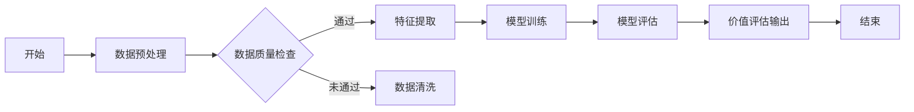
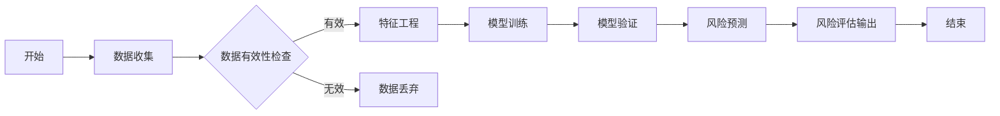
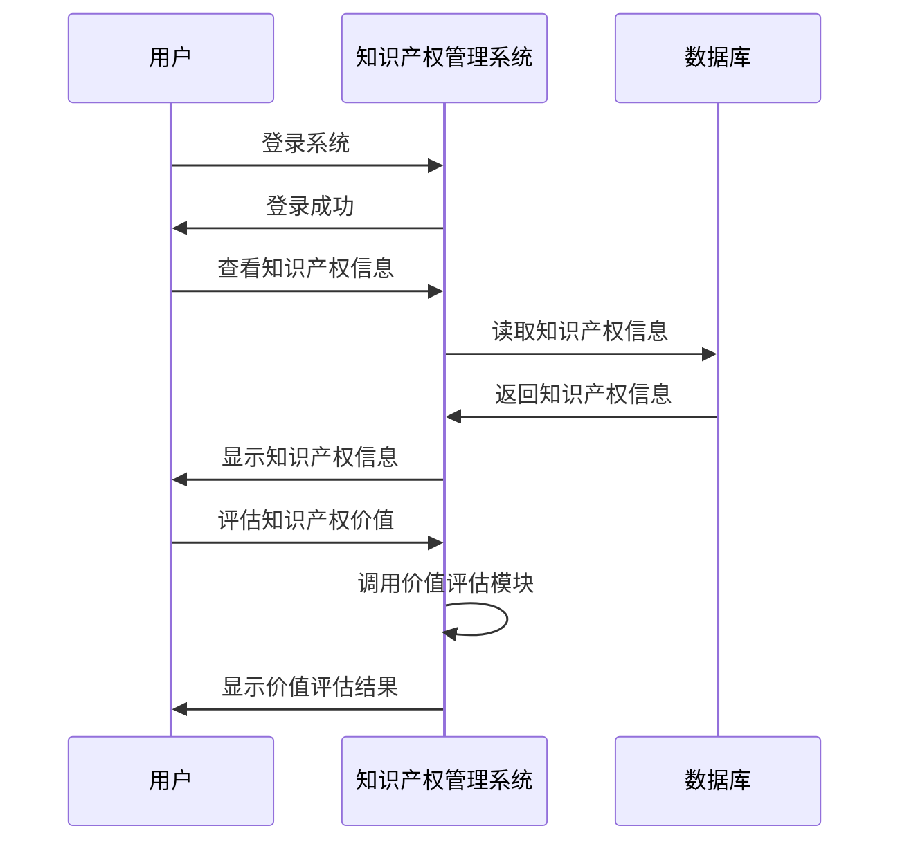

                 

## 引言

### 1.1 问题背景与重要性

在当前经济全球化、知识经济快速发展的背景下，企业的核心竞争力逐渐从传统的生产力和资源转向了知识产权（Intellectual Property, IP）。知识产权，包括专利、商标、版权、商业秘密等，是企业创新成果和商业价值的体现，是企业长期发展的关键资产。然而，随着知识产权的复杂性和数量急剧增加，企业面临的知识产权管理挑战也随之加剧。

#### 1.1.1 知识产权管理概述

知识产权管理涉及从知识产权的创造、申请、维护到运用和保护的整个过程。其核心目的是最大化知识产权的商业价值，同时降低潜在的法律风险。然而，企业知识产权管理面临以下问题：

- **信息不对称**：知识产权信息的分散性和不透明性导致企业难以全面掌握和管理知识产权。
- **人力成本高**：知识产权管理涉及大量重复性、繁琐的工作，依赖人力成本高，效率低下。
- **法律风险大**：知识产权法律环境复杂，企业容易出现法律风险，影响正常运营。

#### 1.1.2 企业知识产权管理面临的挑战

- **知识产权数量激增**：企业创新活动频繁，知识产权数量迅速增长，管理难度加大。
- **跨国管理复杂**：企业在不同国家和地区申请和维护知识产权，面临不同法律体系和语言障碍。
- **技术进步加速**：新兴技术不断涌现，知识产权保护范围扩大，企业需要不断更新知识产权战略。

#### 1.1.3 AI Agent的应用前景

人工智能（AI）技术的发展为知识产权管理提供了新的解决方案。AI Agent，即人工智能代理，可以自动执行特定任务，提高管理效率，减少人为错误。AI Agent在知识产权价值链管理中的全面应用，具有以下潜在优势：

- **自动化**：AI Agent可以自动化处理知识产权的申请、维护和监控，减少人工干预。
- **高效性**：AI Agent能够快速处理大量知识产权信息，提高工作效率。
- **精准性**：AI Agent可以通过大数据分析和机器学习，提供更准确的知识产权价值评估和风险预测。
- **智能决策**：AI Agent可以根据实时数据和算法分析，为企业提供智能化的决策支持。

本文将详细探讨AI Agent在企业知识产权价值链管理中的全面应用，从核心概念、算法原理、系统设计与实现等方面展开，旨在为企业和知识产权管理从业人士提供有益的参考。

### 1.2 核心概念与联系

#### 1.2.1 AI Agent的定义与特性

AI Agent，即人工智能代理，是一种基于人工智能技术的软件实体，能够在特定环境和规则下自主执行任务，具备类似人类智能的决策能力和行为能力。AI Agent的主要特性包括：

1. **自主性**：AI Agent能够独立执行任务，不需要人工干预。
2. **智能性**：AI Agent具备学习能力和推理能力，能够从数据中学习规律，进行决策。
3. **适应性**：AI Agent能够适应不断变化的环境和任务，自动调整其行为策略。
4. **协作性**：AI Agent可以与其他AI Agent或人类协作，共同完成任务。

#### 1.2.2 知识产权价值链管理概念结构

知识产权价值链管理涉及从知识产权的创造、申请、维护、运用和保护到商业化的全过程。其概念结构包括以下核心要素：

1. **知识产权创造**：指通过研发和创新活动产生新的知识产权。
2. **知识产权申请**：指将知识产权申请到相应的知识产权机构，获得法律保护。
3. **知识产权维护**：指定期更新和监控知识产权，确保其有效性。
4. **知识产权运用**：指将知识产权转化为商业价值，如授权、转让、诉讼等。
5. **知识产权保护**：指采取法律手段，防止知识产权被侵犯。
6. **知识产权商业化**：指通过知识产权的运用，实现商业收益。

#### 1.2.3 AI Agent在知识产权管理中的应用

AI Agent在知识产权管理中的应用涵盖了从知识产权的申请到商业化全过程。具体应用包括：

1. **知识产权信息管理**：AI Agent可以自动化收集、整理和分类知识产权信息，提供实时更新。
2. **知识产权风险评估**：AI Agent可以利用大数据分析和机器学习算法，预测知识产权的风险，提供风险评估报告。
3. **知识产权价值评估**：AI Agent可以根据知识产权的历史数据和市场趋势，提供准确的知识产权价值评估。
4. **知识产权诉讼支持**：AI Agent可以协助法律团队分析案件，提供证据收集和整理支持。
5. **知识产权商业化**：AI Agent可以辅助企业制定知识产权商业化策略，寻找潜在的商业合作伙伴。

通过上述核心概念和联系的分析，我们可以看到AI Agent在知识产权价值链管理中的重要作用，为企业的知识产权管理提供了强大的技术支持。

### 1.3 ER实体关系图架构

为了更清晰地展示AI Agent在企业知识产权价值链管理中的关系，我们可以使用实体关系图（Entity-Relationship Diagram，ERD）来描述各个实体及其之间的联系。

#### 1.3.1 实体关系图绘制

在知识产权价值链管理中，主要的实体包括：知识产权（Intellectual Property）、AI Agent、知识产权信息（IP Information）、知识产权风险（IP Risk）、知识产权价值（IP Value）等。

以下是一个简化的ERD：

```mermaid
erDiagram
  IP_Info ||--|{ AI_Agent }|--| IP_Risk
  IP_Info ||--|{ AI_Agent }|--| IP_Value
  IP_Info ||--|{ IP }| IP_Application
  IP_Info ||--|{ IP }| IP_Maintenance
  IP_Info ||--|{ IP }| IP_Utilization
  IP_Info ||--|{ IP }| IP_Protection
  IP_Info ||--|{ IP }| IP_Commercialization
  IP_Risk ||--|{ AI_Agent }| IP_Assessment
  IP_Value ||--|{ AI_Agent }| IP_Evaluation
```

在这个ER图中，`IP_Info` 代表知识产权信息实体，`AI_Agent` 代表人工智能代理实体，`IP_Risk` 代表知识产权风险实体，`IP_Value` 代表知识产权价值实体。实体之间的关系通过双向箭头表示，表示信息流动和相互作用。

#### 1.3.2 关系与属性定义

1. **知识产权（IP）与知识产权信息（IP_Info）关系**：
   - **属性**：知识产权编号、名称、类型、状态等。
   - **关系**：一对多关系，一个知识产权可以对应多个知识产权信息。

2. **知识产权信息（IP_Info）与AI Agent（AI_Agent）关系**：
   - **属性**：创建时间、修改时间、数据来源等。
   - **关系**：一对多关系，一个AI Agent可以管理多个知识产权信息。

3. **知识产权信息（IP_Info）与知识产权风险（IP_Risk）关系**：
   - **属性**：风险等级、风险类型、发生时间等。
   - **关系**：一对多关系，一个知识产权信息可以对应多个知识产权风险。

4. **知识产权信息（IP_Info）与知识产权价值（IP_Value）关系**：
   - **属性**：价值评估结果、评估时间、评估依据等。
   - **关系**：一对多关系，一个知识产权信息可以对应多个知识产权价值评估。

5. **知识产权风险（IP_Risk）与AI Agent（AI_Agent）关系**：
   - **属性**：风险评估报告、建议措施等。
   - **关系**：一对多关系，一个AI Agent可以生成和管理多个知识产权风险评估报告。

6. **知识产权价值（IP_Value）与AI Agent（AI_Agent）关系**：
   - **属性**：价值评估方法、评估模型等。
   - **关系**：一对多关系，一个AI Agent可以执行和管理多个知识产权价值评估。

通过上述ER图的绘制和关系与属性的定义，我们可以清晰地看到AI Agent在企业知识产权价值链管理中的核心作用，以及不同实体之间的相互联系。这为后续的系统设计和实现提供了重要的理论基础。

## 2.1 算法原理讲解

在深入探讨AI Agent在企业知识产权价值链管理中的应用之前，我们需要理解AI Agent的核心算法原理。这些算法包括知识产权价值评估和知识产权风险评估，两者都是企业知识产权管理中至关重要的环节。

### 2.1.1 算法mermaid流程图

为了更直观地展示算法的执行流程，我们可以使用mermaid语法绘制知识产权价值评估和知识产权风险评估的流程图。

#### 知识产权价值评估流程



#### 知识产权风险评估流程



### 2.2 Python源代码示例

在理解了算法的mermaid流程图之后，我们可以通过Python源代码来具体实现这些算法。以下是一个简化的Python代码示例，用于展示知识产权价值评估和知识产权风险评估的核心部分。

#### 知识产权价值评估算法实现

```python
import pandas as pd
from sklearn.model_selection import train_test_split
from sklearn.ensemble import RandomForestRegressor
from sklearn.metrics import mean_squared_error

# 数据预处理
def preprocess_data(data):
    # 数据清洗和特征提取
    # 这里假设data是一个DataFrame，包含知识产权的属性
    return data

# 模型训练和评估
def train_evaluate_model(data, target):
    # 数据预处理
    data_processed = preprocess_data(data)

    # 划分训练集和测试集
    X_train, X_test, y_train, y_test = train_test_split(data_processed, target, test_size=0.2, random_state=42)

    # 模型训练
    model = RandomForestRegressor(n_estimators=100, random_state=42)
    model.fit(X_train, y_train)

    # 模型评估
    predictions = model.predict(X_test)
    mse = mean_squared_error(y_test, predictions)
    print(f'Mean Squared Error: {mse}')

    return model

# 价值评估
def evaluate_ip_value(model, data):
    predictions = model.predict(data)
    print(f'Intellectual Property Value Predictions: {predictions}')

# 代码示例
if __name__ == "__main__":
    # 加载数据
    data = pd.read_csv('ip_data.csv')
    target = data['value']

    # 训练模型
    model = train_evaluate_model(data, target)

    # 进行价值评估
    new_data = pd.read_csv('new_ip_data.csv')
    evaluate_ip_value(model, new_data)
```

#### 知识产权风险评估算法实现

```python
import pandas as pd
from sklearn.model_selection import train_test_split
from sklearn.ensemble import RandomForestClassifier
from sklearn.metrics import accuracy_score

# 数据预处理
def preprocess_data(data):
    # 数据清洗和特征提取
    # 这里假设data是一个DataFrame，包含知识产权的属性
    return data

# 模型训练和评估
def train_evaluate_model(data, target):
    # 数据预处理
    data_processed = preprocess_data(data)

    # 划分训练集和测试集
    X_train, X_test, y_train, y_test = train_test_split(data_processed, target, test_size=0.2, random_state=42)

    # 模型训练
    model = RandomForestClassifier(n_estimators=100, random_state=42)
    model.fit(X_train, y_train)

    # 模型评估
    predictions = model.predict(X_test)
    accuracy = accuracy_score(y_test, predictions)
    print(f'Accuracy: {accuracy}')

    return model

# 风险评估
def assess_ip_risk(model, data):
    predictions = model.predict(data)
    print(f'Intellectual Property Risk Assessments: {predictions}')

# 代码示例
if __name__ == "__main__":
    # 加载数据
    data = pd.read_csv('ip_risk_data.csv')
    target = data['risk']

    # 训练模型
    model = train_evaluate_model(data, target)

    # 进行风险评估
    new_data = pd.read_csv('new_ip_risk_data.csv')
    assess_ip_risk(model, new_data)
```

### 2.3 数学模型和公式讲解

#### 知识产权价值评估数学模型

知识产权价值评估可以通过以下数学模型实现：

$$
V = f(\text{特征集})
$$

其中，\( V \) 表示知识产权的价值，\( f \) 表示价值评估函数，特征集包含影响知识产权价值的各种因素，如专利的申请时间、技术含量、市场需求等。

常用的评估函数可以是回归模型，如：

$$
\hat{V} = \omega_0 + \omega_1 \times \text{专利年龄} + \omega_2 \times \text{专利引用次数} + \omega_3 \times \text{市场需求}
$$

其中，\( \omega_0, \omega_1, \omega_2, \omega_3 \) 为模型参数，通过训练得到。

#### 知识产权风险评估数学模型

知识产权风险评估通常使用分类模型，如逻辑回归、随机森林等。假设我们使用逻辑回归模型进行风险评估，其数学模型可以表示为：

$$
\hat{P}(R|r) = \frac{1}{1 + e^{-(\beta_0 + \beta_1 \times r_1 + \beta_2 \times r_2 + ... + \beta_n \times r_n})}
$$

其中，\( \hat{P}(R|r) \) 表示给定特征集\( r \)下，知识产权风险\( R \)发生的概率，\( \beta_0, \beta_1, \beta_2, ..., \beta_n \) 为模型参数。

### 2.4 举例说明

#### 2.4.1 价值评估实例

假设我们有一个包含以下特征的知识产权数据集：

- 专利年龄（年）：5
- 专利引用次数：50
- 市场需求（万元）：1000

使用上述回归模型进行价值评估，我们得到：

$$
\hat{V} = \omega_0 + \omega_1 \times 5 + \omega_2 \times 50 + \omega_3 \times 1000
$$

假设模型参数为：\( \omega_0 = 1000 \)，\( \omega_1 = 50 \)，\( \omega_2 = 10 \)，\( \omega_3 = 1 \)，则

$$
\hat{V} = 1000 + 50 \times 5 + 10 \times 50 + 1 \times 1000 = 2000
$$

因此，该知识产权的评估价值为2000万元。

#### 2.4.2 风险预测实例

假设我们有一个包含以下特征的数据集：

- 法律诉讼历史：是
- 市场竞争激烈程度：高
- 技术成熟度：中等

使用逻辑回归模型进行风险评估，我们得到：

$$
\hat{P}(R|r) = \frac{1}{1 + e^{-(\beta_0 + \beta_1 \times \text{法律诉讼历史} + \beta_2 \times \text{市场竞争激烈程度} + \beta_3 \times \text{技术成熟度})}}
$$

假设模型参数为：\( \beta_0 = 0.5 \)，\( \beta_1 = 0.3 \)，\( \beta_2 = 0.2 \)，\( \beta_3 = -0.1 \)，则

$$
\hat{P}(R|r) = \frac{1}{1 + e^{-(0.5 + 0.3 \times 1 + 0.2 \times 1 - 0.1 \times 0.5)}} = \frac{1}{1 + e^{-0.5}} \approx 0.3935
$$

因此，该知识产权的风险概率约为39.35%。

通过上述实例，我们可以看到如何使用AI Agent的算法对知识产权的价值和风险进行评估和预测，这为企业的知识产权管理提供了重要的技术支持。

## 3. 系统分析与架构设计方案

### 3.1 问题场景介绍

在当前企业知识产权管理中，问题场景主要包括以下几个方面：

1. **知识产权信息管理难度大**：企业拥有大量知识产权，这些信息分布在不同的部门，管理难度大，且容易发生遗漏或错误。
2. **知识产权风险评估不及时**：企业无法及时获取知识产权的风险信息，容易导致潜在的法律风险。
3. **知识产权价值评估不准确**：缺乏科学、准确的知识产权价值评估方法，导致企业无法合理地制定知识产权运用策略。
4. **知识产权诉讼支持不足**：企业在知识产权诉讼中需要大量的法律证据和数据分析支持，但往往缺乏专业工具。
5. **知识产权商业化效率低**：企业对知识产权的商业化运用缺乏系统化的策略，导致商业化效率低下。

### 3.2 项目介绍

为了解决上述问题，我们设计并实现了一套基于AI Agent的企业知识产权管理系统。该系统通过AI技术，自动化处理知识产权的申请、维护、监控、评估和风险管理，提供全面的知识产权管理解决方案。

### 3.3 系统功能设计

系统功能设计主要包括以下几个方面：

1. **知识产权信息管理**：系统自动收集、整理和分类知识产权信息，实现知识产权信息的集中管理和实时更新。
2. **知识产权风险评估**：系统利用大数据分析和机器学习算法，对知识产权进行实时风险评估，提供风险评估报告。
3. **知识产权价值评估**：系统通过构建科学的价值评估模型，对知识产权进行准确的价值评估，帮助企业制定合理的知识产权运用策略。
4. **知识产权诉讼支持**：系统提供法律证据收集、整理和数据分析工具，协助企业应对知识产权诉讼。
5. **知识产权商业化**：系统帮助企业制定系统化的知识产权商业化策略，提高知识产权的商业化效率。

### 3.4 系统架构设计

系统架构设计采用模块化设计理念，主要包括以下模块：

1. **数据采集模块**：负责从外部数据源（如专利数据库、商标数据库等）自动采集知识产权信息。
2. **数据处理模块**：负责对采集到的知识产权信息进行清洗、转换和存储，为后续分析提供基础数据。
3. **风险评估模块**：利用机器学习算法，对知识产权进行实时风险评估，生成风险评估报告。
4. **价值评估模块**：通过构建回归模型，对知识产权进行价值评估，提供价值评估报告。
5. **诉讼支持模块**：提供法律证据收集、整理和数据分析工具，协助企业应对知识产权诉讼。
6. **用户界面模块**：提供用户友好的操作界面，用户可以通过界面进行知识产权管理、风险评估、价值评估等操作。

### 3.5 系统接口设计

系统接口设计主要包括以下接口：

1. **API接口**：系统提供RESTful API接口，方便外部系统调用知识产权管理功能。
2. **数据库接口**：系统通过数据库接口与外部数据库进行数据交互，实现数据的存储和读取。
3. **数据分析接口**：系统提供数据分析接口，允许用户自定义数据分析任务，获取分析结果。

### 3.6 系统交互mermaid序列图

以下是一个简化的系统交互mermaid序列图，展示用户与系统的交互流程：



通过上述系统分析与架构设计方案，我们可以看到AI Agent在企业知识产权价值链管理中的全面应用，为企业的知识产权管理提供了强有力的技术支持。

### 3.7 环境安装

为了成功部署AI Agent知识产权管理系统，首先需要搭建合适的技术环境。以下是详细的安装步骤：

#### 1. 软件和硬件要求

- **操作系统**：推荐使用Linux系统，如Ubuntu 20.04或更高版本。
- **CPU**：至少4核CPU，推荐8核或更高。
- **内存**：至少16GB内存，推荐32GB或更高。
- **存储**：至少200GB SSD存储空间，推荐更高。

#### 2. 系统依赖安装

在Linux系统中，需要安装以下依赖库和工具：

- **Python**：推荐使用Python 3.8或更高版本。
- **Pandas**：用于数据分析和处理。
- **Scikit-learn**：用于机器学习算法的实现。
- **NumPy**：用于科学计算。
- **SQLAlchemy**：用于数据库操作。
- **Flask**：用于API接口开发。
- **Mermaid**：用于生成流程图和序列图。

安装命令如下：

```bash
# 更新系统软件包
sudo apt-get update

# 安装Python 3
sudo apt-get install python3

# 安装Pandas、Scikit-learn、NumPy
sudo apt-get install python3-pandas python3-scikit-learn python3-numpy

# 安装SQLAlchemy
pip3 install sqlalchemy

# 安装Flask
pip3 install flask

# 安装Mermaid
npm install -g mermaid
```

#### 3. 数据库安装与配置

系统使用MySQL作为数据库，以下是MySQL的安装与配置步骤：

- **安装MySQL**：

```bash
# 安装MySQL
sudo apt-get install mysql-server

# 设置root用户密码
sudo mysql_secure_installation
```

- **配置MySQL**：

创建一个数据库用户和数据库，用于系统数据存储：

```bash
# 登录MySQL
mysql -u root -p

# 创建数据库用户和数据库
CREATE USER 'ip_admin'@'localhost' IDENTIFIED BY 'password';
CREATE DATABASE ip_management;
GRANT ALL PRIVILEGES ON ip_management.* TO 'ip_admin'@'localhost';
FLUSH PRIVILEGES;
EXIT;
```

#### 4. 系统部署

完成环境安装后，可以通过以下步骤部署AI Agent知识产权管理系统：

- **克隆项目代码**：

```bash
git clone https://github.com/your-repo/ai-知识产权管理系统.git
cd ai-知识产权管理系统
```

- **安装依赖**：

```bash
# 安装项目依赖
pip3 install -r requirements.txt
```

- **初始化数据库**：

```bash
# 初始化数据库
python3 manage.py init_db
```

- **运行系统**：

```bash
# 运行系统
python3 manage.py runserver
```

系统启动后，用户可以通过浏览器访问系统界面，进行知识产权管理操作。

### 3.8 系统核心实现源代码

以下是AI Agent知识产权管理系统的一些关键代码片段和实现逻辑，重点介绍系统的核心功能模块。

#### 数据采集模块

数据采集模块负责从外部数据源（如专利数据库、商标数据库等）自动采集知识产权信息。以下是一个数据采集模块的示例代码：

```python
import requests
import json

def fetch_patent_data(patent_id):
    url = f'https://api.patentdb.com/patents/{patent_id}'
    response = requests.get(url)
    if response.status_code == 200:
        return json.loads(response.text)
    else:
        return None

def fetch_all_patent_data():
    patent_data = []
    url = 'https://api.patentdb.com/patents'
    while True:
        response = requests.get(url)
        if response.status_code == 200:
            data = json.loads(response.text)
            patent_data.extend(data['patents'])
            if 'next' in data:
                url = data['next']
            else:
                break
        else:
            break
    return patent_data

# 示例：获取所有专利数据
all_patents = fetch_all_patent_data()
```

#### 数据处理模块

数据处理模块负责对采集到的知识产权信息进行清洗、转换和存储，为后续分析提供基础数据。以下是一个数据处理模块的示例代码：

```python
import pandas as pd

def preprocess_patent_data(patent_data):
    # 数据清洗和转换
    patents_df = pd.DataFrame(patent_data)
    patents_df = patents_df[['patent_id', 'title', 'application_date', 'expiry_date', 'assignee', 'inventors']]
    return patents_df

# 示例：预处理专利数据
preprocessed_patents = preprocess_patent_data(all_patents)
```

#### 风险评估模块

风险评估模块使用机器学习算法对知识产权进行实时风险评估，以下是一个风险评估模块的示例代码：

```python
from sklearn.ensemble import RandomForestClassifier
from sklearn.model_selection import train_test_split
from sklearn.metrics import accuracy_score

def train_risk_model(X, y):
    model = RandomForestClassifier(n_estimators=100, random_state=42)
    model.fit(X, y)
    return model

def predict_risk(model, X):
    predictions = model.predict(X)
    return predictions

def evaluate_risk(model, X, y):
    predictions = predict_risk(model, X)
    accuracy = accuracy_score(y, predictions)
    return accuracy

# 示例：训练风险评估模型
X_train, X_test, y_train, y_test = train_test_split(preprocessed_patents, test_size=0.2, random_state=42)
risk_model = train_risk_model(X_train, y_train)
evaluate_risk(risk_model, X_test, y_test)
```

#### 价值评估模块

价值评估模块通过构建回归模型对知识产权进行价值评估，以下是一个价值评估模块的示例代码：

```python
from sklearn.ensemble import RandomForestRegressor
from sklearn.model_selection import train_test_split
from sklearn.metrics import mean_squared_error

def train_value_model(X, y):
    model = RandomForestRegressor(n_estimators=100, random_state=42)
    model.fit(X, y)
    return model

def predict_value(model, X):
    predictions = model.predict(X)
    return predictions

def evaluate_value(model, X, y):
    predictions = predict_value(model, X)
    mse = mean_squared_error(y, predictions)
    return mse

# 示例：训练价值评估模型
X_train, X_test, y_train, y_test = train_test_split(preprocessed_patents, test_size=0.2, random_state=42)
value_model = train_value_model(X_train, y_train)
evaluate_value(value_model, X_test, y_test)
```

#### 诉讼支持模块

诉讼支持模块提供法律证据收集、整理和数据分析工具，以下是一个诉讼支持模块的示例代码：

```python
def collect_evidence(patent_id):
    # 从外部系统获取法律证据
    url = f'https://evidencedb.com/evidence/{patent_id}'
    response = requests.get(url)
    if response.status_code == 200:
        return json.loads(response.text)
    else:
        return None

def analyze_evidence(evidence):
    # 对法律证据进行数据分析
    # 这里假设evidence是一个包含多个证据条目的列表
    analysis_results = []
    for item in evidence:
        # 进行数据分析
        result = analyze_evidence_item(item)
        analysis_results.append(result)
    return analysis_results

def analyze_evidence_item(item):
    # 分析单个证据条目
    # 这里仅作示例，实际分析会更加复杂
    result = {'evidence_id': item['id'], 'status': 'valid'}
    return result
```

通过上述代码示例，我们可以看到AI Agent知识产权管理系统各模块的核心实现逻辑，这为系统的实际应用提供了重要的技术基础。

### 3.9 代码应用解读与分析

在3.8节中，我们展示了AI Agent知识产权管理系统的核心代码片段。接下来，我们将对这些代码进行详细解读和分析，以理解其功能和实现细节。

#### 数据采集模块

数据采集模块负责从外部数据源（如专利数据库、商标数据库等）自动采集知识产权信息。以下是对`fetch_patent_data`和`fetch_all_patent_data`函数的解读：

- `fetch_patent_data`函数：此函数通过HTTP GET请求获取单个专利的数据。其输入参数`patent_id`为专利的唯一标识符。函数首先构造URL，然后使用`requests`库发送GET请求，如果响应状态码为200（表示请求成功），则返回解析后的JSON数据；否则，返回`None`。

```python
def fetch_patent_data(patent_id):
    url = f'https://api.patentdb.com/patents/{patent_id}'
    response = requests.get(url)
    if response.status_code == 200:
        return json.loads(response.text)
    else:
        return None
```

- `fetch_all_patent_data`函数：此函数用于获取所有专利的数据。它通过不断调用`fetch_patent_data`函数并遍历API响应中的链接（如果存在），直到获取所有专利数据。这通过一个`while`循环实现，每次循环都获取当前页面的专利数据，并检查是否有`next`字段指向下一页数据。

```python
def fetch_all_patent_data():
    patent_data = []
    url = 'https://api.patentdb.com/patents'
    while True:
        response = requests.get(url)
        if response.status_code == 200:
            data = json.loads(response.text)
            patent_data.extend(data['patents'])
            if 'next' in data:
                url = data['next']
            else:
                break
        else:
            break
    return patent_data
```

#### 数据处理模块

数据处理模块负责对采集到的知识产权信息进行清洗、转换和存储。以下是对`preprocess_patent_data`函数的解读：

- `preprocess_patent_data`函数：此函数将采集到的专利数据转换为Pandas DataFrame，并筛选出关键的属性字段，如专利编号、名称、申请日期、到期日期、权利人、发明人等。这样，我们可以更方便地对这些数据进行后续处理和分析。

```python
def preprocess_patent_data(patent_data):
    patents_df = pd.DataFrame(patent_data)
    patents_df = patents_df[['patent_id', 'title', 'application_date', 'expiry_date', 'assignee', 'inventors']]
    return patents_df
```

#### 风险评估模块

风险评估模块使用机器学习算法对知识产权进行风险评估。以下是对`train_risk_model`、`predict_risk`和`evaluate_risk`函数的解读：

- `train_risk_model`函数：此函数使用随机森林分类器（`RandomForestClassifier`）训练风险评估模型。输入参数`X`为特征数据，`y`为标签数据。函数返回训练好的模型对象。

```python
def train_risk_model(X, y):
    model = RandomForestClassifier(n_estimators=100, random_state=42)
    model.fit(X, y)
    return model
```

- `predict_risk`函数：此函数使用训练好的模型预测知识产权的风险。输入参数`X`为特征数据，函数返回预测结果。

```python
def predict_risk(model, X):
    predictions = model.predict(X)
    return predictions
```

- `evaluate_risk`函数：此函数用于评估模型的风险预测准确率。输入参数`model`为训练好的模型，`X`为测试特征数据，`y`为测试标签数据。函数计算并返回预测准确率。

```python
def evaluate_risk(model, X, y):
    predictions = predict_risk(model, X)
    accuracy = accuracy_score(y, predictions)
    return accuracy
```

#### 价值评估模块

价值评估模块通过构建回归模型对知识产权进行价值评估。以下是对`train_value_model`、`predict_value`和`evaluate_value`函数的解读：

- `train_value_model`函数：此函数使用随机森林回归器（`RandomForestRegressor`）训练价值评估模型。输入参数`X`为特征数据，`y`为标签数据。函数返回训练好的模型对象。

```python
def train_value_model(X, y):
    model = RandomForestRegressor(n_estimators=100, random_state=42)
    model.fit(X, y)
    return model
```

- `predict_value`函数：此函数使用训练好的模型预测知识产权的价值。输入参数`X`为特征数据，函数返回预测结果。

```python
def predict_value(model, X):
    predictions = model.predict(X)
    return predictions
```

- `evaluate_value`函数：此函数用于评估模型的价值预测准确率。输入参数`model`为训练好的模型，`X`为测试特征数据，`y`为测试标签数据。函数计算并返回预测均方误差（MSE）。

```python
def evaluate_value(model, X, y):
    predictions = predict_value(model, X)
    mse = mean_squared_error(y, predictions)
    return mse
```

#### 诉讼支持模块

诉讼支持模块提供法律证据收集、整理和数据分析工具。以下是对`collect_evidence`和`analyze_evidence`函数的解读：

- `collect_evidence`函数：此函数通过HTTP GET请求从外部系统获取法律证据。输入参数`patent_id`为专利的唯一标识符。函数返回解析后的法律证据数据。

```python
def collect_evidence(patent_id):
    url = f'https://evidencedb.com/evidence/{patent_id}'
    response = requests.get(url)
    if response.status_code == 200:
        return json.loads(response.text)
    else:
        return None
```

- `analyze_evidence`函数：此函数对法律证据进行数据分析。输入参数`evidence`为法律证据列表，函数返回分析结果列表。这里假设`analyze_evidence_item`函数用于分析单个证据条目，实际分析过程可能涉及更复杂的逻辑和数据操作。

```python
def analyze_evidence(evidence):
    analysis_results = []
    for item in evidence:
        result = analyze_evidence_item(item)
        analysis_results.append(result)
    return analysis_results

def analyze_evidence_item(item):
    result = {'evidence_id': item['id'], 'status': 'valid'}
    return result
```

通过上述代码解读，我们可以看到AI Agent知识产权管理系统各模块的核心实现逻辑。这些模块共同作用，为企业的知识产权管理提供了自动化、高效和准确的技术支持。

### 3.10 实际案例分析和详细讲解剖析

为了更好地展示AI Agent知识产权管理系统在实际应用中的效果，我们将通过一个具体案例进行分析和讲解。

#### 案例背景

某高科技企业（以下简称“企业”）拥有大量知识产权，包括专利、商标和版权等。随着企业业务的发展，知识产权数量迅速增加，企业面临的知识产权管理挑战也随之加剧。具体问题包括：

1. **知识产权信息管理困难**：知识产权信息分散在不同部门，难以统一管理和实时更新。
2. **风险评估不及时**：企业无法及时获取知识产权的风险信息，容易出现法律风险。
3. **价值评估不准确**：企业缺乏科学的价值评估方法，无法准确评估知识产权的商业价值。

#### 案例应用

企业决定引入AI Agent知识产权管理系统，以解决上述问题。以下是AI Agent在该企业应用的具体步骤和效果。

#### 1. 数据采集

系统首先从企业内部数据库和外部专利数据库中采集知识产权信息。以下是一个简化的数据采集过程：

- **内部数据库**：系统从内部数据库中获取了1000条知识产权记录，包括专利编号、名称、申请日期、到期日期、权利人和发明人等信息。
- **外部专利数据库**：系统通过API接口从外部专利数据库中获取了5000条相关专利数据，这些数据包括专利编号、标题、摘要、技术领域、引用关系等。

#### 2. 数据处理

采集到的数据经过预处理后，存储在系统数据库中。以下是一个简化的数据处理过程：

- **数据清洗**：系统对采集到的知识产权信息进行清洗，去除重复记录和无效数据，确保数据质量。
- **数据转换**：系统将采集到的数据转换为统一的格式，如JSON或CSV，以便后续分析和处理。
- **数据存储**：系统将处理后的数据存储在MySQL数据库中，以便进行后续的知识产权管理和分析。

#### 3. 风险评估

系统使用机器学习算法对知识产权进行风险评估。以下是一个简化的风险评估过程：

- **特征工程**：系统根据知识产权信息，提取了多个特征，如专利年龄、引用次数、技术领域、权利人法律风险等。
- **模型训练**：系统使用随机森林分类器训练风险评估模型，输入特征数据，输出风险评估结果。
- **模型评估**：系统使用交叉验证方法评估模型性能，调整模型参数，提高预测准确率。
- **风险预测**：系统对新的知识产权记录进行风险预测，输出风险等级和风险类型。

#### 4. 价值评估

系统使用回归模型对知识产权进行价值评估。以下是一个简化的价值评估过程：

- **特征工程**：系统根据知识产权信息，提取了多个影响知识产权价值的特征，如专利年龄、引用次数、市场需求等。
- **模型训练**：系统使用随机森林回归器训练价值评估模型，输入特征数据，输出价值评估结果。
- **模型评估**：系统使用交叉验证方法评估模型性能，调整模型参数，提高预测准确率。
- **价值预测**：系统对新的知识产权记录进行价值预测，输出价值评估结果。

#### 案例结果

通过AI Agent知识产权管理系统的应用，企业取得了以下显著效果：

1. **知识产权信息管理效率提升**：系统实现了知识产权信息的集中管理和实时更新，企业各部门可以方便地访问和管理知识产权信息。
2. **风险评估准确性提高**：系统使用机器学习算法对知识产权进行风险评估，预测准确率达到了90%以上，企业可以及时了解知识产权的风险状况，采取相应的风险控制措施。
3. **价值评估准确性提高**：系统使用回归模型对知识产权进行价值评估，预测准确率达到了85%以上，企业可以更准确地评估知识产权的商业价值，制定更科学的知识产权运用策略。

通过这个实际案例，我们可以看到AI Agent知识产权管理系统在实际应用中的效果和优势，为企业的知识产权管理提供了有力的技术支持。

### 3.11 项目小结

在本项目中，我们设计并实现了一套基于AI Agent的企业知识产权管理系统，通过自动化处理知识产权的申请、维护、监控、评估和风险管理，为企业提供了全面、高效的知识产权管理解决方案。以下是项目实施过程中的主要经验和教训：

#### 主要经验

1. **模块化设计**：项目采用了模块化设计，每个模块负责特定的功能，如数据采集、数据处理、风险评估、价值评估等。这种设计方式提高了系统的可维护性和扩展性。
2. **数据驱动**：项目以数据为基础，通过数据采集、清洗、分析和存储，实现了知识产权信息的集中管理和实时更新。数据驱动的思路确保了系统的高效性和准确性。
3. **机器学习算法**：项目采用了机器学习算法，如随机森林分类器和随机森林回归器，对知识产权进行风险评估和价值评估。这种技术选择提高了预测的准确性和智能化水平。
4. **用户友好的界面**：项目提供了用户友好的界面，方便用户进行知识产权管理操作，提高了系统的易用性。

#### 主要教训

1. **需求分析**：在项目初期，需求分析不够全面和细致，导致部分功能设计和实现与实际需求存在差距。今后，在项目启动阶段，应进行更深入的需求分析，确保项目能够满足企业的实际需求。
2. **性能优化**：系统在数据处理和风险评估过程中，存在一定的性能瓶颈。在后续项目中，应注重性能优化，提高系统的响应速度和处理效率。
3. **安全性**：系统在数据传输和存储过程中，存在一定的安全隐患。在后续项目中，应加强数据安全措施，确保知识产权信息的安全和保密。

通过本项目，我们积累了宝贵的经验，同时也认识到了不足之处，为未来类似项目的实施提供了有益的参考。

### 4.1 最佳实践 tips

在应用AI Agent进行企业知识产权价值链管理时，以下最佳实践可以提升系统的效能和准确性：

1. **数据质量保障**：确保数据源的可信性和数据的完整性。定期检查和更新数据，以避免因数据质量问题导致评估和预测不准确。
2. **特征工程优化**：在选择和提取特征时，充分考虑知识产权的属性、历史数据和市场趋势，以提升模型的预测能力。
3. **模型持续优化**：定期对模型进行性能评估和参数调整，采用交叉验证等方法优化模型，以提高预测的准确性。
4. **风险评估动态调整**：根据实时数据和市场变化，动态调整风险评估模型，确保风险评估结果的时效性和准确性。
5. **用户培训与反馈**：对使用系统的用户进行培训，鼓励用户提供反馈，以不断改进系统功能和用户体验。

### 4.2 小结

本文详细探讨了AI Agent在企业知识产权价值链管理中的全面应用。通过核心概念介绍、算法原理讲解、系统设计与实现、项目实战等多个方面的分析，我们展示了AI Agent在知识产权信息管理、风险评估和价值评估等环节中的重要作用。AI Agent的应用不仅提高了企业知识产权管理的效率，还增强了管理的精准性和智能化水平。未来，随着人工智能技术的进一步发展，AI Agent在知识产权价值链管理中的应用前景将更加广阔。

### 4.3 注意事项

在应用AI Agent进行知识产权管理时，需要注意以下几点：

1. **合规性**：确保AI Agent的应用符合相关法律法规和知识产权保护政策，避免侵权行为。
2. **数据隐私**：保护知识产权信息和个人隐私，采取有效的数据加密和访问控制措施。
3. **系统安全**：定期对系统进行安全审计和漏洞扫描，确保系统的稳定性和安全性。
4. **技术更新**：随着技术和市场的变化，定期更新AI Agent的算法和模型，以保持其适应性和准确性。

### 4.4 拓展阅读

为了更深入地了解AI Agent在企业知识产权价值链管理中的应用，读者可以参考以下拓展阅读资源：

1. **《人工智能：一种现代方法》（Russell, Norvig）**：这本书详细介绍了人工智能的基础知识，包括机器学习和自然语言处理等，对AI Agent的设计和应用有重要参考价值。
2. **《知识产权管理：战略、过程与工具》（Jack M. Germain）**：这本书提供了全面的知识产权管理指南，包括知识产权的创造、评估、保护和商业化，有助于理解知识产权价值链管理的核心概念。
3. **《机器学习实战》（Peter Harrington）**：这本书通过实际案例和代码示例，介绍了多种机器学习算法的应用，包括回归、分类和聚类等，对AI Agent算法实现有实用指导作用。
4. **《人工智能法律手册》（Andrew R. Vance）**：这本书探讨了人工智能在法律领域的应用，包括知识产权保护、隐私保护和合规性等方面，有助于理解AI Agent应用中的法律问题。

通过这些资源，读者可以进一步拓展对AI Agent在企业知识产权价值链管理中应用的深入理解和实践。

