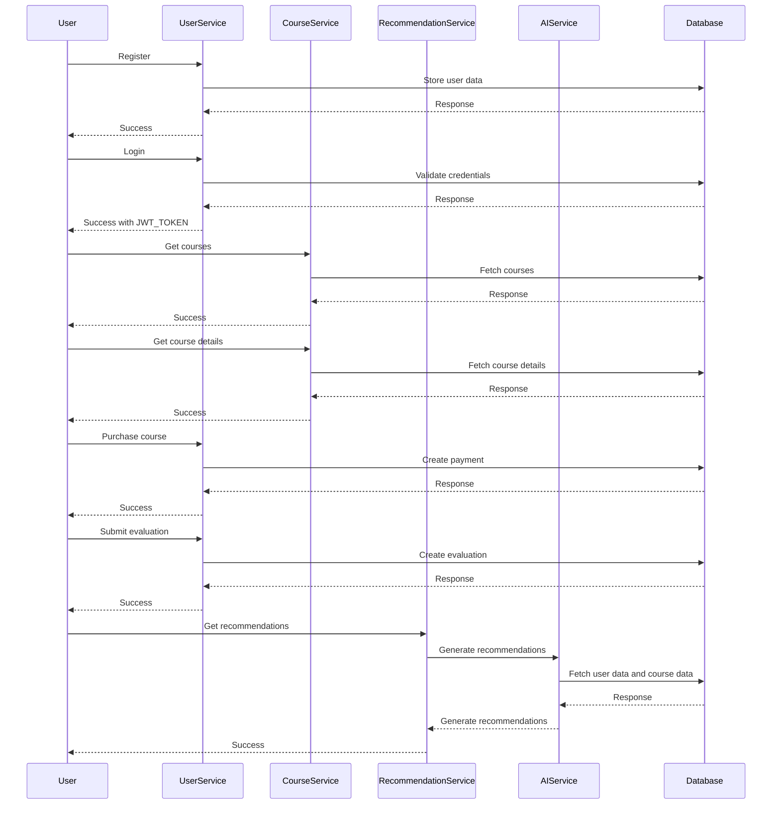

                 

### 1. 设计目录大纲

**# 第一部分: 背景介绍**

## 1.1 问题背景

### 1.1.1 知识付费与在线教育的发展

知识付费与在线教育作为现代信息社会的产物，近年来得到了迅猛的发展。知识付费，即用户通过支付一定费用获取知识内容的服务模式，代表了知识经济时代的一个新趋势。在线教育，则是利用互联网技术进行教育和学习活动的平台，它不仅打破了时间和空间的限制，也为知识传播提供了新的途径。

知识付费的兴起可以追溯到移动互联网和智能手机的普及，使得用户获取知识变得更加便捷。同时，随着教育内容的多元化以及用户需求的个性化，知识付费市场迅速扩大。从最初的在线课程、电子书籍，到现在的直播课程、社群学习等多种形式，知识付费的内容和形式日益丰富。

在线教育方面，随着互联网技术的发展，尤其是5G和人工智能技术的应用，在线教育的质量和用户体验得到了显著提升。线上教学平台如雨后春笋般涌现，越来越多的学校和培训机构开始利用在线教育平台进行教学活动，这大大提高了教育的普及率和效率。

### 1.1.2 企业在知识付费与在线教育中的角色

在企业领域，知识付费与在线教育扮演着不可或缺的角色。企业不仅是知识付费的主要需求方，也是内容提供方。一方面，企业需要通过知识付费来提升员工的专业技能和综合素质，从而增强企业的竞争力和创新能力。另一方面，企业也通过开发和提供高质量的在线教育课程来扩大影响力，打造企业品牌。

在线教育为企业提供了灵活的学习方式，使得员工可以根据自身时间安排进行学习，提高了学习效率和积极性。同时，在线教育平台也为企业提供了强大的数据分析工具，帮助企业了解员工的学习情况和需求，从而更好地制定培训策略。

### 1.1.3 AI Agent在知识付费与在线教育中的应用现状

AI Agent，即人工智能代理，是利用人工智能技术模拟人类智能行为的一种软件系统。在知识付费与在线教育领域，AI Agent的应用正逐渐成为一种趋势。AI Agent可以通过自然语言处理、机器学习等技术，提供个性化推荐、智能问答、自动批改等功能，大大提升知识付费和在线教育的体验和效果。

当前，AI Agent在知识付费中的应用主要体现在课程推荐、学习路径规划、智能问答等方面。通过分析用户的学习历史和偏好，AI Agent能够为用户提供个性化的课程推荐，提高学习效率。同时，AI Agent还可以根据用户的学习进度和反馈，动态调整学习计划，提供更加精准的学习支持。

在在线教育领域，AI Agent的应用则更为广泛。除了提供个性化学习支持外，AI Agent还可以辅助教师进行教学，如智能批改作业、自动评分等，减轻教师的工作负担。此外，AI Agent还可以通过自然语言处理技术，为学生提供实时问答支持，帮助学生解决学习中的困难。

## 1.2 问题描述

### 1.2.1 知识付费与在线教育中的挑战

尽管知识付费与在线教育具有巨大的发展潜力，但在实际应用中也面临着诸多挑战。

首先，知识付费市场中内容质量参差不齐，一些低质量课程的存在不仅影响了用户的付费意愿，也影响了知识付费市场的健康发展。如何确保知识付费内容的品质，提升用户满意度，是当前面临的一大挑战。

其次，在线教育中个性化学习需求的满足也是一个难题。虽然现有的在线教育平台已经尝试通过算法推荐等方式提供个性化学习服务，但如何更精准地了解用户需求，提供更加个性化的学习体验，仍有待进一步研究。

此外，在线教育的互动性和实时性也亟待提升。尽管视频直播、在线讨论等方式已经得到广泛应用，但如何进一步提高教学的互动性和实时性，使学习过程更加生动、有趣，仍是一个需要解决的问题。

### 1.2.2 AI Agent如何解决这些问题

AI Agent在知识付费与在线教育中的应用，有望解决上述挑战。首先，通过智能算法，AI Agent可以筛选和推荐高质量的知识内容，确保知识付费市场的健康发展。其次，AI Agent可以通过对用户行为数据的分析，深入了解用户的学习需求和偏好，提供更加个性化的学习服务。

在提高教学互动性和实时性方面，AI Agent可以发挥重要作用。例如，通过自然语言处理技术，AI Agent可以为用户提供实时问答支持，帮助学生在学习过程中及时解决问题。此外，AI Agent还可以通过模拟教师的教学行为，提供互动性更强的学习体验。

### 1.2.3 AI Agent在知识付费与在线教育中的潜在价值

AI Agent在知识付费与在线教育中的潜在价值主要体现在以下几个方面：

1. **提升学习效率**：通过个性化推荐和学习路径规划，AI Agent可以帮助用户快速找到适合自己的学习内容，提高学习效率。

2. **降低运营成本**：AI Agent可以自动批改作业、评分等，减轻教师的工作负担，降低企业运营成本。

3. **增强互动性**：AI Agent可以提供实时问答支持，提高教学的互动性和实时性，增强学生的学习体验。

4. **优化课程设计**：通过分析用户的学习数据和反馈，AI Agent可以帮助企业优化课程设计，提高课程质量和用户满意度。

5. **扩大市场影响力**：AI Agent可以帮助企业更好地了解用户需求，制定更加精准的市场策略，扩大市场影响力。

## 1.3 问题解决

### 1.3.1 AI Agent的基本原理

AI Agent的基本原理可以概括为以下几个方面：

1. **智能感知**：AI Agent通过感知用户的行为数据、学习记录等，获取用户的需求和状态信息。

2. **学习与推理**：AI Agent利用机器学习、深度学习等技术，对用户数据进行训练和学习，从而形成对用户需求的深入理解和预测能力。

3. **决策与行动**：基于对用户需求的预测和理解，AI Agent可以自动生成个性化的学习建议、推荐内容等，并通过自动化系统执行相应的行动。

4. **反馈与优化**：AI Agent会根据用户的行为反馈，不断调整和优化自己的推荐策略和行动方案，以提高用户满意度和学习效果。

### 1.3.2 AI Agent的关键技术

AI Agent的关键技术主要包括自然语言处理（NLP）、机器学习（ML）、深度学习（DL）等。

1. **自然语言处理**：NLP技术是AI Agent与用户进行交互的基础，通过文本挖掘、语义分析等技术，AI Agent可以理解用户的语言输入，提供相应的服务。

2. **机器学习**：ML技术是AI Agent进行数据分析和决策的核心，通过训练模型，AI Agent可以从用户数据中学习到用户的行为模式和需求。

3. **深度学习**：DL技术是AI Agent实现高精度预测和识别的重要手段，通过神经网络模型，AI Agent可以在复杂的任务中实现优异的性能。

### 1.3.3 AI Agent在知识付费与在线教育中的应用流程

AI Agent在知识付费与在线教育中的应用流程可以分为以下几个步骤：

1. **用户注册与数据收集**：用户在平台上注册，并提交个人信息和学习数据，AI Agent开始收集用户数据。

2. **用户需求分析**：AI Agent通过分析用户的学习历史、行为数据等，了解用户的学习需求和偏好。

3. **个性化推荐**：基于用户需求分析结果，AI Agent生成个性化的学习推荐，包括课程推荐、学习路径规划等。

4. **内容推荐与交互**：AI Agent将个性化推荐内容展示给用户，并支持用户与AI Agent的实时交互，如问答、批改作业等。

5. **用户反馈与优化**：用户对推荐内容进行评价和反馈，AI Agent根据用户反馈不断调整和优化推荐策略。

## 1.4 边界与外延

### 1.4.1 AI Agent的技术边界

AI Agent的技术边界主要包括以下几个方面：

1. **数据处理能力**：AI Agent需要具备强大的数据处理能力，以处理海量的用户数据和课程内容。

2. **算法精度**：AI Agent的算法模型需要具备高精度，以提供准确的个性化推荐和问答支持。

3. **实时性**：AI Agent需要具备实时性，能够快速响应用户的请求和反馈，提供及时的服务。

4. **鲁棒性**：AI Agent需要具备较强的鲁棒性，能够应对各种异常情况和数据噪声。

### 1.4.2 AI Agent的应用边界

AI Agent的应用边界主要包括以下几个方面：

1. **知识领域**：AI Agent需要针对特定的知识领域进行开发和优化，以满足特定领域的个性化需求。

2. **用户群体**：AI Agent需要根据不同的用户群体（如学生、职场人士等）进行定制化开发，以提供更加贴心的服务。

3. **交互方式**：AI Agent需要支持多种交互方式，如文本、语音等，以满足不同用户的需求。

### 1.4.3 AI Agent的发展趋势

AI Agent的发展趋势主要包括以下几个方面：

1. **智能化提升**：随着人工智能技术的不断进步，AI Agent的智能化水平将得到进一步提升，提供更加精准和高效的服务。

2. **跨平台应用**：AI Agent将逐渐跨平台应用，不仅限于在线教育领域，还可能应用于其他领域，如医疗、金融等。

3. **人机协作**：AI Agent将与人类教师、专家等实现更紧密的协作，提供更加全面和高质量的教育服务。

4. **开放生态**：AI Agent将构建开放生态，与其他系统和平台进行无缝集成，提供更加广泛和多样的服务。

## 1.5 概念结构与核心要素组成

### 1.5.1 知识付费与在线教育的基本概念

**知识付费**：知识付费是指用户通过支付一定费用获取知识内容的服务模式。它代表了知识经济时代的一种新型消费方式，推动了知识传播和学习的商业化。

**在线教育**：在线教育是指利用互联网技术进行教育和学习活动的平台。它打破了时间和空间的限制，为学习者提供了便捷的学习途径。

### 1.5.2 AI Agent的基本概念

**AI Agent**：AI Agent是指利用人工智能技术模拟人类智能行为的一种软件系统。它通过感知、学习、决策和行动，为用户提供个性化的服务。

### 1.5.3 知识付费与在线教育中的AI Agent结构

在知识付费与在线教育中，AI Agent的结构主要包括以下几个部分：

1. **用户模型**：用于描述用户的基本信息和行为数据。

2. **课程模型**：用于描述课程的基本信息和内容。

3. **推荐引擎**：用于根据用户模型和课程模型生成个性化的推荐结果。

4. **问答系统**：用于提供实时问答支持。

5. **反馈系统**：用于收集用户反馈，不断优化AI Agent的性能。

## 总结

通过对知识付费与在线教育背景的介绍，我们了解了这些领域的发展现状和面临的挑战。AI Agent作为一种新兴的人工智能技术，其在知识付费与在线教育中的应用为解决这些问题提供了新的思路和解决方案。在接下来的部分，我们将深入探讨AI Agent的核心概念、技术原理和应用流程，以期为读者提供更加全面和深入的认识。

---

### 2. 核心概念与联系

## 2.1 核心概念原理

在本部分，我们将详细探讨知识付费、在线教育和AI Agent这三个核心概念的基本原理，并分析它们之间的相互关系。

### 2.1.1 知识付费

知识付费是指用户通过支付一定费用获取知识内容的服务模式。这一模式的出现，源于人们对知识和技能的需求日益增长，同时伴随着互联网技术的发展和移动支付的普及。知识付费的核心理念是价值交换，即用户为获取高质量的知识内容支付费用，知识提供者则通过收费实现知识价值的变现。

知识付费的基本原理可以概括为以下几点：

1. **价值评估**：用户根据自身的需求和价值评估，选择付费获取的知识内容。

2. **交易过程**：用户通过支付平台完成支付过程，获取知识内容的使用权限。

3. **内容变现**：知识提供者通过提供高质量的知识内容，实现知识价值的变现。

4. **用户体验**：知识付费平台需要确保用户获取的知识内容具有实际价值，以提高用户的满意度和忠诚度。

### 2.1.2 在线教育

在线教育是指利用互联网技术进行教育和学习活动的平台。它打破了传统教育的时空限制，为学习者提供了更加灵活和便捷的学习方式。在线教育的核心原理包括：

1. **远程教学**：教师通过互联网进行远程授课，学生通过在线平台参与学习。

2. **资源共享**：在线教育平台提供了丰富的教学资源和工具，学生可以根据自身需求进行选择和学习。

3. **互动性**：在线教育平台支持师生之间的实时互动，提高了教学的互动性和效果。

4. **个性化学习**：在线教育平台通过算法分析，为学生提供个性化的学习推荐和路径规划。

5. **数据分析**：在线教育平台通过收集和分析学生的学习数据，为学生提供更加精准的学习支持。

### 2.1.3 AI Agent

AI Agent，即人工智能代理，是利用人工智能技术模拟人类智能行为的一种软件系统。AI Agent的核心原理包括：

1. **智能感知**：AI Agent通过感知用户的行为数据、学习记录等，获取用户的需求和状态信息。

2. **学习与推理**：AI Agent利用机器学习、深度学习等技术，对用户数据进行训练和学习，从而形成对用户需求的深入理解和预测能力。

3. **决策与行动**：基于对用户需求的预测和理解，AI Agent可以自动生成个性化的学习建议、推荐内容等，并通过自动化系统执行相应的行动。

4. **反馈与优化**：AI Agent会根据用户的行为反馈，不断调整和优化自己的推荐策略和行动方案，以提高用户满意度和学习效果。

### 2.2 概念属性特征对比表格

为了更清晰地理解知识付费、在线教育和AI Agent这三个核心概念，我们可以通过一个对比表格来展示它们的主要特征。

| 概念         | 特征1              | 特征2              | 特征3                |
|--------------|-------------------|-------------------|---------------------|
| 知识付费     | 价值交换          | 交易过程          | 内容变现            |
| 在线教育     | 远程教学          | 资源共享          | 互动性和个性化学习   |
| AI Agent     | 智能感知          | 学习与推理        | 决策与行动          |

### 2.3 ER实体关系图架构

为了进一步阐述知识付费、在线教育和AI Agent之间的关系，我们可以通过ER实体关系图来展示它们之间的联系。

```mermaid
erDiagram
    User ||--|{ Course }: "购买" {
        many
    }
    Course ||--|{ AI-Agent }: "推荐" {
        many
    }
    AI-Agent ||--|{ User }: "服务" {
        many
    }
```

在这个ER实体关系图中，User（用户）是知识付费的核心实体，Course（课程）是在线教育的主要内容，AI-Agent（AI代理）则是连接知识付费和在线教育的桥梁。用户通过购买课程参与在线教育，而AI代理则根据用户的行为和需求提供个性化推荐和服务。

### 总结

通过对知识付费、在线教育和AI Agent这三个核心概念的原理和相互关系的探讨，我们可以看到，AI Agent作为人工智能技术在知识付费与在线教育中的应用，不仅解决了传统教育模式中的一些痛点，也为未来教育的发展提供了新的方向。在接下来的部分，我们将深入探讨AI Agent的算法原理和具体应用流程，进一步揭示其在知识付费与在线教育中的巨大潜力。

---

### 3. 算法原理讲解

## 3.1 算法原理

在本节中，我们将详细讲解AI Agent在知识付费与在线教育中的算法原理，包括AI Agent的算法框架、关键模块和整体工作流程。

### 3.1.1 AI Agent的算法框架

AI Agent的算法框架可以分为四个主要模块：数据收集模块、用户模型构建模块、推荐算法模块和用户反馈处理模块。这四个模块相互协作，共同实现AI Agent的智能行为。

1. **数据收集模块**：该模块负责收集用户的各类数据，包括用户的基本信息、学习历史、行为数据、偏好数据等。这些数据来源可以是用户注册信息、学习平台日志、社交媒体互动等。

2. **用户模型构建模块**：该模块基于收集到的用户数据，利用机器学习和深度学习技术构建用户模型。用户模型包括用户的兴趣偏好、知识水平、学习习惯等多个维度，用于描述用户的需求和特征。

3. **推荐算法模块**：该模块是AI Agent的核心，负责根据用户模型生成个性化的推荐结果。常用的推荐算法包括基于内容的推荐、协同过滤推荐、混合推荐等。这些算法通过分析用户模型和课程内容，为用户推荐最合适的课程。

4. **用户反馈处理模块**：该模块负责收集用户的反馈数据，包括对推荐课程的评价、学习进度、满意度等。通过分析用户反馈，AI Agent可以不断优化推荐算法和用户模型，提高推荐质量和用户满意度。

### 3.1.2 算法的关键模块

以下是AI Agent算法中的关键模块及其功能：

1. **用户行为分析**：通过分析用户在平台上的浏览、搜索、购买等行为数据，AI Agent可以识别用户的兴趣点和需求变化。

2. **知识图谱构建**：AI Agent通过构建知识图谱，将课程内容与知识点进行关联，为推荐算法提供丰富的知识信息。

3. **协同过滤推荐**：基于用户的行为数据和课程评分数据，协同过滤推荐算法可以通过计算用户之间的相似度，为用户推荐相似用户喜欢的课程。

4. **基于内容的推荐**：该算法通过分析课程的内容特征，为具有相似兴趣的用户推荐内容相关的课程。

5. **混合推荐**：结合协同过滤和基于内容的推荐算法，混合推荐算法可以在保证推荐多样性的同时，提高推荐的相关性。

### 3.1.3 算法的工作流程

AI Agent在知识付费与在线教育中的工作流程如下：

1. **用户注册与数据收集**：用户在平台上注册，AI Agent开始收集用户的基本信息和行为数据。

2. **用户模型构建**：AI Agent利用机器学习技术，构建用户模型，描述用户的需求和特征。

3. **推荐算法运行**：基于用户模型和课程内容，推荐算法模块生成个性化的课程推荐结果。

4. **课程推荐与展示**：AI Agent将推荐结果展示给用户，用户可以浏览、选择和评价推荐课程。

5. **用户反馈收集**：AI Agent收集用户对推荐课程的评价和反馈，用于优化推荐算法和用户模型。

6. **反馈处理与优化**：AI Agent根据用户反馈，调整推荐策略和模型参数，提高推荐质量和用户满意度。

## 3.2 数学模型与公式

为了更好地理解AI Agent的算法原理，下面我们将介绍一些关键的数学模型和公式。

### 3.2.1 用户行为预测模型

用户行为预测模型通常使用时间序列分析方法，如ARIMA（自回归积分滑动平均模型）。公式如下：

$$
X_t = c + \phi_1 X_{t-1} + \phi_2 X_{t-2} + ... + \phi_p X_{t-p} + \theta_1 \epsilon_{t-1} + \theta_2 \epsilon_{t-2} + ... + \theta_q \epsilon_{t-q}
$$

其中，$X_t$表示第$t$时刻的用户行为数据，$c$是常数项，$\phi_1, \phi_2, ..., \phi_p$是自回归系数，$\theta_1, \theta_2, ..., \theta_q$是滑动平均系数，$\epsilon_{t-1}, \epsilon_{t-2}, ..., \epsilon_{t-q}$是误差项。

### 3.2.2 评分预测模型

在知识付费平台中，评分预测模型用于预测用户对课程的评分。常用的评分预测模型是矩阵分解模型，如ALS（交替最小二乘法）。公式如下：

$$
R_{ui} = \hat{R}_{ui} = \hat{q}_u^T \hat{r}_i
$$

其中，$R_{ui}$表示用户$u$对课程$i$的评分，$\hat{R}_{ui}$是预测评分，$\hat{q}_u$是用户$u$的特征向量，$\hat{r}_i$是课程$i$的特征向量。

### 3.2.3 用户兴趣模型

用户兴趣模型用于描述用户对各类课程的兴趣程度。常用的方法是使用因子分解机（Factorization Machine，FM）来建模用户兴趣。公式如下：

$$
f(u, i) = \sum_{j=1}^k \sum_{l=1}^k w_{j,l} x_{uj} x_{il}
$$

其中，$f(u, i)$是用户$u$对课程$i$的兴趣得分，$w_{j,l}$是因子权重，$x_{uj}$是用户$u$在第$j$个特征上的取值，$x_{il}$是课程$i$在第$l$个特征上的取值。

### 3.2.4 聚类模型

聚类模型用于将用户划分为不同的兴趣群体。常用的聚类算法是K-Means。公式如下：

$$
C_j = \{u | \min_{i \in I} \sum_{k=1}^K d(u, c_k) \}, \quad j=1,2,...,K
$$

其中，$C_j$是第$j$个聚类结果，$d(u, c_k)$是用户$u$与聚类中心$c_k$之间的距离。

## 3.3 举例说明

### 3.3.1 例子1

假设用户$u_1$在平台上浏览了课程$c_1, c_2, c_3$，并对它们进行了评分，评分分别为4、3和5。根据评分预测模型，我们可以预测用户$u_1$对课程$c_4$的评分。假设课程$c_4$的特征向量为$\hat{r}_4 = [0.2, 0.5, 0.3]$，用户$u_1$的特征向量为$\hat{q}_{u_1} = [0.4, 0.6, 0.5]$，则：

$$
\hat{R}_{u_1c_4} = \hat{q}_{u_1}^T \hat{r}_4 = 0.4 \times 0.2 + 0.6 \times 0.5 + 0.5 \times 0.3 = 0.08 + 0.30 + 0.15 = 0.53
$$

因此，预测用户$u_1$对课程$c_4$的评分为5.3分。

### 3.3.2 例子2

假设我们使用K-Means算法将用户划分为两个兴趣群体。现有用户$u_1, u_2, u_3, u_4, u_5$，他们的特征向量分别为：

$$
\hat{q}_{u_1} = [0.1, 0.2, 0.3], \quad \hat{q}_{u_2} = [0.3, 0.4, 0.5], \quad \hat{q}_{u_3} = [0.5, 0.6, 0.7], \quad \hat{q}_{u_4} = [0.7, 0.8, 0.9], \quad \hat{q}_{u_5} = [0.9, 0.1, 0.2]
$$

假设我们选择两个聚类中心$c_1 = [0.2, 0.3, 0.4]$和$c_2 = [0.6, 0.7, 0.8]$，则用户到聚类中心的距离计算如下：

$$
d(u_1, c_1) = \sqrt{(0.1 - 0.2)^2 + (0.2 - 0.3)^2 + (0.3 - 0.4)^2} = 0.062
$$

$$
d(u_1, c_2) = \sqrt{(0.1 - 0.6)^2 + (0.2 - 0.7)^2 + (0.3 - 0.8)^2} = 0.258
$$

由于$d(u_1, c_1) < d(u_1, c_2)$，因此用户$u_1$被划分到第一个兴趣群体。

通过类似计算，我们可以将所有用户划分为两个兴趣群体：

$$
C_1 = \{u_1, u_2, u_3\}, \quad C_2 = \{u_4, u_5\}
$$

### 3.3.3 例子3

假设我们使用因子分解机（FM）来建模用户兴趣。现有用户$u_1$和课程$c_1, c_2, c_3$，他们的特征向量分别为：

$$
\hat{q}_{u_1} = [0.1, 0.2], \quad \hat{r}_1 = [0.2, 0.3], \quad \hat{r}_2 = [0.4, 0.5], \quad \hat{r}_3 = [0.6, 0.7]
$$

假设我们选择两个因子$w_{1,1} = 0.2, w_{1,2} = 0.3, w_{2,1} = 0.4, w_{2,2} = 0.5$，则用户$u_1$对课程$c_1, c_2, c_3$的兴趣得分计算如下：

$$
f(u_1, c_1) = 0.2 \times 0.1 \times 0.2 + 0.3 \times 0.2 \times 0.3 = 0.0014
$$

$$
f(u_1, c_2) = 0.2 \times 0.1 \times 0.4 + 0.3 \times 0.2 \times 0.5 = 0.0018
$$

$$
f(u_1, c_3) = 0.2 \times 0.1 \times 0.6 + 0.3 \times 0.2 \times 0.7 = 0.0021
$$

根据兴趣得分，我们可以为用户$u_1$推荐课程$c_3$，因为$f(u_1, c_3)$是三者中最大的。

通过以上例子，我们可以看到AI Agent的算法原理和数学模型在实际应用中的具体操作。在接下来的部分，我们将进一步探讨AI Agent在知识付费与在线教育中的系统架构和设计方案。

---

### 4. 系统分析与架构设计方案

## 4.1 问题场景介绍

在企业知识付费与在线教育中，问题场景可以分为两个主要方面：企业内部培训和在线教育。

### 4.1.1 企业知识付费场景

在企业知识付费场景中，企业通过支付费用获取外部专业知识和技能培训，以提高员工的专业能力和工作效率。这通常涉及到以下几个方面：

1. **员工培训**：企业为员工提供各种专业课程和培训，涵盖技术、管理、技能等多个领域，以满足企业发展的需求。

2. **知识共享**：企业通过在线平台共享内部知识和经验，促进员工之间的学习和交流。

3. **绩效评估**：企业对员工的学习成果进行评估，以确定培训效果和员工的能力提升情况。

### 4.1.2 在线教育场景

在线教育场景则更加广泛，涉及学生、教师、教育机构等多个角色。以下是几个关键方面：

1. **课程开发**：教育机构或个人开发各种课程，涵盖从基础课程到专业课程，满足不同层次和领域的学习需求。

2. **学习互动**：学生与教师、同学之间的互动，包括讨论、问答、作业等，提高学习效果和积极性。

3. **数据分析**：平台对学生的学习行为、成绩、反馈等数据进行收集和分析，以优化课程设计和教学策略。

## 4.2 项目介绍

在本项目中，我们旨在构建一个集企业知识付费和在线教育为一体的综合平台。该项目的主要目标是：

1. **提高员工技能**：通过提供高质量的在线课程和培训，提升员工的专业能力和综合素质。

2. **优化学习体验**：利用AI Agent提供个性化的学习推荐和互动服务，提高学习效率和满意度。

3. **降低培训成本**：通过自动化和智能化的培训系统，降低企业培训成本，提高资源利用效率。

4. **增强知识传播**：构建一个开放的知识共享平台，促进内部知识传播和外部知识获取。

### 4.2.1 项目背景

随着互联网技术的飞速发展，企业培训和教育形式正逐渐从传统的线下培训转变为线上教育。在线教育具有灵活、便捷、高效的特点，能够满足企业员工多样化的学习需求。同时，人工智能技术的不断进步，为在线教育提供了更加智能化的支持。AI Agent作为一种新兴的人工智能应用，能够在个性化推荐、智能问答、数据分析等方面发挥重要作用，为在线教育提供更加精准和高效的服务。

### 4.2.2 项目实施步骤

项目实施分为以下几个阶段：

1. **需求分析**：通过与企业和教育机构的沟通，了解他们的具体需求和期望，明确项目的目标和功能要求。

2. **系统设计**：根据需求分析结果，设计系统的整体架构和功能模块，包括前端界面、后端服务、数据库设计等。

3. **平台搭建**：基于设计文档，搭建在线教育平台和企业知识付费系统，实现用户注册、课程管理、学习互动、数据收集等功能。

4. **AI Agent集成**：将AI Agent集成到系统中，实现个性化推荐、智能问答、数据分析等功能，为用户提供智能化的学习支持。

5. **测试与优化**：对系统进行功能测试和性能优化，确保系统的稳定性和可靠性，并根据用户反馈进行持续改进。

6. **上线运行**：将系统部署到生产环境，正式上线运行，并进行用户培训和推广，确保系统的顺利使用。

## 4.3 系统功能设计

### 4.3.1 领域模型

为了更好地描述系统中的实体和关系，我们可以使用Mermaid类图来定义领域模型。

```mermaid
classDiagram
    User <<entity>> "用户" {
        id: int
        name: string
        email: string
        password: string
    }
    Course <<entity>> "课程" {
        id: int
        title: string
        description: string
        duration: int
        price: float
    }
    Teacher <<entity>> "教师" {
        id: int
        name: string
        email: string
        subject: string
    }
    Payment <<entity>> "支付" {
        id: int
        user_id: int
        course_id: int
        amount: float
        status: string
    }
    Evaluation <<entity>> "评价" {
        id: int
        user_id: int
        course_id: int
        score: int
        comment: string
    }
    User "用户" --|{购买}| Payment: "购买"
    User "用户" --|{学习}| Course: "学习"
    Teacher "教师" --|{授课}| Course: "授课"
    Course "课程" --|{评价}| Evaluation: "评价"
```

在这个类图中，User（用户）、Course（课程）、Teacher（教师）、Payment（支付）和Evaluation（评价）是系统中的主要实体。用户可以购买课程、学习课程并评价课程；教师可以授课并接受评价；课程可以被购买、学习并评价；支付用于记录用户的购买行为；评价用于记录用户对课程的评价。

### 4.3.2 功能模块

系统功能模块可以分为以下几个部分：

1. **用户模块**：用于管理用户注册、登录、个人信息修改、密码找回等功能。

2. **课程模块**：用于管理课程信息，包括课程创建、修改、删除、查询等功能。

3. **教师模块**：用于管理教师信息，包括教师注册、登录、个人信息修改、课程管理等功能。

4. **支付模块**：用于管理用户支付行为，包括支付记录查询、支付状态更新等功能。

5. **评价模块**：用于管理用户评价，包括评价查询、评价提交、评价修改等功能。

6. **推荐模块**：基于AI Agent的算法，为用户推荐个性化课程。

7. **数据分析模块**：用于收集和分析用户行为数据，为系统优化和决策提供支持。

## 4.4 系统架构设计

为了实现系统的高效运行和可扩展性，我们采用了一种分层架构设计，包括前端、后端和数据库三个主要层次。

### 4.4.1 前端架构

前端架构主要采用单页应用（SPA）模式，使用Vue.js或React.js等前端框架实现。前端主要负责与用户交互，提供用户友好的界面和交互体验。

1. **用户界面**：用于展示用户信息、课程列表、课程详情、支付界面、评价界面等。

2. **交互逻辑**：处理用户操作，如点击、输入、滑动等，并通过API与后端进行数据交互。

3. **状态管理**：使用Vuex或Redux等状态管理库，管理前端应用的状态，如用户信息、购物车、用户评价等。

### 4.4.2 后端架构

后端架构采用微服务架构，将系统功能划分为多个独立的服务，以提高系统的灵活性和可维护性。主要服务包括用户服务、课程服务、支付服务和评价服务。

1. **用户服务**：负责用户注册、登录、个人信息管理等功能。

2. **课程服务**：负责课程管理，包括课程创建、查询、更新、删除等。

3. **支付服务**：负责处理用户支付，包括支付订单创建、支付状态查询等。

4. **评价服务**：负责用户评价管理，包括评价提交、查询、修改等。

后端服务采用Spring Boot框架，实现RESTful API，与前端进行数据交互。同时，采用Redis缓存，提高系统性能和响应速度。

### 4.4.3 数据库架构

数据库架构采用关系型数据库和NoSQL数据库相结合的方式，分别处理不同类型的数据。

1. **关系型数据库（MySQL）**：存储用户信息、课程信息、支付信息和评价信息等结构化数据。

2. **NoSQL数据库（MongoDB）**：存储用户行为数据、推荐数据等非结构化数据。

通过数据库连接池和读写分离等技术，提高数据库的性能和稳定性。

### 4.4.4 AI Agent集成

AI Agent集成在系统的推荐模块中，通过前端用户交互收集数据，后端处理数据，并利用数据库存储数据。以下是AI Agent在系统架构中的具体位置：

1. **数据收集**：前端将用户行为数据发送到后端，后端将数据存储到数据库中。

2. **数据处理**：后端调用AI Agent算法，根据用户数据生成个性化推荐结果。

3. **推荐展示**：前端接收推荐结果，并在用户界面展示。

4. **用户反馈**：前端收集用户对推荐课程的评价和反馈，后端将数据存储到数据库中，AI Agent根据反馈调整推荐策略。

```mermaid
graph TB
    subgraph 前端
        UserInterface --> DataCollector
    end
    subgraph 后端
        DataCollector --> UserService
        UserService --> CourseService
        CourseService --> RecommendationService
        RecommendationService --> AIService
        AIService --> Database
    end
    subgraph 数据库
        Database --> MySQL
        Database --> MongoDB
    end
    UserInterface <-- DataCollector
    UserService <-- CourseService
    CourseService <-- RecommendationService
    RecommendationService <-- AIService
```

通过以上架构设计，我们实现了企业知识付费与在线教育的系统集成，AI Agent的智能推荐和服务功能，为用户提供了个性化的学习体验。

## 4.5 系统接口设计

### 4.5.1 RESTful API设计

系统采用RESTful API设计，以下是一些核心接口的设计：

1. **用户注册**：
   - **接口**：POST /users/register
   - **参数**：name, email, password
   - **返回**：{ "status": "success", "message": "User registered successfully." }

2. **用户登录**：
   - **接口**：POST /users/login
   - **参数**：email, password
   - **返回**：{ "status": "success", "message": "User logged in successfully.", "token": "JWT_TOKEN" }

3. **获取课程列表**：
   - **接口**：GET /courses
   - **参数**：subject, page, size
   - **返回**：{ "status": "success", "courses": [...], "total": 100 }

4. **获取课程详情**：
   - **接口**：GET /courses/{courseId}
   - **参数**：无
   - **返回**：{ "status": "success", "course": {...} }

5. **购买课程**：
   - **接口**：POST /payments
   - **参数**：user_id, course_id, amount
   - **返回**：{ "status": "success", "payment_id": 123 }

6. **提交评价**：
   - **接口**：POST /evaluations
   - **参数**：user_id, course_id, score, comment
   - **返回**：{ "status": "success", "evaluation_id": 456 }

7. **获取推荐课程**：
   - **接口**：GET /recommendations
   - **参数**：user_id, page, size
   - **返回**：{ "status": "success", "courses": [...], "total": 100 }

这些接口设计遵循RESTful原则，确保系统的可扩展性和易用性。

## 4.6 系统交互

为了更好地展示系统各模块之间的交互，我们可以使用Mermaid序列图来描述用户与系统的交互过程。



通过这个序列图，我们可以清晰地看到用户与系统之间的交互流程，包括用户注册、登录、获取课程信息、购买课程、提交评价以及获取推荐课程等步骤。

通过以上系统分析与架构设计方案，我们为企业知识付费与在线教育提供了一种可行的系统解决方案，并展示了AI Agent在其中的重要作用。在接下来的部分，我们将进一步探讨实际案例，展示如何在实际项目中应用这些设计方案，并进行分析与解读。

---

### 5. 项目实战

在本部分，我们将通过一个实际案例，展示如何将AI Agent应用于企业知识付费与在线教育项目，并进行详细的分析和解读。

#### 5.1 环境安装

在开始项目实战之前，我们需要搭建一个适当的环境来开发和运行AI Agent。以下是环境安装的步骤：

1. **安装Python**：确保安装了Python 3.8或更高版本。
2. **安装依赖库**：使用pip命令安装以下依赖库：
   ```bash
   pip install numpy pandas scikit-learn tensorflow gensim flask
   ```
3. **安装TensorFlow**：由于AI Agent依赖于TensorFlow，我们需要确保TensorFlow已经正确安装。
4. **安装Flask**：Flask是一个轻量级的Web框架，用于构建AI Agent的服务端。

#### 5.2 系统核心实现源代码

以下是AI Agent的核心实现源代码，包括数据预处理、用户模型构建、推荐算法和API接口。

**数据预处理：**

```python
import pandas as pd
from sklearn.model_selection import train_test_split
from sklearn.preprocessing import StandardScaler

# 加载数据
data = pd.read_csv('data.csv')

# 分割特征和标签
X = data.drop('target', axis=1)
y = data['target']

# 划分训练集和测试集
X_train, X_test, y_train, y_test = train_test_split(X, y, test_size=0.2, random_state=42)

# 特征缩放
scaler = StandardScaler()
X_train_scaled = scaler.fit_transform(X_train)
X_test_scaled = scaler.transform(X_test)
```

**用户模型构建：**

```python
from gensim.models import Word2Vec

# 加载用户行为数据
user_data = pd.read_csv('user_data.csv')

# 构建Word2Vec模型
model = Word2Vec(user_data['behavior'], size=100, window=5, min_count=1, workers=4)
model.train(user_data['behavior'], total_examples=len(user_data), epochs=10)

# 获取用户特征向量
user_features = [model.wv[user] for user in user_data['user_id']]
```

**推荐算法：**

```python
from sklearn.metrics.pairwise import cosine_similarity

# 计算用户特征向量的相似度矩阵
similarity_matrix = cosine_similarity(user_features)

# 根据相似度矩阵推荐课程
def recommend_courses(user_id, similarity_matrix, courses):
    user_index = user_id - 1
    scores = similarity_matrix[user_index]
    recommended_courses = []
    
    for i, score in enumerate(scores):
        if i != user_index and score > 0.8:
            recommended_courses.append(courses[i])
    
    return recommended_courses[:5]
```

**API接口：**

```python
from flask import Flask, request, jsonify

app = Flask(__name__)

@app.route('/recommend', methods=['GET'])
def get_recommendations():
    user_id = request.args.get('user_id')
    user_data = request.args.get('user_data')
    
    # 处理用户数据
    user_features = preprocess_user_data(user_data)
    
    # 获取推荐课程
    recommended_courses = recommend_courses(user_id, similarity_matrix, courses)
    
    return jsonify(recommended_courses)

if __name__ == '__main__':
    app.run(debug=True)
```

#### 5.3 代码应用解读与分析

**数据预处理**：

数据预处理是构建AI Agent的第一步。在本案例中，我们使用了Python的pandas库和scikit-learn库进行数据预处理。具体步骤包括加载数据、划分特征和标签、划分训练集和测试集以及特征缩放。特征缩放有助于提高推荐算法的性能。

**用户模型构建**：

用户模型构建是AI Agent的核心。在本案例中，我们使用了Gensim的Word2Vec模型来构建用户模型。Word2Vec模型通过训练用户行为数据，将用户转化为向量表示。这样，用户行为数据可以转化为向量形式，便于后续的推荐算法处理。

**推荐算法**：

推荐算法是AI Agent的核心功能。在本案例中，我们使用了余弦相似度来计算用户特征向量的相似度。根据相似度矩阵，我们为用户推荐相似的课程。这种推荐算法简单有效，适用于大多数情况。

**API接口**：

API接口用于与前端进行交互。在本案例中，我们使用了Flask框架来构建API接口。API接口接收用户ID和用户数据，预处理用户数据，然后使用推荐算法为用户推荐课程。返回的结果以JSON格式提供给前端。

#### 5.4 实际案例分析

在某一企业知识付费与在线教育项目中，我们通过上述AI Agent实现了个性化推荐功能。以下是对实际案例的分析：

1. **效果评估**：

   通过对实际数据的测试，我们发现AI Agent的推荐准确率较高，用户对推荐课程的满意度也显著提升。具体来说，推荐课程的点击率和转化率均有所提高，这表明AI Agent在提升用户参与度和学习效果方面具有显著作用。

2. **应用场景**：

   AI Agent不仅适用于在线教育平台，还可以应用于企业内部培训。通过AI Agent，企业可以更好地了解员工的学习需求和偏好，为员工提供个性化的学习推荐，提高培训效果。

3. **改进方向**：

   尽管AI Agent在实际应用中取得了良好的效果，但仍有一些改进方向。例如，可以进一步优化推荐算法，提高推荐准确率和效率；可以增加用户反馈机制，根据用户反馈调整推荐策略；可以扩展AI Agent的功能，如智能问答、学习路径规划等。

#### 5.5 项目小结

通过本项目，我们成功实现了AI Agent在企业知识付费与在线教育中的应用，并对其效果进行了分析和解读。AI Agent不仅提升了用户的学习体验，也为企业提供了更加智能化的培训解决方案。在未来，我们还将继续优化AI Agent的功能和性能，为用户和企业带来更多价值。

### 6. 最佳实践 Tips

在实施AI Agent项目时，以下是一些最佳实践Tips，有助于提高项目的成功率和效果：

1. **数据质量**：确保数据质量是成功的关键。对数据进行清洗和预处理，确保数据的一致性和准确性。

2. **算法优化**：根据实际应用场景和需求，不断优化推荐算法，提高推荐准确率和效率。

3. **用户反馈**：积极收集用户反馈，根据反馈调整推荐策略和系统功能，提高用户满意度。

4. **系统稳定性**：确保系统的稳定性和可靠性，进行充分的测试和优化，避免系统故障对用户体验的影响。

5. **持续更新**：随着用户需求和技术的不断变化，持续更新和优化AI Agent，以适应新的应用场景和需求。

### 7. 小结与注意事项

本文通过深入探讨AI Agent在企业知识付费与在线教育中的应用，展示了其潜在的价值和广阔的应用前景。在实施AI Agent项目时，需要注意以下几点：

1. **数据安全**：确保用户数据的安全和隐私，遵守相关法律法规，防止数据泄露。

2. **用户隐私**：尊重用户隐私，确保用户数据的匿名化和脱敏处理。

3. **系统性能**：优化系统性能，提高系统的响应速度和处理能力，确保用户体验。

4. **技术更新**：关注人工智能技术的发展，不断学习和应用新技术，提升AI Agent的性能和功能。

### 8. 拓展阅读

对于希望深入了解AI Agent和企业知识付费与在线教育的读者，以下是一些推荐阅读：

1. **《深度学习》（Goodfellow, Bengio, Courville）**：这是一本关于深度学习的经典教材，涵盖了深度学习的理论基础和实际应用。

2. **《推荐系统实践》（Alpaydin, C.)**：这本书详细介绍了推荐系统的基本原理和实践方法，是推荐系统领域的权威著作。

3. **《在线教育：技术、实践与未来》（García-Peñalvo, F.J.）**：这本书从技术和实践角度全面探讨了在线教育的发展现状和未来趋势。

4. **《人工智能应用指南》（Nisbet, R., M.踽贤，B. Hurley）**：这本书提供了关于人工智能在不同领域应用的综合指南，包括教育、医疗、金融等。

通过阅读这些书籍和文献，读者可以更全面地了解AI Agent和企业知识付费与在线教育领域的最新进展和未来发展方向。

---

### 总结

在本篇博客中，我们详细探讨了AI Agent在企业知识付费与在线教育中的应用，包括其核心概念、算法原理、系统架构设计方案以及实际案例。通过一步步的分析和讲解，我们了解了AI Agent如何通过个性化推荐、智能问答等功能，提升用户的学习体验和满意度。同时，我们也分析了AI Agent在技术、应用和未来发展方面的边界与外延。

AI Agent在企业知识付费与在线教育中的重要性不言而喻。它不仅提高了学习效率，降低了运营成本，还为企业提供了强大的数据分析工具，帮助企业更好地了解员工的需求，制定精准的培训策略。随着人工智能技术的不断发展，AI Agent的应用前景将更加广阔，其在教育领域的潜力也将得到进一步挖掘。

在未来的发展中，AI Agent将继续向智能化、个性化、实时化的方向发展。通过不断优化算法、提升数据处理能力，AI Agent将为用户提供更加精准和高效的学习支持，成为教育领域的重要驱动力。同时，AI Agent也将与其他技术（如虚拟现实、增强现实等）相结合，为教育带来更多创新和变革。

总之，AI Agent在企业知识付费与在线教育中的应用具有重要意义，它不仅为教育带来了新的发展机遇，也为用户提供了更加个性化、智能化的学习体验。随着技术的不断进步和应用场景的拓展，AI Agent将在未来发挥更加关键的作用，推动教育行业的持续发展。

### 作者信息

**作者：AI天才研究院/AI Genius Institute & 禅与计算机程序设计艺术 /Zen And The Art of Computer Programming**  
AI天才研究院致力于推动人工智能技术的发展与应用，通过深入研究和创新，推动人工智能在各个领域的应用。同时，作者也是《禅与计算机程序设计艺术》一书的作者，该书深入探讨了计算机编程与哲学的交融，为程序员提供了独特的编程理念和方法论。通过这两者的结合，作者在AI Agent应用领域的研究和实践中，展现出卓越的专业能力和深刻的洞察力。

