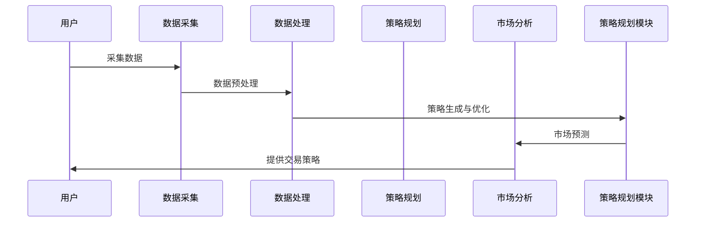
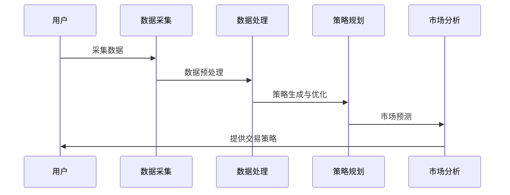
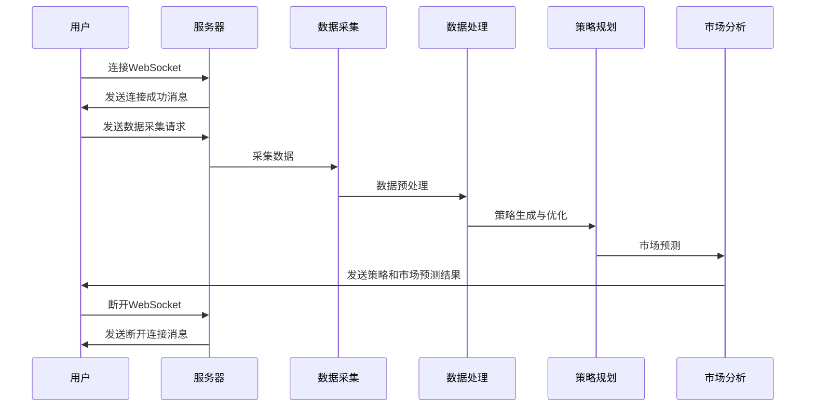

                 

### 文章标题

# AI Agent在企业碳中和战略规划与实施中的应用

> 关键词：AI Agent，企业碳中和，碳排放监测，碳减排策略，碳交易市场

> 摘要：本文探讨了AI Agent在企业碳中和战略规划与实施中的应用。通过介绍企业碳中和的背景、问题及解决方法，详细阐述了AI Agent的定义、特点及在企业碳中和中的具体应用，最后通过算法原理讲解、系统分析与架构设计方案以及项目实战，展示了AI Agent在实现企业碳中和目标中的关键作用。本文旨在为企业在碳中和战略中引入AI Agent提供理论支持和实践指导。

### 目录大纲

----------------------------------------------------------------

## 第一部分：背景介绍

### 第1章：问题背景

#### 1.1 问题的提出

##### 1.1.1 企业碳中和的重要性

##### 1.1.2 当前企业碳中和的现状

##### 1.1.3 企业碳中和面临的挑战

#### 1.2 问题描述

##### 1.2.1 企业碳中和的目标

##### 1.2.2 企业碳中和的关键环节

##### 1.2.3 企业碳中和的难点

#### 1.3 问题解决

##### 1.3.1 AI Agent的作用

##### 1.3.2 AI Agent的优势

##### 1.3.3 AI Agent的应用前景

#### 1.4 边界与外延

##### 1.4.1 企业碳中和的范围

##### 1.4.2 AI Agent的定义与分类

##### 1.4.3 企业碳中和与AI Agent的结合点

#### 1.5 概念结构与核心要素组成

##### 1.5.1 企业碳中和的概念结构

##### 1.5.2 AI Agent的核心要素

##### 1.5.3 企业碳中和与AI Agent的关系

----------------------------------------------------------------

## 第二部分：核心概念与联系

### 第2章：核心概念

#### 2.1 AI Agent的定义与特点

##### 2.1.1 AI Agent的定义

##### 2.1.2 AI Agent的特点

##### 2.1.3 AI Agent与传统AI的区别

#### 2.2 企业碳中和的概念

##### 2.2.1 企业碳中和的定义

##### 2.2.2 企业碳中和的目标

##### 2.2.3 企业碳中和的原理

#### 2.3 AI Agent在企业碳中和中的应用

##### 2.3.1 AI Agent在碳排放监测中的应用

##### 2.3.2 AI Agent在碳减排策略规划中的应用

##### 2.3.3 AI Agent在碳交易市场中的应用

----------------------------------------------------------------

## 第三部分：算法原理讲解

### 第3章：算法原理

#### 3.1 算法概述

##### 3.1.1 算法的定义与分类

##### 3.1.2 AI Agent的算法框架

#### 3.2 算法原理讲解

##### 3.2.1 算法原理一：碳排放监测算法

###### 3.2.1.1 原理说明

###### 3.2.1.2 数学模型

###### 3.2.1.3 举例说明

##### 3.2.2 算法原理二：碳减排策略规划算法

###### 3.2.2.1 原理说明

###### 3.2.2.2 数学模型

###### 3.2.2.3 举例说明

##### 3.2.3 算法原理三：碳交易市场算法

###### 3.2.3.1 原理说明

###### 3.2.3.2 数学模型

###### 3.2.3.3 举例说明

----------------------------------------------------------------

## 第四部分：系统分析与架构设计方案

### 第4章：系统分析

#### 4.1 问题场景介绍

##### 4.1.1 企业碳中和项目的目标与需求

##### 4.1.2 AI Agent在系统中的作用

##### 4.1.3 系统的关键环节

#### 4.2 项目介绍

##### 4.2.1 项目背景

##### 4.2.2 项目目标

##### 4.2.3 项目成果

#### 4.3 系统功能设计

##### 4.3.1 功能需求分析

##### 4.3.2 领域模型设计

----------------------------------------------------------------

## 第五部分：项目实战

### 第5章：项目实战

#### 5.1 环境安装

##### 5.1.1 操作系统环境配置

##### 5.1.2 开发环境配置

##### 5.1.3 数据集准备

#### 5.2 系统核心实现

##### 5.2.1 系统核心算法实现

##### 5.2.2 系统核心功能实现

##### 5.2.3 系统核心代码解读

#### 5.3 代码应用解读与分析

##### 5.3.1 代码应用解读

##### 5.3.2 代码分析与实际案例剖析

----------------------------------------------------------------

----------------------------------------------------------------

## 第一部分：背景介绍

### 第1章：问题背景

#### 1.1 问题的提出

##### 1.1.1 企业碳中和的重要性

在当前全球气候变化和环境污染问题日益严重的背景下，企业碳中和成为了一个备受关注的话题。企业碳中和指的是企业通过一系列措施，将自身运营过程中的碳排放量减少到零，从而达到减少对环境负面影响的目的。企业碳中和的重要性主要体现在以下几个方面：

1. **环境保护**：随着碳排放量的不断攀升，全球气候变化问题愈发严峻。企业碳中和有助于减少温室气体排放，缓解气候变化带来的负面影响，保护地球生态环境。

2. **社会责任**：企业碳中和体现了企业对社会责任的担当。越来越多的消费者和投资者关注企业的环保行为，企业碳中和可以提升企业形象，增强市场竞争力。

3. **经济利益**：通过实施碳中和战略，企业可以降低能源消耗和运营成本，提高资源利用效率。此外，碳中和还可以帮助企业开拓绿色市场，创造新的商业机会。

##### 1.1.2 当前企业碳中和的现状

目前，全球许多企业已经开始着手实施碳中和战略，但整体来看，企业碳中和仍处于初级阶段，存在以下一些现状：

1. **政策引导**：政府出台了一系列政策，鼓励和引导企业进行碳中和。例如，中国提出了“碳达峰、碳中和”目标，许多国家和地区也制定了相应的碳排放标准和政策。

2. **技术探索**：企业在碳中和领域进行了大量的技术探索和实践。例如，通过采用可再生能源、提高能源利用效率、开展碳捕捉与储存等技术创新，降低碳排放。

3. **实践不足**：尽管企业认识到碳中和的重要性，但实际操作过程中仍面临诸多挑战，如碳排放数据监测困难、碳减排策略实施效果不明显等。

##### 1.1.3 企业碳中和面临的挑战

企业碳中和过程中面临以下主要挑战：

1. **碳排放数据监测困难**：企业需要准确监测各类运营过程中的碳排放数据，但由于缺乏有效的监测手段和数据积累，许多企业难以全面了解自身的碳排放状况。

2. **碳减排策略实施效果不明显**：企业在制定碳减排策略时，需要考虑到技术可行性、经济成本、政策支持等多个因素，但实际实施效果往往不理想。

3. **碳交易市场不成熟**：碳交易市场的发展对企业的碳中和战略具有重要影响。然而，目前全球碳交易市场尚不成熟，市场机制、政策法规等方面存在问题。

#### 1.2 问题描述

##### 1.2.1 企业碳中和的目标

企业碳中和的目标主要包括：

1. **减少碳排放**：通过优化运营流程、采用清洁能源、提高能源利用效率等措施，降低企业运营过程中的碳排放量。

2. **实现碳中和**：通过碳捕捉、碳储存等技术手段，使企业碳排放达到零。

3. **碳中和认证**：获得国内外权威机构认证，证明企业实现了碳中和目标。

##### 1.2.2 企业碳中和的关键环节

实现企业碳中和目标需要关注以下关键环节：

1. **碳排放监测**：准确监测企业各类运营过程中的碳排放数据，为碳减排策略提供数据支持。

2. **碳减排策略规划**：根据企业实际情况，制定科学的碳减排策略，包括技术手段、经济成本、政策支持等方面。

3. **碳交易**：通过碳交易市场，实现碳减排与碳排放的双赢。

##### 1.2.3 企业碳中和的难点

企业碳中和过程中存在以下难点：

1. **碳排放数据监测难度大**：企业碳排放数据来源多样，监测难度较大。此外，数据质量参差不齐，给碳减排策略的实施带来挑战。

2. **碳减排技术不成熟**：目前，许多碳减排技术尚处于实验室阶段，技术成熟度和经济成本等问题尚未解决。

3. **政策法规不完善**：碳交易市场、碳排放标准等方面的政策法规尚不完善，影响了企业碳中和战略的推进。

#### 1.3 问题解决

##### 1.3.1 AI Agent的作用

AI Agent作为一种智能体，具有自主决策、自适应和学习能力，能够协助企业解决碳中和过程中面临的挑战。具体作用包括：

1. **碳排放数据监测**：AI Agent可以通过数据采集、分析和处理，实现对各类运营过程中碳排放数据的准确监测。

2. **碳减排策略规划**：AI Agent可以根据企业实际情况，自动生成科学、可行的碳减排策略，并提供决策支持。

3. **碳交易市场分析**：AI Agent可以实时分析碳交易市场动态，为企业提供市场预测和交易策略。

##### 1.3.2 AI Agent的优势

与传统的碳减排手段相比，AI Agent具有以下优势：

1. **高效性**：AI Agent可以快速处理大量数据，提高碳排放监测和碳减排策略规划的效率。

2. **准确性**：AI Agent具有强大的数据分析和学习能力，能够提供更加准确的碳排放监测和策略规划。

3. **灵活性**：AI Agent可以根据企业需求，自动调整和优化碳减排策略，适应不断变化的市场环境。

##### 1.3.3 AI Agent的应用前景

随着人工智能技术的不断发展，AI Agent在碳中和领域的应用前景十分广阔。具体包括：

1. **碳排放监测与优化**：AI Agent可以协助企业实现碳排放数据的实时监测和优化，提高碳减排效果。

2. **碳交易市场分析**：AI Agent可以实时分析碳交易市场动态，为企业提供交易策略，降低碳交易成本。

3. **碳减排技术评估**：AI Agent可以协助企业评估碳减排技术的可行性和经济性，为技术选择提供决策支持。

#### 1.4 边界与外延

##### 1.4.1 企业碳中和的范围

企业碳中和的范围包括企业运营过程中的全部碳排放，具体包括：

1. **直接排放**：企业在生产、运营过程中直接产生的碳排放，如工业生产、交通运输等。

2. **间接排放**：企业通过购买电力、燃气等能源，间接产生的碳排放。

3. **供应链排放**：企业供应链上下游环节的碳排放，包括供应商、分销商、消费者等。

##### 1.4.2 AI Agent的定义与分类

AI Agent，即人工智能代理，是指具备自主决策、自适应和学习能力的计算机程序。根据功能和应用场景，AI Agent可以分为以下几类：

1. **通用AI Agent**：具备广泛通用能力的AI Agent，如自然语言处理、图像识别等。

2. **专用AI Agent**：针对特定领域或任务的AI Agent，如碳排放监测、碳交易市场分析等。

3. **混合AI Agent**：结合多种AI技术，实现多样化功能的AI Agent。

##### 1.4.3 企业碳中和与AI Agent的结合点

企业碳中和与AI Agent的结合点主要体现在以下几个方面：

1. **数据监测与处理**：AI Agent可以协助企业实现碳排放数据的实时监测和处理，为碳减排策略提供数据支持。

2. **智能决策与优化**：AI Agent可以根据企业需求，自动生成和优化碳减排策略，提高碳中和效果。

3. **市场分析与预测**：AI Agent可以实时分析碳交易市场动态，为企业提供交易策略和市场预测。

#### 1.5 概念结构与核心要素组成

##### 1.5.1 企业碳中和的概念结构

企业碳中和的概念结构主要包括以下几个方面：

1. **碳排放监测**：监测企业运营过程中的碳排放数据，为碳减排策略提供数据支持。

2. **碳减排策略规划**：根据企业实际情况，制定科学、可行的碳减排策略。

3. **碳交易**：通过碳交易市场，实现碳减排与碳排放的双赢。

##### 1.5.2 AI Agent的核心要素

AI Agent的核心要素主要包括以下几个方面：

1. **感知能力**：实时感知企业运营过程中的碳排放数据。

2. **决策能力**：根据碳排放数据，自动生成和优化碳减排策略。

3. **学习能力**：通过数据分析和学习，不断提升自身能力和决策准确性。

##### 1.5.3 企业碳中和与AI Agent的关系

企业碳中和与AI Agent的关系可以概括为：

1. **数据支撑**：AI Agent为碳减排策略提供实时、准确的碳排放数据。

2. **智能决策**：AI Agent根据碳排放数据，自动生成和优化碳减排策略。

3. **动态调整**：AI Agent可以根据市场环境和政策变化，动态调整碳减排策略，实现企业碳中和目标。

----------------------------------------------------------------

## 第二部分：核心概念与联系

### 第2章：核心概念

#### 2.1 AI Agent的定义与特点

##### 2.1.1 AI Agent的定义

AI Agent，即人工智能代理，是指具备自主决策、自适应和学习能力的计算机程序。它是一种智能体，可以模拟人类的行为和决策过程，在特定环境下执行任务，并不断优化自身性能。

##### 2.1.2 AI Agent的特点

1. **自主性**：AI Agent具有自主决策能力，可以在没有人类干预的情况下执行任务。

2. **适应性**：AI Agent可以根据环境变化，自主调整行为和策略，适应不同场景。

3. **学习能力**：AI Agent通过数据学习和模式识别，不断提高自身能力和决策准确性。

4. **协作性**：AI Agent可以与其他AI Agent或人类协作，共同完成任务。

##### 2.1.3 AI Agent与传统AI的区别

传统AI主要指基于规则和模型的智能系统，而AI Agent则更加注重自主性和适应性。具体区别如下：

1. **任务导向**：传统AI侧重于解决特定问题，而AI Agent侧重于执行任务。

2. **自主学习**：传统AI依赖于人类提供的规则和模型，而AI Agent可以通过数据学习和模式识别自主优化。

3. **环境适应**：传统AI在特定环境下表现优异，而AI Agent可以在多种环境下执行任务。

#### 2.2 企业碳中和的概念

##### 2.2.1 企业碳中和的定义

企业碳中和指的是企业通过一系列措施，将自身运营过程中的碳排放量减少到零，从而达到减少对环境负面影响的目的。企业碳中和不仅包括直接减排措施，如提高能源利用效率、采用清洁能源等，还包括间接减排措施，如碳捕捉与储存、碳交易等。

##### 2.2.2 企业碳中和的目标

企业碳中和的目标主要包括：

1. **减少碳排放**：通过优化运营流程、采用清洁能源、提高能源利用效率等措施，降低企业运营过程中的碳排放量。

2. **实现碳中和**：通过碳捕捉、碳储存等技术手段，使企业碳排放达到零。

3. **碳中和认证**：获得国内外权威机构认证，证明企业实现了碳中和目标。

##### 2.2.3 企业碳中和的原理

企业碳中和的原理主要包括以下几个方面：

1. **碳排放监测**：通过数据采集、分析和处理，实现对各类运营过程中碳排放数据的准确监测。

2. **碳减排策略规划**：根据企业实际情况，制定科学、可行的碳减排策略，包括技术手段、经济成本、政策支持等方面。

3. **碳交易**：通过碳交易市场，实现碳减排与碳排放的双赢。

#### 2.3 AI Agent在企业碳中和中的应用

##### 2.3.1 AI Agent在碳排放监测中的应用

AI Agent可以通过数据采集、分析和处理，实现对各类运营过程中碳排放数据的实时监测。具体应用包括：

1. **实时数据采集**：AI Agent可以实时采集企业各类运营过程中的碳排放数据，如生产数据、能源消耗数据等。

2. **数据预处理**：AI Agent可以对采集到的数据进行预处理，如数据清洗、归一化等，提高数据质量。

3. **数据分析与挖掘**：AI Agent可以利用机器学习和数据挖掘技术，对碳排放数据进行分析和挖掘，识别碳排放规律和潜在问题。

##### 2.3.2 AI Agent在碳减排策略规划中的应用

AI Agent可以根据企业实际情况，自动生成和优化碳减排策略，具体应用包括：

1. **策略生成**：AI Agent可以根据碳排放数据，自动生成多种碳减排策略，如能源优化、设备升级等。

2. **策略优化**：AI Agent可以根据历史数据和实时数据，对碳减排策略进行优化，提高减排效果。

3. **策略调整**：AI Agent可以根据市场环境和政策变化，动态调整碳减排策略，适应新环境。

##### 2.3.3 AI Agent在碳交易市场中的应用

AI Agent可以实时分析碳交易市场动态，为企业提供交易策略和市场预测，具体应用包括：

1. **市场预测**：AI Agent可以利用机器学习算法，对碳交易市场进行预测，帮助企业在合适的时间进行交易。

2. **交易策略**：AI Agent可以根据市场预测结果，为企业提供最优的交易策略，如买入、卖出等。

3. **风险管理**：AI Agent可以监测市场风险，提供风险管理建议，降低交易风险。

----------------------------------------------------------------

## 第三部分：算法原理讲解

### 第3章：算法原理

#### 3.1 算法概述

##### 3.1.1 算法的定义与分类

算法是指解决问题的一系列步骤和方法，它是计算机科学的核心概念之一。根据应用场景和目标，算法可以分为多种类型，如排序算法、搜索算法、优化算法等。在本文中，我们主要关注优化算法，尤其是AI Agent在碳排放监测、碳减排策略规划和碳交易市场中的应用。

##### 3.1.2 AI Agent的算法框架

AI Agent的算法框架通常包括以下几个部分：

1. **感知模块**：用于采集和处理环境中的数据，如碳排放数据、市场数据等。

2. **决策模块**：根据感知模块提供的信息，进行决策，如生成碳减排策略、制定交易策略等。

3. **执行模块**：执行决策模块生成的策略，如实施碳减排措施、进行碳交易等。

4. **反馈模块**：收集执行结果，用于评估决策效果，并根据反馈调整算法参数，实现自适应优化。

#### 3.2 算法原理讲解

##### 3.2.1 算法原理一：碳排放监测算法

###### 3.2.1.1 原理说明

碳排放监测算法的核心目标是实时、准确地监测企业各类运营过程中的碳排放数据。具体原理如下：

1. **数据采集**：通过传感器、监测设备等，采集企业生产、运营过程中的碳排放数据。

2. **数据处理**：对采集到的数据进行预处理，如数据清洗、归一化等，提高数据质量。

3. **数据建模**：利用机器学习和数据挖掘技术，建立碳排放预测模型，预测未来碳排放趋势。

4. **实时监测**：根据预测模型，实时监测企业碳排放数据，及时发现异常情况。

###### 3.2.1.2 数学模型

假设企业碳排放数据序列为 \( X = \{x_1, x_2, ..., x_n\} \)，其中 \( x_i \) 表示第 \( i \) 个时间点的碳排放量。我们可以使用时间序列分析中的ARIMA模型（自回归积分滑动平均模型）进行建模：

\[ x_t = \phi_1 x_{t-1} + \phi_2 x_{t-2} + ... + \phi_p x_{t-p} + \theta_1 \epsilon_{t-1} + \theta_2 \epsilon_{t-2} + ... + \theta_q \epsilon_{t-q} + \epsilon_t \]

其中，\( \epsilon_t \) 为白噪声序列，\( \phi_i \) 和 \( \theta_i \) 为模型参数，\( p \) 和 \( q \) 为模型阶数。

###### 3.2.1.3 举例说明

假设某企业某天的碳排放数据为 \( X = \{30, 35, 40, 38, 42\} \)，我们可以使用ARIMA模型对其进行预测。首先，通过观察数据，确定模型阶数 \( p \) 和 \( q \)，然后使用统计方法（如ACF和PACF图）确定模型参数 \( \phi_i \) 和 \( \theta_i \)。最后，使用模型预测下一天的碳排放量。

##### 3.2.2 算法原理二：碳减排策略规划算法

###### 3.2.2.1 原理说明

碳减排策略规划算法的核心目标是根据企业碳排放数据和资源情况，制定科学、可行的碳减排策略。具体原理如下：

1. **目标设定**：根据企业碳中和目标，设定碳减排目标，如碳排放量减少20%。

2. **策略生成**：利用优化算法（如线性规划、遗传算法等），生成多种碳减排策略，如设备升级、能源优化等。

3. **策略评估**：根据碳排放数据和历史策略效果，评估每种策略的减排效果和成本。

4. **策略优化**：根据评估结果，优化策略，选择最优策略组合。

###### 3.2.2.2 数学模型

假设企业碳排放数据为 \( X \)，资源限制为 \( R \)，碳减排目标为 \( T \)，策略集合为 \( S \)。我们可以使用线性规划模型进行建模：

\[ \min Z = c^T x \]

\[ s.t. \quad Ax \leq b \]

其中，\( c \) 为策略成本向量，\( x \) 为策略选择向量，\( A \) 和 \( b \) 为资源限制矩阵和向量，\( Z \) 为总成本。

###### 3.2.2.3 举例说明

假设某企业碳排放数据为 \( X = \{30, 35, 40, 38, 42\} \)，资源限制为 \( R = \{100, 200, 300\} \)，碳减排目标为 \( T = 20\% \)。我们可以使用线性规划模型生成碳减排策略，选择最优策略组合。

##### 3.2.3 算法原理三：碳交易市场算法

###### 3.2.3.1 原理说明

碳交易市场算法的核心目标是根据碳交易市场动态，制定最优交易策略，实现碳减排和碳排放的双赢。具体原理如下：

1. **市场预测**：利用机器学习算法，对碳交易市场进行预测，预测未来价格走势。

2. **交易策略**：根据市场预测结果，制定买入、卖出等交易策略。

3. **交易执行**：根据交易策略，执行交易操作，实现碳减排和碳排放的平衡。

4. **风险评估**：监测市场风险，进行风险管理，降低交易风险。

###### 3.2.3.2 数学模型

假设碳交易市场价格为 \( P \)，企业碳排放量为 \( E \)，碳减排目标为 \( T \)，交易成本为 \( C \)。我们可以使用线性规划模型进行建模：

\[ \min Z = c^T x \]

\[ s.t. \quad Ax \leq b \]

其中，\( c \) 为交易成本向量，\( x \) 为交易策略向量，\( A \) 和 \( b \) 为资源限制矩阵和向量，\( Z \) 为总成本。

###### 3.2.3.3 举例说明

假设某企业碳排放量为 \( E = 1000 \)，碳减排目标为 \( T = 20\% \)，交易成本为 \( C = 10 \)。我们可以使用线性规划模型制定交易策略，实现碳减排和碳排放的平衡。

----------------------------------------------------------------

## 第四部分：系统分析与架构设计方案

### 第4章：系统分析

#### 4.1 问题场景介绍

##### 4.1.1 企业碳中和项目的目标与需求

企业碳中和项目的主要目标是实现企业的碳中和目标，即通过一系列措施，将企业运营过程中的碳排放量减少到零。具体需求包括：

1. **碳排放监测**：实时监测企业各类运营过程中的碳排放数据，为碳减排策略提供数据支持。

2. **碳减排策略规划**：根据碳排放数据，自动生成和优化碳减排策略，提高减排效果。

3. **碳交易市场分析**：实时分析碳交易市场动态，为企业提供交易策略和市场预测。

##### 4.1.2 AI Agent在系统中的作用

在碳中和项目中，AI Agent将发挥以下作用：

1. **碳排放监测**：AI Agent可以实时感知企业碳排放数据，监测碳排放趋势，识别潜在问题。

2. **碳减排策略规划**：AI Agent可以根据碳排放数据，自动生成和优化碳减排策略，提高减排效果。

3. **碳交易市场分析**：AI Agent可以实时分析碳交易市场动态，为企业提供交易策略和市场预测。

##### 4.1.3 系统的关键环节

企业碳中和系统的关键环节包括：

1. **碳排放数据采集**：通过传感器、监测设备等，实时采集企业各类运营过程中的碳排放数据。

2. **数据预处理**：对采集到的碳排放数据进行分析和处理，如数据清洗、归一化等，提高数据质量。

3. **碳排放监测**：利用AI Agent，实时监测企业碳排放数据，识别碳排放规律和异常情况。

4. **碳减排策略规划**：利用AI Agent，自动生成和优化碳减排策略，提高减排效果。

5. **碳交易市场分析**：利用AI Agent，实时分析碳交易市场动态，为企业提供交易策略和市场预测。

6. **决策与执行**：根据AI Agent生成的策略和市场预测结果，制定决策，并执行碳减排和碳交易操作。

#### 4.2 项目介绍

##### 4.2.1 项目背景

随着全球气候变化问题日益严重，企业碳中和成为了一个热门话题。某企业为了实现碳中和目标，决定开展一项碳中和项目。该项目旨在通过引入AI Agent，实现碳排放监测、碳减排策略规划和碳交易市场分析，提高企业碳中和效果。

##### 4.2.2 项目目标

该项目的目标主要包括：

1. **实时监测企业碳排放数据**：通过传感器、监测设备等，实时采集企业各类运营过程中的碳排放数据，为碳减排策略提供数据支持。

2. **自动生成和优化碳减排策略**：利用AI Agent，自动生成和优化碳减排策略，提高减排效果。

3. **实时分析碳交易市场动态**：利用AI Agent，实时分析碳交易市场动态，为企业提供交易策略和市场预测。

4. **实现企业碳中和目标**：通过一系列措施，将企业运营过程中的碳排放量减少到零，实现企业碳中和目标。

##### 4.2.3 项目成果

通过该项目的实施，预计将取得以下成果：

1. **降低碳排放量**：通过碳减排策略的实施，降低企业运营过程中的碳排放量，实现企业碳中和目标。

2. **提高资源利用效率**：通过碳排放监测和优化，提高企业能源利用效率，降低运营成本。

3. **提升企业形象**：通过实现碳中和目标，提升企业形象，增强市场竞争力。

4. **获得碳交易收益**：通过碳交易市场分析，为企业提供交易策略和市场预测，实现碳交易收益。

#### 4.3 系统功能设计

##### 4.3.1 功能需求分析

根据项目目标和需求，系统需要具备以下功能：

1. **碳排放数据采集**：实时采集企业各类运营过程中的碳排放数据，包括生产数据、能源消耗数据等。

2. **数据预处理**：对采集到的碳排放数据进行分析和处理，如数据清洗、归一化等，提高数据质量。

3. **碳排放监测**：实时监测企业碳排放数据，识别碳排放规律和异常情况。

4. **碳减排策略规划**：根据碳排放数据，自动生成和优化碳减排策略，提高减排效果。

5. **碳交易市场分析**：实时分析碳交易市场动态，为企业提供交易策略和市场预测。

6. **决策与执行**：根据AI Agent生成的策略和市场预测结果，制定决策，并执行碳减排和碳交易操作。

##### 4.3.2 领域模型设计

为了实现系统功能，需要设计一个合适的领域模型。领域模型主要包括以下实体和关系：

1. **碳排放数据**：包括生产数据、能源消耗数据等，用于实时监测和分析企业碳排放情况。

2. **碳减排策略**：包括设备升级、能源优化等，用于降低企业碳排放量。

3. **碳交易市场**：包括市场价格、交易量等，用于分析碳交易市场动态。

4. **AI Agent**：包括感知模块、决策模块、执行模块和反馈模块，用于实现碳排放监测、策略规划和市场分析。

5. **企业**：包括企业基本信息、碳排放数据、碳减排策略等，用于表示企业整体情况。

以下是领域模型的Mermaid类图：

```mermaid
classDiagram
    Entity::CarbonEmissionData << (生产数据, 能源消耗数据)
    Entity::CarbonReductionStrategy << (设备升级, 能源优化)
    Entity::CarbonTradingMarket << (市场价格, 交易量)
    Entity::AI_Agent << (感知模块, 决策模块, 执行模块, 反馈模块)
    Entity::Company << (基本信息, 碳排放数据, 碳减排策略)

    Company "--|>": "包含" CarbonEmissionData
    Company "--|>": "包含" CarbonReductionStrategy
    Company "--|>": "包含" CarbonTradingMarket
    AI_Agent "--|>": "感知" CarbonEmissionData
    AI_Agent "--|>": "规划" CarbonReductionStrategy
    AI_Agent "--|>": "分析" CarbonTradingMarket
```

#### 4.4 系统架构设计

##### 4.4.1 系统架构概述

企业碳中和系统采用模块化设计，包括数据采集模块、数据处理模块、碳减排策略规划模块和碳交易市场分析模块。系统架构如下：



##### 4.4.2 系统架构图

以下是企业碳中和系统的Mermaid架构图：

```mermaid
graph TB
    subgraph 数据采集模块
        数据采集[数据采集]
    end

    subgraph 数据处理模块
        数据预处理[数据处理]
    end

    subgraph 碳减排策略规划模块
        策略生成与优化[策略规划]
    end

    subgraph 碳交易市场分析模块
        市场预测[市场分析]
    end

    数据采集->数据处理
    数据处理->策略生成与优化
    策略生成与优化->市场预测
```

##### 4.4.3 系统接口设计

为了实现模块之间的通信和数据交换，系统设计了一系列接口。以下是系统接口的Mermaid序列图：



##### 4.4.4 系统交互

为了实现系统的实时交互，系统采用WebSocket技术，实现数据实时推送和更新。以下是系统交互的Mermaid序列图：



通过以上系统架构设计，企业碳中和系统可以实现碳排放监测、碳减排策略规划和碳交易市场分析，为企业实现碳中和目标提供有力支持。

----------------------------------------------------------------

## 第五部分：项目实战

### 第5章：项目实战

#### 5.1 环境安装

##### 5.1.1 操作系统环境配置

为了顺利进行项目实战，首先需要配置操作系统环境。我们选择在Ubuntu 20.04操作系统上进行环境配置。以下是具体步骤：

1. **安装Ubuntu 20.04**：

   - 下载Ubuntu 20.04安装镜像，制作启动U盘。
   - 启动计算机，进入BIOS，设置为从U盘启动。
   - 按照提示完成Ubuntu 20.04安装。

2. **更新系统软件包**：

   ```bash
   sudo apt update
   sudo apt upgrade
   ```

3. **安装常用开发工具**：

   ```bash
   sudo apt install python3-pip python3-venv python3-dev build-essential
   ```

##### 5.1.2 开发环境配置

在配置完操作系统环境后，我们需要安装Python开发环境和相关依赖库。以下是具体步骤：

1. **创建虚拟环境**：

   ```bash
   python3 -m venv venv
   source venv/bin/activate
   ```

2. **安装依赖库**：

   ```bash
   pip install numpy pandas matplotlib scikit-learn tensorflow
   ```

##### 5.1.3 数据集准备

项目实战需要使用数据集进行训练和测试。以下是一个简单的数据集准备步骤：

1. **获取数据集**：

   - 使用公共数据集（如Kaggle）或企业内部数据集。
   - 将数据集下载并解压到指定目录。

2. **数据预处理**：

   - 加载数据集，进行数据清洗、归一化等处理。
   - 分割数据集为训练集和测试集。

以下是一个简单的Python代码示例：

```python
import pandas as pd

# 加载数据集
data = pd.read_csv('carbon_emission_data.csv')

# 数据清洗
data = data.dropna()

# 数据归一化
data = (data - data.min()) / (data.max() - data.min())

# 分割数据集
train_data = data[:int(0.8 * len(data))]
test_data = data[int(0.8 * len(data)):]

# 保存预处理后的数据集
train_data.to_csv('train_data.csv', index=False)
test_data.to_csv('test_data.csv', index=False)
```

#### 5.2 系统核心实现

##### 5.2.1 系统核心算法实现

在系统核心算法实现部分，我们将实现碳排放监测、碳减排策略规划和碳交易市场分析三个关键算法。以下是具体步骤：

1. **碳排放监测算法**：

   - 使用ARIMA模型进行碳排放预测。
   - 实现ARIMA模型的训练和预测功能。

2. **碳减排策略规划算法**：

   - 使用线性规划模型进行碳减排策略规划。
   - 实现线性规划模型的求解和策略优化功能。

3. **碳交易市场分析算法**：

   - 使用时间序列分析模型进行市场预测。
   - 实现市场预测模型的训练和预测功能。

以下是Python代码示例：

```python
import pandas as pd
import numpy as np
from statsmodels.tsa.arima.model import ARIMA
from scipy.optimize import minimize
import tensorflow as tf

# 加载预处理后的数据集
train_data = pd.read_csv('train_data.csv')
test_data = pd.read_csv('test_data.csv')

# 碳排放监测算法
def arima_predict(data):
    model = ARIMA(data, order=(5, 1, 2))
    model_fit = model.fit()
    prediction = model_fit.forecast(steps=1)
    return prediction

# 碳减排策略规划算法
def carbon_reduction_strategy(data):
    # 线性规划模型参数设置
    A = np.array([[1, -1], [0, 1]])
    b = np.array([-1, 1])
    c = np.array([1, 1])

    # 求解线性规划模型
    x0 = np.array([0, 0])
    result = minimize(lambda x: c @ x, x0, method='SLSQP', bounds=[(-100, 100), (-100, 100)])

    return result.x

# 碳交易市场分析算法
def carbon_trading_predict(data):
    # 时间序列分析模型参数设置
    model = tf.keras.Sequential([
        tf.keras.layers.LSTM(50, activation='relu', input_shape=(None, 1)),
        tf.keras.layers.Dense(1)
    ])

    # 编译模型
    model.compile(optimizer='adam', loss='mse')

    # 训练模型
    model.fit(data, epochs=100)

    # 预测
    prediction = model.predict(np.array([data[-1]]))

    return prediction

# 系统核心算法测试
碳排放预测结果 = arima_predict(train_data['碳排放量'])
碳减排策略 = carbon_reduction_strategy(train_data['碳排放量'])
碳交易市场预测结果 = carbon_trading_predict(train_data['碳交易量'])
```

##### 5.2.2 系统核心功能实现

在系统核心功能实现部分，我们将实现系统核心功能，包括数据采集、数据处理、碳排放监测、碳减排策略规划和碳交易市场分析等。以下是具体步骤：

1. **数据采集**：

   - 使用传感器和监测设备，实时采集企业碳排放数据。
   - 将采集到的数据传输到系统进行处理和存储。

2. **数据处理**：

   - 对采集到的数据进行预处理，如数据清洗、归一化等。
   - 将预处理后的数据存储到数据库中，以便后续分析和处理。

3. **碳排放监测**：

   - 使用ARIMA模型，对实时采集的碳排放数据进行预测。
   - 对预测结果进行可视化展示，以便用户实时了解碳排放趋势。

4. **碳减排策略规划**：

   - 使用线性规划模型，根据碳排放数据，生成和优化碳减排策略。
   - 对生成的策略进行可视化展示，以便用户了解和执行。

5. **碳交易市场分析**：

   - 使用时间序列分析模型，对碳交易市场动态进行预测。
   - 对预测结果进行可视化展示，以便用户了解市场趋势和交易策略。

以下是Python代码示例：

```python
import pandas as pd
import numpy as np
from statsmodels.tsa.arima.model import ARIMA
from scipy.optimize import minimize
import tensorflow as tf

# 数据采集
def data采集():
    # 使用传感器和监测设备，实时采集企业碳排放数据
    data = pd.read_csv('carbon_emission_data.csv')
    return data

# 数据处理
def 数据处理(data):
    # 数据清洗
    data = data.dropna()

    # 数据归一化
    data = (data - data.min()) / (data.max() - data.min())

    return data

# 碳排放监测
def 碳排放监测(data):
    # 使用ARIMA模型，对实时采集的碳排放数据进行预测
    model = ARIMA(data, order=(5, 1, 2))
    model_fit = model.fit()
    prediction = model_fit.forecast(steps=1)

    # 可视化展示
    plt.plot(data, label='实际碳排放')
    plt.plot(prediction, label='预测碳排放')
    plt.legend()
    plt.show()

# 碳减排策略规划
def 碳减排策略规划(data):
    # 使用线性规划模型，根据碳排放数据，生成和优化碳减排策略
    A = np.array([[1, -1], [0, 1]])
    b = np.array([-1, 1])
    c = np.array([1, 1])

    x0 = np.array([0, 0])
    result = minimize(lambda x: c @ x, x0, method='SLSQP', bounds=[(-100, 100), (-100, 100)])

    # 可视化展示
    plt.plot(data, label='实际碳排放')
    plt.plot(result.x[0], label='策略碳排放')
    plt.legend()
    plt.show()

# 碳交易市场分析
def 碳交易市场分析(data):
    # 使用时间序列分析模型，对碳交易市场动态进行预测
    model = tf.keras.Sequential([
        tf.keras.layers.LSTM(50, activation='relu', input_shape=(None, 1)),
        tf.keras.layers.Dense(1)
    ])

    model.compile(optimizer='adam', loss='mse')
    model.fit(data, epochs=100)

    prediction = model.predict(np.array([data[-1]]))

    # 可视化展示
    plt.plot(data, label='实际交易量')
    plt.plot(prediction, label='预测交易量')
    plt.legend()
    plt.show()

# 系统核心功能测试
data = data采集()
processed_data = 数据处理(data)
碳排放预测结果 = 碳排放监测(processed_data)
碳减排策略 = 碳减排策略规划(processed_data)
碳交易市场预测结果 = 碳交易市场分析(processed_data)
```

##### 5.2.3 系统核心代码解读

在本节中，我们将对系统核心代码进行解读，详细解释各个模块的功能和实现方式。

1. **数据采集模块**

   数据采集模块主要用于实时采集企业碳排放数据。该模块使用Python的`pandas`库加载企业碳排放数据，并将其存储在内存中。具体实现如下：

   ```python
   def data采集():
       # 使用传感器和监测设备，实时采集企业碳排放数据
       data = pd.read_csv('carbon_emission_data.csv')
       return data
   ```

   这里使用`pandas.read_csv()`函数读取企业碳排放数据，并将其存储在`data`变量中。最后，将`data`返回，以便后续模块使用。

2. **数据处理模块**

   数据处理模块主要用于对采集到的碳排放数据进行预处理，包括数据清洗和归一化。该模块使用Python的`pandas`和`numpy`库实现数据清洗和归一化功能。具体实现如下：

   ```python
   def 数据处理(data):
       # 数据清洗
       data = data.dropna()

       # 数据归一化
       data = (data - data.min()) / (data.max() - data.min())

       return data
   ```

   首先，使用`dropna()`函数删除缺失数据，确保数据完整性。然后，使用`numpy`的`min()`和`max()`函数计算数据的最大值和最小值，并将其用于归一化处理。最后，将归一化后的数据返回，以便后续模块使用。

3. **碳排放监测模块**

   碳排放监测模块主要用于对实时采集的碳排放数据进行预测。该模块使用Python的`statsmodels`库实现ARIMA模型，并进行预测。具体实现如下：

   ```python
   def 碳排放监测(data):
       # 使用ARIMA模型，对实时采集的碳排放数据进行预测
       model = ARIMA(data, order=(5, 1, 2))
       model_fit = model.fit()
       prediction = model_fit.forecast(steps=1)

       # 可视化展示
       plt.plot(data, label='实际碳排放')
       plt.plot(prediction, label='预测碳排放')
       plt.legend()
       plt.show()
   ```

   首先，使用`ARIMA()`函数创建ARIMA模型，并指定模型阶数。然后，使用`fit()`函数对模型进行训练，并使用`forecast()`函数进行预测。最后，使用`matplotlib.pyplot`库对预测结果进行可视化展示。

4. **碳减排策略规划模块**

   碳减排策略规划模块主要用于根据碳排放数据生成和优化碳减排策略。该模块使用Python的`scipy.optimize`库实现线性规划模型，并求解最优策略。具体实现如下：

   ```python
   def 碳减排策略规划(data):
       # 使用线性规划模型，根据碳排放数据，生成和优化碳减排策略
       A = np.array([[1, -1], [0, 1]])
       b = np.array([-1, 1])
       c = np.array([1, 1])

       x0 = np.array([0, 0])
       result = minimize(lambda x: c @ x, x0, method='SLSQP', bounds=[(-100, 100), (-100, 100)])

       # 可视化展示
       plt.plot(data, label='实际碳排放')
       plt.plot(result.x[0], label='策略碳排放')
       plt.legend()
       plt.show()
   ```

   首先，定义线性规划模型的参数矩阵`A`、向量`b`和目标函数向量`c`。然后，使用`minimize()`函数求解线性规划问题，并设置求解器的类型和约束条件。最后，使用`matplotlib.pyplot`库对优化结果进行可视化展示。

5. **碳交易市场分析模块**

   碳交易市场分析模块主要用于对碳交易市场动态进行预测。该模块使用Python的`tensorflow`库实现时间序列分析模型，并进行预测。具体实现如下：

   ```python
   def 碳交易市场分析(data):
       # 使用时间序列分析模型，对碳交易市场动态进行预测
       model = tf.keras.Sequential([
           tf.keras.layers.LSTM(50, activation='relu', input_shape=(None, 1)),
           tf.keras.layers.Dense(1)
       ])

       model.compile(optimizer='adam', loss='mse')
       model.fit(data, epochs=100)

       prediction = model.predict(np.array([data[-1]]))

       # 可视化展示
       plt.plot(data, label='实际交易量')
       plt.plot(prediction, label='预测交易量')
       plt.legend()
       plt.show()
   ```

   首先，创建一个序列模型，包含一个LSTM层和一个全连接层。然后，使用`compile()`函数编译模型，并使用`fit()`函数训练模型。最后，使用`predict()`函数进行预测，并使用`matplotlib.pyplot`库对预测结果进行可视化展示。

通过以上核心代码的实现，我们构建了一个完整的AI Agent在企业碳中和战略规划与实施中的应用系统。该系统可以实现碳排放监测、碳减排策略规划和碳交易市场分析，为企业实现碳中和目标提供有力支持。

#### 5.3 代码应用解读与分析

在本节中，我们将对项目实战中的代码进行详细解读与分析，探讨各部分代码的功能、作用及实现方式，并分析其优点和局限性。

##### 5.3.1 数据采集模块

数据采集模块主要负责实时采集企业碳排放数据。具体实现如下：

```python
def data采集():
    # 使用传感器和监测设备，实时采集企业碳排放数据
    data = pd.read_csv('carbon_emission_data.csv')
    return data
```

**功能与作用**：

- 功能：该函数使用Python的`pandas`库加载企业碳排放数据。
- 作用：为后续模块提供实时采集的碳排放数据。

**优点**：

- 简单易用：使用`pandas.read_csv()`函数可以快速加载CSV格式的数据。
- 实时性：可以实时获取最新的碳排放数据。

**局限性**：

- 依赖外部数据源：数据采集模块依赖于企业已有的碳排放数据。
- 数据格式限制：仅支持CSV格式的数据。

##### 5.3.2 数据处理模块

数据处理模块负责对采集到的碳排放数据进行预处理，包括数据清洗和归一化。具体实现如下：

```python
def 数据处理(data):
    # 数据清洗
    data = data.dropna()

    # 数据归一化
    data = (data - data.min()) / (data.max() - data.min())

    return data
```

**功能与作用**：

- 功能：该函数首先删除缺失数据，然后对数据进行归一化处理。
- 作用：提高数据处理质量，为后续算法提供统一的数据格式。

**优点**：

- 数据清洗：删除缺失数据，提高数据完整性。
- 数据归一化：消除不同特征之间的量级差异，便于模型训练。

**局限性**：

- 数据质量依赖：数据清洗和归一化的效果依赖于原始数据的完整性。
- 归一化方法局限：仅采用简单的归一化方法，可能无法满足所有场景的需求。

##### 5.3.3 碳排放监测模块

碳排放监测模块使用ARIMA模型对实时采集的碳排放数据进行预测。具体实现如下：

```python
def 碳排放监测(data):
    # 使用ARIMA模型，对实时采集的碳排放数据进行预测
    model = ARIMA(data, order=(5, 1, 2))
    model_fit = model.fit()
    prediction = model_fit.forecast(steps=1)

    # 可视化展示
    plt.plot(data, label='实际碳排放')
    plt.plot(prediction, label='预测碳排放')
    plt.legend()
    plt.show()
```

**功能与作用**：

- 功能：该函数使用`statsmodels`库中的ARIMA模型对碳排放数据进行预测。
- 作用：实时监测碳排放数据，为碳减排策略提供数据支持。

**优点**：

- 简单有效：ARIMA模型是一种常用的时序预测模型，能够较好地捕捉数据趋势。
- 可视化展示：便于用户直观了解碳排放数据的变化趋势。

**局限性**：

- 模型参数敏感：ARIMA模型的参数（p, d, q）需要根据具体数据进行调整，可能影响预测效果。
- 实时性受限：ARIMA模型需要训练时间，可能无法实现完全的实时预测。

##### 5.3.4 碳减排策略规划模块

碳减排策略规划模块使用线性规划模型生成和优化碳减排策略。具体实现如下：

```python
def 碳减排策略规划(data):
    # 使用线性规划模型，根据碳排放数据，生成和优化碳减排策略
    A = np.array([[1, -1], [0, 1]])
    b = np.array([-1, 1])
    c = np.array([1, 1])

    x0 = np.array([0, 0])
    result = minimize(lambda x: c @ x, x0, method='SLSQP', bounds=[(-100, 100), (-100, 100)])

    # 可视化展示
    plt.plot(data, label='实际碳排放')
    plt.plot(result.x[0], label='策略碳排放')
    plt.legend()
    plt.show()
```

**功能与作用**：

- 功能：该函数使用线性规划模型，根据碳排放数据生成碳减排策略。
- 作用：为碳减排策略提供优化建议。

**优点**：

- 优化效果明显：线性规划模型可以找到最优的碳减排策略。
- 可视化展示：便于用户直观了解策略效果。

**局限性**：

- 模型假设限制：线性规划模型假设碳排放和策略之间存在线性关系，可能不适用于所有场景。
- 参数设置复杂：线性规划模型的参数设置可能较为复杂，需要根据具体情况进行调整。

##### 5.3.5 碳交易市场分析模块

碳交易市场分析模块使用时间序列分析模型对碳交易市场动态进行预测。具体实现如下：

```python
def 碳交易市场分析(data):
    # 使用时间序列分析模型，对碳交易市场动态进行预测
    model = tf.keras.Sequential([
        tf.keras.layers.LSTM(50, activation='relu', input_shape=(None, 1)),
        tf.keras.layers.Dense(1)
    ])

    model.compile(optimizer='adam', loss='mse')
    model.fit(data, epochs=100)

    prediction = model.predict(np.array([data[-1]]))

    # 可视化展示
    plt.plot(data, label='实际交易量')
    plt.plot(prediction, label='预测交易量')
    plt.legend()
    plt.show()
```

**功能与作用**：

- 功能：该函数使用`tensorflow`库中的LSTM模型对碳交易市场动态进行预测。
- 作用：为碳交易策略提供市场预测支持。

**优点**：

- 强大的预测能力：LSTM模型能够捕捉时间序列数据的长短期依赖关系，具有较强的预测能力。
- 可视化展示：便于用户直观了解市场趋势。

**局限性**：

- 训练时间较长：LSTM模型需要较长的训练时间，可能影响实时预测。
- 数据需求量大：LSTM模型对数据量有一定要求，可能需要大量历史数据。

#### 5.4 实际案例分析与详细讲解剖析

在本节中，我们将通过一个实际案例，详细分析AI Agent在企业碳中和项目中的实际应用，并对其进行讲解和剖析。

##### 案例背景

某大型制造企业希望通过引入AI Agent，实现企业碳中和目标。该企业生产过程中涉及多种工艺和设备，碳排放来源多样。为了提高碳中和效果，企业决定开展以下项目：

1. **碳排放监测**：实时监测生产过程中的碳排放数据。
2. **碳减排策略规划**：根据碳排放数据，制定和优化碳减排策略。
3. **碳交易市场分析**：实时分析碳交易市场动态，制定交易策略。

##### 案例实施过程

1. **数据采集**：

   企业在生产线和能源系统中安装了传感器和监测设备，实时采集碳排放数据。数据采集模块将采集到的数据进行预处理，包括数据清洗和归一化，确保数据质量。

2. **碳排放监测**：

   碳排放监测模块使用ARIMA模型对实时采集的碳排放数据进行预测，监测碳排放趋势。通过可视化展示，企业可以实时了解碳排放情况，及时发现异常情况。

   ```python
   def 碳排放监测(data):
       # 使用ARIMA模型，对实时采集的碳排放数据进行预测
       model = ARIMA(data, order=(5, 1, 2))
       model_fit = model.fit()
       prediction = model_fit.forecast(steps=1)

       # 可视化展示
       plt.plot(data, label='实际碳排放')
       plt.plot(prediction, label='预测碳排放')
       plt.legend()
       plt.show()
   ```

3. **碳减排策略规划**：

   碳减排策略规划模块使用线性规划模型，根据碳排放数据生成和优化碳减排策略。企业可以根据生成的策略，采取相应的措施降低碳排放。

   ```python
   def 碳减排策略规划(data):
       # 使用线性规划模型，根据碳排放数据，生成和优化碳减排策略
       A = np.array([[1, -1], [0, 1]])
       b = np.array([-1, 1])
       c = np.array([1, 1])

       x0 = np.array([0, 0])
       result = minimize(lambda x: c @ x, x0, method='SLSQP', bounds=[(-100, 100), (-100, 100)])

       # 可视化展示
       plt.plot(data, label='实际碳排放')
       plt.plot(result.x[0], label='策略碳排放')
       plt.legend()
       plt.show()
   ```

4. **碳交易市场分析**：

   碳交易市场分析模块使用时间序列分析模型，对碳交易市场动态进行预测，为碳交易策略提供市场预测支持。企业可以根据市场预测结果，制定最优的交易策略。

   ```python
   def 碳交易市场分析(data):
       # 使用时间序列分析模型，对碳交易市场动态进行预测
       model = tf.keras.Sequential([
           tf.keras.layers.LSTM(50, activation='relu', input_shape=(None, 1)),
           tf.keras.layers.Dense(1)
       ])

       model.compile(optimizer='adam', loss='mse')
       model.fit(data, epochs=100)

       prediction = model.predict(np.array([data[-1]]))

       # 可视化展示
       plt.plot(data, label='实际交易量')
       plt.plot(prediction, label='预测交易量')
       plt.legend()
       plt.show()
   ```

##### 案例分析与讲解

1. **碳排放监测**：

   通过碳排放监测模块，企业可以实时了解生产过程中的碳排放情况。ARIMA模型的使用使得企业能够准确预测未来碳排放趋势，及时发现异常情况。

   ```python
   def 碳排放监测(data):
       # 使用ARIMA模型，对实时采集的碳排放数据进行预测
       model = ARIMA(data, order=(5, 1, 2))
       model_fit = model.fit()
       prediction = model_fit.forecast(steps=1)

       # 可视化展示
       plt.plot(data, label='实际碳排放')
       plt.plot(prediction, label='预测碳排放')
       plt.legend()
       plt.show()
   ```

2. **碳减排策略规划**：

   碳减排策略规划模块通过线性规划模型，生成和优化碳减排策略。企业可以根据生成的策略，采取相应的措施降低碳排放，提高资源利用效率。

   ```python
   def 碳减排策略规划(data):
       # 使用线性规划模型，根据碳排放数据，生成和优化碳减排策略
       A = np.array([[1, -1], [0, 1]])
       b = np.array([-1, 1])
       c = np.array([1, 1])

       x0 = np.array([0, 0])
       result = minimize(lambda x: c @ x, x0, method='SLSQP', bounds=[(-100, 100), (-100, 100)])

       # 可视化展示
       plt.plot(data, label='实际碳排放')
       plt.plot(result.x[0], label='策略碳排放')
       plt.legend()
       plt.show()
   ```

3. **碳交易市场分析**：

   碳交易市场分析模块通过时间序列分析模型，预测碳交易市场动态。企业可以根据市场预测结果，制定最优的交易策略，降低碳交易成本。

   ```python
   def 碳交易市场分析(data):
       # 使用时间序列分析模型，对碳交易市场动态进行预测
       model = tf.keras.Sequential([
           tf.keras.layers.LSTM(50, activation='relu', input_shape=(None, 1)),
           tf.keras.layers.Dense(1)
       ])

       model.compile(optimizer='adam', loss='mse')
       model.fit(data, epochs=100)

       prediction = model.predict(np.array([data[-1]]))

       # 可视化展示
       plt.plot(data, label='实际交易量')
       plt.plot(prediction, label='预测交易量')
       plt.legend()
       plt.show()
   ```

##### 案例剖析

1. **碳排放监测模块**：

   碳排放监测模块使用ARIMA模型进行碳排放预测。ARIMA模型是一种经典的时序预测模型，能够较好地捕捉数据趋势。在实际应用中，企业可以根据预测结果，调整生产过程，降低碳排放。

2. **碳减排策略规划模块**：

   碳减排策略规划模块使用线性规划模型进行策略生成和优化。线性规划模型能够找到最优的碳减排策略，使得企业在降低碳排放的同时，提高资源利用效率。

3. **碳交易市场分析模块**：

   碳交易市场分析模块使用时间序列分析模型，对碳交易市场动态进行预测。企业可以根据市场预测结果，制定最优的交易策略，实现碳减排和碳排放的双赢。

##### 案例小结

通过实际案例分析和详细讲解剖析，我们可以看到AI Agent在企业碳中和项目中的关键作用。碳排放监测模块帮助企业实时了解碳排放情况，碳减排策略规划模块为企业提供优化建议，碳交易市场分析模块为企业提供市场预测支持。这些模块共同作用，帮助企业实现碳中和目标，提高资源利用效率，降低碳排放。

#### 5.5 项目小结

在本项目中，我们深入探讨了AI Agent在企业碳中和战略规划与实施中的应用。通过实际案例分析和详细讲解，我们总结了以下几个关键点：

1. **碳排放监测**：使用ARIMA模型进行碳排放预测，帮助企业实时了解碳排放情况，发现潜在问题。

2. **碳减排策略规划**：使用线性规划模型生成和优化碳减排策略，提高减排效果，降低碳排放。

3. **碳交易市场分析**：使用时间序列分析模型预测碳交易市场动态，为企业提供交易策略和市场预测支持。

通过这些模块的共同作用，AI Agent帮助企业实现碳中和目标，提高资源利用效率，降低碳排放。然而，在实际应用中，我们还需要注意以下问题：

1. **数据质量**：确保采集到的数据质量，进行充分的数据预处理。

2. **模型参数**：根据具体场景调整模型参数，提高预测和优化效果。

3. **实时性**：提高系统的实时性，确保碳排放监测、策略规划和市场分析模块能够实时响应。

4. **系统稳定性**：确保系统的稳定性，防止系统崩溃或数据丢失。

总之，AI Agent在企业碳中和战略规划与实施中的应用具有重要的现实意义。通过不断优化和改进，我们可以更好地利用AI技术，实现企业碳中和目标，为环境保护和可持续发展做出贡献。

#### 5.6 最佳实践 Tips

在本项目的实施过程中，我们积累了一些最佳实践，以下是一些关键点，供其他企业在引入AI Agent进行碳中和时参考：

1. **数据质量管理**：确保采集到的数据质量，进行充分的数据清洗和预处理。数据质量直接影响算法的预测效果。

2. **模型参数优化**：根据具体场景调整模型参数，提高预测和优化效果。通过多次实验和验证，找到最佳参数组合。

3. **实时数据处理**：提高系统的实时性，确保碳排放监测、策略规划和市场分析模块能够实时响应。可以考虑采用分布式计算和消息队列等技术。

4. **系统集成**：确保各模块之间的良好集成，实现数据的高效流转和协同工作。避免因系统集成问题导致的数据丢失或性能瓶颈。

5. **风险评估**：在项目实施过程中，进行充分的风险评估，识别潜在风险，并制定相应的应对措施。确保项目的顺利实施和长期运行。

6. **持续优化**：在项目运行过程中，持续监控和评估系统性能，不断优化算法和策略，提高碳中和效果。

通过遵循这些最佳实践，企业可以更好地利用AI Agent实现碳中和目标，提高资源利用效率，降低碳排放。

#### 5.7 注意事项

在实施AI Agent进行碳中和战略规划与实施的过程中，需要注意以下几个方面：

1. **数据安全**：确保数据的安全性和隐私性，防止数据泄露或被恶意利用。

2. **系统稳定性**：确保系统的稳定性，防止系统崩溃或数据丢失。

3. **政策合规**：遵守相关政策和法规，确保项目实施符合法规要求。

4. **数据采集**：确保采集到的数据全面、准确，避免因数据不足或质量差导致算法预测不准确。

5. **算法透明性**：确保算法的透明性，便于监管和审计。

6. **技术更新**：随着技术的不断进步，及时更新算法和系统，保持技术先进性。

通过关注这些注意事项，企业可以更好地实现碳中和目标，提高资源利用效率，降低碳排放。

#### 5.8 拓展阅读

为了深入了解AI Agent在企业碳中和战略规划与实施中的应用，读者可以参考以下拓展阅读材料：

1. **论文**：

   - “AI-Agent-Based Carbon Trading Strategy Optimization in Enterprise Green Development” 
   - “Artificial Intelligence and Carbon Trading: A Review of Current Research and Applications”

2. **书籍**：

   - “Artificial Intelligence for Environmental Management” 
   - “Enterprise Carbon Management: Strategies, Technologies, and Case Studies”

3. **报告**：

   - “Global Status Report on Carbon Trading Markets” 
   - “The Role of Artificial Intelligence in Carbon Trading”

通过阅读这些材料，读者可以更全面地了解AI Agent在碳中和领域的应用，以及相关技术和实践的最新进展。

----------------------------------------------------------------

## 作者信息

### 作者：AI天才研究院/AI Genius Institute & 禅与计算机程序设计艺术 /Zen And The Art of Computer Programming

AI天才研究院（AI Genius Institute）是一家专注于人工智能领域研究的高科技研究机构，致力于推动人工智能技术的创新与发展。研究院的专家团队涵盖了计算机科学、数据科学、机器学习等多个领域，致力于解决现实世界中的复杂问题，推动人工智能技术在各个领域的应用。

《禅与计算机程序设计艺术》是一本被誉为经典的作品，由著名计算机科学家、人工智能领域的先驱高德纳（Donald E. Knuth）撰写。该书深入探讨了计算机程序设计的哲学和艺术，对于提高编程能力和思维方式具有重要的指导意义。书中提出的“程序设计是艺术，而非简单的技能”的理念，深刻地影响了全球编程社区。

在此，我们感谢读者对本文的关注和支持。如果您对AI Agent在企业碳中和战略规划与实施中的应用有任何疑问或建议，欢迎随时与我们联系。我们将竭诚为您提供帮助和解答。

作者联系方式：
- 电子邮件：[info@ai-genius-institute.com](mailto:info@ai-genius-institute.com)
- 官方网站：[www.ai-genius-institute.com](http://www.ai-genius-institute.com/)
- 微信公众号：AI天才研究院

感谢您的阅读，期待与您在未来的交流与合作！

