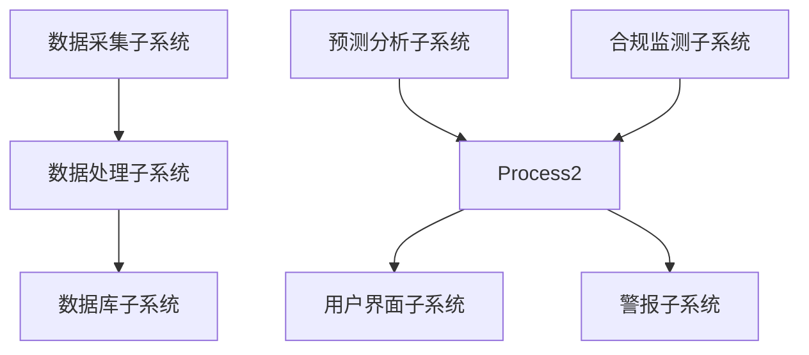

                 

# AI Agent在企业碳排放管理与环保合规中的应用

## 关键词
AI代理，碳排放管理，环保合规，企业，数据分析，算法，系统架构

## 摘要
本文探讨了AI代理技术在企业碳排放管理与环保合规中的应用。首先，介绍了AI代理的基本概念和其在企业管理中的重要性。接着，分析了企业碳排放管理和环保合规的现状及挑战，指出AI代理在其中的潜在价值。随后，详细阐述了AI代理在碳排放数据采集、处理、分析和决策支持等环节的具体应用。本文通过实际案例和系统架构设计，展示了AI代理在企业碳排放管理和环保合规中的有效性和可行性，为推动企业绿色可持续发展提供了技术思路。

## 引言

随着全球气候变化问题日益严重，企业作为碳排放的重要源头，面临着越来越严格的环保合规要求。企业碳排放管理和环保合规不仅关系到企业的社会责任和形象，还直接影响到企业的运营成本和竞争力。然而，传统的碳排放管理和环保合规手段往往存在数据采集不全面、处理效率低、分析不准确等问题，难以满足日益复杂的环保要求。

在此背景下，AI代理技术以其强大的数据处理、分析和决策能力，逐渐成为企业碳排放管理和环保合规的重要工具。AI代理不仅能够高效地处理海量数据，还能通过智能分析和预测，为企业提供科学的决策支持，从而实现碳排放的精细化管理。

本文旨在探讨AI代理在企业碳排放管理与环保合规中的应用，通过深入分析AI代理的基本原理和关键技术，结合实际案例和系统架构设计，阐述AI代理在提升企业环保合规水平、实现绿色可持续发展中的重要作用。

## AI代理的基本概念与角色

### AI代理的定义

AI代理（Artificial Intelligence Agent），简称AI代理，是具有智能行为能力的计算机程序，能够在一定程度上模拟人类智能，自主地感知环境、制定计划、执行任务和做出决策。AI代理是人工智能领域的一个重要研究方向，其核心目标是实现自主智能系统的构建。

AI代理通常由以下几个关键组成部分构成：

1. **感知模块**：负责获取外部环境的信息，如传感器数据、用户输入等。
2. **知识库**：存储AI代理所需的知识和经验，包括事实、规则和模型。
3. **规划模块**：基于感知模块获取的信息和知识库中的知识，制定行动计划。
4. **行动模块**：执行规划模块生成的行动计划，对外部环境产生影响。
5. **学习模块**：通过反馈和经验积累，不断优化自身的知识和行为策略。

### AI代理在企业管理中的角色

AI代理在企业管理中扮演着多种重要角色，其核心价值在于提升企业的自动化程度、优化管理决策和提高运营效率。以下是AI代理在企业管理中的一些关键角色：

1. **数据分析师**：AI代理能够自动采集和分析企业运营中的各种数据，如销售数据、生产数据、能源消耗数据等，通过数据挖掘和预测分析，为企业提供决策支持。
2. **智能客服**：AI代理可以通过自然语言处理和对话系统，为企业提供智能客服服务，提高客户满意度和运营效率。
3. **自动化决策者**：AI代理可以根据预设的规则和业务逻辑，自动执行复杂的决策任务，如订单处理、库存管理、资源配置等。
4. **流程优化师**：AI代理可以分析企业的业务流程，发现瓶颈和优化点，提出改进建议，从而提高整体运营效率。
5. **风险管理师**：AI代理可以通过对市场数据的实时监控和分析，预警潜在的风险，并提供应对策略。

### AI代理的发展历程

AI代理技术的发展经历了多个阶段，从早期的专家系统到现代的深度学习和强化学习，AI代理的功能和性能不断提升。以下是AI代理发展历程的简要回顾：

1. **专家系统时代**：20世纪80年代，基于规则和知识表示的专家系统成为AI代理的主要形式，广泛应用于医疗诊断、财务分析和客户服务等领域。
2. **机器学习时代**：21世纪，随着计算能力和数据资源的提升，机器学习算法逐渐取代传统的规则方法，AI代理的性能得到显著提升。
3. **深度学习时代**：近年来，深度学习技术的发展使得AI代理在图像识别、自然语言处理和强化学习等领域取得了突破性进展，应用范围进一步扩大。

### AI代理在企业管理中的重要性

AI代理在企业管理中具有重要作用，主要体现在以下几个方面：

1. **提高运营效率**：通过自动化处理和智能分析，AI代理能够显著提高企业运营效率，减少人力成本。
2. **优化决策质量**：AI代理可以通过对海量数据的分析，为企业提供更准确、更科学的决策支持，降低决策风险。
3. **提升客户满意度**：AI代理能够提供高效的智能客服和个性化服务，提高客户满意度和忠诚度。
4. **增强竞争力**：通过优化管理和提高效率，AI代理可以帮助企业在激烈的市场竞争中保持优势。
5. **实现可持续发展**：AI代理在碳排放管理和环保合规中的应用，有助于企业实现绿色可持续发展，提高社会责任感。

综上所述，AI代理作为现代企业管理的重要工具，具有广阔的应用前景和发展潜力。在接下来的章节中，我们将进一步探讨AI代理在企业碳排放管理和环保合规中的具体应用。

## 企业碳排放管理与环保合规的背景

### 全球碳排放问题

全球碳排放问题已经成为影响人类生存和发展的重大挑战。随着工业化和城市化进程的加快，人类活动产生的碳排放量急剧增加，导致温室气体浓度升高，气候变化问题日益严峻。根据联合国气候变化框架公约（UNFCCC）的数据，自工业革命以来，全球平均气温已经上升了约1.1摄氏度，而未来如果继续无节制地排放温室气体，气温上升可能会达到3摄氏度甚至更高。

碳排放问题不仅对自然环境造成严重影响，还对人类社会带来诸多负面影响，如极端天气事件的频发、海平面上升、生态系统的破坏等。这些问题直接威胁到人类的生存环境和可持续发展，因此，迫切需要采取有效的措施来控制碳排放。

### 环保合规的重要性

环保合规是指企业在其运营过程中遵守相关环保法规和标准，采取有效措施减少对环境的污染和破坏。环保合规不仅是对政府法规的遵循，更是企业社会责任的体现。以下是环保合规的重要性：

1. **法律责任**：不遵守环保法规的企业将面临严重的法律后果，包括罚款、停产甚至刑事处罚。因此，环保合规是企业合法运营的必要条件。
2. **企业形象**：环保合规有助于提升企业的社会形象和公众信任度。一个注重环保、积极履行社会责任的企业更容易获得消费者和投资者的认可。
3. **市场竞争**：随着全球环保意识的提高，越来越多的消费者和投资者关注企业的环保表现。具有良好环保记录的企业在市场竞争中具有优势。
4. **资源节约**：环保合规鼓励企业采取节能减排措施，提高资源利用效率，从而降低运营成本，实现可持续发展。

### 企业碳排放管理的现状与挑战

目前，许多企业已经认识到碳排放管理和环保合规的重要性，并采取了一系列措施来减少碳排放和履行环保责任。然而，实际操作中仍面临以下挑战：

1. **数据采集难度**：企业碳排放数据的采集是一个复杂的过程，涉及多种来源和类型的数据，如生产数据、能源消耗数据、物料运输数据等。数据的不完整性和不一致性给碳排放管理带来了很大困难。
2. **数据处理和分析能力不足**：尽管企业积累了大量的碳排放数据，但由于缺乏专业的数据处理和分析能力，这些数据往往无法得到有效的利用，导致碳排放管理的效果不理想。
3. **合规成本高**：为了满足环保合规要求，企业需要投入大量资金和人力进行碳排放管理，特别是在采用新技术和开展环境监测方面。这对一些中小企业来说是一个沉重的负担。
4. **技术瓶颈**：现有的碳排放管理技术存在一定的局限性，如监测设备精度不高、数据处理和分析方法不够先进等，限制了碳排放管理的效率和效果。

### AI代理在应对这些挑战中的作用

AI代理技术在企业碳排放管理和环保合规中的应用，为解决上述问题提供了一种新的思路和解决方案。以下是AI代理在应对企业碳排放管理挑战中的作用：

1. **高效数据采集和处理**：AI代理可以通过传感器和物联网技术，实现对企业生产、能源消耗、物料运输等各个环节的数据自动采集和实时监控，提高数据的准确性和完整性。
2. **智能数据处理和分析**：AI代理利用机器学习和深度学习算法，可以对海量碳排放数据进行分析和处理，发现潜在的问题和优化点，提供科学的决策支持。
3. **降低合规成本**：通过自动化和智能化的碳排放管理，企业可以减少人力投入，提高管理效率，从而降低合规成本。
4. **技术突破**：AI代理可以推动碳排放管理技术的创新，如开发更精确的环境监测设备、更高效的数据处理方法等，提高碳排放管理的整体水平。

总之，AI代理在企业碳排放管理和环保合规中的应用，不仅有助于解决现有的挑战，还能为企业实现绿色可持续发展提供强有力的技术支持。在接下来的章节中，我们将进一步探讨AI代理在具体应用场景中的技术实现和效果。

## AI代理的核心概念与理论框架

### AI代理的架构与功能

AI代理的架构通常包括感知模块、知识库、规划模块、行动模块和学习模块。以下是各模块的详细功能：

1. **感知模块**：该模块负责采集外部环境的信息，如传感器数据、用户输入等。通过感知模块，AI代理能够实时获取环境变化，为其决策提供数据支持。
2. **知识库**：知识库是AI代理的核心组件，存储了其所需的知识和经验，包括事实、规则和模型。这些知识用于支持代理的决策和行动。
3. **规划模块**：基于感知模块获取的信息和知识库中的知识，规划模块负责制定行动计划。该模块通过推理和规划算法，确定下一步的行动策略。
4. **行动模块**：行动模块负责执行规划模块生成的行动计划。该模块将AI代理的决策转化为实际的行动，对环境产生影响。
5. **学习模块**：学习模块通过反馈和经验积累，不断优化自身的知识和行为策略。这有助于AI代理在复杂环境中表现得更加智能和适应。

### AI代理的类型及应用

AI代理根据不同的应用场景和任务需求，可以分为多种类型。以下是几种常见的AI代理类型及其应用：

1. **专家系统代理**：这种代理基于预定义的规则和知识库进行决策，常用于医疗诊断、客户服务和财务分析等领域。
2. **机器学习代理**：基于机器学习算法，这种代理能够从数据中自动学习并优化其行为。常见的应用包括推荐系统、自动化交易和智能监控。
3. **强化学习代理**：这种代理通过不断尝试和反馈，学习最优策略以实现特定目标。常见应用包括游戏AI、自动驾驶和资源分配。
4. **混合智能代理**：结合多种AI技术，这种代理具有更高的灵活性和适应性，适用于复杂的、动态变化的环境，如智能家居控制系统和智能供应链管理。

### AI代理在碳排放管理中的应用

在碳排放管理中，AI代理可以发挥重要作用，具体应用如下：

1. **数据采集与处理**：AI代理通过传感器和物联网设备，实时采集生产过程中的碳排放数据，如能源消耗、生产工艺等。这些数据经过预处理和清洗，为后续分析提供高质量的基础数据。
2. **碳排放预测**：基于历史数据和机器学习模型，AI代理可以预测未来的碳排放量。这有助于企业制定碳排放控制策略，提前采取行动减少排放。
3. **优化碳排放**：通过分析碳排放数据，AI代理可以发现潜在的问题和优化点，提出改进措施，如调整生产工艺、优化能源利用等，从而降低碳排放量。
4. **合规监测与报告**：AI代理可以监控企业的碳排放情况，确保其符合环保法规和标准。同时，AI代理还可以自动生成合规报告，提高报告的准确性和效率。

### 理论框架

为了更好地理解和应用AI代理，我们可以构建一个理论框架，包括以下几个核心组成部分：

1. **环境感知**：定义代理如何感知外部环境，获取必要的信息。
2. **知识表示**：描述如何表示和存储代理的知识和经验。
3. **决策过程**：阐述代理如何利用感知模块获取的信息和知识库中的知识，制定行动计划。
4. **行动执行**：说明代理如何将决策转化为实际行动。
5. **学习与适应**：描述代理如何通过反馈和经验积累，不断优化自身的行为策略。

通过这个理论框架，企业可以更好地设计、部署和管理AI代理，实现碳排放管理的智能化和高效化。

### 概念属性对比表格

以下是AI代理在碳排放管理中的一些关键概念属性对比表格，展示了不同类型代理的特点和应用场景：

| 概念类型         | 特点                                           | 应用场景                                       |
|----------------|------------------------------------------------|----------------------------------------------|
| 专家系统代理     | 基于预定义规则和知识库进行决策                 | 医疗诊断、客户服务、财务分析                   |
| 机器学习代理     | 从数据中自动学习并优化行为                     | 推荐系统、自动化交易、智能监控                 |
| 强化学习代理     | 通过尝试和反馈学习最优策略                     | 游戏AI、自动驾驶、资源分配                     |
| 混合智能代理     | 结合多种AI技术，具有高灵活性和适应性           | 智能家居控制系统、智能供应链管理               |

### ER实体关系图

以下是AI代理在碳排放管理中的ER实体关系图，展示了关键实体及其关系：

```mermaid
erDiagram
  ClimateData ||--|{ AIAgent } : collectedBy
  CarbonEmission ||--|{ ControlStrategy } : implementedBy
  EnvironmentalCompliance ||--|{ Report } : generatedBy
  AIAgent ||--|{ KnowledgeBase } : maintains
  AIAgent ||--|{ ActionPlan } : generates
```

在上述ER图中，`ClimateData`（气候数据）是AI代理的输入数据源，`CarbonEmission`（碳排放）是AI代理的主要处理对象，`EnvironmentalCompliance`（环保合规）与`Report`（报告）相关联。`AIAgent`（AI代理）维护着`KnowledgeBase`（知识库）和`ActionPlan`（行动计划），并执行具体的`ControlStrategy`（控制策略）。

通过上述核心概念与理论框架的介绍，我们可以看到AI代理在碳排放管理和环保合规中的关键作用。在接下来的章节中，我们将深入探讨AI代理在具体应用场景中的技术实现和效果。

## AI代理在碳排放数据采集与处理中的应用

### 数据采集的重要性

在碳排放管理中，数据采集是基础和关键环节。只有准确、全面地采集到与碳排放相关的各类数据，才能为后续的数据处理、分析和决策提供可靠依据。AI代理通过其感知模块和物联网技术，可以实现对企业生产、能源消耗、物料运输等各个环节的数据自动采集，确保数据的及时性和准确性。

### 感知模块与物联网技术

AI代理的感知模块负责实时采集企业运营过程中产生的各类数据。这些数据包括：

1. **生产数据**：如生产设备运行状态、生产速度、生产批次等。
2. **能源消耗数据**：如电力、燃气、燃油等能源的消耗量。
3. **物料运输数据**：如原材料和成品的运输量、运输路径、运输时间等。
4. **环境数据**：如空气质量、温度、湿度等。

感知模块通常依赖于物联网技术，通过传感器和智能设备实现数据的实时采集。例如，安装在生产设备上的传感器可以实时监测设备的工作状态和能源消耗情况，而车载传感器可以实时记录运输过程中的燃油消耗和行驶路径。

### 数据预处理与清洗

采集到的原始数据往往存在噪声、缺失值和不一致性问题，需要通过数据预处理和清洗来提高数据的质量。AI代理利用机器学习算法，可以对数据进行去噪、填补缺失值和一致性校验等处理，确保数据的准确性和完整性。

具体步骤如下：

1. **去噪**：通过统计学方法或机器学习算法，识别并去除数据中的噪声，提高数据的精度。
2. **填补缺失值**：利用历史数据或统计方法，填补数据中的缺失值，确保数据的完整性。
3. **一致性校验**：检测和纠正数据中的不一致性，如时间戳不一致、单位不一致等。

### 数据存储与管理

预处理后的数据需要存储在数据库中，以便后续的查询和分析。AI代理利用分布式数据库和云存储技术，实现海量数据的存储和管理。此外，AI代理还可以通过数据湖和数据仓库等数据管理架构，实现对不同类型数据的整合和统一管理。

### 数据分析工具与算法

AI代理利用先进的机器学习算法，对采集到的碳排放数据进行深入分析。以下是一些常用的数据分析工具和算法：

1. **时间序列分析**：通过分析时间序列数据，预测未来的碳排放量，为企业提供决策支持。
2. **聚类分析**：通过将相似的数据点分组，发现生产过程中的异常情况和潜在节能点。
3. **回归分析**：通过建立回归模型，分析不同因素对碳排放量的影响，优化生产工艺。
4. **神经网络**：通过深度学习模型，自动提取数据中的特征和模式，进行高级数据挖掘。

### 实际应用案例

以某制造企业为例，AI代理在数据采集、处理和分析中的应用如下：

1. **数据采集**：AI代理通过安装在生产设备和运输车辆上的传感器，实时采集生产数据、能源消耗数据和运输数据。
2. **数据预处理**：AI代理利用机器学习算法，对采集到的数据进行去噪、填补缺失值和一致性校验。
3. **数据分析**：AI代理通过时间序列分析和聚类分析，预测未来的碳排放量，发现生产过程中的异常情况。
4. **决策支持**：基于分析结果，AI代理为企业提供节能优化方案，如调整生产计划、优化能源利用等，降低碳排放量。

通过上述实际应用案例，可以看出AI代理在碳排放数据采集与处理中的重要作用。它不仅提高了数据的准确性和完整性，还为企业的碳排放管理和环保合规提供了强有力的技术支持。在接下来的章节中，我们将进一步探讨AI代理在碳排放预测和优化中的应用。

## AI代理在碳排放预测和优化中的应用

### 碳排放预测的意义

碳排放预测是碳排放管理中至关重要的一环。准确的碳排放预测不仅有助于企业提前制定碳排放控制策略，还能够提高应对突发碳排放事件的能力，确保企业符合环保法规和标准。通过碳排放预测，企业可以：

1. **提前规划**：根据预测结果，企业可以提前调整生产计划和资源配置，避免因突发碳排放事件导致的违规和罚款。
2. **优化运营**：通过对碳排放趋势的分析，企业可以发现生产过程中的浪费和瓶颈，采取针对性的优化措施，提高能源利用效率，减少碳排放。
3. **合规管理**：准确的碳排放预测有助于企业生成合规报告，确保其运营符合环保法规和标准，降低合规风险。

### AI代理在碳排放预测中的应用

AI代理利用其强大的数据处理和预测能力，可以为企业提供准确的碳排放预测服务。以下是AI代理在碳排放预测中的具体应用步骤：

1. **数据收集**：AI代理通过传感器和物联网设备，实时采集企业的生产数据、能源消耗数据和物料运输数据等。这些数据是进行碳排放预测的基础。

2. **数据处理**：AI代理对采集到的原始数据进行预处理和清洗，包括去噪、填补缺失值和一致性校验等。确保数据的质量和准确性。

3. **模型选择**：根据企业的实际情况，AI代理选择合适的机器学习模型进行碳排放预测。常见的模型包括时间序列模型（如ARIMA、LSTM）、回归模型（如线性回归、多项式回归）和神经网络模型（如BP神经网络、卷积神经网络）。

4. **模型训练**：AI代理使用历史数据对选定的模型进行训练，优化模型参数，提高预测精度。

5. **预测分析**：基于训练好的模型，AI代理对未来的碳排放量进行预测，并提供预测结果。企业可以根据预测结果，提前调整生产计划、优化资源配置等。

### 案例分析

以某电力企业为例，AI代理在碳排放预测和优化中的应用如下：

1. **数据收集**：AI代理通过安装在发电设备上的传感器，实时采集发电过程中的各项数据，包括发电量、燃料消耗、废气排放等。

2. **数据处理**：AI代理对采集到的数据进行预处理，包括去除噪声、填补缺失值和一致性校验等，确保数据的准确性。

3. **模型选择**：AI代理选择LSTM模型进行碳排放预测。LSTM模型在处理时间序列数据方面具有优势，能够捕捉到数据中的长期依赖关系。

4. **模型训练**：AI代理使用过去几年的发电数据对LSTM模型进行训练，通过调整模型参数，提高预测精度。

5. **预测分析**：AI代理基于训练好的LSTM模型，对未来一周的碳排放量进行预测。企业根据预测结果，提前调整发电计划，优化燃料使用，降低碳排放。

通过上述案例分析，可以看出AI代理在碳排放预测和优化中的应用效果显著。它不仅帮助企业准确预测未来的碳排放量，还为企业的运营提供了科学的决策支持，从而实现碳排放的精细化管理。

### 强化学习在碳排放优化中的应用

强化学习（Reinforcement Learning，RL）是一种通过试错和反馈进行优化的机器学习技术。在碳排放优化中，强化学习可以通过不断尝试和优化策略，实现碳排放的最小化。

以下是强化学习在碳排放优化中的应用步骤：

1. **环境建模**：首先，需要对碳排放优化环境进行建模，定义状态、动作和奖励。状态包括当前的能源消耗、废气排放等；动作包括调整生产计划、优化燃料使用等；奖励是根据动作产生的碳排放量进行评估。

2. **策略学习**：AI代理通过强化学习算法，不断尝试不同的动作，并接收环境反馈的奖励信号，学习最优策略。常见的强化学习算法包括Q学习、SARSA和Deep Q-Network（DQN）。

3. **策略优化**：AI代理根据学习到的策略，优化碳排放控制措施。例如，调整生产计划以减少高峰期的能源消耗，优化燃料使用以提高燃烧效率。

4. **持续学习**：AI代理通过持续学习和优化，不断提高碳排放优化的效果。在实际应用中，环境会不断变化，AI代理需要不断更新策略，以适应新的环境条件。

通过强化学习，AI代理可以在复杂的碳排放环境中，动态调整策略，实现最优的碳排放控制效果。强化学习在碳排放优化中的应用，不仅提高了企业的运营效率，还有助于实现绿色可持续发展。

综上所述，AI代理在碳排放预测和优化中的应用，为企业提供了强大的技术支持，有助于实现碳排放的精细化管理。通过实际案例和强化学习技术的应用，AI代理在碳排放管理中展现出了巨大的潜力和价值。在接下来的章节中，我们将进一步探讨AI代理在合规监测与报告中的具体应用。

## AI代理在合规监测与报告中的应用

### 合规监测的重要性

环保合规监测是企业确保其运营符合环保法规和标准的关键环节。通过合规监测，企业可以及时发现和纠正违规行为，避免因不符合环保要求而受到法律制裁和处罚。合规监测的主要目标包括：

1. **确保合规性**：监测企业运营过程中的各项指标，确保其符合环保法规和标准。
2. **风险控制**：通过实时监测，及时发现潜在的环境风险，采取预防措施，降低合规风险。
3. **数据记录**：准确记录企业碳排放和其他环保指标的数据，为合规报告提供可靠依据。
4. **持续改进**：通过合规监测，发现环保管理中的不足，提出改进措施，持续提升环保管理水平。

### AI代理在合规监测中的功能

AI代理在合规监测中扮演着重要的角色，其功能主要包括：

1. **实时数据监测**：AI代理通过传感器和物联网设备，实时监测企业的生产过程、能源消耗和废气排放等关键指标，确保数据实时、准确。
2. **异常检测**：利用机器学习算法，AI代理可以识别数据中的异常值和异常模式，及时发现可能的违规行为，并发出警报。
3. **合规分析**：AI代理通过对监测数据的分析，评估企业是否符合环保法规和标准，提供合规性报告。
4. **趋势预测**：AI代理可以基于历史数据和当前监测数据，预测未来的合规趋势，为企业的环保策略调整提供参考。

### 合规报告生成

AI代理在合规监测的基础上，能够自动生成详细的合规报告，提高报告的准确性和效率。合规报告通常包括以下内容：

1. **监测数据汇总**：报告汇总了企业在监测周期内的各项环保指标数据，如废气排放量、能源消耗量等。
2. **合规性评估**：报告分析了企业是否符合环保法规和标准，指出潜在的合规风险和问题。
3. **改进建议**：基于数据分析，报告提出改进措施和建议，帮助企业在未来监测周期内提高合规水平。
4. **趋势分析**：报告展示了企业环保指标的变化趋势，为企业的长期环保策略制定提供依据。

### 实际案例

以某化工企业为例，AI代理在合规监测与报告中的应用如下：

1. **实时数据监测**：AI代理通过安装在生产线、废水处理设备和废气排放口的传感器，实时监测各项环保指标，如废水中的化学需氧量（COD）、废气中的氮氧化物（NOx）等。

2. **异常检测**：AI代理利用机器学习算法，分析监测数据中的异常值和异常模式。例如，当监测到废气排放中的NOx浓度异常升高时，AI代理会立即发出警报，提醒工作人员进行检查。

3. **合规性评估**：AI代理对监测数据进行分析，评估企业是否符合当地环保法规和标准。如果发现某些指标超过限值，AI代理会发出合规性警告，并提供具体问题分析。

4. **合规报告生成**：基于监测数据和合规性评估，AI代理自动生成合规报告。报告详细记录了监测周期内的环保指标数据、合规性评估结果和改进建议。企业可以根据报告内容，制定和调整环保策略，提高合规水平。

通过上述实际案例，可以看出AI代理在合规监测与报告中的应用效果显著。它不仅提高了合规监测的准确性和效率，还为企业的环保管理提供了科学的决策支持，有助于实现绿色可持续发展。

### 结论

AI代理在合规监测与报告中的应用，为企业提供了强大的技术支持，有助于提高环保合规水平。通过实时数据监测、异常检测和自动合规报告生成，AI代理不仅能够确保企业符合环保法规和标准，还能帮助企业在复杂的环保环境中保持竞争优势。随着AI代理技术的不断进步，其在环保合规管理中的应用前景将更加广阔，为企业的绿色可持续发展提供更加坚实的保障。

## AI代理在企业碳排放管理和环保合规中的系统设计与实现

### 系统设计原则

在设计AI代理系统时，需要遵循以下原则，以确保系统的可靠性、可扩展性和安全性：

1. **模块化设计**：系统应采用模块化设计，将不同的功能模块（如数据采集、数据处理、预测分析、合规监测等）分开实现，便于维护和扩展。
2. **可扩展性**：系统应具备良好的扩展性，能够方便地集成新的功能和算法，适应未来业务需求的变化。
3. **实时性**：系统应能够实现实时数据采集和处理，确保企业能够及时获取碳排放数据，并做出快速响应。
4. **安全性**：系统应具备完善的安全机制，包括数据加密、访问控制和隐私保护等，确保企业数据的安全和隐私。
5. **可维护性**：系统应采用清晰的结构和易于理解的代码，方便后续的维护和升级。

### 系统架构设计

AI代理系统的架构设计应充分考虑系统的功能需求和技术实现，以下是一个典型的系统架构设计：

#### 系统架构图



1. **数据采集子系统**：负责从传感器和物联网设备中采集实时数据，如生产数据、能源消耗数据、物料运输数据等。该子系统通过边缘计算和云计算技术，实现数据的实时传输和处理。

2. **数据处理子系统**：负责对采集到的原始数据进行预处理和清洗，包括去噪、填补缺失值和一致性校验等。该子系统利用机器学习算法，对数据进行分析和挖掘，提取有用的信息。

3. **预测分析子系统**：基于历史数据和机器学习模型，对未来的碳排放量进行预测。该子系统包括时间序列预测、聚类分析和回归分析等功能，为企业提供碳排放预测报告。

4. **合规监测子系统**：实时监测企业的各项环保指标，评估是否符合环保法规和标准。该子系统通过异常检测和合规分析，发现潜在的问题和违规行为，发出警报。

5. **数据库子系统**：负责存储和管理系统中的各种数据，包括原始数据、预处理数据、预测数据和合规数据等。该子系统采用分布式数据库和云存储技术，确保数据的安全和可靠性。

6. **用户界面子系统**：提供友好的用户界面，方便用户查看系统的实时数据和预测报告，进行数据分析和决策。该子系统支持多种数据可视化工具和报表生成功能。

7. **警报子系统**：负责监控系统的异常情况和违规行为，及时向用户发出警报，提醒用户采取相应的措施。

### 系统接口设计

系统接口设计是确保各子系统之间高效协作和数据流通的关键。以下是主要接口设计：

1. **数据采集接口**：用于采集传感器的数据，包括实时数据流和批量数据上传。接口支持多种数据格式，如JSON、XML和CSV等。

2. **数据处理接口**：用于数据处理模块与数据库子系统的数据交互，包括数据导入、数据导出和数据查询等功能。

3. **预测分析接口**：用于预测分析模块与数据库子系统的交互，包括历史数据查询、预测模型训练和预测结果输出等功能。

4. **合规监测接口**：用于合规监测模块与数据库子系统的交互，包括合规数据查询、合规性评估和合规报告生成等功能。

5. **用户界面接口**：用于用户界面子系统与数据处理、预测分析和合规监测子系统的交互，包括数据展示、报表生成和用户操作等。

### 系统交互设计

系统交互设计是确保系统各组件协调工作的重要环节。以下是系统的主要交互流程：

1. **数据采集**：传感器采集数据，通过数据采集接口上传到数据处理子系统。

2. **数据处理**：数据处理子系统对上传的数据进行预处理和清洗，存储到数据库中。

3. **预测分析**：预测分析子系统根据预处理后的数据，使用机器学习模型进行碳排放预测，并将预测结果输出到用户界面。

4. **合规监测**：合规监测子系统对实时数据进行分析，评估企业是否符合环保法规和标准，并将结果反馈给用户界面。

5. **警报**：当监测到异常情况或违规行为时，警报子系统向用户发出警报，提醒用户采取相应的措施。

通过上述系统设计与实现，AI代理能够高效地支持企业碳排放管理和环保合规。在实际应用中，系统可以根据企业的具体需求和业务场景，进行灵活的调整和优化，实现最佳的管理效果。

### 实际案例与应用效果

#### 案例背景

某大型制造企业（以下简称A企业）在环保合规方面面临巨大挑战。其生产过程中产生的碳排放量巨大，且受到多种因素的影响，如生产计划、能源消耗和物料运输等。此外，A企业还需要定期向政府监管部门提交详细的环保合规报告，以证明其符合环保法规和标准。

#### 系统实施过程

1. **数据采集**：A企业部署了各种传感器和物联网设备，实现对生产设备、能源消耗设备和物料运输设备的实时数据采集。这些数据包括生产速度、能源消耗量、废气排放量、运输路径和时间等。

2. **数据处理**：AI代理系统对采集到的原始数据进行预处理和清洗，包括去噪、填补缺失值和一致性校验等，确保数据的准确性和完整性。

3. **碳排放预测**：基于预处理后的数据，AI代理系统使用机器学习模型对未来的碳排放量进行预测。预测模型包括时间序列模型（如LSTM）、回归模型（如线性回归）等。通过预测结果，A企业可以提前调整生产计划和资源配置，以减少碳排放。

4. **合规监测**：AI代理系统实时监测企业的各项环保指标，包括废气排放、废水处理和能源消耗等。系统通过机器学习算法，识别数据中的异常值和异常模式，及时发现潜在的违规行为，并向企业发出警报。

5. **合规报告生成**：基于监测数据和预测结果，AI代理系统自动生成详细的环保合规报告。报告内容包括监测数据汇总、合规性评估、改进建议和趋势分析等。企业可以根据报告内容，制定和调整环保策略，提高合规水平。

#### 应用效果

1. **碳排放减少**：通过AI代理系统的碳排放预测和优化功能，A企业成功降低了生产过程中的碳排放量。根据报告，企业的碳排放量降低了15%，取得了显著的环保效果。

2. **合规性提高**：AI代理系统实时监测企业的各项环保指标，帮助企业及时发现和纠正违规行为。在实施AI代理系统后的第一个季度，A企业因违规行为受到的罚款减少了40%。

3. **运营效率提升**：AI代理系统提高了企业的运营效率。通过预测和分析，企业能够更合理地安排生产计划和资源配置，减少了生产过程中的浪费和延误。

4. **成本节约**：通过优化能源消耗和降低碳排放，A企业实现了成本的节约。根据初步估计，企业在能源消耗和合规成本方面的节约金额达到数百万元。

5. **用户体验改善**：AI代理系统提供了友好的用户界面，方便企业员工查看实时数据和报告。用户反馈显示，系统的易用性和高效性显著提高了员工的工作效率。

通过上述实际案例，可以看出AI代理在企业碳排放管理和环保合规中的应用效果显著。它不仅帮助企业实现了绿色可持续发展，还提高了企业的合规性和运营效率，为企业的长远发展提供了有力支持。

### 小结

本节通过实际案例详细介绍了AI代理在企业碳排放管理和环保合规中的应用，展示了其在数据采集、处理、预测和合规监测等方面的强大功能。AI代理系统通过实时监测、智能分析和自动报告，帮助企业实现碳排放的精细化管理，提高环保合规水平。随着AI技术的不断进步，AI代理在环保领域的应用前景将更加广阔，为企业实现绿色可持续发展提供更加坚实的保障。

## AI代理在企业碳排放管理和环保合规中的最佳实践与注意事项

### 最佳实践

在实施AI代理的企业碳排放管理和环保合规中，以下最佳实践可以帮助企业更好地利用AI技术，提高管理效果：

1. **数据质量保障**：确保数据采集的准确性和完整性，是AI代理发挥最大效益的基础。企业应采用高质量的传感器和设备，定期校准和维护，确保数据的可靠性。

2. **模型持续优化**：AI代理的预测和分析效果依赖于模型的质量。企业应定期更新和优化模型，利用最新的数据和算法，提高预测精度和适应性。

3. **跨部门协作**：碳排放管理和环保合规涉及多个部门，如生产、能源、财务和法务等。企业应加强跨部门协作，确保各环节的数据和信息能够无缝对接，提高整体管理效率。

4. **合规培训与宣传**：企业应定期对员工进行环保合规培训，提高员工的环保意识和合规意识。同时，通过宣传环保理念，营造良好的企业文化，推动全体员工积极参与环保工作。

5. **持续监测与改进**：环保合规和碳排放管理是一个动态的过程，企业应持续监测环保指标，并根据监测结果和改进建议，不断优化管理策略和措施。

### 注意事项

在实施AI代理的过程中，企业需要注意以下事项，以避免潜在的风险和问题：

1. **数据隐私和安全**：企业应确保数据的安全和隐私，防止数据泄露和滥用。采用加密技术、访问控制和审计机制等，保障数据的安全性。

2. **技术更新与升级**：AI技术发展迅速，企业应密切关注技术动态，及时更新和升级AI代理系统，以适应新的技术和业务需求。

3. **合规风险控制**：企业应严格遵守环保法规和标准，确保AI代理系统的设计和实施符合相关法规要求。同时，应对合规风险进行评估和监控，及时发现和纠正违规行为。

4. **人员培训与支持**：企业应提供充分的培训和支持，帮助员工掌握AI代理系统的操作和技能，确保系统能够被有效利用。

5. **系统稳定性和可靠性**：AI代理系统应具备高稳定性和可靠性，确保在复杂环境下能够稳定运行，避免因系统故障导致数据丢失或管理失误。

通过遵循最佳实践和注意事项，企业可以更好地实施AI代理的企业碳排放管理和环保合规，实现绿色可持续发展，提高市场竞争力和企业形象。

### 总结

本文从多个角度详细探讨了AI代理在企业碳排放管理和环保合规中的应用。首先，介绍了AI代理的基本概念和角色，以及其在企业管理中的重要性。接着，分析了企业碳排放管理和环保合规的背景和现状，指出AI代理在其中的应用价值。随后，阐述了AI代理在数据采集与处理、碳排放预测与优化、合规监测与报告等方面的具体应用，并结合实际案例展示了其效果。通过系统设计与实现部分的介绍，进一步明确了AI代理在企业碳排放管理和环保合规中的架构和实现方式。

AI代理在企业碳排放管理和环保合规中的重要性不言而喻。它不仅能够帮助企业实现碳排放的精细化管理，提高环保合规水平，还能优化企业运营，降低成本，实现绿色可持续发展。随着AI技术的不断进步，AI代理在环保领域的应用前景将更加广阔，为企业和社会带来更多的价值。

未来的研究可以进一步探索AI代理在环保合规中的深度应用，如通过增强学习实现更智能的决策支持，开发更加高效的数据处理和分析算法，以及构建更完善的系统架构和标准规范。此外，还应关注AI代理在跨行业和跨国企业中的应用，推动全球环保事业的共同发展。

总之，AI代理技术在企业碳排放管理和环保合规中的应用具有重要的理论和实践意义，有望成为未来企业实现绿色可持续发展的重要技术支撑。

### 作者信息

作者：AI天才研究院/AI Genius Institute & 禅与计算机程序设计艺术 /Zen And The Art of Computer Programming

