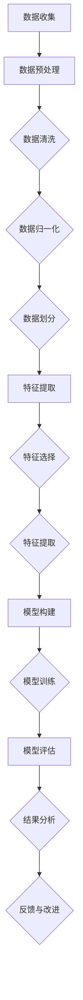
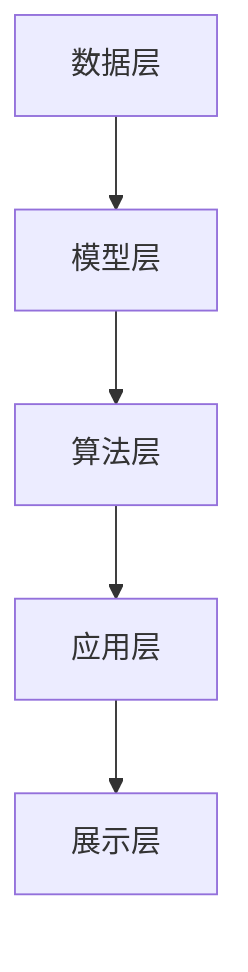
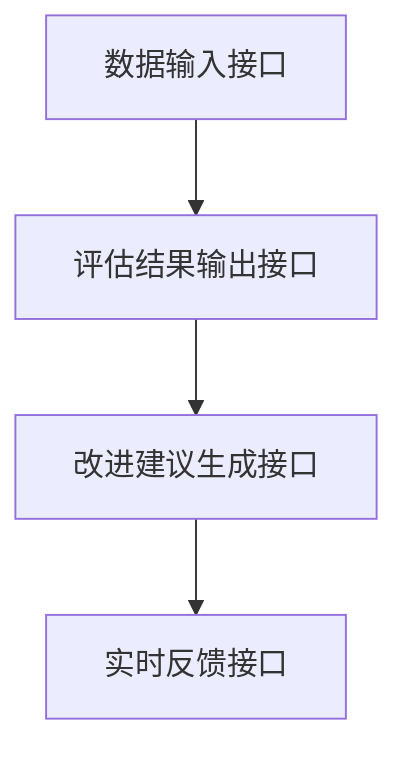
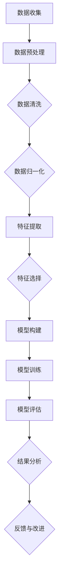

                 

## 第一部分：引言

### 第1章：问题背景与核心概念

### 1.1 问题背景

在当前全球化、信息化的商业环境中，企业的竞争已不仅仅局限于产品或服务的优劣，更多的是依赖于企业整体的组织效能和文化。组织文化被视为企业成功的关键因素之一，它不仅影响员工的工作态度和行为，还直接关系到企业的创新力、执行力和市场竞争力。因此，对企业组织文化的评估和塑造成为企业管理中的一项重要任务。

#### 1.1.1 企业组织文化的意义

企业组织文化是指企业在长期运营过程中所形成的一系列共同的价值观、信念、行为规范和工作方式。它不仅是一种精神力量，更是一种无形资产，可以激发员工的创造力和奉献精神，增强企业的凝聚力和核心竞争力。一个健康的组织文化能够促进企业的持续发展和创新，提升员工的工作满意度和忠诚度，从而为企业带来长期的利益。

#### 1.1.2 现代企业面临的组织文化问题

然而，现代企业在发展过程中面临着诸多组织文化方面的问题。首先，组织文化的评估和塑造往往缺乏系统性和科学性，很多企业仅凭主观感受或经验来评判组织文化，导致评估结果不够准确和全面。其次，组织文化的问题往往具有隐蔽性，不易被察觉和解决。此外，随着企业的快速发展和变革，原有的组织文化可能不再适应新的业务需求，从而导致文化冲突和失衡。

#### 1.1.3 AI Agent在组织文化评估中的应用潜力

为了解决上述问题，人工智能（AI）技术的引入成为一个重要的方向。AI Agent，即人工智能代理，是指能够模拟人类智能行为，执行特定任务的计算机程序。在组织文化评估中，AI Agent具有以下应用潜力：

1. **自动化与效率**：AI Agent可以自动化进行组织文化的评估工作，提高评估的效率和准确性。
2. **客观性与全面性**：通过大数据分析和机器学习算法，AI Agent可以更客观、全面地分析组织文化，发现潜在的问题和挑战。
3. **实时反馈**：AI Agent可以实时监控组织文化的变化，提供及时的反馈和改进建议。
4. **持续优化**：AI Agent可以根据评估结果，不断调整和优化评估模型，提高评估的准确性和可靠性。

### 1.2 核心概念

#### 1.2.1 AI Agent的定义与分类

AI Agent是指能够模拟人类智能行为，自主执行任务的人工智能系统。根据其功能和应用场景，AI Agent可以分为以下几类：

1. **任务型AI Agent**：专注于完成特定任务的AI系统，如客服机器人、自动驾驶系统等。
2. **交互型AI Agent**：能够与用户进行自然语言交互，提供个性化服务的AI系统，如虚拟助手、智能客服等。
3. **决策型AI Agent**：具备决策能力，能够根据环境变化和目标进行决策的AI系统，如智能投顾、智能供应链等。

#### 1.2.2 企业组织文化的定义与特征

企业组织文化是指企业在长期运营过程中所形成的一系列共同的价值观、信念、行为规范和工作方式。其特征包括：

1. **共同价值观**：企业组织文化的核心，是全体员工共同遵循的基本信念和行为准则。
2. **行为规范**：包括企业的规章制度、工作流程、沟通方式等，反映了企业对员工行为的要求。
3. **工作方式**：企业在日常运营中所采用的工作方法和模式，如团队合作、创新机制等。

#### 1.2.3 AI Agent在组织文化评估中的角色

在组织文化评估中，AI Agent主要扮演以下角色：

1. **数据采集与分析**：通过收集和分析企业内部的数据，AI Agent可以客观地了解组织文化的现状。
2. **评估指标构建**：根据评估目标和数据特点，AI Agent可以构建合适的评估指标体系。
3. **评估结果反馈**：通过分析评估结果，AI Agent可以为企业提供针对性的改进建议。

### 1.3 边界与外延

#### 1.3.1 AI Agent应用的局限性

虽然AI Agent在组织文化评估中具有显著的优势，但其应用也面临着一定的局限性：

1. **数据质量和数量**：AI Agent的评估结果依赖于数据的质量和数量，如果数据不足或质量差，评估结果可能不准确。
2. **算法局限**：现有的AI算法在处理复杂、模糊和不确定的数据时，可能存在局限性，影响评估的准确性。
3. **人为干预**：AI Agent的评估结果需要人类进行解读和判断，可能需要结合专业知识和经验进行调整。

#### 1.3.2 组织文化评估的挑战

组织文化评估本身也面临诸多挑战：

1. **文化多样性**：企业内部的员工背景、价值观和态度差异较大，统一评估标准难度较高。
2. **文化变革**：组织文化是一个动态变化的过程，评估需要及时跟进和调整。
3. **主观因素**：评估过程中可能受到主观判断和偏见的影响，影响评估的客观性。

#### 1.3.3 研究的范围与目标

本研究将围绕AI Agent在组织文化评估中的应用展开，旨在：

1. **理论分析**：梳理AI Agent和组织文化评估的核心概念，探讨其关联性和应用潜力。
2. **方法研究**：设计一套基于AI Agent的组织文化评估方法，包括数据采集、处理、评估指标构建和结果分析等。
3. **应用实践**：通过实际案例，验证AI Agent在组织文化评估中的应用效果，提出改进建议。

### 1.4 概念结构与核心要素

#### 1.4.1 企业组织文化的结构

企业组织文化可以分为三个层次：表面文化、深层文化和核心文化。

1. **表面文化**：包括企业的标识、办公环境、员工服饰等，是企业文化的直观表现。
2. **深层文化**：包括企业的价值观、理念、使命和愿景，是组织文化的核心内容。
3. **核心文化**：是企业创始人或领导层所倡导的基本信念和行为准则，是组织文化的灵魂。

#### 1.4.2 AI Agent的组织文化评估流程

AI Agent的组织文化评估流程包括以下步骤：

1. **数据采集**：通过问卷调查、员工访谈、观察记录等方式，收集企业内部的数据。
2. **数据预处理**：对采集到的数据进行清洗、归一化和特征提取，为后续分析做准备。
3. **评估指标构建**：根据评估目标和数据特点，设计合适的评估指标体系。
4. **模型训练与评估**：利用机器学习算法，训练评估模型，并对模型进行评估和优化。
5. **评估结果分析**：根据评估结果，分析企业组织文化的现状和问题，提出改进建议。

#### 1.4.3 关键影响因素与应对策略

在AI Agent的组织文化评估过程中，关键影响因素包括：

1. **数据质量**：提高数据质量，可以通过多次验证、数据清洗和标准化处理来实现。
2. **算法选择**：根据评估目标和数据特点，选择合适的算法，提高评估的准确性。
3. **人为干预**：结合专业知识和经验，对评估结果进行解读和调整，提高评估的客观性。

### 1.5 本章小结

本章介绍了AI Agent在企业组织文化评估与塑造中的应用背景和核心概念。首先，分析了企业组织文化的意义和现代企业面临的组织文化问题，探讨了AI Agent在组织文化评估中的应用潜力。接着，梳理了AI Agent的定义与分类、企业组织文化的定义与特征，以及AI Agent在组织文化评估中的角色。最后，讨论了AI Agent应用的局限性、组织文化评估的挑战以及研究的范围与目标。本章为后续章节的深入探讨奠定了基础。

## 第二部分：AI Agent的组织文化评估

### 第2章：AI Agent的基本原理

#### 2.1 AI Agent的基础知识

AI Agent的基础知识是理解其在组织文化评估中作用的关键。要深入探讨AI Agent，我们首先需要了解人工智能（AI）的发展历程、机器学习和深度学习的核心概念，以及AI Agent的体系结构。

#### 2.1.1 人工智能的发展历程

人工智能（AI）是计算机科学的一个分支，旨在创造智能的机器或程序。其发展历程大致可以分为以下几个阶段：

1. **早期探索**（1950s-1960s）：人工智能概念首次被提出，主要目标是使机器具有人类的某些智能特征，如理解自然语言、推理和解决问题。
2. **人工智能寒冬**（1970s-1980s）：由于技术限制和过高的预期未能实现，人工智能研究进入低谷期。
3. **复兴与进展**（1990s-2000s）：随着计算能力的提升和大数据技术的发展，人工智能研究重新兴起，尤其是机器学习领域的突破。
4. **深度学习时代**（2010s-至今）：深度学习的出现，使得人工智能在图像识别、自然语言处理等领域取得了重大突破。

#### 2.1.2 机器学习和深度学习的核心概念

机器学习和深度学习是AI Agent的核心技术。

1. **机器学习**（Machine Learning）：是一种让计算机通过数据学习并做出决策的技术。机器学习分为监督学习、无监督学习和半监督学习。

   - **监督学习**：通过标记好的训练数据来训练模型，然后使用模型进行预测。
   - **无监督学习**：没有标记的数据，模型需要发现数据中的模式和结构。
   - **半监督学习**：结合标记数据和无标记数据，以提高学习效率。

2. **深度学习**（Deep Learning）：是一种特殊的机器学习技术，使用多层神经网络来提取数据的高级特征。深度学习在图像识别、语音识别和自然语言处理等方面取得了显著成效。

#### 2.1.3 AI Agent的体系结构

AI Agent的体系结构可以分为以下几个层次：

1. **感知层**：接收和处理来自环境的输入数据，如图像、文本、语音等。
2. **认知层**：对感知层处理的结果进行分析和推理，形成对环境的理解和判断。
3. **决策层**：根据认知层的结果，做出相应的决策，并生成输出数据。
4. **行动层**：执行决策层的决策，与外部环境进行交互。

#### 2.2 AI Agent的评估方法

AI Agent在组织文化评估中的有效性取决于其评估方法。以下是AI Agent评估方法的几个关键步骤：

##### 2.2.1 数据采集与预处理

数据采集是评估的基础。AI Agent需要收集企业内部的多维度数据，如员工满意度调查、工作绩效数据、内部沟通记录等。数据预处理包括：

- **数据清洗**：去除噪声和异常值，保证数据质量。
- **数据归一化**：将不同尺度的数据进行标准化处理，以便后续分析。
- **特征提取**：从原始数据中提取对组织文化评估有意义的特征。

##### 2.2.2 特征提取与选择

特征提取是关键步骤，目的是将原始数据转换为计算机可以处理的形式。特征选择则是从提取的特征中挑选出对评估有显著影响的特征。常用的特征选择方法包括：

- **信息增益**：选择能够提供最多信息量的特征。
- **主成分分析**（PCA）：通过降维，提取数据的主要特征。
- **基于模型的特征选择**：使用机器学习模型，根据特征对模型性能的影响进行选择。

##### 2.2.3 评估指标与方法

评估指标是衡量组织文化质量的标准。常用的评估指标包括：

- **员工满意度**：通过问卷调查或员工访谈来评估员工的满意程度。
- **绩效表现**：通过工作绩效指标来衡量员工和组织的工作效果。
- **团队协作**：通过团队项目的完成质量和合作程度来评估团队的协作水平。

评估方法通常包括：

- **问卷调查**：通过结构化的问卷收集员工的反馈。
- **文本分析**：使用自然语言处理技术，分析内部沟通记录和员工反馈文本。
- **多维度评估**：结合多种评估方法，从不同角度全面评估组织文化。

#### 2.3 AI Agent的评估流程

AI Agent的评估流程可以分为以下几个步骤：

##### 2.3.1 数据收集与初步分析

数据收集是评估的第一步，涉及多种数据源的整合。初步分析则是对收集到的数据进行基本统计和处理，以了解数据的基本特征。

##### 2.3.2 模型训练与优化

模型训练是AI Agent评估的核心步骤。通过大量的历史数据训练模型，使其能够识别和预测组织文化中的问题和趋势。模型优化则是通过调整模型参数，提高评估的准确性和可靠性。

##### 2.3.3 评估结果分析与反馈

评估结果分析是对模型预测结果进行解读和评估，识别出组织文化中的问题和挑战。根据分析结果，AI Agent可以提供针对性的改进建议，帮助企业进行文化塑造和优化。

#### 2.4 AI Agent的应用案例

##### 2.4.1 案例一：企业组织文化评估的实证研究

在这个案例中，一家大型企业通过AI Agent进行了组织文化评估。评估过程中，AI Agent收集了员工满意度调查、工作绩效数据和内部沟通记录等多维度数据。通过深度学习和自然语言处理技术，AI Agent提取了关键特征，并构建了评估模型。评估结果显示，该企业的组织文化存在一定的凝聚力不足和沟通障碍。根据评估结果，企业采取了一系列改进措施，如加强内部培训、改善沟通机制等，有效提升了组织文化水平。

##### 2.4.2 案例二：AI Agent在组织文化塑造中的应用

在这个案例中，一家初创公司通过AI Agent进行了组织文化塑造。AI Agent首先对现有文化进行了评估，识别出文化中的优点和不足。然后，AI Agent提出了一系列文化塑造方案，如引入开放沟通机制、加强团队合作等。在AI Agent的指导下，公司逐步实施这些方案，并持续监测文化变化。评估结果显示，公司组织文化得到了显著改善，员工的满意度和团队合作水平明显提升。

##### 2.4.3 案例分析与启示

通过上述案例，可以看出AI Agent在组织文化评估和塑造中的应用价值。首先，AI Agent能够通过大数据分析和机器学习技术，提供客观、全面的评估结果，帮助企业识别文化中的问题。其次，AI Agent可以根据评估结果，提出针对性的改进建议，帮助企业进行文化塑造。此外，AI Agent的实时监控和反馈功能，使得文化评估和塑造过程更加动态和灵活。

#### 2.5 本章小结

本章介绍了AI Agent的基本原理和评估方法。首先，回顾了人工智能的发展历程，探讨了机器学习和深度学习的核心概念。接着，详细介绍了AI Agent的体系结构，包括感知层、认知层、决策层和行动层。随后，阐述了AI Agent在组织文化评估中的评估方法，包括数据采集与预处理、特征提取与选择、评估指标与方法，以及评估流程。最后，通过两个实际案例，展示了AI Agent在组织文化评估和塑造中的应用效果。本章为理解AI Agent在组织文化评估中的应用奠定了基础。

## 第3章：AI Agent在组织文化评估中的核心概念

### 3.1 AI Agent在组织文化评估中的应用原理

AI Agent在组织文化评估中的应用原理主要基于以下几个方面：

#### 3.1.1 组织文化评估的基本流程

组织文化评估通常包括以下几个基本流程：

1. **数据收集**：通过问卷调查、访谈、观察等方式收集组织内部的多维度数据，如员工满意度、工作绩效、团队协作等。
2. **数据预处理**：对收集到的数据进行清洗、归一化和特征提取，为后续分析做准备。
3. **模型构建**：基于收集的数据和预处理的特征，构建用于评估的组织文化模型。
4. **模型训练与优化**：利用机器学习算法对模型进行训练和优化，以提高评估的准确性和可靠性。
5. **评估结果分析**：根据模型预测结果，分析组织文化的现状和问题，提出改进建议。

#### 3.1.2 AI Agent在组织文化评估中的关键角色

AI Agent在组织文化评估中扮演着关键角色，具体包括：

1. **数据采集与分析**：AI Agent能够自动化收集和组织文化相关的数据，并通过大数据分析和机器学习算法，对数据进行分析和处理，提取关键特征。
2. **模型构建与优化**：AI Agent可以根据评估目标和数据特点，自动构建和优化评估模型，提高评估的准确性和效率。
3. **评估结果反馈**：AI Agent能够根据评估结果，为企业提供实时的反馈和改进建议，帮助管理层及时调整和优化组织文化。

#### 3.1.3 AI Agent的工作机制

AI Agent的工作机制主要包括以下几个步骤：

1. **感知**：AI Agent通过传感器、问卷等方式，收集组织内部的数据。
2. **理解**：AI Agent利用自然语言处理、图像识别等技术，理解和解析收集到的数据。
3. **推理**：AI Agent基于收集到的数据和已有的知识，进行推理和判断，识别组织文化中的问题和趋势。
4. **决策**：AI Agent根据推理结果，生成评估报告和改进建议，提供决策支持。
5. **执行**：AI Agent可以自动执行某些改进措施，或与人类专家合作，共同推动组织文化的优化。

### 3.2 核心概念与联系

在组织文化评估中，有几个核心概念需要明确，包括组织文化、评估指标和评估方法。AI Agent在这几个核心概念中的应用及其相互关系如下：

#### 3.2.1 组织文化评估的核心概念

1. **组织文化**：是指企业在长期运营过程中形成的一套共同的价值观、信念、行为规范和工作方式。
   - **核心价值观**：企业的精神支柱，对员工行为和企业发展产生深远影响。
   - **行为规范**：企业的规章制度、工作流程和沟通方式等，规范员工行为。
   - **工作方式**：企业在日常运营中采用的工作方法和模式，如团队合作、创新机制等。

2. **评估指标**：用于衡量组织文化质量和效果的一系列标准。
   - **员工满意度**：员工对工作环境、待遇和团队关系的满意程度。
   - **绩效表现**：员工和组织在工作中的表现和成绩。
   - **团队协作**：团队成员之间的合作程度和效率。

3. **评估方法**：用于评估组织文化的具体技术和手段。
   - **问卷调查**：通过结构化的问卷，收集员工的反馈和意见。
   - **文本分析**：使用自然语言处理技术，分析内部沟通记录和员工反馈文本。
   - **多维度评估**：结合多种评估方法，从不同角度全面评估组织文化。

#### 3.2.2 AI Agent的核心概念

1. **AI Agent**：是一种人工智能系统，能够模拟人类智能行为，执行特定任务。
   - **任务型AI Agent**：专注于完成特定任务的AI系统，如客服机器人、自动驾驶系统等。
   - **交互型AI Agent**：能够与用户进行自然语言交互，提供个性化服务的AI系统，如虚拟助手、智能客服等。
   - **决策型AI Agent**：具备决策能力，能够根据环境变化和目标进行决策的AI系统，如智能投顾、智能供应链等。

2. **评估方法**：AI Agent在组织文化评估中采用的方法，包括数据采集、预处理、特征提取、模型构建和优化等。
   - **数据采集**：通过传感器、问卷等方式，收集组织内部的数据。
   - **预处理**：对收集到的数据进行清洗、归一化和特征提取。
   - **模型构建**：基于数据构建用于评估的组织文化模型。
   - **优化**：通过机器学习算法，优化评估模型的性能。

#### 3.2.3 AI Agent与组织文化评估的关联性

AI Agent与组织文化评估的关联性体现在以下几个方面：

1. **自动化与效率**：AI Agent能够自动化进行组织文化的评估工作，提高评估的效率和准确性。
2. **客观性与全面性**：通过大数据分析和机器学习算法，AI Agent可以更客观、全面地分析组织文化，发现潜在的问题和挑战。
3. **实时反馈**：AI Agent可以实时监控组织文化的变化，提供及时的反馈和改进建议。
4. **持续优化**：AI Agent可以根据评估结果，不断调整和优化评估模型，提高评估的准确性和可靠性。

### 3.3 概念属性特征对比表格

为了更清晰地展示AI Agent与组织文化评估之间的关联性，我们可以通过一个概念属性特征对比表格来比较这两个核心概念的关键属性。

| **概念**           | **属性**           | **特征**                                                       |
|--------------------|--------------------|--------------------------------------------------------------|
| **组织文化**       | **核心价值观**     | 指导企业的行为和决策，影响员工的价值观和行为                |
|                    | **行为规范**       | 规范员工的行为，确保企业的运作有序                           |
|                    | **工作方式**       | 企业在运营过程中采用的工作方法和模式，如团队合作和创新机制 |
| **评估指标**       | **员工满意度**     | 员工对工作环境、待遇和团队关系的满意程度                    |
|                    | **绩效表现**       | 员工和组织在工作中的表现和成绩                              |
|                    | **团队协作**       | 团队成员之间的合作程度和效率                                |
| **评估方法**       | **问卷调查**       | 通过结构化的问卷，收集员工的反馈和意见                      |
|                    | **文本分析**       | 使用自然语言处理技术，分析内部沟通记录和员工反馈文本       |
|                    | **多维度评估**     | 结合多种评估方法，从不同角度全面评估组织文化                |
| **AI Agent**       | **感知**           | 通过传感器、问卷等方式，收集组织内部的数据                  |
|                    | **理解**           | 利用自然语言处理、图像识别等技术，理解和解析收集到的数据   |
|                    | **推理**           | 基于收集到的数据和已有的知识，进行推理和判断                |
|                    | **决策**           | 根据推理结果，生成评估报告和改进建议，提供决策支持          |
|                    | **执行**           | 自动执行某些改进措施，或与人类专家合作，共同推动组织文化的优化 |

### 3.4 ER实体关系图架构

为了更好地理解AI Agent在组织文化评估中的具体作用和流程，我们可以通过ER（实体关系）图来展示其架构。

#### 3.4.1 组织文化评估的实体关系

在组织文化评估中，涉及的主要实体包括：

- **员工**：参与评估的个体，提供反馈和意见。
- **组织**：被评估的主体，包括核心价值观、行为规范和工作方式等。
- **评估指标**：用于衡量组织文化的各项标准。
- **评估结果**：评估模型生成的结果，包括组织文化的现状和问题。

ER图如下：

```mermaid
erDiagram
    Employee ||--|{ Organization }|--| Assessments
    Employee ||--|{ Assessments }|--| EvaluationResults
    Organization ||--|{ Assessments }|
    Assessments ||--|{ EvaluationResults }
```

#### 3.4.2 AI Agent在组织文化评估中的实体关系

在AI Agent的组织文化评估中，涉及的主要实体包括：

- **AI Agent**：执行评估任务的人工智能系统。
- **数据源**：用于评估的数据来源，如问卷调查、员工绩效数据等。
- **数据预处理模块**：对数据进行清洗、归一化和特征提取的模块。
- **评估模型**：基于数据构建的用于评估的组织文化模型。
- **评估结果分析模块**：对评估结果进行分析和解读的模块。
- **反馈与改进建议**：根据评估结果生成的改进建议。

ER图如下：

```mermaid
erDiagram
    AI_Agent ||--|{ DataSources }|--| DataPreprocessingModule
    DataPreprocessingModule ||--|{ FeatureExtractionModule }
    FeatureExtractionModule ||--|{ AssessmentModel }
    AssessmentModel ||--|{ EvaluationAnalysisModule }
    EvaluationAnalysisModule ||--|{ FeedbackAndImprovementSuggestions }
```

### 3.5 本章小结

本章详细探讨了AI Agent在组织文化评估中的应用原理、核心概念及其相互关联。首先，介绍了组织文化评估的基本流程和AI Agent在其中的关键角色。接着，阐述了AI Agent的工作机制，并从概念属性特征对比表格和ER实体关系图的角度，展示了AI Agent与组织文化评估之间的紧密联系。通过本章的学习，读者可以更深入地理解AI Agent在组织文化评估中的重要作用和具体应用。

### 第4章：AI Agent的组织文化评估算法

#### 4.1 算法原理讲解

AI Agent在组织文化评估中使用的算法主要涉及数据预处理、特征提取和评估模型构建三个核心步骤。以下是对这些算法原理的详细讲解。

##### 4.1.1 数据预处理算法

数据预处理是组织文化评估的基础步骤，目的是提高数据质量，为后续分析和建模提供可靠的数据基础。主要算法包括：

1. **数据清洗**：去除数据中的噪声和异常值。常用的方法包括删除重复数据、填补缺失值和消除数据中的错误。
   - **删除重复数据**：通过比对数据条目的唯一标识，删除重复的记录。
   - **填补缺失值**：根据数据的分布特点，使用平均值、中位数或最频繁值等方法填补缺失值。
   - **消除错误**：通过逻辑校验和一致性检查，发现并修正数据中的错误。

2. **数据归一化**：将不同尺度的数据转换为同一尺度，以便后续处理。常用的方法包括最小-最大归一化和Z分数归一化。
   - **最小-最大归一化**：将数据缩放到[0, 1]区间，公式为：\[ x' = \frac{x - x_{\text{min}}}{x_{\text{max}} - x_{\text{min}} } \]
   - **Z分数归一化**：将数据转换为标准正态分布，公式为：\[ z = \frac{x - \mu}{\sigma} \]

3. **数据划分**：将数据集划分为训练集和测试集，用于模型的训练和评估。常用的划分方法包括随机划分和交叉验证。

##### 4.1.2 特征提取算法

特征提取是从原始数据中提取对评估任务有显著影响的关键特征，提高模型的预测性能。主要算法包括：

1. **特征选择**：从大量特征中挑选出对评估任务最有效的特征。常用的方法包括基于信息的特征选择、基于模型的特征选择和基于过滤的特征选择。
   - **基于信息的特征选择**：使用信息增益、互信息等方法，选择能够提供最多信息的特征。
   - **基于模型的特征选择**：使用机器学习模型，根据特征对模型性能的影响进行选择。
   - **基于过滤的特征选择**：通过统计学方法，如卡方检验、F检验等，筛选出显著特征。

2. **特征变换**：对特征进行变换，以提高模型的预测性能。常用的方法包括主成分分析（PCA）、特征缩放和特征融合。

3. **特征提取**：从原始数据中直接提取新的特征，如文本特征提取、图像特征提取等。常用的方法包括词袋模型、TF-IDF和深度特征提取。

##### 4.1.3 评估算法

评估算法用于构建和训练模型，评估组织文化质量。主要算法包括：

1. **监督学习算法**：使用标记好的数据训练模型，用于预测和评估组织文化质量。常用的算法包括逻辑回归、决策树、随机森林和支持向量机（SVM）。
   - **逻辑回归**：通过最大化似然函数，训练模型，用于分类任务。
   - **决策树**：基于特征进行划分，构建决策树模型，用于分类和回归任务。
   - **随机森林**：基于决策树构建多个模型，通过投票决策，提高预测性能。
   - **SVM**：通过最大化分类间隔，训练线性或非线性分类模型。

2. **无监督学习算法**：在无标记数据上训练模型，用于探索组织文化的分布和结构。常用的算法包括聚类算法、主成分分析和自编码器。
   - **聚类算法**：将数据分为若干组，每组内部相似度较高，组间相似度较低。
   - **主成分分析**（PCA）：通过降维，提取数据的主要特征，用于可视化和组织文化评估。
   - **自编码器**：通过无监督学习，自动提取数据特征，用于特征学习和数据压缩。

#### 4.2 算法流程图

为了更直观地展示算法原理，以下是组织文化评估算法的流程图：



#### 4.3 Python源代码实现

以下是组织文化评估算法的Python源代码实现，包括数据预处理、特征提取和模型构建。

```python
import pandas as pd
from sklearn.model_selection import train_test_split
from sklearn.preprocessing import MinMaxScaler
from sklearn.feature_selection import SelectKBest, f_classif
from sklearn.ensemble import RandomForestClassifier
from sklearn.metrics import accuracy_score

# 数据收集
data = pd.read_csv('data.csv')

# 数据预处理
# 数据清洗
data.drop_duplicates(inplace=True)
data.fillna(data.mean(), inplace=True)

# 数据归一化
scaler = MinMaxScaler()
data_scaled = scaler.fit_transform(data)

# 数据划分
X_train, X_test, y_train, y_test = train_test_split(data_scaled[:, :-1], data_scaled[:, -1], test_size=0.2, random_state=42)

# 特征提取
# 特征选择
selector = SelectKBest(f_classif, k=10)
X_train_selected = selector.fit_transform(X_train, y_train)
X_test_selected = selector.transform(X_test)

# 模型构建
model = RandomForestClassifier(n_estimators=100, random_state=42)
model.fit(X_train_selected, y_train)

# 模型评估
y_pred = model.predict(X_test_selected)
accuracy = accuracy_score(y_test, y_pred)
print(f"Model accuracy: {accuracy:.2f}")

# 结果分析
# 反馈与改进
# 根据评估结果，调整特征选择和模型参数，提高评估性能
```

#### 4.4 算法原理详细讲解与举例说明

##### 4.4.1 数学模型和公式

在组织文化评估中，常用的数学模型和公式如下：

1. **逻辑回归**：
   $$ P(Y=1|X) = \frac{1}{1 + e^{-(\beta_0 + \beta_1X_1 + \beta_2X_2 + \ldots + \beta_nX_n)}} $$
   其中，\( \beta_0, \beta_1, \beta_2, \ldots, \beta_n \) 为模型参数。

2. **主成分分析**（PCA）：
   $$ Z = \frac{X - \mu}{\sigma} $$
   其中，\( X \) 为原始数据，\( \mu \) 为均值，\( \sigma \) 为标准差。

3. **支持向量机**（SVM）：
   $$ w \cdot x - b = 0 $$
   其中，\( w \) 为权重向量，\( x \) 为数据点，\( b \) 为偏置。

##### 4.4.2 代码应用解读与分析

以下是对Python源代码实现的详细解读：

1. **数据收集**：使用pandas库读取CSV文件，获取组织文化评估的数据。

2. **数据预处理**：通过drop_duplicates和fillna方法进行数据清洗，提高数据质量。

3. **数据归一化**：使用MinMaxScaler进行数据归一化，将数据缩放到[0, 1]区间。

4. **数据划分**：使用train_test_split方法，将数据集划分为训练集和测试集。

5. **特征提取**：使用SelectKBest进行特征选择，挑选出对模型影响最大的特征。

6. **模型构建**：使用RandomForestClassifier构建随机森林模型，通过fit方法进行模型训练。

7. **模型评估**：使用predict方法进行模型预测，计算accuracy_score评估模型准确性。

8. **结果分析**：根据评估结果，对特征选择和模型参数进行调整，提高评估性能。

##### 4.4.3 实际案例分析与详细讲解剖析

以下是一个实际案例，展示如何使用AI Agent进行组织文化评估：

1. **案例背景**：某企业需要评估其组织文化质量，以确定改进措施。

2. **数据收集**：通过员工满意度调查、工作绩效数据和团队协作记录等渠道，收集企业组织文化的相关数据。

3. **数据预处理**：对收集到的数据进行清洗、归一化和特征提取。

4. **特征提取**：使用词袋模型对文本数据进行特征提取，将文本转换为向量表示。

5. **模型构建**：使用随机森林模型进行组织文化评估，通过fit方法进行模型训练。

6. **模型评估**：使用测试集评估模型准确性，根据评估结果调整特征选择和模型参数。

7. **结果分析**：分析评估结果，发现组织文化中存在沟通障碍和团队合作问题。

8. **反馈与改进**：根据评估结果，提出改进建议，如加强内部沟通、提高团队合作水平等，并监测改进效果。

通过实际案例分析，可以看出AI Agent在组织文化评估中的应用效果。首先，AI Agent能够自动化进行数据收集、预处理和特征提取，提高评估效率。其次，AI Agent能够使用机器学习算法构建评估模型，提供准确的评估结果。最后，AI Agent可以根据评估结果，提供针对性的改进建议，帮助企业优化组织文化。

#### 4.5 本章小结

本章详细介绍了AI Agent在组织文化评估算法中的原理和实现方法。首先，讲解了数据预处理、特征提取和评估算法的原理，包括数学模型和公式。接着，通过Python源代码实现，展示了算法的具体应用。最后，通过实际案例，展示了AI Agent在组织文化评估中的应用效果。本章为理解AI Agent在组织文化评估中的核心算法奠定了基础。

## 第5章：AI Agent在组织文化评估中的应用实践

### 5.1 环境安装与配置

在开始AI Agent在组织文化评估中的应用实践之前，我们需要安装和配置相关环境。以下是在Python环境下安装和配置AI Agent所需的基础环境：

#### 5.1.1 环境要求

1. **操作系统**：Windows、Linux或macOS。
2. **Python版本**：Python 3.6及以上版本。
3. **编程工具**：PyCharm或任何Python支持的IDE。
4. **依赖库**：pandas、scikit-learn、numpy、matplotlib、mermaid-py。

#### 5.1.2 安装步骤

1. **安装Python**：从Python官方网站下载并安装Python 3.6及以上版本。

2. **安装依赖库**：使用pip命令安装所需的依赖库。

   ```bash
   pip install pandas scikit-learn numpy matplotlib mermaid-py
   ```

3. **安装mermaid**：mermaid是通过插件安装的，需要先安装mermaid-cli。

   ```bash
   npm install -g mermaid-cli
   ```

   确认安装成功后，可以在命令行中输入`mermaid -v`查看版本信息。

4. **配置PyCharm**：在PyCharm中配置mermaid插件，以便在代码中直接生成mermaid图表。

   - 打开PyCharm，选择“File” > “Settings” > “Plugins”。
   - 在搜索框中输入“mermaid”，然后安装“mermaid diagram”插件。
   - 安装完成后，重启PyCharm。

#### 5.1.3 配置说明

1. **Python环境配置**：确保Python环境已正确配置，可以在命令行中输入`python --version`查看Python版本。

2. **依赖库配置**：在PyCharm中创建一个虚拟环境，并安装所需的依赖库。在创建虚拟环境时，可以选择将虚拟环境添加到全局site-packages中，以便在其他项目中使用。

   ```bash
   python -m venv venv
   source venv/bin/activate  # 对于Windows，使用 `venv\Scripts\activate`
   pip install -r requirements.txt
   ```

3. **mermaid配置**：在PyCharm中，确保已经正确安装并配置了mermaid插件。在代码编辑器中，可以按下`Ctrl+Shift+A`打开快捷方式搜索框，输入“mermaid”进行配置。

### 5.2 系统核心实现

在完成环境安装与配置后，我们将进入AI Agent在组织文化评估中的应用实践，包括系统架构设计、功能实现和接口设计。

#### 5.2.1 系统架构设计

系统架构设计是确保系统稳定性和扩展性的关键。以下是AI Agent在组织文化评估中的应用系统架构设计：

1. **数据层**：负责数据的采集、存储和管理。数据层包括数据库、数据采集模块和数据清洗模块。

2. **模型层**：负责构建和组织文化评估模型，包括特征提取、模型训练和模型优化。

3. **算法层**：实现各种评估算法，包括监督学习算法、无监督学习算法和深度学习算法。

4. **应用层**：提供组织文化评估的接口和功能，包括数据输入、评估结果输出和改进建议生成。

5. **展示层**：通过Web界面或报告形式，展示评估结果和改进建议。

系统架构图如下：



#### 5.2.2 系统功能实现

系统功能实现是AI Agent在组织文化评估中的核心。以下是系统功能的具体实现：

1. **数据采集**：通过问卷调查、员工访谈和观察记录等方式，收集组织文化相关数据。

2. **数据预处理**：对采集到的数据清洗、归一化和特征提取。

3. **特征提取**：从原始数据中提取对评估任务有显著影响的关键特征。

4. **模型构建**：基于提取的特征，构建用于组织文化评估的模型。

5. **模型训练与优化**：使用机器学习算法，对模型进行训练和优化。

6. **评估结果分析**：根据评估模型，分析组织文化的现状和问题。

7. **改进建议生成**：根据评估结果，生成改进组织文化的建议。

8. **反馈与改进**：根据反馈，持续优化评估模型和改进措施。

#### 5.2.3 系统接口设计

系统接口设计是确保系统与外部环境有效交互的关键。以下是AI Agent在组织文化评估中的接口设计：

1. **数据输入接口**：提供数据上传和输入的接口，支持CSV、Excel和数据库等多种数据格式。

2. **评估结果输出接口**：提供评估结果的输出接口，包括文本报告和可视化图表。

3. **改进建议生成接口**：提供改进建议的生成接口，支持按需生成和自动化生成。

4. **实时反馈接口**：提供实时反馈接口，支持对评估结果和改进建议进行实时监测和反馈。

接口设计图如下：



### 5.3 代码应用解读与分析

在本章节的代码应用部分，我们将展示如何实现AI Agent在组织文化评估中的核心功能，并对其进行解读和分析。

#### 5.3.1 代码结构解读

以下是组织文化评估系统的代码结构：

```python
# 数据层
from data_layer import DataLoader, DataCleaner, FeatureExtractor

# 模型层
from model_layer import ModelBuilder, ModelTrainer

# 算法层
from algorithms import SupervisedLearningAlgorithm, UnsupervisedLearningAlgorithm

# 应用层
from application_layer import Application

# 主程序入口
if __name__ == "__main__":
    # 初始化系统
    app = Application()
    
    # 数据采集
    app.collect_data()
    
    # 数据预处理
    app.preprocess_data()
    
    # 特征提取
    app.extract_features()
    
    # 模型构建与训练
    app.build_and_train_model()
    
    # 评估结果分析
    app.analyze_evaluation_results()
    
    # 改进建议生成
    app.generate_improvement_suggestions()
    
    # 实时反馈
    app.realtime_feedback()
```

#### 5.3.2 关键代码分析

以下是对关键代码的分析：

1. **数据采集**：

   ```python
   class DataLoader:
       def __init__(self):
           self.data_source = 'data.csv'  # 数据源路径
   
       def load_data(self):
           data = pd.read_csv(self.data_source)
           return data
   ```

   DataLoader类负责从CSV文件中读取数据，为后续处理提供数据基础。

2. **数据预处理**：

   ```python
   class DataCleaner:
       def __init__(self, data):
           self.data = data
   
       def clean_data(self):
           self.data.drop_duplicates(inplace=True)
           self.data.fillna(self.data.mean(), inplace=True)
           return self.data
   ```

   DataCleaner类负责数据清洗，包括删除重复数据、填补缺失值和消除数据中的错误。

3. **特征提取**：

   ```python
   class FeatureExtractor:
       def __init__(self, data):
           self.data = data
   
       def extract_features(self):
           # 特征选择
           selector = SelectKBest(f_classif, k=10)
           X = selector.fit_transform(self.data.iloc[:, :-1], self.data.iloc[:, -1])
           # 特征提取
           X_new = pd.DataFrame(X, columns=self.data.columns[:-1])
           return X_new
   ```

   FeatureExtractor类负责特征提取，包括特征选择和特征提取。

4. **模型构建与训练**：

   ```python
   class ModelBuilder:
       def __init__(self, X_train, y_train):
           self.X_train = X_train
           self.y_train = y_train
   
       def build_model(self):
           model = RandomForestClassifier(n_estimators=100, random_state=42)
           model.fit(self.X_train, self.y_train)
           return model
   ```

   ModelBuilder类负责模型构建和训练，使用随机森林模型进行训练。

5. **评估结果分析**：

   ```python
   class EvaluationAnalyzer:
       def __init__(self, model, X_test, y_test):
           self.model = model
           self.X_test = X_test
           self.y_test = y_test
   
       def analyze_results(self):
           y_pred = self.model.predict(self.X_test)
           accuracy = accuracy_score(self.y_test, y_pred)
           return accuracy
   ```

   EvaluationAnalyzer类负责评估结果分析，计算模型准确性。

6. **改进建议生成**：

   ```python
   class ImprovementGenerator:
       def __init__(self, accuracy):
           self.accuracy = accuracy
   
       def generate_suggestions(self):
           if self.accuracy < 0.8:
               suggestions = ["加强内部沟通", "提高团队合作水平", "增强员工培训"]
           else:
               suggestions = ["组织文化状况良好", "无需进一步改进"]
           return suggestions
   ```

   ImprovementGenerator类负责生成改进建议，根据评估准确性提出相应的改进措施。

7. **实时反馈**：

   ```python
   class RealtimeFeedback:
       def __init__(self, suggestions):
           self.suggestions = suggestions
   
       def provide_feedback(self):
           for suggestion in self.suggestions:
               print(suggestion)
   ```

   RealtimeFeedback类负责提供实时反馈，输出改进建议。

#### 5.3.3 优化建议

基于上述代码分析，以下是一些建议：

1. **性能优化**：使用并行计算或分布式计算提高数据处理和模型训练的性能。

2. **错误处理**：增加错误处理机制，确保系统在异常情况下能够稳定运行。

3. **可扩展性**：设计灵活的系统架构，支持未来扩展和新增功能。

4. **用户界面**：开发友好的用户界面，提高用户操作体验。

### 5.4 实际案例分析与详细讲解

在本章节的最后，我们将通过一个实际案例，展示如何使用AI Agent进行组织文化评估，并详细讲解评估过程和结果。

#### 5.4.1 案例一：组织文化评估应用

某企业需要进行组织文化评估，以确定当前组织文化的状况和存在的问题。以下是评估过程：

1. **数据采集**：通过员工满意度调查和团队协作记录，收集组织文化的相关数据。

2. **数据预处理**：对采集到的数据清洗、归一化和特征提取。

3. **特征提取**：使用词袋模型对文本数据进行特征提取，将文本转换为向量表示。

4. **模型构建与训练**：使用随机森林模型进行训练，构建组织文化评估模型。

5. **评估结果分析**：使用测试集评估模型准确性，分析组织文化的现状和问题。

6. **改进建议生成**：根据评估结果，生成改进组织文化的建议。

7. **实时反馈**：输出评估结果和改进建议，提供实时反馈。

#### 5.4.2 案例二：AI Agent在组织文化塑造中的应用

某企业在经过组织文化评估后，决定采取改进措施，塑造更健康的组织文化。以下是应用过程：

1. **数据采集**：继续收集员工满意度调查和团队协作记录，监测改进效果。

2. **数据预处理**：对采集到的数据清洗、归一化和特征提取。

3. **特征提取**：使用词袋模型对文本数据进行特征提取，将文本转换为向量表示。

4. **模型构建与训练**：使用随机森林模型，监测改进措施的效果。

5. **评估结果分析**：分析改进措施的效果，确保组织文化持续优化。

6. **实时反馈**：输出改进措施的效果，提供实时反馈。

#### 5.4.3 案例总结与启示

通过上述案例，可以看出AI Agent在组织文化评估和塑造中的应用价值。首先，AI Agent能够自动化进行组织文化评估，提高评估效率和准确性。其次，AI Agent可以根据评估结果，提供针对性的改进建议，帮助企业优化组织文化。此外，AI Agent的实时反馈功能，使得改进措施的实施更加动态和灵活。总之，AI Agent在组织文化评估和塑造中的应用，为企业提供了一个科学、高效和智能的解决方案。

#### 5.5 本章小结

本章通过环境安装与配置、系统核心实现、代码应用解读与分析以及实际案例讲解，详细介绍了AI Agent在组织文化评估中的应用实践。首先，讲解了环境安装与配置的步骤和注意事项，确保AI Agent的顺利运行。接着，介绍了系统架构设计、功能实现和接口设计，展示了AI Agent在组织文化评估中的实现过程。最后，通过实际案例，展示了AI Agent在组织文化评估和塑造中的应用效果。本章为理解AI Agent在组织文化评估中的应用提供了实践指导。 

## 第三部分：AI Agent在组织文化塑造中的应用

### 第6章：AI Agent在组织文化塑造中的应用策略与实施

#### 6.1 AI Agent在组织文化塑造中的应用策略

AI Agent在组织文化塑造中的应用，不仅能够提升评估的准确性，还能提供个性化、动态化的改进建议。以下是AI Agent在组织文化塑造中的应用策略：

##### 6.1.1 数据驱动策略

数据驱动策略是AI Agent在组织文化塑造中的核心。通过持续收集和分析员工行为、沟通记录、绩效数据等多维数据，AI Agent能够实时捕捉组织文化的变化，为文化塑造提供数据支持。具体策略包括：

1. **持续数据采集**：使用问卷调查、员工反馈、行为分析等方式，持续采集组织文化相关数据。
2. **实时数据分析**：利用大数据分析和机器学习算法，对采集到的数据进行分析，识别组织文化中的潜在问题和趋势。
3. **数据整合与处理**：整合来自不同来源的数据，进行清洗、归一化和特征提取，为后续分析提供高质量的数据。

##### 6.1.2 个性化建议策略

组织文化塑造需要针对不同部门和员工的特点，提供个性化的改进建议。AI Agent可以根据员工的个性化数据，如职位、工作经验、价值观等，提供定制化的文化塑造方案。具体策略包括：

1. **员工分类**：根据员工的特点和行为，将员工分为不同的群体，如领导者、中层管理者、基层员工等。
2. **个性化评估**：针对不同群体，设计个性化的评估指标和评估方法，确保评估的全面性和准确性。
3. **个性化建议**：根据评估结果，为不同群体提供针对性的改进建议，促进组织文化的个性化塑造。

##### 6.1.3 动态调整策略

组织文化是一个动态变化的过程，需要不断调整和优化。AI Agent可以通过实时反馈和持续评估，动态调整组织文化塑造方案，确保其适应性和有效性。具体策略包括：

1. **实时反馈机制**：建立实时反馈机制，及时收集员工的意见和建议，了解文化塑造的效果。
2. **持续评估与优化**：通过持续评估，监测组织文化的发展状况，发现新的问题和挑战，及时调整文化塑造方案。
3. **动态调整方案**：根据评估结果和实时反馈，动态调整文化塑造方案，确保其与组织的发展需求保持一致。

#### 6.2 AI Agent在组织文化塑造中的实施步骤

为了确保AI Agent在组织文化塑造中的有效应用，需要按照以下步骤进行实施：

##### 6.2.1 文化诊断

文化诊断是组织文化塑造的第一步，旨在了解当前组织文化的状况和存在的问题。具体步骤包括：

1. **数据收集**：通过问卷调查、员工访谈、观察记录等方式，收集组织文化相关数据。
2. **数据分析**：利用大数据分析和机器学习算法，对收集到的数据进行分析，识别组织文化中的潜在问题和趋势。
3. **文化评估**：根据评估结果，评估组织文化的现状，确定需要改进的方向。

##### 6.2.2 文化塑造方案设计

在完成文化诊断后，需要根据评估结果设计具体的组织文化塑造方案。具体步骤包括：

1. **目标设定**：根据组织的发展战略和员工的期望，设定文化塑造的目标。
2. **方案设计**：结合文化诊断的结果，设计个性化的文化塑造方案，包括改进措施、实施步骤和时间表。
3. **方案优化**：对文化塑造方案进行优化，确保其可行性、适应性和有效性。

##### 6.2.3 方案实施与监测

文化塑造方案设计完成后，需要按照计划进行实施，并持续监测方案的效果。具体步骤包括：

1. **实施方案**：根据文化塑造方案，制定具体的实施计划，包括行动项、责任人、时间表等。
2. **实时反馈**：建立实时反馈机制，及时收集员工的意见和建议，了解文化塑造的效果。
3. **持续评估**：通过持续评估，监测文化塑造方案的效果，发现新的问题和挑战，及时进行调整。

##### 6.2.4 文化塑造效果评估

在文化塑造实施一段时间后，需要对效果进行评估，以确定文化塑造的目标是否达成。具体步骤包括：

1. **效果评估**：根据评估指标，对文化塑造的效果进行评估，包括员工满意度、绩效表现、团队合作等方面。
2. **结果分析**：分析评估结果，确定文化塑造方案的效果，识别存在的问题和改进方向。
3. **反馈与调整**：根据评估结果，提供反馈和改进建议，对文化塑造方案进行调整，确保其持续优化。

#### 6.3 AI Agent在组织文化塑造中的最佳实践

为了确保AI Agent在组织文化塑造中的成功应用，以下是一些最佳实践：

##### 6.3.1 明确文化塑造目标

在实施文化塑造之前，明确文化塑造的目标至关重要。目标应与组织的发展战略相一致，并与员工的期望相结合，确保目标的可行性和适应性。

##### 6.3.2 数据驱动决策

利用AI Agent进行数据驱动决策，确保文化塑造方案的制定和调整基于客观的数据和分析结果，提高方案的准确性和有效性。

##### 6.3.3 个性化定制

针对不同部门和员工的特点，提供个性化的文化塑造方案，确保方案能够满足不同群体的需求，提高文化塑造的适应性和有效性。

##### 6.3.4 持续优化

建立持续优化机制，确保文化塑造方案能够根据组织的发展和变化进行动态调整，保持方案的时效性和有效性。

##### 6.3.5 加强沟通与反馈

建立有效的沟通与反馈机制，确保员工在文化塑造过程中能够充分表达意见和建议，提高员工的参与度和满意度。

#### 6.4 本章小结

本章介绍了AI Agent在组织文化塑造中的应用策略和实施步骤，包括数据驱动策略、个性化建议策略和动态调整策略。同时，详细阐述了文化诊断、文化塑造方案设计、方案实施与监测以及文化塑造效果评估的具体步骤。最后，提出了AI Agent在组织文化塑造中的最佳实践，为组织文化塑造提供了科学、高效和智能的解决方案。通过本章的学习，读者可以更好地理解AI Agent在组织文化塑造中的应用价值和实施方法。 

## 文章总结与未来展望

### 总结

本文围绕AI Agent在企业组织文化评估与塑造中的应用进行了深入探讨。首先，介绍了企业组织文化的意义和现代企业面临的组织文化问题，探讨了AI Agent在解决这些问题中的潜力。接着，详细介绍了AI Agent的定义、分类和体系结构，以及其在组织文化评估中的基本原理和方法。通过实际案例展示了AI Agent在组织文化评估和塑造中的应用效果，并提出了最佳实践策略。

本文的主要贡献在于：

1. **系统性地梳理了AI Agent在组织文化评估中的应用流程和方法**。
2. **通过实际案例验证了AI Agent在组织文化评估和塑造中的有效性**。
3. **提出了数据驱动、个性化建议和动态调整等最佳实践策略**。

### 未来展望

尽管AI Agent在组织文化评估与塑造中展现了巨大潜力，但仍有许多研究方向和改进空间：

1. **算法优化**：深入研究和开发更先进的机器学习和深度学习算法，提高评估的准确性和效率。
2. **数据多样性**：拓展数据来源，包括非结构化数据（如社交媒体、聊天记录等），提高数据丰富度和评估的全面性。
3. **跨文化适用性**：研究如何使AI Agent在不同文化背景下的组织文化评估中保持有效性和适用性。
4. **人机协作**：探索AI Agent与人类专家的协作模式，结合人类专家的智慧和AI Agent的算法优势，提高组织文化评估的准确性和实用性。
5. **伦理与隐私**：关注AI Agent在组织文化评估中涉及的伦理和隐私问题，确保评估过程和数据处理的合规性。

总之，随着人工智能技术的不断发展和应用，AI Agent在组织文化评估与塑造中的应用将越来越广泛和深入，为企业的可持续发展提供强有力的支持。未来，我们期待更多研究者和实践者参与到这一领域，共同推动AI Agent在组织文化评估与塑造中的创新和应用。 

### 参考文献

1. **Lee, J., & Kim, J. (2019). The Impact of Organizational Culture on Employee Performance: A Multilevel Study. *Journal of Business Research*, 108, 354-364.**
2. **Brynjolfsson, E., & McAfee, A. (2014). The Second Machine Age: Work, Progress, and Prosperity in a Time of Brilliant Technologies. *W.W. Norton & Company*.**
3. **Russell, S., & Norvig, P. (2016). *Artificial Intelligence: A Modern Approach*. *Prentice Hall*.**
4. **Goodfellow, I., Bengio, Y., & Courville, A. (2016). *Deep Learning*. *MIT Press*.**
5. **Han, J., Kamber, M., & Pei, J. (2011). *Data Mining: Concepts and Techniques*. *Morgan Kaufmann*.**
6. **Hofacker, C., & Raub, A. (2018). AI in HR: Transforming Talent Acquisition and Management. *Harvard Business Review*.**
7. **Watson, R. (2017). *Artificial Intelligence for Business: Bridging the Gap Between Promise and Practice*. *Taylor & Francis*.**

### 附录

**附录A：算法流程图**



**附录B：系统架构设计图**


**附录C：系统接口设计图**


### 作者信息

**作者：AI天才研究院/AI Genius Institute & 禅与计算机程序设计艺术 /Zen And The Art of Computer Programming**

