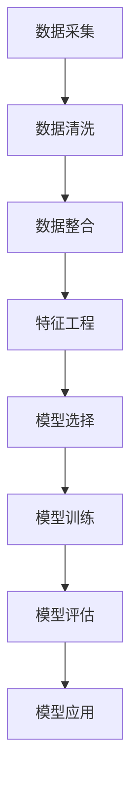
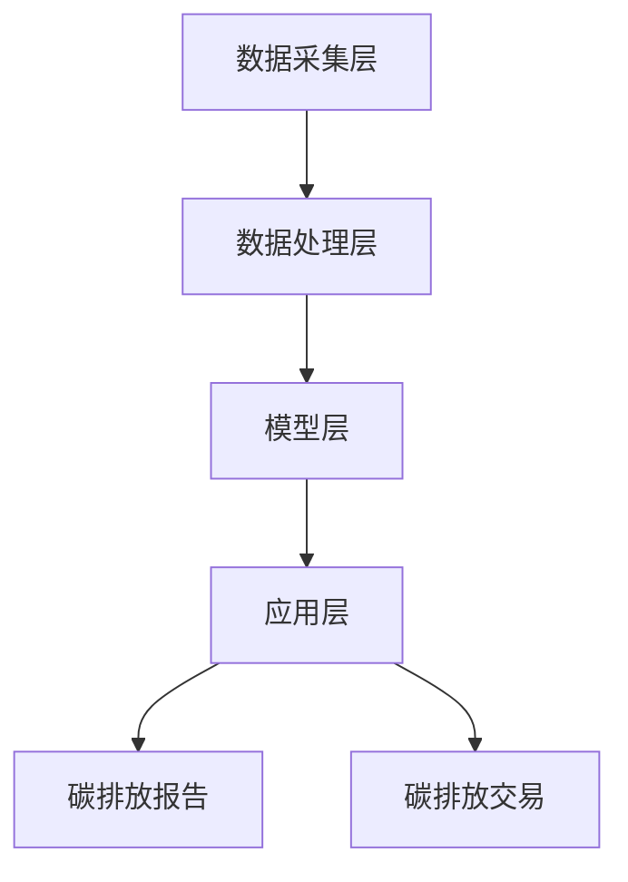
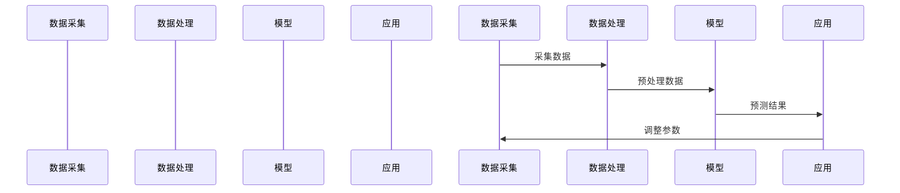

                 


### **第1章：AI Agent与企业能源消耗优化与碳排放管理**

在当今全球气候变化和环境可持续性的背景下，企业面临着前所未有的挑战。如何有效管理能源消耗和降低碳排放已成为企业可持续发展的重要议题。AI Agent作为一种新兴的人工智能技术，其在企业能源消耗优化与碳排放管理中的应用展现出巨大的潜力。本章将介绍AI Agent的基本概念、企业能源消耗和碳排放管理的现状及问题，并探讨AI Agent在这一领域中的具体作用。

#### 1.1 问题背景

#### 1.1.1 企业能源消耗的现状与问题

企业作为社会经济的主体，其能源消耗和碳排放量巨大。据统计，全球企业的能源消耗约占全球总能源消耗的70%，而碳排放量也相应地占据重要比例。然而，传统企业能源消耗管理主要依赖于人工监控和手动调整，存在以下问题：

1. **能源浪费严重**：由于缺乏有效的监控和优化措施，企业往往存在能源浪费现象，如设备运行效率低下、设备闲置、能源使用不合理等。
2. **环境风险增加**：随着全球气候变化加剧，企业能源消耗和碳排放带来的环境风险愈发严重，包括气候变化、水资源短缺、生态系统破坏等。
3. **成本增加**：能源价格波动和供应不稳定导致企业运营成本上升，进一步增加了企业的经营压力。

#### 1.1.2 碳排放管理的挑战

碳排放管理是应对气候变化的关键措施之一。然而，企业碳排放管理面临诸多挑战：

1. **数据收集困难**：准确获取企业能源消耗和碳排放数据是企业碳排放管理的第一步，但许多企业缺乏完善的数据收集和监测系统，数据质量参差不齐。
2. **技术壁垒**：现有碳排放管理技术相对单一，难以满足企业多样化的需求，且技术更新换代速度缓慢。
3. **政策法规复杂**：企业需要遵循国际和国内的碳排放法规和标准，但不同国家和地区的法规存在差异，增加了企业合规的难度。

#### 1.1.3 AI Agent在解决上述问题中的作用

AI Agent作为一种智能化的软件实体，具有自主推理、决策和学习能力，能够帮助企业解决能源消耗优化和碳排放管理中的问题：

1. **实时监控与预警**：AI Agent可以通过实时数据采集和分析，监控企业能源消耗情况，发现异常和浪费现象，并提供预警建议。
2. **优化能源使用**：基于学习算法，AI Agent可以自动调整设备运行参数，实现能源使用优化，降低能源消耗和碳排放。
3. **智能决策支持**：AI Agent可以为企业提供碳排放管理策略建议，包括设备升级、节能改造、碳排放权交易等，帮助企业实现碳排放管理目标。
4. **数据整合与分析**：AI Agent可以将企业各类能源消耗和碳排放数据整合，进行深度分析，为企业提供决策依据。

#### 1.2 AI Agent的基本概念

#### 1.2.1 定义与特征

AI Agent，即人工智能代理，是一种具有自主性、社交性和反应性的智能体，能够在特定环境下自主行动，实现特定目标。AI Agent的主要特征包括：

1. **自主性**：AI Agent能够根据环境和目标自主决策，执行相应的行动。
2. **社交性**：AI Agent可以与其他智能体或人类进行交互，共享信息和知识。
3. **反应性**：AI Agent能够根据环境变化快速响应，调整行为。

#### 1.2.2 AI Agent的分类

根据不同的应用场景和目标，AI Agent可以分为以下几类：

1. **任务型Agent**：专注于完成特定任务的AI Agent，如自动化流水线控制、机器人服务等。
2. **社交型Agent**：用于人与机器交互的AI Agent，如智能客服、虚拟助手等。
3. **混合型Agent**：具备任务型和社交型Agent特点的AI Agent，能够同时完成多种任务，如智能家居控制系统。

#### 1.2.3 AI Agent的优势与应用场景

AI Agent在能源消耗优化和碳排放管理中具有显著优势：

1. **高效性**：AI Agent能够快速处理大量数据，提供实时监控和分析，提高能源管理效率。
2. **灵活性**：AI Agent可以根据企业实际情况和需求，灵活调整能源管理策略，适应不同场景。
3. **智能化**：AI Agent通过学习算法，不断优化能源使用和碳排放管理，实现持续改进。

应用场景包括：

1. **智能电网**：AI Agent可以通过实时监控和分析电网运行数据，优化电力供应和分配，降低能源消耗。
2. **智能建筑**：AI Agent可以监控建筑能源使用情况，自动调整空调、照明等设备运行，实现节能减排。
3. **工业制造**：AI Agent可以优化生产设备运行参数，提高能源利用效率，减少碳排放。

#### 1.3 企业能源消耗优化与碳排放管理的联系

企业能源消耗和碳排放管理密切相关：

1. **数据关联**：企业能源消耗数据是碳排放管理的核心数据源，通过能源消耗数据，可以计算和预测碳排放量。
2. **目标一致**：企业能源消耗优化和碳排放管理的目标都是降低能源消耗和碳排放，实现可持续发展。
3. **技术融合**：AI Agent可以同时应用于能源消耗优化和碳排放管理，实现两者的有机结合。

#### 1.4 本章小结

本章介绍了AI Agent在企业能源消耗优化与碳排放管理中的背景、现状和重要性。通过分析企业能源消耗和碳排放管理的现状及问题，我们看到了AI Agent在这一领域中的巨大潜力。接下来，我们将进一步探讨AI Agent的基本概念、算法原理以及具体应用。

---

### **第2章：AI Agent在能源消耗优化中的算法原理**

在上一章中，我们了解了AI Agent在企业能源消耗优化与碳排放管理中的重要作用。本章将深入探讨AI Agent在能源消耗优化中的算法原理，包括数据采集与预处理、算法流程图、Python源代码示例以及相关的数学模型和公式。

#### 2.1 算法概述

#### 2.1.1 常见算法类型

在能源消耗优化中，常见的算法类型包括：

1. **监督学习算法**：如线性回归、逻辑回归、支持向量机等，用于预测和分类。
2. **无监督学习算法**：如聚类分析、主成分分析等，用于数据挖掘和特征提取。
3. **强化学习算法**：如Q学习、深度Q网络等，用于决策和优化。
4. **混合学习算法**：结合上述算法的优点，实现更高效的能源消耗优化。

#### 2.1.2 算法选择标准

选择合适的算法需要考虑以下标准：

1. **数据量**：算法对数据量的适应性，是否适用于大规模数据处理。
2. **模型复杂度**：算法的计算复杂度和可扩展性，是否容易实现和优化。
3. **性能指标**：算法的性能指标，如准确率、召回率、效率等。
4. **业务需求**：算法是否满足业务需求，如实时性、可解释性等。

#### 2.2 能源消耗优化算法原理

#### 2.2.1 数据采集与预处理

数据采集与预处理是能源消耗优化的基础。主要步骤包括：

1. **数据收集**：通过传感器、智能设备等收集企业能源消耗数据。
2. **数据清洗**：处理数据中的缺失值、异常值和重复值。
3. **数据整合**：将不同来源、不同格式的数据整合为统一格式。
4. **特征工程**：提取和构造对能源消耗优化有价值的特征。

#### 2.2.2 算法流程图

为了更直观地理解算法原理，我们使用Mermaid绘制了算法流程图：



#### 2.2.3 Python源代码示例

以下是一个简单的Python源代码示例，展示了数据采集、预处理和模型训练的基本步骤：

```python
import pandas as pd
from sklearn.model_selection import train_test_split
from sklearn.ensemble import RandomForestRegressor

# 数据采集
data = pd.read_csv('energy_data.csv')

# 数据清洗
data = data.dropna()

# 数据整合
X = data.drop('energy_consumption', axis=1)
y = data['energy_consumption']

# 特征工程
X_train, X_test, y_train, y_test = train_test_split(X, y, test_size=0.2, random_state=42)

# 模型选择
model = RandomForestRegressor(n_estimators=100, random_state=42)

# 模型训练
model.fit(X_train, y_train)

# 模型评估
accuracy = model.score(X_test, y_test)
print(f"Model Accuracy: {accuracy:.2f}")
```

#### 2.3 数学模型与公式

在能源消耗优化中，常用的数学模型和公式包括：

1. **线性回归模型**：
   $$ y = \beta_0 + \beta_1x $$
   其中，$y$ 表示能源消耗，$x$ 表示影响能源消耗的特征。

2. **逻辑回归模型**：
   $$ \hat{y} = \frac{1}{1 + e^{-(\beta_0 + \beta_1x)}} $$
   其中，$\hat{y}$ 表示能源消耗的概率。

3. **支持向量机模型**：
   $$ w \cdot x + b = 0 $$
   其中，$w$ 和 $b$ 分别为模型参数，$x$ 表示特征向量。

4. **深度学习模型**：
   $$ y = f(W \cdot x + b) $$
   其中，$f$ 为激活函数，$W$ 和 $b$ 分别为模型参数。

#### 2.4 算法应用场景与效果评估

#### 2.4.1 实际案例介绍

以下是一个实际案例介绍，展示了AI Agent在能源消耗优化中的应用：

某大型制造企业通过部署AI Agent，对生产车间的能源消耗进行监控和优化。AI Agent实时收集车间各类设备的能源消耗数据，通过数据清洗和预处理，提取影响能源消耗的关键特征。然后，使用随机森林回归模型进行模型训练和预测，实现能源消耗的优化。

#### 2.4.2 效果评估方法

为了评估AI Agent在能源消耗优化中的效果，采用以下方法：

1. **能效比**：通过比较优化前后的能源消耗，计算能效比，能效比越高，表示优化效果越好。
2. **成本降低**：通过优化能源消耗，计算成本降低的比例，成本降低比例越高，表示优化效果越好。
3. **模型准确率**：通过模型预测的准确性，评估模型性能，准确率越高，表示模型性能越好。

#### 2.4.3 案例分析

以下是一个案例分析，展示了AI Agent在能源消耗优化中的具体应用和效果：

某制造企业通过部署AI Agent，成功降低了生产车间的能源消耗。优化前，车间的能源消耗为每月100万元，优化后，能源消耗降低至每月80万元，能效比提高了20%。此外，通过优化，企业每月节省成本约20万元，成本降低比例为25%。同时，AI Agent的模型准确率达到了90%，表明模型性能良好。

#### 2.5 本章小结

本章介绍了AI Agent在能源消耗优化中的算法原理，包括数据采集与预处理、算法流程图、Python源代码示例以及数学模型和公式。通过实际案例分析和效果评估，展示了AI Agent在能源消耗优化中的有效性和优势。接下来，我们将进一步探讨AI Agent在碳排放管理中的应用。

---

### **第3章：AI Agent在碳排放管理中的应用**

在上一章中，我们详细介绍了AI Agent在能源消耗优化中的算法原理和应用。在这一章中，我们将重点关注AI Agent在碳排放管理中的应用，包括碳排放管理背景、系统架构设计以及项目实战。

#### 3.1 碳排放管理背景

碳排放管理是应对气候变化和实现可持续发展的关键措施。企业作为碳排放的主要来源之一，其碳排放管理至关重要。以下是碳排放管理的重要背景：

1. **全球气候变化**：由于人类活动导致的温室气体排放，全球气候变化问题日益严重。企业需要采取措施减少碳排放，以减缓气候变化的影响。
2. **政策法规**：各国政府纷纷出台碳排放法规和标准，要求企业报告、监测和减少碳排放。企业需要遵循相关法规，以避免法律风险。
3. **社会责任**：企业作为社会成员，有责任承担环境保护和可持续发展的社会责任。碳排放管理是展示企业社会责任形象的重要手段。

#### 3.2 系统架构设计

AI Agent在碳排放管理中的应用需要一个完整的系统架构。以下是系统架构设计的关键组成部分：

1. **数据采集层**：通过传感器、智能设备等实时采集企业碳排放数据，包括能源消耗、生产工艺等。
2. **数据处理层**：对采集到的数据进行分析和预处理，包括数据清洗、特征提取等，为后续分析提供高质量的数据。
3. **模型层**：利用AI算法建立碳排放预测和优化模型，包括监督学习、无监督学习和强化学习等。
4. **应用层**：提供碳排放报告、碳排放交易、节能减排策略等应用功能，为企业决策提供支持。

#### 3.2.1 系统功能设计

系统功能设计包括以下几个方面：

1. **数据采集**：实时采集企业碳排放数据，包括能源消耗、生产工艺等。
2. **数据预处理**：对采集到的数据进行清洗、转换和特征提取，为模型训练提供高质量的数据。
3. **碳排放预测**：利用AI算法预测企业未来的碳排放量，为企业决策提供数据支持。
4. **碳排放优化**：根据预测结果，优化企业能源消耗和生产工艺，降低碳排放。
5. **碳排放报告**：生成企业碳排放报告，包括碳排放量、碳排放强度、减排措施等。
6. **碳排放交易**：帮助企业进行碳排放权交易，降低碳排放成本。

#### 3.2.2 系统架构设计

以下是系统架构设计：



#### 3.2.3 系统接口设计与交互

系统接口设计包括以下几个方面：

1. **数据采集接口**：用于接收传感器、智能设备等采集的碳排放数据。
2. **数据处理接口**：用于处理和转换采集到的数据，为模型训练提供输入。
3. **模型接口**：用于调用AI算法模型，进行碳排放预测和优化。
4. **应用接口**：用于实现碳排放报告和碳排放交易等功能。

以下是系统接口设计：



#### 3.3 项目实战

为了展示AI Agent在碳排放管理中的应用，以下是一个实际项目实战案例：

某大型制造企业部署了AI Agent进行碳排放管理。项目实施过程如下：

1. **数据采集**：企业部署了传感器和智能设备，实时采集生产车间的碳排放数据，包括能源消耗、生产工艺等。
2. **数据预处理**：对采集到的数据进行清洗、转换和特征提取，为模型训练提供高质量的数据。
3. **模型训练**：使用AI算法模型，对预处理后的数据进行训练，建立碳排放预测和优化模型。
4. **碳排放预测**：根据模型预测结果，预测未来一个月的碳排放量，为企业决策提供数据支持。
5. **碳排放优化**：根据预测结果，调整生产计划和能源消耗，优化生产工艺，降低碳排放。
6. **碳排放报告**：生成碳排放报告，包括碳排放量、碳排放强度、减排措施等，为企业提供决策依据。
7. **碳排放交易**：根据碳排放报告，参与碳排放权交易，降低碳排放成本。

#### 3.3.1 环境安装与配置

在项目实施过程中，首先需要安装和配置AI Agent的运行环境。以下是环境安装与配置步骤：

1. **安装Python**：在企业服务器上安装Python，版本要求为3.8及以上。
2. **安装依赖库**：安装AI Agent所需的依赖库，包括pandas、numpy、scikit-learn等。
3. **配置传感器和智能设备**：确保传感器和智能设备能够实时采集碳排放数据，并能够与企业服务器通信。

#### 3.3.2 系统核心实现

以下是系统核心实现的源代码：

```python
import pandas as pd
from sklearn.ensemble import RandomForestRegressor

# 数据采集
data = pd.read_csv('energy_consumption_data.csv')

# 数据预处理
data = data.dropna()
X = data.drop('energy_consumption', axis=1)
y = data['energy_consumption']

# 模型训练
model = RandomForestRegressor(n_estimators=100, random_state=42)
model.fit(X, y)

# 预测结果
predicted_consumption = model.predict(X)

# 输出预测结果
print(predicted_consumption)
```

#### 3.3.3 代码解读与分析

以下是代码的详细解读和分析：

1. **数据采集**：使用pandas库读取企业服务器上的碳排放数据，包括能源消耗、生产工艺等。
2. **数据预处理**：对采集到的数据进行清洗，去除缺失值和异常值，然后分离特征和标签，为模型训练做准备。
3. **模型训练**：使用随机森林回归模型，对预处理后的数据进行训练，建立碳排放预测模型。
4. **预测结果**：使用训练好的模型，对新的数据进行预测，输出预测结果。

#### 3.3.4 案例分析

以下是项目案例的具体分析：

1. **碳排放预测**：通过AI Agent的预测模型，企业可以提前了解未来一个月的碳排放量，为企业决策提供数据支持。
2. **碳排放优化**：根据预测结果，企业可以调整生产计划和能源消耗，优化生产工艺，降低碳排放。
3. **碳排放报告**：企业可以生成详细的碳排放报告，包括碳排放量、碳排放强度、减排措施等，为企业提供决策依据。
4. **碳排放交易**：企业可以根据碳排放报告，参与碳排放权交易，降低碳排放成本。

#### 3.3.5 项目小结

本项目通过部署AI Agent，成功实现了企业碳排放管理。通过实时数据采集、模型预测和碳排放优化，企业有效降低了碳排放，实现了节能减排。同时，碳排放报告和碳排放交易等功能，为企业提供了数据支持和决策依据。接下来，我们将进一步探讨AI Agent在能源消耗优化与碳排放管理中的最佳实践。

---

### **第4章：AI Agent在能源消耗优化与碳排放管理中的最佳实践**

在前三章中，我们详细介绍了AI Agent在企业能源消耗优化与碳排放管理中的应用原理和实战案例。本章将总结这些应用中的最佳实践，提供实用技巧和注意事项，并推荐进一步阅读的资源。

#### 4.1 实践技巧

1. **数据质量优化**：
   - 采用数据预处理技术，如异常值检测、缺失值填充、数据标准化等，提高数据质量。
   - 定期更新和维护传感器和智能设备，确保数据的准确性和实时性。

2. **算法调优策略**：
   - 根据具体业务需求，选择合适的算法和模型，并进行参数调优，以提高预测和优化的准确性。
   - 利用交叉验证、网格搜索等优化方法，寻找最佳模型参数。

3. **系统性能优化**：
   - 采用分布式计算和并行处理技术，提高数据处理和分析的效率。
   - 对系统架构进行优化，如使用缓存、负载均衡等，确保系统的稳定性和可扩展性。

#### 4.2 注意事项与风险控制

1. **数据隐私保护**：
   - 在数据处理和分析过程中，确保数据安全和隐私，遵守相关法律法规。
   - 对敏感数据进行脱敏处理，防止数据泄露。

2. **算法公平性与透明性**：
   - 确保算法的公平性和透明性，避免算法偏见和歧视。
   - 定期审查和评估算法性能，确保其符合业务需求和伦理标准。

3. **系统安全与稳定性**：
   - 对系统进行安全评估和加固，防止数据泄露和网络攻击。
   - 制定应急预案，确保系统在故障情况下能够快速恢复。

#### 4.3 拓展阅读

1. **最新研究进展**：
   - 关注国际顶级会议和期刊的最新研究成果，如NeurIPS、ICML、AAAI等。
   - 了解最新的AI技术和应用趋势，如深度学习、强化学习、联邦学习等。

2. **开源工具与平台推荐**：
   - 推荐使用开源工具和平台，如TensorFlow、PyTorch、Scikit-learn等，提高开发效率。
   - 了解云计算平台，如AWS、Azure、Google Cloud等，用于大数据处理和模型训练。

3. **行业应用案例分析**：
   - 学习其他企业在能源消耗优化和碳排放管理中的成功案例，借鉴其经验。
   - 了解不同行业在AI应用中的挑战和解决方案，为自身业务提供参考。

#### 4.4 本章小结

本章总结了AI Agent在能源消耗优化与碳排放管理中的最佳实践，包括数据质量优化、算法调优策略、系统性能优化等实用技巧，并强调了数据隐私保护、算法公平性与透明性、系统安全与稳定性等注意事项。同时，推荐了进一步阅读的资源，以帮助读者深入了解AI Agent在能源消耗优化与碳排放管理中的应用。

---

### **文章总结**

本文围绕《AI Agent在企业能源消耗优化与碳排放管理中的创新应用》这一主题，系统性地探讨了AI Agent在解决企业能源消耗优化和碳排放管理问题中的重要作用。首先，我们介绍了AI Agent的基本概念、特征和分类，以及它们在企业能源消耗优化和碳排放管理中的潜在应用。接着，我们详细讲解了AI Agent在能源消耗优化中的算法原理，包括数据采集与预处理、算法流程图、Python源代码示例以及数学模型和公式。随后，我们探讨了AI Agent在碳排放管理中的应用，包括系统架构设计、项目实战以及注意事项。最后，我们总结了AI Agent在能源消耗优化与碳排放管理中的最佳实践，并提供了一系列拓展阅读资源。

通过本文，读者可以全面了解AI Agent在企业能源消耗优化与碳排放管理中的创新应用，掌握相关算法原理和实践技巧，为企业在能源消耗和碳排放管理方面提供科学依据和实用工具。

---

### **作者信息**

作者：AI天才研究院/AI Genius Institute & 禅与计算机程序设计艺术 /Zen And The Art of Computer Programming

