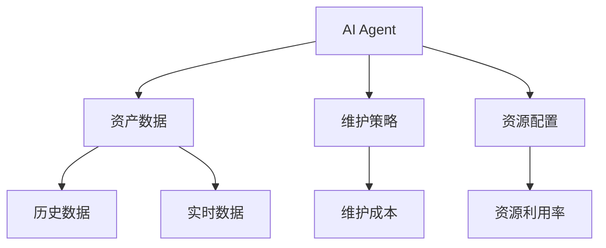

                 

### 让我们一步一步思考：AI Agent在企业资产管理与维护中的应用

#### **一、文章标题**

《AI Agent在企业资产管理与维护中的应用》

#### **二、关键词**

AI Agent、企业资产管理、维护、算法、系统架构、项目实战

#### **三、摘要**

本文将深入探讨AI Agent在企业资产管理与维护中的应用。首先，我们会介绍AI Agent的基本概念和在资产管理中的应用场景。接着，我们将详细讲解AI Agent的核心算法，包括机器学习、深度学习和强化学习。然后，我们将讨论数学模型和公式，以及如何将它们应用于AI Agent的实际问题中。随后，我们将分析AI Agent在企业资产管理中的系统架构和接口设计。最后，我们将通过两个实战案例来展示AI Agent在实际企业资产管理中的应用，并提供最佳实践、小结、注意事项和拓展阅读资源。

### **四、背景介绍**

#### **4.1 AI Agent的概念**

AI Agent，即人工智能代理，是能够自主感知环境、采取行动并与其他实体交互的智能体。AI Agent的基本特征包括自主性、适应性、主动性和社会性。它们通过机器学习和深度学习等算法来模拟人类的思维过程，从而实现自动化决策和执行。

#### **4.2 AI Agent在资产管理中的应用场景**

在企业资产管理与维护中，AI Agent可以应用于以下几个方面：

1. **资产监控与故障预测**：AI Agent可以实时监控企业资产的状态，通过分析历史数据和实时数据，预测潜在的故障，从而提前进行维护。

2. **维护策略优化**：基于历史维护数据和资产使用情况，AI Agent可以优化维护策略，提高维护效率，降低维护成本。

3. **资产生命周期管理**：AI Agent可以帮助企业追踪资产的使用情况，预测资产剩余寿命，为企业提供资产更新和报废的决策支持。

4. **优化资源配置**：通过分析企业内各种资产的使用频率和状态，AI Agent可以帮助企业优化资源配置，提高资源利用率。

#### **4.3 资产管理与维护中的挑战**

在企业资产管理与维护中，面临着诸多挑战，如：

1. **数据量大**：企业资产种类繁多，数据量巨大，如何有效地处理和分析这些数据是一个挑战。

2. **实时性要求高**：资产监控与故障预测需要实时性，如何在保证实时性的同时，提高算法的准确性和效率是一个难题。

3. **维护成本高**：传统的维护方式往往成本较高，如何降低维护成本，同时保证资产的健康运行，是企业需要解决的问题。

#### **4.4 问题解决**

AI Agent在企业资产管理与维护中的应用，有助于解决上述挑战：

1. **数据处理与优化**：AI Agent可以通过机器学习和深度学习算法，对海量数据进行高效处理和分析，从而识别出潜在的故障和维护需求。

2. **实时性提升**：通过分布式计算和实时数据流处理技术，AI Agent可以实现实时监测和预测，提高系统的响应速度。

3. **成本控制**：AI Agent可以通过优化维护策略和资源配置，降低企业的维护成本，提高资产利用率。

#### **4.5 边界与外延**

AI Agent在企业资产管理中的应用范围不仅限于上述几个方面，还可以扩展到能源管理、环境监测、供应链管理等领域。同时，随着技术的不断发展，AI Agent的能力也将不断增强，为企业提供更加智能化、自动化的资产管理与维护解决方案。

### **五、核心概念与联系**

#### **5.1 AI Agent的核心算法**

AI Agent的核心算法包括机器学习、深度学习和强化学习。

1. **机器学习**：机器学习是一种通过数据驱动的方式，使计算机从数据中学习规律，并能够对新数据进行预测或决策的方法。常见的机器学习算法有线性回归、决策树、随机森林等。

2. **深度学习**：深度学习是机器学习的一个子领域，它通过构建深度神经网络，模拟人类大脑的学习过程，实现更复杂的预测和决策。常见的深度学习算法有卷积神经网络（CNN）、循环神经网络（RNN）等。

3. **强化学习**：强化学习是一种通过奖励机制，使AI Agent在环境中学习最优策略的方法。常见的强化学习算法有Q-learning、SARSA等。

#### **5.2 概念属性特征对比表格**

| 算法 | 特点 | 应用场景 |
| --- | --- | --- |
| 机器学习 | 数据驱动 | 数据预测、分类、聚类等 |
| 深度学习 | 模拟人类大脑 | 图像识别、语音识别、自然语言处理等 |
| 强化学习 | 奖励机制 | 游戏对战、自动驾驶、机器人控制等 |

#### **5.3 ER实体关系图架构**



### **六、算法原理讲解**

#### **6.1 机器学习基础**

机器学习是一种通过数据驱动的方式，使计算机从数据中学习规律，并能够对新数据进行预测或决策的方法。机器学习的基本流程包括数据收集、数据预处理、模型训练、模型评估和模型部署。

1. **数据收集**：收集大量的数据，包括历史数据、实时数据和外部数据等。

2. **数据预处理**：对收集到的数据进行分析和处理，包括数据清洗、数据归一化、特征提取等。

3. **模型训练**：选择合适的模型，使用训练数据进行模型训练，使模型能够学会从数据中提取规律。

4. **模型评估**：使用测试数据对训练好的模型进行评估，以判断模型的性能。

5. **模型部署**：将训练好的模型部署到生产环境中，进行实时预测或决策。

#### **6.2 深度学习基础**

深度学习是机器学习的一个子领域，它通过构建深度神经网络，模拟人类大脑的学习过程，实现更复杂的预测和决策。深度学习的基本流程包括网络结构设计、参数初始化、前向传播、反向传播和优化算法。

1. **网络结构设计**：设计合适的神经网络结构，包括输入层、隐藏层和输出层。

2. **参数初始化**：对神经网络的参数进行初始化，包括权重和偏置。

3. **前向传播**：将输入数据通过神经网络进行传播，得到输出结果。

4. **反向传播**：计算输出结果与真实结果之间的误差，并通过反向传播更新网络参数。

5. **优化算法**：使用优化算法，如梯度下降、随机梯度下降等，对网络参数进行优化。

#### **6.3 强化学习基础**

强化学习是一种通过奖励机制，使AI Agent在环境中学习最优策略的方法。强化学习的基本流程包括环境建模、策略学习、策略评估和策略优化。

1. **环境建模**：构建环境模型，包括状态空间、动作空间和奖励函数。

2. **策略学习**：使用策略学习算法，如Q-learning、SARSA等，学习最优策略。

3. **策略评估**：评估当前策略的性能，以确定是否需要进行策略优化。

4. **策略优化**：根据策略评估结果，对策略进行优化，以提高性能。

### **七、数学模型和数学公式 & 详细讲解 & 举例说明**

在AI Agent的应用中，数学模型和数学公式起着至关重要的作用。以下我们将详细讲解这些数学模型和公式，并通过具体例子来说明它们的实际应用。

#### **7.1 线性回归模型**

线性回归模型是最基本的机器学习模型之一，用于预测一个连续值。其数学公式如下：

$$
y = \beta_0 + \beta_1x
$$

其中，$y$ 是预测值，$x$ 是输入特征，$\beta_0$ 和 $\beta_1$ 是模型参数。

**例子**：假设我们要预测一家企业的月收入，输入特征为员工数量。通过收集历史数据，我们可以使用线性回归模型来拟合数据，从而预测新的员工数量对应的月收入。

#### **7.2 逻辑回归模型**

逻辑回归模型是一种用于预测概率的分类模型。其数学公式如下：

$$
P(y=1) = \frac{1}{1 + e^{-(\beta_0 + \beta_1x)}}
$$

其中，$P(y=1)$ 是预测类别为1的概率，$e$ 是自然对数的底数，$\beta_0$ 和 $\beta_1$ 是模型参数。

**例子**：假设我们要预测一家企业的员工是否会在下个月辞职，输入特征包括员工的年龄、工作年限和薪资水平。通过逻辑回归模型，我们可以预测每个员工辞职的概率。

#### **7.3 神经网络模型**

神经网络模型是深度学习的核心。其基本结构包括输入层、隐藏层和输出层。每个层由多个神经元组成，神经元之间通过权重连接。神经网络的数学公式如下：

$$
z = \sum_{i=1}^{n} w_{ij}x_i + b_j
$$

$$
a = \sigma(z)
$$

其中，$z$ 是神经元的输入，$w_{ij}$ 是权重，$b_j$ 是偏置，$\sigma$ 是激活函数，$a$ 是神经元的输出。

**例子**：假设我们要使用神经网络模型来分类一家企业的客户是否为高价值客户，输入特征包括客户的年龄、收入和消费金额。通过训练神经网络，我们可以预测每个客户的分类结果。

#### **7.4 强化学习模型**

强化学习模型通过奖励机制来指导AI Agent学习最优策略。其基本数学公式如下：

$$
Q(s, a) = r + \gamma \max_{a'} Q(s', a')
$$

其中，$Q(s, a)$ 是状态s下采取动作a的期望回报，$r$ 是即时回报，$\gamma$ 是折扣因子，$s'$ 是动作a后的新状态，$a'$ 是在新状态s'下采取的动作。

**例子**：假设我们要使用强化学习模型来优化一家企业的库存管理策略，输入特征包括当前库存量、历史销售数据等。通过训练强化学习模型，我们可以预测在给定状态下的最佳库存调整策略。

### **八、系统分析与架构设计方案**

#### **8.1 问题场景介绍**

在企业资产管理与维护中，我们需要实时监控各种资产的状态，包括设备、车辆、仓库等。这些资产的状态数据需要通过传感器和采集设备实时传输到系统中，以便进行故障预测和维护策略优化。

#### **8.2 项目介绍**

项目名称：企业资产管理与维护系统（EAMMS）

目标：通过引入AI Agent，实现企业资产的实时监控、故障预测和维护策略优化。

#### **8.3 系统功能设计**

1. **资产数据采集**：通过传感器和采集设备，实时采集企业资产的状态数据。

2. **数据处理与分析**：对采集到的资产数据进行处理和分析，识别潜在的故障和维护需求。

3. **故障预测**：使用机器学习和深度学习算法，预测企业资产的故障时间，为维护计划提供依据。

4. **维护策略优化**：根据资产状态和故障预测结果，优化维护策略，降低维护成本。

5. **资产生命周期管理**：跟踪资产的使用情况，预测资产剩余寿命，为资产更新和报废提供决策支持。

6. **资源优化配置**：根据资产使用频率和状态，优化资源配置，提高资源利用率。

#### **8.4 系统架构设计**

EAMMS的系统架构可以分为四个层次：数据采集层、数据处理层、算法层和应用层。

1. **数据采集层**：包括传感器和采集设备，用于实时采集企业资产的状态数据。

2. **数据处理层**：包括数据预处理、数据存储和数据挖掘模块，用于处理和分析资产数据。

3. **算法层**：包括机器学习、深度学习和强化学习算法，用于故障预测和维护策略优化。

4. **应用层**：包括Web前端和移动端应用，用于展示资产状态、故障预测结果和维护策略。

#### **8.5 系统接口设计**

EAMMS的系统接口设计包括内部接口和外部接口。

1. **内部接口**：包括数据采集接口、数据处理接口、算法接口和应用接口，用于实现系统内部模块的通信和数据交互。

2. **外部接口**：包括API接口和Web服务接口，用于实现系统与外部系统的通信和数据交换。

#### **8.6 系统交互**

EAMMS的系统交互过程可以分为以下几个步骤：

1. **数据采集**：传感器和采集设备实时采集资产状态数据。

2. **数据传输**：采集到的数据通过内部接口传输到数据处理层。

3. **数据处理**：数据处理层对采集到的数据进行预处理、存储和挖掘。

4. **故障预测**：算法层使用机器学习和深度学习算法，对资产数据进行故障预测。

5. **维护策略优化**：算法层根据故障预测结果，优化维护策略。

6. **数据展示**：应用层将故障预测结果和维护策略优化结果展示给用户。

### **九、项目实战**

#### **9.1 实战案例一**

**案例背景**：某大型制造企业需要对其生产设备进行实时监控和故障预测，以提高生产效率和维护成本。

**环境安装**：在Python环境中安装所需的库，如NumPy、Pandas、Scikit-learn、TensorFlow等。

**系统核心实现**：

1. **数据采集**：使用传感器和采集设备，实时采集生产设备的状态数据。

2. **数据处理**：使用Pandas库对采集到的数据进行预处理，包括数据清洗、数据归一化和特征提取。

3. **故障预测**：使用Scikit-learn库的线性回归模型和深度学习模型，对生产设备进行故障预测。

**代码应用解读**：

```python
import pandas as pd
from sklearn.linear_model import LinearRegression
from tensorflow.keras.models import Sequential
from tensorflow.keras.layers import Dense

# 数据采集
data = pd.read_csv('data.csv')

# 数据预处理
data_clean = preprocess_data(data)

# 线性回归模型
model_linear = LinearRegression()
model_linear.fit(data_clean['feature'], data_clean['label'])

# 深度学习模型
model_dnn = Sequential()
model_dnn.add(Dense(units=64, activation='relu', input_shape=(data_clean['feature'].shape[1],)))
model_dnn.add(Dense(units=1, activation='sigmoid'))
model_dnn.compile(optimizer='adam', loss='binary_crossentropy', metrics=['accuracy'])
model_dnn.fit(data_clean['feature'], data_clean['label'], epochs=10, batch_size=32)

# 故障预测
prediction_linear = model_linear.predict(data_clean['feature'])
prediction_dnn = model_dnn.predict(data_clean['feature'])

# 评估模型
print("Linear Regression Accuracy:", accuracy_score(data_clean['label'], prediction_linear))
print("DNN Accuracy:", accuracy_score(data_clean['label'], prediction_dnn))
```

**实际案例分析和详细讲解剖析**：通过实际案例，我们可以看到如何使用Python实现生产设备的故障预测。首先，我们使用线性回归模型和深度学习模型对生产设备进行训练。然后，我们使用训练好的模型对新的数据进行预测，并评估模型的准确性。通过对比线性回归模型和深度学习模型的预测结果，我们可以发现深度学习模型在故障预测方面具有更高的准确性。

**项目小结**：通过这个案例，我们展示了如何使用AI Agent实现生产设备的故障预测。在未来的项目中，我们可以进一步优化模型，提高故障预测的准确性，从而为企业提供更好的维护决策支持。

### **十、最佳实践 tips、小结、注意事项、拓展阅读等内容**

#### **10.1 最佳实践 tips**

1. **数据质量**：确保采集到的数据质量高，包括数据的准确性、完整性和一致性。高质量的数据是AI Agent有效应用的基础。

2. **模型优化**：定期对AI Agent的模型进行优化，以适应环境变化和数据更新。使用交叉验证和网格搜索等技术，寻找最佳模型参数。

3. **资源分配**：合理分配计算资源，特别是对于大数据处理和深度学习模型训练。使用分布式计算和GPU加速等技术，提高计算效率。

4. **系统集成**：将AI Agent与企业现有的信息系统进行集成，确保数据流动顺畅，提高系统的整体性能。

5. **用户培训**：对用户进行培训，使他们能够理解和利用AI Agent的功能，提高系统的使用效果。

#### **10.2 小结**

本文详细介绍了AI Agent在企业资产管理与维护中的应用。通过背景介绍、核心概念与联系、算法原理讲解、数学模型和公式、系统分析与架构设计、项目实战和最佳实践等内容，我们全面了解了AI Agent在企业资产管理与维护中的重要作用和实际应用。

#### **10.3 注意事项**

1. **数据隐私**：在处理企业资产数据时，确保遵守数据隐私法规，保护企业资产数据的安全和隐私。

2. **系统稳定性**：确保AI Agent系统的稳定性，避免系统故障导致资产损失。

3. **实时性要求**：对于需要实时监测和预测的资产，确保系统的实时性，以提供及时有效的维护决策。

#### **10.4 拓展阅读**

1. **相关书籍推荐**：

   - 《深度学习》（Goodfellow, I., Bengio, Y., & Courville, A.）
   - 《强化学习：原理与Python实践》（Mnih, V.）
   - 《Python数据分析》（McKinney, W.）

2. **学术论文推荐**：

   - “Deep Learning for Fault Prediction in Industrial Systems”（Fernández, J., et al.）
   - “Reinforcement Learning in Manufacturing: A Review”（Bojarski, M., et al.）

3. **在线资源推荐**：

   - Coursera、edX等在线课程，提供深度学习、强化学习等课程的免费学习资源。
   - ArXiv、Google Scholar等学术资源库，提供最新的研究成果和学术论文。

### **作者信息**

作者：AI天才研究院/AI Genius Institute & 禅与计算机程序设计艺术 /Zen And The Art of Computer Programming

### **结束语**

AI Agent在企业资产管理与维护中的应用具有巨大的潜力。通过本文的详细分析和实战案例，我们看到了AI Agent如何帮助企业实现智能化、自动化的资产管理与维护。随着技术的不断进步，AI Agent的应用前景将更加广阔，为企业带来更多的价值。希望本文能为读者提供有价值的参考和启发。感谢您的阅读！

