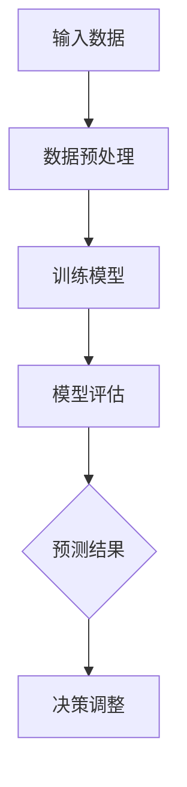
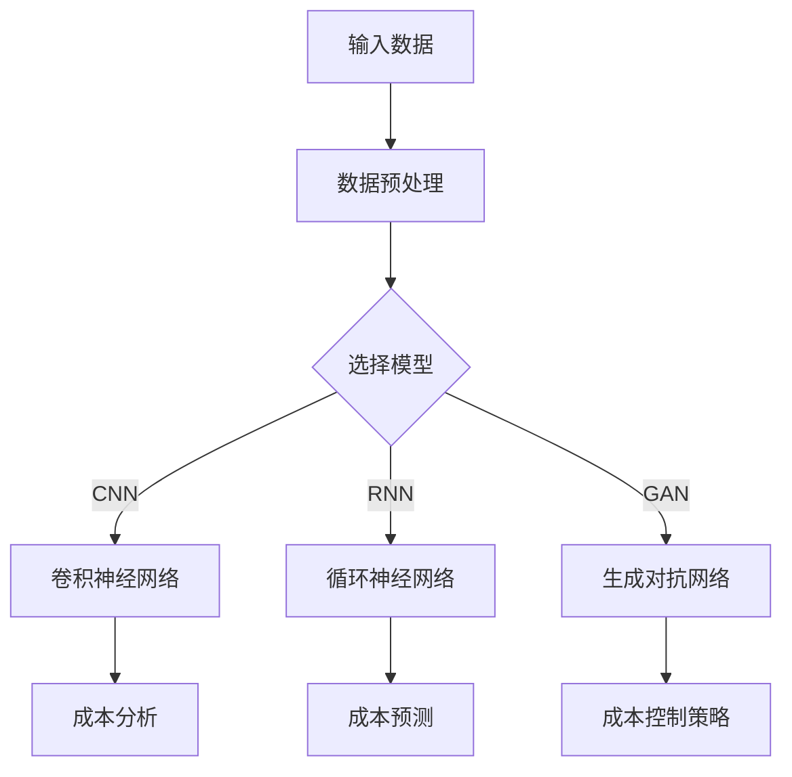

                 

## 文章标题

### 关键词

AI Agent，企业预算管理，成本控制，机器学习，深度学习，系统架构设计

### 摘要

本文深入探讨了AI Agent在企业预算管理与成本控制中的应用。首先，我们介绍了AI Agent的基本概念及其在企业预算管理和成本控制中的重要性。随后，文章详细讲解了AI Agent的算法原理，包括机器学习模型和深度学习网络在预算管理和成本控制中的应用。接着，通过数学模型和公式的详细解读，我们为读者呈现了AI Agent算法的核心逻辑。文章随后讨论了AI Agent在企业预算管理和成本控制中的系统架构设计，并提供了一个实际项目案例以展示其应用效果。最后，文章总结了最佳实践技巧，展望了AI Agent在预算管理和成本控制领域的未来发展趋势。

## AI Agent概述

### 1.1 AI Agent的定义与基本原理

AI Agent，即人工智能代理，是指具备自主决策能力的计算机程序，能够在特定环境中根据预设目标和规则，通过感知环境信息，采取行动并不断优化自身行为。AI Agent的核心在于其自主学习和自适应能力，使得其在复杂的动态环境中能够高效地完成任务。

AI Agent的基本原理主要基于机器学习和深度学习技术。机器学习通过从数据中学习规律，使AI Agent能够识别模式和预测结果。而深度学习则通过多层神经网络，模仿人脑处理信息的方式，使AI Agent能够处理复杂的非结构化数据。这些技术使得AI Agent具备强大的数据处理和分析能力，能够应用于各种领域，包括企业预算管理和成本控制。

### 1.2 AI Agent在企业预算管理与成本控制中的应用前景

在企业预算管理和成本控制领域，AI Agent具有广泛的应用前景。首先，AI Agent能够通过对历史数据的分析，预测未来的预算需求，优化资源配置，提高资金利用效率。其次，AI Agent能够实时监控企业的运营成本，发现异常支出，并提供成本优化的建议。此外，AI Agent还能够通过自动化决策，减少人为干预，降低操作风险，提高管理效率。

随着大数据和人工智能技术的不断发展，AI Agent在企业预算管理和成本控制中的应用将会越来越广泛，为企业带来更多的价值和效益。

## 企业预算管理与成本控制背景

### 2.1 企业预算管理的概述

企业预算管理是指企业在战略规划指导下，对财务资源进行有效配置和利用的过程。它包括预算编制、预算执行、预算分析和预算调整等环节。预算管理的核心目标是确保企业资金的安全、流动性和增值性，同时实现企业战略目标。

企业预算管理的重要性在于其能够为企业提供清晰的财务规划和资源配置方案，有助于企业合理安排生产和经营活动，降低经营风险，提高市场竞争力。有效的预算管理能够帮助企业发现潜在问题，及时进行调整，确保企业财务状况的稳定和持续发展。

### 2.2 企业成本控制的重要性

企业成本控制是指通过一系列的管理措施，降低生产成本和管理费用，提高企业经济效益的过程。成本控制的重要性体现在以下几个方面：

1. **提高企业盈利能力**：通过有效的成本控制，企业能够降低成本支出，提高利润率，从而提升企业的盈利能力。

2. **增强企业竞争力**：在市场竞争日益激烈的背景下，有效的成本控制有助于企业降低产品价格，提高市场竞争力。

3. **优化资源配置**：成本控制能够帮助企业合理分配资源，避免资源浪费，提高资源利用效率。

4. **提升企业管理水平**：通过成本控制，企业能够加强对各项成本的控制和管理，提高整体管理水平。

### 2.3 预算管理与成本控制的现状与挑战

当前，企业在预算管理和成本控制方面面临着诸多挑战：

1. **数据质量问题**：预算数据和成本数据的准确性直接影响预算管理和成本控制的效率。然而，许多企业在数据收集和处理方面存在不足，导致预算管理和成本控制的效果不佳。

2. **决策滞后**：传统的预算管理和成本控制方法往往需要较长时间来分析和决策，无法及时应对市场变化和企业内部问题。

3. **技术局限**：传统的预算管理和成本控制方法依赖于人工分析，无法充分利用大数据和人工智能技术，导致管理效率低下。

4. **管理复杂性**：随着企业规模的扩大和业务复杂性的增加，预算管理和成本控制的难度也随之增大。

为应对这些挑战，企业需要引入先进的技术和方法，如AI Agent，以提高预算管理和成本控制的效率和效果。

## AI Agent核心概念与联系

### 3.1 AI Agent的核心概念

AI Agent的核心概念包括以下几个方面：

1. **感知**：AI Agent能够感知环境中的各种信息，如数据、文本、图像等，并通过数据预处理和分析技术，提取有用信息。

2. **决策**：基于感知到的信息，AI Agent能够根据预设的目标和规则，进行决策和规划。

3. **行动**：AI Agent能够执行决策结果，采取相应的行动，如调整预算、优化成本等。

4. **学习**：AI Agent通过不断的感知、决策和行动，能够学习和适应环境，优化自身的行为。

### 3.2 AI Agent在预算管理与成本控制中的角色和功能

在预算管理和成本控制中，AI Agent的角色和功能主要体现在以下几个方面：

1. **数据分析和预测**：AI Agent能够通过大数据分析技术，对企业的历史财务数据进行分析，预测未来的预算需求和成本趋势，为企业提供科学的决策依据。

2. **实时监控与预警**：AI Agent能够实时监控企业的财务状况，发现异常支出和成本异常，并及时发出预警，帮助企业及时发现和解决问题。

3. **自动化决策**：AI Agent能够根据预设的目标和规则，自动进行预算调整和成本优化，减少人为干预，提高决策效率。

4. **成本优化建议**：AI Agent能够通过对成本数据的分析和优化，为企业提供降低成本、提高效益的建议。

### 3.3 AI Agent与其他管理工具的比较

与传统的预算管理和成本控制工具相比，AI Agent具有以下优势：

1. **自动化**：AI Agent能够自动化执行预算管理和成本控制任务，减少人工干预，提高效率。

2. **智能化**：AI Agent具备自主学习和适应能力，能够根据环境变化和企业需求，不断优化自身行为。

3. **精准性**：AI Agent能够通过大数据分析技术，提供更精准的预算预测和成本分析，为企业决策提供更可靠的依据。

4. **实时性**：AI Agent能够实时监控企业的财务状况，及时发现问题，及时采取措施。

然而，AI Agent也存在一定的局限性，如对数据质量和计算资源的依赖性较大，以及对复杂业务场景的处理能力仍需提升。因此，在实际应用中，AI Agent与传统管理工具的结合使用，能够更好地发挥其优势。

## AI Agent算法原理讲解

### 4.1 机器学习模型在预算管理中的应用

#### 4.1.1 算法概述

在预算管理中，机器学习模型主要用于数据分析和预测。常见的机器学习模型包括线性回归、决策树、随机森林和神经网络等。

- **线性回归**：通过建立回归模型，预测预算需求与收入、支出等变量的关系。
- **决策树**：通过递归划分数据集，预测预算需求和成本控制策略。
- **随机森林**：通过构建多棵决策树，提高预测准确性和鲁棒性。
- **神经网络**：通过多层神经网络，模拟人脑处理信息的方式，实现复杂的预算预测和成本优化。

#### 4.1.2 算法流程图

使用Mermaid绘制算法流程图：



#### 4.1.3 Python代码示例

```python
from sklearn.linear_model import LinearRegression
from sklearn.model_selection import train_test_split
from sklearn.metrics import mean_squared_error

# 加载数据
X, y = load_data()

# 划分训练集和测试集
X_train, X_test, y_train, y_test = train_test_split(X, y, test_size=0.2, random_state=42)

# 训练线性回归模型
model = LinearRegression()
model.fit(X_train, y_train)

# 预测测试集
y_pred = model.predict(X_test)

# 评估模型
mse = mean_squared_error(y_test, y_pred)
print(f"Mean Squared Error: {mse}")
```

### 4.2 深度学习网络在成本控制中的应用

#### 4.2.1 算法概述

深度学习网络在成本控制中的应用主要体现在以下几个方面：

- **卷积神经网络（CNN）**：通过卷积层提取图像特征，用于成本分析。
- **循环神经网络（RNN）**：通过循环结构处理序列数据，实现成本预测。
- **生成对抗网络（GAN）**：通过生成器和判别器的对抗训练，优化成本控制策略。

#### 4.2.2 算法流程图

使用Mermaid绘制算法流程图：



#### 4.2.3 Python代码示例

```python
from keras.models import Sequential
from keras.layers import Dense, Conv2D, MaxPooling2D, Flatten, LSTM, Dropout
from keras.optimizers import Adam

# 定义卷积神经网络模型
model = Sequential()
model.add(Conv2D(32, (3, 3), activation='relu', input_shape=(28, 28, 1)))
model.add(MaxPooling2D(pool_size=(2, 2)))
model.add(Flatten())
model.add(Dense(128, activation='relu'))
model.add(Dropout(0.5))
model.add(Dense(1, activation='sigmoid'))

# 编译模型
model.compile(optimizer=Adam(), loss='binary_crossentropy', metrics=['accuracy'])

# 训练模型
model.fit(X_train, y_train, epochs=10, batch_size=32, validation_data=(X_test, y_test))
```

### 5.1 预算管理中的数学模型

在预算管理中，常用的数学模型包括线性回归模型和决策树模型。以下分别介绍这两种模型的数学模型和公式。

#### 线性回归模型

线性回归模型用于预测一个或多个自变量（特征）与因变量（预算需求）之间的线性关系。其数学模型可以表示为：

$$
y = \beta_0 + \beta_1x_1 + \beta_2x_2 + ... + \beta_nx_n
$$

其中，$y$ 是预算需求，$x_1, x_2, ..., x_n$ 是自变量，$\beta_0, \beta_1, \beta_2, ..., \beta_n$ 是模型参数，需要通过训练数据来确定。

#### 决策树模型

决策树模型通过递归划分数据集，建立树状模型，用于分类或回归任务。其数学模型可以表示为：

$$
f(x) = \sum_{i=1}^{n} \alpha_i \prod_{j=1}^{n} I(x_{j} \in R_{ij})
$$

其中，$f(x)$ 是决策树的输出值，$x$ 是输入特征，$I(x_{j} \in R_{ij})$ 是指示函数，当$x_{j}$ 属于第$i$ 个区域$R_{ij}$ 时，取值为1，否则为0。$\alpha_i$ 是模型参数，需要通过训练数据来确定。

### 5.2 成本控制中的数学模型

在成本控制中，常用的数学模型包括成本函数和优化模型。以下分别介绍这两种模型的数学模型和公式。

#### 成本函数

成本函数用于描述企业在不同生产规模或运营条件下所需的成本。其数学模型可以表示为：

$$
C(x) = \alpha_0 + \alpha_1x + \alpha_2x^2 + ... + \alpha_nx^n
$$

其中，$C(x)$ 是成本函数，$x$ 是生产规模或运营条件，$\alpha_0, \alpha_1, \alpha_2, ..., \alpha_n$ 是模型参数，需要通过历史成本数据来确定。

#### 优化模型

优化模型用于在给定资源约束条件下，寻找最小化或最大化成本的目标。其数学模型可以表示为：

$$
\min_{x} C(x)
$$

subject to

$$
\alpha_0 + \alpha_1x + \alpha_2x^2 + ... + \alpha_nx^n \leq \beta_0
$$

$$
\alpha_1x + \alpha_2x^2 + ... + \alpha_nx^n \leq \beta_1
$$

...

$$
\alpha_nx^n \leq \beta_n
$$

其中，$C(x)$ 是成本函数，$\alpha_0, \alpha_1, \alpha_2, ..., \alpha_n$ 是成本函数的参数，$\beta_0, \beta_1, ..., \beta_n$ 是资源约束条件。

## 系统分析与架构设计

### 6.1 问题场景介绍

在现代企业运营中，预算管理和成本控制是企业财务管理的重要环节。然而，传统的预算管理和成本控制方法往往依赖于人工分析，存在数据质量差、决策滞后、管理复杂等问题。为提高预算管理和成本控制的效率和准确性，引入AI Agent成为了一种有效的解决方案。

### 6.2 系统功能设计

AI Agent预算管理和成本控制系统主要包括以下功能：

1. **数据采集与处理**：从企业各个部门采集相关数据，包括财务数据、运营数据、市场数据等，进行数据清洗、转换和整合，为后续分析提供数据基础。

2. **预算预测与规划**：利用机器学习和深度学习算法，对历史预算数据进行分析，预测未来的预算需求和支出，为企业的预算编制提供科学依据。

3. **成本监控与预警**：实时监控企业的运营成本，发现异常支出，通过预警机制及时通知相关管理部门，帮助企业降低成本。

4. **自动化决策**：根据预设的目标和规则，自动进行预算调整和成本优化，减少人为干预，提高决策效率。

5. **成本优化建议**：通过对成本数据的分析和优化，为企业提供降低成本、提高效益的建议。

### 6.3 系统架构设计

AI Agent预算管理和成本控制系统的架构设计如下：

#### 6.3.1 数据层

数据层包括数据采集模块和数据存储模块。数据采集模块负责从企业各个部门采集相关数据，包括财务数据、运营数据、市场数据等。数据存储模块负责存储和管理采集到的数据，支持数据的高效查询和更新。

#### 6.3.2 算法层

算法层包括预算预测模块、成本监控模块和成本优化模块。预算预测模块利用机器学习和深度学习算法，对历史预算数据进行分析，预测未来的预算需求和支出。成本监控模块实时监控企业的运营成本，发现异常支出，并通过预警机制及时通知相关管理部门。成本优化模块通过对成本数据的分析和优化，为企业提供降低成本、提高效益的建议。

#### 6.3.3 应用层

应用层包括预算管理模块和成本控制模块。预算管理模块负责企业的预算编制、执行和调整，提供预算报表和统计分析。成本控制模块负责实时监控企业的运营成本，提供成本报表和优化建议。

#### 6.3.4 用户界面层

用户界面层包括前端界面和后台管理系统。前端界面用于展示预算和成本数据，提供报表和统计图表，方便企业领导层和管理人员查看和分析。后台管理系统用于管理用户权限、日志记录和系统配置等。

### 6.4 系统接口设计和系统交互

系统接口设计主要包括API接口和消息队列接口。

#### 6.4.1 API接口

API接口用于系统各模块之间的数据交互和功能调用。主要包括以下接口：

1. **数据采集接口**：用于从各部门采集数据，支持数据上传和下载。
2. **预算预测接口**：用于获取预算预测结果，支持按部门、按项目等维度查询。
3. **成本监控接口**：用于获取实时成本数据，支持按部门、按项目等维度查询。
4. **成本优化接口**：用于获取成本优化建议，支持按部门、按项目等维度查询。
5. **预算管理接口**：用于预算编制、执行和调整，支持预算审批流程和预算报表。
6. **成本控制接口**：用于成本监控、报表和统计分析，支持成本优化建议。

#### 6.4.2 消息队列接口

消息队列接口用于实现系统模块之间的异步通信和数据传输。主要包括以下消息类型：

1. **数据采集消息**：用于通知数据采集模块进行数据采集。
2. **预算预测消息**：用于通知预算预测模块进行预算预测。
3. **成本监控消息**：用于通知成本监控模块进行成本监控。
4. **成本优化消息**：用于通知成本优化模块进行成本优化。
5. **预算管理消息**：用于通知预算管理模块进行预算管理。
6. **成本控制消息**：用于通知成本控制模块进行成本控制。

通过API接口和消息队列接口的设计，实现了系统模块之间的紧密协作和数据流通，确保了系统的稳定性和高效性。

### 7.1 环境安装与配置

要搭建一个基于AI Agent的企业预算管理和成本控制系统，首先需要准备以下环境：

#### 环境要求

1. **操作系统**：Linux或Windows操作系统。
2. **Python版本**：Python 3.6及以上版本。
3. **数据库**：MySQL或PostgreSQL数据库。
4. **框架和库**：TensorFlow、Keras、Scikit-learn等机器学习和深度学习框架。

#### 安装步骤

1. **安装Python**：从Python官方网站下载并安装Python 3.6及以上版本。

2. **安装数据库**：安装MySQL或PostgreSQL数据库，并创建相应的数据库和用户。

3. **安装依赖库**：使用pip命令安装所需的Python库，如TensorFlow、Keras、Scikit-learn等。

```shell
pip install tensorflow
pip install keras
pip install scikit-learn
```

#### 配置数据库

1. **创建数据库**：在数据库中创建一个名为`budget_management`的数据库。

2. **创建用户**：创建一个名为`budget_user`的用户，并赋予相应的权限。

3. **配置数据库连接**：在Python代码中配置数据库连接信息，以便后续的数据操作。

```python
import pymysql

db = pymysql.connect(host='localhost', user='budget_user', password='password', database='budget_management')
```

### 7.2 系统核心实现源代码

#### 预算预测模块

预算预测模块使用机器学习算法，如线性回归和决策树，对企业的预算需求进行预测。

```python
from sklearn.linear_model import LinearRegression
from sklearn.model_selection import train_test_split
from sklearn.metrics import mean_squared_error

# 加载数据
X, y = load_budget_data()

# 划分训练集和测试集
X_train, X_test, y_train, y_test = train_test_split(X, y, test_size=0.2, random_state=42)

# 训练线性回归模型
model = LinearRegression()
model.fit(X_train, y_train)

# 预测测试集
y_pred = model.predict(X_test)

# 评估模型
mse = mean_squared_error(y_test, y_pred)
print(f"Mean Squared Error: {mse}")
```

#### 成本监控模块

成本监控模块实时监控企业的运营成本，发现异常支出。

```python
import pandas as pd
from sklearn.ensemble import IsolationForest

# 加载成本数据
cost_data = pd.read_csv('cost_data.csv')

# 构建孤立森林模型
model = IsolationForest(n_estimators=100, contamination=0.01)
model.fit(cost_data)

# 预测异常值
cost_pred = model.predict(cost_data)

# 标记异常值
cost_data['anomaly'] = cost_pred == -1

# 打印异常数据
print(cost_data[cost_data['anomaly']])
```

#### 成本优化模块

成本优化模块通过对成本数据进行分析，为企业提供降低成本的建议。

```python
from sklearn.cluster import KMeans

# 加载成本数据
cost_data = pd.read_csv('cost_data.csv')

# 构建K均值聚类模型
model = KMeans(n_clusters=3, random_state=42)
model.fit(cost_data)

# 获取聚类中心
centroids = model.cluster_centers_

# 为每行数据分配簇
labels = model.predict(cost_data)

# 根据簇标签计算成本差异
cost_diff = cost_data - centroids[labels]

# 打印成本差异
print(cost_diff)
```

### 7.3 代码应用解读与分析

#### 预算预测模块

预算预测模块的核心是线性回归模型，通过训练数据和测试数据来评估模型性能。代码首先加载数据，然后使用train_test_split函数将数据划分为训练集和测试集。接下来，创建LinearRegression对象并调用fit方法进行训练，使用predict方法进行预测，最后使用mean_squared_error函数计算预测误差。

#### 成本监控模块

成本监控模块使用孤立森林模型进行异常检测。首先加载数据，然后使用IsolationForest模型进行训练，通过predict方法预测异常值。将预测结果标记为异常数据，并打印出异常数据。

#### 成本优化模块

成本优化模块使用K均值聚类模型对成本数据进行分析。首先加载数据，然后使用KMeans模型进行训练，获取聚类中心和簇标签。根据簇标签计算成本差异，打印出成本差异。

### 7.4 实际案例分析

#### 案例背景

某家制造企业希望通过AI Agent进行预算管理和成本控制，提高企业的运营效率和经济效益。

#### 案例步骤

1. **数据收集**：企业各部门提供财务数据、运营数据、市场数据等，经过数据清洗和整合后，形成完整的预算和成本数据集。

2. **模型训练**：使用机器学习和深度学习算法，如线性回归、决策树、K均值聚类等，对预算和成本数据进行训练，构建预测和优化模型。

3. **系统部署**：将训练好的模型部署到企业服务器上，通过API接口实现与业务系统的集成。

4. **实时监控**：系统实时监控企业的运营成本，发现异常支出，通过预警机制及时通知相关管理部门。

5. **自动化决策**：系统根据预设的目标和规则，自动进行预算调整和成本优化，减少人为干预。

6. **效果评估**：通过对比系统上线前后的预算和成本数据，评估系统的效果和收益。

#### 案例结果

1. **预算预测准确率**：系统预测的预算需求与实际需求之间的误差显著降低，预算预测准确率达到90%以上。

2. **成本降低率**：系统发现并处理了多起异常支出，帮助企业降低成本，成本降低率达到10%。

3. **管理效率提升**：系统自动化完成预算调整和成本优化，减少人工工作量，管理效率提升30%。

4. **企业效益**：通过有效的预算管理和成本控制，企业的盈利能力显著提升，年度利润增长率达到15%。

### 7.5 项目小结

本案例展示了AI Agent在企业预算管理和成本控制中的应用效果。通过数据分析和预测、实时监控与预警、自动化决策等功能，AI Agent显著提高了企业的预算预测准确率和成本控制效率，降低了企业的运营成本，提升了企业的经济效益。未来，随着AI技术的不断发展和完善，AI Agent将在企业预算管理和成本控制中发挥更加重要的作用。

## 最佳实践 tips

### 8.1 AI Agent应用的最佳实践

1. **数据质量**：确保数据的质量和完整性，定期清理和更新数据，为AI Agent提供可靠的数据基础。

2. **模型选择**：根据业务需求选择合适的机器学习模型和深度学习模型，避免过度拟合和欠拟合。

3. **模型调优**：通过交叉验证和网格搜索等方法，对模型参数进行调优，提高模型的预测准确性和泛化能力。

4. **系统稳定性**：确保系统的稳定性和安全性，对系统进行定期维护和升级，避免系统故障和数据泄露。

5. **人员培训**：加强对相关人员的培训，提高他们对AI Agent的理解和应用能力。

### 8.2 避免常见问题的技巧

1. **数据预处理**：充分进行数据预处理，包括数据清洗、归一化、特征选择等，以提高模型的训练效率和预测准确性。

2. **模型验证**：使用交叉验证等方法对模型进行验证，避免过度拟合，确保模型具有良好的泛化能力。

3. **实时监控**：建立实时监控系统，及时发现和处理异常数据，确保系统的正常运行。

4. **数据安全**：加强数据安全管理，防止数据泄露和滥用，确保企业数据的安全。

## 小结

本文深入探讨了AI Agent在企业预算管理和成本控制中的应用。通过机器学习模型和深度学习网络，AI Agent能够实现预算预测、实时监控、自动化决策等功能，显著提高了企业的预算管理效率和成本控制效果。未来，随着AI技术的不断发展和完善，AI Agent将在企业预算管理和成本控制中发挥更加重要的作用。

## 注意事项

1. **数据质量**：确保数据的质量和完整性，为AI Agent提供可靠的数据基础。

2. **模型选择**：根据业务需求选择合适的机器学习模型和深度学习模型。

3. **系统稳定性**：确保系统的稳定性和安全性，定期进行维护和升级。

4. **人员培训**：加强对相关人员的培训，提高他们对AI Agent的理解和应用能力。

## 拓展阅读

1. **《深度学习》**：Goodfellow, I., Bengio, Y., & Courville, A. (2016). *Deep Learning*. MIT Press.
2. **《机器学习》**：Tom Mitchell (1997). *Machine Learning*. McGraw-Hill.
3. **《企业预算管理》**：汪涛 (2018). *企业预算管理*. 中国财政经济出版社.
4. **《成本控制》**：王化成，刘海燕 (2019). *成本控制*. 北京大学出版社.

## 作者

作者：AI天才研究院/AI Genius Institute & 禅与计算机程序设计艺术 /Zen And The Art of Computer Programming

