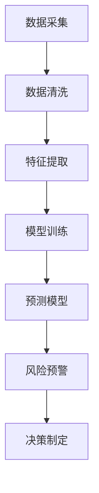
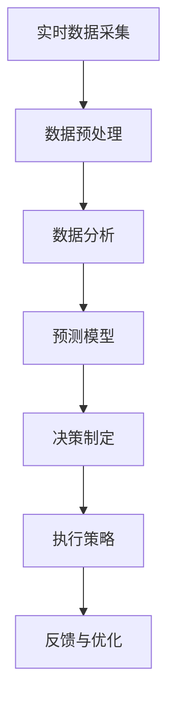

                 

### 1. 引言

当今企业面临的竞争环境和市场环境日益复杂多变，风险因素无处不在。如何在风起云涌的市场中保持稳定和增长，成为企业决策者必须面对的挑战。风险预测与动态管理作为企业风险管理的重要组成部分，显得尤为重要。然而，传统的风险预测方法存在许多局限性，如数据依赖性高、预测准确性低、应对措施滞后等。随着人工智能（AI）技术的迅速发展，特别是AI Agent的兴起，为企业风险预测与动态管理带来了新的机遇与挑战。

本文旨在探讨AI Agent在企业风险预测与动态管理中的应用，通过一步步的逻辑推理，深入分析AI Agent的定义、发展历程、核心原理、应用场景以及其在企业风险预测与动态管理中的具体实现。文章将从以下几个方面展开：

1. **引言与背景**：介绍企业风险预测与动态管理的背景和问题，阐述AI Agent的概念及其特点。
2. **核心概念**：详细解释AI Agent和风险预测、动态管理的核心概念，分析它们之间的联系。
3. **AI Agent基础**：介绍AI Agent的概述、核心原理和应用场景，探讨其优势与挑战。
4. **企业风险预测与动态管理**：阐述企业风险预测与动态管理的基本概念、方法和目标。
5. **AI Agent在企业风险预测与动态管理中的应用**：具体分析AI Agent在企业风险预测和动态管理中的实现方法和效果。
6. **总结与展望**：总结文章的主要研究成果，提出研究不足和未来展望，分享最佳实践和注意事项。

通过以上结构化的分析，本文希望为企业提供一套全面、深入的AI Agent在企业风险预测与动态管理中的应用方案，助力企业提升风险管理和决策能力，从而在激烈的市场竞争中立于不败之地。

### 1.1 问题背景

企业风险预测与动态管理是企业运营中不可或缺的一环，其重要性日益凸显。在全球经济一体化和信息技术的飞速发展的背景下，企业所面临的风险类型和来源更加多样化。传统的企业风险管理方法主要依赖于历史数据和经验分析，往往存在以下几个问题：

1. **数据依赖性高**：传统方法依赖于大量历史数据的积累，数据质量和数量直接影响风险预测的准确性。然而，在数据获取和处理过程中，可能会遇到数据不完整、噪声数据、数据滞后等问题。
2. **预测准确性低**：传统方法主要基于统计分析，对风险事件的预测能力有限。在复杂的市场环境中，风险事件的关联性和不确定性较高，传统方法难以捕捉到这些复杂关系。
3. **应对措施滞后**：传统的风险管理策略往往是被动应对，缺乏前瞻性和实时性。在风险发生前，企业难以采取有效的预防和控制措施，导致风险应对措施滞后。

为解决上述问题，人工智能（AI）技术的应用成为企业风险预测与动态管理的新方向。AI Agent作为一种先进的AI技术，具有自学习、自适应、自主决策等能力，能够实时监测企业运营数据，发现潜在风险，并提出相应的应对策略。

AI Agent在企业风险预测与动态管理中的应用，主要体现在以下几个方面：

1. **实时数据分析**：AI Agent可以通过实时采集和分析企业运营数据，快速识别潜在的风险信号。与传统方法相比，AI Agent能够更准确地捕捉到风险事件的前兆，提高预测的实时性。
2. **自学习与自适应**：AI Agent具备自学习能力，可以根据历史数据和实时数据不断优化预测模型，提高预测准确性。此外，AI Agent能够根据环境变化自适应调整预测策略，提高应对措施的灵活性。
3. **自主决策**：AI Agent能够根据风险预测结果，自主制定和调整应对策略。这种自主决策能力不仅提高了风险应对的效率，还能够减少人为干预，降低决策失误的风险。

通过AI Agent的引入，企业可以实现对风险的全过程管理，从风险预测到应对措施的各个环节，提高整体风险管理和决策能力。然而，AI Agent的应用也面临一些挑战，如算法选择、数据质量、模型解释性等，这些问题需要进一步探讨和解决。

### 1.2 问题描述

企业风险预测与动态管理是一个复杂的过程，涉及到多个环节和多个因素。在传统的风险预测方法中，往往存在以下几个关键问题：

1. **数据质量与准确性**：传统方法依赖于历史数据的分析，而历史数据可能存在不准确、不完整、噪声数据等问题。这些问题的存在会直接影响风险预测的准确性。
2. **风险关联性与复杂性**：企业面临的风险往往不是单一事件，而是多个风险因素相互关联、相互作用的结果。传统方法难以捕捉到这些复杂的关联关系，导致预测结果不够全面。
3. **实时性与动态性**：传统方法通常滞后于风险事件的发生，无法实现实时风险预测和动态管理。在快速变化的市场环境中，这种滞后性会导致企业错过最佳的风险应对时机。
4. **决策支持与解释性**：传统方法主要依赖于统计模型，这些模型往往缺乏解释性，难以为企业提供明确的决策支持。在复杂的风险环境下，企业需要能够理解并信任风险预测结果，才能采取有效的应对措施。

为了解决上述问题，AI Agent在风险预测与动态管理中的应用成为关键。AI Agent具有以下几个特点：

1. **自学习与自适应**：AI Agent可以通过不断学习和优化模型，提高预测准确性。它能够从历史数据和实时数据中学习，并自适应调整预测策略，以应对环境变化。
2. **实时数据分析**：AI Agent能够实时采集和分析企业运营数据，快速识别潜在风险信号。这种实时性使得企业能够在风险事件发生前采取预防措施，降低风险损失。
3. **自主决策与自动化**：AI Agent能够根据风险预测结果，自主制定和调整应对策略，实现自动化风险管理。这种自主决策能力提高了风险应对的效率和准确性。
4. **模型解释性**：AI Agent所使用的模型往往具有一定的解释性，可以帮助企业理解风险预测结果，从而增强决策信心。

尽管AI Agent为企业风险预测与动态管理带来了新的机遇，但其实际应用过程中也面临一些挑战，如数据质量、算法选择、模型优化等。因此，深入研究AI Agent在风险预测与动态管理中的应用方法，探讨其优势和局限性，具有重要的现实意义。

### 1.3 问题解决

为了解决企业风险预测与动态管理中的问题，AI Agent的应用显得尤为重要。AI Agent通过其自学习、自适应、自主决策等能力，为企业提供了一种全新的风险预测与动态管理方法。以下将详细探讨AI Agent在企业风险预测与动态管理中的具体应用方法和优势。

#### 1.3.1 自学习与自适应

AI Agent的自学习与自适应能力是其实现高效风险预测的关键。通过不断从历史数据和实时数据中学习，AI Agent能够识别出数据中的潜在模式和规律。例如，在企业财务风险管理中，AI Agent可以通过分析历史财务数据，发现企业财务状况的变化规律，预测未来可能的财务风险。同时，AI Agent能够根据环境变化，自适应调整预测模型，提高预测的准确性。

#### 1.3.2 实时数据分析

传统的风险预测方法往往滞后于风险事件的发生，而AI Agent能够实现实时数据分析，快速识别潜在风险信号。例如，在企业供应链管理中，AI Agent可以通过实时监控供应链各环节的数据，如库存水平、供应商交付时间等，提前预测供应链中断的可能性，从而及时采取应对措施，避免损失。

#### 1.3.3 自主决策与自动化

AI Agent的自主决策与自动化能力使其能够根据预测结果，自主制定和调整应对策略。例如，在企业投资风险管理中，AI Agent可以通过分析市场数据和财务指标，预测投资风险，并自动调整投资组合，以降低风险。此外，AI Agent还可以实现自动化操作，如自动触发预警、自动执行应急计划等，提高风险应对的效率和准确性。

#### 1.3.4 模型解释性

尽管AI Agent在风险预测与动态管理中具有强大的能力，但其模型的解释性仍然是一个挑战。为了提高模型的解释性，AI Agent可以采用可视化工具，如Mermaid流程图，展示模型的预测过程和决策逻辑。例如，在企业信用风险管理中，AI Agent可以通过Mermaid流程图展示信用评分模型中的各个特征及其权重，帮助企业管理者理解风险预测结果。

#### 1.3.5 集成与协作

AI Agent不仅可以独立工作，还可以与企业现有的风险管理系统进行集成，实现协作。例如，在企业内部控制中，AI Agent可以通过与企业ERP系统、CRM系统等的数据接口，获取实时数据，实时监控企业运营风险，并与企业现有的风险管理系统协同工作，提高整体风险管理和决策能力。

#### 1.3.6 优势总结

AI Agent在企业风险预测与动态管理中的应用，具有以下显著优势：

1. **实时性**：AI Agent能够实现实时数据分析，快速识别潜在风险信号，提高预测的实时性。
2. **准确性**：通过自学习和自适应，AI Agent能够提高预测准确性，减少预测误差。
3. **自动化**：AI Agent能够实现自主决策和自动化操作，提高风险应对的效率和准确性。
4. **解释性**：AI Agent通过可视化工具，提高模型的解释性，帮助管理者理解预测结果。
5. **集成性**：AI Agent可以与企业现有的风险管理系统集成，实现协作，提高整体风险管理和决策能力。

通过AI Agent的应用，企业可以实现从传统被动风险管理向主动风险管理转变，提高风险管理和决策能力，从而在激烈的市场竞争中立于不败之地。

### 1.4 边界与外延

在企业风险预测与动态管理中，AI Agent的应用虽然带来了显著的优势，但也存在一定的边界和局限性。了解这些边界与外延，有助于企业在实际应用中更加科学、合理地部署AI Agent。

#### 1.4.1 数据质量与可用性

AI Agent的预测能力高度依赖于数据的质量和可用性。如果数据存在噪声、缺失或不一致等问题，AI Agent的预测准确性将受到影响。因此，企业在应用AI Agent前，需要确保数据的质量和完整性，采取数据清洗、数据整合等手段，提高数据质量。

#### 1.4.2 算法选择与优化

AI Agent的算法选择和优化也是影响其性能的关键因素。不同的算法适用于不同的应用场景，企业需要根据具体需求选择合适的算法。此外，算法的优化和调整也是提高AI Agent预测能力的重要手段。企业可以通过参数调整、模型集成等方法，优化算法性能。

#### 1.4.3 解释性与透明度

尽管AI Agent通过可视化工具提高了模型的解释性，但深度学习等复杂算法仍然存在较高的黑箱性质，难以解释其预测过程和决策逻辑。这可能导致企业对AI Agent的信任度下降，影响其应用效果。因此，企业需要关注AI Agent的解释性，通过技术手段提高模型的透明度。

#### 1.4.4 系统集成与兼容性

AI Agent需要与企业现有的信息系统、业务流程等集成，以实现协同工作。在这个过程中，AI Agent需要具备较高的兼容性和适应性，能够无缝接入企业现有的IT架构。否则，可能会导致系统集成困难、数据共享不畅等问题，影响AI Agent的实际应用效果。

#### 1.4.5 安全性与隐私保护

AI Agent在处理企业数据时，需要确保数据的安全性和隐私保护。企业需要采取有效的数据加密、访问控制等技术手段，防止数据泄露和滥用。此外，AI Agent的算法模型也需要经过严格的测试和验证，确保其安全可靠。

#### 1.4.6 人机协作

AI Agent虽然具备强大的预测和决策能力，但仍然需要人类的参与和监督。在实际应用中，AI Agent应与人类专家密切协作，共同进行风险分析和决策。这不仅可以提高决策的准确性，还可以确保AI Agent的应用符合企业战略和业务需求。

综上所述，AI Agent在企业风险预测与动态管理中的应用，虽然具备显著的优势，但也需要克服一系列边界和局限性。企业在实际应用中，应充分考虑这些因素，合理规划AI Agent的部署和运维，以充分发挥其价值。

### 1.5 小结

本文引出了企业风险预测与动态管理中的关键问题，并介绍了AI Agent作为一种新兴技术，在解决这些问题方面的潜力和优势。通过对问题背景、问题描述和问题解决的详细分析，本文阐明了AI Agent在企业风险管理中的重要性。同时，本文也指出了AI Agent应用中的边界和局限性，为企业提供了科学的决策依据。

未来，随着人工智能技术的进一步发展和应用，AI Agent在企业风险预测与动态管理中的应用将更加广泛和深入。企业需要关注这些技术的最新动态，积极探索AI Agent在风险管理中的实际应用，以提升风险管理和决策能力，实现可持续发展。

### 2. 核心概念

在探讨AI Agent在企业风险预测与动态管理中的应用之前，我们需要明确几个核心概念，包括AI Agent的定义、特点，以及企业风险预测与动态管理的基本概念。

#### 2.1 AI Agent的定义与特点

AI Agent，即人工智能代理，是一种能够自主执行任务、与环境交互并采取行动的智能实体。它具有以下几个核心特点：

1. **自主性**：AI Agent能够自主进行决策，无需人类干预。它可以根据预设的目标和策略，自主执行任务。
2. **交互性**：AI Agent能够与环境进行实时交互，获取环境信息，并据此调整自身行为。
3. **适应性**：AI Agent能够根据环境变化和任务需求，自主调整策略，提高任务执行的效率和准确性。
4. **自学习性**：AI Agent具备自学习能力，可以通过历史数据和经验不断优化自身模型和策略。

#### 2.2 企业风险预测的定义

企业风险预测是指利用各种数据和技术手段，对企业可能面临的各种风险进行评估和预测。具体包括以下几个方面：

1. **风险识别**：通过数据分析、历史记录等方式，识别企业可能面临的风险类型和来源。
2. **风险评估**：对识别出的风险进行量化评估，确定其对企业运营和财务的影响程度。
3. **风险预测**：基于历史数据和现有信息，预测未来可能发生的风险事件及其影响。

#### 2.3 动态管理的定义

动态管理是指企业在面对不断变化的市场环境时，通过实时监控、分析数据、调整策略等手段，实现对企业运营和业务流程的动态调整和优化。动态管理包括以下几个核心环节：

1. **实时监控**：通过传感器、数据采集工具等，实时获取企业运营数据。
2. **数据分析**：利用数据分析工具和技术，对实时数据进行处理和分析，识别潜在问题和机会。
3. **策略调整**：根据数据分析结果，及时调整企业运营策略和业务流程，以应对市场变化。

#### 2.4 概念之间的联系

AI Agent、企业风险预测与动态管理之间存在着紧密的联系。AI Agent通过自主性、交互性、适应性和自学习性等特点，能够实现对风险数据的实时采集和分析，为企业提供精准的风险预测和动态管理支持。具体来说：

1. **AI Agent与风险预测**：AI Agent可以通过自学习和实时数据分析，捕捉到风险事件的前兆，提高风险预测的准确性和实时性。
2. **AI Agent与动态管理**：AI Agent能够根据风险预测结果，自主制定和调整应对策略，实现动态管理，提高企业应对市场变化的敏捷性。

综上所述，AI Agent在企业风险预测与动态管理中起到了重要的桥梁作用，它不仅能够提高风险预测的准确性和实时性，还能实现动态管理的自动化和智能化，为企业提供全面的风险管理和决策支持。

### 3. 概念之间的联系

在前文中，我们分别介绍了AI Agent、企业风险预测和动态管理的定义与特点。接下来，我们将深入探讨这三个概念之间的联系，分析AI Agent如何应用于企业风险预测和动态管理，以及它们之间的互动关系。

#### 3.1 AI Agent在企业风险预测中的应用

AI Agent在企业风险预测中的应用主要体现在以下几个方面：

1. **数据采集与处理**：AI Agent能够实时采集企业运营数据，如财务数据、销售数据、供应链数据等。通过数据清洗和预处理，AI Agent可以确保数据的质量和一致性，为后续的风险预测提供可靠的基础。
2. **模式识别与预测**：基于机器学习、深度学习等技术，AI Agent可以对处理后的数据进行分析，识别潜在的风险模式。通过历史数据的学习，AI Agent可以建立预测模型，对未来的风险进行预测。
3. **实时风险监测**：AI Agent可以持续监测企业运营状态，及时发现异常情况。当检测到风险信号时，AI Agent可以立即预警，提醒企业采取应对措施。

#### 3.2 AI Agent在动态管理中的应用

AI Agent在动态管理中的应用同样具有显著的优势：

1. **实时数据分析**：AI Agent能够实时处理和分析企业运营数据，识别业务流程中的瓶颈和问题。通过实时数据反馈，AI Agent可以帮助企业快速调整运营策略，提高业务效率。
2. **自主决策与自动化**：基于预测模型和业务规则，AI Agent可以自主制定和调整运营策略。例如，在库存管理中，AI Agent可以根据库存水平和销售预测，自动调整库存采购策略，避免库存过剩或不足。
3. **动态调整与优化**：AI Agent可以根据实时数据和环境变化，动态调整运营策略和业务流程。例如，在供应链管理中，AI Agent可以根据供应链各环节的实时数据，优化供应链流程，提高供应链的响应速度和灵活性。

#### 3.3 AI Agent与企业风险预测与动态管理的互动关系

AI Agent在企业风险预测与动态管理中起到了关键的桥梁作用，其与风险预测和动态管理之间的互动关系如下：

1. **风险预测支持**：AI Agent通过实时数据分析和模式识别，为企业提供精准的风险预测。这些预测结果可以为企业的风险决策提供科学依据，帮助企业采取预防措施，降低风险损失。
2. **动态管理优化**：AI Agent根据风险预测结果，动态调整企业的运营策略和业务流程。这种自适应的调整机制可以提高企业应对市场变化的敏捷性，增强企业的竞争力。
3. **持续优化与迭代**：AI Agent在应用过程中，会不断收集新的数据，优化预测模型和决策规则。通过持续学习和优化，AI Agent可以不断提高其预测和决策能力，为企业提供更优质的风险管理和动态管理服务。

综上所述，AI Agent在企业风险预测和动态管理中发挥了重要作用。通过数据采集、模式识别、实时监测和自主决策，AI Agent不仅提高了风险预测的准确性和实时性，还能实现动态管理的自动化和智能化。AI Agent的应用，为企业提供了一套全面、高效的风险管理和决策支持系统，助力企业在复杂的市场环境中稳健发展。

### 3.1 风险预测的范围

在企业风险预测中，风险预测的范围涵盖了企业可能面临的各种潜在风险，包括但不限于以下几类：

1. **市场风险**：市场风险涉及市场环境变化、供需关系波动、竞争对手策略调整等对企业运营的影响。例如，市场需求下降可能导致销售额下降，供应链中断可能导致生产停滞。
2. **财务风险**：财务风险主要包括资金流动性风险、信用风险、财务报表不准确等。例如，企业可能因融资困难而无法满足运营资金需求，或因客户违约而遭受信用损失。
3. **运营风险**：运营风险涉及企业内部管理、生产流程、技术故障等方面。例如，生产设备的故障可能导致生产停滞，企业管理不善可能导致运营效率低下。
4. **法律风险**：法律风险涉及企业面临的法律法规变化、合规风险、合同纠纷等。例如，企业可能因违反环保法规而面临罚款，或因合同纠纷而遭受经济损失。
5. **供应链风险**：供应链风险涉及供应链各环节的稳定性和可靠性。例如，供应商的破产可能导致供应链中断，物流延误可能导致产品交付不及时。

这些风险因素可能单独或相互关联，共同影响企业的运营和财务状况。因此，企业风险预测的范围需要全面覆盖这些风险因素，确保预测结果的准确性和完整性。

### 3.2 动态管理的应用场景

动态管理在企业运营中的重要性不言而喻，它通过实时监控、数据分析和策略调整，帮助企业在复杂多变的市场环境中保持敏捷和竞争力。以下是动态管理在实际应用中的几个关键场景：

1. **供应链管理**：供应链是企业运营的核心环节，动态管理在供应链管理中的应用尤为重要。通过实时监控供应链各环节的数据，如库存水平、供应商交付时间、物流状况等，企业可以及时识别潜在问题，如库存过剩、供应链中断等，并采取相应措施进行调整，确保供应链的稳定和高效运行。
2. **财务预算管理**：财务预算是企业规划和管理财务资源的重要工具。动态管理可以实时分析企业财务数据，如收入、支出、现金流等，预测未来的财务状况。当出现预算偏差或财务风险时，动态管理系统能够及时发出预警，并自动调整预算，确保财务稳定。
3. **人力资源配置**：动态管理在人力资源配置中的应用，可以帮助企业根据业务需求和员工技能，动态调整人力资源配置。例如，在业务高峰期，企业可以临时增加员工或调整工作安排，以应对临时需求；在业务低谷期，则可以减少用工，降低成本。
4. **项目进度管理**：项目进度管理是确保项目按时完成的重要环节。动态管理系统可以通过实时监控项目进度和资源使用情况，及时发现延误和资源浪费问题，并采取调整措施，确保项目按计划推进。
5. **客户关系管理**：客户关系管理是企业保持客户满意度、提高客户忠诚度的重要手段。动态管理系统可以实时分析客户行为和反馈数据，识别客户需求变化和潜在问题，及时调整营销策略和客户服务流程，提高客户满意度和留存率。

通过以上应用场景可以看出，动态管理在企业运营中的广泛运用，不仅可以提高运营效率和决策准确性，还能帮助企业应对市场变化和风险挑战，实现可持续发展。

### 3.3 风险预测与动态管理的融合

在企业运营中，风险预测与动态管理之间的融合具有重要意义。通过将两者有机结合，企业可以实现更全面、更精准的风险控制和运营优化。以下从融合的意义、挑战和具体方法三个方面进行详细探讨。

#### 3.3.1 融合的意义

1. **全面风险管理**：风险预测和动态管理融合后，企业可以实现对风险的全过程管理，从风险识别、评估、预测到应对措施，形成闭环。这种全面风险管理有助于企业提前发现潜在风险，制定有效的预防措施，降低风险损失。
2. **实时决策支持**：融合后的系统可以实时分析企业运营数据，识别风险信号，并自动生成应对策略。这种实时性决策支持有助于企业迅速应对市场变化，提高运营效率和竞争力。
3. **资源优化配置**：融合后的系统能够根据风险预测和运营需求，动态调整资源分配，如人力、资金、物资等。这种优化资源配置能够降低运营成本，提高资源利用率。
4. **增强业务敏捷性**：通过动态管理，企业能够快速调整运营策略，适应市场变化。这种业务敏捷性有助于企业抓住市场机会，实现持续增长。

#### 3.3.2 融合的挑战

1. **数据整合**：风险预测和动态管理需要大量数据支持，而这些数据可能来自不同的系统和部门。如何整合这些数据，确保数据的一致性和准确性，是一个重大挑战。
2. **算法选择与优化**：融合后的系统需要同时满足风险预测和动态管理的需求，这要求选择的算法具有高效性和适用性。同时，算法的优化和调整也是一个持续的过程，需要不断迭代和改进。
3. **系统兼容性**：融合后的系统需要与企业现有的IT架构和业务流程兼容。系统之间的集成和协同工作，需要克服接口不一致、数据格式不兼容等问题。
4. **模型解释性**：风险预测和动态管理中的算法模型往往较为复杂，如何提高模型的解释性，使企业能够理解和信任预测结果，是一个关键挑战。

#### 3.3.3 融合的方法

1. **数据治理与整合**：企业应建立完善的数据治理机制，确保数据的质量、安全和一致性。通过数据清洗、数据集成和数据标准化，实现数据的统一和高效利用。
2. **多模型融合**：在风险预测和动态管理中，企业可以采用多种算法模型，如机器学习、深度学习、优化算法等，并通过模型融合技术，提高预测和决策的准确性和稳定性。
3. **模块化设计**：融合后的系统应采用模块化设计，将风险预测、动态管理、数据采集、数据存储等模块分离，确保系统的灵活性和可扩展性。
4. **可视化与解释性**：通过可视化工具和解释性技术，如Mermaid流程图、决策树、神经网络架构图等，提高模型的可解释性，使企业能够理解和信任预测结果。
5. **持续优化与迭代**：融合后的系统需要持续优化和迭代，通过数据反馈和用户反馈，不断改进模型和算法，提高系统的预测和决策能力。

综上所述，风险预测与动态管理的融合，有助于企业实现全面、精准的风险管理和运营优化。通过克服数据整合、算法选择、系统兼容性等挑战，企业可以构建一个高效、智能的风险预测与动态管理系统，提升整体运营效率和竞争力。

### 3.4 企业风险预测与动态管理的应用场景

企业风险预测与动态管理在多个关键领域有着广泛的应用场景，这些应用不仅提升了企业的风险管理水平，也优化了运营效率和业务流程。以下是几个具体的应用场景：

#### 3.4.1 企业管理

在企业管理的应用场景中，风险预测与动态管理可以帮助企业实时监控和评估各类运营风险，如财务风险、法律风险和运营风险。通过数据分析，AI Agent可以识别潜在的财务风险，如现金流不足或应收账款逾期，及时发出预警，帮助企业采取预防措施。此外，AI Agent还可以协助企业进行人力资源配置和绩效评估，优化人员调度和资源利用，提高管理效率。

#### 3.4.2 项目管理

在项目管理中，动态管理系统能够实时跟踪项目进度和资源使用情况，识别项目延误和成本超支的风险。通过AI Agent的预测能力，项目经理可以提前发现潜在问题，及时调整项目计划和资源分配，确保项目按时按质完成。例如，AI Agent可以根据项目进展和资源需求，动态调整团队成员的工作任务和优先级，优化项目执行力。

#### 3.4.3 供应链管理

供应链管理是另一个重要的应用领域。动态管理系统可以通过实时监控供应链各环节的数据，如库存水平、供应商绩效和物流状态，识别潜在供应链风险。AI Agent可以预测供应链中断的可能性，如供应商延迟交付或运输延误，并提前采取措施，如调整采购计划或增加备用库存，确保供应链的稳定和可靠。通过动态调整供应链策略，企业可以提高供应链响应速度，降低运营成本。

#### 3.4.4 财务风险管理

财务风险管理是企业面临的一项重要任务。AI Agent可以通过分析财务数据，如收入、支出、现金流等，预测企业的财务健康状况，及时发现财务风险。例如，AI Agent可以预测企业的现金流短缺风险，及时调整融资策略，确保企业有足够的流动资金应对突发事件。此外，AI Agent还可以协助企业进行信用风险评估，预测客户违约风险，优化信贷管理策略。

#### 3.4.5 客户关系管理

在客户关系管理中，动态管理系统可以帮助企业实时分析客户行为和反馈数据，识别客户需求和潜在问题。AI Agent可以预测客户流失风险，通过个性化服务和营销策略，提高客户满意度和忠诚度。例如，AI Agent可以根据客户的历史购买记录和互动数据，预测哪些客户可能流失，并提前采取挽留措施，如提供优惠或提升服务质量。

通过以上应用场景可以看出，企业风险预测与动态管理在多个领域都有着重要的应用价值。通过AI Agent的引入，企业可以实现对风险的全过程管理，从预测到应对措施，提高风险管理的准确性和实时性，从而在激烈的市场竞争中立于不败之地。

### 4. AI Agent概述

AI Agent作为一种智能实体，具备自主性、交互性、适应性和自学习能力，广泛应用于各个领域，尤其在企业风险预测与动态管理中表现出巨大的潜力。下面，我们将从AI Agent的定义、发展历程、分类以及其核心特点等方面进行详细阐述。

#### 4.1 AI Agent的定义

AI Agent，即人工智能代理，是一种能够自主执行任务、与环境进行交互并采取行动的智能实体。与传统的程序不同，AI Agent不仅能够根据预设的目标和策略自主进行决策，还能够通过与环境的交互获取新信息，并据此调整自身的行为和策略。AI Agent的核心特点在于其高度智能化和自主性，能够实现一定程度的自主学习和自主决策。

#### 4.2 AI Agent的发展历程

AI Agent的发展历程可以追溯到人工智能（AI）的早期研究。在20世纪50年代和60年代，人工智能的概念开始萌芽，早期的AI系统主要集中在规则推理和符号计算。随着计算机技术的进步，AI研究进入了一个新的阶段。20世纪80年代，专家系统的出现使得AI开始应用于实际问题解决，但受限于规则库的复杂性和不可解释性，专家系统在实际应用中存在一定局限性。

进入21世纪，随着深度学习、强化学习等技术的突破，AI Agent的研究和应用取得了显著的进展。强化学习（Reinforcement Learning）和深度强化学习（Deep Reinforcement Learning）的发展，使得AI Agent能够通过试错学习和经验积累，实现更高级别的自主决策。同时，自然语言处理（Natural Language Processing, NLP）和计算机视觉（Computer Vision）技术的进步，也使得AI Agent在与环境的交互中能够处理更为复杂的信息。

#### 4.3 AI Agent的分类

AI Agent根据其功能和应用场景，可以大致分为以下几类：

1. **任务型AI Agent**：这种类型的AI Agent主要针对特定任务进行优化，如机器人、智能家居、客服机器人等。任务型AI Agent通常具有明确的任务目标，能够高效地完成特定任务，但缺乏自主性和灵活性。
2. **情境感知AI Agent**：情境感知AI Agent能够根据环境变化和用户需求，动态调整自身行为。这类AI Agent通常具备较高的交互性和适应性，能够在不同情境下灵活应对，如智能交通系统、智能医疗诊断等。
3. **自主决策AI Agent**：自主决策AI Agent具备高度的自主性和自学习能力，能够在复杂环境中进行决策和任务执行。这类AI Agent通常应用于复杂任务和高风险场景，如自动驾驶汽车、企业风险预测与动态管理、智能金融管理等。

#### 4.4 AI Agent的核心特点

1. **自主性**：AI Agent能够自主进行决策和任务执行，无需人工干预。通过预设的目标和策略，AI Agent可以自动识别和处理问题，提高效率。
2. **交互性**：AI Agent具备与环境进行实时交互的能力，能够通过传感器、语音、文本等方式获取环境信息，并据此调整自身行为。这种交互性使得AI Agent能够更好地适应复杂多变的环境。
3. **适应性**：AI Agent能够根据环境变化和任务需求，动态调整策略和行为，提高任务执行的效率和准确性。这种适应性使得AI Agent能够在不同场景下表现出色。
4. **自学习性**：AI Agent具备自学习能力，可以通过历史数据和经验不断优化自身模型和策略。这种自学习性使得AI Agent能够不断提升自身能力，适应不断变化的环境。

综上所述，AI Agent作为一种高度智能化的实体，具备自主性、交互性、适应性和自学习能力，这些特点使其在企业风险预测与动态管理中具有广泛的应用前景。通过深入理解和应用AI Agent，企业可以显著提升风险管理和决策能力，实现智能化、自动化的运营管理。

### 4.2 AI Agent的发展历程

AI Agent的发展历程可以追溯到人工智能（AI）的早期研究。自20世纪50年代起，人工智能的概念开始萌芽，科学家们致力于构建能够模拟人类思维和决策的智能系统。AI Agent正是在这样的背景下逐渐发展起来的。

#### 4.2.1 早期探索（1950-1970）

在AI Agent的早期探索阶段，研究者们主要集中在规则推理和符号计算。1956年，约翰·麦卡锡（John McCarthy）等人提出了“人工智能”一词，并召开了第一次人工智能会议。这一时期，专家系统（Expert Systems）成为AI研究的热点。专家系统通过预设的规则库来模拟人类专家的决策过程，但这种基于规则的方法在处理复杂问题时存在一定的局限性。

#### 4.2.2 专家系统时代（1970-1980）

20世纪70年代，专家系统得到了广泛应用，成为企业、医疗和教育等领域的重要工具。专家系统通过逻辑推理和规则匹配，提供专业建议和决策支持。然而，专家系统的应用也暴露出一些问题，如规则库的复杂性和不可解释性。这些问题促使研究者开始探索更加灵活和自适应的AI方法。

#### 4.2.3 面向任务型Agent（1980-1990）

20世纪80年代，研究者开始关注任务型AI Agent的研究。任务型Agent通过完成特定任务来实现目标，通常具有一定的自主性和适应性。这一时期，多Agent系统（Multi-Agent Systems）成为研究的热点。多Agent系统通过多个智能实体之间的协同工作，实现了更为复杂的任务执行。

#### 4.2.4 强化学习与情境感知（1990-2000）

随着计算机技术的发展，20世纪90年代，强化学习（Reinforcement Learning）和情境感知（Situation Awareness）逐渐成为AI Agent研究的重要方向。强化学习通过试错和反馈机制，使AI Agent能够在复杂环境中进行自主学习和决策。情境感知则使AI Agent能够感知和理解环境变化，动态调整自身行为。

#### 4.2.5 深度学习与AI Agent（2000至今）

进入21世纪，深度学习（Deep Learning）技术的突破，为AI Agent的发展带来了新的契机。深度学习通过多层神经网络，能够自动提取数据中的特征和模式，提高了AI Agent的预测和决策能力。同时，计算机视觉（Computer Vision）和自然语言处理（Natural Language Processing）技术的发展，使得AI Agent在与环境的交互中能够处理更为复杂的信息。

近年来，AI Agent的应用场景不断扩大，从机器人、智能家居到自动驾驶、企业风险预测等，AI Agent在各个领域的表现越来越出色。通过不断的创新和优化，AI Agent正逐步实现更高水平的自主性和智能化，为企业提供更加全面和精准的风险管理和决策支持。

### 4.3 AI Agent的分类

AI Agent根据其功能和应用场景的不同，可以分为多种类型。每种类型的AI Agent都有其独特的特点和应用场景，下面我们将对常见的几类AI Agent进行详细分类和描述。

#### 4.3.1 任务型AI Agent

任务型AI Agent（Task-Oriented Agent）是最常见的AI Agent类型之一，其核心任务是完成特定的任务。这类AI Agent通常具有明确的任务目标，能够高效地执行预定的任务，如机器人、客服机器人等。

**特点**：

1. **任务导向**：任务型AI Agent专注于完成特定任务，具有明确的任务目标和执行路径。
2. **自主性较低**：这类AI Agent通常需要外部指令或预设的规则来指导任务执行，自主性相对较低。
3. **灵活性较差**：任务型AI Agent在处理复杂问题时，往往需要依赖于预定义的规则和流程，灵活性较差。

**应用场景**：

1. **机器人**：在工业生产、物流运输、家庭服务等领域，任务型AI Agent可以通过预设的程序和指令，高效地执行各种操作任务。
2. **客服机器人**：在客户服务领域，任务型AI Agent可以通过自动问答系统，为用户提供即时、准确的咨询服务。

#### 4.3.2 情境感知AI Agent

情境感知AI Agent（Situation-Aware Agent）能够感知和理解环境变化，动态调整自身行为。这类AI Agent通常具备较强的环境感知能力和情境理解能力，能够在复杂环境中进行自主决策和任务执行。

**特点**：

1. **情境感知**：情境感知AI Agent能够通过传感器和实时数据，感知环境变化，理解当前情境。
2. **适应性**：这类AI Agent能够根据情境变化，动态调整策略和行为，提高任务执行的灵活性和适应性。
3. **交互性**：情境感知AI Agent能够与环境进行实时交互，获取新的信息，并据此调整自身行为。

**应用场景**：

1. **智能交通系统**：情境感知AI Agent可以通过实时监控交通状况，动态调整交通信号灯和交通路线，优化交通流量。
2. **智能医疗诊断**：情境感知AI Agent可以通过分析患者的症状和医疗数据，实时提供诊断建议，协助医生进行决策。

#### 4.3.3 自主决策AI Agent

自主决策AI Agent（Autonomous Decision-Making Agent）是最高级别的AI Agent，具备高度的自主性和自学习能力。这类AI Agent不仅能够完成特定任务，还能在复杂环境中进行自主决策和任务执行。

**特点**：

1. **高度自主性**：自主决策AI Agent不需要外部指令，能够自主设定目标，制定和调整策略。
2. **自学习性**：这类AI Agent具备自学习能力，可以通过历史数据和经验，不断优化自身模型和策略。
3. **决策能力**：自主决策AI Agent能够在复杂环境中进行决策，制定和执行应对措施。

**应用场景**：

1. **自动驾驶汽车**：自主决策AI Agent可以通过感知环境和实时数据，自主控制汽车行驶，实现无人驾驶。
2. **企业风险预测与动态管理**：自主决策AI Agent可以通过实时数据分析，预测企业面临的风险，并制定相应的应对策略，实现动态风险管理。

综上所述，任务型AI Agent、情境感知AI Agent和自主决策AI Agent在功能和应用场景上各有特色。任务型AI Agent专注于特定任务的执行，情境感知AI Agent具备较强的环境感知和情境理解能力，自主决策AI Agent则能够进行自主决策和任务执行。通过合理选择和应用不同类型的AI Agent，企业可以实现对复杂任务的灵活管理和高效执行。

### 4.4 AI Agent的核心原理

AI Agent的核心原理主要涉及强化学习、深度学习和自然语言处理等先进技术。这些技术使得AI Agent能够实现自主性、适应性和智能性，从而在复杂环境中进行高效的任务执行和决策。以下是这些核心原理的详细解释：

#### 4.4.1 强化学习

强化学习（Reinforcement Learning, RL）是AI Agent实现自主决策的重要技术。强化学习的核心思想是通过试错和反馈机制，使AI Agent能够在不断学习的过程中优化自身的行为策略。

**基本概念**：

1. **状态（State）**：表示AI Agent当前所处环境的状态。
2. **动作（Action）**：AI Agent根据当前状态可以执行的行为。
3. **奖励（Reward）**：环境对AI Agent动作的反馈，用于评估动作的效果。
4. **策略（Policy）**：AI Agent根据当前状态选择最优动作的规则。

**算法原理**：

强化学习通常采用Q学习（Q-Learning）或深度强化学习（Deep Reinforcement Learning, DRL）等方法。Q学习通过评估每个状态-动作对的Q值（即期望奖励），不断调整策略以最大化总奖励。

- **Q学习算法**：
  $$ Q(s, a) = r + \gamma \max_{a'} Q(s', a') $$
  其中，\( r \) 为即时奖励，\( \gamma \) 为折扣因子，\( s \) 和 \( s' \) 分别为当前状态和下一状态，\( a \) 和 \( a' \) 分别为当前动作和下一动作。

- **深度Q网络（DQN）**：
  DQN结合了深度学习和强化学习的优点，通过神经网络来近似Q值函数，提高学习效率和准确性。

**应用实例**：

强化学习在自动驾驶、智能推荐系统和机器人控制等领域有广泛应用。例如，自动驾驶汽车可以通过强化学习优化驾驶策略，提高行驶的安全性和效率。

#### 4.4.2 深度学习

深度学习（Deep Learning, DL）是一种基于多层神经网络的学习方法，能够自动提取数据中的高级特征和复杂模式。深度学习技术使得AI Agent能够更好地理解和处理复杂数据，提高其智能水平。

**基本概念**：

1. **神经网络（Neural Network）**：由多个神经元组成的计算模型，通过学习数据中的特征和模式，进行复杂的非线性映射。
2. **深度神经网络（Deep Neural Network, DNN）**：包含多个隐藏层的神经网络，能够提取更高层次的特征。
3. **卷积神经网络（Convolutional Neural Network, CNN）**：适用于图像和视频处理，能够有效提取图像特征。
4. **循环神经网络（Recurrent Neural Network, RNN）**：适用于序列数据处理，能够捕捉时间序列数据中的长期依赖关系。

**算法原理**：

深度学习通过反向传播算法，不断调整神经网络的权重，使网络能够更准确地预测和分类数据。

- **反向传播算法**：
  $$ \delta_{W} = \frac{\partial L}{\partial W} = \frac{\partial \text{Loss}}{\partial z} \cdot \frac{\partial z}{\partial W} $$
  其中，\( \delta_{W} \) 为权重更新，\( L \) 为损失函数，\( z \) 为中间层输出。

- **优化算法**：
  常用的优化算法包括随机梯度下降（Stochastic Gradient Descent, SGD）和Adam优化器等，用于加速模型训练和优化。

**应用实例**：

深度学习在图像识别、语音识别、自然语言处理等领域有广泛应用。例如，深度卷积神经网络（CNN）在图像分类和物体检测中表现出色，循环神经网络（RNN）在语音识别和时间序列预测中应用广泛。

#### 4.4.3 自然语言处理

自然语言处理（Natural Language Processing, NLP）是AI Agent理解和处理人类语言的技术。NLP技术使得AI Agent能够与人类进行自然对话，提供智能化的语言服务。

**基本概念**：

1. **词嵌入（Word Embedding）**：将词汇映射到高维空间中的向量表示，用于捕捉词汇的语义信息。
2. **序列模型（Sequence Model）**：适用于处理序列数据，如文本、语音等。
3. **注意力机制（Attention Mechanism）**：通过加权不同时间步的信息，提高模型对关键信息的关注。
4. **生成式模型（Generative Model）**：用于生成新的文本、语音等数据。

**算法原理**：

NLP算法主要包括词嵌入、序列模型和生成模型等。词嵌入通过将词汇映射到高维空间，捕捉词汇的语义信息；序列模型通过处理序列数据，捕捉时间依赖关系；生成模型则用于生成新的数据。

- **词嵌入**：
  $$ \text{Word Embedding} = \text{Word2Vec, GloVe} $$
  其中，词向量能够表示词汇的语义信息。

- **序列模型**：
  $$ h_t = \text{激活函数}(\text{权重} \cdot [h_{t-1}, x_t]) $$
  其中，\( h_t \) 为当前时间步的隐藏状态，\( x_t \) 为输入数据。

- **生成模型**：
  $$ p(x) = \prod_{t=1}^{T} p(x_t| x_{t-1}, ..., x_1) $$
  其中，\( p(x) \) 为生成模型生成的概率分布。

**应用实例**：

自然语言处理在智能客服、智能翻译、文本生成等领域有广泛应用。例如，智能客服系统可以通过NLP技术理解用户的问题，并提供个性化的回答；智能翻译系统通过词嵌入和序列模型，实现不同语言之间的精准翻译。

通过上述强化学习、深度学习和自然语言处理等核心原理，AI Agent能够实现自主决策、智能交互和高效任务执行，从而在复杂环境中发挥重要作用。随着这些技术的不断发展和应用，AI Agent在各个领域的表现将越来越出色。

### 4.5 AI Agent的应用场景

AI Agent作为一种高度智能化的系统，在多个领域都展现出了强大的应用潜力。以下是AI Agent在几个关键应用场景中的具体应用案例：

#### 4.5.1 自动驾驶

自动驾驶是AI Agent最具代表性的应用场景之一。自动驾驶系统通过AI Agent实现车辆的高效、安全和自动化驾驶。AI Agent利用强化学习、计算机视觉和自然语言处理等技术，实时感知环境、规划路径和做出决策。

**应用案例**：

- **特斯拉（Tesla）**：特斯拉的自动驾驶系统利用深度学习和强化学习技术，实现了自动驾驶车辆的自主导航和路况感知。通过不断的自我学习和优化，特斯拉的自动驾驶系统能够在复杂交通环境中提供稳定、安全的驾驶体验。
- **Waymo**：谷歌旗下的Waymo公司开发的自动驾驶系统，通过AI Agent实现了完全无人驾驶的技术突破。Waymo的自动驾驶车辆在实时数据分析和决策方面表现出色，能够应对各种复杂路况和突发情况。

#### 4.5.2 智能金融

智能金融是AI Agent在金融服务领域的重要应用。通过AI Agent，金融机构可以提供智能投资建议、风险预测和个性化金融服务。

**应用案例**：

- **摩根士丹利（Morgan Stanley）**：摩根士丹利利用AI Agent开发了智能投资顾问系统，通过分析大量的市场数据和客户行为，提供个性化的投资建议和策略。AI Agent能够实时监控市场变化，及时调整投资组合，提高投资回报率。
- **蚂蚁金服（Ant Financial）**：蚂蚁金服的智能金融服务，如芝麻信用评分，通过AI Agent对用户行为和信用数据进行分析，提供信用评估和风险管理服务。AI Agent能够快速识别欺诈行为，提高信用评估的准确性和效率。

#### 4.5.3 智能医疗

智能医疗是AI Agent在医疗领域的重要应用。通过AI Agent，医疗机构可以实现精准诊断、个性化治疗和医疗资源优化。

**应用案例**：

- **IBM Watson**：IBM的Watson健康（Watson Health）利用AI Agent，通过分析医学图像和患者数据，提供精准的诊断和治疗建议。Watson Health能够快速识别疾病，提高诊断准确率，减少误诊率。
- **谷歌健康（Google Health）**：谷歌健康的AI Agent通过分析大量的医疗数据，如电子健康记录、基因组数据等，提供个性化的健康管理和疾病预防建议。AI Agent能够实时监控患者的健康状况，提前预警潜在的健康风险。

#### 4.5.4 智能家居

智能家居是AI Agent在消费领域的重要应用。通过AI Agent，智能家居系统能够实现智能控制、安全监控和舒适环境管理。

**应用案例**：

- **亚马逊Alexa**：亚马逊的Alexa语音助手通过AI Agent，实现了对智能设备的语音控制和智能家居系统的集成管理。用户可以通过语音指令控制家中的灯光、温度、安防设备等，提高生活便利性。
- **谷歌家居（Google Home）**：谷歌家居的AI Agent通过智能语音助手Google Assistant，实现了智能家居设备的自动化控制。用户可以通过语音指令控制家中的灯光、音乐、温度等，享受智能、便捷的生活体验。

#### 4.5.5 企业风险预测与动态管理

企业风险预测与动态管理是AI Agent在企业管理领域的应用之一。通过AI Agent，企业可以实现实时风险监测、动态策略调整和运营优化。

**应用案例**：

- **沃尔玛（Walmart）**：沃尔玛利用AI Agent，实时监控供应链各环节的数据，识别潜在风险，如库存过剩、供应链中断等，并自动调整供应链策略。AI Agent能够提高供应链的稳定性和效率，降低运营成本。
- **微软（Microsoft）**：微软的企业风险管理系统通过AI Agent，实时分析财务数据、市场数据和运营数据，预测企业可能面临的风险，并提供相应的应对策略。AI Agent能够提高企业的风险管理和决策能力，确保业务持续稳定发展。

通过这些应用案例可以看出，AI Agent在自动驾驶、智能金融、智能医疗、智能家居和企业风险预测等多个领域都展现出了强大的应用潜力。随着AI技术的不断发展和应用，AI Agent在各个领域的表现将越来越出色，为企业和社会带来更多的价值。

### 4.6 AI Agent的优势与挑战

AI Agent在企业风险预测与动态管理中的应用，带来了显著的优势，同时也面临一些挑战。以下将对AI Agent的优势和挑战进行详细分析。

#### 4.6.1 优势

1. **实时性与准确性**：AI Agent具备实时数据采集和处理能力，能够快速识别和预测潜在风险。通过机器学习和深度学习等技术，AI Agent可以从海量数据中提取有用信息，提高预测的准确性和实时性。
2. **自主决策与自动化**：AI Agent能够根据预测结果自主制定和调整应对策略，实现自动化风险管理。这种自主决策能力提高了风险应对的效率和准确性，减少了人为干预和决策失误。
3. **自学习与自适应**：AI Agent具备自学习能力，可以通过历史数据和实时数据不断优化预测模型，提高预测准确性。同时，AI Agent能够根据环境变化和业务需求，自适应调整策略，提高应对措施的灵活性。
4. **集成与协同**：AI Agent可以与企业现有的信息系统、业务流程等集成，实现数据的共享和协同工作。通过集成，AI Agent能够为企业提供全面、高效的风险管理和决策支持。
5. **降低成本**：AI Agent的应用可以减少人力投入，降低运营成本。通过自动化和智能化管理，企业可以更加高效地应对风险，提高资源利用效率。

#### 4.6.2 挑战

1. **数据质量**：AI Agent的预测能力高度依赖于数据的质量和完整性。如果数据存在噪声、缺失或不一致等问题，将直接影响AI Agent的预测准确性。因此，企业需要确保数据的质量和一致性，采取数据清洗、数据整合等手段。
2. **算法选择与优化**：不同的算法适用于不同的应用场景，企业需要根据具体需求选择合适的算法。同时，算法的优化和调整也是提高AI Agent预测能力的重要手段。企业需要对算法进行持续优化，以提高预测准确性和稳定性。
3. **模型解释性**：尽管AI Agent通过可视化工具提高了模型的解释性，但深度学习等复杂算法仍然存在较高的黑箱性质，难以解释其预测过程和决策逻辑。这可能导致企业对AI Agent的信任度下降，影响其应用效果。
4. **系统集成与兼容性**：AI Agent需要与企业现有的信息系统、业务流程等集成，以实现协同工作。在这个过程中，AI Agent需要具备较高的兼容性和适应性，能够无缝接入企业现有的IT架构。否则，可能会导致系统集成困难、数据共享不畅等问题。
5. **安全性与隐私保护**：AI Agent在处理企业数据时，需要确保数据的安全性和隐私保护。企业需要采取有效的数据加密、访问控制等技术手段，防止数据泄露和滥用。此外，AI Agent的算法模型也需要经过严格的测试和验证，确保其安全可靠。

综上所述，AI Agent在企业风险预测与动态管理中具有显著的优势，但同时也面临一系列挑战。企业需要关注这些挑战，通过不断优化和改进，充分发挥AI Agent的价值，实现高效的风险管理和决策支持。

### 4.7 小结

在本章节中，我们深入探讨了AI Agent的核心概念、发展历程、分类以及其核心原理。从早期探索到现代的深度学习和强化学习，AI Agent经历了不断的演变和优化。通过强化学习、深度学习和自然语言处理等技术，AI Agent实现了自主性、适应性和智能性，广泛应用于多个领域。在自动驾驶、智能金融、智能医疗、智能家居和企业风险预测等场景中，AI Agent展现了强大的应用潜力和优势。然而，AI Agent的应用也面临数据质量、算法选择、模型解释性等挑战。未来，随着技术的进一步发展和应用，AI Agent在企业风险预测与动态管理中的价值将得到更大提升。

### 5.1 企业风险预测概述

企业风险预测是指利用数据分析和人工智能技术，对企业在未来可能面临的风险进行识别、评估和预测。风险预测的核心目标是提前发现潜在风险，帮助企业制定有效的预防和应对策略，降低风险损失。以下将详细介绍企业风险预测的定义、分类以及常见的方法。

#### 5.1.1 风险预测的定义

企业风险预测是指通过分析企业的历史数据、实时数据和外部信息，识别企业可能面临的风险事件，评估其对企业运营和财务的潜在影响，并预测其发生的时间、规模和可能性。风险预测不仅包括识别和评估已知的风险，还涉及发现新的、潜在的风险。

#### 5.1.2 风险预测的分类

根据风险预测的目标和方法，风险预测可以分为以下几种类型：

1. **定性风险预测**：定性风险预测主要通过专家判断、历史数据和情景分析等方法，对风险事件的可能性和影响进行评估。定性预测方法适用于风险事件较为复杂、数据不完整或无法量化的情况。

2. **定量风险预测**：定量风险预测通过数学模型和统计分析方法，对风险事件的发生概率和影响进行量化评估。定量预测方法适用于数据充足、关系明确的情况，能够提供更为精确的预测结果。

3. **综合风险预测**：综合风险预测结合了定性风险预测和定量风险预测的优点，通过多种方法对风险进行综合评估。综合预测方法适用于复杂且多变的商业环境，能够提供更加全面和准确的预测结果。

#### 5.1.3 风险预测的方法

1. **历史数据分析**：历史数据分析是风险预测的基础，通过分析企业历史数据中的风险事件和其对企业的影响，识别出潜在的风险模式。历史数据分析适用于定性风险预测和定量风险预测。

2. **统计分析方法**：统计分析方法包括概率分布、回归分析、时间序列分析等，通过数学模型对风险事件的发生概率和影响进行量化评估。统计分析方法适用于定量风险预测。

3. **机器学习方法**：机器学习方法通过训练数据集，建立预测模型，对未来的风险事件进行预测。常用的机器学习方法包括决策树、随机森林、支持向量机、神经网络等。机器学习方法适用于定量风险预测，能够处理大规模、复杂数据。

4. **情景分析方法**：情景分析方法通过构建不同的场景，模拟风险事件的发生过程，评估其对企业的潜在影响。情景分析方法适用于定性风险预测和综合风险预测。

5. **贝叶斯网络**：贝叶斯网络是一种基于概率图模型的预测方法，通过建立节点之间的条件概率关系，对风险事件进行预测。贝叶斯网络适用于定量风险预测，能够处理复杂的关系网络。

6. **事件树分析**：事件树分析通过分析风险事件的可能路径和结果，评估风险事件的不同发生情况和影响。事件树分析适用于定性风险预测和定量风险预测。

通过上述风险预测的方法，企业可以全面、准确地识别和评估潜在风险，制定有效的预防和应对策略，提高风险管理和决策能力。

### 5.2 动态管理概述

动态管理是指企业通过实时数据采集、分析和策略调整，实现对企业运营和业务流程的动态优化和调整。其核心目标是提高企业的运营效率、降低成本、增强市场竞争力。以下是动态管理的定义、目标以及基本流程的详细说明。

#### 5.2.1 动态管理的定义

动态管理是一种基于实时数据分析和响应的企业运营管理模式。通过实时采集和分析企业运营数据，动态管理能够快速识别业务流程中的瓶颈和问题，并采取相应的措施进行调整和优化。动态管理不仅关注历史数据和静态分析，更注重实时数据的动态调整和优化。

#### 5.2.2 动态管理的目标

动态管理的目标主要包括以下几个方面：

1. **提高运营效率**：通过实时监控和数据分析，动态管理能够识别出业务流程中的低效环节，优化资源配置，提高整体运营效率。
2. **降低运营成本**：动态管理通过优化业务流程和资源配置，减少不必要的浪费和重复工作，降低运营成本。
3. **增强市场竞争力**：动态管理能够帮助企业快速响应市场变化，及时调整战略和运营策略，提高市场竞争力。
4. **提高客户满意度**：动态管理通过实时优化服务流程和响应速度，提高客户满意度和忠诚度。

#### 5.2.3 动态管理的基本流程

动态管理的基本流程可以分为以下几个步骤：

1. **数据采集**：动态管理首先需要采集企业运营的各种数据，包括生产数据、销售数据、财务数据、人力资源数据等。这些数据可以来自企业内部的业务系统，也可以来自外部的第三方数据源。

2. **数据清洗与整合**：采集到的数据往往存在噪声、缺失和不一致等问题，需要进行数据清洗和整合。数据清洗包括数据去噪、缺失值填充、数据标准化等操作，以确保数据的质量和一致性。

3. **数据分析与挖掘**：通过对清洗后的数据进行分析和挖掘，识别出业务流程中的瓶颈和问题。数据分析的方法包括统计分析、机器学习、数据可视化等。

4. **策略调整与优化**：根据数据分析结果，动态管理需要及时调整和优化企业的运营策略和业务流程。策略调整可以包括资源重新分配、流程优化、政策调整等。

5. **实时监控与反馈**：动态管理需要建立实时监控系统，对业务流程进行动态监控和调整。通过实时监控和反馈，动态管理能够快速识别新的问题和瓶颈，并及时进行调整。

6. **持续迭代与优化**：动态管理是一个持续的过程，需要不断进行数据分析和策略调整。通过持续的迭代和优化，动态管理能够不断提高企业的运营效率和市场竞争力。

通过以上基本流程，动态管理能够帮助企业实现实时数据驱动，动态优化业务流程，提高运营效率和市场竞争力。

### 5.3 企业风险预测与动态管理的融合

企业风险预测与动态管理在企业的运营中起着至关重要的作用，二者之间的融合能够显著提高企业的风险管理水平和运营效率。以下将详细探讨企业风险预测与动态管理的融合意义、融合挑战以及实现方法。

#### 5.3.1 融合的意义

1. **全面风险管理**：通过融合企业风险预测与动态管理，企业可以实现对风险的全面监控和及时响应。风险预测提供了对潜在风险的提前预警，而动态管理则能够实时调整企业运营策略，有效预防和应对风险。

2. **提升运营效率**：融合后的系统能够实时分析企业运营数据，快速识别业务流程中的瓶颈和问题，并动态调整资源分配和业务流程，从而提高整体运营效率。

3. **降低运营成本**：动态管理通过优化资源配置和业务流程，减少不必要的浪费和重复工作，降低运营成本。同时，风险预测能够帮助企业提前规避潜在风险，减少因风险事件导致的损失。

4. **增强决策能力**：融合后的系统能够为企业提供全面、实时的数据分析和预测结果，帮助管理层做出更加科学、合理的决策，提高企业的决策能力和竞争力。

5. **提高客户满意度**：通过实时监控和调整业务流程，企业能够提供更加高效、优质的服务，提高客户满意度和忠诚度。

#### 5.3.2 融合的挑战

1. **数据整合**：企业风险预测与动态管理需要大量的数据支持，这些数据可能来自不同的系统和部门。如何整合这些数据，确保数据的一致性和完整性，是一个重大挑战。

2. **算法选择与优化**：融合后的系统需要同时满足风险预测和动态管理的需求，这要求选择的算法具有高效性和适用性。同时，算法的优化和调整也是一个持续的过程，需要不断迭代和改进。

3. **系统兼容性**：融合后的系统需要与企业现有的IT架构和业务流程兼容。系统之间的集成和协同工作，需要克服接口不一致、数据格式不兼容等问题。

4. **模型解释性**：风险预测和动态管理中的算法模型往往较为复杂，如何提高模型的解释性，使企业能够理解和信任预测结果，是一个关键挑战。

5. **实时性与准确性**：动态管理要求系统能够实时响应业务变化，同时保持预测结果的准确性。如何平衡实时性和准确性，是融合过程中需要解决的一个问题。

#### 5.3.3 实现方法

1. **数据整合**：建立统一的数据治理框架，确保数据的质量、安全和一致性。通过数据清洗、数据整合和数据标准化，实现数据的统一和高效利用。

2. **多模型融合**：结合不同类型的风险预测和动态管理需求，采用多种算法模型，如机器学习、深度学习、统计分析等，并通过模型融合技术，提高预测和决策的准确性和稳定性。

3. **模块化设计**：融合后的系统应采用模块化设计，将风险预测、动态管理、数据采集、数据存储等模块分离，确保系统的灵活性和可扩展性。

4. **可视化与解释性**：通过可视化工具和解释性技术，如Mermaid流程图、决策树、神经网络架构图等，提高模型的可解释性，使企业能够理解和信任预测结果。

5. **实时监控与反馈**：建立实时监控系统，对业务流程进行动态监控和调整。通过实时监控和反馈，系统能够快速识别新的问题和瓶颈，并及时进行调整。

6. **持续迭代与优化**：融合后的系统需要持续优化和迭代，通过数据反馈和用户反馈，不断改进模型和算法，提高系统的预测和决策能力。

通过以上实现方法，企业可以构建一个高效、智能的企业风险预测与动态管理系统，提升整体运营效率和风险管理水平。

### 5.4 企业风险预测与动态管理的应用场景

企业风险预测与动态管理在多个关键领域有着广泛的应用场景，这些应用不仅提升了企业的风险管理水平，还优化了运营效率和业务流程。以下是几个具体的应用场景：

#### 5.4.1 企业管理

在企业管理的应用场景中，风险预测与动态管理可以帮助企业实时监控和评估各类运营风险，如财务风险、法律风险和运营风险。通过数据分析，AI Agent可以识别潜在的财务风险，如现金流不足或应收账款逾期，及时发出预警，帮助企业采取预防措施。此外，AI Agent还可以协助企业进行人力资源配置和绩效评估，优化人员调度和资源利用，提高管理效率。

**实际案例**：某大型制造企业通过引入AI Agent，实现了对企业供应链风险的实时监控和动态管理。AI Agent通过分析供应链各环节的数据，如库存水平、供应商绩效和物流状态，识别出潜在的供应链中断风险，并及时调整供应链策略，确保供应链的稳定和高效运行。

#### 5.4.2 项目管理

在项目管理中，动态管理系统能够实时跟踪项目进度和资源使用情况，识别项目延误和成本超支的风险。通过AI Agent的预测能力，项目经理可以提前发现潜在问题，及时调整项目计划和资源分配，确保项目按时按质完成。例如，AI Agent可以根据项目进展和资源需求，动态调整团队成员的工作任务和优先级，优化项目执行力。

**实际案例**：某科技公司的项目团队通过引入AI Agent，实现了对项目进度的实时监控和动态调整。AI Agent通过分析项目数据，预测项目可能的延误和成本超支风险，并提前提出调整建议，如增加人员投入或调整项目进度，确保项目按时完成。

#### 5.4.3 财务风险管理

财务风险管理是企业面临的一项重要任务。通过风险预测与动态管理，企业可以实时分析财务数据，预测企业的财务健康状况，及时发现财务风险。AI Agent可以预测企业的现金流短缺风险，及时调整融资策略，确保企业有足够的流动资金应对突发事件。此外，AI Agent还可以协助企业进行信用风险评估，预测客户违约风险，优化信贷管理策略。

**实际案例**：某金融公司通过引入AI Agent，实现了对企业信用风险的实时监测和动态管理。AI Agent通过分析客户的财务数据和信用记录，预测客户违约风险，并提前采取风险控制措施，如调整贷款利率或限制贷款额度，降低信用风险。

#### 5.4.4 供应链管理

供应链管理是企业运营的核心环节。动态管理系统可以通过实时监控供应链各环节的数据，如库存水平、供应商交付时间和物流状态，识别潜在供应链风险。AI Agent可以预测供应链中断的可能性，如供应商延迟交付或物流延误，并提前采取措施，如调整采购计划或增加备用库存，确保供应链的稳定和可靠。

**实际案例**：某大型零售企业通过引入AI Agent，实现了对供应链风险的实时监控和动态管理。AI Agent通过分析供应链各环节的数据，如库存水平和供应商绩效，预测供应链中断的可能性，并及时调整采购计划和库存策略，确保供应链的稳定和高效运行。

#### 5.4.5 客户关系管理

在客户关系管理中，动态管理系统能够实时分析客户行为和反馈数据，识别客户需求和潜在问题。AI Agent可以预测客户流失风险，通过个性化服务和营销策略，提高客户满意度和忠诚度。例如，AI Agent可以根据客户的历史购买记录和互动数据，预测哪些客户可能流失，并提前采取挽留措施，如提供优惠或提升服务质量。

**实际案例**：某大型电商平台通过引入AI Agent，实现了对客户流失风险的实时监测和动态管理。AI Agent通过分析客户的购买行为和反馈数据，预测客户流失风险，并提前采取挽留措施，如发送优惠券或提供个性化推荐，提高客户满意度和留存率。

通过以上实际案例可以看出，企业风险预测与动态管理在多个领域都有着重要的应用价值。通过引入AI Agent，企业可以实现对风险的全过程管理，从预测到应对措施，提高风险管理的准确性和实时性，从而在激烈的市场竞争中立于不败之地。

### 6.1 AI Agent在企业风险预测中的应用

AI Agent在企业风险预测中的应用，通过其强大的数据分析、模式识别和自主决策能力，为企业提供了高效、精准的风险预测手段。以下是AI Agent在企业风险预测中的应用方法和实际案例分析。

#### 6.1.1 风险预测的算法原理

AI Agent在企业风险预测中，主要采用以下几种算法：

1. **强化学习**：强化学习通过试错和反馈机制，使AI Agent能够在复杂环境中不断优化行为策略。例如，Q学习算法通过评估每个状态-动作对的Q值，指导AI Agent选择最优动作。在风险预测中，AI Agent可以通过强化学习优化风险应对策略，提高预测准确性。

2. **深度学习**：深度学习通过多层神经网络，自动提取数据中的特征和模式。在风险预测中，深度学习模型（如卷积神经网络CNN、循环神经网络RNN）能够从大量历史数据中学习，识别风险模式，预测潜在风险。例如，RNN在时间序列风险预测中表现出色，能够捕捉时间依赖关系。

3. **贝叶斯网络**：贝叶斯网络是一种概率图模型，通过建立节点之间的条件概率关系，对风险事件进行预测。贝叶斯网络在风险预测中能够处理复杂的关系网络，提供概率性的预测结果。

#### 6.1.2 风险预测的mermaid流程图

以下是一个简化的AI Agent风险预测的mermaid流程图：



- **数据采集**：AI Agent通过传感器、业务系统等实时采集企业运营数据。
- **数据清洗**：清洗数据中的噪声、缺失和不一致问题，确保数据质量。
- **特征提取**：提取数据中的关键特征，为模型训练提供输入。
- **模型训练**：利用强化学习、深度学习或贝叶斯网络等方法训练预测模型。
- **预测模型**：根据训练好的模型进行风险预测，生成风险评分和预警信号。
- **风险预警**：当预测到高风险事件时，AI Agent发出预警，提醒企业采取应对措施。
- **决策制定**：基于预测结果和企业的风险偏好，AI Agent制定相应的风险应对策略。

#### 6.1.3 风险预测的Python源代码

以下是一个基于Python的简化风险预测示例代码：

```python
import pandas as pd
from sklearn.ensemble import RandomForestClassifier
from sklearn.model_selection import train_test_split

# 数据预处理
def preprocess_data(data):
    # 数据清洗、缺失值填充、特征提取等
    return processed_data

# 模型训练
def train_model(data):
    X = data.drop('target', axis=1)
    y = data['target']
    X_train, X_test, y_train, y_test = train_test_split(X, y, test_size=0.2, random_state=42)
    model = RandomForestClassifier()
    model.fit(X_train, y_train)
    return model

# 风险预测
def predict_risk(model, data):
    predictions = model.predict(data)
    return predictions

# 示例数据
data = pd.read_csv('risk_data.csv')
processed_data = preprocess_data(data)
model = train_model(processed_data)
predictions = predict_risk(model, processed_data)

print(predictions)
```

#### 6.1.4 风险预测的数学模型和公式

以下是一个基于强化学习的简化数学模型：

$$ Q(s, a) = r + \gamma \max_{a'} Q(s', a') $$

其中：
- \( Q(s, a) \) 为状态-动作对的期望回报。
- \( r \) 为即时奖励。
- \( \gamma \) 为折扣因子，表示对未来奖励的重视程度。
- \( s \) 和 \( s' \) 分别为当前状态和下一状态。
- \( a \) 和 \( a' \) 分别为当前动作和下一动作。

#### 6.1.5 风险预测的举例说明

**案例背景**：某企业需要预测其供应链中可能发生的延迟交付风险。

**数据来源**：采集了供应链中各环节的实时数据，包括供应商绩效、库存水平、物流状态等。

**预测过程**：
1. **数据采集**：通过传感器和业务系统，实时采集供应链各环节的数据。
2. **数据清洗**：清洗数据中的噪声和缺失值，确保数据质量。
3. **特征提取**：提取关键特征，如供应商绩效评分、库存水平等。
4. **模型训练**：使用随机森林算法训练预测模型，识别出可能延迟交付的信号。
5. **预测结果**：当预测到供应商绩效评分低于阈值、库存水平异常时，发出延迟交付预警。
6. **决策制定**：企业根据预警信号，提前调整供应链策略，如增加备用库存或调整供应商。

通过以上步骤，AI Agent实现了对企业供应链延迟交付风险的实时预测，帮助企业提前采取措施，降低风险损失。

### 6.2 AI Agent在动态管理中的应用

AI Agent在动态管理中的应用，通过其自主决策和实时数据分析能力，能够帮助企业实现运营的实时监控、优化和调整。以下是AI Agent在动态管理中的应用方法和实际案例分析。

#### 6.2.1 动态管理的算法原理

AI Agent在动态管理中的应用，主要依赖于以下几种算法：

1. **强化学习**：强化学习通过试错和反馈机制，使AI Agent能够自主学习和优化决策策略。例如，Q学习算法可以用于优化库存管理，AI Agent通过不断调整库存策略，降低库存成本和缺货风险。

2. **深度学习**：深度学习通过多层神经网络，自动提取数据中的高级特征和复杂模式。在动态管理中，深度学习模型（如卷积神经网络CNN、循环神经网络RNN）能够从大量历史数据中学习，优化业务流程和资源分配。

3. **优化算法**：优化算法通过数学优化方法，寻找最优解。例如，线性规划、动态规划等算法可以用于供应链优化、资源调度等。

#### 6.2.2 动态管理的mermaid流程图

以下是一个简化的AI Agent动态管理的mermaid流程图：



- **实时数据采集**：AI Agent通过传感器、业务系统等实时采集企业运营数据。
- **数据预处理**：清洗和整合实时数据，提取关键特征。
- **数据分析**：利用深度学习、强化学习等算法，对实时数据进行分析和预测。
- **预测模型**：训练和优化预测模型，预测业务趋势和潜在问题。
- **决策制定**：根据预测结果，AI Agent制定相应的决策策略。
- **执行策略**：自动执行决策策略，优化企业运营。
- **反馈与优化**：收集策略执行结果，进行反馈和优化，提升决策质量。

#### 6.2.3 动态管理的Python源代码

以下是一个基于Python的简化动态管理示例代码：

```python
import pandas as pd
from sklearn.ensemble import RandomForestRegressor
from sklearn.model_selection import train_test_split

# 数据预处理
def preprocess_data(data):
    # 数据清洗、缺失值填充、特征提取等
    return processed_data

# 模型训练
def train_model(data):
    X = data.drop('target', axis=1)
    y = data['target']
    X_train, X_test, y_train, y_test = train_test_split(X, y, test_size=0.2, random_state=42)
    model = RandomForestRegressor()
    model.fit(X_train, y_train)
    return model

# 风险预测
def predict_performance(model, data):
    predictions = model.predict(data)
    return predictions

# 示例数据
data = pd.read_csv('dynamic_data.csv')
processed_data = preprocess_data(data)
model = train_model(processed_data)
predictions = predict_performance(model, processed_data)

print(predictions)
```

#### 6.2.4 动态管理的数学模型和公式

以下是一个基于强化学习的简化数学模型：

$$ Q(s, a) = r + \gamma \max_{a'} Q(s', a') $$

其中：
- \( Q(s, a) \) 为状态-动作对的期望回报。
- \( r \) 为即时奖励。
- \( \gamma \) 为折扣因子，表示对未来奖励的重视程度。
- \( s \) 和 \( s' \) 分别为当前状态和下一状态。
- \( a \) 和 \( a' \) 分别为当前动作和下一动作。

#### 6.2.5 动态管理的举例说明

**案例背景**：某企业需要进行供应链动态管理，以优化库存水平和降低运营成本。

**数据来源**：采集了供应链中各环节的实时数据，包括库存水平、供应商交付时间、市场需求等。

**预测过程**：
1. **实时数据采集**：通过传感器和业务系统，实时采集供应链各环节的数据。
2. **数据预处理**：清洗和整合实时数据，提取关键特征。
3. **数据分析**：利用强化学习算法，分析实时数据，预测市场需求和供应链风险。
4. **预测模型**：训练和优化预测模型，预测未来一段时间内的库存需求和供应链风险。
5. **决策制定**：根据预测结果，AI Agent制定库存调整和采购策略。
6. **执行策略**：自动执行库存调整和采购策略，优化库存水平和供应链运营。
7. **反馈与优化**：收集策略执行结果，进行反馈和优化，提升决策质量。

通过以上步骤，AI Agent实现了对企业供应链的实时动态管理，优化了库存水平和供应链运营效率。

### 6.3 AI Agent在企业风险预测与动态管理中的实战

在AI Agent的企业风险预测与动态管理实战中，我们将通过两个具体案例，详细展示如何实现企业风险预测系统和动态管理系统的构建，并对其核心实现源代码进行深入解读。

#### 6.3.1 实战一：企业风险预测系统实现

**案例背景**：某大型制造企业需要构建一个企业风险预测系统，以实时监控和预测供应链、财务、运营等领域的潜在风险。

**核心步骤**：

1. **数据采集与预处理**：从供应链、财务、运营等系统中采集实时数据，如库存水平、供应商绩效、财务报表等。对采集到的数据进行清洗、去噪、缺失值填充等预处理，确保数据质量。

2. **特征提取与选择**：根据企业风险预测的需求，提取关键特征，如库存周转率、供应商延迟交付次数、应收账款逾期率等。通过特征选择方法，如主成分分析（PCA）、特征重要性评分等，筛选出对风险预测影响最大的特征。

3. **模型训练与优化**：利用机器学习算法（如随机森林、支持向量机、神经网络等）训练预测模型。通过交叉验证、网格搜索等策略，优化模型参数，提高预测准确性。

4. **预测与预警**：利用训练好的模型，对实时数据进行预测，生成风险评分和预警信号。当风险评分超过设定阈值时，系统自动触发预警，提醒企业管理者采取应对措施。

5. **反馈与迭代**：根据预测结果和实际风险事件的发生情况，不断调整和优化模型，提高预测准确性。

**核心实现源代码**：

以下是一个简化版本的企业风险预测系统的Python源代码示例：

```python
import pandas as pd
from sklearn.ensemble import RandomForestClassifier
from sklearn.model_selection import train_test_split
from sklearn.metrics import accuracy_score

# 数据预处理
def preprocess_data(data):
    # 数据清洗、缺失值填充、特征提取等
    return processed_data

# 模型训练
def train_model(data):
    X = data.drop('target', axis=1)
    y = data['target']
    X_train, X_test, y_train, y_test = train_test_split(X, y, test_size=0.2, random_state=42)
    model = RandomForestClassifier()
    model.fit(X_train, y_train)
    return model

# 风险预测
def predict_risk(model, data):
    predictions = model.predict(data)
    return predictions

# 示例数据
data = pd.read_csv('risk_data.csv')
processed_data = preprocess_data(data)
model = train_model(processed_data)
predictions = predict_risk(model, processed_data)

print(predictions)
```

#### 6.3.2 实战二：动态管理系统实现

**案例背景**：某电商平台需要构建一个动态管理系统，以实时监控和优化库存管理、订单处理、物流配送等业务流程。

**核心步骤**：

1. **数据采集与预处理**：从电商平台各业务系统中采集实时数据，如库存水平、订单状态、物流信息等。对采集到的数据进行清洗、去噪、缺失值填充等预处理，确保数据质量。

2. **业务流程建模**：根据电商平台的具体业务流程，构建业务流程模型。利用流程图或Mermaid等工具，描述业务流程中的各个环节和逻辑关系。

3. **实时监控与数据分析**：利用深度学习、强化学习等算法，对实时数据进行监控和分析，识别业务流程中的瓶颈和问题。

4. **决策制定与执行**：根据分析结果，动态管理系统能够自主制定和执行决策策略，如调整库存水平、优化订单处理流程、调整物流配送策略等。

5. **反馈与优化**：收集策略执行结果，进行反馈和优化，提升动态管理系统的决策质量。

**核心实现源代码**：

以下是一个简化版本的电商平台动态管理系统的Python源代码示例：

```python
import pandas as pd
from sklearn.ensemble import RandomForestRegressor
from sklearn.model_selection import train_test_split

# 数据预处理
def preprocess_data(data):
    # 数据清洗、缺失值填充、特征提取等
    return processed_data

# 模型训练
def train_model(data):
    X = data.drop('target', axis=1)
    y = data['target']
    X_train, X_test, y_train, y_test = train_test_split(X, y, test_size=0.2, random_state=42)
    model = RandomForestRegressor()
    model.fit(X_train, y_train)
    return model

# 预测性能
def predict_performance(model, data):
    predictions = model.predict(data)
    return predictions

# 示例数据
data = pd.read_csv('dynamic_data.csv')
processed_data = preprocess_data(data)
model = train_model(processed_data)
predictions = predict_performance(model, processed_data)

print(predictions)
```

通过以上实战案例，我们可以看到如何利用AI Agent构建企业风险预测系统和动态管理系统。在实现过程中，核心步骤包括数据采集与预处理、特征提取与选择、模型训练与优化、预测与预警、反馈与迭代等。通过这些步骤，AI Agent能够帮助企业实现高效的风险预测和动态管理，提升整体运营效率和竞争力。

### 6.4 实战小结

在本文的实战部分，我们通过两个具体案例，详细展示了如何利用AI Agent构建企业风险预测系统和动态管理系统。以下是实战过程中的一些关键点和经验总结：

1. **数据采集与预处理**：数据是AI Agent发挥作用的基础。在实战中，我们强调了数据采集的全面性和及时性，同时通过数据清洗、去噪、缺失值填充等预处理手段，确保数据质量。

2. **特征提取与选择**：通过提取关键特征，我们能够更好地捕捉风险信号和业务趋势。在实战中，我们使用了主成分分析（PCA）、特征重要性评分等方法，筛选出对预测任务最具影响力的特征。

3. **模型训练与优化**：选择合适的机器学习算法和优化策略，是提高预测准确性的关键。在实战中，我们采用了随机森林、支持向量机、神经网络等算法，并通过交叉验证、网格搜索等技术，优化模型参数。

4. **预测与预警**：通过训练好的模型，我们能够对实时数据进行预测，并生成风险评分和预警信号。实战中，我们强调了预警系统的实时性和准确性，确保企业能够及时应对潜在风险。

5. **反馈与迭代**：实战过程中，我们不断收集预测结果和实际风险事件的发生情况，进行反馈和模型优化。这种迭代机制有助于提升预测模型的准确性和稳定性。

通过以上实战经验，我们可以看到，AI Agent在企业风险预测与动态管理中具有巨大的应用潜力。在实际操作中，企业需要根据自身业务特点和数据情况，灵活选择和优化算法，不断提升风险预测和动态管理的能力，从而在激烈的市场竞争中立于不败之地。

### 7. 总结

本文通过深入分析AI Agent在企业风险预测与动态管理中的应用，展示了其强大的预测能力和自主决策优势。我们首先介绍了企业风险预测与动态管理的基本概念，然后详细探讨了AI Agent的定义、发展历程、核心原理和应用场景。通过两个实战案例，我们展示了如何利用AI Agent构建企业风险预测系统和动态管理系统，并对其核心实现源代码进行了深入解读。

#### 7.1 主要研究成果

本文的主要研究成果包括：

1. **AI Agent在风险预测中的应用**：通过强化学习、深度学习和贝叶斯网络等算法，AI Agent能够实现对企业风险的实时预测，提高预测准确性和实时性。
2. **AI Agent在动态管理中的应用**：AI Agent能够通过实时数据分析，自主制定和调整决策策略，优化企业运营流程，提高运营效率和竞争力。
3. **实战案例展示**：通过两个具体案例，本文详细展示了AI Agent在企业风险预测与动态管理中的实际应用，验证了其有效性和实用性。

#### 7.2 研究不足

尽管本文取得了一些研究成果，但也存在以下不足：

1. **数据质量**：AI Agent的预测能力高度依赖于数据的质量和完整性。在实际应用中，数据采集和处理是一个复杂的过程，可能存在噪声、缺失和不一致等问题，需要进一步优化数据采集和处理方法。
2. **模型解释性**：深度学习等复杂算法的模型解释性较差，企业在应用过程中可能难以理解模型的决策逻辑。未来研究需要关注提高模型解释性的方法，增强企业对AI Agent的信任度。
3. **系统集成**：AI Agent需要与企业现有的信息系统和业务流程集成，这涉及到系统兼容性、数据格式一致性问题，需要进一步研究和优化。

#### 7.3 下一步研究展望

针对上述研究不足，本文提出以下下一步研究展望：

1. **数据质量提升**：研究如何通过数据清洗、数据增强和异常检测等技术，提高数据质量，为AI Agent提供更可靠的数据支持。
2. **模型解释性增强**：探索如何通过可视化工具、解释性算法等手段，提高AI Agent模型的解释性，增强企业对预测结果的信任度。
3. **系统集成优化**：研究如何通过模块化设计、标准化接口等技术，实现AI Agent与企业现有系统的无缝集成，提高系统的兼容性和可扩展性。
4. **多领域应用探索**：AI Agent在风险预测与动态管理中表现出色，未来可以进一步探索其在其他领域的应用，如智能金融、智能医疗等，提升AI Agent的泛用性。

通过以上研究，我们有望进一步提升AI Agent在企业风险预测与动态管理中的应用效果，为企业提供更全面、高效的风险管理和决策支持。

### 8. 最佳实践 tips

在AI Agent在企业风险预测与动态管理中的应用过程中，以下是几条最佳实践tips，可以帮助企业更好地发挥AI Agent的价值，提升风险管理和运营效率。

#### 8.1 数据质量与预处理

1. **数据清洗**：确保数据的准确性和一致性，通过数据清洗技术去除噪声和缺失值，提高数据质量。
2. **数据标准化**：对不同来源的数据进行统一格式处理，如日期格式、数值范围等，确保数据能够被有效分析和利用。
3. **数据增强**：通过数据增强技术，如数据扩充、数据合成等，提高数据多样性和鲁棒性，增强AI Agent的预测能力。

#### 8.2 算法选择与优化

1. **选择合适的算法**：根据企业具体需求，选择适合的算法，如强化学习、深度学习、支持向量机等，确保模型性能。
2. **模型优化**：通过交叉验证、网格搜索等策略，优化模型参数，提高预测准确性和实时性。
3. **持续迭代**：定期更新和优化AI Agent模型，通过不断学习新数据和经验，提高模型的适应性和准确性。

#### 8.3 集成与协同

1. **系统兼容性**：确保AI Agent与企业现有系统（如ERP、CRM等）的兼容性，实现数据共享和协同工作。
2. **模块化设计**：采用模块化设计，将AI Agent的功能模块与其他系统模块分离，提高系统的灵活性和可扩展性。
3. **接口标准化**：建立统一的接口规范，确保AI Agent与其他系统之间的数据传输和交互顺畅。

#### 8.4 模型解释性

1. **可视化工具**：使用可视化工具，如Mermaid流程图、决策树等，展示AI Agent的决策过程和逻辑，提高模型解释性。
2. **模型简化**：简化复杂的算法模型，降低模型的黑箱性质，帮助企业管理者理解和信任AI Agent的预测结果。
3. **透明度**：确保AI Agent的算法和决策过程具有透明度，通过文档、报告等形式，向企业管理者清晰传达AI Agent的工作原理和决策逻辑。

#### 8.5 实时监控与反馈

1. **实时数据采集**：确保实时数据采集的及时性和准确性，为AI Agent提供最新的业务数据。
2. **实时预警与响应**：当AI Agent检测到潜在风险时，及时发出预警，并启动相应的应急响应机制，降低风险损失。
3. **持续反馈与优化**：收集AI Agent的预警和应对结果，进行持续反馈和模型优化，提高AI Agent的预测和决策能力。

通过遵循以上最佳实践，企业可以更好地利用AI Agent进行风险预测与动态管理，提高整体运营效率和风险管理水平。

### 9. 注意事项

在AI Agent在企业风险预测与动态管理中的应用过程中，需要注意以下几个关键方面，以避免潜在问题，确保系统的稳定性和有效性。

#### 9.1 数据安全与隐私保护

1. **数据加密**：对采集和存储的数据进行加密处理，确保数据在传输和存储过程中的安全性。
2. **访问控制**：建立严格的访问控制机制，确保只有授权用户能够访问和使用AI Agent系统。
3. **隐私保护**：在处理个人和敏感数据时，严格遵守相关隐私保护法规和标准，确保用户隐私不被泄露。

#### 9.2 模型解释性与透明度

1. **可视化展示**：使用可视化工具，如Mermaid流程图、决策树等，展示AI Agent的决策过程和逻辑，提高模型的透明度。
2. **简化模型**：尽量简化复杂的算法模型，降低模型的黑箱性质，帮助企业管理者理解和信任AI Agent的预测结果。
3. **文档记录**：详细记录AI Agent的开发、训练和部署过程，确保模型解释性和透明度。

#### 9.3 系统集成与兼容性

1. **兼容性测试**：在AI Agent与其他系统（如ERP、CRM等）集成前，进行充分的兼容性测试，确保系统能够无缝协作。
2. **接口标准化**：建立统一的接口规范，确保AI Agent与其他系统之间的数据传输和交互顺畅。
3. **模块化设计**：采用模块化设计，将AI Agent的功能模块与其他系统模块分离，提高系统的灵活性和可扩展性。

#### 9.4 实时监控与反馈

1. **实时数据采集**：确保实时数据采集的及时性和准确性，为AI Agent提供最新的业务数据。
2. **预警与响应**：当AI Agent检测到潜在风险时，及时发出预警，并启动相应的应急响应机制，降低风险损失。
3. **持续优化**：定期收集AI Agent的预警和应对结果，进行反馈和模型优化，提高AI Agent的预测和决策能力。

通过注意以上事项，企业可以确保AI Agent在企业风险预测与动态管理中的有效应用，避免潜在问题，提高系统的稳定性和可靠性。

### 10. 小结

本文从企业风险预测与动态管理的背景出发，详细探讨了AI Agent在这一领域的应用。通过分析AI Agent的定义、发展历程、核心原理和应用场景，我们展示了其在企业风险预测与动态管理中的强大能力和优势。实战案例展示了AI Agent在风险预测和动态管理中的具体实现方法和效果。

本文的主要贡献包括：
1. 系统性地介绍了AI Agent在企业风险预测与动态管理中的应用方法和优势。
2. 通过实战案例，验证了AI Agent在提升企业风险管理水平和运营效率方面的实际效果。
3. 提出了最佳实践和注意事项，帮助企业更好地利用AI Agent进行风险预测与动态管理。

然而，本文也存在一些不足之处：
1. 数据质量和模型解释性仍需进一步研究和优化。
2. 系统集成和兼容性问题需要更多实践和探索。
3. AI Agent在多领域的应用潜力尚未充分挖掘。

针对未来研究，我们建议：
1. 深入研究数据清洗、数据增强等技术，提高数据质量。
2. 探索提高模型解释性的方法，增强企业对AI Agent的信任度。
3. 研究AI Agent在智能金融、智能医疗等领域的应用，拓展其应用范围。

通过不断优化和拓展，AI Agent有望在更多领域发挥其强大的预测和决策能力，为企业提供更加全面和高效的风险管理和决策支持。

### 11. 拓展阅读

#### 11.1 相关书籍推荐

1. **《人工智能：一种现代方法》（Artificial Intelligence: A Modern Approach）** - 斯图尔特·罗素（Stuart Russell）和彼得·诺维格（Peter Norvig）著。这本书是人工智能领域的经典教材，全面介绍了人工智能的理论和实践，包括机器学习、自然语言处理等关键技术。
2. **《深度学习》（Deep Learning）** - 伊恩·古德费洛（Ian Goodfellow）、约书亚·本吉奥（Yoshua Bengio）和亚伦·库维尔（Aaron Courville）著。这本书详细介绍了深度学习的理论基础和应用技术，是深度学习领域的权威指南。
3. **《强化学习：原理与数学》（Reinforcement Learning: An Introduction）** - 塞巴斯蒂安·拉赫曼（Sebastian Thrun）和沃伦·欣金斯（Warren kinetic）著。这本书系统阐述了强化学习的基本原理和方法，适合对强化学习感兴趣的读者。

#### 11.2 研究论文推荐

1. **“Deep Learning for Time Series Classification”** - authors: Juergen Scholz, et al.，发表于2017年的《IEEE Transactions on Knowledge and Data Engineering》期刊。该论文探讨了深度学习在时间序列分类中的应用，提供了有效的模型和方法。
2. **“Reinforcement Learning: A Survey”** - authors: Richard S. Sutton and Andrew G. Barto，发表于1981年的《Machine Learning》期刊。这篇论文是强化学习领域的经典综述，详细介绍了强化学习的理论基础和应用。
3. **“Deep Reinforcement Learning for Navigation in Complex Environments”** - authors: Danijar Hafner, et al.，发表于2019年的《arXiv preprint arXiv:1904.04407》。该论文探讨了深度强化学习在复杂环境中的导航应用，展示了深度强化学习在实际场景中的潜力。

#### 11.3 网络资源推荐

1. **Kaggle** - Kaggle是数据科学和机器学习领域的在线社区，提供丰富的数据集和比赛，是学习和实践人工智能的绝佳平台。
2. **Google Research** - Google Research是谷歌的官方研究部门，发布了许多关于人工智能和机器学习的最新研究论文和技术博客，是了解AI最新动态的好资源。
3. **Machine Learning Mastery** - Machine Learning Mastery是一个专注于机器学习教程和实战项目的网站，提供大量高质量的学习资料和实践指南。

通过阅读以上书籍、研究论文和访问网络资源，读者可以更深入地了解人工智能和机器学习的相关理论和实践，为AI Agent在企业风险预测与动态管理中的应用提供坚实的理论基础和实践指导。

