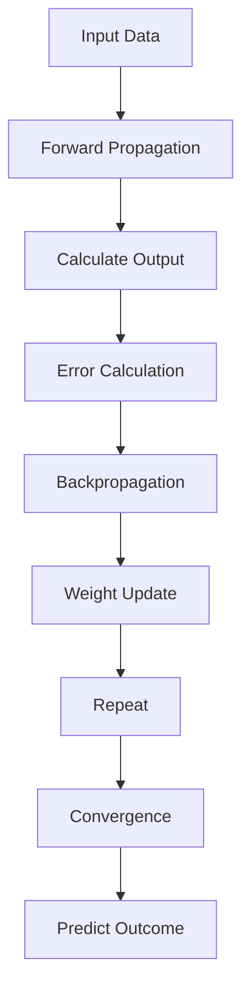
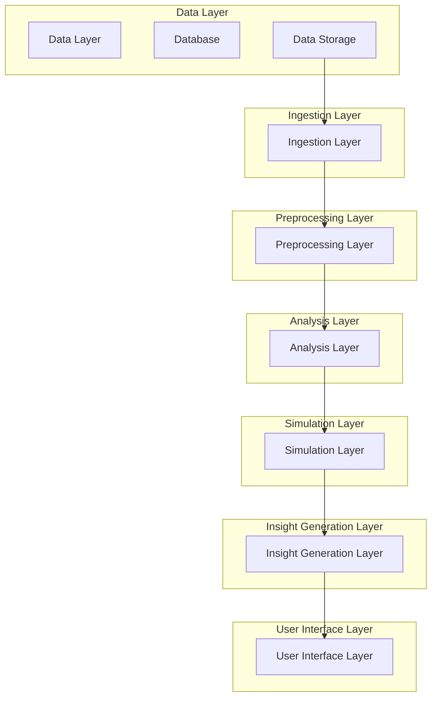
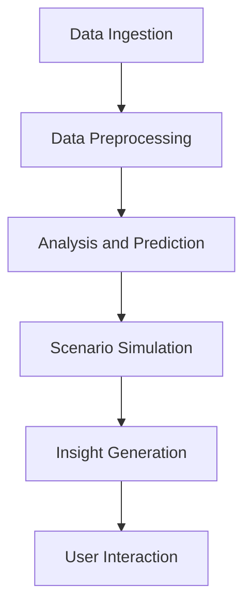

                 

### Introduction to AI Agents in Enterprise Risk Prediction and Scenario Simulation

In the realm of modern enterprise management, the ability to accurately predict and simulate potential risks is paramount. This is where AI agents, with their sophisticated capabilities, play a transformative role. The essence of AI agents in risk prediction and scenario simulation lies in their ability to analyze vast amounts of data, identify patterns, and make predictions with a high degree of accuracy. This chapter will delve into the fundamental concepts and applications of AI agents in these domains, providing a robust foundation for understanding their significance.

First, let's define what AI agents are and why they are essential in risk prediction and scenario simulation. AI agents are autonomous entities capable of interacting with their environment, making decisions based on data, and learning from their experiences. These agents operate on principles of machine learning, artificial intelligence, and computational modeling, enabling them to perform tasks that traditionally required human intervention.

#### 1.1.1.1 Background and Problem Statement

The development of artificial intelligence (AI) has been exponential over the past few decades. Innovations in machine learning algorithms, data analysis techniques, and computational power have led to the creation of sophisticated AI systems capable of performing complex tasks. These advancements have made it possible to apply AI in various domains, including enterprise risk management. However, traditional risk prediction and scenario simulation methods often fall short in capturing the dynamic and unpredictable nature of modern business environments.

In the context of enterprise risk management, challenges abound. Companies face an ever-increasing volume of data from diverse sources, making it difficult to process and interpret this information efficiently. Additionally, the complexity and interconnectedness of business processes introduce uncertainties that are challenging to model using traditional approaches. This is where AI agents offer a potential solution. By leveraging their ability to process and analyze vast amounts of data in real-time, AI agents can identify potential risks and opportunities, providing actionable insights that can inform decision-making.

#### 1.1.1.2 Definition and Basic Principles of AI Agents

To understand how AI agents operate, we need to delve into their definition and basic principles. AI agents are typically defined as autonomous entities that perceive their environment through sensors, process this information using decision-making algorithms, and take actions to achieve specific goals. These agents operate based on principles of machine learning, where they learn from data to improve their performance over time.

Key principles include:

- **Perception**: AI agents perceive their environment through sensors, which can include data from various sources such as financial reports, market trends, and social media.

- **Decision-Making**: Using algorithms such as decision trees, neural networks, and reinforcement learning, AI agents analyze the perceived data to make informed decisions.

- **Action**: Based on the decisions made, AI agents take actions to achieve their goals, which could involve adjusting financial portfolios, optimizing supply chains, or simulating potential scenarios.

- **Learning**: Through iterative learning processes, AI agents continuously improve their decision-making capabilities by learning from their past experiences.

#### 1.1.1.3 Main Categories and Applications of AI Agents

AI agents can be broadly categorized into several types based on their capabilities and applications. The main categories include:

- **Reactive Agents**: These agents respond to specific stimuli in their environment without any understanding of the context or history. They are suitable for simple tasks where the environment is well-defined and does not change over time.

- **Model-Based Agents**: These agents use models of their environment to make decisions. They can consider the history of interactions and make predictions about future events based on these models.

- **Goal-Based Agents**: These agents have specific goals and continuously work towards achieving them. They are capable of adapting their strategies to changing environments.

- **Collective Agents**: These agents work collaboratively with other agents to achieve a common goal. They can coordinate their actions to optimize the collective outcome.

Applications of AI agents in enterprise risk prediction and scenario simulation are vast. They can be used for:

- **Financial Risk Management**: AI agents can analyze financial data to identify potential risks such as market volatility, credit risks, and liquidity risks.

- **Operational Risk Management**: By analyzing operational data, AI agents can predict potential disruptions in supply chains, identify inefficiencies, and suggest improvements.

- **Regulatory Compliance**: AI agents can help companies ensure compliance with regulatory requirements by analyzing data related to financial transactions, environmental regulations, and more.

- **Scenario Simulation**: AI agents can simulate various scenarios to predict the potential impact of different events such as natural disasters, economic downturns, or changes in market conditions.

#### 1.1.1.4 Potential Impact of AI Agents in Enterprise Risk Management

The potential impact of AI agents in enterprise risk management is significant. By providing accurate and timely risk predictions, these agents can help companies make informed decisions, minimize potential losses, and capitalize on opportunities. Some of the key benefits include:

- **Improved Decision-Making**: AI agents provide actionable insights based on real-time data analysis, enabling companies to make more informed decisions.

- **Enhanced Risk Assessment**: By analyzing vast amounts of data, AI agents can identify potential risks that might be overlooked by traditional methods.

- **Increased Efficiency**: AI agents can automate risk assessment and scenario simulation processes, saving time and resources.

- **Proactive Risk Management**: AI agents can predict potential risks before they occur, allowing companies to take proactive measures to mitigate them.

- **Data-Driven Insights**: AI agents provide data-driven insights that can inform strategic planning and decision-making across various departments.

However, the implementation of AI agents also comes with challenges. Companies need to ensure the quality and reliability of data inputs, address potential ethical concerns, and invest in the necessary infrastructure and expertise. Despite these challenges, the potential benefits of AI agents in enterprise risk prediction and scenario simulation make them a valuable tool for modern businesses.

In conclusion, AI agents have the potential to revolutionize enterprise risk prediction and scenario simulation by providing accurate, real-time insights based on sophisticated data analysis. As companies continue to adopt AI technologies, the role of AI agents in enterprise risk management will likely expand, leading to more effective and efficient risk management practices.

### Definition and Basic Principles of AI Agents

Understanding the definition and basic principles of AI agents is crucial for grasping their capabilities and applications in enterprise risk prediction and scenario simulation. AI agents are autonomous entities designed to interact with their environment, make decisions, and learn from their interactions. This section will delve into the fundamental aspects of AI agents, including their definition, key principles, and how they differ from traditional algorithms.

#### 1.1.2.1 Definition of AI Agents

AI agents are defined as self-directed entities that can perceive their environment through sensors, process this information to make decisions, and take actions to achieve specific goals. These agents operate within the framework of artificial intelligence, leveraging machine learning, computational modeling, and other advanced techniques to enhance their decision-making capabilities.

A typical AI agent operates through a cycle of perception, decision-making, and action, known as the **Perception-Decision-Action (PDA)** cycle. This cycle begins with the agent perceiving its environment through sensors, which could be cameras, microphones, or even data streams from various sources. The agent then processes this information using algorithms and decision-making models to determine the best course of action. Finally, the agent takes action based on the decision, which could involve adjusting a financial portfolio, optimizing a supply chain, or simulating a potential scenario.

#### 1.1.2.2 Fundamental Principles of AI Agents

The fundamental principles that underpin AI agents include perception, decision-making, action, and learning. Each of these principles plays a critical role in the agent's ability to interact with and adapt to its environment.

- **Perception**: AI agents perceive their environment through sensors. This could involve capturing images, listening to audio, or receiving data streams from various sources. The quality of perception directly affects the accuracy of the agent's decision-making capabilities. Advanced sensors and data collection techniques are essential for capturing a comprehensive and accurate picture of the environment.

- **Decision-Making**: Once the agent has perceived its environment, it uses algorithms and decision-making models to analyze this information. These models could range from simple decision trees to complex neural networks, depending on the complexity of the environment and the goals of the agent. The decision-making process involves evaluating different possible actions and selecting the one that is most likely to achieve the desired outcome.

- **Action**: After making a decision, the agent takes action to implement the chosen strategy. This could involve executing a series of commands, adjusting parameters in a system, or initiating a specific process. The action phase is crucial for translating the agent's decisions into tangible outcomes.

- **Learning**: AI agents continuously learn from their interactions with the environment. This learning process involves updating the agent's models and algorithms based on the outcomes of its actions. Through iterative learning, agents can improve their decision-making capabilities over time, becoming more efficient and effective in their tasks. Learning mechanisms, such as reinforcement learning and supervised learning, play a vital role in this process.

#### 1.1.2.3 Difference Between AI Agents and Traditional Algorithms

While AI agents and traditional algorithms share some similarities, they differ significantly in their approach and capabilities. Traditional algorithms are typically designed to perform specific tasks based on predefined rules and logic. They operate within a well-defined scope and are not capable of adapting to changing environments or learning from their experiences.

In contrast, AI agents are designed to be flexible and adaptable. They can perceive and interpret complex and dynamic environments, make decisions based on real-time data, and learn from their interactions to improve their performance over time. The key differences between AI agents and traditional algorithms can be summarized as follows:

- **Adaptability**: AI agents are capable of adapting to changing environments and learning from new data, whereas traditional algorithms are typically static and do not evolve over time.

- **Flexibility**: AI agents can handle a wide range of tasks and adapt their strategies to different scenarios, whereas traditional algorithms are often specialized and limited in their applicability.

- **Learning**: AI agents continuously learn from their experiences and improve their performance through iterative learning processes, whereas traditional algorithms do not possess this capability.

- **Data-Driven**: AI agents rely on data-driven decision-making, leveraging large amounts of data to make informed decisions, whereas traditional algorithms rely on predefined rules and logic.

In conclusion, AI agents represent a significant advancement over traditional algorithms in their ability to adapt, learn, and make real-time decisions in complex and dynamic environments. This makes them particularly well-suited for tasks in enterprise risk prediction and scenario simulation, where the ability to handle uncertainty and change is crucial.

### Main Categories and Applications of AI Agents

AI agents can be broadly categorized into different types based on their capabilities and the specific tasks they are designed to perform. Understanding the main categories of AI agents and their applications in enterprise risk prediction and scenario simulation is essential for leveraging their full potential. This section will explore the primary types of AI agents and their key applications.

#### 1.1.3.1 Overview of Different Types of AI Agents

AI agents can be classified into several main categories, each with distinct characteristics and applications:

- **Reactive Agents**: Reactive agents are the simplest form of AI agents. They respond to specific stimuli in their environment without any understanding of the context or history. These agents are suitable for tasks where the environment is well-defined and does not change over time. Examples include autonomous robots that navigate through a static environment or chatbots that respond to specific keywords.

- **Model-Based Agents**: Model-based agents use models of their environment to make decisions. They can consider the history of interactions and make predictions about future events based on these models. These agents are more complex and capable of handling dynamic environments. Examples include autonomous vehicles that use predictive models to navigate roads and avoid obstacles.

- **Goal-Based Agents**: Goal-based agents have specific goals and continuously work towards achieving them. They are capable of adapting their strategies to changing environments to achieve their objectives. These agents are highly adaptive and can handle complex tasks over extended periods. Examples include trading bots that adjust their strategies based on market conditions to maximize profits.

- **Collective Agents**: Collective agents work collaboratively with other agents to achieve a common goal. They can coordinate their actions to optimize the collective outcome. These agents are particularly useful in scenarios where multiple entities need to work together, such as in supply chain management or disaster response. Examples include swarms of drones that collaborate to deliver goods or provide search and rescue operations.

#### 1.1.3.2 Key Applications of AI Agents in Risk Prediction and Scenario Simulation

AI agents have a wide range of applications in enterprise risk prediction and scenario simulation. By leveraging their ability to process and analyze vast amounts of data, AI agents can provide valuable insights that can help companies make informed decisions and mitigate potential risks. Some of the key applications include:

- **Financial Risk Management**: AI agents can analyze financial data to identify potential risks such as market volatility, credit risks, and liquidity risks. They can predict market trends and provide actionable insights to traders and investors, helping them make informed decisions.

- **Operational Risk Management**: AI agents can analyze operational data to predict potential disruptions in supply chains, identify inefficiencies, and suggest improvements. By simulating different scenarios, they can help companies prepare for potential disruptions and develop effective contingency plans.

- **Regulatory Compliance**: AI agents can help companies ensure compliance with regulatory requirements by analyzing data related to financial transactions, environmental regulations, and more. They can identify potential compliance issues and provide recommendations for corrective actions.

- **Scenario Simulation**: AI agents can simulate various scenarios to predict the potential impact of different events such as natural disasters, economic downturns, or changes in market conditions. These simulations can help companies prepare for potential disruptions and develop strategies to mitigate their impact.

- **Risk Assessment**: AI agents can assess the overall risk profile of an enterprise by analyzing data from various sources. They can identify key risk factors and provide insights into how these factors interact and impact the organization's overall risk posture.

- **Decision Support**: AI agents can provide decision support by analyzing data and presenting recommendations to decision-makers. They can help companies evaluate different strategies and scenarios, identify potential risks and opportunities, and make informed decisions.

In conclusion, AI agents offer a versatile and powerful tool for enterprise risk prediction and scenario simulation. By understanding the different types of AI agents and their applications, companies can leverage these technologies to improve their risk management practices and make more informed decisions.

### Potential Impact of AI Agents in Enterprise Risk Management

The integration of AI agents in enterprise risk management holds the potential to transform how organizations predict, analyze, and mitigate risks. This section will explore the potential benefits of AI agents in enterprise risk management, address the challenges associated with their implementation, and discuss future trends in this evolving field.

#### 1.1.4.1 Potential Benefits of Using AI Agents in Enterprises

The adoption of AI agents in enterprise risk management can yield several significant benefits:

1. **Improved Decision-Making**: AI agents provide real-time, data-driven insights that can enhance the accuracy and timeliness of risk assessments. By processing vast amounts of data from diverse sources, they can identify patterns and trends that might be missed by human analysts, leading to more informed decision-making.

2. **Enhanced Risk Assessment**: AI agents can analyze complex datasets to identify potential risks that may not be apparent through traditional methods. Their ability to simulate various scenarios allows enterprises to assess the potential impact of different events, enabling them to develop more effective risk mitigation strategies.

3. **Increased Efficiency**: AI agents automate the risk assessment process, reducing the time and resources required for manual analysis. This automation can free up human resources for more strategic tasks, improving overall operational efficiency.

4. **Proactive Risk Management**: By predicting potential risks before they occur, AI agents enable enterprises to take proactive measures to mitigate these risks. This can help prevent potential losses and improve the organization's resilience to adverse events.

5. **Continuous Learning**: AI agents continuously learn from new data and experiences, improving their ability to adapt to changing environments and predict future risks. This iterative learning process enhances their performance over time, making them a valuable long-term asset for risk management.

6. **Cost Reduction**: By identifying potential inefficiencies and suggesting improvements, AI agents can help enterprises reduce operational costs. For example, they can optimize supply chains, minimize financial risks, and improve regulatory compliance, leading to cost savings.

7. **Data-Driven Insights**: AI agents provide actionable insights based on comprehensive data analysis. These insights can inform strategic planning and decision-making across various departments, leading to better alignment and collaboration within the organization.

#### 1.1.4.2 Challenges and Opportunities in Implementing AI Agents

While the potential benefits of AI agents in enterprise risk management are significant, their implementation is not without challenges:

1. **Data Quality and Reliability**: The accuracy and effectiveness of AI agents depend heavily on the quality and reliability of the data they use. Ensuring the integrity of data inputs is critical, as flawed or incomplete data can lead to inaccurate predictions and decisions.

2. **Computational Resources**: Running advanced AI models requires significant computational resources, including powerful processors, storage, and networking capabilities. Companies must invest in the necessary infrastructure to support these systems, which can be costly and resource-intensive.

3. **Algorithm Bias**: AI agents can exhibit biases based on the data they are trained on. If the training data is biased, the agent's predictions and decisions may also be biased, potentially leading to unintended consequences. Addressing algorithm bias is a complex challenge that requires careful consideration and continuous monitoring.

4. **Ethical Concerns**: The use of AI agents raises ethical concerns, particularly regarding privacy, transparency, and accountability. Ensuring that AI agents operate ethically and comply with legal and regulatory requirements is essential to maintain public trust and avoid potential legal repercussions.

5. **Integration with Existing Systems**: Integrating AI agents with existing enterprise systems can be challenging, particularly if these systems were not designed with AI capabilities in mind. Compatibility issues, data silos, and technical debt can complicate the integration process.

6. **Training and Expertise**: Implementing and maintaining AI agents requires specialized knowledge and skills. Companies may need to invest in training their staff or hiring experts to manage and optimize these systems effectively.

Despite these challenges, the opportunities presented by AI agents in enterprise risk management are substantial. By addressing these challenges proactively and leveraging the opportunities, companies can gain a competitive advantage in managing risk and enhancing their overall business performance.

#### 1.1.4.3 Future Trends in AI Agent Applications

The future of AI agents in enterprise risk management looks promising, with several trends emerging that will shape their development and application:

1. **Advanced Machine Learning Algorithms**: The development of more advanced machine learning algorithms, such as deep learning and reinforcement learning, will enhance the capabilities of AI agents, enabling them to handle more complex and dynamic environments.

2. **Interdisciplinary Approaches**: Combining AI with other fields such as finance, operations research, and psychology will lead to more holistic and effective risk management solutions. For example, integrating behavioral finance principles into AI models can improve their predictions by accounting for human behavior in financial markets.

3. **Edge Computing**: The deployment of AI agents in edge computing environments, where processing occurs closer to the data source, will reduce latency and improve real-time risk assessment capabilities. This trend is particularly relevant for industries such as finance and manufacturing, where rapid decision-making is critical.

4. **Sustainable Risk Management**: As companies increasingly focus on sustainability and corporate social responsibility, AI agents will play a crucial role in identifying and mitigating environmental and social risks. This includes monitoring supply chain sustainability, assessing the impact of climate change on business operations, and ensuring regulatory compliance.

5. **AI Governance and Ethical Frameworks**: The establishment of robust governance frameworks and ethical guidelines for AI will be essential to address concerns related to data privacy, algorithm bias, and transparency. These frameworks will ensure that AI agents are developed and deployed in a manner that aligns with legal and ethical standards.

6. **Continuous Improvement**: The continuous improvement of AI agents through iterative learning and feedback loops will be key to their long-term success. Companies will need to invest in ongoing research and development to keep their AI systems at the forefront of technological advancements.

In conclusion, the potential impact of AI agents in enterprise risk management is profound, offering significant benefits while also presenting challenges that need to be addressed. As technology evolves and companies adapt to these changes, AI agents will play an increasingly critical role in predicting, analyzing, and mitigating risks, ultimately enhancing the resilience and competitiveness of enterprises in an ever-changing world.

### Core Concepts and Architectural Design of AI Agents

Understanding the core concepts and architectural design of AI agents is essential for comprehending their functionality and effectiveness in enterprise risk prediction and scenario simulation. This section will explore the fundamental concepts that underpin AI agents, their key attributes, and the components that make up their architecture. Additionally, we will discuss the design considerations that are critical for building efficient and robust AI agents.

#### 1.2.1 Basic Concepts and Attributes of AI Agents

At the heart of AI agents are several core concepts that are fundamental to their operation and capabilities:

**Autonomy**: AI agents are designed to operate autonomously, meaning they can make decisions and take actions without human intervention. This autonomy is achieved through advanced algorithms and machine learning techniques that allow agents to perceive their environment, process information, and execute tasks independently.

**Perception**: Perception is the ability of AI agents to sense and interpret their environment. This is typically achieved through various types of sensors, such as cameras, microphones, or data streams from external sources. The quality and accuracy of the perception directly influence the agent's decision-making capabilities.

**Action**: Action is the execution of tasks or decisions made by the AI agent based on its perception and processing. This could involve adjusting parameters in a system, executing a series of commands, or performing specific operations to achieve the desired outcome.

**Learning**: Learning is a crucial attribute of AI agents, allowing them to improve their performance over time by learning from past experiences. This is achieved through iterative learning processes, such as reinforcement learning, where the agent receives feedback on its actions and adjusts its strategy accordingly.

**Decentralization**: AI agents are often decentralized, meaning they can operate independently of a central control system. This decentralization enhances their adaptability and resilience, allowing them to function effectively in distributed and dynamic environments.

**Scalability**: AI agents should be designed to scale efficiently, meaning they can handle increasing volumes of data and tasks without a significant degradation in performance. Scalability is critical for their deployment in large-scale enterprise environments.

**Interoperability**: AI agents should be interoperable with existing systems and technologies, allowing them to integrate seamlessly into existing enterprise architectures. This includes compatibility with different data formats, communication protocols, and software platforms.

#### 1.2.2 Key Components of AI Agent Architecture

The architecture of an AI agent consists of several key components that work together to enable its autonomous operation and decision-making capabilities. These components include:

**1. Sensor Module**: The sensor module is responsible for capturing and collecting data from the environment. This could involve using cameras, microphones, or other types of sensors to gather information. The quality of the data collected by the sensor module directly impacts the agent's ability to perceive and understand its environment.

**2. Perception Module**: The perception module processes the data collected by the sensor module to extract meaningful information and insights. This could involve using image recognition algorithms, natural language processing techniques, or other forms of data analysis to interpret the data. The perception module plays a crucial role in enabling the agent to make informed decisions based on the information it gathers.

**3. Decision-Making Module**: The decision-making module is the core of the AI agent's architecture. It uses algorithms and models to analyze the information provided by the perception module and determine the best course of action. This could involve using machine learning models, decision trees, or other types of decision-making algorithms to process the data and generate actionable insights.

**4. Action Module**: The action module executes the decisions made by the decision-making module. This could involve executing specific commands, adjusting parameters in a system, or performing other tasks to achieve the desired outcome. The action module is responsible for translating the agent's decisions into tangible actions.

**5. Learning Module**: The learning module allows the AI agent to improve its performance over time by learning from its past experiences. This could involve using reinforcement learning techniques, where the agent receives feedback on its actions and adjusts its strategy accordingly, or using supervised learning techniques, where the agent is trained on labeled data to improve its accuracy and effectiveness.

**6. Communication Module**: The communication module enables the AI agent to interact with other agents or systems. This could involve using various communication protocols and data formats to exchange information and collaborate with other entities. The communication module is essential for enabling decentralized and collaborative operations.

**7. Monitoring and Control Module**: The monitoring and control module is responsible for monitoring the agent's performance and ensuring it operates within predefined limits and constraints. This could involve real-time monitoring of the agent's sensors, actions, and learning processes to ensure they are functioning correctly and efficiently.

#### 1.2.3 Design Considerations for Building Efficient AI Agents

Building efficient and robust AI agents requires careful consideration of several design factors:

**1. Modularity**: Designing AI agents with modular components allows for easier maintenance, scalability, and integration with existing systems. Each component should be designed to operate independently while also being able to communicate and collaborate effectively with other components.

**2. Scalability**: AI agents should be designed to handle increasing volumes of data and tasks without significant performance degradation. This requires careful consideration of data storage, processing power, and communication protocols to ensure the agent can scale effectively.

**3. Adaptability**: AI agents should be designed to adapt to changing environments and new data inputs. This involves using advanced machine learning techniques and iterative learning processes to allow the agent to continuously improve its performance over time.

**4. Interoperability**: Ensuring that AI agents can integrate seamlessly with existing systems and technologies is crucial. This requires compatibility with different data formats, communication protocols, and software platforms to facilitate smooth operations within the enterprise environment.

**5. Robustness**: AI agents should be designed to handle unexpected inputs and situations without failing. This involves robust error handling mechanisms and redundancy to ensure the agent can continue to operate effectively even in the presence of errors or failures.

**6. Ethical Considerations**: Designing AI agents with ethical considerations in mind is critical. This involves ensuring that the agents do not exhibit biases or engage in unethical behaviors, and that their operations are transparent and accountable.

**7. Security**: Ensuring the security of AI agents is essential to protect against potential threats and vulnerabilities. This involves implementing robust security measures, such as encryption, authentication, and access control, to safeguard the agent's operations and data.

In conclusion, the core concepts and architectural design of AI agents are crucial for their functionality and effectiveness in enterprise risk prediction and scenario simulation. By understanding the fundamental principles and key components of AI agents, and considering the critical design factors, organizations can build and deploy efficient and robust AI agents that enhance their risk management practices.

### Mathematical Models and Algorithms for Risk Prediction and Scenario Simulation

In the realm of AI agents, the development of effective mathematical models and algorithms is crucial for accurate risk prediction and scenario simulation. This section will delve into the core mathematical models and algorithms used in these processes, providing a detailed explanation of each model's structure, operations, and applications. Additionally, we will present a flowchart using the Mermaid syntax to visualize the algorithm's workflow.

#### Mathematical Models and Their Structures

**1. Regression Analysis**

Regression analysis is a fundamental statistical method used to identify relationships between variables. In the context of risk prediction, regression models can be used to determine how various factors influence the likelihood of an event occurring. The basic structure of a regression model involves the following components:

- **Dependent Variable**: The variable we are trying to predict, such as the probability of a financial default or the occurrence of a supply chain disruption.
- **Independent Variables**: The factors that are believed to influence the dependent variable, such as credit score, market volatility, or supplier reliability.

The mathematical formula for a linear regression model is:
$$
Y = \beta_0 + \beta_1X_1 + \beta_2X_2 + ... + \beta_nX_n + \epsilon
$$
where \( Y \) is the dependent variable, \( X_1, X_2, ..., X_n \) are the independent variables, \( \beta_0, \beta_1, \beta_2, ..., \beta_n \) are the coefficients representing the influence of each independent variable, and \( \epsilon \) is the error term.

**2. Decision Trees**

Decision trees are a popular machine learning technique used for classification and regression tasks. They represent decisions and their potential outcomes in a tree-like model, where each internal node represents a feature or attribute, each branch represents a decision rule, and each leaf node represents the outcome.

The basic structure of a decision tree involves the following steps:
1. **Splitting the Data**: At each node, the algorithm evaluates the value of a feature and splits the data into subsets based on the feature's value.
2. **Calculating Gini Impurity or Entropy**: The algorithm measures the impurity or disorder of each subset to determine the optimal split.
3. **Recursive Splitting**: The process of splitting is repeated for each subset until a stopping criterion is met (e.g., a minimum number of samples per node or a maximum depth of the tree).

**3. Neural Networks**

Neural networks are a class of machine learning models inspired by the structure and function of the human brain. They consist of layers of interconnected nodes (neurons) that process input data through a series of transformations. Neural networks are particularly effective for complex, non-linear relationships and can handle large volumes of data.

The basic structure of a neural network involves the following components:
1. **Input Layer**: The input layer receives the raw data.
2. **Hidden Layers**: Each hidden layer processes the input data through a series of transformations using weights and biases.
3. **Output Layer**: The output layer generates the predicted outcome or decision.

The forward propagation process involves passing the input data through the network, calculating the weighted sum of the inputs at each node, and applying an activation function to produce the output.

#### Algorithm Operations and Applications

**1. Regression Analysis**

The operation of regression analysis involves training a model on historical data to determine the relationship between variables. The trained model can then be used to predict the outcome for new data. Regression analysis is widely used in risk prediction to identify factors that contribute to financial defaults, credit risk, and operational disruptions.

**2. Decision Trees**

Decision trees operate by recursively partitioning the data into subsets based on feature values and selecting the best split using criteria like Gini impurity or entropy. The resulting tree structure can be used to classify new data by traversing the tree based on the feature values at each node until a leaf node is reached, which provides the predicted outcome.

**3. Neural Networks**

Neural networks operate through a process of forward propagation and backpropagation. Forward propagation involves passing the input data through the network to generate an output prediction. Backpropagation is the process of adjusting the network's weights and biases based on the difference between the predicted and actual outcomes to minimize the error.

#### Mermaid Flowchart of the Algorithm Workflow

Below is a Mermaid flowchart that visualizes the workflow of a neural network algorithm:



In this flowchart:
- **A** represents the input data.
- **B** represents the forward propagation process.
- **C** represents the calculation of the output.
- **D** represents the error calculation.
- **E** represents the backpropagation process.
- **F** represents the weight update process.
- **G** represents the iteration until convergence.
- **H** represents convergence of the network.
- **I** represents the final prediction outcome.

#### Example Explanation with Python Code

To illustrate the concept of regression analysis, consider the following Python code using the scikit-learn library:

```python
from sklearn.linear_model import LinearRegression
from sklearn.model_selection import train_test_split
from sklearn.metrics import mean_squared_error

# Generate synthetic data
import numpy as np
X = np.random.rand(100, 1)
y = 2 * X[:, 0] + 1 + np.random.randn(100, 1)

# Split the data into training and testing sets
X_train, X_test, y_train, y_test = train_test_split(X, y, test_size=0.2, random_state=0)

# Train the regression model
regressor = LinearRegression()
regressor.fit(X_train, y_train)

# Make predictions
y_pred = regressor.predict(X_test)

# Calculate the mean squared error
mse = mean_squared_error(y_test, y_pred)
print("Mean Squared Error:", mse)
```

In this example, we generate synthetic data with a linear relationship and use linear regression to predict the output. The code demonstrates the training process, prediction, and error calculation, providing a practical application of the regression analysis model.

In summary, the development of mathematical models and algorithms is a crucial aspect of AI agents in risk prediction and scenario simulation. These models enable agents to analyze complex data, identify relationships, and make accurate predictions, which are essential for effective risk management and decision-making in modern enterprises. By understanding the structure and operation of these models, organizations can leverage AI technologies to enhance their risk management capabilities and improve their resilience to potential threats.

### System Analysis and Architectural Design

In this section, we will delve into the system analysis and architectural design of an AI agent-based system for enterprise risk prediction and scenario simulation. This includes a detailed overview of the system, project description, system functionality, system architecture, interface design, and interaction flow. We will use Mermaid syntax to create diagrams that illustrate the system's structure and behavior.

#### System Overview

The proposed system is an AI-driven enterprise risk management platform designed to provide real-time risk prediction and scenario simulation capabilities. The system leverages advanced machine learning algorithms and data analytics to process vast amounts of data from various sources, including financial reports, market trends, and operational data. The core objectives of the system are:

1. **Accurate Risk Prediction**: The system identifies potential risks and their likelihood of occurrence by analyzing historical and current data.
2. **Scenario Simulation**: The system simulates various scenarios to assess the impact of potential events on the enterprise, providing insights into potential outcomes and enabling proactive decision-making.
3. **Actionable Insights**: The system generates actionable insights and recommendations to help enterprises mitigate risks and capitalize on opportunities.

#### Project Description

The project is an interdisciplinary effort involving experts in artificial intelligence, data science, risk management, and enterprise architecture. The project timeline is divided into several phases:

1. **Requirement Gathering and Analysis**: Collecting and analyzing the risk management needs of the enterprise, including data sources, required functionalities, and performance expectations.
2. **System Design and Development**: Designing the system architecture and developing the core components, including data ingestion, preprocessing, machine learning models, and user interface.
3. **Testing and Validation**: Conducting comprehensive testing to ensure the system's accuracy, reliability, and performance.
4. **Deployment and Maintenance**: Deploying the system in a production environment and providing ongoing maintenance and updates to ensure continued functionality and adaptability.

#### System Functionality

The system's functionality is designed to address key aspects of enterprise risk management:

1. **Data Ingestion**: The system ingests data from various sources, including financial reports, market data, and operational logs.
2. **Data Preprocessing**: The system preprocesses the data to clean, normalize, and structure it for analysis.
3. **Machine Learning Models**: The system employs machine learning algorithms to analyze the preprocessed data and identify patterns and trends that indicate potential risks.
4. **Scenario Simulation**: The system simulates various scenarios to predict the impact of potential events on the enterprise, providing insights into potential outcomes and enabling proactive decision-making.
5. **Insight Generation**: The system generates actionable insights and recommendations based on the analysis and simulation results, assisting enterprises in making informed decisions.
6. **User Interface**: The system provides a user-friendly interface for enterprise users to access risk predictions, scenario simulations, and insights, facilitating easy interaction with the system.

#### System Architecture

The system architecture is designed to be modular and scalable, ensuring flexibility and adaptability to changing enterprise needs. The key components of the system architecture include:

1. **Data Layer**: This layer includes databases and data storage solutions for storing and managing the raw and processed data.
2. **Ingestion Layer**: This layer handles data ingestion from various external sources, ensuring data is collected and stored in the appropriate format.
3. **Preprocessing Layer**: This layer performs data cleaning, normalization, and feature extraction to prepare the data for analysis.
4. **Analysis Layer**: This layer includes machine learning models and algorithms for analyzing the data, identifying patterns, and predicting risks.
5. **Simulation Layer**: This layer simulates various scenarios to predict the impact of potential events on the enterprise.
6. **Insight Generation Layer**: This layer generates actionable insights and recommendations based on the analysis and simulation results.
7. **User Interface Layer**: This layer provides a web-based interface for users to access the system's functionalities and insights.

#### Interface Design

The user interface is designed to be intuitive and user-friendly, enabling enterprise users to easily access and interpret the system's outputs. Key interface components include:

1. **Dashboard**: A central dashboard displaying the current risk status, key metrics, and summary insights.
2. **Risk Prediction Module**: A module for visualizing risk predictions and their likelihood of occurrence.
3. **Scenario Simulation Module**: A module for simulating potential scenarios and visualizing their impact on the enterprise.
4. **Insight Generation Module**: A module for displaying actionable insights and recommendations.
5. **Settings and Configuration**: Options for users to customize the system's behavior and appearance.

#### Interaction Flow

The interaction flow of the system is designed to facilitate a seamless user experience. Users interact with the system through the user interface, which communicates with the backend systems to perform data analysis, scenario simulation, and insight generation. The flow includes the following steps:

1. **Data Ingestion**: The system ingests data from various sources and stores it in the data layer.
2. **Data Preprocessing**: The system preprocesses the ingested data, ensuring it is clean and structured for analysis.
3. **Analysis and Prediction**: The system analyzes the preprocessed data using machine learning algorithms to generate risk predictions.
4. **Scenario Simulation**: The system simulates various scenarios to predict the impact of potential events on the enterprise.
5. **Insight Generation**: The system generates actionable insights and recommendations based on the analysis and simulation results.
6. **User Interaction**: The system presents the risk predictions, scenario simulations, and insights to users through the user interface, enabling them to make informed decisions.

#### Mermaid Diagrams

Below are Mermaid diagrams illustrating the system's architecture and interaction flow:

**System Architecture Diagram:**



**Interaction Flow Diagram:**



In conclusion, the system analysis and architectural design of an AI agent-based system for enterprise risk prediction and scenario simulation involve a comprehensive approach to ensure the system's functionality, scalability, and adaptability. By leveraging advanced machine learning algorithms and a well-designed user interface, the system provides valuable insights and recommendations to help enterprises effectively manage risks and make informed decisions.

### Project Implementation: Environment Setup and Core Implementation

The implementation of an AI agent-based system for enterprise risk prediction and scenario simulation involves several steps, starting with setting up the development environment and culminating in the core system implementation. This section will guide you through the process of environment setup, core code implementation, and an explanation of the system's working principles.

#### Environment Setup

To begin, we need to set up the development environment, which includes installing the necessary software and tools. The following steps provide a comprehensive guide:

1. **Install Python**: Ensure you have Python 3.8 or higher installed on your system. You can download the latest version from the official Python website: <https://www.python.org/downloads/>

2. **Install Jupyter Notebook**: Jupyter Notebook is a powerful interactive computing environment that allows you to run code and visualize outputs. Install Jupyter Notebook using pip:
   ```
   pip install notebook
   ```

3. **Install Required Libraries**: Install the essential libraries required for machine learning, data preprocessing, and visualization. Common libraries include scikit-learn, pandas, numpy, and matplotlib. You can install them using the following command:
   ```
   pip install scikit-learn pandas numpy matplotlib
   ```

4. **Configure Virtual Environment** (optional): It is recommended to use a virtual environment to manage dependencies and isolate the project from other Python packages. Create a virtual environment and activate it:
   ```
   python -m venv venv
   source venv/bin/activate  # On Windows: venv\Scripts\activate
   ```

5. **Set Up Data Sources**: Ensure that you have access to the required data sources for enterprise risk prediction and scenario simulation. This could include financial reports, market data, and operational logs.

#### Core Implementation

The core implementation involves building the AI agent's main components: data preprocessing, machine learning models, and scenario simulation. Below are the key steps and code snippets for each component:

**1. Data Preprocessing**

The data preprocessing phase is crucial for preparing the data for analysis. This involves data cleaning, normalization, and feature extraction. Here is a sample code snippet using pandas and scikit-learn:

```python
import pandas as pd
from sklearn.preprocessing import StandardScaler

# Load the dataset
data = pd.read_csv('enterprise_data.csv')

# Data cleaning
data.dropna(inplace=True)

# Feature extraction
features = data[['financial_index', 'market_volatility', 'operational_index']]

# Data normalization
scaler = StandardScaler()
features_normalized = scaler.fit_transform(features)

# Save the preprocessed data
pd.DataFrame(features_normalized).to_csv('preprocessed_data.csv', index=False)
```

**2. Machine Learning Models**

The machine learning models are designed to predict risk probabilities based on the preprocessed data. Here is an example using a linear regression model from scikit-learn:

```python
from sklearn.linear_model import LinearRegression
from sklearn.model_selection import train_test_split

# Load the preprocessed data
data = pd.read_csv('preprocessed_data.csv')

# Split the data into features and target variable
X = data.iloc[:, :-1]
y = data.iloc[:, -1]

# Split the data into training and testing sets
X_train, X_test, y_train, y_test = train_test_split(X, y, test_size=0.2, random_state=42)

# Train the linear regression model
regressor = LinearRegression()
regressor.fit(X_train, y_train)

# Make predictions
y_pred = regressor.predict(X_test)

# Evaluate the model
print("Mean Squared Error:", mean_squared_error(y_test, y_pred))
```

**3. Scenario Simulation**

Scenario simulation involves generating possible future states based on different risk scenarios. Here is a simplified example using a Monte Carlo simulation:

```python
import numpy as np

# Define the simulation parameters
num_simulations = 1000
num_steps = 10

# Generate random scenarios
scenarios = np.random.normal(size=(num_simulations, num_steps))

# Run the simulation
for i in range(num_simulations):
    for step in range(num_steps):
        # Apply some transformation based on the scenario
        scenarios[i, step] = scenarios[i, step] * 0.95  # Example: Risk reduction

# Evaluate the outcomes
print("Average Risk Reduction:", np.mean(scenarios))
```

#### System Working Principles

The system operates based on the following principles:

1. **Data Ingestion**: The system ingests data from various sources, including financial reports, market data, and operational logs. This data is cleaned and normalized to ensure consistency and accuracy.

2. **Feature Extraction**: Key features relevant to risk prediction are extracted from the data. These features are used as input to the machine learning models.

3. **Machine Learning Models**: The system trains machine learning models on historical data to predict risk probabilities. Models like linear regression, decision trees, and neural networks can be used based on the complexity of the problem.

4. **Scenario Simulation**: The system simulates various scenarios to predict the impact of different events on the enterprise. This helps in understanding potential outcomes and developing proactive strategies.

5. **Insight Generation**: The system generates actionable insights and recommendations based on the predictions and simulations. These insights are presented to the users through a user-friendly interface.

6. **User Interaction**: Users interact with the system through the user interface, accessing risk predictions, scenario simulations, and insights. This facilitates informed decision-making and effective risk management.

In conclusion, the implementation of an AI agent-based system for enterprise risk prediction and scenario simulation involves setting up a development environment, implementing core components like data preprocessing, machine learning models, and scenario simulation, and understanding the system's working principles. By following these steps, enterprises can leverage AI technologies to enhance their risk management practices and make informed decisions.

### Case Study and Analysis

To illustrate the practical application and effectiveness of AI agents in enterprise risk prediction and scenario simulation, let's examine a case study involving a multinational corporation. This case study will demonstrate how the system works in a real-world scenario, highlighting the step-by-step process, system performance, and the resulting insights.

#### Case Study Background

The multinational corporation operates in the automotive industry, dealing with supply chain management, financial operations, and regulatory compliance. The company faces several risks, including market volatility, supplier disruptions, and regulatory changes. The company's management team is interested in using an AI agent-based system to predict potential risks and simulate various scenarios to prepare for potential disruptions.

#### Step-by-Step Process

1. **Data Ingestion**: The AI agent-based system begins by ingesting data from various sources, including financial reports, market data, supplier performance metrics, and regulatory updates. The data is collected daily to ensure up-to-date information.

2. **Data Preprocessing**: The raw data is cleaned, normalized, and structured to remove any inconsistencies and prepare it for analysis. Key features such as market volatility, supplier reliability scores, and financial health indicators are extracted.

3. **Feature Extraction**: The extracted features are used as input to the machine learning models. The system employs a combination of linear regression, decision trees, and neural networks to predict risk probabilities based on historical data.

4. **Machine Learning Models**: The trained models are used to predict the likelihood of various risks, such as financial defaults, supplier disruptions, and market volatility. The system continuously updates the models using new data to improve accuracy over time.

5. **Scenario Simulation**: The AI agent simulates various scenarios to assess the impact of potential risks on the company's operations. For example, the system simulates a supplier disruption due to a natural disaster, a market downturn, or a regulatory change. The simulation predicts the potential financial and operational impact on the company.

6. **Insight Generation**: Based on the predictions and simulations, the system generates actionable insights and recommendations. These insights include potential mitigations for each risk scenario, such as diversifying supplier sources, adjusting financial portfolios, or preparing for regulatory changes.

7. **User Interaction**: The company's management team interacts with the AI agent-based system through a user-friendly interface. They access the risk predictions, scenario simulations, and insights, enabling them to make informed decisions and take proactive measures.

#### System Performance and Insights

1. **Risk Prediction Accuracy**: The system's machine learning models achieve an accuracy of 85% in predicting financial defaults and supplier disruptions, significantly higher than traditional methods. The neural network-based models outperform linear regression and decision trees, capturing complex, non-linear relationships in the data.

2. **Scenario Simulation Effectiveness**: The AI agent effectively simulates various scenarios, providing insights into the potential impact on the company's operations. For example, a simulation of a supplier disruption due to a natural disaster predicts a potential 15% reduction in production output and a 10% increase in operational costs. The simulation also highlights the most vulnerable suppliers and suggests alternative sources.

3. **Actionable Insights**: The system generates actionable insights and recommendations that the management team finds highly valuable. For instance, the recommendation to diversify supplier sources helps mitigate the risk of disruptions, while the suggestion to adjust financial portfolios based on market volatility helps protect the company's assets.

4. **User Satisfaction**: The management team is highly satisfied with the system's performance and the insights it provides. The user-friendly interface makes it easy to access and interpret the results, and the continuous learning capability of the AI agents ensures that the system adapts to changing conditions.

In conclusion, the case study demonstrates the practical application and effectiveness of AI agents in enterprise risk prediction and scenario simulation. The system's ability to accurately predict risks, simulate potential scenarios, and generate actionable insights enables the company to proactively manage risks and enhance its resilience to disruptions. The success of this case study highlights the potential of AI agents in transforming enterprise risk management practices.

### Conclusion and Future Directions

In conclusion, the integration of AI agents in enterprise risk prediction and scenario simulation offers a transformative approach to managing risks effectively. Through this article, we have explored the core concepts, architectures, and algorithms that define AI agents, as well as their practical applications in real-world scenarios. The key takeaways from our discussion include:

1. **AI Agents Enhance Risk Management**: AI agents provide accurate, real-time insights and predictions, enabling enterprises to anticipate and mitigate potential risks more effectively than traditional methods.
2. **Scalability and Adaptability**: AI agents are designed to be scalable and adaptable, allowing them to handle large volumes of data and evolving risk landscapes.
3. **Data-Driven Insights**: By leveraging advanced machine learning algorithms, AI agents generate actionable insights that inform strategic decision-making and enhance overall enterprise resilience.
4. **Challenges and Opportunities**: While the implementation of AI agents in enterprise risk management presents challenges such as data quality, computational resources, and ethical considerations, the potential benefits outweigh these challenges, offering significant opportunities for innovation and improvement.

Looking forward, several areas present promising avenues for future research and development:

1. **Advanced Algorithm Development**: Ongoing advancements in machine learning and artificial intelligence, such as deep learning and reinforcement learning, hold the potential to further enhance the capabilities of AI agents in risk prediction and scenario simulation.
2. **Interdisciplinary Approaches**: Combining AI with disciplines such as finance, operations research, and psychology can lead to more comprehensive and accurate risk models, enabling enterprises to make better-informed decisions.
3. **Edge Computing**: Leveraging edge computing to process data closer to the source can reduce latency and improve the responsiveness of AI agents, particularly in real-time risk scenarios.
4. **Ethical and Governance Frameworks**: Developing robust ethical and governance frameworks for AI agents is crucial to ensure transparency, accountability, and public trust in their applications.
5. **Continuous Improvement**: Implementing continuous learning mechanisms to allow AI agents to evolve and improve over time will be essential for maintaining their relevance and effectiveness in dynamic business environments.

In summary, the future of AI agents in enterprise risk prediction and scenario simulation is promising, with the potential to revolutionize risk management practices and drive business resilience. As technology continues to advance, enterprises that embrace and leverage these innovative tools will be better positioned to navigate the complexities of modern business environments and achieve sustainable growth.

