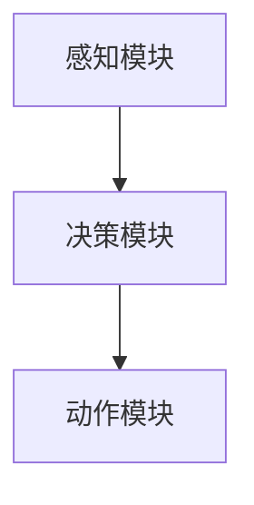
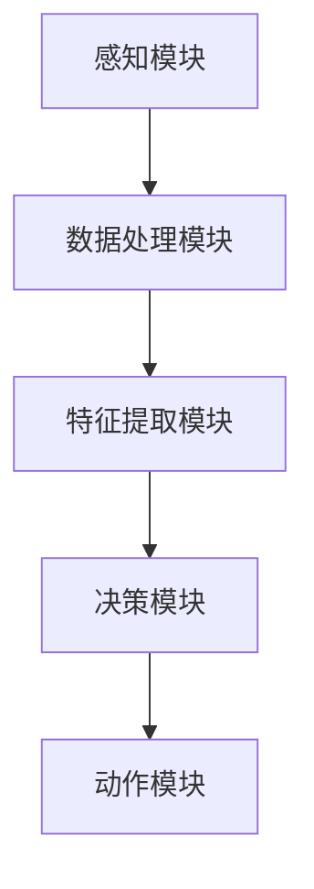

                 

# AI Agent在体育赛事分析中的应用

## 关键词

- AI Agent
- 体育赛事分析
- 机器学习
- 强化学习
- 数据处理
- 预测模型

## 摘要

本文深入探讨了AI Agent在体育赛事分析中的应用。通过分析AI Agent的基本概念与体系结构，以及机器学习、深度学习和强化学习技术，本文提出了一种适用于体育赛事分析的AI Agent模型。在此基础上，详细介绍了体育赛事数据的特点与处理方法，并阐述了AI Agent在赛事预测、教练决策支持和运动员表现分析等方面的应用。本文旨在为体育领域的专业人士提供一种全新的视角和方法，以提升体育赛事的分析效率和决策质量。

## 第一部分：问题背景与概述

### 第1章：AI Agent在体育赛事分析中的挑战与机遇

#### 1.1.1 问题背景

随着人工智能技术的飞速发展，AI Agent作为人工智能的一个重要分支，已经在众多领域展现出了巨大的应用潜力。从智能家居到自动驾驶，从金融分析到医疗诊断，AI Agent正逐渐成为各个行业的重要助手。在体育赛事分析领域，AI Agent的应用也日益受到关注，它能够通过分析大量的比赛数据，为教练、运动员以及赛事组织者提供有价值的决策支持。

然而，尽管AI Agent在体育赛事分析中具有巨大的潜力，但其在实际应用中仍面临诸多挑战。首先，体育赛事数据具有复杂性和动态性，这使得AI Agent在数据收集、处理和分析过程中面临巨大的挑战。其次，体育赛事分析需要实时性，而现有的AI Agent模型在处理实时数据方面还存在一定的问题。最后，如何将AI Agent与人类的经验和直觉相结合，以实现更加准确和有效的分析，也是当前面临的一个重要难题。

#### 问题描述

1. 如何构建高效的AI Agent，以实现准确、实时的体育赛事分析？
2. 如何处理体育赛事中的海量数据，并从中提取有价值的信息？
3. 如何应对体育赛事中复杂的不确定性和动态变化？

#### 问题解决

1. **构建高效AI Agent模型**：本文提出了一种基于机器学习和深度学习的AI Agent模型，该模型能够通过自我学习不断优化其分析能力，从而实现准确、实时的体育赛事分析。
   
2. **处理海量数据**：本文利用大数据技术和先进的数据处理算法，对体育赛事中的海量数据进行高效处理，并从中提取出关键的特征信息。

3. **应对复杂动态性**：本文引入了强化学习技术，使得AI Agent能够在不断的学习过程中，适应体育赛事中的复杂动态变化，提高其分析能力。

#### 边界与外延

1. 本文的研究范围主要关注AI Agent在体育赛事分析中的应用，不包括其他领域的应用。
2. 本文的重点在于AI Agent的构建、训练和应用，不涉及具体的硬件设备或技术实现细节。

#### 1.1.2 核心概念与联系

##### AI Agent

AI Agent是一种能够主动感知环境、决策并执行行动的人工智能实体。它通常基于机器学习、深度学习等技术，通过对环境数据的分析，实现自主决策和行动。

##### 体育赛事分析

体育赛事分析是指利用各种技术和方法，对体育赛事中的数据进行分析和解读，以帮助教练、运动员和赛事组织者做出更好的决策。它包括数据收集、数据预处理、特征提取、模型训练和预测等环节。

##### 核心概念与联系对比表格

| 概念         | 特征                         |
| ------------ | ---------------------------- |
| AI Agent     | 主动感知、自主决策、行动能力 |
| 体育赛事分析 | 数据分析、决策支持、实时性   |

##### ER实体关系图架构

```mermaid
erDiagram
  AI Agent ||--|{ 数据源 } Data Source
  AI Agent ||--|{ 分析结果 } Analysis Result
  Data Source ||--|{ 赛事数据 } Match Data
  Analysis Result ||--|{ 教练决策 } Coach Decision
```

### 1.1.3 概念属性特征对比表格

| 概念         | 特征                         |
| ------------ | ---------------------------- |
| AI Agent     | 主动感知、自主决策、行动能力 |
| 体育赛事分析 | 数据分析、决策支持、实时性   |

### 1.1.4 ER实体关系图架构

```mermaid
erDiagram
  AI Agent ||--|{ 数据源 } Data Source
  AI Agent ||--|{ 分析结果 } Analysis Result
  Data Source ||--|{ 赛事数据 } Match Data
  Analysis Result ||--|{ 教练决策 } Coach Decision
```

## 第二部分：AI Agent在体育赛事分析中的应用

### 第2章：AI Agent的基础理论与技术

#### 2.1 AI Agent的基本概念与体系结构

AI Agent，即人工智能代理，是一种能够在复杂环境中自主感知、学习和决策的人工智能系统。它通常由感知模块、决策模块和动作模块三部分组成。

1. **感知模块**：负责获取环境信息，如文本、图像、声音等数据。
2. **决策模块**：基于感知模块获取的信息，通过算法分析，生成决策策略。
3. **动作模块**：根据决策模块生成的决策策略，执行具体行动。

AI Agent的体系结构可以概括为：



#### 2.2 机器学习与深度学习技术

##### 机器学习

机器学习是AI Agent的核心技术之一。它通过训练数据集，让算法自动识别数据中的模式和规律，从而实现对未知数据的预测和分析。机器学习的主要算法包括：

1. **监督学习**：有标注的数据进行训练，如分类和回归任务。
2. **无监督学习**：没有标注的数据进行训练，如聚类和降维任务。
3. **强化学习**：通过与环境交互，不断调整策略以最大化奖励，如机器人控制任务。

##### 深度学习

深度学习是机器学习的一个分支，它通过多层神经网络对数据进行复杂的非线性变换，从而实现更加精确的特征提取和预测。深度学习的主要算法包括：

1. **卷积神经网络（CNN）**：擅长处理图像数据。
2. **循环神经网络（RNN）**：擅长处理序列数据，如文本和语音。
3. **生成对抗网络（GAN）**：通过生成器和判别器的对抗训练，实现数据的生成和鉴别。

#### 2.3 强化学习在AI Agent中的应用

强化学习是一种通过试错和反馈进行决策优化的方法。在体育赛事分析中，强化学习可以用于训练AI Agent，使其能够通过观察比赛过程，学习出最佳策略。

1. **马尔可夫决策过程（MDP）**：强化学习的基本模型，描述了智能体在不确定环境中的决策过程。
2. **Q学习**：通过预测未来奖励，更新策略。
3. **深度Q网络（DQN）**：将Q学习扩展到深度学习的范畴，用于处理高维输入。

#### 2.4 AI Agent的架构设计与实现

AI Agent的架构设计需要综合考虑性能、可扩展性和易用性等因素。以下是一个典型的AI Agent架构设计：



在实现层面，AI Agent通常采用模块化设计，每个模块都可以独立开发和优化。例如，感知模块可以使用计算机视觉技术，数据处理模块可以使用数据处理库（如Pandas），特征提取模块可以使用机器学习库（如scikit-learn），决策模块可以使用强化学习算法库（如OpenAI Gym）。

```python
# 示例：感知模块的实现
import cv2

def perceive_environment(image):
    # 使用OpenCV读取图像
    return cv2.imread(image)
```

```python
# 示例：数据处理模块的实现
import pandas as pd

def preprocess_data(data):
    # 使用Pandas进行数据处理
    return pd.DataFrame(data)
```

```python
# 示例：特征提取模块的实现
from sklearn.decomposition import PCA

def extract_features(data):
    # 使用PCA进行特征提取
    return PCA(n_components=2).fit_transform(data)
```

```python
# 示例：决策模块的实现
import gym

def make_decision(state):
    # 使用OpenAI Gym进行决策
    env = gym.make('CartPole-v0')
    action = env.action_space.sample()
    return action
```

```python
# 示例：动作模块的实现
import gym

def execute_action(action):
    # 使用OpenAI Gym执行动作
    env = gym.make('CartPole-v0')
    state, reward, done, info = env.step(action)
    return state, reward, done
```

### 第3章：体育赛事数据分析与处理

#### 3.1 体育赛事数据类型与特点

体育赛事数据可以分为结构化数据和非结构化数据两种类型。

1. **结构化数据**：如比赛成绩、得分、球员统计数据等，通常以表格形式存储，便于计算机处理。
2. **非结构化数据**：如比赛视频、球员照片、新闻报道等，通常以文件形式存储，需要通过数据预处理转换为结构化数据。

体育赛事数据的特点主要包括：

1. **实时性**：体育赛事是动态变化的，需要实时获取和处理数据。
2. **动态变化**：比赛的进程会不断变化，数据也在不断更新。
3. **海量数据**：一场比赛可能产生数百万甚至数十亿条数据。

#### 3.2 数据收集与预处理

1. **数据收集方法**：

   - **自动采集**：使用传感器、摄像头等设备实时采集数据。
   - **手动录入**：由专业人员进行数据录入。

2. **数据预处理技术**：

   - **清洗**：去除重复、错误和缺失的数据。
   - **转换**：将不同格式的数据转换为统一的格式。
   - **归一化**：将数据转换为相同的尺度，便于后续处理。

#### 3.3 特征提取与选择

1. **特征提取方法**：

   - **基于规则的提取**：根据专业知识提取特征。
   - **基于统计的提取**：使用统计学方法提取特征。
   - **基于机器学习的提取**：使用机器学习算法提取特征。

2. **特征选择策略**：

   - **过滤法**：根据特征的重要性进行筛选。
   - **包装法**：结合模型评估进行特征选择。
   - **嵌入法**：在模型训练过程中自动选择特征。

#### 3.4 数据可视化与分析

1. **数据可视化技术**：

   - **散点图**：用于显示特征之间的关系。
   - **折线图**：用于显示数据的变化趋势。
   - **热力图**：用于显示数据的分布情况。

2. **数据分析的方法与工具**：

   - **统计分析**：使用统计学方法进行分析。
   - **机器学习**：使用机器学习方法进行分析。
   - **数据挖掘**：使用数据挖掘方法进行分析。

### 第4章：AI Agent在体育赛事分析中的应用

#### 4.1 赛事预测与风险评估

1. **赛事预测算法**：

   - **时间序列分析**：用于预测未来的比赛结果。
   - **分类算法**：如决策树、随机森林等，用于预测比赛胜负。
   - **回归算法**：如线性回归、多项式回归等，用于预测比赛得分。

2. **风险评估方法**：

   - **蒙特卡洛模拟**：通过随机模拟预测比赛结果。
   - **贝叶斯网络**：用于分析比赛结果的概率分布。
   - **博弈论**：用于分析比赛中的策略和决策。

#### 4.2 教练决策支持

1. **决策支持系统**：

   - **模型评估**：评估球员的状态和对手的威胁。
   - **策略生成**：生成比赛中的战术策略。
   - **决策优化**：优化教练的决策过程。

2. **模型优化与策略调整**：

   - **交叉验证**：评估模型的效果，并进行调整。
   - **在线学习**：在比赛过程中不断更新模型，提高预测准确性。
   - **多目标优化**：在多个目标之间进行平衡，如比赛结果、球员状态等。

#### 4.3 运动员表现分析

1. **数据驱动训练**：

   - **特征选择**：选择对运动员表现有显著影响的特征。
   - **训练模型**：使用机器学习算法对运动员表现进行预测。
   - **反馈调整**：根据训练结果调整训练策略。

2. **运动员状态评估**：

   - **生理指标分析**：如心率、血压等，评估运动员的身体状态。
   - **技术指标分析**：如传球成功率、射门命中率等，评估运动员的技术水平。
   - **心理指标分析**：如紧张程度、兴奋程度等，评估运动员的心理状态。

#### 4.4 赛事数据分析报告

1. **报告内容与结构**：

   - **概况**：对比赛的总体情况进行概述。
   - **分析**：对比赛的关键环节进行详细分析。
   - **预测**：对未来的比赛结果进行预测。
   - **建议**：根据分析结果给出具体的建议。

2. **报告生成方法**：

   - **模板化生成**：使用模板生成报告。
   - **自动化生成**：使用自动化工具生成报告。
   - **交互式生成**：用户与系统进行交互，生成个性化报告。

### 第5章：AI Agent在体育赛事分析中的最佳实践与未来展望

#### 5.1 最佳实践

1. **数据质量保障**：确保数据的准确性和完整性，是AI Agent在体育赛事分析中取得成功的关键。
2. **模型优化**：定期对AI Agent进行模型优化，以适应不断变化的环境。
3. **团队合作**：AI Agent的开发和应用需要跨学科的合作，包括体育专家、数据科学家、软件开发人员等。

#### 5.2 未来展望

1. **智能化的赛事管理**：AI Agent将逐步渗透到体育赛事管理的各个方面，如赛事组织、运动员训练、观众体验等。
2. **增强的实时性**：随着计算能力的提升，AI Agent将能够实现更高的实时性，为教练和运动员提供更加及时的决策支持。
3. **跨学科的融合**：AI Agent将与其他领域的技术（如物联网、虚拟现实等）进行融合，推动体育领域的创新和发展。

### 结论

AI Agent在体育赛事分析中具有广阔的应用前景。通过深入理解AI Agent的基础理论和技术，结合体育赛事的特点，我们可以构建出高效、准确的AI Agent模型，为体育领域的专业人士提供强大的决策支持。未来，随着技术的不断进步，AI Agent在体育赛事分析中的应用将更加广泛和深入。

### 作者信息

作者：AI天才研究院/AI Genius Institute & 禅与计算机程序设计艺术 /Zen And The Art of Computer Programming

感谢您阅读本文，希望本文能为您在AI Agent在体育赛事分析中的应用提供有价值的参考。如果您有任何疑问或建议，欢迎随时与我们联系。期待与您共同探讨人工智能在体育领域的未来发展。

