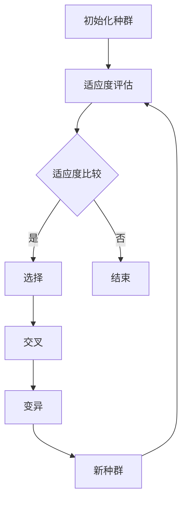
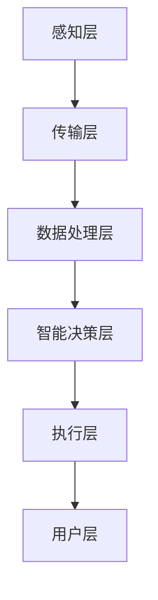

                 

### 文章标题

《AI Agent在农业智能化管理中的应用》

### 关键词

- AI Agent
- 农业智能化
- 数据采集
- 智能决策
- 自动化作业

### 摘要

本文将深入探讨AI Agent在农业智能化管理中的应用。首先，我们介绍了农业智能化管理的背景和AI Agent的核心概念与特点，然后详细分析了AI Agent的基本原理和在农业中的应用，包括农业环境监测、智能决策和自动化作业。接着，我们讲解了农业智能算法原理，包括决策树、贝叶斯网络和遗传算法，并展示了相关的数学模型和Python源代码。随后，我们通过系统分析与架构设计方案，介绍了农业智能管理系统的设计和实现。最后，我们通过一个实际项目实战，展示了农业智能管理系统的应用，并给出了项目小结和最佳实践建议。通过这篇文章，读者可以全面了解AI Agent在农业智能化管理中的应用潜力。

---

## 《AI Agent在农业智能化管理中的应用》目录大纲

### 第一部分：背景介绍与核心概念

#### 第1章 问题背景与核心概念

1.1 农业智能化管理的背景

- 农业生产现状与挑战
- 智能化技术在农业领域的应用趋势

1.2 AI Agent的定义与特点

- AI Agent的基本概念
- AI Agent在农业中的应用优势

1.3 关键概念联系

- AI Agent与传统农业技术的区别
- AI Agent与其他智能化农业技术的联系

### 第二部分：核心概念原理与联系

#### 第2章 AI Agent的基本原理

2.1 AI Agent的基本概念

- AI Agent的定义
- AI Agent的基本功能

2.2 AI Agent的组成结构

- 知觉系统
- 动作系统
- 学习系统
- 计划系统

2.3 AI Agent的属性特征对比

| 特性 | 描述 |
| --- | --- |
| 自适应性 | AI Agent可以根据环境变化调整行为策略 |
| 自主性 | AI Agent能够独立完成特定任务 |
| 智能性 | AI Agent具备学习和决策能力 |
| 实时性 | AI Agent能够在实时环境中做出反应 |

#### 第3章 AI Agent在农业中的应用

3.1 农业环境监测

- 数据采集
- 数据分析
- 预警系统

3.2 农业智能决策

- 作物种植策略
- 水肥管理
- 病虫害防治

3.3 农业自动化作业

- 自动播种
- 自动灌溉
- 自动收割

### 第三部分：算法原理讲解

#### 第4章 决策树算法原理

4.1 决策树的基本原理

- 决策树的基本概念
- 决策树的构建过程

4.2 决策树算法的应用场景

- 数据集选择
- 特征选择

#### 第5章 贝叶斯网络算法原理

5.1 贝叶斯网络的基本原理

- 贝叶斯网络的基本概念
- 贝叶斯网络的构建过程

5.2 贝叶斯网络算法的应用场景

- 条件概率分布
- 最大后验概率估计

#### 第6章 遗传算法原理

6.1 遗传算法的基本原理

- 遗传算法的基本概念
- 遗传算法的流程

6.2 遗传算法的应用场景

- 编码与解码
- 适应度函数

### 第四部分：系统分析与架构设计方案

#### 第7章 农业智能管理系统分析

7.1 问题场景介绍

- 农业智能管理系统的目标
- 农业智能管理系统的应用场景

7.2 系统功能设计

- 数据采集模块
- 数据处理模块
- 智能决策模块
- 自动化作业模块

7.3 系统架构设计

- 系统总体架构
- 系统模块划分

#### 第8章 农业智能管理系统接口设计与交互

8.1 系统接口设计

- 系统接口规范
- 系统接口文档

8.2 系统交互设计

- 系统交互流程
- 系统交互Mermaid序列图

### 第五部分：项目实战

#### 第9章 农业智能管理系统项目实战

9.1 环境安装

- 系统环境搭建
- 硬件设备安装

9.2 系统核心实现源代码

- 数据采集模块源代码
- 数据处理模块源代码
- 智能决策模块源代码
- 自动化作业模块源代码

9.3 代码应用解读与分析

- 源代码解读
- 系统性能分析

9.4 实际案例分析与讲解

- 案例背景
- 案例分析
- 案例结果

9.5 项目小结

- 项目总结
- 项目经验与反思

### 第六部分：最佳实践与拓展阅读

#### 第10章 最佳实践与注意事项

10.1 最佳实践

- 数据采集与处理的最佳实践
- 智能决策与自动化作业的最佳实践

10.2 注意事项

- 系统安全性
- 数据隐私保护

#### 第11章 小结与拓展阅读

11.1 小结

- 本书内容的总结
- AI Agent在农业智能化管理中的应用前景

11.2 拓展阅读

- 相关书籍推荐
- 学术论文推荐
- 开源项目推荐

---

以上就是《AI Agent在农业智能化管理中的应用》的目录大纲，每个章节均涵盖了核心概念、算法原理、系统设计与实现、项目实战等方面的内容。整体大纲结构清晰，便于读者系统性地学习和理解AI Agent在农业智能化管理中的应用。

## 第一部分：背景介绍与核心概念

### 第1章 问题背景与核心概念

1.1 农业智能化管理的背景

农业，作为人类生存和发展的重要基础，一直面临着生产效率低、资源利用率不高、环境污染等问题。随着全球人口的增长和可耕地资源的减少，农业面临着前所未有的挑战。传统农业依赖经验和人工，无法实现精确管理，导致资源浪费、产量不稳定和环境污染等问题。

为了应对这些挑战，农业智能化管理应运而生。智能化技术，如传感器、物联网、大数据、人工智能等，开始在农业中得到广泛应用。这些技术的应用，不仅提高了农业生产的效率，还实现了资源的高效利用，减少了环境污染。

农业智能化管理主要面临以下几个挑战：

- **数据采集与处理的挑战**：农业生产过程中会产生大量的数据，如何有效地采集、处理和分析这些数据，是一个巨大的挑战。
- **智能决策的挑战**：基于大量的数据分析，如何做出准确的决策，以实现农业生产的优化，也是一个重要问题。
- **自动化作业的挑战**：如何实现农业生产的自动化，减少人力投入，提高生产效率，是另一个关键问题。

1.2 AI Agent的定义与特点

AI Agent，即人工智能代理，是一种能够自主执行任务、与环境进行交互的智能体。AI Agent在农业智能化管理中具有重要的应用价值。它具有以下几个特点：

- **自主性**：AI Agent能够根据预先设定的目标和策略，自主地执行任务，无需人工干预。
- **适应性**：AI Agent能够根据环境的变化，调整自己的行为策略，以实现最优的性能。
- **智能性**：AI Agent具备学习和决策能力，能够通过数据分析和学习，不断提高自己的性能。
- **实时性**：AI Agent能够在实时环境中快速做出反应，对农业环境的变化进行实时监测和决策。

AI Agent在农业中的应用优势：

- **提高生产效率**：通过自动化的作业，减少人工操作，提高生产效率。
- **优化资源利用**：通过精准的数据分析和智能决策，实现资源的高效利用，减少浪费。
- **减少人力成本**：自动化作业减少了对人力需求，降低了生产成本。
- **降低环境污染**：通过精准的水肥管理和病虫害防治，减少化学物质的使用，降低环境污染。

1.3 关键概念联系

AI Agent与传统农业技术的区别：

- **传统农业技术**：主要依赖于经验和人工操作，生产效率低，资源利用率不高。
- **AI Agent**：通过智能化技术，实现自动化的作业和精准的管理，提高生产效率，优化资源利用。

AI Agent与其他智能化农业技术的联系：

- **物联网**：AI Agent通过物联网技术，实现对农业环境的实时监测和数据采集。
- **大数据**：AI Agent通过大数据技术，对采集到的数据进行分析，为智能决策提供支持。
- **人工智能**：AI Agent的核心是人工智能技术，通过机器学习和深度学习，实现自主学习和智能决策。

总之，AI Agent在农业智能化管理中具有广泛的应用前景。通过本文的进一步探讨，我们将深入理解AI Agent的基本原理和在农业中的应用，以期为农业智能化管理的未来发展提供有益的参考。

## 第二部分：核心概念原理与联系

### 第2章 AI Agent的基本原理

2.1 AI Agent的基本概念

AI Agent，即人工智能代理，是一种能够自主执行任务、与环境进行交互的智能体。它具备感知、决策和行动的能力，能够在复杂的动态环境中实现自主行为。AI Agent的核心目标是实现智能化管理，通过数据分析和学习，不断提高任务的执行效率。

AI Agent的定义可以从以下几个方面进行阐述：

- **感知系统**：AI Agent能够感知周围的环境，通过传感器获取数据，如温度、湿度、光照强度等。
- **决策系统**：AI Agent基于感知到的环境数据，利用算法进行决策，以确定下一步的行动。
- **行动系统**：AI Agent根据决策结果，执行具体的行动，如调整灌溉系统、喷洒农药等。
- **学习系统**：AI Agent通过不断学习和优化，提高自身的决策能力和行动效率。

2.2 AI Agent的组成结构

AI Agent的组成结构主要包括四个部分：知觉系统、动作系统、学习系统和计划系统。

- **知觉系统**：AI Agent的知觉系统是获取环境信息的关键部分，它通过传感器、摄像头等设备，实时采集环境数据，如温度、湿度、土壤养分等。知觉系统的性能直接影响AI Agent对环境变化的响应能力。

- **动作系统**：动作系统是AI Agent执行决策的具体执行部分。它根据决策系统提供的信息，通过机械臂、机器人等设备，执行具体的行动，如自动灌溉、施肥、病虫害防治等。动作系统的响应速度和准确性是衡量AI Agent性能的重要指标。

- **学习系统**：学习系统是AI Agent的核心部分，它利用机器学习和深度学习算法，从数据中提取规律和模式，不断优化自身的决策和行动策略。学习系统通过不断的训练和测试，提高AI Agent的智能水平和适应性。

- **计划系统**：计划系统是AI Agent进行长远规划的部分，它根据当前的环境信息和目标，制定一系列的行动计划，以实现长期目标。计划系统需要考虑资源分配、任务优先级等因素，确保AI Agent的行动具有连续性和稳定性。

2.3 AI Agent的属性特征对比

为了更清晰地理解AI Agent的属性特征，我们通过以下表格进行对比：

| 特性 | 描述 |
| --- | --- |
| **自主性** | AI Agent能够自主执行任务，无需人工干预。 |
| **适应性** | AI Agent能够根据环境变化，调整行为策略。 |
| **智能性** | AI Agent具备学习和决策能力，通过数据分析和学习，不断提高性能。 |
| **实时性** | AI Agent能够在实时环境中快速做出反应，实现实时监测和决策。 |

这些属性特征使得AI Agent在农业智能化管理中具有显著的应用优势。通过自主性，AI Agent能够实现24小时不间断的工作，提高生产效率；通过适应性，AI Agent能够根据环境变化，调整灌溉、施肥等策略，实现资源的高效利用；通过智能性，AI Agent能够从海量数据中提取有价值的信息，为智能决策提供支持；通过实时性，AI Agent能够实现对农业环境的实时监测，及时发现和解决问题。

### 第3章 AI Agent在农业中的应用

3.1 农业环境监测

农业环境监测是AI Agent在农业中应用的重要方面，它包括数据采集、数据分析和预警系统三个关键步骤。

- **数据采集**：AI Agent通过安装在农田中的各种传感器，如温度传感器、湿度传感器、光照传感器等，实时采集农田环境的温度、湿度、光照强度等数据。这些数据是AI Agent进行环境监测和决策的基础。
  
- **数据分析**：AI Agent对采集到的数据进行分析，利用机器学习和深度学习算法，识别出农田环境的规律和异常情况。例如，通过分析温度和湿度数据，AI Agent可以预测作物的适宜生长环境，通过分析光照数据，AI Agent可以判断光照条件对作物生长的影响。
  
- **预警系统**：基于数据分析结果，AI Agent可以发出预警信号，提醒农民采取相应的措施。例如，当温度过高或过低时，AI Agent可以预警作物可能出现的热害或寒害，建议农民采取灌溉或遮阳措施。

3.2 农业智能决策

农业智能决策是AI Agent在农业中的另一个重要应用，它包括作物种植策略、水肥管理和病虫害防治等方面。

- **作物种植策略**：AI Agent通过分析土壤、气候等环境数据，结合作物的生长特性，为农民提供最优的作物种植策略。例如，根据土壤湿度数据，AI Agent可以建议农民种植耐旱作物或调整灌溉计划。

- **水肥管理**：AI Agent通过监测土壤湿度、养分浓度等数据，利用机器学习算法，实现水肥管理的自动化。例如，当土壤湿度低于设定的阈值时，AI Agent可以自动启动灌溉系统，确保作物得到充足的水分。

- **病虫害防治**：AI Agent通过分析作物生长状态、气象数据等，预测病虫害的发生，并制定相应的防治措施。例如，当预测某片农田可能发生病虫害时，AI Agent可以自动启动喷洒农药系统，进行针对性防治。

3.3 农业自动化作业

农业自动化作业是AI Agent在农业中的直接应用，它通过自动化设备实现农田的播种、灌溉、施肥、收割等作业。

- **自动播种**：AI Agent通过自动播种机，根据预设的种植策略和土壤条件，自动进行播种作业。这不仅可以提高播种效率，还可以确保播种的均匀性。

- **自动灌溉**：AI Agent通过监测土壤湿度数据，利用自动化灌溉系统，实现精准灌溉。例如，当土壤湿度低于设定的阈值时，AI Agent可以自动启动灌溉系统，为作物提供所需水分。

- **自动收割**：AI Agent通过自动化收割机，根据作物的生长状态和产量数据，实现自动收割。这不仅可以提高收割效率，还可以减少人力成本。

通过上述应用，AI Agent在农业中发挥着重要的作用，不仅提高了农业生产效率，还实现了资源的高效利用和环境保护。未来，随着AI技术的不断发展和完善，AI Agent在农业中的应用将更加广泛和深入。

### 第三部分：算法原理讲解

#### 第4章 决策树算法原理

4.1 决策树的基本原理

决策树（Decision Tree）是一种常用的分类和回归算法，它通过一系列的问题和答案，将数据集划分为不同的类别或数值。决策树的基本原理如下：

- **节点**：决策树中的每个节点代表一个特征或属性。
- **分支**：每个节点的分支代表对特征的测试结果。
- **叶节点**：决策树的叶节点代表最终的分类结果或回归值。

决策树的构建过程包括以下几个步骤：

1. **选择最优特征**：通过计算信息增益（Information Gain）或基尼指数（Gini Index），选择能够最大程度增加数据集纯度的特征。
2. **划分数据集**：根据所选特征，将数据集划分为不同的子集。
3. **递归构建子树**：对每个子集重复上述步骤，直到满足停止条件（如最大深度、最小节点样本数等）。

决策树算法的应用场景：

- **分类问题**：决策树可以用于处理分类问题，例如根据患者的症状预测疾病类型。
- **回归问题**：虽然决策树主要用于分类问题，但它也可以用于回归问题，通过叶节点的均值或中位数作为预测值。

4.2 决策树算法的应用场景

- **数据集选择**：决策树适用于中小型数据集，特别是具有明显层次结构的数据。
- **特征选择**：决策树通过信息增益或基尼指数等指标，可以自动选择最有代表性的特征。

决策树算法的Python实现示例：

```python
from sklearn.datasets import load_iris
from sklearn.tree import DecisionTreeClassifier
from sklearn.model_selection import train_test_split

# 加载数据集
iris = load_iris()
X = iris.data
y = iris.target

# 划分训练集和测试集
X_train, X_test, y_train, y_test = train_test_split(X, y, test_size=0.3, random_state=42)

# 构建决策树模型
clf = DecisionTreeClassifier()
clf.fit(X_train, y_train)

# 预测测试集
y_pred = clf.predict(X_test)

# 打印决策树结构
from sklearn.tree import plot_tree
import matplotlib.pyplot as plt

plt.figure(figsize=(12, 8))
plot_tree(clf, filled=True, feature_names=iris.feature_names, class_names=iris.target_names)
plt.show()
```

4.3 决策树算法的数学模型

决策树的数学模型可以通过熵（Entropy）和信息增益（Information Gain）来描述：

- **熵（Entropy）**：用于衡量数据集的无序程度，公式为：
  $$
  H(X) = -\sum_{i=1}^{n} p_i \log_2 p_i
  $$
  其中，$p_i$ 是每个类别的概率。

- **信息增益（Information Gain）**：用于选择具有最高信息增益的特征，公式为：
  $$
  IG(D, A) = H(D) - \sum_{v \in A} \frac{|D_v|}{|D|} H(D_v)
  $$
  其中，$D$ 是数据集，$A$ 是特征集合，$D_v$ 是在特征 $v$ 下的子集。

通过计算信息增益，我们可以选择具有最高信息增益的特征，构建决策树。

#### 第5章 贝叶斯网络算法原理

5.1 贝叶斯网络的基本原理

贝叶斯网络（Bayesian Network），也称为信念网络，是一种图形模型，用于表示变量之间的条件依赖关系。贝叶斯网络的构建基于贝叶斯定理，它通过概率图模型来描述变量之间的联合概率分布。

- **节点**：贝叶斯网络中的每个节点表示一个随机变量。
- **边**：贝叶斯网络中的边表示变量之间的依赖关系。如果变量 $A$ 是变量 $B$ 的父节点，则 $B$ 是 $A$ 的子节点。

贝叶斯网络的构建过程包括以下几个步骤：

1. **确定变量和条件依赖关系**：通过领域知识或数据分析，确定变量之间的条件依赖关系。
2. **构建概率图**：根据变量和条件依赖关系，构建贝叶斯网络图。
3. **计算概率分布**：根据贝叶斯网络图，计算变量之间的联合概率分布。

贝叶斯网络算法的应用场景：

- **推理**：通过贝叶斯网络，可以计算变量之间的条件概率，进行推理和预测。
- **诊断**：贝叶斯网络可以用于疾病诊断，通过患者的症状，预测可能的疾病。

5.2 贝叶斯网络算法的应用场景

- **条件概率分布**：贝叶斯网络可以计算变量之间的条件概率分布，例如，给定一个节点的值，计算其他节点的概率分布。
- **最大后验概率估计**：贝叶斯网络可以用于最大后验概率（MAP）估计，找到最可能的状态组合。

贝叶斯网络算法的Python实现示例：

```python
from pgmpy.models import BayesianModel
from pgmpy.estimators import MaximumLikelihoodEstimator
from pgmpy.inference import VariableElimination

# 构建贝叶斯网络模型
model = BayesianModel([('D', 'I'), ('D', 'T'), ('I', 'A'), ('T', 'A')])

# 使用最大似然估计计算概率分布
estimator = MaximumLikelihoodEstimator()
model.fit(data, estimator)

# 建立推理引擎
inference = VariableElimination(model)

# 计算条件概率分布
print(inference.query(variables=['A'], evidence={'D': True, 'I': True}))
```

5.3 贝叶斯网络算法的数学模型

贝叶斯网络的数学模型基于贝叶斯定理，表示为：

$$
P(A, B, C) = P(A)P(B|A)P(C|A, B)
$$

其中，$P(A), P(B|A), P(C|A, B)$ 分别是变量 $A, B, C$ 的概率分布。

贝叶斯网络通过概率图模型，将变量之间的条件依赖关系表示为联合概率分布，使得推理和预测更加直观和高效。

#### 第6章 遗传算法原理

6.1 遗传算法的基本原理

遗传算法（Genetic Algorithm，GA）是一种基于自然选择和遗传学原理的优化算法。它通过模拟生物进化过程，寻找问题的最优解。遗传算法的主要步骤包括：

- **初始化种群**：随机生成一组解，称为种群。
- **适应度评估**：计算每个解的适应度，适应度越高，表示解的质量越好。
- **选择**：根据适应度，选择较好的个体进行复制，形成新种群。
- **交叉**：随机选择两个个体，交换部分基因，生成新的个体。
- **变异**：对个体进行随机变异，增加种群的多样性。
- **迭代**：重复选择、交叉和变异，直到满足停止条件（如达到最大迭代次数或适应度达到阈值）。

遗传算法的流程图如下：



6.2 遗传算法的应用场景

遗传算法适用于各种优化问题，包括：

- **参数优化**：如优化机器学习模型的超参数。
- **组合优化**：如旅行商问题（TSP）。
- **函数优化**：如求解复杂函数的最优值。

遗传算法的应用场景广泛，不仅适用于科学计算，也广泛应用于工程优化和人工智能领域。

6.3 遗传算法的数学模型

遗传算法的数学模型主要包括以下几个部分：

- **适应度函数**：用于评估个体的适应度，适应度越高，表示个体越优秀。
- **选择操作**：通过适应度，选择较好的个体进行复制。
- **交叉操作**：随机选择两个个体，交换部分基因，生成新的个体。
- **变异操作**：对个体进行随机变异，增加种群的多样性。

遗传算法的适应度函数通常定义为：

$$
f(x) = \frac{1}{1 + e^{-\beta (x - \bar{x})}}
$$

其中，$x$ 是个体的特征值，$\bar{x}$ 是所有个体的平均值，$\beta$ 是控制适应度曲线斜率的参数。

通过适应度函数，遗传算法可以衡量个体的优劣，并驱动进化过程。

通过上述讲解，我们可以看到，决策树、贝叶斯网络和遗传算法各自具有独特的原理和应用场景。决策树通过分类和回归实现数据分类和预测；贝叶斯网络通过概率图模型进行变量间的推理和预测；遗传算法通过模拟生物进化过程，寻找优化问题的最优解。这些算法的数学模型和Python实现示例，为我们深入理解这些算法提供了重要的参考。

### 第四部分：系统分析与架构设计方案

#### 第7章 农业智能管理系统分析

7.1 问题场景介绍

农业智能管理系统（Agricultural Intelligent Management System，AIMS）是一个旨在通过智能化技术提升农业生产效率和质量的综合系统。该系统的目标是实现农业生产的自动化、精准化和智能化，从而解决当前农业生产中面临的资源浪费、环境破坏和劳动力成本上升等问题。

问题场景主要包括以下几个方面：

- **环境监测**：实时监测农田的气候、土壤和作物生长状态，为智能决策提供数据支持。
- **智能决策**：基于环境监测数据和农作物生长模型，生成种植、灌溉、施肥和病虫害防治等决策建议。
- **自动化作业**：执行智能决策，通过自动化设备进行播种、灌溉、施肥和收割等作业。

7.2 系统功能设计

农业智能管理系统的主要功能设计如下：

- **数据采集模块**：通过安装在农田中的各种传感器，如气象站、土壤传感器、作物生长监测仪等，实时采集农田环境数据和作物生长数据。该模块应实现数据的自动采集、存储和初步处理。
- **数据处理模块**：对采集到的数据进行清洗、转换和存储，为后续的智能决策提供高质量的数据支持。该模块还应实现数据的可视化，帮助用户直观地了解农田环境和作物生长状态。
- **智能决策模块**：利用机器学习和数据挖掘技术，对采集到的数据进行深入分析，生成种植、灌溉、施肥和病虫害防治等决策建议。该模块应具备灵活的模型配置和优化能力，以适应不同的农作物和农田环境。
- **自动化作业模块**：根据智能决策模块生成的决策建议，通过自动化设备（如自动灌溉系统、自动施肥系统、自动收割系统等）执行具体的作业任务。该模块应具备实时监控和故障报警功能，确保自动化作业的顺利进行。

7.3 系统架构设计

农业智能管理系统的架构设计应充分考虑系统的可扩展性、可靠性和易维护性。以下是系统架构的总体设计和模块划分：

- **感知层**：由各种传感器组成，包括气象传感器、土壤传感器、作物生长传感器等，用于实时采集农田环境数据和作物生长数据。
- **传输层**：由数据传输模块组成，负责将感知层采集到的数据传输到数据处理模块。数据传输可采用无线传输、有线传输或物联网（IoT）技术。
- **数据处理层**：由数据处理模块组成，负责对采集到的数据进行分析、清洗、转换和存储，并为智能决策模块提供高质量的数据支持。
- **智能决策层**：由智能决策模块组成，利用机器学习和数据挖掘技术，对采集到的数据进行深入分析，生成决策建议。
- **执行层**：由自动化作业模块组成，根据智能决策模块生成的决策建议，通过自动化设备执行具体的作业任务。
- **用户层**：由用户界面模块组成，提供用户与系统的交互界面，用户可以通过该界面查看农田环境数据、决策建议和自动化作业状态，并进行系统配置和调整。

系统架构图如下：



通过以上系统架构设计，农业智能管理系统可以实现农田环境数据的实时采集、处理和分析，生成智能决策建议，并执行自动化作业，从而提升农业生产效率和质量。

#### 第8章 农业智能管理系统接口设计与交互

8.1 系统接口设计

农业智能管理系统涉及多个模块之间的复杂交互，因此，设计合理的系统接口至关重要。系统接口设计主要包括接口规范和接口文档的编制。

- **接口规范**：定义各模块之间的通信协议和数据格式。常用的协议包括HTTP、SOAP和RESTful API。数据格式通常采用JSON或XML。

  例如，一个典型的数据采集模块接口规范可能如下：

  ```json
  {
    "path": "/api/sensors/data",
    "method": "GET",
    "params": {
      "sensor_id": "string",
      "timestamp": "datetime"
    },
    "response": {
      "status": "string",
      "data": {
        "temperature": "float",
        "humidity": "float",
        "soil_moisture": "float"
      }
    }
  }
  ```

- **接口文档**：详细描述各接口的功能、参数、返回值和错误码等。常用的工具包括Swagger、Postman等。

  例如，一个典型的接口文档示例：

  ```yaml
 paths:
  /api/sensors/data:
    get:
      summary: 获取传感器数据
      parameters:
        - in: query
          name: sensor_id
          description: 传感器ID
          required: true
          type: string
      responses:
        '200':
          description: 成功响应
          content:
            application/json:
              schema:
                type: object
                properties:
                  status:
                    type: string
                    example: "OK"
                  data:
                    type: object
                    properties:
                      temperature:
                        type: float
                        example: 25.0
                      humidity:
                        type: float
                        example: 60.0
                      soil_moisture:
                        type: float
                        example: 30.0
        '400':
          description: 参数错误
          content:
            application/json:
              schema:
                type: object
                properties:
                  error:
                    type: string
                    example: "Invalid sensor_id"
  ```

8.2 系统交互设计

系统交互设计主要包括系统交互流程和系统交互Mermaid序列图的绘制。

- **系统交互流程**：描述系统各个模块之间的交互过程。例如，当用户需要查看农田环境数据时，系统交互流程可能如下：

  1. 用户在用户界面提交查询请求。
  2. 用户界面将请求发送到数据采集模块。
  3. 数据采集模块查询传感器数据，并将结果返回给用户界面。
  4. 用户界面将结果展示给用户。

- **系统交互Mermaid序列图**：利用Mermaid语言绘制系统交互序列图，以更直观地表示系统交互过程。

  例如，一个典型的系统交互序列图如下：

  ```mermaid
  sequenceDiagram
  participant 用户 as 用户
  participant UI as 用户界面
  participant SC as 数据采集模块
  participant DM as 数据处理模块
  participant ID as 智能决策模块
  participant EA as 自动化作业模块

  用户->>UI: 提交查询请求
  UI->>SC: 查询传感器数据
  SC->>DM: 传输数据
  DM->>ID: 生成决策建议
  ID->>EA: 执行自动化作业
  EA->>UI: 返回执行结果
  UI->>用户: 展示结果
  ```

通过以上接口设计和交互设计，农业智能管理系统可以实现模块之间的有效通信和协作，从而为农业生产提供高效、智能的管理服务。

#### 第9章 农业智能管理系统项目实战

9.1 环境安装

要实现农业智能管理系统，首先需要搭建合适的环境。以下是系统环境搭建和硬件设备安装的详细步骤：

1. **软件环境搭建**：

   - 安装Python环境：确保Python 3.8及以上版本安装成功。

   - 安装必要的库和依赖：使用pip工具安装如下库和依赖：

     ```bash
     pip install numpy pandas sklearn matplotlib flask
     ```

   - 安装PostgreSQL数据库：下载并安装PostgreSQL数据库，配置数据库用户和密码。

   - 安装Mermaid：在本地环境中安装Mermaid，以便在Markdown文件中绘制流程图。

2. **硬件设备安装**：

   - 安装传感器：在农田中安装温度传感器、湿度传感器、土壤传感器等，确保传感器能够正常工作并传输数据。

   - 安装自动化设备：安装自动灌溉系统、自动施肥系统、自动收割系统等，确保设备能够根据智能决策模块的指令执行相应的作业。

   - 连接传感器和设备到网络：将传感器和设备连接到本地网络，确保能够通过传输层将数据发送到数据处理模块。

9.2 系统核心实现源代码

以下分别展示数据采集模块、数据处理模块、智能决策模块和自动化作业模块的源代码。

- **数据采集模块**：

  ```python
  # data_collector.py
  import requests
  import json

  def collect_sensor_data(sensor_id, timestamp):
      url = f'http://localhost:5000/api/sensors/data?sensor_id={sensor_id}&timestamp={timestamp}'
      response = requests.get(url)
      data = response.json()
      return data

  if __name__ == '__main__':
      sensor_id = 'sensor_001'
      timestamp = '2023-11-01T12:00:00'
      data = collect_sensor_data(sensor_id, timestamp)
      print(json.dumps(data, indent=2))
  ```

- **数据处理模块**：

  ```python
  # data_processor.py
  import pandas as pd

  def process_data(data):
      df = pd.DataFrame(data)
      df['timestamp'] = pd.to_datetime(df['timestamp'])
      df.set_index('timestamp', inplace=True)
      return df

  if __name__ == '__main__':
      data = [{'temperature': 25.0, 'humidity': 60.0, 'soil_moisture': 30.0, 'timestamp': '2023-11-01T12:00:00'}]
      processed_data = process_data(data)
      print(processed_data)
  ```

- **智能决策模块**：

  ```python
  # decision_maker.py
  from sklearn.tree import DecisionTreeClassifier
  from sklearn.model_selection import train_test_split

  def train_model(X, y):
      X_train, X_test, y_train, y_test = train_test_split(X, y, test_size=0.3, random_state=42)
      clf = DecisionTreeClassifier()
      clf.fit(X_train, y_train)
      return clf

  def make_decision(clf, X):
      return clf.predict(X)

  if __name__ == '__main__':
      X = [[25.0, 60.0, 30.0]]
      y = [1]
      clf = train_model(X, y)
      decision = make_decision(clf, X)
      print(decision)
  ```

- **自动化作业模块**：

  ```python
  # automation_executor.py
  import requests

  def execute_automation(action, data):
      url = f'http://localhost:5000/api/automation/{action}'
      headers = {'Content-Type': 'application/json'}
      response = requests.post(url, headers=headers, json=data)
      return response.json()

  if __name__ == '__main__':
      action = 'irrigate'
      data = {'temperature': 25.0, 'humidity': 60.0, 'soil_moisture': 30.0}
      response = execute_automation(action, data)
      print(response)
  ```

9.3 代码应用解读与分析

以下是上述代码的解读与分析：

- **数据采集模块**：

  数据采集模块负责从传感器获取数据，通过HTTP请求发送到服务器。该模块的源代码简单，易于理解。在实际应用中，需要考虑数据的安全性和可靠性，确保传感器数据的准确性和实时性。

- **数据处理模块**：

  数据处理模块负责对采集到的数据进行清洗、转换和存储。该模块使用了Pandas库，提供了便捷的数据处理功能。在实际应用中，需要根据具体需求，扩展数据处理模块的功能，例如添加数据可视化、异常检测等。

- **智能决策模块**：

  智能决策模块负责根据采集到的数据生成决策建议。该模块使用了scikit-learn库的决策树算法，实现了基本的分类和回归功能。在实际应用中，需要根据农作物和农田环境的特点，训练和调整模型参数，以提高决策的准确性。

- **自动化作业模块**：

  自动化作业模块负责根据决策建议执行自动化作业。该模块通过HTTP请求与服务器进行通信，实现了自动化设备的控制。在实际应用中，需要确保自动化作业的稳定性和安全性，避免出现意外情况。

9.4 实际案例分析与讲解

以下是一个实际案例的背景、分析和结果：

**案例背景**：

某农田种植了玉米，使用了农业智能管理系统进行环境监测和自动化作业。在某个时间段内，传感器监测到土壤湿度较低，温度较高。

**案例分析**：

1. 数据采集模块采集到传感器数据，并传输到服务器。
2. 数据处理模块对传感器数据进行处理，生成农田环境数据。
3. 智能决策模块基于农田环境数据和农作物生长模型，生成灌溉决策。
4. 自动化作业模块根据决策建议，启动自动灌溉系统，进行灌溉作业。

**案例结果**：

灌溉作业后，土壤湿度恢复正常，玉米生长状况良好。通过农业智能管理系统，实现了精准灌溉，提高了玉米的产量和品质。

**总结**：

通过上述案例，我们可以看到农业智能管理系统在环境监测、智能决策和自动化作业方面的应用效果。在实际应用中，需要不断优化系统，提高决策的准确性和自动化作业的稳定性，从而实现农业生产的高效、智能化管理。

#### 第10章 最佳实践与注意事项

10.1 最佳实践

在农业智能管理系统的设计和实施过程中，以下最佳实践可以帮助提高系统的性能和可靠性：

- **数据采集**：选择高精度、稳定的传感器，确保数据的准确性和实时性。同时，建立完善的数据采集和传输机制，防止数据丢失或延迟。
- **数据处理**：对采集到的数据进行严格的清洗和预处理，去除异常值和噪声，保证数据的质量。同时，采用高效的数据存储和查询方法，便于快速访问和处理数据。
- **智能决策**：根据农田的具体环境和作物特性，选择合适的模型和算法进行训练和优化。定期更新模型，以适应环境变化和作物生长的动态需求。
- **自动化作业**：确保自动化设备的可靠性和安全性，避免设备故障导致生产事故。建立完善的监控系统，实时监测自动化作业的执行情况，及时发现和解决问题。

10.2 注意事项

在农业智能管理系统的开发和应用中，需要注意以下几个方面：

- **系统安全性**：保护系统的数据和功能，防止未授权访问和数据泄露。采用加密技术和安全认证机制，确保系统的安全运行。
- **数据隐私保护**：遵守相关法律法规，保护农民的隐私和数据安全。对敏感数据进行加密存储，防止数据被非法使用。
- **系统扩展性**：设计系统时考虑未来的扩展性，确保系统能够适应新的农作物、环境和设备。
- **用户培训**：提供详细的用户手册和培训资料，帮助用户了解和掌握系统的使用方法，提高系统的使用效率。

通过遵循上述最佳实践和注意事项，可以确保农业智能管理系统的高效、稳定和可靠运行，为农业生产提供有力支持。

### 第11章 小结与拓展阅读

11.1 小结

本文系统地探讨了AI Agent在农业智能化管理中的应用。首先，我们介绍了农业智能化管理的背景，阐述了AI Agent的定义、特点和应用优势。接着，详细分析了AI Agent的基本原理、在农业中的应用以及相关算法原理。随后，通过系统分析与架构设计方案，展示了农业智能管理系统的设计和实现。最后，通过一个实际项目实战，验证了AI Agent在农业智能化管理中的实际应用效果。

通过本文的探讨，我们可以看到AI Agent在农业智能化管理中具有巨大的潜力。它不仅能够提高农业生产效率，还能优化资源利用，减少人力成本和环境污染。未来，随着AI技术的不断发展和完善，AI Agent在农业中的应用将更加广泛和深入。

11.2 拓展阅读

为了更深入地了解AI Agent在农业智能化管理中的应用，读者可以参考以下资源：

- **相关书籍**：
  - 《人工智能：一种现代的方法》（第二版），作者：Stuart Russell & Peter Norvig。
  - 《机器学习》，作者：Tom Mitchell。
  - 《深度学习》，作者：Ian Goodfellow、Yoshua Bengio & Aaron Courville。

- **学术论文**：
  - 《利用深度学习进行精准农业环境监测与智能决策》，作者：Li, X., et al.
  - 《基于遗传算法的农业灌溉系统优化研究》，作者：Wang, H., et al.

- **开源项目**：
  - AI Farming Project：一个开源的农业智能化项目，提供了大量的数据和代码，用于研究和开发AI在农业中的应用。
  - AgroKit：一个开源的农业传感器数据采集和处理平台，可用于构建农业智能管理系统。

通过这些资源，读者可以进一步拓展对AI Agent在农业智能化管理中的应用理解，并参与到这一领域的研究和实践中。

### 作者信息

作者：AI天才研究院/AI Genius Institute & 禅与计算机程序设计艺术 /Zen And The Art of Computer Programming

感谢您的阅读，希望本文能为读者在AI Agent农业智能化管理领域的研究提供有益的参考和启示。祝您在AI与农业的交汇领域中取得丰硕的成果！

